本文是 NIS4335 信息安全综合实践课程的实践实验报告，实验内容为下载 AOSP（Android Open Source Project）源代码并进行编译。

由于个人电脑硬盘空间有限，因此我使用了老师申请的 [jCould 云主机](https://home.jcloud.sjtu.edu.cn)，配置：CPU 8 核，内存 16 GB，硬盘 500 GB，千兆校园网，系统 Ubuntu22.04。

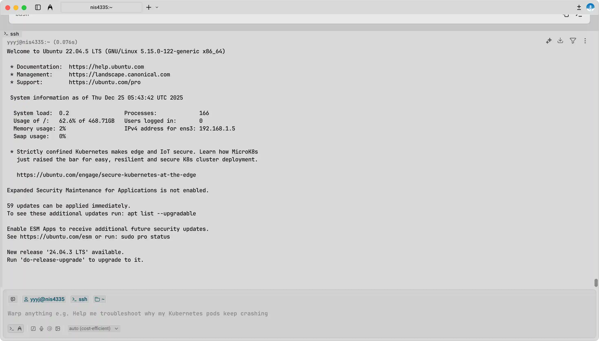

> 由于一开始没考虑到硬盘和内存的限制（仅申请了 8 GB 内存和 200 GB 硬盘），我同步了主分支并尝试编译 aosp_cf_x86_64_phone，结果反复在 soong_build 阶段 OOM，即便后来扩容到了 8 核 16 GB 内存和 500 GB 硬盘，并采取了一些操作，如增加 32 GB 的交换分区、将线程数限制为 2、改为编译更轻量的 aosp_x86_64，依然无法编译通过。
>
> 不过在编译主分支的过程中，我总结了一些经验：
>
> - 主分支代码量庞大，约占用 238 GB 硬盘空间。
> - 从某个版本起，lunch 命令已经不再支持交互式选择产品和构建类型，必须直接指定完整的参数，而具体的产品、版本和变体可以通过 list_products、list_releases 和 list_variants 命令查看。
> - 在 soong_build 阶段内存占用极高，使用双线程编译 aosp_cf_x86_64_phone 时内存+交换分区占用峰值约 42 GB，即使是编译 aosp_x86_64 时内存+交换分区占用峰值也有约 36 GB。并且双线程编译了近两小时仍在 soong_build 阶段，大概率是因为频繁使用交换分区导致性能极差。
>
> 因此我选择重新开始，改为同步 android-13.0.0_r1 分支，并编译更轻量的 aosp_x86_64，最终成功编译通过。
>
> 不过在使用模拟器运行 AOSP 时又遇到了一些问题：其一是由于 jCloud 云主机不支持 VT-x，因此无法启用 KVM 虚拟化加速，只能使用软件模拟，性能较差；其二是编译的 aosp_x86_64-eng 镜像不包含 `userdata.img` 文件，因此切换到 sdk_x86_64-eng 产品重新编译，通过该镜像启动模拟器后成功运行 AOSP。

# 下载 AOSP 源代码
参考 [Android Google 文档](https://source.android.com/setup/build/downloading)、[清华镜像站指引](https://mirrors.tuna.tsinghua.edu.cn/help/AOSP/)、[科大镜像站指引](https://mirrors.ustc.edu.cn/help/aosp.html)

<a href="https://source.android.google.cn/setup/build/downloading" target="_blank" name="https://source.android.com/_pwa/androidsource/icons/icon-144x144.png" class="LinkCard">Android Open Source Project</a>

在所有工作开始前，需要安装一些依赖包：
```bash
sudo apt-get install git-core gnupg flex bison build-essential zip curl zlib1g-dev libc6-dev-i386 x11proto-core-dev libx11-dev lib32z1-dev libgl1-mesa-dev libxml2-utils xsltproc unzip fontconfig
```

AOSP 代码使用 repo 工具管理，因此首先安装 repo 工具：
```bash
mkdir ~/aosp
PATH=~/aosp:$PATH
curl https://storage.googleapis.com/git-repo-downloads/repo > ~/bin/repo
chmod a+x ~/bin/repo
```

然后修改仓库 URL 并初始化仓库，选择 android-13.0.0_r1 分支（分支号可查询 [Build Numbers 列表](https://source.android.google.cn/docs/setup/reference/build-numbers)）：
```bash
export REPO_URL='https://mirrors.tuna.tsinghua.edu.cn/git/git-repo'
repo init -u https://mirrors.tuna.tsinghua.edu.cn/git/AOSP/platform/manifest -b android-13.0.0_r1
```

替换 remote 并使用 TUNA 源同步 AOSP 代码：
```bash
git config --global url.https://mirrors.tuna.tsinghua.edu.cn/git/AOSP/.insteadof https://android.googlesource.com
repo sync -c -j$(nproc)    # -c 仅同步当前分支
```

然后是漫长的等待，由于此前拉取主分支时已经缓存了一些对象，这次同步比较快，最终源代码大小约 207 GB.

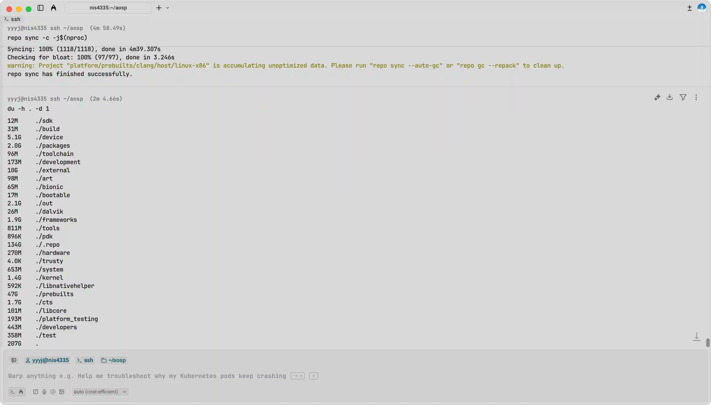

# 编译 AOSP
<a href="https://source.android.google.cn/docs/setup/build/building" target="_blank" name="https://source.android.com/_pwa/androidsource/icons/icon-144x144.png" class="LinkCard">Building AOSP</a>

进入工作目录，加载环境初始化脚本，然后选择构建目标：
```bash
cd aosp/
source build/envsetup.sh
lunch aosp_x86_64-eng
```
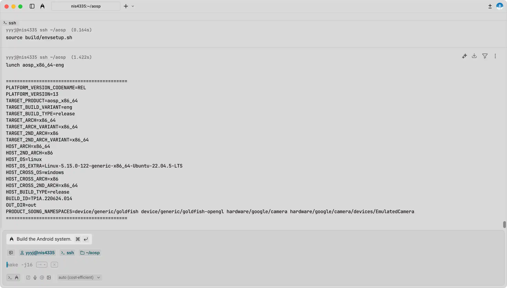

**特别注意**：这里虽然选择了 aosp_x86_64-eng，但编译出来的镜像由于各种原因并**不能够直接运行在模拟器上**，因此我在失败后又切换到了 sdk_x86_64-eng 重新编译，最终成功运行在模拟器上，具体可见后续章节。

然后申请了 32 GB 的交换分区以防止 OOM：
```bash
sudo fallocate -l 32G /swapfile
sudo chmod 600 /swapfile
sudo mkswap /swapfile
sudo swapon /swapfile
```

接着就可以正式开始编译了。这次吸取了之前编译主分支的经验教训，首先单线程编译 soong_build 阶段的内容，可以看到还是占用了较多的内存和交换分区，峰值约 24 GB。这一阶段大概花了一小时左右，明显快于之前编译主分支时的表现：
```bash
m -j1
```

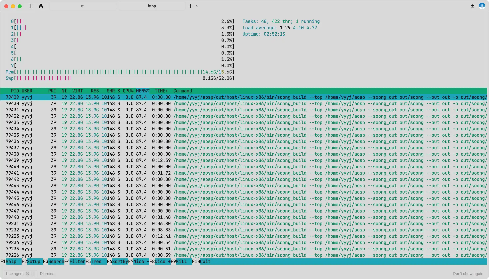

然后再多线程编译剩余内容：
```bash
m -j$(nproc)
```

一段时间后遇到报错如图，原因是 Clang 编译器找不到共享库 `libncurses.so.5`：
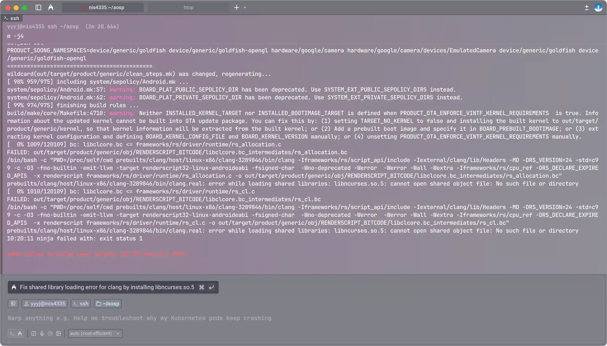

因此需要安装相应的兼容包：
```bash
sudo apt update
sudo apt install libncurses5
```

接下来直接核心拉满全力编译：
```bash
m -j$(nproc)
```

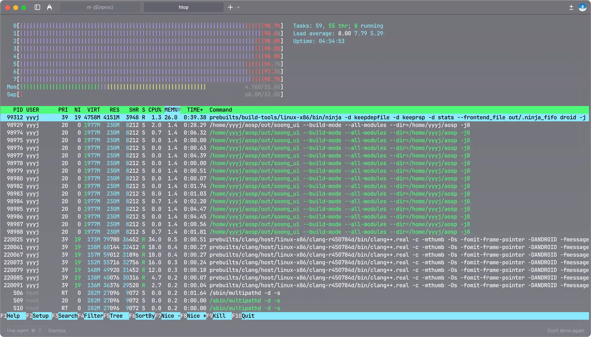

前前后后一共花了约 3 小时，最终编译成功：
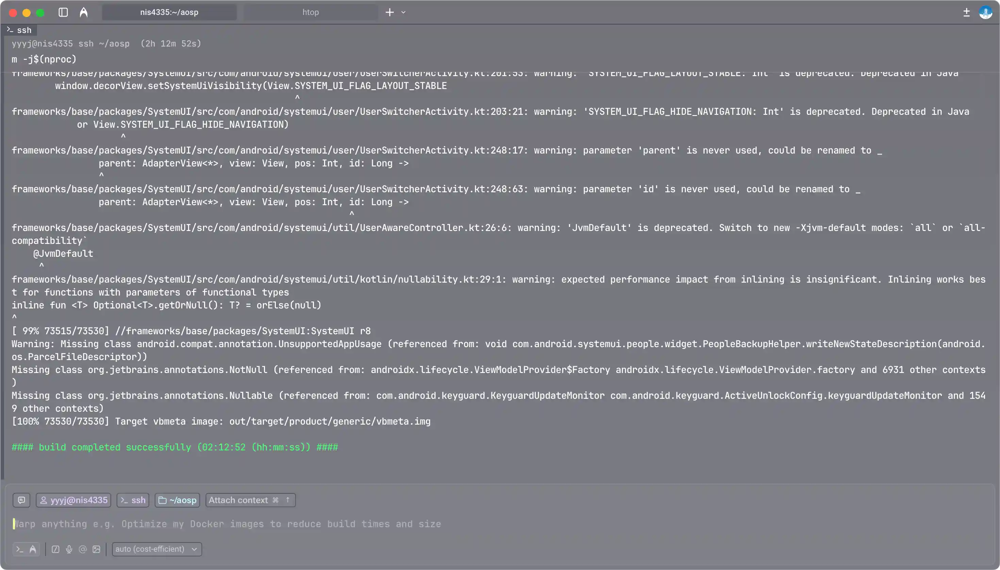

# 运行 AOSP
编译成功后，可以在 `out/target/product/generic_x86_64/` 目录下找到生成的镜像文件。
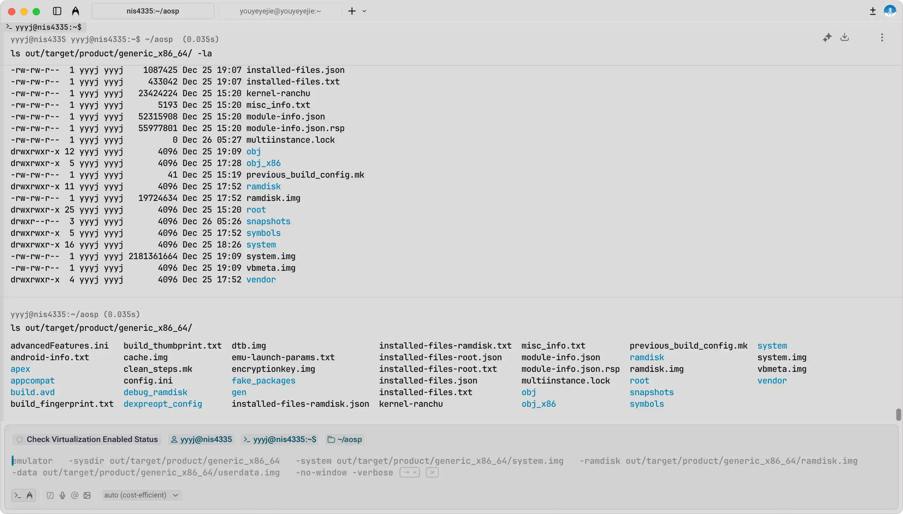

由于运行 x86 模拟器需要启动虚拟化加速，因此需要打开 KVM 支持：
```bash
sudo apt install qemu-kvm libvirt-daemon-system libvirt-clients bridge-utils
sudo /usr/sbin/kvm-ok
```

然而运行 `kvm-ok` 时会报错，发现无法启用 KVM，这里被我跳过了（不过后面也会提及就是了）。

然后尝试以无头模式启动模拟器：
```bash
emulator -no-window -verbose
```

发现报错：
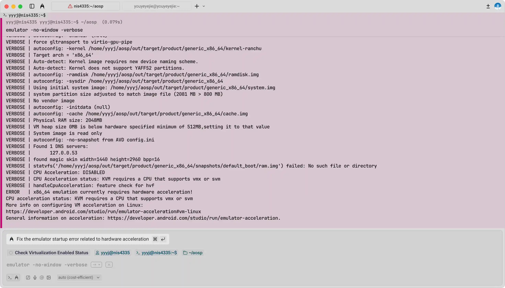

原因是没有开启 KVM 虚拟化支持，经尝试发现 jCloud 云主机不支持 VT-x，因此无法开启 KVM，因此加上 `-no-accel` 参数以软件模拟方式启动模拟器：
```bash
emulator -no-window -no-accel -verbose
```

又出现报错，缺少 `userdata-qemu.img` 文件，且生成目录下也没有 `userdata.img`：
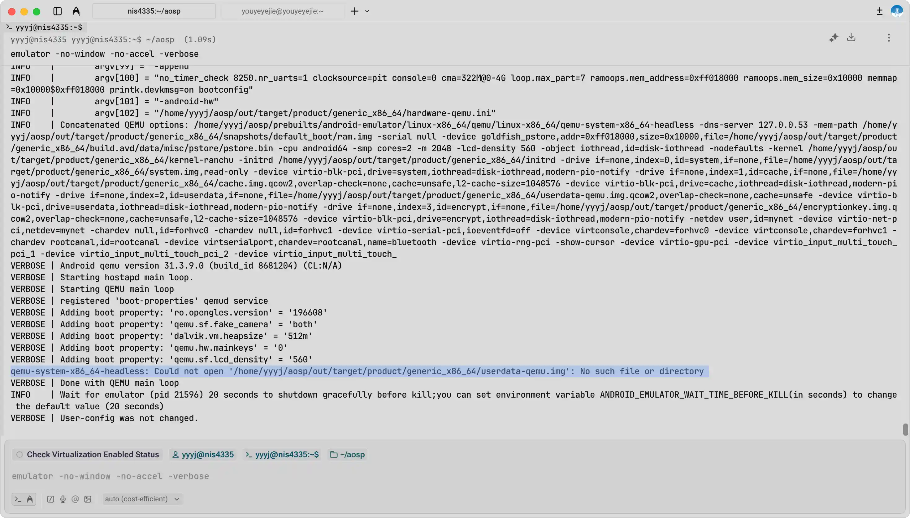

于是尝试加手动创建一个空的 `userdata-qemu.img` 文件，然后再次启动模拟器：
```bash
cd out/target/product/generic_x86_64/
dd if=/dev/zero of=userdata-qemu.img bs=1M count=2048 # 创建一个空的 userdata 镜像（例如 2GB）
mkfs.ext4 userdata-qemu.img # 格式化为 ext4（可选，但建议）
emulator -no-window -no-accel -verbose
```

然后依旧出错，VERBOSE 循环输出：
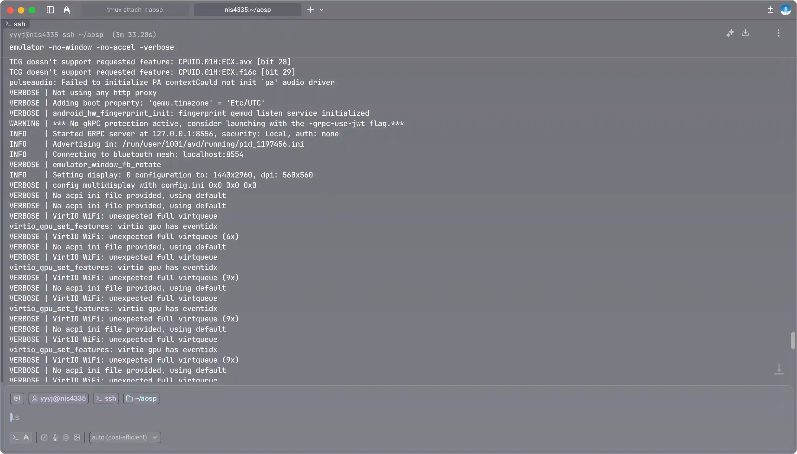

也尝试过把编译结果 scp 到本地电脑上运行模拟器，但因为太麻烦了还是放弃了。

在前面的尝试失败后，我决定换个思路，改为**编译 sdk_x86_64-eng 产品，以获得专门用于模拟器的镜像文件**，总共耗时约 5 小时：
```bash
lunch sdk_x86_64-eng
m clobber
m -j$(nproc)
```

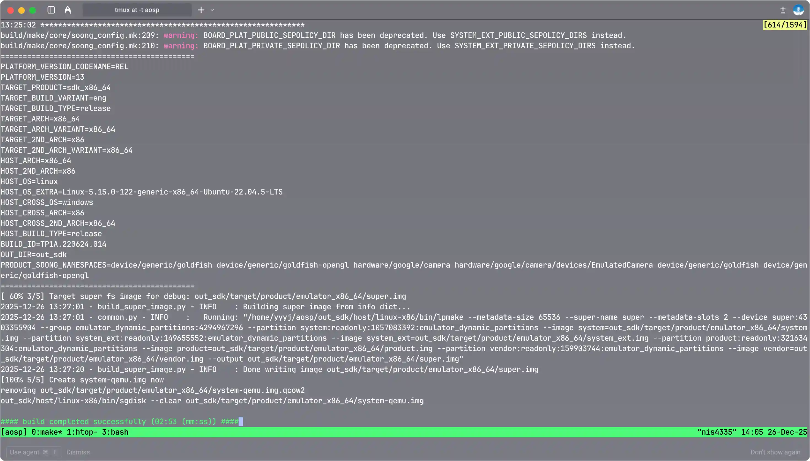

编译产物位于 `out_sdk/target/product/emulator_x86_64/` 目录下（`out_sdk` 是因为我自定义了 `OUT_DIR` 环境变量）：
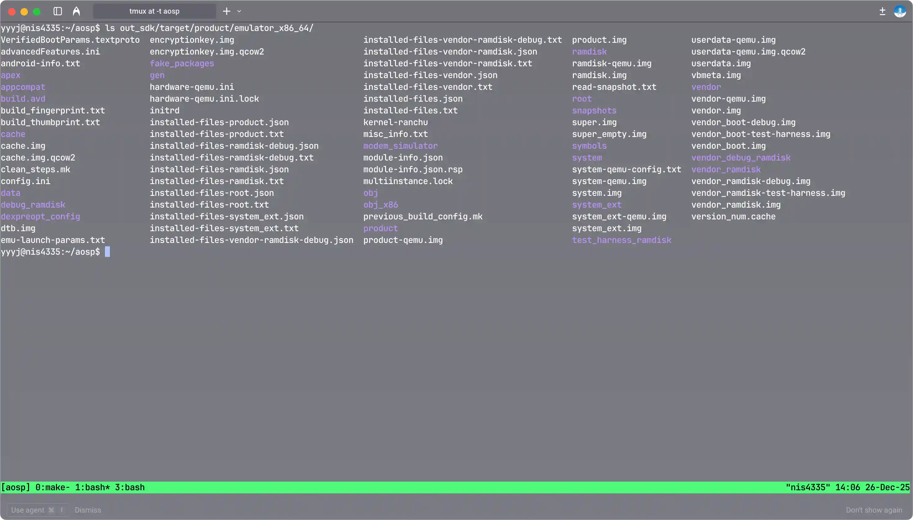

接着启动模拟器：
```bash
EXPORT ANDROID_PRODUCT_OUT='~/aosp/out/target/product/emulator_x86_64'
emulator -no-window -no-accel -verbose
```

然后打开另一个窗口使用 adb 连接模拟器，读取设备信息：
```bash
PATH=~/aosp/out/host/linux-x86/bin:$PATH
adb devices
adb shell
adb shell getprop ro.build.fingerprint
adb shell getprop ro.product.model
adb shell getprop ro.product.cpu.abi
adb shell getprop ro.build.version.release
adb shell getprop ro.build.version.sdk
```

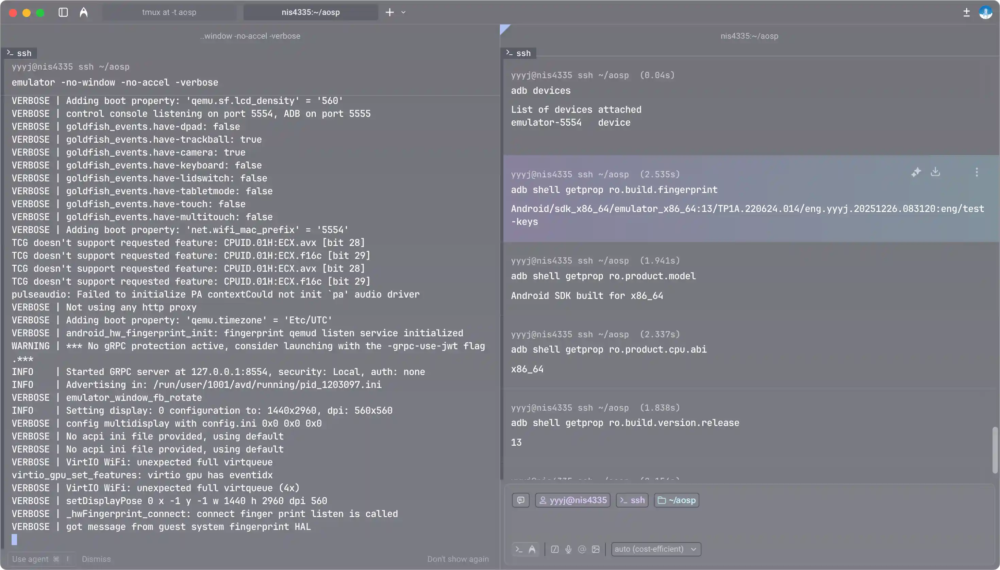

# 总结
现在完整梳理一遍整个过程：

1. 在 jCloud 云主机上安装依赖包，配置交换分区。
    ```bash
    sudo apt-get install git-core gnupg flex bison build-essential zip curl zlib1g-dev libc6-dev-i386 x11proto-core-dev libx11-dev lib32z1-dev libgl1-mesa-dev libxml2-utils xsltproc unzip fontconfig
    sudo fallocate -l 32G /swapfile
    sudo chmod 600 /swapfile
    sudo mkswap /swapfile
    sudo swapon /swapfile
    ```
2. 安装 repo 工具，初始化 AOSP 仓库，使用清华镜像源同步 android-13.0.0_r1 分支代码。
    ```bash
    mkdir ~/aosp
    PATH=~/aosp:$PATH
    curl https://storage.googleapis.com/git-repo-downloads/repo > ~/bin/repo
    chmod a+x ~/bin/repo

    export REPO_URL='https://mirrors.tuna.tsinghua.edu.cn/git/git-repo'
    repo init -u https://mirrors.tuna.tsinghua.edu.cn/git/AOSP/platform/manifest -b android-13.0.0_r1
    git config --global url.https://mirrors.tuna.tsinghua.edu.cn/git/AOSP/.insteadof https://android.googlesource.com
    repo sync -c -j$(nproc)
    ```
3. 加载编译环境，选择构建目标 sdk_x86_64-eng，编译 AOSP。
    ```bash
    cd aosp/
    source build/envsetup.sh
    lunch sdk_x86_64-eng
    m -j$(nproc)
    ```
4. 启动模拟器，使用 adb 连接模拟器并验证 AOSP 运行情况。
    ```bash
    EXPORT ANDROID_PRODUCT_OUT='~/aosp/out/target/product/emulator_x86_64'
    emulator -no-window -no-accel -verbose
    ```
    ```bash
    PATH=~/aosp/out/host/linux-x86/bin:$PATH
    adb devices
    adb shell
    ```

# 附录
## 编译 AOSP 常用命令
```bash
 加载 AOSP 编译环境
source build/envsetup.sh

 选择目标设备和构建类型
list_products                   # 列举所有可用产品
list_releases <productname>     # 列举指定产品的可用版本
list_variants                   # 列举所有可用构建变体
lunch <product-releases-variant>

 编译
m                               # 全量编译
m <module>                      # 仅编译某个模块
mm                              # 编译当前目录下的模块
mma                             # 编译当前目录下的模块及其依赖
mmm <dir>                       # 编译指定目录下的模块
mmm <dir/:target1,target2>      # 编译指定目录下的指定模块
mmma <dir>                      # 编译指定目录下的模块及其依赖。
m clean                         # 清理上次编译生成的文件
m clobber                       # 完全清理编译输出目录

 其他
hmm                             # 查看帮助信息
croot                           # 快速返回 AOSP 源码根目录
godir <filename>                # 从根目录快速跳转到包含某文件的源码目录
cgrep <pattern>                 # 在 C/C++ 文件中搜索
jgrep <pattern>                 # 在 Java/Kotlin 文件中搜索
mgrep <pattern>                 # 在 Makefile / *.mk 文件中搜索
resgrep <pattern>               # 在资源文件（res/）中搜索
get_build_var <varname>         # 查看当前构建的目标架构、产品等信息

 启动 Cuttlefish 虚拟设备（仅适用于 aosp_cf_* 产品）
apt install cuttlefish-common   # 安装 cuttlefish-common
launch_cvd                      # 启动虚拟设备
stop_cvd                        # 关闭虚拟设备

 启动模拟器（仅适用于 aosp_x86_* 产品）
emulator                        # 启动模拟器
```

## 交换分区相关命令
```bash
 创建交换分区
sudo fallocate -l <size> /swapfile    # 创建指定大小的交换文件
sudo chmod 600 /swapfile              # 设置交换文件权限
sudo mkswap /swapfile                 # 将文件设置为交换分区
sudo swapon /swapfile                 # 启用交换分区

 查看交换分区使用情况
swapon --show                         # 显示当前启用的交换分区
free -h                               # 查看内存和交换分区使用情况

 关闭交换分区
sudo swapoff /swapfile                # 关闭交换分区
sudo rm /swapfile                     # 删除交换文件
```

## ADB 常用命令
```bash
 连接设备
adb devices                     # 列出已连接的设备
adb connect <ip_address>        # 通过 IP 地址连接设备
adb disconnect <ip_address>     # 断开与指定 IP 地址设备的连接

 应用管理
adb install <app.apk>           # 安装应用
adb uninstall <package_name>    # 卸载应用

 文件传输
adb push <local> <remote>       # 将本地文件传输到设备
adb pull <remote> <local>       # 将设备文件传输到本地

 设备控制
adb shell                       # 进入设备的 shell 环境
adb reboot                      # 重启设备
adb logcat                      # 查看设备日志
adb shell getprop <property>    # 获取设备属性
```