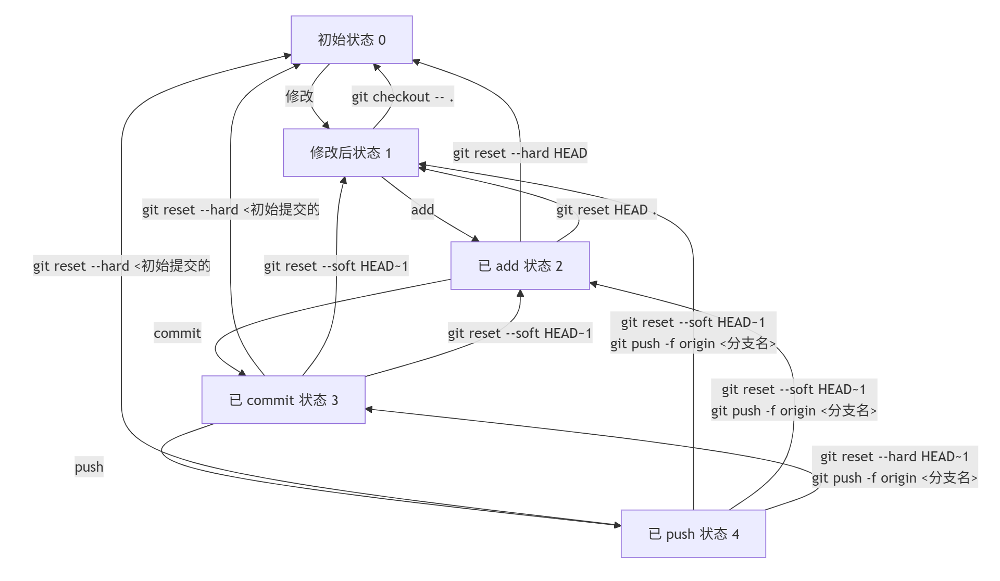

# Git Notes

为什么我会写这篇博客，自然是因为偶尔会想不起来某些Git命令，又不想每次都上网查。对于一个在进入大学前完全没接触过代码、直到大一结束才第一次接触Git和Linux的人，这看起来似乎情有可原。但是！为了以防今后某些不正确的操作将自己的仓库甚至整个项目搞得一团糟，还是把我容易搞混的Git命令记录下来吧！

# 修改-添加到暂存区-提交-推送的状态转换

## 状态表示
- 设状态0为初始状态
- 工作区文件修改后为状态1
- 执行add将工作区修改添加到暂存区后为状态2
- 执行commit将暂存区的修改提交到本地仓库后为状态3
- 执行push将本地仓库的修改推送到远程仓库后为状态4

## 状态转换
状态转换图如下：


## 各状态转换指令

1. **`1->0`（修改后回到初始状态，不保留修改）**
```bash
git checkout -- .
```
此命令会用最近一次提交的版本覆盖工作区的所有文件，从而丢弃工作区的修改，回到初始状态。

2. **`2->0`（已 `add` 后回到初始状态，不保留修改）**
```bash
git reset --hard HEAD
```
`git reset --hard` 会将暂存区和工作区都重置为 `HEAD` 指向的提交版本，即丢弃暂存区和工作区的修改，回到初始状态。

3. **`3->0`（已 `commit` 后回到初始状态，不保留修改）**
```bash
git reset --hard <初始提交的哈希值>
```
你需要先使用 `git log` 命令找到初始提交的哈希值，然后使用 `git reset --hard` 命令将当前分支重置到该提交，丢弃所有后续的提交和修改。

4. **`4->0`（已 `push` 后回到初始状态，不保留修改）**
```bash
 本地操作
git reset --hard <初始提交的哈希值>
 强制推送到远程仓库
git push -f origin <分支名>
```
先在本地使用 `git reset --hard` 回到初始提交，然后使用 `git push -f` 强制将本地的修改推送到远程仓库，覆盖远程仓库的历史记录。

5. **`2->1`（已 `add` 后回到修改后状态，保留修改）**
```bash
git reset .
```
该命令会将暂存区的所有文件撤回到工作区，保留工作区的修改。

6. **`3->1`（已 `commit` 后回到修改后状态，保留修改）**
```bash
git reset --mixed HEAD~1
```
`git reset --mixed HEAD~1` 会撤销上一次提交，将提交的内容放回暂存区，同时保留工作区的修改。

7. **`4->1`（已 `push` 后回到修改后状态，保留修改）**
```bash
 本地操作
git reset --mixed HEAD~1
 撤销远程仓库的推送
git push -f origin <分支名>
```
先在本地使用 `git reset --mixed HEAD~1` 撤销上一次提交并将内容放回暂存区，然后使用 `git push -f` 强制推送到远程仓库，撤销远程仓库的推送。

8. **`3->2`（已 `commit` 后回到已 `add` 状态，保留修改）**
```bash
git reset --soft HEAD~1
```
同样使用 `git reset --soft HEAD~1` 撤销上一次提交，将提交的内容放回暂存区。

9. **`4->2`（已 `push` 后回到已 `add` 状态，保留修改）**
```bash
 本地操作
git reset --soft HEAD~1
 撤销远程仓库的推送
git push -f origin <分支名>
```
与 `4->1` 类似，先在本地撤销提交并将内容放回暂存区，然后强制推送到远程仓库撤销推送。

10. **`4->3`（已 `push` 后回到已 `commit` 状态，保留修改）**
```bash
 本地回退到上一个提交
git reset --hard HEAD~1
 强制推送到远程仓库
git push -f origin <分支名>
```
先在本地使用 `git reset --hard HEAD~1` 回退到上一个提交，然后使用 `git push -f` 强制推送到远程仓库，使远程仓库也回到上一个提交状态。

## 总结
| 状态转换 | 指令 |
| --- | --- |
| 1->0 | `git checkout -- .` |
| 2->0 | `git reset --hard HEAD` |
| 3->0 | `git reset --hard <初始提交的哈希值>` |
| 4->0 | `git reset --hard <初始提交的哈希值>` && `git push -f origin <分支名>` |
| 2->1 | `git reset HEAD .` |
| 3->1 | `git reset --mixed HEAD~1` |
| 4->1 | `git reset --mixed HEAD~1` AND `git push -f origin <分支名>` |
| 3->2 | `git reset --soft HEAD~1` |
| 4->2 | `git reset --soft HEAD~1` AND `git push -f origin <分支名>` |
| 4->3 | `git reset --hard HEAD~1` AND `git push -f origin <分支名>` |

# 取消跟踪

要停止跟踪已推送到远程仓库的文件，同时保留本地文件并从远程仓库删除它们，可以按照以下步骤操作：

1. **确认 `.gitignore` 文件配置**  
   确保 `.gitignore` 文件中已正确添加要忽略的文件或目录路径。例如：
   ```gitignore
   # .gitignore
   ignore_file.txt
   ignore_dir/
   ```
2. **停止本地仓库跟踪这些文件**  
   使用 `git rm --cached` 命令删除文件的跟踪状态（保留本地文件）：
   ```bash
   git rm --cached ignore_file.txt
   git rm --cached -r ignore_dir/  # 递归删除目录
   ```
3. **提交更改**
   将修改后的 `.gitignore` 和文件删除操作提交到本地仓库：
   ```bash
   git add .gitignore
   git commit -m "Stop tracking ignored files"
   ```
4. **推送到远程仓库**  
   将提交推送到远程仓库，同步删除操作：
   ```bash
   git push origin <branch-name>
   ```

# 子模块
子模块是 Git 中的一种机制，用于在一个 Git 仓库中嵌套另一个 Git 仓库。它允许你将一个独立的 Git 仓库作为另一个仓库的子目录来管理。
1. 子仓库的创建（正常创建）
    ```bash
    cd <path_to_submodule>
    git init
    git remote add origin <submodule-repository-url>
    git push -u origin master
    ```
2. 在主仓库中添加子模块
    ```bash
    git submodule add <repository-url> <path-to-submodule>
    git add .gitmodules <path-to-submodule>
    git commit -m "Add submodule"
    git push
    ```

# 修改commit信息
1. 要修改最近一次提交的 commit 信息，可以使用以下命令：
    ```bash
    git commit --amend -m "New commit message"
    ```
2. 如果需要修改更早的提交，可以使用 `rebase` 命令：
    ```bash
    git rebase -i HEAD~n
    ```
    在编辑器中，将需要修改的提交前的 `pick` 改为 `reword`，然后保存并退出编辑器。接下来，Git 会提示修改提交信息，修改后保存并退出编辑器即可。
3. 如果需要修改远程仓库中的提交信息，可以使用 `push` 命令强制推送：
    ```bash
    git push -f origin <branch-name>
    ```