> 本文是 NIS2334 操作系统原理课程的实践实验报告，实验内容为在 Linux 系统上下载 OpenEuler 内核源码并进行编译与替换。通过本次实验，熟悉 Linux 的运行环境，掌握 Linux 内核编译的过程，了解 OpenEuler 内核，为后续自行修改内核代码并编译替换铺垫。

OpenEuler 是华为推动的一款开源操作系统。当前 OpenEuler 内核源于 Linux，支持鲲鹏及其它多种处理器，能够充分释放计算芯片的潜能，是由全球开源贡献者构建的高效、稳定、安全的开源操作系统，适用于数据库、大数据、云计算、人工智能等应用场景。同时， OpenEuler是一个面向全球的操作系统开源社区，通过社区合作，打造创新平台，构建支持多处理器架构、统一和开放的操作系统，推动软硬件应用生态繁荣发展。 更多信息可以参考其[官方网站](https://www.OpenEuler.org/zh/)。

# 实验目的
1. 熟悉 Linux 的运行环境；
2. 掌握 Linux 内核编译的过程；
3. 了解 OpenEuler 内核，能够编译替换不同版本的内核，为后续自行修改内核代码并编译替换铺垫。

# 实验要求
- 在 Linux 系统上，下载 OpenEuler 内核进行编译与替换。

# 实验环境
- 平台：Vmware Workstation 17 Pro
- 系统：Ubuntu 20.04.6 LTS

# 实验过程
0. 安装和配置 Ubuntu 20.04.6 LTS 系统
    - 安装 VScode（推荐），配置好 make、 gcc 等编译工具
    - 用命令`uname -r`查看原始内核版本
        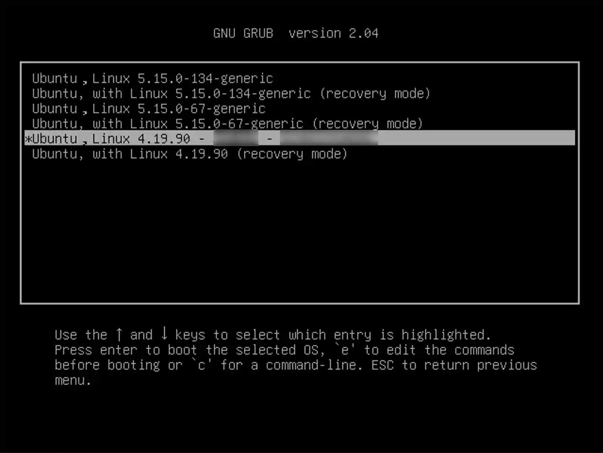
1. 下载 OpenEuler 内核源码:
    - 到 [代码仓库](https://gitee.com/OpenEuler/kernel/releases) 下载 OpenEuler 源码并解压
    - 查看仓库代码内核版本
        
2. 清理源代码树:
    - 进入解压好的源码文件夹清理过去内核编译产生的文件，第一次编译时可不执行此命令。
        ```bash
        make mrproper
        ```

3. 生成内核配置文件:
    - 先将系统原配置文件复制到代码仓库文件夹下，原配置文件在/boot 目录下，利用`uname -r`获取当前系统的内核版本。将配置在当前目录下保存为.config 文件
        ```bash
        cp -v /boot/config-$(uname -r) ./.config
        ```
    - 编译 Linux 内核需要安装 ncurses， Ubuntu 下对应包为 libncurses5-dev：
        ```bash
        sudo apt install libncurses5-dev
        ```
    - 使用以下命令对配置进行需要的更改,根据提示需先安装相应的依赖，不同的包在不同 Linux 发行版下名称不同。
        ```bash
        make menuconfig
        ```
        可以直接 Load 原始.config 文件，也可以自行进行配置或者使用默认配置， Save-Exit。
    - 这一步遇到报错：
        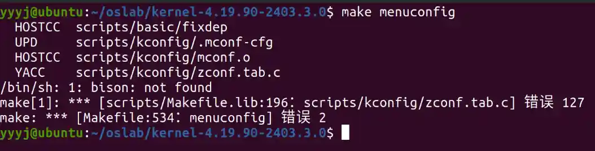

    - 分析得缺少依赖bison和flex，安装后问题解决
        ```bash
        sudo apt install bison flex
        ```
        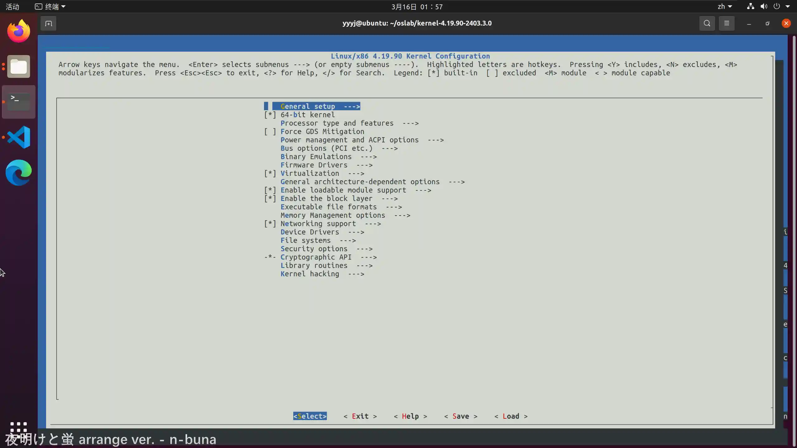
4. 内核编译与安装
    - 首先安装执行编译所需的组件， 包括 libelf-dev,openssl,libssl-dev,bc
        ```bash
        sudo apt install libelf-dev openssl libssl-dev bc
        ```
    - 开始编译内核，使用`make -j8`命令，其中-j8表示使用8个线程进行编译。
        - 编译过程碰到关于 `canonical-certs.pem` 的报错，将生成的配置文件.config的 `CONFIG_SYSTEM_REVOCATION_KEYS="debian/canonical-revoked-certs.pem"` 注释掉。
        - 进行下一步时发现安装模块失败
            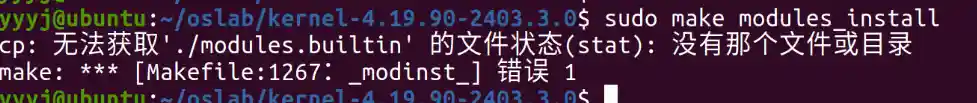
        - 查看编译日志，发现报错
            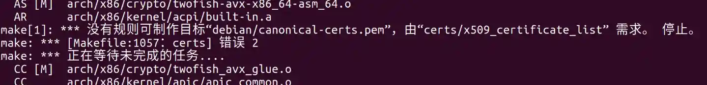
        - 将.config文件中的`2CONFIG SYSTEM TRUSTED KEYS-"debian/canonical-certs.pem"`注释掉，重新编译。
            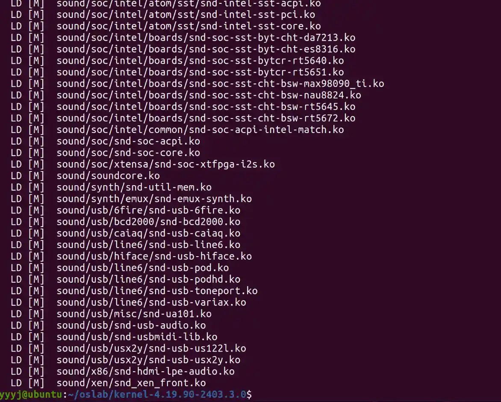
    - 编译完成后安装模块和内核
        ```bash
        sudo make modules_install
        sudo make install
        ```
        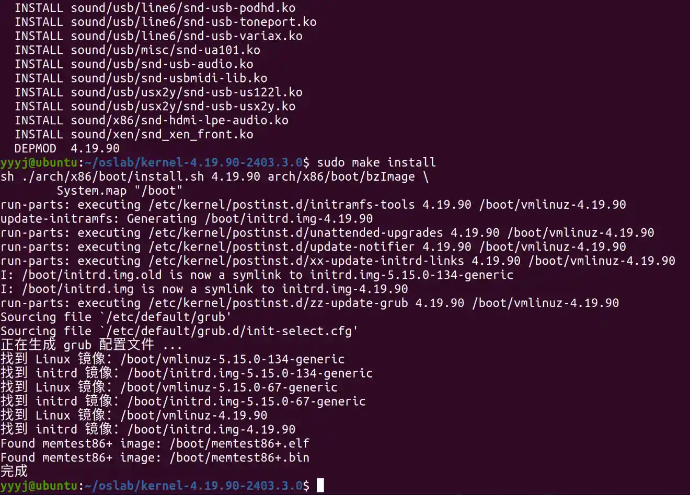
    - 完成安装，在 /boot 下看到新安装的内核
        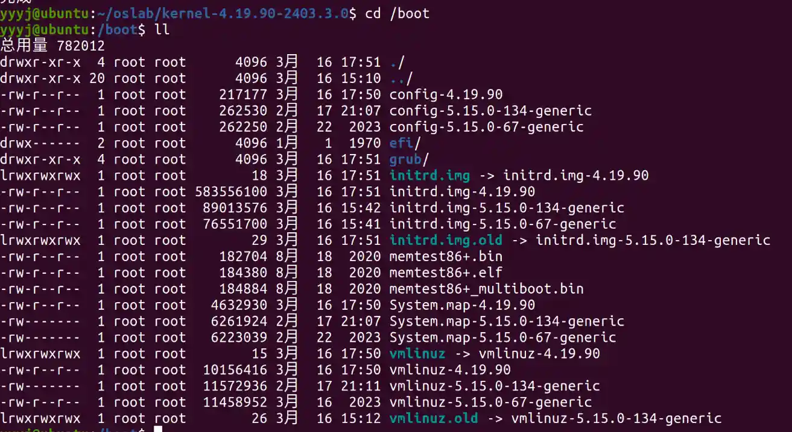

5. 更新引导文件
    - 根据/etc/default/grub 目录下的内核文件自动更新启动引导文件
        ```bash
        sudo update-grub
        ```
        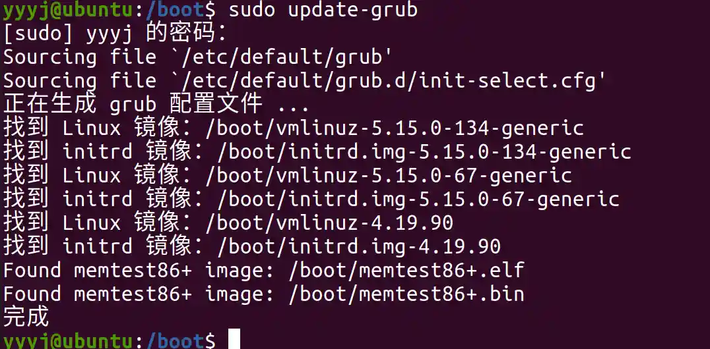
    - 修改/boot/grub/grub.cfg 中 `menuentry` 后面的字符串，在安装的 OpenEuler 版本号后增加姓名学号，自定义启动菜单时的选项名称
        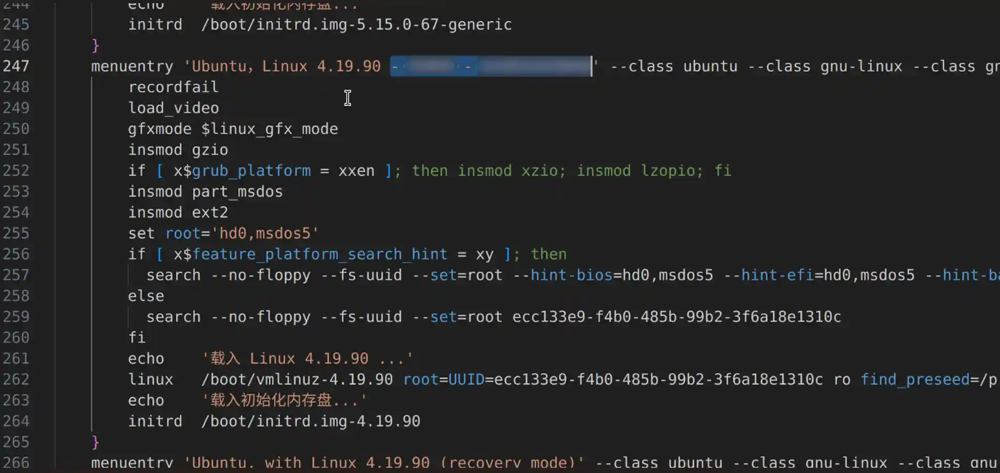
    - 使用`reboot`命令重启系统，按住`shift`键进入引导菜单，选择`Ubuntu 的高级选项`，选择新安装的内核版本启动系统。
        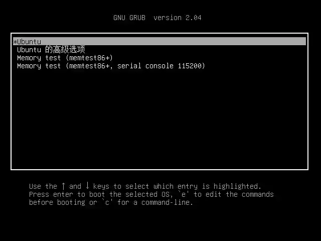
        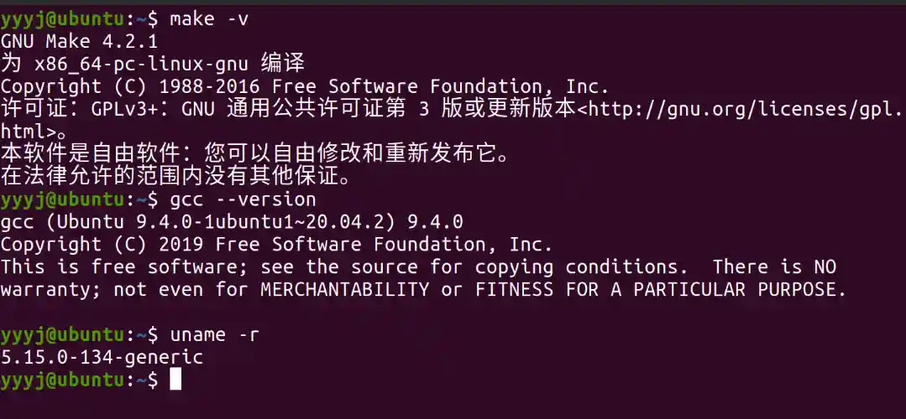
    - 查看当前内核版本，为 4.19.90，说明成功安装 OpenEuler 内核！
        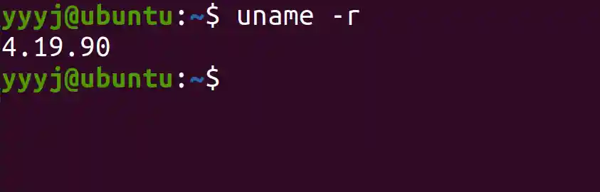
- 编译内核时遇到 `debian/canonical-certs.pem` 问题，解决方法是注释掉 `.config` 文件中的 `CONFIG SYSTEM TRUSTED KEYS-"debian/canonical-certs.pem"`。

# 参考资料
- [OpenEuler 官方网站](https://www.OpenEuler.org/zh/)
- [OpenEuler 内核源码下载](https://gitee.com/OpenEuler/kernel/releases)
- [OpenEuler 内核编译及替换](https://blog.csdn.net/m0_56602092/article/details/118604262)