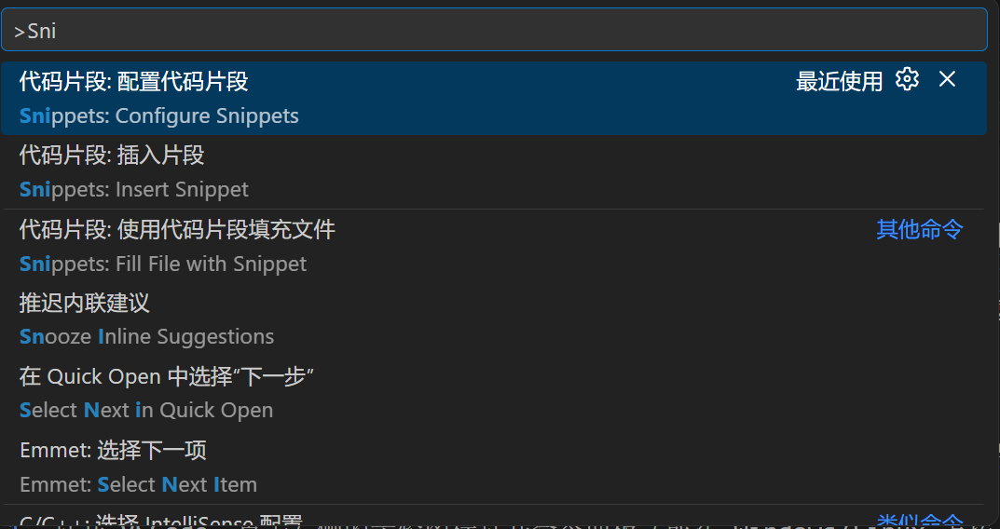
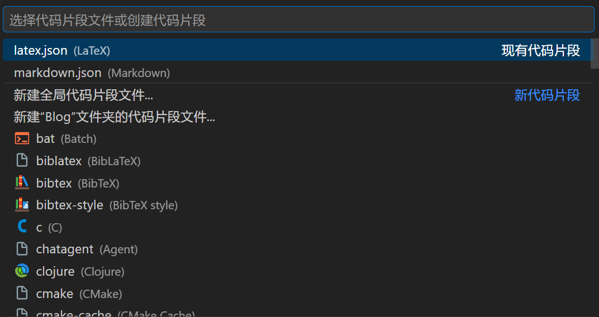
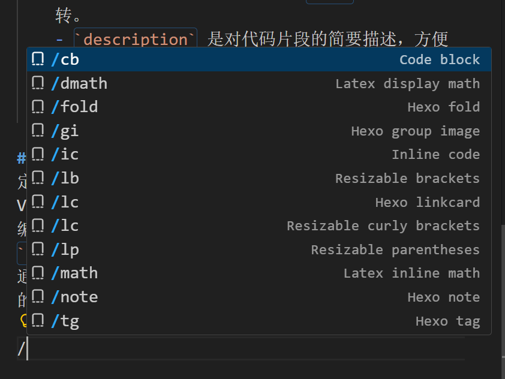

# 前言
最近在编写课程笔记时，苦恼于常常需要在 Markdown 中插入 Latex 公式，这意味着我需要来回切换输入法以输入 `$ $` 或 `$$ $$`。此外，Hexo 博客的 Fluid 主题集成的 Tag 插件也需要频繁输入 `` 来标记标签。为了提高效率，我查阅相关资料，发现在 VSCode 中，可以使用自定义**代码片段（Snippets）**快速插入常用代码模板，从而极大地提升了我的写作效率。

<a href="https://code.visualstudio.com/docs/editing/userdefinedsnippets" logourl="
https://code.visualstudio.com/assets/favicon.ico" class="LinkCard">Snippets in Visual Studio Code</a>

# Snippets 的设置
VSCode 的 Snippets 功能允许用户为特定的编程语言或文件类型创建自定义代码片段。以下是设置 Snippets 的步骤：

1. 在 VSCode 中按 `Ctrl + Shift + P`（Windows/Linux）或 `Cmd + Shift + P`（Mac）打开命令面板，输入 `Snippets: Configure Snippets` 并选择该命令；或者直接点击左下角的齿轮图标，选择**代码片段**。
2. 接着可以选择为**全局**、**当前文件夹**或**某一特定语言**创建 Snippets 设置。
    
    
    
    
3. 以 Markdown 语言为例，选中对应选项后会创建并打开一个 `markdown.json` 的文件，在其中可以定义 Snippets，可以参考文件中自带的注释。具体而言，Snippets 的定义参考以下格式：
    ```json
    {
        "Snippet Name": {
            "prefix": "trigger",
            "body": [
                "code to insert",
                "${1:placeholder}",
                "${2|option1,option2|}",
                "${CURRENT_YEAR}-${CURRENT_MONTH}-${CURRENT_DATE}",
                "$0"
            ],
            "description": "Description of the snippet",
            "scope": "markdown",
            "include": ["regex/file/name"],
            "exclude": ["regex/file/name"]
        }
    }
    ```

    其中：

    - `Snippet Name` 是代码片段的名称，可以随意命名。
    - `prefix` 是触发代码片段的关键词，当你输入这个关键词时，VSCode 会提示你使用这个代码片段。我尝试后发现一个奇怪的现象：若我使用 `lp` 等纯英文作为 prefix 时，无法在 markdown 文件中触发，而修改为 `/lp` 后就可以正常使用了。
    - `body` 是代码片段的内容，可以是多行代码，使用数组的形式表示。代码支持正则表达式，并可以使用占位符（如 `$0`、`${1:default}`）来定义可编辑的部分。其中：
        - `$0` 表示光标最终停留的位置，`$1`、`$2` 等表示第一个、第二个占位符，其余同理
        - `${1:placeholder}` 表示第一个占位符默认值为 `placeholder`，可以使用 `Tab` 键在占位符之间切换
        - `${2|option1,option2|}` 表示第二个占位符提供多个选项供选择，使用 `Tab` 键切换选项
        - 还可以使用一些内置变量，如 `${CURRENT_YEAR}`、`${CURRENT_MONTH}`、`${CURRENT_DATE}` 等，来动态生成代码片段内容。具体可食用的变量可以参考 [VSCode 官方文档](https://code.visualstudio.com/docs/editor/userdefinedsnippets#_variables)。
    - 以及下面几个可选项：
        - `description` 是对代码片段的简要描述，方便在提示时识别。
        - `scope` 是代码片段的适用范围，若前面选的是全局配置，则可以在这里指定适用的语言类型。
        - `include` 和 `exclude` 用于进一步细化代码片段的适用范围，可以使用正则表达式或文件路径来限制生效的文件。
4. 此外，也可以使用 [snippet-generator](https://snippet-generator.app/) 这个在线工具快速生成 Snippets 的 JSON 配置，支持多种编程语言和文件类型，非常方便。

# Snippets 的使用
定义好 Snippets 后，在对应的文件中输入前缀，VSCode 会自动提示使用对应代码片段。此时就与大部分编程语言的自动补全一致，可以使用 `Tab` 或 `Enter` 键来选择并插入代码片段，并且在插入后可以通过 `Tab` 键在占位符之间切换，快速编辑代码片段中的内容。



# 我的 Snippets 配置
以下是我根据自己的使用习惯以及参考 [Fluid 配置指南相关内容](https://fluid-dev.github.io/hexo-fluid-docs/guide/#tag-%E6%8F%92%E4%BB%B6) 编写的在 Markdown 文件中使用的 Snippets 配置示例：

```json
{
    "Resizable parentheses": {
        "prefix": "/lp",
        "body": [
            "\\left( $1 \\right)"
        ],
        "description": "Resizable parentheses"
    },
    "Resizable brackets": {
        "prefix": "/lb",
        "body": [
            "\\left[ $1 \\right]"
        ],
        "description": "Resizable brackets"
    },
    "Resizable curly brackets": {
        "prefix": "/lc",
        "body": [
            "\\left\\{ $1 \\right\\\\}"
        ],
        "description": "Resizable curly brackets"
    },
    "Code block": {
        "prefix": "/cb",
        "body": [
            "```$1\n$2\n```"
        ],
        "description": "Code block"
    },
    "Inline code": {
        "prefix": "/ic",
        "body": [
            "`$1`"
        ],
        "description": "Inline code"
    },
    "Latex inline math": {
        "prefix": "/math",
        "body": [
            "$$1$"
        ],
        "description": "Latex inline math"
    },
    "Latex display math": {
        "prefix": "/dmath",
        "body": [
            "$$\n$1\n$$"
        ],
        "description": "Latex display math"
    },
    "Hexo fold":{
        "prefix": "/fold",
        "body": [
            "\n$3\n"
        ],
        "description": "Hexo blog fold block"
    },
    "Hexo note":{
        "prefix": "/note",
        "body": [
            "\n$2\n"
        ],
        "description": "Hexo blog note block"
    },
    "Hexo tag":{
        "prefix": "/tg",
        "body": [
            ""
        ],
        "description": "Hexo blog tag block"
    },
    "Hexo group image":{
        "prefix": "/gi",
        "body": [
            "\n$3\n"
        ],
        "description": "Hexo blog group image block"
    },
    "Hexo linkcard":{
        "prefix": "/lk",
        "body": [
            "<a href=\"$1\" logourl=\"$2\" class=\"LinkCard\">$3</a>"
        ],
        "description": "Hexo blog linkcard block"
    }
}
```

# 结语
以上是我在 VSCode 中设置和使用 Snippets 的经验分享。通过自定义 Snippets，终于不用回忆 Fluid 主题中各种标签的写法啦！~~（笑）~~

当然，如果希望了解更准确的 Snippets 定义语法和更多功能，建议直接参考 [VSCode 官方文档](https://code.visualstudio.com/docs/editor/userdefinedsnippets)，里面有非常详细的说明和示例。