> 本笔记基于上海交通大学 *唐俊华老师* 2024-2025 学年春季学期教学内容进行整理，部分图片来自唐老师的笔记，若有侵权请联系删除。

# 第一章 绪论

## 信息理论研究内容
- 狭义信息论：香农信息论
- 一般信息论：香农+维纳
- 广义信息论

## 信息、消息、信号
- **信息**：指各个事物运动的状态及状态变化的方式。信息是抽象的意识或知识，它是看不见、摸不到的。当由人脑的思维活动产生的一种想法仍被存储在脑子里时，它就是一种信息。
    - 特征：
        1. 接收者在收到信息之前，对其内容是未知的，所以信息是新知识、新内容；
        2. 信息是能使认识主体对某一事物的未知性或不确定性减少的有用知识；
        3. 信息可以产生，也可以消失，同时信息可以被携带、存储及处理；
        4. 信息是可以量度的，信息量有多少的差别。
- **消息**：指包含信息的语言、文字和图像等。在通信中，消息是指担负着传送信息任务的单个符号或符号序列。这些符号包括字母、文字、数字和语言等。
- **信号**：消息的物理体现，为了在信道上传输消息，就必须把消息加载（调制）到具有某种物理特征的信号上去。信号是信息的载荷子或载体，是物理性的，如电信号、光信号等。

## 通信系统模型
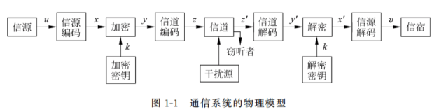

# 第二章 信源与信息熵

## 2.1 信源的分类及数学模型
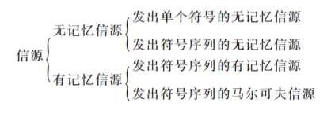

### 无记忆的单符号
- **离散**
    - 信源输出单个符号的消息，出现的消息数是有限的，且只可能是符号集中的一种
    - 各符号出现的概率与信源相互确定
    - **数学表示**：
        $$
        \begin{bmatrix} X \\ P \end{bmatrix} = 
        \begin{bmatrix} a_1 & a_2 & \cdots & a_n \\ p(a_1) & p(a_2) & \cdots & p(a_n) \end{bmatrix}
        $$

        其中符号集 $A = \{a_1, a_2, \cdots, a_n\}$，$X \in A$。显然有 $p(a_i) \geq 0$，$\sum_{i = 1}^{n} p(a_i) = 1$。 
- **连续**
    - 信源输出单个符号的消息，出现的消息数是无限的
    - **数学表示**：
        $$
        \begin{bmatrix} X \\ P \end{bmatrix} = 
        \begin{bmatrix} (a,b) \\ p_X(x) \end{bmatrix}
        或
        \begin{bmatrix} R \\p_X(x) \end{bmatrix}
        $$

        显然应满足 $p_X(x) \geq 0$，$\int_{a}^{b} p_X(x) \mathrm{d}x = 1$ 或 $\int_{R} p_X(x) \mathrm{d}x = 1$。

### 无记忆的符号序列
- 每次发出一组含2个以上符号的符号序列来代表一个消息
- 需要用随机序列（或随机矢量）$\mathbf{X}=(X_1,X_2,\cdots,X_l,\cdots,X_L)$来描述信源输出的消息，用联合概率分布来表示信源特性。
- 最简单的符号序列信源是$L$为2的情况，此时信源$\mathbf{X}=(X_1,X_2)$，其信源的概率空间为：
    $$
    \begin{bmatrix} \mathbf{X} \\ P \end{bmatrix} = 
    \begin{bmatrix} a_1,a_1 & a_1,a_2 & \cdots & a_n,a_n \\ p(a_1,a_1) & p(a_1,a_2) & \cdots & p(a_n,a_n) \end{bmatrix} \quad 
    $$

    显然有 $p(a_i,a_j)\geq0$，$\sum_{i,j = 1}^{n} p(a_i,a_j) = 1$。 

- ***无记忆***
    - 符号序列的各维相独立（**有放回取球**）
    - $p(X_1,X_2,\cdots,X_l,\cdots,X_L) = p(X_1)p(X_2)\cdots p(X_l)\cdots p(X_L)$

- ***平稳***
    - 信源发出的序列的统计性质与时间的推移无关，是平稳的随机序列。
    - 强：信源输出序列的各维概率分布都不随时间推移而发生变化
    - 弱：信源输出序列的均值与起始时刻无关、协方差函数也与起始时刻无关而仅与时间间隔有关

- ***独立同分布(i.i.d.)***
    - 离散、平稳、无记忆、具有相同概率空间
    - $p(X_1)=p(X_2)=\cdots =p(X_l)=\cdots =p(X_L)$
    - $p(X_1,X_2,\cdots,X_L)=\prod_{l = 1}^{L}p(X_l)=[p(X)]^L$
    -  其中 $X \in A = \{a_1, a_2, \cdots, a_n\}$，$\mathbf{X}$有$n^L$种可能性，$\sum_{i = 1}^{n^L} p(\mathbf{X}=\mathbf{X_i}) = 1$。 

### 有记忆的符号序列
- 信源在不同时刻发出的符号之间是相互依赖的。（**不放回取球**）
    $$
    \begin{align*}
    p(x_1,x_2,x_3,\cdots,x_L)&=p(x_L\mid x_1,x_2,x_3,\cdots,x_{L - 1})p(x_1,x_2,x_3,\cdots,x_{L - 1})\\
    &=\cdots\\
    &=p(x_1)p(x_2|x_1)p(x_3|x_2,x_1)\cdots p(x_L|x_{L-1},\cdots, x_1)
    \end{align*}
    $$
- 表述的复杂度将随着序列长度的增加而增加。

#### 马尔可夫信源
- **m阶马尔可夫信源**
    - 当信源的记忆长度为$m+1$时，该时刻发出的符号与前m个符号有关联性，而与更前面的符号无关
        $$
        \begin{align*}
        p(x_1,x_2,x_3,\cdots,x_L)&=p(x_L\mid x_1,x_2,x_3,\cdots,x_{L - 1})p(x_1,x_2,x_3,\cdots,x_{L - 1})\\
        &=p(x_L\mid x_{L - m},\cdots,x_{L - 1})p(x_1,x_2,x_3,\cdots,x_{L - 1})\\
        &=p(x_L\mid x_{L - m},\cdots,x_{L - 1})p(x_{L - 1}\mid x_{L - m - 1},\cdots,x_{L - 2})p(x_1,x_2,x_3,\cdots,x_{L - 2})\\
        &=\cdots
        \end{align*}
        $$
    - 若$m=1$，则称为**一阶马尔可夫信源**，有：
        $$
        p(x_1,x_2,x_3,\cdots,x_L)=p(x_L\mid x_{L - 1})p(x_{L - 1}\mid x_{L - 2})\cdots p(x_2\mid x_1)p(x_1)
        $$
    - **齐次马尔可夫信源**：条件概率与时间起点无关

- **状态$s_i$**
    - 对于 $m$ 阶马尔可夫信源，将该时刻以前出现的 $m$ 个符号组成的序列定义为状态 $s_i$
    - $s_i=(x_{i_1},x_{i_2},\cdots,x_{i_m})\quad x_{i_1},x_{i_2},\cdots,x_{i_m}\in A=(a_1,a_2,\cdots,a_n)$
    - $s_i$ 共有 $Q = n^m$ 种可能取值，即状态集 $S = \{s_1,s_2,\cdots,s_Q\}$
    - 则有：
        $$p(x_j\mid x_{j - m},\cdots,x_{j - 1}) = p(x_j\mid s_i)\quad i = 1,2,\cdots,Q, j = 1,2,\cdots,n$$

- **状态转移概率**
    - 在时刻 $m$ 系统处于状态 $s_i$（即 $S_m=s_i$）的条件下，经 $n - m$ 步后转移到状态 $s_j$ （即 $S_n=s_j$）的概率用状态转移概率 $p_{ij}(m,n)$ 表示：
    - $$
    p_{ij}(m,n)=P\{S_n = s_j\mid S_m = s_i\}=P\{s_j\mid s_i\}\quad s_i,s_j\in S
    $$
    - 性质：
        1. $p_{ij}(m,n)\geq0$，$i,j\in S$
        2. $\sum_{j\in S}p_{ij}(m,n)=1$，$i\in S$

- **状态转移矩阵**
    - 一步转移矩阵$\mathbf{P}=\{p_{ij},i,j\in S\}$
        $$
        \mathbf{P}=
        \begin{bmatrix}
        p_{11} & p_{12} & \cdots & p_{1Q} \\
        p_{21} & p_{22} & \cdots & p_{2Q} \\
        \vdots & \vdots & \ddots & \vdots \\
        p_{Q1} & p_{Q2} & \cdots & p_{QQ}
        \end{bmatrix}
        $$
    - k步转移矩阵$\mathbf{P}=\{p_{ij}^{(k)}(m),i,j\in S\}$

- **状态图**
    - 状态转移图/马尔科夫状态图/香农线图
    - 元素
        - 圆圈：状态$S_i$
        - 箭头：转移
        - 箭头旁标数字：转移概率

- **一步转移概率**
    - $n - m = 1$时，即 $p_{ij}(t,t + 1)$，记为 $p_{ij}(t)$，$t\geq0$，并称为基本转移概率，也可称为一步转移概率。
    - $$
    p_{ij}(t)=p_{ij}(t,t + 1)=P\{S_{t + 1}=j\mid S_t = i\}\overset{齐次}{=}p_{ij}\quad i,j\in S
    $$
    - 性质：
        1. $p_{ij}\geq0$，$i,j\in S$
        2. $\sum_{j\in S}p_{ij}=1$，$i\in S$

- **k步转移概率**
    - $$
    p_{ij}^{(k)}(t)=p_{ij}(t,t + k)=P\{S_{t + k}=j\mid S_t = i\}\overset{齐次}{=}p_{ij}^{(k)}\quad i,j\in S
    $$
    - 切普曼 - 柯尔莫戈洛夫方程：
        $$
        p_{ij}^{(k)}=\sum_{r}p_{ir}^{(l)}p_{rj}^{(k - l)} \quad l < k
        $$ 
        
        特别地，当 $l = 1$ 时，有
        $$
        p_{ij}^{(k)}=\sum_{r}p_{ir}p_{rj}^{(k - 1)}=\sum_{r}p_{ir}^{(k - 1)}p_{rj}=p_{ij}^{k}
        $$
    - 若用矩阵表示，则
        $$
        \mathbf{P}^{(k)}=\mathbf{P}\mathbf{P}^{(k - 1)}=\mathbf{P}\mathbf{P}\mathbf{P}^{(k - 2)}=\cdots=\mathbf{P}^{k}
        $$

        其中 $\mathbf{P}^{(k)}=\{p_{ij}^{(k)}\}$为k步转移概率矩阵，$\mathbf{P}^{k}$ 为一步转移矩阵的k次方。
    - 对于齐次马尔可夫链，一步转移概率完全决定了k步转移概率，引入初始概率$p_{0i}=P(S_{0}=s_{i})$
        $$
        \begin{align*}
        P(S_{k}=s_{j})&=\sum_{i}P(S_{k}=s_{j},S_{0}=s_{i})\\
        &=\sum_{i}P(S_{0}=s_{i})P(S_{k}=s_{j}\mid S_{0}=s_{i})\\
        &=\sum_{i}p_{0i}p_{ij}^{(k)}
        \end{align*}
        $$

- **马尔可夫链的稳定(稳态分布)**
    - **定义**：$\lim_{k \to \infty}p_{ij}^{(k)} = W_j = P(S_k=s_j)$，信源达到稳定状态，所有变量$x_k$的概率分布不变
    - **求取**：
        $$
        \left\{
        \begin{array}{l}
        \mathbb{W}\mathbf{P}=\mathbb{W}\\
        \sum_{i}W_j = 1
        \end{array}
        \right.
        $$

        其中$\mathbb{W}=\begin{bmatrix} W_1 & W_2 & \cdots & W_Q \end{bmatrix}$，$W_j = \lim_{k \to \infty}p_{ij}^{(k)} = P(S_k=s_j)$
    - **条件**
        - 必要不充分：上式有唯一解，则$\lim_{k \to \infty}p_{ij}^{(k)}$ 存在
        - **不可约性**
            - 对任意一对 $i$ 和 $j$，都存在至少一个 $k$，使 $p_{ij}^{(k)}>0$，这就是说从 $s_i$ 开始，总有可能到达 $s_j$
            - 反之若对所有 $k$，$p_{ij}^{(k)} = 0$，就意味着一旦出现 $s_i$ 以后不可能到达 $s_j$，也就是不能各态遍历
                - 此时状态中把 $s_j$ 取消就成为可约的了
        - **非周期性**
            - 在所有 $p_{ii}^{(n)}>0$ 的 $n$ 中没有比 1 大的公因子，即从$s_i$出发回到$s_i$的步数没有大于 1 的公因子
    - **例题**：
        - 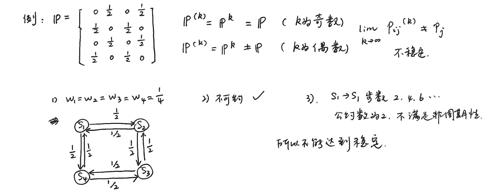
        - 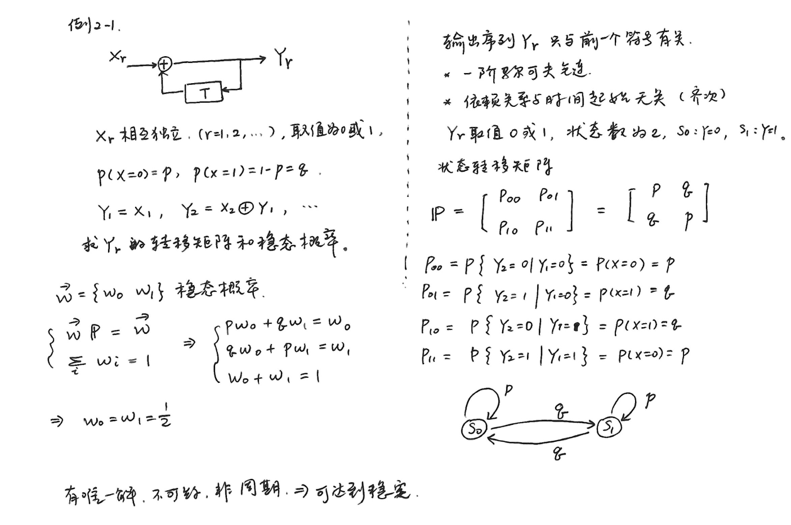
        - 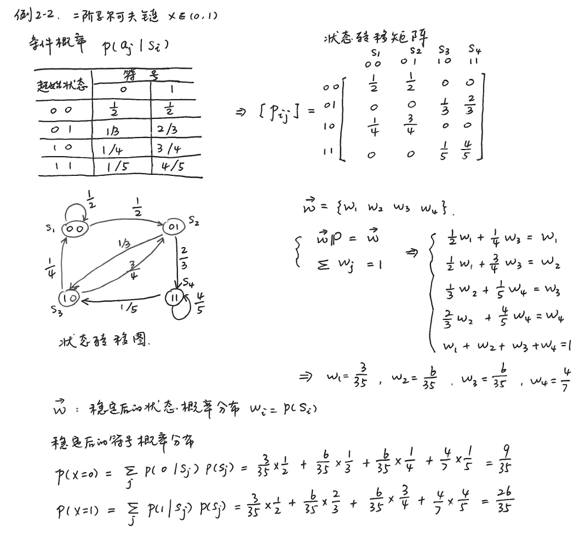

### 时间连续、幅度连续的模拟信号（随机波形信源）
- 例如语音、图像，可看作随机过程$x(t)$ 。
- 通过采样、量化，可将其转换为时间离散、幅度离散的符号序列。
- 假设$x(t)$频带受限，$f_m$为最高频率，根据采样定理，**不失真采样频率**$f_s\geq2f_m$ 。若时间受限为$t_B$ ，则**采样点数**为$2f_mt_B = L$（形成长度为$L$的符号序列）。
- 一般情况下，$L = 2f_mt_B$维连续型随机序列是有记忆的。 

## 2.2 离散信源熵和互信息
### 自信息量
- 信源 $X$，概率空间 
$$\begin{bmatrix} X \\ p \end{bmatrix}=
\begin{bmatrix} x_1 & x_2 & \cdots & x_n \\ p(x_1) & p(x_2) & \cdots & p(x_n) \end{bmatrix}$$
- 定义具有概率 $p(x_i)$ 的符号 $x_i$ 的自信息量为
$$I(x_i)=-\log p(x_i)=\log\frac{1}{p(x_i)}$$
    - 底数为 $2$，信息量单位比特（bit）
    - 底数为自然常数 $e$，单位为奈特（nat）
    - 底数为 $10$，单位为笛特（det）
        - $1\text{nat}=\log_2 e\approx 1.433\text{bit}$
        - $1\text{det}=\log_2 10\approx 3.322\text{bit}$
    - 性质：
        1. $p(x_i)=1$，$I(x_i)=0$
        2. $p(x_i)=0$，$I(x_i)=\infty$
        3. 非负性：$I(x_i)\geq0$
        4. 单调递减性：若 $p(x_2)>p(x_1)$ 则 $I(x_2) < I(x_1)$
        5. 可加性：
            - 两符号 $x_i,y_j$ 同时出现，$I(x_i,y_j)=-\log p(x_i,y_j)$
            - $x_i,y_j$ 相互独立，$p(x_i,y_j)=p(x_i)p(y_j)$
                - $I(x_i,y_j)=-\log p(x_i)p(y_j)=I(x_i)+I(y_j)$
            - $x_i,y_j$ 不独立，定义**条件自信息量** $I(x_i|y_j)=-\log p(x_i|y_j)$
                - $p(x_i,y_j)=p(x_i)p(y_j|x_i)=p(y_j)p(x_i|y_j)$
                - $I(x_i,y_j)=I(x_i)+I(y_j|x_i)=I(y_j)+I(x_i|y_j)$
    - 单位：bit

- 示例：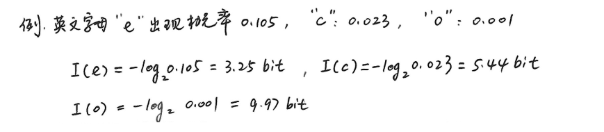

- **自信息量与信源符号不确定度**
    - 自信息量：符号出现后，提供给收信者的信息量，**是接收者获得的**。
    - 信源符号不确定度：具有某种概率的信源符号在发出之前，存在不确定度，不确定度表征了该符号的特性，**是信源本身固有的**。
    - **二者在数量上相等**

### 离散信源熵 - 熵的定义
- 给定概率空间 
$\begin{bmatrix} X \\ p \end{bmatrix}=
\begin{bmatrix} x_1 & x_2 & \cdots & x_n \\ p(x_1) & p(x_2) & \cdots & p(x_n) \end{bmatrix}$，自信息量$I(x_i)=-\log p(x_i)=\log\frac{1}{p(x_i)}$

- **信源 $X$ 的熵 $H(X)$ 定义为**：
$$H(X)\overset{数量}{=}E[I(X)]=\sum_{i} p(x_i)I(x_i)=-\sum_{i} p(x_i)\log p(x_i)$$ 信源 $X$ 的熵也被称为平均自信息量、总体平均不确定度。
- 性质：
    - $H(X)$ 非负，因为 $0\leq p(x_i)\leq1$，$\log p(x_i)\leq0$，所以 $H(X)\geq0$。
    - 若 $p(x_i)=0$，规定 $p(x_i)\log p(x_i)$ 为 $0$。
    - 若 $p(x_i)=1$，$H(X) = 0$，即确定信源熵为 $0$。
- 单位：bit/符号
- 例题：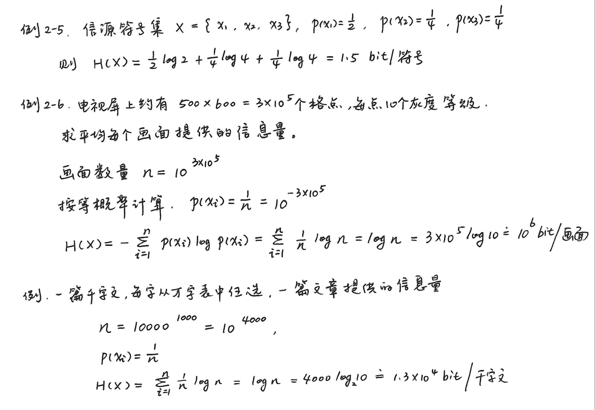

#### 二元信源
- 二元信源概率空间 $\begin{bmatrix} X \\ p \end{bmatrix}=
\begin{bmatrix} 0 & 1 \\ p & q \end{bmatrix}$，其中 $p + q=1$
- 则 $H(X)= -p\log p - q\log q=-p\log p -(1 - p)\log(1 - p)=H_2(p)=H(p)$
- 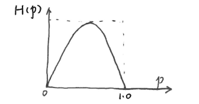
- 性质：
    - 当 $p = 1$ 或 $q = 1$（$p = 0$）时，该信源不提供任何信息，即H(0)=0。
    - 当 $p=q=\frac{1}{2}$ 时，符号等概率发生，熵最大，为 $H(\frac{1}{2})=1\text{bit}/\text{符号}$。

### 条件熵
- 给定 $y_j$ 的条件下，$x_i$ 的**条件自信息量**为 $I(x_i|y_j)=-\log p(x_i|y_j)$，**$X$ 集合的条件熵 $H(X|y_j)$定义为**：
$$H(X|y_j)=\sum_{i}p(x_i|y_j)I(x_i|y_j)$$

- 给定 $Y$（即各个 $y_j$）条件下，**$X$ 集合的条件熵 $H(X|Y)$ 定义为**：
    $$H(X|Y)=-\sum_{ij}p(x_i,y_j)\log p(x_i|y_j)$$ 即条件熵是联合符号集合 $(X,Y)$ 上的条件自信息量的**联合概率加权统计平均值**。条件熵 $H(X|Y)$ 表示已知 $Y$ 后，$X$ 的不确定度。 
- 推导：
    $$
    \begin{align*}
    H(X|Y)&=\sum_{j}p(y_j)H(X|y_j)\\
    &=\sum_{j}p(y_j)\sum_{i}p(x_i|y_j)I(x_i|y_j)\\
    &=\sum_{i}\sum_{j}p(y_j)p(x_i|y_j)I(x_i|y_j)\\
    &=\sum_{i}\sum_{j}p(x_i,y_j)I(x_i|y_j)\\
    &=-\sum_{i}\sum_{j}p(x_i,y_j)\log p(x_i|y_j)
    \end{align*}
    $$
- **同理**，$$H(Y|X)=\sum_{i}\sum_{j}p(x_i,y_j)I(y_j|x_i)=-\sum_{i}\sum_{j}p(x_i,y_j)\log p(y_j|x_i)$$

### 联合熵
- 联合熵是联合符号集合 $(X,Y)$ 上的每个元素对 $(x_i,y_j)$ 的自信息量的**概率加权统计平均值**，定义为：

$$H(X,Y)=\sum_{i,j}p(x_i,y_j)I(x_i,y_j)=-\sum_{i,j}p(x_i,y_j)\log p(x_i,y_j) $$

- 联合熵 $H(X,Y)$ 表示 $X$ 和 $Y$ 同时发生的不确定度。
- 联合熵 $H(X,Y)$ 与熵 $H(X)$ 及条件熵 $H(Y|X)$ 之间存在下列**关系**：
$$H(X,Y)=H(X)+H(Y|X)=H(Y)+H(X|Y)$$ 
    - 推导：
        $$
        \begin{align*}
        H(X,Y)&=-\sum_{i}\sum_{j}p(x_i,y_j)\log p(x_i,y_j)\\
        &=-\sum_{i}\sum_{j}p(x_i,y_j)\log [p(x_i)p(y_j|x_i)]\\
        &=-\sum_{i}\sum_{j}p(x_i,y_j)\log p(x_i)-\sum_{i}\sum_{j}p(x_i,y_j)\log p(y_j|x_i)\\
        &=-\sum_{i}p(x_i)\log p(x_i)+H(Y|X)\\
        &=H(X)+H(Y|X)
        \end{align*}
        $$
    - 同理可得 $H(X,Y)=H(Y)+H(X|Y)$ 
- 例题：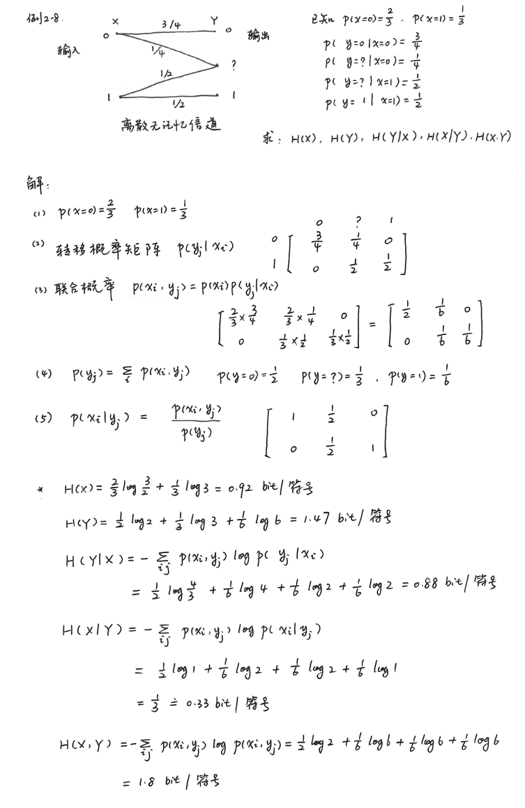

### 互信息
- 未收到消息时，信源 $X$ 的不确定度为 $H(X)$，收到消息 $Y$ 后关于 $x_i$ 的不确定度为 $H(X|Y)$。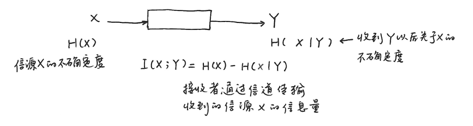
- **定义**：
    - $X$ 和 $Y$ 的互信息为接收者通过通信信道接收到的信源 $X$ 的信息量
    - **平均互信息**：$$I(X;Y)=H(X)-H(X|Y)=\sum_{ij}p(x_i,y_j)\log\frac{p(x_i,y_j)}{p(x_i)p(y_j)}$$
- **平均互信息的推导**
    - **定义单符号之间的互信息** $I(x_i;y_j)$ 为
        $$
        \begin{align*}
        I(x_i;y_j)&=I(x_i)-I(x_i|y_j)\\
        &=\log\frac{1}{p(x_i)}-\log\frac{1}{p(x_i|y_j)}\\
        &=\log\frac{p(x_i|y_j)}{p(x_i)}=\log\frac{\text{后验概率}}{\text{先验概率}}
        \end{align*}
        $$
    - 在 $X$ 集合上**统计平均值，即平均条件互信息量** $I(X;y_j)$ 为
        $$
        I(X;y_j)=\sum_{i}p(x_i|y_j)I(x_i;y_j)=\sum_{i}p(x_i|y_j)\log\frac{p(x_i|y_j)}{p(x_i)}
        $$

    - $I(X;y_j)$ 在 $Y$ 集合的**概率加权统计平均值，即平均互信息** $I(X;Y)$ 为
        $$
        \begin{align*}
        I(X;Y)&=\sum_{j}p(y_j)I(X;y_j)=\sum_{j}p(y_j)\sum_{i}p(x_i|y_j)\log\frac{p(x_i|y_j)}{p(x_i)}\\
        &=\sum_{i}\sum_{j}p(x_i,y_j)\log\frac{p(x_i|y_j)}{p(x_i)}\\
        &=\sum_{i}\sum_{j}p(x_i,y_j)\log p(x_i|y_j)-\sum_{i}\sum_{j}p(x_i,y_j)\log p(x_i)\\
        &=H(X)-H(X|Y)\\
        I(X;Y)&=\sum_{i}\sum_{j}p(x_i,y_j)\log\frac{p(x_i|y_j)}{p(x_i)}\\
        &=\sum_{i}\sum_{j}p(x_i,y_j)\log\frac{p(x_i|y_j)p(y_j)}{p(x_i)p(y_j)}\\
        &=\sum_{i}\sum_{j}p(x_i,y_j)\log\frac{p(x_i,y_j)}{p(x_i)p(y_j)}\\
        &=\sum_{i}\sum_{j}p(x_i,y_j)\log\frac{p(y_j|x_i)}{p(y_j)}\\
        &=I(Y;X)\\
        \therefore I(X;Y)&=H(Y)-H(Y|X)=I(Y;X)=H(X)+H(Y)-H(X,Y)
        \end{align*}
        $$ 
- **例题**：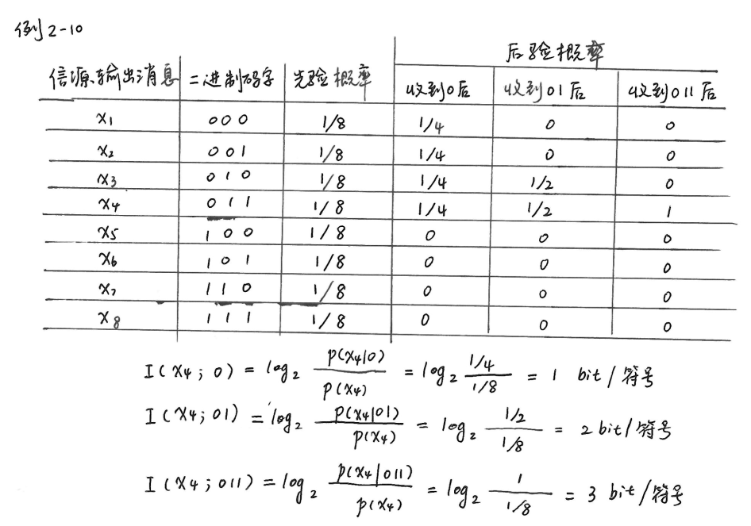

- **性质**：
    - $I(X;Y)=I(Y;X)=H(X)+H(Y)-H(X,Y)$
        - 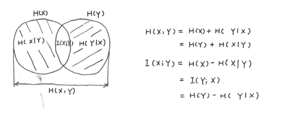
    - $0 \leq I(X;Y) \leq H(X)$（非负性证明见[互信息的非负性](#互信息的非负性)）
    - **若$X$，$Y$相互独立时**
        - $H(X|Y)=H(X)$
        - $I(X;Y)=H(X)-H(X|Y)=0$ ，对应**全损离散信道**
    - **若$Y$是由$X$确定的一一对应函数**，即$p(y_j|x_i)= 0 \text{或} 1$
        - $H(X|Y)=H(Y|X)=0$
        - $I(X;Y)=H(X)=H(Y)$ ，对应**无损信道**
    - **一般情况下**，$X$与$Y$既非相互独立，也不是一一对应
        $$
        \begin{align*}
        I(X;Y)&=\sum_{i}\sum_{j}p(x_i,y_j)\log\frac{p(y_j|x_i)}{p(y_j)}\\
        &=\sum_{i}\sum_{j}p(x_i)p(y_j|x_i)\log\frac{p(y_j|x_i)}{p(y_j)}\\
        p(y_j)&=\sum_{i}p(x_i)p(y_j|x_i)\\
        I(X;Y)&=f\left[p(x_i),p(y_j|x_i)\right]
        \end{align*}
        $$
        - **结论**：（证明见[互信息的凹凸性](#互信息的凹凸性)）
            1. $p(x_i)$ 一定时，$I(X;Y)$是 $p(y_j|x_i)$ 的$\cup$型凸函数，存在极小值。
            2. $p(y_j|x_i)$ 一定时，$I(X;Y)$是关于 $p(x_i)$ 的$\cap$型凸函数，存在极大值。
- **收发两端的熵关系**
    - 条件熵 $H(X|Y)$ 又可以看作由于信道上的干扰和噪声，使接收端获得 $Y$ 后还剩余的对信源符号 $X$ 的平均不确定度，故又称为**疑义度**。
    - 条件熵 $H(Y|X)$ 可看作唯一地确定信道噪声所需要的平均信量，故又称**噪声熵或散布度**。
    - 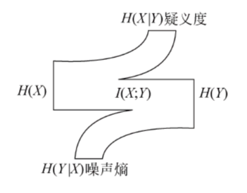

### 相对熵
- $p,q$为同一信源两个不同的概率分布，**相对熵$D(p||q)$是两个随机分布之间距离的度量**，**$p$相对于$q$的相对熵定义**为：
    $$D(p||q)=\sum_{i} p(x_{i})\log\frac{p(x_{i})}{q(x_{i})}$$
- 约定 $0\log\frac{0}{0} = 0$，$0\log\frac{0}{q}=0$，$p\log\frac{p}{0} = \infty$
- **性质**：
    - $D(p||q)\neq D(q||p)$
    - 互信息可定义为联合分布$p(x,y)$与乘积分布$p(x)p(y)$之间的相对熵
        $$I(X;Y)=\sum_{i,j} p(x_{i},y_{j})\log\frac{p(x_{i}|y_{j})}{p(x_{i})}=\sum_{i,j} p(x_{i},y_{j})\log\frac{p(x_{i},y_{j})}{p(x_{i})p(y_{j})}=D(p(x,y)||p(x)p(y))$$
    - $D(p||q)\geq0$（证明见[信息不等式/相对熵的非负性](#信息不等式相对熵的非负性)）
    - 信源符号 $x_1,x_2,\cdots,x_n$
        概率分布 $p_1,p_2,\cdots,p_n$
        编码方案1：$-\log p_1,-\log p_2,\cdots,-\log p_n$ （按照码长 $I(x_{i}) = -\log p_{i}$ 进行编码）
        编码方案2：$-\log q_1,-\log q_2,\cdots,-\log q_n$ 

        编码1平均码长 $K_p = -\sum_{i} p_{i}\log p_{i}$ 
        编码2平均码长 $K_q = -\sum_{i} p_{i}\log q_{i}$ 
        $$K_q - K_p=\sum_{i} p_{i}\log\frac{p_{i}}{q_{i}}=D(p||q)\geq0$$ 
        - **结论**：按概率分布编码最短

### 熵、相对熵与互信息的链式法则
#### 熵的链式法则 
- **熵的链式法则**：
    - 设随机变量 $X_1,X_2,\cdots,X_n$ 服从 $p(x_1,x_2,\cdots,x_n)$，则
    $$H(X_1,X_2,\cdots,X_n)=\sum_{i = 1}^{n}H(X_i|X_{i - 1},\cdots,X_1)$$

- **证明**：重复利用两个随机变量情形时熵的展开法则，有
    $$
    H(X_1,X_2)=H(X_1)+H(X_2|X_1)
    $$$$
    \begin{align*}
    H(X_1,X_2,X_3)&=H(X_1)+H(X_2,X_3|X_1)\\
    &=H(X_1)+H(X_2|X_1)+H(X_3|X_2,X_1)
    \end{align*}
    $$$$
    \begin{align*}
    H(X_1,X_2,\cdots,X_n)&=H(X_1)+H(X_2|X_1)+\cdots +H(X_n|X_{n - 1},\cdots,X_1)\\
    &=\sum_{i = 1}^{n}H(X_i|X_{i - 1},\cdots,X_1)
    \end{align*}
    $$

- **另一证明**：由 $p(x_1,x_2,\cdots,x_n)=\prod_{i = 1}^{n}p(x_i|x_{i - 1},\cdots,x_1)$，可得
    $$
    \begin{align*}
    &H(X_1,X_2,\cdots,X_n)\\
    =&-\sum_{x_1,x_2,\cdots,x_n}p(x_1,x_2,\cdots,x_n)\log p(x_1,x_2,\cdots,x_n)\\
    =&-\sum_{x_1,x_2,\cdots,x_n}p(x_1,x_2,\cdots,x_n)\log\prod_{i = 1}^{n}p(x_i|x_{i - 1},\cdots,x_1)\\
    =&-\sum_{x_1,x_2,\cdots,x_n}\sum_{i = 1}^{n}p(x_1,x_2,\cdots,x_n)\log p(x_i|x_{i - 1},\cdots,x_1)\\
    =&-\sum_{i = 1}^{n}\sum_{x_1,x_2,\cdots,x_n}p(x_1,x_2,\cdots,x_n)\log p(x_i|x_{i - 1},\cdots,x_1)\\
    =&\sum_{i = 1}^{n}H(X_i|X_{i - 1},\cdots,X_1)\\
    \end{align*}
    $$

#### 互信息的链式法则
- **条件互信息定义**：
    - 随机变量 $X$ 和 $Y$ 在给定随机变量 $Z$ 时的条件互信息（conditional mutual information）定义为
    $$
    \begin{align*}
    I(X;Y|Z)&=H(X|Z)-H(X|Y,Z)\\
    &=E_{p(x,y,z)}\log\frac{p(X,Y|Z)}{p(X|Z)p(Y|Z)}\\
    &=\sum_{i}\sum_{j}\sum_{k}p(x_i,y_j,z_k)\log\frac{p(x_i,y_j|z_k)}{p(x_i|z_k)p(y_j|z_k)}\\
    &=\sum_{i}\sum_{j}\sum_{k}p(x_i,y_j,z_k)\log\frac{p(x_i,y_j,z_k)p(z_k)}{p(x_i,z_k)p(y_j,z_k)}
    \end{align*}
    $$

- **互信息的链式法则**
    $$I(X_1,X_2,\cdots,X_n;Y)=\sum_{i = 1}^{n}I(X_i;Y|X_{i - 1},X_{i - 2},\cdots,X_1)$$

- **证明**：
    $$
    \begin{align*}
    &I(X_1,X_2,\cdots,X_n;Y)\\
    =&H(X_1,X_2,\cdots,X_n)-H(X_1,X_2,\cdots,X_n|Y)\\
    =&\sum_{i = 1}^{n}H(X_i|X_{i - 1},\cdots,X_1)-\sum_{i = 1}^{n}H(X_i|X_{i - 1},\cdots,X_1,Y)\\
    =&\sum_{i = 1}^{n}I(X_i;Y|X_1,X_2,\cdots,X_{i - 1})
    \end{align*}
    $$

#### 相对熵的链式法则
- **条件相对熵定义**：
    - 对于联合概率密度函数 $p(x,y)$ 和 $q(x,y)$，条件相对熵（conditional relative entropy $D(p(y|x)\|q(y|x))$）定义为条件概率密度函数 $p(y|x)$ 和 $q(y|x)$ 之间的平均相对熵，其中取平均是关于概率密度函数 $p(x)$ 而言的。
    $$
    \begin{align*}
    D(p(y|x)\|q(y|x))&=\sum_{x}p(x)\sum_{y}p(y|x)\log\frac{p(y|x)}{q(y|x)}\\
    &=E_{p(x,y)}\log\frac{p(Y|X)}{q(Y|X)}\\
    &=\sum_{i}\sum_{j}p(x_i,y_j)\log\frac{p(y_j|x_i)}{q(y_j|x_i)}
    \end{align*}
    $$

- **相对熵的链式法则**
    $$D(p(x,y)\|q(x,y)) = D(p(x)\|q(x))+D(p(y|x)\|q(y|x))$$

- **证明**：
    $$
    \begin{align*}
    &D(p(x,y)\|q(x,y))\\
    =&\sum_{x}\sum_{y}p(x,y)\log\frac{p(x,y)}{q(x,y)}\\
    =&\sum_{x}\sum_{y}p(x,y)\log\frac{p(x)p(y|x)}{q(x)q(y|x)}\\
    =&\sum_{x}\sum_{y}p(x,y)\log\frac{p(x)}{q(x)}+\sum_{x}\sum_{y}p(x,y)\log\frac{p(y|x)}{q(y|x)}\\
    =&\sum_{x}p(x)\log\frac{p(x)}{q(x)}+\sum_{x}\sum_{y}p(x,y)\log\frac{p(y|x)}{q(y|x)}\\
    =&D(p(x)\|q(x))+D(p(y|x)\|q(y|x))
    \end{align*}
    $$ 

### Jensen不等式
#### 凸函数与凹函数
- **凸函数(Convex)定义**
    - 若对于任意的 $x_1,x_2\in(a,b)$ 及 $0\leq\lambda\leq1$，满足
    $$f(\lambda x_1+(1 - \lambda)x_2)\leq\lambda f(x_1)+(1 - \lambda)f(x_2)$$

    则称函数 $f(x)$ 在区间 $(a,b)$ 上是凸的（convex）。
    - 如果仅当 $\lambda = 0$ 或 $\lambda = 1$，上式等号成立，则称函数 $f$ 是严格凸的（strictly convex）
    - 如果函数总是位于任何一条弦的下面，则该函数是凸的
    - 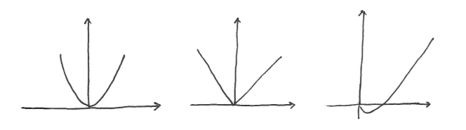
- **凹函数(Concave)定义**
    - 如果 $-f$ 为凸函数，则称函数 $f$ 是凹的
    - 如果函数总是位于任何一条弦的上面，则该函数是凹的
    - 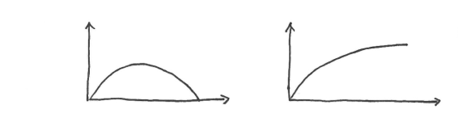

- **定理**：如果函数 $f$ 在某个区间上存在非负（正）的二阶导数，则 $f$ 为该区间的凸函数（严格凸函数）。
    - **证明**：
        根据泰勒公式，$f(x)=f(x_0)+f^{\prime}(x_0)(x - x_0)+\frac{f^{\prime\prime}(x^*)}{2}(x - x_0)^2$ ，其中 $x \leq x^* \leq x_0$。根据假设 $f^{\prime\prime}(x^*)\geq0$，上式末项非负。
        设 $x_0 = \lambda x_1+(1 - \lambda)x_2$ ，
        - 取 $x = x_1$，可得 $f(x_1)\geq f(x_0)+f^{\prime}(x_0)((1 - \lambda)(x_1 - x_2))$  ①；
        - 取 $x = x_2$，可得 $f(x_2)\geq f(x_0)+f^{\prime}(x_0)(\lambda(x_2 - x_1))$  ②。

        ①$\times\lambda+$②$\times(1 - \lambda)$ ：
        $$
        \begin{align*}
        \lambda f(x_1)+(1 - \lambda)f(x_2)&\geq\lambda f(x_0)+\lambda f^{\prime}(x_0)((1 - \lambda)(x_1 - x_2))\\
        &+(1 - \lambda)f(x_0)+(1 - \lambda)f^{\prime}(x_0)\lambda(x_2 - x_1)\\
        &=f(x_0)\\
        &=f(\lambda x_1+(1 - \lambda)x_2)
        \end{align*}
        $$ 

#### Jensen不等式
- **Jensen不等式**：若给定凸函数 $f$ 和一个随机变量 $X$，则
    $$E(f(X))\geq f(E(X))$$
- 若 $f$ 是严格凸的，上式等号成立时 $X = E(X)$，即 $X$ 是个常量。

    - **证明**：
        对于两点分布 $\begin{bmatrix}x_1&x_2\\p_1&p_2\end{bmatrix}$，$f$ 是凸函数，因此有$p_1f(x_1)+p_2f(x_2)\geq f(p_1x_1 + p_2x_2)$，即满足 $E(f(X))\geq f(E(X))$ 
        假定当分布点数为 $k - 1$ 时，定理成立，此时记 $p_i^{\prime}=\frac{p_i}{1 - p_k}$ $(i = 1,2,\cdots,k - 1)$ 
        $$
        \begin{align*}
        \sum_{i = 1}^{k}p_if(x_i)&=p_kf(x_k)+(1 - p_k)\sum_{i = 1}^{k - 1}p_i^{\prime}f(x_i)\\
        &\geq p_kf(x_k)+(1 - p_k)f(\sum_{i = 1}^{k - 1}p_i^{\prime}x_i)\\
        &\geq f(p_kx_k+(1 - p_k)\sum_{i = 1}^{k - 1}p_i^{\prime}x_i)\\
        &=f(\sum_{i = 1}^{k}p_ix_i)
        \end{align*}
        $$
        - 其中，“分布点数为 $k - 1$ 时定理成立”用于推导第二步；“$f$ 的下凸性”用于推导第三步

- **对凹函数**：
    - 若 $f(x)$ 是凹函数，则有 $E(f(X))\leq f(E(X))$
    - 取 $f(x)=\log(x)$ ，有 $E[\log(X)]\leq\log(E(X))$

#### 信息不等式/相对熵的非负性
- **[信息不等式](#相对熵)**：设 $p(x)$、$q(x)$（$x\in X$）为两个概率密度函数，则
    $$D(p||q)\geq0$$ 当且仅当对任意 $x$，$p(x) = q(x)$，等号成立。
    - **证明**：
        设 $A = \{x: p(x)>0\}$ 为 $p(x)$ 的支撑集，则
        $$
        \begin{align*}
        -D(p||q)&=-\sum_{x\in A}p(x)\log\frac{p(x)}{q(x)}=\sum_{x\in A}p(x)\log\frac{q(x)}{p(x)}\\
        &\leq\log\sum_{x\in A}p(x)\frac{q(x)}{p(x)}（由Jensen不等式）\\
        &=\log\sum_{x\in A}q(x)\\
        &\leq\log\sum_{x\in X}q(x)\\
        &=\log1 = 0
        \end{align*}
        $$ $\therefore D(p||q)\geq0$ ，当 $p(x)=q(x)$ 时，等号成立。 

#### 互信息的非负性
- **[互信息的非负性](#互信息)**：任意两个随机变量 $X$，$Y$，
$$I(X;Y)\geq0$$ 当且仅当 $X$，$Y$ 相互独立，等号成立。
    - **证明**：
    $$
    \begin{align*}
    I(X;Y)&=\sum_{x,y}p(x,y)\log\frac{p(x|y)}{p(x)}\\
    &=\sum_{x,y}p(x,y)\log\frac{p(x|y)p(y)}{p(x)p(y)}\\
    &=\sum_{x,y}p(x,y)\log\frac{p(x,y)}{p(x)p(y)}\\
    &=D(p(x,y)\|p(x)p(y))\\
    &\geq0
    \end{align*}
    $$
- **推论**：
    - $D(p(y|x)\|q(y|x))\geq0$ ，当且仅当对任意的 $y$ 以及满足 $p(x)>0$ 的 $x$，有 $p(y|x)=q(y|x)$，等号成立。 
    - $I(X;Y|Z)\geq0$ ，当且仅当 $p(x,y|z)=p(x|z)p(y|z)$ 时，等号成立。 

### 熵的性质
1. **非负性**
    - $$H(X)=\sum_{i}p(x_i)\log\frac{1}{p(x_i)}\geq0$$

2. **确定性**
    - $$H(0,1)=H(1,0,\cdots,0)=0$$
    - 只要有一个事件概率为1，熵就为0。

3. **对称性**
    - $$H(p_1,p_2,\cdots,p_n)=H(p_2,p_1,\cdots,p_n)$$

4. **香农辅助定理**
    - 任意n维概率矢量 $P = (p_1,p_2,\cdots,p_n)$ ，$Q=(q_1,q_2,\cdots,q_n)$ 
    - $$H(p_1,p_2,\cdots,p_n)=\sum_{i = 1}^{n}p_i\log\frac{1}{p_i}\leq\sum_{i = 1}^{n}p_i\log\frac{1}{q_i}$$
    - **证明**：$D(P\|Q)=\sum_{i}p_i\log\frac{p_i}{q_i}\geq0$

5. **最大熵定理**
    - $$H(X)\leq H(\frac{1}{M},\frac{1}{M},\cdots,\frac{1}{M}) = \log M$$
    - $M$：信源符号个数
    - 符号等概率出现时，熵最大。
    - **证明**：$X$ 的两种概率分布 $P$、$u$，$u(x)=\frac{1}{M}$ 
        $$
        \begin{align*}
        D(P\|u)&=\sum p(x)\log\frac{p(x)}{u(x)}\\
        &=\sum p(x)\log p(x)+\sum p(x)\log M\\
        &=-H(X)+\log M\\
        &\geq0\\
        &\therefore H(X)\leq\log M
        \end{align*}
        $$ 

6. **条件熵小于无条件熵**
    - $$H(X|Y)\leq H(X)$$
    - **证明**：$I(X;Y)=H(X)-H(X|Y)\geq0$ ，$H(X)\geq H(X|Y)$ 。 

7. **扩展性**
    - $$\lim_{\varepsilon \to 0}H_{n + 1}(p_1,p_2,\cdots,p_n-\varepsilon,\varepsilon)=H_n(p_1,p_2,\cdots,p_n)$$ 
    - $$\lim_{\varepsilon \to 0}\varepsilon\log\varepsilon = 0$$
    - 信源取值增多时，若这些取值概率很小($\varepsilon\to0$)，信源熵不变。

8. **可加性**
    - $$H(X,Y)=H(X)+H(Y|X)$$
    - 当 $X$，$Y$ 相互独立时，$H(X,Y)=H(X)+H(Y)$ 。
    - **证明**：
        $$
        \begin{align*}
        H(X,Y)&=\sum p(x,y)\log p(x,y)=\sum p(x,y)\log (p(x)p(y|x))\\
        &=\sum p(x,y)\log p(x)+\sum p(x,y)\log p(y|x)\\
        &=H(X)+H(Y|X)
        \end{align*}
        $$

9. **递增性**
    -   $$
        H_{n + m - 1}(p_1,p_2,\cdots,p_{n - 1},q_1,q_2,\cdots,q_m)\\
        = H_n(p_1,p_2,\cdots,p_n)+p_nH_m\left(\frac{q_1}{p_n},\frac{q_2}{p_n},\cdots,\frac{q_m}{p_n}\right)
        $$
    - 其中$\sum_{i = 1}^{n}p_i = 1$，$\sum_{j = 1}^{m}q_j = p_n$ 
    - 利用上式：
        $$
        \begin{align*}
        H_n(p_1,p_2,\cdots,p_n)&=H_{n - 1}(p_1,p_2,\cdots,p_{n - 1}+p_n)+\\
        \quad &(p_{n - 1}+p_n)H_2\left(\frac{p_{n - 1}}{p_{n - 1}+p_n},\frac{p_n}{p_{n - 1}+p_n}\right)
        \end{align*}
        $$ 

### 对数和不等式及其应用
#### 对数和不等式
- 非负数 $a_1,a_2,\cdots,a_n$，和 $b_1,b_2,\cdots,b_n$ ，约定 $0\log 0 = 0$，$a\log\frac{a}{0}=\infty$，$0\log\frac{0}{b}=0$
    $$
    \sum_{i = 1}^{n}a_i\log\frac{a_i}{b_i}\geq\left(\sum_{i = 1}^{n}a_i\right)\log\frac{\sum_{i = 1}^{n}a_i}{\sum_{i = 1}^{n}b_i}
    $$ 当且仅当 $\frac{a_i}{b_i} =$ 常数时，等号成立。
    - **证明**：
        假定 $a_i>0$，$b_i>0$ ，$f(t)=t\log t$ 是严格下凸，因为 $f^{\prime\prime}(t)=\frac{1}{t}\log e>0$。
        因此，由Jensen不等式，有 $\sum\alpha_if(t_i)\geq f(\sum\alpha_it_i)$，其中 $\alpha_i\geq0$，$\sum\alpha_i = 1$。
        令 $\alpha_i=\frac{b_i}{\sum_{j = 1}^{n}b_j}$ ，$t_i=\frac{a_i}{b_i}$ ，可得
        $$
        \begin{align*}
        \sum\frac{b_i}{\sum_{j = 1}^{n}b_j}\cdot\frac{a_i}{b_i}\log\frac{a_i}{b_i}&\geq\left(\sum\alpha_it_i\right)\log\left(\sum\alpha_it_i\right)\\
        &=\sum\left(\frac{b_i}{\sum_{j = 1}^{n}b_j}\cdot\frac{a_i}{b_i}\right)\log\left(\sum\frac{b_i}{\sum_{j = 1}^{n}b_j}\cdot\frac{a_i}{b_i}\right)\\
        \sum_{i}a_i\log\frac{a_i}{b_i}&\geq\left(\sum_{i}a_i\right)\log\left(\sum_{i}\frac{a_i}{\sum_{j = 1}^{n}b_j}\right)\\
        \sum_{i}a_i\log\frac{a_i}{b_i}&\geq\left(\sum_{i}a_i\right)\log\frac{\sum_{i = 1}^{n}a_i}{\sum_{i = 1}^{n}b_j}
        \end{align*}
        $$

#### 相对熵的下凸性
- $D(p||q)$ 关于 $(p,q)$ 是下凸的
- 即如果 $(p_1,q_1)$，$(p_2,q_2)$ 为两对概率密度函数，则对所有的 $0\leq\lambda\leq1$，有
    $$D(\lambda p_1+(1 - \lambda)p_2\|\lambda q_1+(1 - \lambda)q_2)\leq\lambda D(p_1\|q_1)+(1 - \lambda)D(p_2\|q_2)$$
    - **证明**：
        已知 $\sum_{i = 1}^{n}a_i\log\frac{a_i}{b_i}\geq\left(\sum_{i = 1}^{n}a_i\right)\log\frac{\sum_{i = 1}^{n}a_i}{\sum_{i = 1}^{n}b_i}$ 
        令 $a_1 = \lambda p_1(x)$ ，$b_1 = \lambda q_1(x)$ 
        $a_2=(1 - \lambda)p_2(x)$ ，$b_2=(1 - \lambda)q_2(x)$ 
        $$
        \begin{align*}
        &\quad \lambda p_1(x)\log\frac{\lambda p_1(x)}{\lambda q_1(x)}+(1 - \lambda)p_2(x)\log\frac{(1 - \lambda)p_2(x)}{(1 - \lambda)q_2(x)}\\
        &\geq(\lambda p_1(x)+(1 - \lambda)p_2(x))\log\frac{\lambda p_1(x)+(1 - \lambda)p_2(x)}{\lambda q_1(x)+(1 - \lambda)q_2(x)}\\
        &\quad \sum_{x}\left[\lambda p_1(x)\log\frac{p_1(x)}{q_1(x)}+(1 - \lambda)p_2(x)\log\frac{p_2(x)}{q_2(x)}\right]\\
        &\geq\sum_{x}(\lambda p_1(x)+(1 - \lambda)p_2(x))\log\frac{\lambda p_1(x)+(1 - \lambda)p_2(x)}{\lambda q_1(x)+(1 - \lambda)q_2(x)}\\
        &\quad \lambda D(p_1\|q_1)+(1 - \lambda)D(p_2\|q_2)\\
        &\geq D(\lambda p_1+(1 - \lambda)p_2\|\lambda q_1+(1 - \lambda)q_2)
        \end{align*}
        $$ 

#### 熵的凹性
- $H(p)$ 是关于 $p$ 的凹函数。
    - **证明**：
        均匀分布 $u(x_i)=\frac{1}{M}$ 
        $$
        \begin{align*}
        D(p\|u)&=\sum_{i}p(x_i)\log\frac{p(x_i)}{u(x_i)}\\
        &=\sum_{i}p(x_i)\log p(x_i)-\sum_{i}p(x_i)\log u(x_i)\\
        &=-H(p)+\log M
        \end{align*}
        $$ $\therefore H(p)=\log M - D(p\|u)$，因为 $D(p\|u)$ 是凸函数，所以 $H(p)$ 是凹函数。 

#### 互信息的凹凸性
- **[互信息的凹凸性](#互信息)**
    - 设 $(X,Y)\sim p(x,y)=p(x)p(y|x)$。
    - 如果固定 $p(y|x)$，则互信息 $I(X;Y)$ 是关于 $p(x)$ 的凹函数；
    - 如果固定 $p(x)$，则互信息 $I(X;Y)$ 是关于 $p(y|x)$ 的凸函数。
- **证明**：
    1. **证明第一部分**
    $$I(X;Y)=H(Y)-H(Y|X)=H(Y)-\sum_{x}p(x)H(Y|X = x)$$ 如果固定 $p(y|x)$，$p(y)=\sum_{x}p(x,y)=\sum_{x}p(x)p(y|x)$ 是 $p(x)$ 的线性函数。
    $H(Y)$ 是关于 $p(y)$ 的凹函数，因而也是关于 $p(x)$ 的凹函数。上式第二项是关于 $p(x)$ 的线性函数，因此它们的差仍是关于 $p(x)$ 的凹函数。

    2. **证明第二部分**
        - **方法1**：
        固定 $p(x)$，考虑两个不同的条件分布 $p_1(y|x)$ 和 $p_2(y|x)$。相应的联合分布分别为 $p_1(x,y)=p(x)p_1(y|x)$ 和 $p_2(x,y)=p(x)p_2(y|x)$，且各自的边际分布为 $p(x),p_1(y)$ 和 $p(x),p_2(y)$。
        考虑条件分布
        $$p_{\lambda}(y|x)=\lambda p_1(y|x)+(1 - \lambda)p_2(y|x)$$ 
        它是 $p_1(y|x)$ 和 $p_2(y|x)$ 的组合，其中 $0\leq\lambda\leq1$。
        相应的联合分布也是对应的两个联合分布的线性组合
        $$p_{\lambda}(x,y)=\lambda p_1(x,y)+(1 - \lambda)p_2(x,y)$$
        $Y$ 的分布也是一个组合
        $$p_{\lambda}(y)=\lambda p_1(y)+(1 - \lambda)p_2(y)$$
        因此，如果设 $q_{\lambda}(x,y)=p(x)p_{\lambda}(y)$ 为边际分布的乘积，则有
        $$q_{\lambda}(x,y)=\lambda q_1(x,y)+(1 - \lambda)q_2(x,y)$$
        由于互信息是联合分布和边际分布乘积的相对熵，有
        $$I(X;Y)=D(p_{\lambda}(x,y)\|q_{\lambda}(x,y))$$
        因为相对熵 $D(p\|q)$ 是关于 $(p,q)$ 的凸函数，因此 $I(X;Y)$ 是 $(p_{\lambda},q_{\lambda})$ 的凸函数，由于 $p_{\lambda},q_{\lambda}$ 都是 $p(y|x)$ 的线性组合，所以 $I(X;Y)$ 是条件分布 $p(y|x)$ 的凸函数。

        - **方法2**：
        设 $p(x)$ 为固定信源分布，令 $p_1(y|x)$ 和 $p_2(y|x)$ 为两条不同信道，相应的互信息分别记为 $I[p_1(y|x)]$ 和 $I[p_2(y|x)]$。
        令 $p(y|x)=\lambda p_1(y|x)+(1 - \lambda)p_2(y|x)$，$0\leq\lambda\leq1$，相应的互信息为 $I[p(y|x)]$
        $$
        \begin{align*}
        ①\ &I[p(y|x)]-\lambda I[p_1(y|x)]-(1 - \lambda)I[p_2(y|x)]\\
        &=\sum_{x,y}p(x,y)\log\frac{p(y|x)}{p(y)}-\sum_{x,y}\lambda p_1(x,y)\log\frac{p_1(y|x)}{p_1(y)}-\\&\quad \sum_{x,y}(1 - \lambda)p_2(x,y)\log\frac{p_2(y|x)}{p_2(y)}\\
        &=\sum_{x,y}[\lambda p_1(x,y)+(1 - \lambda)p_2(x,y)]\log\frac{p(y|x)}{p(x)}-\\&\quad\sum_{x,y}\lambda p_1(x,y)\log\frac{p_1(y|x)}{p(x)}-\sum_{x,y}(1 - \lambda)p_2(x,y)\log\frac{p_2(y|x)}{p(x)}\\
        &=\lambda\underbrace{\sum_{x,y}p_1(x,y)\log\frac{p(x|y)}{p_1(x|y)}}_{ (②)}+(1 - \lambda)\underbrace{\sum_{x,y}p_2(x,y)\log\frac{p(x|y)}{p_2(x|y)}}_{(③)}
        \end{align*}
        $$
        应用Jensen不等式
        $$
        \begin{align*}
        ②\ \lambda\sum_{x,y}p_1(x,y)\log\frac{p(x|y)}{p_1(x|y)}&\leq\lambda\log\left[\sum_{x,y}p_1(x,y)\frac{p(x|y)}{p_1(x|y)}\right]\\
        &=\lambda\log\left[\sum_{y}p_1(y)\sum_{x}p(x|y)\right]\\
        &=\lambda\log\left[\sum_{y}p_1(y)\sum_{x}\frac{p(x)p(y|x)}{p(y)}\right]\\
        &=\lambda\log1 = 0
        \end{align*}
        $$
        同理 $③ = 0$，则 $① \leq 0$
        $$I(\lambda p_1(y|x)+(1 - \lambda)p_2(y|x))\leq\lambda I[p_1(y|x)]+(1 - \lambda)I[p_2(y|x)]$$
    - 由此可知，互信息 $I(X;Y)$ 关于 $p(y|x)$ 下凸。

## 2.3 数据处理不等式
### 三变量互信息
- **定义**：
    1. **$x_i$与符号对$(y_j,z_k)$间的互信息量**
        - $I(x_i;y_j,z_k)=\log\frac{p(x_i|y_j,z_k)}{p(x_i)}$
    2. **条件互信息量**
        -   $$
            \begin{align*}
            I(x_i;y_j|z_k)&=\log\frac{p(x_i|y_j,z_k)}{p(x_i|z_k)}=\log(\frac{p(x_i|y_j,z_k)}{p(x_i)}\frac{p(x_i)}{p(x_i|z_k)})\\
            &=\log\frac{p(x_i|y_j,z_k)}{p(x_i)}-\log\frac{p(x_i|z_k)}{p(x_i)}\\
            &=I(x_i;y_j,z_k)-I(x_i;z_k)
            \end{align*}
            $$
        - $I(x_i;y_j,z_k)=I(x_i;z_k)+I(x_i;y_j|z_k)$
        - 对其求平均可得
            - $I(X;Y,Z)=I(X;Z)+I(X;Y|Z)$
            - $I(X;Y,Z)=I(X;Z,Y)=I(X;Y)+I(X;Z|Y)$ ①
    3. **$x_i，y_j$与符号对$(z_k)$间的互信息量**
        -   $$
            \begin{align*}
            I(x_i,y_j;z_k)&=\log\frac{p(x_iy_j|z_k)}{p(x_iy_j)}=\log\frac{p(x_i|z_k)p(y_j|x_iz_k)}{p(x_i)p(y_j|x_i)}\\
            &=\log\frac{p(x_i|z_k)}{p(x_i)}+\log\frac{p(y_j|x_iz_k)}{p(y_j|x_i)}\\
            &=I(x_i;z_k)+I(y_j;z_k|x_i)
            \end{align*}
            $$
        - 对其求平均可得
            - $I(X,Y;Z)=I(X;Z)+I(Y;Z|X)$
            - $I(X,Y;Z)=I(Y,X;Z)=I(Y;Z)+I(X;Z|Y)$ ②
- **互信息操作**：
    - 由①、②：
        - $I(X;Z|Y)=I(X;Y,Z)-I(X;Y)$
            - 把条件$Y$移到分号后面，然后减去该条件与分号前面的变量之间的互信息
            - $Y$的条件下$X和Z$+ $X和Y$ = $X和(Y,Z)$
        - $I(X;Z|Y)=I(X,Y;Z)-I(Y;Z)$
            - 把条件$Y$移到分号前面，然后减去该条件与分号后面的变量之间的互信息
    -   $I(X;Z|Y,W)=I(X;Z,Y|W)-I(X;Y|W)=I(X,Y;Z|W)-I(Y;Z|W)$
    -   $$
        \begin{align*}
        I(X;Y|Z)&=\sum_{i,j,k} p(x_i,y_j,z_k)\log\frac{p(x_i|y_j,z_k)}{p(x_i|z_k)}\\
        &=\sum_{i,j,k} p(x_i,y_j,z_k)\log p(x_i|y_j,z_k)-\sum_{i,j,k} p(x_i,y_j,z_k)\log p(x_i|z_k)\\
        &=H(X|Z)-H(X|Y,Z)\\
        &=H(Y|Z)-H(Y|X,Z)\\
        &=I(Y;X|Z)
        \end{align*}
        $$
- **三变量通用信息图**：
    - 信息图表示：
        - $H/I \Longleftrightarrow $区域
        - $, \Longleftrightarrow \bigcup$(并集)
        - $; \Longleftrightarrow \bigcap$(交集)
        - $| \Longleftrightarrow -$ (减)
    - 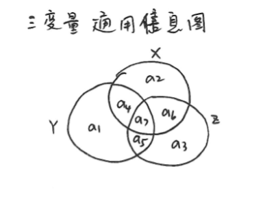
    - 不相变的7个区域分别表示
        - $a_1:H(Y|X,Z)$ 
        - $a_2:H(X|Y,Z)$ 
        - $a_3:H(Z|X,Y)$
        - $a_4:I(X;Y|Z)$  
        - $a_5:I(Y;Z|X)$ 
        - $a_6:I(X;Z|Y)$ 
        - $a_7:I(X;Y;Z)=I(X;Y)-I(X;Y|Z)$
    - 一般情况下，$a_7$可能为负，即$I(X;Y;Z)$可能小于 0 。
- 示例：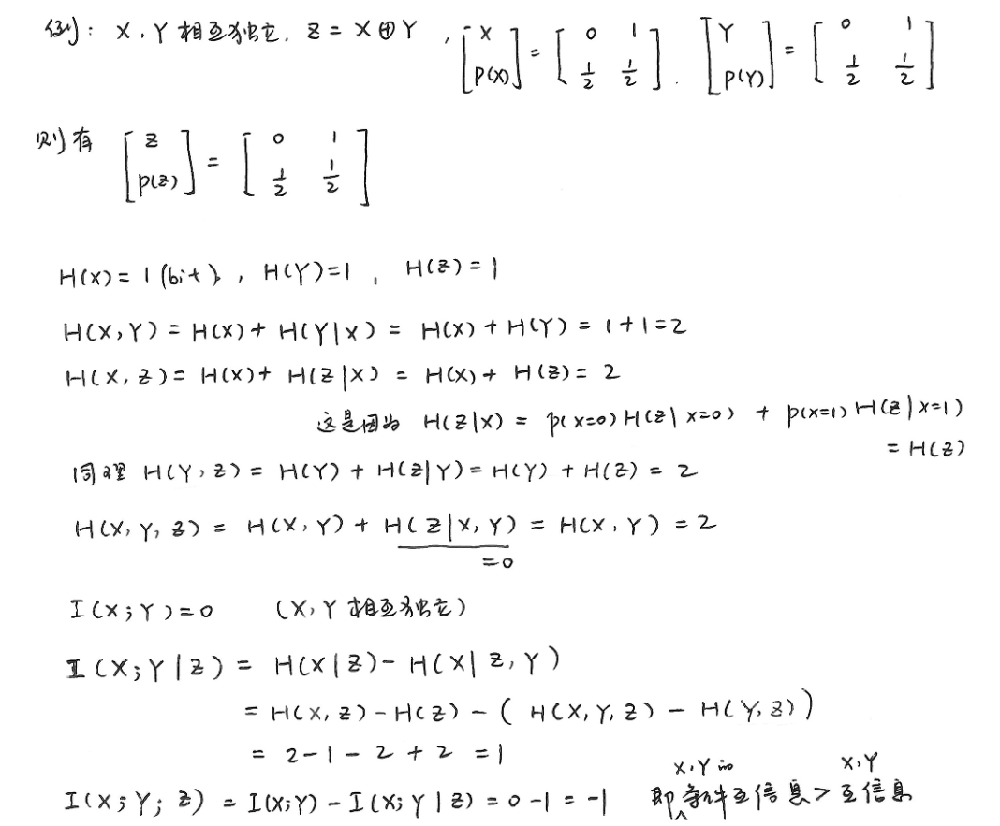

### 一阶马尔可夫链
#### 定义
1. **定义（两变量独立）**
    - 两个随机变量 $X$ 和 $Y$ 独立，记为 $X\perp Y$，有
    $$p(x,y)=p(x)p(y)$$

2. **定义（相互独立）**
    - 设 $n\geq3$，随机变量 $X_1,X_2,\cdots,X_n$ 相互独立，有
    $$p(x_1,x_2,\cdots,x_n)=p(x_1)p(x_2)\cdots p(x_n)$$

3. **定义（条件独立）**
    - 随机变量 $X$，$Y$ 和 $Z$，若 $X$ 与 $Z$ 关于 $Y$ 条件独立，记为 $X\perp Z|Y$
    - 有 $p(x,y,z)p(y)=p(x,y)p(y,z)$ 或 $p(x,z|y)=p(x|y)p(z|y)$
    - 等价地
        $$p(x,y,z)=p(x)p(y|x)p(z|y)$$

4. **定义（马尔可夫链）**
    - 随机变量 $X_1,X_2,\cdots,X_n$（$n\geq3$）构成一个马尔可夫链，记作 $X_1 \to X_2 \to \cdots \to X_n$，则有
        $$p(X_1,X_2,\cdots,X_n)p(X_2)p(X_3)\cdots p(X_{n - 1}) = p(X_1,X_2)p(X_2,X_3)\cdots p(X_{n - 1},X_n)$$
    - 或等价地
        $$p(X_1,X_2,\cdots,X_n)=p(X_1)p(X_2|X_1)p(X_3|X_2)\cdots p(X_n|X_{n - 1})$$
    - 即系统在时刻$n$ 的状态只取决于时刻$n-1$ 的状态，而与时刻$n-1$ 之前的状态无关
    - 可见：$X \to Y \to Z$ 等价于 $X\perp Z|Y$

#### 结论
1. $X_1 \to X_2 \to \cdots \to X_n$ 构成一个马尔可夫链，则有 $X_n \to X_{n - 1} \to \cdots \to X_1$ 也构成一个马尔可夫链。（可由马尔可夫链定义的对称性直接得到）。
2. $X_1 \to X_2 \to \cdots \to X_n$ 构成一个马尔可夫链，则有
    $$
    \begin{align*}
    &X_1 \to X_2 \to X_3\\
    &(X_1,X_2) \to X_3 \to X_4\\
    &\vdots\\
    &(X_1,X_2,\cdots,X_{n - 2}) \to X_{n - 1} \to X_n
    \end{align*}
    $$ 构成马尔可夫链。 
    - **证明**：
        
        $$
        \begin{align*}
        &若X_1 \to X_2 \to X_3 \to X_4构成马尔可夫链，则有\\
        &p(x_1,x_2,x_3,x_4)p(x_2)p(x_3) = p(x_1,x_2)p(x_2,x_3)p(x_3,x_4)\quad ①\\
        &\therefore \sum_{x_4} p(x_1,x_2,x_3,x_4)p(x_2)p(x_3) = \sum_{x_4} p(x_1,x_2)p(x_2,x_3)p(x_3,x_4)\\
        &\therefore p(x_1,x_2,x_3)p(x_2)p(x_3) = p(x_1,x_2)p(x_2,x_3)p(x_3)\\
        &\therefore p(x_1,x_2,x_3)p(x_2) = p(x_1,x_2)p(x_2,x_3)\quad ②\\
        &\Rightarrow X_1 \to X_2 \to X_3 构成马尔可夫链\\
        &把②代入①得 p(x_1,x_2,x_3,x_4)p(x_2)p(x_3) = p(x_1,x_2,x_3)p(x_2)p(x_3,x_4)\\
        &\therefore p(x_1,x_2,x_3,x_4)p(x_3) = p(x_1,x_2,x_3)p(x_3,x_4)\\
        &\Rightarrow (X_1,X_2) \to X_3 \to X_4 构成马尔可夫链
        \end{align*}
        $$
    - 例题：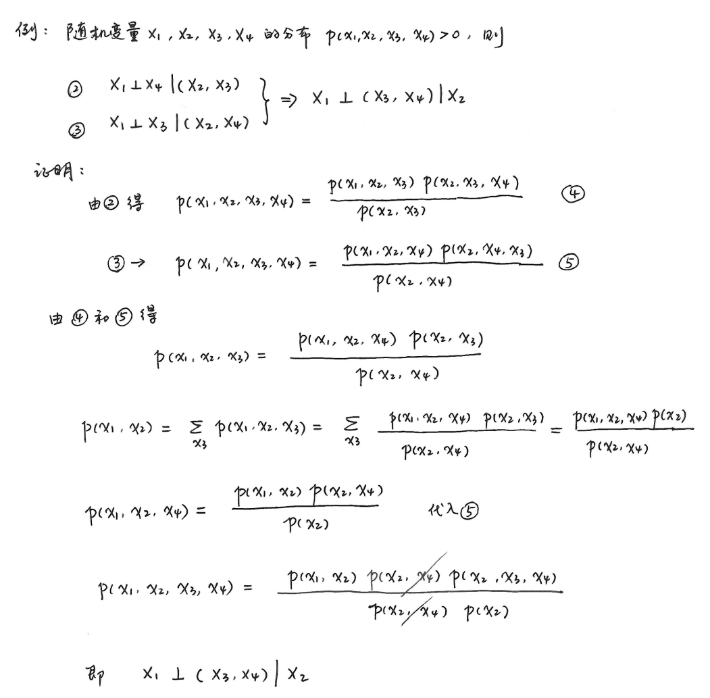
3. $X \to Y \to Z \to W$构成马尔可夫链，则有
    - $H(X|Y)= H(X|YZ) = H(X|YZW)$
        - **证明**：
        由马尔可夫链性质：
        $$
        \begin{align*}
        &p(x,y,z)p(y) = p(x,y)p(y,z)\\
        &\Rightarrow \frac{p(x,y,z)}{p(y,z)} = \frac{p(x,y)}{p(y)}\\
        &\Rightarrow p(x|yz) = p(x|y)\\
        &\Rightarrow \underset{x,y}{\mathbb{E}} p(x|yz)=\underset{x,y}{\mathbb{E}} p(x|y)\\
        &即 H(X|YZ) = H(X|Y)
        \end{align*}
        $$ 类似地：
        $$
        \begin{align*}
        &p(x,y,z,w)p(y)p(z) = p(x,y)p(y,z)p(z,w)\\
        &\Rightarrow p(x,y,z,w) = \frac{p(x,y)}{p(y)} \cdot \frac{p(y,z)p(z,w)}{p(z)} = p(x|y) p(y,z,w)\\
        &\Rightarrow p(x|yzw) = p(x|y)\\
        &即 H(X|Y) = H(X|YZW)
        \end{align*}
        $$
        - 注：$\frac{p(y,z)p(z,w)}{p(z)} = p(y,z,w)$ 由 $Y \to Z \to W$得到
    - $I(X;Z|Y) = H(X|Y)- H(X|YZ) = 0$ 
    - $I(Y;W|Z) = 0$
    - $I(Y;Z) = I(XY;Z) = I(Y;ZW) = I(XY;ZW)$
        - **证明**：
        $I(XY;Z) = I(Y;Z) + I(X;Z|Y) = I(Y;Z)\\
        I(Y;ZW) = I(Y;Z) + I(Y;W|Z) = I(Y;Z)$
    - $I(XY;Z|W) - I(X;Z|W) = I(Y;Z|XW) \geq 0\\
        \Rightarrow I(XY;Z|W) \geq I(X;Z|W)$ 

### 数据处理不等式
- **定理**：若 $X \to Y \to Z$ 构成马尔可夫链，则有 $I(X;Y) \geq I(X;Z)$。
    - **证明**：$$
        \begin{align*}
        &\because I(X;YZ) = I(X;Y) + I(X;Z|Y)= I(X;Z) + I(X;Y|Z)\\
        &\therefore I(X;Y)= I(X;Z) + I(X;Y|Z) - I(X;Z|Y)\\
        &又\because 马尔可夫链 X \to Y \to Z 中，I(X;Z|Y) = 0 且 I(X;Y|Z) \geq 0\\
        &\therefore I(X;Y) \geq I(X;Z)，同理 I(Y;Z) \geq I(X;Z)
        \end{align*}    
        $$ 
- **三变量马尔可夫链的信息图**
    - 对于马尔可夫链 $X \to Y \to Z$ ，其信息图及相关性质如下：
        - 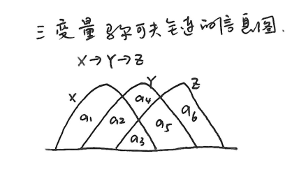
    - **相关等式与性质**：
        - $a_1$ ：条件熵 $H(X|Y) = H(X|Y, Z)$ 。
        - $a_2$ ：条件互信息 $I(X;Y|Z)$ 。
        - $a_3$ ：互信息$I(X;Z) = I(X;Y;Z)= I(X;Y)- I(X;Y|Z) \geq 0$ 。
        - $a_4$ ：条件熵 $H(Y|X, Z)$ 。
        - $a_5$ ：条件互信息 $I(Y;Z|X)$ 。
        - $a_6$ ：条件熵 $H(Z|Y)= H(Z|Y, X)$ 。
    - 由此可见，在马尔可夫链的信息图中，每个不相交的区域值都大于等于 0 。 
- 例题：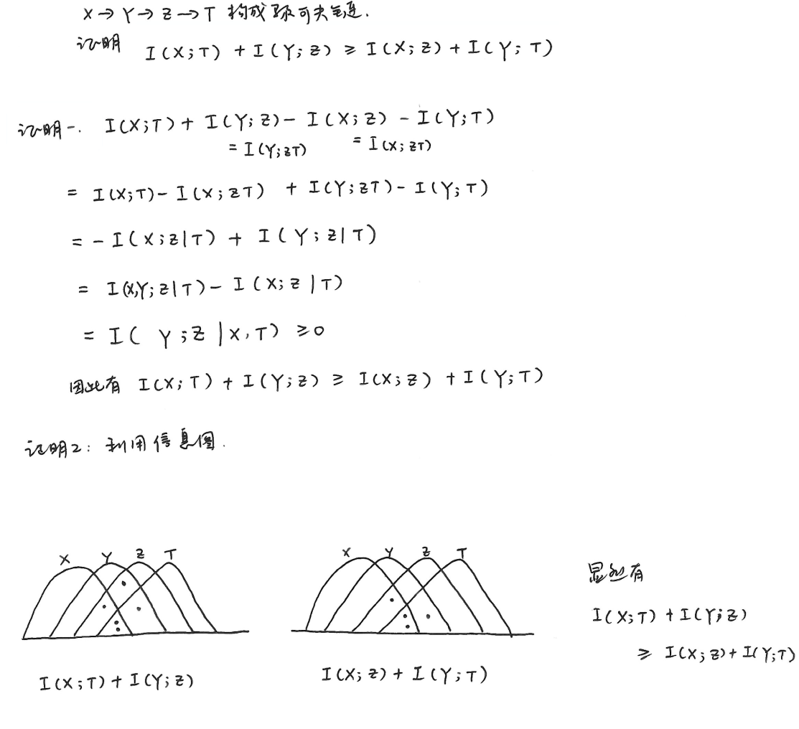

### 费诺不等式
#### 定义
- 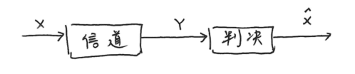
    - 信源发出$X$，信宿收到$Y$，作出判决：认为$X$传出的是$\hat{X}$ 
    - 已知 $p(X, Y)$，$\hat{X}$ 是 $Y$ 的函数
        $$
        \begin{align*}
        \hat{X}(y)&=\arg\underset{x_{i}}{\max} p(x_{i}|y)\\
        &=\arg\underset{x_{i}}{\max} \frac{p(x_{i}|y)p(y)}{p(y)}\\
        &=\arg\underset{x_{i}}{\max} p(x_{i}, y)
        \end{align*}
        $$ 
    - 设 $X$ 和 $\hat{X}$ 取值空间同为 $\mathcal{X}$，$|\mathcal{X}|$ 表示取值个数。
- **定义错误概率** $P_e = \Pr\{X \neq \hat{X}\}$。
    - 若 $P_e = 0$，即 $X = \hat{X}$ 以概率 1 成立，$H(X|\hat{X}) = 0$。
    - 这里讨论 $P_e \neq 0$ 时，$P_e$ 和 $H(X|\hat{X})$ 之间的关系。
- **例题**：
    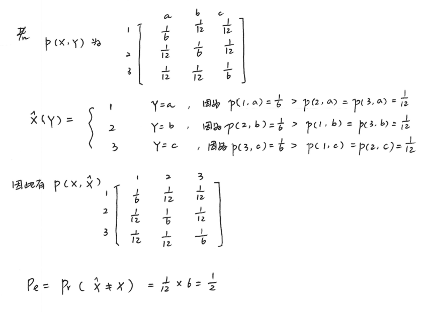

#### 费诺不等式
- 设 $X$ 和 $\hat{X}$ 取值空间同为 $\mathcal{X}$ 的随机变量，则有 $$H(X|\hat{X}) \leq H(P_e)+ P_e \log(|\mathcal{X}|-1)$$ 其中 $H(P_e)=H(P_e, 1 - P_e)$ 为二元熵函数，$|\mathcal{X}|$ 为 $X$ 和 $\hat{X}$ 的取值数量。
- **证明1**:
    定义随机变量 $Z = \begin{cases}0, & 若 X = \hat{X} \\ 1, & 若 X \neq \hat{X} \end{cases}$ ，则 $P_r(Z) = \begin{cases}1 - P_e, & 若 Z = 0 \\ P_e, & 若 Z = 1 \end{cases}$，则$H(Z)=H(P_e, 1 - P_e)=H(P_e)$
    由于 $Z$ 是 $X$ 和 $\hat{X}$ 的函数，有 $H(Z|X\hat{X}) = 0$ ，则
    $$
    \begin{align*}
    H(X|\hat{X})&=H(X|\hat{X})+H(Z|X\hat{X})\\
    &=H(XZ|\hat{X})\\
    &=H(Z|\hat{X})+H(X|Z\hat{X})\\
    &\leq H(Z)+H(X|\hat{X}Z)\\
    &=H(Z)+\Pr(Z = 0)H(X|\hat{X}, Z = 0)+\Pr(Z = 1)H(X|\hat{X}, Z = 1)\\
    &=H(Z)+\Pr(Z = 1)H(X|\hat{X}, Z = 1)\\
    &\leq H(P_e)+P_e\log(|\mathcal{X}|-1) （其中H(X|\hat{X}, Z = 1) \leq \log(|\mathcal{X}|-1)）
    \end{align*}
    $$ 因为 $X \to Y \to \hat{X}$ 构成马尔可夫链，
    所以 $I(X;Y) \geq I(X;\hat{X})$，
    进而 $H(X)-H(X|Y) \geq H(X)-H(X|\hat{X})$，
    即 $H(X|Y) \leq H(X|\hat{X})$。 
- **证明2**（不等式放缩）：见[译码错误与信道条件的关系](./Ch6sup_信道编码定理.md/#译码错误与信道条件的关系)，其中令 $Y = \hat{X}$，$n = |\mathcal{X}|$

#### 费诺不等式（一般形式）
- 对于任何满足 $X \to Y \to \hat{X}$ 的估计量 $\hat{X}$，设 $P_e = \Pr(X \neq \hat{X})$，有：
    $$H(X|Y) \leq H(X|\hat{X}) \leq H(P_e)+ P_e \log(|\mathcal{X}|-1)$$ 其中 $\mathcal{X}$ 为 $X$ 的取值空间。
- 上述不等式可以减弱为：
    $$H(X|Y) \leq 1 + P_e \log|\mathcal{X}|$$   或者
    $$P_e \geq \frac{H(X|Y) - 1}{\log|\mathcal{X}|}$$ 

- **推论**：对于任意两个随机变量 $X$ 和 $Y$，设 $p = \Pr(X \neq Y)$，有 
    $$H(X|Y) \leq H(p)+ p \log|\mathcal{X}|$$ 
    在费诺不等式中令 $\hat{X} = Y$，即可得到上式。 

#### 其他不等式
- 设 $X$ 和 $X'$ 为两个相互独立的随机变量，且 $X \sim p(x)$，$X' \sim r(x)$，那么 $X = X'$ 的概率为 $\Pr(X = X')=\sum_{x} p(x)r(x)$，有如下不等式：

    1. 如果 $X$ 和 $X'$ 独立同分布，具有相同的熵 $H(X)$，则 $X = X'$ 的概率为 $\Pr(X = X')=\sum_{x} p^2(x)$，且有 $$\Pr(X = X') \geq 2^{-H(X)}$$ 当且仅当 $X$ 服从均匀分布，等号成立。
        - **证明**：
            假定 $X \sim p(x)$，由Jensen不等式，令 $f(y) = 2^y$ 为下凸函数。
            则 $f(E(Y)) \leq E(f(Y))$ ，令 $y=\log p(x)$，则有：
            $$
            \begin{align*}
            2^{-H(X)}&=2^{\sum_{x} p(x)\log p(x)}\\
            &\leq \sum_{x} p(x)2^{\log p(x)}\\
            &=\sum_{x} p(x)p(x)\\
            &=\sum_{x} p^2(x)\\
            &=\Pr(X = X')
            \end{align*}
            $$ 所以 $2^{-H(X)} \leq \Pr(X = X')$ ，当且仅当 $X$ 服从均匀分布时，Jensen不等式取等，上式等号成立。

    2. 设 $X$ 和 $X'$ 相互独立，且 $X \sim p(x)$，$X' \sim r(x)$，$x,x' \in \mathcal{X}$，则
        $$
        \Pr(X = X') \geq 2^{-H(p)-D(p||r)}\\
        \Pr(X = X') \geq 2^{-H(r)-D(r||p)}
        $$
        - **证明**：
            $$
            \begin{align*}
            2^{-H(p)-D(p||r)}&=2^{\sum p(x)\log p(x)+\sum p(x)\log \frac{r(x)}{p(x)}}\\
            &=2^{\sum p(x)\log r(x)}\\
            &\leq \sum p(x)2^{\log r(x)}\\
            &=\sum p(x)r(x)\\
            &=\Pr(X = X')
            \end{align*}
            $$

- **例题**：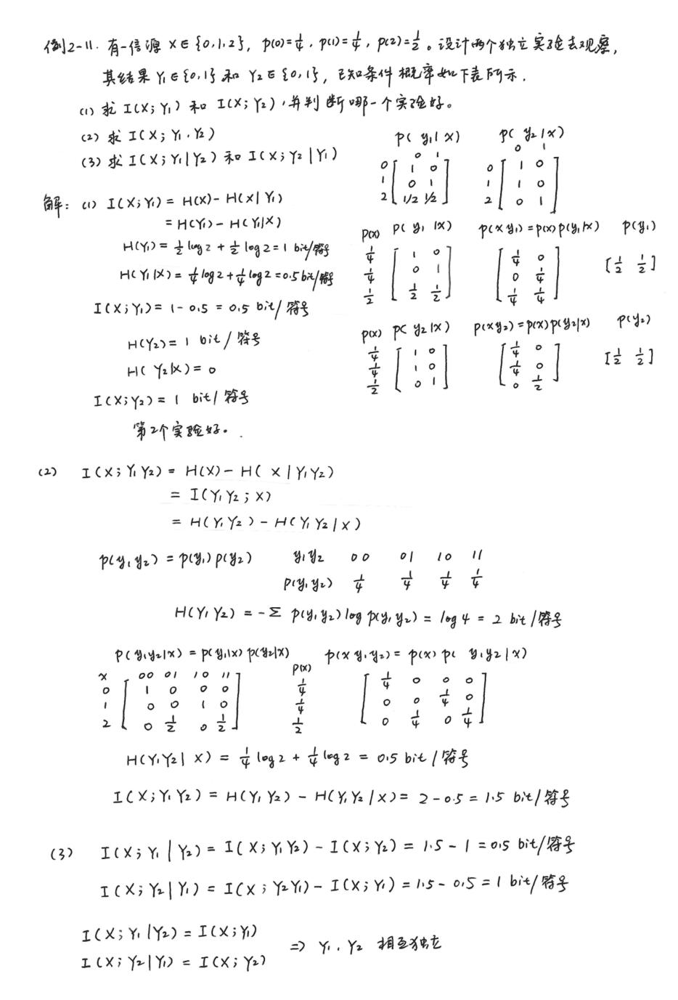

## 2.4 离散序列信源的熵
### 离散无记忆信源的序列熵
- 随机序列$\vec{X}=(X_1, X_2, \cdots, X_L)$，其中$X_l \in \{x_1, x_2, \cdots, x_n\}$，$l = 1, 2, \cdots, L$
- $p(\vec{X}=\vec{x_{i}}) = p(X_1 = x_{i1}, X_2 = x_{i2}, \cdots, X_L = x_{iL})$，这里$i = 1, 2, \cdots, n^L$，$i_l = 1, 2, \cdots, n$
- **定义信息熵$H(\vec{X})$为**：
    $$
    \begin{align*}
    H(\vec{X}) &= -\sum_{i = 1}^{n^L}p(\vec{x_{i}})\log p(\vec{x_{i}})\\
    &=-\sum_{i_1 = 1}^{n}\sum_{i_2 = 1}^{n}\cdots\sum_{i_L = 1}^{n}p(x_{i1}, x_{i2}, \cdots, x_{iL})\log p(x_{i1}, x_{i2}, \cdots, x_{iL})
    \end{align*}
    $$
-   $$
    \begin{align*}
    p(\vec{X}=\vec{x_{i}})&=p(x_{i1}, x_{i2}, \cdots, x_{iL})\\
    &=p(x_{i1})p(x_{i2}|x_{i1})p(x_{i3}|x_{i1}x_{i2})\cdots p(x_{iL}|x_{i1}x_{i2}\cdots x_{iL - 1})\\
    &\overset{无记忆}{=}p(x_{i1})p(x_{i2})\cdots p(x_{iL})
    \end{align*}
    $$ 则 $$
    \begin{align*}
    H(\vec{X})&=-\sum_{i_1 = 1}^{n}\sum_{i_2 = 1}^{n}\cdots\sum_{i_L = 1}^{n}p(x_{i1})p(x_{i2})\cdots p(x_{iL})[\log p(x_{i1})+\log p(x_{i2})\\
    &\quad +\cdots+\log p(x_{iL})]\\
    &=-\sum_{i_1 = 1}^{n}p(x_{i1})\sum_{i_2 = 1}^{n}p(x_{i2})\cdots\sum_{i_L = 1}^{n}p(x_{iL})\log p(x_{i1}) \quad \leftarrow H(X_1)\\
    &\quad -\sum_{i_1 = 1}^{n}p(x_{i1})\sum_{i_2 = 1}^{n}p(x_{i2})\cdots\sum_{i_L = 1}^{n}p(x_{iL})\log p(x_{i2}) \quad \leftarrow H(X_2)\\
    &\quad -\cdots\\
    &=H(X_1)+H(X_2)+\cdots+H(X_L)\\
    &=\sum_{l = 1}^{L}H(X_l)
    \end{align*}
    $$

- 若信源是平稳的，即$H(X_1)=H(X_2)=\cdots=H(X_L)=H(X)$，则$$H(\vec{X}) = L H(X)$$ 
    **用 $H_L(\vec{X})$ 表示长度为 $L$ 的序列平均每个符号的熵**，则
    $$H_L(\vec{X})=\frac{1}{L}H(\vec{X}) = H(X)$$

- 例题：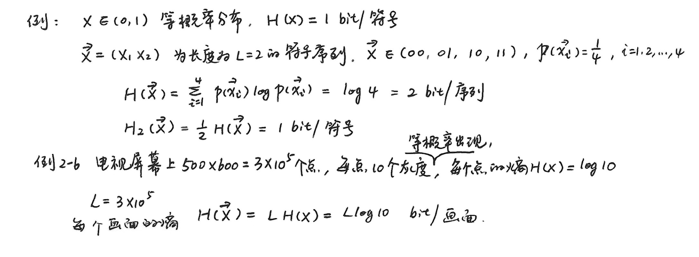

### 离散有记忆信源的序列熵
- 长度为 $L$ 的符号序列 $\vec{X}=(X_1,X_2,\cdots,X_L)$ 
    $$
    \begin{align*}
    H(\vec{X})&=H(X_1,X_2,X_3,\cdots,X_L)\\
    &=H(X_1)+H(X_2|X_1)+H(X_3|X_1X_2)+\cdots+H(X_L|X_1X_2,\cdots,X_{L - 1})
    \end{align*}
    $$
- 记作 $$H(\vec{X}) = H(X^L)=\sum_{l = 1}^{L}H(X_l|X^{l - 1})$$
- 平均每个符号的熵 $$H_L(\vec{X})=\frac{1}{L}H(X^L)$$
- 例题：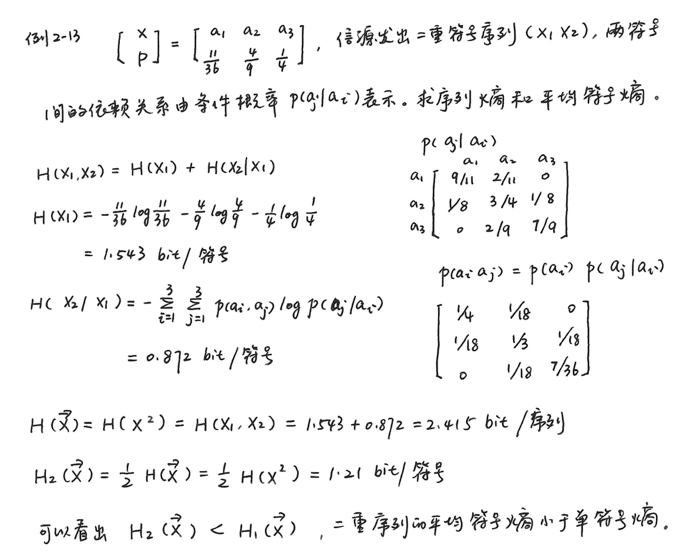

### 离散平稳信源序列熵
#### 定义
- **离散平稳信源**：联合概率具有时间推移不变性。
    $$
    p\{X_{i1}=x_1,X_{i2}=x_2,\cdots,X_{iL}=x_L\} = p\{X_{i1 + k}=x_1,X_{i2 + k}=x_2,\cdots,X_{iL + kh}=x_L\}
    $$

#### 结论
1. $H(X_L|X^{L - 1})$ 是 $L$ 的单调非增函数
    - 依据：条件多的熵小于等于条件少的熵，平稳信源联合/条件概率时间推移不变
    - **证明**：$$
        \begin{align*}
        H(X_L|X_1X_2\cdots X_{L - 1})&\leq H(X_L|X_2X_3\cdots X_{L - 1})\\
        &= H(X_{L - 1}|X_1X_2\cdots X_{L - 2}) \text{（平稳性）}\\
        &\leq H(X_{L - 1}|X_2\cdots X_{L - 2})\\
        &= H(X_{L - 2}|X_1\cdots X_{L - 3})\\
        &\vdots\\
        &\leq H(X_2|X_1)
        \end{align*}
        $$

2. $H_L(\vec{X}) \geq H(X_L|X^{L - 1})$
    - **证明**：$$
        \begin{align*}
        H_L(\vec{X})&=\frac{1}{L}H(X_1,X_2,\cdots,X_L)\\
        &=\frac{1}{L}\sum_{l = 1}^{L}H(X_l|X^{l - 1})\\
        &=\frac{1}{L}(H(X_1)+H(X_2|X_1)+H(X_3|X_1,X_2)+\cdots+H(X_L|X_1X_2,\cdots,X_{L - 1}))\\
        &\geq\frac{1}{L}\cdot L\cdot H(X_L|X_1,X_2,\cdots,X_{L - 1})\\
        &= H(X_L|X_1,X_2,\cdots,X_{L - 1})
        \end{align*}
        $$

3. $H_L(\vec{X})$ 是 $L$ 的单调非增函数
    - **证明**：$$
        \begin{align*}
        L H_L(\vec{X})&=H(X_1,X_2,\cdots,X_L)\\
        &=H(X_1,X_2,\cdots,X_{L - 1})+H(X_L|X_1,X_2,\cdots,X_{L - 1})\\
        &=(L - 1)H_{L - 1}(\vec{X})+H(X_L|X_1,X_2,\cdots,X_{L - 1})\\
        &\leq (L - 1)H_{L - 1}(\vec{X})+H_L(\vec{X})\\
        \therefore (L - 1)H_L(\vec{X})&\leq (L - 1)H_{L - 1}(\vec{X})\\
        H_L(\vec{X})&\leq H_{L - 1}(\vec{X})
        \end{align*}
        $$ 
4. 当 $L \to \infty$ 时，定义$H_{\infty}(\vec{X})$为**极限熵**，有
    $$
    H_{\infty}(\vec{X}) \triangleq \lim_{L \to \infty} H_{L}(\vec{X})=\lim_{L \to \infty} H(X_L|X_1,X_2,\cdots,X_{L - 1})
    $$ 
    - **证明**：
        $$
        \begin{align*}
        H_{L + k}(\vec{X})&=\frac{1}{L + k}[H(X_1,X_2,\cdots,X_{L - 1})+H(X_L|X_1X_2\cdots X_{L - 1})+\\
        &\quad \cdots + H(X_{L + k}|X_1X_2\cdots X_{L + k - 1})]\\
        &\leq\frac{1}{L + k}[H(X_1,X_2,\cdots,X_{L - 1})+H(X_L|X_1X_2\cdots X_{L - 1})+\\
        &\quad H(X_L|X_1X_2,\cdots,X_{L - 1})+\cdots + H(X_L|X_1\cdots X_{L - 1})]\\
        &=\frac{1}{L + k}H(X_1,X_2,\cdots,X_{L - 1})+\frac{k + 1}{L + k}H(X_L|X_1,X_2,\cdots,X_{L - 1})
        \end{align*}
        $$
        当 $k \to \infty$ 时，$\lim_{k \to \infty} H_{L + k}(\vec{X}) \leq H(X_L|X_1,X_2,\cdots,X_{L - 1}) \leq H_{L}(\vec{X})$ 
        当 $L \to \infty$ 时，$H_{L}(\vec{X}) = H_{L + k}(\vec{X})$，得到
        $$
        \lim_{L \to \infty} H_{L}(\vec{X})=\lim_{L \to \infty} H(X_L|X_1,X_2,\cdots,X_{L - 1})
        $$

        若$H_0(X)$ 为等概率无记忆信源单个符号熵，有
        $$
        H_0(X) \geq H_1(X) \geq H_2(\vec{X}) \geq H_3(\vec{X}) \cdots \geq H_{\infty}(\vec{X})
        $$

        **只有极限熵最真实地反映信源的实际情况。**

### 马尔可夫信源的极限熵
- **定义**：
    $$
    H_{\infty}(\vec{X})=\lim_{L \to \infty} H_{L}(\vec{X}) = \lim_{L \to \infty} H(X_L|X_1,X_2,\cdots,X_{L - 1})
    $$
- 实际常取有限长度 $L$ 下的条件熵 $H(X_L|X^{L - 1})$ 作为 $H_{\infty}(\vec{X})$ 的近似值。

- **m阶马尔可夫信源（齐次）的推导**
    $$
    p(X_t|X_1,X_2,\cdots,X_{t - 1}) = p(X_t|X_{t - m},\cdots,X_{t - 1})
    $$ $$
    \begin{align*}
    H_{\infty}(\vec{X})&=\lim_{L \to \infty} H(X_L|X_1,X_2,\cdots,X_{L - 1}) \\
    &= \lim_{L \to \infty} H(X_L|X_{L - m},\cdots,X_{L - 1})\\
    &=H(X_{m + 1}|X_1,X_2,\cdots,X_m)
    \end{align*}
    $$

    对于齐次、稳定马尔可夫链，其状态 $s_i$ 由 $(x_{i1},x_{i2},\cdots,x_{im})$ 唯一确定，所以
    $$
    p(x_{i_{m + 1}}|x_{i1},x_{i2},\cdots,x_{im}) = p(x_{i_{m + 1}}|s_i)
    $$

    上式两边同时取对数，并对 $x_{i1},\cdots,x_{im},x_{i_{m + 1}}$ 和 $s_i$ 取统计平均，再取负，得到：

    $$
    \begin{align*}
    \mathbf{Left}&=-\sum_{i_1,\cdots,i_{m + 1}} p(x_{i1},x_{i2},\cdots,x_{im},x_{i_{m + 1}},s_i) \log p(x_{i_{m + 1}}|x_{i1},x_{i2},\cdots,x_{im})\\
    &=-\sum_{i_1,\cdots,i_{m + 1}} p(x_{i1},\cdots,x_{i_{m + 1}}) \log p(x_{i_{m + 1}}|x_{i1},\cdots,x_{im})\\
    &=H(X_{m + 1}|X_1,X_2,\cdots,X_m)\\
    &=H_{\infty}(\vec{X})\\
    \mathbf{Right}&=-\sum_{i_1,\cdots,i_{m + 1};i} p(x_{i1},x_{i2},\cdots,x_{i_{m + 1}},s_i) \log p(x_{i_{m + 1}}|s_i)\\
    &=-\sum_{i_1,\cdots,i_{m + 1};i} p(x_{i1},x_{i2},\cdots,x_{im},s_i) p(x_{i_{m + 1}}|x_{i1},x_{i2},\cdots,x_{im},s_i) \log p(x_{i_{m + 1}}|s_i)\\
    &=-\sum_{i_{m + 1}} \sum_{i} p(s_i) p(x_{i_{m + 1}}|s_i) \log p(x_{i_{m + 1}}|s_i)\\
    &=\sum_{i} p(s_i) \sum_{i_{m + 1}} p(x_{i_{m + 1}}|s_i) \log \frac{1}{p(x_{i_{m + 1}}|s_i)}\\
    &=\sum_{i} p(s_i) H(X|s_i)
    \end{align*}
    $$

    $$
    \begin{align*}
    \therefore H_{\infty}(\vec{X}) &= \sum_{i} p(s_i) H(X|s_i)\\
    H(X|s_i)&=-\sum_{j} p(x_j|s_i)\log p(x_j|s_i) \\
    &= -\sum_{j} p(s_j|s_i)\log p(s_j|s_i)
    \end{align*}
    $$ 

- 例题：
    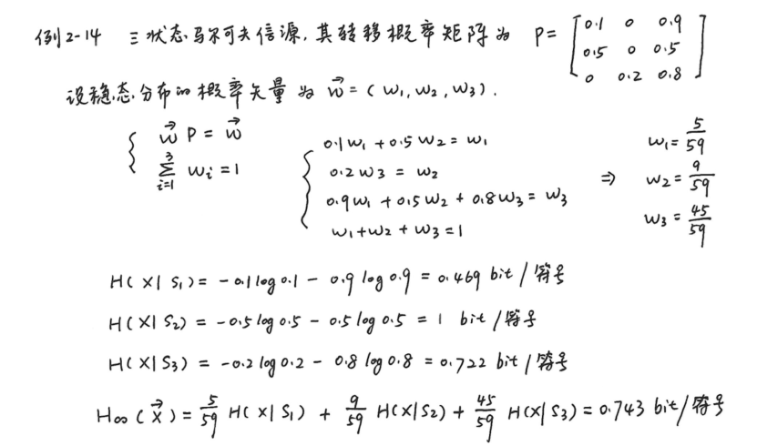

## 2.5 连续信源的熵和互信息
### 微分熵（连续信源熵）
- 详见 **[第二章补充微分熵](Ch2sup_微分熵.md)**
- 微分熵即连续信源熵，记作 $h(X)$ 或 $H_c(X)$ 。

### 幅度连续的单符号信源
#### 连续信源熵
- **定义**：
    - 用n个离散变量逼近连续变量，概率密度函数为 $P_X(x)$ 
        - 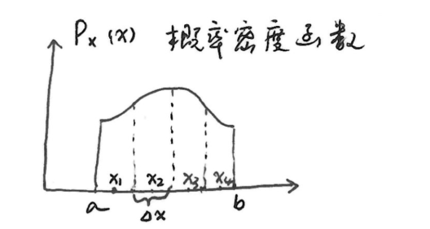
    - 设 $p(x_i)=\int_{a+(i - 1)\Delta x}^{a + i\Delta x}P_X(x)dx=P_X(x_i)\Delta x$ 
    - 离散熵 $$H_n(X)=-\sum_{i = 1}^{n}p(x_i)\log p(x_i)=-\sum_{i = 1}^{n}P_X(x_i)\Delta x\log (P_X(x_i)\Delta x)$$
    - 当 $n\to\infty$，$\Delta x\to0$ 时：
        $$
        H(X)=\lim_{n\to\infty}H_n(X)=-\int_{a}^{b}P_X(x)\log P_X(x)dx-\lim_{\Delta x\to0}\log\Delta x\int_{a}^{b}P_X(x)dx
        $$
        其中 $\int_{a}^{b}P_X(x)dx = 1$ ，后一项趋于无穷大。
    - **定义连续信源熵为** 
        $$H_c(X)=-\int_{-\infty}^{\infty}P_X(x)\log P_X(x)dx$$

- **性质**：
    - 连续信源不确定度为无穷大，熵为无穷大，需要无限多位二进制数表示。
    - 连续信源的熵具有相对性（只有相对意义），在取两熵之差时才具有信息的所有特征。

#### 联合熵、条件熵和互信息
- **联合熵**：
    $$H_c(X,Y)=-\int_{-\infty}^{\infty}\int_{-\infty}^{\infty}P_{X,Y}(x,y)\log P_{X,Y}(x,y)dxdy$$
- **条件熵**：
    $$H_c(Y|X)=-\int_{-\infty}^{\infty}\int_{-\infty}^{\infty}P_{X,Y}(x,y)\log P_Y(y|x)dxdy$$ 
    $$H_c(X,Y)=H_c(X)+H_c(Y|X)=H_c(Y)+H_c(X|Y)$$
- **互信息**：
    $$
    \begin{align*}
    I(X;Y)=I(Y;X)&=H_c(X)-H_c(X|Y)\\
    &=H_c(Y)-H_c(Y|X)\\
    &=H_c(X)+H_c(Y)-H_c(X,Y) 
    \end{align*}
    $$ 

### 波形信源的熵
- 平稳随机过程通过采样变换可得到平稳随机序列，例如：
    - 随机过程 $x(t)$ 变换为 $\vec{X}(X_1, X_2, \cdots, X_L)$ 。
    - 随机过程 $y(t)$ 变换为 $\vec{Y}(Y_1, Y_2, \cdots, Y_L)$ 。
- 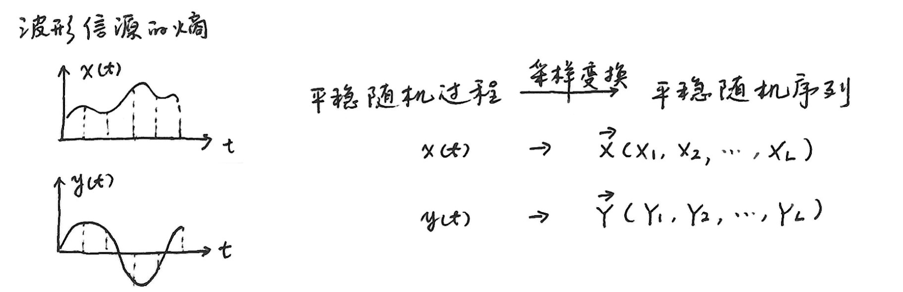

- 相关熵的计算公式如下：
    - $H_c(\vec{X}) = H_c(X_1, X_2, \cdots, X_L)=-\int_{\vec{R}} P_{\vec{X}}(\vec{x})\log P_{\vec{X}}(\vec{x})d\vec{x_{}}$ 
    - $H_c(\vec{Y}|\vec{X}) = H_c(Y_1, Y_2, \cdots, Y_L|X_1, X_2, \cdots, X_L)=-\int_{\vec{R}}\int_{\vec{R}} P_{\vec{X}\vec{Y}}(\vec{x}, \vec{y})\log P_{\vec{Y}}(\vec{y}|\vec{x})d\vec{x}d\vec{y_{}}$ 

- 波形信源熵由上述各项的极限表达式（$L \to \infty$ ）给出：
    - $H_c(x(t)) \triangleq \lim_{L \to \infty} H_c(\vec{X})$ 
    - $H_c(y(t)|x(t)) \triangleq \lim_{L \to \infty} H_c(\vec{Y}|\vec{X})$ 

- 对于**限频 $f_m$，限时 $t_B$** 的平稳随机过程，可用 $L = 2f_mt_B$ 随机矢量表示，且有：
    $$
    \begin{align*}
    H_c(\vec{X}) =& H_c(X_1, X_2, \cdots, X_L)\\
    =&H_c(X_1)+H_c(X_2|X_1)+H_c(X_3|X_1X_2)+\\
    &\cdots+H_c(X_L|X_1,X_2,\cdots,X_{L - 1})\\
    \leq& H_c(X_1)+H_c(X_2)+\cdots + H_c(X_L)
    \end{align*}
    $$ 

### 最大熵定理(连续信源)
1. **无限制条件时**：**最大熵为无穷大**。
2. **限峰功率最大熵定理**
    - **对于定义域为有限的随机变量 $X$，当它是均匀分布时，具有最大熵。**
    - $X$ 幅度取值限制在 $[a, b]$，有 $\int_{a}^{b}P_X(x)dx = 1$ 。
    - 当 $P_X(x)=\begin{cases}\frac{1}{b - a},&a\leq x\leq b\\0,&其他\end{cases}$  时，信息熵最大，
        $$H_c(X)=-\int_{a}^{b}\frac{1}{b - a}\log\frac{1}{b - a}dx=\log(b - a)$$ 
3. **限平均功率最大熵定理**
    - **对于相关矩阵一定的随机变量 $X$，当它是正态分布时具有最大熵。**
    - 概率密度函数 $P_X(x)=\frac{1}{\sqrt{2\pi\sigma^2}}e^{-\frac{(x - \mu)^2}{2\sigma^2}}$
        - 其中 $\mu$ 为均值，$\sigma^2$ 为方差，$\sigma^2=\int (x-\mu)^2P_X(x)dx$ 。
    - 信息熵 $H_c(X)$ 的计算过程如下：
    $$
    \begin{align*}
    H_c(X)&=-\int_{-\infty}^{+\infty}P_X(x)\log P_X(x)dx\\
    &=E[-\log P_X(x)]\\
    &=E\left[-\log\frac{1}{\sqrt{2\pi\sigma^2}}-\log e^{-\frac{(x - m)^2}{2\sigma^2}}\right]\\
    &=E\left[\frac{1}{2}\log(2\pi\sigma^2)+\frac{(x - m)^2}{2\sigma^2}\log e\right]\\
    &=\frac{1}{2}\log(2\pi\sigma^2)+\frac{\log e}{2}\\
    &=\frac{1}{2}\log(2\pi e\sigma^2)
    \end{align*}
    $$

    - **证明**：
        设 $\varphi(x)\sim N(0,\sigma^2)$，$g(x)$ 满足 $\int x^2g(x)dx=\sigma^2$ ，因为 $D(g(x)\| \varphi(x))\geq0$，即：
        $$
        \begin{align*}
        D(g(x)\| \varphi(x))&=\int_{-\infty}^{+\infty}g(x)\log\frac{g(x)}{\varphi(x)}dx\\
        &=\int_{-\infty}^{+\infty}g(x)\log g(x)dx-\int_{-\infty}^{+\infty}g(x)\log\varphi(x)dx\\
        &=-H_c(g(x))-\int_{-\infty}^{+\infty}g(x)\log\varphi(x)dx\\
        &\geq0\\
        \therefore \quad H_c(g(x))&\leq-\int_{-\infty}^{+\infty}g(x)\log\varphi(x)dx
        \end{align*}
        $$

        又因为

        $$
        \begin{align*}
        \int_{-\infty}^{+\infty}g(x)\log\varphi(x)dx &= \int_{-\infty}^{+\infty}g(x)\log\left(\frac{1}{\sqrt{2\pi\sigma^2}}e^{-\frac{x^2}{2\sigma^2}}\right)dx\\
        &=\int_{-\infty}^{+\infty}g(x)\left[-\frac{1}{2}\log(2\pi\sigma^2)-\frac{x^2}{2\sigma^2}\log e\right]dx\\
        &=-\frac{1}{2}\log(2\pi\sigma^2)\int_{-\infty}^{+\infty}g(x)dx-\frac{\log e}{2\sigma^2}\int_{-\infty}^{+\infty}x^2g(x)dx\\
        &=-\frac{1}{2}\log(2\pi e\sigma^2)
        \end{align*}
        $$

        所以 $H_c(g(x))\leq\frac{1}{2}\log(2\pi e\sigma^2)=H_c(\varphi(x))$，当且仅当 $g(x) = \varphi(x)$，为正态分布时等号成立。 

## 2.6 信源的冗余度
- 冗余度也称多余度或剩余度，表示给定信源在实际发出消息时所包含的多余信息。

- **例子**：
    英文字母26个，加上空格共27个符号，则**单符号最大熵**为
    $$H_0(X)=\log_2{27} \approx 4.76 \text{ bit/符号}$$

    对英文书中各符号出现的概率加以统计，可得一组数值。若字母间无记忆，有
    $$H_1(X)= - \sum_{i = 1}^{n}p_i\log p_i = 4.03 \text{ bit/符号}$$

    若考虑2阶、3阶直至高阶平稳信源，有
    $$
    \begin{align*}
    &H_2(X)= 3.32 \text{ bit/符号}\\
    &H_3(X)= 3.1 \text{ bit/符号}\\
    &\cdots\\
    &H_{\infty}(X)=1.4 \text{ bit/符号}\\
    \end{align*}
    $$

    且满足 $H_{\infty} < \cdots < H_3(X) < H_2(X) < H_1(X) < H_0(X)$ 

    若发送消息时用 $H_0(X) = 4.76 \text{ bit}$ 表示一个信源符号，则信源效率为
    $$\eta = \frac{H_{\infty}(X)}{H_0(X)}=\frac{1.4}{4.76}\approx0.29$$

    冗余度$$\gamma = 1 - \eta = 0.71$$ 

    这是因为符号间的相关性、分布不均匀性

- **信源编码**：压缩冗余，提高传输效率
- **信道编码**：加入特殊的冗余，抗干扰，提高可靠性

# 第二章补充 微分熵

## 微分熵预备知识
### 定义

1. **随机变量 $X$ 的均值 $\mu$**：
    - 定义为
        $$\mu = E(X)=\int xf(x)dx$$ 其中 $f(x)$ 为 $X$ 的概率密度函数。

2. **随机变量 $X$ 的方差**：
    - 定义为
        $$
        \begin{align*}
        Var(X)&=E(X - EX)^2 \\
        &= E(X - \mu)^2\\
        &=E(X^{2}-2X\mu+\mu^{2})\\
        &=E(X^{2})-\mu^{2}
        \end{align*}
        $$

3. **两个随机变量 $X$ 和 $Y$ 之间的协方差**：
    - 定义为
    $$Cov(X,Y)=E(X - EX)(Y - EY)=E(XY)-\mu_X\mu_Y$$

4. **对于随机变量 $\vec{X}=[X_1,X_2,\cdots,X_n]^T$（列向量）**：
    - 其**协方差矩阵**定义为
        $$K_{\vec{X}}=E(\vec{X}-E\vec{X})(\vec{X}-E\vec{X})^T = [Cov(X_i,X_j)]$$
    - 其**相关矩阵**定义为
        $$\widetilde{K}_{\vec{X}}=E(\vec{X}\vec{X}^T)=[E(X_iX_j)]$$
    - 若 $E(\vec{X})=\vec{\mu}=\vec{0_{}}$，则 $K_{\vec{X}}=\widetilde{K}_{\vec{X}}$

5. **高斯分布**
- 令 $N(\mu,\sigma^{2})$ 表示均值为 $\mu$，方差为 $\sigma^{2}$ 的**高斯（正态）分布**，即它的概率密度函数为
    $$f(x)=\frac{1}{\sqrt{2\pi\sigma^{2}}}e^{-\frac{(x - \mu)^{2}}{2\sigma^{2}}}$$
- 令 $N(\vec{\mu},K)$ 表示均值为 $\vec{\mu}$，协方差矩阵为 $K$ 的**多元高斯分布**，即对所有的 $\vec{x}\in R^n$，其联合概率密度函数为
    $$f(\vec{x})=\frac{1}{(\sqrt{2\pi})^n|K|^{\frac{1}{2}}}e^{-\frac{1}{2}(\vec{x}-\vec{\mu})^TK^{-1}(\vec{x}-\vec{\mu})}$$

    其中 $|K|$ 表示 $K$ 的行列式值，$K$ 是正定对称矩阵。

### 基本结论
- 以下是关于矩阵和随机变量的线性变换的基本结论。所有的量和相关矩阵都假定为实值

#### 定义
- **定义（对称矩阵）**：如果 $K^T = K$，则称矩阵 $K$ 是对称的。
- **定义（正定矩阵）**：
    - 一个 $n\times n$ 矩阵 $K$，如果对所有非零 $n$ 维列向量 $\vec{x_{}}$，$\vec{x}^TK\vec{x}>0$ 成立，则称矩阵 $K$ 为正定的；
    - 如果对所有 $n$ 维列向量 $\vec{x_{}}$，$\vec{x}^TK\vec{x}\geq0$ 成立，则称矩阵 $K$ 为半正定的。

#### 命题
1. **命题1**：
    - **协方差（相关）矩阵是对称且半正定的。**
    - 如果矩阵 $K$ 是对称的，则它可以对角化为 $K = Q\Lambda Q^T$。
    其中，$\Lambda$ 是对角矩阵，$Q$ 和 $Q^T$ 是正交矩阵，即 $Q^{-1}=Q^T$，$\vert Q\vert=\vert Q^T\vert = 1$，$QQ^T = I$。
    $$KQ=(Q\Lambda Q^T)Q = Q\Lambda(Q^TQ)=Q\Lambda$$
    令 $\lambda_i$ 表示 $\Lambda$ 的第 $i$ 个对角元素，$\vec{q_{i}}$ 表示 $Q$ 的第 $i$ 列，则：
    $$
    \begin{align*}
    &K[\vec{q_{1}},\vec{q_{2}},\cdots,\vec{q_{n}}]=[\vec{q_{1}},\vec{q_{2}},\cdots,\vec{q_{n}}]\begin{bmatrix}\lambda_1& & \\ &\ddots& \\ & &\lambda_n\end{bmatrix}\\
    &K\vec{q_{i}}=\lambda_i\vec{q_{i}}
    \end{align*}
    $$    即 $\vec{q_{i}}$ 是矩阵 $K$ 对应于特征值 $\lambda_i$ 的特征向量。

2. **命题2**：
    - **半正定矩阵的特征值是非负的**。
    - **证明**：
        令 $K$ 表示一个半正定矩阵，$\vec{u_{}}$ 是矩阵 $K$ 对应于特征值 $\lambda$ 的特征向量，即 $$K\vec{u}=\lambda\vec{u_{}}$$

        由于 $K$ 是半正定的，有 $$\vec{u}^TK\vec{u}=\vec{u}^T\lambda\vec{u}=\lambda\vec{u}^T\vec{u}\geq0$$

        又因为 $\vec{u}^T\vec{u}>0$，所以有 $\lambda\geq0$。

3. **命题3**：
    - 令 $\vec{Y} = A\vec{X_{}}$，其中 $\vec{X_{}}$ 和 $\vec{Y_{}}$ 均为由几个随机变量构成的列向量，$A$ 是 $m\times n$ 矩阵，则 $$K_{\vec{Y}} = AK_{\vec{X}}A^T$$ 且 $$\widetilde{K}_{\vec{Y}} = A\widetilde{K}_{\vec{X}}A^T$$
    - **证明**：
        $$
        \begin{align*}
        K_{\vec{Y}}&=E(\vec{Y}-E\vec{Y})(\vec{Y}-E\vec{Y})^T\\
        &=E[A(\vec{X}-E\vec{X})][A(\vec{X}-E\vec{X})]^T\\
        &=E[A(\vec{X}-E\vec{X})(\vec{X}-E\vec{X})^TA^T]\\
        &=A[E(\vec{X}-E\vec{X})(\vec{X}-E\vec{X})^T]A^T\\
        &=AK_{\vec{X}}A^T
        \end{align*}
        $$

4. **命题4**
    - 设$\vec{X_{}}$和$\vec{Y_{}}$均为由$n$个随机变量构成的列向量，且满足$$\vec{Y} = Q^T\vec{X_{}}$$ 其中$Q\Lambda Q^T$是$K_{\vec{X}}$（$\vec{X_{}}$的协方差矩阵）的一个对角化。则有$$K_{\vec{Y}}=\Lambda$$ 即$\vec{Y_{}}$中的随机变量是不相关的，且$Var(Y_i)=\lambda_i$，$\lambda_i$是$\Lambda$的第$i$个对角元素。
    - **证明**：
        $$
        \begin{align*}
        K_{\vec{Y}}&=Q^TK_{\vec{X}}Q\\
        &=Q^T(Q\Lambda Q^T)Q\\
        &=(Q^TQ)\Lambda(Q^TQ)\\
        &=\Lambda
        \end{align*}
        $$

    - **推论**：设$\vec{X_{}}$是由$n$个随机变量构成的列向量，且$Q\Lambda Q^T$是$K_{\vec{X}}$的一个对角化，则$$\vec{X}=Q\vec{Y_{}}$$ 其中$\vec{Y}=Q^T\vec{X_{}}$是由$n$个不相关的随机变量构成的列向量。
        - 证明：
            $$\vec{X}=QQ^T\vec{X}=Q(Q^T\vec{X})=Q\vec{Y_{}}$$

5. **命题5**
    - 设$\vec{X_{}}$，$\vec{Y_{}}$和$\vec{Z_{}}$是由$n$个随机变量构成的列向量，$\vec{X_{}}$和$\vec{Z_{}}$相互独立，且$\vec{Y}=\vec{X}+\vec{Z_{}}$，则$$K_{\vec{Y}} = K_{\vec{X}} + K_{\vec{Z}}$$

6. **命题6**
    - 设$\vec{Y}=Q\vec{X_{}}$，其中$\vec{X_{}}$和$\vec{Y_{}}$是由$n$个随机变量构成的列向量，$Q$是一个正交矩阵，则$$E(\sum_{i = 1}^{n}Y_{i}^{2}) = E(\sum_{i = 1}^{n}X_{i}^{2})$$ 即随机变量的总能量在正交变换下不变
    - **证明**：
        $$
        \begin{align*}
        \sum_{i = 1}^{n}Y_{i}^{2}&=\vec{Y}^T\vec{Y}\\
        &=(Q\vec{X})^T(Q\vec{X})\\
        &=\vec{X}^TQ^TQ\vec{X}\\
        &=\vec{X}^T\vec{X}\\
        &=\sum_{i = 1}^{n}X_{i}^{2}
        \end{align*}
        $$ 上式两边取期望，得证。

## 微分熵
### 微分熵
1.  **定义**
    一个概率密度函数为 $f(x)$ 的连续随机变量 $X$ 的微分熵 $h(X)$ 定义为
    $$h(X)=-\int_{S} f(x)\log f(x)dx=-E\log f(x)$$ 

    其中 $S$ 为 $X$ 的支撑集，即（$f(x)>0$，$x\in S$），$h(x)$单位为$bit$。

2. **均匀分布**
    设 $X\sim U(a,b)$, 即$X$ 服从 $[a,b]$ 上的均匀分布，则
    $$h(X)=-\int_{a}^{b}\frac{1}{b-a}\log\frac{1}{b-a}dx = \log (b-a)$$

    若 $b - a < 1$，则 $h(X)<0$，因此微分熵可以为负。

3. **正态分布/高斯分布**
    设 $X\sim N(\mu,\sigma^{2})$，$f(x)=\frac{1}{\sqrt{2\pi\sigma^{2}}}e^{-\frac{(x-\mu)^{2}}{2\sigma^{2}}}$ 。
    $$
    \begin{align*}
    h(X)&=-\int f(x)\log f(x)dx\\
    &=-\int f(x)\left(-\log\sqrt{2\pi\sigma^{2}}-\frac{x^{2}}{2\sigma^{2}}\log e\right)dx\\
    &=\frac{1}{2}\log(2\pi\sigma^{2})\int f(x)dx+\frac{\log e}{2\sigma^{2}}\int x^{2}f(x)dx\\
    &=\frac{1}{2}\log(2\pi\sigma^{2})+\frac{1}{2}\log e\\
    &=\frac{1}{2}\log(2\pi e\sigma^{2})
    \end{align*}
    $$

    其中 $$\sigma^{2} = Var(X)=E(X - E(X))^{2}=\int (x-\mu)^{2}f(x)dx$$

    若$X\sim N(0,\sigma^{2})$，$f(x)=\frac{1}{\sqrt{2\pi\sigma^{2}}}e^{-\frac{x^{2}}{2\sigma^{2}}}$ ，则有 $h(X)=\frac{1}{2}\log(2\pi e\sigma^{2})$
    其中 $$\sigma^{2} = Var(X) = \int x^{2}f(x)dx$$

4. **平移性质**
    $$h(X + c)=h(X)$$
    - 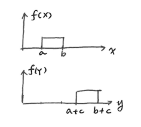
    - **证明**：
        令 $Y = X + c$，则 $f_Y(y)=f_X(y - c)$ ，且 $S_Y=\{x + c:x\in S_X\}$
        将 $x = y - c$ 代入下式：
        $$
        \begin{align*}
        h(X)&=-\int_{S_X}f_X(x)\log f_X(x)dx\\
        &=-\int_{S_Y}f_X(y - c)\log f_X(y - c)dy\\
        &=-\int_{S_Y}f_Y(y)\log f_Y(y)dy\\
        &=h(Y)\\
        &=h(X + c)
        \end{align*}
        $$

5. **缩放性质**
    $$对 a\neq0，有h(aX)=h(X)+\log|a|$$
    - 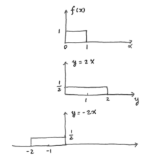
    - **证明**：
        令 $Y = aX$，则 $f_Y(y)=\frac{1}{|a|}f_X(\frac{y}{a})$，且 $S_Y = \{ax:x\in S_X\}$。
        将 $x = \frac{y}{a}$ 代入 $h(X)$ 的表达式：
        $$
        \begin{align*}
        h(X)&=-\int_{S_X}f_X(x)\log f_X(x)dx\\
        &=-\int_{S_Y}f_X(\frac{y}{a})\log f_X(\frac{y}{a})\frac{dy}{|a|}\\
        &=-\int_{S_Y}|a|f_Y(y)\log (f_Y(y)|a|)\frac{1}{|a|}dy\\
        &=-\int_{S_Y}f_Y(y)(\log f_Y(y)+\log|a|)dy\\
        &=-\int_{S_Y}f_Y(y)\log f_Y(y)dy-\log|a|\int_{S_Y}f_Y(y)dy\\
        &=h(Y)-\log|a|\\
        &=h(aX)-\log|a|
        \end{align*}
        $$ 移项可得 $h(aX)=h(X)+\log|a|$
    - 示例：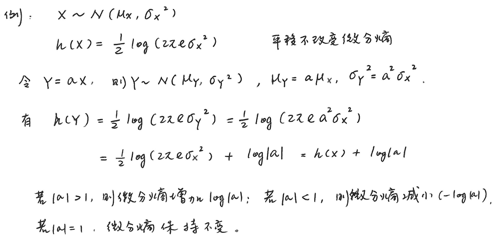

### 联合微分熵，条件微分熵及互信息
1. **定义（联合微分熵）**
    联合概率密度函数为 $f(\vec{x})$ 的随机向量 $\vec{x_{}}$ 的联合微分熵 $h(\vec{x})$ 定义为
    $$h(\vec{x})=-\int_{S}f(\vec{x})\log f(\vec{x})d\vec{x}=-E\log f(\vec{x})$$

    如果 $X_1,X_2,\cdots,X_n$ 相互独立，则有
    $$h(\vec{x})=\sum_{i = 1}^{n}h(X_i)$$

2. **平移**
    令 $\vec{c_{}}$ 是 $\mathbb{R}^n$（$n$ 维实数空间）中的一个列向量，则
    $$h(\vec{x}+\vec{c}) = h(\vec{x})$$

3. **缩放**
    令 $A$ 是一个 $n\times n$ 的非奇异矩阵，则
    $$h(A\vec{x})=h(\vec{x})+\log|\det(A)|$$

4. **多元高斯分布**
    设 $\vec{X} \sim N(\vec{\mu},K)$ 。
    令 $N(\vec{\mu},K)$ 表示均值为 $\vec{\mu}$，协方差矩阵为 $K$ 的多元高斯分布，即对于所有 $\vec{x} \in \mathbb{R}^n$ ，其联合概率密度函数为：
    $$f(\vec{x}) = \frac{1}{(\sqrt{2\pi})^n|K|^{\frac{1}{2}}} e^{-\frac{1}{2}(\vec{x}-\vec{\mu})^T K^{-1}(\vec{x}-\vec{\mu})}$$

    其中 $K$ 是正定对称矩阵，$|K|$ 表示 $K$ 的行列式值，$\vec{x},\vec{\mu}$ 为列向量。

    其微分熵 $h(\vec{X})$ 为：
    $$h(\vec{X}) = \frac{1}{2} \log[(2\pi e)^n|K|]$$

    这里 $|K|$ 为 $K$ 的行列式值。

    - **证明**：
        设 $K$ 可以对角化为 $Q\Lambda Q^T$ ，记 $\vec{X} = Q\vec{Y_{}}$ ，其中 $\vec{Y_{}}$ 中的随机变量不相关，且有 $Var(Y_i)=\lambda_i$ ，为 $\Lambda$ 中第 $i$ 个对角元素。由于 $\vec{X_{}}$ 是高斯的，所以 $\vec{Y_{}}$ 也是高斯的。又由于 $\vec{Y_{}}$ 中的随机变量是不相关的，可知它们相互独立。
        $$
        \begin{align*}
        h(\vec{X})&=h(Q\vec{Y})\\
        &=h(\vec{Y})+\log|\det(Q)|\\
        &=h(\vec{Y}) + 0\\
        &=\sum_{i = 1}^{n}h(Y_i)\\
        &=\sum_{i = 1}^{n}\frac{1}{2}\log(2\pi e\lambda_i)\\
        &=\frac{1}{2}\log[(2\pi e)^n\prod_{i = 1}^{n}\lambda_i]\\
        &=\frac{1}{2}\log[(2\pi e)^n|\Lambda|]\\
        &=\frac{1}{2}\log[(2\pi e)^n|K|]
        \end{align*}
        $$

5. **定义（条件微分熵）**
    如果 $X$，$Y$ 的联合密度函数为 $f(x,y)$，定义条件微分熵 $h(X|Y)$ 为：
    $$h(X|Y)=-\int f(x,y)\log f(x|y)dxdy$$

    由于 $f(x|y)=f(x,y)/f(y)$，所以有：
    $$h(X|Y)=h(X,Y)-h(Y)$$

6. **定义（相对熵）**
    两个密度函数 $f$ 和 $g$ 之间的相对熵 $D(f||g)$ 定义为：
    $$D(f||g)=\int f\log\frac{f}{g}$$

7. **定义（互信息）**
    联合概率密度函数为 $f(x,y)$ 的两个随机变量间的互信息 $I(X;Y)$ 定义为：
    $$I(X;Y)=\int f(x,y)\log\frac{f(x,y)}{f(x)f(y)}dxdy$$

    显然有：$$
    \begin{align*}
    I(X;Y)&=h(X)-h(X|Y)=h(Y)-h(Y|X)\\
    &=h(X)+h(Y)-h(X,Y)
    \end{align*}
    $$

    以及：$$I(X;Y)=D(f(x,y)||f(x)f(y))$$

8. **定理：相对熵的非负性**
    $$D(f||g) \geq 0$$
    - **证明**：
        设 $f$ 的支撑集是 $S$ 
        $$
        \begin{align*}
        -D(f||g)&=\int_{S} f \log\frac{g}{f}\\
        &\leq \log\int_{S} f\frac{g}{f} \quad (\text{Jensen 不等式})\\
        &=\log\int_{S} g\\
        &\leq \log 1 = 0
        \end{align*}
        $$
    - **推论**：
        - $I(X;Y) \geq 0$ ，当且仅当 $X$ 与 $Y$ 相互独立等号成立。
        - $h(X|Y) \leq h(X)$ 。

9. **定理(链式法则)**
    $$h(X_1,X_2,X_3,\cdots,X_n)=\sum_{i = 1}^{n}h(X_i|X_1,X_2,\cdots,X_{i - 1})$$
    - **推论**：
        - $h(X_1,X_2,\cdots,X_n) \leq \sum_{i = 1}^{n}h(X_i)$

10. **Hadamard 阿达玛不等式**
    设 $\vec{X} \sim N(0,K)$ 是一个多元正态分布。
    则有
    $$
    \begin{align*}
    h(X_1,X_2,\cdots,X_n)&=\frac{1}{2}\log((2\pi e)^n|K|)\\
    &\leq \sum_{i = 1}^{n}\frac{1}{2}\log(2\pi e K_{ii})\\
    &=\frac{1}{2}\log((2\pi e K_{11} \times 2\pi e K_{22} \times \cdots \times 2\pi e K_{nn}))
    \end{align*}
    $$

    即 $|K| \leq \prod_{i = 1}^{n}K_{ii}$
    - 注意有关行列式的不等式可以由信息论中的不等式推导而得到。

# 第三章 信道与信道容量

## 3.1 信道的数学模型
### 基本数学模型
- 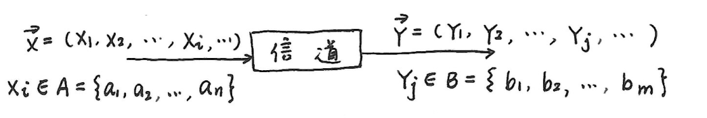
- $\vec{X}=(X_1, X_2, \cdots, X_i, \cdots)$，$X_i \in A = \{a_1, a_2, \cdots, a_n\}$为输入；
- $\vec{Y}=(Y_1, Y_2, \cdots, Y_j, \cdots)$，$Y_j \in B = \{b_1, b_2, \cdots, b_m\}$为输出。
- 用条件概率（转移概率）$p(\vec{Y}|\vec{X})$来描述输入、输出之间的依赖关系。

### 无干扰信道（无噪声）
- $\vec{Y} = f(\vec{X})$，已知$\vec{X_{}}$就能确知$\vec{Y_{}}$
    $$
    p(\vec{Y}|\vec{X}) = 
    \begin{cases}
    1, &\vec{Y} = f(\vec{X}) \\
    0, &\vec{Y} \neq f(\vec{X})
    \end{cases}
    $$
- 例子：
    - 当输入$a_1$对应输出$b_1$，输入$a_2$对应输出$b_2$时，转移概率矩阵$P = \begin{bmatrix} 1 & 0 \\ 0 & 1 \end{bmatrix}$
    - 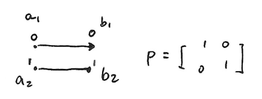

### 有干扰无记忆信道
- 无记忆：$$p(\vec{Y}|\vec{X}) = p(y_1|x_1)p(y_2|x_2)\cdots p(y_l|x_l)$$
- 只需分析单个符号的转移概率$p(y_j|x_i)$

#### 二进制离散对称信道（Binary Symmetric Channel，BSC）
- 输入$X \in A = \{0, 1\}$
- 输出$Y \in B = \{0, 1\}$
- $
BSC\begin{cases}
p(Y = 0|X = 1) = p(Y = 1|X = 0) = p \\
p(Y = 1|X = 1) = p(Y = 0|X = 0) = 1 - p
\end{cases}
$
- 其中$p$为错误概率，其转移关系和转移概率矩阵如下：
- 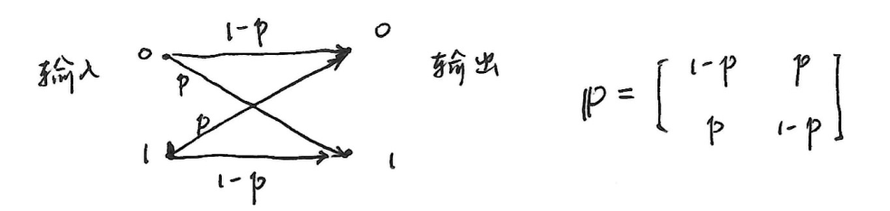

#### 离散无记忆信道（Discrete Memoryless Channel，DMC）
- 输入$X \in \{a_1, a_2, \cdots, a_n\}$
- 输出$Y \in \{b_1, b_2, \cdots, b_m\}$
- 转移概率矩阵$P = [p(b_j|a_i)] = [p_{ij}]_{n \times m} =  \begin{bmatrix}
    p_{11} & p_{12} & \cdots & p_{1m} \\
    \vdots & & & \\
    p_{n1} & p_{n2} & \cdots & p_{nm}
    \end{bmatrix}_{n \times m}$
- 并且满足$\sum_{j = 1}^{m} p(b_j|a_i) = 1$，$i = 1, 2, \cdots, n$
- 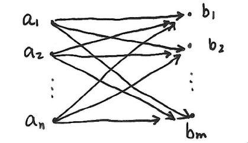
- 二进制离散对称信道（BSC）是离散无记忆信道（DMC）的特例

#### 离散输入、连续输出信道
- 输入$X \in \{a_1, a_2, \cdots, a_n\}$
- 输出$Y \in \{-\infty, +\infty\}$
- 信道模型为$Y = X + G$，其中$G \in \{-\infty, +\infty\}$，$p_G(n) \sim N(0, \sigma^2)$
- 条件概率密度$p_Y(y|a_i) \sim N(a_i, \sigma^2)=\frac{1}{\sqrt{2 \pi \sigma^2}}e^{-\frac{(y - a_i)^2}{2\sigma^2}}$
- 图例：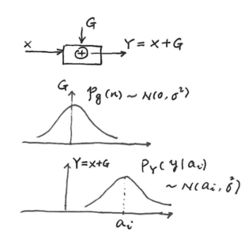

#### 波形信道
- 当 $t_B$、$f_m$ 受限，$L = 2t_Bf_m$ 时
- 输入 $\vec{X} = (X_1, X_2, \cdots, X_L)$
- 输出 $\vec{Y} = (Y_1, Y_2, \cdots, Y_L)$
- 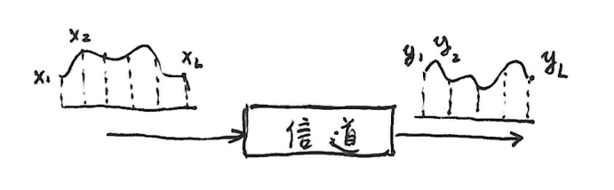
- **时间离散，取值连续的多维连续信道**，信道转移概率密度函数为：
    $$p_Y(\vec{y}|\vec{x}) = p_y (y_1,y_2,\cdots,y_L | x_1,x_2,\cdots,x_L)$$
- **连续无记忆信道**：
    $$p_Y(\vec{y}|\vec{x}) = p_y(y_1 | x_1)p_y(y_2 | x_2)\cdots p_y(y_L | x_L) = \prod_{l = 1}^{L} p_Y (y_l| x_l)$$

#### 因此无记忆时重点讨论单符号信道！
- 信道模型为 $y(t)=x(t)+n(t)$
- 其中 **$n(t)$ 为加性噪声，与信号 $x(t)$ 相互独立**
- 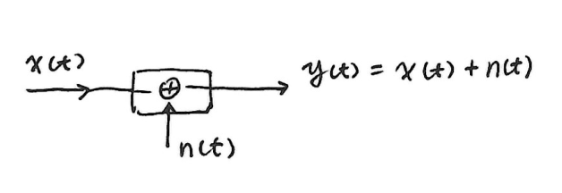
- 根据概率关系有：
    $$p_{X,Y}(x,y)=p_{X,n}(x,n)=p_X(x)p_n(n)$$

    $$p_Y(y|x)=\frac{p_{X,Y}(x,y)}{p_X(x)}=\frac{p_{X,n}(x,n)}{p_X(x)} = p_n(n)$$

- 进一步考虑条件熵：
    $$
    \begin{align*}
    H_c(Y|X)&=-\iint_{R}p_{X,Y}(x,y)\log p_Y(y|x)dxdy\\
    &=-\int_{R}p_X(x)dx\int_{R}p_Y(y|x)\log p_Y(y|x)dy\\
    &=-\int_{R}p_n(n)\log p_n(n)dn\\
    &=H_c(n)
    \end{align*}
    $$

    条件熵 $H_c(Y|X)$ 称为**噪声熵**

- 在加性多维连续信道中
    - $$\vec{y}=\vec{x}+\vec{n_{}}$$
    - 同理有 $p_{\vec{Y}}(\vec{y}|\vec{x}) = p_n(\vec{n})$，$H_c(\vec{y}|\vec{x}) = H_c(\vec{n})$

### 有干扰有记忆信道
> 略

### 信道容量的定义
- 定义信道的**信息传输率 $R$** 为信道中平均每个符号所传输的信息量：
    $$
    \begin{align*}
    R=I(X;Y)&=H(X)-H(X|Y)\quad \text{bit}/\text{信道符号}\\
    &=H(Y)-H(Y|X)
    \end{align*}
    $$
- 设 $T$ 为信道中符号的平均传输时间，定义**信息传输速率**：
    $$R_t = \frac{R}{T}=\frac{I(X;Y)}{T}\quad \text{bit}/\text{秒}$$
    - $I(X;Y)$ 是输入符号分布概率 $p(a_i)$ 和信道转移概率 $p(b_j|a_i)$ 的函数，即 
        $$I(X;Y)=f(p(a_i),p(b_j|a_i))$$
- 对于某特定信道，$p(b_j|a_i)$ 确定，则 $I(X;Y)$ 是关于 $p(a_i)$ 的凹函数（$\cap$型上凸函数），也即可以找到某种概率分布 $p(a_i)$，使 $I(X;Y)$ 达到最大，该最大值为**信道容量**：
    $$C = \max_{p(a_i)} I(X;Y)\quad \text{bit}/\text{符号}$$
    - 若符号传送时间周期为 $T$ 秒，则**单位时间信道容量**为：
        $$C_t = C/T\quad \text{bit}/\text{秒}$$
- 对于固定信道参数信道，信道容量是个定值。实际传输时能否提供最大传输能力，取决于输入端的概率分布，定义**信道绝对冗余度和相对冗余度**：
    $$信道绝对冗余度 =C - I(X;Y)$$ $$信道相对冗余度 =1-\frac{I(X;Y)}{C}$$

## 3.2 离散单个符号信道及其容量
### 无干扰离散信道
- 信道输入$X \in A=\{a_1,a_2,\cdots,a_n\}$
- 输出$Y \in B = \{b_1,b_2,\cdots,b_m\}$

#### 无噪无损信道：n = m，X、Y一一对应
- 输入输出关系：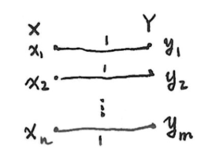
- 转移概率矩阵$P = \{p(y_j|x_i)\} = 
    \begin{bmatrix}
    1 & 0 & \cdots \\
    0 & 1 & \cdots \\
    \vdots & \vdots & \ddots &
    \end{bmatrix}$，$p(x_i|y_j) \in \{0, 1\}$。
- **噪声熵与疑义度**：
    $$H(Y|X)=H(X|Y)=0$$
- **互信息**：
    $$I(X;Y)=I(Y;X)=H(X)=H(Y)$$ 当输入符号等概率分布时，$I(X;Y)$最大。
- **信道容量**:
    $$C = \max_{p(a_i)} I(X;Y)=\max_{p(a_i)} H(X)=\log n$$

#### 无噪有损信道：n > m，多个X对应一个Y
- 输入输出关系：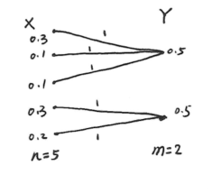
- 多个输入对应一个输出，即$n > m$
- **噪声熵**:
    $$H(Y|X)=\sum_{i,j}p(a_i,b_j)\log p(b_j|a_i)=0$$
- **疑义度**:
    $$H(X|Y)=\sum_{i,j}p(a_i,b_j)\log p(a_i|b_j)\neq0$$
- **互信息**:
    $$I(X;Y)=H(X)-H(X|Y)=H(Y)-H(Y|X)=H(Y)\neq0$$ 其中$H(Y|X) = 0$，$H(X|Y)\neq0$
    由此可得$H(X)=H(Y)+H(X|Y)$，所以$H(X)\geq H(Y)$ 。
- **信道容量**：
    $$C = \max_{p(a_i)} I(X;Y)=\max_{p(a_i)} H(Y) \overset{?}{=} \log m$$

#### 有噪无损信道：n < m，一个X对应多个Y
- 输入输出关系：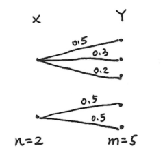
- 信道噪声使一个输入对应多个输出，$n < m$
- **噪声熵**：
    $$H(Y|X)=\sum_{i,j}p(a_i,b_j)\log p(b_j|a_i)\neq0$$
- **疑义度**：
    $$H(X|Y)=\sum_{i,j}p(a_i,b_j)\log p(a_i|b_j)=0$$
- **互信息**：
    $$I(X;Y)=H(X)-H(X|Y)=H(Y)-H(Y|X)=H(X)\neq0$$ 其中$H(X|Y) = 0$，$H(Y|X)\neq0$
    由此可得$H(Y)=H(X)+H(Y|X)$，所以$H(Y)\geq H(X)$ 。
- **信道容量**：
    $$C = \max_{p(a_i)} I(X;Y)=\max_{p(a_i)} H(X) = \log n$$

### 对称离散无记忆信道
- 以下是两个转移概率矩阵示例：
    $$
    \begin{bmatrix}
    \frac{1}{3} & \frac{1}{3} & \frac{1}{6} & \frac{1}{6} \\
    \frac{1}{6} & \frac{1}{6} & \frac{1}{3} & \frac{1}{3} 
    \end{bmatrix}_{2\times4}
    \quad
    \begin{bmatrix}
    \frac{1}{2} & \frac{1}{3} & \frac{1}{6} \\
    \frac{1}{6} & \frac{1}{2} & \frac{1}{3} \\
    \frac{1}{3} & \frac{1}{6} & \frac{1}{2} 
    \end{bmatrix}_{3\times3}
    $$

- **对称特性判断**：
    - 若每一行包含相同元素，称为输入对称
    - 若每一列包含相同元素，称为输出对称
    - 当行列都对称时，为**对称DMC（离散无记忆信道）**。

- **相关信息论公式**：
    - **互信息**:
        $$I(X;Y)=H(X)-H(X|Y)=H(Y)-H(Y|X)$$
    - **条件熵**:
        $$
        \begin{align*}
        H(Y|X)&=-\sum_{i,j} p(a_i, b_j)\log p(b_j|a_i)\\
        &=-\sum_{i,j} p(a_i) p(b_j|a_i)\log p(b_j|a_i)\\
        &=-\sum_{i} p(a_i) \sum_{j} p(b_j|a_i)\log p(b_j|a_i)\\
        &=\sum_{i} p(a_i) H(Y|a_i) （输入对称）\\
        &= H(Y|a_i)，i = 1, 2, \cdots, n
        \end{align*}
        $$
    - **信道容量**:
        $$C = \max_{p(a_i)} I(X;Y)=\max_{p(a_i)} H(Y)-H(Y|X)=\max_{p(a_i)} H(Y)-H(Y|a_i)$$
- 当**输入符号等概率分布**，即$p(a_i)=\frac{1}{n}$时，设$m$为输出符号数目，则有：
    - $p(b_j)=\sum_{i} p(a_i)p(b_j|a_i)=\frac{1}{n}\sum_{i} p(b_j|a_i)=\frac{1}{n}\cdot \frac{n}{m}=\frac{1}{m}$
    - $H(Y)=-\sum_{j} p(b_j)\log p(b_j)=\sum_{j} \frac{1}{m}\log m=m\frac{1}{m}\log m=\log m$
    - **信道容量**$$C = \log m - H(Y|a_i)$$
    - 其中$m$为输出符号$Y$数目，$i = 1, \cdots, n$
- 例题：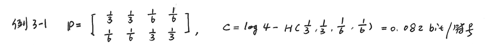

-  **一般离散无记忆模k加性噪声信道**
    - 信道模型: $Y = X\oplus Z\bmod k$，其中 $X,Y,Z\in\{0,1,\cdots,k - 1\}$
    - 图例: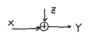
    - **加性噪声**，有 $p(y|x)=p(z)$
        - **条件熵**:
            $$
            \begin{align*}
            H(Y|X)&=-\sum_{x,y}p(x)p(y|x)\log p(y|x)\\
            &=-\sum_{x,z}p(x)p(z)\log p(z)\\
            &=-\sum_{x}p(x)\sum_{z}p(z)\log p(z)\\
            &=H(Z)
            \end{align*}
            $$
        - **信道容量**:
            $$
            \begin{align*}
            C&=\max_{p(x)}H(Y)-H(Y|X)\\
            &=\max_{p(x)}H(Y)-H(Z)\\
            &=\log k - H(Z) \quad (\text{对称性})
            \end{align*}
            $$
    - 例题：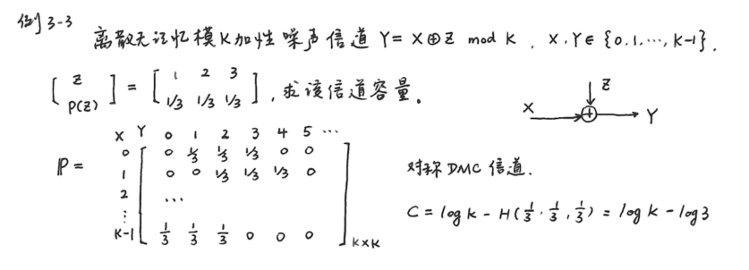

### 准对称离散无记忆信道
- 以下是两个转移概率矩阵示例：
$$P_1=\begin{bmatrix}\frac{1}{3}&\frac{1}{3}&\frac{1}{6}&\frac{1}{6}\\\frac{1}{6}&\frac{1}{3}&\frac{1}{6}&\frac{1}{3}\end{bmatrix}_{2\times 4} \quad P_2=\begin{bmatrix}0.7&0.1&0.2\\0.2&0.1&0.7\end{bmatrix}_{2\times 3}$$

- **信道特性**：
    - 矩阵中**各行元素相同，但各列元素不同**，这种信道称为**准对称DMC（离散无记忆信道）**。

- **相关信息论公式**：
    - 因为各行元素相同，所以 $H(Y|X)=H(Y|a_i)$ ，其中 $i = 1,2,\cdots,n$
        - 这表明在给定不同输入符号 $a_i$ 时，输出的条件熵是相同的
    - 由于各列元素不同，信道的输入和输出分布概率可以不同，并且 $H(Y)\leq\log m$ （$m$为输出符号的数目）

    - **信道容量**：
        $$
        \begin{align*}
        C &= \max_{p(x)}[H(Y)-H(Y|X)] \\
        &\leq\log m - H(Y|a_i)\\
        &=\log m+\sum_{j = 1}^{m}p_{ij}\log p_{ij}
        \end{align*}
        $$ 其中$i = 1,2,\cdots,n$ ，$p_{ij}$ 是转移概率矩阵中的元素
        - 这给出了准对称离散无记忆信道容量的一个**上限估计**
        - 求解：**矩阵分解法**、极值求导法
    - 例题：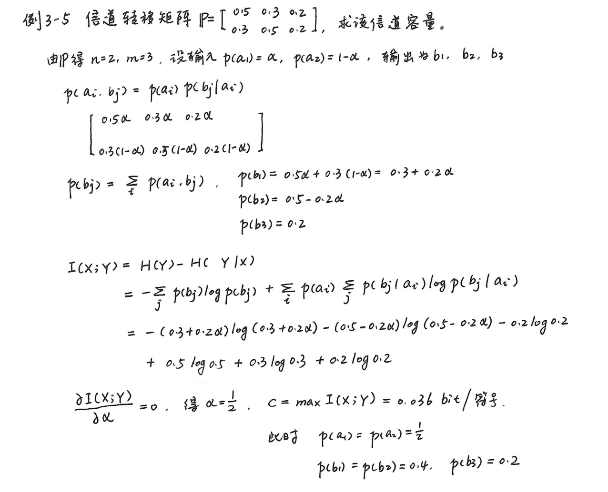

### 矩阵分解法
- **转移矩阵分解**：
    - 将**准对称**转移概率矩阵**按概率列**分成若干个互不相交的**对称的子集**。例如：
        - $$P_1 = \begin{bmatrix}\frac{1}{3}&\frac{1}{3}&\frac{1}{6}&\frac{1}{6}\\\frac{1}{6}&\frac{1}{3}&\frac{1}{6}&\frac{1}{3}\end{bmatrix}$$ 可分解成$\begin{bmatrix}\frac{1}{3}&\frac{1}{6}\\\frac{1}{6}&\frac{1}{3}\end{bmatrix}$，$\begin{bmatrix}\frac{1}{3}\\\frac{1}{3}\end{bmatrix}$，$\begin{bmatrix}\frac{1}{6}\\\frac{1}{6}\end{bmatrix}$
        - $$P_2 = \begin{bmatrix}0.7&0.1&0.2\\0.2&0.1&0.7\end{bmatrix}$$ 可分解成$\begin{bmatrix}0.7&0.2\\0.2&0.7\end{bmatrix}$ ，$\begin{bmatrix}0.1\\0.1\end{bmatrix}$ 。

- **信道容量**：
    - 可以证明，当**输入等概率分布**时，可达到信道容量。
        $$C=\log n - H(P_1',P_2',\cdots,P_m')-\sum_{k = 1}^{r}N_k\log M_k$$
    - 其中：
        - $n$为输入符号个数。
        - $P_1',P_2',\cdots,P_m'$ 是原转移概率矩阵$P$中一行的元素。
        - $N_k$是第$k$个子矩阵中行元素之和。
        - $M_k$是第$k$个子矩阵中列元素之和。
        - $r$是子矩阵个数。

- **例题**：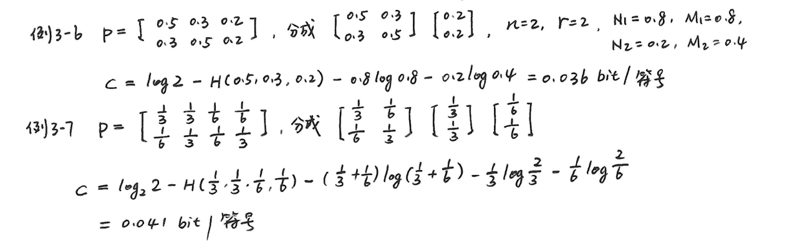

### 一般离散无记忆信道
- **转移概率$p(y|x)$固定**
- **信道容量**：
    $$C = \max_{p(x)}I(X;Y)=\max_{p(x)}I(p(x),p(y|x))$$

    即求互信息$I(X;Y)$关于输入概率分布$p(x)$的极大值。

- **互信息**：
    $$
    \begin{align*}
    I(X;Y)&=\sum_{i}p(a_i)I(a_i;Y)\\
    &=\sum_{i}p(a_i)\sum_{j}p(b_j|a_i)\log\frac{p(a_i|b_j)}{p(a_i)}
    \end{align*}
    $$
- 为使$I(X;Y)$达到最大，输入符号概率集$\{p(a_i)\}$必须满足的**充分和必要条件**是：
    - 对于所有$p(a_i)>0$ 的符号$a_i$ ，有$I(a_i;Y)=C$
    - 对于所有$p(a_i)=0$ 的符号$a_i$ ，有$I(a_i;Y)\leq C$
    - 这意味着除概率为0的符号$a_i$外，每个符号$a_i$ 对$Y$提供相同的互信息
- 注意：**最佳输入分布不唯一！**
- 例题：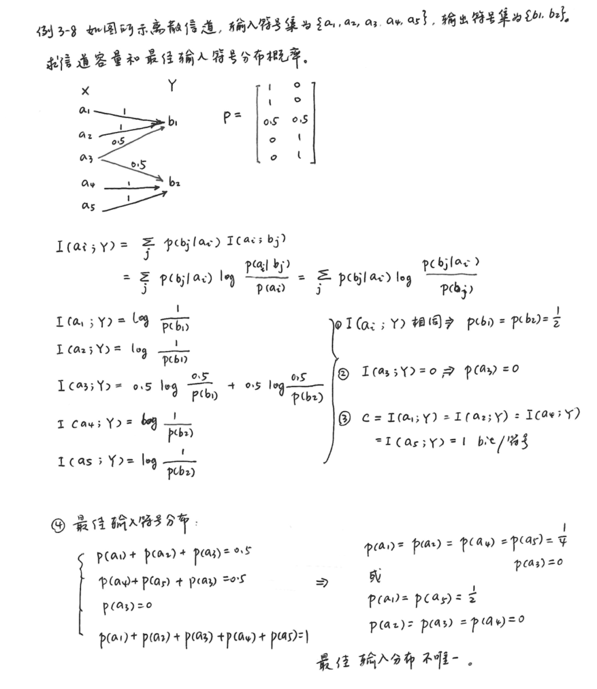

## 3.3 离散序列信道及其容量
### 信道模型与符号定义
- 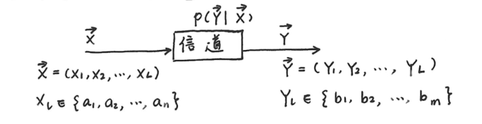
- 输入矢量为$\vec{X}=(X_1,X_2,\cdots,X_L)$，其中$X_l\in\{a_1,a_2,\cdots,a_n\}$
- 输出矢量为$\vec{Y}=(Y_1,Y_2,\cdots,Y_L)$，其中$Y_l\in\{b_1,b_2,\cdots,b_m\}$
- 条件概率表示为$p(\vec{Y}|\vec{X})$ ，即给定输入$\vec{X_{}}$时输出$\vec{Y_{}}$的概率。

### 无记忆离散序列信道
- 对于无记忆离散序列信道：
    $$p(\vec{Y}|\vec{X}) = p(Y_1,\cdots,Y_L|X_1,\cdots,X_L)=\prod_{l = 1}^{L}p(Y_l|X_l)$$
    - 若信道是平稳的：
        $$p(\vec{Y}|\vec{X})=(p(y|x))^{L}=p^{L}(y|x)$$
- **互信息与信道容量**:
    $$
    \begin{align*}
    I(\vec{X};\vec{Y})&=H(\vec{X}) - H(\vec{X}|\vec{Y})=\sum p(\vec{X},\vec{Y})\log\frac{p(\vec{X}|\vec{Y})}{p(\vec{X})}\\
    &=H(\vec{Y}) - H(\vec{Y}|\vec{X})=\sum p(\vec{X},\vec{Y})\log\frac{p(\vec{Y}|\vec{X})}{p(\vec{Y})}
    \end{align*}
    $$
    - **信道无记忆时**：
        $$I(\vec{X};\vec{Y})\leq\sum_{l = 1}^{L}I(X_l;Y_l)$$
        - 证明：
            由定义有：$I(\vec{X};\vec{Y})=H(\vec{Y})-H(\vec{Y}|\vec{X})$和$I(X_l;Y_l)=H(Y_l)-H(Y_l|X_l)$，利用$H(X)$的链式法则有：
            ①$H(\vec{Y})=H(Y_1,Y_2,\cdots,Y_L)=H(Y_1)+H(Y_2|Y_1)+\cdots+H(Y_L|Y_1,Y_2,\cdots,Y_{L - 1})\leq \sum_{l = 1}^{L}H(Y_l)$
            ②$H(\vec{Y}|\vec{X})=H(Y_1|\vec{X})+H(Y_2|Y_1,\vec{X})+\cdots+H(Y_L|Y_1,Y_2,\cdots,Y_{L - 1},\vec{X})=\sum_{l = 1}^{L}H(Y_l|X_l)$（无记忆信道下，给定 $X_l$ 后，其他时刻的输入输出对确定 $Y_l$ 的不确定性没有额外帮助）
            所以有：$I(\vec{X};\vec{Y})=H(\vec{Y})-H(\vec{Y}|\vec{X})\leq \sum_{l = 1}^{L}H(Y_l)-\sum_{l = 1}^{L}H(Y_l|X_l)=\sum_{l = 1}^{L}I(X_l;Y_l)$。
    - **输入矢量$\vec{X_{}}$中各分量相互独立时**：
        $$I(\vec{X};\vec{Y})\geq\sum_{l = 1}^{L}I(X_l;Y_l)$$
        - 证明：
            由定义有：$I(\vec{X};\vec{Y})=H(\vec{X}) - H(\vec{X}|\vec{Y})$和$I(X_l;Y_l)=H(X_l)-H(X_l|Y_l)$，利用$H(X)$的链式法则有：
            ①$H(\vec{X})=H(X_1,X_2,\cdots,X_L)=H(X_1)+H(X_2|X_1)+\cdots+H(X_L|X_1,X_2,\cdots,X_{L - 1})=\sum_{l = 1}^{L}H(X_l)$（由于各分量相互独立）
            ②$H(\vec{X}|\vec{Y})=H(X_1|\vec{Y})+H(X_2|X_1,\vec{Y})+\cdots+H(X_L|X_1,X_2,\cdots,X_{L - 1},\vec{Y})=\sum_{l = 1}^{L}H(X_l|\vec{Y})\leq \sum_{l = 1}^{L}H(X_l|Y_l)$（已知更多信息 $\vec{Y_{}}$ 时，$X_l$ 的不确定性不会比仅知道 $Y_l$ 时更大）
            所以有：$I(\vec{X};\vec{Y})=H(\vec{X})-H(\vec{X}|\vec{Y})\geq \sum_{l = 1}^{L}H(X_l)-\sum_{l = 1}^{L}H(X_l|\vec{Y})=\sum_{l = 1}^{L}I(X_l;Y_l)$。
    - **当输入矢量$\vec{X_{}}$独立且信道无记忆时**，上述两个性质统一取等号，此时**信道容量**：
        $$
        \begin{align*}
        C_L&=\max_{p(x)}I(\vec{X};\vec{Y})=\max_{p(x)}\sum_{l = 1}^{L}I(X_l;Y_l)\\
        &=\sum_{l = 1}^{L}\max_{p(x)}I(X_l;Y_l)=\sum_{l = 1}^{L}C_l
        \end{align*}
        $$
        - 当信道平稳时$C_L = LC_1$
        - 一般情况下，$I(\vec{X};\vec{Y})\leq LC_1$ ，其中$C_1$是单个时刻的信道容量
- 输入矢量独立且信道无记忆时，相当于对单个信道进行$L$次扩展的信道，也相当于$L$个独立的信道并联在一起。
- 示例：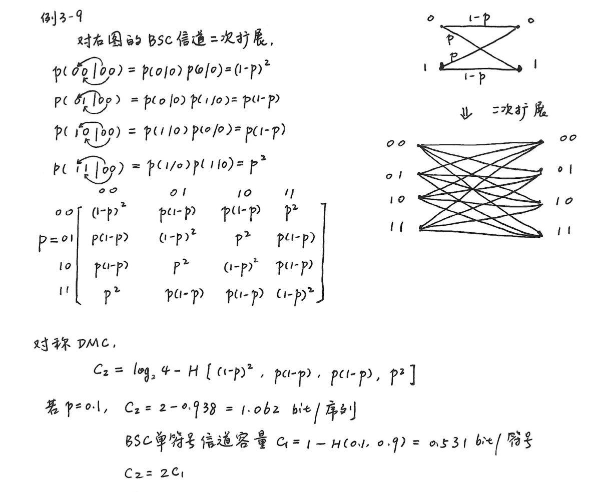

### 独立并联信道
- 图例: 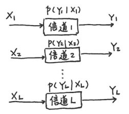
- 每个信道输出$Y_l$只与本信道的输入$X_l$有关，即：
    $$p(Y_1,Y_2,\cdots,Y_L|X_1,X_2,\cdots,X_L) = p(Y_1|X_1)p(Y_2|X_2)\cdots p(Y_L|X_L)$$ **信道无记忆**, 并且有
    $$I(\vec{X};\vec{Y})\leq\sum_{l = 1}^{L}I(X_l;Y_l)$$
- 并联信道容量
    $$C_{12\cdots L}=\max I(\vec{X};\vec{Y})\leq\sum_{l = 1}^{L}C_l$$
- 当输入符号$X_l$相互独立，且$p(X_1,X_2,\cdots,X_L)$达到最佳分布时，容量最大，此时：
    $$C_{12\cdots L}=\sum_{l = 1}^{L}C_l$$

### 有记忆离散序列信道
> 有记忆的离散序列信道复杂得多，不作介绍。

## 3.4 连续信道及其容量
### 连续单符号加性信道
#### 加性高斯信道
- **信道模型**：
    - 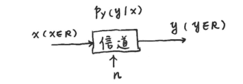
    - $ y = x + n $
    - $ n $：加性噪声
    - $P_n(n) \sim N(0, \sigma^2) = \frac{1}{\sqrt{2 \pi \sigma^{2}}} e^{-\frac{n^2}{2 \sigma^2}} $。
- **微分熵**：
    $$H_c(n) = -\int_{-\infty}^{+\infty} P_n(n) \log P_n(n) dn = \frac{1}{2} \log(2\pi e \sigma^2) $$
- **互信息**：
    $$
    \begin{align*}
    I(X;Y) &= H_c(X) - H_c(X|Y) \\
    &= H_c(Y) - H_c(Y|X) \\
    \end{align*}
    $$
- **信道容量**：
    $$
    \begin{align*}
    C = \max_{p(x)} I(X;Y) &= \max_{p(x)} [H_c(Y) - H_c(Y|X)] \\
    &= \max_{p(x)} H_c(Y) - \frac{1}{2} \log(2\pi e \sigma^2)
    \end{align*}
    $$

    其中 $ H_c(Y|X) $ 是噪声熵，由于$x$与$n$相独立，所以$p(y|x) = p(x+n|x) = p(n)$，所以$ H_c(Y|X) = H_n(n) = \frac{1}{2} \log(2\pi e \sigma^2) $。

- **求 $ H_c(Y) $ 最大值**：
    $$
    \begin{align*}
    &y = x + n , y \in (-\infty, +\infty) ，y是功率受限信号\\
    &\Rightarrow Y 正态分布时熵最大\\
    &\Rightarrow Y 正态分布时信道容量最大\\
    \end{align*}
    $$
- $y$ 的功率 $P$（其中 $S$ 是输入信号 $x$ 的平均功率，$\sigma^2$ 是噪声功率） $$P = S + \sigma^2 $$
    - 若 $P_Y(y) \sim N(0, P)$，$P_n(n)\sim N(0, \sigma^2)$，$x = y - n$，则 $P_X(x) \sim N(0, S)$。
    - 当输入 $ X $ 是均值为 0，方差为 $ S $ 的高斯分布时，**信息传输率**达最大，等于**信道容量**：
        $$
        \begin{align*}
        C &= \frac{1}{2} \log(2\pi e P) - \frac{1}{2} \log(2\pi e \sigma^2) \\
        &= \frac{1}{2} \log \frac{P}{\sigma^2} \\
        &= \frac{1}{2} \log \left(1 + \frac{S}{\sigma^2}\right)\\
        &= \frac{1}{2} \log(1 + SNR) \quad bit/符号
        \end{align*}
        $$

        其中 $SNR=\frac{S}{\sigma^2}$，$SNR_{dB} = 10\log_{10}SNR$。

#### 加性非高斯信道
- 对于加性、均值为 0、平均功率为 $ \sigma^2 $ 的非高斯信道：
    $$
    C = \max (H_c(Y) - H_c(n))
    $$
- 高斯分布时：
    $$H_c(Y)_{max} = \frac{1}{2} \log(2\pi e P) $$

    $$H_c(n)_{max} = \frac{1}{2} \log(2\pi e \sigma^2) $$
- 满足：
    $$\frac{1}{2} \log(2\pi e P) - \frac{1}{2} \log(2\pi e \sigma^2) \leq C \leq \frac{1}{2} \log(2\pi e P) - H_c(n) $$

### 多维无记忆加性连续信道
- **信道模型**：
    - 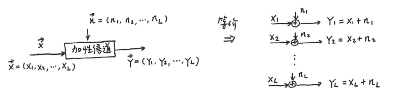
        - 输入$X$的总功率$P = \sum_{l = 1}^{L}P_l$，$P_l$是第$l$个输入信号的功率
        - $\sigma_l^2$是第$l$个噪声的功率
    - 信道无记忆
        $$
        p(\vec{y}|\vec{x}) = \prod_{l = 1}^{L} p(y_l|x_l)
        $$
    - 加性噪声各时刻独立
        $$
        p_n(\vec{n}) = p_y(\vec{y}|\vec{x}) = \prod_{l = 1}^{L} p_n(n_l) \quad n_l \sim N(0, \sigma_l^2)
        $$
- **互信息**：
    $$
    I(\vec{X}; \vec{Y}) \leq \sum_{l = 1}^{L} I(X_l; Y_l) \leq \sum_{l = 1}^{L} \frac{1}{2} \log(1 + \frac{P_l}{\sigma_l^2})
    $$
- **信道容量**：
    $$
    C = \max_{p(x)} I(\vec{X}; \vec{Y}) = \sum_{l = 1}^{L} \frac{1}{2} \log(1 + \frac{P_l}{\sigma_l^2}) \quad \text{bit}/L \text{ 序列}
    $$

    当且仅当输入随机变量 $\vec{X_{}}$ 中各分量统计独立，且均值为0，方差为 $P_l$ 的高斯分布时，才能达到此容量。

1. **$L$ 个高斯噪声每个单元时刻噪声功率相等**，$\sigma_l^2 = \sigma^2$，$l \in \{1,2,\cdots,L\}$，有
    $$
    C = \frac{L}{2} \log(1 + \frac{S}{\sigma^2}) \quad, \quad S = \frac{P}{L}
    $$ $\vec{X_{}}$ 的各分量满足 $N(0,S)$ 分布时，达到信道容量。

2. **$L$ 个高斯噪声均值为0，方差不同且为 $\sigma_l^2$ 时**，若输入信号的总平均功率受限，即
    $$
    E\left[\sum_{l = 1}^{L} x_l^2\right] = \sum_{l = 1}^{L} E[x_l^2] = \sum_{l = 1}^{L} P_l = P
    $$
    - 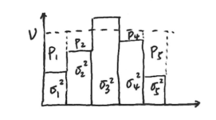
    - **怎样合理分配各单元时刻的信号平均功率，才能使信道传输率最大？**
        用拉格朗日乘数法，作辅助函数
        $$
        f(P_1, P_2, \cdots, P_L) = \sum_{l = 1}^{L} \frac{1}{2} \log(1 + \frac{P_l}{\sigma_l^2}) + \lambda (\sum_{l = 1}^{L} P_l - P)
        $$

        对第一项求最大，第二项为约束条件
        令 $\frac{\partial f( )}{\partial P_l} = 0$，$l = 1,2,\cdots,L$
        得
        $$
        \begin{align*}
        \frac{1}{2} \frac{1}{P_l + \sigma_l^2} + \lambda = 0 \quad, \quad l = 1,2,\cdots,L\\
        \Rightarrow P_l + \sigma_l^2 = -\frac{1}{2\lambda} \quad, \quad l = 1,2,\cdots,L
        \end{align*}
        $$

        令各时刻信道输出总功率（信号功率 $P_l$ + 噪声功率 $\sigma_l^2$）相等，设为 $V$
        $$
        V = \frac{P + \sum_{l = 1}^{L} \sigma_l^2}{L}
        $$

        当 $P_l = V - \sigma_l^2 = \frac{P + \sum_{l = 1}^{L} \sigma_l^2}{L} - \sigma_l^2$，$l = 1,2,\cdots,L$ 时，**信道传输率达到最大**
        $$
        \begin{align*}
        C &= \sum_{l = 1}^{L} \frac{1}{2} \log(1 + \frac{P_l}{\sigma_l^2})  = \frac{1}{2} \sum_{l = 1}^{L} \log \frac{P + \sum_{l = 1}^{L} \sigma_l^2}{L\sigma_l^2} \\
        &= \frac{1}{2} \sum_{l = 1}^{L} \log \frac{V}{\sigma_l^2}
        \end{align*}
        $$

        若 $\sigma_l^2$ 太大，大于 $V$，则置 $P_l = 0$，然后重新调整功率分配，直到 $P_l$ 不再出现负值。
    - **例题**：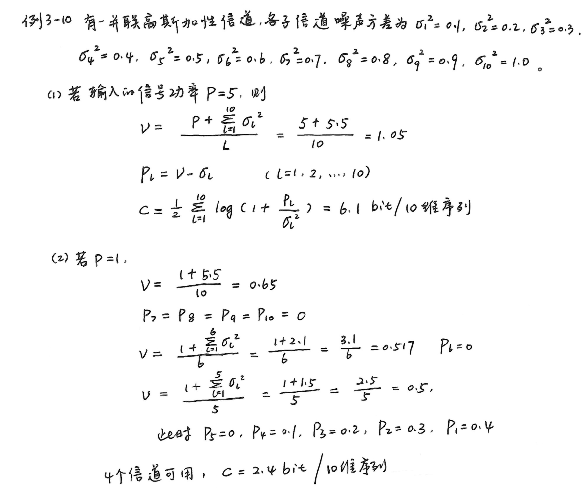

### 限时限频限功率加性高斯白噪声信道
#### 波形信道，限时 $t_B$，限频 $\omega$
- **信道模型**：
    - 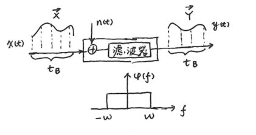
- **互信息**：
    $$
    \begin{align*}
    I(x(t); y(t)) &= \lim_{L \to \infty} I(\vec{X}; \vec{Y}) \\
    &= \lim_{L \to \infty} [H_c(\vec{X}) - H_c(\vec{X}|\vec{Y})] \\
    &= \lim_{L \to \infty} [H_c(\vec{Y}) - H_c(\vec{Y}|\vec{X})] \quad \text{bit/波形}
    \end{align*}
    $$
- **单位时间内的信息传输率** $R_t$ 为：
    $$
    R_t=\lim_{t_B \to \infty}\frac{1}{t_B}I(\vec{X}; \vec{Y})\quad \text{ bit/秒} \quad (t_B：\text{秒/波形})
    $$
- **信道容量**:
    $$
    C_t=\max_{p(x)}[\lim_{t_B \to \infty}\frac{1}{t_B}I(\vec{X}; \vec{Y})]\quad \text{ bit/秒}
    $$
- 带宽受限加性高斯白噪声 $n(t)$，均值为0，功率谱密度 $\frac{N_0}{2}$

#### 加性高斯白噪声
- **模型**：
    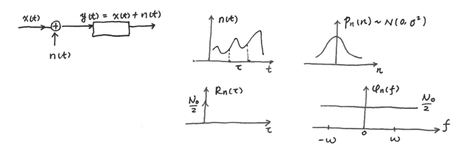
    - $y(t)=x(t)+n(t)$
    - 相关函数:
        - $P_n(n)\sim N(0,\sigma^2)$
        - $R_n(\tau) = \frac{N_0}{2}\delta(\tau)$
        - 功率谱密度 $\Phi_n(f) = \frac{N_0}{2}$
        - 总噪声功率 $\sigma^2 = \frac{N_0}{2} \cdot 2\omega  = N_0\omega $
        - $N_0 = kT$
        - 波茨曼常数 $k$
        - 绝对温度 $T$

#### 低频带宽受限通信系统
- 在 $[0, t_B]$ 内，采样个数 $L = 2\omega t_B$，各样本值彼此独立。
- 通信带宽为 $2\omega $，噪声功率为 $2\omega \cdot\frac{N_0}{2}=N_0\omega $
    $$
    \begin{align*}
    &C=\frac{1}{2}\sum_{l = 1}^{L}\log(1 + \frac{P_l}{\sigma_l^2})\\
    &\sigma_l^2 = P_n=\frac{\frac{N_0}{2}\cdot 2\omega \cdot t_B}{L}=\frac{\frac{N_0}{2}\cdot 2\omega \cdot t_B}{2\omega \cdot t_B}=\frac{N_0}{2}\\
    &P_l = \frac{P_s t_B}{2\omega t_B}=\frac{P_s}{2\omega }
    \end{align*}
    $$

- 对于平稳系统
    $$
    \begin{align*}
    C&=\frac{L}{2}\log(1 + \frac{P_s}{2\omega }\cdot\frac{2}{N_0})\\
    &=\frac{L}{2}\log(1 + \frac{P_s}{N_0\omega })\\
    &=\omega t_B\log(1 + \frac{P_s}{N_0\omega }) \quad \text{ bit}/L \text{维符号序列}
    \end{align*}
    $$

- 单位时间的信道容量
    $$
    \begin{align*}
    C_t&=\lim_{t_B \to \infty}\frac{C}{t_B}\\
    &=\omega \log(1 + \frac{P_s}{N_0\omega })\quad \text{ bit/秒}\\
    &=\omega \log(1 + SNR)\quad \text{ bit/秒}
    \end{align*}
    $$

    其中:
    - $P_s$：信号平均功率
    - $N_0\omega$：噪声在系统中的平均功率（$\frac{N_0}{2}\cdot 2\omega=N_0\omega$）
    - $SNR_{dB}=10\log_{10}SNR$

- 例题：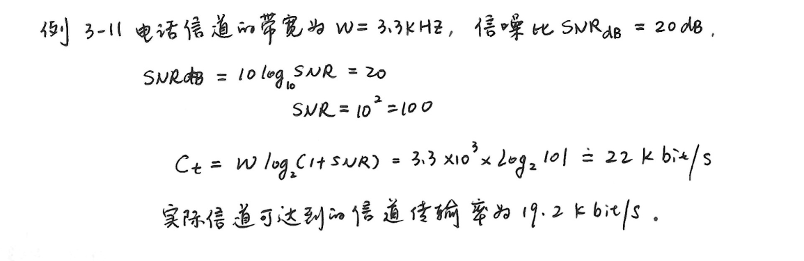

## 3.5 多输入多输出信道及其容量
> 略

## 3.6 信源与信道的匹配
- **符号匹配**
    - 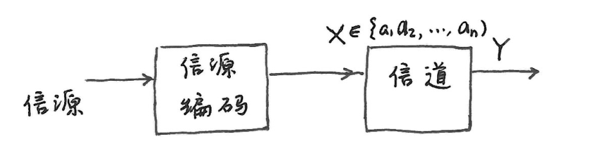
    - 信源编码：将信源符号转换为信道符号
- **信息匹配**
    - 信道绝对冗余度 $R_a = C - I(X;Y)$
    - 信道相对冗余度 $R_r = 1 - \frac{I(X;Y)}{C}$
    - 信道效率 $E = \frac{I(X;Y)}{C}$

# 第四章 信息率失真函数

## 4.1 信息率失真函数的概念和性质
### 失真函数
- **信源编码器模型**：
    - 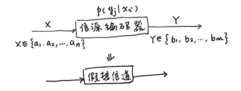
    - 信源 $X \in \{a_1,a_2,\cdots,a_n\}$
    - 经信源编码器输出 $Y \in \{b_1,b_2,\cdots,b_m\}$
- **失真函数** $d(x_i,y_j)$ 定义为：
    $$d(x_i,y_j)=\begin{cases}0, & x_i = y_j \\ \alpha, & \alpha>0, x_i\neq y_j\end{cases}$$
- **失真矩阵** $d$ 定义为：
    $$d = [d(x_i,y_j)]_{n×m} = \begin{bmatrix}d(a_1,b_1)&d(a_1,b_2)&\cdots&d(a_1,b_m)\\\cdots\\d(a_n,b_1)&d(a_n,b_2)&\cdots&d(a_n,b_m)\end{bmatrix}$$

- $d(x_i,y_j)$ 的函数形式可任意选择，常用的有：
    - **均方失真**：$d(x_i,y_j)=(x_i - y_j)^2$ （连续信源）
    - **绝对失真**：$d(x_i,y_j)=\vert x_i - y_j\vert$ （连续信源）
    - **相对失真**：$d(x_i,y_j)=\vert x_i - y_j\vert/\vert x_i\vert$ （连续信源）
    - **误码失真**：$d(x_i,y_j)=\delta(x_i,y_j)=\begin{cases}0, & x_i = y_j \\ 1, & 其他\end{cases}$ （离散信源）
- 例题：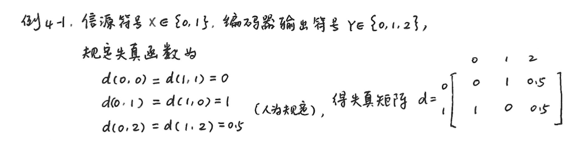

### 平均失真
- 对于离散随机变量，**平均失真** $\overline{D}$ 的计算公式为：
    $$
    \begin{aligned}
    \overline{D} = E(d(x_i,y_j)) &= \sum_{i = 1}^{n}\sum_{j = 1}^{m}p(a_i,b_j)d(a_i,b_j) \\
    &= \sum_{i = 1}^{n}\sum_{j = 1}^{m}p(a_i)p(b_j|a_i)d(a_i,b_j)
    \end{aligned}
    $$

    其中:
    - $p(a_i)$ 是信源符号分布
    - $p(b_j|a_i)$ 是有失真编码器转移概率分布
    - $d(a_i,b_j)$ 是离散随机变量失真函数

### 信息率失真函数 $R(D)$
- 将信源编码器看作信道：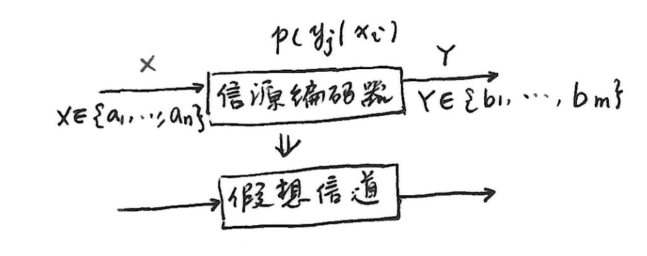
- 编码的目的：
    - 使传输率 $R$ 尽量小
    - 但是$R$ 越小，$\overline{D}$ 越大
    - 在满足 $\overline{D} \leq D$ 条件下，选择一种编码方法使 $R$ 尽量小
- **信息传输率** $R= I(X;Y)$，计算公式为：
    $$
    \begin{aligned}
    R = I(X;Y) & =\sum_{i,j}p(x_i,y_j)\log\frac{p(y_j|x_i)}{p(y_j)} \\
    & =\sum_{i,j}p(x_i)p(y_j|x_i)\log\frac{p(y_j|x_i)}{\sum_{i}p(x_i)p(y_j|x_i)}
    \end{aligned}
    $$

- 对于某特定信源，$p(x_i)$ 确定，$I(X;Y)$ 是关于 $p(y_j|x_i)$ 的凸函数（$\cup$型下凸函数），可以从信道集合 $P_D$ 中找到一种信道 $p(y_j|x_i)$，使 $I(X;Y)$ 最小。
    - **信道集合** $P_D$（$D$允许试验信道）定义为：
        $$P_D = \{p(b_j|a_i) \quad|\quad \overline{D} \leq D, i = 1,2,\cdots,n;j = 1,2,\cdots,m\}$$
    - **信息率失真函数** $R(D)$ 为：
        $$R(D)=\min_{P_D}I(X;Y)$$
    - 对于**离散无记忆信道**，$R(D)$ 可写成：
        $$R(D)=\min_{P_{ij}\in P_D}\sum_{i = 1}^{n}\sum_{j = 1}^{m}p(a_i)p(b_j|a_i)\log\frac{p(b_j|a_i)}{p(b_j)}$$

- 例题：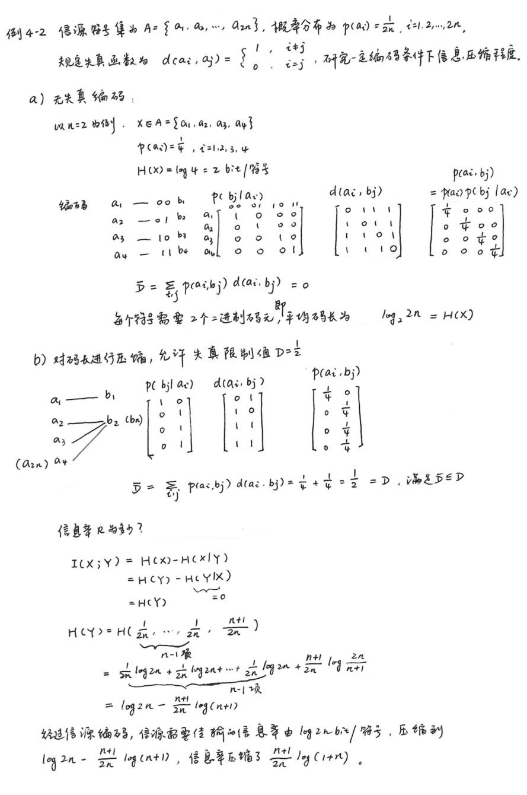

### 信息率失真函数的性质
#### $R(D)$函数的定义域
1. **$D_{min}$和$R(D_{min})$**
    - 平均失真$D$是失真函数$d(x,y)$的数学期望，因此$D$也是非负实数，所以$D_{min} = 0$。
    - $$R(D_{min}) = R(0)=H(X)$$ 等式成立的条件：
        - $D_{min} = 0$：失真矩阵中每行至少有一个零，令条件概率在该行该处为1
        - $R(0) = H(X)$：每一列最多只有一个零，否则多个$X$对应一个$Y$，$R(0) = H(Y) < H(X)$。
    - 对于连续信源，$R(D_{min}) = R(0)=H_c(X)=\infty$。

2. **$D_{max}$和$R(D_{max})$**
    - $$D_{max}=\min_{R(D)=0} D$$ $$R(D_{max})=0$$

    - 当$R(D)=0$，即$I(X;Y)=0$，$X$、$Y$互相独立，$p(y_j|x_i)=p(y_j)=p_j$

    - $$\overline{D}=\sum_{i = 1}^{n}\sum_{j = 1}^{m}p_ip_jd_{ij}$$ 其中$p_i$、$d_{ij}$已知，$D_{max}$为满足$\sum_{j}p_j = 1$条件下$\overline{D}$的最小值。

    - $$
    \begin{align*}
    D_{max} & =\min\sum_{j = 1}^{m}p_j\sum_{i = 1}^{n}p_id_{ij} \\
    &=\min_{j = 1,2,\cdots,m}\sum_{i = 1}^{n}p_id_{ij}
    \end{align*}
    $$ 即在$j = 1, 2, \cdots,m$中，找到$\sum_{i = 1}^{n}p_id_{ij}$值最小的一列$j$，此时取$p_j = 1$，其余置$0$

3. **$R(D)$函数的定义域和值域**
    - $R(D)$函数的最大定义域为$$[0\quad, \min_{j = 1,2,\cdots,m}\sum_{i = 1}^{n}p_id_{ij}]$$
    - $R(D)$函数的最大值域为$$[0, H(X)]$$
    - 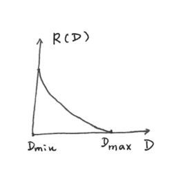

- 例题：
    - 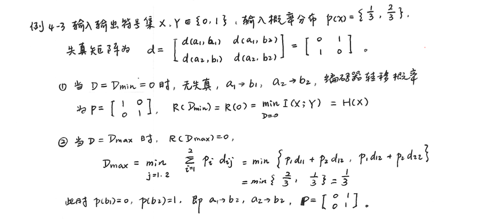
    - 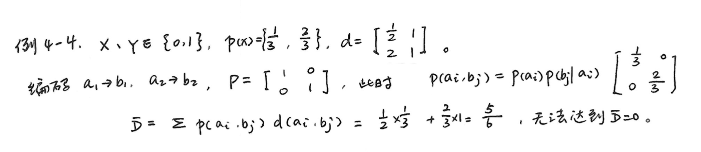

#### $R(D)$函数的下凸性和连续性
- 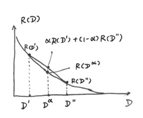
- **下凸性**：
    $$D^{\alpha}=\alpha D'+(1 - \alpha)D'' \quad 0\leq\alpha\leq1$$

    有 $$R(D^{\alpha})\leq\alpha R(D')+(1 - \alpha)R(D'')$$
- **连续性**：
    设 $D' = D+\delta$，当 $\delta\to0$ 时，$P_{D'}\to P_{D}$ ，$R(D')\to R(D)$ 。

#### $R(D)$函数的单调递减性
- 允许的失真度越大，所要求的信息率就越小。
- 规定了允许失真 $D$，及失真函数 $d(i,j)$，可以找到 $R(D)$，作为衡量信源编码压缩难度的一把尺子。

#### 信息率失真函数与信道容量
| | 信道容量 $C$ | 信息率失真函数 $R(D)$ |
| :--- | :--- | :--- |
| 研究对象 | 信道 | 信源 |
| 给定条件 | $p(y_j\|x_i)$ | $p(x_i)$ |
| 选择参数 | $p(x_i)$ | $p(y_j\|x_i)$ |
| 结论 | $C = \max_{p(x)}I(X;Y)$ | $R(D)=\min_{P_D}I(X;Y)$ |
| $H(X\|Y)=H(X)-I(X;Y)$ | 噪声干扰丢失的信息量 | 编码压缩损失的信息量 |

## 4.2 信息率失真函数$R(D)$的计算（参量表示法）
### 例题
1. **例题1**：
    已知$X,Y\in\{0,1\}$，$p(X) =\begin{cases}p, &X=0 \\ 1-p, &X=1 \end{cases}$，$0 < p\leq\frac{1}{2}$，$d(x,y)=\begin{cases}1, & x\neq y \\ 0, & x = y\end{cases}$
    **证明**：$R(D)=\begin{cases}H_b(p)-H_b(D), & 0\leq D\leq p \\ 0, & D > p\end{cases}$，其中$H_b(p)=H(p,1 - p)$，$H_b(D)=H(D,1 - D)$
    - 由$R(D)$性质可得**定义域**：
        失真矩阵 $d=\begin{bmatrix}0&1\\1&0\end{bmatrix}$，令转移概率矩阵 $P=\begin{bmatrix}1&0\\0&1\end{bmatrix}$
        $D_{min} = 0$，$R(0)=H(X)=H_b(p)$
        $D_{max}=\min[p,1 - p]$ = p
    - **求$R(D)$**：
        $R(D)=\min I(X;Y)$，限制条件$P_D = \{p(y|x) | \overline{D}=E(d(X,Y))\leq D\leq D_{max} = p\}$
        令 $Z = d(X,Y) = \begin{cases}1, & x\neq y \\ 0, & x = y\end{cases}$
        $p(x|y) = p(z|y)$，$H(X|Y) = H(Z|Y)$
        又$p(z=1) = p_r(x \neq y)=E(d(X,Y))\leq D\leq p\leq \frac{1}{2}$
        且$H_b(x)$函数关于$\frac{1}{2}$对称，在$0\leq x \leq\frac{1}{2}$范围内，$H_b(x)$函数单调递增。
        则$H(Z) = H_b(p_r(x \neq y)) \leq H_b(D)$
        $$
        \begin{align*}
        I(X;Y)&=H(X)-H(X|Y)\\
        &=H_b(p)-H(X|Y)\\
        &=H_b(p)-H(Z|Y)（令z=d(x,y)）\\
        &\geq H_b(p)-H(Z) （H(Z|Y)\leq H(Z)）\\
        &\geq H_b(p)-H_b(D) （H(Z) \leq H_b(D)）
        \end{align*}
        $$ 所以$R(D) \geq H_b(p)-H_b(D)$
    - **证明下界可达**：
        构造反向BSC信道如图：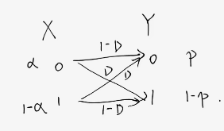
        令$X,Y\in\{0,1\}$，$p(Y) =\begin{cases}p, &Y=0 \\ 1-p, &Y=1 \end{cases}$，$d(x,y)=\begin{cases}1, & x\neq y \\ 0, & x = y\end{cases}$
        转移概率矩阵 $P=\begin{bmatrix}1-D & D\\D & 1-D \end{bmatrix}$
        则$R = I(X;Y) = H(Y)-H(Y|X) =H_b(p)-H_b(D)$，达到下界
        只需证明存在$\alpha$满足$0\leq\alpha\leq1$，使得$p(X) =\begin{cases}\alpha, &X=0 \\ 1-\alpha, &X=1 \end{cases}$
        易知$p = \alpha(1 - D)+D(1 - \alpha)$，即$\alpha=\frac{p - D}{1 - 2D}$
        因为$0 \leq D \leq p \leq \frac{1}{2}$，$p+D\leq1$
        由此可得$0\leq\alpha=\frac{p - D}{1 - 2D}\leq1$，即存在$\alpha$满足条件
2. **例题2**：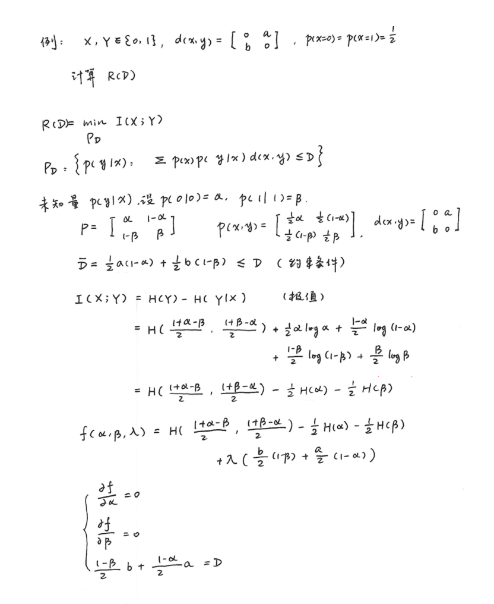
3. **结论**：**二元信源失真函数$R(D)=\begin{cases}H_b(p)-H_b(D), & 0\leq D\leq p \\ 0, & D > p\end{cases}$**

### 参量表示法
1. **条件与记号**
    设离散信源的输入序列为
    $$
    \begin{bmatrix} X \\ P \end{bmatrix} =
    \begin{bmatrix} x_1 & x_2 & \cdots & x_n \\ p(x_1) & p(x_2) & \cdots & p(x_n) \end{bmatrix}
    $$

    输出序列为
    $$
    \begin{bmatrix} Y \\ P \end{bmatrix} =
    \begin{bmatrix} y_1 & y_2 & \cdots & y_m \\ p(y_1) & p(y_2) & \cdots & p(y_m) \end{bmatrix}
    $$

    字符传输的失真函数为 $d(x_i,y_j)$ ， $i = 1,2,\cdots,n$ ； $j = 1,2,\cdots,m$ 。
    为了书写方便，引入记号：
    $$
    d_{ij} = d(x_i,y_j), \quad p_{ij} = p(y_j\mid x_i)\\
    p_i = p(x_i), \quad q_j = p(y_j)
    $$

    式中
    $$p(y_j)=\sum_{i = 1}^{n}p(x_i)p(y_j\mid x_i)=\sum_{i = 1}^{n}p_ip_{ij}$$

2. **问题转换**
    信息率失真函数 $R(D)$ 的计算为在约束条件
    $$
    \begin{cases}
    \sum_{i = 1}^{n}\sum_{j = 1}^{m}p_ip_{ij}d_{ij} = D \\
    \sum_{j = 1}^{m}p_{ij} = 1 \quad i = 1,2,\cdots,n
    \end{cases} \quad ①
    $$

    下，求下式极小值问题。
    $$
    I(X;Y)=\sum_{i = 1}^{n}\sum_{j = 1}^{m}p_ip_{ij}\ln\frac{p_{ij}}{q_j} \quad ②
    $$

    应用拉格朗日乘法，引入乘子 $s$ 和 $\mu_i$ ， $i = 1,2,\cdots,n$ 将上述条件极值问题化成无条件极值问题：
    $$
    \frac{\partial}{\partial p_{ij}}\left[I(X;Y)-sD - \mu_i\sum_{j = 1}^{m}p_{ij}\right]=0\quad i = 1,2,\cdots,n \quad ③
    $$

3. **求解**
    由上式 ③ 解出 $p_{ij}$ ，代入式 ② 中得到在约束条件式 ① 下的 $I(X;Y)$ 极小值，即 $R(D)$ 。

    $$
    \begin{align*}
    \frac{\partial I(X;Y)}{\partial p_{ij}}&=\frac{\partial}{\partial p_{ij}}\left[\sum_{i = 1}^{n}\sum_{j = 1}^{m}p_ip_{ij}\ln\frac{p_{ij}}{q_j}\right]\\
    &=\frac{\partial}{\partial p_{ij}}\left[\sum_{i = 1}^{n}\sum_{j = 1}^{m}p_ip_{ij}\ln p_{ij}-\sum_{i = 1}^{n}\left(\sum_{j = 1}^{m}p_ip_{ij}\right)\ln q_j\right]\\
    &=\frac{\partial}{\partial p_{ij}}\left[\sum_{i = 1}^{n}\sum_{j = 1}^{m}p_ip_{ij}\ln p_{ij}-\sum_{j = 1}^{m}q_j\ln q_j\right]\\
    &=\left[p_ip_{ij}\frac{1}{p_{ij}} + p_i\ln p_{ij}\right]-\left[q_j\frac{1}{q_j}\frac{\partial q_j}{\partial p_{ij}}+\frac{\partial q_j}{\partial p_{ij}}\ln q_j\right]\\
    &=\left[p_i + p_i\ln p_{ij}\right]-\left[p_i + p_i\ln q_j\right]\\
    &=p_i\ln\frac{p_{ij}}{q_j}\\
        \frac{\partial [sD]}{\partial p_{ij}}&=\frac{\partial}{\partial p_{ij}}\left[s\sum_{i = 1}^{n}\sum_{j = 1}^{m}p_ip_{ij}d_{ij}\right]=sp_id_{ij}\\
    \frac{\partial}{\partial p_{ij}}&\left[\mu_i\sum_{j = 1}^{m}p_{ij}\right]=\mu_i
    \end{align*}
    $$

    所以式 ③ 化为：
    $$
    p_i\ln\frac{p_{ij}}{q_j}-sp_id_{ij}-\mu_i = 0\quad     i = 1,2,\cdots,n;j = 1,2,\cdots,m \quad ④
    $$

    由式 ④ 解出 $p_{ij}$ ：
    $$
    p_{ij} = q_j\exp\{sd_{ij}\}\exp\left\{\frac{\mu_i}{p_i}\right\} \quad i = 1,2,\cdots,n;j = 1,2,\cdots,m \quad ⑤
    $$

    令 $\lambda_i=\exp\left\{\frac{\mu_i}{p_i}\right\}$ ，代入式 ⑤ 中得到：
    $$
    p_{ij} = \lambda_iq_j\exp\{sd_{ij}\} \quad i = 1,2,\cdots,n;j = 1,2,\cdots,m \quad ⑥
    $$

    由 $\sum_{j = 1}^{m}p_{ij} = 1$ ，将式 ⑥ 对 $j$ 求和可得到
    $$
    1=\sum_{j = 1}^{m}\lambda_iq_j\exp\{sd_{ij}\} \quad i = 1,2,\cdots,n \quad ⑦
    $$

    由式 ⑦ 可解出 $\lambda_i$ 的值
    $$
    \lambda_i=\frac{1}{\sum_{j = 1}^{m}q_j\exp\{sd_{ij}\}} \quad ⑧
    $$

    由 $q_j=\sum_{i = 1}^{n}p_ip_{ij}$ ，将式 ⑥ 两边同乘 $p_i$ ，并对 $i$ 求和可得到
    $$
    q_j=\sum_{i = 1}^{n}p_ip_{ij}=\sum_{i = 1}^{n}\lambda_ip_iq_j\exp\{sd_{ij}\} \quad j = 1,2,\cdots,m \quad
    $$

    即
    $$
    \sum_{i = 1}^{n}\lambda_ip_i\exp\{sd_{ij}\}=1 \quad j = 1,2,\cdots,m \quad ⑨
    $$

    将式 ⑧ 代入式 ⑨ 中，可得到关于 $q_j$ 的 $m$ 个方程
    $$
    \sum_{i = 1}^{n}\frac{p_i\exp\{sd_{ij}\}}{\sum_{l = 1}^{m}q_l\exp\{sd_{il}\}} = 1 \quad j = 1,2,\cdots,m \quad ⑩
    $$

    由式 ⑩ 中可以解出以 $s$ 为参量的 $m$ 个 $q_j$ 值，将这 $m$ 个 $q_j$ 值代入式 ⑧ 中可以解出以 $s$ 为参量的 $n$ 个 $\lambda_i$ 值，再将解得的 $m$ 个 $q_j$ 值和 $n$ 个 $\lambda_i$ 值代入式 ⑥ 中，可以解出以 $s$ 为参量的 $mn$ 个 $p_{ij}$ 值。

    将解出的 $mn$ 个 $p_{ij}$ 值代入定义式中求出以 $s$ 为参量的平均失真度 $D(s)$ 
    $$
    D(s)=\sum_{i = 1}^{n}\sum_{j = 1}^{m}\lambda_ip_iq_jd_{ij}\exp\{sd_{ij}\} \quad ⑪
    $$

    其中， $\lambda_i$ 和 $q_j$ 由式 ⑦ 和 ⑩ 求得。

    将解出的 $mn$ 个 $p_{ij}$ 值代入式 ② 中得到在约束条件 ① 下的 $I(X,Y)$ 的极小值，即以 $s$ 为参量的信息率失真函数 $R(s)$ 
    $$
    \begin{align*}
    R(s)&=\sum_{i = 1}^{n}\sum_{j = 1}^{m}\lambda_ip_iq_j\exp\{sd_{ij}\}\ln\frac{\lambda_iq_j\exp\{sd_{ij}\}}{q_j}\\
    &=\sum_{i = 1}^{n}\sum_{j = 1}^{m}\lambda_ip_iq_j\exp\{sd_{ij}\}(\ln\lambda_i + sd_{ij})\\
    &=\sum_{i = 1}^{n}p_i\ln\lambda_i\left[\sum_{j = 1}^{m}\lambda_iq_j\exp\{sd_{ij}\}\right]+s\sum_{i = 1}^{n}\sum_{j = 1}^{m}\lambda_ip_iq_jd_{ij}\exp\{sd_{ij}\}\\
    &=\sum_{i = 1}^{n}p_i\ln\lambda_i\left(\sum_{j = 1}^{m}p_{ij}\right)+sD(s)\\
    &=\sum_{i = 1}^{n}p_i\ln\lambda_i + sD(s) \quad ⑫
    \end{align*}
    $$

    一般情况下，参量 $s$ 无法消去，因此得不到 $R(D)$ 的闭式解，只有在某些特定的简单问题中才能消去参量 $s$ ，得到 $R(D)$ 的闭式解。若无法消去参量 $s$ ，就需要进行逐点计算。下面分析一下参量 $s$ 的意义。

    将 $R(D)$ 看成 $D(s)$ 和 $s$ 的隐函数，而 $\lambda_i$ 又是 $s$ 的函数，利用全微分公式对 $R(D)$ 求导，可得
    $$
    \begin{align*}
    \frac{\mathrm{d}R(D)}{\mathrm{d}D}&=\frac{\partial R(s)}{\partial D(s)}+\frac{\partial R(s)}{\partial s}\left(\frac{\mathrm{d}s}{\mathrm{d}D}\right)+\sum_{i = 1}^{n}\frac{\partial R(s)}{\partial \lambda_i}\left(\frac{\mathrm{d}\lambda_i}{\mathrm{d}D}\right)\\
    &=s + D(s)\frac{\mathrm{d}s}{\mathrm{d}D}+\sum_{i = 1}^{n}\frac{p_i}{\lambda_i}\cdot\frac{\mathrm{d}\lambda_i}{\mathrm{d}D}\\
    &=s+\left[D(s)+\sum_{i = 1}^{n}\frac{p_i}{\lambda_i}\cdot\frac{\mathrm{d}\lambda_i}{\mathrm{d}s}\right]\frac{\mathrm{d}s}{\mathrm{d}D} \quad ⑬
    \end{align*}
    $$

    为求出 $\frac{\mathrm{d}\lambda_i}{\mathrm{d}s}$ ，将式  ⑦ 对 $s$ 求导，得到
    $$
    \sum_{i = 1}^{n}\left[p_i\exp\{sd_{ij}\}\frac{\mathrm{d}\lambda_i}{\mathrm{d}s}+\lambda_ip_id_{ij}\exp\{sd_{ij}\}\right]=0
    $$

    将上式两边同乘以 $q_j$ ，并对 $j$ 求和，可得
    $$
    \sum_{j = 1}^{m}q_j\sum_{i = 1}^{n}\left[p_i\exp\{sd_{ij}\}\frac{\mathrm{d}\lambda_i}{\mathrm{d}s}+\lambda_ip_id_{ij}\exp\{sd_{ij}\}\right]=0
    $$

    即
    $$
    \sum_{i = 1}^{n}p_i\left[\sum_{j = 1}^{m}q_j\exp\{sd_{ij}\}\right]\frac{\mathrm{d}\lambda_i}{\mathrm{d}s}+\sum_{i = 1}^{n}\sum_{j = 1}^{m}\lambda_ip_iq_jd_{ij}\exp\{sd_{ij}\}=0
    $$

    将式  ⑧ 和 ⑫ 代入上式，可得
    $$
    \sum_{i = 1}^{n}p_i\frac{1}{\lambda_i}\frac{\mathrm{d}\lambda_i}{\mathrm{d}s}+D(s)=0 \quad ⑭
    $$

    将式 ⑭ 代入式 ⑬ 中，可得
    $$
    \frac{\mathrm{d}R(D)}{\mathrm{d}D}=s \quad ⑮
    $$

    式 ⑮ 表明，参量 $s$ 是信息率失真函数 $R(D)$ 的斜率。由 $R(D)$ 在 $0 < D < D_{max}$ 之间是严格单调减函数可知， $s$ 是负值，且是 $D$ 的递增函数，即 $s$ 将随 $D$ 的增加而增加。
    由 $R(D)$ 的性质可知，在 $D = 0$ 处， $R(D)$ 的斜率有可能为 $-\infty$ ；当 $D > D_{max}$ 时， $R(D)=0$ ，其斜率为零。所以参量 $s$ 的取值为 $(-\infty,0)$ 。
    进一步还可以证明：信息率失真函数 $R(D)$ 是参量 $s$ 的连续函数； $R(D)$ 的斜率，即参量 $s$ 是失真度 $D$ 的连续函数，在 $D = D_{max}$ 处， $R(D)$ 的斜率可能是不连续的。

# 第五章 信源编码

## 信源编码与信道编码
- **信源编码**
    - **无失真信源编码——第一极限定理**：离散信源
    - **限失真信源编码——第三极限定理**：连续信源
    - 在不失真或允许一定失真条件下，如何用尽可能少的符号来传送信源信息，以便提高信息传输率。
- **信道编码**
    - **第二极限定理**：离散和连续信道
    - 在信道受干扰的情况下如何增加信号的抗干扰能力，同时又使得信息传输率最大。

- **信源编码的作用**
    1. **符号变换**：使信源的输出符号与信道的输入符号相匹配；
    2. **信息匹配**：使信息传输率达到信道容量；
    3. **冗余度压缩**：使编码效率等于或接近100%。
    - 例题：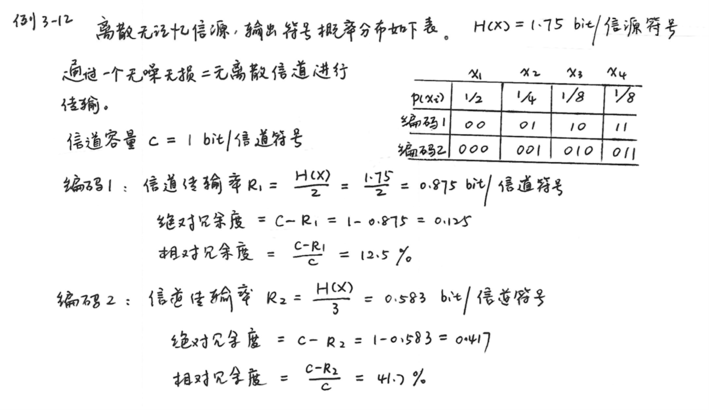

- **信源编码的基础**
    1. **无失真编码定理**：可精确复制信源输出的消息，只适用于离散信源
    2. **限失真编码定理**：对于连续信源，只能在失真受限制的情况下进行限失真编码

## 5.1 编码的概念
### 分组码
- **分组码(Block Codes)**：也叫块码
    - 将信源消息分成若干组，即符号序列 $x_{i}$ ，
        $$\begin{align*}x_{i}&=(x_{i1}x_{i2} \cdots x_{il} \cdots x_{iL})\\x_{il}&\in A=\{a_{1}, a_{2}, \cdots, a_{i}, \cdots, a_{n}\}\end{align*}$$
    - 每个符号序列 $x_{i}$ 依照**固定码表**映射成一个码字 $y_{i}$ ，
        $$\begin{align*}y_{i}&=(y_{i1}y_{i2} \cdots y_{ik} \cdots y_{iK})\\y_{ik}&\in B=\{b_{1}, b_{2}, \cdots, b_{i}, \cdots, b_{m}\}\end{align*}$$
    - 只有分组码才有对应的码表，而非分组码中则不存在码表。
    - **模型**：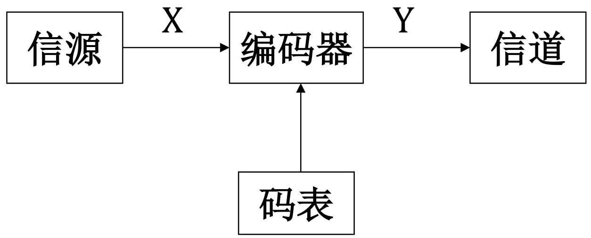
- **定长码与变长码**：码可分为两类：
    - **定长码**：码中所有码字的长度都相同，如码1就是定长码(Fixed Length Codes)。
    - **变长码**：码中的码字长短不一，如码2就是变长码(Variable Length Codes)。
    - |符号 $a_{i}$|信源符号出现概率 $p(a_{i})$|码1|码2|
        | --- | --- | --- | --- |
        | $a_{1}$ | $p(a_{1})$ | 00 | 0 |
        | $a_{2}$ | $p(a_{2})$ | 01 | 01 |
        | $a_{3}$ | $p(a_{3})$ | 10 | 001 |
        | $a_{4}$ | $p(a_{4})$ | 11 | 111 |

- **码的属性**：
    - **奇异码与非奇异码**：
        - 若信源符号和码字是一一对应的，则该码为**非奇异码**(Non-Singular Codes)；
        - 反之为**奇异码**(Singular Codes)
    - **唯一可译码(Uniquely Decodable Codes_)**：
        - 任意有限长的码元序列，只能被唯一地分割成一个个的码字，便称为唯一可译码。
        - 奇异码不是唯一可译码
        - 唯一可译码分为非即时码和即时码
            - **非即时码**指接收端收到一个完整的码字后不能立即译码，还需等下一个码字开始接收后才能判断是否可以译码
            - **即时码**只要收到符号就表示该码字已完整，可以立即译码 ，又称为**非延长码**(Undelayed Codes)，任意一个码字都不是其它码字的前缀部分，又称为**异前缀码**(Prefix Codes)。

### 码的分类
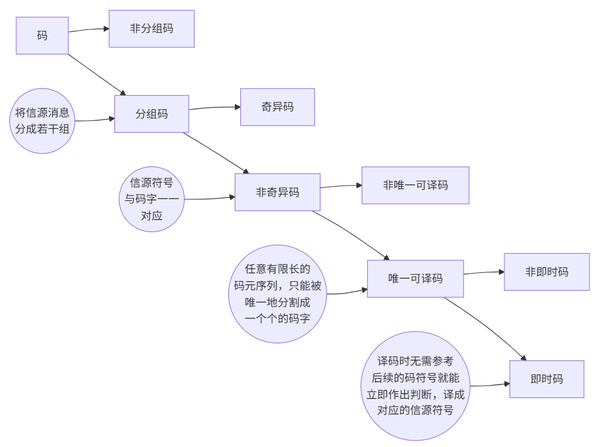

### 即时码及其树图构造法
- 即时码(非延长码或异前缀码)是唯一可译码的一类子码，可用树图来构造
- **构造的要点**：
    - 最上端为树根A，从根出发向下伸出树枝，树枝总数等于m(**进制数**)，树枝的尽头为节点。
    - 从每个节点再伸出m个树枝，当某个节点被安排为码字后，就不再伸枝，这节点为**终端节点**。能再伸枝的节点成为**中间节点**。一直继续下去，直至都不能伸枝为止。
    - 每个节点所伸出的树枝标上码符号，从根出发到终端点所走路径对应的码符号序列则为终端节点的码字。
- **用码树图构造码**
    - 在树的生长过程中，节点生出树枝，各树枝旁标出相应的码符，为了清晰起见相同码符的树枝方向相同，终端节点表示信源符号，从树根到终端节点所经过的树枝旁的码符按经过的顺序组成的序列构成码字。
- **用码树图判断即时码**
    - 如果表示信源符号的终端节点不再延伸，或到达任一 信源符号终端节点的路径不经过其它的终端节点，这样构 造的码满足即时码条件。
- **码树与码字对应关系**
    
    |树结构概念|编码概念|
    | ---- | ---- |
    |树根|码字的起点|
    |树枝数|码的进制数|
    |节点|码字或码字的一部分|
    |终端节点|码字|
    |节数|码长|
    |非满树|变长码（码字为叶节点）|
    |满树|等长码（码字为叶节点）|

### 克劳夫特不等式
- **唯一可译码存在**的充分必要条件是各码字的长度 $K_{i}$ 应符合**克劳夫特不等式**(Kraft Inequality) 
    $$\sum_{i=1}^{n} m^{-K_{i}} \leq 1$$

    式中，m是编码进制数，n是信源符号数。
    - 必要性表现在如果码是唯一可译码，则必定满足该不等式
    - 充分性表现在如果满足该不等式，则这种码长的唯一可译码一定存在，但并不表示所有满足不等式的一定是唯一可译码。
    - 所以说，该不等式是唯一可译码存在的充要条件，而不是判别一个编码是否唯一可译码的充要条件

- **唯一可译码的判断方法**
    1. **基本判断**：
        1. 观察是否是非奇异码，若是奇异码则一定不是唯一可译码。
        2. 计算是否满足Kraft不等式，若不满足一定不是唯一可译码。
        3. 将码画成一棵树图，观察是否满足即时码的树图的构造，若满足则是唯一可译码。
    2. **尾随后缀法**：
        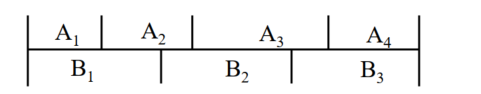
        1. 考查 $C$ 中所有的码字，若 $W_{i}$ 是 $W_{j}$ 的前缀，则将相应的后缀作为一个尾随后缀码放入集合 $F_{0}$ 中
        2. 考查 $C$ 和 $F_{i}$ 两个集合, $W_{i} \in C$ 是 $W_{j} \in F_{i}$ 的前缀或 $W_{i} \in F_{i}$ 是 $W_{j} \in C$ 的前缀，则将相应的后缀作为尾随后缀码放入集合 $F_{i+1}$ 中;
        3. $F=\cup _{i} F_{i}$ 即为码 $C$ 的尾随后缀集合;
        4. 构造尾随后缀集合F，若F中出现了$C$中的元素，则算法终止，返回假($C$不是唯一可译码)；否则若F中没有出现新的元素，则返回真。
        - **例题**：判断码$C$：$\{0, 1001, 1011, 1101, 1111, 011\}$是否是唯一可译码。
            - 构造尾随后缀集合$F$：码字 "0" 是 "011" 的前缀，其尾随后缀 "11" 是码字 "1011" 和 "1111" 的前缀，得尾随后缀为 "01" 和 "11" ，其中 "0" 是 "01" 的前缀，尾随后缀为 "1" ，"1" 又是 "1011" 的前缀，得到尾随后缀 "011" ，而 **"011" 是$C$中码字**，所以码$C$不是唯一可译码。
            - 尾随后缀集合$F = \{11, 01, 1, 001, 011, 111\}$ ， "011" 是一个码字，因此不唯一可译。
            $0 \longrightarrow 11 \longrightarrow 01\longrightarrow 1 \longrightarrow 001$，$\colorbox{yellow}{011}$，$111$

## 5.2 无失真信源编码定理
### 无失真信源编码
- **模型**：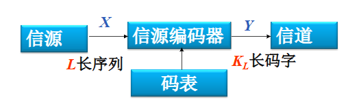
    - 信源编码器输入的消息序列：
        $$\begin{align*}X=(X_{1}X_{2} \cdots X_{l} \cdots X_{L})\quad X_{l}\in\{a_{1}, \cdots a_{n}\}\end{align*}$$

        输入的消息总共有 $n^{L}$ 种可能的组合
        输出的码字为：
        $$\begin{align*}Y=(Y_{1}Y_{2} \cdots Y_{k} \cdots Y_{K_{L}})\quad Y_{k}\in\{b_{1}, \cdots b_{m}\}\end{align*}$$

        输出的码字总共有 $m^{K_{L}}$ 种可能的组合。
    - $Y_{k}$有$m$种可能取值，所以平均每个符号输出的最大信息量为$\log m$（等概分布）。
    - $K_{L}$长码字的最大信息量为$K_{L}\log m$，用该码字表示$L$长的信源序列。
    - 则传送一个信源符号需要的平均信息率为：
        $$\overline{K}=\frac{K_{L}}{L}\log m = \frac{1}{L}\log M \text{ bit/信源符号}$$

        其中，$M = m^{K_{L}}$是$Y$所能编成的码字的个数。

- **无失真信源编码**
    - **实现无失真的信源编码要求**：
        - 信源符号 $X_{1}X_{2}\cdots X_{l} \cdots X_{L}$ 与码字 $Y_{1}Y_{2}\cdots Y_{k}\cdots Y_{K_{L}}$ 是一一对应的；
        - 能够无失真或无差错地从Y恢复X，也就是能正确地进行反变换或译码 ；
        - 传送Y时所需要的信息率最小，信息率最小就是找到一种编码方式使$\overline{K}  = \frac{K_L}{L} \log m =\frac{1}{L} \log M$最小

    - **无失真信源编码定理研究内容**：
        - 最小信息率为多少时，才能得到无失真的译码？
        - 若小于这个信息率是否还能无失真地译码？

### 定长编码
#### 定长编码的基本概念
- 码长$K$是定值，且是唯一可译码。
- 由$L$个符号组成的、每个符号的熵为$H_{L}(X)$的无记忆平稳信源符号序列$X_{1}X_{2}...X_{l}...X_{L}$（每个符号$n$种可能值）
- 输入的消息总共有$n^{L}$种可能的组合。
- 可用$K_{L}=K$个符号$Y_{1}$，$Y_{2}$，...，$Y_{k}$，...，$Y_{K_L}$（每个符号有$m$种可能值）进行定长编码
- 输出的码字总共有$m^{K}$种可能的组合
- **若要对信源进行定长编码且无失真**，必须满足：
$$n^{L} \leq m^{K} 或 \frac{K}{L} \geq \frac{\log n}{\log m}$$
    - 只有当$K$长的码符号序列数$m^{K}$大于或等于信源的符号数$n^{L}$时，才可能存在定长非奇异码。

#### 渐进均分性定理（AEP）
- **定理**：$\vec{X}=(X_1 X_2 \cdots X_L)$，为独立同分布（i.i.d）随机变量序列，具有渐近均分性质（AEP，Asymptotic equipartition property）：
    $$\forall \varepsilon > 0，当 L \to \infty时，p(X_1,X_2,\cdots,X_L) \to 2^{-L H(X)}$$
- **证明**：**见[无失真信源编码定理](Ch5sup_无失真信源编码定理.md/#渐进均分性定理aep)**

#### 定长编码定理
- **定理**：对于由 $L$ 个符号组成的，每个符号的熵为 $H_L(\vec{X})$ 的无记忆平稳符号序列 $X_1, X_2, \cdots, X_L$，可用 $K_L$ 个符号 $Y_1, Y_2, \cdots, Y_{K_L}$（每个符号有 $m$ 种可能值，即$m$进制编码）进行定长编码。对于任意 $\varepsilon > 0$，$\delta > 0$，只要
    $$\overline{K} = \frac{K_L}{L}\log m \geq H_L(\vec{X}) + \varepsilon$$

    则当 $L$ 足够大时，必可使译码差错小于 $\delta$；
    反之，当
    $$\overline{K} = \frac{K_L}{L}\log m \leq H_L(\vec{X}) - 2\varepsilon$$

    时，译码差错一定是有限值，当 $L \to \infty$ 时，译码几乎必定出错。
- **证明**：**见[无失真信源编码定理](Ch5sup_无失真信源编码定理.md/#定长编码定理)**
- **定长编码定理含义**
    - 当编码器容许的输出信息率，也就是当每个信源符号所必须输出的二进制码长是
        $$
        \overline{K}=\frac{K_{L}}{L}\log m=\frac{1}{L}\log M
        $$

        时，只要 $\overline{K}>H_{L}(X)$ ，这种编码器一定可以做到**几乎无失真**，也就是收端的译码差错概率接近于零，**条件是所取的符号数 $L$足够大**。
    - 将定理的条件改写成：
        $$
        K_{L}\log m>L H_{L}(X)=H(X)
        $$
        其中：
        - 左边：$K_{L}$长码字所能携带的最大信息。
        - 右边：$L$长信源序列携带的信息量。

        则：
        - 码字所能携带的信息量**大于**信源序列输出的信息量，则可以使传输**几乎无失真**，当然**条件是 $L$足够大**。
        - 反之，当 $\overline{K} < H_{L}(X)$ 时，不可能构成无失真的编码，也就是不可能做一种编码器，能使收端译码时差错概率趋于零。
        - $\overline{K}=H_{L}(X)$ 时，则为临界状态，可能无失真，也可能有失真。

- **信源长度 $L$**
    - 对定长编码，若要实现几乎无失真编码，则信源长度必须满足：
        $$L \geq \frac{\sigma^{2}(X)}{\varepsilon^{2} \delta}$$

        其中：
        - $\sigma^{2}(X)=E\{[I(x_{i}) - H(X)]^{2}\}$，表示信源序列的自信息方差。
        - $\delta$：差错率要求（如$10^{-6}$）
        - $\varepsilon = \overline{K}-H_{L}(X)$
    - 证明：见[无失真信源编码定理](Ch5sup_无失真信源编码定理.md/#定长编码定理)

- **编码效率$\eta$**
    - 编码效率定义为
        $$\eta = \frac{H_{L}(X)}{\overline{K}}$$
        即信源的平均符号熵为$H_{L}(X)$，采用平均二进制符号码长为$\overline{K}$来编码，所得的效率。

    - 无失真编码效率总是小于$1$，且**最佳编码效率**为
        $$\eta = \frac{H_{L}(X)}{H_{L}(X)+\varepsilon},\varepsilon > 0$$
    - 定长编码定理从理论上阐明了编码效率接近$1$的理想定长编码器的存在性，它使输出符号的信息率与信源熵之比接近于$1$，即只要$L$足够大
        $$\frac{H_{L}(X)}{\frac{K_{L}}{L}\log m} \to 1$$
        - 但要在实际中实现，$L$必须取无限长的信源符号进行统一编码。这样做实际上是不可能的，因$L$非常大，无法实现。
        - 当$L$有限时，要做到高编码效率、低错误率，对于定长编码来说是不可能做到的。
- **例题**：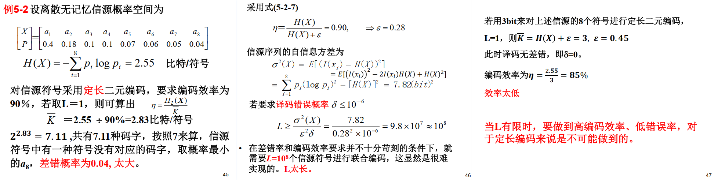

### 变长编码
#### 变长编码的基本概念
- 在变长编码中，码长$K_{i}$是变化的。
- $m$进制平均码长：$\overline{K^{'}} = \sum_{i} p(a_{i})K_{i}$
- 根据信源各个符号的统计特性，如概率大的符号用短码，概率小的用较长的码，使得编码后平均码长降低，从而提高编码效率。（统计匹配） 

#### 单个符号变长编码定理
- **定理**：若离散无记忆信源的符号熵为 $H(X)$ ，每个信源符号用m进制码元进行变长编码，一定存在一种无失真编码方法，其(m进制)码字平均长度 $\overline{K'}$ 满足下列不等式
    $$\frac{H(X)}{\log m} \leq \overline{K'}<\frac{H(X)}{\log m}+1$$
- **证明**：**见[无失真信源编码定理](Ch5sup_无失真信源编码定理.md/#单符号变长编码定理)**

#### 离散平稳无记忆序列变长编码定理(香农第一定理)
- 由单个符号变长编码定理推广而来：
    $$
    \begin{align*}
    \frac{H(X)}{\log m} \leq &\overline{K^{'}} < \frac{H(X)}{\log m} + 1 \\
    \Rightarrow \frac{LH_{L}(X)}{\log m} \leq &\overline{K_{L}} < \frac{LH_{L}(X)}{\log m} + 1\\
    \Rightarrow H_{L}(X) \leq &\overline{K} < H_{L}(X)+\frac{\log m}{L}
    \end{align*}
    $$
- **定理**：对于离散平稳无记忆信源，必存在一种无失真编码方法，使平均信息率 $\overline{K}$ 满足不等式
    $$H_{L}(X) \leq \overline{K} < H_{L}(X)+\frac{\log m}{L}$$

    其中$\overline{K} = \frac{\overline{K_{L}}}{L}\log m$，当L足够大时，可使 $\frac{\log m}{L}<\varepsilon$ ，得到
    $$H_{L}(X) \leq \overline{K} < H_{L}(X)+\varepsilon$$

    其中$\varepsilon$是任意小的正数。
- **证明**：**见[无失真信源编码定理](Ch5sup_无失真信源编码定理.md/#离散平稳无记忆序列变长编码定理香农第一定理)**

- **变长编码效率**
    变长编码效率的**下界**：
    $$
    \eta=\frac{H_{L}(X)}{\overline{K}} > \frac{H_{L}(X)}{H_{L}(X) + \frac{\log m}{L}}
    $$

    无失真编码效率总是小于1，可以用它来衡量各种编码方法的优劣。
    为了衡量各种编码方法与最佳码的差距，定义**码的剩余度**为：
    $$
    \gamma = 1 - \eta = 1 - \frac{H_{L}(X)}{\frac{\overline{K_{L}}}{L}\log m}= 1 - \frac{H_{L}(X)}{\overline{K}}
    $$

    对某一信源和某一码符号集，若有一个唯一可译码，其平均长度小于所有其他唯一可译码的平均长度，则称该码为**最佳码**或**紧致码**。

- **例题**：
    - 例题1：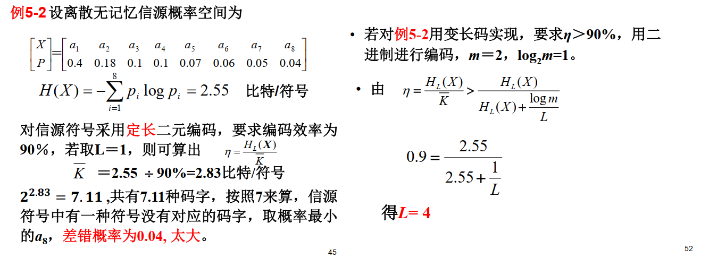
    - 例题2：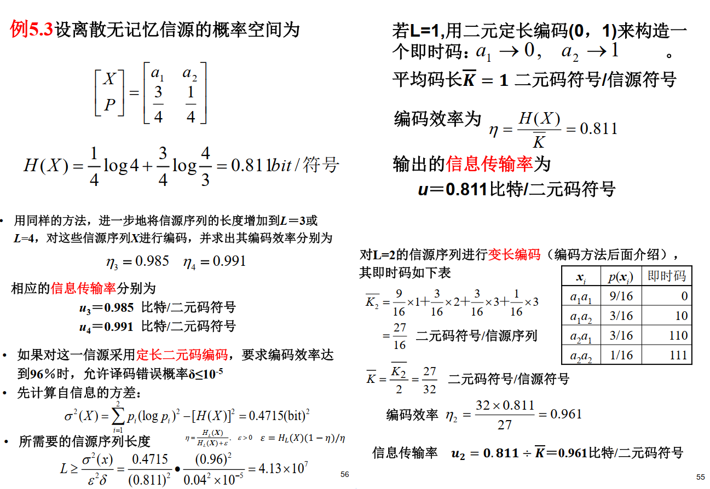

### 香农编码
- 香农第一定理指出了平均码长与信源熵之间的关系，同时也指出了可以通过编码使平均码长达到极限值，这是一个很重要的极限定理。
- 香农第一定理指出，选择每个码字的长度$l_{i}$满足下式：
    $$l_{i} =\left\lceil \log\frac{1}{p(x_{i})}\right\rceil（向上取整）$$或：$$I(x_{i})\leq l_{i} < I(x_{i}) + 1$$

    这种编码方法称为香农编码

- **编码步骤**
    1. 将信源消息符号按其出现的概率大小依次排列：$$p_{1}\geq p_{2}\geq\cdots\geq p_{n}$$
    2. 依照下列不等式确定整数的码长$K_{i}$：$$-\log_{2}(p_{i})\leq l_{i} < -\log_{2}(p_{i}) + 1$$
    3. 为了编成唯一可译码，计算第$i$个消息的累加概率：$$P_{i}=\sum_{k = 1}^{i - 1}p(a_{k})$$
    4. 将累加概率$P_{i}$变换成二进制数
    5. 取$P_{i}$二进制数的小数点后$l_{i}$位即为该消息符号的二进制码字

- **香农编码图示**
    - 累加概率$P_{i}$把区间$[0, 1)$分割成许多小区间，每个小区间的长度等于各符号的概率$p_{i}$，小区间内的任一点可用来代表该符号 ：$P_{i}=\sum_{k = 1}^{i - 1}p(a_{k})$
    - 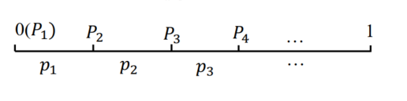

- **例题**：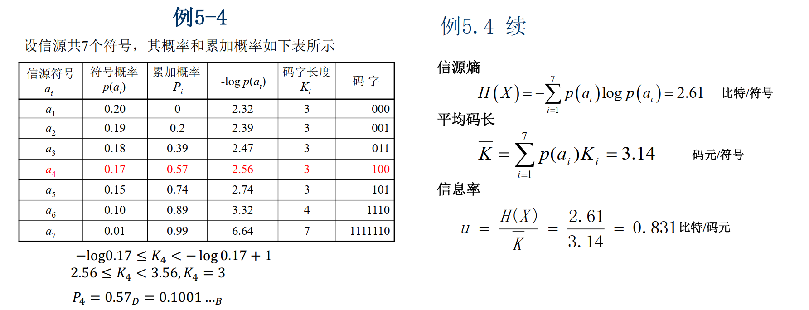

## 5.3 限失真信源编码定理
### 无失真与有失真信源编码
- 无失真信源编码是**保熵的**：通过信道的信息传输率$R$等于信源熵$H(X)$。
- 有失真信源编码属**熵压缩编码**，即编码后的信息率得到压缩。
- 采用有失真的熵压缩编码的原因：
    - 保熵编码并非总是必需的；
    - 保熵编码并非总是可能的；
    - 降低信息率有利于传输和处理。

### 限失真信源编码定理
- 信息率失真函数给出了失真小于$D$时所必须具有的最小信息率$R(D)$；只要信息率大于$R(D)$，一定可以找到一种编码，使译码后的失真小于$D$。
- **限失真信源编码定理**：设**离散无记忆信源**$X$的信息率失真函数为$R(D)$，则当信息率$R>R(D)$，只要信源序列长度$L$足够长，一定存在一种编码方法，其译码失真小于或等于$D + \varepsilon$，$\varepsilon$为任意小的正数。反之，若$R < R(D)$，则无论采用什么样的编码方法，其译码失真必大于$D$。

- 二元信源编码：
    - 对于任意小的$\varepsilon$，每一个信源符号的平均码长满足如下公式：
        $$R(D) \leq \overline{K} < R(D) + \varepsilon$$

        在失真限度内使信息率任意接近$R(D)$的编码方法是存在的。然而，如果使信息率小于$R(D)$，平均失真一定会超过失真限度$D$。
- 对于**连续**平稳无记忆信源，无法进行无失真编码，在**限失真**情况下，有与上述定理一样的编码定理。

- 限失真信源编码定理只能说明**最佳编码是存在的**，而具体构造编码方法却一无所知。因而就不能象无失真编码那样从证明过程中引出概率匹配的编码方法。一般只能从优化的思路去求最佳编码。实际上迄今尚无合适的可实现的编码方法可接近$R(D)$这个界。

## 5.4 常用信源编码方法简介
### 变长码与存储器容量
- $T$秒内有$N$个信源符号输出，信源输出符号速率$S = N/T$，若符号的平均码长为$\overline{K}$，则信道**传输速率**需要
    $$R_{t}=S\overline{K}$$
- $N$个码字的长度分别为$K_{i},i = 1,\ldots,N$，即在此期间输入存储器$\sum_{i = 1}^{N}K_{i}$ bit，输出信道$R_{t}T$ bit，则在**存储器里还剩**：
    $$X=\sum_{i = 1}^{N}K_{i}-R_{t}T$$
- 已知$K_{i}$是随机变量，其均值和方差为：
    $$
    \overline{K}=E[K_{i}]=\sum_{j = 1}^{m}p_{j}K_{j}\\
    \sigma^{2}=E[K_{i}^{2}]-\overline{K}^{2}=\sum_{j = 1}^{m}p_{j}K_{j}^{2}-\overline{K}^{2}
    $$

    式中$m$为信源符号集的元数。当$N$足够大时，$X$是许多独立同分布的随机变量之和，它近似于正态分布
    $$p_{X}(x)=\frac{1}{\sqrt{2\pi}\sigma_{X}}e^{-\frac{(x - E[X])^{2}}{2\sigma_{X}^{2}}}$$

    其均值和方差分别为：
    $$
    E[X]=N\overline{K}-R_{t}T$$$$
    \sigma_{X}^{2}=N\sigma^{2}
    $$
- 若信道速率满足$R_{t}=S\overline{K}$，$E[X]=0$。假设存储器容量为$2A\sigma_{X}$，起始时存储器为半满，则**溢出概率**为：
    $$P(X > A\sigma_{X})=\phi(-A)=\int_{-\infty}^{-A}\varphi(x) dx$$

    **取空概率**为：
    $$P(X < -A\sigma_{X})=\phi(-A)$$

    其中$\phi(x)$为标准正态分布函数，$\varphi(x)$为标准正态分布密度函数。

- 若要求溢出和取空概率$P_{e}=0.001$，查表得$A = 3.08$，则存储器容量为：
    $$C>2A\sigma_{X}=2A\sqrt{N}\sigma = 6.16\sqrt{N}\sigma$$

    - 码方差$\sigma$越大，要求存储器的容量也越大。
    - 时间越长，$N$越大，要求存储器的容量也越大。
    - 存储器容量设定后，随着时间的增长，存储器溢出和取空的概率都将增大。

- 一般来说，变长码只适用于有限长的信息传输（如传真）。实际使用时，可把长信息分段发送，也可以实时检测存储器的状态，调整输出。

### 分组码
#### 香农(Shannon)编码
- 见[香农编码](#香农编码)
- **编码步骤**
    1. 将信源消息符号按其出现的概率大小依次排列：$$p_{1}\geq p_{2}\geq\cdots\geq p_{n}$$
    2. 依照下列不等式确定整数的码长$K_{i}$：$$-\log_{2}(p_{i})\leq l_{i} < -\log_{2}(p_{i}) + 1$$
    3. 为了编成唯一可译码，计算第$i$个消息的累加概率：$$P_{i}=\sum_{k = 1}^{i - 1}p(a_{k})$$
    4. 将累加概率$P_{i}$变换成二进制数
    5. 取$P_{i}$二进制数的小数点后$l_{i}$位即为该消息符号的二进制码字

#### 哈夫曼(Huffman)编码
- **特点**
    - 哈夫曼（Huffman）编码是分组码。
    - 依据各符号出现的**概率**来构造码字。
    - 基于二叉树的编码思想，所有可能的符号在哈夫曼树上对应为一个节点，节点的位置就是该符号的码字。这些节点都是终极节点，不再延伸，不会出现前缀码，因而唯一可译。
    - 哈夫曼编码是一种效率比较高的**变长无失真信源编码**方法。

- **编码步骤**：
    1. 将信源消息符号按其出现的概率大小依次排列 $$p_{1} \geq p_{2} \geq \cdots \geq p_{n}$$
    2. 取两个概率最小的符号分别配以0和1两个码元，并将这两个概率相加作为一个新符号的概率，与未分配的二进符号的符号重新排队。
    3. 对重排后的两个概率最小符号重复步骤 2 的过程。
    4. 不断继续上述过程，直到最后两个符号配以0和1为止。
    5. 从最后一级开始，**向前**返回得到各个信源符号所对应的码元序列，即相应的码字。

- 哈夫曼编码方法得到的码**并非唯一**的。
    - 每次对信源缩减时，赋予信源最后两个概率最小的符号时，0和1是可以任意的，所以可以得到不同的哈夫曼码，但不会影响码字的长度。
    - 对信源进行缩减时，若两个概率最小的符号合并后的概率与其它信源符号的概率相同时，这两者在缩减信源中进行概率排序，其位置放置次序是可以任意的，故会得到不同的哈夫曼码。此时将影响码字的长度，一般将**合并的概率放在靠前位置**，这样可获得**较小的码方差**。
    - 不同的编法得到的码字长度$K_{i}$也不尽相同。
- 单符号信源编二进制哈夫曼码，编码效率主要决定于信源熵和平均码长之比。
    - 对相同的信源编码，其熵是一样的，采用不同的编法得到的平均码长可能不同。
    - 平均码长越短，编码效率就越高。

- **码方差**：
    $$
    \sigma_{I}^{2}=E\left[\left(K_{i}-\overline{K}\right)^{2}\right]=\sum_{i = 1}^{q}p(a_{i})(K_{i}-\overline{K})^{2}
    $$
    - 例题：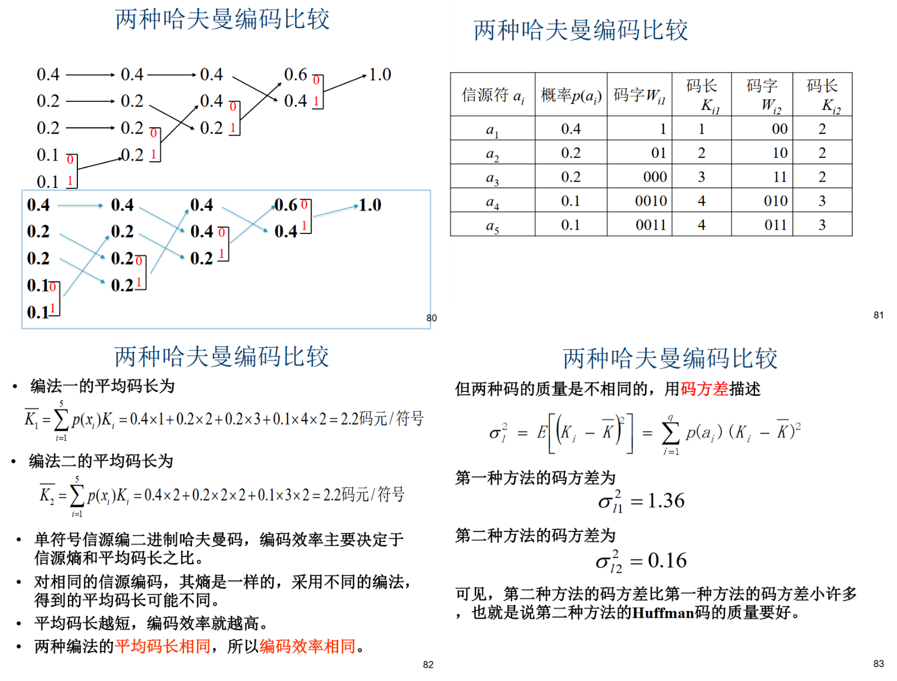

- **N进制哈夫曼编码**：
    - 在N进制哈夫曼编码中，为了得到最短平均码长，有时需要对信源符号作添加，使信源符号数量满足 $$N + k(N - 1) \quad k\in N$$
    - 平均二进制码长(信息率)为 $$\overline{K} = \frac{\overline{K_L}}{L}\log_2 N$$

- **用哈夫曼方法对信源序列编码**
    - 随着序列长度$L$的增加，平均（二进制）码长迅速降低，接近信源熵值。
    - 例题：信源输出两个符号，概率分布为$P = (0.9, 0.1)$，信源熵$H(X)=0.469$比特/符号。采用二进制哈夫曼编码。
        - $L = 1,\overline{K}=1$ bit/符号
        - $L = 2,P'=(0.81, 0.09, 0.09, 0.01),\overline{K}=0.645$ bit/符号
        - $L = 3,\overline{K}=0.533$ bit/符号
        - $L = 4,\overline{K}=0.494$ bit/符号

#### 费诺(Fano)编码
- **特点**：
    - 费诺（Fano）编码方法属于概率匹配编码
    - 费诺码的编码方法实际上是一种构造码树的方法，所以费诺码是即时码 。
    - 费诺码考虑了信源的统计特性，使概率大的信源符号能对应码长短的码字，从而有效地提高了编码效率。
    - 但是费诺编码方法不一定使短码得到充分利用。尤其当信源符号较多时，若有一些符号概率分布很接近时，分两大组的组合方法会很多。可能某种分大组的结果，会使后面小组的“概率和”相差较远，使平均码长增加。
- **编码步骤**：
    1) 将信源消息符号按其出现的概率大小依次排列 $$p_{1} \geq p_{2} \geq \cdots \geq p_{n}$$
    2) 将依次排列的信源符号按概率值分为两大组，使两个组的概率之和近于相同，并对各组赋予一个二进制码元“0”和“1”；
    3) 将每一大组的信源符号进一步再分成两组，使划分后的两个组的概率之和近于相同，并又赋予两个组一个二进制符号“0”和“1”。
    4) 如此重复，直至每个组只剩下一个信源符号为止。
    5) 信源符号所对应的码字即为费诺码。
- 适用场景：费诺码比较适合于每次分组概率都很接近的信源，特别是对每次分组概率都相等的信源进行编码时，可达到理想的编码效率。
- 例题：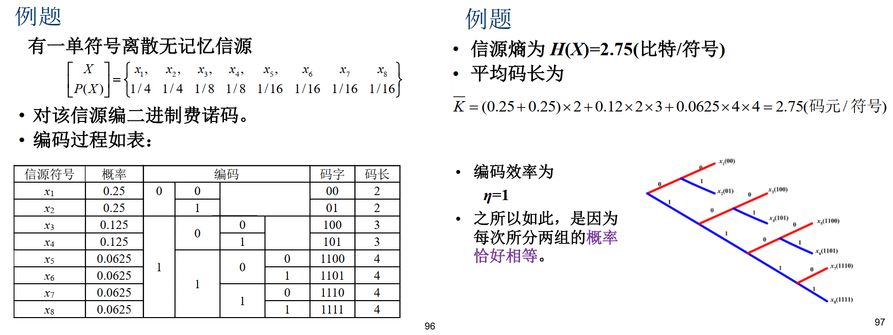

#### 分组码的局限性
- 概率特性必须得到精确的测定，若其略有变化，还需更换码表。
- 对于二元信源，常常需要将多个符号合起来编码才能取得较好的效果。
- 当合并的符号数不大时，编码效率提高不明显，尤其是对于相关信源，结果难以令人满意。
- 而合并的符号数增大时，码表中的码字数增多，会导致设备越来越复杂 。

### 非分组码
#### 算术编码
- **特点**：
    - 算术码是一种**非分组码**，其基本思路是：
        - 积累概率$P(S)$把区间$[0, 1)$分割成许多小区间，每个小区间的长度等于各序列的概率$p(S)$，小区间内的任一点可用来代表这序列。
        - 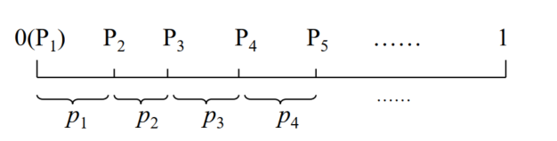
    - **与[香农编码](#香农编码)的区别**：香农码考虑单个符号，算术编码考虑的是整个数据文件。

- **求序列的概率$p(S)$和累计概率$P(S)$**：
    - 信源符号集$A = \{a_{1},a_{2},\cdots,a_{n}\}$，$L$长信源序列共有$n^{L}$种可能序列，因为序列长度$L$很大，很难得到对应序列的概率和累积概率，只能从已知的信源符号概率中递推得到。
    - 信源符号概率分布为：$$P = [p(a_{1}),p(a_{2}),\cdots,p(a_{n})]=[p_{1},p_{2},\cdots,p_{n}]$$
    - 定义各符号的累积概率为：$$P_{r}=\sum_{i = 1}^{r - 1}p_{i}\quad p_{r}=P_{r + 1}-P_{r}$$
- **累积概率递推公式**
    - **二元序列**：
        有二元符号序列$S = 011$，把3个二元符号的序列按自然二进制数排列，$000, 001, 010, 011,\cdots$，则$S$的累积概率为：
        $$P(S)=p(000)+p(001)+p(010)$$

        如果$S$后面接一个“$0$”，累积概率就成为：
        $$
        \begin{align*}
        P(S,0)=&P(0110)\\
        =&p(0000)+p(0001)+p(0010)+\\
        &p(0011)+p(0100)+p(0101)
        \end{align*}
        $$

        由归一律，$p(0000)+p(0001)=p(000)$等，得：
        $$P(S,0)=P(0110)=p(000)+p(001)+p(010)=P(S)$$

        同理，
        $$
        \begin{align*}
        P(S,1)=&P(0111)\\
        =&p(0000)+p(0001)+p(0010)+\\
        &p(0011)+p(0100)+p(0101)+p(0110)\\
        =&P(S)+p(0110)\\
        =&P(S)+p(S)p_{0}
        \end{align*}
        $$

        当$A = \{0,1\}$，即**二元信源**时：$P_{0}=0$；$P_{1}=p_{0}$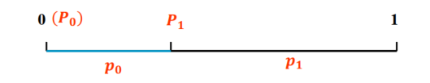
        $$
        \begin{align*}
        &P(S,0)=P(S)=P(S)+p(S)P_{0}\\
        &P(S,1)=P(S)+p(S)p_{0}=P(S)+p(S)P_{1}
        \end{align*}
        $$

        统一写作 $$P(S,r)=P(S)+p(S)P_{r}\quad r = 0,1$$
        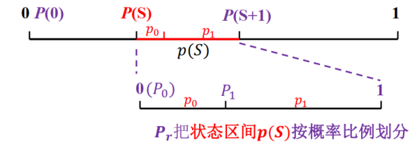

    - **一般递推公式**
        推广到多元序列，即可得到一般的递推公式：
        $$
        \begin{align*}
        P(S,a_{r})=&P(S)+p(S)P_{r}\\
        p(S,a_{r})=&p(S)p_{r}
        \end{align*}
        $$
        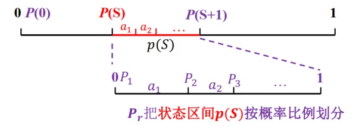
        - 随着序列的长度不断增加，$p(S)$越来越小，$P(S)$所在区间的长度就越短，也就可以更加精确地确定$P(S)$的位置。 

- **编码过程**：
    - 实际应用中，**用码字$C(S)$表示累积概率$P(S)$，用状态区间$A(S)$表示序列的概率$p(S)$**，则递推公式为：
        $$
        \begin{cases}
        C(S,r)=C(S)+A(S)P_{r}\\
        A(S,r)=A(S)p_{r}
        \end{cases}
        $$
        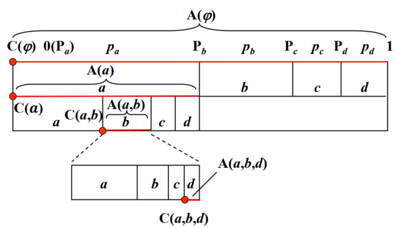
    1. 设置两个存储器，起始时令$A(\varphi)=1,C(\varphi)=0$，$\varphi$表示空集，即起始时码字为$0$，状态区间为$1$。
    2. 每输入一个信源符号，存储器$C$和$A$就按照递推公式更新一次，直至信源符号输入完毕。
    3. 确定码长
        $$L=\left\lceil\log\frac{1}{A(S)}\right\rceil$$ 其中$\lceil x\rceil$代表大于或等于$x$的最小整数。
    4. 取存储器$C$小数点后$L$位的内容作为该序列的码字输出；如果有尾数，就进位到第$L$位，这样得到一个数$C$。

- **译码过程**：
    1. 判断接收到的码字 $C(S)$ 落在哪个初始概率区间，从而确定第一个符号。
    2. 从 $C(S)$ 中减去对应首个符号的累积概率 $P_{r}$ 。
    3. 将相减后的数值乘以当前符号概率 $p_{r}$ 的倒数，放大至 $[0, 1]$ 区间，以确定下一个符号所在的概率区间，进而确定下一个符号。
    4. 不断重复上述去掉累积概率、区间放大和确定符号的步骤，直到处理完整个码字，译出完整的符号序列。

- **示例**：有四个符号$a$，$b$，$c$，$d$构成简单序列$S = abda$，各符号及其对应概率如下表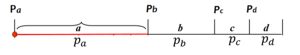
    - |符号|符号概率$p_i$|符号累积概率$P_j$|
        | ---- | ---- | ---- |
        | $a$ | $0.100(1/2)$ | $0.000$ |
        | $b$ | $0.010(1/4)$ | $0.100$ |
        | $c$ | $0.001(1/8)$ | $0.110$ |
        | $d$ | $0.001(1/8)$ | $0.111$ |

    - **算术编码过程如下**：
        1. 设起始状态为空序列$\varphi$，则$A(\varphi)=1$，$C(\varphi)=0$。
        2. 计算$C(\varphi a)$和$A(\varphi a)$：
        $$
        \begin{cases}
        C(\varphi a)=C(\varphi)+A(\varphi)P_a = 0 + 1\times0 = 0\\
        A(\varphi a)=A(\varphi)p_a = 1\times0.1 = 0.1
        \end{cases}
        $$
        3. 计算$C(ab)$和$A(ab)$：
        $$
        \begin{cases}
        C(ab)=C(a)+A(a)P_b = 0 + 0.1\times0.1 = 0.01\\
        A(ab)=A(a)p_b = 0.1\times0.01 = 0.001
        \end{cases}
        $$
        4. 计算$C(abd)$和$A(abd)$：
        $$
        \begin{cases}
        C(abd)=C(ab)+A(ab)P_d = 0.01 + 0.001\times0.111 = 0.010111\\
        A(abd)=A(ab)p_d = 0.001\times0.001 = 0.000001
        \end{cases}
        $$
        5. 计算$C(abda)$和$A(abda)$：
        $$
        \begin{cases}
        C(abda)=C(abd)+A(abd)P_a = 0.010111 + 0.000001\times0 = 0.010111\\
        A(abda)=A(abd)p_a = 0.000001\times0.1 = 0.0000001
        \end{cases}
        $$
        6. 计算编码长度$L$：$$L = \left\lceil\log\frac{1}{A(abcd)}\right\rceil = 7$$  取$C(abda)$的小数点后$7$位即为编码后的码字$0101110$。
    - 该信源的熵为：
        $$H(X)=\frac{1}{2}\log2+\frac{1}{4}\log4 + 2\times\frac{1}{8}\log8 = 1.75\ bit/符号$$

        编码效率$$\eta=\frac{1.75}{\frac{7}{4}} = 100\%$$
    - **译码过程如下**：
        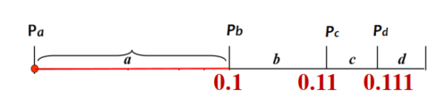
        1. 已知编码后的数值$C(S)=0.010111$，因为$C(S)=0.010111 \in[0,0.1)$ ，根据符号累积概率表，第一个符号为$a$。
        2. 去掉累积概率$P_a$：$0.010111 - 0 = 0.010111$，
            放大至$[0,1]$（乘以$p_a^{-1}$）：$0.010111\times2^1 = 0.10111\in[0.1,0.110)$
            第二个符号为$b$。
        3. 去掉累积概率$P_b$：$0.10111 - 0.1 = 0.00111$。
            放大至$[0,1]$（乘以$p_b^{-1}$）：$0.00111\times2^2 = 0.111\in[0.111,1)$
            第三个符号为$d$。
        4. 去掉累积概率$P_d$：$0.111 - 0.111 = 0$。
            放大至$[0,1]$（乘以$p_d^{-1}$）：$0\times2^3 = 0\in[0,0.1)$
            第四个符号为$a$。 

#### LZ编码
- **特点**：
    - LZ编码是一种**字典编码**，无需确定信源的统计特性。
- **LZ78 编码步骤**
    - 设信源符号集$A = (a_{1},a_{2},\cdots,a_{K})$共$K$个符号，输入信源符号序列$U = (u_{1},u_{2},\cdots,u_{L})$，编码是将此序列分成不同的段。
    - **分段规则**：尽可能取最少个相连的信源符号，并保证各段都不相同。
        1. 在第$i$步，从$s_{i - 1}$短语后的第一个符号开始向后搜索此前未出现过的最短短语$s_{i}$，将该短语添入字典第$i$段。
        2. 假设$s_{i}$去掉最后一个符号$x$后所得的前缀是在第$j$步出现的短语。
        3. 对$s_{i}$的编码为$(j, x)$。**对段号$j$，用$\lceil\log i\rceil$比特来表示，符号$x$用$\lceil\log K\rceil$比特来表示。**
- **LZ译码**：无需接收方提前知晓字典内容，通过码字和逐步构建的字典就能完成译码
    1. 接收到码字$(j,x)$后，在已建立或正在建立的字典中找到第$j$个短语。
    2. 将符号$x$添加到找到的第$j$个短语后，形成新的短语。
    3. 把新生成的短语添入字典，以便后续译码使用。
    4. 对每个接收到的码字，不断重复上述步骤，直至完成所有码字的译码。
- **例题**：
    - **编码**：设$U = \{a_1, a_2, a_3, a_4\}$，信源序列为$a_1,a_2,a_1,a_3,a_2,a_4,a_2,a_4,a_3,a_1,a_1,a_4\cdots$ ，按照分段规则进行分段。符号编码表如下:
        
        |$a_1$ | $a_2$ | $a_3$ | $a_4$ |
        | ---- | ---- | ---- | ---- |
        | 00 | 01 | 10 | 11 |

        |段号$i$|短语| $j$ | $x$ | 码字 | 编码|
        | ---- | ---- | ---- | ---- | ---- | ---- |
        | 1 | $a_1$ | 0 | $a_1$ | $(0,a_1)$ | 0,00 |
        | 2 | $a_2$ | 0 | $a_2$ | $(0,a_2)$ | 0,01 |
        | 3 | $a_1a_3$ | 1 | $a_3$ | $(1,a_3)$ | 01,10 |
        | 4 | $a_2a_4$ | 2 | $a_4$ | $(2,a_4)$ | 10,11 |
        | 5 | $a_2a_4a_3$ | 4 | $a_3$ | $(4,a_3)$ | 100,10 |
        | 6 | $a_1a_1$ | 1 | $a_1$ | $(1,a_1)$ | 001,00 |
        | 7 | $a_4$ | 0 | $a_4$ | $(0,a_4)$ | 000,11 |

    - **译码**：码序列为00000101101011100100010000011。符号编码表如下：
        
        |段号$i$|编码| $j$ | $x$ | 码字 | 短语|
        | ---- | ---- | ---- | ---- | ---- | ---- |
        | 1 | 0,00 | 0 | $a_1$ | $(0,a_1)$ | $a_1$ |
        | 2 | 0,01 | 0 | $a_2$ | $(0,a_2)$ | $a_2$ |
        | 3 | 01,10 | 1 | $a_3$ | $(1,a_3)$ | $a_1a_3$ |
        | 4 | 10,11 | 2 | $a_4$ | $(2,a_4)$ | $a_2a_4$ |
        | 5 | 100,10 | 4 | $a_3$ | $(4,a_3)$ | $a_2a_4a_3$ |
        | 6 | 001,00 | 1 | $a_1$ | $(1,a_1)$ | $a_1a_1$ |
        | 7 | 000,11 | 0 | $a_4$ | $(0,a_4)$ | $a_4$ |

#### 游程编码(RLE，run-length encoding)
- 在二元序列中，连0段称为0游程，连1段称为1游程。
- 例如二元码序列：$000101110010001\cdots$，可变换成下列游程序列：$31132131\cdots$ 。
- 若已知二元序列以0起始，从游程序列很容易恢复成原来的二元序列。
- 游程序列是多元序列，各长度可按哈夫曼编码或其它方法处理以达到压缩码率的目的。

#### MH 编码(传真编码)
- **MH编码方法**
    1. 黑白游程分别对应不同的编码表。
    2. 游程长度在$0\sim63$时，码字直接用相应的终端码（结尾码）表示。
        - 例如：
            - 白游程长度为$0$，查表得码字$000$ 。
            - 黑游程长度为$24$ ，查表得码字$11111$ 。
    3. 游程长度在$64\sim1728$ ，用一个组合码加上一个结尾码为相应码字。
        - 例如：
            - 白游程长度为$65(=64 + 1)$，查表得码字$11011\mid000111$ 。
            - 黑游程长度为$856(=832+24)$ ，查表得码字$0000001001101\mid00000010111$ 。
    4. 规定每行都从白游程开始，若实际出现黑游程开始的话，则在行首加上零长度白游程码字 ，每行结束用一个结束码（EOL）。
    5. 每行恢复成$1728$个像素，否则有错。
    6. 每页文件开始第一个数据前加一个结束码。每页尾连续使用$6$个结束码表示结尾。
    7. 为了传输时实现同步操作，规定$T$为每编码行的最小传输时间。一般规定$T$最小为$20ms$，最大为$5s$。若编码行传输时间小于$T$，则在结束码之前填以足够的“$0$”码元（称填充码） 。
- 页面数据结构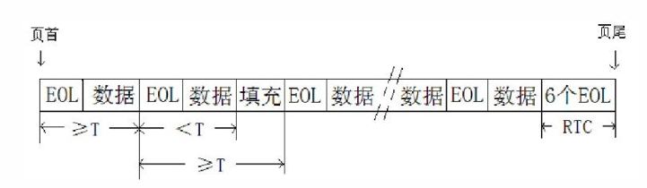
- 结尾码码表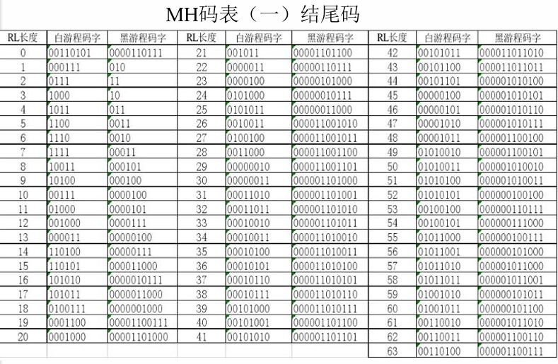
- 组合基干码码表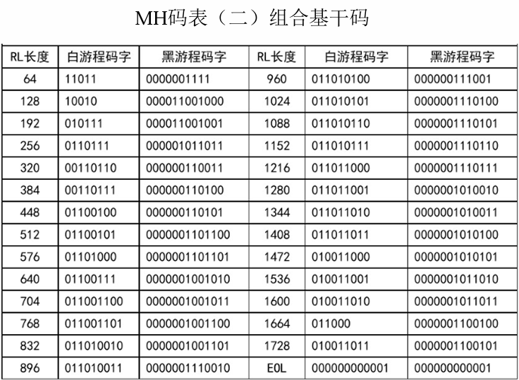
- 例题：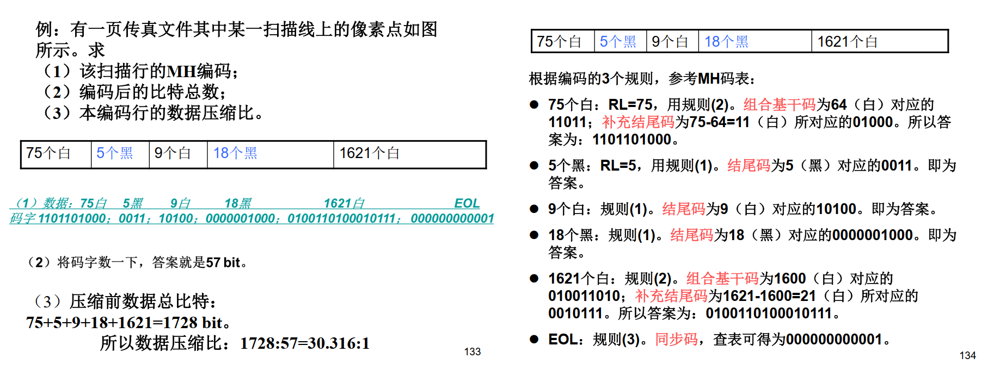

# 第五章补充 无失真信源编码

## 渐进均分性定理（AEP）
- **定理**：$\vec{X}=(X_1 X_2 \cdots X_L)$，为独立同分布（i.i.d）随机变量序列，具有渐近均分性质（AEP，Asymptotic equipartition property）：
    $$\forall \varepsilon > 0，当 L \to \infty时，p(X_1,X_2,\cdots,X_L) \to 2^{-L H(X)}$$

- **信源编码模型**：
    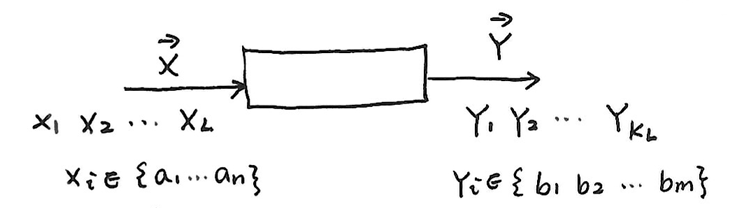
    - $X_i \in \{a_1,a_2,\cdots,a_n\}$
    - $Y_i \in \{b_1,b_2,\cdots,b_m\}$

- **证明1**：
    - **自信息量**：
        $$
        \begin{align*}
        I(\vec{X}) &= -\log p(X_1,X_2,\cdots,X_L)\\
        &=-\log p(X_1)-\log p(X_2)-\cdots-\log p(X_L)\\
        &=\sum_{i = 1}^{L} I(X_i)
        \end{align*}
        $$
    - **均值**(由i.i.d.)）：
        $$
        E\{I(\vec{X})\}=E\left\{\sum_{i = 1}^{L} I(X_i)\right\}=\sum_{i = 1}^{L} E\{I(X_i)\}=\sum_{i = 1}^{L} H(X_i)=L H(X)
        $$
    - **方差**(由i.i.d.)：
        $$
        D\{I(\vec{X})\}=D\left\{\sum_{i = 1}^{L} I(X_i)\right\}=\sum_{i = 1}^{L} D\{I(X_i)\}=L D(I(X))
        $$ 其中
        $$
        D(I(X)) = E\left[(I(X)-H(X))^2\right]=\sum_{i = 1}^{n} p(x_i)(-\log p(x_i)-H(X))^2
        $$
    - 根据切比雪夫不等式
        $$
            P_r\{|X - \mu| \geq \varepsilon\} \leq \frac{\sigma^2}{\varepsilon^2}\quad (\varepsilon>0, \sigma>0)
        $$ 有：
        $$
        P_r\left\{\left|I(\vec{X})-L H(X)\right| \geq L\varepsilon\right\} \leq \frac{L D(I(X))}{(L\varepsilon)^2}
        $$ $$
        P_r\left\{\left|\frac{I(\vec{X})}{L}-H(X)\right| \geq \varepsilon\right\} \leq \frac{D(I(X))}{L\varepsilon^2}
        $$ 当 $L \to \infty$ 时
        $$
        \begin{align*}
        &\frac{D(I(X))}{L\varepsilon^2} \to 0,\\
        &\frac{-\log p(X_1,X_2,\cdots,X_L)}{L} \to H(X),\\
        &p(X_1,X_2,\cdots,X_L) \to 2^{-L H(X)}
        \end{align*}
        $$

- **证明2**：
    - AEP 也可由弱大数定律直接得到
    - 当 $X$ 为 i.i.d，$n$ 很大时，$\frac{1}{n}\sum_{i = 1}^{n} x_i \to E(X)$
        $$
        \begin{align*}
        -\frac{1}{L}\log p(X_1,X_2,\cdots,X_L)= &-\frac{1}{L}\sum_{i = 1}^{L} \log p(X_i)\\
        \overset{a.s.}{\to} &-E(\log p(X))\\
        = &H(X)
        \end{align*}
        $$

- **典型集$A_{\varepsilon}$**
    - **定义**
        $$
        \begin{align*}
        &A_{\varepsilon}=\left\{\vec{x}:\left|\frac{I(\vec{x})}{L}-H(X)\right| \leq \varepsilon\right\}\\
        &A_{\varepsilon}^c=\left\{\vec{x}:\left|\frac{I(\vec{x})}{L}-H(X)\right| > \varepsilon\right\}\\
        &A_{\varepsilon}+A_{\varepsilon}^c = X^L=\{\vec{x_{i}}\}\quad i = 1,2,\cdots,n^L
        \end{align*}
        $$

    - **性质**
        1. 若 $\vec{x} \in A_{\varepsilon}$，则典型集中的元素几乎是等概率出现的：
            $$2^{-L(H(X)+\varepsilon)} \leq p(\vec{x}) \leq 2^{-L(H(X)-\varepsilon)}$$
        2. 当 $L$ 充分大时，典型集的概率近似为1：
            $$P_r(A_\varepsilon) = \sum_{\vec{x} \in A_{\varepsilon}} p(\vec{x})>1 - \varepsilon$$
        3. 典型集中元素的个数：
            $$|A_{\varepsilon}| \leq 2^{L(H(X)+\varepsilon)}$$
            - 证明：
                $$
                \begin{align*}
                1&=\sum_{\vec{x} \in X^L} p(\vec{x}) \geq \sum_{\vec{x} \in A_{\varepsilon}} p(\vec{x})\\
                &\geq \sum_{\vec{x} \in A_{\varepsilon}} 2^{-L(H(X)+\varepsilon)}=|A_{\varepsilon}|2^{-L(H(X)+\varepsilon)}\\
                \Rightarrow &|A_{\varepsilon}| \leq 2^{L(H(X)+\varepsilon)}
                \end{align*}
                $$
        4. 典型集中元素的个数：
            $$|A_{\varepsilon}| \geq (1 - \varepsilon)2^{L(H(X)-\varepsilon)}$$
            当 $L$ 充分大时，$P_r(A_{\varepsilon}) > 1 - \varepsilon$
            - 证明：
                $$
                \begin{align*}
                1-\varepsilon &\leq P_r(A_{\varepsilon}) = \sum_{\vec{x} \in A_{\varepsilon}} p(\vec{x})\\
                & \leq \sum_{\vec{x} \in A_{\varepsilon}} 2^{-L(H(X)-\varepsilon)}=|A_{\varepsilon}|2^{-L(H(X)-\varepsilon)}\\
                \Rightarrow |A_{\varepsilon}| &\geq (1 - \varepsilon)2^{L(H(X)-\varepsilon)}
                \end{align*}
                $$

## 定长编码定理
- **定理**：对于由 $L$ 个符号组成的，每个符号的熵为 $H_L(\vec{X})$ 的无记忆平稳符号序列 $X_1, X_2, \cdots, X_L$，可用 $K_L$ 个符号 $Y_1, Y_2, \cdots, Y_{K_L}$（每个符号有 $m$ 种可能值，即$m$进制编码）进行定长编码。对于任意 $\varepsilon > 0$，$\delta > 0$，只要
    $$\frac{K_L}{L}\log m \geq H_L(\vec{X}) + \varepsilon$$

    则当 $L$ 足够大时，必可使译码差错小于 $\delta$；
    反之，当
    $$\frac{K_L}{L}\log m \leq H_L(\vec{X}) - 2\varepsilon$$

    时，译码差错一定是有限值，当 $L \to \infty$ 时，译码几乎必定出错。

- **证明**
    - 对 $A_{\varepsilon}$ 中的元素进行定长编码，为了唯一可译，码符号个数大于等于 $|A_{\varepsilon}|$，即
        $$m^{K_L} \geq |A_{\varepsilon}|$$

        此时$|A_{\varepsilon}|$ 取上界，记平均符号熵$H_L(\vec{X})$ 为 $H(X)$
        $$
        \begin{align*}
        m^{K_L} &\geq 2^{L(H(X) + \varepsilon)}\\
        K_L\log m &\geq L(H(X) + \varepsilon)\\
        \frac{K_L}{L}\log m &\geq H(X) + \varepsilon
        \end{align*}
        $$

        此时，错误译码的概率为 $$P_e = P_r\{A_{\varepsilon}^c\} \leq \frac{D(I(X))}{L\varepsilon^2}$$

        若需 $P_e \leq \delta$，则有
        $$
        \begin{align*}
        &\frac{D(I(X))}{L\varepsilon^2} \leq \delta\\
        &L \geq \frac{D(I(X))}{\varepsilon^2\delta}
        \end{align*}
        $$

        即信源长度 $L$ 需满足 $L \geq \frac{D(I(X))}{\varepsilon^2\delta}$

    - 反之，若
        $$
        \begin{align*}
        &\frac{K_L}{L}\log m \leq H(X) - 2\varepsilon\\
        &\log m^{K_L} \leq L(H(X) - 2\varepsilon)\\
        &m^{K_L} \leq 2^{L(H(X) - 2\varepsilon)} < (1 - \varepsilon)2^{L(H(X) - \varepsilon)} = |A_{\varepsilon}|_{min}
        \end{align*}
        $$

        即 $m^{K_L} < |A_{\varepsilon}|$，码字个数少于$A_{\varepsilon}$ 中的元素个数

        此时只能在 $A_{\varepsilon}$ 中选取 $m^{K_L}$ 个元素进行一对一编码，
        $$
        \begin{align*}
        P_r(只出现A_{\varepsilon}中的m^{K_L}个元素) &\leq m^{K_L} \cdot \max_{\vec{x} \in A_{\varepsilon}} p(\vec{x}) = m^{K_L}2^{-L(H(X) - \varepsilon)}\\
        &\leq 2^{L(H(X) - 2\varepsilon) - L(H(X) - \varepsilon)}\\
        &= 2^{-L\varepsilon}
        \end{align*}
        $$

        译码错误概率为 $P_e = 1 - 2^{-L\varepsilon}$ ，$L \to \infty$，$P_e \to 1$

## 单符号变长编码定理
- **定理**：对于离散无记忆信源的符号 $X$，其熵为 $H(X)$，每个信源符号用 $m$ 进制码元进行变长编码，一定存在一种无失真编码方法，其（$m$ 进制）码元平均长度 $\overline{k}$ 满足下列不等式：
    $$\frac{H(X)}{\log m} \leq \overline{k} < \frac{H(X)}{\log m} + 1$$

    其中，$\overline{k} = \sum_{i = 1}^{n} p(a_i)l_i$，$l_i$ 为符号 $a_i$ 的码长。

- **证明**：
    - **定义**：$l_i$ 为符号 $a_i$ 的码长，$p(a_i)$ 为符号 $a_i$ 的概率，$\overline{k} = \sum_{i = 1}^{n} p(a_i)l_i$ 为码元平均长度。
    - 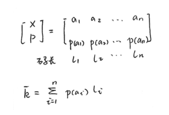
    1. **证明必存在无失真编码，使得 $H(X) - (\log m)\overline{k} \leq 0$**
        $$
        \begin{align*}
        H(X) - (\log m)\overline{k} &= -\sum_{i = 1}^{n} p(a_i)\log p(a_i) - \sum_{i = 1}^{n} p(a_i)l_i\log m\\
        &=\sum_{i = 1}^{n} p(a_i)\log \frac{m^{-l_i}}{p(a_i)}
        \end{align*}
        $$

        根据Jensen不等式 $E[f(x)] \leq f(E(x))$，有
        $$
        \begin{align*}
        H(X) - (\log m)\overline{k} &=\sum_{i = 1}^{n} p(a_i)\log \frac{m^{-l_i}}{p(a_i)}\\
        &\leq \log \sum_{i = 1}^{n} p(a_i)\frac{m^{-l_i}}{p(a_i)} = \log \sum_{i = 1}^{n} m^{-l_i}
        \end{align*}
        $$

        唯一可译码存在（无失真），因此 $\sum_{i = 1}^{n} m^{-l_i} \leq 1$
        $$
        \begin{align*}
        &H(X) - (\log m)\overline{k} \leq \log 1 = 0\\
        &\Rightarrow \overline{k} \geq \frac{H(X)}{\log m}
        \end{align*}
        $$

        若要等号成立
        $$
        m^{-l_i} = p(a_i),\quad l_i = \frac{-\log p(a_i)}{\log m}
        $$
    2. **证明 $\overline{k} < \frac{H(X)}{\log m} + 1$**
        符号 $a_i$ 的码长 $l_i$ 需要是整数，因此取
        $$\frac{-\log p(a_i)}{\log m} \leq l_i < \frac{-\log p(a_i)}{\log m} + 1$$

        由
        $$
        \begin{align*}
        &\frac{-\log p(a_i)}{\log m} \leq l_i\\
        &\Rightarrow -\log m^{l_i} \leq \log p(a_i)\\
        &\Rightarrow m^{-l_i} \leq p(a_i)\\
        &\Rightarrow \sum_{i = 1}^{n} m^{-l_i} \leq \sum_{i = 1}^{n} p(a_i)=1
        \end{align*}
        $$

        表明 $l_i$ 满足唯一可译码存在的条件。
        又由
        $$
        \begin{align*}
        l_i &< \frac{-\log p(a_i)}{\log m} + 1\\
        \sum_{i = 1}^{n} l_i p(a_i) &< \sum_{i = 1}^{n} p(a_i)(\frac{-\log p(a_i)}{\log m} + 1)\\
        \overline{k} &< \frac{H(X)}{\log m} + 1
        \end{align*}
        $$

## 离散平稳无记忆序列变长编码定理（香农第一定理）
- **定理**：对于平均符号熵为 $H_L(\vec{X})$ 的离散平稳无记忆信源，必存在一种无失真编码方法，使平均信息率 $\overline{K}$ 满足不等式：
    $$H_L(\vec{X}) \leq \overline{K} < H_L(\vec{X}) + \varepsilon$$

    其中 $\varepsilon$ 为任意小正数，$\overline{K} = \frac{\overline{k}_L}{L} \log m$，$\overline{k}_L$ 为 $L$ 个符号的平均码长。

- **证明**
    将 $\vec{X}=(X_1 X_2 \cdots X_L)$ 作为一个整体，构成一个新的单符号信源。因此有：
    $$
    \begin{align*}
    \frac{L H_L(\vec{X})}{\log m} &\leq \overline{k}_L < \frac{L H_L(\vec{X})}{\log m} + 1\\
    H_L(\vec{X}) &\leq \frac{\overline{k}_L}{L} \log m < H_L(\vec{X}) + \frac{\log m}{L}
    \end{align*}
    $$

    令 $\overline{K}= \frac{\overline{k}_L}{L} \log m$，则有
    $$H_L(\vec{X}) \leq \overline{K} < H_L(\vec{X}) + \varepsilon \quad (L \to \infty)$$

    此时编码效率$$\eta = \frac{H_L(\vec{X})}{\overline{K}} > \frac{H_L(\vec{X})}{H_L(\vec{X}) + \frac{\log m}{L}}$$

# 第六章 信道编码

- 信道传输会使接收信号出现差错，信道编码旨在提升传输可靠性，主要涉及两个层面的问题：
    - 如何准确接收承载信息的信号：线路编码（通信原理）
    - 怎样避免少量错误信号对信息内容产生影响：纠错编码

## 6.1 6.2 信道编码概念和理论
### 差错和差错控制系统分类
- **差错类型**
    - **符号差错**：由符号发生差错引起，也叫信号差错，信号差错概率用符号差错概率表示。
    - **差错比特**：由信息比特发生差错引起，也叫信息差错，信息差错概率用误比特率表示。
    - 对于二进制传输系统，符号差错等效于比特差错。
    - 对于多进制系统，一个符号差错到底对应多少比特差错难以确定，因为一个符号由多个比特组成。

- 两种八电平线路编码方法比较
    
    |量级|自然二进码|反射二进码(格雷码)|
    | ---- | ---- | ---- |
    |0|000|000|
    |1|001|001|
    |2|010|011|
    |3|011|010|
    |4|100|110|
    |5|101|111|
    |6|110|101|
    |7|111|100|
    - 格雷码可以通过普通二进制码转换得到。
    - 以下是生成格雷码的常见方法：
        1. 最高位保留：格雷码的最高位（最左边） 与二进制码的最高位相同。
        2. 逐位异或：格雷码的每一位是二进制码当前位与上一位的异或结果。

- **差错图样**（error pattern）
    - **定义**：
        - **差错图样 $E =$ 发码 $C -$ 收码 $R$ $(\mod q)$**
        - **示例**：8进制($q = 8$)码，若发码 $C = (0,2,5,4,7,5,2)$ ，收码变为 $R = (0,1,5,4,7,5,4)$ ，差错图样 $E = C - R = (0,1,0,0,0,0,6)$（模8）。
    - 二进制码：$E = C \oplus R$ 或 $C = R \oplus E$，差错图样中的“1”既是符号差错也是比特差错。
    - **汉明距离**：两码字之间不同的位数叫它们之间的汉明距离，记作$d(c_i,c_j)$，即$$d(c_i,c_j) = \sum_{k=1}^{N}c_{ik}\oplus c_{jk}$$
    - **差错图样类型**
        - **随机差错**：若差错图样上各码位的取值既与前后位置无关又与时间无关，即差错始终以相等的概率独立发生于各码字、各码元、各比特
        - **突发差错**：前后相关、成堆出现。突发差错总是以差错码元开头、以差错码元结尾，头尾之间并不是每个码元都错，而是码元差错概率超过了某个额定值

- **纠错码分类**
    - **从功能角度**：检错码 、纠错码
    - **对信息序列的处理方法**：分组码、卷积码
    - **码元与原始信息位的关系**：线性码、非线性码
    - **差错类型**：纠随机差错码、纠突发差错码、介于中间的纠随机/突发差错码
    - **构码理论**：代数码、几何码、算术码、组合码等

- **差错控制系统分类**
    - **前向纠错（FEC）**：发端信息经纠错编码后传送，收端通过纠错译码自动纠正传递过程中的差错
    - **反馈重发（ARQ）**：收端通过检测接收码是否符合编码规律来判断，如判定码组有错，则通过反向信道通知发端重发该码组
    - **混合纠错（HEC）**：前向纠错和反馈重发的结合，发端发送的码兼有检错和纠错两种能力

### 矢量空间与码空间
#### 矢量空间

- **矢量\线性空间定义**
    - $F$表示码元所在的**数域**，对于二进制码，$F$代表二元域$\{0,1\}$。
    - 设$n$重有序元素（$n$重矢量）的集合$V=\{v_i\}$
        $$v_i = (v_{i0},v_{i1},\cdots,v_{ij},\cdots,v_{i(n - 1)})\quad v_{ji}\in F$$
    - 若满足条件：
        1. $V$中矢量元素在**矢量加运算**下构成加群。
        2. $V$中矢量元素与数域$F$元素的**标乘**封闭在$V$中。
        3. 分配律、结合律成立。

        则称集合$V$是数域$F$上的一个$n$**重矢量空间**，或称$n$重线性空间，$n$重矢量又称$n$重($n$-tuples)。
    - 码字又叫码矢、$n$重(矢量) 。
    - **示例**：$n$维实数域矢量空间$\mathbb{R}^n$，$n$维复数域矢量空间$\mathbb{C}^n$，$n$维有限域矢量空间$GF(q)^n$等。

- **码矢的运算法则**
    - 码矢的运算法则遵从矢量的运算法则，对于矢量$v_i = (v_{i0},v_{i1},\cdots,v_{i(n - 1)})$，$v_j = (v_{j0},v_{j1},\cdots,v_{j(n - 1)})$，及标量$\alpha\in F$（数域），定义：
        - **矢量加**：$v_i + v_j = (v_{i0} + v_{j0},v_{i1} + v_{j1},\cdots,v_{i(n - 1)} + v_{j(n - 1)})$，所得结果仍是矢量。
        - **标乘（标量乘矢量）**：$\alpha v_i = (\alpha v_{i0},\alpha v_{i1},\cdots,\alpha v_{i(n - 1)})$，所得结果是矢量 。
        - **点积或内积（矢量乘矢量）**：$v_i\cdot v_j = v_{i0}\cdot v_{j0} + v_{i1}\cdot v_{j1} + \cdots + v_{i(n - 1)}\cdot v_{j(n - 1)}$，所得结果是标量。

- **矢量空间中各元素间的关系**
    - **线性组合**：若$v_k = a_1v_1 + a_2v_2 + \cdots + a_lv_l$ ($a_i\in F$)，则称$v_k$是$v_1,v_2,\cdots,v_l$的线性组合。
    - **线性相关**：若满足$a_1v_1 + a_2v_2 + \cdots + a_lv_l = 0$，($a_i\in F$且不全为$0$)，则称$v_1,v_2,\cdots,v_l$线性相关。其中任一矢量可表示为其它矢量的线性组合。
    - **线性无关或线性独立**：一组矢量中的任意一个都不可能用其它矢量的线性组合来代替。

- **矢量空间与基底**
    - 如果存在一组线性无关的矢量$v_1,v_2,\cdots,v_k$，这些矢量**线性组合的集合**就构成了一个$k$**维矢量空间**$V$，这组矢量就是这个矢量空间的**基底**。
    - **性质**：
        - **$k$维矢量空间应包含$k$个基底**，可以说：$k$个基底“张成”$k$维矢量空间。
        - **基底不是唯一的**。
            - 示例：线性无关的两个矢量$(1,0)$和$(0,1)$以及$(-1,0)$和$(0,-1)$都可张成同一个2维实数域空间($x,y$) 。
    - **自然基底**：矢量元素中包含一个$1$而其余为$0$的那组基底

- **子空间**
    - 若矢量空间$V$的一个子集$V_s$也能构成一个矢量空间，则称$V_s$是$V$的子空间 。
    - **示例**：
        - 二元域$GF(2)$上三维三重矢量空间$V$的三个自然基底是$(100)$，$(010)$ ，$(001)$ 。
        - 以$(100)$为基底可张成一维三重子空间$V_{s1}$，含$2^1 = 2$个元素，即 $V_{s1} = \{(000),(100)\}$ 。
        - 以$(010),(001)$为基底可张成二维三重子空间$V_{s2}$，含$2^2 = 4$个元素，即 $V_{s2} = \{(000),(001),(010),(011)\}$ 。
        - $V_{s1}$和$V_{s2}$都是$V$的子空间。

- **矢量空间构成**
    - 每个矢量空间或子空间中必然包含**零矢量**。
    - **构成矢量的有序元素的个数称为“重”数，张成矢量空间的基底的个数称为“维”数**。
    - 一般情况下，由$n$个$n$重的基底张成$n$维矢量空间$V_n$，维数和重数一致。
    - 子空间的引入使维数和重数可以不一样。
    - **维数不可能大于重数**，而当维数小于重数时就说明这是一个子空间。

- **正交与对偶空间**
    - 若两个矢量点积为$0$，即$v_1 \cdot v_2 = 0$，则称$v_1$和$v_2$**矢量正交**。
    - 若某矢量空间中的任意元素与另一矢量空间中的任意元素正交，则称这两个**矢量空间正交**。
        - 若两个矢量空间的基底正交，则这两个矢量空间一定正交。
    - 正交的两个子空间$V_1$、$V_2$互为**对偶空间**（Dual Space），其中一个空间是另一个空间的**零空间**（null space，也称零化空间）。

#### 码空间
- **码空间**
    - 
    1. 码字$c_i$是$n$个码元的有序排列，是$n$维$n$重矢量空间$V_n$的元素之一。
    2. 然而，矢量空间$V_n$的元素不一定是码字。
    3. 将码字$c_i$写作$(c_{i0}, c_{i1}, \cdots, c_{i(n - 1)})$，将码字的集合写成$C$，称为码集。
    4. 码集不一定能构成$V_n$的一个子空间，但对线性分组码而言，码集$C$一定是$V_n$的一个子空间。

- **分组编码的任务**
    - 通常$q^n >> q^k$，分组编码的任务是要在$n$维$n$重矢量空间的$q^n$种可能组合中选择其中的$q^k$个构成一个码空间，其元素就是许用码的码集。
    - 因此分组编码的任务就是：
        1. 选择一个$k$维$n$重子空间作为码空间。
        2. 确定由$k$维$k$重信息空间到$k$维$n$重码空间的映射方法。
    - 码空间的不同选择方法，以及信息组与码组的不同映射算法，就构成了不同的分组码。

### 译码方法
- **译码的任务**
    - 译码器的任务是从受损的信息序列中尽可能正确地恢复出原信息。
    - 译码算法的已知条件是：
        - 实际接收到的码字序列$\{r\}$，$r = (r_1, r_2, \cdots, r_N)$。
        - 发端所采用的编码算法和该算法产生的码集$X^N$，满足$c_i = (c_{i1}, c_{i2}, \cdots, c_{iN}) \in X^N$ 。
        - 信道模型及信道参数。

- **信道模型**：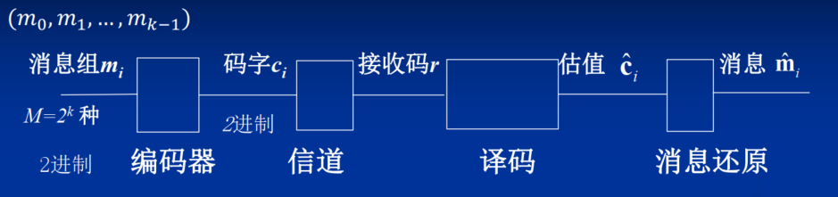

- **译码规则**：见[译码规则](./Ch6sup_信道编码定理.md/#译码规则)

- **[最大后验概率译码](./Ch6sup_信道编码定理.md/#最大后验概率译码)**
    - **最佳译码**，也叫**最大后验概率译码(MAP)**：$$\hat{c}_i=\arg\max_{1\leq i\leq M}P(c_i|r)$$

- **[最大联合概率译码](./Ch6sup_信道编码定理.md/#最大联合概率译码)**
    $$P(c_i/r)=\frac{P(c_i)P(r/c_i)}{P(r)}\quad i = 1, 2, \cdots, 2^K$$ 
    - $P(c_i/r)$最大等效于$P(c_i)P(r/c_i)$最大。
    - **最大联合概率译码**：$$\hat{c}_i=\arg\max_{1\leq i\leq M}P(c_i)P(r|c_i)$$

- **[最大似然译码](./Ch6sup_信道编码定理.md/#最大似然译码)**        
     - 如果 构成码集的$2^K$个码字以相同概率发送，满足$P(c_i)=1/2^K$，$i = 1, 2, \cdots, 2^K$ ，在此前提下最佳译码等效于如下最大似然译码。
    - **最大似然译码**(MLD)：码字等概率发送时：$$\hat{c}_i=\arg\max_{1\leq i\leq M}P(r|c_i)$$

- **[最小汉明距离译码](./Ch6sup_信道编码定理.md/#最小汉明距离译码)**
    - 对于无记忆信道：$$\max P(r/c_i)=\max \prod_{j = 1}^{N}P(r_j/c_{ij})$$
    - 对BSC信道：
        $$P(r_j|c_{ij}) = 
        \begin{cases}
        p, & c_{ij} \neq r_j \\
        1 - p, & c_{ij} = r_j
        \end{cases}$$

        $$P(r|c_i)=\prod_{j = 1}^{N}P(r_j|c_{ij}) = p^d(1 - p)^{N - d}=(\frac{p}{1 - p})^d(1 - p)^N$$ 其中$d$为$r$与$c_i$的汉明距离，可见，**$d$越小，$P(r|c_i)$越大**。
    - BSC信道的最大似然译码可以简化为最小汉明距离译码。
        $$\hat{c}_i = \arg \min_{1 \leq i \leq M} d(r, c_i)$$
        - 只要在接收端将收码$r$与发码$c_i$的各码元逐一比较，选择其中汉明距离最小的码字作为译码估值$\hat{c}_i$。
        - 由于BSC信道是对称的，只要发送的码字独立、等概，汉明距离译码也就是最佳译码。

### 信道编码定理
- 信道编码定理研究的问题：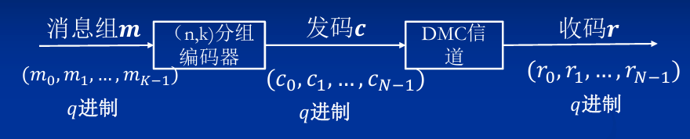

#### 随机编码
- 所有可能的编码：平均错误概率$\overline{P}_e$
    - 若$\overline{P}_e \to 0$，必存在一种编码$P_e \to 0$ 。
    - 用这种方法不能得知最优码是如何具体编出来的；却能得知最优码可以好到什么程度，并进而推导出有扰离散信道的编码定理，对指导编码技术具有特别重要的理论价值。
- 在$(N,K)$分组编码器中随机选定的码集有$q^{NM}$种。第$m$个码集(记作$\{c\}_m$)被随机选中的概率是$$P(\{c\}_m)=q^{-(NM)}$$
    - 设与这种选择相对应的条件差错概率是$P_e(\{c\}_m)$ 。
    - 全部码集的平均差错概率是$$\overline{P}_e = \sum_{m = 1}^{q^{NM}} P(\{c\}_m)P_e(\{c\}_m)=q^{-NM}\sum_{m = 1}^{q^{NM}} P_e(\{c\}_m)$$
    - 必定存在某些码集$P_e(\{c\}_m)>\overline{P}_e$，某些码集$P_e(\{c\}_m)<\overline{P}_e$ 。
    - 若$\overline{P}_e \to 0$，就必然存在一批码集$P_e(\{c\}_{m}) \to 0$，即差错概率趋于零的好码一定存在 。
- 码集点数$M = q^K$占$N$维矢量空间总点数$q^N$的比例是$F = q^K/q^N = q^{-(N - K)}$
    - 当$K$和$N$的差值拉大即冗余的空间点数增加时，平均而言码字的分布将变得稀疏，码字间的平均距离将变大，平均差错概率将变小。
    - 当$F \to 0$即$(N - K)\to\infty$时，能否让平均差错概率$\overline{P}_e \to 0$ ？
        - Gallager在1965年推导了$\overline{P}_e$的上边界，并证明这个上边界是按指数规律收敛的。

#### 信道编码定理
- $\overline{P}_e < e^{-NE(R)}$ 
    - $E(R)$为可靠性函数，也叫误差指数 。
    - **码率**：$R = \frac{\log M}{N}=\frac{\log q^K}{N}$ 。
    - $M$是可能的信息组合数，$M = q^K$ ；$N$是每码字的码元数；$R$表示每码元携带的信息量（bit /码元）。
- $E(R)$可靠性函数 
    - $R$在$[0,R_0]$区间时，$E(R) - R$曲线是斜率为$-1$（$-45^{\circ}$）的直线，$E(R)$反比于$R$
    - $R_0 < C$，临界速率
    - 而当$R = C$时$E(R)=0$即可靠性为零。
    - 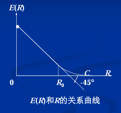
- **噪声信道的信道编码定理**
    - **[正定理](./Ch6sup_信道编码定理.md#信道编码正定理)**：只要传输率 $R$ 小于信道容量 $C$ ，总存在一种信道码（及解码器），在码长 $N$ 足够长的情况下，能够以所要求的任意小的差错概率实现可靠的通信。
    - **[逆定理](./Ch6sup_信道编码定理.md#信道编码逆定理)**：信道容量 $C$ 是可靠通信系统传输率 $R$ 的上边界，如果 $R > C$ ，就不可能有任何一种编码能使差错概率任意小。

#### 联合信源信道编码定理
- **两步编码处理方法**：
    - **信源编码**：针对各自信源的不同特点，进行不同的数据压缩，用最有效的二元码来表达这些不同的信源。
    - **信道编码**：对于共同传输的数字信道而言，输入端只看成是一系列二元码。信道编码只针对信道特性来进行，不考虑不同信源的不同特性。
    - 信源压缩编码只考虑信源的统计特性；信道编码只考虑信道的统计特性。
- **特点**：
    - **优点**：设计简单、通用性好，可以分别形成标准。
    - **缺点**：没有充分利用各自的优势，因而不是最佳的。
- **信源－信道编码定理内容**：
    - 若信源 $S$ 极限熵 $H_{\infty}$ 小于信道容量 $C$ ，则存在信源信道编码，使得 $P_{e}\to0$
    - 反之，对于任意平稳随机序列，若极限熵 $H_{\infty}>C$ ，则错误概率远离零，即不可能在信道中以任意小的错误概率发送这随机序列
- **总结**：
    - 当且仅当信源极限熵小于信道容量，在信道上能够无错误地传输平稳遍历信源。**$H < C$ 是信源通过信道有效和可靠传输的充要条件**。
    - 如果信道的容量 $C > R(D)$ ，则在信源和信道处用足够复杂的处理后，总能以失真度 $D+\varepsilon$ 再现信源的消息。

### 纠错编码的基本思路
- **思路一**：$$\overline{P}_e < e^{-NE(R)}$$
    - 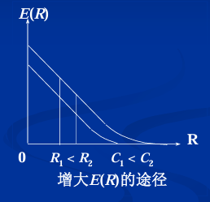
    - **$R$不变**，信道容量大者其可靠性函数$E(R)$也大
        - **增大信道容量$C$的方法**：
            - 扩展带宽。
            - 加大功率。
            - 降低噪声。
    - **$C$不变**，码率减小时其可靠性函数$E(R)$增大
        - **减小码率$R$的方法**：
            - $Q$、$N$不变而减小$K$。
            - $Q$、$K$不变而增大$N$。
            - $N$、$K$不变而减小$Q$。
    - **增大码长$N$**

- **思路二：纠错能力的获取途径**：
    - **利用冗余度**：时间、频带、功率、设备复杂度。
    - **噪声均化(随机化、概率化)**：增加码长、卷积、交错。

## 6.3 线性分组码
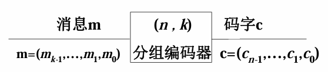

- 构造一个$k$维$n$重子空间（码空间），使$q^k$个信息元组一一对应映射到码空间。
- **码率(编码效率)**：$R_c = k/n$

### 线性分组码的形成
#### 基本概念
- **码空间**
    - **码空间**：所有元素（即码字）都可以写成$k$个基底的线性组合，表达式为$$\mathbf{c} = m_{k - 1}\mathbf{g}_{k - 1}+\cdots + m_{1}\mathbf{g}_{1}+m_{0}\mathbf{g}_{0}$$
    - $\mathbf{m}=(m_{k - 1},\cdots,m_{1},m_{0})$是$k$维$k$重信息组
    - $\mathbf{c}=(c_{n - 1},\cdots,c_{1},c_{0})$是码字。
    - $\mathbf{g}=(\mathbf{g}_{k - 1},\cdots,\mathbf{g}_{1},\mathbf{g}_{0})$是在$n$维$n$重空间$V$中，从$n$个基底中选取出来的$k$个矢量作为码空间的**基底** 
    - 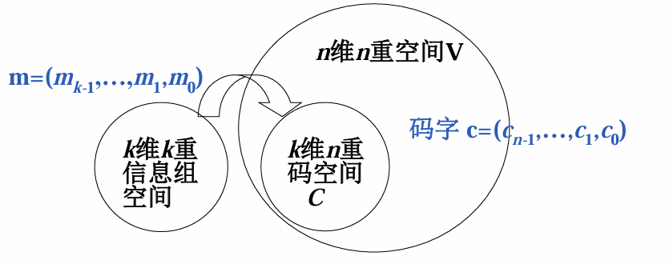
- **映射规律**：信息元作为基底线性组合的系数。
- **生成矩阵**：
    - **生成矩阵**$\mathbf{G}_{k\times n}=\begin{bmatrix}\mathbf{g}_{k - 1}\\\vdots\\\mathbf{g}_{1}\\\mathbf{g}_{0}\end{bmatrix}=\begin{bmatrix}g_{(k - 1)(n - 1)}&\cdots&g_{(k - 1)1}&g_{(k - 1)0}\\\vdots&\ddots&\vdots&\vdots\\g_{1(n - 1)}&\cdots&g_{11}&g_{10}\\g_{0(n - 1)}&\cdots&g_{01}&g_{00}\end{bmatrix}$
    - 码字$\mathbf{c}$、消息$\mathbf{m}$与生成矩阵$\mathbf{G}$的关系为：$$\mathbf{c_{1\times n}}=\mathbf{m_{1\times k}}\mathbf{G_{k\times n}}$$ 
        - 其中$\mathbf{c_{1\times n}}$是$n$维码字，$\mathbf{m_{1\times k}}$是$k$维信息组，$\mathbf{G_{k\times n}}$是$k\times n$生成矩阵。
        - 因为$k$个基底即$\mathbf{G}$的$k$个行矢量线性无关，矩阵$\mathbf{G}$的秩一定等于$k$。
        - 当信息元确定后，码字仅由$\mathbf{G}$矩阵决定，所以称这$k\times n$矩阵$\mathbf{G}$为该$(n,k)$线性分组码的生成矩阵。
    - **特点**:
        - 想要保证$(n,k)$线性分组码能够构成$k$维$n$重子空间，$G$的$k$个行矢量$g_{k - 1},\cdots, g_{1}, g_{0}$必须是线性无关的，只有这样才符合作为基底的条件。
        - 由于基底不是唯一的，所以$G$也就不是唯一的。
        - 不同的基底有可能生成同一码集，但因编码涉及码集和映射两个因素，码集一样而映射方法不同也不能说是同样的码。

- **基底的选择**：构造$(3,2)$线性分组码示例
    - 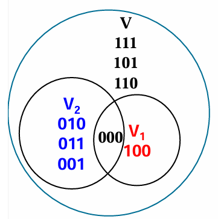
    - 需要构造$2$维$3$重码空间。
    - $3$维$3$重空间的$3$个自然基底为$100$，$010$，$001$ 。
    - 选择其中$2$个基底$010$，$001$构成码空间，对应码集为$(000, 010, 001, 011)$
    - $2$个基底的线性组合$010$，$011$也可以张成码空间 ，对应码集为$(000, 010, 011, 001)$ 。
    - 码集一样，对应关系不一样

- **示例**：
    - 对于$(6, 3)$线性分组码，$k = 3$，$2^k = 8$（消息数量）
        - 基底$\mathbf{g}_{2}=111010$，$\mathbf{g}_{1}=110001$，$\mathbf{g}_{0}=011101$。
        - 则$\mathbf{G}=\begin{bmatrix}\mathbf{g}_{2}\\\mathbf{g}_{1}\\\mathbf{g}_{0}\end{bmatrix}=\begin{bmatrix}111010\\110001\\011101\end{bmatrix}$ 。
            $
            \begin{aligned} 
            \mathbf{c}&=m_{k - 1}\mathbf{g}_{k - 1}+\cdots + m_{1}\mathbf{g}_{1}+m_{0}\mathbf{g}_{0}\\
            &=(m_{k - 1} \cdots m_{0})_{1\times k}\times\begin{bmatrix}\mathbf{g}_{k - 1}\\\vdots\\\mathbf{g}_{0}\end{bmatrix}_{k\times n}\\
            &=\mathbf{m}_{1\times k}\mathbf{G}_{k\times n}
            \end{aligned}
            $
        - |信息$\mathbf{u}=m_2m_1m_0$|码字$\mathbf{c}=c_5c_4c_3c_2c_1c_0$|
            | ---- | ---- |
            |000|000000|
            |001|011101|
            |010|110001|
            |011|101100|
            |100|111010|
            |101|100111|
            |110|001011|
            |111|010110|

#### 系统形式的生成矩阵与校验矩阵
- **系统形式的生成矩阵**
    - $(n,k)$码的任何生成矩阵都可以通过行运算（以及列置换）简化成“系统形式”
        $$\mathbf{G_S} = [I_k | P]=\begin{bmatrix}1&0&\cdots&0&p_{(k - 1)(n - k - 1)}&\cdots&p_{(k - 1)1}&p_{(k - 1)0}\\0&1&\vdots&0&p_{(k - 2)(n - k - 1)}&\cdots&p_{(k - 2)1}&p_{(k - 2)0}\\\vdots&\vdots&\ddots&\vdots&\vdots&\ddots&\vdots&\vdots\\0&0&0&1&p_{0(n - k - 1)}&\cdots&p_{01}&p_{00}\end{bmatrix}$$

        其中$I_k$是$k×k$单位矩阵，$P$是$k×(n - k)$矩阵。

- **系统码**
    - **码字结构**：码字$c$包含信息位（$k$位）和校验位（$n - k$位）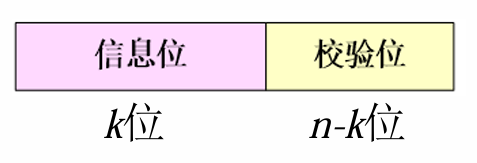
    - **特点**：
        - 前$k$位由单位矩阵$I_k$决定，等于把信息组$m$原封不动搬到码字的前$k$位
        - 其余的$n - k$位叫**冗余位**或**一致校验位**，是前$k$个信息位的线性组合。
    - **定义**：具备以上系统形式的$(n,k)$码叫做**系统码**。若生成矩阵$G$不具备系统形式，则生成的码叫做非系统码。
    - 系统化不改变码集，只是改变了映射规则。
    - **性质**：
        - **等效矩阵**：若通过行运算和列置换能将两个生成矩阵$G$互等，则称这两个$G$等效。
        - **形式转换**：非系统码的$G$可通过运算转变为系统码的$G$。
        - **等效码**：等效的两个$G$生成的两个$(n,k)$线性码也是等效的。
        - 因此，**每个$(n,k)$线性码都可以和一个系统的$(n,k)$线性码等效**

- **线性分组码空间构成**
    - $n$维$n$重空间$V_n$有相互正交的$n$个基底。
    - 选择$k$个基底构成码空间$G$ 。
    - 选择另外的$(n - k)$个基底构成空间$H$ 。
    - $G$和$H$是对偶的，满足$GH^T = 0$，$HG^T = 0$ 。 
    - 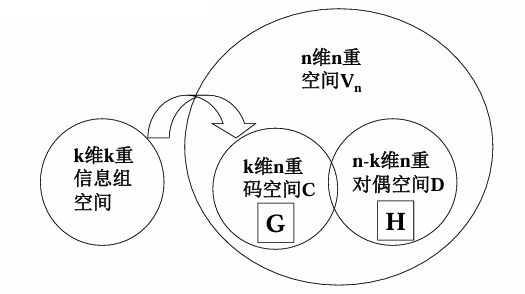

- **码空间与对偶空间**
    - 将$H$空间的$n - k$个基底排列起来可构成一个$(n - k)\times n$矩阵，称为**校验矩阵$H$** ，用于校验接收到的码字是否正确。
    - $G$是$(n,k)$码的生成矩阵，$H$是其校验矩阵。
    - $H$是$(n,n - k)$对偶码的生成矩阵，它的每一行是一个基底，$G$则是其校验矩阵。
    - 满足$GH^T = 0$ ，且$H = [ - P^T | I_{n - k}]$，在二进制情况下，负号可省略。

- **生成矩阵与校验矩阵的关系**
    - 对于任何一个码字$\mathbf{c}$，有$$\mathbf{c}_{1\times n}\mathbf{H}_{n\times(n - k)}^T = \mathbf{0}_{1\times(n - k)}$$
    - 因为生成矩阵的每个行矢量是一个码字，所以必有$$\mathbf{G}_{k\times n}\mathbf{H^T}_{n\times(n - k)} = \mathbf{0}_{k\times(n - k)}$$
    - 对于系统码的生成矩阵$\mathbf{G_S}_{k \times n} = [\mathbf{I}_k | \mathbf{P}_{k \times (n-k)}]$，有：
    $$
    \begin{align*}
    \mathbf{G_S}_{k\times n}[-\mathbf{P}_{(n - k)\times k}^T | \mathbf{I}_{n - k}]^T&=[\mathbf{I}_k | \mathbf{P}_{k\times(n - k)}][-\mathbf{P}_{(n - k)\times k}^T | \mathbf{I}_{n - k}]^T\\
    &=[-\mathbf{I}_k\mathbf{P}_{k\times(n - k)}]+[\mathbf{P}_{k\times(n - k)}\mathbf{I}_{n - k}]\\
    &=[-\mathbf{P}]+[\mathbf{P}]\\
    &=\mathbf{0}_{k\times(n - k)}
    \end{align*}
    $$
    - 由此可得$\mathbf{H} = [-\mathbf{P}^T | \mathbf{I}_{n - k}] = [\mathbf{P}^T | \mathbf{I}_{n - k}]$ ，二进制码省略负号

- **示例**：
    - 同上例：$G = \begin{bmatrix}111010&①\\110001&②\\011101&③\end{bmatrix}\Rightarrow G_s = \begin{bmatrix}100111&① + ③\\010110&① + ②+ ③\\001011&① + ②\end{bmatrix}$
    - |信息|码字|系统码字|
        | ---- | ---- | ---- |
        |000|000000|**000000**|
        |001|011101|**001011**|
        |010|110001|**010110**|
        |011|101100|**011101**|
        |100|111010|**100111**|
        |101|100111|**101100**|
        |110|001011|**110001**|
        |111|010110|**111010**|
    - **一致校验位** 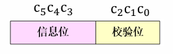
        - $$\mathbf{c} = (c_5c_4c_3c_2c_1c_0)=(m_2m_1m_0) G_S=(m_2m_1m_0)\begin{bmatrix}100111\\010110\\001011\end{bmatrix}$$ 
            
            可得：
            $$
            \begin{cases}
            c_5 = m_2\\
            c_4 = m_1\\
            c_3 = m_0
            \end{cases}
            $$
            因此，校验位可按下面方程组计算：
            
            $$
            \begin{cases}
            c_2 = m_2 + m_1 = c_5 + c_4\\
            c_1 = m_2 + m_1 + m_0 = c_5 + c_4 + c_3\\
            c_0 = m_2 + m_0 = c_5 + c_3
            \end{cases}
            $$

            由于校验位和信息元之间是线性运算关系，所以叫**线性分组码**。
        - 编码器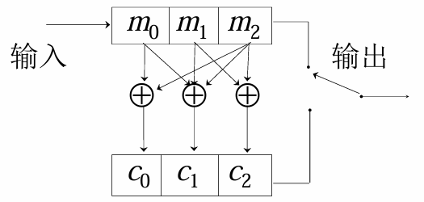
    - **校验矩阵**
        - 由$$
        \begin{cases}
        c_2 = c_5 + c_4\\
        c_1 = c_5 + c_4 + c_3\\
        c_0 = c_5 + c_3
        \end{cases}
        $$在模2加法下可转化为$$
        \begin{cases}
        c_5 + c_4 + 0 + c_2 + 0 + 0 = 0\\
        c_5 + c_4 + c_3 + 0 + c_1 + 0 = 0\\
        c_5 + 0 + c_3 + 0 + 0 + c_0 = 0
        \end{cases}
        $$
        - 令$\mathbf{c}_{1\times n}=(c_5c_4c_3c_2c_1c_0)$ ，$\mathbf{0}_{1\times(n - k)}=(000)$ ，有$(c_5c_4c_3c_2c_1c_0)\begin{bmatrix}111\\110\\011\\100\\010\\001\end{bmatrix}=[000]$ ，校验矩阵$\mathbf{H} = \begin{bmatrix}110100\\111010\\101001\end{bmatrix}_{(n - k)\times n}$
        - 满足$\mathbf{c}_{1\times n}\mathbf{H}_{n\times(n - k)}^T = \mathbf{0}_{1\times(n - k)}$ ，$\mathbf{H}$为校验矩阵，**上式用来验证一个$n$重矢量是否为码字**。
    - **综上**：对于$(6, 3)$线性分组码，其中$k = 3$，$2^k = 8$（消息数量） ：
        - 原始生成矩阵$G = \begin{bmatrix}111010\\110001\\011101\end{bmatrix}$
        - 系统形式的生成矩阵$G_s = \begin{bmatrix}100111\\010110\\001011\end{bmatrix} = [I_{k} | P]$
        - 校验矩阵$H = [P^T | I_{n - k}] = \begin{bmatrix}110100\\111010\\101001\end{bmatrix}$

### 伴随式与标准阵列译码
#### 基本概念
- 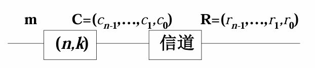
- **定义差错图案$E$**
    $$\mathbf{E}=(e_{n - 1},\cdots,e_{1},e_{0})=\mathbf{R}-\mathbf{C}=(r_{n - 1}-c_{n - 1},\cdots,r_{1}-c_{1},r_{0}-c_{0})$$
    - 在二进制码中，模2加与模2减等同，因此有$$\mathbf{E}=\mathbf{R}+\mathbf{C} \quad \mathbf{R}=\mathbf{C}+\mathbf{E}$$
- **定义伴随式$S$**
    $$\mathbf{S}=(s_{n - k - 1},\cdots,s_{1},s_{0})=\mathbf{R}\mathbf{H}^T=\mathbf{E}\mathbf{H}^T$$
    - 因为$\mathbf{C}\mathbf{H}^T = 0$ ，所以$\mathbf{R}\mathbf{H}^T=(\mathbf{C}+\mathbf{E})\mathbf{H}^T=\mathbf{C}\mathbf{H}^T+\mathbf{E}\mathbf{H}^T=\mathbf{E}\mathbf{H}^T$
        - 若收码无误：则$\mathbf{R}=\mathbf{C}$即$\mathbf{E}=0$ ，此时$\mathbf{C}\mathbf{H}^T =\mathbf{E}\mathbf{H}^T = \mathbf{R}\mathbf{H}^T = 0$
        - 若收码有误：即$\mathbf{E}\neq0$ ，则$\mathbf{R}\mathbf{H}^T=\mathbf{E}\mathbf{H}^T\neq0$
    - 在$\mathbf{H}^T$固定的前提下，$\mathbf{R}\mathbf{H}^T$仅与差错图案$\mathbf{E}$有关，而与发送码$\mathbf{C}$无关。

#### 编译码过程
- **编译码过程**
    - 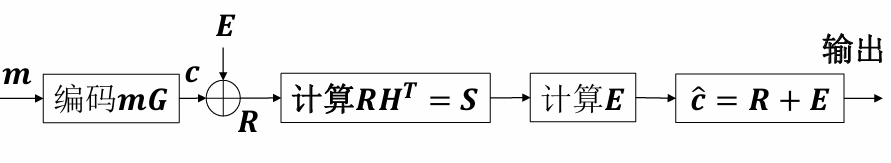
    - 差错图案$\mathbf{E}$是$n$重矢量，共有$2^n$个可能的组合，而伴随式$\mathbf{S}$是$(n - k)$重矢量，只有$2^{n - k}$个可能的组合，因此不同的差错图案可能有相同的伴随式。

- **差错图案E的求解**
    - 可以通过解线性方程求解$\mathbf{E}$：
        $$
        \begin{align*}
        \mathbf{S}&=(s_{n - k - 1},\cdots,s_{1},s_{0})=\mathbf{E}\mathbf{H}^T\\
        &=(e_{n - 1},\cdots,e_{1},e_{0})\begin{bmatrix}h_{(n - k - 1)(n - 1)}&\cdots&h_{(n - k - 1)1}&h_{(n - k - 1)0}\\\vdots&\ddots&\vdots&\vdots\\h_{1(n - 1)}&\cdots&h_{11}&h_{10}\\h_{0(n - 1)}&\cdots&h_{01}&h_{00}\end{bmatrix}^T
        \end{align*}
        $$

        得到线性方程组：
        $$
        \begin{cases}
        s_{n - k - 1}=e_{n - 1}h_{(n - k - 1)(n - 1)}+\cdots+e_{1}h_{(n - k - 1)1}+e_{0}h_{(n - k - 1)0}\\
        \vdots\\
        s_{1}=e_{n - 1}h_{1(n - 1)}+\cdots+e_{1}h_{11}+e_{0}h_{10}\\
        s_{0}=e_{n - 1}h_{0(n - 1)}+\cdots+e_{1}h_{01}+e_{0}h_{00}
        \end{cases}
        $$

        上述方程组中有$n$个未知数$e_{n - 1},\cdots,e_{1},e_{0}$，却只有$n - k$个方程，可知方程组有多解。
        在有理数或实数域中，少一个方程就可能导致无限多个解，而在二元域中，少一个方程导致两个解，少两个方程四个解，以此类推，少$n - (n - k)=k$个方程导致每个未知数有$2^k$个解。
        因此，由上述方程组解出的$\mathbf{E}$可以有$2^k$个解。到底取哪一个作为附加在收码$\mathbf{R}$上的差错图案$\mathbf{E}$的估值呢？
        **概率译码**：把所有$2^k$个解的重量(差错图案$\mathbf{E}$中$1$的个数)作比较，选择其中最轻（$1$的个数最少）者作为$\mathbf{E}$的估值。

-  **标准阵列译码表**: 列出伴随式对应的所有差错图案
    - **标准阵列构造方法**
        1. 先将$2^k$个码字排成一行，作为标准阵列的第一行，并将全$0$码字$\mathbf{C}_1 = (00\ldots0)$放在最左面的位置上。
        2. 然后在剩下的$(2^n - 2^k)$个$n$重中选取一个重量最轻的$n$重$\mathbf{E}_2$放在全$0$码字$\mathbf{C}_1$下面，再将$\mathbf{E}_2$分别和码字$\mathbf{C}_2,\mathbf{C}_3,\cdots,\mathbf{C}_{2^k}$相加，放在对应码字下面构成阵列第二行。
        3. 在第二次剩下的$n$重中，选取重量最轻的$n$重$\mathbf{E}_3$，放在$\mathbf{E}_2$下面，并将$\mathbf{E}_3$分别加到第一行各码字上，得到第三行。
        4.  继续这样做下去，直到全部$n$重用完为止，得到给定$(n,k)$线性码的标准阵列。

        - **在标准阵列的同一行中没有相同的矢量，而且$2^n$个$n$重中任一个$n$重在阵列中出现一次且仅出现一次**

    - 标准阵列译码表：**标准阵列可能不唯一**

        |  |伴随式|陪集首|  |  |  |
        | ---- | ---- | ---- | ---- | ---- | ---- | 
        |子集头| $S_1$ | $\mathbf{C}_1=\mathbf{E}_1=0$ | $\mathbf{C}_2$ | $\cdots$ | $\mathbf{C}_{2^k}$ |
        | | $S_2$ | $\mathbf{E}_2$ | $\mathbf{C}_2+\mathbf{E}_2$ |  $\cdots$ | $\mathbf{C}_{2^k}+\mathbf{E}_2$ |
        | | $S_3$ | $\mathbf{E}_3$ | $\mathbf{C}_2+\mathbf{E}_3$ | $\cdots$ | $\mathbf{C}_{2^k}+\mathbf{E}_3$ |
        | | $\vdots$ | $\vdots$ | $\vdots$ | $\vdots$ | $\vdots$ |
        | | $S_{2^{n - k}}$ | $\mathbf{E}_{2^{n - k}}$ | $\mathbf{C}_2+\mathbf{E}_{2^{n - k}}$ | $\cdots$ | $\mathbf{C}_{2^k}+\mathbf{E}_{2^{n - k}}$ |

    - **陪集和子集**
        - **陪集**：译码表中有$2^{n - k}$行，每行是一个陪集，每陪集的第一个元素(位于第一列)叫**陪集首**。同一陪集（同一行）中的所有元素对应共同的一个伴随式。第一行陪集的陪集首是全零伴随式$\mathbf{S}_0$所对应的全零差错图案$\mathbf{E}_0$ (无差错)，而第$j$行陪集的陪集首是伴随式$\mathbf{S}_j$所对应的重量最小的差错图案$\mathbf{E}_j$ ($\mathbf{C}_0 = 0,\mathbf{R}_j=\mathbf{E}_j$) 。
        - **子集**：译码表中有$2^k$列，每列是一个子集，每子集的第一个元素(位于第一行)叫**子集头**。同一子集（同一列）中的所有元素对应同一个码字，第一列子集的子集头是全零码字$\mathbf{C}_0$，而第$i$列子集的子集头是码字$\mathbf{C}_i$ ($\mathbf{E}_0 = 0,\mathbf{R}_i=\mathbf{C}_i$) 。
    - **检错纠错能力**：根据$\mathbf{E}$在标准阵列中的位置
        - 第一行：不可检错
        - 第一列：可检错可纠错
        - 剩余部分：可检错不可纠错

- **具体译码过程**：
    1. 求生成矩阵$\mathbf{G}$和校验矩阵$\mathbf{H}$。
    2. 通过信息组$\mathbf{m}$和生成矩阵$\mathbf{G}$求出各子集头码字$\mathbf{C}$。
    3. 构造标准阵列译码表。
    4. 根据标准阵列译码表，对收到的码字$\mathbf{R}$进行译码。译码方法：
        - 直接搜索码表，查得$\mathbf{R}$所在列的子集头$\mathbf{C}$，因此译码输出取为$\mathbf{C}$
        - 先求伴随式 $\mathbf{S} = \mathbf{R}\mathbf{H^T}$，确定$\mathbf{S}$所在行，再沿着行对码表作一维搜索找到 $\mathbf{R}$，最后顺着所在列向上找出码字 $\mathbf{C}$
        - 先求出伴随式 $\mathbf{S} = \mathbf{R}\mathbf{H^T}$ 并确定 $\mathbf{S}$ 所对应的陪集首（差错图案）$\mathbf{E}$，再将陪集首与收码相加得到码字 $\mathbf{C}= \mathbf{R}+ \mathbf{E}$

        上述三种方法由上而下，查表的时间下降而所需计算量增大，实际使用时可针对不同情况选用。

- **示例**： 一个$(5,2)$系统线性码的生成矩阵是$G = \begin{bmatrix}10111\\01101\end{bmatrix}$ ，设收码$\mathbf{R} = (10101)$，构造标准阵列译码表，译出发码的估值。
    - 求出校验矩阵：$H = [P^T | I_3]=\begin{bmatrix}11100\\10010\\11001\end{bmatrix}$
    - 分别以信息组$\mathbf{m}= (00)$、$(01)$、$(10)$、$(11)$及已知的$G$求得$4$个许用码字为$\mathbf{C}_0 = (00000)$、$\mathbf{C}_1 = (10111)$ 、$\mathbf{C}_2 = (01101)$、$\mathbf{C}_3 = (11010)$
    - 构造标准阵列译码表

        |伴随式|陪集首|  |  |  |
        | ---- | ---- | ---- | ---- | ---- |
        | $S_0 = 000$ | $E_0 + C_0 = 00000$ | $C_1 = 10111$ | $C_2 = 01101$ | $C_3 = 11010$ |
        | $S_1 = 111$ | $E_1 = 10000$ | $00111$ | $11101$ | $01010$ |
        | $S_2 = 101$ | $E_2 = 01000$ | $11111$ | $00101$ | $10010$ |
        | $S_3 = 100$ | $E_3 = 00100$ | $10011$ | $01001$ | $11110$ |
        | $S_4 = 010$ | $E_4 = 00010$ | $10101$ | $01111$ | $11000$ |
        | $S_5 = 001$ | $E_5 = 00001$ | $10110$ | $01100$ | $11011$ |
        | $S_6 = 011$ | $E_6 = 00011$ | $10100$ | $01110$ | $11001$ |
        | $S_7 = 110$ | $E_7 = 00110$ | $10001$ | $01011$ | $11100$ |
    - 将接收码$\mathbf{R}=10101$译码，可选以下三种方法之一译码：
        1. 直接搜索码表，查得$(10101)$所在列的子集头是$(10111)$，因此译码输出取为$(10111)$。
        2. 先求伴随式$\mathbf{R}H^T = (10101)\cdot H^T = (010) = S_4$，确定$S_4$所在行，再沿着行对码表作一维搜索找到$(10101)$，最后顺着所在列向上找出码字$(10111)$。
        3. 先求出伴随式$\mathbf{R}H^T = (010) = S_4$并确定$S_4$所对应的陪集首（差错图案）$E_4=(00010)$，再将陪集首与收码相加得到码字$\mathbf{C}= \mathbf{R}+ E_4=(10101)+(00010)=(10111)$。

### 码距、纠错能力、MDC码及重量谱
- **汉明距离**：两个码字$c_i, c_j$之间对应码元位上符号取值不同的个数，称为码字$c_i, c_j$之间的汉明距离 $$d(c_i, c_j)=\sum_{k = 0}^{n - 1}(c_{ik}\oplus c_{jk})$$
- **最小距离**：在$(n,k)$线性码中，码字之间的最小汉明距离 $$d_{min}=min(d(c_i, c_j)),c_i, c_j\in C$$

- **定理6.1**：任何最小距离$d_{min}$的线性分组码，其检错能力为$(d_{min}-1)$，纠错能力$t$为$$t = \left\lfloor\frac{d_{min}-1}{2}\right\rfloor$$
    - 纠错能力$t$是指在接收码中，最多允许有$t$个差错图案而不致于误译的能力。（只要不到另一个点，你就能知道出错了）
    - 检错能力是指在接收码中，最多允许有$d_{min}-1$个差错图案而不致于误译的能力。（只要离原来的点比任何一个点都近，你就能知道原来的点）
- **纠错能力示意图**：码集各码字间的距离是不同的，码距最小者决定码的特性，称之为最小距离$d_{min}$
    - 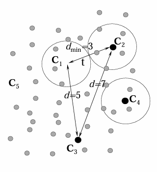
    - 如图中$d_{min}=3$，纠错能力是$1$，检错能力是$2$

- **最小距离计算**：
    - **汉明重量**：码字中非$0$码元符号的个数，称为该码字的汉明重量。**在二元线性码中，码字重量就是码字中含“$1$”的个数** $$w(c)=\sum_{i = 0}^{n - 1}c_i$$
    - **定理6.2**：线性分组码的最小距离等于码集中非零码字的最小重量 $$d_{min}=min\{w(C_i)\}\quad C_i\in C及C_i\neq0$$$$d(c_i, c_j)=w(c_i\oplus c_j)=w(c_k)\quad c_i, c_j, c_k\in C$$
    - **定理6.3**：$(n,k)$线性分组码最小距离等于$d_{min}$的**必要**条件是：校验矩阵$H$中任意$(d_{min}-1)$列线性无关。
        - 将$H$写成$H = [h_{n - 1},\cdots, h_1, h_0]$，其中$h_{n - 1},\cdots, h_1, h_0$为列矢量 
            $$
            \begin{align*}
            cH^T &= [c_{n - 1},\cdots, c_1, c_0]\begin{bmatrix}h_{n - 1}^T\\\vdots\\h_1^T\\h_0^T\end{bmatrix}\\
            &=c_{n - 1}h_{n - 1}^T+\cdots + c_1h_1^T + c_0h_0^T = 0
            \end{align*}
            $$
        - 若存在一个重量为$d_{min}$的码字，则必有$d_{min}$列线性相关
    - **定理6.4**：$(n,k)$线性分组码的最小距离必定小于等于$(n - k + 1)$  $$d_{min}\leq(n - k + 1)$$
        - 计算校验矩阵的秩，则$H$的秩加$1$就是最小距离$d_{min}$的上限 。

- **示例**：对于$(7, 4)$线性码，$H = \begin{bmatrix}1110100\\0111010\\1101001\end{bmatrix}$
    - 各列都不相同，任意$2$列之和不等于$0$，任何$2$列线性无关；
    - 存在$2$列之和等于矩阵中某一列，即存在$3$列线性相关
    - 存在重量为$3$的码字
    - 能找到的最小线性相关的列数为$3$
    - 所以该码的最小距离为$d_{min} = 3$，小于$n - k + 1 = 4$ 。
    - 该码的纠错能力为$t = \left\lfloor\frac{d_{min}-1}{2}\right\rfloor = 1$，检错能力为$d_{min}-1=2$。

- **极大最小距离码 (MDC)**：
    - **定义**：$d_{min}=n - k + 1$的$(n,k)$线性码称为极大最小距离码 (MDC - Maximized minimum Distance Code)。
    - 总体的、平均的纠错能力不但与最小距离有关，而且与其余码距或者说与码字的重量分布特性有关。

### 完备码（Perfect code）
#### 完备码定义与性质
- **汉明限**：任何一个二元$(n,k)$线性分组码都有$2^{n - k}$个伴随式，若该码的纠错能力是$t$，则对于任何一个重量小于等于$t$的差错图案，都应有一个伴随式与之对应，即伴随式的数目满足条件$$2^{n - k}\geq\binom{n}{0}+\binom{n}{1}+\binom{n}{2}+\cdots+\binom{n}{t}$$ 此式称作**汉明限**，任何一个纠错码都应满足该条件。
- **完备码定义**：满足以下等式的二元$(n,k)$线性分组码 $$2^{n - k}=\binom{n}{0}+\binom{n}{1}+\binom{n}{2}+\cdots+\binom{n}{t}$$
- **完备码性质**：
    1. 即该码的伴随式数目恰好和不大于$t$个差错的图案数目相等。
    2. 相当于在标准译码阵列中能将所有重量不大于$t$的差错图案选作陪集首，且没有一个陪集首的重量大于$t$，此时校验位得到最充分的利用。
    3. 这样的二元$(n,k)$线性分组码称为**完备码**。

#### 汉明码（Hamming Code）
- **定义**：汉明码是纠错能力$t = 1$的一类码的统称。
- **性质**：
    - 汉明码既有二进制的，也有非二进制的。
    - 二进制时，汉明码码长$n$和信息位$k$服从规律$$(n,k)=(2^m - 1,2^m - 1 - m)$$ 其中$m = n - k$，是正整数。
        
        | 正整数$m=n-k$ | 码长 $n = 2^m - 1$ | 信息位 $k = 2^m - 1 - m$ | 汉明码$(n,k)$ |
        | ---- | ---- | ---- | ---- |
        | 3 | $2^3 - 1 = 7$ | $2^3 - 1 - 3 = 4$ | $(7,4)$ |
        | 4 | $2^4 - 1 = 15$ | $2^4 - 1 - 4 = 11$ | $(15,11)$ |
        | 5 | $2^5 - 1 = 31$ | $2^5 - 1 - 5 = 26$ | $(31,26)$ |
        | 6 | $2^6 - 1 = 63$ | $2^6 - 1 - 6 = 57$ | $(63,57)$ |
        | 7 | $2^7 - 1 = 127$ | $2^7 - 1 - 7 = 120$ | $(127,120)$ |
        | 8 | $2^8 - 1 = 255$ | $2^8 - 1 - 8 = 247$ | $(255,247)$ |
        |$\cdots$ |$\cdots$ |$\cdots$ |$\cdots$ |
    - 汉明码是完备码，因为满足等式$$\binom{n}{0}+\binom{n}{1}=1 + n=1 + 2^m - 1=2^m=2^{n - k}$$
- **校验矩阵构成**：汉明码的校验矩阵$H$具有特殊性质，可简化构造方法。
    - 一个$(n,k)$码的校验矩阵有$n - k$行和$n$列，二进制时$n - k$个码元所能组成的列矢量总数是$2^{n - k}$，除去全$0$矢量后为$2^{n - k} - 1 = 2^m - 1 = n$，恰好和校验矩阵的列数$n$相等。
    - 只要排列所有列，通过列置换将矩阵$H$转换成系统形式，就可以进一步得到相应的生成矩阵$G$。
- **示例**：构造一个$m = 3$的二元$(7, 4)$汉明码。
    - 先利用汉明码的特性构造一个$(7, 4)$汉明码的校验矩阵$H$，再通过列置换将它变为系统形式：
    - 校验矩阵$H=\begin{bmatrix}0001111\\0110011\\1010101\end{bmatrix}$，经列置换得到$\begin{bmatrix}1110100\\0111010\\1101001\end{bmatrix}=[P^T | I_3]$，再得生成矩阵$G = [I_4 | P]=\begin{bmatrix}1000101\\0100111\\0010110\\0001011\end{bmatrix}$
#### 高莱（Golay）码
- 是二进制$(23, 12)$线性码
- 最小距离$d_{min}=7$
- 纠错能力$t = 3$
- 高莱码是完备码，因为满足等式$$2^{23 - 12}=2048=1+\binom{23}{1}+\binom{23}{2}+\binom{23}{3}$$
- 在$(23,12)$码上添加一位奇偶位即得二进制线性$(24, 12)$扩展高莱码，其最小距离$d_{min}=8$。
- 编码步骤见[高莱码编码步骤](#高莱golay码-1)

### 循环码
#### 基本概念与多项式描述
- **循环码的定义**：设一个$(n,k)$线性分组码$C$，如果它的任一码字的每一次循环移位都还是$C$的一个码字，则称$C$是**循环码**。
    $$
    \begin{align*}
    \forall: &\boldsymbol{c}=(c_{n - 1},c_{n - 2},\cdots,c_{0})\in C\\
    &\boldsymbol{c}_1=(c_{n - 2},c_{n - 3},\cdots,c_{0},c_{n - 1})\in C\\
    &\boldsymbol{c}_2=(c_{n - 3},c_{n - 4},\cdots,c_{0},c_{n - 1},c_{n - 2})\in C\\
    &\vdots\\
    &\boldsymbol{c}_{n - 1}=(c_{0},c_{n - 1},\cdots,c_{2},c_{1})\in C
    \end{align*}
    $$

- **循环码的数学描述**：
    - **循环码的特点**：
        - 它是线性分组码，其数学模型应具有线性特性。
        - 具有循环特性。
        - 码字的全体**构成了$n$维矢量空间中具有循环特性的$k$维子空间**。
    - **线性分组码的多项式描述**：
        - 码字$$\boldsymbol{c}=(c_{n - 1},c_{n - 2},\cdots,c_{0})$$ 
        - 码多项式$$c(x)=c_{n - 1}x^{n - 1}+c_{n - 2}x^{n - 2}+\cdots + c_1x + c_0$$
        - 对于线性分组码$C$，可以表示成码多项式构成的集合：
            $$
            \begin{align*}
            &C\leftrightarrow C(x)\\
            &=\{c_{n - 1}x^{n - 1}+c_{n - 2}x^{n - 2}+\cdots + c_1x + c_0\mid(c_{n - 1},c_{n - 2},\cdots,c_{0})\in C\}
            \end{align*}
            $$
- **示例**：$(7, 3)$线性分组码
    - 校验矩阵$H=\begin{bmatrix}1&0&1&1&0&0&0\\1&1&1&0&1&0&0\\1&1&0&0&0&1&0\\0&1&1&0&0&0&1\end{bmatrix}$
        生成矩阵$G=\begin{bmatrix}1&0&0&1&1&1&0\\0&1&0&0&1&1&1\\0&0&1&1&1&0&1\end{bmatrix}$
    由$\boldsymbol{c}=\boldsymbol{m}G$得码集（由两组码字循环构成的循环码）：
    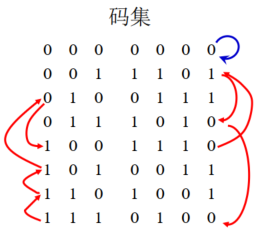
    - 任取一码字
        - 设$\boldsymbol{c}=0011101$ ，则$c(x)=x^4 + x^3 + x^2 + 1$ 。
        - 移一位，$\boldsymbol{c}_1 = 0111010$ ，$c_1(x)=x^5 + x^4 + x^3 + x = xc(x)$ 。
        - 移两位，$\boldsymbol{c}_2 = 1110100$ ，$c_2(x)=x^6 + x^5 + x^4 + x^2 = x^2c(x)$ 。
        - 移三位，$\boldsymbol{c}_3 = 1101001$ ，$c_3(x)=x^6 + x^5 + x^3 + 1 = x^3c(x)\pmod{(x^7 + 1)}$ 。
        - $\vdots$

- **结论**：如果将一个循环码的某一非零码字用码多项式表示出来，那么其他的非零码字多项式就可以用这个码字多项式（或码字多项式的和）乘上$x$的一个幂，再求$(x^n + 1)$的余得到。

- **说明**：一个码字的移位最多能得到$n$个码字，因此“循环码字的循环仍是码字”并不意味着循环码集可以从一个码字循环而得，还应包含码字的一些线性组合。

#### 基本定理与矩阵描述
- **循环码的生成多项式**:
    - **定义**：若$g(x)$是一个$(n - k)$次多项式，且是$(x^n + 1)$的因式，则由$g(x)$可以生成一个$(n,k)$循环码，$g(x)$称为该循环码的**生成多项式**。
    - **结论**：
        1. **结论1**：$GF(2)$上的$(n,k)$循环码中，存在着一个次数为$(n - k)$的**首一码多项式** $g(x)$（首一：多项式最高幂次项系数$g_{n - k}=1$ ）
            $$g(x)=x^{n - k}+g_{n - k - 1}x^{n - k - 1}+\cdots + g_2x^2 + g_1x + 1$$

            使得所有码多项式都是$g(x)$的倍式，即
            $$c(x)=m(x)\cdot g(x)$$ 

            其中$$m(x)=m_{k - 1}x^{k - 1}+\cdots + m_1x + m_0$$

            且所有小于$n$次的$g(x)$的倍式都是码多项式。
            **故循环码完全由它的生成多项式确定**。
        2. **结论2**：$(n,k)$循环码的生成多项式$g(x)$一定是$(x^n + 1)$的因子，即$$g(x)\mid(x^n + 1)\quad或写成\quad x^n + 1 = g(x)h(x)$$ 
            相反，如果$g(x)$是$x^n + 1$的$(n - k)$次因子，则$g(x)$一定是$(n,k)$循环码的生成多项式。
            **生成多项式不唯一**。
        3. **结论3**：任何码字的循环移位仍是码字，但并非由一个码字循环移位可以得到所有码字。
        4. **结论4**：当一个循环码给定其生成多项式$g(x)$后，根据生成多项式就可以进行编码，但编出的码不一定为系统码。
    - **$(n,k)$循环码的构造**：
        1. 对$x^n + 1$做因式分解，找出$(n - k)$次因式。
        2. 以该$(n - k)$次因式为生成多项式$g(x)$与不高于$(k - 1)$次信息多项式$m(x)$相乘，即得到对应消息序列的码多项式。 

- **循环码的生成矩阵**:
    - $(n,k)$循环码是$n$维线性空间中具有循环特性的$k$维子空间，其生成矩阵可由码空间中任一组$k$个线性无关的码字构成，这$k$个线性无关的码字组成$(n,k)$循环码的基底，且基底不唯一。
    - **获得$k$个线性无关码字的方法**
        **当循环码的生成多项式$g(x)$确定后，可取$g(x)$本身加上移位$k - 1$次所得到的$k - 1$个码字，与$g(x)$一起作为$k$个基底**，即：
        $$
        \begin{align*}
        G&=\begin{bmatrix}x^{k - 1}g(x)\\x^{k - 2}g(x)\\\vdots\\xg(x)\\g(x)\end{bmatrix}\\
        &=\begin{bmatrix}g_{n - k}&g_{n - k - 1}&\cdots&g_0&0&0&\cdots&0\\0&g_{n - k}&g_{n - k - 1}&\cdots&g_0&0&\cdots&0\\\vdots&&&\ddots&&&\vdots\\0&\cdots&0&0&g_{n - k}&g_{n - k - 1}&\cdots&g_0\end{bmatrix}
        \end{align*}
        $$

        这$k$个矢量线性无关，且由$g(x)$循环移位得到，所以都是码字，它们构成一个$k\times n$的矩阵，即循环码的生成矩阵。

- **循环码的系统码**
    - **系统循环码的编码**：
        - 码多项式$$c(x)=x^{n - k}m(x)+r(x)$$ 其中$r(x)$是与码字中$(n - k)$个校验元相对应的$(n - k - 1)$次多项式。
        对等式两边取$\bmod g(x)$：
        - 等式左边：$c(x)=m(x)g(x)$，所以$c(x)\bmod g(x)=0$ 。
        - 等式右边：必有$[x^{n - k}m(x)+r(x)]\bmod g(x)=0$ ，由于$r(x)$的幂次$(n - k - 1)$低于$g(x)$的幂次$(n - k)$ ，要使等式右边为$0$，必有$$x^{n - k}m(x)\bmod g(x)=r(x)$$
    - **系统码的编码步骤**：
        1. 将信息多项式$m(x)$乘以$x^{n - k}$ ，即左移$(n - k)$位
        2. 将$x^{n - k}m(x)$除以$g(x)$ ，得到余式$r(x)$ 
        3. 得到系统循环码的码多项式：$c(x)=x^{n - k}m(x)+r(x)$
        4. 将码多项式转换为码字。 

    - **系统码的生成矩阵**
        - 系统形式的生成矩阵 $G = [I | P]$ 
        - $$G(x)=\begin{bmatrix}x^{n-1} + p_{n-k}(x)\\x^{n-2} + p_{n-k-1}(x)\\\vdots\\x^{n-k+1} + p_1(x)\\x^{n-k}  + p_0(x)\end{bmatrix}_{k \times n}$$ 其中$$p_{i}(x)=x^{i+(n-k)}\bmod(g(x))$$

- **示例**：一个长度$n = 7$的循环码的构造方法
    1. **求一种$(7, 4)$循环码**
        1. 对$x^7 + 1$作因式分解：
        $x^7 + 1=(x + 1)(x^3 + x^2 + 1)(x^3 + x + 1)$ ，故$x^7 + 1$有如下因式：
            - 一次因式：$x + 1$（一个）
            - 三次因式：$x^3 + x + 1$，$x^3 + x^2 + 1$（两个）
            - 四次因式：$(x + 1)(x^3 + x^2 + 1)=x^4 + x^2 + x + 1$ ，$(x + 1)(x^3 + x + 1)=x^4 + x^3 + x^2 + 1$（两个）
            - 六次因式：$(x^3 + x^2 + 1)(x^3 + x + 1)=x^6 + x^5 + x^4 + x^3 + x^2 + x + 1$（一个）
        2. 以$(n - k)$次因式作为生成多项式：
            - $n - k = 1$，$k = 6$，生成一种$(7, 6)$循环码；
            - $n - k = 3$，$k = 4$，生成两种$(7, 4)$循环码；
            - $n - k = 4$，$k = 3$，生成两种$(7, 3)$循环码；
            - $n - k = 6$，$k = 1$，生成一种$(7, 1)$循环码。

        - 求一种$(7, 4)$循环码，可选$n - k = 3$次多项式$x^3 + x^2 + 1$或$x^3 + x + 1$为生成多项式。以选择$g(x)=x^3 + x^2 + 1$为例，$n - k = 3$，$k = 4$（信息位为$4$ ）。
            设信息多项式为$$m(x)=m_3x^3 + m_2x^2 + m_1x + m_0$$

            则循环码编码后的码多项式为$$c(x)=m(x)g(x)=(m_3x^3 + m_2x^2 + m_1x + m_0)(x^3 + x^2 + 1)$$

            | $m$ | $m(x)$ | $c(x)$ | $c$ |
            | ---- | ---- | ---- | ---- |
            | $0000$ | $0$ | $0$ | $0000000$ |
            | $0001$ | $1$ | $x^3 + x^2 + 1$ | $0001101$ |
            | $0010$ | $x$ | $x^4 + x^3 + x$ | $0011010$ |
            | $0011$ | $x + 1$ | $x^4 + x^2 + x + 1$ | $0010111$ |
            | $0100$ | $x^2$ | $x^5 + x^4 + x^2$ | $0101100$ |
            | $\cdots$ | $\cdots$ | $\cdots$ | $\cdots$ |
            
            最终得：
            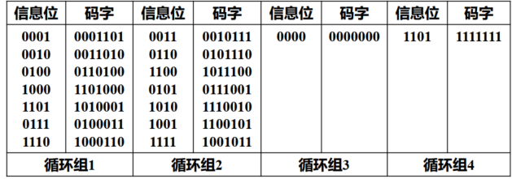
    2. **求$g(x)=x^3 + x^2 + 1$，$k = 4$的循环码的生成矩阵**：
        $$
        \begin{cases}
        x^3g(x)\leftrightarrow1101000\\
        x^2g(x)\leftrightarrow0110100\\
        xg(x)\leftrightarrow0011010\\
        g(x)\leftrightarrow0001101
        \end{cases}
        \Rightarrow G=\begin{bmatrix}1101000\\0110100\\0011010\\0001101\end{bmatrix}
        $$ 

        当循环码的生成矩阵确定后，编码规则为$$\boldsymbol{c}=\boldsymbol{m}G$$
        
        例如，当$\boldsymbol{m}=(1001)$时，$\boldsymbol{c}=(1001)G = 1100101$ 。
        这与通过生成多项式计算结果相同：$m(x)g(x)=(x^3 + 1)(x^3 + x^2 + 1)=x^6 + x^5 + x^2 + 1$，对应码字也是$1100101$ 。 
    3. **求$g(x)=x^3 + x^2 + 1$，$m = (1001)$的系统码字。**
        1. 计算$x^{n - k}m(x)$：
            - 因为$n = 7$，$k = 4$，$m(x)=x^3 + 1$，所以$x^{n - k}m(x)=x^3(x^3 + 1)=x^6 + x^3$ 。
        2. 计算$x^{n - k}m(x)$除以$g(x)$的余式$r(x)$：
            用$x^6 + x^3$除以$x^3 + x^2 + 1$ ，通过长除法：
            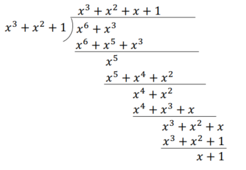
            得到$r(x)=x + 1$ 。
        3. 得到系统循环码的码多项式$c(x)$并转换为码字：
            - $c(x)=x^{n - k}m(x)+r(x)=x^6 + x^3 + x + 1$ ，转换为码字$c=(1001011)$ 。

    4. **求$(7, 4)$循环码$g(x)=x^3 + x^2 + 1$系统形式的生成矩阵**：
        设$G=\begin{bmatrix}g_3\\g_2\\g_1\\g_0\end{bmatrix}=\begin{bmatrix}1000p_{32}p_{31}p_{30}\\0100p_{22}p_{21}p_{20}\\0010p_{12}p_{11}p_{10}\\0001p_{02}p_{01}p_{00}\end{bmatrix}$ ，$G(x)=\begin{bmatrix}x^6 + p_3(x)\\x^5 + p_2(x)\\x^4 + p_1(x)\\x^3 + p_0(x)\end{bmatrix}$
        分别计算：
        - $p_3(x)=x^6\bmod g(x)=x^2 + x$
        - $p_2(x)=x^5\bmod g(x)=x + 1$
        - $p_1(x)=x^4\bmod g(x)=x^2 + x + 1$
        - $p_0(x)=x^3\bmod g(x)=x^2 + 1$
        
        最终得到$G=\begin{bmatrix}1000110\\0100011\\0010111\\0001101\end{bmatrix}$ 

#### 编译码方法及其实现电路
- **循环码的编码**
    - **编码步骤**：
        1. 将信息多项式$m(x)$乘以$x^{n - k}$ ，即左移$(n - k)$位。
        2. 将$x^{n - k}m(x)$除以$g(x)$ ，得到余式$r(x)$
        3. 得到系统循环码的码多项式$c(x)=x^{n - k}m(x)+r(x)$
        4. 将码多项式转换为码字。
    - **用除法器实现$(7,3)$循环编码器**：
        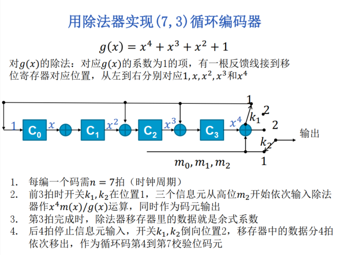
    - **除法器编码示例**：
        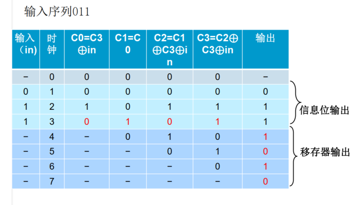

- **循环码的译码**
    - **译码步骤**：
        1. 计算接收多项式$R(x)$的伴随多项式$S(x)$ ，伴随式为$0$则认为无差错
        2. 根据$S(x)$找出相应错误图样多项式$e(x)$ 
        3. 将$e(x)$和$R(x)$模$2$加，得到译码输出$\hat{c}(x)$ 。
    - **伴随式计算及错误检测**：
        - 设接收多项式为$R(x)$ ，码多项式为$c(x)$ ，错误图样多项式为$e(x)$ ，则$$R(x)=c(x)+e(x)$$  用生成多项式$g(x)$除$R(x)$得伴随式$$s(x)=R(x)\bmod g(x)=e(x)\bmod g(x)$$ **可通过译码电路高效实现**

#### 高莱（Golay）码
- **二进制高莱码（Golay (23,12)码）的编码**
    - 二进制高莱码是一种循环码，其生成多项式为：
        $$g(x)=x^{11}+x^{9}+x^{7}+x^{6}+x^{5}+x + 1$$
    - **编码步骤**：
        1. **信息位准备**：假设有12位的信息位，记为$m(x)$。
        2. **生成多项式**：使用生成多项式$g(x)$。
        3. **计算校验位**：
            - 将信息位$m(x)$左移11位（即乘以$x^{11}$ ），得到$x^{11}m(x)$。
            - 计算$x^{11}m(x)$除以$g(x)$的余数$r(x)$。 
            - 将余数$r(x)$添加到$x^{11}m(x)$的末尾，得到编码后的码字$c(x)=x^{11}m(x)+r(x)$。 
- **扩展高莱码（Golay (24,12)码）的编码**
    - 扩展高莱码是在二进制高莱码的基础上增加一个奇偶校验位。
    - **编码步骤**：
        1. **二进制高莱码编码**：首先使用二进制高莱码的编码方法，生成23位的码字$c(x)$ 。
        2. **计算奇偶校验位**：
            - 计算23位码字中1的个数。
            - 如果1的个数为奇数，则添加1作为奇偶校验位；如果为偶数，则添加0 。
        3. **生成扩展码字**：将奇偶校验位添加到23位码字的末尾，得到24位的扩展高莱码。 

#### 循环冗余校验（Cyclic Redundancy Check，CRC）
- **原理**：
    - 把数据视作二进制数$D$ 
    - 确定校验序列长度$r$ 
    - 选择长度为$r + 1$的生成序列$G$ 
    - $D$后面添加$r$个$0$后除以$G$ ，余数为校验序列$R$ 
    - 将$R$附加在$D$后面作为实际传输数据。
    - **检错**：接收方将接收到的数据除以$G$ ，若余数为$0$ ，则认为无出错，否则认为传输出错
- **特点**：可检测长度小于$r + 1$ bits的所有突发错误。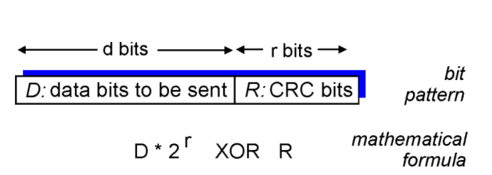
- **CRC示例**：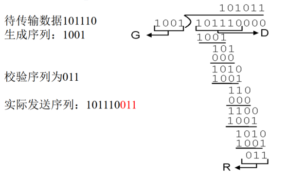
- **常用CRC版本**：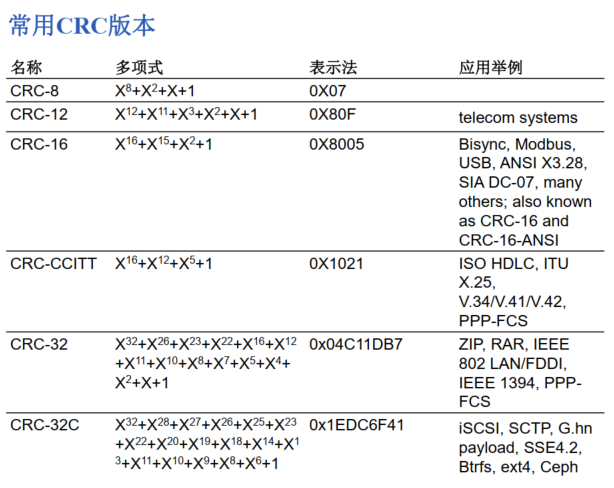
- **CRC有效性**：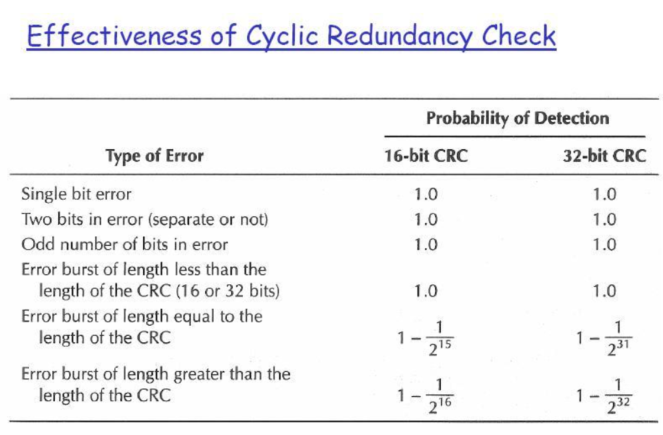

# 第六章补充 信道编码

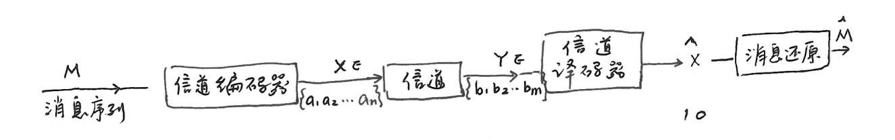

## 译码规则和译码错误概率
- 已知信道转移错误概率 $p = 0.9$，转移情况如下：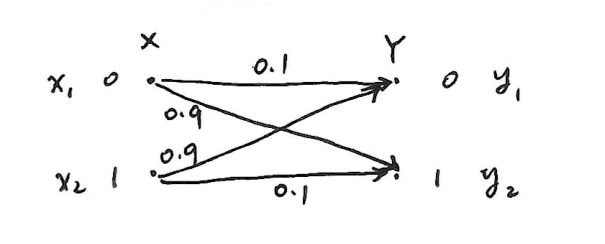
    - 若规定：
        - $Y = 0 \to \hat{X} = 0$
        - $Y = 1 \to \hat{X} = 1$
        - 即 $F(y_1) = x_1$，$F(y_2) = x_2$，则译码错误概率 $P_e = 0.9$。
    - 反之若：
        - $Y = 0 \to \hat{X} = 1$
        - $Y = 1 \to \hat{X} = 0$
        - 即 $F(y_1) = x_2$，$F(y_2) = x_1$，则译码错误概率 $P_e = 0.1$。

### 译码规则
- **定义译码规则**：$$F(y_j) = x_i\quad i = 1, 2, \cdots, n；j = 1, 2, \cdots, m$$
- 示例：
    - 设转移概率矩阵 $P=\begin{bmatrix}0.5&0.3&0.2\\0.2&0.3&0.5\\0.3&0.3&0.4\end{bmatrix}_{(n\times m)}$，共有$n^m$种译码规则，如：
        - 译码规则 $A$：$F(y_1) = x_1$；$F(y_2) = x_2$；$F(y_3) = x_3$。
        - 译码规则 $B$：$F(y_1) = x_1$；$F(y_2) = x_3$；$F(y_3) = x_2$。
        - $\cdots$

### 错误概率
- 若 $F(y_j) = x_i^*$，则：
    - **正确概率**：$$p(F(y_j)|y_j)=p(x_i^*|y_j)$$
    - **错误概率**：$$p(e|y_j)=1 - p(x_i^*|y_j)$$
    - **平均错误概率**：
        $$
        \begin{align*}
        P_e &= E[p(e|y_j)]\\
        &=\sum_{j = 1}^{m}p(y_j)p(e|y_j)\\
        &=\sum_{j = 1}^{m}p(y_j)(1 - p(x_i^*|y_j))\\
        &=\sum_{j = 1}^{m}p(y_j)-\sum_{j = 1}^{m}p(x_i^*,y_j)\\
        &=1-\sum_{j = 1}^{m}p(x_i^*,y_j)\\
        &=\sum_{Y, X-X^*}p(x,y)
        \end{align*}
        $$

### 最佳译码规则
- 最佳译码就是使平均错误概率最小
    $$P_e=\sum_{j = 1}^{m}p(y_j)p(e|y_j)$$

    只需使 $p(e|y_j)$ 最小（$j = 1, 2, \cdots, m$），而 $p(e|y_j)=1 - p(x_i|y_j)=1 - p(F(y_j)|y_j)$。

    因此，**最佳译码**规则 $F(y_j)=x^*$，满足
    $$p(x^*|y_j) \geq p(x_i|y_j),\quad i = 1, 2, \cdots, n$$

#### 最大后验概率译码
- 最大后验概率译码满足最佳译码规则：$$x^*=\arg\max_{1\leq i\leq n}p(x_i|y_j)$$
- $$
    F:\left\{
    \begin{array}{l}
    F(b_j)=a_j^*\in A, b_j\in B\\
    P(a_j^*|b_j)\geq P(a_i|b_j), a_i\in A
    \end{array}
    \right.
    $$

#### 最大联合概率译码
- 根据贝叶斯公式$p(x_i|y_j)=\frac{p(y_j|x_i)p(x_i)}{p(y_j)}$：
    $$\max_{x_i} p(x_i|y_j) = \max_{x_i} \frac{p(y_j|x_i)p(x_i)}{p(y_j)}$$

- 则**最大联合概率译码**为：
    $$x^*=\arg\max_{1\leq i\leq n}p(y_j|x_i)p(x_i)$$
- $$
    F:\left\{
    \begin{array}{l}
    F(b_j)=a_j^*\in A, b_j\in B\\
    P(a_j^*, b_j)\geq P(a_i, b_j), a_i\in A
    \end{array}
    \right.
    $$

#### 最大似然译码
- 当$p(x_i)=\frac{1}{n}$时，即**信源符号等概率分布时**，有**最大似然译码**：
    $$x^*=\arg\max_{1\leq i\leq n}p(y_j|x_i)$$
- $$
    F:\left\{
    \begin{array}{l}
    F(b_j)=a_j^*\in A, b_j\in B\\
    P(b_j|a_j^*)\geq P(b_j|a_i), a_i\in A
    \end{array}
    \right.
    $$

- **示例**：已知转移概率矩阵$P =
        \begin{bmatrix}
        \frac{1}{2}&\frac{1}{3}&\frac{1}{6}\\
        \frac{1}{6}&\frac{1}{2}&\frac{1}{3}\\
        \frac{1}{3}&\frac{1}{6}&\frac{1}{2}
        \end{bmatrix}$，且$p(x_1)=p(x_2)=p(x_3)=\frac{1}{3}$，则：
    - $F(y_1)=\arg\max(p(y_1|x_1),p(y_1|x_2),p(y_1|x_3)) = x_1$
    - $F(y_2)=\arg\max(\frac{1}{3},\frac{1}{2},\frac{1}{6}) = x_2$
    - $F(y_3)= x_3$
    - **译码规则A**：$\begin{cases}F(y_1)=x_1\\F(y_2)=x_2\\F(y_3)=x_3\end{cases}$，为最佳译码规则
        此时$P_e=\frac{1}{3}(\frac{1}{3}+\frac{1}{6}+\frac{1}{3}+\frac{1}{6}+\frac{1}{3}+\frac{1}{6})=\frac{1}{2}$
    - **译码规则B**：$\begin{cases}F(y_1)=x_1\\F(y_2)=x_3\\F(y_3)=x_2\end{cases}$ 
        此时$P_e=\frac{1}{3}(\frac{1}{6}+\frac{1}{3}+\frac{1}{3}+\frac{1}{2}+\frac{1}{6}+\frac{1}{2})=\frac{2}{3}$
    - **结论：最佳译码规则的错误概率最小**

#### 最小汉明距离译码
- $$\hat{C}_i=\arg\max_{1\leq i\leq M}p(\vec{r}|\vec{C_{0}})p(\vec{C_{0}}),\quad M = q^k$$
- 在二进制对称信道（BSC）中：
    - $p(\vec{r}|\vec{C_{0}})=\prod_{j = 1}^{n}p(r_j|c_{ij})$ ，且 $p(r_j|c_{ij}) =
        \begin{cases}
        p, & c_{ij} \neq r_j \\
        1 - p, & c_{ij} = r_j
        \end{cases}$，其中$p=P_e<\frac{1}{2}$。
    - 进一步推导可得$$p(\vec{r}|\vec{C_{0}})=\prod_{j = 1}^{n}p(r_j|c_{ij})=p^d(1 - p)^{n - d}=(\frac{p}{1 - p})^d(1 - p)^n$$ 
    - 其中 $$d = dis(\vec{r},\vec{C_{0}})=w(\vec{r}\oplus\vec{C_{0}})=\sum_{j = 1}^{n}r_j\oplus c_{ij}$$  即 $\vec{r_{}}$ 与 $\vec{C_{0}}$ 的汉明距离。
    - 由于 $\frac{p}{1 - p} \leq 1$ ，$(1 - p)^n$ 是常数，所以 $d$ 越大，$p(\vec{r}|\vec{C_{0}})$ 越小。求 $\max p(\vec{r}|\vec{C_{0}})$ 的问题就转化成求最小汉明距离问题。

### 译码错误与信道条件的关系
- 译码时发生的错误是由信道中噪声引起的，错误概率 $P_e$ 与信道疑义度 $H(X|Y)$ 满足以下关系（**费诺不等式**）：
    $$H(X|Y) \leq H(P_e) + P_e \log (n - 1)$$

- **证明**：
    $$
    \begin{align*}
    右式=&H(P_e, 1 - P_e) + P_e \log (n - 1)\\
    =&P_e \log \frac{1}{P_e} + (1 - P_e) \log \frac{1}{1 - P_e} + P_e \log (n - 1)\\
    =&\sum_{Y, X - X^*} p(x, y) \log \frac{n - 1}{P_e} + \sum_{Y} p(x^*, y) \log \frac{1}{1 - P_e}
    \end{align*}
    $$

    $$
    \begin{align*}
    左式=&H(X|Y)\\
    =&\sum_{x, y} p(x, y) \log \frac{1}{p(x|y)}\\
    =&\sum_{Y, X - X^*} p(x, y) \log \frac{1}{p(x|y)} + \sum_{Y} p(x^*, y) \log \frac{1}{p(x^*|y)}
    \end{align*}
    $$

    因此：
    $$
    \begin{align*}
    &H(X|Y) - H(P_e) - P_e \log (n - 1)\\
    =&\sum_{Y, X - X^*} p(x, y) \log \frac{P_e}{(n - 1) p(x|y)} + \sum_{Y} p(x^*, y) \log \frac{1 - P_e}{p(x^*|y)}\\
    \leq&\sum_{Y, X - X^*} p(x, y) \left[\frac{P_e}{(n - 1) p(x|y)} - 1\right] + \sum_{Y} p(x^*, y) \left[\frac{1 - P_e}{p(x^*|y)} - 1\right]\\
    &(利用\log x \leq x - 1放缩)\\
    =&\frac{P_e}{n - 1} \underbrace{\sum_{Y, X - X^*} p(y)}_{= n - 1} - \underbrace{\sum_{Y, X - X^*} p(x, y)}_{= P_e} + (1 - P_e) \sum_{Y} p(y) - (1 - P_e)\\
    =&P_e - P_e + (1 - P_e) - (1 - P_e)\\
    =&0
    \end{align*}
    $$

    由此可得：
    $$H(X|Y) \leq H(P_e) + P_e \log (n - 1)$$

    $$P_e \geq \frac{H(X|Y) - 1}{\log (n - 1)}$$

## 信道编码定理
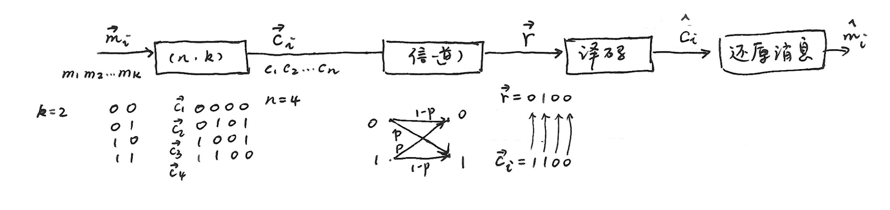

### 错误概率与编码方法
- 转移概率如图：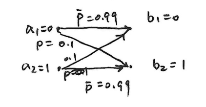
- 采用**简单重复编码**，$k = 1$ ，$n = 3$ ，则$0\rightarrow000$（$\vec{C_{1}}$），$1\rightarrow111$（$\vec{C_{2}}$）
- 已知信道转移概率 $p = 0.01$ ，$\overline{p}=1-p=0.99$ ，转移概率矩阵：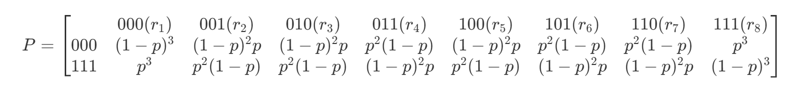
    <!-- $$P =\begin{bmatrix}
        & 000(r_1)  & 001(r_2)  & 010(r_3)  & 011(r_4)  & 100(r_5)  & 101(r_6)  & 110(r_7)  & 111(r_8)\\
    000 & (1-p)^3   & (1-p)^2p  & (1-p)^2p  & p^2(1-p)  & (1-p)^2p  & p^2(1-p)  & p^2(1-p)  & p^3\\
    111 & p^3       & p^2(1-p)  & p^2(1-p)  & (1-p)^2p  & p^2(1-p)  & (1-p)^2p  & (1-p)^2p  & (1-p)^3
    \end{bmatrix}$$ -->
- 译码规则为 $F(\vec{r_{1}})=\vec{C_{1}}$ ，$F(\vec{r_{2}})=\vec{C_{1}}$ ，$F(\vec{r_{3}})=\vec{C_{1}}$ ，$F(\vec{r_{4}})=\vec{C_{2}}$ ，$F(\vec{r_{5}})=\vec{C_{1}}$ ，$F(\vec{r_{6}})=\vec{C_{2}}$ ，$F(\vec{r_{7}})=\vec{C_{2}}$ ，$F(\vec{r_{8}})=\vec{C_{2}}$ 。
- 错误概率 $$P_e=\frac{1}{2}[p^3 + p^2(1 - p)+(1 - p)p^2 + p^2(1 - p)+p(1 - p)^2 + p^2(1 - p)+p(1 - p)^2 + p^3]\approx3\times10^{-4}$$
- 增大 $n$ ，会继续降低平均错误概率 $P_e$ ：
    - $n = 1$ ，$P_e = 0.01$ ；
    - $n = 3$ ，$P_e\approx3\times10^{-4}$ ；
    - $n = 5$ ，$P_e\approx10^{-5}$ ；
    - $n = 6$ ，$P_e\approx4\times10^{-7}$ ；
    - $n = 9$ ，$P_e\approx10^{-8}$ ；
    - $n = 11$ ，$P_e\approx5\times10^{-10}$ 。
- 信息传输率 $R=\frac{H(X)}{n}=\frac{\log M}{n}=\frac{k}{n}\text{ bit/符号}$ 。随着 $n$ 增大，信息传输率减小。思考是否能找到一种编码方法，使 $P_e$ 充分小，且 $R$ 维持在一定水平？

### 有噪信道编码定理（香农第二定理）
#### 信道编码正定理
- **定理**：设有一离散无记忆平稳信道，其信道容量为 $C$ ，只要待传送的信息率 $R < C$ ，则存在一种编码，当输入长度 $n$ 足够大时，译码错误概率任意小。
- **证明**：
    - 消息序列长度为 $k$ ，个数为 $M = 2^k$ ，码长为 $n$ 。记信息传输率 $R=\frac{\log M}{n}=\frac{\log 2^k}{n}=\frac{k}{n}=C - \varepsilon$ （$\varepsilon>0$），则 $k = n(C - \varepsilon)$ ，$M = 2^{n(C - \varepsilon)}$。**只需证当 $n\to\infty$ 时，可使 $P_e\to0$。**
    - **编码**：从 $2^n$ 个矢量集中找出 $2^{n(C - \varepsilon)}$ 个码字组成一组码。
    - **BSC信道**：错误概率 $p<\frac{1}{2}$ ，信道容量 $C = 1 - H(p)$ 。
    - 设发送码字 $\vec{C_{0}}$ ，接收到 $\vec{r_{}}$ ，$\vec{C_{0}}$ 与 $\vec{r_{}}$ 之间的平均汉明距离为 $np$ 。
    - **译码方法**：以 $\vec{r_{}}$ 为球心，以 $np$ 为半径的球体内寻找码字 $\vec{C_{0}}$ 。为保证译码可靠，将球体稍微扩大，令半径为 $n(p+\varepsilon)=np_{\varepsilon}$ ，$\varepsilon>0$ 任意小，用 $S(np_{\varepsilon})$ 表示这个球体。如果球体内只有一个唯一的码字，则判定这个码字为发送的码字 $\vec{C_{0}}$ 。
    - **译码错误概率 $P_e$ 表达式**：
        $$
        \begin{align*}
        P_e &= P\{\vec{C_{0}}\notin S(np_{\varepsilon})\}+P\{\vec{C_{0}}\in S(np_{\varepsilon})\}\cdot P\{\text{找到一个其他码字}\in S(np_{\varepsilon})\}\\
        &\leq P\{\vec{C_{0}}\notin S(np_{\varepsilon})\}+P\{\text{找到一个其他码字}\in S(np_{\varepsilon})\}
        \end{align*}
        $$
    - 根据大数定理，$\vec{C_{0}}$ 与 $\vec{r_{}}$ 之间的汉明距离（即 $\vec{C_{0}}$ 在信道传输中错误比特数）超过平均值 $n(p + \varepsilon)$ 的概率很小。因此当 $n$ 足够大时：
        $$P\{\vec{C_{0}}\notin S(np_{\varepsilon})\} < \delta$$

        $$
        \begin{align*}
        P\{\text{至少有一个其他码字} \in S(np_{\varepsilon})\} &\leq \sum_{\vec{C_{i}} \neq \vec{C_{0}}} P\{\vec{C_{i}} \in S(np_{\varepsilon})\} \\
        &\leq (M - 1)P\{\vec{C_{*}} \in S(np_{\varepsilon})\}
        \end{align*}
        $$ 其中 $P\{\vec{C_{i}} \in S(np_{\varepsilon})\} = \max_{\vec{C_{i}} \neq \vec{C_{0}}} P\{\vec{C_{i}} \in S(np_{\varepsilon})\}$ 。

    - 由此可得：
        $$P_e \leq \delta + (M - 1)P\{\vec{C_{*}} \in S(np_{\varepsilon})\}$$
        其中$\vec{C_{*}} \neq \vec{C_{0}}$，$\vec{C_{*}}$ 为与 $\vec{C_{0}}$ 距离最近的码字
        右式前一项与编码无关，后一项依赖于码字的选择。

    - **随机编码**：从 $2^n$ 个可能的序列中，随机选取 $M$ 个作为有效码字。每次选一个码字有 $2^n$ 种可能，选 $M$ 个码字，共有 $2^{nM}$ 种不同的编码方式。
        - 对于每一种编码方式都有：
            $$P_e \leq \delta + (M - 1)P\{\vec{C_{*}} \in S(np_{\varepsilon})\},\quad \vec{C_{*}} \neq \vec{C_{0}}$$
        - 对 $2^{nM}$ 种可能的编码取平均：
            $$E[P_e] \leq \delta + (M - 1)E[P\{\vec{C_{*}} \in S(np_{\varepsilon})\}]$$
        - 于是，所有可能落在 $S(np_{\varepsilon})$ 内的序列总数为：
            $$N(np_{\varepsilon}) = C_{n}^{0} + C_{n}^{1} + C_{n}^{2} + \cdots + C_{n}^{np_{\varepsilon}} = \sum_{k = 0}^{np_{\varepsilon}} C_{n}^{k}$$
        - 则 $$E[P\{\vec{C_{*}} \in S(np_{\varepsilon})\}] = \frac{N(np_{\varepsilon})}{2^{n}} = \sum_{k = 0}^{np_{\varepsilon}} C_{n}^{k}/2^{n}$$
    - 引用二项式系数不等式 $\sum_{k = 0}^{np_{\varepsilon}} C_{n}^{k} \leq 2^{nH(p_{\varepsilon})}$ （$p_{\varepsilon} < \frac{1}{2}$），可得：$$E[P_e] \leq \delta + M2^{-n[1 - H(p_{\varepsilon})]}\quad (p_{\varepsilon} < \frac{1}{2})$$
        - 式中
            $$
            \begin{align*}
            1 - H(p_{\varepsilon}) &= 1 - H(p + \varepsilon)\\
            &= 1 - H(p) + H(p) - H(p + \varepsilon)\\
            &= C - [H(p + \varepsilon) - H(p)]
            \end{align*}
            $$
        - 因为 $H(p)$ 是 $p$ 的上凸函数，所以有：
            $$
            \begin{align*}
            H(p + \varepsilon) &\leq H(p) + \varepsilon\frac{dH(p)}{dp}\\
            &\leq H(p) + \varepsilon\log\frac{1 - p}{p} \quad (p < \frac{1}{2}, \log\frac{1 - p}{p} > 0)
            \end{align*}
            $$
        - 进而可得 $1 - H(p_{\varepsilon}) \geq C - \varepsilon\log\frac{1 - p}{p}$ 。
        - 令 $\varepsilon_1 = \varepsilon\log\frac{1 - p}{p}$ ，$M = 2^{n(C - \varepsilon_2)}$ ，则：
            $$E[P_e] \leq \delta + 2^{n(C - \varepsilon_2) - n(C - \varepsilon_1)} = \delta + 2^{-n(\varepsilon_2 - \varepsilon_1)}$$
        - 式中 $\varepsilon_2 - \varepsilon_1 = \varepsilon_2 - \varepsilon\log\frac{1 - p}{p}$ ，只要 $\varepsilon$ 足够小，总能满足 $\varepsilon_2 - \varepsilon_1 > 0$ 。当 $n \to \infty$ 时，$E[P_e] \to 0$ 。
    - 因为 $E[P_e]$ 是对所有 $2^{nM}$ 种随机编码求导的平均值，所以必然存在一些码字错误概率 $< E[P_e]$ 。故必存在一种编码，当 $n \to \infty$ 时， $P_e \to 0$ 。

#### 信道编码逆定理
- **逆定理**：设有一离散无记忆平稳信道，其信道容量为 $C$ 。对于任意 $\varepsilon>0$ ，若选用码字总数 $M = 2^{n(C + \varepsilon)}$（信息传输率 $R=\frac{\log M}{n}=C + \varepsilon>C$），则无论 $n$ 取多大，也找不到一种码，使译码错误概率 $P_e$ 任意小。
- **证明**：
    - 已知信息传输率 $R=\frac{\log M}{n}=C + \varepsilon$ ，其中 $M = 2^{n(C + \varepsilon)}$ 为码字总数。
    - 假设 $M$ 个码字等概率分布 $$H(X^n)=\log M = n(C + \varepsilon)$$
        - $n$ 次扩展信道的平均互信息为 $$I(X^n;Y^n)=H(X^n)-H(X^n|Y^n)\leq nC$$
        - 由此可得 $$H(X^n|Y^n)\geq H(X^n)-nC = n\varepsilon$$
        - 根据费诺不等式：
            $$
            \begin{align*}
            H(X^n|Y^n)&\leq H(P_e,1 - P_e)+P_e\log(M - 1)\\
            &\leq 1+P_e\log M\\
            &=1+P_e n(C + \varepsilon)
            \end{align*}
            $$
        - 由于 $n\varepsilon\leq H(X^n|Y^n)\leq 1+P_e n(C + \varepsilon)$ ，所以有：
            $$
            \begin{align*}
            n\varepsilon&\leq 1+P_e n(C + \varepsilon)\\
            P_e&\geq\frac{n\varepsilon - 1}{n(C + \varepsilon)}=\frac{\varepsilon+\frac{1}{n}}{C + \varepsilon}
            \end{align*}
            $$
        - 当 $n\to\infty$ 时， $P_e$ 不会趋于 $0$ 。

    - 因此，当信息传输率 $R>C$ 时，无法完成消息的无错误传输。香农第二定理和它的逆定理表明：在任何信道中，信道容量等于进行可靠传输的最大信息传输率。