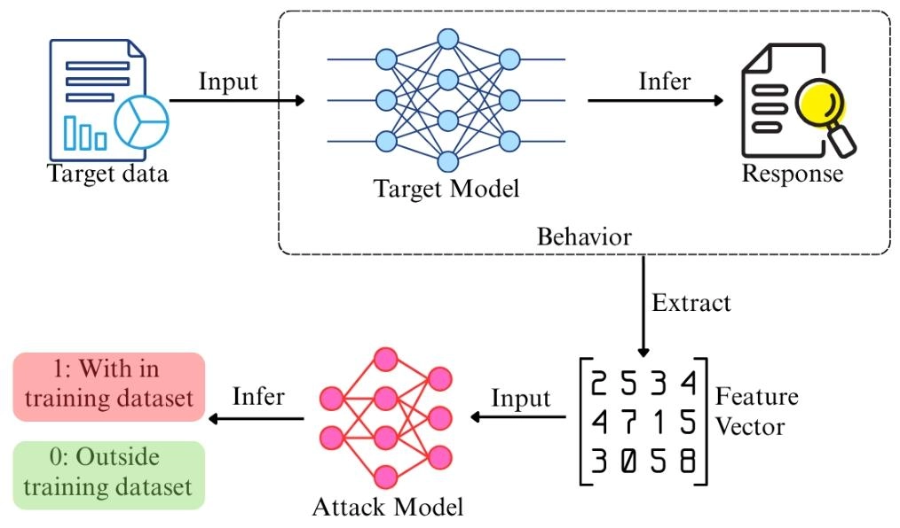
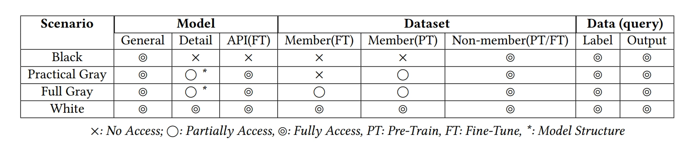
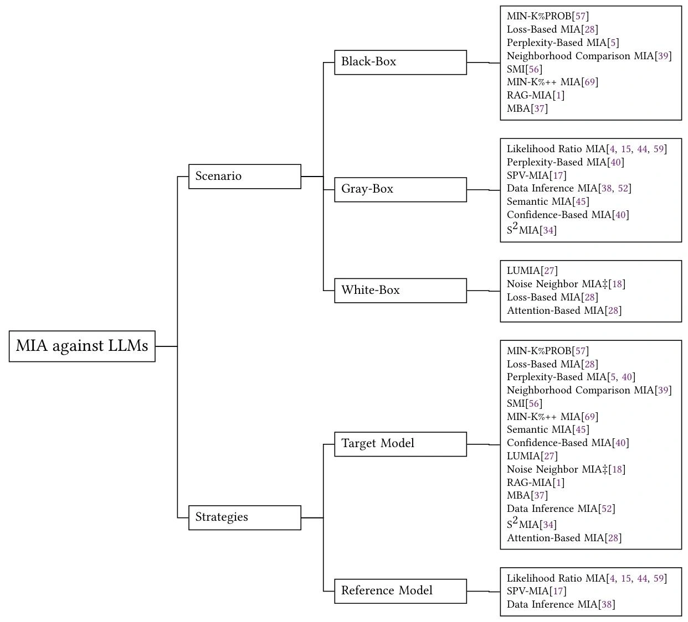
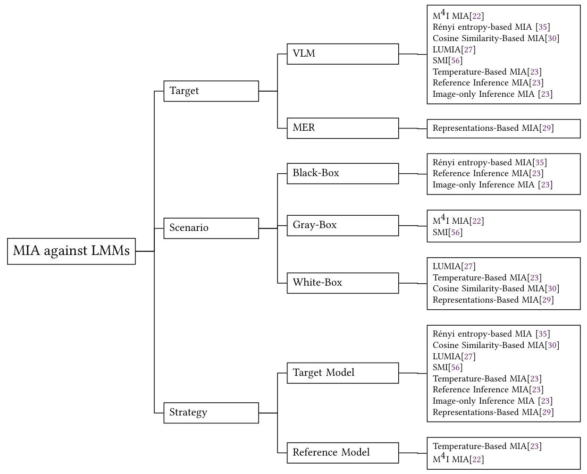

> 随着大规模预训练模型（Large Language Models, LLMs）在各类任务中的广泛应用，模型隐私安全问题日益凸显。成员推理攻击（Membership Inference Attacks, MIA）作为一种重要的隐私攻击手段，旨在判断某个数据样本是否被用于训练特定模型。在阅读综述《Membership Inference Attacks on Large-Scale Models: A Survey》后，我将笔记整理如下，发布于博客存档。

# MIA 简介
- **成员推理攻击（Membership Inference Attacks, MIA）**：旨在通过观察目标模型在推理阶段的行为，确定特定的数据点或数据集是否被包含在该模型的训练集中。
    - 给定目标模型 $f_{target}$ 及其训练数据集 $D_{train}={(x_{i}, y_{i})}_{i=1}^N$
    - 判断是否 $(x_{target}, y_{target}) \in D_{train}$中
- 通用流程：
    
- 攻击动机：
    - 恶意：
        - 作为攻击者披露敏感训练数据的手段，导致隐私泄露（如医疗记录、个人信息等）
        - 作为更复杂攻击的基础步骤
    - 正当：
        - 作为法律手段验证未经授权的数据使用（如版权追溯）
        - 作为开发者部署前评估模型过拟合风险的诊断工具

# MIA 分类
论文提出了一套针对大模型开发生命周期的分类框架：

## 基于攻击阶段的分类
- **预训练阶段**：
    - 模型开发流程中最初始最基础的阶段，让模型学会理解和生成语言。
    - 攻击者试图识别用于预训练大模型的海量数据中的成员样本。
- **微调阶段**：
    - 在预训练模型基础上针对特定任务进行微调，使其适应特定应用场景，如生成代码、解答特定领域问题等。
    - 攻击者针对微调数据集进行攻击，此时数据与个体用户、组织更为相关，隐私风险更高。
- **模型对齐阶段**：
    - 通过人类反馈（Reinforcement Learning from Human Feedback, RLHF）等技术，使模型生成的内容更符合人类价值观和伦理规范。
    - 对齐方法依赖高度隐私敏感的用户偏好数据来指导模型行为，因此攻击者通过 MIA 可能揭露特定的偏好样本。
- **检索增强生成（Retrieval-Augmented Generation, RAG）阶段**：
    - 结合外部知识库或文档来增强生成能力，使模型能够基于最新信息或指定的知识进行回答。
    - 在此背景下，MIA 的重点在于确定特定文档或记录是否存在于检索数据库中。由于这些数据库可能包含专有资源或机密信息，攻击可能导致知识产权泄露和敏感材料的暴露。

## 基于对抗知识的分类
- **黑盒场景**（Black-box Scenario）：
    - 攻击者仅能通过查询目标模型并观察其输出结果来进行攻击。
    - 这种攻击假设攻击者对模型的内部结构和参数一无所知，依赖于输入输出行为进行推断，可获取的信息包括：
        - 模型返回的查询输出
        - 查询数据的真实标签
        - 从前两者得到的损失或统计数据
        - 关于目标模型的有限先验知识（如模型类型）
        - 辅助非成员数据
- **白盒场景**（White-box Scenario）：
    - 攻击者对目标模型的内部结构、参数和训练数据有完全的访问权限。
    - 这种攻击利用对模型的深入了解，分析其内部机制来推断成员身份，可获取的信息包括：
        - 模型的完整架构和参数（如权重、偏置、激活函数等）
        - 训练过程中使用的优化器和超参数（如学习率、批大小等）
        - 模型的中间计算结果（如隐藏层激活、注意力权重等）
        - 完整的训练数据集
    - 通过官方 API 获取的额外信息（如嵌入、注意力分数等），也可视为白盒攻击的一种形式。
- **灰盒场景**（Gray-box Scenario）：
    - 这种攻击介于黑盒和白盒之间，攻击者对目标模型有额外的有限了解，例如模型架构、训练方法或部分参数。
    - 可以分为两类：
        - **实际灰盒场景**（Practical Gray-box Scenario）：攻击者对预训练模型有部分了解（包括其结构细节和部分训练数据集），但无法访问微调数据集
        - **完全灰盒场景**（Full Gray-box Scenario）：在实际灰盒的基础上，攻击者还可以访问部分微调数据集

## 基于攻击策略的分类
- **基于目标模型的攻击**：攻击者直接观察目标模型的行为来推断成员信息，依赖于预测置信度、损失值、分类正确性等指标。
    - 需要更少的计算资源和目标先验知识。
- **基于参考模型的攻击**：攻击者训练一个或多个“影子模型”来模拟目标模型的行为，通过比较目标模型和影子模型在成员和非成员样本上的表现差异来进行推断。
    - 性能更强（参考模型放大了成员和非成员之间的差异），但更依赖于对目标模型的精确模拟和对结构相似但不重叠的数据集的访问。

# MIA against LLMs
## 基于黑盒与目标模型
- **基于基础指标**：利用成员数据通常具有更低损失值或困惑度的直觉。
    - **基于损失的成员推理攻击**（Loss-Based MIA）：机器学习模型对于训练数据往往表现出更低的预测误差。
        $$
        \mathcal{L}\left(f_{target}\left(x_{target}\right), y_{target}\right) < \tau
        $$
    - **基于困惑度的成员推理攻击**（Perplexity-Based MIA）：机器学习模型对于训练数据通常表现出更低的困惑度。
        $$
        \exp \left(-\frac{1}{N} \sum_{i=1}^{N} \log p\left(x_{i} | x_{1}, ..., x_{i-1}\right)\right) < \tau
        $$
- **基于扰动校准**：
    - **邻域比较成员推理攻击**（Neighborhood Comparison MIA）：通过在输入中添加扰动并观察损失值变化来校准判断依据。
        $$
        \frac{1}{M} \sum_{i=1}^{M} \left( \mathcal{L}(f_{\text{target}}, X) - \mathcal{L}(f_{\text{target}}, X_i') \right) < \tau
        $$
    - **自比较成员推理攻击**（Self-Comparison Membership Inference, SMI）：对于目标数据集的每个序列进行分割，前半部分不变，后半部分添加扰动，通过比较原始序列和扰动序列的后半部分的平均负对数似然（Average Negative Log-Likelihood, A-NLL）来进行判断。
        $$
        \text{A-NLL}(X) = -\frac{1}{N} \sum_{i=1}^{N} \log p\left(x_i \mid x_1, \dots, x_{i-1}\right)
        $$
- **基于统计分布**：MIN-K% PROB 及其改进版 MIN-K%++ 利用了“离群值”（模型极少见到的词）在成员数据中概率更高的原理，通过统计分布差异进行推断。
    - **MIN-K% PROB**：利用非成员样本中更可能包含低概率词的直觉，计算序列中概率最低的 K% 词的平均对数概率。
        $$
        \text{MIN-K% PROB}(X) = \frac{1}{T} \sum_{x_i \in X_{\text{MIN-}K\%}} \log p\left(x_i \mid x_1, \dots, x_{i-1}\right) > \tau
        $$
    - **MIN-K%++**：基于最大似然训练过程中，训练样本往往是模型学习概率分布的局部最大值的假设，计算序列中每个 token $x_i$ 的可能性。
        $$
        \text{MIN-K%++}(x_i) = \frac{\log p\left(x_i \mid x_1, \dots, x_{i-1}\right) - \mu}{\sigma}
        $$
- **RAG 专属攻击**：
    - **基于提示词的成员推理攻击**（RAG-MIA）：通过提示词工程诱导模型确认上下文中是否包含特定文档，典型 Prompt：`Dose this: {Target Data} apper in the context? Answer yes or no.`
    - **基于掩码的成员推理攻击**（Mask-Based MIA, MBA）：利用成员文档在被掩码处理后，模型生成正确答案的概率更高的直觉。

## 基于灰盒与参考模型
- **基于统计分布**：
    - **似然比成员推理攻击**（Likelihood Ratio MIA）：通过似然比检验比较目标模型和参考模型在成员和非成员样本上的输出概率分布差异。成员情况的置信度分布可以从用目标点训练的影子模型中估计，而非成员分布则从不用目标点训练的参考模型中估计。下式中 $\phi(x, y)$ 是目标模型为正确标签分配的对数几率缩放概率，$\mu_{\theta^\prime}$、$\sigma_{\theta^\prime}^{2}$ 是使用目标数据训练的影子模型上该统计量的均值和方差，而 $\mu_{\theta_r}$、$\sigma_{\theta_r}^{2}$ 则来自未使用目标数据训练的参考模型。
        $$
        \begin{aligned}
        &\phi(x,y) = \log \left( \frac{f_{\text{target}}(x)_y}{1 - f_{\text{target}}(x)_y} \right) \\
        &\Lambda(x,y) = \frac{p(\phi(x,y) \vert \mathcal{N}(\mu_{\theta^\prime}, \sigma_{\theta^\prime}^2))}{p(\phi(x,y) \vert \mathcal{N}(\mu_{\theta_r}, \sigma_{\theta_r}^2))} > \tau
        \end{aligned}
        $$
    - **权重增强似然比成员推理攻击**（Weight Enhanced Likelihood MIA, WEL-MIA）：直接在目标数据集上微调预训练模型，将其作为参考模型，并为每个标记的似然比分配权重。
    - **偏好数据成员推理攻击**（Preference Data MIA, PREMIA）：针对近邻策略优化（PPO/RLHF）和直接偏好优化（DPO）两种对齐方法，通过以下两种方式推断成员身份：
        - 对比对齐模型与参考模型对仅包含提示词和响应的目标数据的似然比；
        - 对于包含完整提示词、偏好响应和非偏好响应的待推断数据，对比偏好响应与非偏好响应的似然比差异。
- **基于扰动校准**：
    - **自校准概率变异成员推理攻击**（Self-calibrated Probability Variation MIA, SPV-MIA）：假设目标模型的响应会具有与训练数据集相似的数据结构，使用从目标 LLM 生成的数据来训练参考模型。通过对输入施加对称扰动 \(\pm Z_{n}\) 来捕捉局部分布敏感性，利用概率变异指标 $\tilde{p}_{\theta}(X)$ 来衡量成员身份。
        $$
        \begin{aligned}
        &\overline {p}_{\theta }\left( X\right) \approx \frac {1}{2N}\sum _{n}^{N}\left( p_{\theta }\left( X+Z_{n}\right) +p_{\theta }\left( X-Z_{n}\right) \right) -p_{\theta }\left( X\right) \\
        &\Delta \tilde{p}(X)=\tilde{p}_{\theta}(X)-\tilde{p}_{\theta_{r}}(X) > \tau
        \end{aligned}
        $$
- **基于多指标融合**：
    - **数据推断成员推断攻击**（Data Inference MIA）：整合多种攻击指标（如 Zlib 比率、MIN-K%、困惑度等）来训练综合分类器。

## 基于灰盒与目标模型
- **语义成员推理攻击**（Semantic MIA, SMIA）：在邻域比较的基础上，引入外部嵌入模型测量扰动前后的**语义距离** $\phi(x_{i})-\phi(x_{i}^{\prime})$，并使用神经网络根据损失差异和语义位移进行决策。
    $$
    P(Member)=\frac {1}{N}\sum _{i=1}^{N}f_{attack\_NN}\left( \mathcal {L}(f_{target},x_{i})-\mathcal {L}(f_{target},x_{i}^{\prime}),\phi(x_{i})-\phi(x_{i}^{\prime})\right)
    $$
- **语义相似度成员推理攻击**（Semantic Similarity MIA, S^2^MIA）：专门针对 RAG 系统，基于目标模型预测成员数据的掩码术语与真实值的语义相似度更高的假设。首先将目标数据 $X$ 分割为用于查询的 $x^{q}$ 和作为答案的 $x^{a}$，$X=x^{q} \oplus x^{a}$，然后向目标模型输入 $x^{q}$ 和令其生成剩余输入的提示词，利用响应 $x_{g}$ 计算 BLEU 分数来判断语义相似度，并计算困惑度进行双重验证。
    $$
    \begin{aligned}
    &S_{sem} = \text{BLEU}(x^a, x_g) > \tau_{sem} \\
    &S_{ppl} < \tau_{ppl}
    \end{aligned}
    $$

## 基于白盒与目标模型
- **噪声邻域成员推理攻击**（Noise Neighbor, NNIA）：基于邻域比较方法，依据机器学习模型对训练数据的敏感性更高的直觉，在嵌入层（Embedding Layer）直接添加高斯噪声，比文本层扰动更稳定、更可控。
- **基于注意力的成员推理攻击**（Attention-Based MIA）：针对微调后的 LLM，利用注意力机制中成员数据通常获得更高注意力分数的观察，分析注意力权重分布来推断成员身份。对于每个输入，从注意力层中提取自注意力向量 ${a_i}_1^N$，并使用负熵计算浓度分数，该分数越低表示注意力越集中。使用每层句子的 $C(a)$ 分数的平均值即某些百分位数来表示该句子，然后输入逻辑回归分类器来推断成员归属。
    $$
    C(a)=\sum_{i = 1}^{N}a_{i}\log(a_{i})
    $$
- **基于线性探针的模型内部激活利用**（Linear probe-based Utilization of Model Internal Activations, LUMIA）：通过直接检查目标模型的内部激活来推断成员信息，通过在各 Transformer 层添加轻量级线性探针（LP），在输出处收集各层神经元的激活向量 $a_{l}(x_i)$，计算各层输入的平均隐藏激活值 $A_{l}(X)$，再输入各层对应 LP 进行成员推断。
    $$
    A_{l}(X)=\frac{1}{N}\sum_{i=1}^{N}a_{l}(x_i)
    $$

# MIA against LMMs
相比于 LLMs，大规模多模态模型（Large Multimodal Models, LMMs）具有新的风险点：

- LMM 训练使用的多模态数据（如音频、视频、图像等）可能更涉及隐私问题，一旦泄露后果可能更加严重。
- LMM 通常包含更复杂的架构，所添加的组件可能会向攻击者泄露更多信息或引入新的推理路径。
- LMM 的各个模态基于跨模态交互进行配对（如一个人的视觉特征和声音特征），这种依赖性可能会为攻击者创造新的途径。

## 基于黑盒与目标模型
- **基于 Rényi 熵的成员推理攻击**（Rényi entropy-based MIA）：基于目标模型在对训练集中数据进行推理时信心更高的假设，基于 MaxRényi-K% 分数来预测，该分数衡量前 K% 最大 Rényi 熵的平均值越小则信心越高，因此目标数据出现在训练集中的可能性越大。
- **自比较成员推理攻击**（SMI）：保持图像和问题不变，仅对文本答案进行改写并比较似然变化。
- **参考推理成员推理攻击**（Reference-Inference MIA）：计算目标数据集和参考数据集的生成响应与真实结果的相似度，并使用 z-检验进行对比。
- **仅图像推理成员推理攻击**（Image-Only Inference MIA）：基于模型对成员数据会产生更一致的响应的直觉，通过多次查询同一图像计算模型生成响应的平均相似度，一致性越高则成员可能性越大。

## 基于灰盒与参考模型
- **M^4^I MIA**：针对视觉语言模型（Vision-Language Models, VLMs），结合多种模态特征进行成员推断。
    - **基于度量的方法**（Metric-Based M^4^I, MBM^4^I）：基于成员样本生成的 caption 与其真实标注的相似度更高的观察，通过输出文本的相似度指标（BLEU/ROUGE）构建特征向量，再利用在影子模型和参考成员/非成员数据集上训练的二分类攻击模型进行分类。
    - **基于特征方法**（Feature-Based M^4^I, FBM^4^I）：使用预训练的图像和文本编码器以及对齐层组成的多模态特征提取器提取联合特征，然后由在影子模型上训练的攻击分类器对图像-文本对的联合特征进行分析。

## 基于白盒与目标模型
- **基于余弦相似度**
    - **基于余弦相似度的成员推理攻击**（Cosine Similarity-Based MIA）：基于 CLIP 等 VLM 模型最大化匹配图像文本对之间余弦相似度的训练目标，计算图像与文本编码向量间的匹配得分：
        $$
        CS(f_{img}(x_{img}), f_{txt}(x_{txt})) > \tau
        $$
    - **增强增强攻击**（Augmentation-Enhanced Attack, AEA）：基于数据增强后的成员数据余弦相似度更加敏感的发现，利用一组 K 变换 $\{T_k(\cdot)\}_{k=1}^K$ 放大成员信号以提升攻击准确性。
        $$
        CS\left(f_{img}(x_{img}), f_{txt}(x_{txt})\right) + \sum_{k=1}^{K}\left[CS\left(f_{img}(x_{img}), f_{txt}(x_{txt})\right) - CS\left(f_{img}(T_k(x_{img})), f_{txt}(T_k(x_{txt}))\right)\right] > \tau
        $$
    - **弱监督攻击**（Weakly Supervised Attack, WSA）：在 AEA 基础上，用非成员数据 $D_{out}$ 集校准阈值，然后借助 $D_{out}$ 和可疑数据集 $D_{sus}$（由相似度超过阈值的数据组成）训练二分类器作为攻击模型进行成员推断。
- **基于线性探针的模型内部激活利用**（LUMIA）：将线性探针连接到文本和视觉编码器的输出而非 LLM 中的 Transformer 层，以探针的 AUC 分数作为成员推断依据。
- **基于表征的成员推理攻击**（Representations-Based MIA）：利用子单峰编码器产生的内部表征作为成员推理的基础，通过合并相同数量的成员与非成员数据构建攻击数据集并输入目标模型以获取其表征，训练一个密集神经网络二分类器进行成员推断。

## 基于白盒与参考模型
- **基于温度的成员推理攻击**（Temperature-Based MIA）：基于成员数据与非成员数据会随目标模型温度变化表现不同行为的直觉。首先在参考数据集上训练的影子模型，然后使用多个与目标数据集规模相同的参考成员/非成员数据集向影子模型查询，计算各自响应与真实值之间的相似度，得到温度 $T_i$ 下的均值 $\mu_{T_i}$ 和标准差 $\sigma_{T_i}$，并用这些特征向量 $V_{S_i}$ 训练二分类攻击模型进行成员推断。
    $$
    V_{T_i} = \left[\mu_{T_1}, \sigma_{T_1}, \dots, \mu_{T_n}, \sigma_{T_n}\right]
    $$

# 参考文献
1. Wu H, Cao Y. Membership inference attacks on large-scale models: A survey[J]. arXiv preprint arXiv:2503.19338, 2025.

