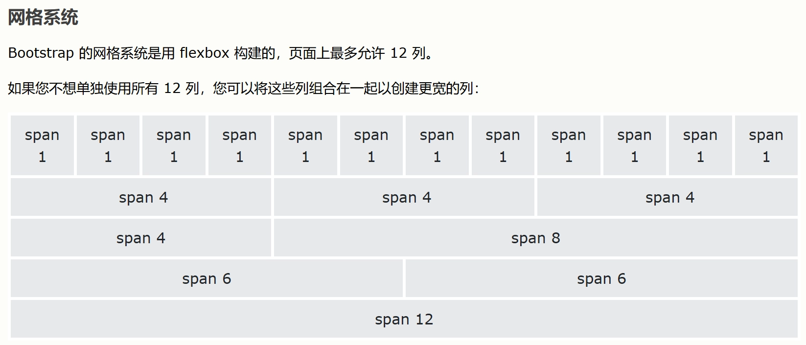

> 本笔记基于上海交通大学 *唐俊华老师* 2025-2026 学年秋季学期教学内容进行整理，部分代码及图片均来自唐老师的讲义，若有侵权请联系删除。

# 课程简介

在这门课程中，我们将学习 Web 开发的基础知识，包括 HTML、CSS 和 JavaScript 的基本语法和用法。通过实践项目，我们最终将使用 Django 框架开发一个简单的 Web 应用。以下是本门课程的部分作业内容：

<a href="/original/about/" name="about.webp" target="_blank" class="LinkCard">个人简介</a>

<a href="/original/resume/" name="resume.webp" target="_blank" class="LinkCard">个人简历</a>

<a href="/original/todolist/" name="todolist.webp" target="_blank" class="LinkCard">待办清单</a>

# Lab1 - HTML

## 快速上手：基于 Flask Web 框架快速搭建

1. 安装flask
    ```bash
    pip install flask
    ```
2. 创建应用文件

    创建一个名为 `app.py` 的文件，存放在`flaskProject` 目录下，并输入以下代码：（文件名和目录名称可以任意取）
    ```python
    from flask import Flask

    # 创建Flask应用实例
    app = Flask(__name__)

    # 定义路由和视图函数
    @app.route('/')
    def hello_world():
        return 'Hello, World!'

    # 添加一个主页，渲染一个HTML模板
    @app.route('/home') 
    def home():
        return render_template('home.html')

    # 运行应用
    if __name__ == '__main__':
        app.run(debug=True)
    ```
3. 在项目主目下创建 `templates` 目录，再新建 `home.html` 文件
    ```html
    <!DOCTYPE html>
    <html lang="en">
    <head>
        <meta charset="UTF-8">
        <meta name="viewport" content="width=device-width, initial-scale=1.0">
        <title>Home</title>
    </head>
    <body>
        <h1>Welcome to the Home Page!</h1>
    </body>
    </html>
    ```
4. 执行 app.py
    ```bash
    python app.py
    ```

## HTML 基础
### 2.1 编码：charset（head）
```html
<meta charset="UTF-8">
```

### 2.2 页签：title（head）
```html
<head>
    <meta charset="UTF-8">
    <title>我的主页</title>
</head>
```

### 2.3 标题：h1~h6
```html
<!DOCTYPE html>
<html lang="en">
<head>
    <meta charset="UTF-8">
    <title>我的主页</title>
</head>
<body>
    <h1>1级标题</h1>
    <h2>2级标题</h2>
    <h3>3级标题</h3>
    <h4>4级标题</h4>
    <h5>5级标题</h5>
    <h6>6级标题</h6>
</body>
</html>
```

### 2.4 文本标签

#### 块级标签
`div`：一个人占一整行。
```html
<!DOCTYPE html>
<html lang="en">
<head>
    <meta charset="UTF-8">
    <title>我的主页</title>
</head>
<body>
    <div>上海交通大学</div>
    <div>计算机学院（网络空间安全学院）</div>
</body>
</html>
```

#### 行内标签/内联标签
`span`：自己多大占多少。
```html
<!DOCTYPE html>
<html lang="en">
<head>
    <meta charset="UTF-8">
    <title>我的主页</title>
</head>
<body>
    <span>上海交通大学</span>
    <span>计算机学院（网络空间安全学院）</span>
</body>
</html>
```

#### 其他
- 换行：`<br />`
- 空格：`&nbsp;`
- 水平线：`<hr />`
- 加粗：`<b>加粗</b>` 或 `<strong>加粗</strong>`
- 斜体：`<i>斜体</i>` 或 `<em>斜体</em>`
- 删除线：`<del>删除线</del>`
- 下划线：`<u>下划线</u>`
- 下标：`H<sub>2</sub>O`
- 上标：`x<sup>2</sup>`

### 2.5 超链接

```html
<!-- 跳转到其他网站 -->
<a href="http://www.sjtu.edu.cn">点击跳转</a>
<!-- 跳转到自己网站其他的地址 -->
<a href="http://127.0.0.1:5000/get/news">点击跳转</a>
<a href="/get/news">点击跳转</a>
```

- 注意：跳转到自己网站的其他地址(/get/news)，需要
    1. 在`web.py` 中定义地址/get/news的路径:
    ```python
    @app.route("/get/news")
    def get_news():
        return render_template("get_news.html")
    ```
    2. 在`templates` 目录下创建`get_news.html`文件


- 在新的Tab页面打开链接：
    ```html
    <!-- 当前页面打开 -->
    <a href="/get/news">点击跳转</a>

    <!-- 新的Tab页面打开 -->
    <a href="/get/news" target="_blank">点击跳转</a>
    ```

### 2.6 图片

```html


<!-- 直接显示别人的图片地址（防盗链） -->

<!-- 显示自己项目中的图片 -->

```

- 显示自己的图片：
	- 自己项目中创建：static目录，图片要放在static
	- 在页面上引入图片
- 关于设置图片的高度和宽度
    ```html
    
    
    ```

### 2.7 列表
- 无序列表（ul）
    ```html
    <ul>
        <li>电气工程学院</li>
        <li>自动化与感知学院</li>
        <li>计算机学院（网络空间安全学院、密码学院）</li>
        <li>集成电路学院</li>
    </ul>
    ```
- 有序列表（ol）
    ```html
    <ol>
        <li>电气工程学院</li>
        <li>自动化与感知学院</li>
        <li>计算机学院（网络空间安全学院、密码学院）</li>
        <li>集成电路学院</li>
    </ol>
    ```

### 2.8 表格
表格数据可以是图片、链接等
```html
<table border="1">
    <thead>
    	<tr>  <th>姓名</th>  <th>学号</th>   <th>专业</th>  </tr>
    </thead>
    <tbody>
    	<tr>  <td>Alice</td>  <td>12345</td>  <td>信息安全</td>   </tr>
        <tr>  <td>Bob</td>  <td>12346</td>  <td>信息安全</td>   </tr>
    </tbody>
</table>
```

### 2.9 表单
```html
<form action="/submit" method="post">
    账号: <input type="text" name="username" /><br />
    密码: <input type="password" name="password" /><br />
    <input type="submit" value="登录" />
</form>
```

#### 2.9.1 input标签

```html
<!-- 文本框 -->
<input type="text" />
<!-- 密码框 --> 
<input type="password">
<!-- 文件框 -->
<input type="file"> 

<!-- 单选按钮 -->
<input type="radio" name="n1">男
<input type="radio" name="n1">女
<!-- 复选框 -->
<input type="checkbox">篮球
<input type="checkbox">足球

<!-- 普通的按钮 -->
<input type="button" value="提交">
<!-- 提交表单 -->
<input type="submit" value="提交">
```

#### 2.9.2 select标签
```html
<select>
    <option>北京</option>
    <option>上海</option>
    <option>深圳</option>
</select>

<select multiple>
    <option>北京</option>
    <option>上海</option>
    <option>深圳</option>
</select>
```

#### 2.9.3 textarea标签

```html
<textarea></textarea>
```

## Web 请求交互流程和数据提交
1. 网站请求的流程
    
2. 一大堆的标签
    ```
    h/div/span/a/img/ul/li/table/input/textarea/select
    ```
3. 网络请求
    - 在浏览器的URL中写入地址，点击回车，访问。
        ```
        浏览器会发送数据过去，本质上发送的是字符串：
        "GET /explore http1.1\r\nhost:...\r\nuser-agent\r\n..\r\n\r\n"

        浏览器会发送数据过去，本质上发送的是字符串：
        "POST /explore http1.1\r\nhost:...\r\nuser-agent\r\n..\r\n\r\n数据库"
        ```
4. 浏览器向后端发送请求:页面上的数据，通过`form`标签提交到后台： 
    - `form`标签包裹要提交的数据的标签。
        - 提交方式：`method="get"`
        - 提交的页面：`action="/xxx/xxx/xx"`
        - 在form标签里面必须有一个submit标签。
        - 在form里面的一些标签：input/select/textarea 一定要写name属性 `<input type="text" name="uu"/>`
    - GET 请求【URL方法 / 表单提交】
        - 现象：GET请求、跳转、向后台传入数据数据会拼接在URL上。
            ```
            https://www.sogou.com/web?query=安卓&age=19&name=xx
            ```
        - 注意：GET请求数据会在URL中体现。
    - POST 请求【表单提交】
        - 现象：提交数据不在URL中而是在请求体中。

## 注释
- HTML的注释
    ```html
    <!-- 注释内容 -->
    ```
- CSS的注释，`<style>` 代码块
    ```css
    /* 注释内容 */
    ```
- JavaScript的注释，`<script>` 代码块
    ```javascript
    // 注释内容
    /* 注释内容 */
    ```


# Lab2 - CSS

## CSS 应用方式

### 在标签上
```html

<div style="color:red;">上海交通大学</div>
```

### 在head标签中写style标签（主要用法）
```html
<!DOCTYPE html>
<html lang="en">
<head>
    <meta charset="UTF-8">
    <title>Title</title>
    <style>
        .c1{
            color:red;
        }
    </style>
</head>
<body>
    <h1 class='c1'>用户登录</h1>
</body>
</html>

```

### 写到文件中
将下列式样保存为`common.css` （注意写到文件里的式样不需要`<style>`标签）
```css
.c1{
    color: blue;
    height:100px;
}
.c2{
    color:red;
}
```
在HTML文件中用`<link />` 标签引入，注意在`<head> </head>` 里面引用css文件
```html
<!DOCTYPE html>
<html lang="en">
<head>
    <meta charset="UTF-8">
    <title>Title</title>
    <link rel="stylesheet" href="common.css" />
</head>
<body>
    <h1 class='c1'>用户登录</h1>
</body>
</html>
```

## CSS 选择器

- 选择器的优先级（特异性/权重）从高到低排序
    1. 内联样式（标签上写style属性）
    2. ID选择器（#id）
    3. 类选择器（.class）、属性选择器（[type='text']）、伪类选择器（:hover）
    4. 标签选择器（div、h1等）、伪元素选择器（::before、::after）
    5. 通用选择器（*）
- 选择器的使用建议
    - 多用：类选择器、标签选择器、后代选择器
    - 少用：属性选择器、ID选择器
- 关于多个样式 & 覆盖的问题：后面定义的样式覆盖前面的定义
    - 补充：强制不让后面的式样覆盖：使用 `!important`

### 通用选择器
- `*` 选择器：适用于所有HTML元素。它是最广泛的选择器，具有最低的特异性（权重为0-0-0），意味着它很容易被其他选择器覆盖。
- 常见用途：
    - 重置默认的边距和填充;设置全局盒模型（box-sizing）;
    - 应用全局过渡效果;
    - 设置基本字体和颜色。
- 示例：

```css
* {
    margin: 0;
    padding: 0;
    box-sizing: border-box;
    font-family: 'Segoe UI', Tahoma, Geneva, Verdana, sans-serif;
}
```

### ID选择器
- 唯一性选择器
- 示例：选择ID为`c1`的元素

```css
#c1{
    color: red;
}
```

```html
<div id='c1'></div>
```

### 类选择器
- 最常用的选择器
- 示例：选择`class`为`c1`的元素

```css
.c1{
    color: red;
}
```
  
```html
<div class='c1'></div>
```

### 标签选择器
- 示例：选择标签为`div`的元素

```css
div{
    color: blue;
}
```

```html
<div>content</div>
```

### 属性选择器
- 选择具有特定属性或属性值的元素
- 示例：

```css
/*适用于属性为 type=`text` 的输入框*/
input[type='text']{
    border: 1px solid red;
} 
/*适用于属性为 xx=`456`并且class=`v1` 的元素*/
.v1[xx="456"]{
    color: gold;
} 
```

```html
<input type="text">
<input type="password">

<div class="v1" xx="123">s</div>
<div class="v1" xx="456">f</div>
<div class="v1" xx="999">a</div>
```

### 后代选择器
- 选择某个元素内部的所有指定后代元素
- 示例：

```css
/*选择所有在类名为“yy”的元素内部的li元素*/
.yy li{
    color: pink;
}
/* 选择所有直接父元素为类名为“yy”的元素的a元素（即直接子元素a）*/
.yy > a{
    color: dodgerblue;
}
```

```html
<div class="yy">
    <a>百度</a>
    <div>
        <a>谷歌</a>
    </div>
    <ul>
        <li>美国</li>
        <li>日本</li>
        <li>韩国</li>
    </ul>
</div>
``` 

### 伪类选择器
- 选择元素的特定状态
- 常见伪类：
    - `:hover`：当用户将鼠标悬停在元素上时应用样式
    - `:focus`：当元素获得焦点时应用样式
    - `:nth-child(n)`：选择父元素的第n个子元素
    - `:first-child`：选择父元素的第一个子元素
    - `:last-child`：选择父元素的最后一个子元素
    - `:not(selector)`：选择不匹配指定选择器的元素
- 示例：

```css
.c1:hover{
    color: green;
}
```


## CSS 样式
### 高度和宽度 (height & width)
- 单位：`px` / `%` / `em` / `rem`
    - `px`：像素，绝对单位
    - `%`：百分比，相对于父元素的宽度或高度
    - `em`：相对于当前元素的字体大小
    - `rem`：相对于根元素（通常是html）的字体大小
- 注意事项：
    - 宽度支持百分比。
    - 行内标签：默认无效
        - 比如：为`<span>`标签设置高度和宽度无效
    - 块级标签：默认有效

```css
.c1{
    height: 300px;
    width: 500px;
}
```

### 字体设置
- 常用的字体属性
    - 颜色: `color`
    - 大小: `font-size`
    - 加粗: `font-weight`
    - 字体格式: `font-family`

```css
.c1{
    color: #00FF7F;
    font-size: 58px;
    font-weight: 600;
    font-family: Microsoft Yahei;
    text-shadow: 2px 2px 4px rgba(0, 0, 0, 0.3); /*水平阴影、垂直阴影、模糊半径、颜色*/
    border-bottom: 2px solid #3498db;
}
```

### 文字对齐方式 (text-align & line-height)
- 水平对齐方式：`text-align`
    - `left`：左对齐
    - `center`：居中对齐
    - `right`：右对齐
    - `justify`：两端对齐
- 垂直对齐方式：`line-height`
    - 通过设置行高来实现垂直居中
    - 行高通常设置为与容器高度相同的值

```css
.c1{
    text-align: center; /* 水平方向居中 */
    line-height: 59px; /* 垂直方向居中 */
}
```

### 背景
- 常用的背景属性
    - 背景颜色: `background-color`
        - 颜色值可以是：颜色名称、十六进制颜色值、RGB颜色值、RGBA颜色值
    - 背景图片: `background-image`
        - 语法：`url(图片地址) center center/cover no-repeat;`，
            - `center center`：背景图片位置，水平居中，垂直居中
            - `cover`：背景图片大小，覆盖整个容器
            - `no-repeat`：背景图片不重复
    - 背景重复: `background-repeat`
    - 背景位置: `background-position`
    - 背景大小: `background-size`

```css
.c1{
    background-color: #5f5750;
    background-image: url('/static/bg1.jpg') center center/cover no-repeat;
}
```

### 浮动 (float)
- `float` 属性用于将元素从正常的文档流中取出，并将其向左或向右浮动，从而允许其他内容环绕它。
- 常见值：
    - `left`：将元素向左浮动
    - `right`：将元素向右浮动
    - `none`：默认值，元素不浮动，保持在正常的文档流中
    - `inherit`：元素继承其父元素的浮动属性

```html
<!DOCTYPE html>
<html lang="en">
<head>
    <meta charset="UTF-8">
    <title>Title</title>
</head>
<body>
    <div>
        <span>左边</span>
        <span style="float: right">右边</span>
    </div>
</body>
</html>
```

- 注意：div默认块级标签，如果浮动起来，就不一样了。

```html
<!DOCTYPE html>
<html lang="en">
<head>
    <meta charset="UTF-8">
    <title>Title</title>
    <style>
        .item{
            float: left;
            width: 280px;
            height: 170px;
            border: 1px solid red;
        }
    </style>
</head>
<body>
    <div>
        <div class="item"></div>
        <div class="item"></div>
        <div class="item"></div>
        <div class="item"></div>
        <div class="item"></div>
    </div>
</body>
</html>
```
- 注意：如果你让标签浮动起来之后，就会脱离文档流。需要在`html`元素末尾加上一句`<div style="clear: both;"></div>`, 以避免元素互相重叠和遮盖

```html
<!DOCTYPE html>
<html lang="en">
<head>
    <meta charset="UTF-8">
    <title>Title</title>
    <style>
        .item {
            float: left;
            width: 280px;
            height: 170px;
            border: 1px solid red;
        }
    </style>
</head>
<body>
    <div style="background-color: dodgerblue">
        <div class="item"> 1 </div>
        <div class="item"> 2 </div>
        <div class="item"> 3 </div>
        <div class="item"> 4 </div>
        <div class="item"> 5 </div>
        <div style="clear: both;"></div>
    </div>
    <div>人工智能学院</div>
</body>
</html>
```

### 内边距 (padding)


- `padding` 属性用于设置元素内容与其边框之间的内边距（padding）。内边距是元素内容与边框之间的空间，可以用来增加内容与边框之间的距离，从而改善布局和视觉效果。
- 常用属性：
    - `padding`：简写属性，可以只设置一个值，表示四个方向的内边距相同；可以设置两个值，分别表示上下和左右的内边距；也可以同时设置四个方向的内边距，顺序为上、右、下、左
    - `padding-top`、`padding-right`、`padding-bottom`、`padding-left`：设置元素四个方向的内边距

```css
.inner {
    padding-top: 20px;
    padding-right: 10px;
    padding-bottom: 5px;
    padding-left: 0px;

    /* padding: 20px; */
    /* padding: 20px 10px 5px 0px; */
}
```

### 边框 (border)
- `border` 属性用于设置元素的边框样式。边框是围绕元素内容和内边距的线条，可以用来突出显示元素、分隔内容或增强视觉效果。
- 常用属性：
    - `border-width`：设置边框的宽度
    - `border-style`：设置边框的样式（如实线、虚线、点线等）
    - `border-color`：设置边框的颜色
    - `border`：简写属性，可以同时设置边框的宽度、样式和颜色
    - `border-top`、`border-right`、`border-bottom`、`border-left`：分别设置元素四个方向的边框
    - `border-radius`：设置边框的圆角半径
    - `border-image`：使用图片作为边框
    - `box-shadow`：为元素添加阴影效果
        - 语法：`box-shadow: h-shadow v-shadow blur-radius spread-radius color;`

```css
.bordered {
    border: 1px solid red;
    /* 左边框透明 */
    border-left: 2px solid transparent;
}
```

### 外边距 (margin)
- `margin` 属性用于设置元素的外边距（margin）。外边距是元素与其相邻元素之间的空间，可以用来控制元素之间的距离和布局。
- 常用属性：
    - `margin`：简写属性，可以只设置一个值，表示四个方向的外边距相同；可以设置两个值，分别表示上下和左右的外边距；也可以同时设置四个方向的外边距，顺序为上、右、下、左
    - `margin-top`、`margin-right`、`margin-bottom`、`margin-left`：设置元素四个方向的外边距


```css
.outer {
    margin-top: 20px;
    margin-right: 10px;
    margin-bottom: 5px;
    margin-left: 0px;
    /* margin: 20px; */
    /* margin: 20px 10px 5px 0px; */
}
```

### 伪类 (:hover)

- CSS的`:hover`伪类选择器用于在用户将鼠标悬停在元素上时应用样式，这是创建交互式网页的重要工具。

```html
<!DOCTYPE html>
<html lang="en">
<head>
    <meta charset="UTF-8">
    <title>Title</title>
    <style>
        .c1 {
            color: red;
            font-size: 18px;
        }

        .c1:hover {
            color: green;
            font-size: 50px;
        }

        .c2 {
            height: 300px;
            width: 500px;
            border: 3px solid red;
        }

        .c2:hover {
            border: 3px solid green;
        }

        .download {
            display: none;
        }

        .app:hover .download {
            display: block;
        }
        .app:hover .title{
            color: red;
        }
    </style>
</head>
<body>
<div class="c1">上海交通大学</div>
<div class="c2">计算机学院</div>

<div class="app">
    <div class="title">下载APP</div>
    <div class="download">
        
    </div>
</div>

</body>
</html>
```

### 伪元素 (:after)

- CSS的`:after`伪元素用于在选定元素的最后一个子元素之后插入内容。它常与content属性一起使用，用于添加装饰性元素而不影响HTML结构。

```html
<!DOCTYPE html>
<html lang="en">
<head>
    <meta charset="UTF-8">
    <title>Title</title>
    <style>
        .c1:after{
            content: "大帅哥";
        }
    </style>
</head>
<body>
    <div class="c1">张三</div>
    <div class="c1">李四</div>
</body>
</html>
```

- 很重要的应用：**清除浮动** 
    - 用`clearfix` 替代  `<div style="clear: both;"> </div>`

```html
<!DOCTYPE html>
<html lang="en">
<head>
    <meta charset="UTF-8">
    <title>Title</title>
    <style> 
        .clearfix:after{    
            content: "";
            display: block;
            clear: both;
        }
        .item{
            float: left;
        } /* 替代 <div style="clear: both;"> </div>*/

    </style>
</head>
<body>
    <div class="clearfix">
        <div class="item">1</div>
        <div class="item">2</div>
        <div class="item">3</div>
    </div>
</body>
</html>
```

### 伪类 (:active)
- CSS的`:active`伪类选择器用于在用户点击并按住元素时应用样式。这种状态通常持续到用户释放鼠标按钮或触摸屏幕为止。`:active`伪类常用于按钮、链接和其他可交互元素，以提供视觉反馈，增强用户体验。

```html
<!DOCTYPE html>
<html lang="en">
<head>
    <meta charset="UTF-8">
    <title>Title</title>
    <style>
        .btn{
            width: 100px;
            height: 40px;
            line-height: 40px;
            text-align: center;
            background-color: dodgerblue;
            color: white;
            user-select: none; /* 禁止选中 */
            cursor: pointer; /* 鼠标手型 */
        }
        .btn:active{
            background-color: green;
            transform: translateY(2px); /* 按下去的效果 */
        }
    </style>
</head>
<body>
    <div class="btn">按钮</div>
</body>
</html>
```

### 鼠标样式 (cursor)
- `cursor` 属性用于设置鼠标指针在悬停在元素上时的样式。通过改变鼠标指针的外观，可以提供视觉反馈，增强用户体验。
- 常见值：
    - `default`：默认指针
    - `pointer`：手型指针，通常用于链接和按钮
    - `text`：文本选择指针，通常用于文本输入区域
    - `move`：移动指针，表示元素可以被拖动
    - `not-allowed`：禁止指针，表示元素不可交互

```css
.c1{
    cursor: pointer; /* 鼠标手型 */
}
```

### 位置 (position)

- fixed
    - 固定在窗口的某个位置
    - 案例：返回顶部、对话框
- relative
    - 相对于页面的位置
- absolute
    - 相对于最近的已定位祖先元素的位置
- sticky
    - 根据用户的滚动位置在相对和固定定位之间切换

```css
.back{
    position: fixed; /* 固定位置*/
    width: 60px;
    height: 60px;
    border: 1px solid red;

    right: 10px; /* 离开右边10像素*/
    bottom: 50px; /* 离底边50像素*/
}
```

### 显示与隐藏元素 (display)

- 使用 `display` 属性可以控制元素的显示与隐藏。
- 常见值：
    - `none`：隐藏元素，元素不占据任何空间。
    - `block`：将元素显示为块级元素。
    - `inline`：将元素显示为行内元素。
    - `inline-block`：将元素显示为行内块级元素。
        - 常用的显示属性
        - 同时具有块级和行内标签的属性，在一行内显示的同时，还可以设置宽度、长度和边距
    - `flex`：将元素显示为弹性盒子布局。
        - `justify-content`：主轴对齐方式
        - `align-items`：交叉轴对齐方式
        - `flex-direction`：主轴方向
    - `grid`：将元素显示为网格布局。
        - `grid-template-columns`：定义列
        - `grid-template-rows`：定义行
        - `gap`：定义网格间距 


## BootStrap

Bootstrap 是一个流行的前端框架，用于简化网页设计和开发。它提供了一套预定义的CSS和JavaScript组件，使开发者能够快速创建响应式和美观的网页。

### 引入 Bootstrap
在HTML文件的`<head>`部分引入Bootstrap的CSS和JavaScript文件：

```html
<!-- 最新版本的 Bootstrap 核心 CSS 文件 -->
<link rel="stylesheet" href="https://cdn.bootcdn.net/ajax/libs/twitter-bootstrap/3.4.1/css/bootstrap.min.css" integrity="sha384-HSMxcRTRxnN+Bdg0JdbxYKrThecOKuH5zCYotlSAcp1+c8xmyTe9GYg1l9a69psu" crossorigin="anonymous">

<!-- 最新的 Bootstrap 核心 JavaScript 文件 -->
<script src="https://cdn.bootcdn.net/ajax/libs/twitter-bootstrap/3.4.1/js/bootstrap.min.js" integrity="sha384-aJ21OjlMXNL5UyIl/XNwTMqvzeRMZH2w8c5cRVpzpU8Y5bApTppSuUkhZXN0VxHd" crossorigin="anonymous"></script>
```

### 使用 Bootstrap 组件
Bootstrap 提供了许多预定义的组件，如按钮、导航栏、表格等。以下是一些常用组件的示例：

- 按钮
    ```html
    <button class="btn btn-primary">Primary Button</button>
    <button class="btn btn-success">Success Button</button>
    ```
- 导航栏
    ```html
    <nav class="navbar navbar-default">
        <div class="container-fluid">
            <div class="navbar-header">
                <a class="navbar-brand" href="#">Brand</a>
            </div>
            <ul class="nav navbar-nav">
                <li class="active"><a href="#">Home</a></li>
                <li><a href="#">Page 1</a></li>
                <li><a href="#">Page 2</a></li>
            </ul>
        </div>
    </nav>
    ```
- 表格
    ```html
    <table class="table table-striped">
        <thead>
            <tr>
                <th>姓名</th>
                <th>学号</th>
                <th>专业</th>
            </tr>
        </thead>
        <tbody>
            <tr>
                <td>Alice</td>
                <td>12345</td>
                <td>信息安全</td>
            </tr>
            <tr>
                <td>Bob</td>
                <td>12346</td>
                <td>信息安全</td>
            </tr>
        </tbody>
    </table>
    ```
- 表单
    ```html
    <form>
        <div class="form-group">
            <label for="username">用户名:</label>
            <input type="text" class="form-control" id="username" placeholder="输入用户名">
        </div>
        <div class="form-group">
            <label for="pwd">密码:</label>
            <input type="password" class="form-control" id="pwd" placeholder="输入密码">
        </div>
        <button type="submit" class="btn btn-default">提交</button>
    </form>
    ```
- 面板
    ```html
    <div class="panel panel-primary">
        <div class="panel-heading">
            Panel heading without title
        </div>
        <div class="panel-body">
            Panel content
        </div>
    </div>
    ```

### 网格系统
Bootstrap 的网格系统允许你创建响应式布局。你可以使用行（row）和列（col）来组织内容。


  
- 把整体划分为了12格，根据屏幕宽度不同，Bootstrap 5 网格系统有六个类
    - `.col-`：超小型设备 - 屏幕宽度小于 576px
    - `.col-sm-`：小型设备 - 屏幕宽度等于或大于 576px
    - `.col-md-`：中型设备 - 屏幕宽度等于或大于 768 像素
    - `.col-lg-`：大型设备 - 屏幕宽度等于或大于 992 像素
    - `.col-xl-`：xlarge 设备 - 屏幕宽度等于或大于 1200px
    - `.col-xxl-`：xxlarge 设备 - 屏幕宽度等于或大于 1400px
- 案例：两个不同宽度的列

```html
<div class="row" >
<div class="col-sm-4" style="border-color:red;border-style:solid">col-sm-4</div>
<div class="col-sm-8" style="border-color:blue;border-style:solid">col-sm-8</div>
</div>
```

### 容器

Bootstrap 需要为页面内容和栅格系统包裹一个 .container 容器。Bootstrap 有两种容器类可供选择：

- `.container` 类提供了一个响应式的固定宽度容器
- `.container-fluid` 类提供了一个全宽容器，跨越视口的整个宽度

```html
<div class="container-fluid">
    <div class="col-sm-9">左边</div>
    <div class="col-sm-3">右边</div>
</div>
```

```html
<div class="container">
    <div class="col-sm-9">左边</div>
    <div class="col-sm-3">右边</div>
</div>
```

## Font Awesome
Font Awesome 是一个流行的图标库和工具包，提供了大量的矢量图标，可以轻松地集成到网页和应用程序中。它支持多种格式，包括字体图标、SVG 图标等，允许开发者通过简单的类名来使用各种图标，从而提升用户界面的视觉效果和交互体验。

### 引入 Font Awesome
在HTML文件的`<head>`部分引入Font Awesome的CSS文件： 

- 引入7.0版本的Font Awesome
```html
<link href="
https://cdn.jsdelivr.net/npm/@fortawesome/fontawesome-free@7.0.1/css/fontawesome.min.css
" rel="stylesheet">
```

- 可以从[Font Awesome官网](https://fontawesome.com/)获取最新版本的CDN链接

### 使用 Font Awesome 图标

Font Awesome 提供了丰富的图标，可以通过添加特定的类名来使用这些图标。以下是一些常用图标的示例：

```html
<!-- 使用 Font Awesome 图标 -->
<i class="fa fa-home"></i> <!-- 首页图标 -->
<i class="fa fa-user"></i> <!-- 用户图标 -->
<i class="fa fa-envelope"></i> <!-- 邮件图标 -->
<i class="fa fa-cog"></i> <!-- 设置图标 -->
```


# Lab3 - JavaScript
## JavaScript 应用方式

- 当前HTML中。
    ```html
    <script type="text/javascript">
        // 编写JavaScript代码
    </script>
    ```
- 在其他js文件中，导入使用。
    ```html
    <script src="static/my.js"></script>
    ```

## JavaScript 能够以不同方式显示数据：
- 使用 `alert()` 写入警告框 (见上例)
- 使用 `document.write()` 写入 HTML 输出 （只能在测试阶段使用，不建议）
- 使用 `innerHTML` 写入 HTML 元素
- 使用 `console.log()` 写入浏览器控制台

## JavaScript 基础
### 变量
- 声明变量
    - `var`：全局变量，函数内的局部变量
    - `let`：块级作用域变量，声明时可以不初始化，值可以改变
    - `const`：常量，块级作用域变量，声明时必须初始化，且值不能改变

```javascript
    var name = "张三";
    console.log(name);
```


### 字符串类型
```javascript
// 声明
var name = "上海交通大学";

var v1 = name.length;
var v2 = name[0];   // name.charAt(3)
var v3 = name.trim(); //删除字符串两端的空白符：
var v4 = name.substring(0,2); // 前取后不取
```

- 案例：跑马灯

```html
<!DOCTYPE html>
<html lang="en">
<head>
    <meta charset="UTF-8">
    <title>Title</title>
    <style>
        span{
            font-size: 30px;
            color: blue;
        }
    </style>  
</head>
<body>

<span id="txt">欢迎访问我的主页</span>

<script type="text/javascript">
    function show() {
        // 1.去HTML中找到某个标签并获取他的内容（DOM）
        var tag = document.getElementById("txt");
        var dataString = tag.innerText;

        // 2.动态起来，把文本中的第一个字符放在字符串的最后面。
        var firstChar = dataString[0];
        var otherString = dataString.substring(1, dataString.length);
        var newText = otherString + firstChar;

        // 3.在HTML标签中更新内容
        tag.innerText = newText;
    }

    // JavaScript中的定时器，如：每1s执行一次show函数。
    setInterval(show, 1000);
</script>
</body>
</html>
```

### 数组
```javascript
// 定义
var v1 = [11,22,33,44];
var v2 = Array([11,22,33,44]);

// 操作
v1[0] = "张三";

v1.push("上海交通大学");        // 尾部追加 [`张三`, 22, 33, 44, `上海交通大学`]
v1.unshift("计算机学院");       // 头部追加 ['计算机学院', '张三', 22, 33, 44, '上海交通大学']
// v1.splice(索引位置,0,元素);  // 0 表示追加
v1.splice(1,0,"中国");          // 尾部追加 ['计算机学院', '中国', '张三'，22, 33, 44]
v1.pop();                       // 尾部删除 [`计算机学院`, `中国`, `张三`, 22, 33]
v1.shift();                     // 头部删除 [`中国`, `张三`, 22, 33]
// v1.splice(索引位置,1);        // 1 表示删除
v1.splice(2,1);                 // 索引为2的元素删除 [`中国`, `张三`, 33]


var v1 = [11,22,33,44];
for(var idx in v1){
    // idx=0/1/2/3/    data=v1[idx]
}
for(var i=0; i<v1.length; i++){
    // i=0/1/2/3   data=v1[idx]
}
```

- 案例：动态数据

```html
<!DOCTYPE html>
<html lang="en">
<head>
    <meta charset="UTF-8">
    <title>Title</title>
</head>
<body>
    <ul id="city">
        <!-- <li>北京</li> -->
    </ul>

    <script type="text/javascript">

        // 发送网络请求，获取数据 cityList
        var cityList = ["北京","上海","深圳"];

        // 遍历数据，创建HTML标签，添加到页面中
        for(var idx in cityList){
            var text = cityList[idx];

            // 创建 <li></li>
            var tag = document.createElement("li");
            // 在li标签中写入内容
            tag.innerText = text;

            // 添加到id=city那个标签的里面。DOM
            var parentTag = document.getElementById("city");
            parentTag.appendChild(tag);
        }
    </script>
</body>
</html>
```


### 字典
```javascript
// 添加字典数据
info = {
    "name":"张三",
    "age":18
}
info = {
    name:"张三",
    age:18
}

// 读取字典数据
var age = info.age

// 修改字典数据
info.name = "李四"
info["name"] = "李四"

// 删除字典数据
delete info["age"]

for(var key in info){
    // key=name/age      data=info[key]
}
```

- 案例：动态表格

    - 单行数据：字典数据读取
    
    ```html
    <!DOCTYPE html>
    <html lang="en">
    <head>
        <meta charset="UTF-8">
        <title>Title</title>
    </head>
    <body>
    <table border="1">
        <thead>
        <tr>
            <th>ID</th>
            <th>姓名</th>
            <th>年龄</th>
        </tr>
        </thead>
        <tbody id="body">

        </tbody>
    </table>

    <script type="text/javascript">
        // 网络请求获取，写入到页面上。
        // 模拟数据
        var info = {id: 1, name: "李四", age: 19};
        // 创建 <tr></tr>
        var tr = document.createElement("tr");
        for (var key in info) {
            // 在tr标签中写入内容
            var text = info[key];
            var td = document.createElement('td');
            td.innerText = text;
            tr.appendChild(td);
        }
        // 添加到id=body那个标签的里面。DOM
        var bodyTag = document.getElementById("body");
        bodyTag.appendChild(tr);

    </script>
    </body>
    </html>
    ```

    - 多行数据表格：字典列表数据读取

    ```html
    <!DOCTYPE html>
    <html lang="en">
    <head>
        <meta charset="UTF-8">
        <title>Title</title>
    </head>
    <body>
        <table border="1">
            <thead>
            <tr>
                <th>ID</th>
                <th>姓名</th>
                <th>年龄</th>
            </tr>
            </thead>
            <tbody id="body">

            </tbody>
        </table>

        <script type="text/javascript">

            // 网络请求获取，写入到页面上。
            // 模拟数据
            var dataList = [
                {id: 1, name: "李四1", age: 19},
                {id: 2, name: "李四2", age: 19},
                {id: 3, name: "李四3", age: 19},
                {id: 4, name: "李四4", age: 19},
                {id: 5, name: "李四5", age: 19},
            ];

            // 遍历数据，创建HTML标签，添加到页面中
            for (var idx in dataList) {
                var info = dataList[idx];
                // 创建 <tr></tr>
                var tr = document.createElement("tr");

                for (var key in info) {
                    // 在tr标签中写入内容
                    var text = info[key];
                    var td = document.createElement('td');
                    td.innerText = text;
                    tr.appendChild(td);
                }

                // 添加到id=body那个标签的里面。DOM
                var bodyTag = document.getElementById("body");
                bodyTag.appendChild(tr);
            }

        </script>
    </body>
    </html>
    ```


### 条件语句

```javascript
if ( 条件 )  {
    // 条件成立执行的代码
}else if ( 条件 ){
    // 条件成立执行的代码
}else{
    // 条件不成立执行的代码
}
```

### 函数

```javascript
// 定义函数
function func(){
    // 函数体
}

// 调用函数
func()
```

## DOM

DOM 是 Document Object Model（文档对象模型）的缩写，是一种用于表示和操作 HTML和 XML 文档的编程接口。DOM 将文档表示为一个树状结构，其中每个节点代表文档的一部分，如元素、属性和文本内容。通过 DOM，开发者可以动态地访问和修改网页的内容、结构和样式，从而实现交互性和动态效果。

### DOM 常用操作
- 获取元素
    - `document.getElementById("id")`：通过ID获取元素
    - `document.getElementsByClassName("class")`：通过类名获取元素集合
    - `document.getElementsByTagName("tag")`：通过标签名获取元素集合
    - `document.querySelector("selector")`：通过CSS选择器获取第一个匹配的元素
    - `document.querySelectorAll("selector")`：通过CSS选择器获取所有匹配的元素集合
- 创建和删除元素
    - `document.createElement("tag")`：创建一个新的元素
    - `parentElement.appendChild(childElement)`：将子元素添加到父元素中
    - `parentElement.removeChild(childElement)`：从父元素中移除子元素
- 修改元素内容
    - `element.innerText`：获取或设置元素的文本内容
    - `element.innerHTML`：获取或设置元素的HTML内容
    - `element.textContent`：获取或设置元素的文本内容（包括隐藏的文本）
- 修改元素属性
    - `element.getAttribute("attr")`：获取元素的属性值
    - `element.setAttribute("attr", "value")`：设置元素的属性值
    - `element.removeAttribute("attr")`：移除元素的属性
- 修改元素样式
    - `element.style.property`：获取或设置元素的内联样式属性
- 事件处理
    - `element.addEventListener("event", function)`：为元素添加事件监听器
    - `element.removeEventListener("event", function)`：移除元素的事件监听器
    - `element.onclick = function`：为元素添加点击事件处理函数
- 遍历元素
    - `element.parentNode`：获取元素的父节点
    - `element.childNodes`：获取元素的所有子节点集合
    - `element.firstChild`：获取元素的第一个子节点
    - `element.lastChild`：获取元素的最后一个子节点
    - `element.nextSibling`：获取元素的下一个兄弟节点
    - `element.previousSibling`：获取元素的上一个兄弟节点
- 表单操作
    - `formElement.elements`：获取表单中的所有元素集合
    - `inputElement.value`：获取或设置输入元素的值
    - `selectElement.selectedIndex`：获取或设置选择元素的选中索引
    - `checkboxElement.checked`：获取或设置复选框的选中状态
- 文档操作
    - `document.title`：获取或设置文档的标题
    - `document.body`：获取文档的主体元素
    - `document.head`：获取文档的头部元素

### 使用 DOM 进行事件的绑定

```html
<!DOCTYPE html>
<html lang="en">
<head>
    <meta charset="UTF-8">
    <title>Title</title>
</head>
<body>
    <input type="button" value="点击添加" onclick="addCityInfo()">
    <ul id="city">
	    <li>北京</li>
    </ul>
    <script type="text/javascript">
        function addCityInfo() {
            var newTag = document.createElement("li");
            newTag.innerText = "上海";
            var parentTag = document.getElementById("city");
            parentTag.appendChild(newTag);
        }
    </script>
</body>
</html>
```

### 事件监听器 (addEventListener)

```javascript
document.getElementById("btnAdd").addEventListener("click", function() {
    var txtTag = document.getElementById("txtUser");
    var newString = txtTag.value;

    if (newString.length > 0) {
        var newTag = document.createElement("li");
        newTag.innerText = newString;
        var parentTag = document.getElementById("city");
        parentTag.appendChild(newTag);
        txtTag.value = "";
    } else {
        alert("输入不能为空");
    }
});
```

## jQuery

jQuery 是一个快速、小巧且功能丰富的JavaScript 库。它简化了 HTML 文档遍历和操作、事件处理、动画以及 Ajax 交互，使得开发者能够更轻松地编写跨浏览器兼容的代码。

### 引入 jQuery
```html
<script src="https://code.jquery.com/jquery-3.6.0.min.js"></script>
```

### jQuery 选择器
- 基本语法：`$(selector).action()`
- 选择器示例：
    - `$("selector")`：通过CSS选择器选择元素
        - `$("#id")`：通过ID选择元素
        - `$(".class")`：通过类名选择元素   
        - `$("tag")`：通过标签名选择元素
        - `$("div > .class")` 选择所有div下的class类元素
        - `$("input[name='n1']")`：选择所有name属性为n1的input元素
    - `$(this)`：选择当前元素
    - `$("*")`：选择所有元素
    - 多选择器
        - `$("#id, .class, tag")`：选择多个不同的元素
    - 过滤器
        - `$("div").filter(".class")`：选择所有div中带有class类的元素

### 间接寻找
- `$(parent).find("selector")`：在父元素中查找子元素
- `$(child).parent()`：获取子元素的父元素
- `$(sibling).next()`：获取兄弟元素中的下一个元素
- `$(sibling).prev()`：获取兄弟元素中的上一个元素
- `$(element).children("selector")`：获取元素的所有子元素
- `$(element).closest("selector")`：获取元素的最近的祖先元素

### 操作样式
- `$(element).css("property", "value")`：设置元素的样式属性
- `$(element).addClass("class")`：为元素添加类
- `$(element).removeClass("class")`：为元素移除类
- `$(element).toggleClass("class")`：切换元素的类


- 案例：菜单的切换

```html
<!DOCTYPE html>
<html lang="en">
<head>
    <meta charset="UTF-8">
    <title>Title</title>
    <style>
        .menus{
            width: 200px;
            height: 800px;
            border: 1px solid red;
        }
        .menus .header{
            background-color: gold;
            padding: 10px 5px;
            border-bottom: 1px dotted #dddddd;
        }
        .menus .content a{
            display: block;
            padding: 5px 5px;
            border-bottom: 1px dotted #dddddd;
        }

        .hide{
            display: none;
        }
    </style>
</head>
<body>
    <div class="menus">
        <div class="item">
            <div class="header" onclick="clickMe(this);">上海</div>
            <div class="content hide">
                <a>宝山区</a>
                <a>青浦区</a>
                <a>浦东新区</a>
                <a>普陀区</a>
            </div>
        </div>

        <div class="item">
            <div class="header" onclick="clickMe(this);">北京</div>
            <div class="content hide">
                <a>海淀区</a>
                <a>朝阳区</a>
                <a>大兴区</a>
                <a>昌平区</a>
            </div>
        </div>
    </div>

    <script src="static/jquery-3.6.0.min.js"></script>
    <script>
        function clickMe(self) {
            // $(self)  -> 表示当前点击的那个标签。
            // $(self).next() 下一个标签
            // $(self).next().removeClass("hide");   删除样式
            
            // 让自己下面的功能展示出来/隐藏
            /*var hasHide = $(self).next().hasClass("hide");
            if(hasHide){
                $(self).next().removeClass("hide");
            }else{
                $(self).next().addClass("hide");
            } */


            // 让自己下面的功能展示出来
            $(self).next().removeClass("hide");

            // 找父亲，父亲的所有兄弟，再去每个兄弟的子孙中寻找 class=content，添加hide样式
            $(self).parent().siblings().find(".content").addClass("hide");
        }
    </script>
</body>
</html>
```

### 值的操作
- `$(element).text()`：获取元素的文本内容
- `$(element).text("value")`：设置元素的文本内容
- `$(element).val()`：获取表单元素的值
- `$(element).val("value")`：设置表单元素的值

- 案例：动态创建数据

```html
<!DOCTYPE html>
<html lang="en">
<head>
    <meta charset="UTF-8">
    <title>Title</title>
</head>
<body>
<input type="text" id="txtUser" placeholder="用户名">
<input type="text" id="txtEmail" placeholder="邮箱">
<input type="button" value="提交" onclick="getInfo()"/>

<ul id="view">
</ul>

<script src="static/jquery-3.6.0.min.js"></script>
<script>
    function getInfo() {
        // 1.获取用户输入的用户名和密码
        var username = $("#txtUser").val();
        var email = $("#txtEmail").val();
        var dataString = username + " - " + email;

        // 2.创建li标签，在li的内部写入内容。 <li>：创建li标签
        var newLi = $("<li>").text(dataString);

        // 3.把新创建的li标签添加到ul里面。
        $("#view").append(newLi);
    }

</script>
</body>
</html>
```

### 绑定事件
- `$(element).on("event", function)`：为元素绑定事件处理函数
- `$(element).off("event", function)`：移除元素的事件处理函数
- `$(element).click(function)`：为元素绑定点击事件处理函数
- `$(element).dblclick(function)`：为元素绑定双击事件处理函数
- `$(element).hover(function1, function2)`：为元素绑定鼠标悬停和离开事件处理函数
- `$(element).remove()`：移除元素

- 为了让页面框架加载完成之后立即执行代码：在 script 中添加声明 `$(function(){})`

- 案例：自动删除

```html
<!DOCTYPE html>
<html lang="en">
<head>
    <meta charset="UTF-8">
    <title>Title</title>
</head>
<body>
<ul>
    <li>百度</li>
    <li>谷歌</li>
    <li>搜狗</li>
</ul>

<script src="static/jquery-3.6.0.min.js"></script>
<script>
    $(function () {
        // 当页面的框架加载完成之后，自动就执行。
        $("li").click(function () {
            $(this).remove();
        });

    });
</script>
</body>
</html>
```

# Lab4 - MySQL
## MySQL 基础
### 数据库管理 (Database)
- 数据库是一个有组织的数据集合，通常用于存储、管理和检索信息。它可以包含多个表格，每个表格由行和列组成，用于存储相关的数据。数据库广泛应用于各种应用程序和系统中，以便高效地管理大量数据。
- 创建数据库
    ```sql
    CREATE DATABASE 数据库名;
    ```
    也可以在后面指定字符集和校对规则，确保数据库支持多语言字符。
    ```sql
    CREATE DATABASE 数据库名 DEFAULT CHARSET utf8 COLLATE utf8_general_ci;
    ```
- 删除数据库
    ```sql
    DROP DATABASE 数据库名;
    ```
- 使用数据库
    ```sql
    USE 数据库名;
    ```
- 查看所有数据库
    ```sql
    SHOW DATABASES;
    ```
- 查看当前使用的数据库
    ```sql
    SELECT DATABASE();
    ```

### 数据表管理 (Table)
- 表是数据库中的基本存储结构，用于组织和存储相关的数据。每个表由行和列组成，行表示记录，列表示字段。表通过定义字段的数据类型和约束来确保数据的完整性和一致性。表之间可以通过外键建立关系，从而实现复杂的数据模型。
- 创建表
    ```sql
    CREATE TABLE 表名 (
        字段名1 数据类型 约束,
        字段名2 数据类型 约束,
        ...
    );
    ```
- 删除表
    ```sql
    DROP TABLE 表名;
    ```
- 查看所有表
    ```sql
    SHOW TABLES;
    ```
- 查看表结构
    ```sql
    DESCRIBE 表名;
    ```
- 常见数据类型
    - 整数类型
        - `TINYINT`：有符号整数类型，取值范围： -128 到 127
        - `TINYINT UNSIGNED`：无符号整数类型，取值范围： 0 到 255
        - `INT`：有符号整数类型，取值范围： -2147483648 到 2147483647
        - `INT UNSIGNED`：无符号整数类型，取值范围： 0 到 4294967295
        - `BIGINT`：有符号大整数类型，取值范围： -9223372036854775808 到 9223372036854775807
        - `BIGINT UNSIGNED`：无符号大整数类型，取值范围： 0 到 18446744073709551615
    - 浮点数类型
        - `FLOAT`：单精度浮点数类型，适用于存储小数
        - `DOUBLE`：双精度浮点数类型，适用于存储更大范围的小数
        - `DECIMAL`：定点数类型，适用于存储精确的小数，常用于财务计算
    - 字符串类型
        - `CHAR(n)`：定长字符串类型，长度为 n
        - `VARCHAR(n)`：变长字符串类型，**最大长度**为 n
    - 文本类型
        - `TEXT`：大文本类型，适用于存储大量文本数据
        - `TINYTEXT`：小文本类型，适用于存储较小的文本数据
        - `MEDIUMTEXT`：中等文本类型，适用于存储中等量的文本数据
        - `LONGTEXT`：超大文本类型，适用于存储非常大量的文本数据
    - 日期和时间类型
        - `DATE`：日期类型，格式为 'YYYY-MM-DD'
        - `DATETIME`：日期和时间类型，格式为 'YYYY-MM-DD HH:MM:SS'
        - `TIMESTAMP`：时间戳类型，存储自 1970 年 1 月 1 日以来的秒数
        - `TIME`：时间类型，格式为 'HH:MM:SS'
    - 布尔类型
        - `BOOLEAN`：布尔类型，取值为 TRUE 或 FALSE
        - `TINYINT(1)`：通常用于表示布尔值，0 表示 FALSE，非 0 表示 TRUE
- 常见约束
    - `PRIMARY KEY`：主键约束，唯一标识表中的每一行数据
    - `AUTO_INCREMENT`：自动递增约束，通常用于主键
    - `NOT NULL`：非空约束，确保字段不能为空
    - `UNIQUE`：唯一约束，确保字段值唯一
    - `DEFAULT`：默认值约束，为字段指定默认值
    - `FOREIGN KEY`：外键约束，确保字段值在另一个表中存在
- **一般情况下，我们在创建表时都会这样来写**：
    ```sql
    create table tb1(
        id int not null auto_increment primary key,
        name varchar(16),
        age int
    ) default charset=utf8;
    ```
    ```
    mysql> desc tb1;
    +-------+-------------+------+-----+---------+----------------+
    | Field | Type        | Null | Key | Default | Extra          |
    +-------+-------------+------+-----+---------+----------------+
    | id    | int(11)     | NO   | PRI | NULL    | auto_increment |
    | name  | varchar(16) | YES  |     | NULL    |                |
    | age   | int(11)     | YES  |     | NULL    |                |
    +-------+-------------+------+-----+---------+----------------+
    3 rows in set (0.00 sec)
    ```


### 数据行管理
- 行是数据库表中的基本存储单元，表示一条完整的记录。每行由多个字段组成，每个字段对应表中的一个列。行通过主键唯一标识，可以包含各种类型的数据，如整数、字符串、日期等。行之间可以通过外键建立关系，从而实现复杂的数据模型和数据完整性。
- 插入数据
    ```sql
    INSERT INTO 表名 (字段1, 字段2, ...) VALUES (值1, 值2, ...);
    INSERT INTO 表名 (字段1, 字段2, ...) VALUES (值1, 值2, ...), (值1, 值2, ...), ...;
    ```
- 删除数据
    ```sql
    DELETE FROM 表名 WHERE 条件;
    ```
- 更新数据
    ```sql
    UPDATE 表名 SET 字段=值 WHERE 条件;
    UPDATE 表名 SET 字段1=值1, 字段2=值2, ... WHERE 条件;
    ```
- 查询数据
    ```sql
    SELECT * FROM 表名;
    SELECT 字段1, 字段2, ... FROM 表名;
    ``` 
    也可以添加查询条件
    ```sql
    SELECT * FROM 表名 WHERE 条件;
    SELECT 字段1, 字段2, ... FROM 表名 WHERE 条件;
    ```
- 常用查询条件
    - `=`：等于
    - `!=` 或 `<>`：不等于
    - `>`：大于
    - `<`：小于
    - `>=`：大于等于
    - `<=`：小于等于
    - `BETWEEN ... AND ...`：在某个范围内
    - `LIKE`：模糊匹配
        - `%`：表示任意数量的字符
        - `_`：表示单个字符
    - `IN`：在某个集合中
    - `IS NULL`：为空
    - `IS NOT NULL`：不为空
- 排序查询结果
    ```sql
    SELECT * FROM 表名 ORDER BY 字段 ASC;  -- 升序
    SELECT * FROM 表名 ORDER BY 字段 DESC; -- 降序
    ```
- 分页查询
    ```sql
    SELECT * FROM 表名 LIMIT 偏移量, 行数;
    ```
- 聚合函数
    - `COUNT()`：计算行数
    - `SUM()`：计算总和
    - `AVG()`：计算平均值
    - `MAX()`：计算最大值
    - `MIN()`：计算最小值
- 分组查询
    ```sql
    SELECT 字段, 聚合函数(字段) FROM 表名 GROUP BY 字段;
    SELECT 字段, 聚合函数(字段) FROM 表名 GROUP BY 字段 HAVING 条件;
    ``` 
- 多表查询
    - 内连接（INNER JOIN）
        ```sql
        SELECT * FROM 表1 INNER JOIN 表2 ON 表1.字段 = 表2.字段;
        ```
    - 左连接（LEFT JOIN）
        ```sql
        SELECT * FROM 表1 LEFT JOIN 表2 ON 表1.字段 = 表2.字段;
        ```
    - 右连接（RIGHT JOIN）
        ```sql
        SELECT * FROM 表1 RIGHT JOIN 表2 ON 表1.字段 = 表2.字段;
        ```
    - 全连接（FULL JOIN）
        ```sql
        SELECT * FROM 表1 FULL JOIN 表2 ON 表1.字段 = 表2.字段;
        ```
- 子查询
    ```sql
    SELECT * FROM 表名 WHERE 字段 IN (SELECT 字段 FROM 另一个表 WHERE 条件);
    ```

## 使用 Python 操作 MySQL

- 使用MySQL内置工具（命令）
    - 创建数据库：nis3368
    - 数据一张表：admin
        - 表名：admin
        - 列：
            - id，整型，自增，主键
            - username 字符串 不为空
            - password 字符串 不为空
            - mobile 字符串 不为空
- Python代码实现：
    - 添加用户
    - 删除用户
    - 查看用户
    - 更新用户信息


### 使用 MySQL 内置工具创建表结构

```sql
create database nis3368 DEFAULT CHARSET utf8 COLLATE utf8_general_ci;
```

```sql
use nis3368;
```

```sql
create table admin(
    id int not null auto_increment primary key,
    username varchar(16) not null,
    password varchar(64) not null,
    mobile char(11) not null
) default charset=utf8;
```


### 为 Python 安装依赖包
```bash
pip install pymysql
pip install cryptography
```

### 创建数据
```python
import pymysql

# 1.连接MySQL
conn = pymysql.connect(host="127.0.0.1", port=3306, user='root', passwd="root123", charset='utf8', db='nis3368')
cursor = conn.cursor(cursor=pymysql.cursors.DictCursor)

# 2.发送指令
# cursor.execute("insert into admin(username,password,mobile) values('刘备','qwe123','15155555555')")
# 防止SQL注入
sql = "insert into admin(username,password,mobile) values(%s,%s,%s)"
cursor.execute(sql, ["关羽", "qwe123", "1999999999"])
conn.commit()

# 3.关闭
cursor.close()
conn.close()
```

- 例：从键盘输入用户名、密码和手机号，保存到数据库：

```python
import pymysql

while True:
    user = input("用户名：")
    if user.upper() == 'Q':
        break
    pwd = input("密码：")
    mobile = input("手机号：")

    # 1.连接MySQL
    conn = pymysql.connect(host="127.0.0.1", port=3306, user='root', passwd="root123", charset='utf8', db='nis3368')
    cursor = conn.cursor(cursor=pymysql.cursors.DictCursor)

    # 2.发送指令（千万不要用字符串格式化去做SQL的拼接，安全隐患SQL注入）
    sql = "insert into admin(username,password,mobile) values(%s,%s,%s)"
    cursor.execute(sql, [user, pwd, mobile])
    conn.commit()

    # 3.关闭
    cursor.close()
    conn.close()
```

### 查询数据
```python
import pymysql

# 1.连接MySQL
conn = pymysql.connect(host="127.0.0.1", port=3306, user='root', passwd="root123", charset='utf8', db='nis3368')
cursor = conn.cursor(cursor=pymysql.cursors.DictCursor)

# 2.发送指令（ *** 千万不要用字符串格式化去做SQL的拼接，安全隐患SQL注入***）
cursor.execute("select * from admin where id > %s", [2, ])

# 获取符合条件的所有数据，得到的是 [字典,字典,···]/空列表
data_list = cursor.fetchall()
for row_dict in data_list:
    print(row_dict) # {'id': 3, 'username': '集宁', 'password': 'qwe123', 'mobile': '1999999999'}


# 获取符合条件的第一条数据，字典/None
res = cursor.fetchone()
print(res)  # {'id': 3, 'username': '集宁', 'password': 'qwe123', 'mobile': '1999999999'}

# 3.关闭连接
cursor.close()
conn.close()
```

### 修改数据
- 例：将id=7的用户的手机号改为1888888888

```python
import pymysql

# 1.连接MySQL
conn = pymysql.connect(host="127.0.0.1", port=3306, user='root', passwd="root123", charset='utf8', db='nis3368')
cursor = conn.cursor(cursor=pymysql.cursors.DictCursor)

# 2.发送指令（ *** 千万不要用字符串格式化去做SQL的拼接，安全隐患SQL注入***）
#将id=7的用户的手机号改为1888888888
cursor.execute("update admin set mobile=%s where id=%s", ["1888888888", 7, ])
conn.commit()

# 3.关闭
cursor.close()
conn.close()
```

### 删除数据
- 将id=3的用户删除

```python
import pymysql

# 1.连接MySQL
conn = pymysql.connect(host="127.0.0.1", port=3306, user='root', passwd="root123", charset='utf8', db='nis3368')
cursor = conn.cursor(cursor=pymysql.cursors.DictCursor)

# 2.发送指令（ *** 千万不要用字符串格式化去做SQL的拼接，安全隐患SQL注入***）
cursor.execute("delete from admin where id=%s", [3, ])
conn.commit()

# 3.关闭
cursor.close()
conn.close()
```

### 注意事项

- 在进行 新增、删除、修改时，一定要记得 `commit`，不然数据库没有数据。
    ```python
    cursor.execute("..")
    conn.commit()
    ```
- 在查询时，不需要 `commit`，执行 `fetchall` / `fetchone`
    ```
    cursor.execute("...")
    
    # 第一条数据，字典，无数据时是空列表
    v1 = cursor.fetchone()
    
    # 所有数据，列表套字典，无数据时是None
    v1 = cursor.fetchall()
    ```
- 对于SQL语句不要用Python的字符串格式化进行拼接（会被SQL注入），一定要用 `execute` + 参数
    ```python
    cursor.execute(".%s..... %s", ["xx","xx"])
    ```

  