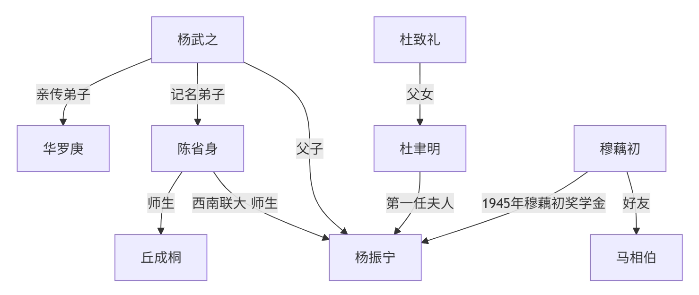
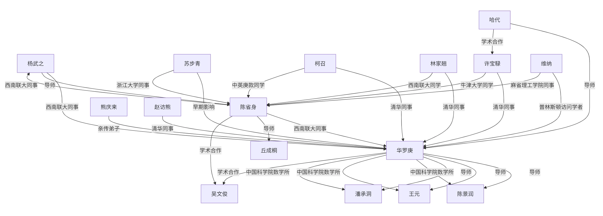
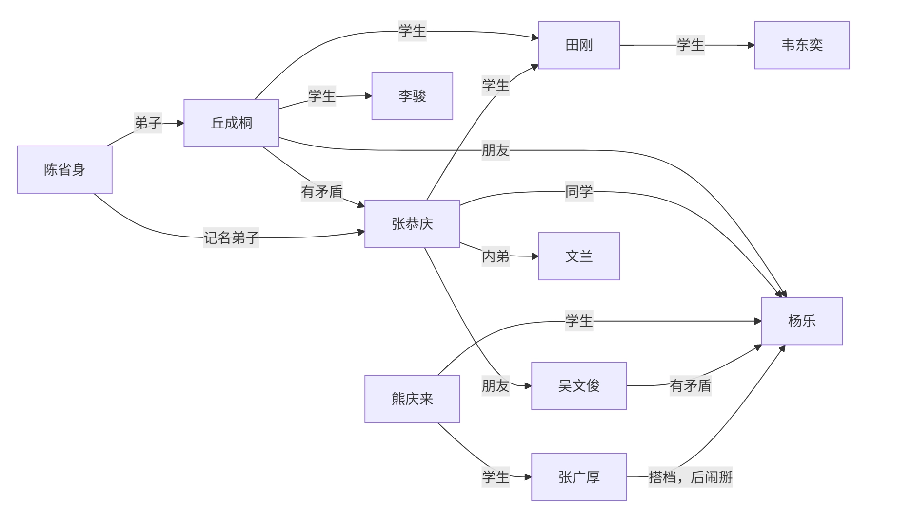

> 本笔记基于上海交通大学 *周钢老师* 2024-2025学年夏季学期教学内容整理，并根据个人理解与思考进行扩展和补充。

# 数学史
## 中国数学史

### 数学与文化表达
- 数字在语言中的应用
- 数字表达文化，成语：七上八下、不三不四
- 象征意义：十三点、二百五
- 用数学来造字：三表多、森表示多木

### 数学与哲学思想
- 道家：道生一，一生二，二生三，三生万物
    - $0\rightarrow 1\rightarrow 2 \rightarrow 3 \rightarrow \cdots \rightarrow \infty$
- 儒家：虚无生太极，太极生两仪，两仪生四象，四象生八卦
    - $0 \rightarrow 2^0 \rightarrow 2^1 \rightarrow 2^2 \rightarrow 2^3 \rightarrow \cdots$
- 佛教

### 历代数学
#### 秦朝
- 户籍制度：统计学管理国家
- 秦始皇重视数学：官员必须懂数学才能管理好国家
- 通过数学计算战争规模和后勤需求。
- 长城和陵墓的建设

#### 汉朝
- 《九章算术》：古代数学的经典著作
    - 方程求解
    - 统计学
    - 几何学
    - 代数方程

#### 隋朝
- 发明科举
- 隋炀帝重视数学
- 国子监算学
- 通过数学规划大运河

#### 唐朝
- 唐太宗李世民重视数学
- 隋唐时代国子监算学的教科书，史称《算经十书》
- 十部书的名称是：
    - 《周髀算经》、《九章算术》、《海岛算经》、《张丘建算经》、《夏侯阳算经》、《五经算术》、《缉古算经》、《缀术》、《五曹算经》、《孙子算经》
- 杰出数学家：李淳风、僧一行

#### 宋朝
- 古代数学顶峰
- 主要成就：
    - 《算经十书》的注释和发展
    - 《九章算术》的推广和应用
    - 数学教育的普及
- 纸牌娱乐中的数学：休闲产生文化
    - 扑克
    - 麻将
- 四大杰出数学家：
    - 秦九韶：同余运算、快速运算
    - 李冶：同余运算、不定方程
    - 杨辉：杨辉三角（帕斯卡、牛顿）、组合数学
    - 朱世杰：数论、代数方程
        - 热衷办学
        - 吴文俊自称其学生

#### 元朝
- 《四元玉鉴》：代数方程的研究
- 《九章算术》的注释和发展

#### 明朝
- 徐光启：数学家、天文学家
    - 《几何原本》：欧几里得几何的介绍
        - 欧氏几何：传教士传入
    - 徐家汇：徐光启逃难携家人来到上海
- 朱世杰：《算学启蒙》

#### 清朝
- 康熙：
    - 《御制数理精蕴》
    - 十六岁亲政，每日朗诵欧氏几何
    - 个人热爱数学
- 钦天正：天文学、历法、数学
- 周培公：比例地图
    - 模拟图 ≠ 比例图
- 莱布尼茨
    - 八卦与二进制
    - 与康熙书信往来，关系密切
- 清末：不重视数学
- 教育
    - 北洋公学、南洋公学
    - 南开大学

### 近代数学家
- **华罗庚**
    - 中专毕业后自学成才
    - 拼命发论文、在国际刊物发表论文后欣喜若狂：“和别人在同个起点，只是晚了点”
    - “不太会做人”、比较强势、人缘不太好
    - 发文章倡议海外留学生回国建设新中国、主持中国的数学发展
    - 与苏联数学家关系友好
    - 华罗庚与苏家驹
        - 苏家驹写了一篇“一元五次方程的公式解”论文，华罗庚试图模仿，发现行列式作分母未验证非零，写了反驳文
    - 华罗庚与姜立夫
        - 姜立夫向熊庆来推荐华罗庚
        - 在恩人姜立夫由中央研究院院士转中科院院士时投了反对票
    - 华罗庚与熊庆来
        - 姜立夫推荐华罗庚给熊庆来
        - 熊庆来求贤若渴，邀请华罗庚去清华
    - 华罗庚与杨武之
        - 杨武之：
            - 杨振宁父亲
            - 熊庆来之后的清华数学系系主任
            - 与华罗庚关系密切，辅导华罗庚
        - 华罗庚师从陈武之，但是鲜少提及
    - 华罗庚与维纳
        - 维纳：现代控制论之父
            - 用线性代数解状态方程：一阶微分方程组
            - 对应的经典控制论：函数分析、解高阶方程
        - 华罗庚让维纳帮自己给哈代写推荐信
    - 华罗庚与陈省身&吴文俊
        - 华罗庚和两人关系不好
        - 陈省身
            - 国民党中央研究院数学所代理所长
            - 解放战争时仓皇出逃美国
        - 吴文俊
            - 拜访陈省身
            - 从学平面几何到公费留学
            - 响应华罗庚号召回国
    - 华罗庚与哈代
        - 华罗庚想出国跟随哈代学习，于是给陈立夫写信
            - 陈立夫：
                - 哥哥陈果夫、叔叔陈其美
                - 中统头子（中统对内、军统对外）
                - 为官清廉
            - 陈立夫资助华罗庚出国
        - 陈省身劝阻：跟随哈代学习难以取得更高成就
    - 华罗庚与丘成桐
        - 华罗庚很尊敬丘成桐
            - 丘成桐年纪小，但华罗庚在信中称他“成桐兄”
        - 丘成桐：
            - 清华大学丘班
            - 老师：陈省身
- **朱公谨**：师从柯朗
- 三胡：
    - 胡敦复
    - 胡刚复
    - 胡明复：宣扬科学意识，创办报纸进行科普
- **苏步青**
    - 做了三万多道高等数学题
    - 负责中科院数学研究所筹备工作
        - 第一任所长是华罗庚
- **王湘浩**
    - 北京大学教授、吉林大学数学系主任
    - 与华罗庚关系好
    - 公认吴文俊强于王湘浩
- **吴文俊**
    - 面对华罗庚的发难，吴文俊拿王湘浩当挡箭牌
    - 评价老师陈省身时，引用杨振宁“千古存心事，欧高黎嘉陈”
    - 法国国家博士
        - 法国国家博士比法国博士含金量高得多
    - “大满贯”：
        - 国家自然科学奖
        - 尖端科学技术奖
        - 邵逸夫科学奖
- **陈省身**
    - 应用数学比纯数学难
    - 代表美国分钱
    - 一生三个所：
        - 国民党中央研究院数学研究所
        - 美国国家数学科学研究所
        - 南开大学陈省身数学研究所


- **北派**：华罗庚、丘成桐、王虹、吴文俊
    - 题做的少、论文发得多
- **南派**：苏步青、陈建功、……
    - 题做的多、论文发得少


## 西方数学史
### 漫谈
- 中国数学与西方数学对比
    - 中国数学的发展：
        1. 治国平天下（务实）
        2. 数学（运筹、术数）
        3. 中国文化
        4. 人工智能基础
    - 西方数学的发展：
        1. 有闲
        2. 地位&辩论
            - 辩论：
                - 辩题：寻找有用的题目
                    - 七大圣贤之首泰利斯：东游记（古埃及、古巴比伦）
                - 规则：亚里士多德发明形式逻辑
            - 大奴隶主辩不过小奴隶主
        3. 学习
        4. 头尾分析
            - 字母化
            - 数学
            - 科学

    
    - 西方的数学是纯数学——精神产物
    - 中国的数学是应用数学——实用产物、物质产物

    

- 区分：科学、宗教、迷信
    - 科学与宗教体系相似：
        - 都是头尾分析
            - 科学：可实验——头
            - 宗教：信仰——头
    - $\sum$ 理论 $\neq$ 科学
    - 实验事实与宗教理论不一致时：
        - 科学：修正理论
        - 迷信：反对事实

- 两种方法：
    - 汇集多数案例：MBA（案例分析法）
    - 由少数案例推出剩余案例：Science（科学方法）

- 理科与工科
    - 工科提出问题
    - 理科解决问题

### 古希腊数学家
#### 泰利斯（Thales）/泰勒斯
- 七大圣贤之首
- 东游记：
    - 古埃及：向埃及人学习观察洪水，指导避难
    - 古巴比伦
- 几何学的奠基人：从几何图形到测量金字塔
- 代数、表格：转道巴比伦途中所学
- 把数学带回古希腊
- 轶事：
    - 数学挣钱：泰利斯是商人，预言气候干旱，提前收购水果卖出高价
- 发源地 $\neq$ 光大地
    - 数学发源于古埃及、古巴比伦
    - 光大于古希腊
- 有闲才能有文化

#### 柏拉图（Plato）
- 坚持：苏格拉底和柏拉图的甩手的故事
    - 苏格拉底的学生
- 理想主义者
- 数学：真、善、美
    - 真：真理——证实明天
        - 亚里士多德用三段论证明
- 数学与实验结果不一致时：相信数学
- 柏拉图学院：“学院” → “University”
    - 有兴趣者聚在一起
    - 定时定点
    - 分类：“类” → “学科”
    - 不懂数学者不得入内
    - 对应中国的书院

#### 亚里士多德（Aristotle）
- 柏拉图的学生、亚历山大大帝的老师
- 形式逻辑：三段论
- 集大成者、百科全书式人物
- 重要观点：“精英悲哀”
- 提出：科学、技术、艺术学
- 想象得到一些结果：被伽利略批判
- 形而上学 & 形而下学

#### 欧几里得（Euclid）
- 欧氏几何之父、纯粹数学家
- 亚氏理论的具象化 → 头尾分析法 → 《几何原本》
    - 《几何原本》：天下第一书
- 检验神童的标志：科学的样板
- 欧几里得算法：求最大公约数
- 做研究：小头大尾

#### 阿基米德（Archimedes）
- 数学之神：无从考证
- 应用数学祖师爷
- 数学：小众文化
- 研究内容：
    - 微积分雏形：缺少极限概念，但其思想实质却伸展到17世纪趋于成熟的无穷小分析领域里去，预告了微积分的诞生。
    - 二次曲线
    - 切线
    - 力学

#### 毕达哥拉斯（Pythagoras）
- 泰利斯的关门弟子
- 数学与音乐的关系
- 毕达哥拉斯学派
- 万物皆数、用数算命
- 定义自然数：自然物 → 自然数
- 成果不署名

### 古埃及、古巴比伦、古希腊数学点滴
- **古埃及**
    - 纸草纸文化
        - 只有两张保存，价值连城
            - 莱茵德纸草纸
            - 车尔尼雪夫纸草纸
    - 有许多数列、倒数
        - 会用来进行计算
- **古巴比伦**
    - 泥板文化
        - 城墙就是图书馆
        - 考古发掘300多块，涉及数学的有50多块
    - 有各种数学用表
    - 60进制
    - 著名藏品：普林顿泥板
        - 公元前100年
        - 收藏号：322号
        - 美国哥伦比亚大学图书馆
- **古希腊**
    - 最高境界：推理
    - 先驱：泰利斯
    - 三个时期：
        - 毕达哥拉斯时期
            - 自由教育、自由研究、无功利
            - 两个脱离
                - 脱离了经济生活：纯推理
                - 脱离了从属地位
            - 第一次数学危机：无理数
        - 柏拉图时期
            - 知识套路：小成本学习法
            - 形成证明
            - 几何三大难题
                - 倍平方问题
                - 角的三等分问题
                - 圆 $\leftrightarrow$ 方
        - 亚历山大时期
            - 提供文化
            - 共享知识
            - 后期产生三位伟人
                - 欧几里得
                - 阿普罗尼亚斯
                - 阿基米德

### 十七世纪代表性法国数学家
#### 帕斯卡（Blaise Pascal）
- 评价：
    - 神童：16岁著书写出“圆锥曲线理论”
    - 残疾：同华罗庚
    - 天才
    - 单相思
- 古典概率创始人
- 帕斯卡定理：上帝不喜欢真空
- 计算机祖师爷：
- 宗教信仰：29岁后献身宗教，试图证明上帝存在
    - 与他类似：康德、叔本华、牛顿
    - 康德是黑格尔老师、黑格尔是马克思老师、马克思是毛泽东老师
- 哲学家、散文家

#### 笛卡尔（René Descartes）
- 从小体弱多病
- 善于观察：笛卡尔坐标系
    - 观察蜘蛛
- 《方法论》附录：解析几何
- 创立解析几何
- 哲学家：我思故我在
- 以太论：涡动力学

#### 费马（Pierre de Fermat）/费尔马
- 方法解
    - 独立于笛卡儿发现解析几何的基本原理
- 喜欢买旧书和研究旧书
    - 阿拉伯的书：有些是从古希腊抢来的书
- 费马大定理：$x^n + y^n = z^n$，$n>2$ 无整数解
    - 作眉批：去世后儿子整理出书
    - 称自己已经用“奇妙的想法证出来”，但在页边的空白处写不下
        - 因此有时称为费马猜想而非定理
    - 无数数学家尝试证明该命题但都以失败告终直到三百多年后才被证明
- 用水平切线找极值点

### 漫谈：交大
> 怎么刚刚讲着法国数学家，突然就跳到交大了（


- 交大历任校长轶事
    - 范绪箕
    - 朱物华
    - 翁史烈
    - 谢绳武
    - 张杰
    - 林忠钦
    - 丁奎岭



- 保护成果
    - 前提：
        - 要发论文
        - 不能被剽窃
    - 方法：
        - 只给结论不给推导过程
            - 注意到、显然、容易得到、不难得出
        - 只给成果不给方法
- “公开的专利都是不挣钱的”


### 十七世纪末至十八世纪初的伟大数学家
- 关于微积分的争吵：
    - **为国家利益而争吵**
    - 各方争吵：
        - 意大利：阿基米德
        - 德国：开普勒
        - 法国：费尔马
        - 英国：巴罗（牛顿的老师）
    - 达成共识：牛顿和莱布尼茨

#### 巴罗（Isaac Barrow）
- 牛顿的老师
- 发现微积分的基本定理
    - 研究微积分需要承认勾股定理：$\mathrm{ds}^2 = \mathrm{dx}^2 + \mathrm{dy}^2$

#### 牛顿（Isaac Newton）
- 物理学家、数学家、天文学家
- 小时候“笨”：小时候在墙上留下大小不同的洞给不同动物走
    - 普通人角度：笨
    - 科学家角度：聪明（分类思想）
- 早年研究概率论：想挣钱
- 研究力学：
    - 经典力学的奠基人：牛顿三大定律
    - 发现万有引力定律
    - 《自然哲学的数学原理》：经典力学的奠基之作
- 研究天体
- 发明“流数法”，即**增量分析法** → 微积分的创始人之一
    - 明天 = 今天 + 增量
    - 增量 = $\sum$ 小增量
- 研究光学：光的色散现象
- 英国皇家给牛顿官职：造币厂厂长
- 人物关系：
    - 死对头：胡克
        - 死后手稿被牛顿销毁
    - 好朋友：哈雷
    - 最得意的学生：库兹
        - 最早提出最小二乘法，但由于没有用武之地而被遗忘
    - 追随者：泰勒、麦克劳林
- 增量思维和存量思维
    - 在经济学上：边际分析
- 去世后葬礼非常隆重

#### 莱布尼茨（Gottfried Wilhelm Leibniz）
- 德国哲学家、数学家
- 百科全书式人物
- “文科生”：原本不学数学
- 好奇心强、好学
- 微积分的创始人之一
    - 莱布尼茨符号：$\int$（积分符号）和 $\mathrm{dx}$（微分符号）
- 数理逻辑：一生被卷入争吵，为避免争吵，发明“争吵的数学”
- 建议成立“科学院”
- 欣赏对手：很欣赏牛顿，英雄惜英雄


- 数学的三大革命
    - 欧几里得：$\sum$ 数学 → 头尾数学
    - 莱布尼茨：学数学不需要问为什么，遵守规则即可
    - 委托（人工智能化）


#### 欧拉（Leonhard Euler）
- 瑞士数学家、物理学家
- 对数学具有宗教式的狂热，被誉为18世纪最伟大的数学家
    - 进入人类前二十位数学家
- 研究领域：
    - 数论
    - 图论
    - 拓扑学
    - 复变函数
    - 微分方程
    - 数学物理学
- 欧拉公式：$e^{i\pi} + 1 = 0$
- 人物关系
    - 父亲：神职人员，热爱数学，但希望欧拉学习神学
    - 老师：约翰·伯努利很欣赏欧拉，帮他说服父亲
    - 德皇的老师，不想参加舞会，想辞职
        - 德皇提出条件：推荐一个顾问，水平与他相当，且会跳舞
        - 于是推荐拉格朗日，德皇很满意
    - 全欧洲数学家的老师
- 离开德国后，前往俄国（圣彼得堡）
    - 叶卡捷琳娜一世（俄国女皇）安排欧拉进了圣彼得堡大学艺术系，而非数学系
    - 叶卡捷琳娜二世对欧拉非常欣赏和照顾
    - 奠定圣彼得堡大学数学系的基础，产生许多杰出数学家
        - 切比雪夫
        - 马尔可夫
        - 坎托罗维奇
- 记忆力超群，能复述家里的书
- 论文多

#### 拉格朗日（Joseph-Louis Lagrange）
- 意大利数学家、物理学家，终生在法国
- 埃菲尔铁塔上的人物
- 研究领域：
    - 数论
    - 泛函
    - 解析力学
    - 微分方程
    - 变分法
- 成就：
    - 拉格朗日乘数法：求函数极值的条件
    - 拉格朗日插值公式：多项式插值的基础
- 傲慢：“比牛顿还牛”
- 最重要工作：承认“第一原理”
    - 上帝以能量最低的方式创造世界
    - 《分析力学》：天下第三书
    
    - 天下第零书：《圣经》
    - 天下第一书：《几何原本》
    - 天下第二书：《自然哲学的数学原理》
    - 天下第三书：《分析力学》
    
- 倒在“一元五次方程的公式解”上
    - 在犹豫中死亡
    - 给后人留下解决的路径

#### 高斯（Carl Friedrich Gauss）
- 德国数学家、物理学家、天文学家
- 被誉为“数学王子”，数学 + 文化的典范
- 研究领域：
    - 数论
    - 代数
    - 几何
    - 天文学
    - 电磁学
- 成就：
    - 高斯定理：电场的散度与电荷密度成正比
    - 高斯曲率：描述曲面的弯曲程度
    - 高斯消元法：线性方程组求解方法
    - 高斯-勒让德算法：数值积分方法
    - 高斯-马尔可夫定理：最小二乘估计的有效性
- 经历：
    - 父亲在铁路工作，家里很多孩子，经济拮据
    - 欧拉是家里唯一的男孩，母亲重男轻女，坚持让欧拉上学
    - 上小学时，高斯求和：$\sum_{i=1}^{n} i = \frac{n(n+1)}{2}$
    - 上大学时，高斯犯难：文学和数学都很好，不知道该选哪个
        - 世界难题：用圆规直尺作正十七边形
        - 高斯尝试证明，成功了，于是决定读数学
        - 恋乡情结：于是去哥廷根大学读书
        - 大一借了43本书，多数为文学书
            - 理由：“功夫在外不在内”
- 喜欢钱
    - 股票投资
    - 简朴节约
    - 天文台兼职
    - 金融数学第一人：正态分布
    - 钞票人物
- 博士论文：$P_n(x)=0$ 在复数域有$n$个根
    - 一生给出7个证明
- 学生：黎曼、狄利克雷

#### 黎曼（Bernhard Riemann）
- 德国数学家
- 研究领域：
    - 数论
    - 复变函数
    - 微分几何
    - 拓扑学
- 成就：
    - 黎曼猜想：关于素数分布的猜想
    - 黎曼积分：对函数进行积分的定义
    - 黎曼曲率张量：描述曲面的弯曲性质
- 经历：
    - 家境贫寒，兄弟姐妹多
    - 喜欢生小孩，所以一直很穷，但仍坚守数学
    - 结合勤工俭学与数学研究
    - 毕业后留校，高斯去世后接任教职，进行就职演讲
    - 恰逢法国数学大奖
    - 早年拖垮了身体，因此英年早逝
        - 去世后，因爱因斯坦的相对论而被闻名
        - 黎曼几何：可以做相对论基础

### 二十世纪初德国哥廷根大学“数学三剑客”
#### 克莱因（Felix Klein）
- 德国数学家
- 数学+管理第一人
- 哥廷根大学数学系院长
- 研究领域：
    - 几何学
    - 代数
    - 数学教育
- 成就：
    - 克莱因瓶：一种非定向的拓扑空间
    - 克莱因四元数：一种代数结构
    - 克莱因群：描述对称性的群
- 学生：恩格尔（恩格尔系数）
- 会赚钱
- 力排众议聘请年轻的希尔伯特
- 主张：
    - 强调“理工结合”
    - 扩张
    - 数学是几何

#### 闵可夫斯基（Hermann Minkowski）
- 德国数学家（德国？俄国？）
- 犹太人，是家里最小的
- 年龄比希尔伯特小，插班和希尔伯特同班
- 哥廷根大学数学系教授
    - 上课，教“拓扑学”，出了洋相：四色问题
- 学生：爱因斯坦
    - 在学校里，爱因斯坦经常逃课
    - 爱因斯坦发表相对论时，闵可夫斯基帮他整理理论依据，找到黎曼的论文
    - 闵可夫斯基在外讲学宣传爱因斯坦相对论时，突发阑尾炎，去世
- 研究领域：
    - 数论
    - 几何学
    - 物理学
- “数学是科学的语言”

#### 希尔伯特（David Hilbert）
- 德国数学家
- 哥廷根大学数学系教授
- 研究领域：
    - 数学基础
    - 数论
    - 代数
    - 几何
- 成就：
    - 希尔伯特空间：无限维向量空间
    - 希尔伯特问题：23个未解决的数学问题
    - 希尔伯特基：线性代数中的基概念


1. 康托尔的连续统基数问题
2. 算术公理的相容性
3. 两个等底等高的四面体体积相等的证明
4. 直线作为两点间最短距离问题
5. 李群的连续变换群的局部同构与整体同构问题（连续群的解析解）
6. 物理公理的数学处理
7. 某些数的无理性与超越性
8. 素数问题（含黎曼猜想、哥德巴赫猜想、孪生素数问题等）
9. 任意数域中最一般的互反律的证明（推广二次互反律）
10. 丢番图方程的可解性（判断整系数方程是否有整数解的算法）
11. 系数为任意代数数的二次型问题
12. 阿贝尔域上的克罗内克定理推广到任意代数有理域
13. 不可能用只有两个变数的函数解一般的七次方程
14. 证明某类完全函数系的有限性（代数不变量理论）
15. 舒伯特计数演算的严格基础（枚举几何基础）
16. 代数曲线和曲面的拓扑问题
17. 正定形式的平方和表示（正定有理函数表为有理函数平方和）
18. 由全等多面体构造空间（空间的tiling问题）
19. 正则变分问题的解是否一定解析
20. 一般边值问题（椭圆型微分方程边值问题）
21. 具有给定单值群的线性微分方程解的存在性（黎曼问题）
22. 用自守函数一致化解析关系（黎曼曲面单值化）
23. 变分法的进一步发展


- 20世纪初，世界上出现许多协会
    - ICM：国际数学家大会（数学界的奥运会）
        - 1897年成立于瑞士苏黎世
        - 每四年举办一次
        - 颁发两个奖：
            - 菲尔兹奖
            - 纳瓦林纳奖
        - 会上报告的时长与身份相符
        - ICM最值得纪念的日子：1900年8月6日，38岁的希尔伯特在报告中提出著名的“23个问题”，深刻地影响了整个世界


- 世界数学强国：
    - 提出问题给后人做
    - 做的人因此成名
- 区别大师
    - 大师：教授你会但是不会思考的东西
    - 小师：教授你不会的东西


### 漫谈：菲尔兹奖
- 一个具有理想主义色彩的奖项
- 数学界的“诺贝尔奖”
- 中立：不署国名
- 1932年没奖、1936年首次颁奖
- 每次获奖人数不多于4人，年龄不超过40岁
- 获奖：一个奖章、1000美元左右奖金
- 轶事：
    - 设奖原因——奇怪的野史小故事
    - 瓦尔拉斯与费马大定理
        - 瓦尔拉斯囊括了四大奖项
        - 传奇人物
    - 吴文俊：搞数学年龄要小，搞文学艺术年龄要大
    - 数学家与经济学家：相互讽刺

### 漫谈：Wolf奖
- 数学终身成就奖
- 比菲尔兹奖晚44年（1976年成立）
- 主要捐款人：R.Wolf.
    - 从废渣中炼铁，致富
    - 成立基金会，理事由以色列官员担任
- 获奖领域：**数学**、物理、化学、医学、农业、艺术
- 国内著名Wolf学者：
    - 陈省身
    - 吴健雄（物理）
    - 丘成桐
    - 袁隆平（农业）
    - 徐甜甜（建筑）
    - 何顺（化学）
- 陈省身：1984年获奖




```
    graph TD;
        A[杨武之]
        E[华罗庚]
        B[陈省身]
        C[丘成桐]
        D[杨振宁]
        F[杜致礼]
        G[杜聿明]
        H[穆藕初]
        I[马相伯]

        A -->|亲传弟子| E
        A -->|记名弟子| B
        B -->|师生| C
        B -->|西南联大 师生| D
        A -->|父子| D
        F -->|父女| G
        G -->|第一任夫人| D
        H -->|1945年穆藕初奖学金| D
        H -->|好友| I
```


### 漫谈：艾米·诺特讲座
- 艾米·诺特
    - 女性，为了学习数学客服社会歧视
    - 希尔伯特扶持
        - 以希尔伯特的名义，在哥廷根大学讲授数学课程。
    - 被希特勒迫害：祖上有犹太血统
- 随着女权运动的发展，艾米·诺特讲座成为女性数学家的重要平台
- 胡和生：首位于2002年北京ICM大会上作“艾米·诺特讲座”的华人女性数学家
    - 丈夫：谷超豪
        - 中科院夫妻院士
    - 老师：苏步青
        - 研究生：浙江大学
        - 本科：交大数学系

## 中国近代著名数学家
- 2002年之前的ICM学者：
    - 华罗庚
    - 吴文俊
    - 陈景润
    - 张恭庆
    - 马志明
    - 冯刚

### 华罗庚
<!-- 见[中国数学史-近代数学家-华罗庚](#近代数学家) -->
<a href="#近代数学家" name="https://file.scholarin.cn/files?fastdfspath=group2/M01/74/40/CgMLEGKhvCuANbF4AABaEeKW4fY5076630" class="LinkCard">中国数学史-近代数学家-华罗庚</a>




```
graph TD;
    A[杨武之]
    B[华罗庚]
    C[陈省身]
    D[丘成桐]
    E[陈景润]
    F[王元]
    G[潘承洞]
    H[熊庆来]
    I[吴文俊]
    J[苏步青]
    K[柯召]
    L[林家翘]
    M[许宝騄]
    N[赵访熊]
    O[维纳]
    P[哈代]

    H -->|亲传弟子| B
    A -->|西南联大同事| B
    B -->|导师| E
    B -->|导师| F
    B -->|导师| G
    C -->|西南联大同事| B
    C -->|导师| D
    J -->|早期影响| B
    K -->|清华同事| B
    L -->|清华同事| B
    M -->|清华同事| B
    N -->|清华同事| B
    O -->|普林斯顿访问学者| B
    P -->|导师| B
    B -->|中国科学院数学所| E
    B -->|中国科学院数学所| F
    B -->|中国科学院数学所| G
    B -->|学术合作| I
    C -->|西南联大同事| A
    A -->|导师| C
    C -->|学术合作| I
    J -->|浙江大学同事| C
    K -->|中英庚款同学| C
    L -->|西南联大同学| C
    M -->|牛津大学同学| C
    O -->|麻省理工学院同事| C
    P -->|学术合作| M
```


### 陈景润
- 数学家、物理学家
- 研究领域：
    - 数论
    - 解析数论
    - 组合数学
- 成就：
    - 解决了著名的“哥德巴赫猜想”中的一个重要问题
        - 证明了每个充分大的偶数都可以表示为一个素数和一个不超过两个素数的乘积之和，即“陈氏定理”
    - 在数论和组合数学领域发表了多篇重要论文
- 区分陈景润的**物质**&**精神**
    - 物质上：
        - 早年受排挤
        - 从厦门大学数学系提前毕业，去中学教书
            - 不善言辞，加之福建口音重，不受欢迎
        - 独自研究数论，后来去中科院中关村
        - 在一个小隔间里攀登数学高峰
        - 成果发表于科学通报，毛主席赏识，大力宣传陈景润
        - 节约
            - 生活过于节俭，导致身体不好
            - 研究经费节约
        - 疗养院：海军医院
            - 由昆：分配来照顾陈景润的护士
                - 陈景润喜欢上由昆
                - 申请结婚，分一套房
        - 希望儿子学数学，结果发现没天赋，但是儿子咬牙坚持
        - 徐迟：崇敬陈景润，写了《哥德巴赫猜想》一书
        - 晚年陈景润得了帕金森综合征，六十多岁就逝世了
    - 精神上：
        - 忘我的科学精神
        - 本土发展
        - 跨世纪人才
            - 十年磨一剑：宝刀 or 菜刀？
        - 丘成桐认为陈景润不伟大

### 冯康
- 中国近代科学计算之父
- 我国十三位首席科学家之一
- 研究领域：
    - 数值分析
    - 计算数学
    - 差分方程
- 成就：
    - 发展了数值分析和计算数学的理论与方法
    - 在差分方程和数值积分方面做出了重要贡献
- 家里兄弟姐妹都了不起
    - 弟弟：冯端，凝聚态物理学家、为纳米材料学家，十三位首席科学家之一
    - 哥哥：中山大学工程师
    - 姐姐：冯慧
        - 姐夫：叶笃正，中国大气物理学创始人
- 表面不用功，但是成绩好
- 苏州中学毕业
- 第一名考进重庆中央大学电机系
    - 读“科学”（胡明复，交大），喜欢“数学”
    - 申请转系被拒绝，于是两个专业一起学
    - 大三得了肺结核，回家养病，奇迹康复
- 毕业后担任复旦（震旦）大学数学物理系助教
    - 后来又担任清华大学物理系及数学系助教
- 尊重华罗庚
    - 进入中国科学院计算技术研究所工作
    - 进入苏联斯捷克洛夫数学研究所进修
        - 导师：庞特里亚金（盲人）
    - 华罗庚指派任务：组建中科院计算中心
- 冯康在解决大型水坝计算问题时，总结了“数学方法”，发文：
    - 《基于变分原理的差分格式》
    - 有限元法
        - 国家自然科学奖二等奖
    - 发了一篇中文一篇英文，因此倒大霉：批斗、改造
        - 平反后成为中科院院士
- 提出哈密顿系统的辛几何算法
    - 国家自然科学奖一等奖
- 去世后追悼会上悼文称他为“国际知名数学家”
    - 弟弟冯端不满：“知名”评价太低
    - 美国庆祝数学会成立100周年时，P.D.Lax 在演讲中提到有限元方法，称冯康为“国际著名数学家”
    - 中科院补救：中国科学报一年内每期都要刊登冯康的悼文

### 张恭庆
- 中国科学院院士
- 研究领域：和陈省身相似
    - 微分几何
- 中学：上海市南洋模范中学
- 拔青苗：四年毕业
- 北大数学系十大神童之尾
    - 之首：张景中
- 刻苦，英文好，因此被借调校核工业
- 改革开放后，赴美进修：柯朗数学研究所
- “大陆数学实力第一”



```
graph LR;
    A[陈省身]
    B[丘成桐]
    C[张恭庆]
    D[田刚]
    E[韦东奕]
    F[李骏]
    G[吴文俊]
    H[熊庆来]
    J[张广厚]
    I[杨乐]
    K[文兰]

    A -->|弟子| B
    B -->|有矛盾| C
    A -->|记名弟子| C
    B -->|学生| F
    B -->|学生| D
    C -->|学生| D
    D -->|学生| E
    C -->|朋友| G
    B -->|朋友| I
    C -->|同学| I
    H --> |学生| I
    H --> |学生| J
    G -->|有矛盾| I
    J --> |搭档，后闹掰| I
    C -->|内弟| K
```


### 马志明
- 中科院院士
- 研究领域：
    - 随机数学
    - 概率论
- 重庆人
- 毕业后去工厂劳动，业余学数学
    - 工农兵大学学生
    - 恢复高考后不承认工农兵大学，视为专科学历
- 1978年恢复高考，考上王寿仁的研究生
    - 王寿仁：研究随机数学
    - 随机数学研究领域冷门：被派出国进修
- 为人好


- 中国数学三大奖
    - 陈省身奖：
    - 华罗庚奖
    - 钟家庆奖


### 吴文俊
- 交大数学系期间，遇到武崇文老师
- 回国后，与华罗庚一起
- 缺资料研究，下放工厂，思考“机器证明”
    - 现在的“人工智能”
- 证明中的“机证史”
    - 机器证明史
        - 即“人工智能”
    - 东方：吴文俊
        - 理想：
            - 马克思：任何学科都可以数学化
            - 笛卡尔：任何数学问题都可以代数化
            - 吴文俊：任何代数问题都可以转化为多项式问题
            - 古人思考：任何多项式问题都可以通过简单动作完成 → 机器化
        - 吴氏方法原理：
            - 命题能写作多项式形式
                - 命题：已知 & 求证
                - 已知条件都可以写作多项式形式
            - 消元法
            - 辗转相除法
                - 若最后 $R=0$，则命题成立，反之若 $R \neq 0$，则命题不成立
            - 机器证明理论成立！
    - 西方：另一条路
- 学生：周成青
    - 在中科院上过吴文俊的机器证明课
    - 赴美读博，上到另一门机器证明课，用吴文俊课上的笔记完成作业
        - 被教授发现，与吴文俊交流
        - 吴文俊闻名美国

## 证明史、计算式与求解史
### 求解史
- 一元一次方程：
    - 古希腊、两河流域文明：无刻度的圆规加直尺作出的图形
- 一元二次方程：
    - 部分可解，如 $x^2+3x+2=0$
    - 部分解不出，如 $x^2+1=0$
    - 韦达：形式解
        - 对于 $ax^2+bx+c=0$，有根 $x_\pm=\frac{-b\pm\sqrt{b^2-4ac}}{2a}$
        - 根
            - 正根：有自然意义
            - 负根：没有自然意义
            - 复数：“魔鬼”
- 一元三次方程：
    - 无人能解出公式解
    - 意大利：流行打擂
    - 塔尔塔塔利亚（真名：丰塔纳）：
        - 条件：$b^2+c^2\neq 0$ 且 $bc=0$ 则有解
        - 打擂天下无敌，但坚决不收徒
    - 卡尔达诺
        - 医生
        - 天才，要拜师塔尔塔塔利亚，被拒绝，最终成功
        - 找了个天才学生到乡下潜心研究，成功得到无条件的一元三次方程公式解
        - 卡尔达诺公式：
            - 将一般三次方程 $y^3+ay^2+by+c=0$ 经过代换 $y=x-a/3$ 化为 $x^3+px+q=0$ 的形式
                - $u=\sqrt[3]{-\frac{q}{2}+\sqrt{\left(\frac{q}{2}\right)^2+\left(\frac{p}{3}\right)^3}}$
                - $v=\sqrt[3]{-\frac{q}{2}-\sqrt{\left(\frac{q}{2}\right)^2+\left(\frac{p}{3}\right)^3}}$
                - $w=\frac{-1+\sqrt{3}i}{2}$
            - 则 $x$ 的三个根为
                - $x_1=u+v$
                - $x_2=uw+vw^2$
                - $x_3=uw^2+vw$
        - 出书：《大术》（又叫《大法》）
            - 引发塔尔塔塔利亚不满，发起挑战却一败涂地，最终郁郁而终
            - 卡尔达诺辩解：“不是掠美者”
            - 后人评价：卡尔达诺不是“掠美者”，《大术》即使除去一元三次方程和一元四次方程，仍是一本伟大的书
- 一元四次方程：
    - 也被卡尔达诺和学生费拉里解决
    - 费拉里：天才，卡尔达诺的学生
- 一元五次方程：
    - 万人坑
    - “英雄”
        - 阿贝尔（Abel）
            - 挪威数学家
            - 政府出款到法国游学，见到了柯西（Cauchy）
                - 阿贝尔严谨，柯西则草率
                - 与柯西矛盾大，纠柯西的错：
                    - 一致连续 & 一致收敛
            - 钱花完后回挪威，得了肺炎，27岁就去世了
            - 评价：那个时代的“阿基米德”
        - 伽罗华（Galois）
            - 考大学时面试，嫌弃题目太简单，结果被考官刷了
            - 与人决斗，决斗前一晚写下“伽罗华遗书”，其中包含了他对一元五次方程的研究成果，托付给好朋友发布
                - 决斗而死，享年21岁
            - 新数学体系：群论
                - 开创了近世代数
                - 可解决一元五次方程、一元六次方程……
            - 评价：人类前二十位数学家
        - 雅各比（Jacobi）
            - 德国数学家
            - 相对前两者长寿，享年四十多岁
            - 三人都住在法国巴黎，却没有见过面
- 二元方程
- 多元方程
- 偏微分方程（PDE）
- 随机PDE方程（B-S方程）
- 金融
- 湍流

### 计算式
- 手算（境界）
- 石头算
- 比例规
- 算盘（中国）
- 计算尺
- 计算器
- 机械计算机
- 电子计算机

#### 计算机史
- 库卡勒
    - 考古祖宗
    - 开普勒：好朋友
- 帕斯卡
    - 遗传祖宗
    - 发明机器：加减法
- 莱布尼茨
    - 机器：加减乘除
    - 引入梯形轴
- 托马斯
    - 法国人
    - 1820年：手摇计算机
    - 历经一百多年：打字机
- 巴贝奇
    - 英国
    - 超世代的传奇人物
    - “数学史科学之眼、也是工程之手”
    - 悲剧人物
    - 1834年：发明差分机
    - 事迹被编为舞台剧
    - 支持的人数极少（$\leq 3$）：儿子、拜伦的女儿、墨索里尼手下的一个军官
- 霍列瑞斯
    - 美国
    - 1884年：统计机
    - 1896年：创立IBM公司
- 楚泽
    - 几点计算机
    - 清华订购
    - 维纳：好朋友
        - 现代控制论
- 图灵
    - 英国
    - 1936年：理想计算机
    - 同性恋
    - 氰化钾中毒而死
    - 消息传到美国，美国计算机界震惊
        - ACM大赛，设图灵奖
- 莫里希 & 埃克特
    - 研究弹道
    - 卡内基·梅隆大学
- 冯诺依曼
    - 冯诺依曼架构
    - 数据与代码分离

### 证明史
- 起源于古希腊
- 演绎证明：真理是什么
    - 柏拉图
    - 亚里士多德
    - 欧几里得
- 归纳证明
    - 不完全归纳
    - 完全归纳：需要可操作
        - 发明数学归纳法
- 线性组合为证明
    - 吴文俊
- 举例为证明
    - 张景中
    - 证法（可读性）

#### 机器证明史
- 证明史 → 统计证明 → 人工智能
- 设想阶段
    - 1950年，塔斯基：许多初等几何问题，都可以机器化
    - Hilbert：许多数学问题，其证明都可以机械化
- 实验阶段
    - 卡内基大学、兰德公司
        - 1956年，尝试机证：罗素的《数学原理》第二章，共56个结论，证明了36结论
        - 开创世界上第一个人工智能专业
        - 1961年，通过改进方法，成功证明《数学定理》第二章全部56个结论
    - 王浩
        - 美籍华人
        - 中学：山东济南一中
        - 师从金岳霖，学习逻辑学，后到约翰霍普金斯大学进修
        - 九分钟机证《数学原理》中的所有定理
    - 1976年起，流行“机证悲观论”
        - 只能证明已有知识，无法创新
    - 周成清让西方机器证明界看到“吴氏方法”
        - 有许多应用

<a href="#吴文俊" name="https://ts2.tc.mm.bing.net/th/id/OIP-C.i_QiY8asoaPIoYAECoJ72gHaJr?w=231&h=300&c=10&rs=1&bgcl=fffffe&r=0&o=6&dpr=1.5&pid=23.1" class="LinkCard">中国近代著名数学家-吴文俊-机器证明史</a>

## 数学史上的三大危机
- 背景：数学的发展史是一部血泪史
    - 矩阵
    - 玻尔兹曼：统计力学
    - 康托尔：集合论
    - 巴贝奇
    - 古诺
    - 勒贝格：实数理论
- 三大危机
    - 无理数
    - 无穷小
    - 集合论

### 第三危机：罗素悖论与集合论
- 罗素悖论：19世纪末，康托尔的集合论引发了关于集合的自指问题，导致了数学基础的重大危机。
    - 罗素：理发师悖论
    - 康托尔：建立一一对应关系
        - 集合：有限 & 无限
- 面对悖论：数学界大乱，持悲观态度
    - 希尔伯特：“如果数学都失灵了，那我们去哪里寻求真理”
    - 庞加莱：“围墙做成之前，羊群里已经混入了狼”
- 数学界出现许多派别
    - 逻辑主义：罗素、弗雷格
        - {数学} $\in$ {逻辑}，而逻辑是可以胡说八道的
        - 口号：我们不知道
    - 直觉主义：布劳威尔（不动点理论）、克罗内克
        - 数学的可解不是逻辑，而是有限步的感觉与构造
        - 每一步可以检验
        - 主张构造性解（公式解）
        - 口号：只有自然数是真的，是上帝创造的，其他都是人造的
    - 形式主义：希尔伯特
        - 拔高了的欧几里得结构

# 期末考试


1. 希尔伯特的二十三个问题
2. 谈数学家与数学事件（事迹+感想）
    - 马骁
    - 中科大：华罗庚数学科技英才班
    - Zaher Hani
    - 斯隆奖
    - 塞勒姆奖
    - 王艺霖
    - Fredrik Viklund
    - Emmanuel Ullmo
    - 法国高等科学研究所
    - 郑乐隽
    - Maryam Mirzakhani 新领域奖
    - 潘略
    - 詹大鹏
    - 望月新一
    - 加藤文元
    - 李超（柯朗所）
    - 大卫·本兹维
    - 梅松 与 统计+人工智能
    - 陈麟 与 数学界四大期刊（影响因子3.5-4.8）
    - Andrea Montanari
    - 位学鑫
    - 16世纪意大利数学家帕乔利
    - 亚马逊研究奖
    - 西蒙斯 及 西蒙斯学者奖
    - 阿瑟·凯莱（英国）
    - Dirichlet
    - 肖梁（北大）
    - 保罗·潘勒韦（法国）


## 希尔伯特的二十三个问题
1. 康托尔的连续统基数问题
2. 算术公理的相容性
3. 两个等底等高的四面体体积相等的证明
4. 直线作为两点间最短距离问题
5. 李群的连续变换群的局部同构与整体同构问题（连续群的解析解）
6. 物理公理的数学处理
7. 某些数的无理性与超越性
8. 素数问题（含黎曼猜想、哥德巴赫猜想、孪生素数问题等）
9. 任意数域中最一般的互反律的证明（推广二次互反律）
10. 丢番图方程的可解性（判断整系数方程是否有整数解的算法）
11. 系数为任意代数数的二次型问题
12. 阿贝尔域上的克罗内克定理推广到任意代数有理域
13. 不可能用只有两个变数的函数解一般的七次方程
14. 证明某类完全函数系的有限性（代数不变量理论）
15. 舒伯特计数演算的严格基础（枚举几何基础）
16. 代数曲线和曲面的拓扑问题
17. 正定形式的平方和表示（正定有理函数表为有理函数平方和）
18. 由全等多面体构造空间（空间的tiling问题）
19. 正则变分问题的解是否一定解析
20. 一般边值问题（椭圆型微分方程边值问题）
21. 具有给定单值群的线性微分方程解的存在性（黎曼问题）
22. 用自守函数一致化解析关系（黎曼曲面单值化）
23. 变分法的进一步发展

## 数学家与数学事件

- 2014年考入中国科学技术大学少年班学院，2015年被华罗庚数学科技英才班录取，2023年获普林斯顿大学博士学位，现为密歇根大学Donald J.Lewis助理教授。主要研究领域为分析学与动力学理论，聚焦数学物理中的核心问题。
- 2025年4月，他与芝加哥大学邓煜教授、密歇根大学Zaher Hani教授合作，在希尔伯特第六问题的研究中取得重要进展：在两个特定假设之下，解决了希尔伯特第六问题——一个是只考虑硬球散射系统；另一个是只考虑玻尔兹曼的动力学理论。
- 感想：马骁的成就展示了年轻数学家的潜力和对数学基础问题的深入研究。他的工作不仅推动了分析学与动力学理论的发展，也为希尔伯特第六问题的解决提供了新的视角和方法。他的成果使他成为菲尔兹奖的有力竞争者，彰显了年轻一代数学家的创新能力和学术贡献。



- 是由高校与中国科学院数学与系统科学研究院联合创办的数学拔尖人才培养项目，旨在通过科教融合模式培育数学领域精英人才，入选教育部“基础学科拔尖学生培养计划”。班级采用“3+1”培养机制，前三学年高校学习基础课程，第四学年进入科研院所实践，课程涵盖数学、统计学等学科，并融入荣誉课程体系。实行小班教学、个性化导师制，配置院士及杰出学者资源，同时建立动态选拔与退出机制。注重国际化学术交流，定期组织师生赴国内外高校开展科研合作与访学。该项目始于2009年中国科学技术大学与中科院数学院的合作，2024年与同济大学签约成立新的华罗庚数学科技英才班。
- 感想：华罗庚数学科技英才班的成立和发展，体现了中国在数学教育和人才培养方面的前瞻性和创新性。通过与中科院数学院的合作，该项目不仅为学生提供了优质的教育资源，还促进了学术界与科研界的紧密联系。这样的培养模式有助于发掘和培养未来的数学精英，为国家和社会的发展做出贡献。



- Zaher Hani是一位密歇根大学的数学教授。他在数学领域尤其是非线性偏微分方程和希尔伯特第六问题的研究上取得了显著成就。2007年，获得美国贝鲁特大学数学学士学位；2008年，获得加州大学洛杉矶分校（UCLA）硕士学位；2011年，在UCLA完成博士论文，师从陶哲轩。2011年至2014年，担任纽约大学库朗数学科学研究所库朗讲师兼西蒙斯研究员；2014年至2018年，在佐治亚理工学院担任助理教授；2018年起，担任密歇根大学数学教授。
- 主要研究非线性偏微分方程（PDE）的数学分析，以及它与统计物理和湍流理论的联系，具体涉及量子物理、海洋学、大气科学、等离子体理论、非线性光学和广义相对论等多个领域。
- 观察他的论文，发现他与华人学者邓煜合作发表了多篇论文，2025年，他与芝加哥大学助理教授邓煜和密歇根大学研究助理教授马骁合作，完成了关于希尔伯特第六问题的论文《希尔伯特第六问题：由玻尔兹曼运动学得出流体方程》，在希尔伯特第六问题的研究中取得了重要进展。他们证明了在无限空间的设定下，玻尔兹曼对气体的描述可以从牛顿的描述中推导出来，完成了气体从微观到介观转化过程这一逻辑链，在将物理学公理化方面取得了重大进展。
- 感想：Zaher Hani的研究展示了数学分析在物理学中的重要性，尤其是在理解复杂系统和现象方面。他的工作不仅推动了偏微分方程的研究，也为统计物理学和湍流理论提供了新的视角和方法，彰显了数学与物理的深刻联系。



- 斯隆研究奖于1955年设立，每年颁发一次，由斯隆基金会管理，奖金7.5万美元，该奖项旨在支持和奖励处于职业早期阶段的杰出科学家和学者，被称为“诺奖风向标”。授予学科领域有：化学、分子生物学、计算机科学、经济学、数学、神经科学、物理学和海洋科学。
- 截止 2025 年 2 月，已有 58 位斯隆奖得主获得诺贝尔奖，17 位获得数学界“诺贝尔奖”菲尔兹奖，72 位获得美国国家科学奖章。今年入选 2025 年度斯隆研究奖的华人学者共计 28 人，占比约 22.2%，包括我校李一璇校友、北京大学数学科学学院的位学鑫、李超、潘略、连宸、梅松。
- 感想：斯隆奖的设立和发展，体现了对年轻科学家和学者的重视与支持。通过提供资金和资源，该奖项为他们的研究和学术发展创造了良好的环境，激励更多的年轻人投身科学事业。



- 塞勒姆奖于1968年设立，每年颁奖一次，用以纪念拉斐尔·塞勒姆。拉斐尔·塞勒姆是一位数学家，因其对傅里叶级数和数论之间联系的深入研究以及概率方法在这些领域的开创性应用而闻名，在法国调和分析的发展中发挥了重要作用。因此，塞勒姆奖旨在表彰在调和分析、傅里叶分析、数论等领域做出杰出贡献的年轻数学家，获奖者中有许多人后来也成为菲尔兹奖得主。2024年，塞勒姆奖授予了两位数学家，其中一名为中国数学家王艺霖，成为塞勒姆奖首位女性华人得主。
- 感想：塞勒姆奖的设立和发展，体现了对调和分析和数论领域杰出贡献的认可与鼓励。王艺霖作为首位女性华人得主，不仅为她个人的学术成就增添了光彩，也为更多女性数学家树立了榜样，激励她们在科学研究中追求卓越。



- 1991年出生的王艺霖成长于中国上海。她初中起就读于上海外国语大学附属中学，学习法语，高一时去法国交流。参加法国教育部招生选拔时，没有进行数学竞赛的培训，因此勉强及格，但是使用法语答题，且面试时自信，成功被录取。2011年考入巴黎高等师范学院，后前往巴黎第六大学学习几何，获得了基础数学硕士学位；前往巴黎第十一大学继续学习，获得了概率与统计硕士学位。
- 2024年，她因在复分析、概率和数学物理之间建立深层新颖的联系而荣获塞勒姆奖，特别是在 Teichmuller 理论和 Schramm-Loewner 演化理论方面。作为该奖项首位女性华人得主，在她之前仅有陶哲轩和詹大鹏这两位华人数学家摘得这一奖项。在接受媒体采访时，自称自己“只是一个普通人”。
- 不仅要取得最佳结果，还要实现最优雅的证明。
- 感想：王艺霖的成就展示了女性在数学领域的卓越贡献和潜力。她的研究不仅将复分析、概率和数学物理之间建立了新的联系，也为女性数学家树立了榜样。她的谦逊态度和对学术的热爱，激励着更多年轻人投身科学研究。



- Fredrik Viklund曾是哥伦比亚大学的西蒙斯研究员和里特助理教授，之后在乌普萨拉大学担任副教授。目前，他是瑞典皇家理工学院的数学教授。他是瓦伦堡学者，受到戈兰・古斯塔夫松基金会的支持，还获得了瓦伦堡学院研究员的长期资助，这使他能够专注于具有挑战性和趣味性的数学问题研究，并聘请更多的博士生和博士后推动研究进展。他从 KTH 获得博士学位，并在 2010-2013 年在哥伦比亚大学担任 Simons 研究员和 J.F.Ritt 助理教授。
- 他的主要兴趣领域是复分析、概率和数学物理学，也对计算机科学和应用数学的某些方面感兴趣，致力于开发新的数学方法来更精确地描述量子场论中随机波动的场。他还对施Schramm-Loewner Evolution曲线进行了研究，与美国麻省理工学院的研究人员合作，探索了 SLE 曲线的随机世界与 Weil-Petersson 曲线的确定性世界之间的数学关系。
- 2024年，他与王艺霖合作，基于SLE和更广泛的随机共形几何的结果，证明了关于通用泰希米勒空间的新结果。
- 感想：Fredrik Viklund的研究展示了数学在物理学和计算机科学中的应用潜力。他与王艺霖的合作成果，进一步推动了随机共形几何领域的发展，为理解复杂系统提供了新的视角和方法。他的工作激励着更多年轻数学家探索跨学科的研究领域。



- Emmanuel Ullmo是一位法国数学家，现任法国高等科学研究所（IHES）所长。他1985年毕业于卡尚高等师范学校，1992年在巴黎第十一大学获得数学科学博士学位。他曾在巴西纯数学与应用数学研究所（IMPA）工作18个月，在美国普林斯顿大学任职两年，在中国清华大学访问六个月。2001年起担任巴黎第十一大学教授，2007年至2010年担任奥赛数学系主任和专家委员会主席。2002年至2006年是埃米尔·博雷尔中心科学委员会成员，2006年起成为《数学发明》杂志编辑委员会成员，并在2008年至2014年担任两位主编之一。
- 他与Chris Daw和Alexander Gorodnik合作证明了局部对称空间的最大Satake紧化上的齐次测度空间是紧的。与Gregorio Baldi合作证明了复仿射空间的单位球被非算术格商的最大全测地子簇集合的有限性。
- 2002年被邀请在北京市举行的国际数学家大会上发言，2003年至2008年成为法国大学学院成员，2006年获得巴黎科学院埃利·嘉当奖。他指导的学生陈柯于2010年获首届新世界数学奖（博士论文银奖），并在顶级数学杂志发表多篇论文。
- 作为IHES所长，Ullmo积极推动国际学术合作。2023年，他向武汉大学代表团介绍了IHES的情况，并表示支持双方学者在数学领域加强合作，共同举办学术会议，培养顶尖科研人才。
- 感想：Emmanuel Ullmo的成就展示了他在数学领域的深厚造诣和对学术界的贡献。他在IHES的领导下，推动了国际学术合作，为数学研究提供了良好的平台。他的工作不仅促进了数学的发展，也为年轻学者提供了宝贵的指导和支持。



- 法国高等科学研究所（Institut des Hautes Etudes Scientifiques，IHES）是一所专注于数学、理论物理及相关领域前沿研究的学术机构。1958年，俄罗斯商人及数学家莱昂·莫查内创建了IHES，他从普林斯顿高等研究所吸取灵感，希望建设一所比肩普林斯顿高等研究所的欧洲研究院。1962年，莫查内买下了巴黎郊区Bures - sur - Yvette的Bois - Marie小镇的一部分土地，包括10公顷的森林和一座小山，自此IHES一直坐落于此。
- 截至2025年，IHES有主任1名，数学领域常任教授5位，物理学常任教授3位，另有4位是法国国家科学研究中心资助的研究人员。此外，每年还有约200名访问学者前来交流合作，访问时间平均为两个月。自成立以来，IHES已有8位数学常任教授获得菲尔兹奖，3位数学教授荣获阿贝尔奖。IHES的“访问学者项目”为全球研究人员提供了自由交流的平台，许多知名物理学家和数学家都曾作为受邀研究员访问过该所，包括默里·盖尔曼（Murray Gell - Mann）、阿尔弗雷德·卡斯特勒（Alfred Kastler）、陈省身等。常任教授们会邀请领域内的同行展开合作研究项目，访问学者也能与研究所的人员进行深入的学术讨论。
- 2025年9月1日，中国数学家王虹将正式就任IHES数学终身教授，她将延续该院在分析与几何学领域的卓越传统，为研究所的发展注入新的活力。
- 感想：IHES作为欧洲顶尖的数学和物理研究机构，汇聚了众多杰出学者和研究人员。它不仅为学术界提供了一个高水平的交流平台，也推动了数学和物理学的前沿研究。王虹的加入将进一步增强IHES在全球数学界的影响力，为未来的研究开辟新的方向。



- 郑乐隽（Eugenia Cheng）是一位华裔女性数学家。她是剑桥大学数学博士，现任美国芝加哥艺术学院常驻科学家。她曾在英国曼彻斯特大学、剑桥大学、美国芝加哥大学和法国尼斯大学任教。
- 郑乐隽将“消除世界上所有人对数学的恐惧”视为终身奋斗的事业。她认为人们对数学的惧怕源于对原理、公式的畏难情绪以及缺乏想象力的解释。为此，她撰写了《超越无穷大》《数学思维》《逻辑的力量》《数学的逻辑》等多部数学科普畅销书。其中，《数学的逻辑》一书通过简单问题帮助读者重新理解数学原理和公式，揭示数学的本质逻辑。她的科普作品被英国《卫报》授予“科学与自然类新秀作者”奖。此外，她在YouTube上的演讲视频浏览量超过100万次，曾在电视节目上“烘焙π”，用小提琴“演奏”函数，以独特方式传播数学知识。
- 作为纯数学家，郑乐隽在数学领域有深入研究，她是伦敦城市大学纯数学荣誉客座研究员。其研究方向可能涉及范畴论等抽象数学领域，不过具体的学术研究成果尚未有广泛公开的详细报道。
- 感想：郑乐隽的工作不仅在学术界取得了成就，更在普及数学知识方面做出了重要贡献。她通过通俗易懂的方式，帮助人们克服对数学的恐惧，激发了更多人对数学的兴趣和热爱。她的努力为数学教育和科普事业树立了榜样。



- Maryam Mirzakhani新前沿奖（Maryam Mirzakhani New Frontiers Prize）是科学突破奖（Breakthrough Prize）的子奖项之一，该奖项由突破奖基金会于2019年设立，以已故伊朗数学家、菲尔兹奖首位女性得主Maryam Mirzakhani的名字命名，旨在表彰和激励旨最近获得博士学位并取得重要成果的女性数学家。奖金每人5万美元，该奖项可由多人共同获得，候选人的博士论文必须作为提名的一部分提交，且需提供不超过10篇来自指定学术出版数据库的引用文献。
- 2025年，斯坦福大学的李思颖（Si Ying Lee）获奖，用于表彰其对志村簇（Shimura varieties）理论的贡献；波恩大学、马克斯·普朗克数学研究所的拉朱拉·斯里瓦斯塔瓦（Rajula Srivastava），用于表彰其在调和分析及解析数论领域的贡献、包括对光滑流形附近有理点计数问题的研究；加州大学伯克利分校的埃文·唐（Ewin Tang），用于表彰其为机器学习和线性代数开发了量子算法的经典模拟方法、并在量子数据的量子机器学习方面取得进展。
- 感想：Maryam Mirzakhani新前沿奖的设立，旨在鼓励和支持女性数学家在学术界的发展。通过表彰年轻女性数学家的杰出贡献，该奖项不仅提升了女性在数学领域的地位，也激励更多女性投身科学研究，推动了数学学科的多样性和包容性。



- 潘略是一位杰出的青年数学家，现任普林斯顿大学数学系助理教授。他2009年获得CMO金牌，同年参加高考，取得北京市理科第6名，数学成绩满分，2009-2013年就读于北京大学数学科学学院，获得学士学位；2018年于普林斯顿大学获得博士学位。他从2018年起担任芝加哥大学的讲师，之后回到普林斯顿大学加入数学系，担任助理教授。
- 他的研究聚焦于代数数论，特别是p进朗兰兹纲领方向，研究领域包括同调、伽罗瓦和巴拿赫表示、剩余类以及不可约表示等。2020年发布了一个模形式的证明，揭示了局部解析向量与模形式和伪同调之间的关系，为研究模形式提供了新的工具。其研究成果为其他数学家证明普通阿贝尔曲面总能对应一个模形式提供了关键参考，帮助解决了模形式构造中的关键障碍。他获得了2025年斯隆研究奖。
- 感想：潘略的研究成果展示了他在代数数论领域的深厚造诣和创新能力。他的工作不仅推动了模形式理论的发展，也为其他数学家提供了重要的参考和工具。他的成就激励着更多年轻数学家在复杂的数学问题上不断探索和创新。



- 詹大鹏是一位知名华人数学家。他于1996年获得南开大学学士学位，2004年获得加州理工学院博士学位。他曾是伯克利数学科学研究所的成员、加州大学洛杉矶分校纯粹与应用数学研究所的高级研究员，以及普林斯顿高等研究院的冯·诺依曼研究员。
- 詹大鹏的主要成就在于他在Schramm-Loewner演化（SLE）方面的杰出工作。SLE是复平面上由布朗运动驱动的具有共形不变性与马尔可夫性的单参数随机曲线族，融合现代概率论、统计物理和共形场论的精髓，是描述二维统计物理模型临界行为的强有力工具。詹大鹏在2011年因对SLE的可逆性和对偶性猜想的证明，与Julien Dubédat共同获得美国塞勒姆奖。他也是继陶哲轩之后，第二位获得该奖项的华人数学家。同年，他还获得了美国斯隆研究奖中的数学奖。
- 感想：詹大鹏的研究成果在数学界产生了深远的影响，特别是在随机共形几何和统计物理领域。他的工作不仅推动了SLE理论的发展，也为理解复杂系统提供了新的视角和方法。他的成就激励着更多年轻数学家在跨学科研究中探索新的可能性。



- 望月新一1969年3月29日出生于日本东京，是日本京都大学教授。他在数学领域取得了诸多重要成果，尤其是在abc猜想的证明方面备受关注。他16岁时成为普林斯顿大学数学系本科生，后直接进入博士阶段学习，导师是证明了莫德尔猜想的法尔廷斯。1992年，他在普林斯顿大学取得博士学位后回到日本，任职于数理解析研究所。1996年，晋升为京都大学副教授，2002年取得教授职称。他曾获得日本数学会秋季奖、首届日本学术征信会奖、日本学院奖章等荣誉。
- 2012年8月30日，望月新一在自己的网站上发布了一篇超过600页的论文，提出跨视宇Teichmüller理论（IUT理论），并声称能够证明abc猜想。该理论使用了一套全新的数学语言，开辟了超脱于现代数学的新范式，引起数学界轰动，但因内容艰深，很长时间内很少有数学家能够理解。2020年4月3日，望月新一的两位同事召开新闻发布会宣布，其关于abc猜想的证明被《数理解析研究所公刊》接收、即将正式发表，不过学界对此仍存在争议。接收这些论文的期刊是《数理解析研究所公刊》（PRIMS）——正如期刊名字所揭示的那样，这个学术期刊的主办单位正是望月新一任职的京都大学，而该期刊的主编，正是望月新一本人
- ABC猜想也被称作厄斯特勒-马瑟猜想，是数论中的一个重要猜想，提出于1985年。它涉及到整数的加法和乘法之间的深刻关系，具体表述为：对于任意正整数a、b、c，如果满足a + b = c且a、b、c互质，则存在一个常数K，使得c的素因子个数不超过K乘以log(max(a, b, c))。
- 感想：望月新一的研究成果在数学界引起了广泛关注和讨论。他的IUT理论为abc猜想提供了新的视角和方法，尽管其内容复杂难解，但其创新性和深度无疑推动了数论和代数几何的发展。如果他的证明最终得到广泛认可，将对数学界产生深远的影响；如若只是哗众取宠，则不免让人感到失望。



- 加藤文元是一位日本数学家、科普作家。1968年生于宫城县。他本科毕业于京都大学理学部，后在该校理学研究科数学及数学解析系完成博士课程。他曾担任京都大学研究生院副教授和熊本大学教授，还在德国马克斯·普朗克研究所担任过研究员，并在法国雷恩大学和巴黎第六大学任客座教授。目前是东京工业大学理学部数学科教授。
- 作为望月新一的深交挚友，加藤文元对望月新一的IUT理论有深入研究。他从2015年开始与望月新一每月通过Zoom或Skype交流，帮助新一代数学家学习IUT理论，据他估计，2023年世界上熟悉IUT理论的人不到10人。2017年，他在“第四届近现代数学史与数学教育国际会议”上作了“扎里斯基-黎曼空间的历史”的综述报告，分析了黎曼、扎里斯基对该理论的不同贡献。
- 他著有《将空间与宇宙联系起来的数学：IUT理论的影响》《加洛阿：天才数学家的生活》《用数学的语言看宇宙：望月新一的IUT理论》等书。其中《用数学的语言看宇宙：望月新一的IUT理论》是解读IUT理论的通俗读物，由望月新一亲自作序推荐。他还主编了《你想知道的数学》《和孩子一起轻松学习儿童数学》等书籍。他的作品获得过日本“八重洲书店大奖”，是第一本获得此奖项（大众读物奖）的数学类读物。
- 感想：加藤文元在推动IUT理论的普及和理解方面做出了重要贡献。他的努力不仅帮助了新一代数学家学习这一复杂的理论，也为数学界提供了更多的视角和思考。他的著作和研究为数学教育和科普事业树立了榜样。



- 李超是一位几何分析领域的杰出青年数学家。他2009-2013年就读于北京大学数学科学学院，获得学士学位，后于斯坦福大学获得博士学位，现任纽约大学柯朗数学科学研究所助理教授，师从Rick Schoen和Brian White。李超致力于几何分析领域的前沿研究，尤其在极小曲面理论、正标量曲率流形的拓扑分类及高维流形刚性等方面取得了突破性成果。他在《Acta Mathematica》《Annals of Mathematics》《Inventiones Mathematicae》等顶尖期刊发表多篇论文。此外，他还获得了2025年斯隆研究奖。近年来，他通过多场专题学术报告系统展示了与Otis Chodosh合作的研究成果，包括解决4-5维非球面流形正标量曲率难题和稳定伯恩斯坦问题等突破性进展。
- 李超有以下重要研究成果。高维流形分类：2022年与O. Chodosh合作证明4-5维闭合非球面流形上正标量曲率度量的存在性定理，推进了高维流形分类研究；稳定伯恩斯坦定理：2022年提出R^4空间中稳定各向异性最小超曲面的伯恩斯坦定理，解决了该问题的维度限制；有限莫尔斯指数结构：建立具有有限莫尔斯指数最小超曲面的系统性结构理论，为相关领域提供新的分析框架。
- 感想：李超的研究成果展示了他在几何分析领域的深厚造诣和创新能力。他的工作不仅推动了极小曲面理论和正标量曲率流形的研究，也为高维流形分类提供了新的视角和方法。他的成就激励着更多年轻数学家在复杂的数学问题上不断探索和创新。



- 大卫·本兹维（David Ben-Zvi）是一位美国数学家。他1974年6月19日出生，目前是德克萨斯大学奥斯汀分校数学系的教授，担任该校的数学讲席教授。他的研究兴趣集中在表示论、代数几何和数学物理的交叉领域。其近期工作的主要主题是表示论与规范理论的相互作用，探索几何表示论（特别是几何朗兰兹纲领）与同伦代数（导出代数几何）中的新工具以及物理学（拓扑场论和超对称规范理论）中的组织结构之间的相互作用。他与导师爱德华·弗伦克尔（Edward Frenkel）共同撰写了《顶点代数与代数曲线》（Vertex Algebras and Algebraic Curves）一书。
- 2012年，他当选为美国数学学会会士。2011年至2013年，他获得德克萨斯大学总统协会百年教学奖学金。
- 感想：大卫·本兹维的研究成果在数学界产生了深远的影响，特别是在表示论和代数几何的交叉领域。他的工作不仅推动了几何表示论的发展，也为理解复杂系统提供了新的视角和方法。他的成就激励着更多年轻数学家在跨学科研究中探索新的可能性。



- 梅松是加州大学伯克利分校统计系和电气工程与计算机科学系的助理教授，在统计与人工智能交叉领域具有显著影响力。他本科毕业于北京大学数学科学学院（2010级），后于斯坦福大学获得博士学位，导师为信息论与机器学习专家Andrea Montanari。2025年，他因在生成模型、深度学习理论等方向的开创性工作，获得斯隆研究奖，成为该领域备受瞩目的青年学者。
- 梅松的研究聚焦于统计理论与人工智能的深度融合，尤其在生成模型（如语言模型、扩散模型）的理论基础、深度学习的优化动力学、强化学习的样本效率等方向取得了系统性成果，体现了统计学在人工智能理论构建中的核心作用。除斯隆研究奖外，梅松还获得多项重要资助与认可： 2024年，他因“深度学习与大规模AI模型的理论基础”研究获得美国国家科学基金会（NSF）职业奖（NSF Career Award）；同年，他获得谷歌研究学者奖（Google Research Scholar Award）和亚马逊研究奖（Amazon Research Award），支持其在生成模型和强化学习领域的前沿探索；他的工作被国际学术界广泛关注，例如其提出的“负偏好优化”（Negative Preference Optimization）方法，为大语言模型（LLM）的有效遗忘（unlearning）提供了理论解决方案，相关预印本于2024年4月上线。
- 梅松的研究横跨统计学、计算机科学、信息论等多个领域。他通过高维统计推断与量子机器学习算法的结合，探索了复杂系统中的不确定性量化问题，为AI模型的鲁棒性提供了理论支撑。例如，他在《Transformers作为统计学家》一文中，将Transformer架构与统计推断理论结合，证明了其在上下文学习中的可证明性，这一成果为理解和设计高效AI模型提供了新范式。
- 感想：梅松的研究展示了统计学在人工智能领域的重要性和潜力。他通过将统计理论与深度学习、生成模型等前沿技术相结合，为AI模型的理论基础提供了坚实支撑。他的工作不仅推动了统计学的发展，也为人工智能的实际应用提供了新的视角和方法。他的成就告诉我们，统计学不仅是数据分析的工具，更是理解和设计智能系统的核心理论基础。



- 陈麟是清华大学丘成桐数学科学中心的助理教授。他在代数几何领域，尤其是几何朗兰兹纲领研究方面成果显著。陈麟12岁进入中国数学奥林匹克（CMO）竞赛并获得满分，15岁进入国家队并参加国际数学奥林匹克（IMO）竞赛取得金牌。2012年至2016年，陈麟在北京大学获得学士学位，2016年至2021年于哈佛大学取得博士学位，2021年至2023年，他在普林斯顿高等研究院担任博士后，2023年起至今，在清华大学丘成桐数学科学中心担任助理教授。
- 2023年，他凭借论文“Nearby Cycles and Dualities in Geometric Langlands Program”荣获世界华人数学家联盟（ICCM）博士论文奖。其论文探索了Vinberg类型渐变族上邻近闭链和几何朗兰兹纲领中多种对偶性的关系，证明了自守层的Deligne--Lusztig对偶，解决了Drinfeld--Wang和Gaitsgory提出的猜想。2024年，陈麟作为主要作者之一，参与了由Dennis Gaitsgory和Sam Raskin领导的研究团队，成功证明了几何朗兰兹猜想。该证明由5篇论文组成，总计超过800页，被认为是朗兰兹纲领几何部分的核心突破。
- 感想：陈麟的研究成果展示了他在代数几何领域的深厚造诣和创新能力。他的工作不仅推动了几何朗兰兹纲领的发展，也为理解复杂的数学结构提供了新的视角和方法。他的成就激励着更多年轻数学家在代数几何和相关领域不断探索和创新。



- 《数学年刊》（Annals of Mathematics）、《数学新进展》（Inventiones Mathematicae）、《数学学报》（Acta Mathematica）和《美国数学会杂志》（Journal of the American Mathematical Society）。
    - Annals of Mathematics，1874年创建，四大期刊里面最老的期刊，起初由Joel E. Hendricks担任创刊主编。创刊主旨为介绍和分析纯数学及应用数学中社会感兴趣或重要的问题，特别那些在天文学、机械学和工程学中有意思的创新和发现。创办10年后因Hendricks的个人健康问题出现过停办，后又在次年3月份继续出版。继续出版的Annals of Mathematics更换了主编，几年后期刊被带到现在的普林斯顿。该期刊的一个重要时期是1928-1958年，SolomonLefschetz 担任编辑期间，努力将它经营为一个越来越有名和受人尊敬的杂志。反过来，该期刊的崛起也刺激了美国的数学，极大促进了美国数学的发展。目前由普林斯顿大学和其高等研究院联合出版，每两个月出版一刊，每年不过百篇。1998年以来，这本期刊首次出版了电子版，可喜的是，起初电子版是免费的，但不久后，情况发生改变，2003年被转移到非免费的JSTOR中存档，文章在发布5年后才可以免费使用。
    - Inventiones Mathematicae，创立于1966年，月刊。被认为是世界上最负盛名的数学期刊之一。现任主编是 Camillo De Lellis (普林斯顿高等研究院)和Jean-Benoît Bost (巴黎大学)。据统计，我国数学家在这个期刊上发表的文章数量要比Annals of Mathematics多一些。
    - Acta Mathematica由 Gösta Mittag-Leffler于1882年在 瑞典皇家科学院Mittag-Leffler研究院创办。作为季刊，每年只有很少的发文量，所以质量杠杠的。我们大陆的数学家在此期刊上的发文量屈指可数：苏步青在1951年首次在期刊发表文章。之后田刚和朱小华(2000年)、张伟平和麻小南(2014年)。田刚院士与张振雷(2016年)分别发表过文章。
    - Journal Of The American Mathematical Society是美国数学协会在1988所办的期刊，是四大期刊里最年轻的期刊。作为季刊，每年文章量严格控制在32篇，发表相当困难。著名的华人数学家陶哲轩（Terence Tao）在此期刊上发表过多篇文章。
- 2025年，四大期刊的影响因子分别为：Annals of Mathematics 5.27，Inventiones Mathematicae 3.7，Acta Mathematica 6.81，Journal of the American Mathematical Society 3.14。
- 感想：四大期刊的设立和发展，体现了数学研究的严谨性和创新性。这些期刊不仅为数学家提供了一个展示研究成果的平台，也推动了数学学科的发展。然而，我国数学家在这些期刊上的发文量仍然较少，这反映出我国在数学研究领域的国际影响力还有待提升。希望未来能有更多优秀的中国数学家在这些顶尖期刊上发表研究成果，为全球数学界做出更大的贡献。



- Andrea Montanari是斯坦福大学统计学和数学教授。他在跨学科研究领域成果丰硕，在学术界享有很高的声誉。1997年获得意大利比萨高等师范学校物理学Laurea学位，2001年获得该校理论物理学博士学位，曾在法国巴黎高等师范学院理论物理实验室和美国伯克利数学科学研究所做博士后研究员。2002年至2010年，担任法国国家科学研究中心（CNRS）研究员。2006年加入斯坦福大学，在电气工程系和统计系任教，2021年至2023年担任斯坦福大学工程学院Robert and Barbara Kleist教授。
- 2006年获得CNRS理论物理铜奖，2008年获得美国国家科学基金会职业奖，2013年获得日本大川研究助成奖，2016年获得IEEE信息论协会詹姆斯·梅西奖，2020年获得法国统计学会勒·卡姆奖。他还曾获得2008年ACM SIGMETRICS最佳论文奖和2015年应用概率学会最佳出版物奖。2017年当选为IEEE会士，2020年当选为国际数理统计学会会士（IMS Fellow）。此外，他还是2018年国际数学家大会报告人、2020年国际数理统计学会奖章讲座演讲人。
- 2024年，Andrea Montanari与Germain Kolossov、Pulkit Tandon合作发表了论文《Towards a statistical theory of data selection under weak supervision》。该论文为数据子集选择建立了统计学基础，并揭示了当前流行的数据选择方法存在的主要缺陷。2025年，Andrea Montanari指导的学生梅松获得斯隆研究奖。
- Andrea Montanari与其他机构的研究人员一起，启动了关于深度学习理论基础的合作项目。该项目由加州大学伯克利分校的研究人员领导，获得了美国国家科学基金会（NSF）和西蒙斯基金会的五年资助，旨在从理论上理解深度学习。
- 感想：Andrea Montanari的研究成果在统计学和数学领域产生了深远的影响。他的工作不仅推动了跨学科研究的发展，也为理解复杂系统提供了新的视角和方法。他的成就激励着更多年轻学者在统计学和人工智能等前沿领域不断探索和创新。



- 位学鑫是德克萨斯大学奥斯汀分校神经科学系助理教授。2005年至2009年，位学鑫就读于北京大学数学科学学院，获得学士学位。之后，他于宾夕法尼亚大学获得心理学博士学位，之后在哥伦比亚大学理论神经科学中心和统计系从事博士后研究。他聚焦于计算神经科学、感知与认知机制、脑科学与AI双向启发等，曾获Louis B. Flexner神经科学优秀论文奖，在《Nature Neuroscience》《PNAS》《NeurIPS》等顶刊或会议发表论文20余篇。2025年，位学鑫获得斯隆研究奖。
- 感想：位学鑫的研究展示了计算神经科学在理解人类感知和认知机制方面的重要性。他的工作不仅推动了神经科学与人工智能的交叉研究，也为理解复杂的脑功能提供了新的视角和方法。他的成就激励着更多年轻科学家在跨学科研究中探索新的可能性。



- 16世纪意大利数学家，被誉为 “现代会计之父”，在数学、会计学、文艺复兴时期的科学传播等领域均有深远影响。并非原创性数学家，但擅长整合与传播当时的数学知识，尤其注重将理论与实际应用结合。他强调数学的实用性，其著作不仅面向学者，也为商人、工匠、建筑师等提供了计算工具，推动了数学从象牙塔走向社会实践。他在多个大学（如帕多瓦大学）讲授数学，培养了一批学生，进一步传播了他的学术思想。
- 早年曾在威尼斯担任富商家庭的家庭教师，后进入 Franciscan 修道院，系统学习神学与科学，一生游走于意大利各城邦（如米兰、佛罗伦萨、罗马等），与达・芬奇等文艺复兴巨匠有密切交往。
- 1500 年左右，帕乔利在米兰与达・芬奇合作，达・芬奇为帕乔利的另一著作《神圣比例》（De Divina Proportione，1509 年）绘制插图。该书研究了 “黄金比例”（ Divine Proportion ）在几何、艺术与建筑中的应用，达・芬奇的插画（如正多面体的立体图）精准展现了数学与艺术的融合，成为文艺复兴时期跨学科研究的典范。
- 著有《算术、几何、比及比例概要》，其中第三部分 “计算与记录要论”（Particularis de Computis et Scripturis）系统阐述了复式记账法（double-entry bookkeeping）的原理与方法，包括会计科目设置、日记账与总账的登记规则、试算平衡等核心概念。该书首次将意大利商人实践中形成的记账方法上升为理论体系，被视为现代会计学的奠基之作，极大推动了商业财务管理的规范化，为资本主义经济的发展提供了关键工具。
- 感想：卢卡・帕乔利的研究成果在数学和会计学领域产生了深远的影响。他的工作不仅推动了数学与实际应用的结合，也为现代会计学的发展奠定了基础。他的成就激励着更多学者在跨学科研究中探索新的可能性。



- 亚马逊研究奖（Amazon Research Awards，ARA）是亚马逊于2015年设立的奖项，涉及应用机器学习、自动推理、计算机视觉、人工智能公平性、机器学习算法与理论、自然语言处理、机器人、安全、可持续发展等多个与亚马逊业务相关的领域，旨在为多个学科研究主题的学术研究人员提供支持，促进相关领域的研究发展。奖项以一次性无限制赠款的形式提供给首席研究员所在的学术机构或组织，包括现金和AWS促销积分。现金资助金额平均可达10万美元，AWS促销积分在5万至25万美元之间。获奖者可以公开访问300多个亚马逊公共数据集，并使用亚马逊的AI/ML服务和工具。此外，获奖者还将与亚马逊专家建立联系，获得咨询和建议，并可参加亚马逊举办的活动、培训课程等。
- 2025年，共有70位学者获奖，来自10个国家的44所大学，其中有不少华人的身影。
- 感想：亚马逊研究奖的设立，体现了科技公司对学术研究的重视和支持。通过资助学术界的研究人员，亚马逊不仅推动了相关领域的技术进步，也促进了学术界与工业界的合作。这种合作模式有助于将前沿研究成果转化为实际应用，为社会带来更多创新和便利。



- 西蒙斯是美国著名的数学家、投资家和慈善家，被誉为“量化之王”，2024年逝世。他1958年毕业于麻省理工学院数学系，1961年获得加州大学伯克利分校数学博士学位，同年被聘为哈佛大学数学系教授。1974年，他与华裔数学家陈省身联合发表了论文《典型群和几何不变式》，创立了陈-西蒙斯定理，该定理对理论物理学具有重要意义，被广泛应用到从超引力到黑洞的各大领域。他还帮助杨振宁建立了杨-米尔斯理论。1976年，西蒙斯赢得了美国数学协会的奥斯瓦尔德·维布伦几何学奖，以表彰他在多元平面面积最小化研究的突破性成果。
- 1978年，西蒙斯开设私人投资基金Limroy。1982年，他创立了文艺复兴科技公司，并于1988年3月带领该公司推出了大奖章基金，开始从主观交易转型到量化交易。西蒙斯开创了使用数学模型和算法来做出投资决策的先河，从1988年到2019年，大奖章基金年化收益率为39%，打败了巴菲特和索罗斯。2008年度，西蒙斯排名《阿尔法》杂志“第八届全球对冲基金经理收入年度排行榜”的第一名。
- 1994年，西蒙斯夫妇成立了西蒙斯基金会，专门援助教育及医疗方面的科学研究计划。2003年，西蒙斯基金会旗下创办了西蒙斯自闭症研究中心。2004年，西蒙斯投入2500万美元创办了“为了美国数学”项目，两年后又增资至5000万美元。西蒙斯夫妇向数百个慈善事业捐赠了数十亿美元，2022年1月，西蒙斯入选《福布斯》公布的美国25位最慷慨的捐赠者名单。
- 西蒙斯学者奖是由西蒙斯基金会设立的奖项。西蒙斯基金会由西蒙斯及其妻子玛里琳于1994年成立，专门为教育、卫生、自然科学研究领域提供资助。该奖项旨在奖励数学、物理、天体物理和计算机科学领域的杰出研究者。基金会每年从美国、加拿大、英国和爱尔兰的科研机构所提名的候选人中评选出西蒙斯学者。每位西蒙斯学者可获得为期5年、总额50万美元的研究资金，并依据获奖者的研究影响力，可续延5年。获奖者可自由支配资金以进行长期的原创性工作和解决相关领域的根本性问题。在2019-2023年间，在数学领域，共有5位华（国）人学者获得过西蒙斯学者奖，其中除了本科毕业于中国科技大学的陈秀雄教授外，另外4位本科均毕业于北大数院。
- 感想：西蒙斯学者奖的设立，体现了对数学和相关领域研究的重视和支持。通过资助杰出研究者，西蒙斯基金会不仅推动了科学研究的发展，也激励了更多年轻学者在数学、物理和计算机科学等领域不断探索和创新。西蒙斯本人作为一位成功的投资家和慈善家，他的成就和贡献为学术界树立了榜样。



- 阿瑟·凯莱是19世纪英国最具影响力的数学家之一，在代数、几何、矩阵理论等领域有开创性贡献，被誉为“19世纪最全面的数学家”之一。
- 他自幼展现出数学天赋，14岁进入伦敦国王学院学习，后进入剑桥大学三一学院，1842年以优异成绩毕业并留校任教。因剑桥大学当时的教职规定（需担任圣职），凯莱于1846年转行成为律师，在伦敦从事法律工作长达14年。但在此期间，他从未中断数学研究，与另一位数学家詹姆斯·约瑟夫·西尔维斯特合作频繁，两人共同推动了19世纪英国代数学的复兴。
- 凯莱是矩阵理论的主要创始人之一。1858年，他发表论文《矩阵论的研究报告》，首次系统定义了矩阵的运算规则（如加法、乘法、逆矩阵等），并证明了矩阵的基本性质。他提出了凯莱-哈密顿定理，即“每个方阵都满足其自身的特征方程”，这一定理成为线性代数的核心定理之一，对后续量子力学、工程学等领域的发展有深远影响。凯莱规范了许多数学符号的使用，例如矩阵的表示方法（用大写字母表示矩阵）沿用至今。
- 他与西尔维斯特共同创立了代数不变量理论，研究代数表达式在变量变换下保持不变的性质，使该领域从零散研究上升为系统理论。这一理论不仅推动了抽象代数的发展，还为相对论中的张量分析提供了早期数学基础。
- 在几何学方面，凯莱将代数方法引入几何研究，提出“射影几何是所有几何的基础”的观点，认为欧氏几何、非欧几何等都可视为射影几何的特例。这一思想统一了19世纪的几何学研究，影响了希尔伯特等后续数学家。他还研究了高维空间几何、曲线与曲面理论，为微分几何的发展提供了代数工具。
- 在群论领域，凯莱最早给出了有限群的抽象定义，并证明了“凯莱定理”（每个有限群都同构于某个置换群的子群），为群论的公理化奠定了基础。
- 凯莱一生发表了超过900篇论文，涵盖数学的几乎所有分支，是历史上论文数量最多的数学家之一（仅次于欧拉）。
- 感想：阿瑟·凯莱的研究成果在数学史上具有重要地位，他的工作不仅推动了代数、几何和矩阵理论的发展，也为后续数学家的研究提供了坚实基础。他的成就激励着更多数学家在抽象代数和几何学等领域不断探索和创新。凯莱的跨学科研究方法和对数学符号的规范化使用，为现代数学的发展奠定了重要基础。



- 狄利克雷是19世纪德国杰出的数学家，在数论、分析学、数学物理等领域有开创性贡献，被誉为“现代数论的创始人之一”。
- 狄利克雷出生于德国迪伦，父亲是邮政局长。他自幼对数学展现出浓厚兴趣，16岁时前往巴黎求学，师从法国数学家约瑟夫·拉格朗日、皮埃尔-西蒙·拉普拉斯等大师，接触到当时欧洲最前沿的数学研究。1855年高斯去世后，他接替高斯担任哥廷根大学数学教授，直至去世。他与德国数学界联系紧密，是“柏林学派”的核心成员之一，与雅可比、黎曼等数学家交往密切，对19世纪德国数学的崛起起到重要推动作用。
- 1837年，他证明了“狄利克雷定理”——对于任意两个互质的正整数$a$和$d$，算术级数$a, a+d, a+2d, \dots$中包含无穷多个质数。这是数论史上的里程碑，首次将分析学工具（如L函数）引入数论，开创了“解析数论”这一重要分支。他深入研究了高斯的《算术研究》，并为其撰写了清晰的注释，推动了高斯数论思想的传播；提出了“狄利克雷特征”（一种用于简化数论问题的函数），成为解析数论的核心工具；还在二次型理论、丢番图方程等领域有重要成果。
- 狄利克雷是最早给出“函数”严格定义的数学家之一。1837年，他提出：“如果对于给定区间内的每一个$x$值，都有一个唯一的$y$值与之对应，那么$y$就是$x$的函数，无论这种对应关系是通过公式、图像还是表格定义的。”这一定义摆脱了对“表达式”的依赖，为现代函数概念奠定了基础。
- 他研究了傅里叶级数的收敛条件，给出了首个严格的收敛判别准则（狄利克雷判别法），证明了具有有限个极值点和跳跃点的函数的傅里叶级数收敛于该函数本身，推动了傅里叶分析的严谨化。
- 他构造了著名的“狄利克雷函数”——$D(x) = 1$（若$x$是有理数），$D(x) = 0$（若$x$是无理数）。这个函数处处不连续、不可导，却能清晰地说明“函数不必有解析表达式”，挑战了当时对函数的直观理解，促进了实变函数论的发展。
- 狄利克雷在数学物理领域也有重要贡献，尤其在热传导理论中提出了“狄利克雷边界条件”——即给定物理系统边界上的函数值（如温度），这是偏微分方程研究中最基本的边界条件之一，至今仍被广泛应用于物理学和工程学。
- 感想：狄利克雷以严谨的逻辑和开创性的方法著称，他的研究不仅解决了当时的诸多难题，更重塑了数学的研究范式，是19世纪数学史上不可或缺的关键人物。狄利克雷的工作连接了数论与分析学，为现代数学的多个分支奠定了基础。他的学生包括黎曼等著名数学家，其思想直接影响了19世纪后期的数学发展。



- 肖梁是北京大学数学科学学院及北京国际数学研究中心教授、博士生导师、代数与数论教研室主任，也是数学奥林匹克国家队领队和教练。肖梁是北京人，小学四年级进入人大附中华罗庚学校。2001年，高三的他以满分成绩获得第42届国际数学奥林匹克竞赛金牌，随后被保送至北京大学，2019年起在北京大学任教。
- 他的主要研究领域是数论和算术代数几何，在朗兰兹纲领的几何以及p进方面的若干问题中取得研究进展。他在《美国数学会杂志》（Journal of American Mathematical Society）、《数学发明》（Inventiones Mathematicae）、《杜克数学杂志》（Duke Mathematical Journal）等国际顶尖或一流数学期刊发表多篇研究论文，曾获美国自然科学基金会CAREER奖，还入选了多个重要的国家级人才项目。他积极参与学术交流活动，与田一超、David Helm、朱歆文等学者合作，共同在志村簇的几何、Tate猜想等方面开展研究，并取得了重要成果，如构造了不同志村簇的特殊纤维之间的上同调式对应等。
- 感想：肖梁的成就不仅体现在他的研究成果上，还在于他对学生的培养和对数学教育的贡献。他的经历激励着更多年轻学者追求卓越，探索数学的奥秘。



- 保罗·潘勒韦是19世纪末至20世纪初法国著名的数学家、政治家，在数学领域尤其是微分方程研究中成就卓著，同时在政界也担任过重要职务。
- 潘勒韦出生于法国巴黎一个普通家庭，父亲是铁匠。他自幼展现出卓越的数学天赋，先后就读于巴黎高等师范学院和巴黎综合理工学院，师从法国数学家夏尔·埃尔米特（Charles Hermite）等名师，25岁时便获得巴黎大学博士学位。
- 潘勒韦的数学研究主要集中在微分方程和分析学领域，尤其以对“无 movable奇点的微分方程”的系统研究闻名，被誉为“微分方程定性理论的先驱之一”。通过系统分类，潘勒韦发现了6类具有重要意义的二阶非线性微分方程，它们的解无法用初等函数（如指数函数、三角函数）或椭圆函数表示，而是一类新的“超越函数”，被称为“潘勒韦超越函数”。这6类方程后来被命名为潘勒韦方程，成为微分方程理论中的核心研究对象，至今仍在数学物理、量子力学等领域有广泛应用。
- 在复分析领域，他研究了解析函数的奇点分布和延拓问题，与同事埃米尔·皮卡合作，深化了对复平面上函数行为的理解。
- 他还涉足数学物理领域，研究过弹性力学、流体力学中的微分方程问题，试图用数学工具解决实际物理现象。
- 潘勒韦在学术生涯之外，积极投身法国政治，尤其在第一次世界大战前后扮演了重要角色：以激进社会党成员身份当选法国国民议会议员，关注教育、劳工等社会问题，推动了多项教育改革法案，主张普及科学教育。第一次世界大战期间，他两度出任法国总理，同时兼任陆军部长，致力于协调战时军事资源，推动对德作战的战略调整。尽管任期短暂，但他在战时危机中展现了务实的领导能力。此外，他还担任过法国教育部长、财政部长等职，始终强调科学与工业的结合，推动法国在数学、工程等领域的发展。
- 感想：潘勒韦的研究成果在微分方程和复分析领域具有重要地位，他的工作不仅推动了数学理论的发展，也为实际应用提供了新的工具。他在政界的经历则体现了学者参与公共事务的责任感，展现了“文理兼通”的典范。潘勒韦的成就激励着更多数学家在理论与实践之间架起桥梁，为社会进步贡献智慧。

