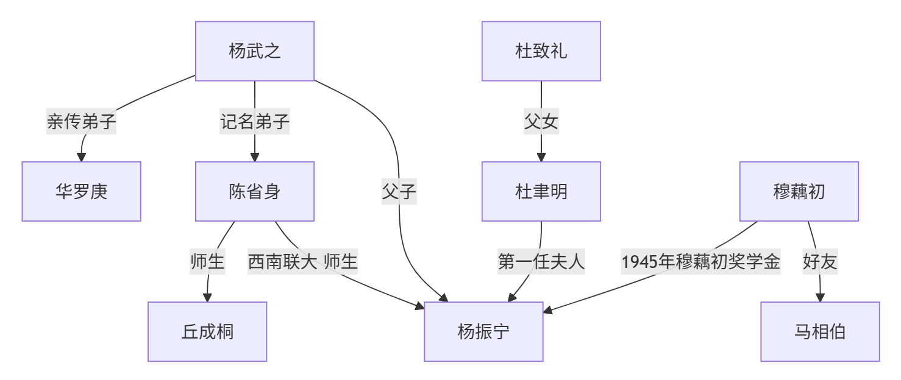
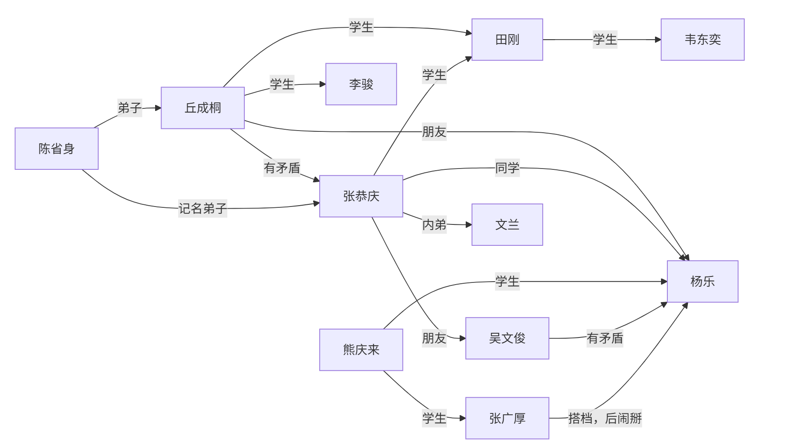

> 本笔记基于上海交通大学 *周钢老师* 2024-2025学年夏季学期教学内容整理，并根据个人理解与思考进行扩展和补充。

# 数学史
## 中国数学史

### 数学与文化表达
- 数字在语言中的应用
- 数字表达文化，成语：七上八下、不三不四
- 象征意义：十三点、二百五
- 用数学来造字：三表多、森表示多木

### 数学与哲学思想
- 道家：道生一，一生二，二生三，三生万物
    - $0\rightarrow 1\rightarrow 2 \rightarrow 3 \rightarrow \cdots \rightarrow \infty$
- 儒家：虚无生太极，太极生两仪，两仪生四象，四象生八卦
    - $0 \rightarrow 2^0 \rightarrow 2^1 \rightarrow 2^2 \rightarrow 2^3 \rightarrow \cdots$
- 佛教

### 历代数学
#### 秦朝
- 户籍制度：统计学管理国家
- 秦始皇重视数学：官员必须懂数学才能管理好国家
- 通过数学计算战争规模和后勤需求。
- 长城和陵墓的建设

#### 汉朝
- 《九章算术》：古代数学的经典著作
    - 方程求解
    - 统计学
    - 几何学
    - 代数方程

#### 隋朝
- 发明科举
- 隋炀帝重视数学
- 国子监算学
- 通过数学规划大运河

#### 唐朝
- 唐太宗李世民重视数学
- 隋唐时代国子监算学的教科书，史称《算经十书》
- 十部书的名称是：
    - 《周髀算经》、《九章算术》、《海岛算经》、《张丘建算经》、《夏侯阳算经》、《五经算术》、《缉古算经》、《缀术》、《五曹算经》、《孙子算经》
- 杰出数学家：李淳风、僧一行

#### 宋朝
- 古代数学顶峰
- 主要成就：
    - 《算经十书》的注释和发展
    - 《九章算术》的推广和应用
    - 数学教育的普及
- 纸牌娱乐中的数学：休闲产生文化
    - 扑克
    - 麻将
- 四大杰出数学家：
    - 秦九韶：同余运算、快速运算
    - 李冶：同余运算、不定方程
    - 杨辉：杨辉三角（帕斯卡、牛顿）、组合数学
    - 朱世杰：数论、代数方程
        - 热衷办学
        - 吴文俊自称其学生

#### 元朝
- 《四元玉鉴》：代数方程的研究
- 《九章算术》的注释和发展

#### 明朝
- 徐光启：数学家、天文学家
    - 《几何原本》：欧几里得几何的介绍
        - 欧氏几何：传教士传入
    - 徐家汇：徐光启逃难携家人来到上海
- 朱世杰：《算学启蒙》

#### 清朝
- 康熙：
    - 《御制数理精蕴》
    - 十六岁亲政，每日朗诵欧氏几何
    - 个人热爱数学
- 钦天正：天文学、历法、数学
- 周培公：比例地图
    - 模拟图 ≠ 比例图
- 莱布尼茨
    - 八卦与二进制
    - 与康熙书信往来，关系密切
- 清末：不重视数学
- 教育
    - 北洋公学、南洋公学
    - 南开大学

### 近代数学家
- **华罗庚**
    - 中专毕业后自学成才
    - 拼命发论文、在国际刊物发表论文后欣喜若狂：“和别人在同个起点，只是晚了点”
    - “不太会做人”、比较强势、人缘不太好
    - 发文章倡议海外留学生回国建设新中国、主持中国的数学发展
    - 与苏联数学家关系友好
    - 华罗庚与苏家驹
        - 苏家驹写了一篇“一元五次方程的公式解”论文，华罗庚试图模仿，发现行列式作分母未验证非零，写了反驳文
    - 华罗庚与姜立夫
        - 姜立夫向熊庆来推荐华罗庚
        - 在恩人姜立夫由中央研究院院士转中科院院士时投了反对票
    - 华罗庚与熊庆来
        - 姜立夫推荐华罗庚给熊庆来
        - 熊庆来求贤若渴，邀请华罗庚去清华
    - 华罗庚与杨武之
        - 杨武之：
            - 杨振宁父亲
            - 熊庆来之后的清华数学系系主任
            - 与华罗庚关系密切，辅导华罗庚
        - 华罗庚师从陈武之，但是鲜少提及
    - 华罗庚与维纳
        - 维纳：现代控制论之父
            - 用线性代数解状态方程：一阶微分方程组
            - 对应的经典控制论：函数分析、解高阶方程
        - 华罗庚让维纳帮自己给哈代写推荐信
    - 华罗庚与陈省身&吴文俊
        - 华罗庚和两人关系不好
        - 陈省身
            - 国民党中央研究院数学所代理所长
            - 解放战争时仓皇出逃美国
        - 吴文俊
            - 拜访陈省身
            - 从学平面几何到公费留学
            - 响应华罗庚号召回国
    - 华罗庚与哈代
        - 华罗庚想出国跟随哈代学习，于是给陈立夫写信
            - 陈立夫：
                - 哥哥陈果夫、叔叔陈其美
                - 中统头子（中统对内、军统对外）
                - 为官清廉
            - 陈立夫资助华罗庚出国
        - 陈省身劝阻：跟随哈代学习难以取得更高成就
    - 华罗庚与丘成桐
        - 华罗庚很尊敬丘成桐
            - 丘成桐年纪小，但华罗庚在信中称他“成桐兄”
        - 丘成桐：
            - 清华大学丘班
            - 老师：陈省身
- **朱公谨**：师从柯朗
- 三胡：
    - 胡敦复
    - 胡刚复
    - 胡明复：宣扬科学意识，创办报纸进行科普
- **苏步青**
    - 做了三万多道高等数学题
    - 负责中科院数学研究所筹备工作
        - 第一任所长是华罗庚
- **王湘浩**
    - 北京大学教授、吉林大学数学系主任
    - 与华罗庚关系好
    - 公认吴文俊强于王湘浩
- **吴文俊**
    - 面对华罗庚的发难，吴文俊拿王湘浩当挡箭牌
    - 评价老师陈省身时，引用杨振宁“千古存心事，欧高黎嘉陈”
    - 法国国家博士
        - 法国国家博士比法国博士含金量高得多
    - “大满贯”：
        - 国家自然科学奖
        - 尖端科学技术奖
        - 邵逸夫科学奖
- **陈省身**
    - 应用数学比纯数学难
    - 代表美国分钱
    - 一生三个所：
        - 国民党中央研究院数学研究所
        - 美国国家数学科学研究所
        - 南开大学陈省身数学研究所


- **北派**：华罗庚、丘成桐、王虹、吴文俊
    - 题做的少、论文发得多
- **南派**：苏步青、陈建功、……
    - 题做的多、论文发得少


## 西方数学史
### 漫谈
- 中国数学与西方数学对比
    - 中国数学的发展：
        1. 治国平天下（务实）
        2. 数学（运筹、术数）
        3. 中国文化
        4. 人工智能基础
    - 西方数学的发展：
        1. 有闲
        2. 地位&辩论
            - 辩论：
                - 辩题：寻找有用的题目
                    - 七大圣贤之首泰利斯：东游记（古埃及、古巴比伦）
                - 规则：亚里士多德发明形式逻辑
            - 大奴隶主辩不过小奴隶主
        3. 学习
        4. 头尾分析
            - 字母化
            - 数学
            - 科学

    
    - 西方的数学是纯数学——精神产物
    - 中国的数学是应用数学——实用产物、物质产物

    

- 区分：科学、宗教、迷信
    - 科学与宗教体系相似：
        - 都是头尾分析
            - 科学：可实验——头
            - 宗教：信仰——头
    - $\sum$ 理论 $\neq$ 科学
    - 实验事实与宗教理论不一致时：
        - 科学：修正理论
        - 迷信：反对事实

- 两种方法：
    - 汇集多数案例：MBA（案例分析法）
    - 由少数案例推出剩余案例：Science（科学方法）

- 理科与工科
    - 工科提出问题
    - 理科解决问题

### 古希腊数学家
#### 泰利斯（Thales）/泰勒斯
- 七大圣贤之首
- 东游记：
    - 古埃及：向埃及人学习观察洪水，指导避难
    - 古巴比伦
- 几何学的奠基人：从几何图形到测量金字塔
- 代数、表格：转道巴比伦途中所学
- 把数学带回古希腊
- 轶事：
    - 数学挣钱：泰利斯是商人，预言气候干旱，提前收购水果卖出高价
- 发源地 $\neq$ 光大地
    - 数学发源于古埃及、古巴比伦
    - 光大于古希腊
- 有闲才能有文化

#### 柏拉图（Plato）
- 坚持：苏格拉底和柏拉图的甩手的故事
    - 苏格拉底的学生
- 理想主义者
- 数学：真、善、美
    - 真：真理——证实明天
        - 亚里士多德用三段论证明
- 数学与实验结果不一致时：相信数学
- 柏拉图学院：“学院” → “University”
    - 有兴趣者聚在一起
    - 定时定点
    - 分类：“类” → “学科”
    - 不懂数学者不得入内
    - 对应中国的书院

#### 亚里士多德（Aristotle）
- 柏拉图的学生、亚历山大大帝的老师
- 形式逻辑：三段论
- 集大成者、百科全书式人物
- 重要观点：“精英悲哀”
- 提出：科学、技术、艺术学
- 想象得到一些结果：被伽利略批判
- 形而上学 & 形而下学

#### 欧几里得（Euclid）
- 欧氏几何之父、纯粹数学家
- 亚氏理论的具象化 → 头尾分析法 → 《几何原本》
    - 《几何原本》：天下第一书
- 检验神童的标志：科学的样板
- 欧几里得算法：求最大公约数
- 做研究：小头大尾

#### 阿基米德（Archimedes）
- 数学之神：无从考证
- 应用数学祖师爷
- 数学：小众文化
- 研究内容：
    - 微积分雏形：缺少极限概念，但其思想实质却伸展到17世纪趋于成熟的无穷小分析领域里去，预告了微积分的诞生。
    - 二次曲线
    - 切线
    - 力学

#### 毕达哥拉斯（Pythagoras）
- 泰利斯的关门弟子
- 数学与音乐的关系
- 毕达哥拉斯学派
- 万物皆数、用数算命
- 定义自然数：自然物 → 自然数
- 成果不署名

### 十七世纪代表性法国数学家
#### 帕斯卡（Blaise Pascal）
- 评价：
    - 神童：16岁著书写出“圆锥曲线理论”
    - 残疾：同华罗庚
    - 天才
    - 单相思
- 古典概率创始人
- 帕斯卡定理：上帝不喜欢真空
- 计算机祖师爷：
- 宗教信仰：29岁后献身宗教，试图证明上帝存在
    - 与他类似：康德、叔本华、牛顿
    - 康德是黑格尔老师、黑格尔是马克思老师、马克思是毛泽东老师
- 哲学家、散文家

#### 笛卡尔（René Descartes）
- 从小体弱多病
- 善于观察：笛卡尔坐标系
    - 观察蜘蛛
- 《方法论》附录：解析几何
- 创立解析几何
- 哲学家：我思故我在
- 以太论：涡动力学

#### 费马（Pierre de Fermat）/费尔马
- 方法解
    - 独立于笛卡儿发现解析几何的基本原理
- 喜欢买旧书和研究旧书
    - 阿拉伯的书：有些是从古希腊抢来的书
- 费马大定理：$x^n + y^n = z^n$，$n>2$ 无整数解
    - 作眉批：去世后儿子整理出书
    - 称自己已经用“奇妙的想法证出来”，但在页边的空白处写不下
        - 因此有时称为费马猜想而非定理
    - 无数数学家尝试证明该命题但都以失败告终直到三百多年后才被证明
- 用水平切线找极值点

### 漫谈：交大
> 怎么刚刚讲着法国数学家，突然就跳到交大了（


- 交大历任校长轶事
    - 范绪箕
    - 朱物华
    - 翁史烈
    - 谢绳武
    - 张杰
    - 林忠钦
    - 丁奎岭



- 保护成果
    - 前提：
        - 要发论文
        - 不能被剽窃
    - 方法：
        - 只给结论不给推导过程
            - 注意到、显然、容易得到、不难得出
        - 只给成果不给方法
- “公开的专利都是不挣钱的”


### 十七世纪末至十八世纪初的伟大数学家
- 关于微积分的争吵：
    - **为国家利益而争吵**
    - 各方争吵：
        - 意大利：阿基米德
        - 德国：开普勒
        - 法国：费尔马
        - 英国：巴罗（牛顿的老师）
    - 达成共识：牛顿和莱布尼茨

#### 巴罗（Isaac Barrow）
- 牛顿的老师
- 发现微积分的基本定理
    - 研究微积分需要承认勾股定理：$\mathrm{ds}^2 = \mathrm{dx}^2 + \mathrm{dy}^2$

#### 牛顿（Isaac Newton）
- 物理学家、数学家、天文学家
- 小时候“笨”：小时候在墙上留下大小不同的洞给不同动物走
    - 普通人角度：笨
    - 科学家角度：聪明（分类思想）
- 早年研究概率论：想挣钱
- 研究力学：
    - 经典力学的奠基人：牛顿三大定律
    - 发现万有引力定律
    - 《自然哲学的数学原理》：经典力学的奠基之作
- 研究天体
- 发明“流数法”，即**增量分析法** → 微积分的创始人之一
    - 明天 = 今天 + 增量
    - 增量 = $\sum$ 小增量
- 研究光学：光的色散现象
- 英国皇家给牛顿官职：造币厂厂长
- 人物关系：
    - 死对头：胡克
        - 死后手稿被牛顿销毁
    - 好朋友：哈雷
    - 最得意的学生：库兹
        - 最早提出最小二乘法，但由于没有用武之地而被遗忘
    - 追随者：泰勒、麦克劳林
- 增量思维和存量思维
    - 在经济学上：边际分析
- 去世后葬礼非常隆重

#### 莱布尼茨（Gottfried Wilhelm Leibniz）
- 德国哲学家、数学家
- 百科全书式人物
- “文科生”：原本不学数学
- 好奇心强、好学
- 微积分的创始人之一
    - 莱布尼茨符号：$\int$（积分符号）和 $\mathrm{dx}$（微分符号）
- 数理逻辑：一生被卷入争吵，为避免争吵，发明“争吵的数学”
- 建议成立“科学院”
- 欣赏对手：很欣赏牛顿，英雄惜英雄


- 数学的三大革命
    - 欧几里得：$\sum$ 数学 → 头尾数学
    - 莱布尼茨：学数学不需要问为什么，遵守规则即可
    - 委托（人工智能化）


#### 欧拉（Leonhard Euler）
- 瑞士数学家、物理学家
- 对数学具有宗教式的狂热，被誉为18世纪最伟大的数学家
    - 进入人类前二十位数学家
- 研究领域：
    - 数论
    - 图论
    - 拓扑学
    - 复变函数
    - 微分方程
    - 数学物理学
- 欧拉公式：$e^{i\pi} + 1 = 0$
- 人物关系
    - 父亲：神职人员，热爱数学，但希望欧拉学习神学
    - 老师：约翰·伯努利很欣赏欧拉，帮他说服父亲
    - 德皇的老师，不想参加舞会，想辞职
        - 德皇提出条件：推荐一个顾问，水平与他相当，且会跳舞
        - 于是推荐拉格朗日，德皇很满意
    - 全欧洲数学家的老师
- 离开德国后，前往俄国（圣彼得堡）
    - 叶卡捷琳娜一世（俄国女皇）安排欧拉进了圣彼得堡大学艺术系，而非数学系
    - 叶卡捷琳娜二世对欧拉非常欣赏和照顾
    - 奠定圣彼得堡大学数学系的基础，产生许多杰出数学家
        - 切比雪夫
        - 马尔可夫
        - 坎托罗维奇
- 记忆力超群，能复述家里的书
- 论文多

#### 拉格朗日（Joseph-Louis Lagrange）
- 意大利数学家、物理学家，终生在法国
- 埃菲尔铁塔上的人物
- 研究领域：
    - 数论
    - 泛函
    - 解析力学
    - 微分方程
    - 变分法
- 成就：
    - 拉格朗日乘数法：求函数极值的条件
    - 拉格朗日插值公式：多项式插值的基础
- 傲慢：“比牛顿还牛”
- 最重要工作：承认“第一原理”
    - 上帝以能量最低的方式创造世界
    - 《分析力学》：天下第三书
    
    - 天下第零书：《圣经》
    - 天下第一书：《几何原本》
    - 天下第二书：《自然哲学的数学原理》
    - 天下第三书：《分析力学》
    
- 倒在“一元五次方程的公式解”上
    - 在犹豫中死亡
    - 给后人留下解决的路径

#### 高斯（Carl Friedrich Gauss）
- 德国数学家、物理学家、天文学家
- 被誉为“数学王子”，数学 + 文化的典范
- 研究领域：
    - 数论
    - 代数
    - 几何
    - 天文学
    - 电磁学
- 成就：
    - 高斯定理：电场的散度与电荷密度成正比
    - 高斯曲率：描述曲面的弯曲程度
    - 高斯消元法：线性方程组求解方法
    - 高斯-勒让德算法：数值积分方法
    - 高斯-马尔可夫定理：最小二乘估计的有效性
- 经历：
    - 父亲在铁路工作，家里很多孩子，经济拮据
    - 欧拉是家里唯一的男孩，母亲重男轻女，坚持让欧拉上学
    - 上小学时，高斯求和：$\sum_{i=1}^{n} i = \frac{n(n+1)}{2}$
    - 上大学时，高斯犯难：文学和数学都很好，不知道该选哪个
        - 世界难题：用圆规直尺作正十七边形
        - 高斯尝试证明，成功了，于是决定读数学
        - 恋乡情结：于是去哥廷根大学读书
        - 大一借了43本书，多数为文学书
            - 理由：“功夫在外不在内”
- 喜欢钱
    - 股票投资
    - 简朴节约
    - 天文台兼职
    - 金融数学第一人：正态分布
    - 钞票人物
- 博士论文：$P_n(x)=0$ 在复数域有$n$个根
    - 一生给出7个证明
- 学生：黎曼、狄利克雷

#### 黎曼（Bernhard Riemann）
- 德国数学家
- 研究领域：
    - 数论
    - 复变函数
    - 微分几何
    - 拓扑学
- 成就：
    - 黎曼猜想：关于素数分布的猜想
    - 黎曼积分：对函数进行积分的定义
    - 黎曼曲率张量：描述曲面的弯曲性质
- 经历：
    - 家境贫寒，兄弟姐妹多
    - 喜欢生小孩，所以一直很穷，但仍坚守数学
    - 结合勤工俭学与数学研究
    - 毕业后留校，高斯去世后接任教职，进行就职演讲
    - 恰逢法国数学大奖
    - 早年拖垮了身体，因此英年早逝
        - 去世后，因爱因斯坦的相对论而被闻名
        - 黎曼几何：可以做相对论基础

### 二十世纪初德国哥廷根大学“数学三剑客”
#### 克莱因（Felix Klein）
- 德国数学家
- 数学+管理第一人
- 哥廷根大学数学系院长
- 研究领域：
    - 几何学
    - 代数
    - 数学教育
- 成就：
    - 克莱因瓶：一种非定向的拓扑空间
    - 克莱因四元数：一种代数结构
    - 克莱因群：描述对称性的群
- 学生：恩格尔（恩格尔系数）
- 会赚钱
- 力排众议聘请年轻的希尔伯特
- 主张：
    - 强调“理工结合”
    - 扩张
    - 数学是几何

#### 闵可夫斯基（Hermann Minkowski）
- 德国数学家（德国？俄国？）
- 犹太人，是家里最小的
- 年龄比希尔伯特小，插班和希尔伯特同班
- 哥廷根大学数学系教授
    - 上课，教“拓扑学”，出了洋相：四色问题
- 学生：爱因斯坦
    - 在学校里，爱因斯坦经常逃课
    - 爱因斯坦发表相对论时，闵可夫斯基帮他整理理论依据，找到黎曼的论文
    - 闵可夫斯基在外讲学宣传爱因斯坦相对论时，突发阑尾炎，去世
- 研究领域：
    - 数论
    - 几何学
    - 物理学
- “数学是科学的语言”

#### 希尔伯特（David Hilbert）
- 德国数学家
- 哥廷根大学数学系教授
- 研究领域：
    - 数学基础
    - 数论
    - 代数
    - 几何
- 成就：
    - 希尔伯特空间：无限维向量空间
    - 希尔伯特问题：23个未解决的数学问题
    - 希尔伯特基：线性代数中的基概念


1. 康托尔的连续统基数问题
2. 算术公理的相容性
3. 两个等底等高的四面体体积相等的证明
4. 直线作为两点间最短距离问题
5. 李群的连续变换群的局部同构与整体同构问题（连续群的解析解）
6. 物理公理的数学处理
7. 某些数的无理性与超越性
8. 素数问题（含黎曼猜想、哥德巴赫猜想、孪生素数问题等）
9. 任意数域中最一般的互反律的证明（推广二次互反律）
10. 丢番图方程的可解性（判断整系数方程是否有整数解的算法）
11. 系数为任意代数数的二次型问题
12. 阿贝尔域上的克罗内克定理推广到任意代数有理域
13. 不可能用只有两个变数的函数解一般的七次方程
14. 证明某类完全函数系的有限性（代数不变量理论）
15. 舒伯特计数演算的严格基础（枚举几何基础）
16. 代数曲线和曲面的拓扑问题
17. 正定形式的平方和表示（正定有理函数表为有理函数平方和）
18. 由全等多面体构造空间（空间的tiling问题）
19. 正则变分问题的解是否一定解析
20. 一般边值问题（椭圆型微分方程边值问题）
21. 具有给定单值群的线性微分方程解的存在性（黎曼问题）
22. 用自守函数一致化解析关系（黎曼曲面单值化）
23. 变分法的进一步发展


- 20世纪初，世界上出现许多协会
    - ICM：国际数学家大会（数学界的奥运会）
        - 1897年成立于瑞士苏黎世
        - 每四年举办一次
        - 颁发两个奖：
            - 菲尔兹奖
            - 纳瓦林纳奖
        - 会上报告的时长与身份相符
        - ICM最值得纪念的日子：1900年8月6日，38岁的希尔伯特在报告中提出著名的“23个问题”，深刻地影响了整个世界


- 世界数学强国：
    - 提出问题给后人做
    - 做的人因此成名
- 区别大师
    - 大师：教授你会但是不会思考的东西
    - 小师：教授你不会的东西


### 漫谈：菲尔兹奖
- 一个具有理想主义色彩的奖项
- 数学界的“诺贝尔奖”
- 中立：不署国名
- 1932年没奖、1936年首次颁奖
- 每次获奖人数不多于4人，年龄不超过40岁
- 获奖：一个奖章、1000美元左右奖金
- 轶事：
    - 设奖原因——奇怪的野史小故事
    - 瓦尔拉斯与费马大定理
        - 瓦尔拉斯囊括了四大奖项
        - 传奇人物
    - 吴文俊：搞数学年龄要小，搞文学艺术年龄要大
    - 数学家与经济学家：相互讽刺

### 漫谈：Wolf奖
- 数学终身成就奖
- 比菲尔兹奖晚44年（1976年成立）
- 主要捐款人：R.Wolf.
    - 从废渣中炼铁，致富
    - 成立基金会，理事由以色列官员担任
- 获奖领域：**数学**、物理、化学、医学、农业、艺术
- 国内著名Wolf学者：
    - 陈省身
    - 吴健雄（物理）
    - 丘成桐
    - 袁隆平（农业）
    - 徐甜甜（建筑）
    - 何顺（化学）
- 陈省身：1984年获奖




```
    graph TD;
        A[杨武之]
        E[华罗庚]
        B[陈省身]
        C[丘成桐]
        D[杨振宁]
        F[杜致礼]
        G[杜聿明]
        H[穆藕初]
        I[马相伯]

        A -->|亲传弟子| E
        A -->|记名弟子| B
        B -->|师生| C
        B -->|西南联大 师生| D
        A -->|父子| D
        F -->|父女| G
        G -->|第一任夫人| D
        H -->|1945年穆藕初奖学金| D
        H -->|好友| I
```


### 漫谈：艾米·诺特讲座
- 艾米·诺特
    - 女性，为了学习数学客服社会歧视
    - 希尔伯特扶持
        - 以希尔伯特的名义，在哥廷根大学讲授数学课程。
    - 被希特勒迫害：祖上有犹太血统
- 随着女权运动的发展，艾米·诺特讲座成为女性数学家的重要平台
- 胡和生：首位于2002年北京ICM大会上作“艾米·诺特讲座”的华人女性数学家
    - 丈夫：谷超豪
        - 中科院夫妻院士
    - 老师：苏步青
        - 研究生：浙江大学
        - 本科：交大数学系

## 中国近代著名数学家
- 2002年之前的ICM学者：
    - 华罗庚
    - 吴文俊
    - 陈景润
    - 张恭庆
    - 马志明
    - 冯刚

### 华罗庚
<!-- 见[中国数学史-近代数学家-华罗庚](#近代数学家) -->
<a href="#近代数学家" name="https://pic.baike.soso.com/ugc/baikepic2/20083/20220319032343-66853249_jpeg_375_500_42891.jpg/0" class="LinkCard">中国数学史-近代数学家-华罗庚</a>



```
graph TD;
    A[杨武之]
    B[华罗庚]
    C[陈省身]
    D[丘成桐]
    E[陈景润]
    F[王元]
    G[潘承洞]
    H[熊庆来]
    I[吴文俊]
    J[苏步青]
    K[柯召]
    L[林家翘]
    M[许宝騄]
    N[赵访熊]
    O[维纳]
    P[哈代]

    H -->|亲传弟子| B
    A -->|西南联大同事| B
    B -->|导师| E
    B -->|导师| F
    B -->|导师| G
    C -->|西南联大同事| B
    C -->|导师| D
    J -->|早期影响| B
    K -->|清华同事| B
    L -->|清华同事| B
    M -->|清华同事| B
    N -->|清华同事| B
    O -->|普林斯顿访问学者| B
    P -->|导师| B
    B -->|中国科学院数学所| E
    B -->|中国科学院数学所| F
    B -->|中国科学院数学所| G
    B -->|学术合作| I
    C -->|西南联大同事| A
    A -->|导师| C
    C -->|学术合作| I
    J -->|浙江大学同事| C
    K -->|中英庚款同学| C
    L -->|西南联大同学| C
    M -->|牛津大学同学| C
    O -->|麻省理工学院同事| C
    P -->|学术合作| M
```


### 陈景润
- 数学家、物理学家
- 研究领域：
    - 数论
    - 解析数论
    - 组合数学
- 成就：
    - 解决了著名的“哥德巴赫猜想”中的一个重要问题
        - 证明了每个充分大的偶数都可以表示为一个素数和一个不超过两个素数的乘积之和，即“陈氏定理”
    - 在数论和组合数学领域发表了多篇重要论文
- 区分陈景润的**物质**&**精神**
    - 物质上：
        - 早年受排挤
        - 从厦门大学数学系提前毕业，去中学教书
            - 不善言辞，加之福建口音重，不受欢迎
        - 独自研究数论，后来去中科院中关村
        - 在一个小隔间里攀登数学高峰
        - 成果发表于科学通报，毛主席赏识，大力宣传陈景润
        - 节约
            - 生活过于节俭，导致身体不好
            - 研究经费节约
        - 疗养院：海军医院
            - 由昆：分配来照顾陈景润的护士
                - 陈景润喜欢上由昆
                - 申请结婚，分一套房
        - 希望儿子学数学，结果发现没天赋，但是儿子咬牙坚持
        - 徐迟：崇敬陈景润，写了《哥德巴赫猜想》一书
        - 晚年陈景润得了帕金森综合征，六十多岁就逝世了
    - 精神上：
        - 忘我的科学精神
        - 本土发展
        - 跨世纪人才
            - 十年磨一剑：宝刀 or 菜刀？
        - 丘成桐认为陈景润不伟大

### 冯康
- 中国近代科学计算之父
- 我国十三位首席科学家之一
- 研究领域：
    - 数值分析
    - 计算数学
    - 差分方程
- 成就：
    - 发展了数值分析和计算数学的理论与方法
    - 在差分方程和数值积分方面做出了重要贡献
- 家里兄弟姐妹都了不起
    - 弟弟：冯端，凝聚态物理学家、为纳米材料学家，十三位首席科学家之一
    - 哥哥：中山大学工程师
    - 姐姐：冯慧
        - 姐夫：叶笃正，中国大气物理学创始人
- 表面不用功，但是成绩好
- 苏州中学毕业
- 第一名考进重庆中央大学电机系
    - 读“科学”（胡明复，交大），喜欢“数学”
    - 申请转系被拒绝，于是两个专业一起学
    - 大三得了肺结核，回家养病，奇迹康复
- 毕业后担任复旦（震旦）大学数学物理系助教
    - 后来又担任清华大学物理系及数学系助教
- 尊重华罗庚
    - 进入中国科学院计算技术研究所工作
    - 进入苏联斯捷克洛夫数学研究所进修
        - 导师：庞特里亚金（盲人）
    - 华罗庚指派任务：组建中科院计算中心
- 冯康在解决大型水坝计算问题时，总结了“数学方法”，发文：
    - 《基于变分原理的差分格式》
    - 有限元法
        - 国家自然科学奖二等奖
    - 发了一篇中文一篇英文，因此倒大霉：批斗、改造
        - 平反后成为中科院院士
- 提出哈密顿系统的辛几何算法
    - 国家自然科学奖一等奖
- 去世后追悼会上悼文称他为“国际知名数学家”
    - 弟弟冯端不满：“知名”评价太低
    - 美国庆祝数学会成立100周年时，P.D.Lax 在演讲中提到有限元方法，称冯康为“国际著名数学家”
    - 中科院补救：中国科学报一年内每期都要刊登冯康的悼文

### 张恭庆
- 中国科学院院士
- 研究领域：和陈省身相似
    - 微分几何
- 中学：上海市南洋模范中学
- 拔青苗：四年毕业
- 北大数学系十大神童之尾
    - 之首：张景中
- 刻苦，英文好，因此被借调校核工业
- 改革开放后，赴美进修：柯朗数学研究所
- “大陆数学实力第一”



```
graph LR;
    A[陈省身]
    B[丘成桐]
    C[张恭庆]
    D[田刚]
    E[韦东奕]
    F[李骏]
    G[吴文俊]
    H[熊庆来]
    J[张广厚]
    I[杨乐]
    K[文兰]

    A -->|弟子| B
    B -->|有矛盾| C
    A -->|记名弟子| C
    B -->|学生| F
    B -->|学生| D
    C -->|学生| D
    D -->|学生| E
    C -->|朋友| G
    B -->|朋友| I
    C -->|同学| I
    H --> |学生| I
    H --> |学生| J
    G -->|有矛盾| I
    J --> |搭档，后闹掰| I
    C -->|内弟| K
```


### 马志明
- 中科院院士
- 研究领域：
    - 随机数学
    - 概率论
- 重庆人
- 毕业后去工厂劳动，业余学数学
    - 工农兵大学学生
    - 恢复高考后不承认工农兵大学，视为专科学历
- 1978年恢复高考，考上王寿仁的研究生
    - 王寿仁：研究随机数学
    - 随机数学研究领域冷门：被派出国进修
- 为人好


- 中国数学三大奖
    - 陈省身奖：
    - 华罗庚奖
    - 钟家庆奖


### 吴文俊
- 交大数学系期间，遇到武崇文老师
- 回国后，与华罗庚一起
- 缺资料研究，下放工厂，思考“机器证明”
    - 现在的“人工智能”
- 证明中的“机证史”
    - 机器证明史
        - 即“人工智能”
    - 东方：吴文俊
        - 理想：
            - 马克思：任何学科都可以数学化
            - 笛卡尔：任何数学问题都可以代数化
            - 吴文俊：任何代数问题都可以转化为多项式问题
            - 古人思考：任何多项式问题都可以通过简单动作完成 → 机器化
        - 吴氏方法原理：
            - 命题能写作多项式形式
                - 命题：已知 & 求证
                - 已知条件都可以写作多项式形式
            - 消元法
            - 辗转相除法
                - 若最后 $R=0$，则命题成立，反之若 $R \neq 0$，则命题不成立
            - 机器证明理论成立！
    - 西方：另一条路
- 学生：周成青
    - 在中科院上过吴文俊的机器证明课
    - 赴美读博，上到另一门机器证明课，用吴文俊课上的笔记完成作业
        - 被教授发现，与吴文俊交流
        - 吴文俊闻名美国

## 证明史、计算式与求解史
### 证明史
<a href="#吴文俊" name="https://ts2.tc.mm.bing.net/th/id/OIP-C.i_QiY8asoaPIoYAECoJ72gHaJr?w=231&h=300&c=10&rs=1&bgcl=fffffe&r=0&o=6&dpr=1.5&pid=23.1" class="LinkCard">中国近代著名数学家-吴文俊-机器证明史</a>

证明史 → 统计证明 → 人工智能

### 求解史
- 一元一次方程：
    - 古希腊、两河流域文明：无刻度的圆规加直尺作出的图形
- 一元二次方程：
    - 部分可解，如 $x^2+3x+2=0$
    - 部分解不出，如 $x^2+1=0$
    - 韦达：形式解
        - 对于 $ax^2+bx+c=0$，有根 $x_\pm=\frac{-b\pm\sqrt{b^2-4ac}}{2a}$
        - 根
            - 正根：有自然意义
            - 负根：没有自然意义
            - 复数：“魔鬼”
- 一元三次方程：
    - 无人能解出公式解
    - 意大利：流行打擂
    - 塔尔塔塔利亚（真名：丰塔纳）：
        - 条件：$b^2+c^2\neq 0$ 且 $bc=0$ 则有解
        - 打擂天下无敌，但坚决不收徒
    - 卡尔达诺
        - 医生
        - 天才，要拜师塔尔塔塔利亚，被拒绝，最终成功
        - 找了个天才学生到乡下潜心研究，成功得到无条件的一元三次方程公式解
        - 卡尔达诺公式：
            - 将一般三次方程 $y^3+ay^2+by+c=0$ 经过代换 $y=x-a/3$ 化为 $x^3+px+q=0$ 的形式
                - $u=\sqrt[3]{-\frac{q}{2}+\sqrt{\left(\frac{q}{2}\right)^2+\left(\frac{p}{3}\right)^3}}$
                - $v=\sqrt[3]{-\frac{q}{2}-\sqrt{\left(\frac{q}{2}\right)^2+\left(\frac{p}{3}\right)^3}}$
                - $w=\frac{-1+\sqrt{3}i}{2}$
            - 则 $x$ 的三个根为
                - $x_1=u+v$
                - $x_2=uw+vw^2$
                - $x_3=uw^2+vw$
        - 出书：《大术》（又叫《大法》）
            - 引发塔尔塔塔利亚不满，发起挑战却一败涂地，最终郁郁而终
            - 卡尔达诺辩解：“不是掠美者”
            - 后人评价：卡尔达诺不是“掠美者”，《大术》即使除去一元三次方程和一元四次方程，仍是一本伟大的书
- 一元四次方程：
    - 也被卡尔达诺和学生费拉里解决
    - 费拉里：天才，卡尔达诺的学生
- 一元五次方程：
    - 万人坑
    - “英雄”
        - 阿贝尔
            - 挪威数学家
            - 到法国游学，见到了柯西（Cauchy）
        - 伽罗华
        - 雅各比
