> 本笔记基于上海交通大学 *郭捷老师* 2025-2026 学年秋季学期教学内容进行整理，部分图片来自郭老师的课件，若有侵权请联系删除。


# 第一章 数据库系统概论

## 数据库系统概述

### 四个基本概念
#### 数据（Data）
- 数据是数据库中**存储的基本对象**。
- 定义：描述事物的符号记录
- 种类：数值、文字、图形、图象、声音、视频等
- 数据与其语义是不可分的

#### 数据库（DataBase, DB）
- 定义：数据库（简称DB）是**长期储存**在计算机内、**有组织、可共享**的**大量数据集合**。
- 基本特征：
    - 数据按一定的数据模型组织、描述和储存；
    - 可为各种用户共享；
    - 冗余度较小；
    - 数据独立性较高；
        - 应用程序与数据相互独立；
    - 易扩展。

#### 数据库管理系统（DataBase Management System, DBMS）
- 定义：数据库管理系统（简称DBMS）是位于**用户与操作系统之间**的一层**数据管理软件**
- 用途：科学地组织和存储数据、高效地获取和维护数据。
- 主要功能：
    - 数据定义功能
        - 提供数据定义语言（DDL），定义数据库中的数据对象的组成与结构；
    - 数据组织、存储、管理功能
        - 文件结构和存取方式
        - 数据如何联系
        - 提高存储空间利用率等
    - 数据操纵功能
        - 提供数据操纵语言（DML）
        - 操纵数据实现查询、插入、删除和修改等基本操作
    - 数据库的事务管理和运行管理
        - 保证数据的安全性、完整性
        - 支持多用户对数据的并发使用
        - 实现发生故障后的系统恢复
    - 数据库的建立和维护功能
        - 数据库数据批量装载和转储
        - 介质故障恢复
        - 数据库的重组织
        - 性能监视与分析等
    - 其他功能
        - 网络中其它软件系统的通信
        - 各系统之间的数据转换
        - 异构数据库之间的互访和互操作等

#### 数据库系统（DataBase System, DBS）
- 定义：数据库系统（简称DBS）是指在计算机系统中**引入数据库和DBMS后的系统构成**
- 在不引起混淆的情况下常常简称为数据库。
- 构成：
    - 由数据库、数据库管理系统（及其应用开发工具）、应用系统、数据库管理员（DataBase Administrator, DBA）组成，是存储、管理、处理和维护数据的系统。
- 结构：
    ```mermaid
    graph TD
    A[用户] --> B[数据库应用系统]
    C[用户] --> B
    D[用户] --> B
    B --> E[数据库应用开发工具]
    E --> F[DBMS]
    F --> G[OS]
    G --> H[DB]
    F <--> I[DBA]
    I --> H
    H --> J[硬件]
    ```

### 数据库管理技术的产生与发展
- 数据管理技术：对数据进行分类、组织、编码、存储、检索和维护的技术，是数据处理和数据分析的中心问题
- 发展过程：
    - 人工管理阶段(40年代--50年代中)
        - 背景
            - 应用背景：计算机主要用于科学计算；
            - 硬件背景：外存只有磁带、卡片、纸带，没有直接存储设备；
            - 软件背景：没有操作系统、没有管理数据的软件；
            - 处理方式：批处理。
        - 特点
            - 数据不保存，没有文件的概念；
            - 应用程序管理数据，程序员负担很重；
            - 数据面向某个应用程序，无共享，冗余度大；
            - 应用程序与数据一一对应，数据不具有独立性。
    - 文件系统阶段 (50年代末--60年代中)
        - 背景
            - 应用需求：科学计算、管理；
            - 硬件水平：有了磁盘、磁鼓等存储设备；
            - 软件水平：出现文件系统；
            - 处理方式：联机实时处理、批处理。
        - 特点
            - 数据的管理者：文件系统，数据可长期保存；
            - 数据面向的对象：某一应用程序；
            - 数据的共享程度：共享性差、冗余度极大；
            - 数据的独立性：独立性差，数据的逻辑结构改变必须修改应用程序；
            - 数据的结构化：记录内有结构，整体无数据结构；
            - 数据控制能力：应用程序自己控制。
    - 数据库系统阶段 (60年代末--现在)
        - 背景
            - 应用需求：大规模管理；
            - 硬件水平：有了大容量磁盘、磁盘列阵等；
            - 软件水平：有了数据库管理系统；
            - 处理方式：联机实时处理、分布处理、批处理。
        - 特点
            - 数据的管理者：DBMS；
            - 数据面向的对象：现实世界；
            - 数据的共享程度：共享性高，冗余度小；
            - 数据的独立性：高度的物理独立性和一定的逻辑独立性；
            - 数据的结构化：整体结构化，用数据模型来表示；
            - 数据控制能力：由DBMS统一管理和控制。

### 数据库系统的特点
#### 数据的结构化
- **整体数据的结构化**是数据库的主要特征之一。
- 数据库中实现的是数据的真正结构化
    - 数据的结构用数据模型描述，无需程序定义和解释；
    - 数据可以变长，最小存取单位是数据项；
    - 不再仅仅针对某一应用，而是面向整个企业或组织。

#### 数据的独立性
- 物理独立性：指用户的应用程序与存储在物理磁盘上的数据库中数据相互独立，当数据的物理存储改变了，应用程序不用改变；
- 逻辑独立性：指用户的应用程序与数据库的逻辑结构相互独立，数据的逻辑结构改变了，用户程序也可以不变。

#### 数据的高共享性
- 数据面向整个系统，可以被多个用户、多个应用共享使用。
- 数据共享的优点：
    - 能降低数据的冗余度，节省存储空间；
    - 避免数据间的不一致性和不相容性；
    - 数据库系统弹性大，易于扩充。

#### 数据由DBMS统一管理和控制
- 数据的 **安全性(Security)** 保护：使每个用户只能按指定方式使用和处理指定数据，防止不合法使用造成的数据泄密和破坏；
- 数据的 **完整性(Integrity)** 检查：保持数据的正确性、有效性、相容性，将数据控制在有效范围内，保证数据之间满足一定关系；
- **并发(Concurrency)** 控制：对多用户的并发操作加以控制和协调，防止相互干扰而得到错误结果；
- **数据库恢复(Recovery)**：将数据库从错误状态恢复到某一已知的正确状态。

## 数据模型
### 数据模型
- 在数据库中用数据模型（data model）这个工具来抽象描述、组织和处理现实世界中的数据和信息。
- 数据模型就是**现实世界数据特征的抽象**。
- 数据模型应满足三方面要求：
    - 能比较真实地模拟现实世界
    - 容易为人所理解
    - 便于在计算机上实现

### 数据建模
- 数据建模是把现实世界的具体事务抽象、组织为某一数据库管理系统支持的数据模型的过程，
- 通常分为两步：
    - 建立概念模型，将现实世界抽象为信息世界
        - 概念模型按用户观点对数据和信息建模，用于数据库设计；
    - 将概念模型转换为数据模型，将信息世界转换为机器世界
        - 数据模型按计算机系统观点对数据建模，是DBMS支持的，用于DBMS的实现。

### 概念模型
#### 用途与要求
- 用途：
    - 概念模型用于信息世界的建模
    - 是现实世界到机器世界的中间层次
    - 是数据库设计的有力工具
    - 也是数据库设计人员和用户之间进行交流的语言。
- 基本要求：
    - 较强的语义表达能力
    - 简单清晰易于用户理解
    - 易于更改和扩充
    - 易于向各种数据模型进行转换。

#### 信息世界的基本概念
- **实体**（Entity）
    - 客观存在并可相互区别的事物
    - 可以是具体的人、事、物或抽象的概念
- **属性**（Attribute）
    - 实体所具有的某一特性
    - 一个实体可由若干个属性来刻画
- **码**（Key）
    - 唯一标识实体的**属性集**
- **域**（Domain）
    - 属性的取值范围
- **实体类型**（Entity Type）
    - 具有相同属性的实体必然具有共同的特征和性质
    - 用**实体名及其属性名集合**来抽象和刻画同类实体，称为实体型
- **实体集**（Entity Set）
    - 同一类型实体的集合
- **联系**（Relationship）
    - 现实世界中，事物内部以及事物之间的联系，在信息世界中反映为**实体内部的联系**（组成实体的各属性之间的联系）和**实体之间的联系**（不同实体集之间的联系）。
    - 实体之间的联系
        - 可发生在两个实体型、三个实体型或一个实体型之间
        - 联系类型有一对一（1:1）、一对多（1:n）、多对多（m:n）。
- 示例：
    - 实体：学生张三
    - 属性：学号、姓名、性别、出生日期
    - 码：学号
    - 域：
        - 学号的取值范围为 8 位数字；
        - 姓名的取值范围为 20 个汉字以内；
        - 性别的取值范围为“男”、“女”；
        - 出生日期的取值范围为“YYYY-MM-DD”格式的日期
    - 实体型：学生（学号、姓名、性别、出生日期）
    - 实体集：{ 张三、李四、王五、…… }
    - 联系：
        - 实体内部联系：学号能确定学生的姓名、性别、出生日期等属性值；
        - 实体之间的联系：学生与课程之间的选修联系。

#### 概念模型的表示方法：E-R模型
- 概念模型的表示方法中，最常用的是P.P.S.Chen于1976年提出的实体-联系模型（Entity-Relationship model，简称E-R模型）
    - 用E-R图来描述现实世界的概念模型
    - 提供了表示实体型、属性和联系的方法
- 表示方法
    - **实体型**：矩形表示，矩形框内写明实体名；
    - **属性**：用椭圆形表示，并用**无向边**将其与相应的实体连接起来；
    - **联系**：
        - 本身用菱形表示，菱形框内写明联系名，并用无向边分别与有关实体连接起来，同时在无向边旁标上联系的类型（1:1、1:n或m:n）
        - 若联系具有属性，需用无向边与该联系连接。
- 两个实体型之间的联系
    - 
    - **一对一联系**：如果对于实体集 A 中的每一个实体，实体集 B 中至多有一个实体与之联系，反之亦然，则称实体集 A 与实体集 B 具有一对一联系。记为 $1:1$。
    - **一对多联系**：如果对于实体集 A 中的每一个实体，实体集 B 中有 $n$ 个实体（$n\geq 0$）与之联系，反之，对于实体集 B 中的每一个实体，实体集 A 中至多只有一个实体与之联系，则称实体集 A 与实体集 B 有一对多联系，记为 $1:n$。
    - **多对多联系**：如果对于实体集 A 中的每一个实体，实体集 B 中有 $n$ 个实体（$n\geq 0$）与之联系，反之，对于实体集 B 中的每一个实体，实体集 A 中也有 $m$ 个实体（$m\geq 0$）与之联系，则称实体集 A 与实体 B 具有多对多联系。记为 $m:n$。
- 多个实体型之间的联系
    - 多个实体型间的一对多联系：若实体型 $E_1, E_2, \cdots, E_n$ 存在联系，对于实体型 $E_j~(j=1, 2, \cdots,i-1, i+1, \cdots, n)$ 中的给定实体，最多只和 $E_i$ 中的一个实体相联系，则我们说 $E_i$ 与 $E_1, E_2, \cdots, E_{i-1}, E_{i+1}, \cdots, E_n$ 之间的联系是一对多的
        - 实体型之间存在联系
        - 某个实体型与其它实体型之间是一对多联系
    - 多个实体型间的多对多联系
    - 多个实体型间的一对一联系
- 同一实体集内各实体间的联系
    - 一对多联系
    - 一对一联系
    - 多对多联系

### 数据模型的组成要素
#### 数据结构 - 静态特性
- 定义：
    - 描述数据库的组成对象及对象之间的联系。
    - 经常用数据结构的类型来命名数据模型:
- 描述的内容：
    - 一类是与对象的类型、内容、性质有关；
    - 一类是与数据之间的联系有关的对象；
- 数据结构是对系统静态特性的描述。

#### 数据操作 - 动态特性
- 定义：
    - 对数据库中各种对象（型）的实例（值）允许执行的操作的集合，
    - 包括操作及有关的操作规则；
- 数据操作的类型
    - 查询
    - 更新（包括插入、删除、修改）
- 数据操作是对系统动态特性的描述。

#### 数据的完整性约束条件
- 一组完整性规则的集合；
- 完整性规则：给定的数据模型中数据及其联系所具有的制约和储存规则；
- 完整性规则可以限定符合数据模型的数据库状态以及状态的变化，以保证数据的正确、有效、相容
- 数据模型对约束条件的定义
    - 反映和规定本数据模型必须遵守的基本的通用的完整性约束。例如在关系模型中，任何关系必须满足实体完整性和参照完整性两个条件。
    - 提供定义完整性约束条件的机制，以反映具体应用所涉及的数据必须遵守的特定的语义约束条件。

### 常用的数据模型
#### 格式化模型（第一代数据库）
- 定义：格式化模型是指用**基本层次联系**来描述数据及其联系的数据模型。
- 主要包括两种数据模型：
    - 层次模型（Hierarchical Model）
    - 网状模型（Network Model）
- 数据结构：以基本层次联系为基本单位

##### 层次数据模型的数据结构
- **定义**：满足有且只有一个结点没有双亲结点（根结点）、根以外的其它结点有且只有一个双亲结点两个条件的基本层次联系的集合为层次模型。
- 表示方法：
    - **实体型**：用记录类型描述，每个结点表示一个记录类型。
    - **属性**：用字段描述，每个记录类型可包含若干个字段。
    - **联系**：用结点之间的连线（有向边）表示记录（类型）之间的一对多的父子联系。
- 特点：
    - **其结点的双亲是唯一的**
    - 只能直接处理一对多的实体联系
    - 每个记录类型定义一个排序字段（码字段）
    - 任何记录值只有按其路径查看时才能显出全部意义
    - 没有一个子女记录值能够脱离双亲记录值而独立存在。
- 数据操纵：查询、插入、删除、更新
- 完整性约束：
    - 无相应的双亲结点值就不能插入子女结点值
    - 删除双亲结点值则相应的子女结点值也被同时删除
    - 更新操作时应更新所有相应记录以保证数据的一致性
- 优点
    - 层次数据模型简单，对具有一对多的层次关系的部门描述自然、直观，容易理解；
    - 查询效率高，性能优于关系模型，不低于网状模型；
    - 层次数据模型提供了良好的完整性支持；
- 缺点
    - 多对多联系表示不自然；
    - 对插入和删除操作的限制多；
    - 查询子女结点必须通过双亲结点；
    - 查询及更新操作必须给出完整路径

##### 网状数据模型的数据结构
- **定义**：满足允许一个以上的结点无双亲、一个结点可以有多于一个的双亲两个条件的基本层次联系的集合为网状模型。
- 表示方法与层次数据模型相同：
    - 实体型用记录类型描述
    - 属性用字段描述
    - 联系用结点之间的连线表示记录类型之间的一对多的父子联系。
- 与层次模型的区别：
    - **网状模型允许多个结点没有双亲结点、一个结点有多个双亲结点**
    - 网状模型允许两个结点之间有多种联系（复合联系）
    - 网状模型可以更直接地描述现实世界
    - 层次模型实际上是网状模型的一个特例。
- 数据操纵：查询、插入、删除、更新
- 完整性约束：
    - 支持记录码的概念（唯一标识记录的数据项集合）
    - 双亲结点与子女结点之间是一对多联系
    - 可以支持属籍类别：
        - 加入类别：双亲记录在，子女记录才可以加入；
        - 移出类别：双亲记录删除，子女记录删除；
- 优点：
    - 能够更为直接地描述现实世界，如一个结点可以有多个双亲；
    - 具有良好的性能，存取效率较高；
- 缺点：
    - 结构比较复杂，而且随着应用环境的扩大，数据库的结构就变得越来越复杂，不利于最终用户掌握；
    - DDL、DML语言复杂，用户不容易使用；
    - 用户必须了解系统结构细节，加重编写应用程序的负担

#### 关系模型（第二代数据库）
- 关系模型在用户观点下，数据的逻辑结构是一张二维表，由行和列组成。
- 基本概念：
    - **关系**（Relation）：一个关系对应通常说的一张二维表。
    - **元组**（Tuple）：表中的一行即为一个元组。
    - **属性**（Attribute）：表中的一列即为一个属性，给每一个属性起一个名称即属性名。
    - **主码**（Primary Key）：表中的某个属性组，可唯一确定一个元组。
    - **域**（Domain）：属性的取值范围。
    - **分量**（Component）：元组中的一个属性值。
    - **关系模式**（Relation Schema）：对关系的描述，格式为关系名（属性1，属性2，…，属性n）。
- 数据结构
    - 实体及实体间的联系表示方法：
        - 实体型：直接用关系（表）表示；
        - 属性：用属性名表示；
        - **一对一联系**：隐含在实体对应的关系中；
        - **一对多联系**：隐含在实体对应的关系中；
        - **多对多联系**：直接用关系表示。
    - 关系必须是规范化的，满足一定的规范条件，**最基本的规范条件**是关系的每一个分量必须是一个不可分的数据项，**不允许表中还有表**。
- 数据操纵
    - 查询、插入、删除、更新
    - 数据操作是集合操作，**操作对象和操作结果都是关系**，即若干元组的集合；
    - 存取路径对用户隐蔽，用户只需指出“干什么”，不必详细说明“怎么干”。
- 完整性约束
    - 实体完整性
    - 参照完整性
    - 用户定义的完整性
- 优点
    - 建立在严格的数学概念的基础上
    - 概念单一，数据结构简单、清晰，用户易懂易用
        - 实体和各类联系都用关系来表示
        - 对数据的检索结果也是关系
    - 关系模型的存取路径对用户透明无感
        - 具有更高的数据独立性，更好的安全保密性
        - 简化了程序员的工作和数据库开发建立的工作
- 缺点
    - 存取路径对用户隐蔽
    - 查询效率往往不如格式化数据模型
    - 为提高性能，必须对用户的查询请求进行优化，增加了开发数据库管理系统的难度。

#### 新一代数据库
- 面向对象模型（Object Oriented Data Model）
- 对象关系模型（Object Relational Model）
- 半结构化的XML数据模型
- 新型数据模型
    - NoSQL：键值数据模型、文档数据模型、图数据模型
    - NewSQL、时序数据模型、时空数据模型、多媒体数据模型等

## 数据库系统结构
### 数据库系统的结构
- 从数据库应用开发人员角度：
    - 数据库采用三级模式结构，是数据库系统内部的系统结构。
- 从数据库最终用户角度：
    - 单用户结构
    - 主从式结构
    - 分布式结构
    - 客户—服务器
    - 浏览器—应用服务器/数据库服务器

### 数据库系统模式的概念
- “型”和“值”的概念
    - **型**（Type）：对某一类数据的结构和属性的说明；
    - **值**（Value）：是型的一个具体赋值
- **模式**（Schema）
    - 数据库全体数据的逻辑结构和特征的描述
    - 是型的描述
    - 反映数据的结构及其联系
    - 模式是相对稳定的
- 模式的一个**实例**（Instance）
    - 模式的一个具体值
    - 反映数据库某一时刻的状态
    - 同一个模式可以有很多实例
    - 实例随数据库中的数据的更新而变动

### 数据库系统的三级模式结构


#### 模式（Schema）
- 模式也称逻辑模式
    - 数据库中**全体数据的逻辑结构和特征的描述**
    - 所有用户的公共数据视图，综合了所有用户的需求。
- 一个应用数据库只有一个模式，以数据模型为基础
- 模式的地位：是数据库系统模式结构的**中心**
    - 与数据的物理存储细节和硬件环境无关
    - 与具体的应用程序、开发工具及高级程序设计语言无关
- 模式的定义：模式DDL（模式描述语言）
    - 定义数据的逻辑结构（数据项的名字、类型、取值范围等）
    - 定义数据之间的联系
    - 定义与数据有关的安全性、完整性要求

#### 外模式（External Schema）
- 外模式也称子模式或用户模式
    - 数据库用户（包括应用程序员和最终用户）使用的**局部数据的逻辑结构和特征的描述**
    - 数据库用户的数据视图，是与某一应用有关的数据的逻辑表示。
- 外模式的地位：介于模式与应用之间
    - **模式与外模式的关系**：一对多
        - 外模式通常是模式的子集
        - 一个数据库可以有多个外模式，反映不同用户的应用需求、看待数据的方式、对数据保密的要求
        - 对模式中同一数据，在外模式中的结构、类型、长度、保密级别等都可以不同；
    - **外模式与应用的关系**：一对多
        - 同一外模式可为某一用户的多个应用系统所使用
        - 但一个应用程序只能使用一个外模式
- 外模式的用途
    - 是保证数据库安全性的一个有力措施
    - 每个用户只能看见和访问所对应的外模式中的数据，同时简化用户视图

#### 内模式（Internal Schema）
- 内模式也称存储模式
    - 是数据物理结构和存储方式的描述
    - 是数据在数据库内部的表示方式
        - 记录的存储方式（堆存储，聚簇存储，属性升降存储）
        - 索引的组织方式（按照B+树索引？按hash索引？）
        - 数据是否压缩存储
        - 数据是否加密
        - 数据存储记录结构的规定（定长？变长？）等
- **一个数据库只有一个内模式**。

### 数据库的二级映像功能与数据独立性
#### 三级模式与二级映象
- 三级模式是对数据的**三个抽象级别**
- 二级映象：在DBMS内部实现这三个抽象层次的联系和转换
    - 外模式/模式映像
        - 定义外模式（局部逻辑结构）与模式（全局逻辑结构）之间的对应关系
        - **每一个外模式都对应一个外模式/模式映象**
        - 映象定义通常包含在各自外模式的描述中
        - 用途：保证数据的**逻辑独立性**
            - 当模式改变时，数据库管理员修改有关的外模式/模式映象，使外模式保持不变
            - 由于应用程序是依据数据的外模式编写的，从而应用程序不必修改，保证了数据与程序的逻辑独立性，简称数据的逻辑独立性
    - 模式/内模式映象
        - 定义了数据全局逻辑结构与存储结构之间的对应关系，例如说明某个逻辑记录和字段在内部是如何表示的。
        - **数据库中模式/内模式映象是唯一的**
        - 该映象定义通常包含在模式描述中
        - 用途：保证数据的**物理独立性**
            - 当数据库的存储结构改变了，数据库管理员修改模式/内模式映象，使模式保持不变
            - 应用程序不受影响，保证了数据与程序的物理独立性，简称数据的物理独立性

## 数据库系统的组成
- 数据库系统的组成：
    - 数据库
    - 数据库管理系统（及其开发工具）
    - 应用系统
    - 数据库管理员
    - （用户）

### 硬件平台及数据库
- 数据库系统对硬件资源的要求：
    - 足够大的内存，以容纳操作系统、DBMS的核心模块、数据缓冲区、应用程序、内存数据库等；
    - 足够大的外存，如磁盘（存储操作系统、DBMS、应用程序、数据库及其备份）、光盘、磁带、软盘（用于数据备份）等；
    - 较高的通道能力，以提高数据传送率。

### 软件
- DBMS（数据库管理系统）
- 操作系统
- 与数据库接口的高级语言及其编译系统
- 以DBMS为核心的应用开发工具
- 为特定应用环境开发的数据库应用系统

### 人员
- 不同人员涉及不同的数据抽象级别，具有不同的数据视图。
- 主要包括：
    - **数据库管理员**（DBA）
        - 确定数据库中的信息内容和结构
        - 决定数据库的存储结构和存取策略
        - 定义数据的安全性要求和完整性约束条件
        - 监控数据库的使用和运行（如周期性转储数据库、系统故障恢复、介质故障恢复、监视审计文件）
        - 数据库的改进和重组（如性能监控和调优、定期对数据库进行重组）
        - 数据库重构（需求增加或改变）
    - 系统分析员
        - 负责应用系统的需求分析和规范说明
        - 与用户及DBA协商确定系统的硬软件配置
        - 参与数据库系统的概要设计
    - 数据库设计人员
        - 参加用户需求调查和系统分析
        - 确定数据库中的数据
        - 设计数据库各级模式
    - 应用程序员
        - 设计和编写应用系统的程序模块
        - 进行调试和安装
    - 最终用户
        - 偶然用户：不经常访问数据库，每次访问需要不同数据库信息，如企业或组织机构的高中级管理人员
        - 简单用户：主要工作是查询和更新数据库，如银行的职员、机票预定人员、旅馆总台服务员
        - 复杂用户：如工程师、科学家、经济学家、科技工作者等，直接使用数据库语言访问数据库，甚至能够基于数据库管理系统的API编制自己的应用程序。

# 第二章 关系模型和关系运算理论

## 关系模型概述
- 关系数据库系统：是支持关系模型的数据库系统。
- 关系模型的组成
    - 关系数据结构
    - 关系操作集合
    - 关系完整性约束

## 关系数据结构
### 核心概念
- 单一的数据结构——**关系**：现实世界的实体以及实体间的各种联系均用关系来表示；
- 数据的逻辑结构——**二维表**：从用户角度，关系模型中数据的逻辑结构是一张二维表。

### 基础定义
#### 域（Domain）
- 域是一组**具有相同数据类型的值的集合**。
- 例如：
    - 整数
    - 实数
    - 介于某个取值范围的整数
    - 长度指定长度的字符串集合
    - {‘男’,‘女’}
    - 介于某个取值范围的日期

#### 笛卡儿积（Cartesian Product）
- 定义：域上的一种集合运算。给定一组域 $D_{1}, D_{2},…, D_{n}$，这些域中可以有相同的。其笛卡儿积为：$$D_{1} × D_{2} × ... × D_{n}=\left\{\left(d_{1}, d_{2}, ..., d_{n}\right) | d_{i} \in D_{i}, i=1,2, ..., n\right\}$$ 
- 特点
    - 所有域的所有取值的一个组合
    - 不能重复
- 基数（Cardinal number）：若 $D_i$（$i=1,2,…,n$）为有限集，其基数为 $m_i$（$i=1,2,…,n$），则 $D_{1} × D_{2} ×…× D_{n}$ 的基数 $M$ 为：$$M = m_1×m_2×…×m_n = \prod_{i=1}^{n} m_i$$
- 笛卡尔积的表示方法：笛卡儿积可表示为一个二维表，表中的每行对应一个元组，表中的每列对应一个域。

#### 关系（Relation）
- **关系**：$D_{1} × D_{2} ×…× D_{n}$ 的子集叫作在域 $D_{1}, D_{2},…, D_{n}$ 上的关系，表示为 $$R(D_{1}, D_{2},…, D_{n})$$
    - $R$ 为关系名
    - $n$ 为关系的目或度（Degree）
    - 注意：只有笛卡儿积中**具有实际含义的子集才构成关系**。
- **元组**：关系中的每个元素是关系中的元组，通常用 $t$ 表示。
- 单元关系与二元关系：
    - 当 $n=1$ 时，称该关系为单元关系（Unary relation）
    - 当 $n=2$ 时，称该关系为二元关系（Binary relation）
- 关系的表示：关系也是一个二维表，表的每行对应一个元组，表的每列对应一个域。
- **属性**：关系中不同列可以对应相同的域，为了加以区分，必须对每列起一个名字，称为属性（Attribute）。
    - $n$ 目关系必有 $n$ 个属性。
- **码**：
    - **候选码**（Candidate key）：若关系中的**某一属性组的值能唯一地标识一个元组**，而其子集不能，则称该属性组为候选码。
        - 在最简单的情况下，候选码只包含一个属性。
        - **全码**（All-key）：在最极端的情况下，关系模式的所有属性组是这个关系模式的候选码，称为全码。
        - **主码**（Primary key）：
            - 若一个关系有多个候选码，则选定其中一个为主码；
    - **候选码的诸属性称为主属性**（Prime attribute）；
        - 不包含在任何候选码中的属性称为非主属性（Non-key attribute）。
- **三类关系**：
    - 基本关系（**基本表或基表**）：实际存在的表，是实际存储数据的逻辑表示。
    - **查询表**：查询结果对应的表。
    - **视图表**：由基本表或其他视图表导出的表，是虚表，不对应实际存储的数据。
- 注意
    - 关系是笛卡儿积的**有限子集**，无限关系在数据库系统中无意义。
    - 数学上笛卡儿积不满足交换律，但关系作为数据结构满足交换律，通过为列附加属性名取消元组有序性。

#### 基本关系的性质
1. 列是同质的（Homogeneous）：每一列中的分量是同一类型的数据，来自同一个域。
2. 不同的列可出自同一个域：其中的每一列称为一个属性，不同的属性要给予不同的属性名。
3. 列的顺序无所谓：列的次序可以任意交换。
    - 遵循这一性质的数据库产品如ORACLE，增加新属性时，永远是插至最后一列；
    - 也有许多关系数据库产品没有遵循这一性质，例如FoxPro仍然区分了属性顺序；
4. 任意两个元组的候选码不能完全相同：由笛卡儿积性质决定
    - 但部分数据库产品（如Oracle、FoxPro）允许重复元组，除非用户定义约束。
5. 行的顺序无所谓：行的次序可以任意交换。
    - 遵循这一性质的数据库产品如ORACLE，插入一个元组时永远插至最后一行；
    - 但也有许多关系数据库产品没有遵循这一性质，例如FoxPro仍然区分了元组的顺序；
6. 分量必须取原子值：**每一个分量都必须是不可分的数据项，这是规范条件中最基本的一条**。

### 关系模式
#### 定义
- 关系模式（Relation Schema）是对关系的描述，是“型”；关系是“值”，是关系模式在某一时刻的状态或内容。
- 关系模式是对关系的描述
    - 元组集合的结构
        - 属性构成
        - 属性来自的域
        - 属性与域之间的映象关系
    - 元组语义以及完整性约束条件；
    - 属性间的数据依赖关系集合。

#### 形式化表示
- 关系模式可形式化地表示为：$R(U,D,dom,F)$

    | 符号 | 含义 | 示例 |
    | --- | --- | --- |
    | $R$ | 关系名 | 学生 |
    | $U$ | 组成该关系的属性名集合 | {学号, 姓名, 性别, 专业号, 年龄} |
    | $D$ | 属性组 $U$ 中属性所来自的域的集合 | {整数, 字符串, 日期} |
    | $dom$ | 属性向域的映象集合 | {学号 $\to$ 整数, 姓名 $\to$ 字符串, 性别 $\to$ {‘男’,‘女’}, 专业号 $\to$ 整数, 年龄 $\to$ 整数} |
    | $F$ | 属性间的数据依赖关系集合 | {学号 $\to$ 姓名, 学号 $\to$ 性别, 学号 $\to$ 专业号, 学号 $\to$ 年龄} |

- 关系模式通常简记为 $R(U)$ 或 $R(A_1, A_2, \cdots, A_n)$，其中 $R$ 为关系名，$A_1, A_2, \cdots, A_n$ 为属性名。
    - 域名及属性向域的映象常常直接说明为属性的类型、长度。

#### 关系模式与关系的区别
| 特征 | 关系模式 | 关系 |
| --- | --- | --- |
| 性质 | 静态的、稳定的 | 动态的、随时间不断变化的 |
| 含义 | 对关系的描述 | 关系模式在某一时刻的状态或内容 |

注：关系模式和关系往往统称为关系，通过上下文加以区别。

### 关系数据库
#### 定义
在一个给定的应用领域中，所有**实体及实体之间联系的关系的集合**构成一个关系数据库。

#### 关系数据库的型与值
- 关系数据库的型：称为关系数据库模式，是对关系数据库的描述
    - 若干域的定义
    - 在这些域上定义的若干关系模式。
- 关系数据库的值：是这些关系模式在某一时刻对应的关系的集合，通常简称为关系数据库。

## 关系操作
- 常用的关系操作
    1. 查询：**选择**、**投影**、连接、除、**并**、交、**差**、**笛卡儿积**，查询的表达能力是最主要的部分。
        - 加粗：**五种基本运算**
    2. 数据更新：插入、删除、修改。
- 关系操作的特点
    - 集合操作方式：操作的对象和结果都是集合。
        - 非关系数据模型的数据操作方式：**一次一记录**；
        - 关系数据模型的数据操作方式：**一次一集合**；
- 关系数据语言的种类
    1. 关系代数（代数方式）：用对关系的运算来表达查询要求
        - 典型代表：ISBL
    2. 关系演算（逻辑方式）：用谓词来表达查询要求，分为：
        - 元组关系演算语言：
            - 谓词变元的基本对象是元组变量
            - 典型代表：APLHA、QUEL
        - 域关系演算语言：
            - 谓词变元的基本对象是域变量
            - 典型代表：QBE
    3. 具有关系代数和关系演算双重特点的结构化查询语言
        - 典型代表：SQL
- 关系数据语言的特点:
    - 关系数据语言是一种高度非过程化的集合操作语言：
        - 存取路径的选择由DBMS的优化机制完成
        - 用户不必用循环结构即可完成数据操作
    - 可嵌入高级语言中使用。
    - 表达能力等价：关系代数、元组关系演算和域关系演算三种语言在表达能力上完全等价。

## 关系的完整性
- 关系模型的完整性规则是对关系的某种约束条件
- 三类完整性约束：实体完整性、参照完整性、用户定义的完整性。
    - 其中，实体完整性和参照完整性是关系模型必须满足的完整性约束条件，被称作关系的**两个不变性**，应由关系系统自动支持。

### 实体完整性
- 实体完整性规则（Entity Integrity）：若属性 $A$ 是基本关系 $R$ 的**主属性**，则属性 $A$ **不能取空值**。
    - 空值即“不存在”或“无意义”的值。
    - 实体完整性规则规定基本关系的**所有主属性都不能取空值**。
- 关系模型必须遵守实体完整性规则的原因
    1. 实体完整性规则针对基本关系，基本表通常对应现实世界的实体集或多对多联系。
    2. 现实世界中的实体和实体间的联系具有唯一性标识。
    3. 关系模型中以主码作为唯一性标识。
- **示例**：选修（**学号**，**课程号**，成绩）
    - “学号、课程号”为主码，则两个属性都不能取空值。

### 参照完整性
#### 关系间的引用
- 在关系模型中，实体及实体间的联系都用关系描述，因此存在关系与关系间的引用。
- **示例**：学生实体、专业实体以及专业与学生间的一对多联系：
    - 学生（**学号**, 姓名, 性别, *专业号*, 年龄）
    - 专业（**专业号**, 专业名）

#### 外码（Foreign Key）
- 设 $F$ 是基本关系 $R$ 的一个或一组属性，但不是关系 $R$ 的码。如果 $F$ 与基本关系 $S$ 的主码 $K_s$ 相对应，则称 $F$ 是基本关系 $R$ 的**外码**（Foreign Key）；
    - 基本关系 $R$ 称为参照关系（Referencing Relation）
    - 基本关系 $S$ 称为被参照关系（Referenced Relation）或目标关系（Target Relation）
- **说明**
    - 关系 $R$ 和 $S$ **不一定是不同的关系**。
    - 目标关系 $S$ 的主码 $K_s$ 和参照关系的外码 $F$ 必须定义在同一个（或一组）域上。
    - **外码并不一定要与相应的主码同名**；当外码与相应的主码属于不同关系时，往往取相同的名字，以便于识别。
- **示例**：学生实体及其内部的领导联系（一对多）：

    | *学号* | 姓名 | 性别 | 专业号 | 年龄 | *班长* |
    | --- | --- | --- | --- | --- | --- |
    | 801 | 张三 | 女 | 01 | 19 | 802 |
    | 802 | 李四 | 男 | 01 | 20 |  |
    | 803 | 王五 | 男 | 01 | 20 | 802 |
    | 804 | 赵六 | 女 | 02 | 20 | 805 |
    | 805 | 钱七 | 男 | 02 | 19 |  |

#### 参照完整性规则
- 若属性（或属性组）$F$ 是基本关系 $R$ 的外码，它与基本关系 $S$ 的主码 $K_s$ 相对应（基本关系 $R$ 和 $S$ 不一定是不同的关系），则对于 $R$ 中每个元组在 $F$ 上的值必须为：
    - 或者取空值（$F$ 的每个属性值均为空值）；
    - 或者等于 $S$ 中某个元组的主码值。
- **示例**：
    - 学生（**学号**，姓名，性别，*专业号*，年龄，*班长*）与专业（**专业号**，专业名）：
        - “专业号”的属性只取两类值：
            1.  空值，表示尚未给该学生分配专业；
            2.  非空值，这时该值必须是专业关系中某个元组的“专业号”值，表示该学生不可能分配到一个不存在的专业中。
        - “班长”属性值可以取两类值：
            1.  空值，表示该学生所在班级尚未选出班长，或该学生本人即是班长；
            2.  非空值，这时该值必须是本关系中某个元组的学号值。
    - 学生（**学号**，姓名，性别，专业号，年龄）与课程（**课程号**，课程名，学分）与选修（***学号*，*课程号***，成绩），则选修关系中的：
        - 主码：{学号, 课程号}
        - 外码：{学号} 和 {课程号}
            - 学号引用学生关系的主码学号；
            - 课程号引用课程关系的主码课程号。
        - 外码可以为空，但是{学号, 课程号}不能为空，因为它是选修关系的主码，为空违背了实体完整性规则。


### 用户定义的完整性
- 用户定义的完整性是针对某一具体关系数据库的约束条件，反映某一具体应用所涉及的数据必须满足的语义要求。
- 关系模型应提供定义和检验这类完整性的机制，以便用统一的系统的方法处理它们，而不要由应用程序承担这一功能。
- **示例**：课程（**课程号**，课程名，学分）：
    - 非主属性“课程名”也不能取空值；
    - “学分”属性只能取值{1,2,3,4}。

## 关系代数
- 关系代数是一种抽象的查询语言，用对关系的运算来表达查询。
- 关系代数运算的三个要素
    - 运算对象：关系
    - 运算结果：关系
    - 运算符：四类

### 关系代数的四类运算符
<table>
    <tr>
        <th><strong>运算符类别</strong></th>
        <th><strong>具体运算符</strong></th>
        <th><strong>含义</strong></th>
        <th><strong>特点</strong></th>
    </tr>
    <tr>
        <td rowspan="4">集合运算符</td>
        <td>$\cup$</td>
        <td>并</td>
        <td rowspan="4">将关系看成元组的集合。<br>从关系的“水平”方向（行的角度）进行运算。</td>
    </tr>
    <tr>
        <td>$-$</td>
        <td>差</td>
    </tr>
    <tr>
        <td>$\cap$</td>
        <td>交</td>
    </tr>
    <tr>
        <td>$\times$</td>
        <td>笛卡儿积</td>
    </tr>
    <tr>
        <td rowspan="4">专门的关系运算符</td>
        <td>$\sigma$</td>
        <td>选择</td>
        <td rowspan="4">不仅涉及行而且涉及列。</td>
    </tr>
    <tr>
        <td>$\pi$</td>
        <td>投影</td>
    </tr>
    <tr>
        <td>$\bowtie$</td>
        <td>连接</td>
    </tr>
    <tr>
        <td>$\div$</td>
        <td>除</td>
    </tr>
    <tr>
        <td rowspan="5">比较运算符</td>
        <td>$>$</td>
        <td>大于</td>
        <td rowspan="5">辅助专门的关系运算符进行操作。</td>
    </tr>
    <tr>
        <td>$\geq$</td>
        <td>大于等于</td>
    </tr>
    <tr>
        <td>$<$</td>
        <td>小于</td>
    </tr>
    <tr>
        <td>$\leq$</td>
        <td>小于等于</td>
    </tr>
    <tr>
        <td>$<>$</td>
        <td>不等于</td>
    </tr>
    <tr>
        <td rowspan="3">逻辑运算符</td>
        <td>$\neg$</td>
        <td>非</td>
        <td rowspan="3">辅助专门的关系运算符进行操作。</td>
    </tr>
    <tr>
        <td>$\land$</td>
        <td>与</td>
    </tr>
    <tr>
        <td>$\lor$</td>
        <td>或</td>
    </tr>
</table>

### 关系代数的表示记号
1.  $R, t \in R, t[A_i]$：
    - 设关系模式为 $R(A_1, A_2, \cdots, A_n)$，它的一个关系设为 $R$；
        - $t \in R$ 表示 $t$ 是 $R$ 的一个元组（**行**）；
        - $t[A_i]$ 则表示元组 $t$ 中相应于属性 $A_i$ 的一个分量（**列**）。
2.  $A, t[A], \overline{A}$：
    - 若 $A=\{A_{i1}, A_{i2}, \cdots, A_{ik}\}$，其中 $A_{i1}, A_{i2}, \cdots, A_{ik}$ 是 $A_1, A_2, \cdots, A_n$ 中的一部分，则 $A$ 称为**属性列或属性组**。
    - $t[A]=(t[A_{i1}],t[A_{i2}],\cdots,t[A_{ik}])$，表示元组 $t$ 在属性列 $A$ 上诸分量的集合。
    - $\overline{A}$ 则表示 $\{A_1,A_2,\cdots,A_n\}$ 中去掉 $\{A_{i1},A_{i2},\cdots,A_{ik}\}$ 后剩余的属性组。
3.  $\overset{\frown}{t_r t_s}$：
    - $R$ 为 $n$ 目关系，$S$ 为 $m$ 目关系。
    - $t_r \in R$，$t_s \in S$；
    - $\overset{\frown}{t_r t_s}$ 称为元组的连接（元组的串接）。它是一个 $n+m$ 列的元组，前 $n$ 个分量为 $R$ 中的一个 $n$ 元组，后 $m$ 个分量为 $S$ 中的一个 $m$ 元组。
4.  象集 $Z_x$：
    - 给定一个关系 $R(X,Z)$，$X$ 和 $Z$ 为属性组。当 $t[X]=x$ 时，$X$ 在 $R$ 中的象集（Images Set）为 $$Z_x=\{t[Z] | t \in R, t[X]=x\}$$
    - 表示 $R$ 中属性组 $X$ 上值为 $x$ 的诸元组在 $Z$ 上分量的集合。

### 传统的集合运算
#### 并（Union）
- 前提：
    - $R$ 和 $S$ 具有相同的目 $n$（即两个关系都有 $n$ 个属性）
    - 相应的属性取自同一个域
- 定义：$$R \cup S = \{t | t \in R \lor t \in S\}$$
    - 仍为 $n$ 目关系，由属于 $R$ 或属于 $S$ 的元组组成。
- 性质：$R \cup S = S \cup R$。

#### 差（Difference）
- 前提：
    - $R$ 和 $S$ 具有相同的目 $n$
    - 相应的属性取自同一个域。
- 定义：$$R - S = \{t | t \in R \land t \notin S\}$$
    - 仍为 $n$ 目关系，由属于 $R$ 而不属于 $S$ 的所有元组组成。
- 性质：$R - S \neq S - R$。

#### 交（Intersection）
- 前提：
    - $R$ 和 $S$ 具有相同的目 $n$
    - 相应的属性取自同一个域。
- 定义：$$R \cap S = \{t | t \in R \land t \in S\}$$
    - 仍为 $n$ 目关系，由既属于 $R$ 又属于 $S$ 的元组组成。
- 性质：$R \cap S = S \cap R$。

#### 广义笛卡儿积（Extended Cartesian Product）
- 前提：
    - $R$ 为 $n$ 目关系，有 $k_1$ 个元组；
    - $S$ 为 $m$ 目关系，有 $k_2$ 个元组。
- 定义：$$R×S = \{\overset{\frown}{t_r t_s} | t_r \in R \land t_s \in S\}$$
    - 列：为 $n+m$ 列的元组集合
        - 元组的前 $n$ 列是关系 $R$ 的一个元组
        - 后 $m$ 列是关系 $S$ 的一个元组
    - 行：$k_1 \times k_2$ 个元组

### 专门的关系运算
#### 选择（Selection）
- 选择又称为限制（Restriction）。
- 定义：在关系 $R$ 中选择满足给定条件的诸元组：$$\sigma_F(R) = \{t | t \in R \land F(t) = \text{True}\}$$
    - $F$：选择条件，是一个逻辑表达式，基本形式为：$[\neg(] X_1 \theta Y_1 [)][\phi [\neg(] X_2 \theta Y_2 [)]]\ldots$
        - $\theta$：比较运算符（$>, <, \geq, \leq, =, <>$）
        - $X_1,Y_1$等：属性名、常量、简单函数，属性名也可以用它的序号来代替
        - $\phi$：逻辑运算符（$\neg, \land, \lor$）
        - $[\ ]$：表示任选项
        - $\cdots$：表示上述格式可以重复下去
- 特点：从行的角度进行运算，选出满足条件的元组。
- **示例**：
    - 查询信息系（IS系）全体学生：$\sigma_{Sdept='IS'}(Student)$ 或 $\sigma_{5='IS'}(Student)$：

        | Sno | Sname | Ssex | Sage | Sdept |
        | --- | --- | --- | --- | --- |
        | 201215125 | 张立 | 男 | 19 | IS |
    - 查询年龄小于20岁的学生：$\sigma_{Sage<20}(Student)$ 或 $\sigma_{4<20}(Student)$：

        | Sno | Sname | Ssex | Sage | Sdept |
        | --- | --- | --- | --- | --- |
        | 201215122 | 刘晨 | 女 | 19 | CS |
        | 201215123 | 王敏 | 女 | 18 | MA |
        | 201215125 | 张立 | 男 | 19 | IS |

#### 投影（Projection）
- 定义：从 $R$ 选择出若干属性列组成新的关系：$$\pi_A(R) = \{t[A] | t \in R\}$$
    - 其中 $A$ 为 $R$ 中的属性列。
- 特点：从列的角度进行运算，投影之后不仅取消了原关系中的某些列，而且还可能取消某些元组（避免重复行）。
- **示例**：
    - 查询学生的姓名和所在系，即求Student关系上学生姓名和所在系两个属性上的投影：$\pi_{Sname,Sdept}(Student)$ 或 $\pi_{2,5}(Student)$：

        | Sname | Sdept |
        | --- | --- |
        | 李勇 | CS |
        | 刘晨 | CS |
        | 王敏 | MA |
        | 张立 | IS |
    - 查询学生关系Student中都有哪些系：$\pi_{Sdept}(Student)$，结果（取消重复元组）：

        | Sdept |
        | --- |
        | CS |
        | IS |
        | MA |

#### 连接（Join）
- 连接也称为 $\theta$ 连接。
- 定义：从两个关系的笛卡儿积中选取属性间满足一定条件的元组：$$R \underset{A\theta B}{\bowtie} S = \{\overset{\frown}{t_r t_s} | t_r \in R \land t_s \in S \land t_r[A] \theta t_s[B]\}$$
    - $A$ 和 $B$：分别为 $R$ 和 $S$ 上度数相等且可比的属性组；
    - $\theta$：比较运算符。
- 本质：从 $R$ 和 $S$ 的广义笛卡儿积 $R\times S$ 中选取在 $A$ 属性组上的值与 $S$ 关系在 $B$ 属性组上值满足比较关系的元组。
    - $\sigma_{ t_r[A] \theta t_s[B]}(R \times S)$
- 两类常用连接运算：
    - **等值连接**（equi join）：$\theta$ 为 $=$ 的连接运算
        $$
        \begin{aligned}
        R \underset{A=B}{\bowtie} S &= \{\overset{\frown}{t_r t_s} | t_r \in R \land t_s \in S \land t_r[A] = t_s[B]\} \\
        &= \sigma_{ t_r[A] = t_s[B]}(R \times S)
        \end{aligned}
        $$

        - 从关系 $R$ 与 $S$ 的广义笛卡儿积中选取 $A$、$B$ 属性值相等的那些元组。
        - 若 $R$ 为 $n$ 目关系，$S$ 为 $m$ 目关系，且 $A$ 和 $B$ 分别为 $R$ 和 $S$ 上的 $k$ 个属性，则连接结果为 $n+m$ 列的关系。
    - **自然连接**（Natural join）：一种特殊的等值连接，两个关系中进行比较的分量必须是相同的属性组，且在结果中**把重复的属性列去掉**。
        $$
        \begin{aligned}
        R \bowtie S &= \{\overset{\frown}{t_r t_s}[U-B] | t_r \in R \land t_s \in S \land t_r[B] = t_s[B]\} \\
        &= \pi_{U-B}(\sigma_{ t_r[A] = t_s[B]}(R \times S))
        \end{aligned}
        $$
        
        - 自然连接**不需要写明连接条件**
        - 其中 $R$ 和 $S$ 具有相同的属性组 $B$，$U$ 为 $R$ 和 $S$ 的全体属性集合。
        - 若 $R$ 为 $n$ 目关系，$S$ 为 $m$ 目关系，且 $A$ 和 $B$ 分别为 $R$ 和 $S$ 上的 $k$ 个属性，则连接结果为 $n+m-k$ 列的关系。
- 外连接（Outer Join）：如果把舍弃的元组也保存在结果关系中，而在其他属性上填空值（Null），这种连接就叫做外连接。
    - 左外连接（LEFT OUTER JOIN 或 LEFT JOIN）：只把左边关系R中要舍弃的元组保留。
    - 右外连接（RIGHT OUTER JOIN 或 RIGHT JOIN）：只把右边关系S中要舍弃的元组保留。
- 注意：
    - 选择和投影运算的时间复杂度为 $n$ 数量级（$n$ 为元组个数）；
    - 连接运算的时间复杂度为 $n \times m$ 数量级（$n$ 和 $m$ 分别是两个关系中的元组个数）
    - 为减少关系运算的时间复杂度，从而提高效率，通常**先做选择运算，再做投影运算，最后做连接运算**。
        - 先 `WHERE`，再 `SELECT`，最后 `JOIN`。
        - 先选择：减少行数，再投影：减少列数，最后连接：减少笛卡儿积的计算量。

#### 除（Division）
- 给定关系 $R(X,Y)$ 和 $S(Y,Z)$，其中 $X, Y, Z$ 为属性组。$R$ 中的 $Y$ 与 $S$ 中的 $Y$ 可以有不同的属性名，但必须出自相同的域集。
- 定义：$R$ 与 $S$ 的除运算得到一个新的关系 $P(X)$，$P$ 是 $R$ 中满足在 $X$ 上分量值 $x$ 的象集 $Y_x$ 包含 $S$ 在 $Y$ 上投影的集合的元组在 $X$ 属性列上的投影：
    $$R ÷ S = \{t_r[X] | t_r \in R \land \pi_Y(S) \subseteq Y_x\}$$

    - 其中 $Y_x$ 为 $x$ 在 $R$ 中的象集，$x = t_r[X]$。
- 特点：同时从行和列角度进行运算。
- **示例**
    - 关系 $R$：

        | $A$ | $B$ | $C$ |
        | --- | --- | --- |
        | $a_1$ | $b_1$ | $c_2$ |
        | $a_2$ | $b_3$ | $c_7$ |
        | $a_3$ | $b_4$ | $c_6$ |
        | $a_1$ | $b_2$ | $c_3$ |
        | $a_4$ | $b_6$ | $c_6$ |
        | $a_2$ | $b_2$ | $c_3$ |
        | $a_1$ | $b_2$ | $c_1$ |
    - 关系 $S$：

        | $B$ | $C$ | $D$ |
        | --- | --- | --- |
        | $b_1$ | $c_2$ | $d_1$ |
        | $b_2$ | $c_1$ | $d_1$ |
        | $b_2$ | $c_3$ | $d_2$ |
    - 求 $R ÷ S$：
        - 在关系 $R$ 中，$A$ 可以取 $a_1, a_2, a_3, a_4$ 四个值
            - $a_1$ 的象集为 $\{(b_1,c_2),(b_2,c_3),(b_2,c_1)\}$
            - $a_2$ 的象集为 $\{(b_3,c_7),(b_2,c_3)\}$
            - $a_3$ 的象集为 $\{(b_4,c_6)\}$
            - $a_4$ 的象集为 $\{(b_6,c_6)\}$
        - 关系 $S$ 在 $(B,C)$ 属性组上的投影为 $\{(b_1,c_2),(b_2,c_1),(b_2,c_3)\}$。
        - 只有 $a_1$ 的象集包含了 $S$ 在 $(B,C)$ 属性组上的投影，所以 $R ÷ S = \{a_1\}$。

# 第三章 关系规范化基础
## 问题的提出
### 概念回顾
- **关系**：描述实体、属性、实体间的联系。从形式上看，它是一张二维表，是所涉及属性的笛卡尔积的一个子集。
- **关系模式**：用来定义关系。
- **关系数据库**：基于关系模型的数据库，利用关系来描述现实世界。
    - 从形式上看，它由一组关系组成。
- **关系数据库的模式**：定义这组关系的关系模式的全体。
- 关系模式的形式化定义：关系模式由五部分组成，即它是一个五元组：$R(U, D, DOM, F)$，可简化为三元组 $R(U, F)$。
    | 组成部分 | 含义 |
    | ---- | ---- |
    | $R$ | 关系名 |
    | $U$ | 组成该关系的属性名集合 |
    | $D$ | 属性组$U$中属性所来自的域 |
    | $DOM$ | 属性向域的映象集合 |
    | $F$ | 属性间数据的依赖关系集合 |

### 数据依赖
- 完整性约束的表现形式
    - 限定属性取值范围：例如学生成绩必须在0-100之间；
    - 定义属性值间的相互关连（主要体现于值的相等与否）
- 数据依赖：数据库模式设计的关键
    - 是通过一个关系中**属性间值的相等与否**体现出来的数据间的相互关系；
    - 是现实世界属性间相互联系的抽象，是数据内在的性质，是语义的体现；
    - 常见的数据依赖：
        - 函数依赖
        - 多值依赖

### 关系模式的简化表示
- 关系模式 $R(U, D, DOM, F)$ 简化为一个三元组：$$R(U, F)$$
- 当且仅当 $U$ 上的一个关系 $r$ 满足 $F$ 时，$r$ 称为关系模式 $R(U, F)$ 的一个关系。

### 数据依赖对关系模式的影响
- 示例：描述学校的数据库包含学生的学号（Sno）、所在系（Sdept）、系主任姓名（Mname）、课程号（Cno）、成绩（Grade）。其具备单一的关系模式：$Student(U, F)$，其中 $U = \{Sno, Sdept, Mname, Cno, Grade\}$。
    - 学校数据库的语义
        1.  一个系只有一名主任；
        2.  一个系有若干学生；
        3.  一个学生只属于一个系；
        4.  一个学生可以选修多门课程，每门课程有若干学生选修；
        5.  每个学生所学的每门课程都有一个成绩。
    - 函数依赖集 $F$：$$F = \{Sno \to Sdept, Sdept \to Mname, (Sno, Cno) \to Grade\}$$
        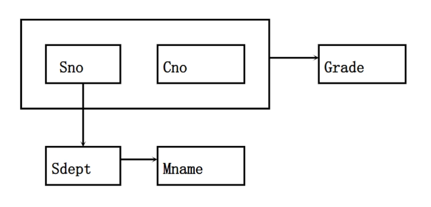
- 关系模式 $Student(U, F)$ 中存在的问题
    1.  **数据冗余太大**：浪费大量的存储空间。
        - 例如，每一个系主任的姓名重复出现。
    2.  **更新异常（Update Anomalies）**：数据冗余，更新数据时，维护数据完整性代价大。
        - 例如，某系更换系主任后，系统必须修改与该系学生有关的每一个元组。
    3.  **插入异常（Insertion Anomalies）**：该插的数据插不进去。
        - 例如，如果一个系刚成立，尚无学生，我们就无法把这个系及其系主任的信息存入数据库。
    4.  **删除异常（Deletion Anomalies）**：不该删除的数据不得不删。
        - 例如，如果某个系的学生全部毕业了，我们在删除该系学生信息的同时，把这个系及其系主任的信息也丢掉了。
- **结论**：$Student$ 关系模式不是一个好的模式。
    - “好”的模式应不会发生插入异常、删除异常、更新异常，且数据冗余应尽可能少。
- **问题原因**：由存在于模式中的某些**数据依赖**引起的。
- **解决方法**：通过**分解关系模式**来消除其中不合适的数据依赖。
    - 分解为 3 个关系模式：
        - $S(Sno, Sdept, Sno \to Sdept)$；
        - $SC(Sno, Cno, Grade, (Sno, Cno) \to Grade)$；
        - $DEPT(Sdept, Mname, Sdept \to Mname)$。

## 数据依赖
### 函数依赖
- **定义**：设 $R(U)$ 是一个属性集 $U$ 上的关系模式，$X$ 和 $Y$ 是 $U$ 的子集。
    - 若对于 $R(U)$ 的任意一个可能的关系 $r$，$r$ 中不可能存在两个元组在 $X$ 上的属性值相等，而在 $Y$ 上的属性值不等，则称“$X$ 函数确定 $Y$”或“$Y$ 函数依赖于 $X$”，记作 $X \to Y$。
    - $X$ 称为这个函数依赖的决定属性组，又称**决定因素**（Determinant）。
    - 若 $Y$ 不函数依赖于 $X$，则记为 $X \nrightarrow Y$。
    - 若 $X \to Y$ 且 $Y \to X$，则称 $X$ 和 $Y$ 互相函数依赖，记作 $X \leftrightarrow Y$。
- 说明
    1.  函数依赖不是指关系模式$R$的某个或某些关系实例满足的约束条件，而是指 $R$ 的所有关系实例均要满足的约束条件。
    2.  函数依赖是语义范畴的概念。只能根据数据的语义来确定函数依赖。例如“姓名 $\to$ 年龄”这个函数依赖只有在不允许有同名人的条件下成立。
    3.  数据库设计者可以对现实世界作强制的规定。例如规定不允许同名人出现，函数依赖“姓名 $\to$ 年龄”成立。所插入的元组必须满足规定的函数依赖，若发现有同名人存在，则拒绝装入该元组。
- 示例
    - $Student(Sno, Sname, Ssex, Sage, Sdept)$，假设不允许重名，则有：
        - $Sno \to Ssex$
        - $Sno \to Sage$
        - $Sno \to Sdept$
        - $Sno \leftrightarrow Sname$
        - $Sname \to Ssex$
        - $Sname \to Sage$
        - $Sname \to Sdept$
        - 但 $Ssex \nrightarrow Sage$

### 平凡函数依赖与非平凡函数依赖
- **定义**：在关系模式 $R(U)$ 中，对于 $U$ 的子集 $X$ 和 $Y$：
    - 如果 $X \to Y$，但 $Y \nsubseteq X$，则称 $X \to Y$ 是非平凡的函数依赖；
    - 若 $X \to Y$，但 $Y \subseteq X$，则称 $X \to Y$ 是平凡的函数依赖。
- 示例：在关系 $SC(Sno, Cno, Grade)$ 中：
    - 非平凡函数依赖：$(Sno, Cno) \to Grade$；
    - 平凡函数依赖：$(Sno, Cno) \to Sno$，$(Sno, Cno) \to Cno$。
- 说明：对于任一关系模式，**平凡函数依赖都是必然成立的**，它不反映新的语义，因此若不特别声明，我们总是讨论非平凡函数依赖。

### 完全函数依赖与部分函数依赖
- **定义**：在关系模式 $R(U)$ 中：（针对非平凡函数依赖进行讨论）
    - 如果 $X \to Y$，并且对于 $X$ 的任何一个真子集 $X'$，都有 $X' \nrightarrow Y$，则称 $Y$ 完全函数依赖于 $X$，记作 $X \stackrel{F}{\to} Y$；（刚刚好）
    - 如果 $X \to Y$，但 $Y$ 不完全函数依赖于 $X$，则称 $Y$ 部分函数依赖于 $X$，记作 $X \stackrel{P}{\to} Y$；（多给了）
- 示例：$Student(Sno, Sdept, Mname, Cno, Grade)$：
    - 由于 $Sno \nrightarrow Grade$，$Cno \nrightarrow Grade$，且 $(Sno, Cno) \to Grade$，因此 $(Sno, Cno) \stackrel{F}{\to} Grade$；
    - 由于 $Sno \to Sdept$，因此 $(Sno, Cno) \stackrel{P}{\to} Sdept$。

### 传递函数依赖
- **定义**：在关系模式 $R(U)$ 中，如果 $X \to Y$（$Y \nsubseteq X$），$Y \nrightarrow X$，$Y \to Z$（$Z \subseteq Y$），则称 $Z$ 对 $X$ 传递函数依赖，记为 $X \stackrel{T}{\to} Z$。
    - 注：如果 $Y \to X$，即 $X \leftrightarrow Y$，则 $X \to Z$ 为直接函数依赖。
- 示例：在关系 $Std(Sno, Sdept, Mname)$ 中，有 $Sno \to Sdept$，$Sdept \to Mname$，则 $Sno \stackrel{T}{\to} Mname$。

### 码
- **候选码定义**：设 $K$ 为关系模式 $R(U, F)$ 中的属性或**属性组合**。若 $K \stackrel{F}{\to} U$，则 $K$ 称为 $R$ 的一个候选码（Candidate Key）。
    - 若关系模式 $R$ 有多个候选码，则选定其中的一个做为**主码**（Primary Key）。
    - 若 $K \stackrel{P}{\to} U$，则 $K$ 为 $R$ 的**超码**，即候选码或其与任意属性的组合。候选码是最小的超码。
    - 说明：
        - **完全确定所有的属性**：正确
        - 完全确定每一个属性：错误（可以是传递函数依赖）
- **码的属性**
    - **包含在任何一个候选码**的诸属性称为主属性。
    - 不包含在任何候选码中的属性称为非主属性。
    - 在最极端的情况下，关系模式的所有属性组是这个关系模式的候选码，称为**全码**（All-key）。
- **外部码定义**：关系模式 $R$ 中属性或属性组 $X$ 并非 $R$ 的码，但 $X$ 是另一个关系模式 $S$ 的码，则称 $X$ 是 $R$ 的外部码（Foreign Key），也称外码。
    - 示例：$SC(Sno, Cno, Grade)$ 中，$Sno$ 是关系 $S$ 的码，$Cno$ 是关系 $C$ 的码，因此 $Sno$ 和 $Cno$ 都是 $SC$ 的外码。
    - 作用：主码和外部码一起提供了表示关系间联系的手段。

## 关系规范化
### 范式的概念
- **范式定义**：范式是符合**某一种级别的关系模式**的集合。
- 关系数据库中的关系必须满足一定的要求，满足不同程度要求的为不同范式。
- 范式种类：按规范化程度从低到高依次为：第一范式（1NF）、第二范式（2NF）、第三范式（3NF）、BC范式（BCNF）、第四范式（4NF）、第五范式（5NF）。
- 关系模式的规范化：一个低一级范式的关系模式，通过模式分解可以转换为若干个高一级范式的关系模式集合，这种过程就叫关系模式的规范化。
- **范式间关系**：各种范式之间存在联系：$1NF \supset 2NF \supset 3NF \supset BCNF \supset 4NF \supset 5NF$。
- 某一关系模式 $R$ 为第 $n$ 范式，可简记为 $R \in nNF$。

### 第一范式（1NF）
- **第一范式定义**：如果一个关系模式 $R$ 的所有属性都是不可分的基本数据项，则 $R \in 1NF$。
- 说明：
    - 第一范式是对关系模式的最起码的要求，不满足第一范式的数据库模式不能称为关系数据库。
    - 但是满足第一范式的关系模式并不一定是一个好的关系模式。
- “大表套小表”处理方法：
    - 直接在属性上展开
    - 在元组上展开
    - 关系模式分解
- 示例：关系模式 $SLC(Sno, Sdept, Sloc, Cno, Grade)$，$Sloc$ 为学生住处，假设每个系的学生住在同一个地方。
    - 函数依赖：$(Sno, Cno) \stackrel{F}{\to} Grade$，$Sno \to Sdept$，$(Sno, Cno) \stackrel{P}{\to} Sdept$，$Sno \stackrel{T}{\to} Sloc$，$(Sno, Cno) \stackrel{P}{\to} Sloc$，$Sdept \to Sloc$。
    - 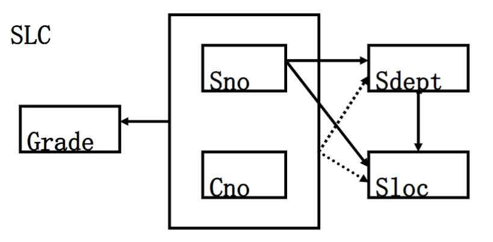
    - 码：$SLC$ 的码为 $(Sno, Cno)$。
    - $SLC$ 满足第一范式，但非主属性 $Sdept$ 和 $Sloc$ 部分函数依赖于码 $(Sno, Cno)$。
    - $SLC$ 存在的问题
        1.  **插入异常**：假设 $Sno = 95102$，$Sdept = IS$，$Sloc = N$ 的学生还未选课，因课程号是主属性，因此该学生的信息无法插入 $SLC$。
        2.  **删除异常**：假定某个学生本来只选修了 3 号课程这一门课。现在因身体不适，他连 3 号课程也不选修了。因课程号是主属性，此操作将导致该学生信息的整个元组都要删除。
        3.  **数据冗余度大**：如果一个学生选修了 10 门课程，那么他的 $Sdept$ 和 $Sloc$ 值就要重复存储了 10 次。
        4.  **修改复杂**：例如学生转系，在修改此学生元组的 $Sdept$ 值的同时，还可能需要修改住处（$Sloc$）。如果这个学生选修了 $K$ 门课，则必须无遗漏地修改 $K$ 个元组中全部 $Sdept$、$Sloc$ 信息。
    - 问题原因：$Sdept$、$Sloc$ 部分函数依赖于码。
    - 解决方法：将 $SLC$ 关系分解为两个关系模式，以消除这些部分函数依赖：
        - $SC(Sno, Cno, Grade)$；
        - $SL(Sno, Sdept, Sloc)$。
    - 函数依赖图：
        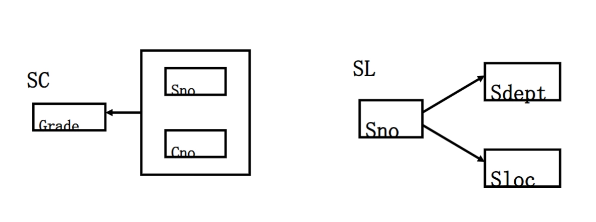

### 第二范式（2NF）
- **第二范式定义**：如果一个关系模式 $R \in 1NF$，并且每一个非主属性都完全函数依赖于 $R$ 的码，则 $R \in 2NF$。
- 示例：
    - $SLC(Sno, Cno, Sdept, Sloc, Grade) \in 1NF$，但 $\notin 2NF$；
    - $SC(Sno, Cno, Grade) \in 2NF$；
    - $SL(Sno, Sdept, Sloc) \in 2NF$。
- 作用：采用投影分解法将一个 1NF 的关系分解为多个 $2NF$ 的关系，可以在一定程度上减轻原 $1NF$ 关系中存在的插入异常、删除异常、数据冗余度大、修改复杂等问题。
- 局限：达到 $2NF$ 的关系仍可能存在问题。
- 示例：$2NF$ 关系模式 $SL(Sno, Sdept, Sloc)$
    - 函数依赖：$Sno \to Sdept$，$Sdept \to Sloc$，$Sno \stackrel{T}{\to} Sloc$。
    - 
    - 问题：$Sloc$ 传递函数依赖于 $Sno$，即 $SL$ 中存在非主属性对码的传递函数依赖，会出现与 $1NF$ 相类似的问题。
    - 解决方法：采用关系分解法，将具有传递函数依赖关系的属性（组）逐层提取出来。例如，把 $SL$ 分解为两个关系模式，以消除传递函数依赖：
        - $SD(Sno, Sdept)$，码为 $Sno$；
        - $DL(Sdept, Sloc)$，码为 $Sdept$。

### 第三范式（3NF）
- **第三范式定义**：关系模式 $R(U, F)\in 1NF$ ，若 $R$ 中不存在这样的码 $X$、属性组 $Y$ 及非主属性 $Z$（$Z \nsubseteq Y$），使得 $X \to Y$，$Y \nrightarrow X$，$Y \to Z$ 成立，则称 $R(U, F) \in 3NF$。
- 示例判断
    - $SL(Sno, Sdept, Sloc) \in 2NF$，但$\notin 3NF$；
    - $SD(Sno, Sdept) \in 3NF$；
    - $DL(Sdept, Sloc) \in 3NF$。
- **性质**：若 $R \in 3NF$，则 $R$ 的每一个非主属性既不部分函数依赖于候选码也不传递函数依赖于候选码；如果 $R \in 3NF$，则 $R \in 2NF$。
    - 证明：采用反证法，设 $R \in 3NF$，若 $R \notin 2NF$，则存在部分函数依赖，不妨设 $(X, Y)\stackrel{P}{\to} Z, X\to Z$，则 $XY \to X \to Z$，$X \nrightarrow XY$，即 $XY \stackrel{T}{\to} Z$，与 $R \in 3NF$ 矛盾，故 $R \in 2NF$。
- 作用：采用投影分解法将一个 $2NF$ 的关系分解为多个 $3NF$ 的关系，可以在一定程度上解决原 $2NF$ 关系中存在的插入异常、删除异常、数据冗余度大、修改复杂等问题。
- 局限：将一个 $2NF$ 关系分解为多个 $3NF$ 的关系后，并不能完全消除关系模式中的各种异常情况和数据冗余。

### BC范式（BCNF）
- **BC范式定义**：设关系模式 $R(U, F) \in 1NF$，如果对于 $R$ 的每个函数依赖$X \to Y$，若 $Y \nsubseteq X$（非平凡函数依赖），则 $X$ 必含有码，那么 $R \in BCNF$。
- **性质**：
    - **每一个决定属性集（因素）都包含（候选）码**；
    - $R$ 中的**所有属性**（主、非主属性）都**完全函数依赖**于码；
    - 没有任何属性完全函数依赖于非码的任何一组属性；
    - 若 $R \in BCNF$，则 $R \in 3NF$；若 $R \in 3NF$，则 $R$ 不一定 $\in BCNF$。
- $3NF$ 与 $BCNF$ 的关系
    - 如果关系模式 $R \in BCNF$，必定有 $R \in 3NF$；
        - 证明：采用反证法，设 $R \in BCNF$，若 $R \notin 3NF$，则存在码 $X$、属性组 $Y$ 及非主属性 $Z$（$Z \nsubseteq Y$），使得 $X \to Y$，$Y \nrightarrow X$，$Y \to Z$ 成立。由于 $Y \to Z$ 是非平凡函数依赖，而 $R \in BCNF$，则 $Y$ 必含有码（即超码），故 $Y \to X$，与 $Y \nrightarrow X$ 矛盾，故 $R \in 3NF$。
    - 如果 $R \in 3NF$，且 $R$ **只有一个候选码**，则 $R \in BCNF$。
- 示例：
    1. 关系模式 $C(Cno, Cname, Pcno)$，函数依赖 $Cno \to Cname$，$Cno \to Pcno$，$C \in BCNF$。
    2. 关系模式 $S(Sno, Sname, Sdept, Sage)$，假定 $Sname$ 具有唯一性，函数依赖 $Sno \to Sname$，$Sno \to Sdept$，$Sno \to Sage$，$Sname \to Sno$，$Sname \to Sdept$，$Sname \to Sage$，$S \in BCNF$。
    3. 在关系模式 $STJ(S, T, J)$ 中，$S$ 表示学生，$T$ 表示教师，$J$ 表示课程。每一教师只教一门课。每门课由若干教师教，某一学生选定某门课，就确定了一个固定的教师。某个学生选修某个教师的课就确定了所选课的名称。
        - 函数依赖 $T \to J$，$(S, J) \to T$，$(S, T) \to J$，候选码 $(S, T)$ 和 $(S, J)$，全都是主属性，则 $STJ \in 3NF$。
        - 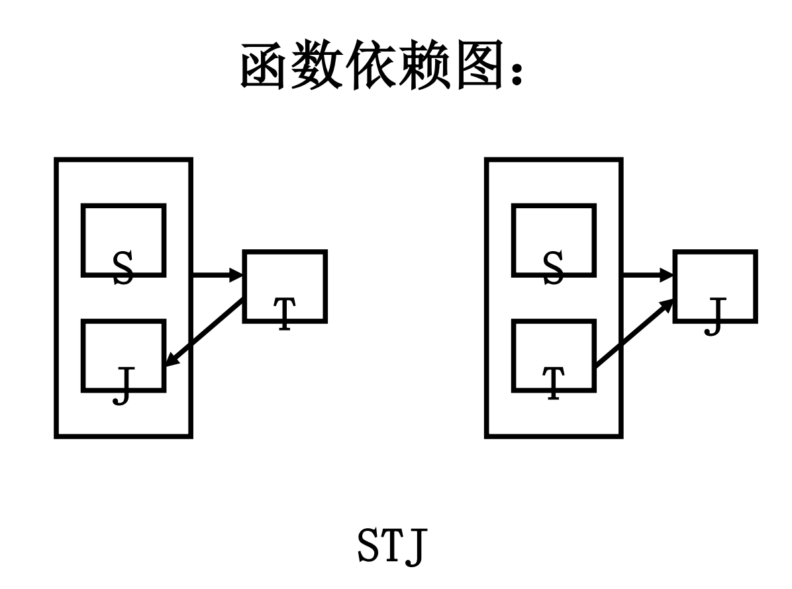
        - 解决方法：将 $STJ$ 分解为二个关系模式 $SJ(S, J) \in BCNF$，$TJ(T, J) \in BCNF$，分解后没有任何属性对码的部分函数依赖和传递函数依赖。
        - 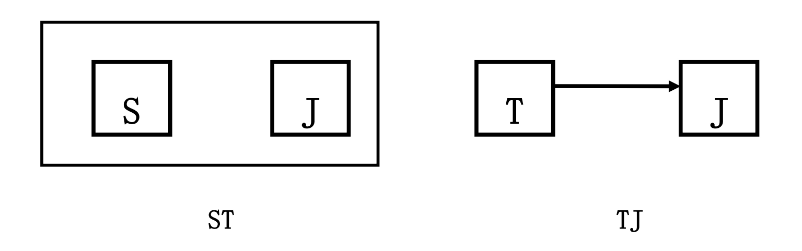

### 小结
- **关系模式规范化的基本步骤**
    - $1NF$ 消除非主属性对码的部分函数依赖，得到 $2NF$；
    - $2NF$ 消除非主属性对码的传递函数依赖，得到 $3NF$；
    - $3NF$ 消除主属性对码的部分和传递函数依赖，得到 $BCNF$；
    - $BCNF$ 消除非平凡且非函数依赖的多值依赖，得到 $4NF$。
- **快速判断**：
    - 任意**二元**关系模式 $R(U, F)$ 至少属于 $BCNF$。
    - 关系模式 $R$ 中的属性全部是主属性，则 $R$ 至少可以达到 $3NF$。
    - 关系模式 $R$ 的主码是全码，则 $R$ 至少可以达到 $BCNF$。
- 基本思想
    - 消除不合适的数据依赖，各关系模式达到某种程度的“分离”；
    - 采用“一事一地”的模式设计原则：让一个关系描述一个概念、一个实体或者实体间的一种联系，若多于一个概念就把它“分离”出去。
    - 所谓规范化实质上是概念的单一化。
- 注意事项
    - 不能说规范化程度越高的关系模式就越好；
    - 在设计数据库模式结构时，必须对现实世界的实际情况和用户应用需求作进一步分析，确定一个合适的、能够反映现实世界的模式；
    - 上面的规范化步骤可以在其中任何一步终止。
- 模式的分解
    - 把低一级的关系模式分解为若干个高一级的关系模式的方法并不是唯一的；
    - 只有能够保证分解后的关系模式与原关系模式等价，分解方法才有意义。

## 数据依赖的公理系统
- **逻辑蕴含**：对于满足一组函数依赖 $F$ 的关系模式 $R(U, F)$，若对其任何一个关系 $r$ 函数依赖 $X \to Y$ 都成立，则称 $F$ 逻辑蕴含 $X \to Y$。
    - 即 $r$ 中任意两元组 $t$ 和 $s$，若 $t[X] = s[X]$，则必有 $t[Y] = s[Y]$。
    - 记作 $F \models X \to Y$。

### Armstrong公理系统
#### Armstrong推理规则
关系模式 $R(U, F) $来说有以下的推理规则：

1.  **A1. 自反律（Reflexivity Rule）**：若 $Y \subseteq X \subseteq U$，则 $X \to Y$ 为 $F$ 所蕴含（平凡函数依赖）。
    - **证明**：设 $Y \subseteq X \subseteq U$，对 $R(U, F)$ 的任一关系 $r$ 中的任意两个元组 $t$，$s$，若 $t[X] = s[X]$，由于 $Y \subseteq X$，有 $t[Y] = s[Y]$，所以 $X \to Y$ 成立。自反律得证。
2.  **A2. 增广律（Augmentation Rule）**：若 $X \to Y$ 为 $F$ 所蕴含，且 $Z \subseteq U$，则 $XZ \to YZ$ 为 $F$ 所蕴含。
    - **证明**：设 $X \to Y$ 为 $F$ 所蕴含，且 $Z \subseteq U$。对 $R(U, F)$ 的任一关系 $r$ 中任意的两个元组 $t$，$s$，若 $t[XZ] = s[XZ]$，则有 $t[X] = s[X]$ 和 $t[Z] = s[Z]$；由 $X \to Y$，于是有 $t[Y] = s[Y]$，所以 $t[YZ] = s[YZ]$，$XZ \to YZ$ 为 $F$ 所蕴含。增广律得证。
3.  **A3. 传递律（Transitivity Rule）**：若 $X \to Y$ 及 $Y \to Z$ 为 $F$ 所蕴含，则 $X \to Z$ 为 $F$ 所蕴含。
    - **证明**：设 $X \to Y$ 及 $Y \to Z$ 为 $F$ 所蕴含。对 $R(U, F)$ 的任一关系 $r$ 中的任意两个元组 $t$，$s$，若 $t[X] = s[X]$，由于 $X \to Y$，有 $t[Y] = s[Y]$；再由 $Y \to Z$，有 $t[Z] = s[Z]$，所以 $X \to Z$ 为 $F$ 所蕴含。传递律得证。

#### 导出规则
1.  **合并规则（Union Rule）**：由 $X \to Y$，$X \to Z$，有 $X \to YZ$。
2.  **伪传递规则（Pseudo Transitivity Rule）**：由 $X \to Y$，$WY \to Z$，有 $XW \to Z$。
3.  **分解规则（Decomposition Rule）**：由 $X \to Y$ 及 $Z \subseteq Y$，有 $X \to Z$。

### 函数依赖闭包
#### 定义
- **函数依赖的闭包定义**：在关系模式 $R(U, F)$ 中为 $F$ 所逻辑蕴含的函数依赖的全体，叫作 $F$ 的闭包，记为 $F^+$。
- **属性集关于函数依赖集的闭包定义**：设 $F$ 为属性集 $U$ 上的一组函数依赖，定义属性集 $X$ 关于函数依赖集 $F$ 的闭包 $X \subseteq U$，$X_{F}^+ = \{A \mid X \to A \text{ 能由 } F \text{ 根据 Armstrong 公理导出} \}$。
- **引理**：设 $F$ 为属性组 $U$ 上的一组函数依赖，$X$、$Y \subseteq U$，$X \to Y$ 能由 $F$ 根据 Armstrong 公理导出的充分必要条件是 $Y \subseteq X_{F}^+$。
    - 用途：将判定 $X \to Y$ 是否能由 $F$ 根据 Armstrong 公理导出的问题，转化为求出 $X_{F}^+$，判定 $Y$ 是否为 $X_{F}^+$ 的子集的问题。

#### 求闭包的算法
- **算法**：求属性集 $X(X\subseteq U)$ 关于 $U$ 上的函数依赖集 $F$ 的闭包 $X_{F}^{+}$
    - 输入：属性集 $X$，函数依赖集 $F$。
    - 输出：$X$ 关于 $F$ 的闭包 $X_{F}^{+}$。
    - 步骤：
        1.  置 $X_{F}^{+} := X$；
        2.  对 $F$ 中的每一个函数依赖 $Y \to Z$，若 $Y \subseteq X_{F}^{+}$，则置 $X_{F}^{+} := X_{F}^{+} \cup Z$；
        3.  重复步骤2，直到 $X_{F}^{+}$ 不再增大为止；
        4.  输出 $X_{F}^{+}$。

### 基于规则的候选码求解优化方法
- 关系模式中属性的分类：
    - $L$ 类属性：只出现在函数依赖集左边的属性（决定因素）
    - $R$ 类属性：只出现在函数依赖集右边的属性
    - $N$ 类属性：没有出现在函数依赖集里的属性
    - $LR$ 类属性：出现在函数依赖集左、右两边的属性
- **求解步骤**：
    1. 列出 $L$、$R$、$N$、$LR$ 属性包含的元素；
    2. 设 $X$ 代表 $L$ 与 $N$ 类属性，$Y$ 代表 $LR$ 类属性；
    3. 求 $X$ 的闭包；
    4. 分两种情况：
        - 若 $X_{F}^{+} = U$，则 $X$ 是该关系的唯一候选码，结束；
        - 若 $X_{F}^{+} \neq U$，则进入第5步；
    5. 从 $Y$ 中依次取出一个元素，设该元素为 $A$，求 $(XA)^+$，若取出元素和 $X$ 组合求得的闭包包含关系模式中的所有属性，则为候选码，继续直到试完 $Y$ 中全部的元素。
        - 若 $Y$ 中的元素取出与 $X$ 组合均包含 $U$ 全部属性，此时所有候选码被找出。
        - 若 $Y$ 中还有元素与 $X$ 组合求得的闭包不包含全部属性，则从这些属性中依次取出两个开始继续与 $X$ 组合。
- 示例：设有关系模式$R(A, B, C)$，其中：$F=\{B \to C，AC \to B \}$，求出$R$的所有候选码。
    1. 列属性:
        - $L = \{A\}$
        - $R = \{\varnothing\}$
        - $N = \{\varnothing\}$
        - $LR = \{BC\}$
    2. $X = (L \cup N) = A$，$Y = LR = BC$
    3. $X^+ = A^+ = \{A\}$，不是唯一候选码
    4. 从 $Y$ 依次取出元素与 $X$ 组合求闭包:
        - 从 $Y$ 中取出 $B$ 与 $X$ 组合，$(AB)^+ = \{ABC\}$，包含 $R$ 中全部属性，$A$ 为 $R$ 的候选键
        - 从 $Y$ 中取出 $C$ 与 $X$ 组合，$(AC)^+ = \{ACB\}$，包含 $R$ 中全部属性，$AC$ 为 $R$ 的候选键
        - 因为 $Y$ 中 $B$、$C$ 均和 $A$ 组合为候选键，所以无需再进行下一步取两个元素 $BC$ 与 $A$ 组合
    5. 所以，$R$ 的候选键有 $AB$、$AC$

### Armstrong公理系统的有效性与完备性
- 有效性与完备性的含义
    - **有效性**：由 $F$ 出发根据 Armstrong 公理推导出来的每一个函数依赖一定在 $F^+$ 中。
    - **完备性**：$F^+$ 中的每一个函数依赖，必定可以由 $F$ 出发根据 Armstrong 公理推导出来。

### 函数依赖集等价
- 定义：如果 $G^+ = F^+$，就说函数依赖集 $F$ 覆盖 $G$（$F$ 是 $G$ 的覆盖，或 $G$ 是 $F$ 的覆盖），或者 $F$ 与 $G$ 等价。
    - 两个函数依赖集等价是指它们的闭包等价！
- 引理：$F^+ = G^+$ 的充分必要条件是 $F \subseteq G^+$ 和 $G \subseteq F^+$。
    - 证明：
        - 充分性：设 $F \subseteq G^+$ 和 $G \subseteq F^+$。对任一 $X \to Y \in F^+$，由 $F \subseteq G^+$，有 $X \to Y \in G^+$，所以 $F^+ \subseteq G^+$。同理可证 $G^+ \subseteq F^+$，故 $F^+ = G^+$。
        - 必要性：设 $F^+ = G^+$。由于 $F \subseteq F^+$，所以 $F \subseteq G^+$；同理可证 $G \subseteq F^+$。

### 最小依赖集
#### 最小依赖集定义
- **定义**：如果函数依赖集 $F$ 满足下列条件，则称 $F$ 为一个极小函数依赖集，亦称为最小依赖集或最小覆盖。
    1.  $F$ 中任一函数依赖的**右部仅含有一个属性**。
    2.  $F$ 中不存在这样的函数依赖 $X \to A$，使得 $F$ 与 $F - \{X \to A\}$ 等价。
        - 即 $F$ 中的函数依赖均不能由其他函数依赖推导出来（**不存在冗余依赖**）
    3.  $F$ 中不存在这样的函数依赖 $X \to A$，$X$ 有真子集 $Z$ 使得 $F - \{X \to A\} \cup \{Z \to A\}$ 与 $F$ 等价。
        - 即 $F$ 中各函数依赖左部均为最小属性集（**函数依赖不存在冗余属性**）
- 示例：对于关系模式 $S(U, F)$，其中
    - $U = \{Sno, Sdept, Mn, Cname, G\}$
    - $F = \{Sno \to Sdept, Sdept \to Mn, (Sno, Cname) \to G\}$。
    - $F' = \{Sno \to Sdept, Sno \to Mn, Sdept \to Mn, (Sno, Cname) \to G, (Sno, Sdept) \to Sdept\}$。
    - $F$ 是最小覆盖，而 $F'$ 不是。因为 $F' - \{(Sno, Sdept) \to Sdept\}$ 也与 $F'$ 等价。

#### 极小化过程
- 定理：每一个函数依赖集 $F$ 均等价于一个极小函数依赖集 $F_m$。此 $F_m$ ，称为 $F$ 的最小依赖集。
- **算法**：求函数依赖集 $F$ 的最小依赖集 $F_m$
    1. **去除右边冗余**：逐一检查 $F$ 中各函数依赖 $FD_i：X \to Y$，若 $Y=A_1,A_2\cdots A_k, k \geq 2$，则用 $\{X\to A_j|j=1,2,\cdots k\}$ 来取代 $Y$。
    2. **去除依赖冗余**：逐一检查 $F$ 中各函数依赖 $FD_i: X \to A$，令 $G=F-\{X\to A\}$，若 $A\in X_{G}^{+}$，则从 $F$ 中去掉此函数依赖。
    3. **去除左边冗余**：逐一检查 $F$ 中各函数依赖 $FD_i: X \to A$，设 $X=B_1B_2\cdots B_m$，逐一考查 $B_i$，令 $G=F-\{X\to A\} \cup \{(X-B_i)\to A\}$，若 $A\in (X-B_i)_{G}^{+}$，则以 $X-B_i$ 取代 $X$。
- 示例：
    - $F = \{A \to B, B \to A, B \to C, A \to C, C \to A\}$
    - $F_{m1} = \{A \to B, B \to C, C \to A\}$
    - $F_{m2} = \{A \to B, B \to A, A \to C, C \to A\}$
    - $F_{m1}$、$F_{m2}$ 都是 $F$ 的最小依赖集。
    - $F$ 的最小依赖集 $F_m$ **不一定是唯一的**，它与对各函数依赖 $FD_i$ 及 $X$ 中各属性的处置顺序有关。

### 关系模式分解的标准
- **无损连接性**：进行关系分解后得到的关系按照外码自然连接能够得到原来的关系。
- **函数依赖性**：关系分解后每个关系的最小函数依赖集是原关系的最小函数依赖集的子集，并且所有子集的并等于原关系的最小函数依赖集。
- 三种模式分解的等价定义
    1. 分解具有无损连接性；
    2. 分解要保持函数依赖；
    3. 分解既要保持函数依赖，又要具有无损连接性；

# 第四章 结构查询语言SQL

## SQL概述
- 概述：
    - SQL（Structured Query Language）即结构化查询语言，是关系数据库的标准语言。
    - 它是一种通用的、功能极强的关系数据库语言
    - 功能涵盖查询、操纵、定义和控制，是综合的、通用的关系数据库语言，同时也是高度非过程化语言——仅要求用户指出“做什么”，无需说明“怎么做”。
    - SQL 集成实现了数据库生命周期的全部操作。
- SQL 语言的特点
    1. 综合统一
        - 集数据定义语言（DDL）、数据操纵语言（DML）、数据控制语言（DCL）功能于一体，可独立完成数据库生命周期中的全部活动：
            - 定义关系模式、插入数据、建立数据库；
            - 对数据库中的数据进行查询和更新；
            - 数据库重构、维护及安全性、完整性控制等；
        - 用户数据库运行后，可随时逐步修改模式，不影响数据运行；
        - 数据操作符统一。
    2. 高度非过程化
        - 非关系数据模型的数据操纵语言“面向过程”，需制定存取路径；
        - 而 SQL 只需提出“做什么”，**无需了解存取路径**；
        - 存取路径的选择及 SQL 操作过程由系统自动完成。
    3. 面向集合的操作方式
        - 非关系数据模型采用面向记录的操作方式，操作对象为一条记录；
        - SQL 采用集合操作方式：
            - 操作对象、查找结果可以是元组的集合；
            - 一次插入、删除、更新操作的对象也可以是元组的集合。
    4. 以同一种语法结构提供多种使用方式
        - **SQL是独立的语言**：可独立用于联机交互的使用方式；
        - **SQL也是嵌入式语言**：可嵌入到高级语言（如 C、C++、Java）程序中，供程序员设计程序时使用。
    5. 语言简捷，易学易用
- SQL的基本概念
    

    - 基本表
        - 本身独立存在的表；
        - SQL 中一个关系对应一个基本表；
        - 一个（或多个）基本表对应一个存储文件；
        - 一个表可带若干索引。
    - 存储文件
        - 逻辑结构组成关系数据库的内模式
        - 物理结构任意且对用户透明。
    - 视图
        - 从一个或几个基本表导出的虚表，
        - 数据库中只存放视图的定义，不存放对应数据，
        - 用户可在视图上再定义视图。


## 数据定义
SQL 的数据定义功能包括模式定义、表定义、视图定义和索引定义，核心语句如下表所示：

| 操作对象 | 创建（CREATE）       | 删除（DROP）         | 修改（ALTER）        |
|----------|----------------------|----------------------|----------------------|
| 模式     | `CREATE SCHEMA`        | `DROP SCHEMA`          | -                    |
| 表       | `CREATE TABLE`         | `DROP TABLE`           | `ALTER TABLE`          |
| 视图     | `CREATE VIEW`          | `DROP VIEW`            | -                    |
| 索引     | `CREATE INDEX`         | `DROP INDEX`           | `ALTER INDEX`          |


### 模式的定义与删除
#### 定义数据库模式
- **语句格式**：
    ```sql
    CREATE SCHEMA <模式名> AUTHORIZATION <用户名> [ <表定义子句> | <视图定义子句> | <授权定义子句> ]
    ```
- 说明：
    - 若未指定`<模式名>`，则隐含为`<用户名>`；
    - 定义模式实质是定义一个**命名空间**，可在其中直接**定义该模式包含的数据库对象**，例如基本表、视图等数据库对象。

- **示例**：
    1.  为用户 WANG 定义模式 S-T：
        ```sql
        CREATE SCHEMA "S-T" AUTHORIZATION WANG;
        ```
    2.  隐含模式名（为 WANG 定义模式，模式名即为 WANG）：
        ```sql
        CREATE SCHEMA AUTHORIZATION WANG;
        ```
    3.  为用户 ZHANG 创建模式 TEST，并在其中定义表 TAB1，授权 PUBLIC 用户组对 TAB1 的查询权限：
        ```sql
        CREATE SCHEMA TEST AUTHORIZATION ZHANG
        CREATE TABLE TAB1(
            COL1 SMALLINT,
            COL2 INT,
            COL3 CHAR(20),
            COL4 NUMERIC(10,3),
            COL5 DECIMAL(5,2)
        )
        GRANT SELECT ON TAB1 TO PUBLIC; -- 授权PUBLIC用户组对TAB1的查询权限
        ```

#### 删除数据库模式
- **语句格式**：
    ```sql
    DROP SCHEMA <模式名> <CASCADE | RESTRICT>
    ```
- 说明：
    - `CASCADE`（级联）：删除模式的同时，删除该模式中所有数据库对象；
    - `RESTRICT`（限制）：若模式中存在下属对象（如表、视图等），则拒绝删除，仅当无下属对象时可执行。

- **示例**：删除模式 ZHANG 及其下属所有对象：
    ```sql
    DROP SCHEMA ZHANG CASCADE;
    ```

### 基本表的定义、删除与修改
#### 定义基本表
- **语句格式**：
    ```sql
    CREATE TABLE <表名> (
        <列名> <数据类型> [ <列级完整性约束条件> ],
        [ <列名> <数据类型> [ <列级完整性约束条件> ] ],
        ...
        [ <表级完整性约束条件> ]
    );
    ```
- 说明：
    - `<表名>`：需定义的基本表名称；
    - `<列名>`：表的属性（列）；
    - `<列级完整性约束条件>`：涉及**相应属性列**的完整性约束条件
    - `<表级完整性约束条件>`：涉及**一个或多个属性列**的完整性约束条件
- **常用完整性约束**：

    | 约束条件 | 说明 |
    | --- | --- |
    | `PRIMARY KEY (PK)` | 标识该字段为该表的主码，可以唯一的标识记录，不可以为空，与 `UNIQUE + NOT NULL` 等价 |
    | `FOREIGN KEY (FK)` | 标识该字段为该表的外码，实现表与表（父表主码/子表外码）之间的关联 |
    | `NOT NULL` | 标识该字段不能为空 |
    | `UNIQUE KEY (UK)` | 标识该字段的值是唯一的，可以为空，一个表中可以有多个 `UNIQUE KEY` |
    | `AUTO_INCREMENT` | 标识该字段的值自动增长（整数类型，而且为主键） |
    | `DEFAULT` | 为该字段设置默认值 |
    | `ZEROFILL` | 使用 0 填充 |
- **示例**：
    1.  建立“学生”表 Student（学号为主码，姓名取值唯一）：
        ```sql
        CREATE TABLE Student (
            Sno CHAR(9) PRIMARY KEY,  -- 列级主码约束
            Sname CHAR(20) UNIQUE,    -- 列级唯一性约束
            Ssex CHAR(2),
            Sage SMALLINT,
            Sdept CHAR(20)
        );
        ```
    2.  建立“课程”表 Course（课程号为主码，课程名非空，先修课参照课程号）：
        ```sql
        CREATE TABLE Course (
            Cno CHAR(4) PRIMARY KEY,   -- 列级主码约束
            Cname CHAR(40) NOT NULL,   -- 列级非空约束
            Cpno CHAR(4),
            Ccredit SMALLINT,
            FOREIGN KEY (Cpno) REFERENCES Course(Cno)  -- 表级参照约束
        );
        ```
    3.  建立“学生选课”表 SC（学号+课程号为主码，分别参照 Student 和 Course 表）：
        ```sql
        CREATE TABLE SC (
            Sno CHAR(9),
            Cno CHAR(4),
            Grade SMALLINT CHECK(Grade >= 0 AND Grade <= 100),  -- 列级检查约束
            PRIMARY KEY (Sno, Cno),  -- 表级主码约束（多属性主码）
            FOREIGN KEY (Sno) REFERENCES Student(Sno),  -- 表级参照约束（参照Student）
            FOREIGN KEY (Cno) REFERENCES Course(Cno)   -- 表级参照约束（参照Course）
        );
        ```

#### 数据类型
- SQL 中域的概念通过数据类型实现，定义表的属性时需指明数据类型及长度
- 选择依据：
    - 属性的取值范围
    - 需执行的运算

#### 模式与表的关联
- 关系：
    - 每个基本表属于某一模式
    - 一个模式包含多个基本表
- 定义基本表所属模式的方法：
    1.  **显式指定模式名**：
        ```sql
        CREATE TABLE "S-T".Student(...);  -- 模式名为S-T
        ```
    2.  **创建模式时同步建表**：
        ```sql
        CREATE SCHEMA "S-T" AUTHORIZATION WANG
        CREATE TABLE Student(
            Sno CHAR(9) PRIMARY KEY,
            Sname CHAR(20) UNIQUE,
            Ssex CHAR(2),
            Sage SMALLINT,
            Sdept CHAR(20)
        );
        ```
    3.  **设置所属的模式**
- 创建基本表（其他数据库对象也一样）时，若没有指定模式，系统根据搜索路径来确定该对象所属的模式。
    - RDBMS 会使用模式列表中第一个存在的模式作为数据库对象的模式名。
    - 若搜索路径中的模式名都不存在，系统将给出错误。
    - 显示当前搜索路径：`SHOW search_path`（默认值：$user, PUBLIC）；
    - 设置搜索路径：`SET search_path TO "S-T", PUBLIC;`，之后创建的表默认属于路径中第一个存在的模式。
        - **示例**：
            ```sql
            SET search_path TO "S-T", PUBLIC;
            CREATE TABLE Student(...);  -- 表Student属于模式S-T
            ```

#### 修改基本表
- **语句格式**：
    ```sql
    ALTER TABLE <表名>
        [ ADD [ COLUMN ] <新列名> <数据类型> [ 完整性约束 ] ]
        [ ADD <表级完整性约束> ]
        [ DROP [ COLUMN ] <列名> [ CASCADE | RESTRICT ] ]
        [ DROP CONSTRAINT <完整性约束名> [ CASCADE | RESTRICT ] ]
        [ RENAME COLUMN <旧列名> TO <新列名> ]
        [ ALTER COLUMN <列名> [ TYPE ] <数据类型> ];
    ```
- 说明：
    - `<表名>`：要修改的基本表
    - `ADD` 子句：增加新列、新的列完整性约束条件、新的表完整性约束条件；
    - `DROP COLUMN` 子句：删除指定的列；
        - `CASCADE`（级联）：删除该列时，同时删除所有依赖该列的对象（如视图、索引等）；
        - `RESTRICT`（限制）：若存在依赖对象则拒绝删除该列。缺省情况是 `RESTRICT`。
    - `DROP CONSTRAINT` 子句：删除指定的完整性约束条件；
    - `RENAME COLUMN` 子句：修改列名；
    - `ALTER COLUMN` 子句：修改列的数据类型。
- **示例**：
    1.  向 Student 表增加“入学时间”列（日期型）：
        ```sql
        ALTER TABLE Student ADD S_entrance DATE;
        ```
    2.  将 Student 表的年龄列（原字符型）改为整数型：
        ```sql
        ALTER TABLE Student ALTER COLUMN Sage INT;
        ```
    3.  为 Course 表增加课程名称唯一的约束：
        ```sql
        ALTER TABLE Course ADD UNIQUE(Cname);
        ```

#### 删除基本表
- **语句格式**：
    ```sql
    DROP TABLE <表名> [ RESTRICT | CASCADE ];
    ```
- 说明：
    - `RESTRICT`（限制）：删除表是有限制的。
        - 欲删除的表不能被其他表的约束引用
        - 若存在依赖对象则拒绝删除
        - **缺省情况是** `RESTRICT`
    - `CASCADE`（级联）：删除该表没有限制。
        - 删除表的同时，删除所有依赖该表的对象（如索引、视图等）。
- **示例**：
    1.  级联删除 Student 表（含依赖的视图等）：
        ```sql
        DROP TABLE Student CASCADE;
        -- 若存在视图IS_Student依赖Student，则一并删除该视图，返回信息：NOTICE: drop view IS_Student
        ```
    2.  限制删除 Student 表（若存在依赖对象则报错）：
        ```sql
        DROP TABLE Student RESTRICT;
        -- 若存在视图IS_Student依赖Student，则报错：ERROR: cannot drop table Student because other objects depend on it
        ```

### 索引的建立与删除
- 索引是加快查询速度的有效手段（属于内模式范畴）
    - 顺序文件索引、B+ 树索引、hash 索引、位图索引等。
- 建立索引
    - DBA 或表的属主可根据需要建立索引
    - 部分 DBMS 会自动为 `PRIMARY KEY`、`UNIQUE` 列建立索引
- 使用索引
    - DBMS 会自动选择是否使用索引

#### 建立索引
- **语句格式**：
    ```sql
    CREATE [ UNIQUE ] [ CLUSTER ] INDEX <索引名> 
    ON <表名> ( <列名> [ <次序> ] [, <列名> [ <次序> ] ]... );
    ```
- 说明：
    - `<表名>`指定要建索引的基本表名字
    - 索引可以建立在该表的一列或多列上，各列名之间用逗号分隔
    - `<次序>`指定索引值的排列次序：`ASC`（升序，缺省值）、`DESC`（降序）。
    - `UNIQUE`：索引值对应唯一数据记录
        - 对于已含重复值的属性列不能建 `UNIQUE` 索引
        - 对某个列建立 `UNIQUE` 索引后，插入新记录时 DBMS 会自动检查新记录在该列上是否取了重复值。这相当于增加了一个 `UNIQUE` 约束
    - `CLUSTER`：建立**聚簇索引**
        - 基表中数据也需要按指定的聚簇属性值的升序或降序存放
        - 索引项顺序与表中记录**物理顺序一致**
- **示例**：
    1.  在 Student 表的 Sname 列上建立聚簇索引：
        ```sql
        CREATE CLUSTER INDEX Stusname ON Student(Sname);
        ```
    2.  为 Student、Course、SC 表建立唯一索引：
        ```sql
        CREATE UNIQUE INDEX Stusno ON Student(Sno);  -- 学号升序唯一索引
        CREATE UNIQUE INDEX Coucno ON Course(Cno);  -- 课程号升序唯一索引
        CREATE UNIQUE INDEX SCno ON SC(Sno ASC, Cno DESC);  -- 学号升序、课程号降序唯一索引
        ```

#### 修改索引
- **语句格式**：
    ```sql
    ALTER INDEX <旧索引名> RENAME TO <新索引名>;
    ```
- **示例**：将 SC 表的 SCno 索引改名为 SCSno：
    ```sql
    ALTER INDEX SCno RENAME TO SCSno;
    ```

#### 删除索引
- **语句格式**：
    ```sql
    DROP INDEX <索引名>;
    ```
- 说明：删除索引时，系统从数据字典中删去该索引的描述。
- **示例**：删除 Student 表的 Stusname 索引：
    ```sql
    DROP INDEX Stusname;
    ```

## 数据查询
数据查询是 SQL 的核心功能，可实现单表查询、连接查询、嵌套查询、集合查询等多种操作。

### 基本语法
```sql
SELECT [ ALL | DISTINCT ] <目标列表达式> [, <目标列表达式> ]...
FROM <表名或视图名> [, <表名或视图名>... ] | ( <SELECT语句> ) [ AS ] <别名>
[ WHERE <条件表达式> ]
[ GROUP BY <列名1> [ HAVING <条件表达式> ] ]
[ ORDER BY <列名2> [ ASC | DESC ] ];
[ LIMIT <行数> [ OFFSET <偏移量> ] ];
```

- `SELECT` 子句：指定查询结果的列；
- `FROM` 子句：指定查询的数据源；
- `WHERE` 子句：筛选满足条件的元组；
- `GROUP BY` 子句：按指定列分组；
- `HAVING` 子句：筛选满足条件的组；
- `ORDER BY` 子句：对查询结果排序。
- `LIMIT` 子句：限制查询结果的元组数。


### 单表查询
#### 选择表中的若干列
1.  **查询指定列**：
    - **语句格式**：
        ```sql
        SELECT <列名1> [, <列名2> ...] FROM <表名>;
        ```
    - **示例**：
        ```sql
        -- 例1：查询全体学生的学号与姓名
        SELECT Sno, Sname FROM Student;
        -- 例2：查询全体学生的姓名、学号、所在系
        SELECT Sname, Sno, Sdept FROM Student;
        ```
2.  **查询全部列**：
    - 使用通配符 `*` 表示查询表中的所有列
    - **语句格式**：
        ```sql
        SELECT * FROM <表名>;
        ```
    - **示例**：
        ```sql
        -- 例3：查询全体学生的详细记录
        SELECT Sno, Sname, Ssex, Sage, Sdept FROM Student;
        -- 或使用通配符*
        SELECT * FROM Student;
        ```
3.  **查询经过计算的值**：
    - 目标列表达式可为算术表达式、字符串常量、函数或列别名。
    - **语句格式**：
        ```sql
        SELECT <列名> | <算术表达式> | <字符串常量> | <函数> [ AS ] <列别名> 
        FROM <表名>;
        ```
    - **示例**：
        ```sql
        -- 例4：查询全体学生的姓名及其出生年份（假设当前年份为2014）
        SELECT Sname, 2014 - Sage FROM Student;
        -- 例5：查询全体学生的姓名、出生年份，系名转为小写并指定列别名
        SELECT 
            Sname,
            'Year of Birth: ',
            2014 - Sage,
            LOWER(Sdept)
        FROM Student;
        -- 例5.1：使用列别名改变查询结果的列标题
        SELECT
            Sname NAME,
            'Year of Birth: ' BIRTH,
            2014 - Sage BIRTHDAY,
            LOWER(Sdept) DEPARTMENT 
        FROM Student;
        ```

#### 选择表中的若干元组
1.  **消除重复行**：使用 `DISTINCT` 短语
    - **语句格式**：
        ```sql
        SELECT [ DISTINCT | ALL ] <列名1> [, <列名2> ...] FROM <表名>;
        ```
    - **示例**：
        ```sql
        -- 例6：查询选修了课程的学生学号（去重）
        SELECT DISTINCT Sno FROM SC;
        ```
    - **说明**：缺省值为 `ALL`：保留重复行
2.  **按条件筛选元组**：
    - `WHERE` 子句支持多种查询条件，如下表所示：

        | 查询条件  |  谓词   |
        |-----------|--------|
        | 比较 | `=, >, <, >=, <=, !=, <>, !>, !<`; `NOT`+上述运算符 |
        | 确定范围 | `BETWEEN AND`, `NOT BETWEEN AND`  |
        | 确定集合 | `IN`, `NOT IN`   |
        | 字符匹配 | `LIKE`, `NOT LIKE`   |
        | 空值 | `IS NULL`, `IS NOT NULL` |
        | 多重条件 | `AND`, `OR`, `NOT`  |
    - **语句格式**
        ```sql
        SELECT <列名1> [, <列名2> ...] FROM <表名>
        WHERE <条件表达式>;
        ```

    1. **比较大小**：
        - **语句格式**：
            ```sql
            SELECT <列名1> [, <列名2> ...] FROM <表名>
            WHERE <列名> <比较运算符> <常量>;
            ```
        - **示例**：
            ```sql
            -- 例7：查询计算机科学系（CS）全体学生的名单
            SELECT Sname FROM Student WHERE Sdept = 'CS';
            -- 例8：查询考试成绩不及格的学生学号（去重）
            SELECT DISTINCT Sno FROM SC WHERE Grade < 60;
            ```
    2. **确定范围**：
        - **语句格式**：
            ```sql
            SELECT <列名1> [, <列名2> ...] FROM <表名>
            WHERE <列名> [ NOT ] BETWEEN <值1> AND <值2>;
            ```
        - **示例**：
            ```sql
            -- 例9：查询年龄在20-23岁（含）之间的学生姓名、系别和年龄
            SELECT Sname, Sdept, Sage FROM Student WHERE Sage BETWEEN 20 AND 23;
            -- 例10：查询年龄不在20-23岁之间的学生
            SELECT Sname, Sdept, Sage FROM Student WHERE Sage NOT BETWEEN 20 AND 23;
            ```
    3. **确定集合**：
        - **语句格式**：
            ```sql
            SELECT <列名1> [, <列名2> ...] FROM <表名>
            WHERE <列名> [ NOT ] IN ( <值1>, <值2>, ... );
            ```
        - **示例**：
            ```sql
            -- 例11：查询信息系（IS）、数学系（MA）、计算机系（CS）学生的姓名和性别
            SELECT Sname, Ssex FROM Student WHERE Sdept IN ('IS', 'MA', 'CS');
            -- 例12：查询非上述三系的学生姓名和性别
            SELECT Sname, Ssex FROM Student WHERE Sdept NOT IN ('IS', 'MA', 'CS');
            ```
    4. **字符匹配**
        - **语句格式**：
            ```sql
            SELECT <列名1> [, <列名2> ...] FROM <表名>
            WHERE <列名> [ NOT ] LIKE <匹配串> [ESCAPE <换码字符>];
            ```
        - 匹配串：固定字符串或含通配符的字符串
            - 当匹配模板为固定字符串时，
                - 用 `=` 运算符取代 LIKE 谓词
                - 用 `!=` 或 `<>` 运算符取代 NOT LIKE 谓词
            - 当匹配模板含通配符时，必须使用 LIKE 或 NOT LIKE 谓词
                - `%` 代表任意长度（长度可以为 0）的字符串
                - `_` 代表任意单个字符
            - 若匹配串中含有通配符字符本身，则需用换码字符（如 `\`）转义
        - **示例**：
            ```sql
            -- 例13：查询姓刘的学生姓名、学号和性别
            SELECT Sname, Sno, Ssex FROM Student WHERE Sname LIKE '刘%';

            -- 例14：查询名字中第2个字为“阳”的学生姓名和学号
            SELECT Sname, Sno FROM Student WHERE Sname LIKE '_阳%';
            -- 注：ASCII码中，汉字占2个字符，需要用两个下划线表示；GBK编码中，汉字占1个字符，用一个下划线表示
            
            -- 例15：查询DB_Design课程的课程号和学分（用\作为换码字符）
            SELECT Cno, Ccredit FROM Course WHERE Cname LIKE 'DB\_Design' ESCAPE '\';
            ```
    5. **空值查询**：
        - **语句格式**：
            ```sql
            SELECT <列名1> [, <列名2> ...] FROM <表名>
            WHERE <列名> IS [ NOT ] NULL;
            ```
        - 说明：`IS NULL` 不能用 `= NULL` 代替
        - **示例**：
            ```sql
            -- 例16：查询缺少成绩的学生学号和课程号
            SELECT Sno, Cno FROM SC WHERE Grade IS NULL;
            -- 例17：查询有成绩的学生学号和课程号
            SELECT Sno, Cno FROM SC WHERE Grade IS NOT NULL;
            ```
    6. **多重条件查询**：
        - 使用 `AND`、`OR` 连接多个条件
        - **语句格式**：
            ```sql
            SELECT <列名1> [, <列名2> ...] FROM <表名>
            WHERE <条件1> [ AND | OR ] <条件2> ... ;
            ```
        - **示例**：
            ```sql
            -- 例18：查询计算机系年龄小于20岁的学生姓名
            SELECT Sname FROM Student WHERE Sdept = 'CS' AND Sage < 20;
            ```

#### 对查询结果排序
- 使用 `ORDER BY` 子句
    - 可按一个或多个属性列排序
    - 升序：`ASC`（缺省值）
    - 降序：`DESC`
- **语句格式**：
    ```sql
    SELECT <列名1> [, <列名2> ...] FROM <表名>
    [ WHERE <条件表达式> ]
    ORDER BY <列名1> [ ASC | DESC ] [, <列名2> [ ASC | DESC ] ... ];
    ```
- 当排序列含空值时
    - `ASC`：排序列为空值的元组最后显示
    - `DESC`：排序列为空值的元组最先显示
- **示例**：
    1.  查询选修3号课程的学生学号及成绩，按分数降序排列：
        ```sql
        SELECT Sno, Grade FROM SC
        WHERE Cno = '3'
        ORDER BY Grade DESC;
        ```
    2.  查询全体学生情况，按所在系升序排列，同系学生按年龄降序排列：
        ```sql
        SELECT * FROM Student
        ORDER BY Sdept [ASC], Sage DESC;
        ```

#### 使用聚集函数
- 聚集函数用于对数据进行统计，常见类型如下：

    | 函数类型 | 语法  | 功能  |
    |---------|-------|-------|
    | 计数  | `COUNT( [DISTINCT | ALL] *)` | 统计元组个数  |
    |  | `COUNT( [DISTINCT | ALL] <列名>)` | 统计一列中非空值的个数 |
    | 求和  | `SUM( [DISTINCT | ALL] <列名>)` | 计算一列值的总和（数值型）|
    | 求平均  | `AVG( [DISTINCT | ALL] <列名>)`  | 计算一列值的平均值（数值型）  |
    | 求最大值  | `MAX( [DISTINCT | ALL] <列名>)` | 求一列值中的最大值  |
    | 求最小值  | `MIN( [DISTINCT | ALL] <列名>)` | 求一列值中的最小值  |
- **语句格式**：
    ```sql
    SELECT <聚集函数>( [DISTINCT | ALL] <列名> | *) FROM <表名>
    ```
- **说明**：
    - 除 `COUNT(*)` 外，其他聚集函数均忽略空值
    - `SUM`、`AVG`函数只能用于数值型列
    - `MAX`、`MIN`函数可用于数值型、字符型和日期型列，只能求一列中的最大值或最小值
    - 聚集函数只能使用于 `SELECT` 子句和 `HAVING` 子句中
- **示例**：
    1.  查询学生总人数：
        ```sql
        SELECT COUNT(*) FROM Student;
        ```
    2.  查询选修了课程的学生人数（去重）：
        ```sql
        SELECT COUNT(DISTINCT Sno) FROM SC;
        ```
    3.  计算1号课程的平均成绩：
        ```sql
        SELECT AVG(Grade) FROM SC WHERE Cno = '1';
        ```
    4.  查询学生 201215012 选修课程的总学分数：
        ```sql
        SELECT SUM(Ccredit) FROM SC, Course
        WHERE Sno = '201215012' AND SC.Cno = Course.Cno;
        ```

#### 对查询结果分组
- 使用 `GROUP BY` 子句按指定列分组，按某一列或多列的值分组，值相等的为一组。
- **细化聚集函数的作用对象**：
    - 未对查询结果分组，聚集函数将作用于**整个查询结果**
    - 对查询结果分组后，聚集函数将分别作用于**每个组**
- `HAVING` 子句用于筛选满足条件的组
    - `WHERE` 字句作用于基本表或视图，选择满足条件的元组
    - `HAVING` 短语作用于组，从分好的组中选择满足条件的组
- **语句格式**：
    ```sql
    SELECT <列名1> [, <列名2> ...] | <聚集函数>([DISTINCT | ALL] <列名> | *)
    FROM <表名>
    [ WHERE <条件表达式> ]
    GROUP BY <列名1> [, <列名2> ...]
    [ HAVING <条件表达式> ];
    ```
- **示例**：
    1.  求各个课程号及相应的选课人数：
        ```sql
        SELECT Cno, COUNT(Sno) FROM SC GROUP BY Cno;
        ```
    2.  查询选修了 3 门以上课程的学生学号：
        ```sql
        SELECT Sno FROM SC GROUP BY Sno HAVING COUNT(*) > 3;
        ```
    3.  查询平均成绩大于等于 90 分的学生学号和平均成绩：
        ```sql
        SELECT Sno, AVG(Grade)
        FROM SC
        GROUP BY Sno
        HAVING AVG(Grade) >= 90;
        ```

#### 限制查询结果的元组数
- `LIMIT` 子句用于限制查询结果的元组数量
- **语句格式**：
    ```sql
    SELECT <列名1> [, <列名2> ...] FROM <表名>
    LIMIT <行数1> [ OFFSET <行数2> ];
    ```
- 说明：
    - `LIMIT <行数1>`：限制查询结果的最大行数为 `<行数1>`；
    - `OFFSET <行数2>`：忽略查询结果的前 `<行数2>` 行，从第 `<行数2> + 1` 行开始返回结果，缺省值为 0。
    - `LIMIT` 子句经常和 `ORDER BY` 子句一起使用
- **示例**：
    1.  查询选修“数据库”课程成绩排名前 10 的学生学号：
        ```sql
        SELECT Sno
        FROM SC, Course
        WHERE Course.Cname = '数据库' AND SC.Cno = Course.Cno 
        ORDER BY Grade DESC
        LIMIT 10;
        ```
    2.  查询平均成绩排名 3-7 名的学生学号和平均成绩：
        ```sql
        SELECT Sno, AVG(Grade)
        FROM SC
        GROUP BY Sno
        ORDER BY AVG(Grade) DESC
        LIMIT 5 OFFSET 2;  -- 忽略前2行，取5行（对应3-7名）
        ```

### 连接查询
- 同时涉及多个表的查询称为连接查询
- 用来连接两个表的条件称为**连接条件**或连接谓词
    - 连接谓词中的列名称为连接字段；
    - 连接条件中的各连接字段类型必须是可比的，但**不必相同**
- SQL 中连接查询主要包括等值连接、非等值连接、自身连接、外连接、复合条件连接等。
- **语句格式**：
    ```sql
    -- 使用隐式连接语法：
    SELECT <目标列表达式> [, <目标列表达式> ...]
    FROM <表名1> [, <表名2> ...]
    WHERE <连接条件> [ AND | OR <其他条件> ... ];

    -- 或使用显式连接语法：
    SELECT <目标列表达式> [, <目标列表达式> ...]
    FROM <表名1> [ INNER | LEFT | RIGHT | FULL ] JOIN <表名2>
    ON <连接条件>
    ```

#### 等值与非等值连接
- **等值连接**：连接运算符为 `=`，查询结果会保留重复的连接字段；
- **非等值连接**：使用除 `=` 外的比较运算符（如 `>`、`<`、`BETWEEN` 等）。
- **示例**：查询每个学生及其选修课程的情况（等值连接）：
    ```sql
    SELECT Student.*, SC.* FROM Student, SC WHERE Student.Sno = SC.Sno;
    ```
- **执行过程**
    - 嵌套循环连接算法（NESTED-LOOP）
        - 首先在表 1 中找到第一个元组，然后从头开始扫描表 2，逐一查找满足连接条件的元组，找到后就将表 1 中的第一个元组与该元组拼接起来，形成结果表中一个元组。
        - 表 2 全部查找完后，再找表 1 中第二个元组，然后再从头开始扫描表 2，逐一查找满足连接条件的元组，找到后就将表 1 中的第二个元组与该元组拼接起来，形成结果表中一个元组。
        - 重复上述操作，直到表 1 中的全部元组都处理完毕。
    - 索引连接（INDEX-JOIN）
        - 对表 2 按连接字段 Sno 建立索引。
        - 对表 1 中的每个元组，依次根据其连接字段值查询表 2 的索引，从中找到满足条件的元组，找到后就将表 1 中的第一个元组与该元组拼接起来，形成结果表中一个元组。

#### 自然连接
- 等值连接的特殊情况，**把目标列中重复的属性列去掉**。
- SQL 中，自然连接也需要指定连接条件
- **示例**：用自然连接查询学生及其选修课程的情况：
    ```sql
    SELECT Student.Sno, Sname, Ssex, Sage, Sdept, Cno, Grade 
    FROM Student, SC WHERE Student.Sno = SC.Sno;
    ```

#### 自身连接
- 一个表与自身进行连接，称为自身连接。
- 需给表起别名以示区别
- 由于所有属性名都是同名属性，因此必须使用别名前缀限定属性。
- **示例**：查询每一门课的间接先修课（先修课的先修课）：
    ```sql
    SELECT FIRST.Cno, SECOND.Cpno 
    FROM Course FIRST, Course SECOND 
    WHERE FIRST.Cpno = SECOND.Cno AND SECOND.Cpno IS NOT NULL; -- 过滤掉没有先修课的课程
    ```

#### 外连接
- 外连接（OUTER JOIN）与普通连接的区别：
    - 外连接以指定表为主体，将主体表中不满足连接条件的“悬浮元组”一并输出
    - 普通连接仅输出满足条件的元组。
- **左外连接（LEFT OUTER JOIN）**：保留左边表的所有元组；
- **右外连接（RIGHT OUTER JOIN）**：保留右边表的所有元组。
- **示例**：查询每个学生及其选修课程的情况（包括未选课的学生，左外连接）：
    ```sql
    SELECT Student.Sno, Sname, Ssex, Sage, Sdept, Cno, Grade 
    FROM Student LEFT OUTER JOIN SC ON (Student.Sno = SC.Sno);
    ```

#### 复合条件连接
- `WHERE` 子句中包含多个条件（连接条件+其他限定条件）时，称为复合条件连接。
- **示例**：查询选修2号课程且成绩90分以上的学生学号和姓名：
    ```sql
    SELECT Student.Sno, Sname
    FROM Student, SC
    WHERE Student.Sno = SC.Sno  -- 连接条件
        AND SC.Cno = '2'        -- 限定条件
        AND SC.Grade > 90;      -- 限定条件
    ```

#### 多表连接
- 涉及三个及以上表的连接查询。
- 需要指定多个连接条件。
- **示例**：查询每个学生的学号、姓名、选修的课程名及成绩：
    ```sql
    SELECT Student.Sno, Sname, Cname, Grade 
    FROM Student, SC, Course 
    WHERE Student.Sno = SC.Sno 
        AND SC.Cno = Course.Cno;
    ```

### 嵌套查询
- 嵌套查询概述
    -  一个 `SELECT-FROM-WHERE` 语句称为一个查询块
    - 将一个查询块（子查询）嵌套在另一个查询块的 `WHERE` 子句或 `HAVING` 短语中，称为嵌套查询。
    - 外层查询称为父查询，内层查询称为子查询。
    - 子查询不能包含 `ORDER BY` 子句，且可多层嵌套
        - `ORDER BY` 子句只能对最终查询结果排序
- 嵌套查询分类
    - 不相关子查询：子查询的查询条件**不依赖于**父查询。
        - 处理过程：由里向外逐层处理。即每个子查询在上一级查询处理之前求解，子查询的结果用于建立其父查询的查找条件
    - 相关子查询：子查询的查询条件依赖于父查询。
        - 处理过程：
            - 首先取外层查询中表的第一个元组，根据它与内层查询相关的属性值处理内层查询，若 `WHERE` 子句返回值为真，则取此元组放入结果表；
            - 然后再取外层表的下一个元组；
            - 重复这一过程，直至外层表全部检查完为止。

#### 带有 IN 谓词的子查询
- 子查询返回多个值，父查询通过 `IN` 判断是否在子查询结果集中。
- **语句格式**：
    ```sql
    SELECT <列名1> [, <列名2> ...] FROM <表名>
    WHERE <列名> [ NOT ] IN ( <子查询> );
    ```
- **示例**：查询与“刘晨”在同一个系学习的学生：
    ```sql
    SELECT Sno, Sname, Sdept 
    FROM Student 
    WHERE Sdept IN (
        SELECT Sdept FROM Student WHERE Sname = '刘晨'  -- 子查询：获取刘晨所在系
    );

    -- 用自身连接完成本查询要求
    SELECT S1.Sno, S1.Sname, S1.Sdept
    FROM Student S1, Student S2
    WHERE S1.Sdept = S2.Sdept AND S2.Sname = '刘晨';
    ```
- 不相关子查询

#### 带有比较运算符的子查询
- 能确切知道内层查询**返回单值**时，可使用比较运算符（`>`、`<`、`=` 等）。
    - 与 `ANY` 或 `ALL` 谓词配合使用
- **语句格式**：
    ```sql
    SELECT <列名1> [, <列名2> ...] FROM <表名>
    WHERE <列名> <比较运算符> ( <子查询> );
    ```
- 注意事项：子查询一定要跟在比较符之后
- **示例**：
    - 查询与“刘晨”在同一个系学习的学生（子查询返回单值，用 `=` 代替 `IN`）：
        ```sql
        SELECT Sno, Sname, Sdept 
        FROM Student 
        WHERE Sdept = (
            SELECT Sdept FROM Student WHERE Sname = '刘晨'
        );
        ```
    - 找出每个学生超过他选修课程平均成绩的课程号：
        ```sql
        SELECT Sno，Cno
        FROM SC x
        WHERE Grade >= (
            SELECT AVG(Grade)
            FROM SC y
            WHERE y.Sno = x.Sno
        );
        ```
- 相关子查询
    - 可能的执行过程：
        1. 从外层查询中取出 SC 的一个元组 x，将元组 x 的 Sno 值（201215121）传送给内层查询。
            ```sql
            SELECT AVG(Grade)
            FROM SC y
            WHERE y.Sno = '201215121';
            ```
        2. 执行内层查询，得到值 88（近似值），用该值代替内层查询，得到外层查询：
            ```sql
            SELECT Sno，Cno
            FROM SC x
            WHERE Grade >= 88;
            ```
        3. 执行这个查询，得到：
            ```bash
            （201215121，1）
            ```
        4. 外层查询取出下一个元组重复做上述1至3步骤，直到外层的SC元组全部处理完毕。结果为:
            ```bash
            （201215121，1）
            （201215121，3）
            （201215122，2）
            ```

#### 带有 ANY 或 ALL 谓词的子查询
- `ANY`：表示“任意一个”，等价于“大于/小于子查询结果中的某个值”；
- `ALL`：表示“所有”，等价于“大于/小于子查询结果中的所有值”。

| 谓词 | 说明 |
|------|------|
| `> ANY` | 大于子查询结果中的某个值 |
| `> ALL` | 大于子查询结果中的所有值 |
| `< ANY` | 小于子查询结果中的某个值 |
| `< ALL` | 小于子查询结果中的所有值 |
| `>= ANY` | 大于等于子查询结果中的某个值 |
| `>= ALL` | 大于等于子查询结果中的所有值 |
| `<= ANY` | 小于等于子查询结果中的某个值 |
| `<= ALL` | 小于等于子查询结果中的所有值 |
| `= ANY` | 等于子查询结果中的某个值 |
| `= ALL` | 等于子查询结果中的所有值（无意义） |
| `!=（或<>）ANY` | 不等于子查询结果中的某个值 |
| `!=（或<>）ALL` | 不等于子查询结果中的任何一个值 |

- **示例**：
    1.  查询其他系中比计算机系某一个学生年龄小的学生姓名和年龄：
        ```sql
        SELECT Sname, Sage
        FROM Student
        WHERE Sage < ANY (
            SELECT Sage
            FROM Student
            WHERE Sdept = 'CS'
        ) AND Sdept <> 'CS';
        ```
    2.  查询其他系中比计算机系所有学生年龄都小的学生姓名和年龄：
        ```sql
        SELECT Sname, Sage
        FROM Student
        WHERE Sage < ALL (
            SELECT Sage
            FROM Student
            WHERE Sdept = 'CS'
        ) AND Sdept <> 'CS';

        -- 用聚集函数完成本查询要求
        SELECT Sname，Sage
        FROM Student
        WHERE Sage < (
            SELECT MIN(Sage)
            FROM Student
            WHERE Sdept= 'CS'
        ) AND Sdept <> 'CS';
        ```
- `ANY` 和 `ALL` 谓词有时可以用聚集函数实现
    - `ANY` 与 `ALL` 与聚集函数（`MIN`、`MAX`）的对应关系：

        |  | = | <>或!= | < | <= | > | >= |
        |-----|-----|-----|-----|-----|-----|-----|
        | `ANY`| `IN` | | `< MAX` | `<= MAX` | `> MIN` | `>= MIN` |
        | `ALL` | | `NOT IN` | `< MIN` | `<= MIN` | `> MAX` | `>= MAX` |

#### 带有 EXISTS 谓词的子查询
##### EXISTS/NOT EXISTS —— 存在量词
- `EXISTS` 谓词:
    - 存在量词 $\exists$，判断子查询结果是否非空：
    - 带有 `EXISTS` 谓词的子查询不返回任何数据，只产生逻辑真值 `TRUE` 或逻辑假值 `FALSE`。
        - 若子查询返回元组，则为 `TRUE`；
        - 若子查询不返回元组，则为 `FALSE`。
    - 由 `EXISTS` 引出的子查询，其目标列表达式通常都用 `*` ，因为带 `EXISTS` 的子查询只返回真值或假值，给出列名无实际意义。
- `NOT EXISTS` 则相反。
- **示例**：
    1.  查询所有选修了1号课程的学生姓名：
        ```sql
        SELECT Sname
        FROM Student
        WHERE EXISTS (
            SELECT *
            FROM SC
            WHERE Sno = Student.Sno AND Cno = '1'  -- 相关子查询
        );

        -- 用连接运算
        SELECT Sname
        FROM Student, SC
        WHERE Student.Sno=SC.Sno AND SC.Cno= '1';
        ```
    2.  查询没有选修1号课程的学生姓名：
        ```sql
        SELECT Sname 
        FROM Student 
        WHERE NOT EXISTS (
            SELECT *
            FROM SC
            WHERE Sno = Student.Sno AND Cno = '1'
        );

        -- 用谓词实现本查询要求
        SELECT Sname
        FROM Student
        WHERE Sno NOT IN (
            SELECT Sno
            FROM SC
            WHERE Cno = '1'
        );
        ```
- 不同形式的查询间的替换
    - 一些带 `EXISTS` 或 `NOT EXISTS` 谓词的子查询不能被其他形式的子查询等价替换。
    - 所有带 `IN` 谓词、比较运算符、`ANY` 和 `ALL` 谓词的子查询都能用带 `EXISTS` 谓词的子查询等价替换。
    - 示例：查询与“刘晨”在同一个系学习的学生。可以用带 `EXISTS` 谓词的子查询替换：
        ```sql
        SELECT Sno，Sname，Sdept
        FROM Student S1
        WHERE EXISTS (
            SELECT *
            FROM Student S2
            WHERE S2.Sdept = S1.Sdept AND
                  S2.Sname = '刘晨'
        );
        ```

##### 用 EXISTS/NOT EXISTS 实现全称量词
- SQL 语言中没有全称量词 $\forall$（For all）
- 可以把**带有全称量词的谓词**转换为等价的**带有存在量词的谓词**：
    $$(\forall x)P \equiv \neg (\exists x(\neg P))$$
- 示例：查询选修了全部课程的学生姓名。
    - $(\forall 课程X)该学生选修X \equiv \neg (\exists 课程X (\neg 该学生选修X))$
    
    ```sql
    SELECT Sname -- 查询这样的学生
    FROM Student
    WHERE NOT EXISTS ( -- 不存在这样的课程
        SELECT *
        FROM Course
        WHERE NOT EXISTS ( -- 该学生没有选修该课程
            SELECT *
            FROM SC
            WHERE Sno= Student.Sno AND 
                  Cno= Course.Cno
        )
    );
    ```

##### 用 EXISTS/NOT EXISTS 实现逻辑蕴函
- SQL 语言中没有蕴函（Implication）逻辑运算
- 可以利用谓词演算将逻辑蕴函谓词等价转换为：
    $$P \rightarrow Q \equiv \neg P \lor Q $$
- 示例：查询至少选修了学生 201215122 选修的全部课程的学生号码。
    - 用逻辑蕴函表达：查询学号为 x 的学生，对所有的课程 y，只要 201215122 学生选修了课程 y，则 x 也选修了 y。
    - 形式化表示：用 $p$ 表示谓词 “学生 201215122 选修了课程 y”，用 $q$ 表示谓词 “学生 x 选修了课程 y”，则上述查询为: $(\forall y) p \rightarrow q$
    - 等价变换：
        $$
        \begin{aligned}
        (\forall y)p \rightarrow q &\equiv \neg (\exists y (\neg (p \rightarrow q ))) \\
        &\equiv \neg (\exists y (\neg (\neg p \lor q))) \\
        &\equiv \neg (\exists y (p \land \neg q))
        \end{aligned}
        $$
    - 变换后语义：不存在这样的课程 y，学生 201215122 选修了 y，而学生 x 没有选。
        ```sql
        SELECT DISTINCT Sno -- 查询这样的学生x
        FROM SC SCX
        WHERE NOT EXISTS ( -- 不存在这样的课程y
            SELECT * -- 201215122选修了y
            FROM SC SCY
            WHERE SCY.Sno = '201215122' AND
                NOT EXISTS ( -- 而学生x没有选
                    SELECT *
                    FROM SC SCZ
                    WHERE SCZ.Sno=SCX.Sno AND
                        SCZ.Cno=SCY.Cno
                )
        );
        ```

### 集合查询
- SQL 支持集合操作，包括并（UNION）、交（INTERSECT）、差（EXCEPT）
- 要求参加操作的查询结果**列数相同**、对应项**数据类型一致**。

#### 并操作（UNION）
- `UNION`：将多个查询结果合并起来时，系统自动去掉重复元组
- `UNION ALL`：将多个查询结果合并起来时，保留重复元组。
- **语句格式**：
    ```sql
    <查询1>
    UNION [ ALL ]
    <查询2>
    [ UNION [ ALL ] <查询3> ... ];
    ```
- **示例**：查询计算机系（CS）的学生或年龄不大于19岁的学生：
    ```sql
    SELECT * FROM Student WHERE Sdept = 'CS'
    UNION
    SELECT * FROM Student WHERE Sage <= 19;

    -- 用OR连接完成本查询要求
    SELECT DISTINCT * FROM Student WHERE Sdept = 'CS' OR Sage <= 19;
    ```

#### 交操作（INTERSECT）
- 返回两个查询结果的共同元组。
- 语句格式：
    ```sql
    <查询1>
    INTERSECT
    <查询2>
    [ INTERSECT <查询3> ... ];
    ```
- **示例**：查询既选修了1号课程又选修了2号课程的学生学号：
    ```sql
    SELECT Sno FROM SC WHERE Cno = '1'
    INTERSECT
    SELECT Sno FROM SC WHERE Cno = '2';

    -- 用连接运算完成本查询要求
    SELECT Sno
    FROM SC
    WHERE Cno=' 1 ' AND Sno IN (
        SELECT Sno
        FROM SC
        WHERE Cno=' 2 '
    )；
    ```

#### 差操作（EXCEPT）
- 返回第一个查询结果中不在第二个查询结果中的元组。
- 语句格式：
    ```sql
    <查询1>
    EXCEPT
    <查询2>
    [ EXCEPT <查询3> ... ];
    ```
- **示例**：查询计算机系中年龄大于19岁的学生：
    ```sql
    SELECT * FROM Student WHERE Sdept = 'CS'
    EXCEPT
    SELECT * FROM Student WHERE Sage <= 19;

    -- 用AND连接完成本查询要求
    SELECT * FROM Student WHERE Sdept = 'CS' AND Sage > 19;
    ```

### 派生查询
- 子查询出现在 `FROM` 子句中，生成的临时表称为临时派生表（derived table），作为主查询的查询对象。
- 基于派生表的查询称为派生查询。
- **语句格式**：
    ```sql
    SELECT <目标列表达式> [, <目标列表达式> ...]
    FROM ( <子查询> ) AS <派生表别名>
    [ WHERE <条件表达式> ]
    ```
- **示例**：
    1. 找出每个学生超过自己选修课程平均成绩的课程号：
        ```sql
        SELECT SC.Sno, Cno
        FROM SC, (
            SELECT Sno, AVG(Grade) AS avg_grade FROM SC GROUP BY Sno  -- 派生表：学生平均成绩
        ) AS Avg_sc
        WHERE SC.Sno = Avg_sc.Sno AND SC.Grade >= Avg_sc.avg_grade;

        -- 或者
        SELECT SC.Sno, Cno
        FROM SC, (
            SELECT Sno, AVG(Grade) FROM SC GROUP BY Sno
        ) AS Avg_sc(avg_sno, avg_grade)  -- 指定派生表属性列名
        WHERE SC.Sno = Avg_sc.avg_sno AND SC.Grade >= Avg_sc.avg_grade;
        ```
    2. 查询所有选修了1号课程的学生姓名。
        ```sql
        SELECT Sname
        FROM Student, (
            SELECT Sno FROM SC WHERE Cno='1'
        ) AS SC1
        WHERE Student.Sno = SC1.Sno;

        -- 或者使用IN谓词
        SELECT Sname
        FROM Student
        WHERE Sno IN (
            SELECT Sno FROM SC WHERE Cno='1'
        );
        ```
- 如果子查询没有聚集函数，派生表可以不指定属性列，子查询 `SELECT` 子句后面的列名为其默认属性；

## 数据更新
数据更新包括插入、修改、删除三类操作，均需遵守表的完整性约束。

### 插入数据
支持插入单个元组和插入子查询结果（批量插入）。

#### 插入单个元组
- **语句格式**：
    ```sql
    INSERT INTO <表名> [ ( <属性列1> [, <属性列2>... ] ) ]
    VALUES ( <常量1> [, <常量2>... ] );
    ```
- 功能：将新元组插入指定表中
- 说明：
    - 如果不指定任何属性列，则新插入的元组必须在每个属性列上均有值；
    - 属性列的顺序可与表定义中的顺序不一致；
    - 如果仅指定部分属性列，则新元组在没有出现的属性列上取空值。
    - `VALUES` 子句提供的值必须与 `INTO` 子句匹配（值的个数，值的类型）。
- **示例**：插入新学生记录（学号：201215128；姓名：陈冬；性别：男；系别：IS；年龄：18）：
    ```sql
    INSERT INTO Student (Sno, Sname, Ssex, Sdept, Sage)
    VALUES ('201215128', '陈冬', '男', 'IS', 18);
    ```

#### 插入子查询结果
- **语句格式**：
    ```sql
    INSERT INTO <表名> [ ( <属性列1> [, <属性列2>... ] ) ]
    <子查询>;
    ```
- **示例**：对每一个系求学生平均年龄，并存入 Deptage 表：
    1.  先创建 Deptage 表：
        ```sql
        CREATE TABLE Deptage (
            Sdept CHAR(15),  -- 系名
            Avgage SMALLINT  -- 平均年龄
        );
        ```
    2.  插入子查询结果：
        ```sql
        INSERT INTO Deptage (Sdept, Avgage)
        SELECT Sdept, AVG(Sage) FROM Student GROUP BY Sdept;
        ```
- 说明：
    - `INTO` 子句（与插入单条元组类似）
        - 指定要插入数据的表名及属性列
        - 属性列的顺序可与表定义中的顺序不一致
        - 没有指定属性列：表示要插入的是一条完整的元组
        - 指定部分属性列：插入的元组在其余属性列上取空值
    - 子查询
        - `SELECT` 子句目标列必须与 `INTO` 子句匹配
            - 值的个数
            - 值的类型
    - DBMS 在执行插入语句时会检查所插元组是否破坏表上已定义的完整性规则
        - 实体完整性
        - 参照完整性
        - 用户定义的完整性
            - 对于有 `NOT NULL` 约束的属性列是否提供了非空值
            - 对于有 `UNIQUE` 约束的属性列是否提供了非重复值
            - 对于有值域约束的属性列所提供的属性值是否在值域范围内

### 修改数据
- **语句格式**：
    ```sql
    UPDATE <表名>
    SET <列名> = <表达式> [, <列名> = <表达式>... ]
    [ WHERE <条件> ];
    ```
- 说明：
    - `SET` 子句指定要修改的属性列及其新值，可以修改一个或多个属性列；
    - `WHERE` 子句指定要修改的元组，缺省将修改表中所有元组。
- 功能：修改指定表中满足条件的元组。

#### 修改元组的值
- **示例**：将学生 201215121 的年龄改为 22 岁：
    ```sql
    UPDATE Student SET Sage = 22
    WHERE Sno = '201215121';
    ```

#### 带子查询的修改语句
- **示例**：将计算机系全体学生的成绩置零：
    ```sql
    UPDATE SC SET Grade = 0 
    WHERE Sno IN (
        SELECT Sno FROM Student WHERE Sdept = 'CS'
    );
    ```

### 删除数据
- **语句格式**：
    ```sql
    DELETE FROM <表名> [ WHERE <条件> ];
    ```
- `WHERE` 子句指定要删除的元组，缺省将删除表中所有元组（表结构仍存在）。
- 功能：删除指定表中满足条件的元组。
- 说明：DBMS 在执行插入语句时会检查所插元组，不能破坏表上已定义的完整性规则
    - 参照完整性
        - 不允许删除
        - 级联删除


#### 删除元组的值
- **示例**：删除学号为 201215128 的学生记录：
    ```sql
    DELETE FROM Student
    WHERE Sno = '201215128';
    ```

#### 带子查询的删除语句
- **示例**：删除计算机系所有学生的选课记录：
    ```sql
    DELETE FROM SC
    WHERE Sno IN (
        SELECT Sno FROM Student WHERE Sdept = 'CS'
    );
    ```

## 空值
### 空值的概念
- 空值表示“不知道”“不存在”或“无意义”的值，并非“0”或空字符串。
- SQL语言允许某些元组的某些属性在一定情况下取空值：
    - 该属性应该有一个值，但目前不知道它的具体值；
    - 该属性不应该有值；
    - 某种原因不便于填写；

### 空值的产生
- 可能情况：
    - 插入元组时未指定属性值；
    - 修改元组时将属性值设为 `NULL`；
    - 外连接或关系运算的结果。
- **示例**：
    1.  插入选课记录（学号：201215126；课程号：1；成绩：空）：
        ```sql
        -- 插入时将成绩设为NULL
        INSERT INTO SC (Sno, Cno, Grade) VALUES ('201215126', '1', NULL);
        -- 或省略Grade列
        INSERT INTO SC (Sno, Cno) VALUES ('201215126', '1');
        ```
    2.  将学号 201215200 的学生系别改为空值：
        ```sql
        UPDATE Student SET Sdept = NULL WHERE Sno = '201215200';
        ```

### 空值的判断
- 使用 `IS NULL` 或 `IS NOT NULL` 判断，不能用 `=` 或 `!=`。
- **示例**：查询 Student 表中漏填数据的学生信息：
    ```sql
    SELECT * FROM Student 
    WHERE Sname IS NULL OR Ssex IS NULL OR Sage IS NULL OR Sdept IS NULL;
    ```

### 空值的约束条件
- 属性定义（或域定义）中有 `NOT NULL` 约束的属性不能取空值；
- 含 `UNIQUE` 约束的属性不能取空值；
- 码属性不能取空值。

### 空值的运算规则
- **算术运算**：空值与任何值的算术运算结果为**空值**；
- **比较运算**：空值与任何值的比较结果为 `UNKNOWN`；
- **逻辑运算**：遵循三值逻辑（T、F、U），真值表如下：

    | X    | Y    | X AND Y | X OR Y | NOT X |
    |------|------|---------|--------|-------|
    | T    | T    | T       | T      | F     |
    | T    | U    | U       | T      | F     |
    | T    | F    | F       | T      | F     |
    | U    | T    | U       | T      | U     |
    | U    | U    | U       | U      | U     |
    | U    | F    | F       | U      | U     |
    | F    | T    | F       | T      | T     |
    | F    | U    | F       | U      | T     |
    | F    | F    | F       | F      | T     |
- **示例**：查询选修1号课程的不及格学生及缺考学生：
    ```sql
    SELECT Sno FROM SC WHERE Cno = '1' AND (Grade < 60 OR Grade IS NULL);
    ```

## 视图

### 视图的特点
- 是从一个或几个基本表（或视图）导出的**虚表**，无实际存储数据
- 只存放视图的定义，不会出现数据冗余
- 基表中的数据发生变化，从视图中查询出的数据也随之改变

### 视图的操作
#### 建立视图
- **语句格式**：
    ```sql
    CREATE VIEW <视图名> [ ( <列名> [, <列名>... ] ) ]
    AS <子查询>
    [ WITH CHECK OPTION ];
    ```
- 说明：
    - 子查询可以是任意的 `SELECT` 语句，是否含有 `ORDER BY` 子句和 `DISTINCT` 短语，取决于具体系统的实现；
    - `WITH CHECK OPTION`：对视图进行更新、插入、删除操作时需要满足子查询的谓词条件；
    - 组成视图的属性列名：**全部省略或全部指定**。
        - 必须明确指定组成视图的所有列名的情况：
            1. 某个目标列不是单纯的属性名，而是聚集函数或列表达式；
            2. 多表连接时选出了几个同名列作为视图的字段；
            3. 需要在视图中为某个列启用新的更合适的名字。
    - DBMS 执行 `CREATE VIEW` 语句时只是把视图的定义存入数据字典，并不执行其中的 `SELECT` 语句

##### 行列子集视图
- 若一个视图由单个基本表导出，只是去掉某些行列，但**保留主码**，这类视图称为行列子集视图。
- **示例**：建立信息系（IS）学生的视图，并要求透过该视图进行的更新操作只涉及信息系学生。（带 CHECK OPTION）：
    ```sql
    CREATE VIEW IS_Student 
        AS
        SELECT Sno, Sname, Sage
        FROM Student
        WHERE Sdept = 'IS'
        WITH CHECK OPTION;
    ```

##### 基于多个基表的视图
- **示例**：建立信息系选修了1号课程的学生视图。
    ```sql
    CREATE VIEW IS_S1(Sno, Sname, Grade)
        AS
        SELECT Student.Sno, Sname, Grade
        FROM Student, SC
        WHERE Sdept = 'IS' AND
              Student.Sno = SC.Sno AND
              SC.Cno = '1';
    ```

##### 基于视图的视图
- **示例**：建立信息系选修了1号课程且成绩在90分以上的学生的视图。
    ```sql
    CREATE VIEW IS_S2
        AS
        SELECT Sno, Sname, Grade
        FROM IS_S1
        WHERE Grade >= 90；
    ```

##### 带表达式的视图
- **示例**：定义一个反映学生出生年份的视图。
    ```sql
    CREATE VIEW BT_S(Sno, Sname, Sbirth)
        AS
        SELECT Sno, Sname, 2014-Sage
        FROM Student
    ``` 
- 设置一些派生属性列, 也称为虚拟列，例如 `Sbirth`；
- 带表达式的视图必须明确定义组成视图的各个属性列名；

##### 建立分组视图
- **示例**：学生的学号及他的平均成绩定义为一个视图，假设 SC 表中“成绩”列 Grade 为数字型。
    ```sql
    CREATE VIEW S_G(Sno, Gavg)
        AS
        SELECT Sno, AVG(Grade)
        FROM SC
        GROUP BY Sno;
    ```

##### 不指定属性列
- **示例**：将 Student 表中所有女生记录定义为一个视图
    ```sql
    CREATE VIEW F_Student1(F_sno, name, sex, age, dept)
        AS
        SELECT *
        FROM Student
        WHERE Ssex='女';
    ```
- 缺点：修改基表 Student 的结构后，Student 表与 F_Student1 视图的映象关系被破坏，导致该视图不能正确工作。

#### 删除视图
- **语句格式**：
    ```sql
    DROP VIEW <视图名> [ CASCADE ];
    ```
- 说明：
    - 该语句从数据字典中删除指定的视图定义；
    - 由该视图导出的其他视图定义仍在数据字典中，但已不能使用，必须显式删除；
    - 删除基表时，由该基表导出的所有视图定义都必须显式删除；
    - `CASCADE`：级联删除依赖该视图的其他视图；
- **示例**：级联删除视图 IS_S1 及其依赖视图：
    ```sql
    DROP VIEW IS_S1 CASCADE;
    ```

#### 查询视图
- 从用户角度：查询视图与查询基本表相同
- DBMS 实现视图查询的方法：
    - 实体化视图（View Materialization）
        - 有效性检查：检查所查询的视图是否存在
        - 执行视图定义，将视图临时实体化，生成临时表
        - 查询视图转换为查询临时表
        - 查询完毕删除被实体化的视图(临时表)
    - **视图消解法**（View Resolution）
        - 进行有效性检查，检查查询的表、视图等是否存在。如果存在，则从数据字典中取出视图的定义
        - 把视图定义中的子查询与用户的查询结合起来，转换成等价的对基本表的查询
        - 执行修正后的查询
        - **局限**：有些情况下，视图消解法不能生成正确查询，DBMS 会限制这类查询

- **示例**：
    1. 查询 IS_Student 视图中年龄小于20岁的学生：
        ```sql
        SELECT Sno, Sage FROM IS_Student WHERE Sage < 20;
        ```
        转换后的基本表查询：
        ```sql
        SELECT Sno, Sage FROM Student WHERE Sdept = 'IS' AND Sage < 20;
        ```
    2. 在S_G视图中查询平均成绩在90分以上的学生学号和平均成绩
        ```sql
        SELECT * FROM S_G WHERE Gavg > 90;
        ```
        转换后的基本表查询：
        ```sql
        -- 正确：
        SELECT Sno, AVG(Grade) 
        FROM SC
        GROUP BY Sno
        HAVING AVG(Grade) > 90;
        -- 错误：
        SELECT Sno, AVG(Grade)
        FROM SC
        WHERE AVG(Grade) > 90 --查询出现语法错误
        GROUP BY Sno;
        ```

#### 更新视图
- 用户角度：更新视图与更新基本表相同
- DBMS 实现视图更新的方法
    - 视图实体化法（View Materialization）
    - **视图消解法**（View Resolution）
- 指定 `WITH CHECK OPTION` 子句后
    - DBMS 在更新视图时会进行检查，防止用户通过视图对不属于视图范围内的基本表数据进行更新。
- **示例**：
    1. 将 IS_Student 视图中学号 201215122 的姓名改为“刘辰”：
        ```sql
        UPDATE IS_Student
        SET Sname = '刘辰'
        WHERE Sno = '201215122';
        ```
        转换后的基本表更新：
        ```sql
        UPDATE Student
        SET Sname = '刘辰'
        WHERE Sno = '201215122' AND Sdept = 'IS';
        ```
    2. 向信息系学生视图 IS_Student 中插入一个新的学生记录：201215129，赵新，20岁
        ```sql
        INSERT
        INTO IS_Student
        VALUES('201215129', '赵新', 20);
        ```
        转换为对基本表的更新：
        ```sql
        INSERT
        INTO Student(Sno, Sname, Sage, Sdept)
        VALUES('201215129', '赵新', 20, 'IS');
        ```
    3. 删除视图 CS_S 中学号为 201215129 的记录
        ```sql
        DELETE
        FROM IS_Student
        WHERE Sno = '201215129';
        ```
        转换为对基本表的更新：
        ```sql
        DELETE
        FROM Student
        WHERE Sno = '201215129' AND Sdept = 'IS';
        ```
- **更新视图的限制**：一些视图是不可更新的，因为对这些视图的更新不能唯一地有意义地转换成对相应基本表的更新（对两类方法均如此）

### 视图的作用
1.  **简化用户操作**：当视图中数据不是直接来自基本表时，定义视图能够简化用户的操作。
    -  基于多张表连接形成的视图
    -  基于复杂嵌套查询的视图
    -  含导出属性的视图
2.  **用户能以多种角度看待同一数据**：视图机制能使不同用户以不同方式看待同一数据，适应不同种类的用户数据库共享的需要
3.  **对重构数据库提供了一定程度的逻辑独立性**：基表结构修改后，可通过重建视图保持用户查询不变；
4.  **对机密数据提供安全保护**：仅向用户开放其权限范围内的视图数据；
    - 对不同用户定义不同视图，使每个用户只能看到他有权看到的数据；
    - 通过 `WITH CHECK OPTION` 对关键数据定义操作时间限制；
5.  **适当的视图能够更清晰表达查询**：将复杂查询封装为视图，简化后续操作。

# 第五章 数据库设计

## 数据库设计概述
### 数据库设计简介

- 定义：数据库设计是指对于一个**给定的应用环境**，构造 (设计) 优化的数据库**逻辑模式**和**物理结构**，并据此建立数据库及其**应用系统**，使之能够有效地存储和管理数据，满足各种用户的**应用需求**，包括信息管理要求和数据操作要求。
- 目标：为用户和各种应用系统提供一个信息基础设施和高效率的运行环境。

### 数据库设计的特点
- 数据库建设是硬件、软件和干件的结合
    - 三分技术，七分管理，十二分基础数据
    - 技术与管理的界面称之为“干件”
- 数据库设计应该与应用系统设计相结合
    - 结构（数据）设计：设计数据库框架或数据库结构
    - 行为（处理）设计：设计应用程序、事务处理等


### 数据库设计方法
- 手工与经验相结合方法
    - 设计质量与设计人员的经验和水平有直接关系；
    - 数据库运行一段时间后常常不同程度地发现各种问题，增加了维护代价；
- 规范设计法
    - 基本思想：过程迭代和逐步求精。
    - 数据库设计方法
        - 新奥尔良（New Orleans）方法
            - 将数据库设计分为若干阶段和步骤。
        - 基于 E-R 模型的数据库设计方法
            - 概念设计阶段广泛采用。
        - 3NF（第三范式）的设计方法
            - 逻辑阶段可采用的有效方法。
        - ODL (Object Definition Language) 方法
            - 面向对象的数据库设计方法。
- 计算机辅助设计
    - ORACLE Designer 2000
    - SYBASE PowerDesigner

### 数据库设计的基本步骤
- 数据库设计分 6 个阶段：
    - **阶段**：
        - 需求分析
        - 概念结构设计
        - 逻辑结构设计
        - 物理结构设计
        - 数据库实施
        - 数据库运行和维护
    - 说明
        - 需求分析和概念设计独立于任何数据库管理系统;
        - 逻辑设计和物理设计与选用的 DBMS 密切相关;
- 准备工作：选定参加设计的人
    1. 系统分析人员、数据库设计人员
        - 自始至终参与数据库设计，其水平决定了数据库系统的质量。
    2. 用户和数据库管理员
        - 主要参加需求分析和数据库的运行维护。
    3. 应用开发人员（程序员和操作员）
        - 在系统实施阶段参与进来，负责编制程序和准备软硬件环境。

### 数据库设计特点
- 设计一个完善的数据库应用系统往往是上述六个阶段的不断反复;
- 在设计过程中把数据库的设计和对数据库中数据处理的设计紧密结合起来;
- 将这两个方面的需求分析、抽象、设计、实现在各个阶段同时进行，相互参照，相互补充，以完善两方面的设计；

## 需求分析

- 需求分析就是分析用户的需要与要求
    - 需求分析是设计数据库的起点；
    - 需求分析的结果是否准确地反映了用户的实际要求，将直接影响到后面各个阶段的设计，并影响到设计结果是否合理和实用；

### 需求分析的任务

- 详细调查现实世界要处理的对象（组织、部门、企业等）；
- 充分了解原系统（手工系统或计算机系统）工作概况；
- 明确用户的各种需求；
- 在此基础上确定新系统的功能；
- 充分考虑今后可能的扩充和改变，不能仅仅按当前应用需求来设计数据库；

### 需求分析的重点
- 需求分析的重点是“数据”和“处理”，调查、收集与分析用户在数据管理中：
    - 信息要求（查询内容与性质）
    - 处理要求（功能、响应时间、方式）
    - 安全性与完整性要求

### 需求分析的难点
- 确定用户最终需求的难点
    - 用户缺少计算机知识，无法一下子准确地表达自己的需求，他们所提出的需求往往不断地变化。
    - 设计人员缺少用户的专业知识，不易理解用户的真正需求，甚至误解用户的需求。
    - 新的硬件、软件技术的出现也会使用户需求发生变化。
- 解决方法
    - 设计人员必须采用有效的方法，与用户不断深入地进行交流，才能逐步得以确定用户的实际需求；

### 需求分析的方法
- 调查清楚用户的实际需求并进行初步分析
    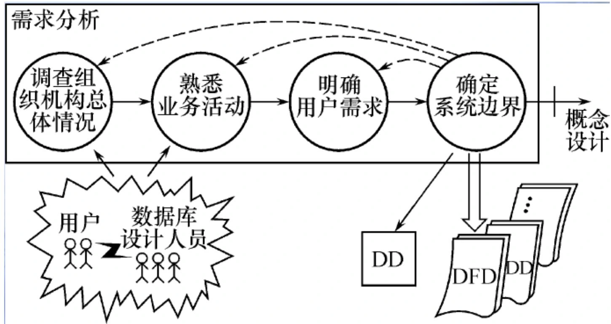
    - 常用调查方法：
        - 跟班作业
        - 开调查会
        - 请专人介绍
        - 询问
        - 设计调查表请用户填写
        - 查阅记录
- 与用户达成共识
- 进一步分析与表达这些需求
    - 常用方法
        - 结构化分析方法（Structured Analysis，简称 SA 方法）
            - 从最上层的系统组织机构入手
            - 自顶向下、逐层分解
            - 用数据流图和数据字典描述系统
        1. 首先把任何一个系统都抽象为：
            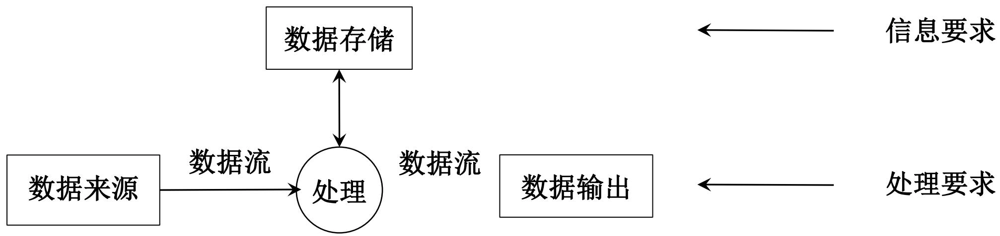
        2. 分解处理功能和数据：
            - 分解处理功能
                - 将处理功能的具体内容分解为若干子功能。
            - 分解数据
                - 处理功能逐步分解同时，逐级分解所用数据，形成若干层次的数据流图。
            - 表达方法
                - 处理逻辑：用判定表或判定树来描述。
                - 数据：用数据字典来描述。
        3. 将分析结果再次提交给用户，征得用户的认可

### 数据字典
- 定义
    - 数据字典是**关于数据库中数据的描述**，是**元数据**，而不是数据本身。
    - 数据字典在需求分析阶段建立，在数据库设计过程中不断修改、充实、完善。
- 用途
    - 数据字典是各类数据描述的集合
    - 数据字典是进行详细的数据收集和数据分析所获得的主要结果
    - 数据字典在数据库设计中占有很重要的地位
- 内容
    - **数据字典的内容**：
        - 数据项
        - 数据结构
        - 数据流
        - 数据存储
        - 处理过程
    - 数据项是数据的最小组成单位
    - 若干个数据项可以组成一个数据结构
    - 数据字典通过对数据项和数据结构的定义来描述数据流、数据存储的逻辑内容

#### 数据项
- **数据项是不可再分的数据单位**。
- 对数据项的描述：
    - 数据项描述 = { 数据项名，数据项含义说明，别名，数据类型，长度，取值范围，取值含义，与其他数据项的逻辑关系，数据项之间的联系 }
        - 取值范围、与其他数据项的逻辑关系定义了数据的完整性约束条件
- 举例：学生学籍管理子系统的数据字典。数据项以“学号”为例：
    - 数据项：学号
    - 含义说明：唯一标识每个学生
    - 别名：学生编号
    - 数据类型：字符型
    - 长度：8
    - 取值范围：00000000 至 99999999
    - 取值含义：前两位标别该学生所在年级，后六位按顺序编号

#### 数据结构
- **数据结构反映了数据之间的组合关系**。
- 一个数据结构可以由若干个数据项组成，也可以由若干个数据结构组成，或由若干个数据项和数据结构混合组成。
- 对数据结构的描述：
    - 数据结构描述 = { 数据结构名，含义说明，组成：{ 数据项或数据结构 } }
- 举例：学生学籍管理子系统的数据字典。“学生”是该系统中的一个核心数据结构：
    - 数据结构：学生
    - 含义说明：是学籍管理子系统的主体数据结构，定义了一个学生的有关信息
    - 组成：学号，姓名，性别，年龄，所在系，年级

#### 数据流
- **数据流是数据结构在系统内传输的路径**。
- 对数据流的描述：
    - 数据流描述 = { 数据流名，说明，数据流来源，数据流去向，组成：{ 数据结构 }，平均流量，高峰期流量 }
        - 数据流来源是说明该数据流来自哪个过程
        - 数据流去向是说明该数据流将到哪个过程去
        - 平均流量是指在单位时间（每天、每周、每月等）里的传输次数
        - 高峰期流量则是指在高峰时期的数据流量
- 举例：数据流“体检结果”可如下描述：
    - 数据流：体检结果
    - 说明：学生参加体格检查的最终结果
    - 数据流来源：体检
    - 数据流去向：批准
    - 组成：学生，体检项目，体检结果
    - 平均流量：每年 3000 条
    - 高峰期流量：每月 1000 条

#### 数据存储
- 数据存储是数据结构停留或保存的地方，也是数据流的来源和去向之一。
- 对数据存储的描述：
    - 数据存储描述 = { 数据存储名，说明，编号，输入的数据流，输出的数据流，组成：{ 数据结构 }，数据量，存取频度，存取方式 }
        - 输入的数据流：指出数据来源
        - 输出的数据流：指出数据去向
        - 存取频度：每次存取多少数据，每天（或每小时、每周等）存取几次等信息
        - 存取方法：批处理/联机处理；检索/更新；顺序检索/随机检索；
- 举例：数据存储“体检记录”可如下描述：
    - 数据存储：体检记录
    - 说明：保存学生体格检查的所有记录
    - 编号：DS-01
    - 输入的数据流：体检结果
    - 输出的数据流：体检结果查询
    - 组成：学生，体检项目，体检结果
    - 数据量：每年约 3000 条记录
    - 存取频度：每天存取 50 次
    - 存取方式：联机处理，随机检索，更新

#### 处理过程
- 处理过程的具体处理逻辑一般用判定表或判定树来描述，数据字典中只需要描述处理过程的说明性信息。
- 处理过程说明信息的描述
    - 处理过程描述 = { 处理过程名，说明，输入：{ 数据流 }，输出： { 数据流 }，处理：{ 简要说明 } }
- 举例：处理过程“分配宿舍”可如下描述：
    - 处理过程：分配宿舍
    - 说明：为所有新生分配学生宿舍
    - 输入：学生，宿舍
    - 输出：宿舍安排
    - 处理：在新生报到后，为所有新生分配学生宿舍。要求同一间宿舍只能安排同一性别的学生。同一个学生只能安排在一个宿舍中。每个学生的居住面积不小于3平方米。安排新生宿舍其处理时间应不超过15分钟。

## 概念结构设计
### 概念结构
- 定义：
    - 需求分析阶段描述的用户应用需求是现实世界的具体需求，将需求分析得到的用户需求抽象为信息结构即概念模型的过程就是概念结构设计；
    - 概念结构是各种数据模型的共同基础，它比数据模型更独立于机器，更抽象，从而更加稳定；
    - **概念结构设计是整个数据库设计的关键**；

    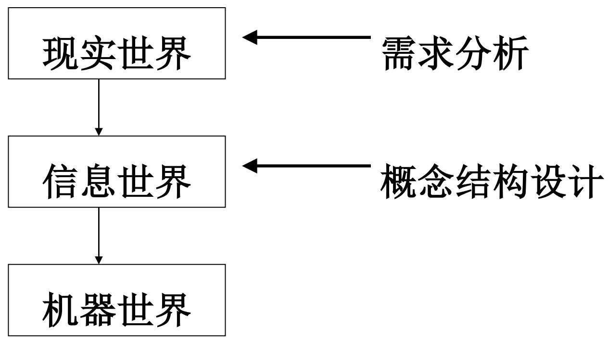

- 概念结构设计的特点：
    - 能真实、充分地反映现实世界，包括事物和事物之间的联系，能满足用户对数据的处理要求。
    - 易于理解，从而可以用它和不熟悉计算机的用户交换意见。
    - 易于更改，当应用环境和应用要求改变时，容易对概念模型修改和扩充。
    - 易于向关系、网状、层次等各种数据模型转换。
- 描述概念模型的工具
    - E-R 模型
        - 两个实体之间的联系

        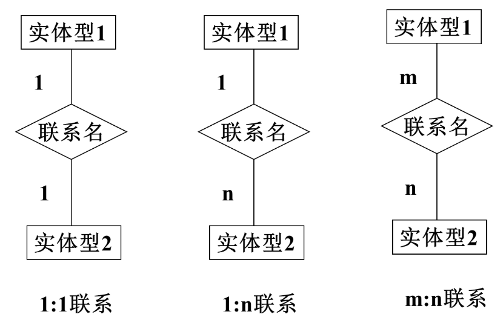

### 概念结构设计的方法
- 概念结构设计的四类方法
    - **自顶向下**
        - 首先定义全局概念结构的框架，然后逐步细化

        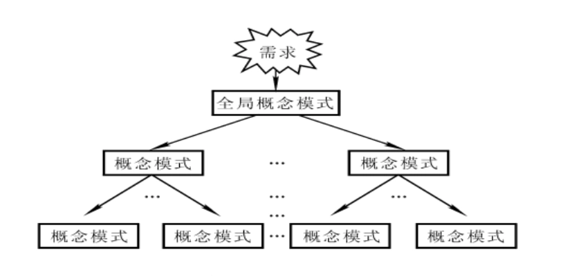

    - **自底向上**
        - 首先定义各局部应用的概念结构，然后将它们集成起来，得到全局概念结构

        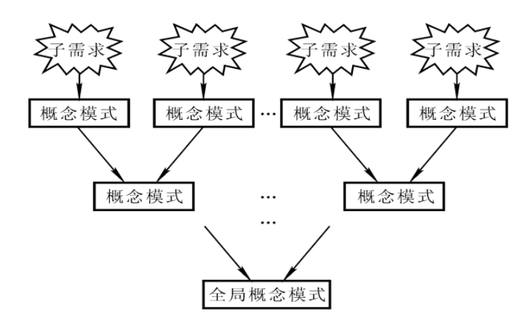

    - **逐步扩张**
        - 首先定义最重要的核心概念结构，然后向外扩充，以滚雪球的方式逐步生成其他概念结构，直至总体概念结构

        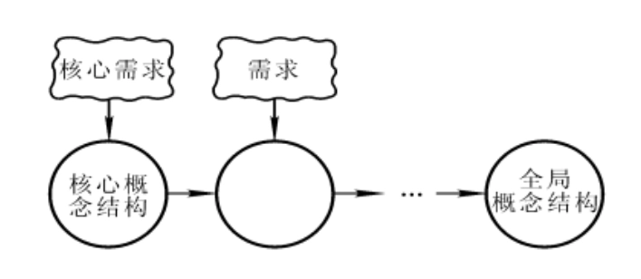

    - 混合策略
        - 将自顶向下和自底向上相结合，用自顶向下策略设计一个全局概念结构的框架，以它为骨架集成由自底向上策略中设计的各局部概念结构。

- 常用策略
    - **自顶向下**地进行需求分析
    - **自底向上**地设计概念结构

    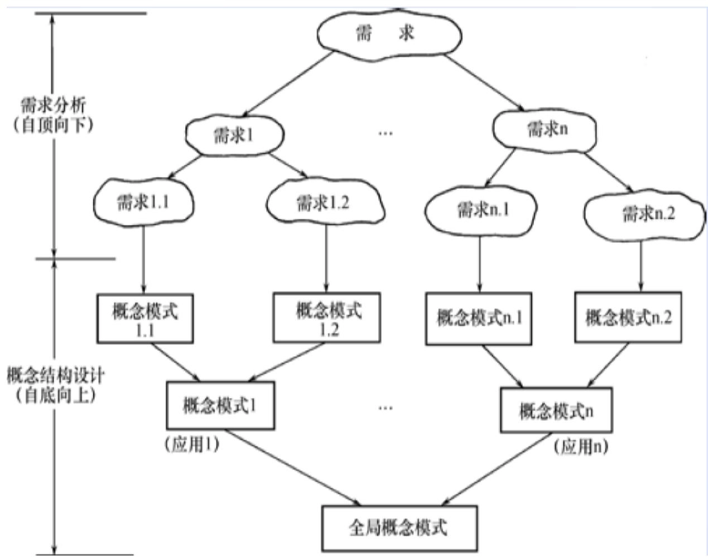

- 自底向上设计概念结构的步骤：
    1. 抽象数据并设计局部视图。
    2. 集成局部视图，得到全局概念结构。

    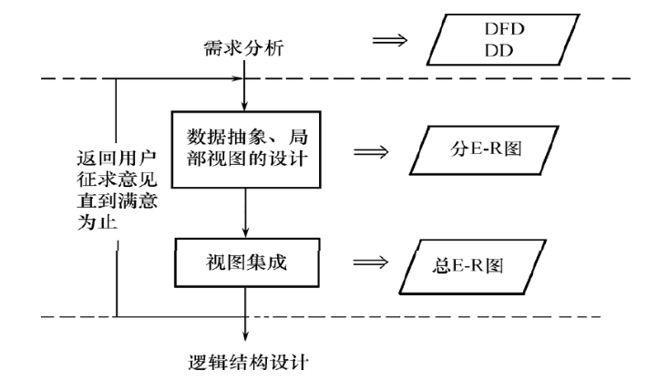

### 概念结构设计的步骤
- 抽象数据并设计局部视图。
- 集成局部视图，得到全局概念结构。
- 验证整体概念结构。

#### 抽象数据并设计局部视图
##### 数据抽象
- 概念结构是对现实世界的一种抽象
    - 从实际的人、物、事和概念中抽取所关心的共同特性，忽略非本质的细节；
    - 把这些特性用各种概念精确地加以描述；
    - 这些概念组成了某种模型；
- **三类常用抽象**
    1. **分类**（Classification）
        - 定义某一类概念作为现实世界中一组对象的类型
        - 这些对象具有某些共同的特性和行为
        - 抽象了对象值和型之间的 “is member of” 的语义
        - 在 E-R 模型中，实体型就是这种抽象

        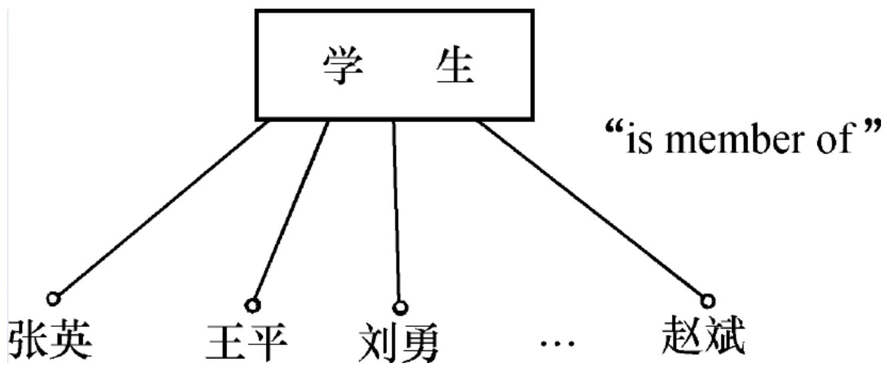

    2. **聚集**（Aggregation）
        - 定义某一类型的组成成分
        - 抽象了对象内部类型和成分之间“is part of”的语义
        - 在 E-R 模型中若干属性的聚集组成了实体型，就是这种抽象

        

    3. **概括**（Generalization）
        - 定义类型之间的一种子集联系
        - 它抽象了类型之间的 “is subset of” 的语义
        - 概括有一个很重要的性质：继承性。

        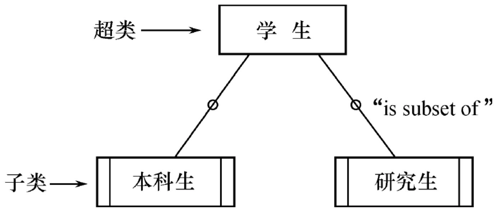

        - 用双竖边的矩形框表示子类
        - 用直线加小圆圈表示超类-子类的联系
- 数据抽象的主要功能：
    - 对需求分析阶段收集到的数据进行分类、组织（聚集），形成
        - 实体
        - 实体的属性，标识实体的码
        - 确定实体之间的联系类型(1:1，1:n，m:n)

##### 局部视图设计
1. 选择局部应用
    - 在多层的数据流图中选择一个适当层次的数据流图，作为设计分 E-R 图的出发点。
    - 通常以中层数据流图作为设计分 E-R 图的依据

    

2. 逐一设计分 E-R 图
    - 任务：
        - 将各局部应用涉及的数据分别从数据字典中抽取出来。
        - 参照数据流图，标定各局部应用中的实体、实体的属性、标识实体的码。
        - 确定实体之间的联系及其类型（1:1，1:n，m:n）。
    - 设计原则：
        - 为了简化 E-R 图的处置，现**实世界中的事物凡能够作为属性对待的，应尽量作为属性**。
        - 一般原则：
            - 属性不能再具有需要描述的性质。即**属性必须是不可分的数据项**，不能再由另一些属性组成。
            - 属性不能与其他实体具有联系。**联系只发生在实体之间**。
        - 符合上述两条特性的事物一般作为属性对待。
    - 如何区分实体和属性？
        - 实体与属性是相对而言的。同一事物，在一种应用环境中作为“属性”，在另一种应用环境中就必须作为“实体”。

        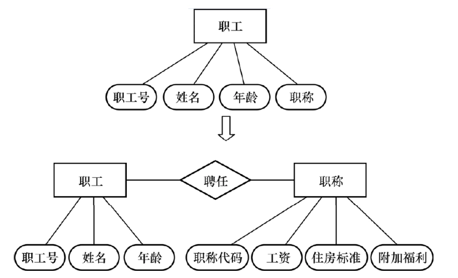

- 案例分析：销售管理子系统分 E-R 图的设计
    - 销售管理子系统的主要功能：
        - 处理顾客和销售员送来的订单。
        - 工厂是根据订货安排生产的。
        - 交出货物同时开出发票。
        - 收到顾客付款后，根据发票存根和信贷情况进行应收款处理。
    - 下图是第一层数据流图，虚线部分划出了系统边界。
        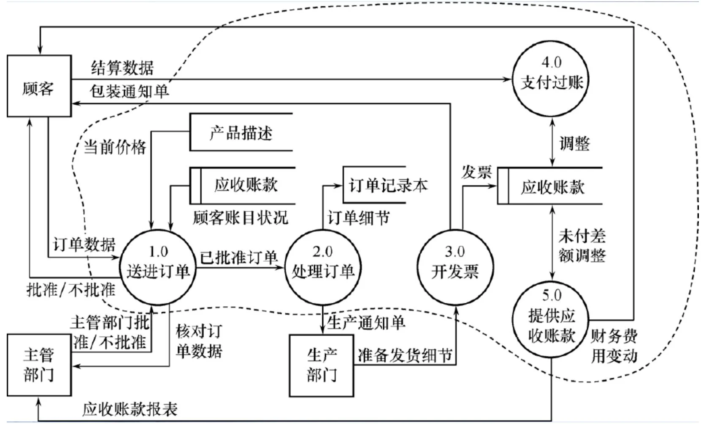
    - 第二层数据流图：
        - 接收订单
            
        - 处理订单
            
        - 开发票
            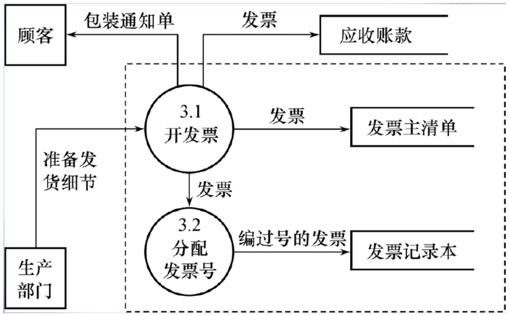
        - 支付过账
            
    - 分 E-R 图的框架：
        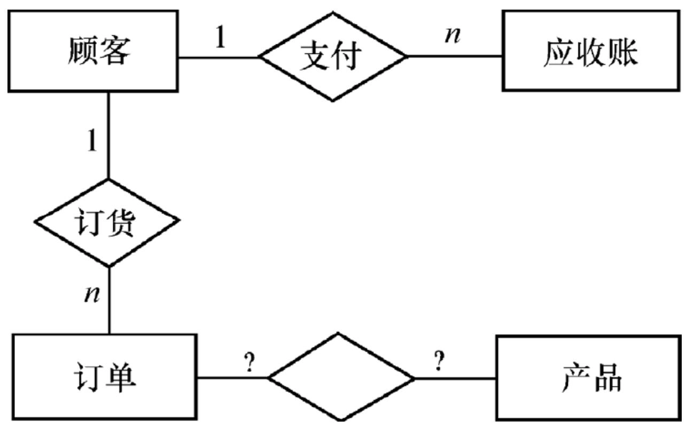
    - 参照第二层数据流图和数据字典，遵循两个准则，进行如下调整：
        - 订单与订单细节（有若干属性）是 1:n 的联系。
        - 原订单和产品的联系实际上是订单细节和产品的联系。
        - “发票主清单”是一个数据存储，不必作为实体。
        - 工厂对大宗订货给予优惠，每种产品有不同订货量的折扣
    - 修改后的分 E-R 图的框架：
        
    - 对每个实体定义的属性如下：
        - 顾客（**顾客号**，顾客名，地址，电话，信贷状况，账目余额）
        - 订单（**订单号**，顾客号，订货项数，订货日期，交货日期，工种号，生产地点）
        - 订单细则（**订单号，细则号**，零件号，订货数，金额）
        - 应收账款（**顾客号，订单号**，发票号，应收金额，支付日期，支付金额，当前余额，货款限额）
        - 产品描述（**产品号**，产品名，单价，重量）
        - 折扣规则（**产品号，订货量**，折扣）

#### 集成视图
- 各个局部视图即分 E-R 图建立好后，还需要对它们进行合并，集成为一个整体的数据概念结构，即总 E-R 图。
- 视图集成的两种方式：
    - **多个分 E-R 图一次集成**
        - 一次集成多个分 E-R 图;
        - 通常用于局部视图比较简单时;
        - 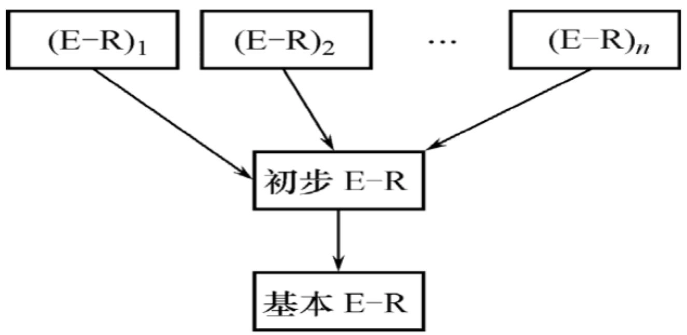
    - **逐步累积式**
        - 首先集成两个局部视图（通常是比较关键的两个）
        - 以后每次将一个新的局部视图集成进来
        - 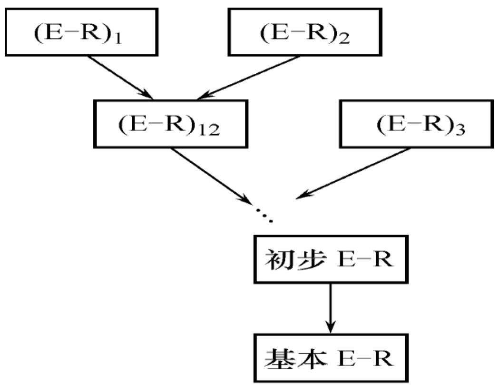
- 集成局部 E-R 图的步骤
    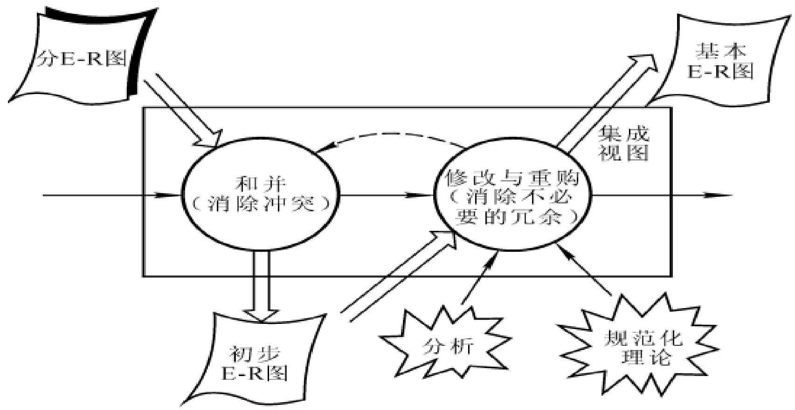

##### 合并分 E-R 图，生成初步 E-R 图
- 各分 E-R 图存在冲突
    - **属性冲突**
        - **属性域冲突**：属性值的类型、取值范围或取值集合不同。
            - 例：某些部门（即局部应用）以出生日期形式表示学生的年龄，而另一些部门（即局部应用）用整数形式表示学生的年龄。
        - **属性取值单位冲突**。
            - 例：学生的身高，有的以米为单位，有的以厘米为单位，有的以尺为单位。
    - **命名冲突**
        - **同名异义**：不同意义的对象在不同的局部应用中具有相同的名字
            - 例：局部应用 A 中将教室称为房间，局部应用 B 中将学生宿舍称为房间
        - **异名同义**（一义多名）：同一意义的对象在不同的局部应用中具有不同的名字
            - 例：有的部门把教科书称为课本，有的部门则把教科书称为教材
    - **结构冲突**
        - 同一对象在不同应用中具有不同的抽象；
            - 例：某些局部应用中把职位作为实体，而另一些局部应用中把职位作为属性；
        - **同一实体在不同分 E-R 图中所包含的属性个数和属性排列次序不完全相同**；
            - 例：某些局部应用中职工的属性包括职工号、姓名、性别、出生日期，而另一些局部应用中职工的属性还包括职称、工资等；
        - 实体之间的联系在不同局部视图中呈现不同的类型；
            - 例：某些局部应用中把职工和项目之间的联系看作多对多联系，而另一些局部应用中把它看作两个一对多联系的组合。
- 合并分 E-R 图的主要工作与关键
    - 合理消除各分 E-R 图的冲突。

##### 修改与重构，生成基本 E-R 图
- 基本任务：消除不必要的冗余，设计生成基本 E-R 图
    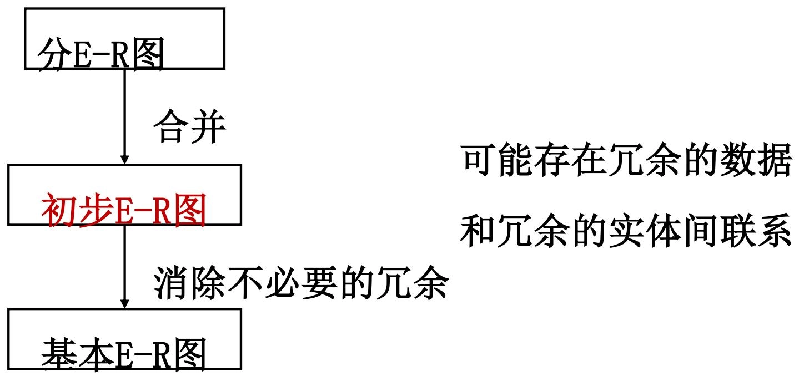
- 冗余
    - 冗余的数据是指可由基本数据导出的数据，冗余的联系是指可由其他联系导出的联系。
    - 冗余数据和冗余联系容易破坏数据库的完整性，给数据库维护增加困难
    - 并不是所有的冗余数据与冗余联系都必须加以消除，有时为了提高某些应用的效率，不得不以冗余信息作为代价。
        - 效率 VS 冗余信息。
            - 需要根据用户的整体需求来确定。
        - 若人为地保留了一些冗余数据，则应把数据字典中数据关联的说明作为完整性约束条件。
            - 例如：$Q4 = \sum Q5$，一旦 $Q5$ 修改后就应当触发完整性检查，对 $Q4$ 进行修改。
- 消除冗余的方法
    - 分析方法：以数据字典和数据流图为依据，根据数据字典中关于数据项之间逻辑关系的说明来消除冗余。
        
    - 规范化理论：函数依赖的概念提供了消除冗余联系的形式化工具。
        1. 确定分 E-R 图实体之间的数据依赖 $F_{L}$  。
            - 例：部门和职工之间一对多的联系可表示为：职工号  $\rightarrow$  部门号
            - 例：职工和项目之间多对多的联系可表示为：（职工号，项目号）→工作天数
                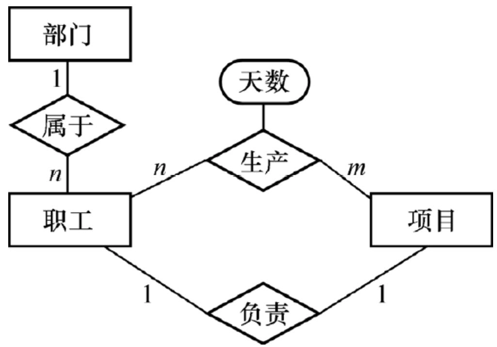
        1. 求 $F_{L}$ 的最小覆盖 $G_{L}$ ，差集为：$D = F _ {L} - G _ {L}$，逐一考察  $D$  中的函数依赖，确定是否是冗余的联系，若是，就把它去掉。
            - 冗余的联系一定在 $D$ 中，而 $D$ 中的联系不一定是冗余的；
            - 当实体之间存在多种联系时，要将实体之间的联系在形式上加以区分；
- 案例分析：某工厂管理信息系统的视图集成
    - 工厂物资管理、销售管理子系统、劳动人事管理的分 E-R 图
        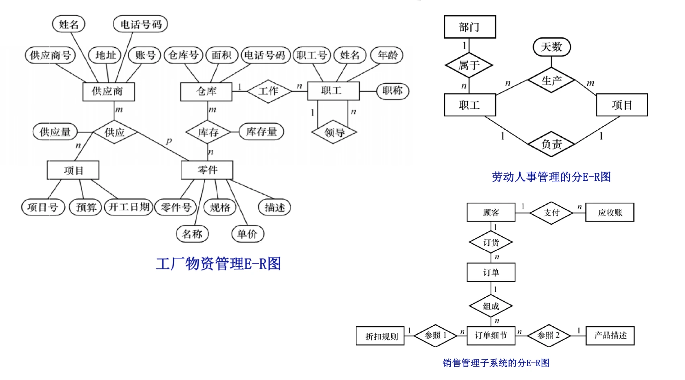
    - 工厂管理信息系统的基本 E-R 图
        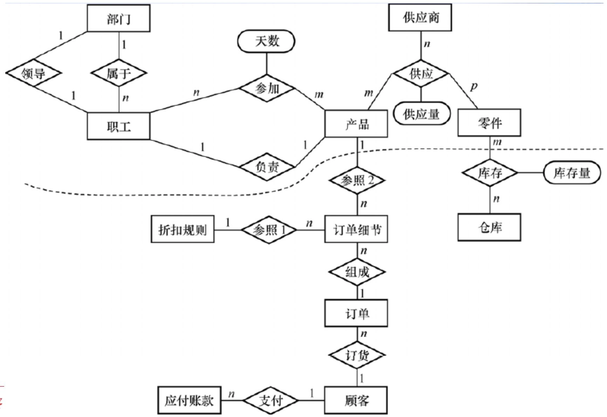
    - 集成过程，解决了以下问题：
        - 异名同义，项目和产品含义相同。
        - 库存管理中职工与仓库的工作关系已包含在劳动人事管理的部门与职工之间的联系之中，所以可以取消。
        - 职工之间领导与被领导关系可由部门与职工（经理）之间的领导关系、部门与职工之间的从属关系两者导出，所以也可以取消。

#### 验证整体概念结构
- 视图集成后形成一个整体的数据库概念结构，对该整体概念结构还必须进行进一步验证，确保它能够满足下列条件：
    - 整体概念结构内部必须具有一致性，不存在互相矛盾的表达。
    - 整体概念结构能准确地反映原来的每个视图结构，包括属性、实体及实体间的联系。
    - 整体概念结构能满足需要分析阶段所确定的所有要求。

## 逻辑结构设计
- 逻辑结构设计的任务：把概念结构设计阶段设计好的基本 E-R 图转换为与选用 DBMS 产品所支持的数据模型相符合的逻辑结构。
- 逻辑结构设计的步骤
    

### E-R 图向关系模型的转换
- 转换内容
    - E-R 图由实体、实体的属性和实体之间的联系三个要素组成
    - 关系模型的逻辑结构是一组关系模式的集合
    - 将 E-R 图转换为关系模型：将实体、实体的属性和实体之间的联系转化为关系模式。

#### 一个实体型转换为一个关系模式
- **关系的属性**：实体型的属性
- **关系的码**：实体型的码
- 示例：学生实体可以转换为如下关系模式：
    - 学生（**学号**，姓名，出生日期，所在系，年级，平均成绩）
    - 注意：性别、宿舍、班级、档案材料、教师、课程、教室、教科书可用别的关系模式表达。

#### 一个 m:n 联系转换为一个关系模式
- **关系的属性**：与该联系相连的各实体的码以及联系本身的属性
- **关系的码**：各实体码的组合
- 示例：“选修”联系是一个 m:n 联系，可以将它转换为如下关系模式，其中学号与课程号为关系的组合码：
    - 选修（**学号，课程号**，成绩）

#### 一个 1:n 联系可以转换为一个独立的关系模式，也可以与 n 端对应的关系模式合并
1. 转换为一个独立的关系模式
    - **关系的属性**：与该联系相连的各实体的码以及联系本身的属性
    - **关系的码**：n 端实体的码
2. **与 n 端对应的关系模式合并**（更常用）
    - **合并后关系的属性**：在 n 端关系中加入 1 端关系的码和联系本身的属性
    - **合并后关系的码**：不变
    - 可以减少系统中的关系个数，一般情况下更倾向于采用这种方法

- 示例：“组成”联系（学生组成班级）为 1:n 联系，可以有两种转换方法：
    1. 转换为一个独立的关系模式：
        - 组成（**学号**，班级号）
    2. “组成”联系与学生关系模式合并，则只需在学生关系中加入班级关系的码，即班级号：
        - 学生（**学号**，姓名，出生日期，所在系，年级，*班级号*，平均成绩）

#### 一个 1:1 联系可以转换为一个独立的关系模式，也可以与任意一端对应的关系模式合并
1. 转换为一个独立的关系模式
    - **关系的属性**：与该联系相连的各实体的码以及联系本身的属性
    - **关系的候选码**：每个实体的码均是该关系的候选码
2. 与某一端对应的关系模式合并
    - **合并后关系的属性**：加入对应关系的码和联系本身的属性
    - **合并后关系的码**：不变

- 示例：“管理”联系（老师管理班级）为 1:1 联系，可以有三种转换方法：
    1. 转换为一个独立的关系模式：
        - 管理（**职工号**，班级号）
        - 管理（职工号，**班级号**）
    2. “管理”联系与班级关系模式合并，则只需在班级关系中加入教师关系的码，即职工号：
        - 班级（**班级号**，学生人数，*管理职工号*）
    3. “管理”联系与教师关系模式合并，则只需在教师关系中加入班级关系的码，即班级号：
        - 教师（**职工号**，姓名，性别，职称，*管理班级号*，是否为优秀班主任）
- **注意**：
    - 从理论上讲，1:1 联系可以与任意一端对应的关系模式合并。
    - 但在一些情况下，与不同的关系模式合并效率会大不一样。因此究竟应该与哪端的关系模式合并需要依应用的具体情况而定。
    - 由于连接操作是最费时的操作，所以一般应以尽量减少连接操作为目标。
        - 例如，如果经常要查询某个班级的班主任姓名，则将管理联系与教师关系合并更好些。

#### 三个或三个以上实体间的一个多元联系转换为一个关系模式
- **关系的属性**：与该多元联系相连的各实体的码以及联系本身的属性
- **关系的码**：各实体码的组合
- 示例：“讲授” 联系是一个三元联系，可以将它转换为如下关系模式，其中课程号、职工号和书号为关系的组合码：
    - 讲授（**课程号，职工号，书号**）

#### 具有相同码的关系模式可合并
- 目的：减少系统中的关系个数。
- 合并方法：将其中一个关系模式的全部属性加入到另一个关系模式中，然后去掉其中的同义属性（可能同名也可能不同名），并适当调整属性的次序。

#### 案例分析


- 工厂管理信息系统的基本E-R图，虚线上方的部分转换为关系模式（**加粗/下划线为主码，斜体/波浪线为外码**）：
    - 部门（**部门号**，部门名，*部门经理的职工号*，……）
    - 职工（**职工号**，姓名，*部门号*，……）
    - 产品（**产品号**，产品名，*产品组长的职工号*，……）
    - 供应商（**供应商号**，供应商名，……）
    - 零件（**零件号**，零件名，……）
    - 职工工作（***职工号*，*产品号***，工作天数，……）
    - 供应（***产品号*，*供应商号*，*零件号***，供应量，……）

### 数据模型的优化
- 数据库逻辑设计的结果不是唯一的。
- 得到初步数据模型后，还应该适当地修改、调整数据模型的结构，以进一步提高数据库应用系统的性能，这就是数据模型的优化。
- 关系数据模型的优化通常以规范化理论为指导。

#### 优化数据模型的方法
1. 确定数据依赖
    - 按需求分析阶段所得到的语义，分别写出每个关系模式内部各属性之间的数据依赖以及不同关系模式属性之间数据的依赖。
2. 消除冗余的联系
    - 对于各个关系模式之间的数据依赖进行极小化处理，消除冗余的联系。
3. 确定所属范式
    - 按照数据依赖的理论对关系模式逐一进行分析;
    - 考查是否存在部分函数依赖、传递函数依赖、多值依赖等；
    - 确定各关系模式分别属于第几范式。
4. 按照需求分析阶段得到的各种应用对数据处理的要求，分析对于这样的应用环境这些模式是否合适，确定是否要对它们进行合并或分解。
    - 注意：并不是规范化程度越高的关系就越优，一般说来，第三范式就足够了。
    - 示例：
        - 在关系模式：学生成绩单（学号，英语，数学，语文，平均成绩）中存在下列函数依赖：
            - 学号 $\to$ 英语
            - 学号 $\to$ 数学
            - 学号 $\to$ 语文
            - 学号 $\to$ 平均成绩
            - (英语，数学，语文) $\to$ 平均成绩
        - 显然有：学号 $\to$ (英语，数学，语文) $\to$ 平均成绩，因此该关系模式中存在传递函数依赖，是 2NF 关系。
        - 虽然平均成绩可以由其它属性推算出来，但如果应用中需要经常查询学生的平均成绩，为提高效率，仍然可保留该冗余数据，对关系模式不再做进一步分解。
5. 按照需求分析阶段得到的各种应用对数据处理的要求，对关系模式进行必要的分解，以提高数据操作的效率和存储空间的利用率。
    - 常用分解方法：
        - 水平分解
            - 把（基本）关系的元组分为若干子集合，定义每个子集合为一个子关系，以提高系统的效率。
            - 适用范围
                1. 满足“80/20原则”的应用
                2. 并发事务经常存取不相交的数据
        - 垂直分解
            - 把关系模式 $R$ 的属性分解为若干子集合，形成若干子关系模式。
            - 原则：取决于分解后 $R$ 上的所有事务的总效率是否得到了提高。

### 设计用户子模式
- 定义数据库全局模式主要是从系统的时间效率、空间效率、易维护等角度出发。
- 定义用户外模式时应注重**考虑用户的习惯与方便**，包括：
    1. 使用更符合用户习惯的别名。
    2. 针对不同级别的用户定义不同的视图（VIEW），以满足系统对安全性的要求。
    3. 简化用户对系统的使用。
- 示例：教师关系模式中包括职工号、姓名、性别、出生日期、婚姻状况、学历、学位、政治面貌、职称、职务、工资、工龄、教学效果等属性。
    - 定义两个外模式：
        - 教师_学籍管理（职工号，姓名，性别，职称）
        - 教师_课程管理（工号，姓名，性别，学历，学位，职称，教学效果）
    - 则有：
        - 授权学籍管理应用只能访问教师_学籍管理视图
        - 授权课程管理应用只能访问教师_课程管理视图
        - 授权教师管理应用能访问教师表
    - 这样就可以防止用户非法访问本来不允许他们查询的数据，保证了系统的安全性。

## 数据库物理设计
### 数据库的物理设计
- 定义：
    - 数据库在物理设备上的存储结构与存取方法称为数据库的物理结构，它依赖于选定的数据库管理系统。
    - 为一个给定的逻辑数据模型选取一个最适合应用环境的物理结构的过程，就是数据库的物理设计。
- 数据库物理设计的步骤
    

### 数据库物理设计的内容和方法
- 设计物理数据库结构的准备工作
    - 对要运行的事务进行详细分析，获得选择物理数据库设计所需参数。
    - 充分了解所用 RDBMS 的内部特征，特别是系统提供的存取方法和存储结构。
- 选择物理数据库设计所需参数
    - 数据库查询事务
        - 查询的关系
        - 查询条件所涉及的属性
        - 连接条件所涉及的属性
        - 查询的投影属性
    - 数据更新事务
        - 被更新的关系
        - 每个关系上的更新操作条件所涉及的属性
        - 修改操作要改变的属性值
    - **每个事务在各关系上运行的频率和性能要求**
- 关系数据库物理设计的内容
    1. 为关系模式选择存取方法（建立存取路径）
    2. 设计关系、索引等数据库文件的物理存储结构

### 关系模式存取方法选择
- 数据库系统是多用户共享的系统，对同一个关系要建立多条存取路径才能满足多用户的多种应用要求。
- 物理设计的第一个任务就是要确定选择哪些存取方法，即建立哪些存取路径。
- DBMS 常用存取方法
    - 索引（Index）方法
        - B+ 树索引
        - Hash 索引
    - 聚簇（Cluster）方法

#### B+ 树索引存取方法
- 选择索引存取方法的主要内容，根据应用要求确定：
    - 对哪些属性列建立索引
    - 对哪些属性列建立组合索引
    - 对哪些索引要设计为唯一索引
- 选择索引存取方法的一般规则：
    - 如果一个（或一组）属性经常在**查询条件**中出现，则考虑在这个（或这组）属性上建立索引（或组合索引）；
    - 如果一个属性经常作为最大值和最小值等**聚集函数**的参数，则考虑在这个属性上建立索引；
    - 如果一个（或一组）属性经常在连接操作的**连接条件**中出现，则考虑在这个（或这组）属性上建立索引；
- 索引存取方法的选择
    - 关系上定义的索引数过多会带来较多的额外开销
        - 维护索引的开销
        - 查找索引的开销
    - 若一个关系更新频率很高，这个关系上不能定义太多索引

#### Hash 索引存取方法
- 选择 hash 索引存取方法的一般规则：
    - 一个关系的属性主要出现在**等值连接条件**；
    - 一个关系的属性主要出现在**等值比较选择条件**；
    - 而且满足下列两个条件之一：
        - 一个关系的大小可预知，而且不变；
        - 关系的大小动态改变，但 DBMS 提供了动态 hash 存取方法。

#### 聚簇存取方法
- 聚簇的定义：
    - 为了提高某个属性（或属性组）的查询速度，把这个或这些属性（称为聚簇码）上具有相同值的元组集中存放在连续的物理块称为聚簇。
    - 许多关系型 DBMS 都提供了聚簇功能
    - 聚簇存放与聚簇索引的区别？
        - 聚簇存放是指把具有相同聚簇码值的元组物理上存放在一起，是一种物理存储结构
        - 聚簇索引是指在某个属性（或属性组）上建立索引，是一种存取方法。
- 聚簇的用途
    1. **大大提高按聚簇属性进行查询的效率**
        - 例：假设学生关系按所在系建有索引，现在要查询信息系的所有学生名单。
            - 信息系的 500 名学生分布在 500 个不同的物理块上时，至少要执行 500 次 I/O 操作。
            - 如果将同一系的学生元组集中存放，则每读一个物理块可得到多个满足查询条件的元组，从而显著地减少了访问磁盘的次数。
    2. **节省存储空间**
        - 聚簇以后，聚簇码相同的元组集中在一起了，因而聚簇码值不必在每个元组中重复存储，只要在一组中存一次就行了
    3. **多表预连接**
        - 例：假设用户经常要按系别查询学生成绩单，这一查询涉及学生关系和选修关系的连接操作，即需要按学号连接这两个关系，为提高连接操作的效率，可以把具有相同学号值的学生元组和选修元组在物理上聚簇在一起。这就相当于把多个关系按“预连接”的形式存放，从而大大提高连接操作的效率。
- 聚簇存取方法的选择
    1. 设计候选聚簇
        - 对经常在一起进行**连接操作**的关系可以建立组合聚簇;
        - 如果一个关系的一组属性经常出现在**相等比较条件**中，则该单个关系可建立聚簇；
        - 如果一个关系的一个（或一组）属性上的**值重复率很高**，则此单个关系可建立聚簇。
        - 对应每个聚簇码值的平均元组数不太少，太少了，聚簇的效果不明显。
    2. 检查候选聚簇中的关系，取消其中不必要的关系
        - 从独立聚簇中删除经常进行**全表扫描**的关系;
        - 从独立/组合聚簇中删除**更新操作远多于查询**操作的关系;
        - 从独立/组合聚簇中删除**重复出现**的关系;
            - 当一个关系同时加入多个聚簇时，必须从这多个聚簇方案（包括不建立聚簇）中选择一个较优的，即在这个聚簇上运行各种事务的总代价最小
- 聚簇的局限性
    - 聚簇只能提高某些特定应用的性能
    - 建立与维护聚簇的开销相当大
        - 对已有关系建立聚簇，将导致关系中元组移动其物理存储位置，并使此关系上原有的索引无效，必须重建。
        - 当一个元组的聚簇码改变时，该元组的存储位置也要做相应移动
- 聚簇的适用范围
    - 当通过聚簇码进行访问或连接是该关系的主要应用，与聚簇码无关的其他访问很少或者是次要的时，可以使用聚簇。
    - 尤其当 SQL 语句中包含有与聚簇码有关的 `ORDER BY`，`GROUP BY`，`UNION`，`DISTINCT` 等子句或短语时，使用聚簇特别有利，可以省去对结果集的排序操作

#### 位图索引存取方法
- 位图索引的定义
    - 位图索引是一种特殊的索引结构，它使用位图来表示某个属性（或属性组）上各个值在关系中的存在情况。
- 位图索引的适用范围
    - 适用于**属性值重复率较高**的属性
    - 适用于**读操作远多于写操作**的关系

### 确定数据库的存储结构
- 确定数据库物理结构的内容
    1. 确定数据的存放位置和存储结构
        - 关系
        - 索引
        - 聚簇
        - 日志
        - 备份
    2. 确定系统配置

#### 确定数据的存放位置
- 影响数据存放位置和存储结构的因素
    - 硬件环境
    - 应用需求
        - 存取时间
        - 存储空间利用率
        - 维护代价
    - 注意：这三个方面常常是相互矛盾的，例如：消除一切冗余数据虽能够节约存储空间和减少维护代价，但往往会导致检索代价的增加必须进行权衡，选择一个折中方案。
- 基本原则：
    - 根据应用情况将数据分开存放，以提高系统性能
        - 易变部分与稳定部分
- 示例：
    - 数据库数据备份、日志文件备份等由于只在故障恢复时才使用，而且数据量很大，可以考虑存放在磁带上。
    - 如果计算机有多个磁盘，可以考虑将表和索引分别放在不同的磁盘上，在查询时，由于两个磁盘驱动器分别在工作，因而可以保证物理读写速度比较快。
    - 可以将比较大的表分别放在两个磁盘上，以加快存取速度，这在多用户环境下特别有效。
    - 可以将日志文件与数据库对象（表、索引等）放在不同的磁盘以改进系统的性能。

#### 确定系统配置
- DBMS 产品一般都提供了一些存储分配参数
    - 同时使用数据库的用户数
    - 同时打开的数据库对象数
    - 使用的缓冲区长度、个数
    - 时间片大小
    - 数据库的大小
    - 装填因子
    - 锁的数目
    - ……

### 评价物理结构
- 评价内容
    - 对数据库物理设计过程中产生的多种方案进行细致的评价，从中选择一个较优的方案作为数据库的物理结构
- 评价方法
    - 定量估算各种方案
        - 存取时间（时间效率）
        - 存储空间（空间效率）
        - 维护代价
        - 用户要求
    - 对估算结果进行权衡、比较，选择出一个较优的合理的物理结构
    - 如果该结构不符合用户需求，则需要修改设计

## 数据库实施与维护
### 数据库的实施
- 数据库实施的工作内容：
    - 用 DDL 定义数据库结构
    - 数据载入，组织数据入库
    - 编制与调试应用程序
    - 数据库试运行

#### 数据装载
- 数据库结构建立好后，就可以向数据库中装载数据。组织数据入库是数据库实施阶段最主要的工作。
- 数据装载方法
    - 人工方法
    - 计算机辅助数据入库

#### 编制与调试应用程序
- 数据库应用程序的设计应该与数据库设计并行进行。
- 在数据库实施阶段，当数据库结构建立好后，就可以开始编制与调试数据库的应用程序。调试应用程序时由于数据入库尚未完成，可先使用模拟数据。

#### 数据库试运行
- 应用程序调试完成，并且已有一小部分数据入库后，就可以开始数据库的试运行。
- 数据库试运行也称为联合调试，其主要工作包括：
    1. 功能测试：实际运行应用程序，执行对数据库的各种操作，测试应用程序的各种功能。
    2. 性能测试：测量系统的性能指标，分析是否符合设计目标。
- 数据的分期入库
    - 重新设计物理结构甚至逻辑结构，会导致数据重新入库。
    - 由于数据入库工作量实在太大，所以可以采用分期输入数据的方法：
        - 先输入小批量数据供先期联合调试使用；
        - 待试运行基本合格后再输入大批量数据；
        - 逐步增加数据量，逐步完成运行评价；
- 数据库的转储和恢复
    - 在数据库试运行阶段，系统还不稳定，硬、软件故障随时都可能发生；
    - 系统的操作人员对新系统还不熟悉，误操作也不可避免；
    - 必须做好数据库的转储和恢复工作，尽量减少对数据库的破坏。
- 数据库试运行结果符合设计目标后，数据库就可以真正投入运行了。
- 数据库投入运行标着开发任务的基本完成和维护工作的开始
- 对数据库设计进行评价、调整、修改等维护工作是一个长期的任务，也是设计工作的继续和提高。
    - 应用环境在不断变化
    - 数据库运行过程中物理存储会不断变化
- 在数据库运行阶段，**对数据库经常性的维护工作主要是由 DBA 完成的**，包括：
    1. 数据库的转储和恢复；
    2. 数据库的安全性、完整性控制；
    3. 数据库性能的监督、分析和改进；
    4. 数据库的重组织和重构造；

#### 数据库的重组织和重构造
- 重组织的形式：
    - 全部重组织。
    - 部分重组织。
        - 只对频繁增、删的表进行重组织。
- 重组织的目标：提高系统性能
- 重组织的工作：
    - 按原设计要求：
        - 重新安排存储位置
        - 回收垃圾
        - 减少指针链重组织的目标
    - 数据库的重组织不会改变原设计的数据逻辑结构和物理结构。
- 数据库重构造：
    - 根据新环境调整数据库的模式和内模式
    - 增加新的数据项
    - 改变数据项的类型
    - 改变数据库的容量
    - 增加或删除索引
    - 修改完整性约束条件

# 第六章 数据库安全
## 计算机安全性概述
### 数据库的不安全因素
- 数据库的安全性，是指保护数据库以防止不合法使用所造成的数据泄漏、更改或破坏。
- 产生威胁的因素：
    - 非授权用户对数据库的恶意存取和破坏；
    - 数据库中重要或敏感的数据被泄露；
    - 安全环境的脆弱性；

### 可信计算机系统评测标准
- 为降低进而消除对系统的安全攻击，各国引用或制定了一系列安全标准：
    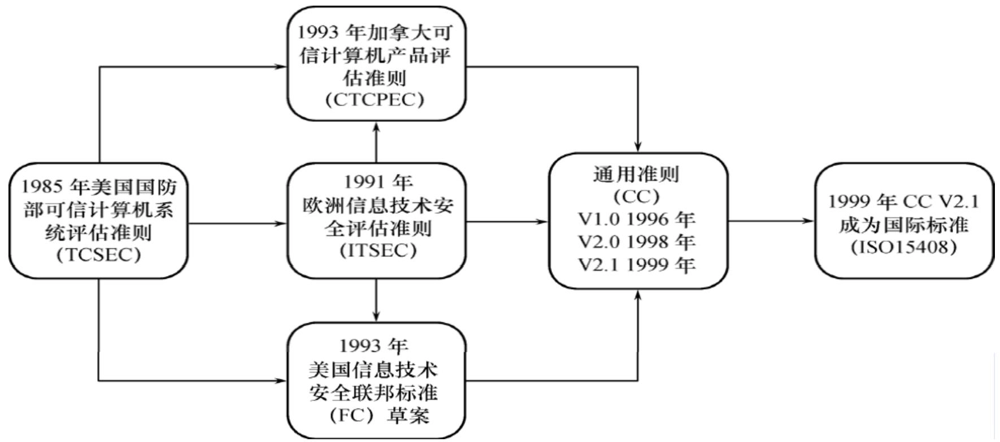
- 1985 年美国国防部（DoD）正式颁布《DoD 可信计算机系统评估标准》（简称 TCSEC 或 DoD85）
    - TCSEC 又称**桔皮书**
    - TCSEC 标准的目的:
        - 提供一种标准，使用户可以对其计算机系统内敏感信息安全操作的可信程度做评估。
        - 给计算机行业的制造商提供一种可循的指导规则，使其产品能够更好地满足敏感应用的安全需求。
- 1991 年 4 月美国 NCSC（国家计算机安全中心）颁布了《可信计算机系统评估标准关于可信数据库系统的解释》（TCSEC/ Trusted Database Interpretation 简称 TCSEC/TDI）
    - TDI 又称**紫皮书**，它将 TCSEC 扩展到数据库管理系统。
    - TDI 中定义了数据库管理系统的设计与实现中需满足和用以进行安全性级别评估的标准。

- TCSEC/TDI 安全级别划分
    <table>
    <thead>
    <td><strong>类别</strong></td>
	<td><strong>级别</strong></td>
	<td><strong>名称</strong></td>
	<td><strong>主要特征</strong></td>
	</thead>
    <tr>
    <td>D</td>
    <td>D</td>
    <td>最小保护</td>
    <td>没有安全保护，如 ms-dos</td>
    </tr>
    <tr>
    <td rowspan="2">C</td>
    <td>C1</td>
    <td>自主安全保护</td>
    <td>实现自主存取控制 DAC，具有识别与授权的责任，如早期 UNIX 系统</td>
    </tr>
    <tr>
    <td>C2</td>
    <td>受控存储控制</td>
    <td>安全产品的最低档，提供受控的存取保护，实施审计和资源隔离，Windows 2000 和 Oracle 7</td>
    </tr>
    <tr>
    <td rowspan="3">B</td>
    <td>B1</td>
    <td>标识安全保护</td>
    <td>对系统数据加以标记，实施强制存取控制 MAC 和审计，如 Oracle 公司的 Trusted Oracle 7，Sybase 公司的 Secure SQL Server version 11.0.6</td>
    </tr>
    <tr>
    <td>B2</td>
    <td>结构化保护</td>
    <td>除满足 B1 要求外，要实行强制性的控制并进行严格的保护，如 Trusted Xenix 系统。</td>
    </tr>
    <tr>
    <td>B3</td>
    <td>安全域</td>
    <td>提供可信设备的管理和恢复，即使计算机崩溃也不会泄露系统信息。如 Honeywell Federal Systems XTS-200</td>
    </tr>
    <tr>
    <td>A</td>
    <td>A</td>
    <td>验证设计</td>
    <td>形式化的最高级描述和验证</td>
    </tr>
    </table>

- CC 标准
    - 提出国际公认的表述信息技术安全性的结构。
    - 把信息产品的安全要求分为：
        - 安全功能要求：规范产品和系统的安全行为；
        - 安全保证要求：解决如何正确有效地实施这些功能。
- CC 评估保证级划分

    | 评估保证级 | 定义 | TCSEC安全级别（近似） |
    | --- | --- | --- |
    | EAL 1 | 功能测试 (functionally tested) |  |
    | EAL 2 | 结构测试 (structurally tested) | C1 |
    | EAL 3 | 系统地测试和检查 (methodically tested and checked) | C2 |
    | EAL 4 | 系统地设计、测试和复查 (methodically designed, tested and reviewed) | B1 |
    | EAL 5 | 半形式化设计和测试(semifomally designed and tested) | B2 |
    | EAL 6 | 半形式化验证的设计和测试(semifomally verified design and tested) | B3 |
    | EAL 7 | 形式化验证的设计和测试(formally verified design and tested) | A1 |

## 数据库安全性控制
### 数据库安全性控制概述
- 非法使用数据库的情况
    - 用户编写一段合法的程序绕过 DBMS 及其授权机制，通过操作系统直接存取、修改或备份数据库中的数据；
    - 直接或编写应用程序执行非授权操作；
    - 通过多次合法查询数据库从中推导出一些保密数据；
    - 破坏安全性的行为可能是无意的、故意的、恶意的。
- 安全性控制层次
    
- 数据库安全性控制的常用方法
    - 用户标识和鉴定
    - 存取控制
    - 视图
    - 审计
    - 密码存储

### 用户标识与鉴别
- 用户标识与鉴别（Identification & Authentication）
    - 系统提供的最外层安全保护措施
    - 主要方法：
        - 静态口令鉴别
        - 动态口令鉴别
        - 生物特征鉴别
        - 智能卡鉴别

### 存取控制
- 存取控制机制的组成:
    - 定义用户存取权限
    - 合法存取权限检查
- 用户权限定义和合法权检查机制一起组成了 DBMS 的存取控制子系统。
- 常用存取控制方法:
    - **自主存取控制**（Discretionary Access Control，简称 DAC）
        - 用户对不同的数据对象有不同的存取权限，不同的用户对同一对象也有不同的权限，用户还可将其拥有的存取权限转授给其他用户。
        - C2 级
        - 灵活
    - **强制存取控制**（Mandatory Access Control，简称 MAC）
        - 每一个数据对象被标以一定的密级，每一个用户也被授予某一个级别的许可证。对任意一个对象，只有具有合法许可证的用户才可以存取。
        - B1 级
        - 严格

#### 自主存取控制 DAC
- **定义**：
    - 自主存取控制（DAC）是指用户对自己所创建的数据库对象具有完全的控制权，可以决定其他用户对这些对象的存取权限。
- 特点：
    - 通过 SQL 的 `GRANT` 语句和 `REVOKE` 语句实现。
    - 用户权限组成:
        - 数据对象
        - 操作类型
    - 定义用户存取权限：定义用户可以在哪些数据库对象上进行哪些类型的操作。
    - 定义存取权限称为授权。
- 关系数据库系统中的存取控制对象和存取权限
    <table>
    <thead>
    <td><strong>对象类型</strong></td>
    <td><strong>对象</strong></td>
    <td><strong>操作类型</strong></td>
    </thead>
    <tr>
    <td rowspan="4">数据库模式</td>
    <td>模式</td>
    <td><code>CREATE SCHEMA</code></td>
    </tr>
    <tr>
    <td>基本表</td>
    <td><code>CREATE TABLE</code>, <code>ALTER TABLE</code></td>
    </tr>
    <tr>
    <td>视图</td>
    <td><code>CREATE VIEW</code></td>
    </tr>
    <tr>
    <td>索引</td>
    <td><code>CREATE INDEX</code></td>
    </tr>
    <tr>
    <td rowspan="2">数据</td>
    <td>基本表和视图</td>
    <td><code>SELECT</code>, <code>INSERT</code>, <code>UPDATE</code>, <code>DELETE</code>, <code>REFERENCES</code>, <code>ALL PRIVILEGES</code></td>
    </tr>
    <tr>
    <td>属性列</td>
    <td><code>SELECT</code>, <code>INSERT</code>, <code>UPDATE</code>, <code>REFERENCES</code>, <code>ALL PRIVILEGES</code></td>
    </tr>
    </table>

##### 授权与回收
- GRANT
    - `GRANT` 语句的一般格式:
        ```sql
        GRANT <权限> [ ,<权限> ]...
        [ ON <对象类型> <对象名> ]
        TO <用户> [ ,<用户> ]...
        [ WITH GRANT OPTION ];
        ```
    - 语义：将对指定操作对象的指定操作权限授予指定的用户。
    - 发出 `GRANT`：
        - DBA
        - 数据库对象创建者（即属 Owner）
        - 拥有该权限的用户
    - 接受权限的用户:
        - 一个或多个具体用户；
        - PUBLIC（全体用户）。
    - `WITH GRANT OPTION` 子句
        - 指定：可以再授予。
        - 没有指定：不能传播。
    - 不允许循环授权:
        
    - 示例:
        1. 把查询 Student 表的权限授给用户 U1。
            ```sql
            GRANT SELECT
            ON TABLE Student
            TO U1;
            ```
        2. 把对 Student 表和 Course 表的全部操作权限授予用户 U2 和 U3
            ```sql
            GRANT ALL PRIVILEGES
            ON TABLE Student, Course
            TO U2, U3;
            ```
        3. 把对表 SC 的查询权限授予所有用户。
            ```sql
            GRANT SELECT
            ON TABLE SC
            TO PUBLIC;
            ```
        4. 把查询 Student 表和修改学生学号的权限授给用户 U4。
            ```sql
            GRANT UPDATE(Sno), SELECT
            ON TABLE Student
            TO U4;
            ```
            - **对属性列的授权时必须明确指出相应属性列名**
        5. 把对表 SC 的 INSERT 权限授予 U5 用户，并允许他再将此权限授予其他用户。
            ```sql
            GRANT INSERT
            ON TABLE SC
            TO U5
            WITH GRANT OPTION;
            ```
            - 执行例5后，U5 不仅拥有了对表 SC 的 INSERT 权限，还可传播此权限
        6. 但 U6 不能再传播此权限。
            ```sql
            GRANT INSERT
            ON TABLE SC
            TO U6;
            ```
- REVOKE
    - 授予的权限可以由 DBA 或其他授权者用 `REVOKE` 语句收回。
    - `REVOKE` 语句的一般格式为:
        ```sql
        REVOKE <权限> [,<权限>]...
        ON <对象类型> <对象名>
        FROM <用户> [, <用户>]...;
        ```
    - 示例：
        1. 把用户 U4 修改学生学号的权限收回。
            ```sql
            REVOKE UPDATE (Sno)
            ON TABLE Student
            FROM U4;
            ```
        2. 收回所有用户对表 SC 的查询权限。
            ```sql
            REVOKE SELECT
            ON TABLE SC
            FROM PUBLIC;
            ```
        3. 把用户 U5 对 SC 表的 INSERT 权限收回:
            ```sql
            REVOKE INSERT
            ON TABLE SC
            FROM U5 CASCADE;
            ```
            - 将用户 U5 的 INSERT 权限收回的时候必须级联（`CASCADE`）收回，不然系统将拒绝执行该命令。
            - 系统只收回直接或间接从 U5 处获得的权限。
- 小结：SQL 灵活的授权机制
    - DBA：拥有所有对象的所有权限
        - 不同的权限授予不同的用户。
    - 用户：拥有自己建立的对象的全部的操作权限
        - `GRANT`：授予其他用户。
    - 被授权的用户
        - “继续授权”许可：再授予。
    - 所有授予出去的权力在必要时又都可用 `REVOKE` 语句收回

##### 创建数据库模式的权限
- DBA 在创建用户时实现
- `CREATE USER` 语句格式
    ```sql
    CREATE USER <username>
    [ WITH ] [ DBA | RESOURCE | CONNECT ]
    ```
- 权限与可执行的操作对照表:
    <table>
    <tr>
    <td rowspan="2"><strong>拥有的权限</strong></td>
	<td colspan="4"><strong>可否执行的操作</strong></td>
	</tr>
	<tr>
	<td>CREATE USER</td>
	<td>CREATE SCHEMA</td>
	<td>CREATE TABLE</td>
	<td>登陆数据库，执行数据查询和操纵</td>
	</tr>
	<tr>
	<td>DBA</td>
	<td>可以</td>
	<td>可以</td>
	<td>可以</td>
	<td>可以</td>
	</tr>
	<tr>
	<td>RESOURCE</td>
	<td>不可以</td>
	<td>不可以</td>
	<td>可以</td>
	<td>可以</td>
	</tr>
	<tr>
	<td>CONNECT</td>
	<td>不可以</td>
	<td>不可以</td>
	<td>不可以</td>
	<td>可以，须有相应权限</td>
	</tr>
	</table>

##### 数据库角色
- 数据库角色：被命名的一组与数据库操作相关的权限
    - **角色是权限的集合**。
    - 可以为一组具有相同权限的用户创建一个角色。
    - 简化授权的过程。

1. 角色的创建
    ```sql
    CREATE ROLE <角色名>;
    ```
2. 给角色授权
    ```sql
    GRANT <权限> [，<权限>] …
    ON <对象类型> 对象名
    TO <角色> [，<角色>] …
    ```
3. 将一个角色授予其他的角色或用户
    ```sql
    GRANT <角色1> [，<角色2>] …
    TO <角色3> [，<用户1>] …
    [ WITH ADMIN OPTION ]
    ```
4. 角色权限的收回
    ```sql
    REVOKE <权限> [, <权限>] …
    ON <对象类型> <对象名>
    FROM <角色> [, <角色>] …
    ```

- 示例：
    1. 通过角色来实现将一组权限授予一个用户。步骤如下:
        1. 首先创建一个角色 R1。
            ```sql
            CREATE ROLE R1;
            ```
        2. 然后使用 GRANT 语句，使角色 R1 拥有 Student 表的 SELECT、UPDATE、INSERT 权限。
            ```sql
            GRANT SELECT, UPDATE, INSERT
            ON TABLE Student
            TO R1;
            ```
        3. 将这个角色授予王平，张明，赵玲。使他们具有角色 R1 所包含的全部权限。
            ```sql
            GRANT R1
            TO 王平，张明，赵玲；
            ```
        4. 可以一次性通过 R1 来回收王平的这 3 个权限。
            ```sql
            REVOKE R1
            FROM 王平；
            ```
    2. 角色的权限修改：授权 DELETE 权限给角色 R1。
        ```sql
            GRANT DELETE
            ON TABLE Student
            TO R1;
        ```
    3. 角色的权限修改：收回角色 R1 的 SELECT 权限。
        ```sql
            REVOKE SELECT
            ON TABLE Student
            FROM R1;
        ```

##### 自主存取控制方法
- 检查存取权限
    - 对于获得上机权后又进一步发出存取数据库操作的用户
        - DBMS 查找数据字典，根据其存取权限对操作的合法性进行检查
        - 若用户的操作请求超出了定义的权限，系统将拒绝执行此操作
- 授权粒度
    - 授权粒度是指可以定义的数据对象的范围
        - 它是衡量授权机制是否灵活的一个重要指标。
        - 能否提供与数据值有关的授权反映了授权子系统精巧程度
        - 授权定义中数据对象的粒度越细，即可以定义的数据对象的范围越小，授权子系统就越灵活。
    - 关系数据库中授权的数据对象粒度：
        - 数据库
        - 表
        - 属性列
        - 行
    - 缺点:
        - 可能存在数据的“无意泄露”：将数据授权给某用户后，该用户又将数据透露给其他无权存取该数据的用户。
        - 原因：这种机制仅仅通过对数据的存取权限来进行安全控制，而数据本身并无安全性标记。
        - 解决：对系统控制下的所有主客体实施强制存取控制策略。

#### 强制存取控制 MAC
- 定义：
    - 强制存取控制（MAC）是指系统为保证更高程度的安全性，按照 TDI/TCSEC 标准中安全策略的要求，所采取的强制存取检查手段。
    - MAC 不是用户能直接感知或进行控制的。
    - MAC 适用于对数据有严格而固定密级分类的部门
        - 军事部门
        - 政府部门
- 主体与客体
    - 在 MAC 中，DBMS 所管理的全部实体被分为主体和客体两大类
    - **主体是系统中的活动实体**
        - DBMS 所管理的实际用户
        - 代表用户的各进程
    - **客体是系统中的被动实体，是受主体操纵的**
        - 文件
        - 基表
        - 索引
        - 视图
- 敏感度标记
    - 对于主体和客体，DBMS 为它们每个实例（值）指派一个敏感度标记（Label）
    - 敏感度标记分成若干级别:
        1. 公开（Public）
        2. 可信（Confidential）
        3. 机密（Secret）
        4. 绝密（Top Secret）
    - 主体的敏感度标记称为**许可证级别**（Clearance Level）；
    - 客体的敏感度标记称为**密级**（Classification Level）；
    - MAC 机制就是通过对比主体的 Label 和客体的 Label，最终确定主体是否能够存取客体；
- 强制存取控制规则
    - 当某一用户（或某一主体）以标记 label 注册入系统时，系统要求他对任何客体的存取必须遵循下面两条规则：
        1. 仅当主体的许可证级别**大于等于**客体的密级时, 该主体才能读取相应的客体;
        2. 仅当主体的许可证级别**小于等于**客体的密级时, 该主体才能写相应的客体。
    - 修正规则:
        - 主体的许可证级别 $\leq$ 客体的密级，主体能写客体；
        - 用户可为写入的数据对象赋予高于自己的许可证级别的密级
        - 一旦数据被写入，该用户自己也不能再读该数据对象了。
    - 规则的共同点:
        - 禁止拥有高许可证级别的主体更新低密级的数据对象
- 强制存取控制的特点:
    - MAC 是**对数据本身进行密级标记**
    - 无论数据如何复制，标记与数据是一个不可分的整体
    - 只有符合密级标记要求的用户才可以操纵数据
    - 从而提供了更高级别的安全性

#### MAC 与 DAC 的关系
- DAC 与 MAC 共同构成 DBMS 的安全机制
- 实现 MAC 时要首先实现 DAC
    - 原因：较高安全性级别提供的安全保护要包含较低级别的所有保护。
- DAC + MAC 安全检查示意图:
    

    - 先进行 DAC 检查，通过 DAC 检查的数据对象再由系统进行 MAC 检查，只有通过 MAC 检查的数据对象方可存取。

### 视图机制
- 视图机制把要保密的数据对无权存取这些数据的用户隐藏起来，对数据提供一定程度的安全保护
    - 视图机制更主要的功能在于提供**数据独立性**，其安全保护功能太不精细，往往远不能达到应用系统的要求；
    - 间接实现了支持存取谓词的用户权限定义;
- **视图机制与授权机制配合使用**：先用视图机制屏蔽掉一部分保密数据，再在视图上进一步定义存取权限。
- 示例：建立计算机系学生的视图，把对该视图的 SELECT 权限授于王平，把该视图上的所有操作权限授于张明。
    - 先建立计算机系学生的视图 CS_Student。
        ```sql
        CREATE VIEW CS_Student
        AS
        SELECT * FROM Student WHERE Sdept='CS';
        ```
    - 在视图上进一步定义存取权限:
        ```sql
        GRANT SELECT ON CS_Student TO 王平;
        GRANT ALL PRIVILEGES ON CS_Student TO 张明;
        ```

### 审计
- 定义：
    - 启用一个专用的审计日志（Audit Log）
        - 将用户对数据库的所有操作记录在上面;
    - DBA 可以利用审计日志中的追踪信息
        - 找出非法存取数据的人;
    - C2 以上安全级别的 DBMS 必须具有审计功能;
- 审计分为：
    - **用户级审计**
        - 针对自己创建的数据库表或视图进行审计。
        - 记录所有用户对这些表或视图的一切成功和（或）不成功的访问要求，以及各种类型的 SQL 操作。
    - **系统级审计**
        - DBA 设置。
        - 监测成功或失败的登录要求。
        - 监测 `GRANT` 和 `REVOKE` 操作以及其他数据库级权限下的操作。
- 审计功能的实现
    - `AUDIT` 语句：设置审计功能
        - 语句格式:
            ```sql
            AUDIT <操作类型> [, <操作类型>] ...
            ON <对象类型> <对象名>;
            ```
        - 示例：对修改 SC 表结构或修改 SC 表数据的操作进行审计。
            ```sql
            AUDIT ALTER, UPDATE
            ON SC;
            ```
    - `NOAUDIT` 语句：取消审计功能
        - 语句格式:
            ```sql
            NOAUDIT <操作类型> [, <操作类型>] ...
            ON <对象类型> <对象名>;
            ```
        - 示例: 取消对 SC 表的一切审计。
            ```sql
            NOAUDIT ALL
            ON SC;
            ```
- 审计功能的可选性:
    - 由于审计很费时间和空间，DBA 可以根据应用对安全性的要求，灵活地打开或关闭审计功能。

## 数据加密
### 经典加密技术
- **替代**: 明文的字母由其它字母或数字或符号代替
    - 单一字母替代法：反映原来字母表频率，易被攻破；
    - 多字母加密密码：对明文多个字母加密，或使用多个密文字母表；
- **置换**: 通过执行对明文字母的置换, 取得一种类型完全不同的映射
- **转子机**：通过多个加密阶段的组合，能使密码分析变得极为困难，对置换和替代都适合

- 凯撒密码替换
    - 加密算法:  $C_i = E(P_i) = P_i + K, K$  在  $1 \sim 25$  取值
    - 字母表：(密码本)
        - 明文： $\mathtt{ABCDEFGHIJKLMNOPQRSTUVWXYZ}$
        - 密文： $\mathtt{defghijklmnopqrstuvwxyzabc}$
    - 示例：破译以下密文:
        - $\mathtt{wuhdwb\ lpsrvvleoh}$
        - $\mathtt{TREATY\ IMPOSSIBLE}$
- 密码置换
    - 纯置换易于识别，因为它具有与原明文相同的字母频率；多次置换，可较大改观置换密码的安全性能。
- 对称密码体制基本原理
    

    - 基于公开密钥的加密过程
        
    - 基于公开密钥的鉴别过程
        

### 数据加密
- 数据加密功能通常也作为可选特征，允许用户自由选择
    - 数据加密与解密是比较费时的操作
    - 数据加密与解密程序会占用大量系统资源
    - 应该只对高度机密的数据加密

## 统计数据库安全性
- 统计数据库的特点：
    - 允许用户查询聚集类型的信息（例如合计、平均值等）
    - 不允许查询单个记录信息
- 统计数据库中特殊的安全性问题
    - 隐蔽的信息通道
    - 从合法的查询中推导出不合法的信息
- 统计数据库安全性的规则：
    1. 任何查询至少要涉及 $N$（$N$ 足够大）个以上的记录
    2. 任意两个查询的相交数据项不能超过 $M$ 个
    3. 任一用户的查询次数不能超过  $1 + (N - 2) / M$
        - 注：如果两个用户合作查询就可以使这一规定失效
- 示例
    1. 例1：
        - 下面两个查询都是合法的:
            1. 本公司共有多少女高级程序员？
            2. 本公司女高级程序员的工资总额是多少？
        - 如果第一个查询的结果是“1”，那么第二个查询的结果显然就是这个程序员的工资数。
    2. 例2：
        - 用户 A 发出下面两个合法查询:
            1. 用户 A 和其他 N-1 个程序员的工资总额是多少？
            2. 用户 B 和其他 N-1 个程序员的工资总额是多少？
        - 若第一个查询的结果是 X，第二个查询的结果是 Y，由于用户 A 知道自己的工资是 Z，那么他可以计算出用户 B 的工资 $= \mathrm{Y} - (\mathrm{X} - \mathrm{Z})$。
        - 原因：两个查询之间有很多重复的数据项
        - 可以证明，在上述两条规定下，如果想获知用户 B 的工资额，A 至少需要进行 $1 + (N - 2) / M$ 次查询
- 数据库安全机制的设计目标:
    - 使得试图破坏安全的人所花费的代价 >> 得到的利益