> 本笔记基于上海交通大学 *孟魁老师* 2023-2024 学年春季学期教学内容进行整理。

# 引言
## 算法与数据结构

- 数据的逻辑结构
    - 集合结构
    - 线性结构
    - 树形结构
    - 图形结构
- 数据结构的运算
    - 创建运算（create）
    - 清除运算（clear）
    - 插入运算（insert）
    - 删除运算（delete）
    - 搜索运算（search）
    - 更新运算（update）
    - 访问运算（visit）
    - 遍历运算（traverse）

## 存储实现
- 物理结构
    - 存储结点
    - 元素关系的存储
    - 附加信息
- 存储结点实现方式
    - 顺序实现
    - 链接实现
    - 散列存储方式/哈希存储
    - 索引存储方式

## 算法分析
- 时间复杂度
    - 最好情况
    - 最坏情况
    - 平均情况
- 渐进表示法：渐进时间复杂度
    - 大O表示法
    - 小o表示法
    - Θ表示法
- 空间复杂度

## 面向对象方法
1. 定义数据结构的需求，即对应的逻辑结构及运算。
2. 定义数据结构的用户接口，即工具的外形。
3. 数据结构的实现。

# 线性表
## 线性表的定义
- 线性结构是 $n(n \geq 0)$ 个数据元素 $(a_1, a_2, \ldots, a_n)$ 的有限序列，满足以下性质：
    - 起始结点：$a_1$
    - 结束结点：$a_n$
    - 线性关系：对于任意的 $i(1 \leq i < n)$，都有 $a_i$ 和 $a_{i+1}$ 之间的线性关系:
        - 直接前驱：$a_{i-1}$
        - 直接后继：$a_{i+1}$
- 线性表的抽象类

```cpp
#ifndef LIST_H-2-1
#define LIST_H-2-1
#include <iostream>
#include <bits/stdc++.h>
using namespace std;

template <class elemType>
class list 
{
public:
    virtual ~list() {}
    virtual void clear() = 0;
    virtual int length() const = 0;    
    virtual void insert(int i, cosnt elemType &x) = 0;
    virtual void remove(int i) = 0;
    virtual int search(const elemType &x) const = 0;
    virtual elemType visit(int i) const = 0;
    virtual void traverse() const = 0;
    virtual bool isEmpty() const = 0;
};
#endif
```

## 线性表的顺序实现


- 时间复杂度
    - create、clear、update、visit：$O(1)$
    - insert、delete、search、traverse：$O(N)$

```cpp
#include "2-1-list.h"

template <class elemType>
class seqList: public list<elemType>
{
    private:
        elemType *data;
        int currentLength;
        int maxSize;
        void doubleSpace();
    public:
        seqList(int initSize = 10);
        ~seqList() {delete [] data;}
        void clear() {currentLength = 0;}
        int length() const {return currentLength;}
        void insert(int i, const elemType &x);
        void remove(int i);
        int search(const elemType &x) const;
        elemType visit(int i) const {return data[i];};
        void traverse() const;
        /*
        bool isEmpty() const {return currentLength == 0;}
        bool isFull() const {return currentLength == maxSize;}
        */
};

template <class elemType>
seqList<elemType>::seqList(int initSize)
{
    data = new elemType[initSize];
    maxSize = initSize;
    currentLength = 0;
}

template <class elemType>
void seqList<elemType>::traverse() const
{
    cout << endl;
    for (int i = 0; i < currentLength; ++i)
    {
        cout << data[i] << ' ';
    }
}

template <class elemType>
int seqList<elemType>::search(const elemType &x) const
{
    for (int i = 0; i < currentLength; ++i)
    {
        if (data[i] == x) return i;
    }
    return -1;
}

template <class elemType>
void seqList<elemType>::doubleSpace()
{
    elemType *tmp = data;
    maxSize *= 2;
    data = new elemType[maxSize];
    for (int i = 0; i < currentLength; ++i)
    {
        data[i] = tmp[i];
    }
    delete [] tmp;
}

template <class elemType>
void seqList<elemType>::insert(int i, const elemType &x)
{
    if (currentLength == maxSize) doubleSpace();
    for (int j = currentLength; j > i; --j)
    {
        data[j] = data[j - 1];
    }
    data[i] = x;
    ++currentLength;
}

template <class elemType>
void seqList<elemType>::remove(int i)
{
    for (int j = i; j < currentLength - 1; ++j)
    {
        data[j] = data[j + 1];
    }
    --currentLength;
}
```

## 线性表的链接实现
### 单链表
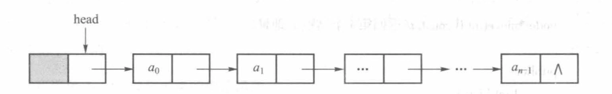


-  时间复杂度
    - visit: $O(N)$
    - insert: $O(1)$

```cpp
#include "2-1-list.h"

template <class elemType>
class sLinkList: public list<elemType>
{
    private:
        struct node
        {
            elemType data;
            node *next;
            node(const elemType &x, node *n = NULL)
            {
                data = x;
                next = n;
            }
            node():next(NULL) {}
            ~node() {}
        };
        node *head;
        int currentLength;
        node *move(int i) const;

    public:
        sLinkList() {};
        ~sLinkList() {clear(); delete head;}
        void clear();
        int length() const {return currentLength;}
        void insert(int i, const elemType &x);
        void remove(int i);
        int search(const elemType &x) const;
        elemType visit(int i) const;
        void traverse() const;
        /*bool isEmpty() const;*/
};

template <class elemType>
typename sLinkList<elemType>::node *sLinkList<elemType>::move(int i) const
{
    node *p = head;
    while (i-- >= 0) p = p->next;
    return p;
}

template <class elemType>
sLinkList<elemType>::sLinkList()
{
    head = new node;
    currentLength = 0;
}

template <class elemType>
void sLinkList<elemType>::clear()
{
    node *p = head->next, *q;
    head->next = NULL;
    while (p != NULL)
    {
        q = p->next;
        delete p;
        p = q;
    }
    currentLength = 0;
}

template <class elemType>
void sLinkList<elemType>::insert(int i, const elemType &x)
{
    node *pos;
    pos = move(i-1);
    pos->next = new node(x, pos->next);
    ++currentLength;
}

template <class elemType>
void sLinkList<elemType>::remove(int i)
{
    node *pos, *delp;
    pos = move(i-1);
    delp = pos->next;
    pos->next = delp->next;
    delete delp;
    --currentLength;
}

template <class elemType>
int sLinkList<elemType>::search(const elemType &x) const
{
    node *p = head->next;
    int i = 0;
    while (p != NULL && p->data != x)
    {
        p = p->next;
        ++i;
    }
    if (p == NULL) return -1;
    else return i;
}

template <class elemType>
elemType sLinkList<elemType>::visit(int i) const
{
    return move(i)->data;
}

template <class elemType>
void sLinkList<elemType>::traverse() const
{
    node *p = head->next;
    cout << endl;
    while (p != NULL)
    {
        cout << p->data << ' ';
        p = p->next;
    }
}
```

### 双链表

 
```cpp
#include "2-1-list.h"

template <class elemType>
class dLinkList: public list<elemType>
{
    private:
        struct node
        {
            elemType data;
            node *prev, *next;
            node(const elemType &x, node *p = NULL, node *n = NULL)
            {
                data = x;
                prev = p;
                next = n;
            }
            node():prev(NULL), next(NULL) {}
            ~node() {}
        };
        node *head, *tail;
        int currentLength;
        node *move(int i) const;

    public:
        dLinkList() {};
        ~dLinkList() {clear(); delete head; delete tail;}
        void clear();
        int length() const {return currentLength;}
        void insert(int i, const elemType &x);
        void remove(int i);
        int search(const elemType &x) const;
        elemType visit(int i) const;
        void traverse() const;
        /*bool isEmpty() const;*/
};

template <class elemType>
dLinkList<elemType>::dLinkList()
{
    head = new node;
    tail = new node;
    head->next = tail;
    tail->prev = head;
    currentLength = 0;
}

template <class elemType>
typename dLinkList<elemType>::node *dLinkList<elemType>::move(int i) const
{
    node *p = head;
    while (i-- >= 0) p = p->next;
    return p;
}

template <class elemType>
void dLinkList<elemType>::insert(int i, const elemType &x)
{
    node *pos, *newNode;
    pos = move(i - 1);
    newNode = new node(x, pos, pos->next);
    pos->next->prev = newNode;
    pos->next = newNode;
    ++currentLength;
}

template <class elemType>
void dLinkList<elemType>::remove(int i)
{
    node *pos;
    pos = move(i);
    pos->prev->next = pos->next;
    pos->next->prev = pos->prev;
    delete pos;
    --currentLength;
}

template <class elemType>
void dLinkList<elemType>::clear()
{
    node *p = head->next, *q;
    head->next = tail;
    tail->prev = head;
    while (p != tail)
    {
        q = p->next;
        delete p;
        p = q;
    }
    currentLength = 0;
}

template <class elemType>
int dLinkList<elemType>::search(const elemType &x) const
{
    node *p = head->next;
    int i = 0;
    while (p != tail && p->data != x)
    {
        p = p->next;
        ++i;
    }
    if (p == tail) return -1;
    else return i;
}

template <class elemType>
elemType dLinkList<elemType>::visit(int i) const
{
    return move(i)->data;
}

template <class elemType>
void dLinkList<elemType>::traverse() const
{
    node *p = head->next;
    while (p != tail)
    {
        cout << p->data << ' ';
        p = p->next;
    }
    cout << endl;
}
```

### 循环链表
#### 循环单链表


#### 循环双链表


## 线性表的应用
- 大整数处理
- 多项式求和
- 约瑟夫环
- 动态内存管理

# 栈
## 栈的定义


- 特点：**先进后出**结构，最先到达栈的结点将最晚被删除
- 相关概念：
    - 栈底(bottom)：结构的首部（先进栈结点的位置）
    - 栈顶(top)：结构的尾部（后进栈结点的位置）
    - 出栈(pop)：结点从栈顶删除
    - 进栈(push)：结点在栈顶位置插入
    - 空栈：栈中结点个数为零
- 栈的抽象类

```cpp
#ifndef STACK_H
#define STACK_H
#include <iostream>
#include <bits/stdc++.h>
using namespace std;

template <class elemType>
class stack
{
    public:
        virtual bool isEmpty() const = 0;
        virtual void push(const elemType &x) = 0;
        virtual elemType pop() = 0;
        virtual elemType top() const = 0;
        virtual ~stack() {}
};

#endif
```

## 栈的顺序实现
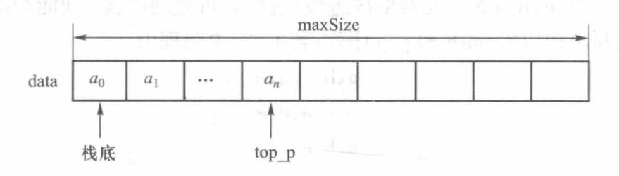

- 时间复杂度: $O(1)$

```cpp
#include "3-1-stack.h"

template <class elemType>
class seqStack : public stack<elemType>
{
private:
    elemType *elem;
    int top_p;
    int maxSize;
    void doubleSpace();

public:
    seqStack(int initSize = 10);
    ~seqStack() { delete[] elem; }
    bool isEmpty() const { return top_p == -1; }
    void push(const elemType &x);
    elemType pop();
    elemType top() const;
};

template <class elemType>
seqStack<elemType>::seqStack(int initSize)
{
    elem = new elemType[initSize];
    maxSize = initSize;
    top_p = -1;
}

template <class elemType>
void seqStack<elemType>::doubleSpace()
{
    elemType *tmp = elem;
    elem = new elemType[2 * maxSize];
    for (int i = 0; i < maxSize; ++i)
    {
        elem[i] = tmp[i];
    }
    maxSize *= 2;
    delete[] tmp;
}

template <class elemType>
void seqStack<elemType>::push(const elemType &x)
{
    if (top_p == maxSize - 1)
    {
        doubleSpace();
    }
    elem[++top_p] = x;
}

template <class elemType>
elemType seqStack<elemType>::pop()
{
    return elem[top_p--];
}

template <class elemType>
elemType seqStack<elemType>::top() const
{
    return elem[top_p];
}
```

## 栈的链接实现
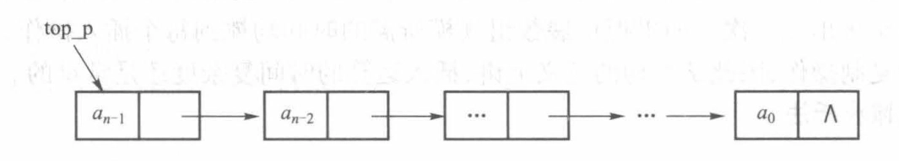

```cpp
#include "3-1-stack.h"

template <class elemType>
class linkStack : public stack<elemType>
{
private:
    struct node
    {
        elemType data;
        node *next;
        node(const elemType &x, node *N = NULL)
        {
            data = x;
            next = N;
        }
        node() : next(NULL) {}
        ~node() {}
    };
    node *top_p;

public:
    linkStack() { top_p = NULL; }
    ~linkStack();
    bool isEmpty() const { return top_p == NULL; }
    void push(const elemType &x);
    elemType pop();
    elemType top() const;
};

template <class elemType>
linkStack<elemType>::~linkStack()
{
    node *tmp;
    while (top_p != NULL)
    {
        tmp = top_p;
        top_p = top_p->next;
        delete tmp;
    }
}

template <class elemType>
void linkStack<elemType>::push(const elemType &x)
{
    top_p = new node(x, top_p);
}

template <class elemType>
elemType linkStack<elemType>::pop()
{
    node *tmp = top_p;
    elemType value = top_p->data;
    top_p = top_p->next;
    delete tmp;
    return value;
}

template <class elemType>
elemType linkStack<elemType>::top() const
{
    return top_p->data;
}
```

## 栈的应用
- 递归消除
- 括号配对
- 表达式的计算（后缀表达式）
    - 对于一个表达式 $a + b$
        - **前缀式**：$+ab$
        - **中缀式**：$a+b$
        - **后缀式**：$ab+$

# 队列
## 队列的定义
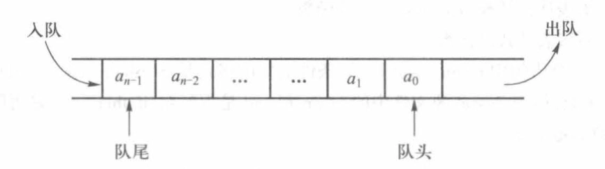

- 特点：**先进先出**结构，最先到达队列的结点将最早被删除
- 相关概念：
    - 队列头(front)：结构的首部（先进队列结点的位置）
    - 队列尾(rear)：结构的尾部（后进队列结点的位置）
    - 出队列(dequeue)：结点从队列头删除
    - 入队列(enqueue)：结点在队列尾位置插入
    - 空队列：队列中结点个数为零
- 队列的抽象类

```cpp
#ifndef QUEUE_H
#define QUEUE_H
#include <iostream>
#include <bits/stdc++.h>
using namespace std;

template <class elemType>
class queue
{
public:
    virtual ~queue() {}
    virtual bool isEmpty() const = 0;
    virtual void enQueue(const elemType &x) = 0;
    virtual elemType deQueue() = 0;
    virtual elemType getHead() const = 0;
};

#endif
```

## 队列的顺序实现
- **队列头位置固定的顺序实现**
    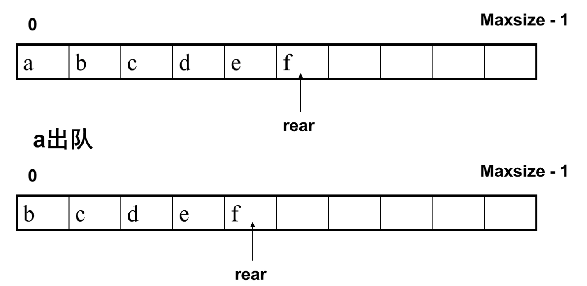
- **队列头位置不固定的顺序实现**
    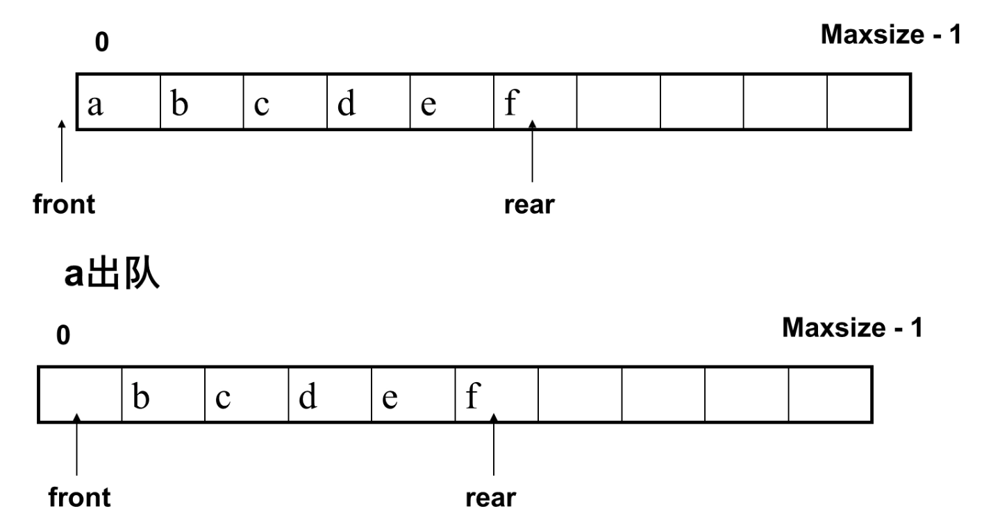
- **循环队列**
    

### 循环队列的顺序实现
```cpp
#include "4-1-queue.h"

template <class elemType>
class seqQueue: public queue<elemType>
{
    private:
        elemType *elem;
        int maxSize;
        int front, rear;
        void doubleSpace();
    public:
        seqQueue(int size = 10);
        ~seqQueue() {delete [] elem;}
        bool isEmpty() const {return front == rear;}
        void enQueue(const elemType &x);
        elemType deQueue();
        elemType getHead() const {return elem[(front+1)%maxSize];}
};

template <class elemType>
seqQueue<elemType>::seqQueue(int size)
{
    elem = new elemType[size];
    maxSize = size;
    front = rear = 0;
}

template <class elemType>
void seqQueue<elemType>::doubleSpace()
{
    elemType *tmp = elem;
    elem = new elemType[2*maxSize];
    for (int i = 1; i < maxSize; ++i)
    {
        elem[i] = tmp[(front+i)%maxSize];
    }
    front = 0;
    rear = maxSize;
    maxSize *= 2;
    delete [] tmp;
}

template <class elemType>
void seqQueue<elemType>::enQueue(const elemType &x)
{
    if ((rear+1)%maxSize == front) doubleSpace();
    rear = (rear+1)%maxSize;
    elem[rear] = x;
}

template <class elemType>
elemType seqQueue<elemType>::deQueue()
{
    front = (front+1)%maxSize;
    return elem[front];
}
```

## 队列的链接实现
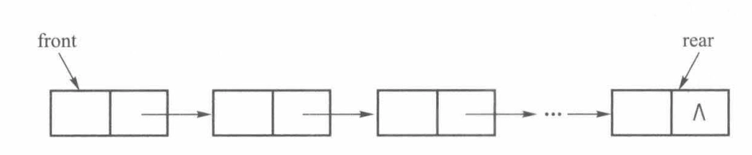

```cpp
#include "4-1-queue.h"

template <class elemType>
class linkQueue: public queue<elemType>
{
    private:
        struct node
        {
            elemType data;
            node *next;
            node(const elemType &x, node *N = NULL)
            {
                data = x;
                next = N;
            }
            node():next(NULL) {}
            ~node() {}
        };
        node *front, *rear;
    public:
        linkQueue() {front = rear = NULL;}
        ~linkQueue();
        bool isEmpty() const {return front == NULL;}
        void enQueue(const elemType &x);
        elemType deQueue();
        elemType getHead() const {return front->data;}
};

template <class elemType>
linkQueue<elemType>::~linkQueue()
{
    node *tmp;
    while (front != NULL)
    {
        tmp = front;
        front = front->next;
        delete tmp;
    }
}

template <class elemType>
void linkQueue<elemType>::enQueue(const elemType &x)
{
    if (rear == NULL)
    {
        front = rear = new node(x);
    }
    else
    {
        rear->next = new node(x);
        rear = rear->next;
    }
}

template <class elemType>
elemType linkQueue<elemType>::deQueue()
{
    node *tmp = front;
    elemType value = front->data;
    front = front->next;
    if (front == NULL) rear = NULL;
    delete tmp;
    return value;
}
```

## 队列的应用
- 火车车厢重排问题
- 排队系统的模拟

# 树
## 树的定义
- 相关概念
    - **结点**
        - 根结点：起始结点，没有父结点
        - 叶结点：没有子结点（度为0）
        - 子结点：结点的下一层结点
        - 父结点：结点的上一层结点
        - 兄弟结点：同一父结点的结点
        - 祖先结点：从根到该结点路径上的所有结点
        - 子孙结点：某个结点的所有下层结点
    - **度**：直接子结点的数量
        - 树的度：由度最大的结点决定
    - **层次/深度**：结点在树的层数
        - 根结点在第1层
        - **高度**：树的结点中的最大层次
    - **有序树与无序树**
        - 有序树：子树从左到右有顺序，即区分左右子树
        - 无序树：不区分左右子树
    - **森林**：若干互不相交的树的集合
- 树的抽象类

```cpp
#ifndef TREE_H
#define TREE_H
#include <bits/stdc++.h>
using namespace std;

template <class elemType>
class tree
{
public:
    virtual ~tree() {}
    virtual void clear() = 0;
    virtual bool isEmpty() const = 0;
    virtual elemType Root(elemType flag) const = 0;
    virtual elemType parent(elemType x, elemType flag) const = 0;
    virtual elemType child(elemType x, int i, elemType flag) const = 0;
    virtual void remove(elemType x, int i) = 0;
    virtual void traverse() const = 0;
};

#endif
```

## 二叉树
### 二叉树的定义


- 有序树，必须严格区分左右子树
- 任意结点的子结点数不超2
- **满二叉树/完美树**：任意一层的结点个数都达到最大值
    - 高度为 $k$ 并具有 $2k-1$ 个结点的二叉树
- **完全二叉树**：满二叉树最底层从右向左依次移除若干结点
    - 满二叉树一定是完全二叉树
    - 完全二叉树不一定是满二叉树


### 二叉树的常用性质
1. 非空二叉树的第 $i$ 层上最多有 $2i-1$ 个结点（$i≥1$）
2. 高度为 $k$ 的二叉树，最多具有 $2^k-1$ 个结点（对满二叉树进行 $2$ 的等比数列求和）
3. 如果叶子结点数为 $n_0$，度数为 $2$ 的结点数为 $n_2$，则有：$n_0=n_2+1$
4. 具有 $n$ 个结点的完全二叉树的高度 $k = \lfloor \log_2 n \rfloor + 1$
5. 对一棵有 $n$ 个结点的完全二叉树按层自上而下编号，每一层自左至右依次编号，若树的根结点编号为 $1$，则对一个编号为 $i$ 的结点
    1. 若 $i=1$，则该结点是根结点，否则父结点编号为 $\lfloor i/2 \rfloor$
    2. 若 $2i > n$，则该结点是叶结点，否则左儿子编号为 $2i$
    3. 若 $2i+1 > n$，则该结点是叶结点，否则右儿子编号为 $2i+1$

### 二叉树的基本运算
- 遍历
    - 前序遍历/先根遍历
        - 顺序：根-左-右
    - 中序遍历/中根遍历
        - 顺序：左-根-右
    - 后序遍历/后根遍历
        - 顺序：左-右-根
    - 层次遍历
        - 顺序：从根到叶，从左到右
- 由二叉树的前序遍历和中序遍历/后序遍历和中序遍历可以唯一确定一棵二叉树
    - 前序遍历和中序遍历
        - 前序遍历的第一个结点为根结点
        - 在中序遍历中找到根结点，将中序遍历分为左子树和右子树
        - 对左子树和右子树递归进行前序遍历和中序遍历
    - 后序遍历和中序遍历
        - 后序遍历的最后一个结点为根结点
        - 在中序遍历中找到根结点，将中序遍历分为左子树和右子树
        - 对左子树和右子树递归进行后序遍历和中序遍历
- 二叉树的抽象类

```cpp
#ifndef BTREE_H
#define BTREE_H
#include <bits/stdc++.h>
using namespace std;

template <class elemType>
class bTree
{
public:
    virtual ~bTree() {}
    virtual void clear() = 0;
    virtual bool isEmpty() const = 0;
    virtual elemType Root(elemType flag) const = 0;
    virtual elemType parent(elemType x, elemType flag) const = 0;
    virtual elemType lchild(elemType x, elemType flag) const = 0;
    virtual elemType rchild(elemType x, elemType flag) const = 0;
    virtual void delLeft(elemType x) = 0;
    virtual void delRight(elemType x) = 0;
    virtual void preOrder() const = 0;
    virtual void midOrder() const = 0;
    virtual void postOrder() const = 0;
    virtual void levelOrder() const = 0;
};

#endif
```

### 二叉树的顺序实现
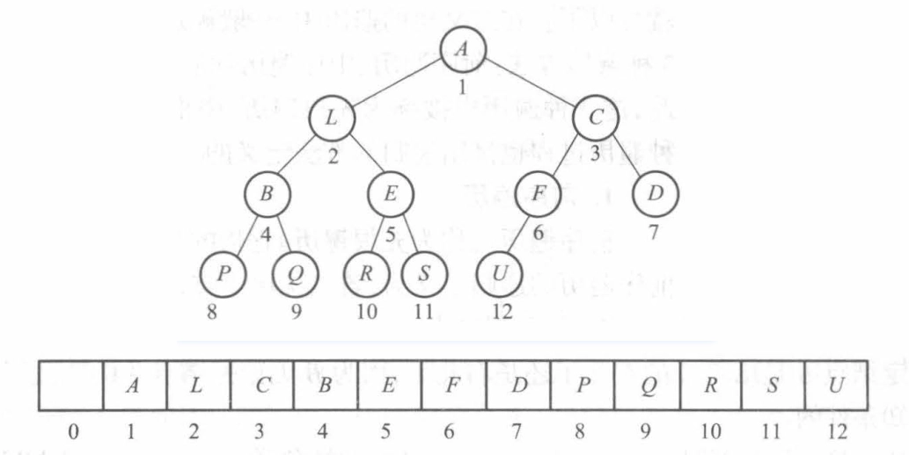

- 使用数组存储
    - 根结点下标为 $1$
    - 若某个结点下标为 $i$
        - 左子树下标为 $2i$
        - 右子树下标为 $2i+1$

### 二叉树的链接实现
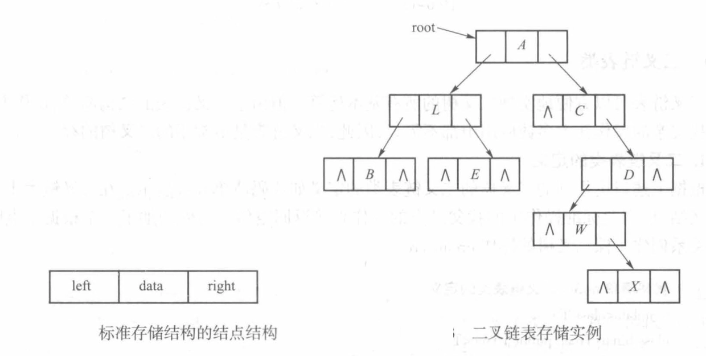
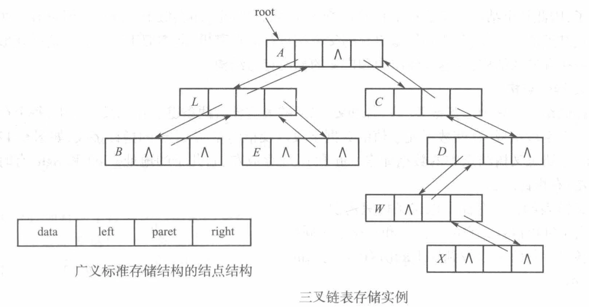

```cpp
#include "6-2-bTree.h"

template <class T>
class binaryTree : public bTree<T>
{
    friend void printTree(const binaryTree<T> &t, T flag);
    private:
        struct Node
        {
            T data;
            Node *left, *right;
            Node():left(NULL), right(NULL) {}
            Node(T item, Node *L = NULL, Node *R = NULL):data(item), left(L), right(R) {}
            ~Node() {}
        };
        Node *root;

    public:
        binaryTree():root(NULL) {}
        binaryTree(const T &value) {root = new Node(value);}
        ~binaryTree() {clear();}

        void clear();
        bool isEmpty() const {return root == NULL;}
        T Root(T flag) const;
        T lchild(T x, T flag) const;
        T rchild(T x, T flag) const;
        void delLeft(T x);
        void delRight(T x);
        void preOrder() const;
        void midOrder() const;
        void postOrder() const;
        void levelOrder() const;
        void createTree(T flag);
        T parent(T x, T flag) const {return flag;}
        int height() const {return height(root);}
        int size() const {return size(root);}

    private:
        Node* find(T x, Node *t) const;
        void clear(Node *&t);
        void preOrder(Node *t) const;
        void midOrder(Node *t) const;
        void postOrder(Node *t) const;
        int height(Node *t) const;
        int size(Node *t) const;
};


template <class T>
void binaryTree<T>::clear()
{
    if (root != NULL)
        clear(root);
    root = NULL;
}

template <class T>
void binaryTree<T>::clear(Node *&t)
{
    if (t == NULL) return;
    clear(t->left);
    clear(t->right);
    delete t;
    t = NULL;
}

template <class T>
T binaryTree<T>::Root(T flag) const
{
    if (root == NULL) return flag;
    else return root->data;
}

template <class T>
binaryTree<T>::Node* binaryTree<T>::find(T x, binaryTree<T>::Node *t) const
{
    Node *tmp;
    if (t == NULL) return NULL;
    if (t->data == x) return t;
    if ((tmp = find(x, t->left)) != NULL) return tmp;
    else return find(x, t->right);
}

template <class T>
T binaryTree<T>::lchild(T x, T flag) const
{
    Node *tmp = find(x, root);
    if (tmp == NULL || tmp->left == NULL) return flag;
    return tmp->left->data;
}

template <class T>
T binaryTree<T>::rchild(T x, T flag) const
{
    Node *tmp = find(x, root);
    if (tmp == NULL || tmp->right == NULL) return flag;
    return tmp->right->data;
}

template <class T>
void binaryTree<T>::delLeft(T x)
{
    Node *tmp = find(x, root);
    if (tmp == NULL || tmp->left == NULL) return;
    clear(tmp->left);
}

template <class T>
void binaryTree<T>::delRight(T x)
{
    Node *tmp = find(x, root);
    if (tmp == NULL || tmp->right == NULL) return;
    clear(tmp->right);
}

template <class T>
void binaryTree<T>::createTree(T flag)
{
    queue<Node*> q;
    Node *tmp;
    T x, ldata, rdata;
    cout << "\n Input root node: ";
    cin >> x;
    root = new Node(x);
    q.push(root);
    while (!q.empty())
    {
        tmp = q.front();
        q.pop();
        cout << "Input " << tmp->data << "'s two children(" << flag << " as NULL): ";
        cin >> ldata >> rdata;
        if (ldata != flag) q.push(tmp->left = new Node(ldata));
        if (rdata != flag) q.push(tmp->right = new Node(rdata));
    }

    cout << "Create completed!" << endl;
}

template <class T>
void printTree(const binaryTree<T> &t, T flag)
{
    queue <T> q;
    q.push(t.Root(flag));    
    cout << endl;
    while (!q.empty())
    {
        T tmp = q.front();
        q.pop();
        if (tmp == flag) continue;
        cout << tmp << ' ' <<t.lchild(tmp, flag) << ' ' << t.rchild(tmp, flag) << endl;
        if (t.lchild(tmp, flag) != flag) q.push(t.lchild(tmp, flag));
        if (t.rchild(tmp, flag) != flag) q.push(t.rchild(tmp, flag));
    }
}

template <class T>
int binaryTree<T>::height(Node *t) const
{
    if (t == NULL) return 0;
    int lt = height(t->left), rt = height(t->right);
    return 1 + ((lt > rt) ? lt : rt);
}

template <class T>
int binaryTree<T>::size(Node *t) const
{
    if (t == NULL) return 0;
    return 1 + size(t->left) + size(t->right);
}


template <class T>
void binaryTree<T>::preOrder() const
{
    if (root != NULL) preOrder(root);
}
// 递归实现
template <class T>
void binaryTree<T>::preOrder(Node *t) const
{
    if (t == NULL) return;
    cout << t->data << ' ';
    preOrder(t->left);
    preOrder(t->right);
}
// 非递归实现
template <class T>
void BinaryTree<T>::preOrder () const
{
    Stack<Node*> s;
    Node *current;
    s.push(root);
    while (!s.isEmpty())
    {
        current = s.pop();
        cout << current->data << ' ';
        if (current->right != NULL) s.push(current->right);
        if (current->left != NULL) s.push(current->left);
    }
}

template <class T>
void binaryTree<T>::midOrder() const
{
    if (root != NULL) midOrder(root);
}
// 递归实现
template <class T>
void binaryTree<T>::midOrder(Node *t) const
{
    if (t == NULL) return;
    midOrder(t->left);
    cout << t->data << ' ';
    midOrder(t->right);
}
// 非递归实现
template <class T>
void BinaryTree<T>::midOrder () const
{
    struct StNode
    {
        Node *node;
        int TimesPop;
        StNode(Node *N = NULL):node(N), TimesPop(0) {}
    };
    Stack<StNode> s;
    StNode current(root);
    s.push(current);
    while (!s.isEmpty())
    {
        current = s.pop();
        if (++current.TimesPop == 2)
        {
            cout << current.node->data << ' ';
            if (current.node->right != NULL)
                s.push(StNode(current.node->right));
        }
        else
        {
            s.push(current);
            if (current.node->left != NULL)
                s.push(StNode(current.node->left));
        }
    }
}

template <class T>
void binaryTree<T>::postOrder() const
{
    if (root != NULL) postOrder(root);
}
// 递归实现
template <class T>
void binaryTree<T>::postOrder(Node *t) const
{
    if (t == NULL) return;
    postOrder(t->left);
    postOrder(t->right);
    cout << t->data << ' ';
}
// 非递归实现
template <class T>
void BinaryTree<T>::postOrder () const
{
    struct StNode
    {
        Node *node;
        int TimesPop;
        StNode(Node *N = NULL):node(N), TimesPop(0) {}
    };
    Stack<StNode> s;
    StNode current(root);
    s.push(current);
    while (!s.isEmpty())
    {
        current = s.pop();
        if (++current.TimesPop == 3)
        {
            cout << current.node->data << ' ';
            continue;
        }
        s.push(current);
        if (current.TimesPop == 1)
        {
            if (current.node->left != NULL)
                s.push(StNode(current.node->left));
        }
        else
        {
            if (current.node->right != NULL)
                s.push(StNode(current.node->right));
        }
    }
}

template <class T>
void binaryTree<T>::levelOrder() const
{
    queue<Node*> q;
    Node *tmp;
    if (root != NULL) q.push(root);
    while (!q.empty())
    {
        tmp = q.front();
        q.pop();
        cout << tmp->data << ' ';
        if (tmp->left != NULL) q.push(tmp->left);
        if (tmp->right != NULL) q.push(tmp->right);
    }
}
```

### 二叉树的应用
- 计算表达式


## 哈夫曼树和哈夫曼编码
### 前缀编码
- 无二义性
- 每个字符的编码与其它字符编码的前缀不同

### 哈夫曼编码
- 目的：根据数据的出现频率进行不同长度的编码，从而节省空间。
- 哈夫曼树：哈夫曼树是一棵最小代价的二叉树，在这棵树上，所有的字符都包含在叶结点上。要使得整棵树的代价最小，显然权值大的叶子应当尽量靠近树根，权值小的叶子可以适当离树根远一些。
- 构建方法：从当前集合中选取并去除权值最小、次最小的两个结点，以这两个结点作为内部结点 $b_i$ 的左右儿子，$b_i$ 的权值为其左右儿子权值之和并加入其中。这样，在集合A中，结点个数便减少了一个。这样，在经过了 $n-1$ 次循环之后，集合A中只剩下了一个结点，这个结点就是根结点。


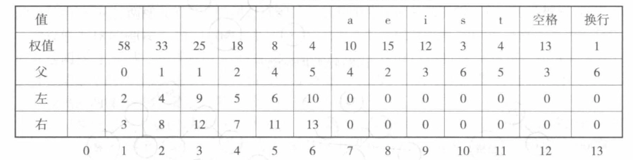

### 哈夫曼树类的实现
- 二叉树的广义标准存储
    - 每个结点包含以下字段
        - 数据
            - 数据
            - 权值
        - **父结点指针**
        - 左、右子结点指针

```cpp
#include <bits/stdc++.h>
using namespace std;

template <class T>
class hfTree
{
    private:
        struct Node
        {
            T data;
            int weight;
            int parent, left, right;
        };
        Node *elem;
        int length;

    public:
        struct hfCode
        {
            T data;
            string code;
        };
        hfTree(const T *v, const int *w, int size);
        void getCode(hfCode result[]);
        ~hfTree() {delete [] elem; }
};

template <class T>
hfTree<T>::hfTree(const T *v, const int *w, int size)
{
    const int MAX_INT = 32767;
    int min1, min2;
    int x, y;
    
    length = 2 * size;
    elem = new Node[length];

    for (int i = size; i < length; i++)
    {
        elem[i].weight = w[i - size];
        elem[i].data = v[i - size];
        elem[i].parent = elem[i].left = elem[i].right = 0;
    }

    for (int i = size - 1; i > 0; i--)
    {
        min1 = min2 = MAX_INT;
        x = y = 0;

        for (int j = i + 1; j < length; j++)
        {
            if (elem[j].parent == 0)
            {
                if (elem[j].weight < min1)
                {
                    min2 = min1;
                    min1 = elem[j].weight;
                    y = x;
                    x = j;
                }
                else if (elem[j].weight < min2)
                {
                    min2 = elem[j].weight;
                    y = j;
                }
            }
        }

        elem[i].weight = min1 + min2;
        elem[i].left = x;
        elem[i].right = y;
        elem[i].parent = 0;
        elem[x].parent = elem[y].parent = i;
    }
}

template <class T>
void hfTree<T>::getCode(hfCode result[])
{
    int size = length / 2;
    int p, s;
    string str = "";
    for (int i = size; i < length; i++)
    {
        result[i - size].data = elem[i].data;
        result[i - size].code = "";
        p = elem[i].parent;
        s = i;
        while (p)
        {
            if (elem[p].left == s) str += '0';
            else str += '1';
            s = p;
            p = elem[p].parent;
        }
        for (int j = str.size() - 1; j >= 0; j--)  result[i - size].code += str[j];
        str = "";
    }
}

int main()
{
    char ch[] = {"aeistdn"};
    int w[] = {10, 15, 12, 3, 4, 13, 1};
    hfTree<char> tree(ch, w, 7);
    hfTree<char>::hfCode result[7];
    tree.getCode(result);
    for (int i = 0; i < 7; i++)
    {
        cout << result[i].data << ' ' << result[i].code << endl;
    }
    return 0;
}
```

## 树和森林
### 树的存储实现
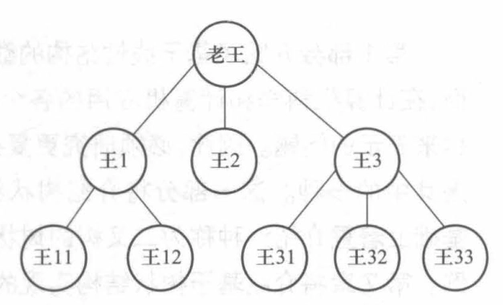

- **孩子链表示法**
    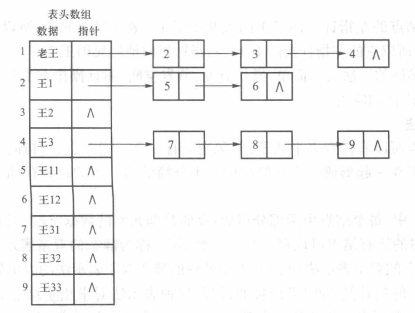

- **孩子兄弟链表示法**
    - 把树表示成一棵二叉树
        - 左指针：第一个子结点
        - 右指针：兄弟结点
    - 前序遍历与二叉树相同
    - 后序遍历与二叉树的中序遍历相同

    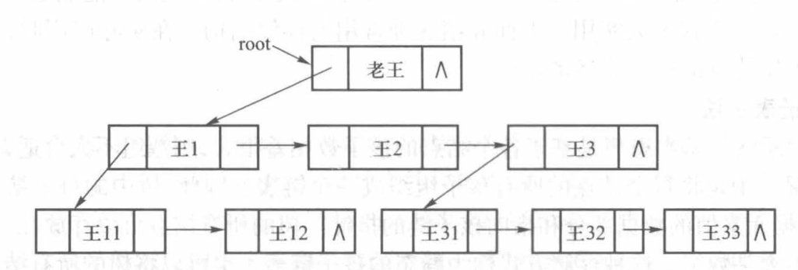

- **双亲表示法**
    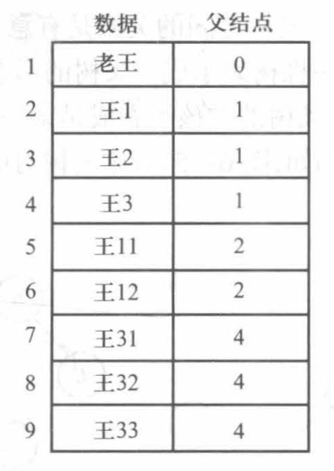

### 树的遍历
- 前序遍历
- 后序遍历
- 层次遍历

### 树、森林与二叉树的转换
- **森林**：树的集合
    - 存储方式：把森林存储为一棵二叉树
- **把森林转换为二叉树的步骤**：
    1. 把森林 $F={T_1, T_2, \ldots, T_k}$ 中的树 $T_i$ 用孩子兄弟链法表示为一棵二叉树 $B_i$
    2. 把二叉树 $B_i$ 作为二叉树 $B_{i-1}$ 的根结点的右子树

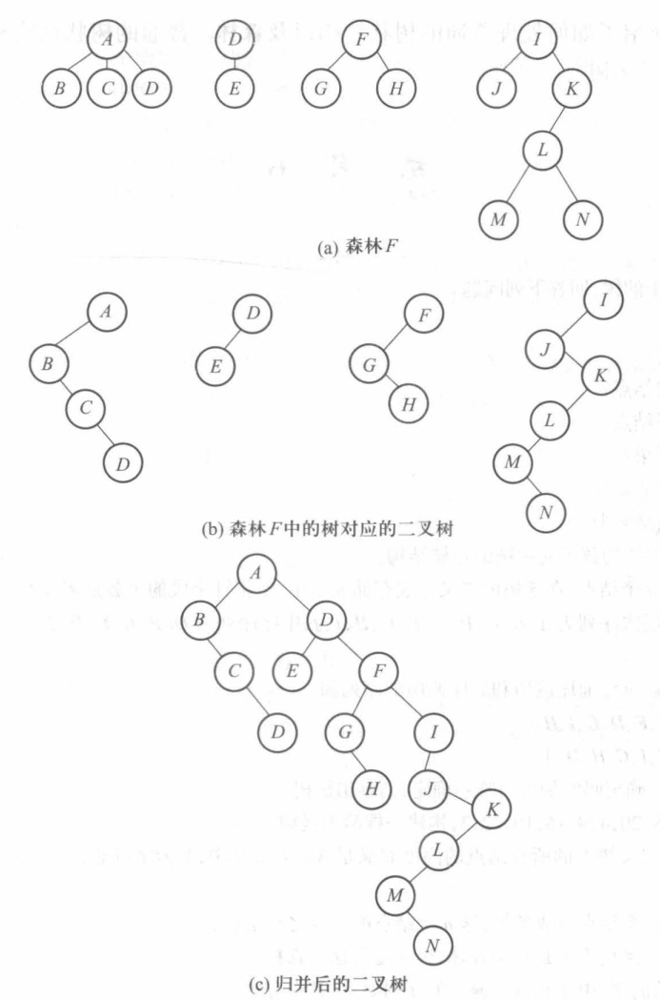

# 优先级队列
优先级队列是一种特殊的队列，其中每个元素都有一个优先级。优先级最高的元素是队头元素，优先级最低的元素是队尾元素。

## 基于线性表的优先级的队列
- 时间复杂度 $O(N)$

## 基于树的优先级队列
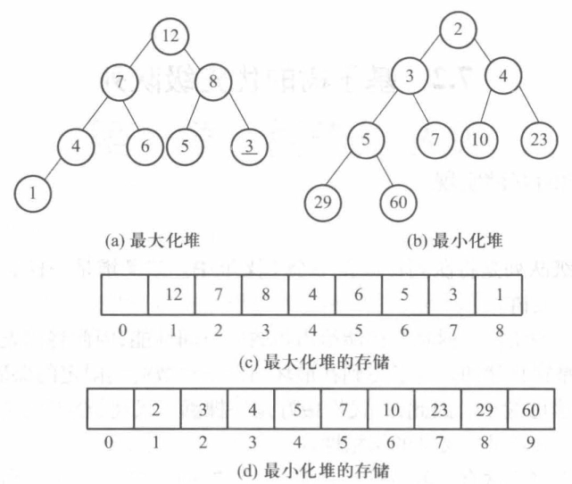

- 又称**二叉堆**
- 时间复杂度：$O(\log N)$
- 分为：
    - 最大堆：根结点是最大元素
    - 最小堆：根结点是最小元素
- 实现：
    - 插入：新结点会先插入到完全二叉树最后一个结点，然后**向上过滤**（percolate up）
    - 出队：移出根结点后，最后一个结点会填补根结点的位置，然后**向下过滤**（percolate down）

    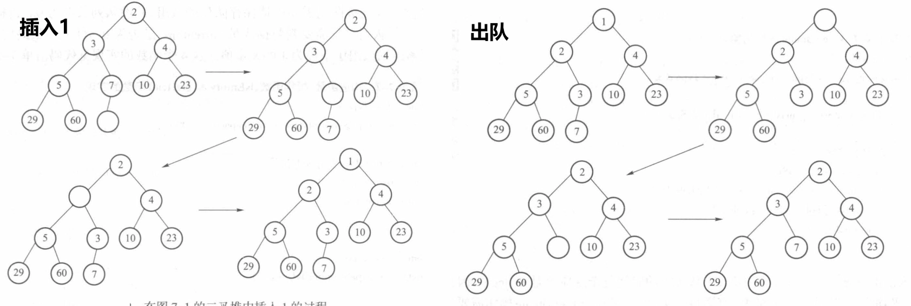

```cpp
#include <bits/stdc++.h>
using namespace std;

template <class T>
class PriorityQueue {
public:
    PriorityQueue();
    PriorityQueue(int capacity);
    PriorityQueue(const PriorityQueue<T>& pq);
    PriorityQueue(int capacity, T* x, int size);
    ~PriorityQueue();
    bool isEmpty();
    bool isFull();
    void print(int x = 1);
    void enQueue(T item);
    T deQueue();
    T getHead();
private:
    int currentSize;
    int capacity;
    T* items;
    void doubleCapacity();
    void percolateDown(int hole);
    void buildHeap();
};

template <class T>
PriorityQueue<T>::PriorityQueue() {
    capacity = 100;
    items = new T[capacity+1];
    currentSize = 0;
}

template <class T>
PriorityQueue<T>::PriorityQueue(int capacity) {
    capacity = capacity;
    items = new T[capacity+1];
    currentSize = 0;
}

template <class T>
PriorityQueue<T>::PriorityQueue(const PriorityQueue<T>& pq) {
    capacity = pq.capacity;
    items = new T[capacity+1];
    currentSize = pq.currentSize;
    for (int i = 0; i < currentSize; i++) {
        items[i] = pq.items[i];
    }
}

template <class T>
PriorityQueue<T>::PriorityQueue(int capacity, T* x, int size) {
    capacity = capacity;
    items = new T[capacity+1];
    currentSize = size;
    for (int i = 0; i < currentSize; i++) {
        items[i+1] = x[i];
    }
    buildHeap();
}

template <class T>
PriorityQueue<T>::~PriorityQueue() {
    delete[] items;
}

template <class T>
bool PriorityQueue<T>::isEmpty() {
    return currentSize == 0;
}

template <class T>
bool PriorityQueue<T>::isFull() {
    return currentSize == capacity;
}

template <class T>
void PriorityQueue<T>::print(int x) {
    for (int i = x; i <= currentSize; i++) {
        cout << items[i] << " ";
    }
    cout << endl;
}

template <class T>
void PriorityQueue<T>::enQueue(T item) {
    if (isFull()) {
        doubleCapacity();
    }
    int hole = ++currentSize;
    for (; hole > 1 && item < items[hole / 2]; hole /= 2) {
        items[hole] = items[hole / 2];
    }
    items[hole] = item;
}

template <class T>
T PriorityQueue<T>::deQueue() {
    T minItem = items[1];
    items[1] = items[currentSize--];
    percolateDown(1);
    return minItem;
}

template <class T>
T PriorityQueue<T>::getHead() {
    return items[1];
}

template <class T>
void PriorityQueue<T>::doubleCapacity() {
    T* oldItems = items;
    capacity *= 2;
    items = new T[capacity+1];
    for (int i = 0; i <= currentSize; i++) {
        items[i] = oldItems[i];
    }
    delete[] oldItems;
}

template <class T>
void PriorityQueue<T>::percolateDown(int hole) {
    int child;
    T tmp = items[hole];
    for (; hole * 2 <= currentSize; hole = child) {
        child = hole * 2;
        if (child != currentSize && items[child + 1] < items[child]) {
            child++;
        }
        if (items[child] < tmp) {
            items[hole] = items[child];
        } 
        else break;
    }
    items[hole] = tmp;
}

template <class T>
void PriorityQueue<T>::buildHeap() {
    for (int i = currentSize / 2; i > 0; i--) {
        percolateDown(i);
    }
}
```

## 优先级队列的应用
- 排队系统的模拟

# 集合和静态查找表
## 集合的定义
- 集合中的数据元素除了属于同一集合之外，没有任何逻辑关系。
- 在集合中，每个数据元素有一个区别于其他元素的**唯一标识**，通常称为**键值或关键字值**。

```cpp
#ifndef SET_H
#define SET_H

#include <bits/stdc++.h>
using namespace std;

template <class KEY, class OTHER>
struct SET {
    KEY key;
    OTHER other;
    SET(const KEY &k, const OTHER &o) : key(k), other(o) {}
    SET() {}
    bool operator != (const SET<KEY, OTHER> &x) const {
        return key != x.key;
    }
    bool operator == (const SET<KEY, OTHER> &x) const {
        return key == x.key;
    }
    ostream &operator << (ostream &os) const {
        os << key;
        return os;
    }
};

#endif
```

## 查找的基本概念
- 用于查找的集合称之为查找表
- 查找表分类：
    - 静态查找表：数据元素固定
    - 动态查找表
- 根据查找的数据元素存放位置：
    - 内部查找
    - 外部查找：记录

## 静态查找表
### 无序表的查找
- 查找表中的元素无序
- 顺序查找
    - 时间复杂度：$O(N)$

### 有序表的查找
- **顺序查找**：$O(N)$
- **二分查找**：$O(\log N)$
- **插值查找**：
    - 根据下面的公式估算位置
    $$ next = low + [\frac{(x - A[low])}{A[high] - A[low]} \times (high - low - 1)] $$
- **分块查找/顺序索引查找**
    - 分块：块间必须是有序的
    - 索引表：对查找表分块后建立，每个索引项包含一个块内的最大元素值和该索引块的起始地址
    - 先查找索引表，确定在哪一块，再在块中查找元素

```cpp
#include "8-1-set.h"
#include <bits/stdc++.h>
using namespace std;

template <class KEY, class OTHER>
int seqSearch(SET<KEY, OTHER>* data, int size, const KEY& x) {
    data[0].key = x;
    for (int i = size; data[i].key != x; i--);
    return i;
}

template <class KEY, class OTHER>
int binSearch(SET<KEY, OTHER>* data, int size, const KEY& x) {
    int left = 1, right = size, mid;
    while (left <= right) {
        mid = (left + right) / 2;
        if (data[mid].key == x) {
            return mid;
        }
        if (data[mid].key < x) {
            left = mid + 1;
        } else {
            right = mid - 1;
        }
    }
    return 0;
}
```

# 动态查找表
## 动态查找表的定义
- 支持增、删、查、改等操作
- 存储结构：
    - 查找树
    - 散列表
- 动态查找表的抽象类

```cpp
#ifndef DYNAMICSEARCHTABLE_H
#define DYNAMICSEARCHTABLE_H
#include <bits/stdc++.h>
#include "8-1-set.h"
using namespace std;

template <class KEY, class OTHER>
class dynamicSearchTable {
public:
    virtual SET<KEY, OTHER>* find(const KEY& x) const = 0;
    virtual void insert(const SET<KEY, OTHER>& x) = 0;
    virtual void remove(const KEY& x) = 0;
    virtual ~dynamicSearchTable() {};
};

#endif
```

## 二叉查找树
### 二叉查找树的定义
- **定义**：二叉查找树又称二叉排序树，非空情况下满足下列条件
    - 若左子树非空，则左子树上的所有非空结点的关键字值均小于根结点的关键字值
    - 若右子树非空，则右子树上的所有非空结点的关键字值均大于根结点的关键字值
    - 左右子树也是二叉查找树
- **性质**：
    - 中序遍历一棵二叉查找树的道德访问序列**按键值递增**

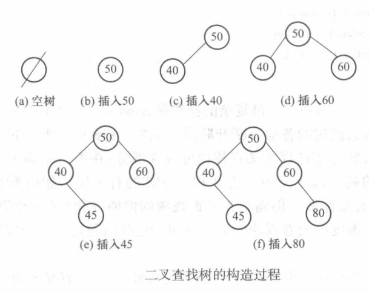

### 二叉查找树的实现
- 通常采用二叉树的标准存储法
    - 每个结点包含以下字段
        - 数据：键值-数据对
        - 左、右子结点指针
- **运算实现**：
    - 查找：
        1. 若根结点不存在，则不存在
        2. 若根结点关键字值等于查找值，则找到
        3. 若根结点关键字值大于查找值，则递归查找左子树
        4. 若根结点关键字值小于查找值，则递归查找右子树
    - 插入：
        1. 若根结点不存在，则插入为根结点
        2. 若根结点关键字值大于插入值，则在左子树上递归插入
        3. 若根结点关键字值小于插入值，则在右子树上递归插入
    - 删除：
        1. 若根结点关键字值大于待删值，则在左子树上递归删除
        2. 若根结点关键字值小于待删值，则在右子树上递归删除
        3. 若根结点关键字值等于待删值，则：
            1. 根结点无子结点：直接删
            2. 根结点有一个子结点：作为新的根结点
            3. 根结点有两个子结点：找到左子树的最大结点或右子树最小结点替代
- 时间复杂度：$O(\log N)$

```cpp
#include "9-1-dynamicSearchTable.h"
using namespace std;

template <class KEY, class OTHER>
class binarySearchTree : public dynamicSearchTable<KEY, OTHER> 
{
public:
    binarySearchTree();
    ~binarySearchTree();
    SET<KEY, OTHER>* find(const KEY& x) const;
    void insert(const SET<KEY, OTHER>& x);
    void remove(const KEY& x);
private:
    struct BinaryNode {
        SET<KEY, OTHER> data;
        BinaryNode* left;
        BinaryNode* right;
        BinaryNode(const SET<KEY, OTHER>& thedata, BinaryNode* l=NULL, BinaryNode* r=NULL)
            : data(thedata), left(l), right(r) {}
    };
    BinaryNode* root;
    void insert(const SET<KEY, OTHER>& x, BinaryNode*& t);
    void remove(const KEY& x, BinaryNode*& t);
    SET<KEY, OTHER>* find(const KEY& x, BinaryNode* t) const;
    void makeEmpty(BinaryNode*& t);
};

template <class KEY, class OTHER>
binarySearchTree<KEY, OTHER>::binarySearchTree() 
{
    root = NULL;
}

template <class KEY, class OTHER>
binarySearchTree<KEY, OTHER>::~binarySearchTree() 
{
    makeEmpty(root);
}

template <class KEY, class OTHER>
SET<KEY, OTHER>* binarySearchTree<KEY, OTHER>::find(const KEY& x) const 
{
    return find(x, root);
}

template <class KEY, class OTHER>
SET<KEY, OTHER>* binarySearchTree<KEY, OTHER>::find(const KEY& x, BinaryNode* t) const
{
    if (t == NULL || t->data.key == x) {
        return t;
    }
    if (x < t->data.key) {
        return find(x, t->left);
    } else {
        return find(x, t->right);
    }
}

template <class KEY, class OTHER>
void binarySearchTree<KEY, OTHER>::insert(const SET<KEY, OTHER>& x) 
{
    insert(x, root);
}

template <class KEY, class OTHER>
void binarySearchTree<KEY, OTHER>::insert(const SET<KEY, OTHER>& x, BinaryNode*& t) 
{
    if (t == NULL) {
        t = new BinaryNode(x);
    } else if (x.key < t->data.key) {
        insert(x, t->left);
    } else if (x.key > t->data.key) {
        insert(x, t->right);
    }
}

template <class KEY, class OTHER>
void binarySearchTree<KEY, OTHER>::remove(const KEY& x) 
{
    remove(x, root);
}

template <class KEY, class OTHER>
void binarySearchTree<KEY, OTHER>::remove(const KEY& x, BinaryNode*& t) 
{
    if (t == NULL) {
        return;
    }
    if (x < t->data.key) {
        remove(x, t->left);
    } 
    else if (x > t->data.key) {
        remove(x, t->right);
    }
    else if (t->left != NULL && t->right != NULL) {// Two children
        BinaryNode* tmp = t->right;
        while (tmp->left != NULL) {
            tmp = tmp->left;
        }// Find the smallest node in the right subtree
        t->data = tmp->data;
        remove(t->data.key, t->right);// Remove the smallest node in the right subtree
    }
    else {// One or zero children
        BinaryNode* oldNode = t;
        t = (t->left != NULL) ? t->left : t->right;
        delete oldNode;
    }
}

template <class KEY, class OTHER>
void binarySearchTree<KEY, OTHER>::makeEmpty(BinaryNode*& t) 
{
    if (t != NULL) {
        makeEmpty(t->left);
        makeEmpty(t->right);
        delete t;
    }
    t = NULL;
}

int main()
{
    SET<int, char*> a[] = { {10,"aaa"},{8,"bbb"},{21,"ccc"},{87,"ddd"},{56,"eee"},{4,"fff"},{11,"ggg"},{3,"hhh"},{22,"iii"},{7,"jjj"} };
    binarySearchTree<int, char*> tree;
    SET<int, char*>* p; 
    SET<int, char*> x;
    for (int i = 0; i < 10; i++) {
        tree.insert(a[i]);
    }

    p = tree.find(21);
    if (p) {
        cout << "Find 21: " << p->other << endl;
    } else {
        cout << "21 not found" << endl;
    }
    tree.remove(21);
    p = tree.find(21);
    if (p) {
        cout << "Find 21: " << p->other << endl;
    } else {
        cout << "21 not found" << endl;
    }
    return 0;
}
```

## AVL 树
### AVL 树（二叉平衡树）的定义
- 二叉平衡树是满足某个平衡条件的二叉查找树，其保证树的高度是 $O(\log N)$，从而操作都是 $O(\log N)$
- 最理想是每个节点的左右子树都有同样的高度，不过条件可以放宽一些，因此有了二叉平衡查找树
- **平衡因子（平衡度）**：结点的平衡度是结点的左子树的高度减去右子树的高度
    - 要求每个结点的平衡因子都为 $+1, -1, 0$，即每个结点的左右子树的高度最多差 $1$
    - 一棵由 $N$ 个结点组成的 AVL 树的高度 $H \leq 1.44\log (N+1) - 0.328$

### AVL 树的实现
- 采用二叉链表存储
    - 每个结点包含以下字段
        - 数据
            - 键值-数据对
            - 节点高度
        - 左、右子结点指针
- **运算实现**
    - 查找：与二叉查找树相同
    - **插入**：插入结点后检查到根结点路径上的平衡性，如果没破坏平衡性，可以直接插入，然后自下而上修改结点平衡度（若有结点平衡度没变，上面的就都不用修改）；如果破坏了平衡性，则需要调整树的结构（单旋转or双旋转），再修改平衡度
        - 插入方法：LL和RR、LR和RL是对称的
        - LL/RR：插入在危机结点的左子结点的左子树/右子结点的右子树，进行单旋转
        
        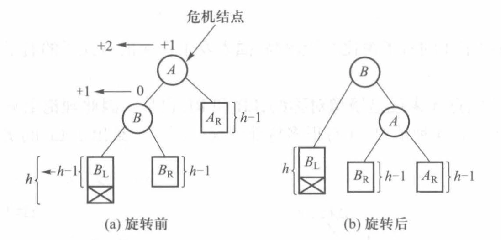

        - LR/RL：插入在危机结点的左子结点的右子树/右子结点的左子树，进行双旋转
            - LR：先对危机结点的左子树执行RR，再对危机结点自身执行LL
            - RL：先对危机结点的右子树执行LL，再对危机结点自身执行RR

        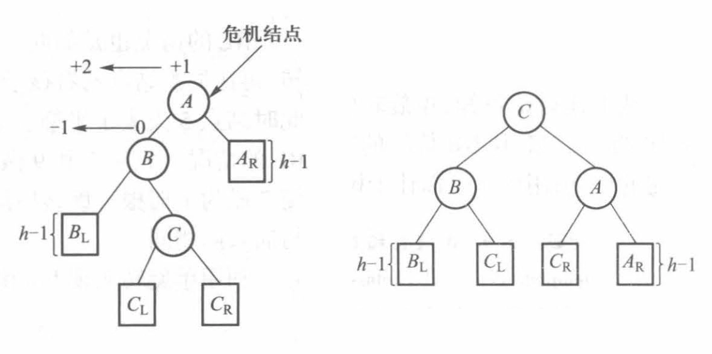
    - **删除**：删除结点后检查到根结点路径上的平衡性，共分五种情况：

        

```cpp
#include "9-1-dynamicSearchTable.h"
#include <bits/stdc++.h>
using namespace std;

template <class KEY, class OTHER>
class AvlTree : public dynamicSearchTable<KEY, OTHER> 
{
public:
    AvlTree();
    ~AvlTree();
    SET<KEY, OTHER>* find(const KEY& x) const;
    void insert(const SET<KEY, OTHER>& x);
    void remove(const KEY& x);

private:
    struct AvlNode {
        SET<KEY, OTHER> data;
        AvlNode* left;
        AvlNode* right;
        int height;
        AvlNode(const SET<KEY, OTHER>& thedata, AvlNode* l=NULL, AvlNode* r=NULL, int h=0)
            : data(thedata), left(l), right(r), height(h) {}
    };
    AvlNode* root;

    void insert(const SET<KEY, OTHER>& x, AvlNode*& t);
    bool remove(const KEY& x, AvlNode*& t);
    void makeEmpty(AvlNode*& t);
    void LL(AvlNode*& t);
    void LR(AvlNode*& t);
    void RL(AvlNode*& t);
    void RR(AvlNode*& t);
    int height(AvlNode* t) const { return t == NULL ? -1 : t->height; }
    int max(int a, int b) { return a > b ? a : b; }
    bool adjust(AvlNode*& t, int subTree);
};

template <class KEY, class OTHER>
AvlTree<KEY, OTHER>::AvlTree() 
{
    root = NULL;
}

template <class KEY, class OTHER>
AvlTree<KEY, OTHER>::~AvlTree() 
{
    makeEmpty(root);
}

template <class KEY, class OTHER>
SET<KEY, OTHER>* AvlTree<KEY, OTHER>::find(const KEY& x) const 
{
    AvlNode* t = root;
    while (t != NULL && t->data.key != x) {
        if (x < t->data.key) {
            t = t->left;
        } else {
            t = t->right;
        }
    }
    return t == NULL ? NULL : (SET<KEY, OTHER>*)t;
}

template <class KEY, class OTHER>
void AvlTree<KEY, OTHER>::insert(const SET<KEY, OTHER>& x) 
{
    insert(x, root);
}

template <class KEY, class OTHER>
void AvlTree<KEY, OTHER>::insert(const SET<KEY, OTHER>& x, AvlNode*& t) 
{
    if (t == NULL) {
        t = new AvlNode(x, NULL, NULL);
    } else if (x.key < t->data.key) {
        insert(x, t->left);
        if (!adjust(t, 1)) {
            if (height(t->left) - height(t->right) == 2) {
                if (x.key < t->left->data.key) {
                    LL(t);
                } else {
                    LR(t);
                }
            }
        }
    } else if (x.key > t->data.key) {
        insert(x, t->right);
        if (!adjust(t, 0)) {
            if (height(t->right) - height(t->left) == 2) {
                if (x.key > t->right->data.key) {
                    RR(t);
                } else {
                    RL(t);
                }
            }
        }
    }
    t->height = max(height(t->left), height(t->right)) + 1;
}

template <class KEY, class OTHER>
void AvlTree<KEY, OTHER>::remove(const KEY& x) 
{
    remove(x, root);
}

template <class KEY, class OTHER>
bool AvlTree<KEY, OTHER>::remove(const KEY& x, AvlNode*& t) 
{
    if (t == NULL) 
    {
        return true;
    }
    if (x == t->data.key)
    {
        if (t->left == NULL || t->right == NULL) 
        {
            AvlNode* oldNode = t;
            t = (t->left != NULL) ? t->left : t->right;
            delete oldNode;
            return false;
        } 
        else 
        {
            AvlNode* tmp = t->right;
            while (tmp->left != NULL) 
            {
                tmp = tmp->left;
            }
            t->data = tmp->data;
            if (remove(tmp->data.key, t->right)) 
            {
                return true;
            }
            else return adjust(t, 1);
        }
    }
    if (x < t->data.key) 
    {
        if (remove(x, t->left)) 
        {
            return true;
        }
        else return adjust(t, 0);
    }
    else 
    {
        if (remove(x, t->right)) 
        {
            return true;
        }
        else return adjust(t, 1);
    }
}

template <class KEY, class OTHER>
bool AvlTree<KEY, OTHER>::adjust(AvlNode*& t, int subTree) 
{
    if (subTree) 
    {
        if (height(t->left) - height(t->right) == 1) 
        {
           return true;
        }
        if (height(t->right) == height(t->left)) 
        {
            --t->height;
            return false;
        }
        if (height(t->left->right) > height(t->left->left)) 
        {
            LR(t);
            return false;
        }
        LL(t);
        if (height(t->right) == height(t->left)) 
        {
            return false;
        }
        else return true;
    }
    else 
    {
        if (height(t->right) - height(t->left) == 1) 
        {
            return true;
        }
        if (height(t->right) == height(t->left)) 
        {
            --t->height;
            return false;
        }
        if (height(t->right->left) > height(t->right->right)) 
        {
            RL(t);
            return false;
        }
        RR(t);
        if (height(t->right) == height(t->left)) 
        {
            return false;
        }
        else return true;
    }       
}

template <class KEY, class OTHER>
void AvlTree<KEY, OTHER>::makeEmpty(AvlNode*& t) 
{
    if (t == NULL) {
        return;
    }
    makeEmpty(t->left);
    makeEmpty(t->right);
    delete t;
    t = NULL;
}


template <class KEY, class OTHER>
void AvlTree<KEY, OTHER>::LL(AvlNode*& t) 
{
    AvlNode* l = t->left;
    t->left = l->right;
    l->right = t;
    t->height = max(height(t->left), height(t->right)) + 1;
    l->height = max(height(l->left), t->height) + 1;
    t = l;
}

template <class KEY, class OTHER>
void AvlTree<KEY, OTHER>::LR(AvlNode*& t) 
{
    RR(t->left);
    LL(t);
}

template <class KEY, class OTHER>
void AvlTree<KEY, OTHER>::RL(AvlNode*& t) 
{
    LL(t->right);
    RR(t);
}

template <class KEY, class OTHER>
void AvlTree<KEY, OTHER>::RR(AvlNode*& t) 
{
    AvlNode* r = t->right;
    t->right = r->left;
    r->left = t;
    t->height = max(height(t->left), height(t->right)) + 1;
    r->height = max(height(r->right), t->height) + 1;
    t = r;
}
```

## 散列表
### 散列表的定义
- 散列表的思想是用一个比集合规模略大的数组来存储这个集合，将数据元素关键字映射到这个数组的下标
    - 这个映射成为**散列函数**
    - 散列函数的定义域范围大于值域，可能发生冲突/碰撞

### 散列函数
- **直接定址法**：去关键字值或其线性函数值作为散列地址
- **除留余数法**：如果 $M$ 是散列表的大小，关键字为 $x$，则散列地址为 $H(x) = x \mod M$，常选 $M$ 为素数，使其分布更均匀
- **数字分析法**：对关键字集合中的所有关键字，分析每一位上数字分布，取关键字的某一部分（数字分布均匀的位）进行映射
- **平方取中法**：如果关键字中各位的分布都比较均匀，但关键字的值域比数组规模大，则可以将关键字平方后，取其结果的中间各位作为散列函数值
- **折叠法**：关键字相当长，以至于和散列表的单元总数相比大得多时，可选取一个长度后，将关键字按此长度分组相加


### 闭散列表
将溢出数据元素存放到没有使用过的单元中

- **线性探测法**：
    - 插入：当散列发生冲突时，探测下一个单元，直到发现一个空单元，即 $H, H+1, H+2, H+3, \cdots$
    - 查找：算出来位置之后，找不到的话就向后查找，直到找到或者遇到空单元
    - 删除：采用迟删除，标记该单元活动/被删除
    - 缺点：可能产生**初始聚集**

```cpp
#include "9-1-dynamicSearchTable.h"
#include <bits/stdc++.h>
using namespace std;

template <class KEY, class OTHER>
class closeHashTable : public dynamicSearchTable<KEY, OTHER> 
{
    private:
        struct node {
            SET<KEY, OTHER> data;
            int state; // 0: empty, 1: active, 2: deleted
            node() { state = 0; }
        };
        node* array;
        int size;
        int (*key)(const KEY& x);
        static int defaultKey(const int& k) { return k; }
    public:
        closeHashTable(int length = 101, int (*f)(const KEY& x) = defaultKey);
        ~closeHashTable() { delete [] array; }
        SET<KEY, OTHER>* find(const KEY& x) const;
        void insert(const SET<KEY, OTHER>& x);
        void remove(const KEY& x);
};

template <class KEY, class OTHER>
closeHashTable<KEY, OTHER>::closeHashTable(int length, int (*f)(const KEY& x)) 
{
    size = length;
    array = new node[size];
    key = f;
}

template <class KEY, class OTHER>
void closeHashTable<KEY, OTHER>::insert(const SET<KEY, OTHER>& x)
{
    int initPos = key(x.key) % size;
    int pos = initPos;
    do {
        if (array[pos].state != 1)
        {
            array[pos].state = 1;
            array[pos].data = x;
            return;
        } 
        pos = (pos + 1) % size;
    } while (pos != initPos);
}

template <class KEY, class OTHER>
void closeHashTable<KEY, OTHER>::remove(const KEY& x)
{
    int initPos = key(x) % size;
    int pos = initPos;
    do {
        if (array[pos].state == 0) return;
        if (array[pos].state == 1 && array[pos].data.key == x) 
        {
            array[pos].state = 2;
            return;
        }
        pos = (pos + 1) % size;
    } while (pos != initPos);
}

template <class KEY, class OTHER>
SET<KEY, OTHER>* closeHashTable<KEY, OTHER>::find(const KEY& x) const
{
    int initPos = key(x) % size;
    int pos = initPos;
    do {
        if (array[pos].state == 0) return NULL;
        if (array[pos].state == 1 && array[pos].data.key == x) return (SET<KEY, OTHER>*)&array[pos];
        pos = (pos + 1) % size;
    } while (pos != initPos);
    return NULL;
}
```

- **二次探测法**：
    - 当散列发生冲突时，检查远离初始探测点的某一单元，即 $H, H+1^2, H+2^2, H+3^2, \cdots$
    - 定理：使用二次探测法且表的大小是一个素数，则如果表至少有一半空单元，新的元素总能被插入，且插入过程中没有一个单元被探测两次
    - 动态扩展：当负载因子超过 $0.5$ 时，需要把数组扩大一倍，并且进行**重新散列**（新的数组隐含新的散列函数）
- **再散列法**：
    - 两个散列函数 $H_1, H_2$，分别用于计算探测序列的起始地址和下一个探测的步长，即 $H_1(x), H_1(x)+H_2(x), H_1(x)+2H_2(x), H_1(x)+3H_2(x), \cdots$

### 开散列表/拉链表
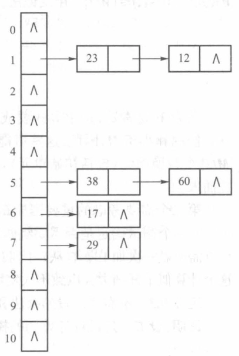

将具有相同散列地址的碰撞结点存储在一个单链表中，散列表中的 $k$ 号单元保存的是指向散列地址同为 $k$ 的链表的第一个结点的地址。

```cpp
#include "9-1-dynamicSearchTable.h"
#include <bits/stdc++.h>
using namespace std;

template <class KEY, class OTHER>
class openHashTable : public dynamicSearchTable<KEY, OTHER>
{
    private:
        struct node
        {
            SET<KEY, OTHER> data;
            node *next;

            node(const SET<KEY, OTHER> &d, node *n = NULL)
            {
                data = d;
                next = n;
            }
            node()
            {
                next = NULL;
            }
        };

        node **array;//指针数组
        int size;
        int (*key)(const KEY &x);//函数指针
        static int defaultKey(const int &x)
        {
            return x;
        }
    public:
        openHashTable(int length = 101, int (*f)(const KEY &x) = defaultKey);
        ~openHashTable();
        SET<KEY, OTHER> *find(const KEY &x) const;
        void insert(const SET<KEY, OTHER> &x);
        void remove(const KEY &x);
};

template <class KEY, class OTHER>
openHashTable<KEY, OTHER>::openHashTable(int length, int (*f)(const KEY &x))
{
    size = length;
    array = new node*[size];
    key = f;
    for (int i = 0; i < size; i++) array[i] = NULL;
}

template <class KEY, class OTHER>
openHashTable<KEY, OTHER>::~openHashTable()
{
    node *p, *q;
    for (int i = 0; i < size; i++)
    {
        p = array[i];
        while (p != NULL)
        {
            q = p->next;
            delete p;
            p = q;
        }
    }
    delete []array;
}

template <class KEY, class OTHER>
SET<KEY, OTHER> *openHashTable<KEY, OTHER>::find(const KEY &x) const
{
    int pos;
    node *p;
    pos = key(x) % size;
    p = array[pos];
    while (p != NULL && p->data.key != x) p = p->next;
    if (p == NULL) return NULL;
    else return (SET<KEY, OTHER> *)p;
}

template <class KEY, class OTHER>
void openHashTable<KEY, OTHER>::insert(const SET<KEY, OTHER> &x)
{
    int pos;
    node *p;
    pos = key(x.key) % size;
    p = array[pos];
    array[pos] = new node(x, array[pos]);
}

template <class KEY, class OTHER>
void openHashTable<KEY, OTHER>::remove(const KEY &x)
{
    int pos;
    node *p, *q;
    pos = key(x) % size;
    if (array[pos] == NULL) return;
    p = array[pos];
    if (array[pos]->data.key == x)
    {
        array[pos] = p->next;
        delete p;
        return;
    }
    while (p->next != NULL && p->next->data.key != x) p = p->next;
    if (p->next != NULL)
    {
        q = p->next;
        p->next = q->next;
        delete q;
    }
}
```

# 排序
## 排序的基本概念
- **排序**：把集合中的数据元素按照它们的**关键字**的非递减或非递增序排成一个序列
- **稳定排序与非稳定排序**：多个关键字值相同的数据元素经过排序后，这些数据元素的相对次序保持不变，则稳定，反之则不稳定
- **内排序与外排序**：
    - 内排序是指被排序的数据元素全部存放在计算机的内存之中，并且在内存中调整数据元素的相对位置。
    - 外排序是指在排序的过程中，数据元素主要存放在外存储器中，借助于内存储器逐步调整数据元素之间的相对位置。

## 插入排序
首先将由第一个数据元素组成的序列看成是有序的，然后将剩余的 $n-1$ 个元素依次**插入**到前面的已排好序的子序列中去，使得每次插入后的子序列也是有序的。


### 直接插入排序
- 时间复杂度：
    - 最好情况：$O(N)$
    - 最坏情况、平均情况：$O(N^2)$
- 空间复杂度：$O(1)$
- 稳定

```cpp
//直接插入排序
template <class KEY, class OTHER>
void simpleInsertSort(SET<KEY, OTHER> *data, int size) {
    int k;
    SET<KEY, OTHER> tmp;

    for (int i = 1; i < size; i++) {
        tmp = data[i];
        for (k = i - 1; k >= 0 && tmp < data[k]; k--) {
            data[k + 1] = data[k];
        }
        data[k + 1] = tmp;
    }
}
```

### 二分排序
- 二分插入排序是直接插入排序的改进版，利用二分查找来确定插入位置
- 时间复杂度（平均）：
    - 比较次数：$O(N \log N)$
    - 移动次数：$O(N^2)$
    - 总体时间复杂度：$O(N^2)$
- 空间复杂度：$O(1)$
- 稳定

```cpp
//二分插入排序
template <class KEY, class OTHER>
void binaryInsertSort(SET<KEY, OTHER> *data, int size) {
    SET<KEY, OTHER> tmp;
    int left, right, mid;

    for (int i = 1; i < size; i++) {
        tmp = data[i];
        left = 0;
        right = i - 1;
        //二分查找插入位置
        while (left <= right) {
            mid = (left + right) / 2;
            if (data[mid].key < tmp.key) {
                left = mid + 1;
            } else {
                right = mid - 1;
            }
        }
        //将元素向后移动
        for (int k = i - 1; k >= left; k--) {
            data[k + 1] = data[k];
        }
        data[left] = tmp;
    }
}
```

### 希尔排序
- 希尔排序是直接插入排序的改进版，先将待排序序列分成若干个子序列分别进行直接插入排序，然后再对全体记录进行一次直接插入排序
- 时间复杂度：取决于步长序列的选取，一般情况下为$O(N^{1.3})$到$O(N^{2})$之间
- 不稳定


```cpp
//希尔排序
template <class KEY, class OTHER>
void shellSort(SET<KEY, OTHER> *data, int size) {
    SET<KEY, OTHER> tmp;

    for (int step = size / 2; step > 0; step /= 2) {//步长
        for (int i = step; i < size; i++) {
            tmp = data[i];
            for (int k = i - step; k >= 0 && tmp.key < data[k].key; k -= step) {
                data[k + step] = data[k];
            }
            data[k + step] = tmp;
        }
    }
}
```

## 选择排序
从 $n$ 个元素开始，每次从剩下的元素序列中**选择**关键字最小/最大的元素，依此类推，直至序列中最后只剩下一个元素为止。这样，把每次得到的元素排成一个序列，就得到了按非递减序排列的排序序列。 

### 直接选择排序
- 时间复杂度：$O(N^2)$
- 空间复杂度：$O(1)$
- 不稳定

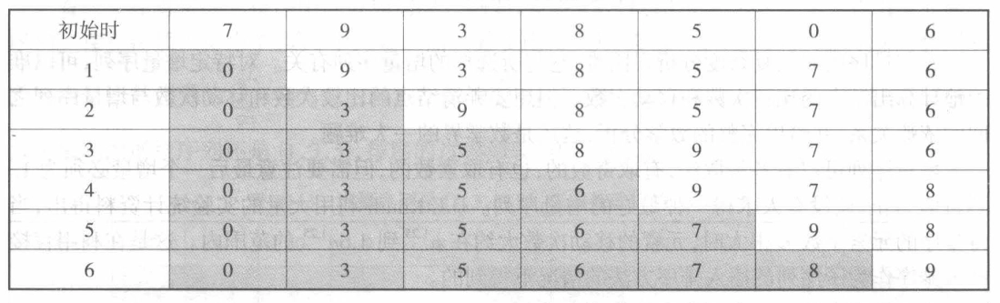

```cpp
//直接选择排序
template <class KEY, class OTHER>
void simpleSelectSort(SET<KEY, OTHER> *data, int size) {
    int min;
    SET<KEY, OTHER> tmp;

    for (int i = 0; i < size - 1; i++) {
        min = i;
        for (int j = i + 1; j < size; j++) {
            if (data[j] < data[min]) {
                min = j;
            }
        }
        if (min != i) {
            tmp = data[i];
            data[i] = data[min];
            data[min] = tmp;
        }
    }
}
```

### 堆排序
- 时间复杂度：$O(N \log N)$
- 空间复杂度：$O(1)$
- 不稳定

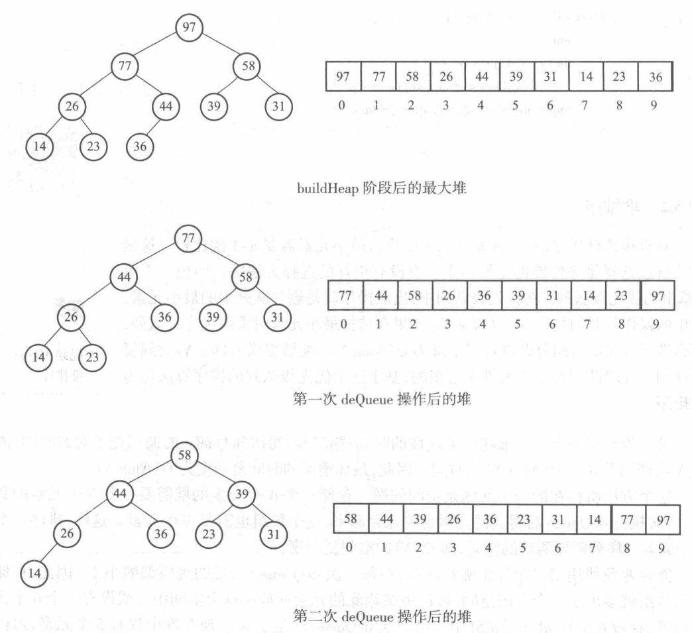

```cpp
//堆排序
template <class KEY, class OTHER>
void heapSort(SET<KEY, OTHER> *data, int size) {
    void perccolateDown(SET<KEY, OTHER> *data, int hole, int size);
    SET<KEY, OTHER> tmp;
    //建立最大堆
    for (int i = size / 2 - 1; i >= 0; i--) {
        perccolateDown(data, i, size);
    }
    //删除最大堆顶
    for (int i = size - 1; i > 0; i--) {
        tmp = data[0];
        data[0] = data[i];
        data[i] = tmp;
        perccolateDown(data, 0, i);
    }
}

template <class KEY, class OTHER>
void perccolateDown(SET<KEY, OTHER> *data, int hole, int size) {
    int child;
    SET<KEY, OTHER> tmp = data[hole];

    for (; hole * 2 + 1 < size; hole = child) {
        child = hole * 2 + 1;
        if (child != size - 1 && data[child].key < data[child + 1].key) {
            child++;
        }
        if (data[child].key > tmp.key) {
            data[hole] = data[child];
        } else {
            break;
        }
    }
    data[hole] = tmp;
}
```

## 交换排序
根据序列中两个数据元素的比较结果来确定是否要**交换**这两个数据元素在序列中的位置。通过交换，将关键字值较大的数据元素向序列的尾部移动，关键字值较小的数据元素向序列的头部移动。 

### 冒泡排序
- 时间复杂度：
    - 最好情况：$O(N)$
    - 最坏、平均情况：$O(N^2)$
- 空间复杂度：$O(1)$
- 稳定


```cpp
//冒泡排序
template <class KEY, class OTHER>
void bubbleSort(SET<KEY, OTHER> *data, int size) {
    SET<KEY, OTHER> tmp;
    bool flag = true;//标记是否有交换

    for (int i = 0; i < size - 1 && flag; i++) {
        flag = false;
        for (int j = size - 1; j > i; j--) {
            if (data[j].key < data[j - 1].key) {
                tmp = data[j];
                data[j] = data[j - 1];
                data[j - 1] = tmp;
                flag = true;
            }
        }
    }
}
```

### 快速排序
- 快速排序是交换排序的一种，采用分治法的思想，将待排序序列分成两个子序列，使得左子序列的所有元素都小于或等于右子序列的所有元素，然后对这两个子序列递归进行快速排序
- 时间复杂度：
    - 最好情况：$O(N \log N)$
    - 最坏情况：$O(N^2)$
    - 平均情况：$O(N \log N)$
- 不稳定

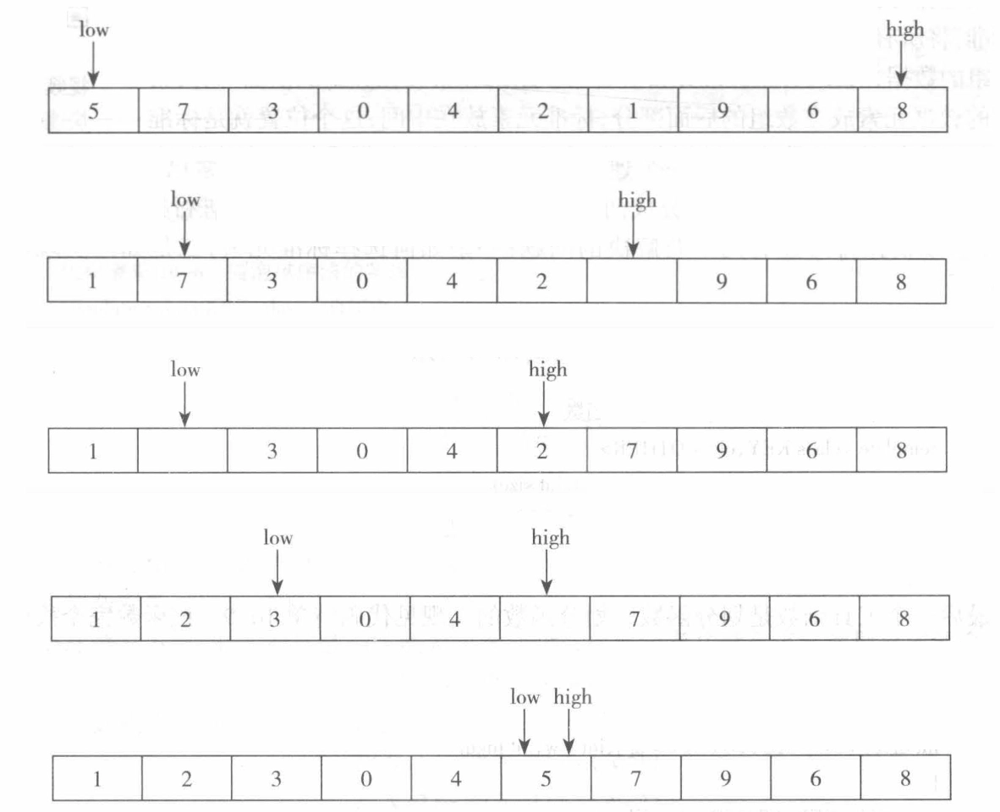

```cpp
//快速排序的划分函数
template <class KEY, class OTHER>
int divide(SET<KEY, OTHER> *data, int low, int high) {
    SET<KEY, OTHER> k = data[low];
    do {
        while (low < high && data[high] >= k) --high;
        if (low < high) {
            data[low] = data[high];
            ++low;
        }
        while (low < high && data[low] <= k) ++low;
        if (low < high) {
            data[high] = data[low];
            --high;
        }
    } while (low != high);
    data[low] = k;
    return low;
}

//快速排序
template <class KEY, class OTHER>
void quickSort(SET<KEY, OTHER> *data, int low, int high) {
    int mid;
    if (low >= high) return;//递归结束
    mid = divide(data, low, high);//一分为二
    quickSort(data, low, mid - 1);//对低子表递归排序
    quickSort(data, mid + 1, high);//对高子表递归排序
}

//快速排序的封装函数
template <class KEY, class OTHER>
void quickSort(SET<KEY, OTHER> *data, int size) {
    quickSort(data, 0, size - 1);
}

//快速排序非递归实现
template <class KEY, class OTHER>
void quickSort2(SET<KEY, OTHER> *data, int size) {
    stack<int> s;
    int low = 0, high = size - 1;
    int mid;
    if (low < high) {
        mid = divide(data, low, high);
        if (low < mid - 1) {
            s.push(low);
            s.push(mid - 1);
        }
        if (mid + 1 < high) {
            s.push(mid + 1);
            s.push(high);
        }
        while (!s.empty()) {
            high = s.top();
            s.pop();
            low = s.top();
            s.pop();
            mid = divide(data, low, high);
            if (low < mid - 1) {
                s.push(low);
                s.push(mid - 1);
            }
            if (mid + 1 < high) {
                s.push(mid + 1);
                s.push(high);
            }
        }
    }
}
```

## 归并排序
归并排序的思想来源于合并两个已排序的有序表时，只需要从两个表的表头开始比较，将较小的元素放入结果表中，直到一个表为空，然后将另一个表中剩余的元素全部放入结果表中。

- 时间复杂度：$O(N \log N)$
- 空间复杂度：$O(N)$
- 稳定


```cpp
//归并排序的合并函数
template <class KEY, class OTHER>
void merge(SET<KEY, OTHER> *data, int left, int mid, int right)
{
    SET<KEY, OTHER> *tmp = new SET<KEY, OTHER>[right - left + 1];
    int pos = 0;
    int i = left, j = mid;
    while (i < mid && j <= right)
    {
        if (data[i] < data[j])
        {
            tmp[pos++] = data[i++];
        }
        else
        {
            tmp[pos++] = data[j++];
        }
    }
    while (i < mid)
    {
        tmp[pos++] = data[i++];
    }
    while (j <= right)
    {
        tmp[pos++] = data[j++];
    }
    for (int i = 0; i < pos; i++)
    {
        data[left + i] = tmp[i];
    }
    delete[] tmp;
}

//归并排序
template <class KEY, class OTHER>
void mergeSort(SET<KEY, OTHER> *data, int left, int right)
{
    if (left == right)
    {
        return;
    }
    int mid = (left + right) / 2;
    mergeSort(data, left, mid);
    mergeSort(data, mid + 1, right);
    merge(data, left, mid + 1, right);
}

//归并排序的封装函数
template <class KEY, class OTHER>
void mergeSort(SET<KEY, OTHER> *data, int size)
{
    mergeSort(data, 0, size - 1);
}
```

## 基数排序
又称为口袋排序法，通过分配的方法对整数进行排序。基数排序的基本思想是将整数按位切割成不同的数字，然后按每个位数分别比较。
- 时间复杂度：$O(len \cdot (N + k))$，其中 $len$ 是关键字的位数，$k$ 是基数（即每一位的取值范围/进制数）
- 空间复杂度：$O(1)$

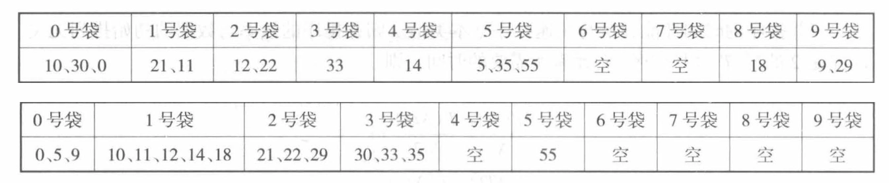

```cpp
//基数排序的辅助结点
template <class KEY, class OTHER>
struct node
{
    SET<KEY, OTHER> data;
    node<KEY, OTHER> *next;
    node() {next = NULL;}
    node(const SET<KEY, OTHER> &x, node<KEY, OTHER> *N = NULL)
    {
        data = x;
        next = N;
    }
};

//基数排序
template <class KEY, class OTHER>
void bukketSort(SET<KEY, OTHER> *&data)
{
    node<KEY, OTHER> *bukket[10], *last[10], *tail;
    int i, j, k;
    int base = 1, max = 0, len = 0;

    for (tail = data; tail != NULL; tail = tail->next)
    {
        if (tail->data.key > max)
        {
            max = tail->data.key;
        }
    }//找到最大值

    if (max == 0)
    {
        len = 0;
    }
    else
    {
        while (max > 0)
        {
            max /= 10;
            len++;
        }
    }//找到最大值的位数

    for (i = 1, base = 1; i <= len; i++, base *= 10)
    {
        for (j = 0; j < 10; j++)
        {
            bukket[j] = last[j] = NULL;
        }

        while (data != NULL)
        {
            k = (data->data.key / base) % 10;
            if (bukket[k] == NULL)
            {
                bukket[k] = last[k] = data;
            }
            else
            {
                last[k]->next = data;
                last[k] = data;
            }
            data = data->next;
        }

        data = NULL;
        for (j = 0; j < 10; j++)
        {
            if (bukket[j] != NULL)
            {
                if (data == NULL)
                {
                    data = bukket[j];
                    tail = last[j];
                }
                else
                {
                    tail->next = bukket[j];
                    tail = last[j];
                }
            }
        }
        tail->next = NULL;
    }
}
```

# 外部查找与排序
## 主存储器与外存储器
- **主存储器**：也被称为内存，是存储正在运行的程序代码及处理数据。
- **外存储器**：用于存储长期保存的信息。常用的外存储器有磁盘、磁带、光盘、U盘等，访问速度慢，故需考虑减少访问次数。
    - 外存储器中的信息以文件为单位。每个文件在内存有一个缓冲区存放正在处理的文件中的数据
    - 外存储器以数据块为单位与内存交换信息。当程序需要处理外存储器中的某个数据，则将包含该数据的数据块读入缓冲区进行处理

## B 树
### B 树的定义
一棵 $m$ 阶 B 树或者为空，或者满足以下条件。

1. 根结点要么是叶子，要么至少有两个儿子，至多有 $m$ 个儿子。

2. 除根结点和叶子结点之外，每个结点的儿子个数 $s$ 满足$\lceil m/2 \rceil \leq s \leq m$。

3. 有 $s$ 个儿子的非叶结点具有$n = s - 1$个关键字，故$s = n + 1$。这些结点的数据信息为  
$$(n,A_0,(K_1,R_1),A_1,(K_2,R_2),A_2,\cdots,(K_n,R_n),A_n)$$  

    其中： 

    - $n$: 关键字的个数 
    - $K_1,K_2,\cdots,K_n$: 结点的关键字，且$K_1 \lt K_2 \cdots \lt K_n$
    - $A_0$: B 树中小于$K_1$的结点的地址  
    - $R_j$: 关键字值等于$K_j(1 \leq j \leq n)$的数据记录在硬盘中的地址
    - $A_j$: B 树中大于$K_j$且小于$K_{j + 1}(1 \leq j \leq n - 1)$的结点的地址
    - $A_n$: B 树中大于$K_n$的结点的地址

4. 所有的叶子结点都出现在同一层上，即它们的深度相同，并且不带信息(可以认为是外部结点或查找失败的结点，这些结点并不存在，指向这些结点的指针为空)。


### B 树的查找
B 树的查找过程与二叉查找树类似，但由于 B 树的每个结点可以有多个关键字，因此查找过程需要在结点内部进行线性查找。

1. 从根结点开始，比较要查找的关键字与根结点的关键字。
2. 如果找到相等的关键字，则查找成功。
3. 如果要查找的关键字在根结点关键字之间，则继续在根结点的某个子树中查找。
4. 重复以上步骤，直到找到关键字或到达叶子结点。

### B 树的插入
首先在 $m$ 阶 B 树上进行查找操作，确定新插入的关键字 key 在最底层的非叶结点的插入位置，将 key 和其他信息按序插入最底层上的某个结点。

- 若被插入结点的关键字个数小于 $m-1$ ，则插入操作结束
- 若该结点原有的关键字个数已经等于 $m-1$ ，必须分裂成两个结点


### B 树的删除
类似二叉查找树的删除操作，从根结点开始查找与给定关键字值 key 相等的关键字 $K_i$。关键字 $K_i$ 可能出现在第一层到最底层之间的任何一个结点上，计有以下几种情况:

1. 如果关键字 $K_i$ 在最底层，可直接删除，转 (3) 。
2. 否则，先找到“替身”。用它的右子树中的最左面的结点的关键字值，即处于最底层上的最小关键字值取代。然后，删除最底层上的该关键字。
3. 从最底层开始进行删除相应关键字的操作，计有以下几种情况：
    - 若删除关键字之后，结点的关键字的个数仍处于 $[\lceil m/2 \rceil - 1, m - 1]$ 之间，仍满足 B 树的结点的定义，删除结束。
    - 若结点的关键字的个数原为 $[\lceil m/2 \rceil - 1]$，若再删除一个关键字，将不符合 B 树定义。如果该结点的左或右兄弟结点的关键字的个数大于 $[\lceil m/2 \rceil - 1]$，则借一个关键字过来。必须注意的是，并不是直接将左或右兄弟结点的关键字取过来，因为这样将无法保证结点的关键字有序。如果是借左兄弟结点的最大关键字，则必须将该关键字上移到父结点的相应位置，而将父结点中大于该关键字且最接近该关键字的那个关键字（连同左兄弟结点的最右方的指针 $A_n$）下移到被删关键字所在结点的最左面，删除操作结束。若借右兄弟结点的最小关键字，操作类似。
    - 若该结点的左或右兄弟结点的关键字的个数都为 $[\lceil m/2 \rceil - 1]$，那么将无结点可借。这时只能执行合并结点的操作。将该结点同左兄弟（无左兄弟时，与右兄弟）合并。由于两个结点合并后，父结点中相应的关键字将不再保留，因为它原来的左右儿子已经不存在，因此，把父结点中该关键字也并入合并后的结点。这样，父结点的关键字个数便减少了一个。如果父结点的关键字个数不满足定义，则必须继续调整。在最坏情况下，调整可能会一直波及到根结点，导致 B 树的高度减少 1，即减少一层。


### B 树占用空间的情况
将一个磁盘块作为一个B树的结点。假设一个块的容量 $max$ 字节，如果每个键要占用 $key$ 个字节。在一棵 $M$ 阶 B 树中，可以有 $M-1$ 个键，总的数据量是：

$$(M-1) * key + M 个分支的地址 + M-1个关键字对应记录的存储地址$$

## B+ 树
### B+ 树的定义
- B 树不适合顺序访问
- B+ 树既能提供随机查找，也能提供顺序访问的存储结构。
    - B+ 树的所有关键字都在叶子结点中，并且叶子结点之间通过指针相连
- 一棵 $M$ 阶的 B+ 树被定义为具有以下性质的 $M$ 叉树：
    1. 根或者是叶子，或者有 $2$ 到 $M$ 个孩子。
    2. 除根之外所有结点都有不少于 $\lceil M/2 \rceil$ 且不多于 $M$ 个孩子。
    3. 有 $K$ 个孩子的结点保存了 $K-1$ 个键来引导查找，键 $1$ 代表了子树 $i+1$ 中键的最小值。
    4. 叶结点中的孩子指针指向存储记录的数据块的地址。换句话说，对于索引 B+ 树，它们是叶结点。但对于数据块来说，它们又是数据块的父结点。数据块才是真正的叶结点。而在 B 树中，叶结点的孩子指针都是空指针。
    5. 每个数据块至少有 $\lceil L/2 \rceil$ 个记录，至多有 $L$ 个记录。
    6. 所有的叶结点按序连成一个单链表。
-  B+ 树存储两个指针
    - 指向树根的指针，提供了索引查找
    - 指向关键字最小的叶结点，提供顺序访问

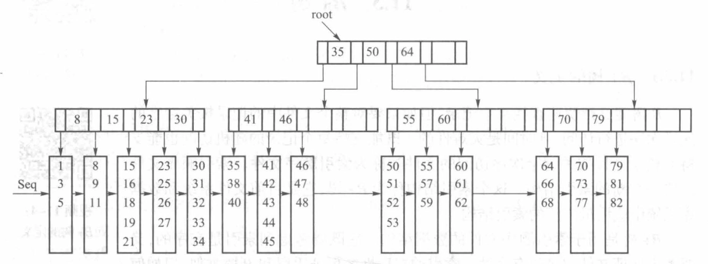

### B+ 树的查找
与二叉查找树类似，在 B+ 树上查找某一条记录也是从根结点开始，根据结点中的键值决定查找哪一棵子树。一层一层往下找，直到找到该记录应该存放的数据块。在数据块中查找被查找的记录，找到了则表示查找成功，没有找到则表示该记录不存在。

### B+ 树的插入
从根结点开始查找插入的位置，把它插入相应的数据块中：

- 若存放被插入记录的数据块还没有放满：直接插入
- 若已满：分裂叶结点
    - 若父结点也已满，则继续向上分裂，直至父亲直到不需要再分裂或者到达了根结点。若到达根结点，则重新建立一个根，让这两个分裂出来的根做它的两个子结点


### B+ 树的删除
删除操作首先查找到要删除的项，然后删除它。

- 如果此时它所在的叶子的元素数量正好满足要求的最小值，删除该项就会使它低于最小值
    - 如果邻居不是最少的情况，就借一个过来领养；
        - 如果邻居也处于最少的情况，就把两个结点合并成一个满的结点。
        - 在这种情况下父亲就失去了一个儿子。如果它引起父亲的儿子数少于了最小值，则需要一直向上进行过滤到根。
        - 如果根只剩下了一个儿子，就把根删除，让它的儿子作为新的树根，这也是唯一能使B树变矮的情况。

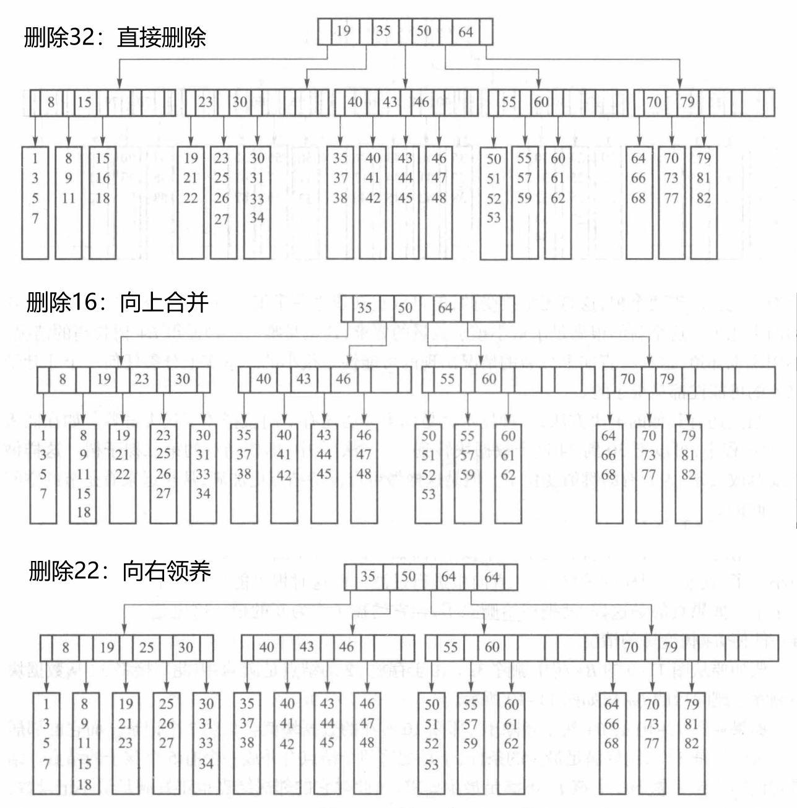
        
## 外排序
在外存上进行排序的最常用的方法是利用归并排序，因为归并排序只需要访问被归并序列中的第一个元素，这非常适合于顺序文件。

### 预处理阶段
- 预处理阶段：根据内存的大小将一个有 n 个记录的文件分批读入内存，用各种内排序算法排序，形成一个个有序片段。
- **置换选择**
    - 在外排序中，已排序片段越多，归并的次数也越多。如果能够让每个初始的已排序片段包含更多的记录，就能减少已排序片段数，就能减少排序时间。
    - 置换选择可以在只能容纳 $p$ 个记录的内存中生成平均长度为 $2p$ 的初始的已排序片段。
    - 基于每个小片段采用选择排序。每次选出的最小记录直接被写到输出文件上，它所用的内存空间就可以给别的元素使用，此时可以从输入文件读入一个新记录。如果它比刚才写出去的元素大，则把它加入到优先级队列；否则，它不可能进入当前的已排序片段，该元素就被放于优先级队列的空余位置，用于下个片段的排序。
- 文件上的数据为 $1、4、10、2、0、5、7、6、9、12$ ，内存中能够容纳 3 个记录，这 3 个记录存放在数组 a 中。构造初始的已排序片段的过程如下图。由于采用了置换选择法，使得对 11 个记录只生成了两个初始的已排序片段，这样只需要一次归并就能排好序。

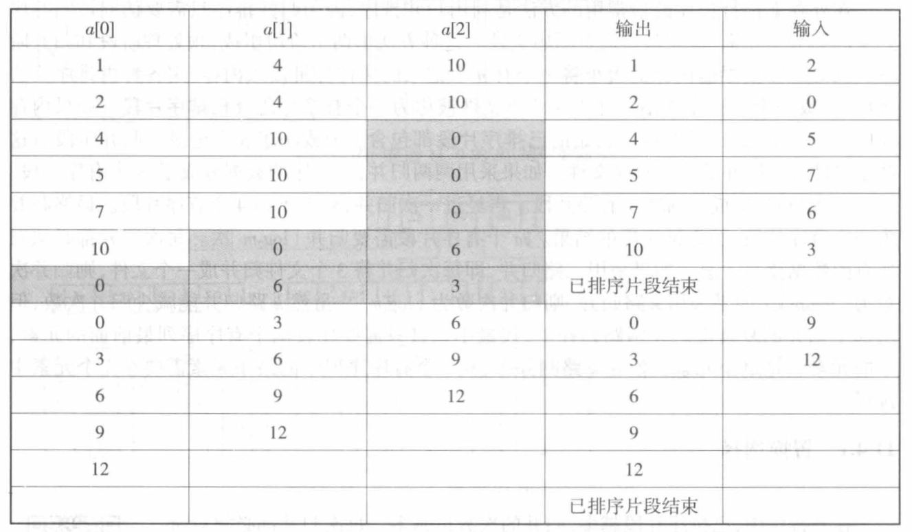

### 归并阶段
- 归并阶段：将预处理得到的已排序片段逐步归并成一个有序文件。
- **多阶段归并**
    - $k$ **路归并**：如果生成的已排序片段数为 $m$ ，则 $k$ 路归并需要归并 $\lceil \log_k m \rceil$ 次。
        - $k$ 越大，归并次数越少。
        - $k$ 路归并需要 $2k$ 个缓冲区
    - 使用多阶段归并，可以在只有 $k+1$ 个缓冲区的情况下完成 $k$ 路归并。

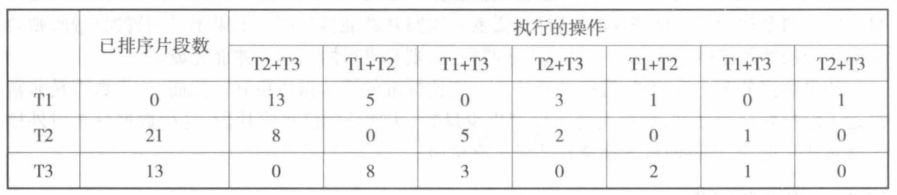

# 图
## 图的定义
- **图**：由顶点集 $V$ 和边集 $E$ 组成的有序对 $G = (V, E)$
    - **顶点**：图中的基本元素，通常用 $V = \{v_1, v_2, \cdots, v_n\}$ 表示
    - **边**：连接两个顶点的线段，通常用 $E = \{e_1, e_2, \cdots, e_m\}$ 表示

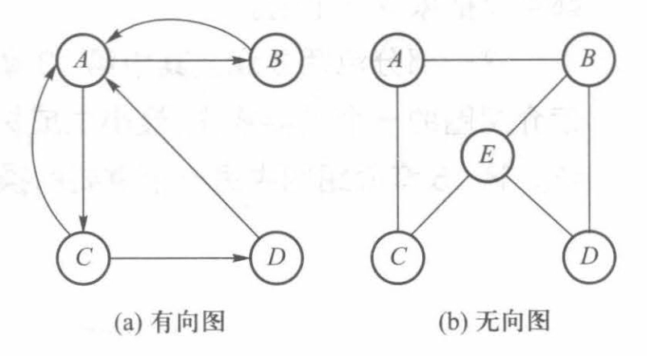


- **有向图**：边有方向的图，边从一个顶点指向另一个顶点，用有序对表示边，如 $e = <v_i, v_j>$，表示从顶点 $v_i$ 到顶点 $v_j$ 的边
- **无向图**：边没有方向的图，边连接两个顶点，用无序对表示边，如 $e = (v_i, v_j)$，表示顶点 $v_i$ 和顶点 $v_j$ 之间的边
- **加权图**：边带有权值的图，通常用 $w(e)$ 表示边 $e$ 的权值
    - 加权有向图：$e = <v_i, v_j, w>$，表示从顶点 $v_i$ 到顶点 $v_j$ 的边，权值为 $w$
    - 加权无向图：$e = (v_i, v_j, w)$，表示顶点 $v_i$ 和顶点 $v_j$ 之间的边，权值为 $w$

### 图的基本术语
1. **邻接**：如果边 $e = (v_i, v_j)$ 存在，则称顶点 $v_i$ 和顶点 $v_j$ 是邻接的。
2. **度**
    - 无向图：与该结点关联的边数
    - 有向图：分为入度和出度
        - **入度**：有向图中进入某一结点的边数，称为该结点的入度
        - **出度**：有向图中离开某一结点的边数，称为该结点的出度
3. **子图**：如果图 $G = (V, E)$ 的一个子集 $V' \subseteq V$ 和 $E' \subseteq E$ 使得 $G' = (V', E')$ 也是一个图，则称 $G'$ 是 $G$ 的子图
4. 路径和路径长度
    - **路径**：从一个顶点到另一个顶点的边的序列
        - 若两个顶点之间存在路径，则称这两个顶点是**连通**的
        - **简单路径**：路径上除了起始结点和终止结点外，其余的结点都不相同
    - **路径长度**：
        - 非加权路径长度：路径中边的数量
        - 加权路径长度：路径中所有边的权值之和
5. 连通图和连通分量
    - **连通图**：无向图中任意两个顶点之间都有路径相连，则称该图是连通的
    - **连通分量**：无向图中一个连通子图，且该子图不是任何其他连通子图的子集
6. 强连通图和强连通分量
    - **强连通图**：有向图中任意两个顶点之间都有路径相连，则称该图是强连通的
    - **强连通分量**：有向图中一个强连通子图，且该子图不是任何其他强连通子图的子集
    - 若一个有向图不是强连通的，但把它看作无向图时是连通的，则称该有向图是**弱连通的**
7. **完全图**
    - 无向图：每一对顶点都有一条边相连，共有 $\frac{n(n-1)}{2}$ 条边
    - 有向图：每一对顶点 $v_i, v_j$ 都有两条边 $<v_i, v_j>$ 和 $<v_j, v_i>$ 相连，共有 $n(n-1)$ 条边
8. **生成树**：无向连通图的极小连通子图，有 $n$ 个顶点和 $n-1$ 条边

### 图的基本运算
```cpp
#ifndef GRAPH_H
#define GRAPH_H

#include <bits/stdc++.h>
using namespace std;

template <class TypeOfVer, class TypeOfEdge>
class Graph {
    public:
        virtual void insert(TypeOfVer x, TypeOfVer y, TypeOfEdge w) = 0;
        virtual void remove(TypeOfVer x, TypeOfVer y) = 0;
        virtual bool exist(TypeOfVer x, TypeOfVer y) const = 0;
        int numOfVer() const { return Vers; }
        int numOfEdge() const { return Edges; }

    protected:
        int Vers, Edges;
};

#endif
```

## 图的存储
### （加权）邻接矩阵表示法
$$A
[i][j] = \begin{cases} 
1\ \text{or}\ w & \text{if } <i,j>\ \in E \text{ or } (i,j) \in E \\
0\ \text{or}\ \infty & \text{otherwise}
\end{cases}
$$


```cpp
#include "13-1-graph.h"
#include <bits/stdc++.h>    
using namespace std;

template <class TypeOfVer, class TypeOfEdge>
class adjMatrixGraph: public Graph<TypeOfVer, TypeOfEdge> {
    public:
        adjMatrixGraph(int vSize, const TypeOfVer d[], const TypeOfEdge noEdgeFlag);
        ~adjMatrixGraph();
        void insert(TypeOfVer x, TypeOfVer y, TypeOfEdge w);
        void remove(TypeOfVer x, TypeOfVer y);
        bool exist(TypeOfVer x, TypeOfVer y) const;
        void printGraph() const;

    private:
        TypeOfEdge **edge;
        TypeOfVer *ver;
        int find(TypeOfVer v) const
        {
            for (int i = 0; i < Vers; i++)
                if (ver[i] == v)
                    return i;
            return -1;
        }
        TypeOfEdge noEdge;
};

template <class TypeOfVer, class TypeOfEdge>
adjMatrixGraph<TypeOfVer, TypeOfEdge>::adjMatrixGraph(int vSize, const TypeOfVer d[], const TypeOfEdge noEdgeFlag)
{
    Vers = vSize;
    Edges = 0;
    noEdge = noEdgeFlag;
    int i, j;
    ver = new TypeOfVer[vSize];
    for (i = 0; i < vSize; i++)
        ver[i] = d[i];
    edge = new TypeOfEdge *[vSize];
    for (i = 0; i < vSize; i++)
    {
        edge[i] = new TypeOfEdge[vSize];
        for (j = 0; j < vSize; j++) edge[i][j] = noEdge;
        edge[i][i] = 0;
    }
}

template <class TypeOfVer, class TypeOfEdge>
adjMatrixGraph<TypeOfVer, TypeOfEdge>::~adjMatrixGraph()
{
    delete[] ver;
    for (int i = 0; i < Vers; i++) delete[] edge[i];
    delete[] edge;
}

template <class TypeOfVer, class TypeOfEdge>
void adjMatrixGraph<TypeOfVer, TypeOfEdge>::insert(TypeOfVer x, TypeOfVer y, TypeOfEdge w)
{
    int u = find(x), v = find(y);
    if (u == -1 || v == -1) return;
    if (edge[u][v] == noEdge)
    {
        edge[u][v] = w;
        Edges++;
    }
}

template <class TypeOfVer, class TypeOfEdge>
void adjMatrixGraph<TypeOfVer, TypeOfEdge>::remove(TypeOfVer x, TypeOfVer y)
{
    int u = find(x), v = find(y);
    if (u == -1 || v == -1) return;
    if (edge[u][v] != noEdge)
    {
        edge[u][v] = noEdge;
        Edges--;
    }
}

template <class TypeOfVer, class TypeOfEdge>
bool adjMatrixGraph<TypeOfVer, TypeOfEdge>::exist(TypeOfVer x, TypeOfVer y) const
{
    int u = find(x), v = find(y);
    if (u == -1 || v == -1) return false;
    return edge[u][v] != noEdge;
}

template <class TypeOfVer, class TypeOfEdge>
void adjMatrixGraph<TypeOfVer, TypeOfEdge>::printGraph() const
{
    for (int i = 0; i < Vers; i++)
    {
        cout << ver[i] << ": ";
        for (int j = 0; j < Vers; j++)
            if (edge[i][j] != noEdge)
                cout << ver[j] << " " << edge[i][j] << " ";
        cout << endl;
    }
}
```

### 邻接表表示法
- **邻接表是图的标准存储方式**。
- 邻接表将每一个结点的邻接结点组成一个链表，链表的每个结点表示一条边。
- 分为两部分：保存顶点和保存边
    - 顶点集用一个数组表示，数组的每个元素由两部分组成：
        - 顶点值
        - 指向该顶点对应的链表的首地址
    - 边集用一组单链表表示。
        - 非加权图，单链表的结点由两部分组成：
            - 这条边终止结点的编号
            - 后继指针
        - 加权图，单链表的结点由三部分组成：
            - 这条边终止结点的编号
            - 边的权值
            - 后继指针
- 空间复杂度：$O(|V| + |E|)$，其中 $|V|$ 是顶点数，$|E|$ 是边数


```cpp
#include "13-1-graph.h"
#include <bits/stdc++.h>
using namespace std;

template <class TypeOfVer, class TypeOfEdge>
class adjListGraph: public Graph<TypeOfVer, TypeOfEdge> {
    public:
        adjListGraph(int vSize, const TypeOfVer d[]);
        ~adjListGraph();
        void insert(TypeOfVer x, TypeOfVer y, TypeOfEdge w);
        void remove(TypeOfVer x, TypeOfVer y);
        bool exist(TypeOfVer x, TypeOfVer y) const;
        void printGraph() const;
        void dfs() const;
        void bfs() const;
        void topSort() const;
        void EulerCircuit(TypeOfVer start) const;

    private:
        struct edgeNode 
        {
            int end;
            TypeOfEdge weight;
            edgeNode *next;
            edgeNode(int e, TypeOfEdge w, edgeNode *n = NULL): end(e), weight(w), next(n) {}
        };

        struct verNode 
        {
            TypeOfVer ver;
            edgeNode *head;
            verNode(edgeNode *h = NULL): head(h) {}
        };

        verNode *verList;
        TypeOfEdge noEdge;
        int find(TypeOfVer v) const
        {
            for (int i = 0; i < Vers; i++)
            {
                if (verList[i].ver == v) return i;
            }
            return -1;
        }
        void dfs(int start, bool visited[]) const;

        struct EulerNode
        {
            int NodeNum;
            EulerNode *next;
            EulerNode(int ver): NodeNum(ver), next(NULL) {}
        };
        void EulerCircuit(int start, EulerNode *&beg, EulerNode *&end) const;
        adjListGraph<TypeOfVer, TypeOfEdge>::verNode *clone() const {};
};

template <class TypeOfVer, class TypeOfEdge>
adjListGraph<TypeOfVer, TypeOfEdge>::adjListGraph(int vSize, const TypeOfVer d[])
{
    Vers = vSize;
    Edges = 0;
    verList = new verNode[vSize];
    for (int i = 0; i < vSize; i++)
    {
        verList[i].ver = d[i];
    }
}

template <class TypeOfVer, class TypeOfEdge>
adjListGraph<TypeOfVer, TypeOfEdge>::~adjListGraph()
{
    edgeNode *p;
    for (int i = 0; i < Vers; i++)
    {
        while ((p = verList[i].head) != NULL)
        {
            verList[i].head = p->next;
            delete p;
        }
    }
    delete[] verList;
}

template <class TypeOfVer, class TypeOfEdge>
void adjListGraph<TypeOfVer, TypeOfEdge>::insert(TypeOfVer x, TypeOfVer y, TypeOfEdge w)
{
    int u = find(x), v = find(y);
    if (u == -1 || v == -1) return;
    verList[u].head = new edgeNode(v, w, verList[u].head);
    Edges++;
}

template <class TypeOfVer, class TypeOfEdge>
void adjListGraph<TypeOfVer, TypeOfEdge>::remove(TypeOfVer x, TypeOfVer y)
{
    int u = find(x), v = find(y);
    if (u == -1 || v == -1) return;
    edgeNode *p = verList[u].head, *q;
    if (p == NULL) return;
    if (p->end == v)
    {
        verList[u].head = p->next;
        delete p;
        Edges--;
        return;
    }
    while (p->next != NULL && p->next->end != v) p = p->next;
    if (p->next != NULL)
    {
        q = p->next;
        p->next = q->next;
        delete q;
        Edges--;
    }
}

template <class TypeOfVer, class TypeOfEdge>
bool adjListGraph<TypeOfVer, TypeOfEdge>::exist(TypeOfVer x, TypeOfVer y) const
{
    int u = find(x), v = find(y);
    if (u == -1 || v == -1) return false;
    edgeNode *p = verList[u].head;
    while (p != NULL && p->end != v) p = p->next;
    if (p == NULL) return false;
    else return true;
}

//打印图
template <class TypeOfVer, class TypeOfEdge>
void adjListGraph<TypeOfVer, TypeOfEdge>::printGraph() const 
{
    edgeNode *p;
    for (int i = 0; i < Vers; i++)
    {
        cout << verList[i].ver << ": ";
        p = verList[i].head;
        while (p != NULL)
        {
            cout << verList[p->end].ver << " " << p->weight << "; ";
            p = p->next;
        }
        cout << endl;
    }
}
```

## 图的遍历
### 深度优先遍历（DFS）
- 图的深度优先遍历类似于树的前序遍历：
    1. 选中第一个被访问的顶点
    2. 对顶点作已访问过的标志
    3. 依次从顶点的未被访问过的第一个、第二个、第三个……邻接顶点出发进行深度优先搜索
    4. 如果还有顶点未被访问，则选中一个起始顶点，转向 (2)
    5. 所有的顶点都被访问到，则结束

- 深度优先生成树：每个深度优先搜索的过程都对应着一棵树。
- 深度优先生成森林：如果图不是连通图或强连通图，在进行深度优先搜索时，有时并不一定能够保证从某一个结点出发能访问到所有的顶点在这种情况下，必须再选中一个未访问过的顶点，继续进行深度优先搜索。直至所有的顶点都被访问到为止。这时，将得到的是一组树而不是一棵树，这一组树被称为深度优先生成森林。

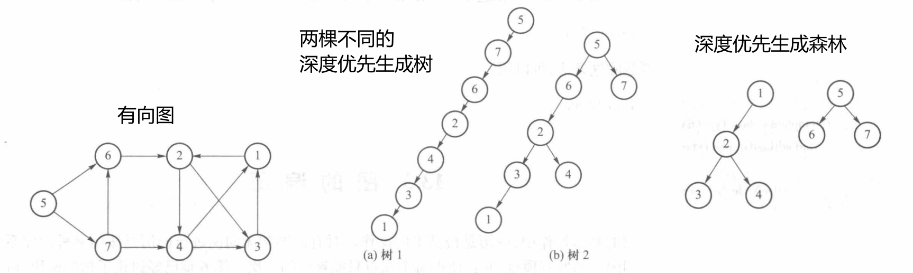

- 时间复杂度：
    - 邻接矩阵表示：$O(|V|^2)$
    - 邻接表表示：$O(|V| + |E|)$

```cpp
//递归DFS
template <class TypeOfVer, class TypeOfEdge>
void adjListGraph<TypeOfVer, TypeOfEdge>::dfs() const
{
    bool *visited = new bool[Vers];
    for (int i = 0; i < Vers; i++) visited[i] = false;
    cout << "dfs: ";
    for (int i = 0; i < Vers; i++)
    {
        if (!visited[i]) dfs(i, visited);
        cout << endl;
    }
}

template <class TypeOfVer, class TypeOfEdge>    
void adjListGraph<TypeOfVer, TypeOfEdge>::dfs(int start, bool visited[]) const
{
    cout << verList[start].ver << " ";
    visited[start] = true;
    edgeNode *p = verList[start].head;
    while (p != NULL)
    {
        if (!visited[p->end]) dfs(p->end, visited);
        p = p->next;
    }
}

//非递归DFS
template <class TypeOfVer, class TypeOfEdge>
void adjListGraph<TypeOfVer, TypeOfEdge>::dfs() const
{
    bool *visited = new bool[Vers];
    for (int i = 0; i < Vers; i++) visited[i] = false;
    stack<int> s;
    edgeNode *p;
    int currentNode = 0;
    cout << "dfs: ";
    for (int i = 0; i < Vers; i++)
    {
        if (visited[i]) continue;
        s.push(i);
        while (!s.empty())
        {
            currentNode = s.top();
            s.pop();
            if (visited[currentNode]) continue;
            cout << verList[currentNode].ver << " ";
            visited[currentNode] = true;
            p = verList[currentNode].head;
            while (p != NULL)
            {
                if (!visited[p->end])
                {
                    s.push(p->end);
                    visited[p->end] = true;
                }
                p = p->next;
            }
        }
        cout << endl;
    }
}
```

### 广度优先遍历（BFS）
- 图的广度优先搜索类似于树的层次遍历：
    1. 选中第一个被访问的顶点
    2. 对顶点作已访问过的标志
    3. 依次访问已访问顶点的未被访问过的第一个、第二个、第三个……邻接顶点，并进行标记，转向 (3)
    4. 如果还有顶点未被访问，则选中一个起始顶点，转向 (2)
    5. 所有的顶点都被访问到，则结束
- 广度优先生成树/森林：与 DFS 同理
- BFS 没有递归实现！

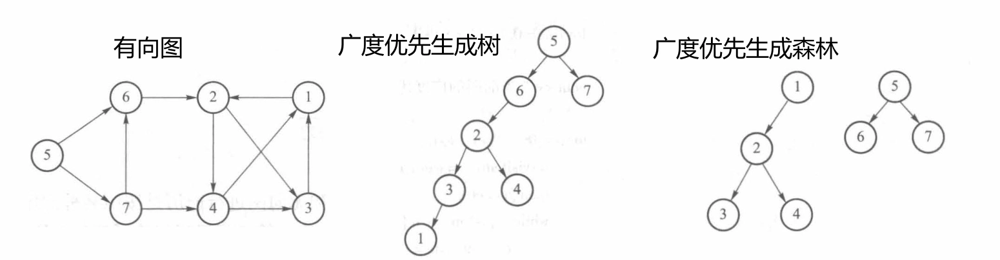

- 时间复杂度：
    - 邻接矩阵表示：$O(|V|^2)$
    - 邻接表表示：$O(|V| + |E|)$

```cpp
//非递归BFS
template <class TypeOfVer, class TypeOfEdge>
void adjListGraph<TypeOfVer, TypeOfEdge>::bfs() const   
{
    bool *visited = new bool[Vers];
    for (int i = 0; i < Vers; i++) visited[i] = false;
    queue<int> q;
    edgeNode *p;
    int currentNode = 0;
    cout << "bfs: ";
    for (int i = 0; i < Vers; i++)
    {
        if (visited[i]) continue;
        q.push(i);
        while (!q.empty())
        {
            currentNode = q.front();
            q.pop();
            if (visited[currentNode]) continue;
            cout << verList[currentNode].ver << " ";
            visited[currentNode] = true;
            p = verList[currentNode].head;
            while (p != NULL)
            {
                if (!visited[p->end])
                {
                    q.push(p->end);
                    visited[p->end] = true;
                }
                p = p->next;
            }
        }
        cout << endl;
    }
}
```

## 图的遍历的应用
### 无向图的连通性
- 深度优先搜索和广度优先搜索都可以用来测试无向图的连通性。
    - 如果无向图是连通的，则从无向图中的任意结点出发进行深度优先搜索或广度优先搜索都可以访问到每一个结点。访问的次序是一棵深度／广度优先生成树。
    - 如果图是非连通的，深度／广度优先搜索可以找到一片深度／广度优先生成森林。

### 欧拉回路
- 欧拉路径：如果能够在一个图中找到一条路径，使得该路径对图的每一条边正好经过一次，这条路径被称为欧拉路径。
- 欧拉回路：如果起点和终点是相同的，这条路径被称为欧拉回路。

```cpp
//欧拉回路
template <class TypeOfVer, class TypeOfEdge>
void adjListGraph<TypeOfVer, TypeOfEdge>::EulerCircuit(TypeOfVer start) const
{
    EulerNode *beg, *end, *p, *q, *tb, *te;//beg, end分别指向欧拉回路的头和尾
    //tb, te分别指向beg和end的尾部
    int numOfDegree;
    edgeNode *r;
    verNode *u;
    beg = end = tb = te = NULL;

    if (Edges == 0)
    {
        cout << "None" << endl;
        return;
    }
    for (int i = 0; i < Vers; i++)
    {
        numOfDegree = 0;
        for (r = verList[i].head; r != NULL; r = r->next) numOfDegree++;
        if (numOfDegree % 2 != 0)
        {
            cout << "None" << endl;
            return;
        }
    }//出度为基数，不存在欧拉回路

    //寻找起点
    int startNum = find(start);
    tmp = clone();//复制一个图

    //寻找从startNum开始的欧拉回路，路径的起点和终点分别为beg和end
    EulerCircuit(startNum, beg, end);
    while (1)
    {
        p = beg;
        while (p->next != NUll)//检查p的后继节点是否有边未被访问
        {
            if (verList[p->next->NodeNum].head != NULL) break;
            p = p->next;
            if (p->next == NULL) break;//p的后继节点都被访问过
            q = p->next;
            EulerCircuit(q->NodeNum, tb, te);
            te->next = q->next;
            p->next = tb;
            delete q;
        }
    }
    
    //恢复原图
    delete []verList;
    verList = tmp;

    //输出欧拉回路
    cout << "EulerCircuit: ";
    while (beg!=NULL)
    {
        cout << verList[beg->NodeNum].ver << " ";
        p = beg;
        beg = beg->next;
        delete p;
    }
    cout << endl;
}

//寻找从start开始的欧拉回路，路径的起点和终点分别为beg和end
template <class TypeOfVer, class TypeOfEdge>
void adjListGraph<TypeOfVer, TypeOfEdge>::EulerCircuit(int start, EulerNode *&beg, EulerNode *&end) const
{
    int nextNode;

    beg = end = new EulerNode(start);
    while (verList[start].head != NULL)
    {
        nextNode = verList[start].head->end;
        remove(start, nextNode);
        remove(nextNode, start);
        start = nextNode;
        end->next = new EulerNode(start);
        end = end->next;
    }
}

template <class TypeOfVer, class TypeOfEdge>
adjListGraph<TypeOfVer, TypeOfEdge>::verNode *adjListGraph<TypeOfVer, TypeOfEdge>::clone() const
{
    verNode *tmp = new verNode[Vers];
    edgeNode *p;
    for (int i = 0; i < Vers; i++)
    {
        tmp[i].ver = verList[i].ver;
        p = verList[i].head;
        while (p != NULL)
        {
            tmp[i].head = new edgeNode(p->end, p->weight, tmp[i].head);
            p = p->next;
        }
    }
    return tmp;
}
```

### 有向图的连通性
- 对于有向图，通过两次深度优先搜索可以测试该有向图是否为强连通。如果不是强连通，则可以找出所有强连通分量。
- 找出有向图 $G$ 的强连通分量:
    - 从任意结点开始执行深度优先搜索
        - 如果 $G$ 不是强连通的，则该深度优先搜索会得到一个深度优先生成森林/一棵深度优先生成树。
        - 对森林中的每棵树按它们的生成次序依次进行后序遍历，并按遍历的顺序给每个结点编号。
    - 将图 $G$ 的每条边逆向，形成 $G_r$。从编号最大的结点开始深度优先搜索 $G_r$，得到的深度优先遍历森林的每棵树就是 $G$ 的强连通分量。


```cpp
//有向图的强连通分量
template <class TypeOfVer, class TypeOfEdge>
void adjListGraph<TypeOfVer, TypeOfEdge>::dfs() const
{
    bool *visited = new bool[Vers];
    for (int i = 0; i < Vers; i++) visited[i] = false;
    stack<int> s;
    edgeNode *p;
    int currentNode = 0;
    vector<int> order; //存储访问顺序

    cout << "dfs: ";
    for (int i = 0; i < Vers; i++)
    {
        if (visited[i]) continue;
        s.push(i);
        while (!s.empty())
        {
            currentNode = s.top();
            s.pop();
            if (visited[currentNode]) continue;
            cout << verList[currentNode].ver << " ";
            visited[currentNode] = true;
            order.push_back(currentNode); //记录访问顺序
            p = verList[currentNode].head;
            while (p != NULL)
            {
                if (!visited[p->end])
                {
                    s.push(p->end);
                    visited[p->end] = true;
                }
                p = p->next;
            }
        }
        cout << endl;
    }

    // 对图进行转置
    adjListGraph<TypeOfVer, TypeOfEdge> transposedGraph(Vers, verList);
    for (int i = 0; i < Vers; i++)
    {
        p = verList[i].head;
        while (p != NULL)
        {
            transposedGraph.insert(verList[p->end].ver, verList[i].ver, p->weight);
            p = p->next;
        }
    }

    // 对转置图进行深度优先搜索
    cout << "Strongly Connected Components: " << endl;
    fill(visited, visited + Vers, false);
    for (int i = order.size() - 1; i >= 0; i--)
    {
        if (!visited[order[i]])
        {
            transposedGraph.dfs(order[i], visited);
            cout << endl;
        }
    }
}
```

### 拓扑排序
-  AOV 网：如果用图中的顶点表示活动，边表示活动间的先后关系，这样的有向图称为顶点活动网 (Activity On Vertex Network)，简称 AOV 网。
    -  将 AOV 网中的活动表示为有向边，活动间的先后关系表示为有向边的方向。
- **拓扑排序**：将 AOV 网中的活动按活动发生的先后次序排成拓扑序列。
    - 排序：如果有一条从 $u$ 到 $v$ 的路径，那么结点 $v$ 在拓扑排序中必须出现在结点 $u$ 之后。
    - 存在拓扑序列的图一定是一个有向无环图。
    - 步骤：
        1. 计算每个顶点的入度
        2. 将所有入度为 0 的顶点入队
        3. 当队列不为空时，出队一个顶点，将其加入拓扑序列，并将该顶点的所有出边的终点的入度减 1
        4. 如果某个出边的终点的入度变为 0，则将该顶点入队
        5. 重复步骤 3 和 4，直到队列为空

```cpp
//拓扑排序
template <class TypeOfVer, class TypeOfEdge>
void adjListGraph<TypeOfVer, TypeOfEdge>::topSort() const
{
    queue<int> q;
    edgeNode *p;
    int current;
    int *inDegree = new int[Vers];

    for (int i = 0; i < Vers; i++) //计算每个顶点的入度
    {
        inDegree[i] = 0;
        for (p = verList[i].head; p != NULL; p = p->next) 
        {
            inDegree[p->end]++;
        }
    }

    for (int i = 0; i < Vers; i++) //将入度为0的顶点入队
    {
        if (inDegree[i] == 0) q.push(i);
    }

    cout << "topSort: ";
    while (!q.empty())
    {
        current = q.front();
        q.pop();
        cout << verList[current].ver << " ";
        for (p = verList[current].head; p != NULL; p = p->next)
        {
            inDegree[p->end]--;
            if (inDegree[p->end] == 0) q.push(p->end);
        }
    }
    cout << endl;
}
```

### 关键路径
- AOE网：顶点表示事件，有向边的权值表示某个活动的待续时间，有向边的方向表示事件发生的先后次序，这样的有向图称为顶点事件网 (Activity On Edge Network)，简称 AOE 网。
    - 源点/起点：入度为 0 的顶点。
    - 汇点/收点：出度为 0 的顶点。
- **关键路径**：AOE 网中从起点到收点的最长路径。
    - **关键活动**：关键路径上的活动称为关键活动。
    - 关键活动的延误会导致整个项目的延误。
    - 找出关键路径先要找出拓扑序列，从头到尾遍历拓扑序列可以找出最早发生时间，然后再从尾到头遍历拓扑序列可以找到最迟发生时间，最后再从头到尾遍历拓扑序列，找出最早发生时间和最迟发生时间的顶点，组成了关键路径。
    - 步骤：
        1. 设结点 $x$ 的最早发生时间记为 $\text{ee}(x)$，边 $<u,v>$ 的长度记为 $L_{\text{uv}}$。
            - 首先设所有结点的最早发生时间是 $0$。
            - 对每个被遍历的结点 $u$ 检查它的后继 $v$。如果 $\text{ee}(u) + L_{\text{uv}} > \text{ee}(v)$，则更新 $\text{ee}(v)$ 为 $\text{ee}(u) + L_{\text{uv}}$。
            - 最后得到汇点的最早发生时间，即关键路径的长度。
        2. 设结点 $x$ 的最迟发生时间记为 $\text{le}(x)$。
            - 首先设所有结点的最迟发生时间是关键路径的长度。
            - 对每个被遍历的结点 $u$ 检查它的后继 $v$。如果 $\text{le}(v) - L_{\text{uv}} < \text{le}(u)$，则更新 $\text{le}(u)$ 为 $\text{le}(v) - L_{\text{uv}}$。

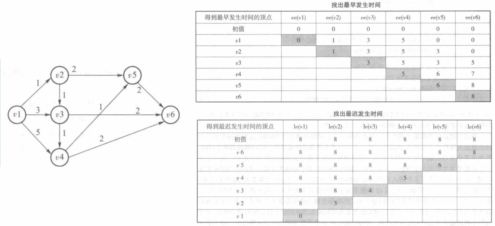

```cpp
template<class TypeOfVer, class TypeOfEdge>
void adjListGraph<TypeOfVer, TypeOfEdge>::criticalPath() const {
    TypeOfEdge *ee = new TypeOfEdge[Vers], *le = new TypeOfEdge[Vers];
    int *top = new int[Vers], *inDegree = new int[Vers];  // top 保存拓扑序列
    linkQueue<int> q;
    int i;
    edgeNode *p;

    // 找出拓扑序列，放入数组 top
    for (i = 0; i < Vers; ++i) {  // 计算每个结点的入度
        inDegree[i] = 0;
        for (p = verList[i].head; p != NULL; p = p->next)
            ++inDegree[p->end];
    }

    for (i = 0; i < Vers; ++i)  // 将入度为 0 的结点入队
        if (inDegree[i] == 0) q.enQueue(i);

    i = 0;
    while (!q.isEmpty()) {
        top[i] = q.deQueue();
        for (p = verList[top[i]].head; p != NULL; p = p->next) {
            if (--inDegree[p->end] == 0)
                q.enQueue(p->end);
            ++i;
        }
    }

    // 找最早发生时间
    for (i = 0; i < Vers; ++i) ee[i] = 0;
    for (i = 0; i < Vers; ++i) {  // 找出最早发生时间存于数组 ee
        for (p = verList[top[i]].head; p != NULL; p = p->next) {
            if (ee[p->end] < ee[top[i]] + p->weight)
                ee[p->end] = ee[top[i]] + p->weight;
        }
    }

    // 找最晚发生时间
    for (i = 0; i < Vers; ++i) le[i] = ee[Vers - 1];
    for (i = Vers - 1; i >= 0; --i) {  // 找出最晚发生时间存于数组 le
        for (p = verList[top[i]].head; p != NULL; p = p->next) {
            if (le[p->end] - p->weight < le[top[i]])
                le[top[i]] = le[p->end] - p->weight;
        }
    }

    // 找出关键路径
    for (i = 0; i < Vers; ++i) {
        if (le[top[i]] == ee[top[i]]) {
            cout << "(" << verList[top[i]].ver << ", " << ee[top[i]] << ")";
        }
    }
}
```