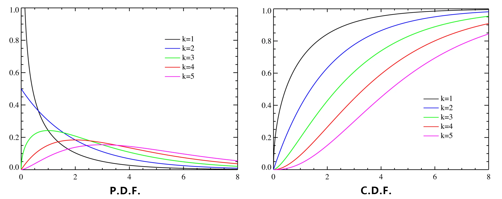

# 第一章 随机事件和概率
## 随机事件和运算
### 随机试验与随机事件
#### 随机试验

- **随机试验**， 简称**试验** $E$
- **性质**：
    - 可在相同条件下重复进行
    - 所有可能结果不止一个， 且在试验前已知
    - 每次试验结果应在已知所有可能结果中， 且事先无法预知

#### 随机事件
- 试验的每个可能的结果为**随机事件**， 简称**事件**
    - 用大写字母表示
- **必然事件** $\it\Omega$
    - 每次试验必然出现的结果
- **不可能事件** $\it\Phi$
    - 每次试验必然不出现的结果
- **基本事件** / **样本点** $\omega， \nu， \tau， \cdots$
    - 一个试验中最简单的单一事件
    - 非无穷， 无穷可数， 无穷不可数

#### 样本空间 $\mathit\Omega/S$
- 所有样本点组成的集合
- 随机事件是样本空间的子集
	- 样本点在事件 $A$ 内， $\omega\in A$， 称事件 $A$ **发生**
	- 否则 $\omega\not\in A$， 称事件 $A$ 不发生
- 由于每次试验中 $\it\Omega$ 必然发生， 因此是必然事件
- 空集 $\it\Phi$ 不包含任何样本点， 每次试验必不发生，因此是不可能事件

### 随机事件关系与运算
#### 关系
- **包含关系**
    - 事件 $B$ 发生， 必然导致事件 $A$ 发生， 事件 $B$ 包含于事件 $A$， 事件 $A$ 包含事件 $B$
    - $B\subset A， A\supset B$
- **相等关系**
    - 若 $B\subset A$ 且 $A\supset B$， 则称事件 $A$ 与 $B$ 相等
    - $A = B$

#### 运算
- 事件的**并**
    - 使得事件 A 与 B 中至少有一个发生的事件， 这个事件称为 $A$ 与 $B$ 的**并**
    - $A \cup B = \{\omega\ |\ \omega\in A \vee \omega \in B\}$
- 事件的**交**
    - 使得事件 A 与 B 同时发生的事件， 这个事件称为 $A$ 与 $B$ 的**交**
    - $A\cap B = \{\omega\ |\ \omega\in A \wedge \omega \in B\}$
    - 符号可省略， 读作 A 乘 B
- 事件的**差**
    - 使得 A 发生而 B 不发生的事件， 这个事件称为 $A$ 与 $B$ 的**差**
    - $A - B = \{\omega\ |\ \omega \in A \wedge \omega \not\in B\}$
- **对立事件**
    - 所有不属于事件 A 的基本事件组成的事件， 称为事件 A 的对立事件
    - $\overline{A} = \{\omega\ |\ \omega \in \mathit\Omega \wedge \omega \not\in A\}$
    - 事件与对立事件
        - $A\cup A=\mathit\Omega$
        - $A\overline{A} = \varnothing$
        - $\overline{\overline{A}} = A$
        - $A - B = A\ \overline{B}$
        - 必然事件与不可能事件互斥
- **互不相容**
    - 若 $A\ B = \varnothing$， 称事件 $A$ 与 $B$ **互不相容**或**互斥**
    - 若 $n$ 个事件两两交集为空， 则 **$n$ 个事件互不相容**
    - 互为对立的两事件必为互不相容， 反之未必成立
    - 两事件互不相容， 则两事件的并读作加， $A\cup B = A + B$

#### 运算规律
- **交换律**
    $$
    \begin{aligned}
    A\cup B &= B\cup A\\
    AB&=BA
    \end{aligned}$$
- **结合律**
    $$
    \begin{aligned}
    (A\cup B)\cup C &= A\cup(B\cup C)\\
    (AB)C &= A(BC)
    \end{aligned}
    $$
- **分配律**
    $$
    \begin{aligned}
    A\cup(BC) &= (A\cup B)(A\cup C)\\
    A(B\cup C) &= (AB)\cup(AC)
    \end{aligned}
    $$
- **对偶律** (De Morgan 定理)
    - 对于两事件
        $$
        \begin{aligned}
        \overline{A \cup B} &= \overline{A}\ \overline{B}\\
        \overline{AB} &= \overline{A}\cup\overline{B}
        \end{aligned}
        $$
    - 对于 $n$ 个或无穷事件
        $$
        \overline{\bigcup_{i=1}^nA_i}
        $$
- **运算顺序**：对立 > 交 > 并 & 差， 括号优先

## 概率
### 概率的定义
- 随机事件 $A$ 发生可能性大小的数值度量， 称为 $A$ 的**概率**，记为 $P(A)$
- 设 $E$ 是一个随机试验， $\it \Omega$ 是它的样本空间， 对于 $E$ 的每个事件 $A$ 赋予一个实数， 记为 $P(A)$， 若 $P(\ \cdot\ )$ 满足以下公理：
    1. **非负性**：
        - 对于每一个事件 $A$， 有 $P(A)\ge 0$
    2. **规范性**
        - 对于必然事件 $\it\Omega$， 有 $P(\it \Omega)=1$
    3. **可列可加性**
        - 对于两两互不相容的事件 $A_1， A_2， \cdots， A_n， \cdots$， 即 $A_iA_j=\varnothing，i\neq j，i，j=1，2，\cdots$， 有 $$P\left(\bigcup_{i=1}^{+\infty}A_i\right)=\sum_{i=1}^{+\infty}P(A_i)$$ 则称 $P(A)$ 为事件 $A$ 的**概率**

### 频率的定义
- 如果事件 $A$ 在 n 次重复试验中发生了 m 次， 则称比值 $\dfrac mn$ 为在这 n 次重复试验中事件 A 发生的**频率**， 记为
    $$
    f_n(A)=\frac mn
    $$
- **性质**：
    1. 对于任意事件 A， $0\le f_n(A)\le 1$
    2. $f_n(\mathit\Omega) = 1$
    3. 若事件 $A_1，A_2，\cdots，A_n$ 两两互不相容， 则
        $$
        f_n\left(\bigcup_{i=1}^{+\infty}A_i\right)=\sum_{i=1}^{+\infty}f_n(A_i)$$

### 统计概率
- 设随机试验 A 在 n 次重复试验中发生了 m 次. 当 n 很大时， 频率 $f_n(A) = \dfrac mn$ 稳定在某一数值 $p\ (0<p<1)$ 附近波动， 且随着次数增大， 波动幅度越来越小，则称数值 p 为事件 A 的 **(统计) 概率**

### 古典概率
- **定义**：满足以下条件：
    - 样本空间包含**有限个样本点**， $\mathit\Omega = \{\omega_1，\omega_2，\cdots，\omega_N\}$
    - 每个样本点的发生是**等可能**的， $P(\omega_1)=P(\omega_2)=\cdots=P(\omega_N)$
- 样本空间为必然事件， $P(\mathit\Omega)=1$， 则有
    $$
    P\{\omega_i\}=\frac1N
    $$
- 事件 $A=\{\omega_{i_1}，\omega_{i_2}，\cdots，\omega_{i_M}\}$ 的概率为
    $$
    P(A)=\frac {M}{N} = \frac{A\ 包含样本点个数}{\mathit\Omega\ 中样本点的总数}
    $$

### 几何概型
- **定义**：满足以下条件：
    - 样本空间中每个样本点与一个测度有限的几何区域中的点一一对应;
    - 任意事件 $A$ 与区域 $S$ 的一个子区域 $G$ 对应， A 的概率 $P(A)$ 仅与 G 的测度成正比， 与 G 的形状与在 S 中的位置无关，即
        $$
        P(A)=\frac{m(G)}{m(S)}
        $$ 其中 $m(\ \cdot\ )$ 表示区域的测度

### 概率基本性质
1. $$P(\varnothing) = 0$$
2. **有限可加性**：$n$ 个事件 $A_1， A_2， \cdots， A_n$ 满足 $A_iA_j = \varnothing$，
    $$
    P\left(\bigcup_{i=1}^{n}A_i\right)=\sum_{i=1}^{n}P(A_i)
    $$
3. **对立事件**：对于任意事件，
    $$
    P(\overline A)=1-P(A)
    $$
4. **单调不减性**：对于任意两个事件 $A，B$， 若 $A\subset B$， 则有
    $$
    P(B-A) = P(B)-P(A)， P(B)\ge P(A)
    $$
5. **加法定理**：对于任意两个事件 $A，B$，
    $$
    P(A\cup B) = P(A) + P(B) - P(AB)
    $$

    一般地， 对于 $n$ 个事件 $A_1， A_2， \cdots， A_n$，
    $$
    P\left(\bigcup_{i=1}^{n}A_i\right)=\sum_{i=1}^{n}P(A_i)-\sum_{1\le i<j\le n}P(A_iA_j)+\sum_{1\le i<j<k\le n}P(A_iA_jA_k)+\cdots+(-1)^{n-1}P(A_1A_2\cdots A_n)
    $$

    右侧共 $\sum\limits_{k=1}^nC_k^n = 2^n-1$ 项
6. **事件差**：
    $$
    P(B-A) = P(B) - P(AB)
    $$

## 条件概率
- 定义：设 A， B 为两事件， $P(A)>0$， ，则事件 A 发生的条件下事件 B 发生的条件概率为 $$P(B\ |\ A) = \frac{P(AB)}{P(A)}$$
- 当 $B\subset A$ 时，$$P(B\ |\ A) = \frac{P(AB)}{P(A)} = \frac{P(B)}{P(A)}\ge P(B)$$

### 乘法公式
$$
\begin{aligned}
P(AB) &= P(A)\ P(B\ |\ A)\quad(P(A)>0)\\
&=P(B)\ P(A\ |\ B)\quad(P(B)>0)
\end{aligned}
$$

推广：

$$
P(A_1A_2\cdots A_n) = P(A_1)\ P(A_2\ |\ A_1)\cdots P(A_n\ |\ A_1A_2\cdots A_{n-1})\quad(P(A_1A_2\cdots A_{n-1})>0)
$$

### 全概率公式
若事件 $B_1， B_2，\cdots， B_n$ 满足

$$
\bigcup_{i=1}^nB_i = \mathit \Omega， B_iB_j = \varnothing
$$

称上述事件组为**完备事件组**， 或样本空间 $\it \Omega$ 的一个**划分**

若事件 $A$ 落在样本空间内， 与划分中的任意一个 $B_i$ 都有可能有交集， 则事件 $A$ 的概率与划分有关

$$
A = \bigcup_{i=1}^nAB_i，(AB_i)(AB_j) = \varnothing
$$

则 $P(A)$ 的概率可由全概率公式给出

$$
P(A) = \sum_{i=1}^n P(AB_i) = \sum_{i=1}^n P(B_i)\cdot P(A\ |\ B_i)
$$

- 对于 $A$ 的全体的概率被分解为多个部分之和
- 事件 $A$ 的发生由原因 $B_i$ 引起， 则 $P(AB_i) = P(B_i)\ P(A\ |\ B_i)$， 事件 $A$ 的全体为所有原因的总和

### Bayes 公式
在事件 $A$ 已发生的条件下， 求导致 $A$ 发生的每个原因的概率， 可由 Bayes 公式求出

$$
\begin{aligned}
P(B_k\ |\ A) = \dfrac{P(AB_k)}{P(A)} &= \dfrac{P(B_k)\ P(A\ |\ B_k)}{P(A)} \\
&= \dfrac{P(B_k)\ P(A\ |\ B_k)}{\displaystyle\sum\limits_{i=1}^nP(B_i)\ P(A\ |\ B_i)}
\end{aligned}
$$

- $P(B_i)$ 先验概率
	- 由以往经验得到
- $P(B_i\ |\ A)$ 后验概率
	- 得到信息：$A$ 发生的概率后， 对 $A$ 发生的原因的可能性大小进行修正

## 事件的独立性
- **定义**：任意两个事件 $A， B$， 若满足 $$P(AB) = P(A)\ P(B)$$ 则称事件 A 与事件 B 相互独⽴， 简称 A 与 B **独⽴**，即 $$P(A\ |\ B) = P(A) = P(A\ |\ \overline B)$$

- **推广**：若事件 $A_1，A_2，A_3$ 满足
    $$
    \begin{aligned}
    &\begin{cases}
    P(A_1A_2) = P(A_1)\ P(A_2)\\
    P(A_1A_3) = P(A_1)\ P(A_3)\\
    P(A_2A_3) = P(A_2)\ P(A_3)
    \end{cases}\\
    &P(A_1A_2A_3) = P(A_1)\ P(A_2)\ P(A_3)
    \end{aligned}
    $$

    则称三个事件**相互独立**

- **辨析**：**两两独立**与**相互独立**

- **性质**
    - 对称性：两事件相互独立是相互对称的
    - $P(A)>0$， 则 $P(B) = P(B\ |\ A)$
    - $P(B)>0$， 则 $P(A) = P(A\ |\ B)$
    - 若 $P(A)， P(B)>0$， 则 “相互独立” 与 “互斥” **不能同时成立**
        - 若互斥则一个发生另一个必不发生
    - 若四对事件 $A，B;A，\overline B; \overline A， B;\overline A， \overline B$ 任意一对事件相互独立， 则其余三对也分别相互独立
    - 若 $n$ 个事件相互独立， 则将这 $n$ 个事件任意分成 $k$ 组， 同一事件不能同时属于两个不同的组， 则对**每组的事件进行求和、积、差、对立等运算**所得到的 $k$ 个事件**也相互独立**

### 利用独立事件的性质计算并事件的概率
若 $A_1， A_2，\cdots， A_n$ 相互独立， 则
$$
P\left(\bigcup_{i = 1}^nA_i\right) = 1 - \prod_{i = 1}^n(1 - P(A_i))
$$

当 $P(A_i) = p$，
$$
P\left(\bigcup_{i = 1}^nA_i\right) = 1-(1-p)^n
$$

### 伯努利试验概型
$n$ 重伯努利试验概型：

- 重复试验 $n$ 次
- 每次试验只有两种可能的结果 $A，\overline A$
- 每次试验的结果与其它次试验无关：$n$ 次试验是相互独立的

事件 $A$ 出现 $k$ 的概率， 记为 $P_n(k)$，若 $P(A)= p， 0<p<1$

$$
P_n(k) = \mathrm C_n^k\ p^k\ (1-p)^{n-k}，\quad k=0，1，2，\cdots，n
$$

# 第二章 随机变量及其分布
## 随机变量及其分布函数

### 随机变量
- **定义**：设随机试验的样本空间是 $\mathit \Omega$， 若 $\forall\omega\in\mathit\Omega$， 按⼀定的法则， 存在⼀个实数 $X(\omega)$ 与之对应， 则称 $\mathit\Omega$ 上的实值单值函数 $X(\omega)$ 为**随机变量**

- $X$ 为 $\mathit\Omega\to\mathbb R$ 的一个映射
    - 定义域为样本空间
    - 随机性：可能取值不止一个， 试验前只知道所有可能取值， 但不知道具体哪一个
    - 概率特性：随机变量以一定概率取某个值或某些值

### 随机变量的分布函数
- **定义**：设 $X$ 为一随机变量， 对于任意实数 $x$， 则 $X$ 的**分布函数**为：
    $$
    F(x) = P\ (X\le x)，\quad-\infty<x<+\infty
    $$

    有时记作 $F_X(x)$

- **性质**：
    - $F(x)$ 单调不减
        $$\forall x_1<x_2， F(x_1)\le F(x_2)$$
    - $0\le F(x) \le 1$， 且 
        $$\lim_{x\to+\infty}F(x) = 1，\lim_{x\to-\infty}F(x) = 0$$

- **用分布函数表示概率**
    $$
    \begin{aligned}
    P(X\le x_0) &= F(x_0)\\
    P(X<x_0) &=\lim_{\Delta x\to0_+}P(X\le x_0-\Delta x)\\
    &=\lim_{\Delta x\to0_+}F(x_0-\Delta x)\\
    &=F(x_0-0)\\
    P(X=x_0) &= F(x_0) - F(x_0-0)\\
    P(a<X\le b) &= F(b) - F(a)
    \end{aligned}
    $$

## 离散型随机变量及其分布律
### 离散型随机变量概率分布
- **定义**：随机变量 $X$ 的可能取值是有限个或可列无穷多个
- **分布律**：设离散型随机变量 $X$ 的所有可能取值为 $X=x_k\ (k=1，2，\cdots)$， 不妨设 $x_1<x_2<\cdots$， 则 $X$ 的分布律为
$$P(X=x_k) = p_k，\ k = 1，2，\cdots$$
- **性质**：
    1. $$p_k\ge0， \ k = 1，2，\cdots$$
    2. $$\sum_{k=1}^{+\infty}p_k = 1$$

- **分布函数**：
    - $$F(x) = P(X\le x)=\sum_{x_k\le x}P(X=x_k)$$
    - $$P(X = x_k) = p_k = P(x_{k-1}<X\le x_k) = F(x_k) - F(x_{k-1})$$
    - $F(x)$ 为分段阶梯函数
    - 在 $X$ 的可能取值处存在第一类跳跃间断点

### 常见离散型随机变量
#### 0-1分布 (两点分布)
随机变量只有两个可能取值， 分布律由下表所示
$$
\begin{array}{c|cc}
\hline
\quad X\quad &\quad 1\quad &\quad 0\quad\\
\hline
P&p&1-p\\
\hline
\end{array}$$

其中 $0<p<1$， 称 $X$ 服从参数为 $p$ 的 **0-1分布**

也可写成
$$
P(X=k)=p^k\ (1-p)^{1-k}，\ k = 0，1
$$

#### 二项分布 (伯努利概型)
- **$n$ 重 Bernoulli 试验**：
    1. 可独立地进行 $n$ 次 (可能性互不影响)
    2. 每次试验的结果仅两个， $A$ 和 $\overline A$

    对应的概型为 **Bernoulli 概型**

- $n$ 重 Bernoulli 试验中， 设一次试验中事件 $A$ 发生的概率为 $P(A) = p\ (0<p<1)$， 则事件 $A$ 发生次数 $X$ 的分布律为
    $$
    P(X=k) = \mathrm C_n^k\ p^k\ (1-p)^{n-k}， \ k = 0， 1， \cdots， n
    $$

- 称 $X$ 服从参数为 $(n，p)$ 的**二项分布**， 记为 $X\sim B(n，p)$
    $$
    P(X>N) = \sum_{k = N+1}^nP(X = k)
    $$

- **超几何分布的极限分布是二项分布**

#### 负二项分布 (Pascal 分布)
进行一个试验直到成功 $r$ 次， 试验进行了 $k$ 次的分布律
$$
P(X=k) = \mathrm C_{r-1}^{k-1}\ p^r\ (1-p)^{k-r}，\ k = r， r+1， \cdots
$$

#### 几何分布
当 $r = 1$， 有几何分布 $X\sim G(p)$
$$
P(X=k) = (1-p)^{k-1}\ p，\ k = 1，2，\cdots
$$

- 求出最可能出现的次数
    $$
    \begin{cases}
    \dfrac{P_{k-1}}{P_k} = \dfrac{(1-p)\ k}{p\ (n-k+1)}\le1，\\
    \dfrac{P_k}{P_{k+1}} = \dfrac{(1-p)\ (k+1)}{p\ (n-k)}\ge1，
    \end{cases}
    \implies(n+1)\ p-1\le k \le (n+1)\ p
    $$

#### Poisson 分布
- **Poisson 定理**：设 $\lim\limits_{n\to+\infty}np_n = \lambda > 0$， 则
    $$
    \lim_{n\to+\infty}\mathrm C_n^k\ p_n^k\ (1-p_n)^{n-k} = \mathrm e^{-\lambda}\ \dfrac{\lambda^k}{k!}，\ k = 0， 1， 2， \cdots
    $$

- **推论**：假设 $np_n = \lambda>0\ (n=1，2，\cdots)$， 则上述公式仍成立

- 二项分布的极限分布是 Poisson 分布：当二项分布 $n$ 较大而 $p$ 较小时 ($n\ge20， p\le0.05$)， 有如下近似
    $$
    P(X>N) = \sum_{k = N+1}^nP(X = k)\approx\sum_{k=N+1}^\infty\mathrm e^{-np}\dfrac{(np)^k}{k!} = 1 - \sum_{0}^{N}\mathrm e^{-np}\dfrac{(np)^k}{k!}
    $$

- **Poisson 分布**：设随机变量 $X$ 的所有可能取值为 $0，1，2，\cdots$， 且分布律为
    $$
    P(X=k) = \mathrm e^{-\lambda}\ \dfrac{\lambda^k}{k!}，\ k = 0，1，2，\cdots
    $$

    其中 $\lambda>0$，称 $X$ 服从参数为 $\lambda$ 的 **Poisson 分布**， 记为 $X\sim P(\lambda)$ 或 $\pi(\lambda)$

## 连续型随机变量及其概率密度
### 连续性随机变量的概率密度
- **定义**：设 $X$ 是⼀随机变量， $F(X)$ 是它的分布函数， 若存在一个非负可积函数 $f(x)$ 使得
    $$
    F(x) = \int_{-\infty}^xf(t)\ \mathrm dt，-\infty<x<+\infty
    $$

    则称 $X$ 为**连续型随机变量**， $f(x)$ 为它的**概率密度函数** (**概率密度/密度函数**)， $f(x)$ 可记为 $f_X(x)$
- 分布函数连续
- 对于一个随机变量 $X$， 概率密度 $f(x)$ 不唯一， 允许其在有限或者可列无穷多个点处的函数值不同
-  **性质**
    1. 非负性 $f(x)\ge0$
    2. 规范性 $\displaystyle \int_{-\infty}^{+\infty}f(x)\ \mathrm dx = F(+\infty) = 1$
    3. 在 $f(x)$ 的连续点 $x$ 处， 有 $f(x) = F'(x)$
    4. $f(x)$ 描述了 $X$ 在 $x_0$ 附近单位长度的区间内取值的概率， 即 $P(x_0<X\le x_0+\Delta x)\approx f(x_0)\ \Delta x$
    5. 若 $a$ 是随机变量 $X$ 的⼀个可能的取值， 则 $P(X = a) = 0$
    6. 对任意实数 $a，b\ (a<b)$， 有
    $$\begin{aligned}
    P(a < X \le b) &= P(a \le X \le b) = P(a < X < b)\\
    &= P(a\le X < b) = \int_a^bf(x)\ \mathrm dx\\
    P(X\le b) &= P(X<b) = \int_{-\infty}^bf(x)\ \mathrm dx\\
    P(X>a) &= P(X\ge a) = \int_a^{+\infty}f(x)\ \mathrm dx
    \end{aligned}
    $$

### 常见连续型随机变量的分布
#### 均匀分布
$X$ 服从区间 $(a，b)$ 上的**均匀分布**， 记为 $X\sim U(a，b)$

- **密度函数**
$$
f(x) = \begin{cases}\dfrac{1}{b-a}，&a<x<b，\\0，&\rm otherwise.\end{cases}
$$

- **分布函数**
$$
F(X) = \begin{cases}0， &x<a，\\\dfrac{x-a}{b-a}，&a\le x<b，\\1，&x\ge b.\end{cases}
$$

#### 指数分布
$X$ 服从参数为 $\lambda$ 的**指数分布**， 记为 $X\sim E(\lambda)$

- **密度函数**
$$
f(x) = \begin{cases}\lambda\ \mathrm e^{-\lambda\ x}，&x>0，\\0，&x\le 0.\\\end{cases}
$$

- **分布函数**
$$
F(x) = \begin{cases}0，&x<0，\\1-\mathrm e^{-\lambda\ x}，&x\ge 0.\end{cases}
$$

- 对任意 $0<a<b$，
$$
P(a<X<b) = \mathrm e^{-\lambda a} - \mathrm e^{-\lambda b}
$$

- 指数分布的**无记忆性**：若 $X\sim E(\lambda)$，则已经用了 $s$ 小时， 还能用 $t$ 小时的概率为
    $$
    P(X>s+t\ |\ X>s) = P(X>t)
    $$
- 泊松分布与指数分布关系：一段时间内顾客来的概率服从泊松分布， 则时间间隔服从指数分布

#### 正态分布 (Gaussian 分布)
$X$ 服从参数为 $\mu，\sigma$ 的**正态分布**， 记为 $X\sim N(\mu， \sigma^2)$

- **密度函数**
$$
f(x) = \dfrac{1}{\sqrt{2\pi}\ \sigma}\exp (-\dfrac{(x-\mu)^2}{2\sigma^2})，\quad-\infty<x<+\infty
$$

- **性质**
    1. 直线关于 $x=\mu$ 对称：$f(\mu + x) = f(\mu - x)$
    2. 最大值 $f(\mu) = \dfrac{1}{\sqrt{2\pi}\ \sigma}$ 
    3. 渐近线 $x$ 轴
    4. 拐点 $x=\mu\pm\sigma$
    5. $\sigma$ **形状参数**
        - 与曲线陡峭程度成反比
        - 与数据分散程度成正比
    6. $\mu$ **位置参数**
        - 对称轴的位置

#### 标准正态分布
$X^*\sim N(0，1)$ 为**标准正态分布**

- **密度函数**
$$
\varphi(x) = \dfrac{1}{\sqrt{2\pi}}\ \mathrm e^{-\frac{x^2}{2}}，\quad-\infty<x<+\infty
$$

- **分布函数**
$$
\mathit\Phi(x) = \dfrac{1}{\sqrt{2\pi}}\int_{-\infty}^x\mathrm e^{-\frac{t^2}{2}}\ \mathrm dt，\quad-\infty<x<+\infty
$$

- **性质**：
    - $\mathit\Phi(-x) = 1-\mathit\Phi(x)$
    - $P(|\ X^*\ |\le a) = 2\ \mathit\Phi(a)-1$
    - 一般正态分布可以由线性变换 $Y=\dfrac{X-\mu}{\sigma}$ 转化为标准正态分布：若 $X\sim N(\mu， \sigma^2)$， 则 $X^* = \dfrac{X-\mu}{\sigma}$
    - 一般正态分布概率的计算可以转化为标准正态分布的概率来计算：若 $X\sim N(\mu， \sigma^2)$， 则 $F(x) = \mathit\Phi\left(\dfrac{x-\mu}{\sigma}\right)$

## 随机变量函数的分布
### 离散型随机变量函数的分布
1. 列出 $X$ 的分布律
2. 直接由 $X$ 的取值确定 $Y= g(X)$ 的全部可能取值
3. 直接由 $P(X_i)$ 得到 $P(Y_i = g(X_i))$， 于是有 $Y$ 的分布律

### 连续型随机变量的分布
1. 由分布函数定义 $F_Y(y) = P(Y \le y) = P(g(X) \le y)$
2. 对上式变换， $=P(X \le g^{-1}(y)) = F(g^{-1}(y))$
	- 这里有可能会有平方， 变成 $P(X^2 \le y) = P(-\sqrt y \le X \le \sqrt y)$
3. 将 $g^{-1}(y)$ 作为自变量代入 $F(x)$， 得到上式左边的 $F_Y(y)$
4. 对 $F_Y(x)$ 求导得到 $y$ 的密度函数 $f_Y(x)$

### 一般性定理
设随机变量 $X$ 具有概率密度 $f_X(x)，-\infty < x < +\infty$，$g(x)$ 为 $(-\infty， +\infty)$ 内的严格单调的可导函数，则随机变量 $Y = g(X)$ 的概率密度为
$$
f_Y(y) = \begin{cases}|\ h'(y)\ |\cdot f_X[\ h(y)\ ]，&\alpha<y < \beta，\\0，&\text{otherwise.}\end{cases}
$$

其中：

- $h(y)$ 是 $g(x)$ 的反函数
- $\alpha = \min\{g(-\infty)， g(+\infty)\}， \beta = \max\{g(-\infty)， g(+\infty)\}$

# 第三章 多维随机变量及其分布
## 二维随机变量

### 二维随机变量及其联合分布函数
- **定义**：设 $E$ 是⼀个随机试验，$\mathit \Omega$ 是其样本空间，若对 $\mathit \Omega$ 中的任意⼀个样本点 $\omega$ 按照⼀定的对应法则，存在⼀对实数 $X(\omega)，Y(\omega)$ 与之对应，简记为 $(X，Y)$，称之为**二维随机变量**

- **联合分布函数**：
    $$
    F(x，y) = P(\{X\le x\}\cup \{Y\le y\}) = P(X\le x，Y\le y)
    $$

- **性质**
    1. $0\le F(x，y)\le 1$，对于任意固定的 $x，y$，有
        $$
        F(-\infty，y) = 0，F(x，-\infty) = 0，F(-\infty，-\infty) = 0，F(+\infty，+\infty) = 1
        $$
    2. 对 $F(x，y)$ 固定其中⼀个变量，它关于另⼀个变量是单调不减的函数
    3. 对 $F(x，y)$ 固定其中⼀个变量，它关于另⼀个变量是右连续函数
        $$
        F(x+0，y) = F(x，y)，\quad F(x，y+0) = F(x，y)
        $$
    4. 对任意实数 $a<b，c<d$，(图形为一个矩形)
        $$
        F(b，d) - F(a，d)-F(b，d) + F(a，c) = P(a<X\le b，c<Y \le d)\ge0
        $$
    5. 对于平面右上角的一块无穷区域 $\bf I$，计算概率时应当将整个平面减去三个区域 $\bf II，III，IV$
        $$
        \begin{aligned}
        P(X> a，Y>c) &= P(a<X<+\infty，c<y<+\infty)\\
        &=1-F(+\infty，c) - F(a，+\infty)+F(a，c)\\
        &\neq 1- F(a，c)
        \end{aligned}
        $$

- **边缘分布函数**：设⼆维随机变量 $(X，Y)$ 的分布函数为 $F(x，y)$，分量 $X$ 和 $Y$ 也都是随机变量，各⾃的分布函数分别记为 $F_X(x)，F_Y(y)$，并依次称为随机变量 $(X，Y)$ 关于 $X，Y$ 的**边缘分布函数**
    $$
    \begin{aligned}
    F_X(x) &= P(X\le x) = F(x，+\infty)\\
    F_Y(y) &= P(Y\le y) = F(+\infty，y)
    \end{aligned}
    $$

### 二维离散型随机变量
- **定义**：随机变量 $(X，Y)$ 在⼆维平⾯上所有可能的取值为有限对或可列无穷对，则称 $(X，Y)$ 为 **⼆维离散型随机变量**
- 设⼆维随机变量 $(X，Y)$ 的所有可能取值为 $(x_i，y_i)，i，j = 1，2，\cdots$，则称 $P(X=x_i，Y=y_i)=p_{ij}，i = j = 1，2，\cdots$ 为⼆维离散型随机变量 $(X，Y)$ 的**联合分布律**或联合分布列，简称为**分布律**

$$
\begin{array}{c|c|c}
\hline P_{ij}&
\begin{array}{ccccc}&&X\\
\hline \ x_1&\ x_2\ &\cdots &\ x_i\ &\cdots
\end{array}
&P_{\bullet j} = \displaystyle\sum_i p_{ij}\\
\hline
\begin{array}{c|c}&\;\;\;y_1\\&\;\;\;y_2\\Y\ \ \ &\;\;\;\vdots\\&\;\;\;y_j\\&\;\;\;\vdots\\
\end{array}
&\begin{array}{ccccc}
p_{11}&p_{21}&\cdots&p_{i1}&\cdots\\
p_{12}&p_{22}&\cdots&p_{i2}&\cdots\\
\vdots&\vdots&&\vdots&\\
p_{1j}&p_{2j}&\cdots&p_{ij}&\cdots\\
\vdots&\vdots&&\vdots&\\
\end{array}
&\begin{array}{c}
p_{\bullet1}\\p_{\bullet2}\\\vdots\\p_{\bullet j}\\\vdots
\end{array}\\
\hline
p_{i\bullet} = \displaystyle\sum_{j} p_{ij}&
\begin{array}{ccccc}
p_{1\bullet}&p_{2\bullet}&\cdots &p_{i\bullet} &\cdots
\end{array}&
\displaystyle\sum_i\sum_j p_{ij} = 1\\
\hline
\end{array}$$

- **性质**：若某数列满足下列性质，则可以作为某个二维离散型随机变量的分布律
    - 非负性
    $$p_{ij}\ge 0\ (i，j = 1，2，\cdots)$$
    - 规范性
    $$\sum_i\sum_jp_{ij} = 1$$

#### 由分布律求分布函数
⼆维离散型随机变量的分布函数与分布律互为确定
$$
(x，y) = \sum_{x_i\le x}\sum_{y_j\le y}p_{ij}
$$

#### 二维离散型随机变量的边缘分布律
以下分别为 $(X，Y)$ 关于 $X$ 和 $Y$ 的**边缘分布律**
$$
\begin{aligned}
P(X= x_i) &= \sum_j p_{ij} \xlongequal{记为} p_{i\bullet}，\ i=1，2，\cdots\\
P(Y= y_j) &= \sum_i p_{ij} \xlongequal{记为} p_{\bullet j}，\ j=1，2，\cdots
\end{aligned}
$$

### 二维连续型随机变量
- **分布函数**：**⼆维连续型随机变量** $(X，Y)$ 的分布函数 $F(X，Y)$ 为 $(X，Y)$ 的联合概率密度函数 $f(x，y)$ (⼆元⾮负可积函数) 的二重积分
    $$
    F(x，y) = \int_{-\infty}^x\int_{-\infty}^yf(u，v)\ \mathrm du\ \mathrm dv
    $$

- **性质**：
    1. 非负性
        $$f(x，y)\ge 0，\quad(x，y)\in\mathbb R^2$$
    2. 规范性
        $$\int_{-\infty}^{+\infty}\int_{-\infty}^{+\infty}f(x，y)\ \mathrm dx\ \mathrm dy = 1$$
    3. 样本点落在任一区域 $D$ 的概率
        $$P((X，Y)\in D) = \iint\limits_D f(x，y)\ \mathrm dx\ \mathrm dy$$
    4. 根据分布函数求概率密度函数 $f(x，y)$ 连续点处
        $$\dfrac{\partial^2F}{\partial x\ \partial y} = f(x，y)$$

- **边缘概率密度**：已知联合分布可以求得边缘分布，反之不能确定
    $$
    \begin{aligned}
    f_X(x) &= \int_{-\infty}^{+\infty}f(x，y)\ \mathrm dy\\
    f_Y(y) &= \int_{-\infty}^{+\infty}f(x，y)\ \mathrm dx\\
    \end{aligned}
    $$

#### 常用连续型二维随机变量分布
##### 均匀分布
连续型随机变量 $(X，Y)$ 服从二维有界区域 $G$ 上的**均匀分布**，记为 $(X，Y)\sim U(G)$， 则其概率密度函数为
$$
f(x，y) = \begin{cases}\dfrac{1}{A_G}，&(x，y)\in G，\\0，&\text{otherwise}.\end{cases}
$$

- $A_G$ 为 $G$ 的面积

##### 二维正态分布
连续型随机变量 $(X，Y)$ 服从二维有界区域 $G$ 上的**二维正态分布**， 记为 $(X，Y)\sim N(\mu_1，\sigma_1^2; \mu_2，\sigma_2^2; \rho)$， 则其概率密度函数为
$$
f(x，y)=\frac{1}{2 \pi \sigma_{1} \sigma_{2} \sqrt{1-\rho^{2}}} \exp \left\{-\frac{1}{2\left(1-\rho^{2}\right)}\left[\frac{\left(x-\mu_{1}\right)^{2}}{\sigma_{1}^{2}}-2 \rho \frac{\left(x-\mu_{1}\right)\left(y-\mu_{2}\right)}{\sigma_{1} \sigma_{2}}+\frac{\left(y-\mu_{2}\right)^{2}}{\sigma_{2}^{2}}\right]\right\}
$$

- 二维正态分布的边缘分布为两个独立的一维正态分布

## 二维随机变量的条件分布
### 二维离散型随机变量的条件分布
- **定义**：设有⼆维离散型随机变量 $(X，Y)$
    - 对于固定的 $j$，若 $P(Y = y_j)>0$，则**在 $\{Y = y_j\}$ 的条件下 $X$ 的条件分布律**为
        $$
        P(X = x_i\mid Y = y_j) = \dfrac{P(X = x_i，Y = y_j)}{P(Y = y_j)} = \dfrac{p_{ij}}{p_{\bullet j}}，\ i = 1，2，\cdots
        $$
        - $P(Y = y_j)$ 即边缘分布律：分布律表格中将 $Y = y_j$ 一列的概率全部相加
    - 对于固定的 $i$，若 $P(X = x_i)>0$，则**在 $\{X = x_i\}$ 的条件下 $Y$ 的条件分布律**为
        $$
        P(Y = y_j\mid X = x_i) = \dfrac{P(X = x_i，Y = y_j)}{P(X = x_i)} = \dfrac{p_{ij}}{p_{i\bullet}}，\ j = 1，2，\cdots
        $$
        - $P(X = x_i)$ 即边缘分布律：分布律表格中将 $X = x_i$ 一行的概率全部相加
- **性质**
    1. $$P(X = x_i\mid Y = y_j)\ge 0$$
    2. $$\displaystyle\sum_iP(X = x_i\mid Y = y_j) = \sum_i\dfrac{p_{ij}}{p_{\bullet j}} =\dfrac{1}{p_{\bullet j}}\sum_ip_{ij} = 1$$
    3. 乘法公式
        $$
        P(X = x_i，Y = y_j) = P(Y = y_j)\ P(X = x_i\mid Y = y_j) ，\ i，j = 1，2，\cdots
        $$
    4. 全概率公式
        $$
        P(X = x_i) = \sum_j P(Y = y_j)\ P(X = x_i\mid Y= y_j)，i = 1，2，\cdots
        $$

### ⼆维连续型随机变量的条件分布
- **定义**：设⼆维随机变量 $(X，Y)$ 的联合概率密度为 $f(x，y)$，$X，Y$ 的边缘概率密度分别为 $f_X(x)，f_Y(y)$
    - 当 $f_Y(y) > 0$ 时
        - **在 $\{Y = y\}$ 的条件下 $X$ 的条件概率密度**为
            $$
            f_{X\ |\ Y} (x\mid y) = \dfrac{f(x，y)}{f_Y(y)}，\quad -\infty<x<+\infty
            $$
        - **在 $\{Y = y\}$ 的条件下 $X$ 的条件分布函数**为
            $$
            F_{X\ |\ Y} (x\mid y) = \int_{-\infty}^x\dfrac{f(u，y)}{f_Y(y)}\ \mathrm du，\quad -\infty<x<+\infty
            $$
    - 当 $f_X(x) > 0$ 时
        - **在 $\{X = x\}$ 的条件下 $Y$ 的条件概率密度**为
            $$f_{Y\ |\ X} (y\mid x) = \dfrac{f(x，y)}{f_X(x)}，\quad -\infty<y<+\infty
            $$
        - **在 $\{X = x\}$ 的条件下 $Y$ 的条件分布函数**为
            $$
            F_{Y\ |\ X} (y\mid x) = \int_{-\infty}^y\dfrac{f(x，v)}{f_X(x)}\ \mathrm dv，\quad -\infty<y<+\infty
            $$
- **性质**：
    1. 类似乘法公式
        $$
        \begin{aligned}
        f(x，y) &= f_X(x)\ f_{Y\ |\ X} (y\mid x)\quad f_X(x)>0\\ 
        &= f_Y(y)\ f_{X\ |\ Y} (x\mid y)\quad f_Y(y)>0
        \end{aligned}
        $$
    2. 类似全概率公式
        $$
        \begin{aligned}
        f_X(x) &= \int_{-\infty}^{+\infty}f(x，y)\ \mathrm dy = \int_{-\infty}^{+\infty}f_{X\ |\ Y}(x\mid y)\cdot f_Y(y)\ \mathrm dy\\
        f_Y(y) &= \int_{-\infty}^{+\infty}f(x，y)\ \mathrm dx = \int_{-\infty}^{+\infty}f_{Y\ |\ X}(y\mid x)\cdot f_X(x)\ \mathrm dx
        \end{aligned}
        $$
    3. 类似 Bayes 公式
        $$
        \begin{aligned}
        f_{X \mid Y}(x \mid y)&=\dfrac{f(x，y)}{f_{Y}(y)}=\dfrac{f_{Y \mid X}(y \mid x) \cdot f_{X}(x)}{f_{Y}(y)} \\
        f_{Y \mid X}(y \mid x)&=\dfrac{f(x，y)}{f_{X}(x)}=\dfrac{f_{X \mid Y}(x \mid y) \cdot f_{Y}(y)}{f_{X}(x)}
        \end{aligned}
        $$

## 二维随机变量的独立性
- **定义**：相互独立的二维随机变量 $(X，Y)$ 对任意 $x，y$ 都有
    $$
    P(X \le x，Y \le y)=P(X \le x) P(Y \le y)
    $$
- **判定独立性**：
    - **离散型**：
        $$
        P(X = x_i，Y = y_j) = P(X = x_i)\cdot P(Y = y_j)
        $$
    - **连续型**：
        $$
        f(x，y) = f_X(x)\cdot f_Y(y)
        $$
- **独立性定理**：若联合概率密度分布函数 $f(x，y)$ 可以写成**两个函数的乘积**，即 $f(x，y) = r(x)\cdot g(y)$ ，则 $X，Y$ 相互独立，且有
    $$
    \begin{aligned}f_X(x) &= \dfrac{r(x)}{\displaystyle\int_{-\infty}^{+\infty}r(x)\ \mathrm dx}\\
    f_Y(y) &= \dfrac{g(y)}{\displaystyle\int_{-\infty}^{+\infty}g(y)\ \mathrm dy}
    \end{aligned}
    $$
- **性质**：
    1. 如果二维随机变量 $X，Y$ 相互独立，则有
    $$
    \begin{aligned}
    f_X(x) &= f_{X\ |\ Y}(x\mid y)，\quad f_Y(y)>0\\
    f_Y(y) &= f_{Y\ |\ X}(y\mid x)，\quad f_X(x)>0
    \end{aligned}
    $$
    2. **独立的二维随机变量的连续函数仍独立**：设 $X，Y$ 为相互独立的二维随机变量，$u(x)，v(y)$ 为连续函数，则 $U = u(X)，V = v(Y)$ 也相互独立

## 多维随机变量函数的分布
### 多维离散型随机变量函数的分布

设 $(X，Y)$ 的联合分布律为 $P(X = x_i，Y=y_j) = p_{ij}，(i，j = 1，2，\cdots)$，$z = g(x，y)$ 为一个二元函数，$Z = g(X，Y)$ 为随机变量 $(X，Y)$ 的函数。

假设 $Z$ 的全部不同取值记为 $z_k$，并且所有使得 $g(x，y) = z_k$ 的点记为 $(x_{i_k}，y_{j_k})$，即 $z_k = g(x_{i_k}，y_{j_k})$，则 $Z$ 的分布律：
$$
P(Z = z_k) = P(g(X，Y) = z_k) = \sum_{g(x_{i_k}，y_{j_k}) = z_k}P(X = x_{i_k}，Y =y_{j_k})，\ k = 1，2，\cdots
$$

- 特别地，当 $Z = X+Y$ 时，
    $$
    P(Z=r)=P(X+Y=r)=\sum_{i=0}^{r} P(X=i，Y=r-i)
    $$

- 进一步，当 $X$ 与 $Y$ 相互独立时，若 $P(X=k)=a_{k}，P(Y=k)=b_{k}，k=0，1，2，\cdots$，则 $Z = X+Y$ 的分布律满足**离散卷积公式**：
    $$
    P(Z=r)=\sum_{i=0}^{r} P(X=i) P(Y=r-i)=\sum_{i=0}^{r} a_{i} b_{r-i}
    $$

- **性质**：
    1. **Poisson 分布的可加性**：若随机变量 $X，Y$ **相互独立**，且都服从 Poisson 分布，即 $X\sim P(\lambda_1)，Y\sim P(\lambda_2)$，则**其和也服从 Poisson 分布**，即 
        $$
        X+Y\sim P(\lambda_1+\lambda_2)
        $$
    2. ⼆**项分布的可加性**：若随机变量 $X，Y$ **相互独立**，且都服从二项分布，即 $X\sim B(n，p)，Y\sim B(m，p)$，则**其和也服从二项分布**，即
        $$
        X+Y\sim B(n+m，p)
        $$

### 多维连续型随机变量函数的分布
设 $(X，Y)$ 的联合概率密度为 $f(x，y)$，$g(x，y)$ 是一个二元函数，令 $Z = g(X，Y)$，则 $Z$ 的分布函数：
$$
F_{Z}(z)=P(Z \le z)=P(g(X，Y) \le z)=\iint\limits_{g(x，y) \le z} f(x，y) \ \mathrm{d} x \ \mathrm{d} y
$$

若有非负可积函数 $f_Z(z)$，使得
$$
F_{Z}(z)=\int_{-\infty}^{z} f_{Z}(u) \ \mathrm{d} u
$$

则随机变量函数 $Z = g(X，Y)$ 的概率密度为
$$
f_Z(z) = F'_Z(z)
$$

#### 和的分布
和的分布：$Z = X + Y$
$$
f_Z(z) = \int_{-\infty}^{+\infty}f(x，z-x)\ \mathrm dx = \int_{-\infty}^{+\infty}f(z-y，y)\ \mathrm dy
$$

若 $X，Y$ 相互独立，则
$$
\begin{aligned}
f_Z(z) &= \int_{-\infty}^{+\infty}f_X(x)\cdot f_Y(z-x)\ \mathrm dx\\
&=  \int_{-\infty}^{+\infty}f_X(z-y)\cdot f_Y(y)\ \mathrm dy \xlongequal{\triangle}f_X * f_Y(z)
\end{aligned}
$$

函数 $f_Z(z)$ 称为称为函数 $f_X(x)$ 与 $f_Y(y)$ 的**卷积**

#### 线性函数的分布 $Z=a X+b Y+c$
更一般地，设 $Z=a X+b Y+c$，$a，b，c$ 为常数，$a，b\neq0$，
$$
f_{Z}(z)=\frac{1}{|b|} \int_{-\infty}^{+\infty} f\left(t，\frac{z-a t-c}{b}\right) \mathrm{d} t=\frac{1}{|a|} \int_{-\infty}^{+\infty} f\left(\frac{z-b t-c}{a}，t\right) \mathrm{d} t
$$

#### 商的分布
商的分布：$Z = \dfrac XY$
$$
\begin{aligned}F_Z(z) &= P\left(\dfrac XY\le z\right)\\
&= \iint\limits_{\frac xy\le z}f(x，y)\ \mathrm dx\ \mathrm dy \\&= \int_0^{+\infty}\mathrm dy\int_{-\infty}^{yz} f(x，y)\ \mathrm dx + \int^0_{-\infty}\mathrm dy\int_{yz}^{+\infty} f(x，y)\ \mathrm dx
\end{aligned}
$$

概率密度为
$$
f_Z(z) = \int_{-\infty}^{+\infty}f(yz，y)\ |\ y\ |\ \mathrm dy
$$

若 $X，Y$ 相互独立，则
$$
f_Z(z) = \int_{-\infty}^{+\infty}f_X(yz)\cdot f_Y(y)\ |\ y\ |\ \mathrm dy
$$

#### 平方和的分布
平方和的分布：$Z = X^2+Y^2$
$$
f_{Z}(z)=\begin{cases}
0，& z<0 \\
\dfrac{1}{2} \displaystyle\int_{0}^{2 \pi} f(\sqrt{z} \cos \theta，\sqrt{z} \sin \theta) \mathrm{d} \theta，& z \geqslant 0
\end{cases}
$$

#### 极值的分布
极值的分布：$M = \max\{X，Y\}，N = \min\{X，Y\}$

- 离散型随机变量：
    $$\begin{aligned}
    P(M = m) &= P(\max\{X，Y\} = m)\\
    &= P(X = m，Y \le m) + P(Y = m，X \le m) - P(X = m，Y = m)\\
    &= P(X = m)\cdot P(Y \le m) + P(Y = m)\cdot P(X \le m) - P(X = m)\cdot P(Y = m)\\
    P(N = n) &= P(\min\{X，Y\} = n)\\
    &= P(X = n，Y \ge n) + P(Y = n，X \ge n) - P(X = n，Y = n)\\
    &= P(X = n)\cdot P(Y \ge n) + P(Y = n)\cdot P(X \ge n) - P(X = n)\cdot P(Y = n)\\
    \end{aligned}
    $$

- 连续型随机变量：设 $X，Y$ 相互独立
    $$
    \begin{aligned}
    F_M(u) &= P(\max\{X，Y\}\le u)\\
    &=P(X\le u，Y\le u)\\
    &=P(X\le u)\cdot P(Y\le u)\\
    &= F_X(u)\cdot F_Y(u)\\
    F_N(v) &= P(\min\{X，Y\}\le v)\\
    &=1-P(X>v，Y>v)\\&=1-P(X> v)\cdot P(Y> v)\\
    &= 1 - \big(1-F_X(v)\big)\cdot \big(1-F_Y(v)\big)
    \end{aligned}
    $$

#### 变量代换法
设已知二维随机变量 $(X，Y)$ 的概率密度函数 $f_{XY}(x，y)$，构造一个新的二维随机变量 $(Z，V)$，满足
$$
\begin{cases}
Z=g(X，Y) \\
V=r(X，Y)
\end{cases}
$$

设 $\begin{cases} z=g(x，y) \\ v=r(x，y) \end{cases}$ 存在唯一的反函数 $\begin{cases} x=h(z，v) \\y=s(z，v)\end{cases}$，其中 $h，s$ 有连续偏导数，记雅可比行列式
$$
J = \begin{vmatrix}h_z&h_v\\s_z&s_v\end{vmatrix}
$$

则
$$
f_{ZV}(z，v) = f_{XY}\bigl(h(z，v)，s(z，v)\bigr)\ |\ J\ |
$$

# 第四章 随机变量的数字特征
## 数学期望
### 数学期望的概念
- **离散型随机变量的期望**：设**离散型**随机变量 $X$ 的分布律为$P\left(X=x_{k}\right)=p_{k}，\quad k=1，2，\cdots$，若级数 $\displaystyle\sum_{k=1}^{+\infty} x_{k} p_{k}$ 绝对收敛，即 $\displaystyle\sum_{k=1}^{+\infty}\left|x_{k}\right| p_{k}<+\infty$，则随机变量 $X$ 的**数学期望** (**均值**) 为
    $$
    E(X) = \sum_{k=1}^{+\infty} x_{k} p_{k}
    $$
    - 若级数不绝对收敛，则数学期望不存在

- **连续型随机变量的期望**：设 $X$ 为**连续型**随机变量，其概率密度为 $f(x)$若 $\displaystyle\int_{-\infty}^{+\infty} x f(x) \mathrm{d} x$ 绝对收敛，即 $\displaystyle\int_{-\infty}^{+\infty}|x| f(x) \mathrm{d} x<+\infty$，则随机变量 $X$ 的**数学期望** (**均值**) 为
    $$
    E(X) =\int_{-\infty}^{+\infty} x f(x) \mathrm{d} x
    $$

### 数学期望的性质
- **存在性充要条件**：设 $X$ 是任意随机变量，则 $X$ 的数学期望存在的充要条件是
    $$
    E(|\ X\ |)<+\infty
    $$
- **有序性**：设 $X，Y$ 是任意两个数学期望存在的随机变量，且 $X\le Y$，则
    $$
    E(X) \le E(Y)
    $$
    - 若存在数 $a$ 使得 $P(X\ge a) = 1$，则 $$E(X)\ge a$$
    - 若存在数 $b$ 使得 $P(X\le b) = 1$，则 $$E(X)\le b$$
- **线性性**：
    - 设 $X$ 是任意满足 $E(|\ X\ |)<+\infty$ 的随机变量，$C$ 是任意常数，则
        $$
        E(C X)=C E(X)
        $$
    - 设 $X，Y$ 是**任意**两个数学期望存在的随机变量，则 $X+Y$ 的数学期望也存在，且
        $$
        E(X+Y)=E(X)+E(Y)
        $$
- **正向可乘性**：设 $X，Y$ 是**相互独立**的两个数学期望存在的随机变量，则 $XY$ 的数学期望也存在，且
    $$
    E(X Y)=E(X)\ E(Y)
    $$

- **柯西－施瓦茨不等式**：
    $$
    E^{2}(X Y) \leq E\left(X^{2}\right) E\left(Y^{2}\right)
    $$

    当 $E\left(X^{2}\right)>0，E\left(Y^{2}\right)>0$，iff $P\left(Y=t_{0} X\right)=1$ 时，等式成立

### 随机变量函数的数学期望

#### 一维随机变量
设 $X$ 为随机变量，$Y=g(X)$，其中 $g(x)$ 是一个确定函数

- **离散型**：设 $X$ 为离散型随机变量，其分布律为 $P\left(X=x_{k}\right)=p_{k}，k=1，2，\cdots$，若级数 $\displaystyle\sum_{k=1}^{+\infty} g\left(x_{k}\right) p_{k}$ 绝对收敛，则
    $$
    E(Y)=E\big(g(X)\big)=\sum_{k=1}^{+\infty} g\left(x_{k}\right)\  p_{k}
    $$

- **连续型**：设 $X$ 为连续型随机变量，其概率密度为 $f(x)$，若积分 $\displaystyle\int_{-\infty}^{+\infty} g(x) f(x) \mathrm{d} x$ 绝对收敛，则
    $$
    E(Y)=E\big(g(X)\big)=\int_{-\infty}^{+\infty} g(x)\ f(x)\  \mathrm{d} x
    $$

#### 二维随机变量
设 $X，Y$ 为随机变量，$Z=g(X，Y)$，其中 $g(x，y)$ 是一个确定函数

- **离散型**：设 $(X，Y)$ 为离散型随机变量，其分布律为 $P\left(X=x_{i}，Y = y_j\right)=p_{ij}，i，j=1，2，\cdots$，若级数 $\displaystyle\sum_{i=1}^{+\infty} \sum_{j=1}^{+\infty} g\left(x_{i}，y_{j}\right) p_{i j}$ 绝对收敛，则
    $$
    E(Z)=E\big(g(X，Y)\big)=\sum_{i=1}^{+\infty} \sum_{j=1}^{+\infty} g\left(x_{i}，y_{j}\right)\ p_{i j}
    $$

- **连续型**：设 $(X，Y)$ 为连续型随机变量，其联合概率密度为 $f(x，y)$，若积分 $\displaystyle\int_{-\infty}^{+\infty} \int_{-\infty}^{+\infty} g(x，y) f(x，y) \ \mathrm{d} x \  \mathrm{d} y$ 绝对收敛，则
    $$
    E(Z)=E\big(g(X，Y)\big)=\int_{-\infty}^{+\infty} \int_{-\infty}^{+\infty} g(x，y) \  f(x，y) \ \mathrm{d} x \ \mathrm{d} y
    $$

## 方差
### 方差的概念
设 $X$ 是一个随机变量，若 $E\left\{[X-E(X)]^{2}\right\}$ 存在，则称其为 $X$ 的**方差**，记为 $D(X)$ 或 $Var(X)$，即
$$
\begin{aligned}
D(X)&=E\left\{[X-E(X)]^{2}\right\}\\
&=E\left(X^{2}\right)-[E(X)]^{2}
\end{aligned}
$$

- **离散型**：设 $X$ 为**离散型**随机变量，其分布律为 $P\left(X=x_{i}\right)=p_{i}，i=1，2，\cdots$，则
    $$
    D(X)=\sum_{i=1}^{+\infty}\left[x_{i}-E(X)\right]^{2} p_{i}
    $$

- **连续型**：设 $X$ 为**连续型**随机变量，其概率密度为 $f(x)$，则
    $$
    D(X)=\int_{-\infty}^{+\infty}[x-E(X)]^{2} f(x) \mathrm{d} x
    $$

### 方差的性质
- **平方线性**
    $$
    D(aX+b)=a^2 D(X)
    $$
- **常值函数的方差为零**
    $$
    D(C) = 0
    $$
- **两方差相加**
    $$
    \begin{aligned}
    D(X \pm Y) &=D(X)+D(Y) \pm 2 E((X-E(X))(Y-E(Y)))\\
    &=D(X)+D(Y) \pm 2 (E(XY)-E(X)E(Y))\\
    &=D(X)+D(Y) \pm 2 \operatorname{Cov}(X， Y)
    \end{aligned}
    $$
- **相互独立的随机变量相加**
    $$
    D(X\pm Y)=D(X)+D(Y)
    $$
    - **逆命题不成立**
    - 事实上， 对于任意随机变量， $D(X\pm Y) = D(X) \pm 2\mathrm{Cov}(X，Y) + D(Y)$
    - 当 $X， Y$ 独立， 则其不相关， 协方差为零
- **方差定义式与意义的扩展**：设 $X$ 为一个方差存在的随机变量， 则对任意实数 $C$， 有
    $$
    D(X) \leqslant E\left[(X-C)^{2}\right]
    $$
- **方差为零的充要条件**：设 $X$ 为一个随机变量， $C = E(X)$ 为常数
    $$
    D(X) = 0\iff P(X=C) = 1
    $$

### 标准化随机变量的方差
对于存在 $E(X)， D(X)>0$ 的任意随机变量 $X$， 有**标准化随机变量**
$$
X^{\star}=\frac{X-E(X)}{\sqrt{D(X)}}
$$

- 期望为 0：$E(X^*) = 0$
- 方差为 1：$D(X^*) = 1$
- 对于 $X$ 的线性组合 $Y = aX + b$，则有 $X^*=Y^*$

## 常见分布的期望与方差
|  分布  |  分布律  |  期望  |  方差  |
| :----: | :-----: | :----: | :---: |
|   $0-1$ 分布 $B(1， p)$    |   $P(X = k) = p^k\ (1-p)^{1-k}$ $k=0， 1，\quad 0<p<1$    |       $p$        |  $p\ (1-p)$   |
|      二项分布 $B(n，p)$      |   $P(X = k) = \mathrm C_n^k\ p^k\ (1-p)^{n-k}$ $k=0，1，\cdots，n，\quad 0<p<1$   |       $np$       |  $np\ (1-p)$  |
|    泊松分布 $P(\lambda)$    |       $P(X=k) = \mathrm e^{-\lambda}\ \dfrac{\lambda^k}{k!}$ $k = 0，1，2，\cdots，\quad \lambda >0$         |    $\lambda$     |   $\lambda$   |
|       几何分布 $G(p)$       |   $P(X=k)=(1-p)^{k-1} p$ $k=1，2， \cdots，\quad 0<p<1$    |    $\dfrac1p$    |        $\dfrac1{p^2} - \dfrac1p$        |
|   超几何分布 $H(n， M， N)$    | $P(X = k) = \dfrac{\mathrm C_M^k\ \mathrm C_{N-M}^{n-k}}{\mathrm C_N^n}$ $k=0，1，\cdots，\min(M，n)$ $0\le M\le N$ | $\dfrac{nM}{N}$ | $\dfrac{nM(N-M)}{N^2(N-1)}$ |
|    负二项分布 (Pascal 分布)    | $P(X = k) = \mathrm C_{k-1}^{r-1}\ p^r\ (1-p)^{k-r}$ $k=r，r+1，\cdots，\quad 0<p<1$ |   $\dfrac rp$    | $r\left(\dfrac1{p^2} - \dfrac1p\right)$ |
|      均匀分布 $U(a，b)$      |         $\displaystyle f(x) = \begin{cases}\dfrac{1}{b-a}， &a<x<b，\\0， &\text{otherwise}.\end{cases}$          | $\dfrac{a+b}{2}$ |          $\dfrac{(b-a)^2}{12}$          |
|    指数分布 $E(\lambda)$    |         $f(x) = \begin{cases}\lambda\ \mathrm e^{-\lambda x}， &x>0， \\0，&\text{otherwise}.\end{cases}$         | $\dfrac1\lambda$ |         $\dfrac{1}{\lambda^2}$          |
| 正态分布 $N(\mu， \sigma^2)$ | $f(x) = \dfrac{1}{\sqrt{2\pi}\sigma}\exp\left(-\dfrac{(x-\mu)^2}{2\sigma^2}\right)$ $-\infty<x<+\infty， -\infty<\mu<\infty，\sigma >0$ |      $\mu$       |  $\sigma^2$   |

## 协方差与相关系数
### 协方差与相关系数的概念
- **协方差**：随机变量 $X， Y$ 的协方差为
    $$
    \mathrm{Cov}(X，Y) = E[(X-E(X))(Y-E(Y))]
    $$
    - $D(X) = \mathrm{Cov}(X，X)$
- **相关系数**：当 $D(X)>0， D(Y)>0$， 则有 $X$ 与 $Y$ 的相关系数
    $$
    \rho_{X Y}=\frac{\operatorname{Cov}(X，Y)}{\sqrt{D(X)} \sqrt{D(Y)}}
    $$
    - 相关系数为标准化的协方差 $\rho_{XY} = \mathrm{Cov}(X^*，Y^*)$
    - $\rho_{XY} = 0$ 时， $X$ 与 $Y$ **不相关**
- **协方差矩阵**
    $$
    \left(\begin{array}{cc}
    D(X) & \operatorname{Cov}(X， Y) \\
    \operatorname{Cov}(X， Y) & D(Y)
    \end{array}\right)
    $$

### 协方差的计算
- **定义**：
    $$
    \begin{aligned}
    \operatorname{Cov}(X，Y)&=E(X Y)-E(X) E(Y)\\
    D(X \pm Y)&=D(X)+D(Y) \pm 2 \operatorname{Cov}(X， Y)
    \end{aligned}
    $$
- **离散型**：
    $$
    \operatorname{Cov}(X，Y)=\sum_{i=1}^{+\infty} \sum_{j=1}^{+\infty}\left[x_{i}-E(X)\right]\left[y_{j}-E(Y)\right] p_{i j}
    $$
- **连续型**：
    - 设 $X， Y$ 的联合概率密度为 $f(x，y)$，则
    $$
    \begin{aligned}
    \operatorname{Cov}(X，Y)&=E(XY)-E(X)E(Y)\\
    &=\int_{-\infty}^{+\infty} \int_{-\infty}^{+\infty} x y f(x，y) \mathrm{d} x \mathrm{d} y - E(X)E(Y)\\
    &=\int_{-\infty}^{+\infty} \int_{-\infty}^{+\infty}[x-E(X)][y-E(Y)] f(x，y) \mathrm{d} x \mathrm{d} y\\
    \end{aligned}
    $$

### 协方差的性质
- **可换性**：
    $$
    \operatorname{Cov}(X，Y)=\operatorname{Cov}(Y，X)
    $$
- **变量与常数的协方差**：
    $$
    \operatorname{Cov}(X，C) = 0
    $$
- **变量与自己的协方差为方差**：
    $$
    \mathrm{Cov}(X，X) = D(X)
    $$
- **线性性**：
    $$
    \begin{aligned}
    \operatorname{Cov}(a X，b Y)&=a b \operatorname{Cov}(X，Y)\\
    \operatorname{Cov}(X，Y)&=\operatorname{Cov}(X-a，Y-b)
    \end{aligned}
    $$
- **线性可加性**：
    $$
    \operatorname{Cov}(X+Y，Z)=\operatorname{Cov}(X，Z)+\operatorname{Cov}(Y，Z)
    $$
- **柯西施瓦茨不等式**：
    $$
    |\operatorname{Cov}(X，Y)| \leqslant \sqrt{D(X)} \sqrt{D(Y)}
    $$

### 相关系数的性质
- **规范性**：
    $$
    \left|\rho_{X Y}\right| \leqslant 1
    $$
- **随机变量完全相关**：
    $$
    \left|\rho_{X Y}\right| = 1\iff P(Y^* = \pm X^*) = 1
    $$
    - $\rho_{X Y}=1 \iff P(Y^* = X^*) = 1$ 此时 $X，Y$ **完全正相关**
    - $\rho_{X Y}= -1 \iff P(Y^* = -X^*) = 1$ 此时 $X，Y$ **完全负相关**
    - 即 $|\rho_{XY}|$ 反映了由 $X$ 的线性函数 $aX+b$ 估计 $Y$ 所产生的均方误差的大小
- **均方误差**：
    $$
    \min\limits_{a，b} E\left\{\left[Y - (a + bX) \right]^2\right\}= E\left\{\left[Y - (a_0 + b_0X) \right]^2\right\}=\left(1 - \rho_{XY}^2\right) D(Y)
    $$
    - $b_0 = \dfrac{\mathrm{Cov}(X，Y)}{D(X)}$
    - $a_0 = E(Y) - b_0 E(X)$
    - 均方误差为关于 $|\ \rho_{XY}\ |$ 的严格递减函数

## 随机变量的高阶矩
### 原点矩与中心矩
- **原点矩**：设 $X，Y$ 都是随机变量，若 $E\left(|X|^{k}\right)<+\infty(k=1，2，\cdots)$， 则 $X$ 的 **$\boldsymbol k$ 阶原点矩** 为
    $$
    E(X^k)
    $$
- **中心矩**：设 $X$ 是一个随机变量，若 $E\left(|X|^{k}\right)<+\infty(k=1，2，\cdots)$， 则 $X$ 的 **$\boldsymbol k$ 阶原点矩** 为
    $$
    E\{[\ X-E(X)\ ]^k\}
    $$
- **混合原点矩与混合中心矩**：设 $X，Y$ 都是随机变量，且 $E\left(|X|^{k}|Y|^{l}\right)<+\infty(k，l=1，2，\cdots)$， 若 $E\left(|X|^{k}|Y|^{l}\right)<+\infty(k，l=1，2，\cdots)$， 则
    - $X，Y$ 的 **$\boldsymbol{k+l}$ 阶混合原点矩** 为
        $$
        E\left(X^{k} Y^{l}\right)
        $$
    - $X，Y$ 的 **$\boldsymbol{k+l}$ 阶混合中心矩** 为
        $$
        E\left\{[X-E(X)]^{k}[Y-E(Y)]^{l}\right\}
        $$

### 协方差矩阵
- **定义**：设 $\left(X_{1}，X_{2}，\cdots，X_{n}\right)$ 是 $n$ 维随机变量， 且其分别都存在二阶矩， 记 $c_{i j}=\operatorname{cov}\left(X_{i}，X_{j}\right)，i，j=1，2，\cdots，n$， 则 $n$ 维随机变量的**协方差矩阵**为
$$
\boldsymbol{C}=\begin{pmatrix}
c_{11} & c_{12} & \cdots & c_{1 n} \\
c_{21} & c_{22} & \cdots & c_{2 n} \\
\vdots & \vdots & & \vdots \\
c_{n 1} & c_{n 2} & \cdots & c_{n n}
\end{pmatrix}
$$

- **性质**：
    1. $\boldsymbol C$ 为对称矩阵， 因为 $c_{i j}=c_{j i}$
    2. $\boldsymbol C$ 为半正定矩阵
    3. 对任意实数 $t_{1}，t_{2}，\cdots，t_{n}$，
        $$
        D\left(t_{1} X_{1}+t_{2} X_{2}+\cdots+t_{n} X_{n}\right)=\left(t_{1}，t_{2}，\cdots，t_{n}\right) \boldsymbol{C}\left(\begin{array}{c}t_{1} \\ t_{2} \\ \vdots \\ t_{n}\end{array}\right)
        $$

# 第五章 大数定律和中心极限定理
## 大数定律预备知识
### 关于期望的重要不等式
设非负连续性随机变量 $X$ 的期望 $E(X)$ 存在，则对于任意实数 $\varepsilon > 0$，有
$$
P(X \geq \varepsilon) \leq \frac{E(X)}{\varepsilon}
$$

### 马尔可夫（Markov）不等式
马尔可夫不等式描述的是非负随机变量绝对位置的概率上限，设随机变量 $X$ 的 $k$ 阶绝对原点矩 $E(|X|^k)$ 存在，则对于任意实数 $\varepsilon >0$，则有
$$
P(|X| \geq \varepsilon) \leq \frac{E\left(|X|^{k}\right)}{\varepsilon^{k}}
$$

### 切比雪夫（Chebyshev）不等式
切比雪夫不等式描述的是随机变量距期望相对位置偏离的概率上限，设随机变量 $X$ 的期望 $E(X)=\mu$ ，方差 $D(X) = \sigma^2$，则对于任意实数 $\varepsilon > 0$，恒有
$$
P(|X-\mu| \geqslant \varepsilon) \leqslant \frac{\sigma^{2}}{\varepsilon^{2}}
$$

或
$$
P(|X-\mu|<\varepsilon)>1-\frac{\sigma^{2}}{\varepsilon^{2}}
$$

### 依概率收敛
设 $Y_{1},Y_{2},\cdots,Y_{n},\cdots$ 是一个随机变量序列，$X$ 是一个随机变量，若 $\forall \varepsilon > 0$，有
$$
\lim _{n \rightarrow+\infty} P\left(\left|Y_{n}-X\right| \geqslant \varepsilon\right)=0
$$

或
$$
\lim _{n \rightarrow+\infty} P\left(\left|Y_{n}-X\right|<\varepsilon\right)=1
$$

则称随机变量序列 $Y_{1},Y_{2},\cdots,Y_{n},\cdots$ 依概率收敛于 $X$，记作 $Y_{n} \underset{n \rightarrow+\infty}{\stackrel{P}{\longrightarrow}} X$

## 大数定律
### 定义
若随机变量序列 $X_{1},X_{2},\cdots,X_{n},\cdots$ 满足 $\forall \varepsilon>0$，有
$$
\lim _{n \rightarrow+\infty} P\left(\left|\frac{1}{n} \sum_{k=1}^{n} X_{k}-\frac{1}{n} \sum_{k=1}^{n} E\left(X_{k}\right)\right|<\varepsilon\right)=1
$$

则称该序列服从**大数定律**

- 当试验次数进行到无穷大时，某一随机变量取值的邻域内概率收敛至 1

### 伯努利（Bernoulli）大数定律
设 $n_{A}$ 表示 $n$ 次独立重复试验中事件 $A$ 发生的次数，$p$ 是每次试验中 $A$ 发生的概率 (即**伯努利**试验)，则 $\forall \varepsilon > 0$，有
$$
\lim _{n \rightarrow+\infty} P\left(\left|\frac{n_{A}}{n}-p\right| \geqslant \varepsilon\right)=0
$$

或
$$
\lim _{n \rightarrow+\infty} P\left(\left|\frac{n_{A}}{n}-p\right|<\varepsilon\right)=1
$$

即随机事件 $A$ 在 $n$ 次试验中发生的**频率** $\dfrac{n_A}{n}$ **依概率收敛**于 $A$ 在一次试验中发生的**概率** $p$

### 切比雪夫（Chebyshev）大数定律
若满足以下条件：

- 随机变量序列 $X_{1},X_{2},\cdots,X_{n},\cdots$ **两两不相关**：$\rho_{X_iX_j} = 0\ (i\neq j)$
- **方差**存在且**有共同上界**：$D\left(X_{k}\right)=\sigma_{k}^{2} \leqslant \sigma^{2},k= 1,2,\cdots,n,\cdots$

则该序列服从大数定律，记 $E(X_k) = \mu_k$，则 $\forall \varepsilon > 0$，则有
$$
\lim _{n \rightarrow+\infty} P\left(\left|\frac{1}{n} \sum_{k=1}^{n} X_{k}-\frac{1}{n} \sum_{k=1}^{n} \mu_{k}\right|<\varepsilon\right)=1
$$

### 辛钦（Khintchine）大数定律
随机变量序列 $X_{1},X_{2},\cdots,X_{n},\cdots$ 满足以下条件：

- **独立同分布**（i.i.d.）
- 数学期望存在，$E(X_k) = \mu，k=1,2,\cdots$

则该序列服从大数定律，对 $\forall \varepsilon > 0$，有
$$
\lim _{n \rightarrow+\infty} P\left(\left|\frac{1}{n} \sum_{k=1}^{n} X_{k}-\mu\right|<\varepsilon\right)=1
$$

### 马尔科夫（Markov）大数定律
设一个随机变量序列满足
$$
D\left(\dfrac1n\sum_{k=1}^{n} X_{k}\right) = \frac{1}{n^{2}} D\left(\sum_{k=1}^{n} X_{k}\right) \stackrel{n \rightarrow
\infty}{\longrightarrow } 0
$$

则该随机变量序列服从大数定律，即对 $\forall \varepsilon > 0$，有

$$ \lim_{n \rightarrow \infty} P\left(\left|\frac{1}{n} \sum_{i=1}^{n}
X_{i}-\frac{1}{n} \sum_{i=1}^{n}
E\left(X_{i}\right)\right|<\varepsilon\right)=1$$

## 中心极限定理
### 独立同分布的中心极限定理
设 $X_{1},X_{2},\cdots,X_{n},\cdots$ 为独立同分布的随机变量序列，$E(X_k) = \mu，D(X_k) = \sigma^2，k=1,2,\cdots,n,\cdots$，记 $\displaystyle\sum_{k=1}^n X_k$ 的标准化随机变量为
$$
Y_n = \dfrac{\displaystyle\sum_{k=1}^nX_k-n\mu}{\sqrt{n}\ \sigma}
$$

则
$$
\lim_{n\to \infty}P(Y_n\le y) \approx \mathit \Phi (y) = \dfrac{1}{\sqrt{2\pi}}\int_{-\infty}^y\mathrm e^{-\frac{t^2}{2}}\ \mathrm dt
$$

即 $n\to\infty$ 时，$Y_n\sim N(0,1)$ 或 $\displaystyle\sum_{k=1}^n X_k \sim N(n\mu，n\sigma^2)$
$$
P\left(\sum_{k=1}^n X_k \le x\right)\approx \mathit\Phi\left(\dfrac{x - n\mu}{\sqrt n\ \sigma}\right)
$$

### 棣莫弗—拉普拉斯（De Moivre-Laplace）中心极限定理
随机变量 $Y_n\sim B(n,p),0<p<1,n=1,2,\cdots$，则
$$
Y_n\sim N(np,np(1-p)) 或 \dfrac{Y_n - np}{\sqrt{np(1-p)}}\sim N(0,1)
$$

### 用频率估计概率
可以用切比雪夫不等式估计概率，但是用中心极限定理通过频率估计得到的结果更精确
$$\begin{aligned}
&P\left\{\left|\dfrac{\eta_{n}}{n}-p\right|<\varepsilon\right\}\\
=&P\left\{\left|\dfrac{\eta_{n}-n p}{n}\right|<\varepsilon\right\} \\
=&P\left\{-\varepsilon \sqrt{\dfrac{n}{p q}}<\dfrac{\eta_{n}-n p}{\sqrt{n p q}}<\varepsilon \sqrt{\dfrac{n}{p q}}\right\} \\
\approx &\Phi\left(\varepsilon \sqrt{\dfrac{n}{p q}}\right)-\Phi\left(-\varepsilon \sqrt{\dfrac{n}{p q}}\right)\\
=& 2 \Phi\left(\varepsilon \sqrt{\dfrac{n}{p q}}\right)-1
\end{aligned}
$$

# 第六章 数理统计的预备知识
## 数理统计基本知识
### 总体和个体
- 一般地，所研究对象的某个（或某些）数量指标的全体称为**总体**。
- 如果所研究的问题只有一个数量指标，就是一个**随机变量**，如果所研究的问题有多个数量指标，就是**多维随机变量**。
- **个体**就是总体的每个数量指标。

### 样本和样本空间
- 一般地，为研究总体的特征，从总体中抽取部分个体，称为**样本**
- 若从某个总体 $X$ 中抽取了 $n$ 个个体，记为 $\left(X_{1},X_{2},\cdots,X_{n}\right)$，则称其为总体 $X$ 的一个容量为 $n$ 的样本. 
- 依次对它们进行观察得到 $n$ 个数据 $\left(x_{1},x_{2},\cdots,x_{n}\right)$，称这 $n$ 个数据 ($n$ 维实向量) 为总体 $X$ 的一个容量为 $n$ 的**样本观测值**，简称**样本值**
- 可以将它们看作 $n$ 维随机向量 $X$ 的一组可能的取值，样本 $\left(X_{1},X_{2},\cdots,X_{n}\right)$ 的所有可能取值的集合称为**样本空间**，记为 $\chi$

### 样本与函数
- **简单随机样本**：若来自总体 $X$ 的一个样本 $\left(X_{1},X_{2},\cdots,X_{n}\right)$ 为 $X$ 的一个**简单随机样本**，则其满足：
    - **同分布性**，即 $X_{1},X_{2},\cdots,X_{n}$ 都与 $X$ 服从相同的分布
    - **独立性**，即 $X_{1},X_{2},\cdots,X_{n}$ 相互独立
- **分布函数**：总体的分布函数为 $F(x)$，则 $\left(X_{1},X_{2},\cdots,X_{n}\right)$ 的联合分布函数为
    $$
    F\left(x_{1},x_{2},\cdots,x_{n}\right)=\prod_{i=1}^{n} F\left(x_{i}\right)
    $$
- **概率密度**：总体的概率密度为 $f(x)$，则 $\left(X_{1},X_{2},\cdots,X_{n}\right)$ 的联合概率密度为
    $$
    f\left(x_{1},x_{2},\cdots,x_{n}\right)=\prod_{i=1}^{n} f\left(x_{i}\right)
    $$

### 统计量
- **统计量**：总体 $X$ 的简单随机样本 $\left(X_{1},X_{2},\cdots,X_{n}\right)$，有不含除自变量之外的未知参数的实连续函数 $g\left(r_{1},r_{2},\cdots,r_{n}\right)$，使随机变量 $g\left(X_{1},X_{2},\cdots,X_{n}\right)$ 为**统计量**
- **样本值**：统计量 $g\left(X_{1},X_{2},\cdots,X_{n}\right)$ 的一个**样本值**：$g\left(x_{1},x_{2},\cdots,x_{n}\right)$

#### 常用统计量
设 $\left(X_{1},X_{2},\cdots,X_{n}\right)$ 为总体 $X$ 的一个容量为 $n$ 的样本

- **样本均值**
    $$
    \bar{X}=\frac{1}{n} \sum_{i=1}^{n} X_{i}
    $$
    - $\bar{X}$ 的样本值记为 $\bar x$
    - 与数学期望的区别
        - 样本均值是随机变量，具有分布
        - 数学期望是常数
        - 依概率收敛到数学期望

- **样本方差**
    $$
    S^{2}=\frac{1}{n-1} \sum_{i=1}^{n}\left(X_{i}-\bar{X}\right)^{2}
    $$
    - $S^2$ 的样本值记为 $s^2$

- **样本标准差**
    $$
    S=\sqrt{\frac{1}{n-1} \sum_{i=1}^{n}\left(X_{i}-\bar{X}\right)^{2}}
    $$
    - $S$ 的样本值记为 $s$
    - 样本均值、样本方差与期望、方差的关系
        $$
        \begin{aligned}
        E(\bar{X})&=E(X)\\
        D(\bar{X})&=\dfrac{D(X)}{n}\\
        E(S^2)&=D(X)\\
        \end{aligned}
        $$

- **样本 k 阶原点矩**
    $$
    M_{k}=\frac{1}{n} \sum_{i=1}^{n} X_{i}^{k}(k=1,2,\cdots)
    $$
    - $M_k$ 的样本值记为 $m_k$
    - $M_1 = \bar X$

- **样本 k 阶中心矩**
    $$
    (C M)_{k}=\frac{1}{n} \sum_{i=1}^{n}\left(X_{i}-\bar{X}\right)^{k}(k=1,2,\cdots)
    $$
    - $(CM)_k$ 的样本值记为 $(\mathrm{cm})_k$
    - $(CM)_2 = M_2 - \bar X^2$
        - 由均值和平方的均值即可求 2 阶中心矩
    - $(CM)_2 = \dfrac{n-1}{n}S^2\triangleq S_n^2$
        - 由 2 阶中心矩即可求方差
    - 样本方差 $\boldsymbol{S^2}$ 与样本二阶中心矩 $\boldsymbol{S_n^2}$ 的关系：
        $$
        \begin{aligned}
        S^2 = \dfrac{n}{n-1}S_n^2 \\
        E(S_n^2) = \dfrac{n-1}{n}\ \sigma^2\quad E(S^2) = \sigma^2
        \end{aligned}
        $$

#### 顺序统计量
将一组样本的样本值 $(x_1,x_2,\cdots，x_n)$ 从小到大排序后记为 $x_{1}^{\star} \leqslant x_{2}^{\star} \leqslant \cdots \leqslant x_{n}^{\star}$，定义 $X_{(k)}=x_{k}^{\star},k=1,2,\cdots,n$，$X_{(k)}$ 的取值为样本中从小到大排第 $k$ 位的数，则称 $X_{(1)},X_{(2)},\cdots,X_{(n)}$ 为**顺序统计量**

- **极差**
    $$
    D_{n}=X_{(n)}-X_{(1)}
    $$

- **样本中位数**
    $$
    \tilde{X}=\left\{\begin{array}{cc}
    X_{\left(\frac{\mathrm{n}+1}{2}\right)}，& \mathrm{n} \text { 为奇数 } \\
    \dfrac{1}{2}\left(X_{\left(\frac{\mathrm{n}}{2}\right)}+X_{\left(\frac{\mathrm{n}}{2}+1\right)}\right)，& \mathrm{n} \text { 为偶数 }
    \end{array}\right.
    $$

- **样本经验分布函数**
    $$
    F_{n}(x)=\left\{\begin{array}{lc}
    0，& x<x_{(1)} \\
    \dfrac{k}{n}，& x_{(k)} \leq x<x_{(k+1)} \\
    1，& x \geq x_{(n)}
    \end{array} \quad k=1,2，\cdots，n-1\right.
    $$

    - $n\to \infty$，$F_n(x)\xrightarrow[n\to \infty]{p=1} F(x)$，$F_n(x)$ 以概率 1 一致收敛于分布函数 $F(x)$

- **$\boldsymbol \alpha$ 分位数**：
    - **上侧 $\boldsymbol\alpha$ 分位数 $\boldsymbol x_\alpha$**：
        $$
        P(X>x_\alpha) = \alpha
        $$

        - $\alpha$ 为 $(0,1)$ 内的给定常数
    - **双侧 $\boldsymbol\alpha$ 分位数 $\boldsymbol x_{\alpha/2}$** (对于偶函数)：
        $$
        P(|\ X\ | > x_{\alpha/2}) = \alpha
        $$
        
        - $\alpha$ 为 $\left(0,\dfrac12\right)$ 内的给定常数

## 抽样检验（常用统计量的分布）
### 正态分布：$X \sim N(\mu，\sigma^2)$
若随机变量 $X_{1},X_{2},\cdots,X_{n}$ 相互独立，且 $X_{i} \sim N\left(\mu_{i},\sigma_{i}^{2}\right)(i=1,2,\cdots,n)$，则
$$
\sum_{i=1}^{n} a_{i} X_{i} \sim N\left(\sum_{i=1}^{n} a_{i} \mu_{i},\sum_{i=1}^{n} a_{i}^{2} \sigma_{i}^{2}\right)
$$

特别地，当 $X_{i} \sim N\left(\mu,\sigma^{2}\right)(i=1,2,\cdots,n)$,
$$
\frac{1}{n} \sum_{i=1}^{n} X_{i} \sim N\left(\mu,\frac{\sigma^{2}}{n}\right)
$$

- 均值的期望与方差：
    $$
    E\left(\frac{1}{n} \sum_{i=1}^{n} X_{i}\right) = \mu,\quad D\left(\frac{1}{n} \sum_{i=1}^{n} X_{i}\right) = \frac{\sigma^{2}}{n}
    $$

### 卡方分布：$\sum_{i=1}^{n} X_{i}^{2} \sim\chi^{2}(n)$
设随机变量 $X_{1},X_{2},\cdots,X_{n}$ 相互独立，且均服从标准正态分布 $N(0,1)$，则称统计量 $\chi^{2}=\displaystyle\sum_{i=1}^{n} X_{i}^{2}$ 服从自由度为 $n$ 的 $\chi^2$ 分布，记为 $\displaystyle\sum_{i=1}^{n} X_{i}^{2} \sim\chi^{2}(n)$，其概率密度为
$$
f_{\chi^{2}}(x)=\left\{\begin{array}{ll}\displaystyle
\frac{1}{2^{\frac{n}{2}} \Gamma\left(\dfrac{n}{2}\right)} \mathrm{e}^{-\frac{x}{2}} x^{\frac{n}{2}-1},& x>0,\\
0,& x \leqslant 0,
\end{array}\right.
$$

其中 $\Gamma(x)=\displaystyle\int_{0}^{+\infty} t^{x-1} \mathrm{e}^{-t} \mathrm{d} t$ 

- $n = 2$ 时，$\Gamma(\dfrac{n}{2}) = \Gamma(1) = 1$，则 $\chi^2(2)$ 的概率密度为
    $$
    f_{\chi^{2}}(x)=\left\{\begin{array}{ll}\displaystyle
    \frac{1}{2} \mathrm{e}^{-\frac{x}{2}},& x>0,\\
    0,& x \leqslant 0,
    \end{array}\right.
    $$

#### 性质
1. 对于$\chi^{2}=\displaystyle\sum_{i=1}^{n} X_{i}^{2},X_{i} \sim N(0,1),i=1,2,\cdots,n$，
    $$
    E(\chi^2) = n,\quad D(\chi^2) = 2n
    $$
2. 若 $X_1\sim\chi^2(n_1)，X_{2} \sim \chi^{2}(n_{2})$，且两者相互独立，则
    $$
    X_{1}+X_{2} \sim \chi^{2}\left(n_{1}+n_{2}\right)
    $$
3. 当 $n$ 很大时，$\displaystyle\chi^{2}=\sum_{i=1}^{n} X_{i}^{2}$ 近似服从正态分布 $N(n，2n)$
4. $\chi^2(n)$ 的上侧 $\alpha$ 分位数 $\chi^2_\alpha(n)\ \bigg(P\big(\chi^2>\chi^2_\alpha(n)\big) = \alpha\bigg)$ 可查表

### t 分布：$T\sim t(n)$
设 $X \sim N(0,1),Y \sim \chi^{2}(n)$ 且 $X,Y$ 相互独立，则称随机变量 $T = \dfrac{X}{\sqrt{\dfrac{Y}{n}}}$ 服从自由度为 $n$ 的 $t$ 分布 (又称为 student 分布)，记为 $T \sim t(n)$，其概率密度为
$$
f(t)=\frac{\Gamma\left(\dfrac{n+1}{2}\right)}{\sqrt{n \pi} \ \Gamma\left(\dfrac{n}{2}\right)}\left(1+\frac{t^{2}}{n}\right)^{-\frac{n+1}{2}},\quad-\infty<t<+\infty
$$

#### 性质
1. $t$ 分布的概率密度 $f(t)$ 为偶函数，且当 $n\to+\infty$ 时,
    $$
    f(t) \rightarrow \varphi(t)=\frac{1}{\sqrt{2 \pi}} \mathrm{e}^{-\frac{t^{2}}{2}}
    $$

    即当自由度 $n$ 充分大时，$t$ 分布近似服从标准正态分布，当 $n>45$ 时，$t$ 分布可用标准正态分布近似
2. $t$ 分布的上侧 $\alpha$ 分位数 $t_\alpha(n)\ \Big(P\big(T>t_\alpha(n)\big) = \alpha\Big)$ 可查附表，且
    $$
    t_{1-\alpha}(n)=-t_{\alpha}(n)
    $$

### F 分布：$F \sim F(m,n)$
设 $U \sim \chi^{2}(m),V \sim \chi^{2}(n)$ ，且 $U,V$ 相互独立，则称随机变量 $F = \dfrac{U / m}{V / n}$ 服从第一自由度为 $m$，第二自由度为 $n$ 的 $F$ 分布，记为 $F \sim F(m,n)$，其概率密度为
$$
f_{F}(t)=\left\{\begin{array}{ll}
\frac{\Gamma\left(\dfrac{m+n}{2}\right)}{\Gamma\left(\dfrac{m}{2}\right) \Gamma\left(\dfrac{n}{2}\right)}\left(\dfrac{m}{n}\right)^{\frac{m}{2}} t^{\frac{m}{2}-1}\left(1+\dfrac{m}{n} t\right)^{-\frac{m+n}{2}},& t>0,\\
0,& t \leqslant 0
\end{array}\right.
$$

#### 性质
1. 若 $F \sim F(m，n)$，则 $\dfrac{1}{F} \sim F(n,m)$
2. $F(m,n)$ 的上侧 $\alpha$ 分位数 $F_{\alpha}(m,n)\Big(P\big(F>F_{\alpha}(m,n)\big)=\alpha\Big)$ 可查附表，且
    $$F_{1-\alpha}(m,n)=\frac{1}{F_{\alpha}(n,m)}
    $$
3. 与 $t$ 分布关系
    $$
    t_{1-\frac{\alpha}{2}}^{2}(n)=F_{\alpha}(1，n)
    $$

## 正态总体的抽样分布
### 单个正态总体的抽样分布
设 $X \sim N\left(\mu,\sigma^{2}\right)$，$\left(X_{1},X_{2},\cdots,X_{n}\right)$是来自总体 $X$ 的一个简单随机样本，$\bar{X}，S^2$ 分别是样本均值与样本方差，则

1. 样本均值的分布
    $$
    \bar{X} \sim N\left(\mu,\frac{\sigma^{2}}{n}\right) 
    $$
    
    或者
    $$
    \frac{\bar{X}-\mu}{\sigma / \sqrt{n}} \sim N(0,1)
    $$
2. 样本方差的分布
    $$
    \frac{(n-1) S^{2}}{\sigma^{2}}=\sum_{i=1}^{n}\left(\frac{X_{i}-\bar{X}}{\sigma}\right)^{2} \sim \chi^{2}(n-1)
    $$
    
    注意区分
    $$
    \sum_{i=1}^{n}\left(\frac{X_{i}-\mu}{\sigma}\right)^{2} \sim \chi^{2}(n)
    $$
3. 样本均值与样本方差的独立性
    - 样本均值 $\bar{X}$ 与 $\dfrac{(n-1) S^{2}}{\sigma^{2}}$ 相互独立
4. 推论：设 $X \sim N\left(\mu,\sigma^{2}\right),\left(X_{1},X_{2},\cdots,X_{n}\right)$ 是来自总体 $X$ 的一个简单随机样本，$\bar X，S^2$ 分别是样本均值与样本方差，则
    $$
    \frac{\bar{X}-\mu}{\dfrac{S}{\sqrt{n}}} \sim t(n-1)
    $$

## 两个正态总体的抽样分布
设 $X \sim N\left(\mu_1,\sigma_1^{2}\right),\left(X_{1},X_{2},\cdots,X_{n}\right)$ 是来自总体 $X$ 的一个简单随机样本，$Y \sim N\left(\mu_{2},\sigma_{2}^{2}\right),\left(Y_{1},Y_{2},\cdots,Y_{m}\right)$ 是来自总体 $Y$ 的一个简单随机样本，且 $X，Y$ 相互独立，则
$$
\begin{aligned}
\bar{X}&=\frac{1}{n} \sum_{i=1}^{n} X_{i}\quad S_{1}^{2}=\frac{1}{n-1} \sum_{i=1}^{n}\left(X_{i}-\bar{X}\right)^{2}\\
\bar{Y}&=\frac{1}{m} \sum_{j=1}^{m} Y_{j}\quad S_{2}^{2}= \frac{1}{m-1} \sum_{j=1}^{m}\left(Y_{j}-\bar{Y}\right)^{2}
\end{aligned}
$$

则有

1. 样本方差的商的分布
    $$
    \frac{S_{1}^{2}}{S_{2}^{2}} \Bigg/ \frac{\sigma_{1}^{2}}{\sigma_{2}^{2}} \sim F(n-1,m-1)
    $$
   
    当 $\sigma_1 = \sigma_2$ 时，
    $$
    \frac{S_{1}^{2}}{S_{2}^{2}} \sim F(n-1,m-1)
    $$
2. 当 $\sigma_{1}=\sigma_{2}=\sigma$ 时,
   $$
   \frac{(\bar{X}-\bar{Y})-\left(\mu_{1}-\mu_{2}\right)}{\sqrt{\dfrac{1}{n}+\dfrac{1}{m}} \sqrt{\dfrac{(n-1) S_{1}^{2}+(m-1) S_{2}^{2}}{n+m-2}}} \sim t(n+m-2)
   $$

# 第七章 参数估计
## 点估计
### 定义
对于一个已知分布函数形式的总体 $X$，令
$$
F\left(x;\theta_{1},\theta_{2},\cdots,\theta_{k}\right)
$$

但存在未知参数的情况，对于样本 $\left(X_{1},X_{2},\cdots,X_{n}\right)$ 构造统计量
$$
\hat{\theta}_{j}=\hat{\theta}_{j}\left(X_{1},X_{2},\cdots,X_{n}\right),j=1,2,\cdots,k
$$

再代入样本数据 $\left(x_{1},x_{2},\cdots,x_{n}\right)$，对未知参数 $\theta_{j}(j=1,2,\cdots,k)$ 进行估计

这种用 $\left(X_{1},X_{2},\cdots,X_{n}\right)$ 构造统计量去估计未知参数的方法称为**点估计法**

### 频率估计法
对于仅有一个未知量 $p$ 的情况，利用事件 $A$ 在 $n$ 次试验中发生的频率 $\dfrac{n_A}{n}$ 作为事件 $A$ 发生的概率 $p$ 的估计量
$$
\dfrac{n_A}{n}\xrightarrow{\ p\ }p
$$

### 矩估计法
用**样本矩估计总体矩**，从而得到总体分布中的参数，即用样本的经验分布和样本矩去替换总体的理论分布和总体矩

- **特点**：
    - 矩估计法的**优点**是简单易行，并不需要事先知道总体是什么分布
    - 其**缺点**是当总体类型已知时，没有充分利用分布提供的信息
    - 在一般情况下，矩估计量**不具有唯一性**

#### 估计方法
设总体 $X$ 的分布函数为 $F\left(x;\theta_{1},\theta_{2},\cdots,\theta_{k}\right)$，其中待估计的参数为 $\theta_{1},\theta_{2},\cdots,\theta_{k}$，假设 $k$ 阶原点矩存在，则记
$$E
\left(X^{r}\right)=\mu_{r}\left(\theta_{1},\theta_{2},\cdots,\theta_{k}\right),r=1,2,\cdots,k
$$

根据大数定律，列出如下方程
$$
\displaystyle\left\{\begin{array}{c}\displaystyle
\mu_{1}\left(\theta_{1},\theta_{2},\cdots,\theta_{k}\right)=\frac{1}{n} \sum_{i=1}^{n} X_{i},\\\displaystyle
\mu_{2}\left(\theta_{1},\theta_{2},\cdots,\theta_{k}\right)=\frac{1}{n} \sum_{i=1}^{n} X_{i}^{2},\\
\vdots \\\displaystyle
\mu_{k}\left(\theta_{1},\theta_{2},\cdots,\theta_{k}\right)=\frac{1}{n} \sum_{i=1}^{n} X_{i}^{k}
\end{array}\right.
$$

如果方程组有解 (事实上，上述方程都是近似方程)，可以得到**矩估计量**
$$
\begin{array}{c}
\hat{\theta}_{1}=\hat{\theta}_{1}\left(X_{1},X_{2},\cdots,X_{n}\right),\\
\hat{\theta}_{2}=\hat{\theta}_{2}\left(X_{1},X_{2},\cdots,X_{n}\right),\\
\vdots \\
\hat{\theta}_{k}=\hat{\theta}_{k}\left(X_{1},X_{2},\cdots,X_{n}\right),
\end{array}
$$

代入样本值可得矩估计量的样本值即**矩估计值**
$$
\begin{array}{c}
\hat{\theta}_{1}=\hat{\theta}_{1}\left(x_{1},x_{2},\cdots,x_{n}\right),\\
\hat{\theta}_{2}=\hat{\theta}_{2}\left(x_{1},x_{2},\cdots,x_{n}\right),\\
\vdots \\
\hat{\theta}_{k}=\hat{\theta}_{k}\left(x_{1},x_{2},\cdots,x_{n}\right),
\end{array}
$$

#### 常见分布的矩估计量
- **正态分布**
    $$
    \begin{cases}
    \hat{\mu}_{\text {矩 }} =\bar{X}\\
    \hat{\sigma}_{\text {矩 }}^{2} =\displaystyle\frac{1}{n} \sum_{i=1}^{n} X_{i}^{2}-\bar{X}^{2}
    \end{cases}
    $$
- **指数分布**
    $$
    \hat{\lambda}_{\text {矩 }} = \frac{1}{\bar{X}}
    $$
- **泊松分布**
    $$
    \hat{\lambda}_{\text {矩 }} =\displaystyle\frac{1}{n} \sum_{i=1}^{n} x_{i}
    $$
- **均匀分布**
    $$
    \begin{cases}
    \hat{a}_{\text {矩 }}=\bar{X}-\sqrt{3\left(\displaystyle\frac{1}{n} \sum_{i=1}^{n} X_{i}^{2}-\bar{X}^{2}\right)}=\bar{X}-\sqrt{\displaystyle\frac{3}{n} \sum_{i=1}^{n}\left(X_{i}-\bar{X}\right)^{2}} = \bar{X}-\sqrt{3 S^2}\\
    \hat{b}_{\text {矩 }}=\bar{X}+\sqrt{3\left(\displaystyle\frac{1}{n} \sum_{i=1}^{n} X_{i}^{2}-\bar{X}^{2}\right)}=\bar{X}+\sqrt{\displaystyle\frac{3}{n} \sum_{i=1}^{n}\left(X_{i}-\bar{X}\right)^{2}} = \bar{X}+\sqrt{3 S^2}
    \end{cases}
    $$

### 最大似然估计法
- 估计量 $\hat{\theta}_{MLE}$
- 估计值 $\hat{\theta}_{mle}$
#### 估计方法
1. **构造似然函数**：
    - **离散型**
        $$
        \begin{aligned}
        L\left(\theta_{1},\theta_{2},\cdots,\theta_{k}\right)
        &=P\left(X_{1}=x_{1},X_{2}=x_{2},\cdots,X_{n}=x_{n}\right)\\
        &=\prod_{i=1}^{n} P\left(x_{i};\theta_{1},\theta_{2},\cdots,\theta_{k}\right)
        \end{aligned}
        $$
    - **连续型**
        $$
        L\left(\theta_{1},\theta_{2},\cdots,\theta_{k}\right)=\prod_{i=1}^{n} f\left(x_{i};\theta_{1},\theta_{2},\cdots,\theta_{k}\right)
        $$
2. **列出似然方程组**：求 $\left(\hat{\theta}_{1},\hat{\theta}_{2},\cdots,\hat{\theta}_{k}\right)$ 使得 $L\left(\hat{\theta}_{1},\hat{\theta}_{2},\cdots,\hat{\theta}_{k}\right)=\max L\left(\theta_{1},\theta_{2},\cdots,\theta_{k}\right)$ ，得到**似然方程组**
    $$
    \frac{\partial L\left(\theta_{1},\theta_{2},\cdots,\theta_{k}\right)}{\partial \theta_{i}}=0,i=1,2,\cdots,k
    $$

    双边求对数得到**对数似然方程组**
    $$
    \frac{\partial \ln L\left(\theta_{1},\theta_{2},\cdots,\theta_{k}\right)}{\partial \theta_{i}}=0,i=1,2,\cdots,k
    $$

3. **求解极大值点**：解以上方程组，求出 $\left(\hat{\theta}_{1},\hat{\theta}_{2},\cdots,\hat{\theta}_{k}\right)$

#### 常见分布的极大似然估计
- **正态分布**
    $$
    \begin{cases}
    \hat{\mu}_{m l e} = \displaystyle\frac{1}{n} \sum_{i=1}^{n} x_{i}=\bar{x}\\
    \hat{\sigma}^{2}_{m l e} = \displaystyle\frac{1}{n} \sum_{i=1}^{n}\left(x_{i}-\bar{x}\right)^{2}
    \end{cases}
    $$

- **均匀分布**
    $$
    \begin{cases}
    \hat{a}=x_{\min }\\
    \hat{b}=x_{\max }
    \end{cases}
    $$

- **指数分布**
    $$
    \hat{\lambda}_{m l e} =\displaystyle\frac{1}{\bar{x}}=\displaystyle\frac{n}{\sum_{i=1}^{n} x_{i}}
    $$

- **泊松分布**
    $$
    \hat{\lambda}_{m l e} =\displaystyle\frac{1}{n} \sum_{i=1}^{n} x_{i}
    $$

#### 性质
- **最大似然估计不变性原理**：若 $\hat\theta$ 是未知参数 $\theta$ 的最大似然估计，又 $g(\theta)$ 是 $\theta$ 的连续函数，且有单值反函数 $\theta = \theta(g)$，则 $g=g(\theta)$ 的最大似然估计为
    $$
    \hat{g}=g(\hat{\theta})
    $$
    - 不变性原理对矩估计一般不成立
- **存在性与唯一性**：
    - 极大似然估计不一定存在
    - 极大似然估计不一定唯一

## 估计量的评价标准
### 无偏性
- **无偏估计量**：$\theta$ 的无偏估计量 $\hat\theta = \hat\theta(X_1,X_2,\cdots X_n)$ 满足
    $$
    E(\hat\theta) = \theta
    $$
- **偏差**：若 $E(\hat\theta) \neq \theta$，则估计量 $\hat\theta$ 的偏差
    $$
    \varepsilon = E(\hat\theta) - \theta
    $$

- **常见估计量的无偏性**：样本的 n 阶原点矩都是总体的 n 阶原点矩的无偏估计量
    - $\bar X$ 为 $\mu$ 的无偏估计量
    - $S^2$ 为 $\sigma^2$ 的无偏估计量
    - $CM_2$ 需要修正为 $\dfrac{n}{n-1}CM_2$ 才是 $\sigma^2$ 的无偏估计量
- **性质**：
    - 估计量的无偏性与其函数的无偏性无关
        - 即 $\hat\theta$ 是 $\theta$ 的无偏估计量，但 $g(\hat\theta)$ 不一定是 $g(\theta)$ 的
        - 如 $\bar X$ 与 $\overline {X^2}$
    - 线性性
        - 由无偏性的公式得到
        - 若某个参数的估计量为两个参数的估计量的线性组合，则这两个参数的无偏估计量按照相同的线性组合即为该参数的无偏估计量
- **求无偏估计量的方法**：由于样本矩是总体矩的无偏估计量，由数学期望线性性，**将未知参数表示为总体矩的线性函数，用样本矩作为总体矩的估计量**

### 有效性
- **定义**：对于参数 $\theta$ 的两个**无偏**估计量 $\hat\theta_1 = \hat\theta_1(X_1,X_2,\cdots,X_n)，\hat\theta_2 = \hat\theta_2(X_1,X_2,\cdots,X_n)$，利用有效性评判其好坏
    $$
    D(\hat\theta_1) < D(\hat\theta_2)
    $$

    则估计量 $\hat\theta_1$ 比 $\hat\theta_2$ **有效**

- **无偏估计的方差下界**：无偏估计的方差不是任意小，下界 $I(\theta)$ 由下列 Rao-Cramer 不等式确定
    - **离散型**：$P(X;\theta)$ 为 $X$ 的分布律，$\theta$ 为未知参数
        $$
        D(\hat\theta)\ge I(\theta) = \dfrac{1}{nE\left[\left(\dfrac{\partial\ln P(X;\theta)}{\partial\theta}\right)^2\right]} > 0
        $$
    - **连续型**：$f(X;\theta)$ 为连续性随机变量 $X$ 的概率密度函数
        $$
        D(\hat\theta)\ge I(\theta) = \dfrac{1}{nE\left[\left(\dfrac{\partial\ln f(X;\theta)}{\partial\theta}\right)^2\right]} > 0
        $$
- **有效估计量**：未知参数 $\theta$ 的**有效估计量** $\hat\theta_0$ 需要满足：
    - 在所有**无偏**估计量 $\hat\theta$ 中均有
        $$
        D(\hat\theta_0)  = I(\theta)\le D(\hat\theta)
        $$
    - 即某个无偏估计量的**方差达到下界**

### 一致性
- **定义**：参数 $\theta$ 的**一致 (相合) 估计量** $\hat\theta_n = \hat\theta(X_1,X_2,\cdots X_n)$ 满足：**随机变量序列 $\{\hat\theta_n\}$ 依概率收敛于 $\theta$**，即 $\forall\varepsilon > 0$，有
    $$
    \lim _{n \rightarrow+\infty} P\left(\left|\hat{\theta}_{n}-\theta\right|<\varepsilon\right)=1
    $$

    或
    $$
    \lim _{n \rightarrow+\infty} P\left(\left|\hat{\theta}_{n}-\theta\right| \geqslant \varepsilon\right)=0
    $$
- **性质**：
    - **矩法估计量的一致性**：样本 $k$ 阶矩是总体 $k$ 阶矩的一致性估计量
        - 矩法得到的估计量一般为一致性估计量
        - $S_n^2$ 为 $D(X)$ 的一致性估计量
    - **一致估计的不变性原理**：若 $\hat \theta$ 为 $\theta$ 的一致估计，则 $\hat g(\theta)$ 也为 $g(\theta)$ 的一致估计
- **一致估计量的判定**：设 $\hat\theta_n = \hat\theta(X_1,X_2,\cdots X_n)$ 为未知参数 $\theta$ 的无偏估计量，若
    $$
    \lim_{n\to\infty} D(\hat\theta_n) = 0
    $$

    则 $\hat\theta_n$ 为 $\theta$ 的一致估计量

## 区间估计
### 单个正态总体参数的置信区间
#### 均值 $\mu$ 的置信区间
##### 1. 方差 $\sigma^2$ 已知
- **枢轴量**
    $$
    U = \dfrac{\bar X - \mu}{\sigma/\sqrt n}\sim N(0,1)
    $$
- **置信区间** ($1-\alpha$)
    $$
    \left(\bar{X}-u_{\alpha / 2} \frac{\sigma}{\sqrt{n}},\bar{X}+u_{\alpha / 2} \frac{\sigma}{\sqrt{n}}\right)
    $$

##### 2. 方差未知
- **枢轴量**：用 $S = \sqrt{S^2}$ 代替均方差 $\sigma$
    $$
    T=\frac{\bar{X}-\mu}{S / \sqrt{n}} \sim t(n-1)
    $$
- **置信区间** ($1-\alpha$)
    $$
    \left(\bar{X}-t_{\alpha / 2}(n-1) \frac{S}{\sqrt{n}},\bar{X}+t_{\alpha / 2}(n-1) \frac{S}{\sqrt{n}}\right)
    $$

#### 方差 $\sigma^2$ 的置信区间
##### 1. 均值 $\mu$ 未知
- **枢轴量**
    $$
    \chi^2 = \dfrac{(n-1)S^2}{\sigma^2}\sim\chi^2(n-1)
    $$
- **置信区间** ($1-\alpha$)
    $$
    \left(\frac{(n-1) S^{2}}{\chi_{\alpha / 2}^{2}(n-1)},\frac{(n-1) S^{2}}{\chi_{1-\alpha / 2}^{2}(n-1)}\right)
    $$

##### 2. 均值 $\mu$ 已知
- **枢轴量**
    $$
    \chi^2 = \dfrac{1}{\sigma^2}\sum_{i = 1}^n(X_i - \mu)^2 = \sum_{i = 1}^n\left(\dfrac{X_i - \mu}{\sigma}\right)^2\sim\chi^2(n)
    $$
- **置信区间** ($1-\alpha$)
    $$
    \left(\frac{\sum_{i=1}^{n}\left(X_{i}-\mu\right)^{2}}{\chi_{\alpha / 2}^{2}(n)},\frac{\sum_{i=1}^{n}\left(X_{i}-\mu\right)^{2}}{\chi_{1-\alpha / 2}^{2}(n)}\right)
    $$

### 两个正态总体参数的置信区间
#### 均值差 $\mu_1 - \mu_2$
##### 1. $\sigma_1^2，\sigma_2^2$ 均已知
- **枢轴量**：由 $\bar X - \bar Y \sim N\left(\mu_1 - \mu_2，\dfrac{\sigma_1^2}{n_1}+\dfrac{\sigma_2^2}{n_2}\right)$,
    $$
    U = \dfrac{\bar X - \bar Y - (\mu_1 - \mu_2)}{\sqrt{\dfrac{\sigma_1^2}{n_1}+\dfrac{\sigma_2^2}{n_2}}}\sim N(0,1)
    $$
- **置信区间** ($1-\alpha$)
    $$
    \left(\bar{X}-\bar{Y}-u_{\alpha / 2} \sqrt{\frac{\sigma_{1}^{2}}{n_{1}}+\frac{\sigma_{2}^{2}}{n_{2}}},\bar{X}-\bar{Y}+u_{\alpha / 2} \sqrt{\frac{\sigma_{1}^{2}}{n_{1}}+\frac{\sigma_{2}^{2}}{n_{2}}}\right)
    $$

##### 2. 方差均未知，但 $\sigma_1^2 = \sigma_2^2$
- **枢轴量**
    $$
    T=\frac{\bar{X}-\bar{Y}-\left(\mu_{1}-\mu_{2}\right)}{S_{W} \sqrt{\dfrac{1}{n_{1}}+\dfrac{1}{n_{2}}}} \sim t\left(n_{1}+n_{2}-2\right)
    $$
    
    其中 $S_W =\sqrt{\dfrac{(n_1-1) S_{1}^{2}+(n_2-1) S_{2}^{2}}{n_1+n_2-2}}$
- **置信区间** ($1-\alpha$)
    $$
    \left(\bar{X}-\bar{Y}-t_{\alpha / 2}\left(n_{1}+n_{2}-2\right) S_{W} \sqrt{\frac{1}{n_{1}}+\frac{1}{n_{2}}},\bar{X}-\bar{Y}+t_{\alpha / 2}\left(n_{1}+n_{2}-2\right) S_{W} \sqrt{\frac{1}{n_{1}}+\frac{1}{n_{2}}}\right)
    $$

##### 3. 已知 $n_1 = n_2$
- **枢轴量**：由配对 $Z_i = X_i - Y_i \sim N(\mu_1 - \mu_2，\sigma_1^2 + \sigma_2^2)$
    $$
    T=\frac{\bar{Z}-\left(\mu_{1}-\mu_{2}\right)}{S_{z} / \sqrt{n}} \sim t(n-1)
    $$
- **置信区间** ($1-\alpha$)
    $$
    \left(\bar{Z}-t_{\alpha / 2}(n-1) S_{z} / \sqrt{n},\quad \bar{Z}+t_{\alpha / 2}(n-1) S_{z} / \sqrt{n}\right)
    $$

#### 方差比 $\dfrac{\sigma_1^2}{\sigma_2^2}$
##### 1. $\mu_1,\mu_2$ 未知
- **枢轴量**
    $$
    F=\frac{S_{1}^{2} / \sigma_{1}^{2}}{S_{2}^{2} / \sigma_{2}^{2}}=\frac{S_{1}^{2} / S_{2}^{2}}{\sigma_{1}^{2} / \sigma_{2}^{2}} \sim F\left(n_{1}-1,n_{2}-1\right)
    $$

- **置信区间** ($1-\alpha$)
    $$
    \left(\frac{S_{1}^{2} / S_{2}^{2}}{F_{\alpha / 2}\left(n_{1}-1,n_{2}-1\right)},\quad \frac{S_{1}^{2} / S_{2}^{2}}{F_{1-\alpha / 2}\left(n_{1}-1,n_{2}-1\right)}\right)
    $$

##### 2. $\mu_1,\mu_2$ 已知
- **枢轴量**
    $$
    F=\frac{\dfrac{1}{n} \dfrac{\sum_{i=1}^{n}\left(X_{i}-\mu_{1}\right)^{2}}{\sigma_{1}^{2}}}{\dfrac{1}{m} \dfrac{\sum_{j=1}^{m}\left(Y_{j}-\mu_{2}\right)^{2}}{\sigma_{2}^{2}}}=\dfrac{\dfrac{m}{n} \dfrac{\sum_{i=1}^{n}\left(X_{i}-\mu_{1}\right)^{2}}{\sum_{j=1}^{m}\left(Y_{j}-\mu_{2}\right)^{2}}}{\dfrac{\sigma_{1}^{2}}{\sigma_{2}^{2}}} \sim F(n，m)
    $$

- **置信区间** ($1-\alpha$)
    $$
    \left(\frac{\frac{m}{n} \cdot \frac{\sum_{i=1}^{n}\left(X_{i}-\mu_{1}\right)^{2}}{\sum_{j=1}^{m}\left(Y_{j}-\mu_{2}\right)^{2}}}{F_{\frac{\alpha}{2}}(n，m)}，\frac{\frac{m}{n} \cdot \frac{\sum_{i=1}^{n}\left(X_{i}-\mu_{1}\right)^{2}}{\sum_{j=1}^{m}\left(Y_{j}-\mu_{2}\right)^{2}}}{F_{1-\frac{\alpha}{2}}(n，m)}\right)
    $$

### 正态总体均值的单侧区间估计
- 单侧置信区间：令
    $$
    P(\theta>\hat\theta_1) = 1-\alpha\text{ 或 } P(\theta< \hat\theta_2) = 1-\alpha
    $$

    得
    $$
    (\hat\theta_1，+\infty)\text{ 或 } (-\infty，\hat\theta_2)
    $$
    - $\hat\theta_1$ 单侧置信下限
    - $\hat\theta_2$ 单侧置信上限

#### 均值 $\mu$ 的置信区间
##### 方差 $\sigma^{2}$ 已知，均值的单侧置信区间
$$
\begin{aligned}
\left(\bar{X}-u_{\alpha} \frac{\sigma}{\sqrt{n}},+\infty\right)\\
\left(-\infty,\bar{X}+u_{\alpha} \frac{\sigma}{\sqrt{n}}\right)
\end{aligned}
$$

##### 方差 $\sigma^{2}$ 未知，均值的单侧置信区间
$$
\begin{aligned}
\left(\bar{X}-t_{\alpha}(n-1) \frac{S}{\sqrt{n}},+\infty\right)\\
\left(-\infty,\bar{X}+t_{\alpha}(n-1) \frac{S}{\sqrt{n}}\right)
\end{aligned}
$$

#### 方差 $\sigma^{2}$ 的置信区间
##### 均值 $\mu$ 已知，方差的单侧置信区间
$$
\begin{aligned}
\left(\frac{\sum_{i=1}^{n}\left(X_{i}-\mu\right)^{2}}{\chi_{\alpha}^{2}(n)},+\infty\right)\\
\left(-\infty,\frac{\sum_{i=1}^{n}\left(X_{i}-\mu\right)^{2}}{\chi_{1-\alpha}^{2}(n)}\right)
\end{aligned}
$$

##### 均值 $\mu$ 未知，方差的单侧置信区间
$$
\begin{aligned}
\left(\frac{(n-1) S^{2}}{\chi_{\alpha}^{2}(n-1)},+\infty\right)\\
\left(-\infty,\frac{(n-1) S^{2}}{\chi_{1-\alpha}^{2}(n-1)}\right)
\end{aligned}
$$

# 第八章 假设检验
## 假设检验
### 相关概念
- **基本思想**：
    - 基于概率的反证法：假设 $H_{0}$ 成立，然后基于这个假设构造一个小概率事件，保证这个小概率事件在 $H_{0}$ 成立时**几乎不会** 在一次抽样（或试验）中发生。如果根据样本数据，发现这个小概率事件发生了，那么就有理由认为 $H_{0}$ 不成立，即做出拒绝 $H_{0}$ 而接受 $H_{1}$ 的决策；否则就没有充分的理由拒绝 $H_{0}$，从而接受 $H_{0}$
    - 这个反证法用到了一个符合常规的基本原理，即概率很小的事件在一次实验中几乎不会发生，通常称其为**小概率事件原理** ，它是进行假设检验的基本法则
- **显著性水平与临界值**：
    - **显著性水平**：为了体现小概率事件的“小”和差距的“大”，我们引入 $\alpha$ 表示这个小概率，并称其为**显著性水平** （$\alpha$ 一般取 $0.1,0.05,0.01$ 等）
    - **临界值**：同时引入 $C$ 表示差距，并称其为**临界值** ，它们满足 $P(|\bar{X}-X_0|>C)=\alpha$
    - **一旦显著性水平给定，临界值就成为判断小概率事件是否发生的一个分界线**
- **拒绝域**：为处理实际问题更直观方便，我们定义一个区域，当样本观测值落入这个区域，就拒绝 $H_{0}$，否则就接受 $H_{0}$，称这个区域为**拒绝域**
- 在给定显著性水平 $\alpha$ 时，确定临界值和拒绝域使用类似参数估计的方法确定。我们构造一个含有参数的样本函数，把这样构造的样本函数称为**检验统计量** ，代入样本观测值即得到**检验统计量的值**
- **参数假设检验与非参数假设检验**：
    - 总体的分布类型是已知的，仅涉及总体末知参数的检验称为**参数假设检验** 
    - 对总体的末知分布的类型或某些特征的检验称为**非参数假设检验**
- **双侧检验与单侧检验**：
    - 拒绝域 $\mathscr{W}$ 位于两侧，这类假设检验称为**双侧检验**
    - 拒绝域 $\mathscr{W}$ 在左侧，这类假设检验称为**左侧检验** ，而拒绝域 $\mathscr{W}$ 在右侧的假设检验称为**右侧检验** ，左侧检验和右侧检验统称为**单侧检验**

### 参数假设检验的基本步骤
设总体 $X$ 的分布函数为 $F(x)$，一般来说 $F(x)$ 完全或部分末知，又设 $X_{1},X_{2},\cdots,X_{n}$ 为总体 $X$ 的一个简单随机样本，相应的样本观测值为 $x_{1},x_{2},\cdots,x_{n}$

1. 把实际问题转换为假设检验问题，提出**原假设** $H_{0}$ 和**备择假设** $H_{1}$（通常把研究者要证明的假设作为**备择假设** ；将所作出的声明/现状/不能轻易否定的假设作为**原假设** ）
2. 在 $H_{0}$ 成立的条件下，构造适当的**检验统计量** ，例如 $U=g\left(X_{1},X_{2},\cdots,X_{n}\right)$，要求 $U$ 的分布完全已知（不含末知参数）
3. 给定一个很小的 $\alpha$（称为**显著性水平** ），由 $U$ 构造拒绝域 $\mathscr{W}$，使得当 $H_{0}$ 成立时，
    $$
    P\left(\left(X_{1},X_{2},\cdots,X_{n}\right) \in \mathscr{W}\right) \leqslant \alpha
    $$

    即构造一个小概率事件“$\left(X_{1},X_{2},\cdots,X_{n}\right) \in \mathscr{W}$”
4. 代入样本数据，计算检验统计量 $U$ 的观测值 $\hat{U}=g\left(x_{1},x_{2},\cdots,x_{n}\right)$，由此判断 $\left(X_{1},X_{2},\cdots,X_{n}\right)$ 是否落在 $\mathscr{W}$ 中，从而做出决策，即
    - 若 $\left(X_{1},X_{2},\cdots,X_{n}\right) \in \mathscr{W}$，则拒绝 $H_{0}$
    - 若 $\left(X_{1},X_{2},\cdots,X_{n}\right) \notin \mathscr{W}$，则接受 $H_{0}$

### 决策错误
#### 第一类错误
如果原假设 $H_0$ 为真，由于样本的随机性，恰巧使所构造的小概率事件发生了，根据上述方法做出拒绝 $H_0$ 的决策，此时就犯了错误，称这类错误为**第Ⅰ类错误**（又称为 **“弃真”错误**）

- 犯第Ⅰ类错误的概率为
    $$
    P\left(\text{拒绝} H_{0} \mid H_{0} \text{为真}\right) \leqslant \alpha
    $$
- 犯第Ⅰ类错误的概率不会超过显著性水平 $\alpha$，$\alpha$ 越小，犯第 Ⅰ 类错误的概率就越小
    - 当 $\alpha = 0.05$ 时，拒绝 $H_0$ 称为是“**显著**”的
    - 当 $\alpha = 0.01$ 时，拒绝 $H_0$ 称为是“**高度显著**”的

#### 第二类错误
而如果 $H_0$ 实际上为假（即 $H_1$ 为真），但根据样本错误地接受了 $H_0$，此时也犯了错误，称这类错误为**第Ⅱ类错误**（又称为 **“存伪”错误**）

- 犯第Ⅱ类错误的概率为
    $$
    P \left(\text{接受} H_{0} \mid H_{0} \text{为假}\right)=P \left(\text{接受} H_{0} \mid H_{1} \text{为真}\right)=\beta
    $$

#### 两种情况
<table>
<tbody>
<tr>
  <td colspan="2" rowspan="2"></td>
  <td colspan="2">
所做判断
</td>
</tr>
<tr>
  <td>接受 $H_0$</td>
  <td>拒绝 $H_0$</td>
</tr>
<tr>
  <td rowspan="2">实际情况</td>
  <td>$H_0$ 为真</td>
  <td>正确（$1-\alpha$）</td>
  <td>犯第Ⅰ类错误（$\le \alpha$）</td>
</tr>
<tr>
  <td>$H_0$ 为假</td>
  <td>犯第Ⅱ类错误（$\beta$）</td>
  <td>正确（$1-\beta$）</td>
</tr>
</tbody>
</table>

### p 检验法
在 $p$ 值检验法中，无须事先给出显著性水平，在原假设 $H_{0}$ 成立的基础上所构造的检验统计量 $U$ 以及拒绝域 $\mathscr{W}$ 都与经典方法相同

- **p 检验的基本步骤**
    - 首先算出检验统计量的观测值（把它记为 $u_{0}$），再计算事件 $|U|> \left|u_{0}\right|$ 的概率，假设 $P\left(|U|>\left|u_{0}\right|\right)=p$，这个 $p$ 值就等于拒绝原假设的概率
    - 如果这个 $p$ 值很小，我们认为发生这个事件的可能性非常小，因而拒绝 $H_{0}$；如果这个概率不算太小，则接受原假设
- p 值检验法和经典方法的关联：
    - 假设设定了一个显著性水平 $\alpha$，此时如果 $p \leqslant \alpha$，则表明比 $\alpha$ 更小概率值的事件发生了，故拒绝 $H_{0}$；
    - 反之，若 $p>\alpha$，则接受 $H_{0}$

## 单个正态总体参数的假设检
### 单个正态总体均值的假设检验
### 方差已知 (U 检验法)
检验统计量：
$$
U=\frac{\bar{X}-\mu_{0}}{\sigma / \sqrt{n}} \sim N(0,1)
$$

|  原假设 $H_0$  |  备择假设 $H_1$ | 拒绝域 $\mathscr{W}$  |
| :-----------: |:-----------: |:-----------: |
|  $\mu=\mu_0$  | $\mu\ne\mu_0$ | $\mid U\mid\ge z_\frac{\alpha}{2}$ |
| $\mu\ge\mu_0$ |  $\mu<\mu_0$  | $U\le -z_\alpha$  |
| $\mu\le\mu_0$ |  $\mu>\mu_0$  | $U\ge z_\alpha$  |

### 方差未知
小样本 ($n<30$) 情况下，用 t 分布来检验总体均值，通常称为 t 检验，统计量
$$
T=\frac{\bar{X}-\mu_{0}}{S / \sqrt{n}} \sim t(n-1)
$$

| 原假设 $H_0$  | 备择假设 $H_1$  |  拒绝域 $\mathscr{W}$  |
| :-----------: |:-----------: |:--------------: |
|  $\mu=\mu_0$  | $\mu\ne\mu_0$ | $\mid T\mid\ge t_\frac{\alpha}{2}(n-1)$ |
| $\mu\ge\mu_0$ |  $\mu<\mu_0$  |   $T\le -t_\alpha(n-1)$ |
| $\mu\le\mu_0$ |  $\mu>\mu_0$  |  $T\ge t_\alpha(n-1)$ |

### 单个正态总体方差的假设检验
#### 均值已知
选取检验统计量
$$
\chi^{2}=\frac{\sum_{i=1}^{n}\left(X_{i}-\mu\right)^{2}}{\sigma_{0}^{2}} \sim \chi^{2}(n)
$$

|  原假设 $H_0$   |  备择假设 $H_1$  |  拒绝域 $\mathscr{W}$ |
| :------------: |:------------: |:-----------: |
|  $\sigma^2=\sigma_0^2$  | $\sigma^2\ne\sigma_0^2$ | $\chi^2\ge \chi_\frac{\alpha}{2}(n)$ 或 $\chi^2\le \chi_{1-\frac{\alpha}{2}}(n)$ |
| $\sigma^2\ge\sigma_0^2$ |  $\sigma^2<\sigma_0^2$  |  $\chi^2\le \chi_{1-\alpha}(n)$  |
| $\sigma^2\le\sigma_0^2$ |  $\sigma^2>\sigma_0^2$  |  $\chi^2\ge \chi_\alpha(n)$  |

#### 均值未知
选取检验统计量
$$
\chi^{2}=\frac{(n-1) S^{2}}{\sigma_{0}^{2}}=\frac{\sum_{i=1}^{n}\left(X_{i}-\bar{X}\right)^{2}}{\sigma_{0}^{2}} \sim \chi^{2}(n-1)
$$

| 原假设 $H_0$  |  备择假设 $H_1$  |   拒绝域 $\mathscr{W}$ |
| :-----------: |:-------------: |:-----------: |
|  $\sigma^2=\sigma_0^2$  | $\sigma^2\ne\sigma_0^2$ | $\chi^2\ge \chi_\frac{\alpha}{2}(n-1)$ 或 $\chi^2\le \chi_{1-\frac{\alpha}{2}}(n-1)$ |
| $\sigma^2\ge\sigma_0^2$ |  $\sigma^2<\sigma_0^2$  |   $\chi^2\le \chi_{1-\alpha}(n-1)$   |
| $\sigma^2\le\sigma_0^2$ |  $\sigma^2>\sigma_0^2$  |   $\chi^2\ge \chi_\alpha(n-1)$   |

### 随机事件概率 p 的假设检验
选取检验统计量
$$
U=\frac{\bar{X}-p_{0}}{\sqrt{p_{0}\left(1-p_{0}\right) / n}} \stackrel{\text { 近似 }}{\sim} N(0,1)
$$

| 原假设 $H_0$  | 备择假设 $H_1$ |  拒绝域 $\mathscr{W}$  |
| :--------: |:--------: |:----------: |
|  $p=p_0$   | $p\ne p_0$ | $\mid U\mid\ge z_\frac{\alpha}{2}$ |
| $p\ge p_0$ |  $p<p_0$   |  $U\le -z_\alpha$   |
| $p\le p_0$ |  $p>p_0$   |  $U\ge z_\alpha$   |
