> 本笔记基于上海交通大学 *邱卫东老师* 2025-2026 学年秋季学期教学内容进行整理，部分图片来自邱老师的课件，若有侵权请联系删除。

# 密码学与计算机安全

- 安全服务要求
    - 机密性
    - 完整性
    - 可用性
    - 消息认证(鉴别)
    - 不可否认性
    - 身份鉴别
    - 访问控制
    - 有效性
- 基本术语
    - 密码技术（Cryptography）：把可理解的消息变换成不可理解消息，同时又可恢复原消息的方法和原理的一门科学或艺术。
    - 明文（plaintext）：变换前的原始消息
    - 密文（ciphertext）：变换后的消息
    - 密码算法（cipher）：用于改变消息的替换或变换算法
    - 密钥（key）：用于密码变换的，只有发送者或接收者拥有的秘密消息
    - 编码（encipher /encode）：把明文变为密文的过程
    - 译码（decipher /decode）：把密文变为明文的过程
    - 密码分析（cryptanalysis /codebreaking）：在没有密钥的情况下，破解密文的原理与方法
    - 密码学（cryptology）：包括加密理论与解密理论的学科
- 密码学算法分类:
    - 私钥加密算法(private-key encryption algorithms)/对称加密算法(symmetric encryption algorithms)
        - 分组密码
        - 流密码/序列密码
    - 公钥加密算法(public-key encryption algorithms)/非对称加密算法(asymmetric encryption algorithms)
    - 数字签名算法(digital signature algorithms)
    - 哈希函数（hash functions）
- 密码分析学
    - 唯密文攻击 (ciphertext only)
       - 只知道算法与一些密文
       - 利用统计方法
       - 需要能够识别明文
    - 已知明文攻击（known plaintext）
        - 知道一些明文/密文对
        - 利用已知的明文密文对进行攻击
    - 选择明文攻击（chosen plaintext）
        - 能够选择明文并得到相应的密文
        - 利用算法的结构进行攻击
    - 选择密文攻击（chosen ciphertext）
        - 能够选择密文并得到对应的明文
        - 利用对算法结构的知识进行攻击
- 算法复杂性类型
    - 常数级: 复杂性不依赖于 $n$，用 $O(1)$ 表示
    - 线性复杂度: 复杂度是 $O(n)$
    - 多项式复杂度: 复杂度是 $O(n^k)$，$k$ 是一常数
    - 指数性复杂度: 复杂度是 $O(cf(n))$，$c$ 是一常数，$f(n)$ 是指数函数
    - 指数型算法: 复杂度高于任何多项式函数，如 $O(2^n)$， $O(n!)$，$O(n^{\log{n}})$ 等
- 问题复杂性及其分类
    - P类问题
        - 多项式时间内可解的问题
        - 例如：排序、矩阵乘法、最短路径等
    - NP类问题
        - 多项式时间内可验证的问题
        - 例如：旅行商问题、子集和问题等
- 无条件安全与计算安全
    - 无条件安全（unconditional security）
        - 即使攻击者拥有无限计算资源，也无法破解密码
        - 例如：一次性密码本(one-time pad)
    - 计算安全（computational security）
        - 在现有计算资源下，破解密码在合理时间内不可行，或者破解密码所需的代价超过了其价值
        - 例如：RSA、AES等现代密码算法

# 古典密码算法
## 古典代换密码

### 凯撒密码
- 替换方法：每个字母用其后的第三个字母替换
    - 例子：$A \to D, B \to E, C \to F, \ldots, X \to A, Y \to B, Z \to C$
- 一般形式：令 $ P = C = K = \mathbb{Z}_{26} $，对 $ 0 \leq i < 26 $，任意 $x, y \in \mathbb{Z}_{26}$ 加密函数为 $$ E(x) = (x + i) \bmod 26 $$ 解密函数为 $$ D(y) = (y - i) \bmod 26 $$
- 密钥长度：1（位移量）
- 密钥空间：25（因为位移26会回到原字母）
- 缺点：字母频率不变，容易被频率分析法破解

### 混合单表代换密码
- 替换方法：每个字母用另一个字母替换，但不是简单的位移，每个字母随机映射到另一个字母
- 一般形式：令 $ P = C = K = \mathbb{Z}_{26} $，对 $ 0 \leq i < 26 $，任意 $x, y \in \mathbb{Z}_{26}$ 加密函数为 $$ E(x) = (ax + b) \bmod 26 $$ 解密函数为 $$ D(y) = a^{-1}(y - b) \bmod 26 $$ 其中 $ a, b \in \mathbb{Z}_{26} $，且 $ \gcd(a, 26) = 1 $
- 密钥长度：$26$
- 密钥空间：$ 26! \approx 2^{88} $，比凯撒密码更安全
- 有多种方法，一种简单方法是写没有重复字母的“密钥字”，其它字母按顺序写在密钥字最后字母后面
    - 例如，给定密钥字 "JULIUSCAESAR" ，则映射为：
        $$
        \begin{aligned}
        Plain: & \mathtt{ABCDEFGHIJKLMNOPQRSTUVWXYZ} \\
        Cipher: & \mathtt{JULISCAERTVWXYZBDFGHKMNOPQ}
        \end{aligned}
        $$
- 缺点：字母频率不变，容易被频率分析法破解

### 维吉尼亚密码
- 替换方法：使用多个单字母代换表，因此一个字母可以被多个字母代换
- 一般形式：令 $ P = C = K = \mathbb{Z}_{26} $，设 $m \in \mathbb{Z}^+$ 为密钥长度，任意 $x, y \in \mathbb{Z}_{26}$，$ k = (k_1, k_2, \ldots, k_m) \in \mathbb{Z}_{26}^m $，加密函数为 $$ E(x_i) = (x_i + k_{(i \bmod m) + 1}) \bmod 26 $$ 解密函数为 $$ D(y_i) = (y_i - k_{(i \bmod m) + 1}) \bmod 26 $$
- 密钥长度：$ m $
- 密钥空间：$ 26^m $，比混合单表代换密码更安全
- 例子：明文 "ATTACKATDAWN" ，密钥 "LEMON" ，加密过程如下：
    $$
    \begin{aligned}
    Plain:  & \mathtt{A T T A C K A T D A W N} \\
    Key:    & \mathtt{L E M O N L E M O N L E} \\
    Cipher: & \mathtt{L X F O P V E F R N H R}
    \end{aligned}
    $$
- 优点：字母频率被打乱，更难被频率分析法破解
- 缺点：如果密钥较短，仍然可能被频率分析法破解

## 古典置换密码

思想：按一定规则写出明文，按另一规则读出密文。 

### Scytale 密码
- 替换方法：将明文写在一个圆柱体上，然后沿着圆柱体的长度读取密文
- 密钥是纸条和圆柱的宽度

### 轨道栅栏密码
- 替换方法：将明文写在多个“轨道”上，然后按轨道顺序读取密文
- 例子：明文 "WEAREDISCOVEREDFLEEATONCE" ，轨道数为 3 ，加密过程如下：
    $$
    \begin{aligned}
    &\mathtt{W . . . E . . . C . . . R . . . L . . . T . . . E} \\
    &\mathtt{. E . R . D . S . O . E . E . F . E . A . O . C .} \\
    &\mathtt{. . A . . . I . . . V . . . D . . . E . . . N .}
    \end{aligned}
    $$
    - 密文为 "WECRLTEERDSOEEFEAOCAIVDEN"

### 几何图形密码
- 替换方法：以一种形式写下消息，以另一种形式读取消息 
- 例子：以行的形式写下消息，以列的形式读取消息
    - 明文 "HELLOTHERE" ，矩阵宽度为 3 ，加密过程如下：
        $$
        \begin{aligned}
        &\mathtt{H E L} \\
        &\mathtt{L O T} \\
        &\mathtt{H E R} \\
        &\mathtt{E}
        \end{aligned}
        $$
        - 密文为 "HLHEEOELTR"

### 行变换密码
- 替换方法：加密时按行写出明文字母，以写密钥给出的顺序按行写出密文；解密时按行写出密文字母，以读密钥给出的顺序按行写出明文
- 例子：明文 "HELLOTHERE" ，写密钥为 "1342" ，加密过程如下：
    $$
    \begin{aligned}
    &\mathtt{H E L L} \\
    &\mathtt{O T H E} \\
    &\mathtt{R E}
    \end{aligned}
    $$
    - 密文为 "HLLEOHETRE"
- 例子：密文 "HLLEOHETRE" ，写密钥为 "1423" ，解密过程如下：
    $$
    \begin{aligned}
    &\mathtt{H L L E} \\
    &\mathtt{O H E T} \\
    &\mathtt{R E}
    \end{aligned}
    $$
    - 明文为 "HELLOTHERE"
- 可以用一个英文单词做密钥，指定以字母顺序做为读取或写密文（或明文）

### 列变换密码
- 替换方法：加密时按列写出明文字母，以写密钥给出的顺序按列写出密文；解密时按列写出密文字母，以读密钥给出的顺序按列写出明文

## 中国古典密码
- 藏头诗
- 反切码

# 分组密码

## 常见的分组密码算法

| 算法 | 分组长度（bit） | 密钥长度（bit） | 轮数  |
|-----|------|-------|-------|
| DES  | 64  | 56（实际有效长度，存储为64bit含8bit校验） | 16    |
| 3DES（Triple DES） | 64  | 112（2个56bit密钥）或168（3个56bit密钥） | 48    |
| IDEA | 64  | 128   | 8     |
| AES  | 128 | 128、192、256    | 10、12、14 |
| Blowfish   | 64  | 32-448（以8bit为步长递增）   | 16    |
| Twofish    | 128 | 128、192、256    | 16    |
| Camellia   | 128 | 128、192、256    | 18、20、22 |
| SM4 | 128 | 128   | 32    |

- 在分组密码中，消息被分成许多块，每块都要被加密，类似于许多字符被替换
    

- 理想的方法是使用尽可能大的替换模块，但不实际，因为对每个64bit的模块，将需要 $2^{64}$ 个实体的替换表，因此使用一些小的模块代替

## 分组密码的基本结构
### SPN 结构
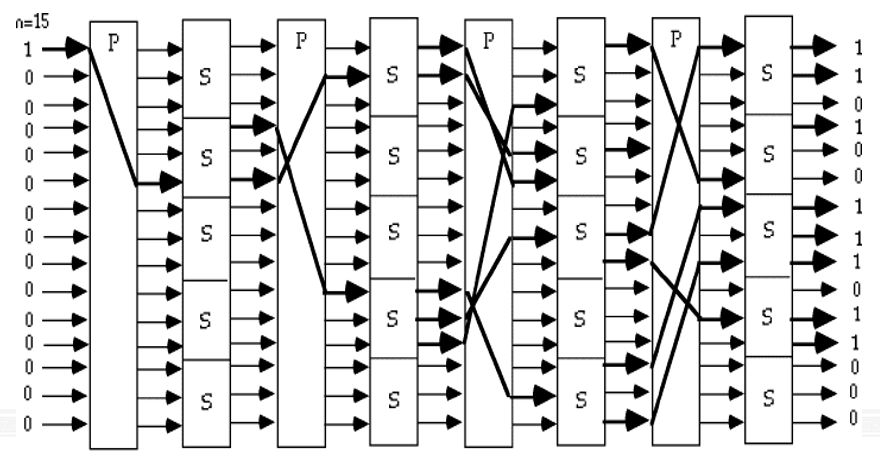

- **SPN**（Substitution-Permutation Network，替换-置换网络）结构
    - 由多轮替换和置换组成
    - 每轮包括两个主要操作：替换（Substitution）和置换（Permutation）
    - 替换使用S盒（Substitution box）实现，将输入的位模式映射到输出的位模式，提供**混淆**效果
    - 置换使用P盒（Permutation box）实现，重新排列输入的位，提供**扩散**效果
    - 通过多轮的替换和置换，增加了密码的复杂性和安全性


### Feistel 结构


- **Feistel 网络** 结构
    - 将输入数据分成两个相等的部分，通常称为左半部（$L$）和右半部（$R$）
        - 每轮操作包括一个函数 $F$，该函数接受右半部（$R_{i-1}$）和一个子密钥（$K_i$）作为输入，输出一个与左半部大小相同的值
        - 然后将左半部（$L_{i-1}$）与函数 $F$ 的输出进行异或运算，结果成为新的右半部（$R_i$）
        - 右半部保持不变，成为新的左半部（$L_i$）
    - 这种结构的优点是加密和解密过程非常相似，只需使用相同的函数 $F$ 和子密钥，但顺序相反
    - 加密过程：第 $i$ 轮将 $(L_{i-1}, R_{i-1})$映射到$(L_i, R_i)$如下：
        $$
        \begin{aligned}
        &L_i=R_{i-1} \\
        &R_i=L_{i-1} \oplus F(R_{i-1}, K_i)
        \end{aligned}
        $$
    - 解密过程与加密过程类似，只需将子密钥的顺序反转：
        $$
        \begin{aligned}
        &R_{i-1}=L_i \\
        &L_{i-1}=R_i \oplus F(R_{i-1}, K_i)=R_i \oplus F(L_i, K_i)
        \end{aligned}
        $$

## 分组密码的设计原则
- **雪崩效应**（Avalanche Effect）
    - 输入改变 1 bit, 导致近一半的输出比特发生变化
    - 一个函数 $F$ 具有好的雪崩特性是指：对 $2^m$ 个明文向量, 分为 $2^{(m−1)}$ 个向量对 $(x_i, x_i')$，每对向量只有一个比特不同，定义 $V_i=f(x_i) \oplus f(x_i')$，则近一半的 $V_i$ 为 1
- 完备性效应（Completeness Effect）
    - 每个输出比特是所有输入比特的复杂函数的输出
    - 一个函数 $F$ 具有好的完备性是指：对密文输出向量的每一比特 $j$，$0<j<m$，至少存在一个明文对 $(x_i,  x_i')$，此明文对只在第 $i$ 比特不同，且 $F(x_i)$ 与 $F(x_i')$ 的第 $j$ 比特不同
- 设计密码时, 下列参数需要考虑：
    - 分组大小(block size)：增加分组长度会提高安全性，但降低了密码运算速度
    - 密钥大小(key size)：增加密钥长度，可以提高安全性(使得穷搜索困难)，但降低了密码速度
    - 轮数: 增加轮数可以提高安全性，但降低速度
    - 子密钥生成: 子密钥生成越复杂，就越安全，但降低速度
    - 轮函数：复杂的轮函数能够使的密码分析困难，但降低速度

## 分组密码理论
### Lucifer 密码


- 第一个可用的代换（S）-置换（P）密码
- 密钥编排：
    - Lucifer 密码是 Feistel 网络，分组长度是 128-bit, 密钥长度是 128-bit
    - 每轮使用的子密钥是密钥的左半部分
    - 密钥每次要循环左移 56-bit, 所以密钥的每部分都参加运算
- 加密过程：
    - 左半部分 $L_i$ 和右半部分 $R_i$ 的计算如下：
        $$
        \begin{aligned}
        &L_i=R_{i−1} \\
        &R_i=L_{i−1} \oplus F(R_{i−1}, K_i)
        \end{aligned}
        $$
    - 其中 $F$ 函数的结构如下：
        - 输入 $R_{i−1}$ (64-bit) 被分为 8 个字节经过 S-盒替换，每个字节根据密钥 $K_i$ 的左 8-bit 中的一位选择 S0 或 S1
        - 然后与密钥 $K_i$ 的全部 64-bit 进行异或运算
        - 然后经过 P-盒置换，得到 64-bit 的输出
    - 
- 安全性
    - Lucifer 没有经过很强的分析
    - 现在认为是理论可破的 (通过差分分析)
    - 现在不被使用
    - 是 DES 的前身

### S-DES (Simplified DES)


- 供教学而非安全的加密算法，与DES的特性和结构类似，但参数较小。
- 加密算法涉及五个函数：
    - 初始置换 $IP$ (initial permutation)
    - 复合函数 $f_{K1}$，它是由密钥 $K$ 确定的，具有代换和置换功能
    - 转换函数 $SW$
    - 复合函数 $f_{K2}$
    - 初始置换 $IP$ 的逆置换 $IP^{-1}$
- 数学表示
    - 设明文为 $M$，密钥为 $K$，则密文 $C$ 可表示为：
        $$C = IP^{-1}(f_{K2}(SW(f_{K1}(IP(M)))))$$
    - 解密过程与加密过程类似，只需将子密钥的顺序反转：
        $$M = IP^{-1}(f_{K1}(SW(f_{K2}(IP(C)))))$$
    - 其中:
        - $K_1 = P_8(LS_{1}(P_{10}(K)))$
        - $K_2 = P_8(LS_{2}(LS_{1}(P_{10}(K))))$
- S-DES 的密钥生成：
    - 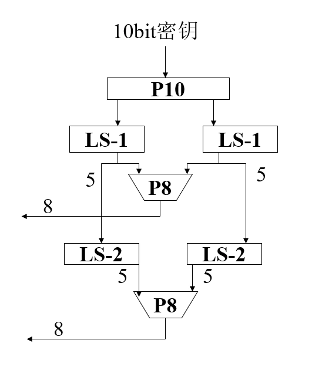
    - 设 10bit 的密钥为 $K = (k_1,k_2,\cdots,k_{10})$
        - $P_{10}(k_1,k_2,\cdots,k_{10})=(k_3,k_5,k_2,k_7,k_4,k_{10},k_1,k_9,k_8,k_6)$
        - $P_8(k_1,k_2,\cdots,k_{10})=(k_6,k_3,k_7,k_4,k_8,k_5,k_{10},k_9)$
    - $LS_{1}$为循环左移1位， $LS_{2}$为循环左移2位
    - 示例：
        - 若 $K=(1010000010)$
        - $P_{10}(K)=(1000001100)$
        - $LS_{1}(10000)\mid LS_{1}(01100)=(00001\mid 11000)$
        - $K_1=P_8(0000111000)=(10100100)$
        - $LS_{2}(00001)\mid LS_{2}(11000)=(00100\mid 00011)$
        - $K_2=P_8(0010000011)=(01000011)$
- S-DES 的加密运算:
    - 

    1. $IP$ 置换
        - 初始置换用 $IP$ 函数：
            $$ IP = \begin{bmatrix}
            1 & 2 & 3 & 4 & 5 & 6 & 7 & 8 \\
            2 & 6 & 3 & 1 & 4 & 8 & 5 & 7
            \end{bmatrix} $$
        - 末端算法的置换为 $IP$ 的逆置换：
            $$IP^{-1}  = \begin{bmatrix}
            1 & 2 & 3 & 4 & 5 & 6 & 7 & 8 \\
            4 & 1 & 3 & 5 & 7 & 2 & 8 & 6
            \end{bmatrix} $$
        - $IP^{-1} (IP(X))=X$
    2. 函数 $f_k$:
        $$f_k (L,R)=(L⊕F(R,SK),R)$$
        - 其中 $L\mid R$ 为 8 位输入, 左右各为 4 位, $F$ 为从 4 位集到 4 位集的一个映射, 并不要求是 1-1 的。$SK$ 为子密钥。
    3. 对映射 $F$ 来说：
        - 首先输入是一个 4 位数 $(n_1,n_2,n_3,n_4)$，第一步运算是扩张/置换(E/P)运算：
            $$E/P = \begin{bmatrix}
            4 & 1 & 2 & 3 & 2 & 3 & 4 & 1
            \end{bmatrix} $$
        - 然后分左右 4 位进入两个 S 盒运算
    4. 对两个 S 盒：$S_0$ 和 $S_1$
        - $S_0$ 和 $S_1$ 的定义如下：
            $$S_0 = \begin{bmatrix}
            1 & 0 & 3 & 2 \\
            3 & 2 & 1 & 0 \\
            0 & 2 & 1 & 3 \\
            2 & 1 & 0 & 3
            \end{bmatrix},\quad S_1 = \begin{bmatrix}
            0 & 1 & 2 & 3 \\
            2 & 0 & 1 & 3 \\
            3 & 0 & 1 & 0 \\
            2 & 1 & 0 & 3
            \end{bmatrix} $$
        - 按下述规则运算：
            - 将第 $1$ 和第 $4$ 的输入比特做为 $2bit$ 数，指示为S盒的一个行；将第 $2$ 和第 $3$ 的输入比特做为S盒的一个列。如此确定为S盒矩阵的 $(i,j)$ 数。
            - 例如：$(P_{0,0} P_{0,3})=(00),  并且(P_{0,1} P_{0,2})=(1 0)$，确定了 $S_0$ 中的第 $0$ 行 $2$ 列 $(0,2)$ 的系数为 $3$，记为 $(11)$ 输出。
    5. $P_4$ 置换
        - 由 $S_0, S_1$ 输出的 4-bit 经置换
            $$P_4 = \begin{bmatrix}
            2 & 4 & 3 & 1
            \end{bmatrix}$$
        - 它的输出就是 $F$  函数的输出
    6. 将 $F$ 的输出与左半部分 $L$ 进行异或运算，得到新的左半部分，再与原本的右半部分 $R$ 组合，得到 $f_k$ 的输出
    7. 交换函数 $SW$
        - 交换函数 $SW$ 将 8-bit 输入的左右两半交换位置
        - 即 $SW(L\mid R)=R\mid L$
    8. 再进行一次 $f_k$ 运算，使用第二个子密钥 $K_2$
    9. 最后进行 $IP^{-1}$ 置换，得到密文

### DES


- Feistel 结构
    - 密钥 $K$ 长度：56-bit
    - 分组（输入）长度：64-bit
    - 密文（输出）长度：64-bit
    - 轮数：16 轮
- 算法分三个阶段实现：
    1. 对明文 $X$，通过一个固定的初始置换 $IP$ 得到 $X_0$，分为左右两部分
        $$X_0=IP(X)=L_0\mid R_0$$
    2. 函数 $F$ 的 $16$ 次迭代：$L_i\mid R_i (1 \leq i \leq 16)$
        $$
        \begin{aligned}
        &L_i=R_{i−1} \\
        &R_i=L_{i−1} \oplus F(R_{i−1}, K_i)
        \end{aligned}
        $$
        - 其中 $K_i$ 是长为 48 位的子密钥。子密钥 $K_1,K_2,\cdots,K_{16}$ 是作为密钥 $K$（56 位）的函数而计算出的。
    3. 对比特串 $R_{16}\mid L_{16}$ 使用逆置换 $IP^{-1}$ 得到密文 $Y$。
        $$Y=IP^{-1}(R_{16}\mid L_{16})$$
- 初始置换 $IP$ 和 $IP^{-1}$ 的定义：表中的数字表示这个比特在置换前的位置
    $$IP = \begin{bmatrix}
    58 & 50 & 42 & 34 & 26 & 18 & 10 & 2 \\
    60 & 52 & 44 & 36 & 28 & 20 & 12 & 4 \\
    62 & 54 & 46 & 38 & 30 & 22 & 14 & 6 \\
    64 & 56 & 48 & 40 & 32 & 24 & 16 & 8 \\
    57 & 49 & 41 & 33 & 25 & 17 & 9 & 1 \\
    59 & 51 & 43 & 35 & 27 & 19 & 11 & 3 \\
    61 & 53 & 45 & 37 & 29 & 21 & 13 & 5 \\
    63 & 55 & 47 & 39 & 31 & 23 & 15 & 7
    \end{bmatrix}$$
    $$IP^{-1} = \begin{bmatrix}
    40 & 8 & 48 & 16 & 56 & 24 & 64 & 32 \\
    39 & 7 & 47 & 15 & 55 & 23 & 63 & 31 \\
    38 & 6 & 46 & 14 & 54 & 22 & 62 & 30 \\
    37 & 5 & 45 & 13 & 53 & 21 & 61 & 29 \\
    36 & 4 & 44 & 12 & 52 & 20 & 60 & 28 \\
    35 & 3 & 43 & 11 & 51 & 19 & 59 & 27 \\
    34 & 2 & 42 & 10 & 50 & 18 & 58 & 26 \\
    33 & 1 & 41 & 9 & 49 & 17 & 57 & 25
    \end{bmatrix}$$
- 扩展置换 $E$：用于将 32 位的输入扩展为 48 位，表中第 $i$ 个数据 $j$ 表示输出的第 $i$ 位为输入的第 $j$ 位。
    $$E = \begin{bmatrix}
    32 & 1 & 2 & 3 & 4 & 5 \\
    4 & 5 & 6 & 7 & 8 & 9 \\
    8 & 9 & 10 & 11 & 12 & 13 \\
    12 & 13 & 14 & 15 & 16 & 17 \\
    16 & 17 & 18 & 19 & 20 & 21 \\
    20 & 21 & 22 & 23 & 24 & 25 \\
    24 & 25 & 26 & 27 & 28 & 29 \\
    28 & 29 & 30 & 31 & 32 & 1
    \end{bmatrix}$$
- 置换 $P$：表中第 $i$ 个数据 $j$ 表示输出的第 $i$ 位为输入的第 $j$ 位
    $$P = \begin{bmatrix}
    16 & 7 & 20 & 21 & 29 & 12 & 28 & 17 \\
    1 & 15 & 23 & 26 & 5 & 18 & 31 & 10 \\
    2 & 8 & 24 & 14 & 32 & 27 & 3 & 9 \\
    19 & 13 & 30 & 6 & 22 & 11 & 4 & 25
    \end{bmatrix}$$
- S-box-1
    $$S_1 = \begin{bmatrix}
    14 & 4 & 13 & 1 & 2 & 15 & 11 & 8 & 3 & 10 & 6 & 12 & 5 & 9 & 0 & 7 \\
    0 & 15 & 7 & 4 & 14 & 2 & 13 & 1 & 10 & 6 & 12 & 11 & 9 & 5 & 3 & 8 \\
    4 & 1 & 14 & 8 & 13 & 6 & 2 & 11 & 15 & 12 & 9 & 7 & 3 & 10 & 5 & 0 \\
    15 & 2 & 8 & 14 & 6 & 11 & 1 & 3 & 4 & 9 & 7 & 5 & 13 & 10 & 0 & 12
    \end{bmatrix}$$
- $F$ 函数的说明
    - $F(R_{i−1}, K_i)$ 的非线性表示如下：函数 $F$ 有两个输入：一半消息 $R_{i−1}$（32-bit）作第一个输入，$48$ 比特的子密钥 $K_i$ (48-bit) 作为第二个输入。产生的输出为长度为 $32$ 位串。
        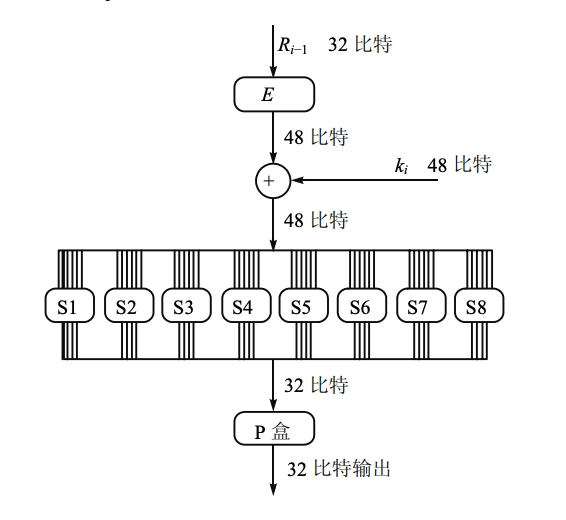

    1. 对$R_{i−1}$ ，先利用扩展函数$E$，扩展成 $48$ 位 $E(R_{i−1})$
    2. 计算 $A = E(R_{i−1})\oplus K_i$，结果写成 $8$ 个 $6$ 位串, 
        $A=A_1\mid A_2\mid A_3\mid A_4\mid A_5\mid A_6\mid A_7\mid A_8$
        $A_j=a_1 a_2 a_3 a_4 a_5 a_6$
    3. 使用 $8$ 个 S 盒，每个 $S_j$ 是一个固定的 $4 \times 16$ 矩阵，它的元素取 $0 \sim 15$ 的整数。给定 $A_j$，计算 $B_j=S_j (A_j)$，其中 $B_j$ 是一个 $4$ 位串，$B_j=b_1 b_2 b_3 b_4$。
    4. 计算 $S_j (A_j)$ 如下：$a_1 a_6$ 两个比特确定了 $S_j$ 的行数, $r(0\leq r \leq 3)$; 而 $a_2 a_3 a_4 a_5$四个比特确定了 $S_j$ 的列数 $c(0\leq c \leq 15)$。最后 $S_j (A_j)$ 的值为S-盒矩阵 $S_j$ 中 $r$ 行 $c$ 列的元素 $(r,c)$，得$B_j=S_j (A_j)$。
    5. 最后，$P$ 为固定置换。
- DES使用的特定轮函数
    - 初始置换 $IP$：对明文输入进行次序的打乱。
    - 逆置换 $IP^{-1}$
    - 扩展函数 $E$（32到48）
    - 置换函数 $P$（32到32）
    - 8个 S 盒 $S_1, S_2, \ldots, S_8$（6到4）
- 密钥编排：由密钥 $K$ 计算子密钥 $K(i)$
    - 
    - 密钥 $K$ 是长度为 64 的位串，56 位参加子密钥编排。8 位是奇偶校验位（为了检错），在密钥编排的计算中，不参加运算。
        1. 给定 64 位的密钥 $K$，放弃奇偶校验位 $(8, 16, \ldots, 64)$ 并根据固定置换 $PC1$ 来排列 $K$ 中剩下的位。我们写 $$PC1(K)=C_0\mid D_0$$ 其中 $C_0$ 由 $PC1(K)$ 的前 28 位组成；$D_0$ 由后 28 位组成。
        2. 对 $1 \leq i \leq 16$，计算 $$C_i=LS_i (C_{i−1}) \\ D_i=LS_i (D_{i−1})$$ 其中 $LS_i$ 表示循环左移 2 或 1 个位置，取决于 $i$ 的值。
            - $i=1,2,9,16$ 时移 1 个位置，否则移 2 位置
            - $K_i=PC2(C_i D_i)$，$PC2$ 为固定置换，将前 28 位中的 24 位置换，并去掉 9、18、22、25，将后 28 位中的 24 位置换，并去掉 35、38、43、54 位
    - 一共 16 轮迭代，总共生成 16 个 48 比特的子密钥 $K_1, K_2, \ldots, K_{16}$。


### 3DES (Triple DES)
- 由于 DES 的密钥长度较短，容易受到穷举攻击，因此提出了 Triple DES（3DES）来增强安全性。
- 3DES 的工作原理是对数据进行三次 DES 加密和解密操作，通常使用两种或三种不同的密钥。
- Two-Key 3DES:
    - 使用两个密钥 $K_1$ 和 $K_2$，加密过程为：$$C = E_{K_2}(D_{K_2}(E_{K_1}(M)))$$
    - 解密过程为：$$M = D_{K_1}(E_{K_2}(D_{K_2}(C)))$$
- Three-Key 3DES:
    - 使用三个密钥 $K_1$、$K_2$ 和 $K_3$，加密过程为：$$C = E_{K_3}(D_{K_2}(E_{K_1}(M)))$$
    - 解密过程为：$$M = D_{K_1}(E_{K_2}(D_{K_3}(C)))$$
- 密钥长度：
    - 标准DES：$2^{56}$
    - Two-Key 3DES：$2^{112}$
    - Three-Key 3DES：$2^{168}$

### IDEA


- Feistel 结构
    - 密钥长度：128位（抗强力攻击能力比DES强）
    - 分组长度：64位
        - 子分组长度：16位
    - 密文长度：64位
    - 轮数：8轮 + 1次输出变换
- IDEA的“混淆”和“扩散”设计原则来自三种运算，它们易于软、硬件实现（加密速度快）：
    1. 异或运算：$\oplus$
    2. 整数模 $2^{16}$ 加：$⊞$
    3. 整数模 $2^{16}+1$ 乘：$\odot$  (IDEA的S盒)
    4. MA 单元
        
- IDEA 的加密
    - 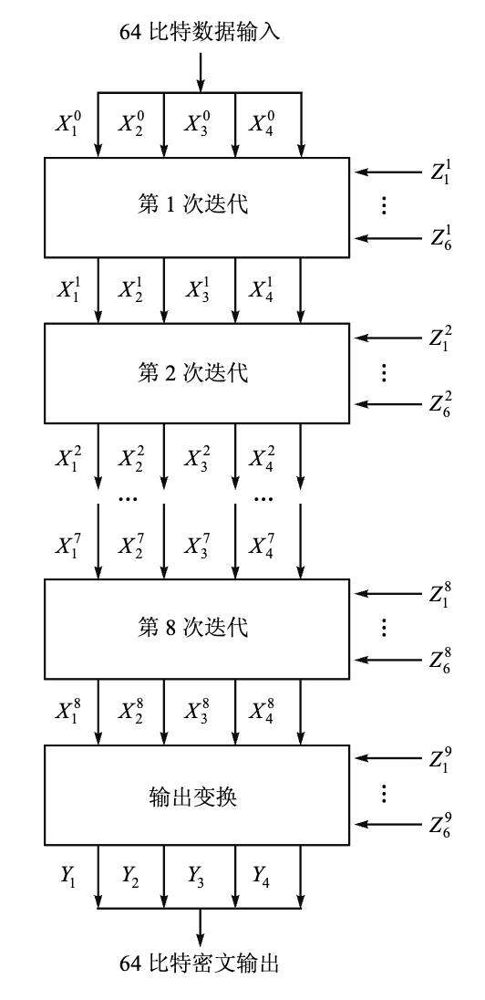
    - IDEA 加密一轮迭代过程框图
        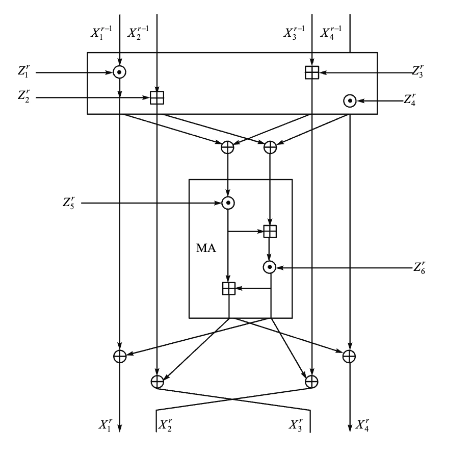

        - 每一轮输入为 64-bit 的数据块，分为 4 个 16-bit 的子块 $X_1, X_2, X_3, X_4$
        - 使用 6 个 16-bit 的子密钥 $Z_{6i+1}, Z_{6i+2}, \ldots, Z_{6i+6}$ 对数据进行处理，产生 4 个 16-bit 的输出子块 $Y_1, Y_2, Y_3, Y_4$，作为下一轮的输入
    - 最后一轮后进行输出变换，使用 4 个子密钥 $Z_{49}, Z_{50}, Z_{51}, Z_{52}$ 对数据进行处理，产生最终的密文输出
        
- 密钥生成
    - 52 个 16-bit 的子密钥从 128-bit 的密钥中生成
        - 前 8 个子密钥 $Z_1, Z_2, \ldots, Z_8$ 直接从密钥中取出；
        - 对密钥进行 25-bit 的循环左移，得到接下来 8 个子密钥 $Z_9, Z_{10}, \ldots, Z_{16}$；
        - 再进行 25-bit 的循环左移，得到接下来的 8 个子密钥 $Z_{17}, Z_{18}, \ldots, Z_{24}$；
        - 依此类推，重复进行直到 52 个子密钥都产生出来。
- IDEA 的解密
    - 加密解密实质相同，但使用不同的密钥；
    - 解密密钥以如下方法从加密子密钥中导出：
        - 解密循环第 $r$ 轮的头 4 个子密钥从加密循环第 $10-r$ 轮的头 4 个子密钥中导出；
        - 每一轮的解密密钥与加密密钥有以下关系：
            - 第 1 和第 4 个子密钥取乘法逆元；
            - 第 2 和第 3 个子密钥取加法逆元；
            - 第 5 和第 6 个子密钥直接对应；
- IDEA 的安全性
    - IDEA 是 PGP 的一部分；
    - IDEA 能抗差分分析和相关分析；
    - IDEA 似乎没有 DES 意义下的弱密钥；
    - Bruce Schneier 认为 IDEA 是 DES 的最好替代。
- 先进分组密码的特点
    - IDEA 是 PGP 的一部分；
    - 可变密钥长度
    - 混合操作
    - 依赖数据的循环移位
    - 依赖于密钥的循环移位
    - 依赖 S 盒
    - 冗长的密钥调度算法
    - 可变的 F 函数和可变的明文/密文长度
    - 可变的循环次数
    - 在每次循环中都对两半数据进行操作

### AES
-  AES (Rijndael) 算法结构
    - Rijndael：可变块长、可变密钥长度
    - 参数：
        1. **分组长度**：AES的分组长度为128位。
        2. **密钥长度**：AES支持多种密钥长度，包括128位、192位和256位。
        3. **轮数**：根据密钥长度的不同，AES的轮数也不同：
            - 128位密钥：10轮
            - 192位密钥：12轮
            - 256位密钥：14轮
    - 不是 Feistel 结构，而是 SPN 结构
    - 单个 8 位到 8 位的 S-盒
- 加解密流程图：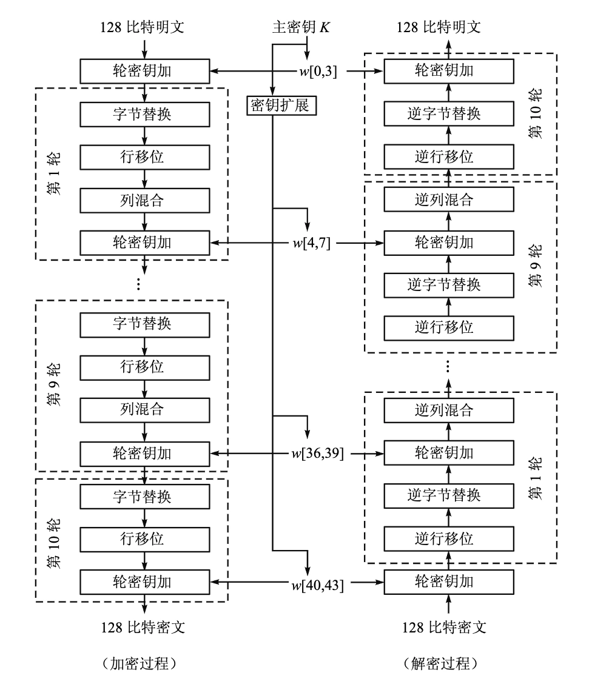
- **轮函数**：Rijndael 的轮函数每一轮迭代的结构都一样，由下述 4 个不同的变换构成，只是最后一轮省略了列混合变换。
    - 
    1. **字节替换**（SubByte）：对数据的每一字节应用一个非线性变换。
        - 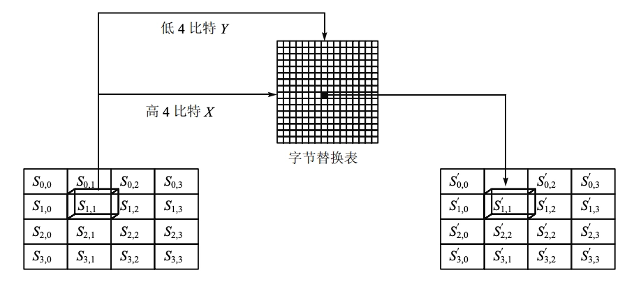
        - 矩阵中各字节被固定的 8 位查找表中对应的特定字节所替换。
            - $16 \times 16$ 矩阵表中纵向的 $x$ 取自状态矩阵中的高4比特，横向的 $y$ 取自低4比特
        - 替代的过程如下表， $x$ 行和 $y$ 列的数据就用来替代的数据
            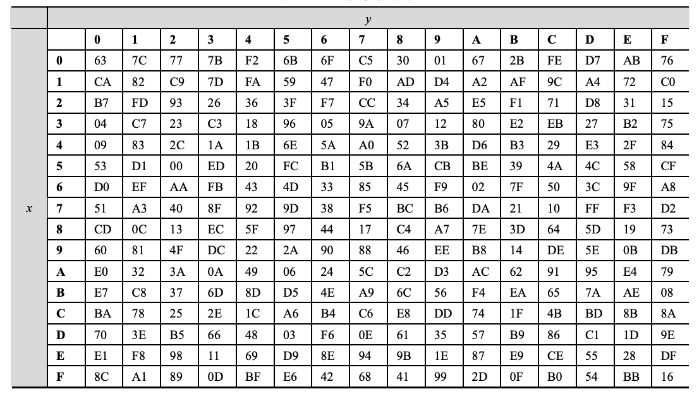
    2. **行移位**（ShiftRow）：对每一行的字节循环重新排序。
        - 每一行都向左循环位移某个偏移量。属于置换（permutation）运算
            - 第 0 行不变
            - 第 1 行循环左移 1 位
            - 第 2 行循环左移 2 位
            - 第 3 行循环左移 3 位
        - 
    3. **列混合**（MixColumn）：对矩阵的列应用一个线性变换。
        - 将状态的每一列视为 $GF(2^8)$ 上多项式 $S(x)$, 然后和一个固定多项式在模 $x^4+1$ 下相乘，变换公式如下：
            $$
            \begin{aligned}
            &S\prime(x) = a(x) \otimes S(x)\\
            &S\prime_{0c} = \{02\} \times S_{0c} \oplus \{03\} \times S_{1c} \oplus \{01\} \times S_{2c} \oplus \{01\} \times S_{3c}\\
            &S\prime_{1c} = \{01\} \times S_{0c} \oplus \{02\} \times S_{1c} \oplus \{03\} \times S_{2c} \oplus \{01\} \times S_{3c}\\
            &S\prime_{2c} = \{01\} \times S_{0c} \oplus \{01\} \times S_{1c} \oplus \{02\} \times S_{2c} \oplus \{03\} \times S_{3c}\\
            &S\prime_{3c} = \{03\} \times S_{0c} \oplus \{01\} \times S_{1c} \oplus \{01\} \times S_{2c} \oplus \{02\} \times S_{3c}
            \end{aligned}
            $$
            - 加法：等价于异或 $XOR, \oplus$。
            - 乘法：定义为 $GF(2^8)$ 上模不可约多项式 $x^4 +1$ 的乘法。
        - 此步骤亦可视为 Rijndael 有限域之下的矩阵乘法, $a(x)$ 存在关于 $x^4+1$ 的逆元。
        - 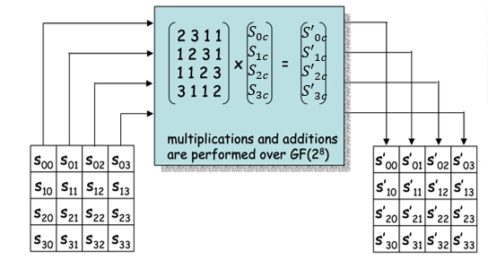
    4. **轮密钥加**（AddRoundKey）：把轮密钥混合到中间数据。
        - 对状态和轮密钥进行简单的异或运算。
        - 轮密钥是通过密钥调度算法从主密钥中产生，轮密钥长度等于分组长度；
        - 轮密钥加运算需要用到 $4$ 个导出的 $32$ 比特子密钥；
        - 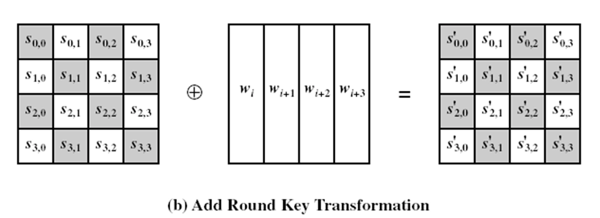
- **轮密钥生成**：
    - AES 使用密钥扩展算法从初始密钥生成每一轮所需的轮密钥。
        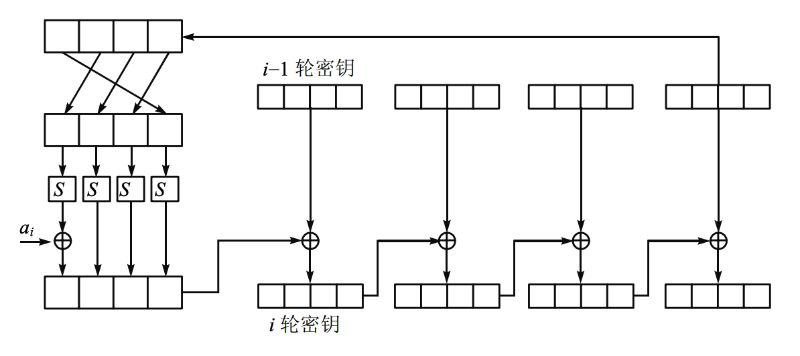
    - 每一轮需要用到 $N_b$ 比特的子密钥，共 $N_r$ 轮，加上第一次轮密钥加时也需要一轮，共 $N_r + 1$ 个子密钥。
        - 对于AES-128，$N_b = 128$，$N_r = 10$，需要$10 \times 128 + 128= 1408$比特子密钥。
        - 第 $0$ 轮密钥就是初始密钥本身。
        - 第 $i$ 轮密钥是密钥扩展函数在第 $i-1$ 轮密钥的基础上生成的。
    - 第 $i-1$ 轮的 $16$ 个字节的子密钥被分成 $4$ 组来处理，每组 $4$ 个字节。
        - 最后一组的 $4$ 个字节先执行一个字节的循环左移，由 S 盒（这个 S 盒与字节替代时的 S 盒是一样的）来进行替代处理
        - 然后这 $4$ 个字节结果中的第 $1$ 个字节和轮常数相异或，这个常数是由是预先定义的，可以查表得到：
            
        - 最后，为了得到第 $i$ 轮密钥，把得到的 $4$ 个字节的结果和 $i-1$ 轮密钥的最初 $4$ 个字节按位相异或，得到 $i$ 轮密钥的最初 $4$ 个字节
        - 然后又和密钥的接下来 $4$ 个字节按位相异或，得到 $i$ 轮密钥的接下来 $4$ 个字节，以此类推。

## 分组密码的工作模式
- 定义：分组密码加密固定长度的信息，例如：DES 加密 64-bit，使用 56-bit 密钥，需要一种使用方法，加密任意长度的消息，这种使用方法叫做工作模式（Modes of Operation）。
- 分类：
    - Block Modes(分组密码模式)
        - ECB(Electronic Codebook)：电子密码本模式
        - CBC(Cipher Block Chaining)：密码分组链接模式
    - Stream Modes(流密码模式)
        - CFB(Cipher Feedback)：密码反馈模式
        - OFB(Output Feedback)：输出反馈模式
        - CTR(Counter)：计数器模式
- 在CFB、OFB和CTR模式中，仅使用加密算法（不需要解密算法）
    - 这就是为什么Rijndael（AES）针对加密进行了优化
    - 这些模式不应与公钥加密算法一起使用

### ECB工作模式 (Electronic Code Book)
- ECB（electronic codebook）模式是最简单的运行模式，它将消息分成相互独立的加密模块，每次的加密密钥都相同。
- 密钥为 $K$，明文块 $P_1, P_2, \ldots, P_t$，密文块 $C_1, C_2, \ldots, C_t$
    - 加密：$C_i = E_K[P_i]$
    - 解密：$P_i = D_K[C_i]$
    - 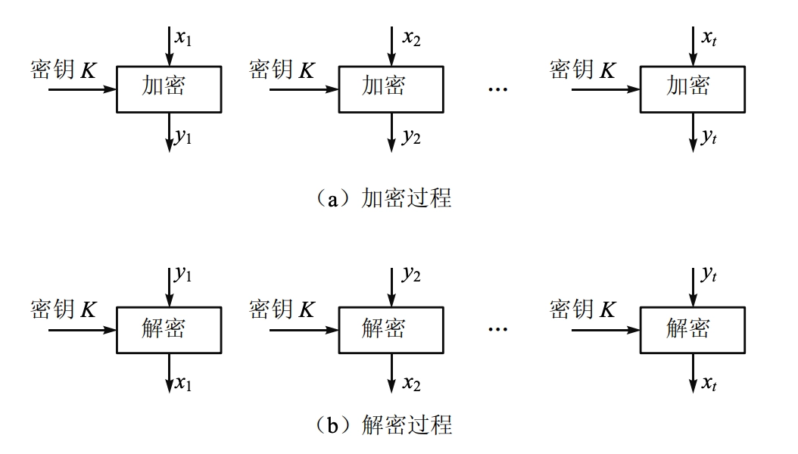
- **工作模式特点**：
    - ECB 在用于短数据（如加密密钥）时非常理想，因此如果需要安全地传输 DES 密钥，ECB 是最合适的模式
    - **最大特性**：相同的明文块在相同的密钥下会生成相同的密文块
        - 需要加密的消息通常具有非常规则的格式
        - 重复的片段、特殊的头部信息、连续的0等是非常常见的
        - 无法隐藏数据模式、不太安全的
    - 块是独立于其他块进行加密的
        - 重新排列密文块会导致相应的明文块重新排列
        - 密文块可以从一条消息中剪切并粘贴到另一条消息中，可能不会被检测到
    - **错误传播**：密文块中的一个比特错误只会影响相应的明文块（导致生成乱码）
    - 总体而言：不建议用于超过一个块的消息，或者如果密钥被重复用于多个块
- ECB 用于长消息时可能不够安全，如果消息有固定结构，密码分析者有可能找出这种关系。
    - 如果已知消息总是以某个预定义字段开始，那么分析者就可能得到很多明文密文对。
    - 如果消息有重复的元素而重复的周期是 64 的倍数，那么密码分析者就能够识别这些元素。

### CBC工作模式 (Cipher Block Chaining)
- CBC（Cipher Block Chaining）模式将消息分成模块，加密是相互联系的，每个明文分组在加密前都与前一个密文分组进行异或运算。
- 密钥为 $K$，明文块 $P_1, P_2, \ldots, P_t$，密文块 $C_1, C_2, \ldots, C_t$，初始向量 $IV$。
    - 加密：CBC 模式一次对一个明文分组加密，每次加密使用同一密钥，加密算法的输入是当前明文分组和前一次密文分组的异或，因此加密算法的输入不会显示出与这次的明文分组之间的固定关系，所以重复的明文分组不会在密文中暴露出这种重复关系。
        $$
        \begin{aligned}
        C_j &=E_{K} [C_{(j-1)} \oplus P_j] \\
        C_{(-1)} &=IV
        \end{aligned}
        $$
    - 解密：每一个密文分组被解密后，再与前一个密文分组异或以恢复明文分组。
        $$
        \begin{aligned}
        P_j &=D_{K} [C_j] \oplus C_{(j-1)} \\
        &= D_K [E_K [C_{(j-1)} \oplus P_j]] \oplus C_{(j-1)} \\
        &= C_{(j-1)} \oplus P_j \oplus C_{(j-1)} \\
        &= P_j \\
        C_{(-1)} &=IV
        \end{aligned}
        $$
    - 
- 初始化向量 $IV$ 的完整性
    - 在产生第 1 个密文分组时，需要有一个初始向量 $IV$ 与第 1 个明文分组异或。解密时，$IV$ 和解密算法对第 1 个密文分组的输出进行异或以恢复第 1 个明文分组。
    - $IV$ 对于收发双方都应是己知的，为使安全性最高，$IV$ 应像密钥一样被保护，可使用 ECB 模式来发送 $IV$。保护 $IV$ 的原因如下：
        $$
        \begin{aligned}
        C_1 &= E_K[IV \oplus P_1] \\
        P_1 &= IV \oplus D_K[C_1]
        \end{aligned}
        $$
    - 如果攻击者能欺骗接收方使用不同的 $IV$ 值，就能够在明文的第 1 个分组中插入自己选择的比特值，这是因为用 $X(i)$ 表示 64-bit 分组 $X$ 的第 $i$ 个比特，那么 $P_1(i)=IV(i)\oplus D_K[C_1](i)$，由异或的性质得 $P_1(i)\prime = IV(i)\prime \oplus D_K[C_1](i)$，其中撇号 $\prime$ 表示比特补。
        - 意味着如果攻击者篡改 $IV$ 中的某些比特，则接收方收到的 $P_1$ 中相应的比特也发生了变化。
- 由于CBC模式的链接机制，CBC模式对加密长于64比特的消息非常合适。
- CBC模式除能够获得保密性外，还能用于认证，进行用户鉴别。
- **工作模式特点**
    - 在相同密钥 $K$ 但不同初始向量 $IV$ 下加密相同的明文，会生成不同的密文
        - 重新排列密文块会影响解密
        - 然而，对先前明文块的依赖仅通过前一个密文块 $C_{(j-1)}$ 实现
        - 正确解密一个密文块仅需要前一个密文块是正确的
    - **错误传播**：
        - 密文块 $C_j$ 中的一个比特错误会影响第 $j$ 个和第 $(j+1)$ 个明文块
        - $P_j\prime$ 完全变为乱码，而 $P_{j+1}\prime$ 在 $C_j$ 发生错误的比特位置也会出现错误

### CFB工作模式 (Cipher Feedback)
- 用于加密字符流，逐个字符处理
- 消息被看作比特流，被加到分组密文的输出，并把结果反馈到下一阶段
- 标准允许反馈任意比特 (1,8 or 64 or whatever)，记作 CFB-1, CFB-8, CFB-64 等
- 密钥为 $K$，明文块 $P_1, P_2, \ldots, P_t$，密文块 $C_1, C_2, \ldots, C_t$，初始向量 $IV_0$。以 CFB-64 为例：
    - 加密：
        $$
        \begin{aligned}
        C_i &= P_i \oplus E_{K}[J_{i}][0:r] \\
        J_{i} &= (J_{i−1}) \ll r \mid C_{i−1} \\
        J_{1} &= IV_0
        \end{aligned}
        $$
        - 设传送的每个单元（如一个字符）是 $r$ 比特长度，通常取 $r=8$，与 CBC 模式一样，明文单元被链接在一起，使得密文块 $C_m$ 依赖于明文块 $P_m$ 以及所有先前的明文块
        - 方法：
            - 加密算法的输入是 64 比特移位寄存器，其初值为某个初始向量 $IV_0$。
            - 加密算法输出的最左（最高有效位）$r$ 比特与明文的第一个单元 $P_1$ 进行异或，产生密文的第一个单元 $C_1$，并传送该单元。
            - 然后将移位寄存器的内容左移 $r$ 位并将 $C_1$ 送入送入移位寄存器最右边的 $r$ 位。这一过程一直进行到明文的所有单元都被加密为止。
    - 解密：
        $$
        \begin{aligned}
        P_i &= C_i \oplus E_{K}[J_{i}][0:r] \\
        J_{i} &= (J_{i−1}) \ll r \mid C_{i−1} \\
        J_{1} &= IV_0
        \end{aligned}
        $$
        - 解密时，将收到的密文单元与加密函数的输出进行异或。
        - **注意这时仍然使用加密算法而不是解密算法**
    - 
- CFB模式除能获得保密性外，还能用于认证。
- 工作模式特点：
    - 适合数据以比特或字节为单位出现
    - 在相同密钥 $K$ 但不同初始向量 $IV$ 下加密相同的明文，会生成不同的密文
    - $IV$ 可以直接发送
    - 密文块 $C_m$ 依赖于明文块 $P_m$ 以及所有先前的明文块
        - 重新排列密文块会影响解密。
        - 正确解密一个密文块需要其前 $n/r$ 个密文块是正确的(对于DES, $n=64$)。
    - **错误传播**：
        - 密文块 $C_m$ 中的一个比特错误会影响该块及后续 $n/r$ 个密文块的解密（错误会在移位寄存器中持续 $n/r$ 步）
            - $P_m\prime$ 在 $C_m$ 发生错误的比特位置也会出现错误，而其他错误的明文块则完全变为乱码
            - 攻击者可能会在第 $m$ 个明文块中引起可预测的比特变化

### OFB工作模式 (Output Feedback)
- 另一种流加密方法，OFB 是将加密算法的输出反馈到移位寄存器，而 CFB 是将密文单元反馈到移位寄存器
- 密钥为 $K$，明文块 $P_1, P_2, \ldots, P_t$，密文块 $C_1, C_2, \ldots, C_t$，初始向量 $IV_0$。以 OFB-64 为例：
    - 加密：
        $$
        \begin{aligned}
        C_i &= P_i \oplus O_i[0:r] \\
        O_i &= E_{K}[I_i] \\
        I_i &= (I_{i−1}) \ll r \mid O_{i−1}[0:r] \\
        I_1 &= IV_0
        \end{aligned}
        $$
    - 解密：
        $$
        \begin{aligned}
        P_i &= C_i \oplus O_i[0:r] \\
        O_i &= E_{K}[I_i] \\
        I_i &= (I_{i−1}) \ll r \mid O_{i−1}[0:r] \\
        I_1 &= IV_0
        \end{aligned}
        $$
    - 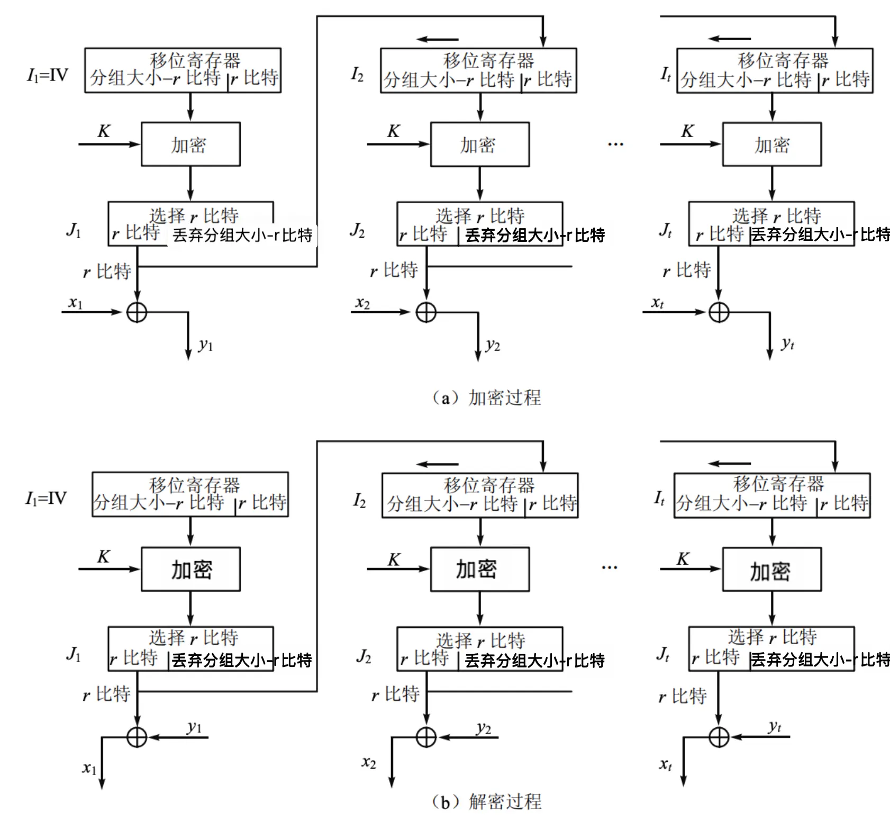
- 工作模式特点：
    - 每条新消息应使用不同的 $IV$，否则消息将使用相同的密钥流进行加密
    - $IV$ 可以直接发送
        - 如果 $IV$ 被攻击者修改，则加密将无法恢复（与 CFB 不同）
    - 密文块 $C_m$ 仅依赖于明文块 $P_m$（不依赖于先前的明文块）
        - 重新排列密文块会影响解密
    - **错误传播**：
        - 比特错误不会传播，密文块 $C_m$ 中的一个比特错误仅影响该密文块的解密
            - $P_m\prime$ 在 $C_m$ 发生错误的比特位置也会出现错误
            - 攻击者可能会在第 $m$ 个明文块中引起可预测的比特变化

### CTR工作模式 (Counter)
- 与 CFB、OFB 相似，CTR 将块密码变为流密码，通过递增一个加密计数器以产生连续的密钥流
- 加/解密过程：
    - 
- 工作模式特点：
    - 效率高
        - 可并行加密
        - 预处理
        - 吞吐量仅受可使用并行数量的限制
    - 加密数据块的随机访问
    - 可证明安全
    - 周期长度取决于计数器的大小（通常为$2^n$）
    - 第 $i$ 个块可以独立于其他块进行解密
        - 可并行化（与OFB不同）
        - 支持随机访问
    - **与明文进行异或运算的值可以预先计算**

## 对称密码算法分析
### 强力攻击（General Attack）
- 密钥空间穷搜索, 又称穷举攻击
- 以 DES 为例：
    - 64 位密钥，有效密钥长度为 56-bit
    - 密钥有 $2^{56} = 72,057,584,037,927,936 ≈ 7.2$ 亿亿
- 技术进步使穷举搜索成为可能
    - 算力提升
    - GPU
    - 量子计算

### 密法分析攻击
- 分类：
    - Ciphertext-only attack（唯密文攻击）：仅通过观察密文推导出解密密钥或明文。
    - Known-plaintext attack（已知明文攻击）：使用一定数量的明文及其对应的密文。
    - Chosen-plaintext attack（选择明文攻击）：选择明文并获得相应的密文。
    - Adaptive chosen-plaintext attack（自适应选择明文攻击）：选择明文攻击，其中明文的选择可能依赖于先前请求中收到的密文。
    - Chosen-ciphertext attack（选择密文攻击）：选择密文并获得相应的明文。
    - Adaptive chosen-ciphertext attack（自适应选择密文攻击）：选择密文攻击，其中密文的选择可能依赖于先前请求中收到的明文。
- 差分密码分析

# 序列密码

- 序列密码(stream cipher)是一种对明文消息流中的每一个符号分别进行加密的对称密钥密码，又称为流密码
- 流密码和分组密码之间的区别并不是绝对的
    - 流密码可以通过使用分组密码的 CFB 模式、OFB 模式或 CTR 模式来构建
    - 在 ECB 或 CBC 下的分组密码，可以视为一种操作于大字符上的流密码。

## 序列密码概述 (Stream Cipher)
- 定义：也称流密码：将被加密的消息 $m$ 分成连续的符号(一般为比特串)，$m=m_1 m_2 m_3 \cdots$；然后使用密钥流 $k=k_1 k_2 k_3 \cdots$ 中的第 $i$个元素 $k_i$ 对 $m$ 的第 $i$ 个元素 $m_i$ 执行加密变换，$i=1,2,3,\cdots$；所有的加密输出连接在一起就构成了对 $m$ 执行加密后的密文 $c$。


- 结构：
    - 简单结构：
        
    - 完整结构：
        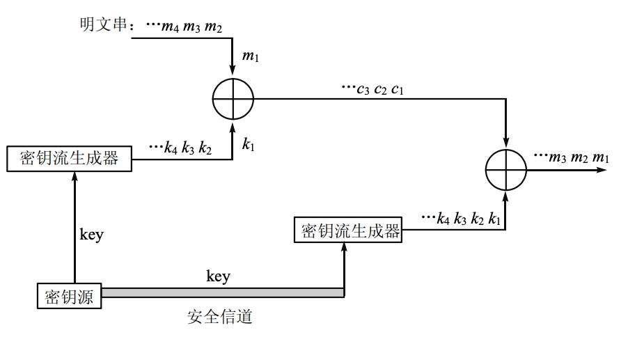
    - 如何生成一个可以用作密钥流的“随机”比特序列，要求易于使用，但又不能太短以至于不安全
    - 通常加、解密所需要的这种序列是由一个确定性（deterministic）的密钥流生成器（key generator）产生的，该生成器的输入是一个容易记住的密钥，称之为密钥流生成器的初始密钥或种子（seed）密钥
- 安全性：
    - 流密码的安全性完全取决于密钥的安全等级
    - 实用的流密码以少量的、一定长度的种子密钥经过逻辑运算产生周期较长、可用于加解密运算的伪随机序列。

### 同步流密码 (Synchronous stream ciphers)
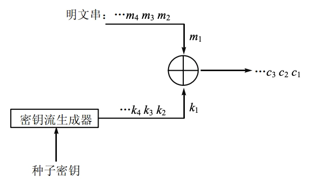

- 密钥流的产生与明文消息流相互独立
- 密钥流与明文串无关，所以同步流密码中的每个密文 $c_i$ 不依赖于之前的明文 $m_{i−1}，\cdots，m_1$。从而，同步流密码的一个重要优点就是无错误传播：在传输期间一个密文字符被改变只影响该符号的恢复，不会对后继的符号产生影响。

### 自同步流密码 (Self-synchronizing stream ciphers)


- 密钥流与之前已经产生的若干密文有关
    $$\begin{aligned}
    &\sigma_i=(c_{i-t},c_{i-t+1},\cdots,c_{i-1}) \\
    &k_i=G(\sigma_i,K)\\
    &c_i=E(k_i,m_i)
    \end{aligned}$$

## 密钥流的生成方式
- 密钥流的生成方法：
    - 有多种产生同步密钥流生成器的方法
    - 最普遍的是使用一种称为线性反馈移位寄存器(Linear Feedback Shift Register，LFSR)
        - LFSR的结构非常适合硬件实现；
        - LFSR的结构便于使用代数方法进行理论分析；
        - 产生的序列的周期可以很大；
        - 产生的序列具有良好的统计特性。

### 线性反馈移位寄存器（LFSR）
- 反馈移位寄存器：

    - 上图为一个反馈移位寄存器的流程图，信号从左到右。
    - $a_i$ 表示存储单元，取值为 0 或 1，$a_i$ 的个数 $n$ 称为反馈移位寄存器的**级**。
    - 在某一时刻，这些级的内容构成该反馈移位寄存器的一个**状态**，共有$2^n$ 个可能的状态，每一个状态对应于与 $\mathbb{F}_2$ 上的一个 $n$ 维向量，用 $(a_1,a_2,…,a_n)$ 表示。
    - 函数 $f$ 是一个 $n$ 元布尔函数，称之为**反馈函数**。
- 线性反馈移位寄存器（LFSR）
    

    - 反馈函数 $f$ 是线性的，即
        $$
        f(a_1,a_2,\cdots,a_n)=c_n a_1\oplus c_{n-1} a_2\oplus\cdots\oplus c_1 a_n
        $$ 其中 $c_i \in \mathbb{F}_2$，$\oplus$ 为模二加法，和乘法均在 $\mathbb{F}_2$ 上进行。
    - 令 $a_i(t)$ 为第 $i$ 级在时刻 $t$ 的内容，则 LFSR 的状态转移可表示为：
        $$
        \begin{aligned}
        &a_i^{(t+1)}=a_{i+1}^{(t)} \\
        &a_n^{(t+1)}=c_n a_1^{(t)}\oplus c_{n-1} a_2^{(t)}\oplus \cdots\oplus c_1 a_n^{(t)}
        \end{aligned}
        $$
    - 则称多项式 $C(x)=1+c_1 x+c_2 x^2+\cdots+c_n x^n$ 为该 LFSR 的 **联接多项式**（connection polynomial）。
    - 线性反馈移位寄存器的状态转移可以用矩阵表示：
        $$\begin{bmatrix}
        a_1^{(t+1)}\\
        a_2^{(t+1)}\\
        \vdots\\
        a_n^{(t+1)}
        \end{bmatrix}=
        \begin{bmatrix}
        0 & 1 & 0 & \cdots & 0\\
        0 & 0 & 1 & \cdots & 0\\
        \vdots & \vdots & \vdots & \ddots & \vdots\\
        0 & 0 & 0 & \cdots & 1\\
        c_n & c_{n-1} & c_{n-2} & \cdots & c_1
        \end{bmatrix}
        \begin{bmatrix}
        a_1^{(t)}\\
        a_2^{(t)}\\
        \vdots\\
        a_n^{(t)}
        \end{bmatrix}$$

#### $m$ 序列与最大周期移位寄存器
- 根据 LFSR 的状态转移图可以看出，一个 $n$ 级 LFSR 序列的周期最大只能为 $2^n−1$
    - 全零状态总是独立循环的且产生的是全零序列
- $\mathbb{F_2}$ 上 $n$ 次多项式为联接多项式的 $n$ 级 LFSR 所产生的非零序列的周期为 $2^n−1$，称这个序列是 $n$ 级最大的线性移位寄存器周期序列，简称 $m$ 序列（Maximal length sequence）。
- 如果一个 $n$ 级 LFSR 产生了 $m$ 序列，则该 LFSR 的状态转移图仅由 $2$ 个圈构成，其中一个是由全零状态构成的长度为 $1$ 的圈，另一个是由全部其余 $2^n−1$ 个状态构成的长度为 $2^n−1$ 的圈。
- **定义**：若 $f(x)$ 是 $GF(q)$ 上的不可约多项式且 $f(x)$ 的根是 $GF(q^n)$ 的本原元，则称 $f(x)$ 为 $GF(q)$ 上的本原多项式。
    - 一个 $n$ 级 LFSR 为最长移位寄存器的充要条件是它的联接多项式为 $\mathbb{F_2}$ 上的 $n$ 次本原多项式 $C(x)$。
    - 当 $2^n−1$ 为素数时， $\mathbb{F_2}$ 上的每一个 $n$ 次不可约多项式均为 $n$ 次本原多项式。

### 伪随机序列
- 伪随机序列：在统计意义上与真正的随机序列没有区别的确定性序列
- **游程**：
    - 在二进制序列中，连续的一串 0 或 1 称为一个游程(run)。
    - 游程的长度是指该串中 0 或 1 的个数。
- **Golomb 随机性假设**：
    - 在每一周期内，0 的个数与 1 的个数近似相等；
    - 在每一周期内，长度为 $i$ 的游程数占游程总数的 $1/2^i$；
    - 定义自相关函数
        $$
        C(\tau) = \sum_{i=1}^{n}(-1)^{(a_i+a_{i+\tau})} =\begin{cases}
        n，& \tau \equiv 0 \bmod n \\
        c，& \tau \neq 0
        \end{cases}
        $$ 其值 $c$ 为一个常数。
- $m$ **序列的伪随机性**：
    - 在 $n$ 级 $m$ 序列的一个周期段内，1 出现的次数恰为 $2^{(n−1)}$，0 出现的次数恰为 $2^{(n−1)}−1$ ；
    - 在 $n$ 级 $m$ 序列的一个周期段内，游程总数为 $2^{(n−1)}$；长为 $k(1\leq k\leq n−2)$ 的 0-游程（或 1-游程）数为 $2^{(n−2−k)}$；长为 $n−1$ 的游程只有 1 个，为 0-游程；长为 $n$ 的游程也只有 1 个，为 1-游程；
    - 自相关函数是二值的，且为
        $$
        C(\tau) = \begin{cases}
        2^n-1，& \tau \equiv 0 \bmod 2^n−1 \\
        -1，& \tau \neq 0
        \end{cases}
        $$ 其值 $c$ 为一个常数。
- **线性复杂度**：
    - 二元序列 $a=a_1 a_2 a_3 \cdots$ 的线性复杂度：能够输出该序列的最短线性移位寄存器的级数
        - 例如，给定序列 $0,1,1,0,1,1,\ldots$，联接多项式 $x^2+x+1$ 的 LFSR 可以生成该序列，联接多项式为 $x^3+1$ 的 LFSR 也可以生成该序列。但联接多项式为 $x+1$ 的 LFSR 则无法做到这一点，所以，该序列的线性复杂度为 $2$
    - 如果序列的线性复杂度为 $l(≥1)$，则只要知道序列中任意相继的 $2l$ 位，就可确定整个序列
    - 序列线性复杂度是流密码安全性的重要指标
- **安全的密钥流应该满足这样三个基本条件**：
    - **周期充分长**：一般不少于 $10^{16}$；
    - **随机统计特性好**（即基本满足 Golomb 的随机性公设）；
    - **线性复杂度足够大**：线性复杂度为序列长度的一半是比较合适的。

### 基于LFSR的伪随机序列生成器
- 在LFSR的基础上加入非线性化的手段，产生适合于流密码应用的密钥序列。这也是目前实现密钥流生成器的主流方法，可进一步将这种方法分为三类：
    - 滤波生成器
    - 组合生成器
    - 钟控生成器

#### 滤波生成器
- 由一个 $n$ 级线性移位寄存器和一个 $m$ ($<n$) 元非线性滤波函数 $g$ 组成
- $g$ 为一个 $m$ 元布尔函数，滤波函数的输出为密钥流序列，工作模式如下图：

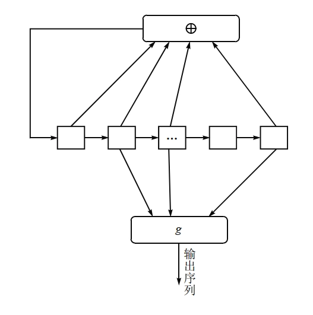

#### 组合生成器
- 若干个线性移位寄存器 $LFSR_i (i=1,…,n)$ 和一个非线性组合函数 $f$ 组成，组合函数的输出构成密钥流序列。组合生成器工作模式如下：


- 其中 $LFSR_i (i=1,\cdots,n)$ 为 $n$ 个级数分别为 $r_1,r_2,\cdots,r_n$ 的线性移位寄存器，相应的移位寄存器序列为 $\{a_{i_{j}}\} \left(i=1,\cdots,n \right)$，函数 $f \left(x_{1},x_{2},\cdots,x_{n} \right)$ 是 $n$ 元布尔函数。
- 使用组合生成器可以极大地提高序列的周期。事实上，如果 $r_1,r_2,\cdots,r_n$ 两两互质，函数 $f(x_1，x_2，\cdots，x_n)$ 与各变元均有关，则 $\{k_j\}$ 的周期为 $\prod_{i=1}^{n}(2^{r_i}-1)$

#### 钟控生成器
- 基本思想：用一个或多个移位寄存器来控制另一个或多个移位寄存器的时钟，这样的序列生成器叫做钟控生成器（clock-controlled generator），也叫停走生成器（stop and go generator），最终的输出被称为钟控序列，基本模型如图所示。


- 基本假设：$LFSR_1$ 和 $LFSR_2$ 分别输出序列 $\{a_k\}$ 和 $\{b_k\}$。当 $LFSR_1$ 输出 1 时，移位时钟脉冲通过与门使 $LFSR_2$ 进行一次移位，从而生成下一位。当 $LFSR_1$ 输出 0 时，移位时钟脉冲无法通过与门影响 $LFSR_2$，因此 $LFSR_2$ 重复输出前一位。
    - 例如:
        - $LFSR_1$ 输出周期序列 $1,0,1,0,1,1,0,1,0,1,\cdots$
        - $LFSR_2$ 输出周期为 3 的序列 $a_0,a_1,a_2,a_0,a_1,a_2,\cdots$
        - 则上述钟控生成器输出的钟控序列为 $a_0,a_0,a_1,a_1,a_2,a_0,a_0,a_1,a_1,a_2,\cdots$，周期为 5。
- 交错停走式生成器（一种钟控序列）
    - 交错停走式生成器(interleaved stop-and-go generator)是钟控生成器的一种特殊形式，由三个移位寄存器 $LFSR_1，LFSR_2$ 和 $LFSR_3$ 组成，其中 $LFSR_1$ 控制 $LFSR_2$ 和 $LFSR_3$ 的时钟，$LFSR_2$ 和 $LFSR_3$ 的输出通过异或门得到最终的输出序列，如下图所示。
    - 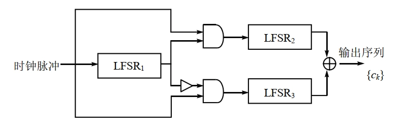
    - $LFSR_1$ 的输出是 1 时，$LFSR_2$ 被时钟驱动；当 $LFSR_1$ 的输出是 0 时，$LFSR_3$ 被时钟驱动。最后，$LFSR_1$ 的输出与 $LFSR_2$ 的输出做异或运算即为这个交错式停走生成器的输出，输出的序列具有长周期和大的线性复杂度。

## 实用流密码
- 实用流密码：RC4、A5/1、A5/2、E0等

### A5
- A5 是 GSM 中执行加密运算的流密码算法，它用于从用户手机到基站的连接加密。
- A5 中的钟控机制是：如果在某一时刻钟控单元中三个值的某两个或三个相同，则对应的移位寄存器在下一时刻被驱动，而剩下的一个（或 0 个）值对应的移位寄存器则停走。


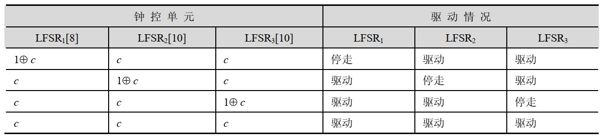
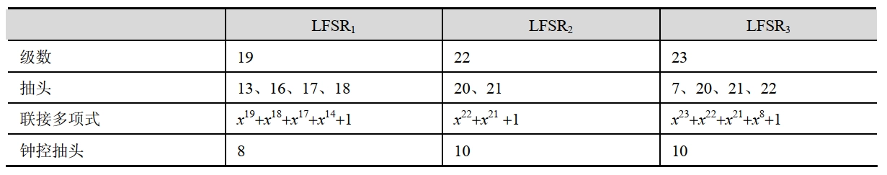

- A5算法的效率很高，输出的序列统计性好，能够通过所有的已知测试。但使用的移位寄存器太短，极易受穷尽攻击。若A5采用级数较长的移位寄存器则会更安全。

### RC4
- RC4 是由 Ron Rivest 在 1987 年设计的一种流密码算法，是目前应用最广泛的流密码算法之一。RC4 的核心是一个伪随机字节生成器，RC4 的加密和解密过程相同，都是将明文或密文与伪随机字节流进行逐字节异或运算
- 相关参数：
    - 参数 $n$，长为 $n$ 的秘密内部状态($2^n$ 数组)，通常取 $n=8$
    - 对应的内部状态由 $256=2^8$ 个元素 $S[0], \cdots, S[255]$ 构成，每个元素都是 $0\sim 255$ 间的一个数字
    - 输入是一个可变长度的密钥，该密钥用于初始化内部状态。
    - 输出是状态中按照一定方式选出的某一个元素 $K$，该输出构成密钥流的一个字节，加解密时这个字节 $K$ 与一个明文/密文字节执行 $XOR$ 运算。
    - 每生成一个 $K$ 值，内部状态中的元素会被重新置换一次，以便下次生成 $K$ 值
- RC4 算法：
    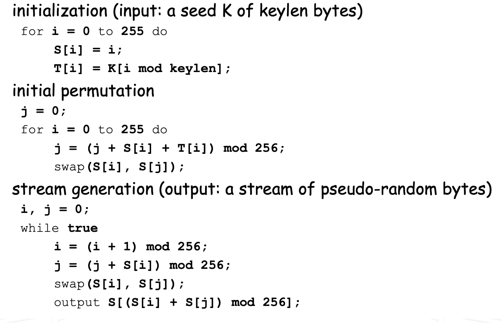
- 密钥调度算法：
    - 用来设置内部状态 $S[0], \cdots, S[255]$ 的随机排列
    - 开始时，内部状态被初始化为 $0\sim 255$，即 $S[i]=i(i=0,\cdots,255)$
    - 密钥长度可变，假设为 $L$ 个字节，$(K[0], \cdots, K[L−1])$，一般 $L$ 在 5～32 之间
    - 用这 $L$ 个字节不断重复填充，直至得到 $(K[0], \cdots, K[255])$。数组 $K$ 将被用于对内部状态 $S$ 进行随机化
    - 
- 伪随机生成算法：
    - 它从内部状态中选取一个随机元素作为密钥流中的一个字节，并修改内部状态以便下一次选取。选取过程取决于两个索引值 $i$ 和 $j$，它们的初始值均为 0。具体选取过程如下：
    - 

## 轻量级密码算法
- 轻量级密码算法（lightweight cryptography）是指在资源受限的环境下使用的密码算法，通常用于物联网设备、嵌入式系统和智能卡等场景。
- 资源受限环境终端设备的特点
    - 数量巨大（电卡、汽车ETC等）
    - 内存资源较少
    - 处理（计算）能力有限
    - 功耗要求严格

# 公钥密码

- 公钥密码算法，又称非对称密码算法，是指加密和解密使用不同密钥的密码算法。
- 对称加密体制的缺陷
    - 密钥分配问题：通信双方要进行加密通信，需要通过秘密的安全信道来协商加密密钥，而这种安全信道可能很难实现
    - 密钥管理问题：在有多个用户的网络中，任何两个用户之间都需要有共享的秘密钥，当网络中的用户 $n$ 很大时，需要管理的密钥数目是非常大 $n(n−1)/2$
    - 没有签名功能：当主体 A 收到主体 B 的电子文档（电子数据）时，无法向第三方证明此电子文档却是来源于 B

## 公钥密码体制的基本原理
- Public-Key / Two-key / Asymmetric Cryptography
    - 公钥（Public Key）：加密密钥，任何人都可以知道，用于加密或者验证签名
    - 私钥（Private Key）：解密密钥，只有密钥拥有者知道，用于解密或者签名
    - 加密或验证签名者不能解密或生成签名
- 公钥加密方案
    
- 公钥密码理论：
    - 由私钥及其他密码信息容易计算出公钥
    - 由公钥及算法描述，计算出私钥在计算上不可行
    - 由公钥及密文，计算出对应的明文在计算上不可行
    - 因此，公钥可以发布给其他人
    - 密钥分配问题不是一个容易的问题
- 公钥算法分类
    - Public-Key Distribution Schemes (PKDS)
        - 用于交换秘密信息（依赖于双方主体）
        - 常用于对称加密算法的密钥
    - Public-Key Encryption (PKE)
        - 用于加密任何消息
        - 任何人可以用公钥加密消息
        - 只有私钥拥有者可以解密消息
        - 任何公钥加密方案能够用于密钥分配方案 PKDS
        - 许多公钥加密方案也是数字签名方案
    - Signature Schemes (SS)
        - 用于生成对某消息的数字签名
        - 私钥拥有者生成签名
        - 任何人都可以用公钥验证签名
- 公钥的安全性
    - 依赖于足够大的困难性差别
    - 类似于对称算法，穷搜索理论上可以破解公钥密码
    - 但实际上，密钥足够长（>512-bit），穷搜索不可行
    - 一般情况下，有一些已知的困难问题
    - 要求足够大的密钥长度（>512-bit）
    - 导致加密速度比对称算法慢

## Diffie-Hellman 密钥交换协议
- 公钥分配方案
    - 不能用于交换任意消息
    - 可以建立共享密钥（双方共享）
    - 依赖于双方的公私钥值
    - 基于有限域上的指数问题
    - 安全性是**基于计算离散对数的困难性**

### Diffie-Hellman Setup
- 两个通信主体 A 和 B 希望在公开信道上建立密钥
- 初始化：
    - 选择一个大素数 $p$ 和一个生成元 $g$ ($1 < g < p$)
    - $p$ 和 $g$ 公开
- 密钥生成：
    - A 选择一个私钥 $x_A$ ($1 < x_A < p$)
    - B 选择一个私钥 $x_B$ ($1 < x_B < p$)
    - A 计算公钥 $y_A = g^{x_A} \bmod p$
    - B 计算公钥 $y_B = g^{x_B} \bmod p$
    - A 和 B 分别公开各自的公钥 $y_A$ 和 $y_B$
- 密钥计算：
    - A 计算共享密钥 $K_{AB} = y_B^{x_A} \bmod p = g^{x_A x_B} \bmod p$
    - B 计算共享密钥 $K_{AB} = y_A^{x_B} \bmod p = g^{x_A x_B} \bmod p$
    - 由于模幂运算的性质，A 和 B 计算出的共享密钥 $K_{AB}$ 是相同的
- 示例：
    - 选取素数 $p=97$, 及生成元 $g=5$
    - Alice 选取秘密 $x_A=36$ & 计算公钥 $y_A=5^{36}=50 \bmod 97$
    - Bob 选取秘密 $x_B=58$ & 计算公钥 $y_B=5^{58}=44 \bmod 97$
    - Alice and Bob 交换公钥
    - Alice 计算公享秘密 $K=44^{36}=75 \bmod 97$
    - Bob 计算公享秘密 $K=50^{58}=75 \bmod 97$

### Diffie-Hellman in Practice
- 两个主体每次可以选择新的私钥，并计算及交换新的公钥
- 可以抵挡被动攻击，但不能抵挡主动攻击
- 每次可以给出一个新的共享密钥
- 为抵抗主动攻击（如中间人攻击），需要其他新的协议，也可以建立长期公钥

### Man-in-the-Middle Attack（中间人攻击）
- 两个通信主体 A 和 B，以及一个攻击者 E
- 初始化：
    - 选择一个大素数 $p$ 和一个生成元 $g$ ($1 < g < p$)
    - $p$ 和 $g$ 公开
- 密钥生成：
    - A 选择一个私钥 $x_A$ ($1 < x_A < p$)，计算公钥 $y_A = g^{x_A} \bmod p$
    - B 选择一个私钥 $x_B$ ($1 < x_B < p$)，计算公钥 $y_B = g^{x_B} \bmod p$
- 密钥计算：
    - A 将公钥 $y_A$ 发送给 B，但被 E 截获
        - E 选择一个私钥 $x_A\prime$，计算公钥 $y_A\prime = g^{x_A\prime} \bmod p$ 发送给 B
    - B 将公钥 $y_B$ 发送给 A，但被 E 截获
        - E 选择一个私钥 $x_B\prime$，计算公钥 $y_B\prime = g^{x_B\prime} \bmod p$ 发送给 A
    - A 和 E 共享密钥 $K_{AE} = (y_B\prime)^{x_A} \bmod p = g^{x_A x_B\prime} \bmod p$
    - B 和 E 共享密钥 $K_{BE} = (y_A\prime)^{x_B} \bmod p = g^{x_A\prime x_B} \bmod p$
- 结果：
    - A 和 E 共享密钥 $K_{AE}$
    - B 和 E 共享密钥 $K_{BE}$
    - A 和 B 之间没有共享密钥

## RSA 公钥加密算法
- 使用最广泛的公钥加密算法
    - 由 Ron Rivest, Adi Shamir 和 Leonard Adleman 在 1977 年提出
    - **基于大整数分解的困难性**

### RSA 密钥生成
- 随机选择两个大素数 $p$ 和 $q$（>500-bit）
    - 计算模数 $n = p \times q$
    - 计算欧拉函数 $\phi(n) = (p-1)(q-1)$
- 随机选择一个加密指数 $e$，满足 $1 < e < \phi(n)$ 且 $\gcd(e, \phi(n)) = 1$
    - 计算解密指数 $d$，满足 $d \times e \equiv 1 \bmod \phi(n)$ 且 $1 < d < \phi(n)$
- 得到密钥对：
    - 公钥为 $K = \{e, n\}$
    - 私钥为 $K^{-1} = \{d, p, q\}$

### RSA 参数选择
- 需要选择足够大的素数 $p$ 和 $q$（>500-bit）
- 通常选择小的加密指数 $e$，且与 $\phi(n)$ 互质
    - 常用 $e$ 的值为 $3, 17, 65537 (= 2^{16} + 1)$
    - $e$ 对所有用户可以是相同的
    - 最初建议使用 $e=3$
- 解密指数 $d$ 比较大

### RSA 加解密算法
- 加密：
    - 使用公钥 $K = \{e, n\}$
    - 将消息 $m$ 映射为整数 $0 \leq m < n$
    - 计算密文 $c = m^e \bmod n$
- 解密：
    - 使用私钥 $K^{-1} = \{d, p, q\}$
    - 计算明文 $m = c^d \bmod n$
- 示例：
    1. 选素数 $p=47$ 和 $q=71$，得 $n=pq=47\times 71=3337$，$\phi(n)=(p-1)(q-1)=46\times 70=3220$
    2. 选择 $e=79$，求得解密指数 $d=e^{-1}\bmod \phi(n)=1019$
    3. 公开公钥 $K=\{n=3337, e=79\}$，保留私钥 $K^{-1}=\{d=1019, p=47, q=71\}$
    4. 现要发送明文 $688$，计算：$688^{79} \bmod 3337=1570$
    5. 收到密文 $1570$ 后，用私钥 $d=1019$ 进行解密：$1570^{1019} \bmod 3337=688$

### RSA 理论
- 基于 Fermat‘s Theorem
    - 如果 $n = pq$，其中 $p, q$ 是素数，则有：$X^{(\phi(n))} = 1 \bmod n$，对于所有与 $n$ 互质的 $x$，即 $\gcd(x, n) = 1$，其中 $\phi(n) = (p−1)(q−1)$。
    - 在 RSA 中，$e$ 和 $d$ 是经过特殊选择的：
        - 即 $e \cdot d = 1 \bmod \phi(n)$ 或 $e \cdot d = 1 + R \cdot \phi(n)$。
    - 因此可以推导出：
        $$
        C^d = M^{(e \cdot d)} = M^{(1 + R \cdot \phi(n))} = M^1 \cdot (M^{(\phi(n))})^R = M^1 \cdot 1^R = M^1 \bmod n = M
        $$
    - 这表明解密后的明文 $M$ 与加密前的明文一致。
- 相关理论
    
    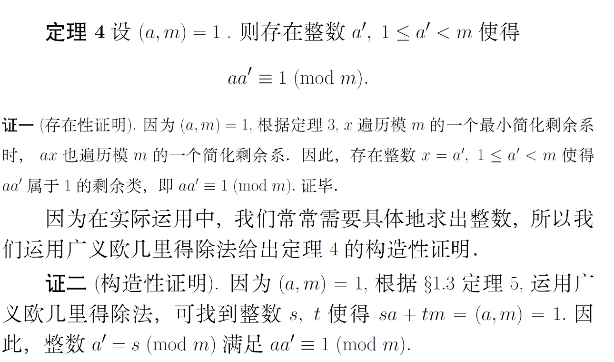
- RSA 加密实质上是一种 $\mathbb{Z}_n \rightarrow \mathbb{Z}_n$ 上的单表代换
    - 给定 $n = p \times q$ 和合法明文 $m \in \mathbb{Z}_n$，可以唯一地计算出密文 $c = (m^e \mod n) \in \mathbb{Z}_n$，对于 $m \neq m\prime$，有 $c \neq c\prime$
    - $\mathbb{Z}_n$ 中的任一元素（$0, p, q$ 的倍数除外）是一个明文，但它也是与某个明文相对应的一个密文。
    - 因此，RSA是 $\mathbb{Z}_n \rightarrow \mathbb{Z}_n$ 的一种单表代换密码，关键在于 $n$ 极大时在不知陷门信息下极难确定这种对应关系，而用模指数算法又易于实现一种给定的代换。正由于这种一一对应性使RSA不仅可以用于加密也可以用于数字签字。

### RSA 的安全性
- 基于大整数分解的困难性
    - 需要分解模 $n$ 的素因子 $p$ 和 $q$，才能计算出 $\phi(n)$，进而计算出解密指数 $d$
- 要求分解模 $n$
    - 在理论上，RSA的安全性取决于模 $n$ 分解的困难，但数学上至今还未证明分解模就是攻击RSA的最佳方法，也未证明分解大整数就是NP问题，可能有尚未发现的多项式时间分解算法。
    - 人们完全可以设想有另外的途径破译 RSA，如求解密指数 $d$ 或找到 $(p_1-1)(p_2-1)$ 等。
    - 但这些途径都不比分解 $n$ 来得容易。甚至 Alexi 等在 1988 曾揭示，从 RSA 加密的密文恢复某些 bit 的困难性也和恢复整组明文一样困难。
- 采用广义数域筛选分解不同长度 RSA 公钥模所需的计算机资源

    |密钥长(bit)| 所需的MIPS-年|
    |----------|--------------|
    | 116(Blacknet密钥) |  400 |
    | 129 |  5,000 |
    | 512 |  30,000 |
    | 768 |  200,000,000 |
    | 1024 |  300,000,000,000 |
    | 2048 |  300,000,000,000,000,000,000 |
    - MIPS-年指以每秒执行1,000,000条指令的计算机运行一年

### RSA 的实现问题
- 需要计算模 300 digits (or 1024+ bits) 的乘法
    - 计算机不能直接处理这么大的数（计算速度很慢）
    - 需要考虑其它技术，加速 RSA 的实现
- RSA 的快速实现
    - 加密很快，指数小
    - 解密比较慢，指数较大
    - 利用中国剩余定理 CRT：对 RSA 解密算法生成两个解密方程（利用 $M = C^d \mod R$ ）
        - 即：
            $$
            \begin{aligned}
            M_1 = M \bmod p\\
            M_2 = M \bmod q
            \end{aligned}
            $$
        - 解方程：
            $$
            \begin{aligned}
            M = M_1 \bmod p\\
            M = M_2 \bmod q
            \end{aligned}
            $$
        - 具有唯一解（利用 CRT）：$M = (q \cdot q' \cdot M_1 + p \cdot p' \cdot M_2) \bmod R$
            - 其中 $q \cdot q' \bmod p = 1 ,   p \cdot p' \bmod q = 1$
    - 

## RABIN 公钥密码体制
- **第一个可证安全的公钥加密方案**
- **基于模合数下求平方根的困难性，即二次剩余问题**
- 说明：
    - 二次剩余问题，给定一个奇合数 $n$ 和整数 $a$，判断 $a$ 是否为 $\bmod n$ 的平方剩余或二次剩余，即判断是否存在整数 $x$ 使得 $x^2 \equiv a \bmod n$
    - 模 $n$ 的平方根问题(SQROOT)，在 $n$ 的分解未知的情况下，求模 $n$ 的平方根，即求解同余式 $x^2 \equiv a \bmod n$
    - 在模 $n = pq$ 的分解未知情况下，上述问题均为困难问题
- 进一步说明：
    - RSA 的破译难度不超过大数分解
    - Rabin 的提出是对 RSA 的一种修正
    - 可以证明对它的破译等价于对 $n$ 的分解
    - RSA 是选择加密密钥 $e$ 满足 $1 \leq e < \phi(n)$ 且 $(e, \phi(n)) = 1$，Rabin 是取 $e = 2$

### 二次剩余的概念
- 令 $QR_n$ 表示模 $n$ 的二次剩余集合，$QR_n \triangleq \{a \mid \exists x \in Z, x^2 \equiv a \bmod n\}$
    - $Z$ 表示整数集合
    - 即若存在 $x \in Z$ 满足 $x^2 \equiv a \bmod n$，则称 $a \in QR_n$，表 $a$ 为模 $n$ 的二次剩余，否则 $a \notin QR_n$ 或称 $a$ 为非二次剩余。非二次剩余集合用 $NQR_n$ 表示它。
- **定理1**：假定 $n = p_1 p_2$，$p_1$ 和 $p_2$ 是不相同的素数，$Z_n$ 中有 $(p_1−1)(p_2−1)/4$ 个元素属于 $QR_n$，每个属于 $QR_n$ 的元素有 $4$ 个平方根。
- **定理2**：若 $\alpha$ 和 $\gamma$ 属于本质上不同的 $\beta$ 的平方根, 且 $\alpha$ 和 $\gamma$ 为小于 $n/2$ 的正整数，$\alpha$ 和 $\gamma$ 满足 $x^2 \equiv \beta \mod n$
    - 则 $\gcd(\alpha+\gamma,m)=p_1$, 或 $\gcd(\alpha+\gamma,m)=p_2$, 其中必有一式成立。

### RABIN 密钥生成
- 令 $p$ 和 $q$ 是两个素数，在模 4 下与 3 同余（即 $p \bmod 4 = q \bmod 4 = 3$），计算 $n=pq$（这样的 $n$ 成为 blum 整数）。
- 公钥为 $K=\{n\}$
- 私钥为 $K^{-1}=\{p,q\}$

### RABIN 加解密算法
- 加密：设 $M$ 为待加密消息，计算密文
    $$
    C=M^2 \bmod n, \quad 0 \leq M < n
    $$
- 解密：计算
    $$
    \begin{aligned}
    &\begin{cases}
    W_1 = C^{(p+1)/4} \bmod p \\
    W_2 = p - C^{(p+1)/4} \bmod p \\
    W_3 = C^{(q+1)/4} \bmod q \\
    W_4 = q - C^{(q+1)/4} \bmod q
    \end{cases} \\
    &\begin{cases}
    u = q \cdot (q^{-1} \bmod p) \\
    v = p \cdot (p^{-1} \bmod q)
    \end{cases} \\
    &\begin{cases}
    M_1 = (u \cdot W_1 + v \cdot W_3) \bmod n \\
    M_2 = (u \cdot W_1 + v \cdot W_4) \bmod n \\
    M_3 = (u \cdot W_2 + v \cdot W_3) \bmod n \\
    M_4 = (u \cdot W_2 + v \cdot W_4) \bmod n
    \end{cases}
    \end{aligned}
    $$
    - 利用中国剩余定理，可以得到 $4$ 个解 $M_1, M_2, M_3, M_4$，其中必有一个与 $M$ 相同，若 $M$ 是文字消息则易于识别；若 $M$ 是随机数字流，则无法确定哪一个 $M_i$ 是正确的消息。
- 定理：
    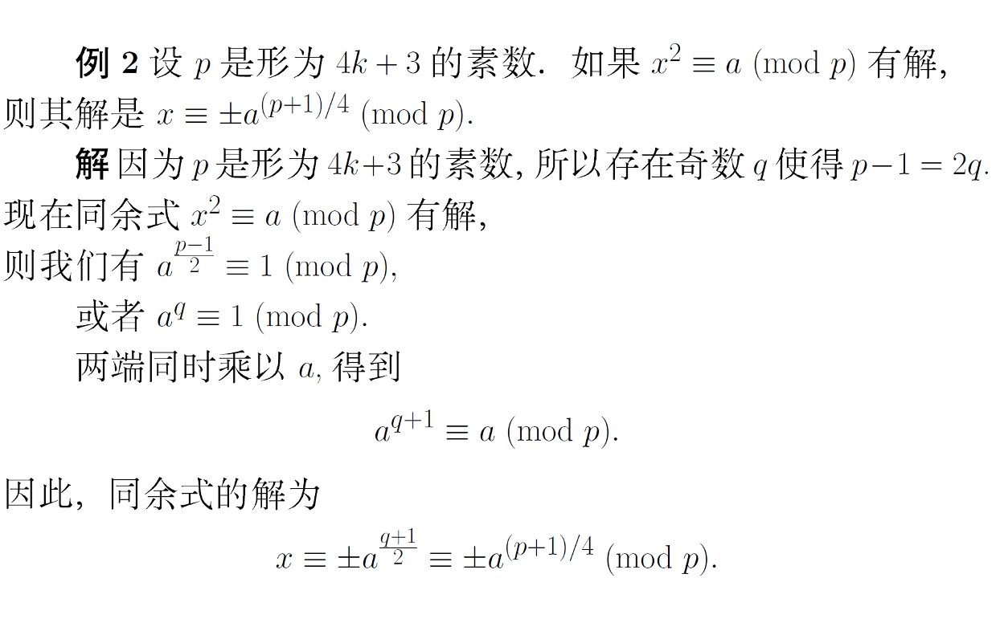
    

### RABIN 的安全性
- 定理：设 $n=pq$, $p$, $q$ 为blum整数，$x^2 \equiv a \bmod n$ 有解，则求解该同余式等价于分解大整数 $n$
    - 证明：
        - 原同余式等价于
            $$
            \begin{aligned}
            x^2 \equiv a \bmod p \\
            x^2 \equiv a \bmod q
            \end{aligned}
            $$
        - 若能求出四个解 $x_1, -x_1, x_2, -x_2$，且 $x_1$ 和 $x_2$ 模 $n$ 不同余且为小于 $n/2$ 的正整数，则由 $x_1^2 \equiv a \bmod p$ 和 $x_2^2 \equiv a \bmod q$ 可得 $x_1 \equiv x_2 \bmod n$，而 $x_1 + x_2 < n$, 不可能为 $n$ 的倍数，所以 $x_1 - x_2$ 和 $x_1 + x_2$ 分别含有 $n$ 的一个因子，也即
            $$
            \begin{aligned}
            \gcd(x_1 - x_2, n)\\
            \gcd(x_1 + x_2, n)
            \end{aligned}
            $$
        - 因此就相当于分解了整数𝑛。
        - 反之，如果知道𝑛的分解，则类似于解密过程可将同余式的四个解求出来
- 等价于对 $n$ 的因数分解
    - 选择密文攻击不安全
    - 对 Rabin 签名的选择密文攻击可以描述如下：攻击者首先随机选取整数 $r$ ，并且计算 $C = r^2 \bmod n$；如果攻击者能够成功骗取签名者对 $m$ 进行签名，他将能够以 1/2 的概率从签名 $s$ 和 $x$ 中破解 $n$ 的分解。
    - 因为签名者不知道 $x$，对 $m$ 的签名 $s$ 若不同于 $x$，即 $s \not\equiv x \bmod n$，则由定理2可从 $\gcd(s+x,n)$ 得到 $n$ 的素数因子 $p_1$ 或 $p_2$。

### RSA VS RABIN
- 安全性
- 加密
    - Rabin 仅一次乘法运算
- 解密
    - Rabin 解密比 RSA 困难，解密过程要解一个求平方根的问题，当 $(p_1−1)/2$ 和 $(p_2−1)/2$ 为奇数，要做两次幂运算，还要解中国剩余定理

## ElGamal 公钥加密方案
- Diffie-Hellman key distribution scheme 的变形
    - 能够用于安全交换密钥
    - 1985年由ElGamal提出
    - 安全性是**基于求解离散对数问题的困难性**
    - 缺点：增加了消息长度（2倍）

### ElGamal 密钥生成
- 选取一个大素数 $p$ 及生成元 $g$
- 随机选取一个私钥 $x_B$ 满足 $0 < x_B < p-1$
    - 计算公钥 $y_B = g^{x_B} \bmod p$
- 公钥为 $K = \{p, g, y_B\}$
- 私钥为 $K^{-1} = \{x_B\}$

### ElGamal 加解密算法
- 为加密 $M$:
    - **发送者**选择随机数 $k，0 < k < p−1$，$k$ 需要永久保密或销毁
    - 计算消息密钥 $K$：
        $$
        K = y_B^k \bmod p
        $$
    - 计算密文对：$C = \{C_1,C_2\}$，并发送到接收者
        $$
        \begin{aligned}
        C_1 &= g^k \bmod p\\
        C_2 &= KM \bmod p
        \end{aligned}
        $$
- 为解密 $C = \{C_1,C_2\}$:
    - **接收者**首先计算 $K$
        $$
        K = C_1^{x_B} \bmod p = g^{(k\cdot x_B)} \bmod p = y_B^k \bmod p
        $$
    - 然后利用费马小定理计算 $K^{-1}$:
        $$
        K^{-1} = K^{p-2} \bmod p
        $$
    - 计算明文 $M$:
        $$
        M = C_2\cdot K^{-1} \bmod p
        $$
- 示例：
    - 选择 $p=97$ 以及生成元 $g=5$
    - 接收者 Bob：
        - 选择私钥 $x_B=58$
        - 计算并发布公钥 $y_B=5^{58} \bmod 97 = 44$
    - Alice 要加密 $M=3$
        - 首先得到 Bob 的公开密钥 $y_B=44$
        - 选择随机 $k=36$ 计算: $K=44^{36} \bmod 97 = 75$
        - 计算密文对:
            $$
            \begin{aligned}
            C_1 &= g^k \bmod p = 5^{36} \bmod 97 = 50\\
            C_2 &= K\cdot M \bmod p = 75\cdot 3 \bmod 97 = 31
            \end{aligned}
            $$
        - 发送 $\{50,31\}$ 给 Bob
    - Bob 接收密文 $\{50,31\}$
        - 恢复 $K=50^{58} \bmod 97 = 75$
        - 计算 $K^{-1} = 22 \bmod 97$
        - 恢复明文 $M = (31\cdot 22) \bmod 97 = 3$

## 公钥密码现状
- 已知的安全算法是有限域上指数运算素数域 $GF(p)$ 上的整数运算
    - 多项式运算 $GF(2^n)$
    - 椭圆曲线上的运算
    - 基于其它困难问题的体制
    - NTRU
- 实际应用
    - 实现速度较慢
        - 通常用于交换对称算法的加密密钥
        - 数字签名算法

### 简单攻击方法（弱参数攻击，以 RSA 为例）
#### 共模攻击
- 当多个用户使用相同的模数 $n$，使用不同的公钥指数 $e$ 对同一明文 $x$ 进行加密时，攻击者可通过共模攻击还原出明文 $x$。
- 攻击条件
    1. 使用相同的模数 $n$
    2. 对同一明文 $x$ 加密
    3. 各公钥指数 $e_1,e_2,\cdots,e_k$ 之间两两互质
- 攻击原理（以两个用户为例）
    1. 设 $e_1$ 和 $e_2$ 是两个互素的不同密钥，共用模为 $n$，对同一消息 $x$ 加密得
        $$
        \begin{aligned}
        y_1 &= x^{e_1} \bmod n \\
        y_2 &= x^{e_2} \bmod n
        \end{aligned}
        $$
    2. 攻击者已知 $n,y_1,y_2,e_1,e_2$，由于 $\gcd(e_1,e_2)=1$，所以存在整数 $a,b$ 使得 $e_1a+e_2b=1$。
    3. 计算明文：
        $$
        \begin{aligned}
        x &= (y_1^a \cdot y_2^b) \bmod n \\
        &= (x^{e_1})^a \cdot (x^{e_2})^b \bmod n \\
        &= x^{e_1a + e_2b} \bmod n \\
        &= x^1 \bmod n \\
        &= x
        \end{aligned}
        $$

#### 低加密指数攻击
- 当公钥指数 $e$ 取过小值（如 $e=3$、$e=17$）时，若同一明文被多次加密（或加密后数据满足特定条件），攻击者可通过数学运算直接还原明文，无需破解私钥。
- 攻击条件
    1. 公钥指数 $e$ 取较小值，典型值为 $e=3$ 或 $17$
    2. 同一明文 $x$ 被不同的模数 $n_1,n_2,\cdots,n_k$ 多次加密
- 攻击原理（以 $e=3$ 为例）
    1. 设有三个用户，公钥分别为 $(e=3,n_1)$、$(e=3,n_2)$ 和 $(e=3,n_3)$，对同一消息 $x$ 加密得密文
        $$
        \begin{aligned}
        y_1 &= x^3 \bmod n_1 \\
        y_2 &= x^3 \bmod n_2 \\
        y_3 &= x^3 \bmod n_3
        \end{aligned}
        $$
    2. 攻击者已知 $n_1,n_2,n_3,y_1,y_2,y_3$，可利用中国剩余定理求解以下同余方程组
        $$
        \begin{aligned}
        X &\equiv y_1 \bmod n_1 \\
        X &\equiv y_2 \bmod n_2 \\
        X &\equiv y_3 \bmod n_3
        \end{aligned}
        $$

        若 $n_1,n_2,n_3$ 互素，则该方程组有唯一解 $X$ 满足 $0 \leq X < N$，其中 $N = n_1 n_2 n_3$
    3. 计算明文：
        $$
        x = \sqrt[3]{X}
        $$
- 为对抗该攻击，建议公钥指数 $e$ 取较大值（如 $e=2^{16}+1=65537$），或在加密前对明文进行填充处理（如使用 OAEP 填充方案）。
- 当 $e < n$，$d < n/4$ 时，同样可以攻破这类 RSA 系统


# 认证与哈希函数

## 消息认证
- 认证的定义：
    - 认证 (Authentication) 是防止主动攻击的重要技术，对开发系统安全性有重要作用
- 认证的主要目的
    - **实体认证**（验证发送者非冒充）
    - **消息认证**（验证信息的完整性）
- 网络环境中的攻击（认证的需求）
    1. 泄漏
    2. 通信量分析
    3. 伪装（假消息）
    4. 内容篡改（插入，删除，调换和修改）
    5. 序号篡改（消息序号的修改）
    6. 计时篡改（消息延迟或回放）
    7. 抵赖（否认收或发某消息）
    - 1-2 加密，3-6 消息认证，7 数字签名
- 认证系统模型
    - **保密**和**认证**是信息系统安全的两个方面，但它们是两个不同属性的 问题，认证不能自动提供保密性，而保密性也不能自然提供认证功能。一个纯认证系统的模型如下图所示：
        

## 消息认证方法（认证函数）
- 为了认证消息的**完整性**和**未被篡改**，需要对消息生成某种形式上的认证符，通过对认证符的分析，可以得知原始消息是否完整，是否被修改。
- 三类主要的消息认证方法 / 认证函数：
    - 消息加密
        - 将整个需要认证的消息加密，将**密文**作为认证符。
    - 消息认证码（MAC）
        - 将需要认证的消息通过一个公共函数作用，**产生的结果和使用的密钥**一起作为认证符
    - 哈希函数（哈希函数）
        - 将需要认证的消息通过一个公共函数映射为定长的哈希值，以**哈希值**作为认证符
- 注意
    - 认证函数类似加密函数，但它是**不可逆**的，这个性质使其比加密函数更难破解
    - 认证函数并不提供数字签名，因为认证函数是对称的，发送者和接收者使用相同的密钥

### 消息加密
#### 对称加密
- 下图的通信双方，用户 A 为发送方，用户 B 为接收方。用户 B 接收到信息后，通过解密来判决信息是否来自 A，信息是否是完整的，有无窜扰。
    
- $A \rightarrow B:  E(K, M)$
    - **具有保密性**
        - 仅 A 和 B 共享密钥 $K$
    - 提供一定程度的**可认证性**
        - 讯息是否来自 A
            - 仅 A 和 B 共享密钥 $K$，消息仅可能来自 A
            - 密钥泄露则认证失效
        - 传输中是否被篡改
            - 收到密文解密得到乱码无法判断是被篡改还是传输错误
            - 需要某种结构或冗余
    - 不提供签名
        - 发送者可以否认消息，声称是接受者伪造的
- 基于 DES 的消息鉴别码
    - 被鉴别消息分成连续的 64-bit 分组：$M_1, M_2, \cdots, M_n$（必要时用 0 填充）
    - 使用DES算法 $E(CBC)$，密钥 $K$，数据鉴别码计算如下:
        $$
        \begin{aligned}
        C_1  &=  E_k (M_1) \\
        C_2  &=  E_k (M_2 \oplus C_1) \\
        &\vdots \\
        C_n  &=  E_k (M_n \oplus C_{n-1})
        \end{aligned}
        $$

#### 公钥加密
- $A \rightarrow B : E(PK_B, M)$
    - 发送方用接收方的公钥加密消息，接收方用私钥解密（与对称密钥加密原理相同，需要某种特定消息结构）
    - **具有保密性**
        - 消息只能被 B 解密
    - **不提供认证**
        - 任何人都可以用 $B$ 的公钥加密消息并发送给 $B$，无法确认消息来自 $A$
    - 
- $A \rightarrow B : E(SK_A, M)$
    - 发送方用自己的私钥加密消息，接收方用发送方的公钥解密
    - **提供认证和签名**
        - 只有 A 能生成该密文，B 用 A 的公钥解密后能确认消息来自 A
    - **不提供保密性**
        - 任何人都可以用 A 的公钥解密消息
    - 
- $A \rightarrow B : E(PK_B, E(SK_A, M))$
    - 发送方先用自己的密钥加密以提供认证，然后使用接收方公钥加密提供保密性。缺点是效率不高。
    - **具有保密性**
        - 消息只能被 B 解密
    - **提供认证和签名**
        - 只有 A 能生成该密文，B 用 A 的公钥解密后能确认消息来自 A
    - 

### 消息认证码 MAC
- 认证码（MAC，Message Authentication Code），也称密码检验和
    - 对选定消息 $M$，使用一个密钥 $K$，通过一个编码函数 $C$ 产生一个短小的定长数据分组 $MAC$，称认证码，并将它附加在消息中，提供认证功能
    - $MAC = C_k(M)$ ，其中:
        - $M$ 是可变长的消息
        - $K$ 是共享密钥
        - $C_k(M)$ 是定长的认证码
- 应用认证码，如果只有收发方知道密钥，同时收到的 MAC 与计算得出的 MAC 匹配:
    - 确认消息未被更改
    - 确信消息来自所谓的发送者
    - 如果消息包含序号，可确信该序号的正确性
- 消息认证码的基本用法
    1. $A \rightarrow B:  M \mid\mid C_k (M)$
        - **提供认证**，因仅 A 和 B 共享 $K$;
        - 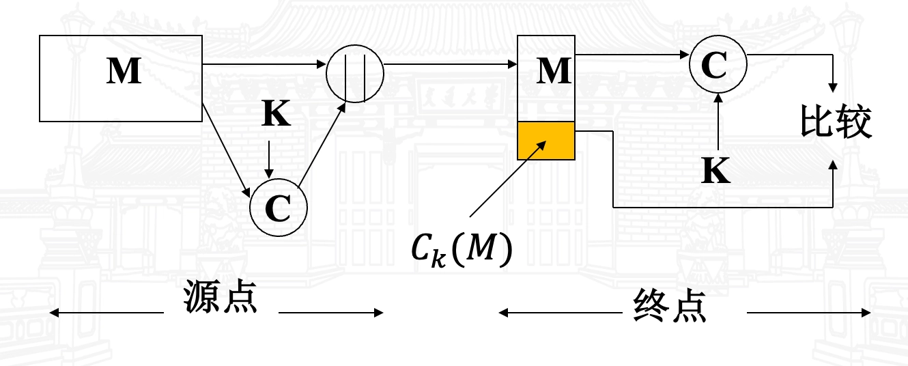
    2. $A \rightarrow B:  E_{K_2} (M \mid\mid C_{K_1} (M))$：先认证，后加密
        - **提供认证**，因仅 A 和 B 共享 $K_1$;
        - **提供保密**，因仅 A 和 B 共享 $K_2$;
        - 
    3. $A \rightarrow B:  E_{K_2} (M) \mid\mid C_{K_1} (E_{K_2} (M))$：先加密，后认证
        - **提供认证**，因仅 A 和 B 共享 $K_1$;
        - **提供保密**，因仅 A 和 B 共享 $K_2$;
        - 
- 为什么使用消息认证（而不是用常规加密）
    - 适用于消息广播
    - 消息加密解密的工作量比较大
    - 某些应用不关心消息的保密而只关心消息的真实性
    - 认证函数与保密函数的分离能提供结构上的灵活性(认证与保密可在网络协议的不同层次进行)
    - 认证码可延长消息的保护期限，同时能处理消息内容（使用加密，当消息解密后，保护就失效了）
- MAC 函数应有如下性质（假设攻击者没有 $K$）：
    - 有 $M$ 和 $C_k(M)$，试图生成 $M'$，使得 $C_k(M')= C_k(M)$，这在计算上不可行；
    - $C_k(M)$ 应能均匀分布；
        - 对于随机选取的消息 $M$ 和 $M'$，$C_k(M)= C_k(M')$ 的概率为 $2^{-n}$，其中 $n$ 为 MAC 的比特长度；
        - 消息 $M'$ 为 $M$ 的某种已知代换，即 $M' = f(M)$，则 $C_k(M)= C_k(M')$ 的概率为 $2^{-n}$

### 哈希函数
- 哈希函数 / 散列函数 / 杂凑函数
    - 哈希函数是将任意长度的消息映射成一个较短的定长输出消息的函数。
    - 如下形式：$h = H(M)$，$M$ 是变长的消息，$h$ 是定长的哈希值。
    - 哈希函数的目的是为文件、消息或其它的分组数据产生“数字指纹”（缩微图）。
- **哈希函数与认证函数的区别**？
    - 哈希函数本身不提供认证功能，只是单纯计算消息的哈希值摘要。
    - 哈希函数加上密钥就可以构成认证函数（如 HMAC）。
    - 哈希函数主要用于消息完整性验证，而认证函数主要用于身份验证和消息完整性验证。
- 使用哈希码提供消息鉴别的方式
    1. $A \rightarrow B:  E_k (M \mid\mid H(M) )$
        - 提供保密（仅 A 和 B 共享 $K$）
        - 提供鉴别（加密保护 $H(M)$）
    2. $A \rightarrow B:  M \mid\mid E_k (H(M))$
        - 提供鉴别（加密保护 $H(M)$）
    3. $A \rightarrow B:  M \mid\mid E_{K_{Ra}} (H(M))$
        - 提供鉴别和数字签名（加密保护 $H(M)$ , 且仅 A 能生成 $E_{K_{Ra}} (H(M))$）
    4. $A \rightarrow B:  E_k (M \mid\mid E_{K_{Ra}} (H(M)) )$
        - 提供鉴别和数字签名
        - 提供保密（仅 A 和 B 共享 $K$）
    5. $A \rightarrow B:  M \mid\mid H(M \mid\mid S)$
        - 提供鉴别（$S$ 是通信双方共享的一个秘密值，仅 A 和 B 共享 $S$）
    6. $A \rightarrow B:  E_k (M \mid\mid H(M \mid\mid S ))$
        - 提供鉴别（仅 A 和 B 共享 $S$）
        - 提供保密（仅 A 和 B 共享 $K$）
- 哈希函数的需求
    - $H$ 能用于任何大小的数据分组
    - $H$ 产生定长输出 $h$
    - 对任意给定的 $x$，$H(x)$ 要相对易于计算，使得软硬件实现都实际可行
    - 对任意给定的码 $h$，寻求 $x$ 使得 $H(x)=h$ 在计算上是不可行的（**单向性**）
    - 任意给定分组 $x$，寻求不等于 $x$ 的 $y$，使得 $H(y)= H(x)$ 在计算上不可行（**弱抗碰撞性**）
    - 寻求对任何的 $(x,y)$ 对使得 $H(x)=H(y)$ 在计算上不可行（**强抗碰撞性**）
- 单向函数
    - 函数 $F$ 从集合 $A$ 映射到集合 $B$，如果对任意 $A$ 中的元素 $a$，计算 $F(a)$ 是容易的，但对任意 $B$ 中的元素 $b$，要找到 $A$ 中一个元素 $a$ 满足 $b=F(a)$ 是困难的，则函数 $F$ 称为单向函数。
    - 对于单向函数 $F$，如果有了某个陷门 $k$，则计算一个元素 $a$ 满足 $b=F(a)$ 也是容易的，那么这个单向函数称为**陷门单向函数**。
- 常见的哈希函数算法
    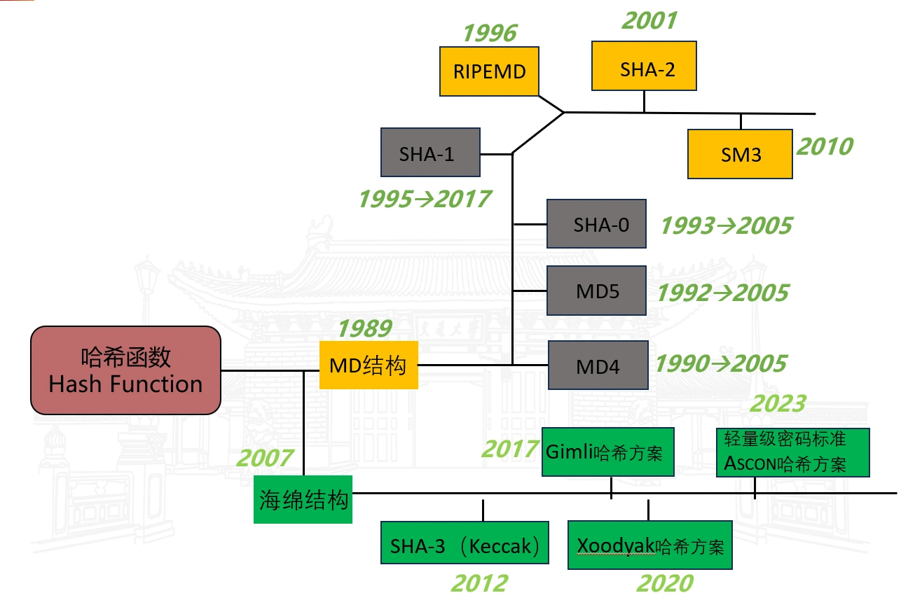

#### 简单的哈希函数构造方法
- 简单的哈希函数（异或方式）
    - 每个分组按比特异或:
        $$ C_i  =  b_{i1} \oplus b_{i2} \oplus\cdots\oplus  b_{im} $$
    - 其中：
        - $C_i$ 是第 $i$ 个比特的哈希码,  $1≤i≤n$;
        - $m$ 是输入的 $n$ 比特分组数;
        - $b_{ij}$ 是第 $j$ 分组的第 $i$ 比特;
    - 简单的奇偶校验
- 简单的哈希函数的改进方案
    - 先将 n 比特的哈希值设置为 0;
    - 按如下方式依次处理数据分组:
        - 将当前的哈希值循环左移一位.
        - 将数据分组与哈希值异或形成新的哈希值.
    - 这将起到输入数据完全随机化的效果, 并且将输入中的数据格式掩盖掉.

#### 杂凑函数的代表性设计模式
- MD 结构 (Merkle-Damgård Construction)
    

    - 其中：
        - $IV$：初值
        - $CV_i$：链接变量
        - $Y_i$：第 $i$ 个输入分组
        - $f$：压缩函数
        - $L$：输入分组数
        - $n$：杂凑输出长度
        - $b$：输入分组长度
        - 最后一组不足 $b$ 比特则填充，最后分组通常包括杂凑输入的总长度
    - 迭代：
        - 设 $M=(Y_0, \cdots, Y_L)$，则 $CV_0=IV=初始n比特值$
            $$
            \begin{cases}
            CV_i = f(CV_{i-1},Y_{i-1}),& 1\leq i\leq L\\
            H(M) = CV_L
            \end{cases}
            $$
    - 安全性：如果压缩函数是抗碰撞的，则 $H$ 是抗碰撞的。
- 海绵结构 (Sponge Construction)

## MD5
### 概述
- MD: Message Digest（报文摘要）
- Rivest 设计（RSA 中的 R）
- 符合 Merkle-Damgård 结构
- 输入：任意长度报文
- 输出：128 比特的摘要
- 分组长度：512 比特

### MD5 算法描述


1. 添加填充位（一个 $1$ 和若干个 $0$）
    - 在消息的最后添加适当的填充位使得数据位的长度满足 $length \equiv 448 \bmod 512$。
        - 需要注意：如果报文是 $448$ 比特，则填充 $512$ 比特形成 $960$ 比特的报文。填充比特首位为 $1$，其余位全 $0$。
    - 填充完后，信息的长度就为 $k \times 512+448 \mathrm{~bit}$
2. 添加长度
    - 原始消息长度（二进制位的个数）用 $64$ 位表示。如果长度超过 $2^{64}$ 位，则仅取最低 $64$ 位，即 $\bmod 2^{64}$。
    - 到此为止，我们已经得到一个 $512$ 位的整倍数长度的新的消息。
        - 可以表示为 $L$ 个 $512$ 位的数据块：$Y_0,Y_1,\cdots,Y_{L−1}$。
        - 其长度为 $L\times 512 \mathrm{~bit}$。
        - 令 $N=L\times 16$，则长度为 $N$ 个 $32$ 位的字。
        - 令 $X[0,\cdots,N-1]$ 表示以**字**为单位的消息表示。
3. 初始化 MD 缓存
    - 使用一个 $128$ 比特缓存存放杂凑的中间和最后结果。缓存表示为 $4$ 个 $32$ 比特的缓存器 $(A,B,C,D)$
    - 初始化值（16进制表示）：
        $$
        \begin{aligned}
        A &= \mathtt{67452301} \quad B = \mathtt{EFCDAB89} \\
        C &= \mathtt{98BADCFE} \quad D = \mathtt{10325476}
        \end{aligned}
        $$
    - 初始化格式：小数在前的格式存储，即字的低位字节放在高地址字节上，像32位的比特串：
        $$
        \begin{aligned}
        A &: \mathtt{01~23~45~67} \quad B : \mathtt{89~AB~CD~EF} \\
        C &: \mathtt{FE~DC~BA~98} \quad D : \mathtt{76~54~32~10}
        \end{aligned}
        $$
4. 处理 $512$ 比特（$16$ 个字）报文分组，每个分组处理包括 4 个循环，每个循环 16 步，共 $L$ 个分组。
    - 核心是一个包含 4 个循环的压缩函数 $g_i$。
        - 4 个循环结构相似，但每次使用的原始逻辑函数不同，分别记为 $F,G,H,I$。
    - 输入：
        - 当前处理的 $512$ 比特分组 $(Y_q)$
        - $128$ 比特缓存值 $(A,B,C,D)$（即上一次迭代的输出 $CV_q$）
    - 循环：
        - 使用表 $T[1, \cdots, 64]$ 的 $1/4$，该表由正弦函数给出，即 $T[i]=2^{32}×|sin⁡(𝑖)|$ 的整数部分。
        - $T$ 表提供了随机化的 $32$ 位模板，消除了在输入数据中的任何规律性的特征。
    - 输出：
        - 第 $4$ 次循环输出加到第 $1$ 次循环的输入上产生 $CV_{(q+1)}$。
        - 相加是缓存中 $4$ 个字分别与 $CV_q$ 中对应的 $4$ 个字以模 $2^{32}$ 相加。
5. 输出
    - 所有 $L$ 个 $512$ 比特的分组处理完成后，第 $L$ 个阶段的输出作为报文的 $128$ 比特摘要。

- 总结 MD5 操作如下：
    $$
    \begin{aligned}
    &CV_0 = IV \\
    &CV_{(q+1)} = SUM_{32} (CV_q, RF_I [Y_q, RF_H [Y_q, RF_G [Y_q, RF_F [Y_q, CV_q]]]] ) \\
    &MD5 = CV_L
    \end{aligned}
    $$
    - 其中
        - $SUM_{32}$：对输入对中的每个字执行模 $2^{32}$ 加
        - $IV$：缓存 $ABCD$ 的初值，第3步定义
        - $Y_q$：第 $q$ 个长度为 $512$ 比特的报文分组
        - $L$：报文的分组数
        - $CV_q$：处理第 $q$ 个报文分组时的连续变量
        - $RF_x$：使用原始逻辑函数 $x$ 的循环函数
        - $MD5$：最终的报文摘要

### 单个 512-bit 分组的 MD5 处理过程
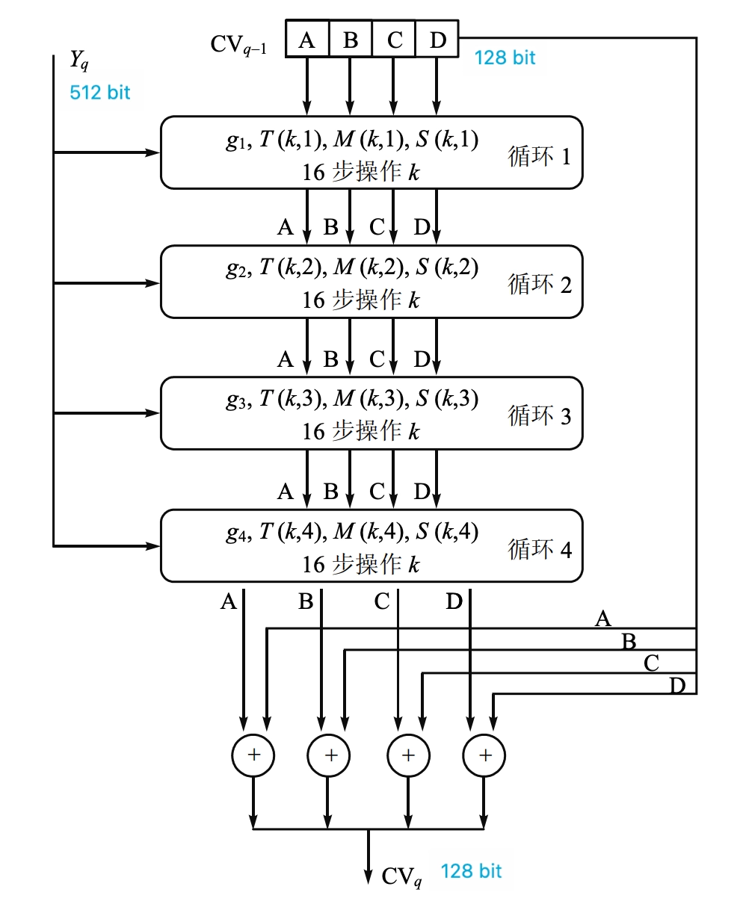

### MD5 的压缩函数


- $f$ 由 4 个循环组成，每个循环包括 16 步操作，每一步的基本形式如下：
    $$
    \begin{aligned}
    &A \leftarrow D \\
    &B \leftarrow B + ((A + g_i(B, C, D) + M(k,i) + T(k,i)) \lll s(k,i)) \\
    &C \leftarrow B \\
    &D \leftarrow C \\
    \end{aligned}
    $$
- 其中：
    - $A,B,C,D$：缓存中的4个字，在每一步有指明的顺序
    - $i$：当前循环编号，$i=1,\cdots,4$
    - $k$：当前步骤编号，$k=1,\cdots,16$
    - $g_i$：第 $i$ 轮的逻辑函数，原始函数 $F,G,H,I$ 中的一个
        $$
        \begin{aligned}
        g_1 &= F(B,C,D) = (B\land C)\lor(\lnot B\land D)\\
        g_2 &= G(B,C,D) = (B\land D)\lor(C\land\lnot D)\\
        g_3 &= H(B,C,D) = B\oplus C\oplus D\\
        g_4 &= I(B,C,D) = C\oplus\bigl(B\lor\lnot D\bigr)
        \end{aligned}
        $$
    - $M(k,i)$：对应于当前分组按字划分的 $X[1,\cdots,16]$ 中的某一个 32 比特字
        $$
        \begin{aligned}
        M(k,1) &= X[k] \\
        M(k,2) &= X[(1+5(k-1)) \bmod16] \\
        M(k,3) &= X[(5+3(k-1)) \bmod16] \\
        M(k,4) &= X[(7(k-1)) \bmod16]
        \end{aligned}
        $$
    - $T(k,i)$：矩阵 $T$ 中的常数
        - $T[k] = \lfloor 2^{32} \times |\sin(k+16(i-1))| \rfloor$
    - $\lll s(k,i)$：32 比特的字循环左移 $s(k,i)$ 位
        
    - $+$：在 $\bmod 2^{32}$ 下进行的加法


```plaintext
# Round 1
A = FF(A, B, C, D, X[0], 7, 0xd76aa478)
B = FF(B, A, C, D, X[1], 12, 0xe8c7b756)
C = FF(C, B, A, D, X[2], 17, 0x242070db)
D = FF(D, C, B, A, X[3], 22, 0xc1bdceee)
A = FF(A, B, C, D, X[4], 7, 0xf57c0faf)
B = FF(B, A, C, D, X[5], 12, 0x4787c62a)
C = FF(C, B, A, D, X[6], 17, 0xa8304613)
D = FF(D, C, B, A, X[7], 22, 0xfd469501)
A = FF(A, B, C, D, X[8], 7, 0x698098d8)
B = FF(B, A, C, D, X[9], 12, 0x8b44f7af)
C = FF(C, B, A, D, X[10], 17, 0xffff5bb1)
D = FF(D, C, B, A, X[11], 22, 0x895cd7be)
A = FF(A, B, C, D, X[12], 7, 0x6b901122)
B = FF(B, A, C, D, X[13], 12, 0xfd987193)
C = FF(C, B, A, D, X[14], 17, 0xa679438e)
D = FF(D, C, B, A, X[15], 22, 0x49b40821)

# Round 2
A = GG(A, B, C, D, X[1], 5, 0xf61e2562)
B = GG(B, A, C, D, X[6], 9, 0xc040b340)
C = GG(C, B, A, D, X[11], 14, 0x265e5a51)
D = GG(D, C, B, A, X[0], 20, 0xe9b6c7aa)
A = GG(A, B, C, D, X[5], 5, 0xd62f105d)
B = GG(B, A, C, D, X[10], 9, 0x02441453)
C = GG(C, B, A, D, X[15], 14, 0xd8a1e681)
D = GG(D, C, B, A, X[4], 20, 0xe7d3fbc8)
A = GG(A, B, C, D, X[9], 5, 0x21e1cde6)
B = GG(B, A, C, D, X[14], 9, 0xc33707d6)
C = GG(C, B, A, D, X[3], 14, 0xf4d50d87)
D = GG(D, C, B, A, X[8], 20, 0x455a14ed)
A = GG(A, B, C, D, X[13], 5, 0xa9e3e905)
B = GG(B, A, C, D, X[2], 9, 0xfcefa3f8)
C = GG(C, B, A, D, X[7], 14, 0x676f02d9)
D = GG(D, C, B, A, X[12], 20, 0x8d2a4c8a)

# Round 3
A = HH(A, B, C, D, X[5], 4, 0xfffa3942)
B = HH(B, A, C, D, X[8], 11, 0x8771f681)
C = HH(C, B, A, D, X[11], 16, 0x6d9d6122)
D = HH(D, C, B, A, X[14], 23, 0xfde5380c)
A = HH(A, B, C, D, X[1], 4, 0xa4beea44)
B = HH(B, A, C, D, X[4], 11, 0x4bdecfa9)
C = HH(C, B, A, D, X[7], 16, 0xf6bb4b60)
D = HH(D, C, B, A, X[10], 23, 0xbebfbc70)
A = HH(A, B, C, D, X[13], 4, 0x289b7ec6)
B = HH(B, A, C, D, X[0], 11, 0xeaa127fa)
C = HH(C, B, A, D, X[3], 16, 0xd4ef3085)
D = HH(D, C, B, A, X[6], 23, 0x04881d05)
A = HH(A, B, C, D, X[9], 4, 0xd9d4d039)
B = HH(B, A, C, D, X[12], 11, 0xe6db99e5)
C = HH(C, B, A, D, X[15], 16, 0x1fa27cf8)
D = HH(D, C, B, A, X[2], 23, 0x289b7ec6)

# Round 4
A = II(A, B, C, D, X[0], 6, 0xf4292244)
B = II(B, A, C, D, X[7], 10, 0x432aff97)
C = II(C, B, A, D, X[14], 15, 0xab9423a7)
D = II(D, C, B, A, X[5], 21, 0xfc93a039)
A = II(A, B, C, D, X[12], 6, 0x655b59c3)
B = II(B, A, C, D, X[3], 10, 0x8f0ccc92)
C = II(C, B, A, D, X[10], 15, 0xffeff47d)
D = II(D, C, B, A, X[1], 21, 0x85845dd1)
A = II(A, B, C, D, X[8], 6, 0x6fa87e4f)
B = II(B, A, C, D, X[15], 10, 0xfe2ce6e0)
C = II(C, B, A, D, X[6], 15, 0xa3014314)
D = II(D, C, B, A, X[13], 21, 0x4e0811a1)
A = II(A, B, C, D, X[4], 6, 0xf7537e82)
B = II(B, A, C, D, X[11], 10, 0xbd3af235)
C = II(C, B, A, D, X[2], 15, 0x2ad7d2bb)
D = II(D, C, B, A, X[9], 21, 0xeb86d391)
```


### MD4 VS MD5
- MD4（1990 年 10 月作为 RFC1320 发表）by Ron Rivest at MIT（MD5 的前身）
- MD4 的设计目标：
    - 安全性：寻找两个具有相同消息摘要的消息计算不可行
    - 速度：32 位体系结构下计算速度快
    - 简明与紧凑：易于编程
    - 有利于小数在前的结构（Intel 80xxx, Pentium）
- MD4 与 MD5 的区别：
    - MD4 用 3 轮，每轮 16 步，MD5 用 4 轮，每轮 16 步
    - MD4 中第一轮没有常量加；MD5 中 64 步每一步用了一个不同的常量 $T[i]$
    - MD5 用了四个基本逻辑函数，每轮一个；MD4 用了三个
    - MD5 每轮加上前一步的结果；MD4 没有（雪崩效应）

### MD5的应用
- MD5的典型应用是对一段明文消息（message）生成消息摘要（message-digest），防止消息被篡改
- MD5广泛应用于数字签名中
- 广泛应用于unix、Linux等操作系统用于保护用户口令

### MD5口令的逆向简析
1. 思路（一）
    - MD5 对于 1 个 block 数据（512bit）进行 64 步运算。然而在第 61 步之后，即 II(A, B, C, D, M4, 6, 0xf7537e82) 之后，$A$ 的数据不再改变，因此可以首先判断 $A$ 与目标是否一致，如果不一致接下来的运算就是没有必要的，从而减少 3 步不必要的运算，提高效率 5%。
2. 思路（二）
    - 观察F，G函数，将
        $$
        \begin{aligned}
        F(X,Y,Z) &= (X\land Y)\lor ((\neg X)\land Z) \\
        G(X,Y,Z) &= (X\land Z)\lor (Y\land(\neg Z))
        \end{aligned}
        $$

        改写为：
        $$
        \begin{aligned}
        F(X,Y,Z) &= Z \oplus (X \land (Y \oplus Z)) \\
        G(X,Y,Z) &= Y \oplus (Z \land (X \oplus Y))
        \end{aligned}
        $$

        在同样结果的前提下减少一条指令，提高性能.
    - 使用 BFI_INT 指令：对于 $F$ 函数而言，$(X\land Y)\lor ((\neg X)\land Z)$ 在新版驱动下能被直接替换为 $bitselct(Z, Y, X)$，可以将其编译成 1 条指令。$G$ 函数类似，可用 $bitselct(Y, X, Z)$ 替代。
3. 思路（三）
    - 在已知口令值 MD5 的 A，B，C，D 的情况下，可以逆推至 50 步，此时状态寄存器 A，B，C，D 应该与该口令正向计算至 49 步后的状态寄存器一致；
    - 如果不一致，则该口令接下去的计算一定不会得到想要的 MD5 值，可以省略。
    - 例如口令 1 算至 49 步后，与逆向哈希不一致，那么口令就不是我们寻找的口令，省略接下去的步骤

## SHA-1
### 概述
- 输入：长度小于 $2^{64}$ 位的任意长度报文；
- 输出：160 位消息摘要；
- 分组长度：512 位；
- SHA 由美国国家标准技术研究所 NIST 开发，作为联邦信息处理标准于 1993 年发表（FIPS PUB 180），1995 年修订，作为 SHA-1(FIPS PUB 180-1)，SHA-1 基于 MD4 设计。

### SHA-1 算法描述


1. 添加填充位（一个 $1$ 和若干个 $0$）
    - 在消息的最后添加适当的填充位使得数据位的长度满足 $length \equiv 448 \bmod 512$。
        - 需要注意：如果报文是 $448$ 比特，则填充 $512$ 比特形成 $960$ 比特的报文。填充比特首位为 $1$，其余位全 $0$。
    - 填充完后，信息的长度就为 $k \times 512+448 \mathrm{~bit}$
2. 添加长度
    - 原始消息长度（二进制位的个数）用 $64$ 位表示
    - 到此为止，我们已经得到一个 $512$ 位的整倍数长度的新的消息。
        - 可以表示为 $L$ 个 $512$ 位的数据块：$Y_0,Y_1,\cdots,Y_{L−1}$。
        - 其长度为 $L\times 512 \mathrm{~bit}$。
        - 令 $N=L\times 16$，则长度为 $N$ 个 $32$ 位的字。
        - 令 $X[0,\cdots,N-1]$ 表示以**字**为单位的消息表示。
3. 初始化 MD 缓存
    - 使用一个 $160$ 位 MD 缓冲区用以保存中间和最终哈希函数的结果。它可以表示为 $5$ 个 $32$ 位的寄存器 $(A,B,C,D,E)$。
    - 初始化为：
        $$
        \begin{aligned}
        A &= \mathtt{67452301} \quad B = \mathtt{EFCDAB89} \\
        C &= \mathtt{98BADCFE} \quad D = \mathtt{10325476} \\
        E &= \mathtt{C3D2E1F0}
        \end{aligned}
        $$
    - 前四个与MD5相同，但存储为高端字节存储方式，即字的低位字节放在低地址字节上：
        $$
        \begin{aligned}
        A &: \mathtt{67~45~23~01} \quad B : \mathtt{EF~CD~AB~89} \\
        C &: \mathtt{98~BA~DC~FE} \quad D : \mathtt{10~32~54~76} \\
        E &: \mathtt{C3~D2~E1~F0}
        \end{aligned}
        $$
4. 处理 $512$ 比特（$16$ 个字）报文分组，每个分组处理包括 4 个循环，每个循环 20 步，共 $L$ 个分组。
    - 核心是一个包含 4 个循环的压缩函数 $g_i$。
        - 四个基本逻辑函数：$g_1,g_2,g_3,g_4$
    - 输入：
        - 当前处理的 $512$ 比特分组 $(Y_q)$
        - $160$ 比特缓存值 $(A,B,C,D,E)$（即上一次迭代的输出 $CV_q$）
    - 循环：
        - 每次循环分别使用一个额外的常数 $K_i$，即 $[2^{30}\times \sqrt{2}]$，$[20\times\sqrt{3}]$，$[20\times\sqrt{5}]$，$[20\times\sqrt{10}]$
    - 输出：
        - 第 $4$ 次循环输出加到第 $1$ 次循环的输入上产生 $CV_{(q+1)}$。
        - 相加是缓存中 $5$ 个字分别与 $CV_q$ 中对应的 $5$ 个字以模 $2^{32}$ 相加。
5. 输出。
    - 所有 $L$ 个 $512$ 比特的分组处理完成后，第 $L$ 个阶段的输出作为报文的 $160$ 比特摘要。

- 总结SHA-1操作如下：
    $$
    \begin{aligned}
    &CV_0=IV \\
    &CV_{q+1}= SUM_{32}(CV_q, ABCDE_q) \\
    &SHA-1=CV_L \\
    \end{aligned}
    $$
    - 其中
        - $IV$：缓存 $ABCDE$ 的初值，第3步定义
        - $ABCDE_q$：第 $q$ 个报文分组最后一次循环输出
        - $L$：报文的分组数
        - $SUM_{32}$：对输入对中的每个字执行模 $2^{32}$ 加
        - $SHA-1$：最终的报文摘要

### 单个 512-bit 分组的 SHA-1 处理过程


### SHA-1 的压缩函数
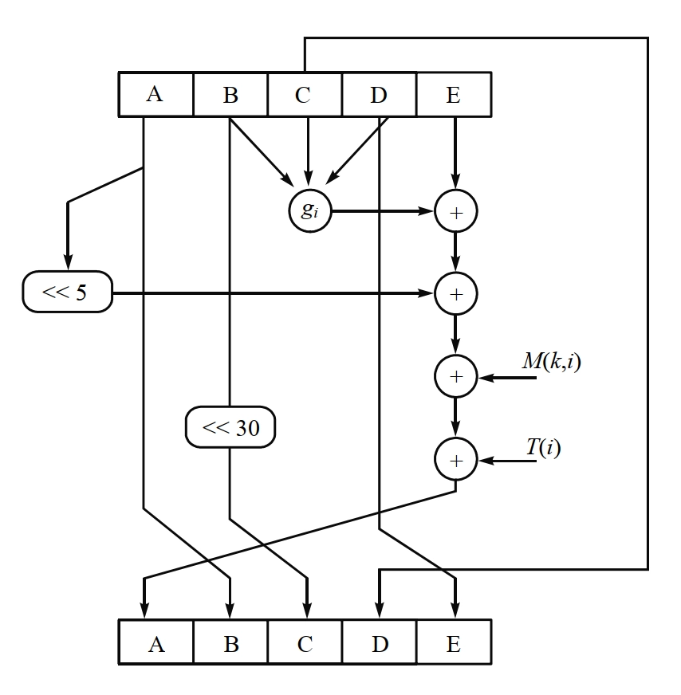

- $f$ 由 4 个循环组成，每个循环包括 20 步操作，每一步的基本形式如下：
    $$
    \begin{aligned}
    &A\leftarrow E + g_i(B, C, D) + (A \lll 5) + M(k, i) + K_i \\
    &B\leftarrow A \\
    &C\leftarrow B \lll 30 \\
    &D\leftarrow C \\
    &E\leftarrow D \\
    \end{aligned}
    $$
- 其中
    - $A, B, C, D, E$：缓存中的 5 个字
    - $i$：当前循环编号，$1 \leq i \leq 4$
    - $k$：当前步骤编号，$1 \leq k \leq 20$
    - $g_i(B, C, D)$：第 $i$ 轮的原始逻辑函数
        $$
        \begin{aligned}
        g_1 (B, C, D) &= (B \land C) \lor (\lnot B \land D) \\
        g_2 (B, C, D) &= B \oplus C \oplus D \\
        g_3 (B, C, D) &= (B \land C) \lor (B \land D) \lor (C \land D) \\
        g_4 (B, C, D) &= B \oplus C \oplus D \\
        \end{aligned}
        $$
    - $\lll x$：$32$ 比特常数循环左移 $x$ 位
    - $K_i$（图中的 $T(i)$）：一个额外的常数，前面有定义
        $$
        \begin{aligned}
        K_1 &= [2^{30}\times \sqrt{2}] = \mathtt{5A827999} \\
        K_2 &= [20\times\sqrt{3}] = \mathtt{6ED9EBA1} \\
        K_3 &= [20\times\sqrt{5}] = \mathtt{8F1BBCDC} \\
        K_4 &= [20\times\sqrt{10}] = \mathtt{CA62C1D6} \\
        \end{aligned}
        $$
    - $W(j)$（图中的 $M(k, i)$，$j = 20(i-1) + (k-1)$）：当前 $512$ 比特输入报文分组导出的一个 $32$ 比特字
        $$
        W(j) =
        \begin{cases}
        X[j], & 0 \leq j \leq 15 \\
        W(j-16) \oplus W(j-14) \oplus W(j-8) \oplus W(j-3) \lll 1, & 16 \leq j \leq 79
        \end{cases}
        $$
        - 
    - $+$：在 $\bmod 2^{32}$ 下进行的加法

### MD4 VS MD5 VS SHA-1
|  | MD4 | MD5 | SHA-1 |
|---|-----|-----|-------|
| Hash值 | 128 bit | 128 bit | 160 bit |
| 分组处理长度 | 512 bit | 512 bit | 512 bit |
| 基本字长 | 32 bit | 32 bit | 32 bit |
| 步数 | 48(3*16) | 64(4*16) | 80(4*20) |
| 消息长 | $\leq 2^{64}$ bit | No limit | $\leq 2^{64}$ bit |
| 基本逻辑函数 | 3 | 4 | 3 |
| 常数个数 | 3 | 64 | 4 |
| 速度 | 1 | 1/7 | 3/4 |

- SHA-1 = MD4 ＋ 扩展变换 ＋ 外加一轮 ＋ 更好的雪崩；
- MD5 = MD4 ＋ 改进的比特杂凑 ＋ 外加一轮 ＋ 更好的雪崩。

## SHA-2
### 概述
- SHA-1 VS SHA-2 VS SM3 VS SHA-3

    |参数|SHA-1|SHA-2-256|SHA-2-384|SHA-2-512|SM3|SHA-3-224|SHA-3-256|SHA-3-384|SHA-3-512|
    |----|----|----|----|----|----|----|----|----|----|
    |消息摘要长度|160位|256位|384位|512位|256位|224位|256位|384位|512位|
    |消息最大长度|<$2^{64}$|<$2^{64}$|<$2^{128}$|<$2^{128}$|<$2^{64}$|无限制|无限制|无限制|无限制|
    |块大小|512位|512位|1024位|1024位|512位|1152位|1088位|832位|576位|
    |字长|32位|32位|64位|64位|32位| | | | |
    |步骤数|80步|64步|80步|80步|64步|24步|24步|24步|24步|
    |安全强度|80位|128位|192位|256位|128位|112位|128位|192位|256位|

- SHA-2 的应用
    1. 主流安全协议/工具：TLS/SSL（网络传输加密）、PGP（邮件加密）、SSH（远程登录安全）、S/MIME（邮件签名）、Bitcoin（区块链哈希验证）、IPsec（网络层加密）。
    2. 政府与商业规范：
        - 美国政府要求敏感非机密信息需使用 SHA 系列，早期允许 SHA-1，后因安全问题调整；
        - NIST 明确要求：2010 年后，联邦机构需停止使用 SHA-1 处理“需抗碰撞”的应用，全面改用 SHA-2 家族。

### SHA-2-512
- 最大长度小于 $2^{128}$ 位，并生成 $512$ 位消息摘要作为输出。
- 哈希函数操作可以分为两个阶段：
	1. 预处理
	2. 哈希计算

#### SHA-512 算法描述


1. 填充比特（Append padding bits）
2. 添加长度（Append length）
3. 初始化哈希缓冲区（Initialize hash buffer）
    $$
    \begin{aligned}
    &a = \mathtt{6A09E667F3BCC908} \quad b = \mathtt{BB67AE8584CAA73B} \\
    &c = \mathtt{3C6EF372FE94F82B} \quad d = \mathtt{A54FF53A5F1D36F1} \\
    &e = \mathtt{510E527FADE682D1} \quad f = \mathtt{9B05688C2B3E6C1F} \\
    &g = \mathtt{1F83D9ABFB41BD6B} \quad h = \mathtt{5BE0CD19137E2179}
    \end{aligned}
    $$
4. 分块处理（Process message in 1024-bit (16-64bit word) blocks）
    - 处理每个 $1024$ 比特（$16$ 个 $64$ 比特字）报文分组，每个分组处理包括 $80$ 步，共 $N$ 个分组。
5. 输出结果（Output）

- 总结 SHA-512 操作如下：
    $$
    \begin{aligned}
    &H_0 = IV \\
    &H_i = SUM_{64}(H_{i-1}, ABCDEFG_i) \\
    &MD = H_N \\
    \end{aligned}
    $$
    - 其中：
        - $IV$：缓存 $ABCDEFGH$ 的初始值，定义在步骤3中。
        - $ABCDEFGH_i$：第 $i$ 个消息块的最后一轮处理的输出。
        - $N$：消息中的块数（包括填充和长度字段）。
        - $SUM_{64}$：对该对输入的每个字分别执行模 $2^{64}$ 加法。
        - $MD$：最终的消息摘要。

#### 单个 1024-bit 分组的 SHA-512 处理过程


#### SHA-512 的压缩函数
- $f$ 由 80 步操作组成，每一步的基本形式如下：
    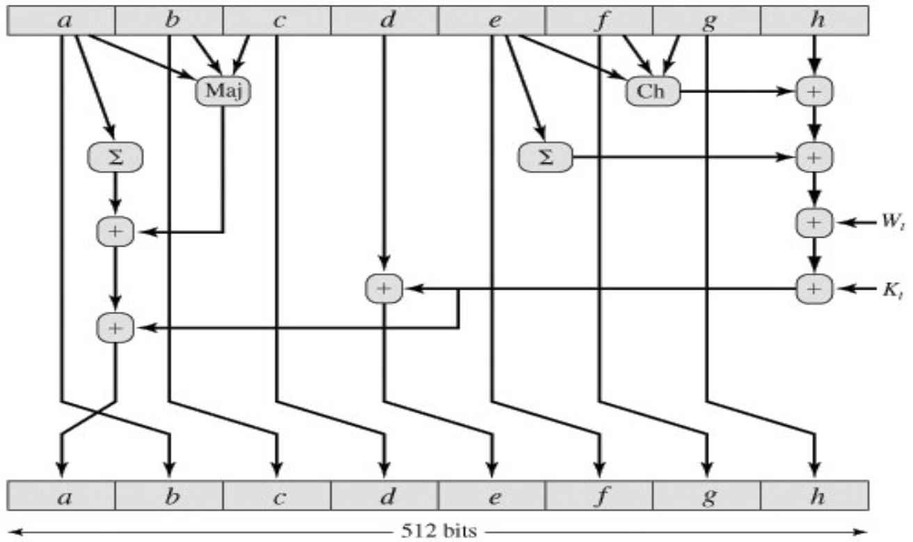
    $$
    \begin{aligned}
    &T_1 = h + \mathrm{Ch}(e,f,g) + (\sum_{1}^{512} e) + W_i + K_i \\
    &T_2 = (\sum_{0}^{512} a) + \mathrm{Maj}(a,b,c) \\
    &a \leftarrow T_1 + T_2 \\
    &b \leftarrow a \\
    &c \leftarrow b \\
    &d \leftarrow c \\
    &e \leftarrow d + T_1 \\
    &f \leftarrow e \\
    &g \leftarrow f \\
    &h \leftarrow g \\
    \end{aligned}
    $$
- 其中：
    - $a,b,c,d,e,f,g,h$：缓存中的 8 个字
    - $i$：步骤编号，$0 \leq i \leq 79$
    - $\mathrm{Ch}(e,f,g) = (e \land f)\oplus(\lnot e \land g)$，如果 $e$ 为真则选择 $f$，否则选择 $g$
    - $\mathrm{Maj}(a,b,c) = (a \land b)\oplus(a \land c)\oplus(b \land c)$，选择多数值
    - $\sum_{0}^{512}$ 和 $\sum_{1}^{512}$：定义如下
        $$
        \begin{aligned}
        &\sum_{0}^{512}(x) = (x \ggg 28) \oplus (x \ggg 34) \oplus (x \ggg 39) \\
        &\sum_{1}^{512}(x) = (x \ggg 14) \oplus (x \ggg 18) \oplus (x \ggg 41) \\
        \end{aligned}
        $$
        - 其中：
            - $x \ggg n$ 表示 $x$ 循环右移 $n$ 位
            - $x \gg n$ 表示 $x$ 逻辑右移 $n$ 位
    - $W_i$：当前 $1024$ 比特输入报文分组导出的一个 $64$ 比特字。
        - $W_i$ 的前 16 个字直接取自当前分组中的 16 个字，余下的字定义为:
            $$
            W_i = \sigma_1^{512}(W_{i-2}) + W_{i-7} + \sigma_0^{512}(W_{i-15}) + W_{i-16}, ~16 < i \leq 79
            $$
        - 其中
            $$
            \begin{aligned}
            &\sigma_0(x)^{512} = (x \ggg 1) \oplus (x \ggg 8) \oplus (x \gg 7) \\
            &\sigma_1(x)^{512} = (x \ggg 19) \oplus (x \ggg 61) \oplus (x \gg 6) \\
            \end{aligned}
            $$
        - 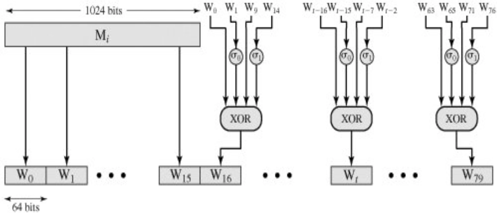
    - $K_i$：步骤 $i$ 的 $64$ 比特常数值
    - $+$：在 $\bmod 2^{64}$ 下进行的加法

### SHA-2-256
- SHA-256 与 SHA-512 类似，区别在于：
    - 使用 $32$ 比特字代替 $64$ 比特字
    - 使用不同的初始哈希值
    - 使用不同的常数值
    - 使用不同的位操作（循环移位和逻辑移位的位数不同）
        $$
        \begin{aligned}
        &\sum_{0}^{256}(x) = (x \ggg 2) \oplus (x \ggg 13) \oplus (x \ggg 22) \\
        &\sum_{1}^{256}(x) = (x \>>g 6) \oplus (x \ggg 11) \oplus (x \ggg 25) \\
        &\sigma_0(x)^{256} = (x \ggg 7) \oplus (x \ggg 18) \oplus (x \gg 3) \\
        &\sigma_1(x)^{256} = (x \ggg 17) \oplus (x \ggg 19) \oplus (x \gg 10) \\
        \end{aligned}
        $$
- 最大长度小于 $2^{64}$ 位，并生成 $256$ 位消息摘要作为输出。

### SHA-2-384
- SHA-384 与 SHA-512 类似，区别在于：
    - 使用不同的初始哈希值
    - 最终输出时只取前 $384$ 位作为消息摘要
- 最大长度小于 $2^{128}$ 位，并生成 $384$ 位消息摘要作为输出。

## SM3
### 概述
- 中国国家密码管理局于 2010 年发布的哈希函数标准，适用于数字签名等密码应用。
- 输入：长度小于 $2^{64}$ 位的任意长度报文
- 输出：256 位消息摘要
- 分组长度：512 位

### SM3 算法描述
1. 填充与添加长度（Append padding bits and length）
    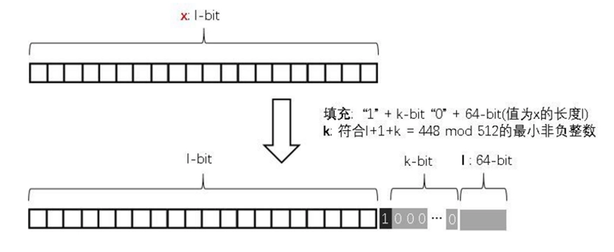
2. 消息扩展（Message extension）
    - 将每个 $512$ 比特的消息分组扩展为 $132$ 个 $32$ 比特的字：$W_0, W_1, \cdots, W_{67}$ 和 $W_0', W_1', \cdots, W_{63}'$
    - 定义为:
        $$
        \begin{aligned}
        &W_j =
        \begin{cases}
        X_j, &~0 \leq j \leq 15 \\
        P_1(W_{j-16} \oplus W_{j-9} \oplus (W_{j-3} \lll 15)) \oplus (W_{j-13} \lll 7) \oplus W_{j-6}, &~16 \leq j \leq 67 \\
        \end{cases} \\
        &W_j' = W_j \oplus W_{j+4}, ~0 \leq j \leq 63 \\
        \end{aligned}
        $$
    - 其中：$P_1(X) = X \oplus (X \ggg 15) \oplus (X \ggg 23)$
3. 初始化哈希缓冲区（Initialize hash buffer）
4. 迭代计算（Iterative calculation）
    - 对消息包 $B^{(0)},B^{(1)},\cdots，B^{(K)}$进行迭代，迭代函数为：
        $$
        V_{(i+1)} = CF(V_i, B^{(i)}), ~0 \leq i \leq K
        $$
    - $CF$ 是压缩函数。
        $$
        \begin{aligned}
        &A \leftarrow TT1 \\
        &B \leftarrow A \\
        &C \leftarrow B \lll 9 \\
        &D \leftarrow C \\
        &E \leftarrow P_0 (TT2) \\
        &F \leftarrow E \\
        &G \leftarrow F \lll 19 \\
        &H \leftarrow G \\
        \end{aligned}
        $$
        - 其中
            $$
            \begin{aligned}
            &FF_j(x,y,z)=\begin{cases}
            x \oplus y \oplus z, &0 \leq j \leq 15 \\
            (x \land y) \lor (x \land z) \lor (y \land z), &16 \leq j \leq 63 \\
            \end{cases} \\
            &GG_j(x,y,z)=\begin{cases}
            x \oplus y \oplus z, &0 \leq j \leq 15 \\
            (x \land y) \lor (\lnot x \land z), &16 \leq j \leq 63 \\
            \end{cases} \\
            &SS1(A, e, j) = ((A \lll 12) + e + (T_j \lll j)) \lll 7 \\
            &SS2(A, e, j) = SS1(A, e, j) \oplus (A \lll 12) \\
            &TT1 = (FF_j(A, B, C) + D + SS2(A, e, j) + W_j') \\
            &TT2 = (GG_j(E, F, G) + H + SS1(A, e, j) + W_j) \\
            \end{aligned}
            $$
5. 输出结果
    - 每次 512 位数据压缩操作后：
        $$
        V_{i+1} = V_i \oplus ABCDEFGH
        $$
        - 更新哈希值
        - 输入迭代函数，开始下一个数据包的轮次操作。
        - 计算最后一个数据包的结果，即哈希值。

- 单个 512-bit 分组的 SM3 处理过程
    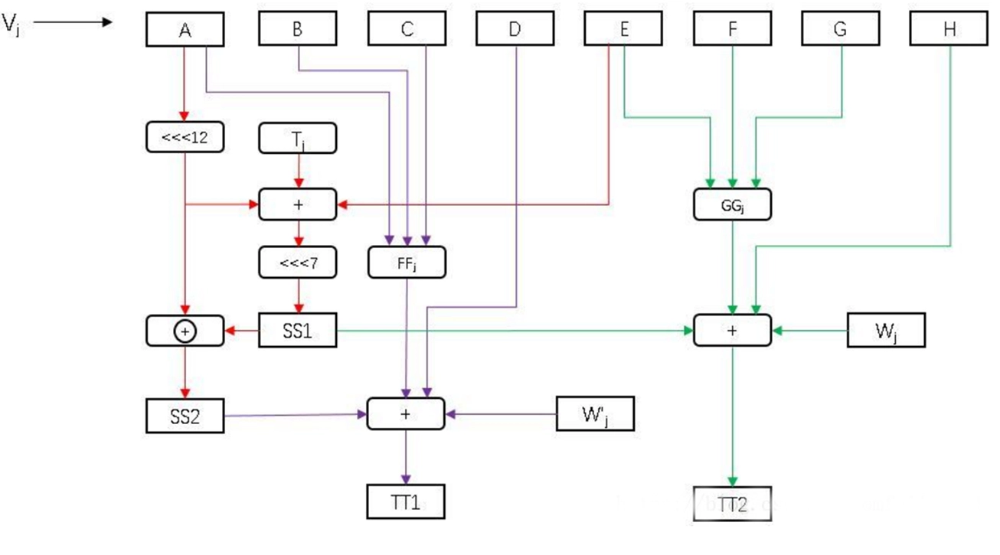

## SHA-3
### 海绵结构
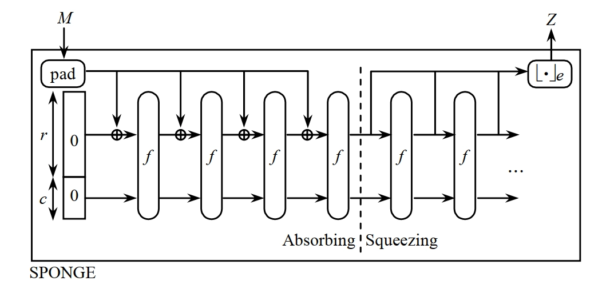
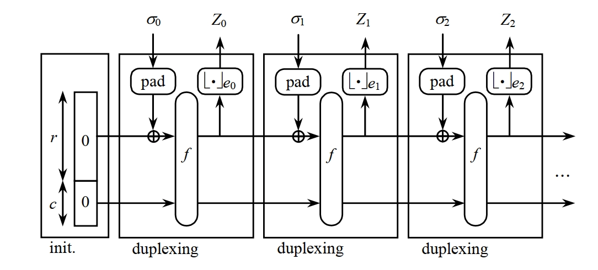

- 吸收阶段（Absorbing phase）
    - $r$ 代表速率，消息填充后被分成 $r$ 比特分组，异或到内部置换的分组中，依次进行处理
    - $c$ 代表安全长度，$c=2d$，$d$ 为哈希长度
    - $b$ 代表总比特数，$b=r+c$
    - $f$ 代表内部置换函数，SHA-3 的内部置换函数为 Keccak-f[b]
    - 填充规则：$pad10^∗1$，即在消息后添加一个 $1$，然后添加若干个 $0$，最后再添加一个 $1$，使得填充后的消息长度为 $r$ 的整数倍。
    - 对于 SHA-3-256，$d=256$，$c=512$，$b=1600$，$r=1088$，$f$ 为 Keccak-f[1600]
- 挤压阶段（Squeezing phase）
    - 处理完所有 $r$ 比特分组后，对最终的状态，用同样的内部置换 $f$ 处理，提取哈希值。
        - 提取初始输出：从吸收阶段结束后的状态中，提取前 $r$ 比特作为初始输出数据。
        - 如果需要的输出长度 $d \leq r$ ，直接截取前 $d$ 比特作为结果。
        - 如果需要的输出长度 $d > r$ ，则：
            - 先提取前 $r$ 比特，加入输出结果；
            - 对当前状态应用置换函数 $f[b]$，更新状态；再次从更新后的状态中提取前 $r$ 比特，加入输出结果；
            - 重复上述过程，直到输出总长度超过 $d$ 比特，然后截取前 $d$ 比特作为最终结果。

### SHA-3 的 6 个实例
- 固定哈希长度的 SHA3-224/256/384/512
- 可变哈希长度的 SHAKE256 和 SHAKE512

| 算法 | 哈希长度 $d$ | 安全长度 $c$ | 速率 $r$ |
|------|-------------|--------------|---------|
| SHA3-224 | 224 bit | 448 bit | 1152 bit |
| SHA3-256 | 256 bit | 512 bit | 1088 bit |
| SHA3-384 | 384 bit | 768 bit | 768 bit |
| SHA3-512 | 512 bit | 1024 bit | 576 bit |
| SHAKE256 | 可变 | 512 bit | 1088 bit |
| SHAKE512 | 可变 | 1024 bit | 576 bit |

### Keccak-f[1600] 置换函数
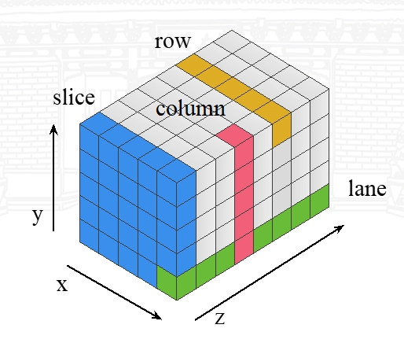

- 分组长度为 $1600$ 比特的迭代置换函数，共迭代 $24$ 轮
- $1600$ 比特的分组状态 $A$，组织成 $5\times  5\times 64$ 的 $3$ 维数组，每个比特由 $A[x,y,z]$ 坐标表示，$0\leq x,y<5, 0\leq z<64$
- 每轮包括 $5$ 步： $R := \iota \circ \chi \circ  \pi \circ \rho \circ \theta$ ，其中，$\theta, \rho, \pi, \iota$ 是线性运算， $\chi$ 是唯一的非线性运算

- $\theta$：the mixing layer
    - 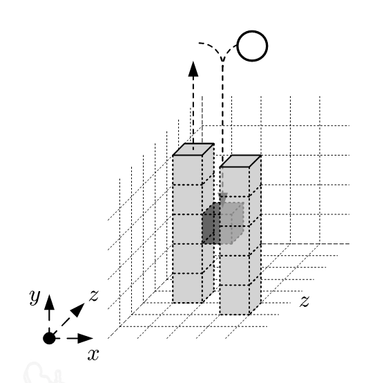
    - 对任意坐标为[$x,y,z$] 的比特
        1. $\theta$ 首先分别计算出该比特左侧列 [$x-1,z$]
        和右后侧列 [$x+1,z-1$] 的整列异或值； 
        2. 然后将两个列异或值与原比特的值进行异或，
        从而更新当前比特的值。
    - 表达式描述
        $$
        \begin{aligned}
        &C[x,z]=\oplus_{y=0}^{4} A[x,y,z] \\
        &D[x,z]=C[x-1,z]\oplus C[x+1,z-1] \\
        &A[x,y,z]=A[x,y,z]\oplus D[x,z] \\
        \end{aligned}
        $$
- $\rho$：the intra-slice bit transposition
    - 
    - 在 lane 内部对 $64$ 个比特进行循环移位操作，循环移位的值由 lane 坐标 $R(x,y)$ 确定。
        $$
        A[x,y] = A[x,y] \lll R(x,y)
        $$
    - 其中，$R(x,y)$ 是预定义的循环移位幅度

        | x \ y | 0 | 1 | 2 | 3 | 4 |
        |-------|---|---|---|---|---|
        | 0     | 0 |36 | 3 |41 |18 |
        | 1     | 1 |44 |10 |45 | 2 |
        | 2     |62 | 6 |43 |15 |61 |
        | 3     |28 |55 |25 |21 |56 |
        | 4     |27 |20 |39 | 8 |14 |
- $\pi$：the intra-slice bit transposition
    - 
    - slice 内的 $25$ 个比特位置变换，所有 $64$ 个 slice 的置换运算相同
        $$
        A[y, (2x+3y)\bmod 5]=A[x,y]
        $$
- $\chi$：the nonlinear layer
    - 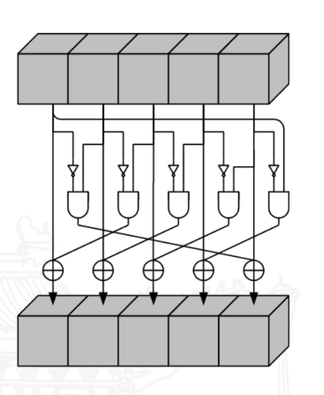
    - 在 row 上的非线性运算
    - 可看作 5 比特的 S 盒
        $$
        A[x,y]=A[x,y]\oplus(A[x+1,y]\oplus1)\cdot A[x+2,y]
        $$
    - $\chi$ 的代数次数为 2，$\chi^{−1}$ 的代数次数为 3
- $\iota$ – round constant
    - 在每轮给坐标为 $[𝑥, 𝑦] = [0, 0]$ 的 lane 异或一个预先计算好的轮常量 $RC$
        $$
        A[0,0]=A[0,0]\oplus RC[i]
        $$
    - 轮常量 $RC$ 由一个 LFSR 函数生成
        
- 小结：内部状态 $A$，任意比特为 $A[x,y,z]$
    - $\theta$ step
        - $C[x,z]=\oplus_{y=0}^{4} A[x,y,z]$.
        - $D[x,z]=C[x-1,z]\oplus C[x+1,z-1]$.
        - $A[x,y,z]=A[x,y,z]\oplus D[x,z]$
    - $\rho$ step
        - $A[x,y]=A[x,y]\lll R[x,y]$
    - $\pi$ step
        - $A[y,(2x+3y)\bmod 5]=A[x,y]$
    - $\chi$ step
        - $A[x,y]=A[x,y]\oplus(A[x+1,y]\oplus1)\cdot A[x+2,y]$
    - $\iota$ step
        - $A[0,0]=A[0,0]\oplus RC[i]$

# 数字签名算法

## 数字签名方案
- 公钥签名方案：
    - 利用私钥生成签名
    - 利用公钥验证签名
- 只有私钥的拥有者才能生成签名，所以能够用于证明谁生成的消息
- 任何知道公钥的人可以验证消息（他们要确认公钥拥有者的身份，这是公钥的密钥分配问题）
- 通常不对整个消息签名，因为这将会使交换信息长度增加一倍
    - 使用消息的 hash 值
- 数字签名可以**提供消息的不可否认性**

## RSA 签名方案
- RSA 加密解密是可交换的
- 可以用于数字签名方案

### RSA 密钥生成
- 选择两个大素数 $p$ 和 $q$
- 计算 $n = p \cdot q$
- 计算 $\phi(n) = (p - 1)(q - 1)$
- 选择公钥指数 $e$，满足 $1 < e < \phi(n)$ 且 $\gcd(e, \phi(n)) = 1$
- 计算私钥指数 $d$，满足 $d \cdot e \equiv 1 \bmod \phi(n)$
- 公钥是 $(e, n)$
- 私钥是 $(d, p, q)$

### RSA 签名生成与验证
- 给定 RSA 方案  $\{K=(e, n), K^{-1}=(d, p, q)\}$
    - 要签名消息 $M$：计算：
        $$
        \begin{cases}
        h = H(M) \\
        S = h^{d} (\bmod n) \\
        \end{cases}
        \Rightarrow (M, S)
        $$
    - 要验证签名, 计算：
        $$
        \begin{cases}
        h = H(M) \\
        h' = S^{e}(\bmod n) \\
        \end{cases}
        \Rightarrow h^{\prime} = h?
        $$

### RSA 签名方案的使用
- 使用RSA加密、认证:
    - 假设 A 发送消息给 B
        - 用发送者的私钥签名：$S = M^{d_A} \bmod n_A$
        - 用接收者的公钥加密：$C = S^{e_B} \bmod n_B$
    - 接收者 B 解密:
        - $S = C^{d_B} \bmod n_B$
        - 验证签名：$M = S^{e_A} \bmod n_A$
- 看起来，一个消息可用 RSA 先加密再签名而不改变大小
    - 但是，加密使用的是消息接收者的模，签名是消息发送者的模，后者可能比前者小
    - 如果先加密再签名，可能会导致加密后的消息大于签名模，无法使用 RSA 进行签名（RSA 要求 $0 < M < n$）
    - 交换两者顺序，先签名再加密可以避免这个问题
- 签名常使用 HASH 函数值
    - 用 $h=H(M)$ 代替消息 $M$ 进行签名

## ElGamal 签名方案
- ElGamal 加密算法是不可交换的
- 存在一个相关的签名算法
- 安全性是**基于计算离散对数的困难性**

### ElGamal 密钥生成
- 选择共享的素数 $p$ 和公开的生成元 $g$
- 每个用户选择一个随机数作为私钥 $x$
- 计算各自的公开密钥：$y = g^x \bmod p$
- 公钥是 $(y, g, p)$
- 私钥是 $(x)$

### ElGamal 签名生成与验证
- 签名消息 $M$：
    - 选择随机数  $k$，满足 $\gcd(k, p - 1) = 1$
        - $k$ 应该被销毁或保密，不能重复使用
    - 计算  $K = g^{k} \bmod p$
    - 用 Euclidean (inverse) 扩展算法求 $S$：
        - $M = x \cdot K + k \cdot S \bmod (p - 1)$ ;
        - 即求 $S = k^{-1}(M - x \cdot K) \bmod (p - 1)$
    - 发送 $(M, K, S)$，其中 $(K, S)$ 是对 $M$ 的签名
- 验证 $(K, S)$ 是对 $M$ 的签名:
    - $y^{K} \cdot K^{S} \equiv g^{M} \bmod p$
- 同 ElGamal 加密方案，签名信息也是消息的 2 倍
    - 通常对消息的 HASH 值进行签名

### ElGamal 签名方案举例
- 密钥生成：
    - 取 $p = 11, g = 2$
    - 选择私钥 $(x = 8)$
    - 计算公钥：
        - $y = g^x \bmod p = 2^8 \bmod 11 = 3$
        - 公钥是 $(y = 3, g = 2, p = 11)$
- 对 $M = 5$ 签名：
    - 选择随机数  $k = 9$
    - 确定 $\gcd(9, 10) = 1$
    - 计算：$K = g^{k} \bmod p = 2^9 \bmod 11 = 6$
    - 求解：
        $$
        5 = 8 \times 6 + 9 \cdot S \bmod 10; 
        $$
        - 因为 $9^{-1} \equiv 9 \bmod 10$
        - 所以 $S = k^{-1}(M - x \cdot K) \bmod (p - 1) = 9 \times (5 - 8 \times 6) \bmod 10 = 3$
    - 签名是  $(K = 6, S = 3)$
- 要验证签名，确认：
    $$
    \begin{aligned}
    &y^{K} \cdot K^{S} \bmod p = 3 ^ {6} \cdot 6 ^ {3} \bmod 11 = 10 \\
    &g^{M} \bmod p = 2 ^ {5} \bmod 11 = 10 \\
    \end{aligned}
    $$

## DSA (Digital Signature Algorithm)
- DSA 是数字签名算法，DSS 是数字签名标准
- DSA 是 ElGamal 及 Schnorr algorithms 的变形
- 生成 320 bit 签名
- 安全性是**基于计算离散对数的困难性**
- 被广泛接受

### DSA 密钥生成
- 首先选取公开参数  $(p, q, g)$ :
    - 选取大素数  $p = 2 L$
        - $L= 512 \sim 1024$ bits（64 倍数）
    - 选取素数 $q$
        - 160 bit
        - $q$ 是 $p - 1$ 的因子
    - 选择 $g = h^{(p - 1) / q}$
        - 满足对任何  $h < p - 1, h^{(p - 1) / q} (\bmod p) > 1$
- 每个用户选取私钥并计算他们的公钥:
    - 选取 $x < q$
    - 计算 $y = g^{x} \bmod p$
    - 公钥是 $(y, p, q, g)$
    - 私钥是 $(x)$

### DSA 签名生成与验证
- 签名消息 $M$
    - 生成随机签名密钥 $k$，满足 $k < q$
    - 计算
        $$
        \begin{aligned}
        &K = (g^{k} \bmod p) \bmod q \\
        &S = k^{-1} \cdot (\mathrm{HASH}(M) + x \cdot K) \pmod{q}
        \end{aligned}
        $$
- 发送签名  $(K, S)$  及消息 $M$
- 验证签名, 计算:
    $$
    \begin{cases}
    w = S^{-1} \pmod{q} \\
    u1 = (\mathrm{HASH}(M)\cdot w) \pmod{q} \\
    u2 = K\cdot w \pmod{q} \\
    v = g^{u1}\cdot y^{u2} \pmod{p}\pmod{q} \\
    \end{cases}\quad
    \Rightarrow v = K?
    $$

### DSA 安全性
- 基于离散对数
- 最初建议使用一个共同的 modulus p
- 现在建议不同的工作组使用不同的  $(p, q, g)$
- Gus Simmons 发现存在潜信道，能够泄露私钥

## 带密钥的 HASH
- 以上的签名方法都是公钥技术
    - 计算与数据量较大
- 需要私钥的认证方案
    - 好的方法是使用快速的 hash 函数：
    - 密钥与消息同时参加运算：
        $$
        KeyedHash = \mathbf{Hash}(Key \mid Message)
        $$
    - 存在一些弱点
- 随后建议：
    $$
    KeyedHash = \mathbf{Hash} (Key_1 \mid \mathbf{Hash} (Key_2 \mid Message))
    $$

### HMAC
- HMAC 是使用带密钥的 HASH 函数的结果
- 成为 internet 标准（RFC2104）
- 结构:
    $$
    HMAC_K = \mathbf{Hash}((K^+ \oplus opad) \mid \mathbf{Hash}((K^+ \oplus \text{ipad}) \mid M))
    $$
    - $K^+$：经过填充的密钥
    - $opad, ipad$：特殊的填充值
        - $opad=01011010$ 重复 $b/8$ 次
        - $ipad=00110110$ 重复 $b/8$ 次
- 安全性是基于原来的 HASH 函数的安全性
- 任何 MD5, SHA-1, RIPEMD-160 都可以这样使用