> 本笔记基于上海交通大学 *李宋宋老师* 2025-2026 学年春季学期教学内容进行整理，部分图片来自李老师的课件，若有侵权请联系删除。
# Ch1 密码学中的可证明安全理论
## 公钥加密算法的安全性定义以及 ElGamal 加密算法

### 可证明安全理论
#### 基本概念
- **安全参数**（Security Parameter）$\lambda$：刻画攻击者攻破密码方案的难度
    - **计算安全参数**（底层困难问题的计算复杂度，依赖于算力和算法）：攻破该问题至少需要 $2^{\lambda}$ 步运算。
        - 例如：分解大整数 $n \approx 2^{2\lambda}$ 的计算复杂度为 $2^{\lambda}$，则计算安全参数为 $\lambda$
    - **统计安全参数**（依赖于不同分布之间的统计距离，信息论安全）：攻破密码算法的概率：区分猜测值和目标值之间的概率是 $2^{-\lambda}$，则统计安全参数为 $\lambda$。
- **$\lambda$ 的多项式大小**：$\mathrm{poly}(\lambda) = O(\lambda^{c})$，即 $\exists c \in \mathbb{N},\lambda' \in \mathbb{N}$，使得对 $\forall \lambda \geq \lambda'$，有 $$\mathrm{poly}(\lambda) \leq \lambda^{c}$$
	- 例如：$\mathrm{poly}(\lambda) = 4\lambda^{10} + \lambda^{3} + 1$，$\lambda$，$\lambda \log \lambda$，$\lambda^{1.5}$，$\lambda^{2}$ 等。
- **多项式时间算法**：算法 $\mathrm{ALG}(x)$ 的运行时间与输出比特长度是输入比特长度 $\log |x|$ 的多项式大小。
	- 确定性多项式时间（Deterministic Polynomial Time, DPT）算法
	- 概率性多项式时间（Probabilistic Polynomial Time, PPT）算法
- **可忽略概率**（Negligible probability）：**小于任意多项式倒数的概率，在密码学中认为几乎不可能发生的概率**，通常记为 $\mathrm{negl}(\lambda)$，即对任意多项式 $\mathrm{poly}$，$\exists \lambda' \in \mathbb{N}$，对 $\forall \lambda \geq \lambda'$，有
	$$
	\mathrm{negl}(\lambda) \leq \frac{1}{\mathrm{poly}(\lambda)}
	$$
	- 性质：$\forall c \in \mathbb{N}$，$\exists \lambda' \in \mathbb{N}$，使得对 $\forall \lambda \geq \lambda'$，有 $\mathrm{negl}(\lambda) \leq \lambda^{-c}$
	- 例：$\mathrm{negl}(\lambda) = 2^{-\lambda}$，$2^{-\sqrt{\lambda}}$，$\lambda^{-\lambda} = 2^{-\lambda \log \lambda}$
- **不可忽略概率**（Non-negligible probability）：$\text{non-negl}(\lambda)$，即存在多项式 $\mathrm{poly}$，$\forall \lambda' \in \mathbb{N}$，$\exists \lambda \geq \lambda'$，有
	$$
	\text{non-negl}(\lambda) > 1/\mathrm{poly}(\lambda)
	$$
- **压倒性概率**（Overwhelming probability）：**在密码学中认为几乎一定发生的概率**
	$$
	\mathrm{overwhelm}(\lambda) = 1 - \mathrm{negl}(\lambda)
	$$
	- 例：$\mathrm{overwhelm}(\lambda) = 1 - 2^{-\lambda}$

#### 基本工具
- **布尔不等式**：设 $E_{1}, \dots, E_{p}$ 为 $p$ 个事件（它们之间可以任意相关），则
	$$
	\Pr(E_{1} \vee \dots \vee E_{p}) \leq \Pr(E_{1}) + \dots + \Pr(E_{p})
	$$
	- 设 $E_{1}, \dots, E_{p}$ 为 $p$ 个事件。如果 $p = \mathrm{poly}_{0}(\lambda)$ 且 $\Pr(E_{i}) = \mathrm{negl}_{i}(\lambda)$，则
		$$
		\Pr(E_{1} \vee \cdots \vee E_{p}) = \mathrm{negl}(\lambda)
		$$

		即一个可忽略概率发生的事件重复做多项式次，至少发生一次的概率是可忽略的。
	- 设 $F_{1}, \dots, F_{p}$ 为 $p$ 个事件。如果 $p = \mathrm{poly}_{0}(\lambda)$ 且 $\Pr(F_{i}) = \mathrm{overwhelm}_{i}(\lambda)$，则
		$$
		\Pr(F_{1} \wedge \dots \wedge F_{p}) = \mathrm{overwhelm}(\lambda)
		$$

		即一个压倒性概率发生的事件重复做多项式次，每次都发生的概率是压倒性的。
- **全概率公式**：若事件 $A_{1}, A_{2}, \dots, A_{n}$ 构成一个完备事件组，即它们两两互不相容其和为全集，且都有正概率，则对任意一个事件 $B$，有如下公式成立，称为全概率公式：
	$$
	\Pr(B) = \Pr(B \wedge A_{1}) + \Pr(B \wedge A_{2}) + \cdots + \Pr(B \wedge A_{n}) = \Pr(B\mid A_{1}) \Pr(A_{1}) + \Pr(B\mid A_{2}) \Pr(A_{2}) + \cdots + \Pr(B\mid A_{n}) \Pr(A_{n})
	$$
	- 特别地，对于任意两随机事件 $A$ 和 $B$，有如下成立：
		$$
		\Pr(B) = \Pr(B\mid A) \Pr(A) + \Pr(B\mid \neg A) \Pr(\neg A)
		$$
- **贝叶斯公式**：设 $A$、$B$ 为两个事件，则
	$$
	\Pr(A \wedge B) = \Pr(A\mid B) \Pr(B)
	$$

#### 可证明安全性的定义
- **刻画攻击者/敌手 (attacker/adversary) 的攻击能力**
    - 敌手的输入（例如：公开信息）
    - 敌手的攻击能力（一般运行时间为多项式时间 PT，不考虑拥有无条件计算能力的敌手）
    - 敌手的攻击方式（影响方案执行的行为，主动攻击、被动攻击，通过安全模型的方式刻画）
- **刻画安全目标**
    - 希望达到的目标，一般通过刻画不希望被攻破的目标定义
- **密码算法/协议 $\Pi$ 的 X-Y 安全定义**（template）：任意概率多项式时间敌手在 Y 安全模型中攻破密码算法/协议 $\Pi$ 的 X 安全目标的概率是可忽略的。

### 公钥加密算法的安全性
#### 公钥加密算法的语义及正确性要求
- **语义**：一个公钥加密算法（public-key encryption, PKE）包含三个概率多项式时间（PPT）算法 $(\mathrm{Gen}, \mathrm{Enc}, \mathrm{Dec})$：
	1. **密钥生成算法** $(PK, SK) \leftarrow \mathrm{Gen}(1^{\lambda})$：一般为概率性算法
	2. **加密算法** $C \leftarrow \mathrm{Enc}(PK, M)$：$M \in \mathbb{M}$，其中 $\mathbb{M}$ 为消息空间
	3. **解密算法** $M' \leftarrow \mathrm{Dec}(SK, C)$：一般为确定性算法，$M' \in \mathbb{M} \cup \{\bot\}$，其中 $\bot$ 代表解密失败
- **正确性要求**：对于 $\forall (PK, SK) \leftarrow \mathrm{Gen}(1^{\lambda})$，$\forall M \in \mathbb{M}$，$\forall C \leftarrow \mathrm{Enc}(PK, M)$，一定有
	$$
	\mathrm{Dec}(SK, C) = M
	$$

#### 公钥加密算法的 SKH/PH/PFbH-PA 安全性
- **被动攻击**（Passive Attacks, PA）安全模型：
    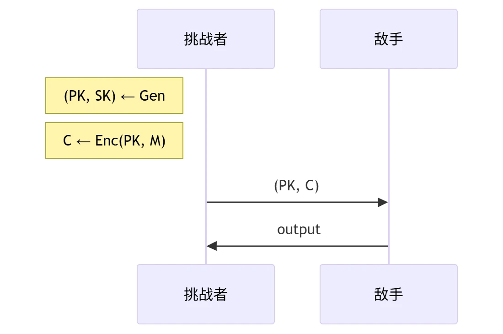
- **PA 敌手攻击能力**
    - 输入：公开信道中的 $PK, C$
    - 运行时间：概率多项式时间 PPT
    - 攻击方式：被动攻击 PA ──  仅仅从公开信道中获取信息，不进行其他攻击
- **安全目标（刻画不希望该密码算法被攻破目标）**
    1. **隐藏私钥**（SK-hiding, SK）：$\mathrm{output} = SK$ 则攻破该目标
    2. **隐藏明文**（Plaintext-hiding, PH）：$\mathrm{output} = M$ 则攻破该目标
    3. **隐藏明文首比特**（Plaintext-first-bit-hiding, PFbH）：$\mathrm{output} = M[1]$ 则攻破该目标
- **公钥加密算法的 SKH/PH/PFbH-PA 安全性定义**：任意概率多项式时间敌手在 PA 安全模型中攻破 SKH/PH/PFbH 安全目标的概率是可忽略的，即
    $$
    \Pr(\mathrm{output} = SK/M/M[1]) = \mathrm{negl}(\lambda)
    $$
    - 说明：SKH/PH/PFbH-PA 安全性定义**不能**保证加密算法的安全性。

#### 公钥加密算法的 IND-CPA 安全性
- **选择明文攻击**（Chosen-Plaintext Attacks, CPA）安全模型：
    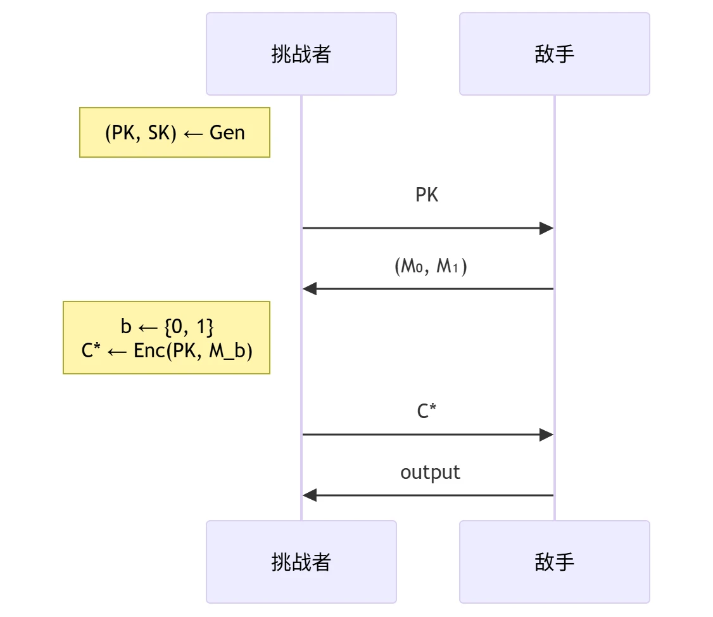
- **CPA 敌手攻击能力**：
    - 输入：公开信道中的 $PK$ 及挑战密文 $C^{*}$
	- 运行时间：概率多项式时间 PPT
	- 攻击方式：选择明文攻击 CPA ── 敌手可以提供/决定/影响加密使用的明文
- **IND 安全目标**：**不可区分性**（Indistinguishability）── 敌手无法区分密文 $C^{*}$ 加密的是 $M_{0}$ 还是 $M_{1}$（即如果 $\mathrm{output} = b$，则攻破该目标）
- **公钥加密算法的 IND-CPA 安全性定义**：任意概率多项式时间敌手在 CPA 安全模型中攻破 IND 安全目标的**优势**（advantage）是可忽略的，也即
    $$
    \mathrm{Adv} = \left| \Pr(\mathrm{output} = b) - \frac{1}{2} \right| = \mathrm{negl}(\lambda)
    $$
    - **等价定义**：
        $$
        \begin{aligned}
        \mathrm{Adv} =
        &\left| \Pr(\mathrm{output} = b) - \frac{1}{2} \right| \\
        =& \left| \Pr(\mathrm{output} = 0 \mid b = 0) \cdot \Pr(b=0) + \Pr(\mathrm{output} = 1 \mid b = 1) \cdot \Pr(b=1) - \frac{1}{2} \right| \\
        =& \frac{1}{2} \left| \Pr(\mathrm{output} = 0 \mid b = 0) + \Pr(\mathrm{output} = 1 \mid b = 1) - 1 \right| \\
        =& \frac{1}{2} \left| \Pr(\mathrm{output} = 0 \mid b = 0) - \Pr(\mathrm{output} = 0 \mid b = 1) \right| \\
        =& \frac{1}{2} \left| \Pr(\mathrm{output} = 1 \mid b = 0) - \Pr(\mathrm{output} = 1 \mid b = 1) \right|
        \end{aligned}
        $$
- **IND-CPA 安全性的合理性**：公钥加密算法的 **IND-CPA 安全性** $\implies$ **SKH-PA/PH-PA/PFbH-PA 安全性**

	
    以 SKH-PA 安全性为例，采用反证法（**安全性归约**）

    - **假设结论错误**：算法不是 SKH-PA 安全的，即存在一个概率多项式敌手 $\mathcal{A}$，以不可忽略的概率在 PA 安全模型中攻破 SKH 安全目标，即
        $$
        \mathrm{Adv}_\mathcal{A} = \Pr(\mathcal{A}(PK, C) = SK) = \text{non-negl}(\lambda)
        $$
    - **证明前提错误**：构造一个概率多项式时间敌手 $\mathcal{B}$，在 CPA 安全模型中攻破 IND 安全目标。
        - $\mathcal{B}$ 的输入：公开信道中的 $PK$ 及挑战密文 $C^{*}$
        - 调用子敌手：$\mathcal{B}$ 将 $(PK, C^{*})$ 交给 $\mathcal{A}$，模拟 SKH-PA 实验，$\mathcal{A}$ 输出一个候选私钥 $SK'$。$\mathcal{B}$ 尝试使用 $SK'$ 解密 $C^{*}$，得到 $M' = \mathrm{Dec}(SK', C^{*})$
            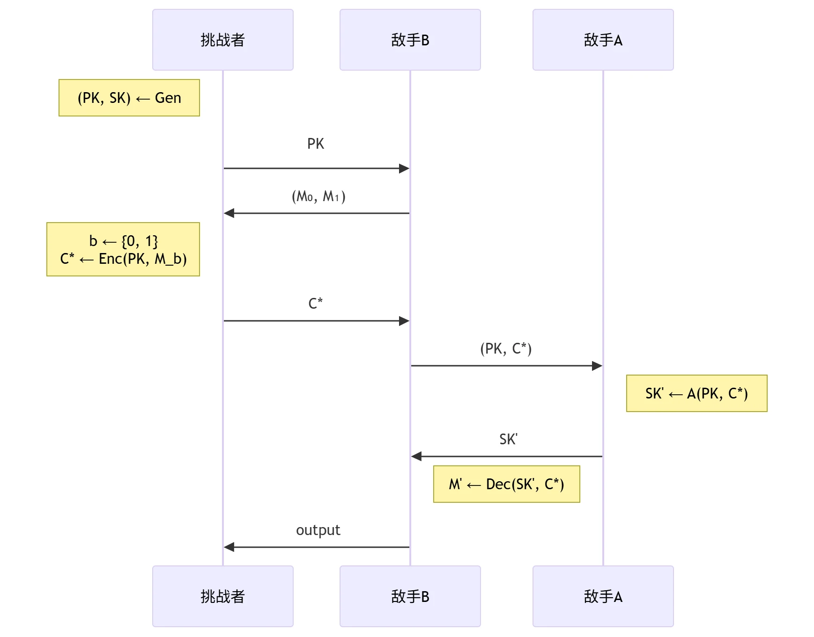
        - $\mathcal{B}$ 的输出：$\mathrm{output} = \begin{cases} 0 & M' = M_0 \\ 1 & M' = M_1 \\ \mathrm{random}\{0, 1\} & \text{otherwise} \end{cases}$
        - $\mathcal{B}$ 的优势：
            $$
            \begin{aligned}
            \mathrm{Adv}_\mathcal{B} = &\left| \Pr(\mathrm{output} = b) - \frac{1}{2} \right| \\
            =& \left| \Pr(\mathrm{output} = b \mid SK' = SK) \cdot \Pr(SK' = SK) + \Pr(\mathrm{output} = b \mid SK' \neq SK) \cdot \Pr(SK' \neq SK) - \frac{1}{2} \right| \\
            =& \left| 1 \cdot \text{non-negl}(\lambda) + \frac{1}{2} \cdot (1 - \text{non-negl}(\lambda)) - \frac{1}{2} \right| \\
            =& \frac{1}{2} \cdot \text{non-negl}(\lambda) = \text{non-negl}(\lambda)
            \end{aligned}
            $$

            即 $\mathcal{B}$ 在 CPA 安全模型中攻破 IND 安全目标的优势是不可忽略的，算法不是 IND-CPA 安全的，与前提矛盾。

	

- **结论**：IND-CPA 是公钥加密算法的基本安全性要求。

#### 公钥加密算法的 IND-mCPA 安全性
- **多挑战-选择明文攻击**（multiple-challenge Chosen-Plaintext Attacks, mCPA）安全模型：
    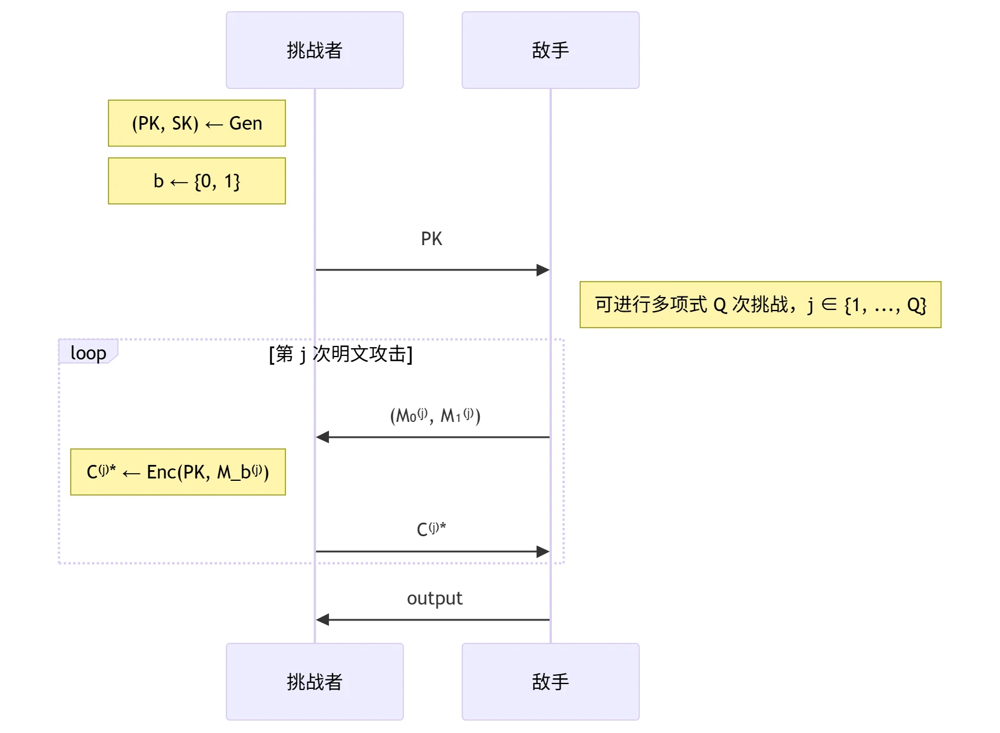
- **mCPA 敌手攻击能力**
	- 输入：公开信道中的 $PK$ 及**多项式**个挑战密文 $C^{*(1)}, \dots, C^{*(Q)}$
	- 运行时间：概率多项式时间 PPT
	- 攻击方式：多挑战-选择明文攻击 mCPA ── 敌手可以提供/决定/影响加密使用的多个明文
- **IND 安全目标**：敌手无法区分密文 $C^{*(j)}$ 加密的是 $M_{0}^{(j)}$ 还是 $M_{1}^{(j)}$（即如果 $\mathrm{output} = b$，则攻破该目标）
- **公钥加密算法的 IND-mCPA 安全性定义**：任意概率多项式时间敌手在 mCPA 安全模型中攻破 IND 安全目标的优势是可忽略的，即
    $$
    \mathrm{Adv} = \left| \Pr(\mathrm{output} = b) - \frac{1}{2} \right| = \mathrm{negl}(\lambda)
    $$
    - **等价定义**：
    $$
    \begin{aligned}
    \mathrm{Adv} =
    &\frac{1}{2} \left| \Pr(\mathrm{output} = 1 \mid b = 0) - \Pr(\mathrm{output} = 1 \mid b = 1) \right| \\
    =& \frac{1}{2} \left| \Pr(\mathrm{output} = 0 \mid b = 0) - \Pr(\mathrm{output} = 0 \mid b = 1) \right|
    \end{aligned}
    $$
- **IND-CPA 与 IND-mCPA 的等价性**：公钥加密算法的 **IND-CPA 安全性** $\iff$ **IND-mCPA 安全性**

	
    - **必要性易证**（$\impliedby$）：IND-CPA 是 IND-mCPA $Q=1$ 的特殊情况
    - **充分性证明**（$\implies$）：采用混合论证（Hybrid Arguments）与三角不等式，核心思路是在全加密 $M_0^{(j)}$ 和全加密 $M_1^{(j)}$ 两个极端场景之间，插入一系列混合场景（Hybrid），证明相邻混合场景的不可区分性，最终推导出两个极端场景的不可区分性。
        1. **定义两个极端游戏**（Game）：设敌手发起 $Q=\mathrm{poly}(\lambda)$ 次挑战，定义两个基础游戏：
            - **Game 0** ($b=0$)：对所有 $j=1,\ldots,Q$，加密 $M_{0}^{(j)}$，即 $C^{*(j)} \leftarrow \mathrm{Enc}(PK, M_{0}^{(j)})$
            - **Game 1** ($b=1$)：对所有 $j=1,\ldots,Q$，加密 $M_{1}^{(j)}$，即 $C^{*(j)} \leftarrow \mathrm{Enc}(PK, M_{1}^{(j)})$
        2. **定义混合游戏**（Hybrid Game）：在 Game 0 和 Game 1 之间插入 $Q+1$ 个混合游戏 $\mathrm{Hybrid}_{i}$，其中 $i=0,\ldots,Q$，$\mathrm{Hybrid}_{i}$ 定义为对前 $i$ 个挑战加密 $M_{1}^{(j)}$，对后 $Q-i$ 个挑战加密 $M_{0}^{(j)}$，即
            $$
            \mathrm{Hybrid}_{i} : C^{*(j)} \leftarrow \begin{cases} \mathrm{Enc}(PK, M_{1}^{(j)}) & j \leq i \\ \mathrm{Enc}(PK, M_{0}^{(j)}) & j > i \end{cases}
            $$
        3. **分析混合游戏**：易知 Game 0 等价于 $\mathrm{Hybrid}_{0}$，Game 1 等价于 $\mathrm{Hybrid}_{Q}$，由**引理**：若算法满足 IND-CPA 安全，则对 $\forall i \in \{1, \dots, Q\}$，有
            $$
            \left| \Pr(\mathrm{output} = 1 \mid \mathrm{Hybrid}_{i-1}) - \Pr(\mathrm{output} = 1 \mid \mathrm{Hybrid}_{i}) \right| = \mathrm{negl}(\lambda)
            $$
        4. 累加相邻场景的差距：由三角不等式，最终有
            $$
            \begin{aligned}
            \mathrm{Adv} =& \left| \Pr(\mathrm{output} = 1 \mid b = 0) - \Pr(\mathrm{output} = 1 \mid b = 1) \right| \\
            =&\left| \Pr(\mathrm{output} = 1 \mid \mathrm{Hybrid}_{0}) - \Pr(\mathrm{output} = 1 \mid \mathrm{Hybrid}_{Q}) \right| \\
            =&\left| \sum_{i=1}^{Q} \Pr(\mathrm{output} = 1 \mid \mathrm{Hybrid}_{i-1}) - \Pr(\mathrm{output} = 1 \mid \mathrm{Hybrid}_{i}) \right| \\
            \leq& \sum_{i=1}^{Q} \left| \Pr(\mathrm{output} = 1 \mid \mathrm{Hybrid}_{i-1}) - \Pr(\mathrm{output} = 1 \mid \mathrm{Hybrid}_{i}) \right| \\
            =& Q(\lambda) \cdot \mathrm{negl}(\lambda)  \\
            =& \mathrm{negl}(\lambda)
            \end{aligned}
            $$

            即 Game 0 与 Game 1 的差距是可忽略的，算法满足 IND-mCPA 安全性。
    - **引理证明**：采用反证法，由区分 $\mathrm{Hybrid}_{i-1}$ 与 $\mathrm{Hybrid}_{i}$ 的敌手 $\mathcal{A}$ 来构造攻破 IND-CPA 安全性的敌手 $\mathcal{B}$。
        - $\mathrm{Hybrid}_{i-1}$ 与 $\mathrm{Hybrid}_{i}$ 的差别只在于第 $i$ 个挑战密文，与 IND-CPA 刻画的安全性十分接近。
        - 假设存在一个概率多项式时间敌手 $\mathcal{A}$，以不可忽略的概率区分 $\mathrm{Hybrid}_{i-1}$ 与 $\mathrm{Hybrid}_{i}$，即
            $$
            \mathrm{Adv}_\mathcal{A} = \left| \Pr(\mathrm{output}_\mathcal{A} = 1 \mid \mathrm{Hybrid}_{i-1}) - \Pr(\mathrm{output}_\mathcal{A} = 1 \mid \mathrm{Hybrid}_{i}) \right| = \text{non-negl}(\lambda)
            $$
        - 构造针对 IND-CPA 安全性的敌手 $\mathcal{B}$：
            - $\mathcal{B}$ 将 IND-CPA 实验中的 $PK$ 交给 $\mathcal{A}$
                - $\mathcal{B}$ 接收 $\mathcal{A}$ 的前 $i-1$ 对明文 $(M_{0}^{(j)}, M_{1}^{(j)})$，修改为 $(M_{1}^{(j)}, M_{1}^{(j)})$ 进行 IND-CPA 实验，相当于固定加密 $M_{1}^{(j)}$，将密文交给 $\mathcal{A}$
                - $\mathcal{B}$ 接收 $\mathcal{A}$ 的第 $i$ 对明文 $(M_{0}^{(i)}, M_{1}^{(i)})$，将其作为 IND-CPA 实验的挑战明文，接收挑战密文 $C^{*(i)}$ 交给 $\mathcal{A}$
                - $\mathcal{B}$ 接收 $\mathcal{A}$ 的后 $Q-i$ 对明文 $(M_{0}^{(j)}, M_{1}^{(j)})$，同理，加密 $M_{0}^{(j)}$ 交给 $\mathcal{A}$
            - 则 $\mathcal{B}$ 的输出 $\mathrm{output}_{\mathcal{B}} = \begin{cases} 0 & \mathrm{output}_{\mathcal{A}}=0 \\ 1 & \mathrm{output}_{\mathcal{A}}=1 \end{cases}$
            - $\mathcal{B}$ 的优势：
                $$
                \begin{aligned}
                \mathrm{Adv}_\mathcal{B} = &\left| \Pr(\mathrm{output}_{\mathcal{B}} = b) - \frac{1}{2} \right| \\
                =& \frac{1}{2} \left| \Pr(\mathrm{output}_{\mathcal{B}} = 1 \mid b=0) - \Pr(\mathrm{output}_{\mathcal{B}} = 1 \mid b=1) \right| \\
                =& \frac{1}{2} \left| \Pr(\mathrm{output}_{\mathcal{A}} = 1 \mid \mathrm{Hybrid}_{i-1}) - \Pr(\mathrm{output}_{\mathcal{A}} = 1 \mid \mathrm{Hybrid}_{i}) \right| \\
                =& \frac{1}{2} \cdot \text{non-negl}(\lambda) =\text{non-negl}(\lambda)
                \end{aligned}
                $$
        - 则 $\mathcal{B}$ 能以不可忽略的优势打破 IND-CPA 安全性，与假设矛盾，因此引理成立。

	

#### 公钥加密算法的 IND-CCA 安全性
- **选择密文攻击**（Chosen-Ciphertext Attacks, CCA）安全模型：
    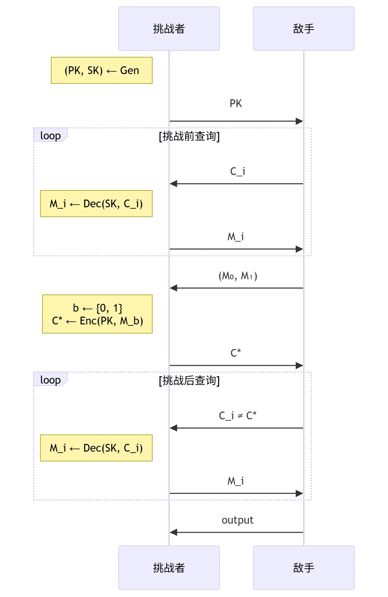
- **CCA 敌手攻击能力**：
    - 输入：公开信道中的 $PK$ 及挑战密文 $C^{*}$
    - 运行时间：概率多项式时间 PPT
    - 攻击方式：
        1. 选择明文攻击：敌手可以提供/决定/影响加密使用的明文
        2. 选择密文攻击：敌手可以获得除 $C^{*}$ 外任意密文的解密结果
- **IND 安全目标**：敌手无法区分密文 $C^{*}$ 加密的是 $M_{0}$ 还是 $M_{1}$（即如果 $\mathrm{output} = b$，则攻破该目标）
- **公钥加密算法的 IND-CCA 安全性定义**：任意概率多项式时间敌手在 CCA 安全模型中攻破 IND 安全目标的优势是可忽略的，即
    $$
    \mathrm{Adv} = \left| \Pr(\mathrm{output} = b) - \frac{1}{2} \right| = \mathrm{negl}(\lambda)
    $$

### ElGamal 加密算法
#### 群的基本知识
- 设 $(G,\cdot,1)$ 为**有限交换群**，其中 $1$ 为 $G$ 中关于运算 $\cdot$ 的单位元，则群 $G$ 满足以下性质：
    - 有限性：$|G| < \infty$
    - 封闭性：$\forall a, b \in G$，$a \cdot b \in G$
    - 交换性：$\forall a, b \in G$，$a \cdot b = b \cdot a$
    - 单位元：$\forall a \in G$，$a \cdot 1 = 1 \cdot a = a$
    - 逆元：$\forall a \in G$，存在 $a^{-1} \in G$，使得 $a \cdot a^{-1} = a^{-1} \cdot a = 1$
- **生成元**（Generator）：$a \in G$，集合 $\langle a \rangle = \{a^{i} : i \in \mathbb{Z}\}$ 是 $G$ 的子群，称为循环子群（Cyclic Subgroup），称 $a$ 为循环群 $\langle a \rangle$ 的生成元。
    - 特别地，如果 $\langle g \rangle = G$，则称 $g$ 是 $G$ 的生成元，$G$ 是由 $g$ 生成的循环群。
    - **群的阶**：$|\langle a \rangle| = \mathrm{ord}(a) = \min\{n \in \mathbb{N} : a^{n} = 1\}$，即 $a$ 的阶。
        - 拉格朗日定理：$\mathrm{ord}(a) \mid |G|$
    - **素数阶群**：如果 $G$ 的阶 $|G|$ 是素数，则 $G$ 中的任意非单位元都是生成元，且 $G$ 为循环群。 
    - 如果群 $G=\langle g \rangle$ 为循环群，则 $G$ 中元素的运算为 $\log|G|$ 的多项式时间。
- **离散对数**（Discrete Logarithm, DLOG）：对于 $a \in G$ 和 $b = a^{x} \in \langle a \rangle$，则称 $x\in\{0,1,\dots,\mathrm{ord}(a)-1\}$ 为 $b$ 相对于 $a$ 的离散对数，记为 $\mathrm{DLOG}_{G,a}(b)$。
    - DLOG 问题的困难性与群的运算有关。
    - 公认 DLOG 计算困难的群：
        - **有限域的子群**：$G$ 为模 $n$ 乘法群 $(\mathbb{Z}_n^*, \cdot)$ 的 $p$ 阶循环子群，其中 $n = 2p + 1$，且 $n$ 和 $p$ 均为素数。
            - 有限域上的离散对数问题（FFDLP）在数域筛法 NFS 下的求解复杂度为 $O\left(2^{\log^{\frac{1}{3}} p \cdot \log \log^{\frac{2}{3}} p}\right)$，为亚指数级别。
        - **椭圆曲线群**：$G=(E(\mathbb{Z}_p), +)$，其中 $E(\mathbb{Z}_p)$ 是定义在有限域 $\mathbb{Z}_p$ 上的椭圆曲线 $E$ 的点集，运算为点加法。
            - 椭圆曲线上的离散对数问题（ECDLP）在 Pollard's rho 算法下的求解复杂度为 $O(\sqrt{p})=O(2^{\frac{1}{2} \log p})$，为指数级别。

#### 底层困难问题
- **离散对数问题**（Discrete Logarithm, DLOG）：$G$ 为循环群，其阶为素数 $p$、生成元为 $g$，并均匀选取 $h \leftarrow G$
    - 输入：$(G, p, g, h)$
    - 输出：$d = \mathrm{DLOG}_g\, h$
- **计算性 Diffie-Hellman 问题**（Computational Diffie-Hellman, CDH）：$G$ 为循环群，其阶为素数 $p$、生成元为 $g$，均匀选取 $x, y \leftarrow \mathbb{Z}_p$
    - 输入：$(G, p, g, g^x, g^y)$
    - 输出：$g^{xy}$，也称为 $(g^x, g^y)$ 的 CDH 值
- **判定性 Diffie-Hellman 问题**（Decisional Diffie-Hellman, DDH）：$G$ 为循环群，其阶为素数 $p$、生成元为 $g$，均匀选取 $x, y, z \leftarrow \mathbb{Z}_p, \beta \leftarrow \{0, 1\}$，并定义 $z_\beta = \begin{cases} g^{xy} & \beta=0 \\ g^{z} & \beta=1 \end{cases}$
    - 输入：$(G, p, g, g^x, g^y, z_\beta)$
    - 输出：$\beta$
    - DDH 问题的困难性：任意 PPT 敌手在 DDH 安全模型中攻破 DDH 安全目标的优势是可忽略的，即
        $$
        \mathrm{Adv} = \left| \Pr(\mathrm{output} = \beta) - \frac{1}{2} \right| = \mathrm{negl}(\lambda)
        $$
- **定理**：**DDH 问题困难** $\implies$ **CDH 问题困难** $\implies$ **DLOG 问题困难**

#### ElGamal 加密算法简介
- **密钥生成算法** $(PK, SK) \leftarrow \mathrm{Gen}(1^\lambda)$：
    1. 选择循环群 $G$，其阶为素数 $p$、生成元为 $g$
    2. 均匀选取 $s \leftarrow \mathbb{Z}_p$，计算 $h := g^s$
    3. 输出 $PK = (G, p, g, h)$，$SK = s$
- **加密算法** $C \leftarrow \mathrm{Enc}(PK, M)$：消息空间为 $\mathbb{M} = G$
    1. 均匀选取 $r \leftarrow \mathbb{Z}_p$
    2. 计算 $C_1 := g^r$
    3. 计算 $C_2 := h^r \cdot M$
    4. 输出 $C := (C_1, C_2)$
- **解密算法** $M' \leftarrow \mathrm{Dec}(SK, C = (C_1, C_2))$：
    1. 计算并输出 $M' := C_2 \cdot (C_1^s)^{-1}$

#### ElGamal 加密算法的 IND-CPA 安全性
- **定理**：**DDH 问题困难** $\iff$ **ElGamal 算法是 IND-CPA 安全的**

	
    - **充分性证明**（$\implies$）：反证法（安全性归约）
        - 假设结论错误：ElGamal 算法不是 IND-CPA 安全的，即存在一个概率多项式时间敌手 $\mathcal{A}$，以不可忽略的概率在 ElGamal 算法 CPA 安全模型中攻破 IND 安全目标，即
            $$
            \mathrm{Adv}_\mathcal{A} = \left| \Pr(\mathrm{output}_\mathcal{A} = b) - \frac{1}{2} \right| = \text{non-negl}(\lambda)
            $$
        - 证明前提错误：构造一个概率多项式时间敌手 $\mathcal{B}$，在 DDH 安全模型中攻破 DDH 安全目标。
            - $\mathcal{B}$ 的输入：$(G, p, g, g^x, g^y, z_\beta)$
            - 调用子敌手：$\mathcal{B}$ 将 $PK = (G, p, g, h=g^x)$ 交给 $\mathcal{A}$，$\mathcal{A}$ 输入两个消息 $M_0, M_1 \in G$，$\mathcal{B}$ 将挑战密文设置为 $C^{*} = (g^y, z_\beta \cdot M_b)$ 交给 $\mathcal{A}$，则
                - $\beta = 0$ 时：$C^{*} = (g^y, M_b \cdot g^{xy})$，与 ElGamal 加密 $M_b$ 的密文分布相同，则
                    $$
                    \left|\Pr(\mathrm{output}_\mathcal{A}=b\mid \beta=0) - \frac{1}{2}\right| = \left| \Pr(\mathrm{output}_\mathcal{A} = b) - \frac{1}{2} \right| = \text{non-negl}(\lambda)
                    $$

                    也即 $\Pr(\mathrm{output}_\mathcal{A}=b \mid \beta=0) = \frac{1}{2} \pm \text{non-negl}(\lambda)$
                - $\beta = 1$ 时：$C^{*} = (g^y, M_b \cdot g^{z})$，由于 $z \leftarrow \mathbb{Z}_p$ 均匀分布，$M_b \cdot g^{z}$ 也均匀分布在 $G$ 中，则密文不包含任何关于 $b$ 的信息，$\Pr(\mathrm{output}_\mathcal{A}=b \mid \beta=1) = \frac{1}{2}$
            - $\mathcal{B}$ 的输出：$\mathrm{output}_\mathcal{B} = \begin{cases} 0 & \mathrm{output}_\mathcal{A} = b \\ 1 & \mathrm{output}_\mathcal{A} \neq b \end{cases}$
            - $\mathcal{B}$ 的优势：
                $$
                \begin{aligned}
                \mathrm{Adv}_\mathcal{B} =& \left| \Pr(\mathrm{output}_\mathcal{B} = \beta) - \frac{1}{2} \right| \\
                =& \frac{1}{2} \left| \Pr(\mathrm{output}_\mathcal{B} = 0 \mid \beta = 0) - \Pr(\mathrm{output}_\mathcal{B} = 0 \mid \beta = 1) \right| \\
                =& \frac{1}{2} \left| \Pr(\mathrm{output}_\mathcal{A} = b \mid \beta = 0) - \Pr(\mathrm{output}_\mathcal{A} = b \mid \beta = 1) \right| \\
                =& \frac{1}{2} \left| \left( \frac{1}{2} \pm \text{non-negl}(\lambda) \right) - \frac{1}{2} \right| \\
                =& \frac{1}{2} \cdot \text{non-negl}(\lambda) = \text{non-negl}(\lambda)
                \end{aligned}
                $$
            - 则 $\mathcal{B}$ 能以不可忽略的优势打破 DDH 安全性，与假设矛盾，因此 ElGamal 算法满足 IND-CPA 安全性。
    - **必要性证明**（$\impliedby$）：反证法（安全性归约）
        - 假设结论错误：DDH 问题不困难，即存在一个概率多项式时间敌手 $\mathcal{B}$，以不可忽略的概率在 DDH 安全模型中攻破 DDH 安全目标，即
            $$
            \mathrm{Adv}_\mathcal{B} = \left| \Pr(\mathrm{output}_\mathcal{B} = \beta) - \frac{1}{2} \right| = \text{non-negl}(\lambda)
            $$
        - 证明前提错误：构造一个概率多项式时间敌手 $\mathcal{A}$，在 ElGamal 算法 CPA 安全模型中攻破 IND 安全目标。
            - $\mathcal{A}$ 的输入：$PK = (G, p, g, h=g^s)$ 和 $C^* = (C_1, C_2) = (g^r, M_b\cdot h^r)$
            - 调用子敌手：$\mathcal{A}$ 将 $(G, p, g, g^s, g^r, C_2/M_0)$ 交给 $\mathcal{B}$，
                - $b = 0$ 时：$C_2 = M_0 \cdot g^{sr}$，则 $C_2/M_0 = g^{sr}$，与 DDH 问题中取 $\beta = 0$ 等价
                - $b = 1$ 时：$C_2 = M_1 \cdot g^{sr}$，则 $C_2/M_0 = M_1/M_0 \cdot g^{sr}$，由于 $M_0, M_1$ 均匀分布在 $G$ 中，则 $C_2/M_0$ 也均匀分布在 $G$ 中，与 DDH 问题中取 $\beta = 1$ 等价
            - $\mathcal{A}$ 的输出：$\mathrm{output}_\mathcal{A} = \begin{cases} 0 & \mathrm{output}_\mathcal{B} = 0 \\ 1 & \mathrm{output}_\mathcal{B} = 1 \end{cases}$
            - $\mathcal{A}$ 的优势：
                $$
                \begin{aligned}
                \mathrm{Adv}_\mathcal{A} =& \left| \Pr(\mathrm{output}_\mathcal{A} = b) - \frac{1}{2} \right| \\
                =& \frac{1}{2} \left| \Pr(\mathrm{output}_\mathcal{A} = 0 \mid b = 0) - \Pr(\mathrm{output}_\mathcal{A} = 0 \mid b = 1) \right| \\
                =& \frac{1}{2} \left| \Pr(\mathrm{output}_\mathcal{B} = 0 \mid b = 0) - \Pr(\mathrm{output}_\mathcal{B} = 0 \mid b = 1) \right| \\
                =& \frac{1}{2} \left| \Pr(\mathrm{output}_\mathcal{B} = 0 \mid \beta = 0) - \Pr(\mathrm{output}_\mathcal{B} = 0 \mid \beta = 1) \right| \\
                =& \mathrm{Adv}_\mathcal{B} = \text{non-negl}(\lambda)
                \end{aligned}
                $$
            - 则 $\mathcal{A}$ 能以不可忽略的优势打破 ElGamal 算法的 IND-CPA 安全性，与假设矛盾，因此 DDH 问题困难。

	

#### ElGamal 加密算法不满足 IND-CCA 安全性
- **攻击思路**：利用 CCA 安全模型中敌手可以获得除密文之外的任何信息的能力，构造一个敌手 $\mathcal{A}$，在 CCA 安全模型中攻破 ElGamal 算法的 IND-CCA 安全性。
    - $\mathcal{A}$ 的输入：$PK = (G, p, g, h=g^s)$ 和密文 $C^* = (C_1^*, C_2^*) = (g^r, M_b\cdot h^r)$
    - $\mathcal{A}$ 对 $C^*$ 进行修改，构造一个新的密文 $C' = (C_1', C_2') = (C_1^*, C_2^* \cdot M')$ 进行解密查询，得到 $M'' = M_b \cdot M'$
    - $\mathcal{A}$ 的输出：$\mathrm{output} = \begin{cases} 0 & M''/M' = M_0 \\ 1 & M''/M' = M_1 \end{cases}$
    - 则 $\mathcal{A}$ 能以概率 1 打破 ElGamal 算法的 IND-CCA 安全性。

## 数字签名算法的安全性定义以及 Schnorr 签名算法
### 数字签名算法的安全性
#### 数字签名简介
- **数字签名的要求**：
    - **可认证性**：能够验证消息源，以及消息的真实性/完整性
    - **不可否认性**：签名能够被公开验证
- **数字签名实现安全认证的条件**：
    - 生成签名相对容易
    - 识别和验证签名相对容易
    - 在计算上不可伪造：
        - 对新消息伪造签名不可行
        - 对已有签名伪造新签名并通过认证不可行

#### 数字签名算法的语义及正确性要求
- **语义**：一个数字签名方案 $\mathrm{DS}$ 包含三个概率多项式时间（PPT）算法 $(\mathrm{Gen}, \mathrm{Sign}, \mathrm{Verify})$：
    1. **密钥生成算法**：$(PK, SK) \leftarrow \mathrm{Gen}(1^\lambda)$：⼀般为概率性算法
    2. **签名算法**：$\sigma \leftarrow \mathrm{Sign}(SK, M)$：$M \in \mathbb{M}$，其中 $\mathbb{M}$ 是消息空间
    3. **验证算法**：$0/1 \leftarrow \mathrm{Verify}(PK, M, \sigma)$：一般为确定性算法；输出 $1$ 表示验证通过
- **正确性要求**（Correctness）：对任意 $(PK, SK) \leftarrow \mathrm{Gen}(1^\lambda)$、任意 $M \in \mathbb{M}$、任意 $\sigma \leftarrow \mathrm{Sign}(SK, M)$，均有
    $$
    \mathrm{Verify}(PK, M, \sigma) = 1
    $$

#### 数字签名算法的 EUF-CMA 安全性
- **选择消息攻击**（Chosen Message Attacks, CMA）安全模型：
    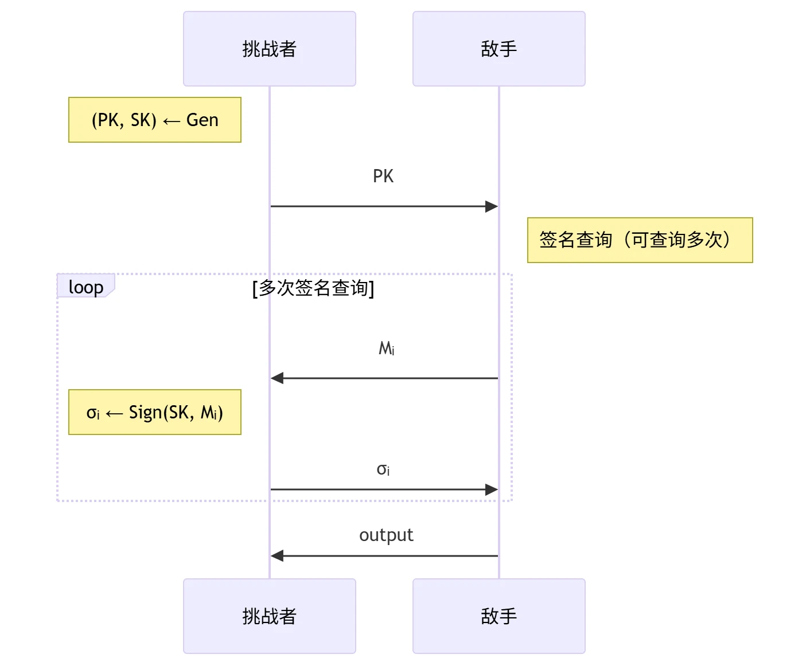
- **CMA 敌手攻击能力**：
    - 输入：公开信道中的 $PK, M, \sigma$
    - 运行时间：概率多项式时间 PPT
    - 攻击方式：选择消息攻击 CMA ── 敌手可以提供/决定/影响签名使用的消息
- **EUF 安全目标**：**存在不可伪造性**（Existential Unforgeability, EUF）── 敌手无法为一个**未查询过的新消息** $M^*$ 伪造有效签名 $\sigma^*$（即如果 $\mathrm{output} = (M^*, \sigma^*)$，满足 $M^* \notin \{M_i\}$ 和 $\mathrm{Verify}(PK, M^*, \sigma^*) = 1$，则攻破该目标）
- **数字签名算法的 EUF-CMA 安全性定义**: 任意概率多项式时间敌手在 CMA 安全模型中攻破 EUF 安全目标的**优势**是可忽略的，即
    $$
    \mathrm{Adv}_{\mathrm{EUF-CMA}} = \Pr\left[
    \mathrm{output} = (M^*, \sigma^*) \left|
    \begin{array}{l}
    (1)\ M^* \notin \{ M_i \} \\
    (2)\ \mathrm{Verify}(\mathrm{PK}, M^*, \sigma^*) = 1
    \end{array}
    \right.\right] = \mathrm{negl}(\lambda)
    $$

#### 数字签名算法的 sEUF-CMA 安全性
- **sEUF 安全目标**：**强存在不可伪造性**（Strong Existential Unforgeability, sEUF）── 敌手不仅无法为一个**未查询过的新消息** $M^*$ 伪造有效签名 $\sigma^*$，也无法为一个已签名消息 $M_i$ 伪造**新的有效签名** $\sigma^* \neq \sigma_i$（即如果 $\mathrm{output} = (M^*, \sigma^*)$，满足 $(M^*, \sigma^*) \notin \{(M_i, \sigma_i)\}$ 和 $\mathrm{Verify}(PK, M^*, \sigma^*) = 1$，则攻破该目标）
- **数字签名算法的 sEUF-CMA 安全性定义**: 任意概率多项式时间敌手在 CMA 安全模型中攻破 sEUF 安全目标的**优势**是可忽略的，即
    $$
    \mathrm{Adv}_{\mathrm{sEUF-CMA}} = \Pr\left[
    \mathrm{output} = (M^*, \sigma^*) \left|
    \begin{array}{l}
    (1)\ (M^*, \sigma^*) \notin \{ (M_i, \sigma_i) \} \\
    (2)\ \mathrm{Verify}(\mathrm{PK}, M^*, \sigma^*) = 1
    \end{array}
    \right.\right] = \mathrm{negl}(\lambda)
    $$

#### EUF-CMA 与 sEUF-CMA 安全性之间的关系
- **一般情况**：sEUF-CMA 安全 $\impliedby$ EUF-CMA 安全
    $$
    \mathrm{Adv}_{\mathrm{sEUF-CMA}} \leq \mathrm{Adv}_{\mathrm{EUF-CMA}}
    $$
- **若满足唯一性要求**：sEUF-CMA 安全 $\iff$ EUF-CMA 安全
    $$
    \mathrm{Adv}_{\mathrm{sEUF-CMA}} = \mathrm{Adv}_{\mathrm{EUF-CMA}}
    $$
    - **唯一性要求**（uniqueness）：$\forall (PK,SK) \leftarrow \mathrm{Gen}(1^\lambda), \forall M \in \mathbb{M}$，存在唯一的 $\sigma$ 使得 $\mathrm{Verify}(PK, M, \sigma) = 1$。

### 身份证明协议的安全性
#### 身份证明协议简介
- 核心：证明者向验证者证明自己拥有公钥 $PK$ 所对应的私钥 $SK$
- 交互流程（3 轮的 Identification）：
    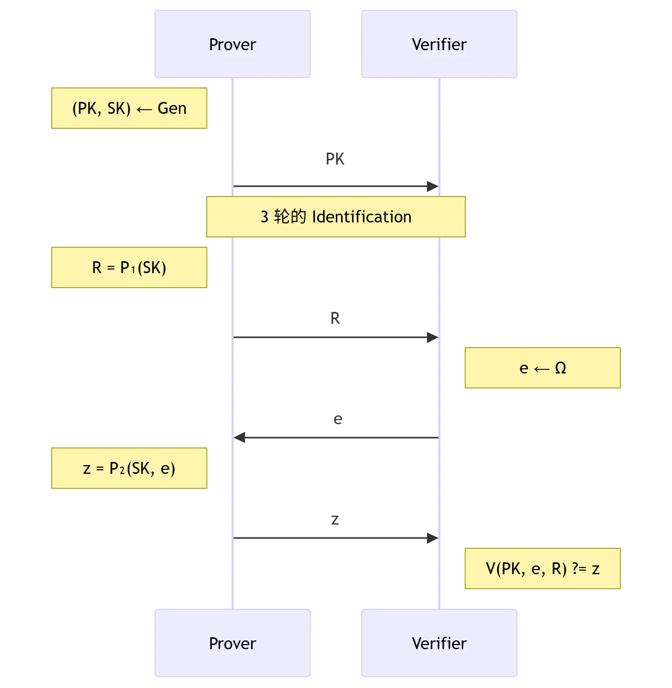

#### 身份证明协议的 UI-PA 安全性
- **被动攻击**（Passive Attacks, PA）安全模型：
    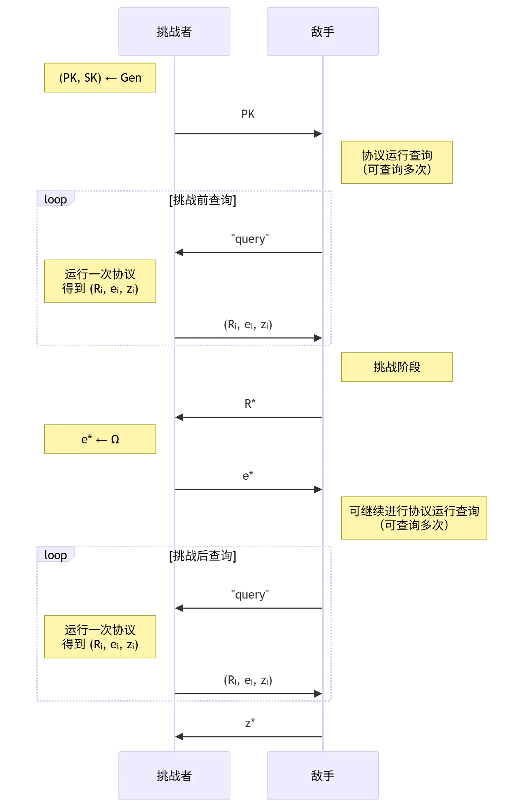
- **PA 敌手攻击能力**：
    - 输入：公开信道中的 $PK$ 及多次运行协议生成的 $(R_i, e_i, z_i)$
    - 运行时间：概率多项式时间 PPT
- **UI 安全目标**：**不可假冒性**（Unimpersonation, UI）── 敌手无法冒充 Prover 通过协议的验证算法（即如果 $\mathrm{output} = (R^*, e^*, z^*)$ 满足 $V(PK, e^*, R^*) = z^*$，则攻破该目标）
- **身份证明协议的 UI-PA 安全性定义**：任意概率多项式时间敌手在 P A安全模型中攻破 UI 安全目标的**优势**是可忽略的，即
    $$
    \mathrm{Adv}_{\mathrm{UI-PA}} = \Pr\left(
    \mathrm{output} = z^* \left|
    V(PK, e^*, R^*) = z^*
    \right.\right) = \mathrm{negl}(\lambda)
    $$

### Fiat-Shamir 变换
- 核心：为了使用身份证明协议进行签名，证明者（签名者）可将挑战 $e$ 用哈希函数 $\mathrm{H}(\cdot)$ 计算，自己独立地执行协议，无需与验证者交互。
- 交互流程：
    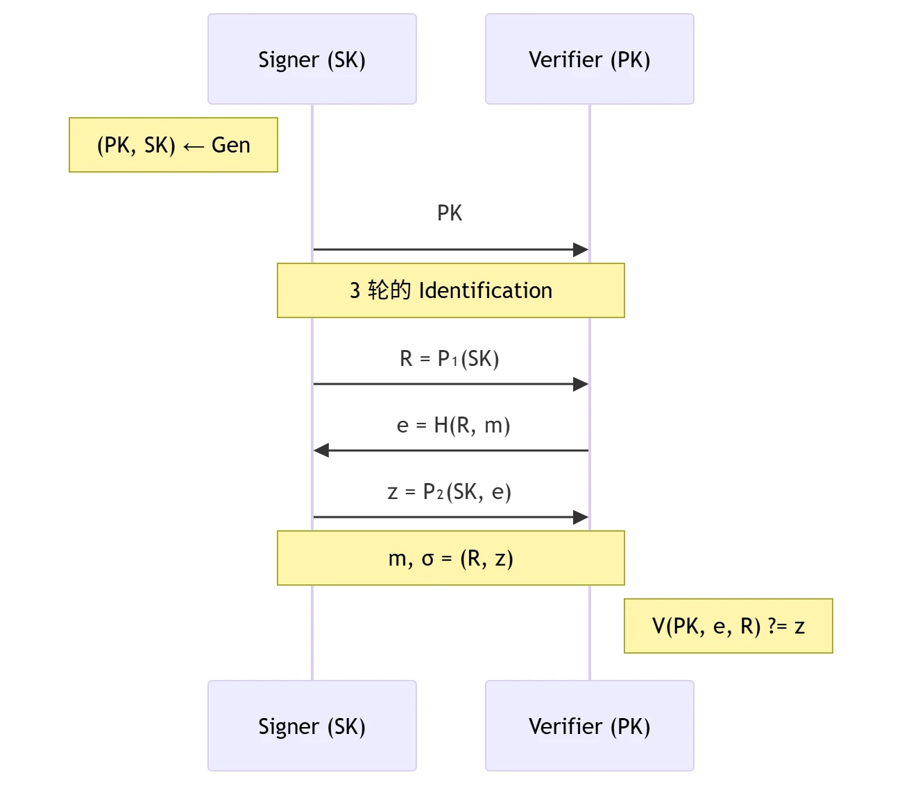
- Fiat-Shamir 变换的安全性：**身份证明协议是 UI-PA 安全的** + **$\mathrm{H}$ 为 RO** $\implies$ **通过 Fiat-Shamir 变换得到的签名算法是 EUF-CMA 安全的**
    - 证明：参考后续 [Schnorr 签名算法的安全性证明](#schnorr-签名算法的-euf-cma-安全性)

### Random Oracle 模型（随机预言机）
- Random Oracle 模型（随机预言机）是对哈希函数 $\mathrm{H}: G \to \{0,1\}^{m}$ 的假设，用于安全性证明中。
- **核心假设**：
    1. **Oracle-预言机假设**：敌手无法自己计算 $\mathrm{H}$ 的值，只能通过查询“预言机” $\mathrm{H}(\cdot)$ 的方式获得 $\mathrm{H}$ 的值：每一次查询，敌手向预言机 $\mathrm{H}(\cdot)$ 提交一个 $X$，$\mathrm{H}(\cdot)$ 返回输出 $\mathrm{H}(X)$。
    2. **Random-随机性假设**：随机预言机 $\mathrm{H}(\cdot)$ 在每一个 $X$ 上的输出值 $\mathrm{H}(X)$ 都是服从值域 $\{0,1\}^m$ 上均匀分布的，其随机性来源于预言机 $\mathrm{H}(\cdot)$ 内部。
    3. **Programmable-可编程性假设**：在安全性证明中，“随机预言机” $\mathrm{H}(\cdot)$ 由环境/挑战者向敌手提供。
- **推论**：
    1. Oracle 假设 + Random 假设：如果敌手没有向预言机 $\mathrm{H}(\cdot)$ 查询过某个输入 $X$，那么 $\mathrm{H}(X)$ 的值对于敌手而言是完全均匀的。
    2. Oracle 假设 + Programmable 假设：环境/挑战者知道敌手向预言机 $\mathrm{H}(\cdot)$ 查询过哪些输入 $X$。
    3. Random 假设 + Programmable 假设：环境/挑战者针对敌手的每一次预言机 $\mathrm{H}(\cdot)$ 查询 $X$，返回值域 $\{0,1\}^m$ 上均匀分布的值作为 $\mathrm{H}(X)$ 的值。
- **说明**:
    - RO 模型刻画了敌手只能**黑盒**的调用 Hash Function，敌手无法仅阅读 Hash Function 的代码而不调用 Hash Function 推断出 $\mathrm{H}(X)$ 的值。

### Schnorr 身份证明协议与签名算法
#### Schnorr 身份证明协议
- 目的：Prover 向 Verifier 证明自己拥有 $PK$ 所对应的私钥 $SK$。
- 交互流程：基于椭圆曲线上的离散对数问题
    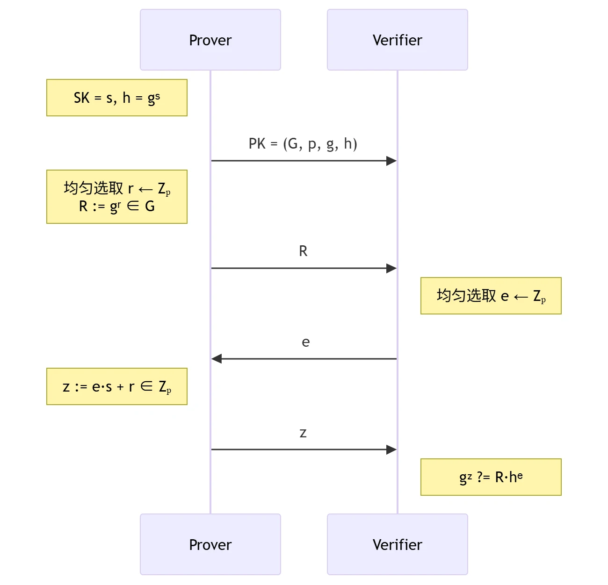

#### Schnorr 签名算法
- **组件**：Hash Function $\mathrm{H}: \{0,1\}^{*} \to \mathbb{Z}_p$
- **密钥生成算法** $(PK, SK) \leftarrow \mathrm{Gen}(1^\lambda)$：
    1. 选择循环群 $G$，其阶为素数 $p$、生成元为 $g$
    2. 均匀选取 $s \leftarrow \mathbb{Z}_p$，计算 $h := g^s \in G$
    3. 输出 $PK = (G, p, g, h)$，$SK = s$
- **签名算法** $\sigma \leftarrow \mathrm{Sign}(SK, M)$，消息空间为 $\mathbb{M}=\{0,1\}^{*}$
    1. 均匀选取 $r \leftarrow \mathbb{Z}_{p}$，计算 $R:=g^{r} \in G$
    2. 计算 $e:=\mathrm{H}(R, M) \in \mathbb{Z}_{p}$
    3. 计算 $z:=e \cdot s+r \in \mathbb{Z}_{p}$
    4. 输出 $\sigma:=(R, z)$
- **验证算法** $0/1 \leftarrow \mathrm{Verify}(PK, M, \sigma=(R, z))$
    1. 计算 $e:=\mathrm{H}(R, M) \in \mathbb{Z}_{p}$
    2. 验证 $g^{z} \stackrel{?}{=} h^{e} \cdot R$，相等输出 $1$，否则输出 $0$

#### 安全性分析
##### Schnorr 签名算法的 EUF-CMA 安全性
- **断言1**：如果在数字签名的 EUF-CMA 安全模型下，存在攻击者 $\mathcal{A}$ 以不可忽略的概率攻破 Schnorr 签名。设 $\mathcal{A}$ 的输出为 $(M^{*}, \sigma^{*}=(R^{*}, z^{*}))$，即
    $$
    \mathrm{Adv}_{\mathcal{A}}=\Pr\left(\mathrm{output}_{\mathcal{A}}=(M^{*}, \sigma^{*})\left| h^{\mathrm{H}(R^{*}, M^{*})} \cdot R^{*}=g^{z^{*}}\right.\right)=\text{non-negl}(\lambda)
    $$

    则 $\mathcal{A}$ 以不可忽略的概率查询过 $(R^{*}, M^{*})$ 的 Hash 值。

	
    - **证明**：反证法，假设 $\mathcal{A}$ 没有查询过 $(R^{*}, M^{*})$ 的 Hash 值，则在 $\mathrm{H}$ 为 RO 假设下，$\mathrm{H}(R^{*}, M^{*})$ 对 $\mathcal{A}$ 是 $\mathbb{Z}_{p}$ 中均匀随机的元素，因此 $h^{\mathrm{H}(R^{*}, M^{*})}$ 对 $\mathcal{A}$ 是 $G$ 中均匀随机的元素。则 $\mathcal{A}$ 猜对 $z^{*} \in \mathbb{Z}_{p}$ 满足
        $$
        h^{\mathrm{H}(R^{*}, M^{*})}=g^{z^{*}} \cdot (R^{*})^{-1}
        $$

        的概率为 $\frac{1}{|G|}=\frac{1}{p}=negl(\lambda)$，与假设矛盾。

	

- **引理1（Fiat-Shamir 转换）**：**Schnorr 身份证明协议是 UI-PA 安全的** + **$\mathrm{H}$ 为 RO** $\implies$ **Schnorr 签名算法是 EUF-CMA 安全的**
    - **思路**：将 $\mathcal{A}$ 作为 $\mathcal{B}$ 的子算法，为 $\mathcal{A}$ 提供合法的输入，以及返回合法的签名查询。利用 $\mathcal{A}$ 的输出结果帮助 $\mathcal{B}$ 在 UI-PA 中的输出正确的结果。

	
    - **证明**：使用反证法（安全性规约）
        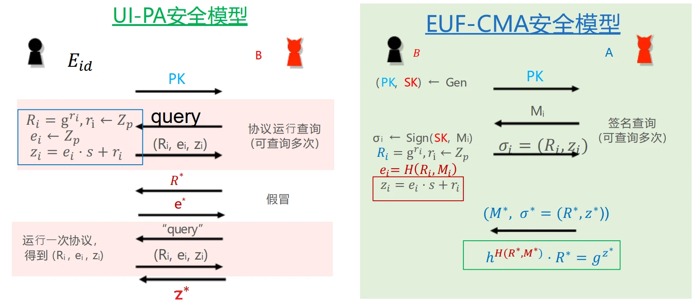
        - **假设结论错误**：Schnorr 签名算法不是 EUF-CMA 安全的，即存在 PPT 敌手 $\mathcal{A}$ 以不可忽略的概率攻破 Schnorr 签名算法的 EUF-CMA 安全性。
            - 即 $\mathcal{A}$ 通过若干次签名查询后，可以输出一个未查询过的消息 $M^{*}$ 以及一个有效签名 $\sigma^{*}=(R^{*}, z^{*})$，以不可忽略的概率满足 $h^{\mathrm{H}(R^{*}, M^{*})} \cdot R^{*}=g^{z^{*}}$
        - **证明前提错误**：构造一个 PPT 敌手 $\mathcal{B}$，在 UI-PA 安全模型下攻破 Schnorr 身份证明协议。
            - **$\mathcal{B}$ 的策略**：
                - $\mathcal{B}$ 将公钥 $PK$ 作为输入提供给 $\mathcal{A}$；设 $\mathcal{A}$ 进行的哈希查询次数为 $Q(\lambda)$，则 $\mathcal{B}$ 随机选择 $j \in [1, Q(\lambda)]$ 赌 $\mathcal{A}$ 最终输出的消息 $M^{*}=M_j$
                - 当 $\mathcal{A}$ 使用 $M_i$ 进行第 $i$ 次**签名查询**时：$\mathcal{B}$ 由于本身不具备私钥 $SK$，无法生成合法的签名，因此向挑战者 $E_{id}$ 发起查询，拿到一组合法记录 $(R_i, e_i, z_i)$，并将 $\sigma_i=(R_i, z_i)$ 返回给 $\mathcal{A}$，并自身记录 $\mathrm{H}(R_i, M_i) = e_i$
                    - 此时若 $\mathcal{A}$ 要对签名查询进行验证，计算时需要 $\mathrm{H}(R_i, M_i)$，只能向 $\mathcal{B}$ 查询哈希结果，必然能通过检验
                - 当 $\mathcal{A}$ 使用 $(R_k, M_k)$ 进行第 $k$ 次**哈希查询**时：
                    - 若 $k=j$ 且 $M_j \notin \{M_i\}$，即 $\mathcal{A}$ 的第 $j$ 次哈希查询的消息 $M_j$ 没有在之前的签名查询中出现过，则 $\mathcal{B}$ 向 $E_{id}$ 输入 $R_j$ 并把返回的 $e_j$ 当作自己的哈希输出，并记录 $\mathrm{H}(R_j, M_j) = e_j$
                    - 若 $k=j$ 且 $M_j \in \{M_i\}$，则重新选择 $j \in [1, Q(\lambda)]$，直到满足 $M_j \notin \{M_i\}$
                    - 若 $k \in [1, Q(\lambda)] \setminus \{j\}$，$\mathcal{B}$ 查询是否有 $\mathrm{H}(R_k, M_k)$ 的记录：
                        - 若有则直接返回
                        - 若没有则随机选择 $e \leftarrow \mathbb{Z}_p$ 返回并记录 $\mathrm{H}(R_k, M_k) = e$
                - 最终当 $\mathcal{A}$ 输出 $(M^{*}, \sigma^{*}=(R^{*}, z^{*}))$ 时，若 $M^{*}=M_j$，则 $\mathcal{B}$ 输出 $z^{*}$ 作为自己的输出，否则视为失败。
            - **$\mathcal{B}$ 的优势**：
                $$
                \begin{aligned}
                \mathrm{Adv}_{\mathcal{B}} &\geq \Pr\left[
                \begin{array}{l}
                (1)\ \mathcal{A} \text{ 成功攻破 Schnorr 签名算法的 EUF-CMA 安全性} \\
                (2)\ \mathcal{A} \text{ 查询过 } (R^{*}, M^{*}) \text{ 的 Hash 值} \\
                (3)\ \mathcal{B} \text{ 赌对了 } j \text{（即 } M^{*}=M_j \text{）}
                \end{array}
                \right] \\
                &\geq \text{non-negl}(\lambda) \cdot \text{non-negl}(\lambda) \cdot \frac{1}{Q(\lambda)} \\
                &= \text{non-negl}(\lambda)
                \end{aligned}
                $$
            - 因此，$\mathcal{B}$ 以不可忽略的概率攻破 Schnorr 身份证明协议的 UI-PA 安全性，与前提矛盾。

	

##### Schnorr 身份证明协议的 UI-PA 安全性证明
- **引理 2**：**DL 问题困难** $\implies$ **Schnorr 身份证明协议是 UI-PA 安全的**

	
    - **证明**：安全性归约，由攻破 UI-PA 安全性的敌手 $\mathcal{A}$ 来构造解决 DL 问题的敌手 $\mathcal{B}$。
        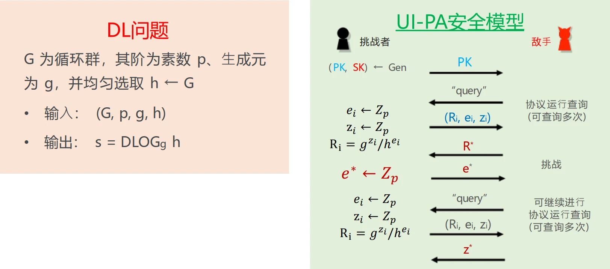
        - **假设结论错误**：Schnorr 身份证明协议不是 UI-PA 安全的，即存在 PPT 敌手 $\mathcal{A}$ 以不可忽略的概率攻破 Schnorr 身份证明协议的 UI-PA 安全性，即
            $$
            \mathrm{Adv}_{\mathcal{A}} = \Pr\left(
            \mathrm{output} = (R^{*}, e^{*}, z^{*}) \left|
            h^{e^{*}} \cdot R^{*}=g^{z^{*}}
            \right.\right) = \text{non-negl}(\lambda)
            $$
        - **证明前提错误**：构造一个 PPT 敌手 $\mathcal{B}$ 解决 DL 问题。
            - **$\mathcal{B}$ 的策略**：**Rewind 技术**
                - $\mathcal{B}$ 将 DL 问题的输入 $PK=(G, p, g, h)$ 作为 Schnorr 身份证明协议的公钥提供给 $\mathcal{A}$
                - 对于 $\mathcal{A}$ 的每一次协议运行查询，$\mathcal{B}$ 随机选取 $e_i, z_i \leftarrow \mathbb{Z}_p$，计算 $R_i = g^{z_i}/h^{e_i}$，为 $\mathcal{A}$ 提供完美模拟的合法三元组 $(R_i, e_i, z_i)$
                - **第一次调用**：$\mathcal{B}$ 调用 $\mathcal{A}$ 直到 $\mathcal{A}$ 输出 $R^*$ 时，$\mathcal{B}$ 均匀随机选择 $e_1^* \leftarrow \mathbb{Z}_p$ 作为挑战发送给 $\mathcal{A}$，并收到 $\mathcal{A}$ 的应答输出 $z_1^*$
                - **第二次调用**：$\mathcal{B}$ 再次调用 $\mathcal{A}$，所有使用的随机数（包括 $\mathcal{A}$ 内部的随机数和 $\mathcal{B}$ 模拟查询的随机数）均与第一次调用**完全相同**。因此 $\mathcal{A}$ 会再次输出同样的 $R^*$。此时 $\mathcal{B}$ 使用**不同**的随机数均匀选择一个新的挑战 $e_2^* \leftarrow \mathbb{Z}_p$ 发送给 $\mathcal{A}$，并收到 $\mathcal{A}$ 的新应答输出 $z_2^*$
                - **解 DL**：如果两次调用 $\mathcal{A}$ 都成功伪造，则有：
                    $$
                    \begin{cases}
                    R^* \cdot h^{e_1^*} = g^{z_1^*} \\
                    R^* \cdot h^{e_2^*} = g^{z_2^*}
                    \end{cases}
                    $$

                    若 $e_1^* \neq e_2^*$，两式相除消去 $R^*$ 可得 $h^{e_1^* - e_2^*} = g^{z_1^* - z_2^*}$。代入 $h = g^s$，即可解出 DL 问题的解：
                        $$
                        s \equiv (e_1^* - e_2^*)^{-1}(z_1^* - z_2^*) \pmod p
                        $$
            - **$\mathcal{B}$ 的优势**：
                - 用变量 $\omega$ 代表 $\mathcal{B}$ 除了返回挑战 $e^*$ 之外所使用的所有随机数集合（即决定 $\mathcal{A}$ 输出 $R^*$ 的所有前置上下文）
                - 定义指示函数 $\mathrm{V}(\omega, e^*) = 1$ 当且仅当 $\mathcal{A}$ 在随机数 $\omega$ 和挑战 $e^*$ 下成功返回正确的 $z^*$（即 $R^* \cdot h^{e^*} = g^{z^*}$）
                - 则 $\mathcal{B}$ 成功解决 DL 问题的概率（即两次都成功且挑战值不同的概率）为：
                    $$
                    \begin{aligned}
                    \mathrm{Adv}_{\mathcal{B}} &= \Pr_{\omega, e_1^*, e_2^*}[\mathrm{V}(\omega, e_1^*) = 1 \land \mathrm{V}(\omega, e_2^*) = 1 \land e_1^* \neq e_2^*] \\
                    &= \Pr_{\omega, e_1^*, e_2^*}[\mathrm{V}(\omega, e_1^*) = 1 \land \mathrm{V}(\omega, e_2^*) = 1] - \Pr_{\omega, e_1^*, e_2^*}[\mathrm{V}(\omega, e_1^*) = 1 \land \mathrm{V}(\omega, e_2^*) = 1 \land e_1^* = e_2^*] \\
                    &\ge \Pr_{\omega, e_1^*, e_2^*}[\mathrm{V}(\omega, e_1^*) = 1 \land \mathrm{V}(\omega, e_2^*) = 1] - \Pr[e_1^* = e_2^*] \\
                    &\ge \Pr_{\omega, e_1^*, e_2^*}[\mathrm{V}(\omega, e_1^*) = 1 \land \mathrm{V}(\omega, e_2^*) = 1] - 1/p \\
                    &= \sum_{W\in\Omega_\omega} \Pr[\omega=W] \cdot \Pr_{e_1^*, e_2^*}[\mathrm{V}(W, e_1^*) = 1 \land \mathrm{V}(W, e_2^*) = 1] - 1/p \\
                    &= \sum_{W\in\Omega_\omega} \Pr[\omega=W] \cdot \Pr_{e_1^*}[\mathrm{V}(W, e_1^*) = 1] \cdot \Pr_{e_2^*}[\mathrm{V}(W, e_2^*) = 1] - 1/p \\
                    &= \sum_{W\in\Omega_\omega} \Pr[\omega=W] \cdot \Pr_{e^*}[\mathrm{V}(W, e^*) = 1]^2 - 1/p \\
                    &\ge \left(\sum_{W\in\Omega_\omega} \Pr[\omega=W] \cdot \Pr_{e^*}[\mathrm{V}(W, e^*) = 1]\right)^2 - 1/p \\
                    &= \Pr_{\omega, e^*}[\mathrm{V}(\omega, e^*) = 1]^2 - 1/p \\
                    &= \mathrm{Adv}_{\mathcal{A}}^2 - 1/p \\
                    &\ge \text{non-negl}(\lambda)^2 - \text{negl}(\lambda) \\
                    &= \text{non-negl}(\lambda)
                    \end{aligned}
                    $$
            - 因此，$\mathcal{B}$ 以不可忽略的概率成功解决 DL 问题，与 DL 问题困难的假设矛盾。得证！

	

##### 定理
$$
\begin{aligned}
&\text{DL 问题困难} + \mathrm{H} \text{ 为 RO} \\
\implies &\text{Schnorr 身份证明协议是 UI-PA 安全的} \\
\implies &\text{Schnorr 签名算法是 EUF-CMA 安全的}
\end{aligned}
$$

### DSA 身份证明协议与签名算法
#### DSA 身份证明协议
- 目的：Prover 向 Verifier 证明自己拥有 $PK$ 所对应的私钥 $SK$。
- 交互流程：基于椭圆曲线上的离散对数问题
    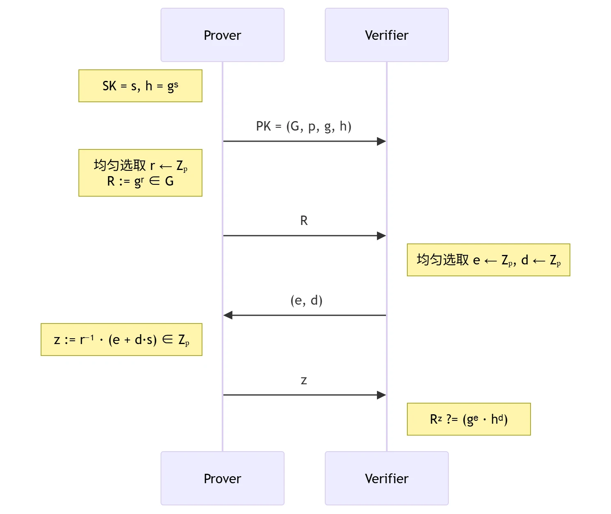

#### DSA 签名算法
- **组件**：Hash Functions
    - $\mathrm{H}: \{0,1\}^{*} \to \mathbb{Z}_p$
    - $\mathrm{F}: G \to \mathbb{Z}_p$
- **密钥生成算法** $(PK, SK) \leftarrow \mathrm{Gen}(1^\lambda)$：
    1. 选择循环群 $G$，其阶为素数 $p$、生成元为 $g$
    2. 均匀选取 $s \leftarrow \mathbb{Z}_p$，计算 $h := g^s \in G$
    3. 输出 $PK = (G, p, g, h)$，$SK = s$
- **签名算法** $\sigma \leftarrow \mathrm{Sign}(SK, M)$，消息空间为 $\mathbb{M}=\{0,1\}^{*}$
    1. 均匀选取 $r \leftarrow \mathbb{Z}_{p}$，计算 $R:=g^{r} \in G$
    2. 计算 $e:=\mathrm{H}(M) \in \mathbb{Z}_{p}$
    3. 计算 $d:=\mathrm{F}(R) \in \mathbb{Z}_{p}$
    4. 计算 $z:=r^{-1}(e + d \cdot s) \in \mathbb{Z}_{p}$
    5. 输出 $\sigma:=(d, z)$
- **验证算法** $0/1 \leftarrow \mathrm{Verify}(PK, M, \sigma=(d, z))$
    1. 计算 $e:=\mathrm{H}(M) \in \mathbb{Z}_{p}$
    2. 计算 $R:=(g^e \cdot h^d)^{z^{-1}} \in G$
    3. 计算 $d':=\mathrm{F}(R) \in \mathbb{Z}_{p}$
    4. 验证 $d \stackrel{?}{=} d'$，相等输出 $1$，否则输出 $0$

#### 安全性分析
$$
\begin{aligned}
&\text{DL 问题困难} + \mathrm{H}, \mathrm{F} \text{ 为 RO} \\
\implies &\text{DSA 身份证明协议是 UI-PA 安全的} + \mathrm{H}, \mathrm{F} \text{ 为 RO} \\
\implies &\text{DSA 签名算法是 EUF-CMA 安全的}
\end{aligned}
$$

#### DSA 与 ECDSA 签名算法的应用
- DSA 为上述算法在大整数循环群 $G=\mathbb{Z}_N^*$ 的 $p$ 阶子群上的具体实现，其中 $\mathrm{F}: G \to \mathbb{Z}_p$ 定义为 $\mathrm{F}(R) = R \bmod p$
- ECDSA 为上述算法在椭圆曲线循环群 $G$ 上的具体实现，其中 $\mathrm{F}: G \to \mathbb{Z}_p$ 定义为 $\mathrm{F}(R=(x_R, y_R)) = x_R \bmod p$。

> 基于上述具体 $F$ 函数的 DSA / ECDSA 签名算法的安全性没有基于标准困难问题的安全性证明，但也不存在有效的攻击方法，因此在实际应用中被广泛使用。

# Ch2 基于身份和属性的密码
## 椭圆曲线预备知识

### 预备知识
#### 射影平面与仿射平面
- 域 $K$ 上的**射影平面** $\mathbb{P}^2(K)$：
    $$
    \mathbb{P}^2(K)=\{(X:Y:Z):X,Y,Z\in K\}\backslash\{(0:0:0)\}
    $$
    - 定义等价关系：$(X:Y:Z)=(kX:kY:kZ),k\in K^*$
- 域 $K$ 上 $\mathbb{P}^2(K)$ 的**仿射平面** $\mathbb{A}^2(K)$：
    $$
    \mathbb{P}^2(K) \leftrightarrow \mathbb{A}^2(K) = \{(x,y):x,y\in K\}
    $$
    - 坐标变换：
        - $(x:y:1)\leftarrow (x,y)$
        - $(X:Y:Z)\rightarrow\left(\frac{X}{Z},\frac{Y}{Z}\right), Z\neq0$
            - 无穷远点：$(1:Y:0)$ 或 $(0:1:0)$
    - $d$ 次齐次多项式: $f(rX,rY,rZ)=r^d\cdot f(X,Y,Z)$，$\forall r\in K$
        - 齐次化: $f(x,y)\rightarrow f\left(\frac{X}{Z},\frac{Y}{Z}\right)$，将非齐次的仿射方程转化为齐次的射影方程。
        - 去齐次化: $f(X,Y,Z)\rightarrow f(x,y,1)$，将齐次的射影方程转化为非齐次的仿射方程。

#### 代数曲线
- **代数曲线**：令 $C$ 为由**齐次多项式方程** $f(X,Y,Z)=0$ 为定义的曲线。若 $f(X,Y,Z)$ 的系数属于域 $K$，称 $C$ 为定义在 $K$ 上的代数曲线。集合
    $$
    C(K)=\left\{(x:y:z)\in \mathbb{P}^2(K):f(x,y,z)=0\right\}
    $$

    称为曲线 $C$ 的有理点集。
- **奇异点与非奇异点**：令 $P\in C(K)$，如果 $\left(\frac{\partial f}{\partial x}(P),\frac{\partial f}{\partial y}(P),\frac{\partial f}{\partial z}(P)\right)=(0,0,0)$，则称 $P$ 为 $C$ 的奇异点，否则称 $P$ 为 $C$ 的非奇异点。
    - 判断是否奇异点需要先将方程齐次化。
- **切线方程**：若 $P$ 为 $C$ 上的非奇异点，则 $C$ 上过 $P$ 的切线方程为
    $$
    L:\frac{\partial f}{\partial x}(P)X+\frac{\partial f}{\partial y}(P)Y+\frac{\partial f}{\partial z}(P)Z=0.
    $$
- **光滑曲线**：若 $C$ 上所有点均为非奇异点，称 $C$ 为光滑曲线。
- **有理映射**：设齐次方程 $F_1(X;Y;Z)=0$ 和 $F_2(X;Y;Z)=0$ 定义的代数曲线分别为 $C_1$ 和 $C_2$。若存在映射
    $$
    \begin{aligned}
    \phi: &C_1\longrightarrow C_2 \\
    &(x:y:z)\longmapsto (f_1(x,y,z):f_2(x,y,z):f_3(x,y,z))
    \end{aligned}
    $$
    其中 $f_i=\frac{p_i(X,Y,Z)}{q_i(X,Y,Z)}$，且 $p_i, q_i$ 均为齐次多项式，则称 $\phi$ 是一个有理映射。
- **双有理等价**：设齐次方程 $F_1(X;Y;Z)=0$ 和 $F_2(X;Y;Z)=0$ 定义的代数曲线分别为 $C_1$ 和 $C_2$。若存在有理映射
    $$
    \begin{aligned}
    \phi&=(f_1,f_2,f_3):C_1\to C_2 \\
    \psi&=(g_1,g_2,g_3):C_2\to C_1
    \end{aligned}
    $$

    使得 $\phi\circ\psi=\mathrm{id}_{C_1}$，则称 $C_1$ 和 $C_2$ 为双有理等价。
- **Bezout 定理**：设齐次方程 $F_1(X;Y;Z)=0$ 和 $F_2(X;Y;Z)=0$ 次数分别为 $d_1$ 和 $d_2$。则 $F_1(X;Y;Z)=0$ 和 $F_2(X;Y;Z)=0$ 相交点的个数为 $d_1d_2$（重点按重数计算）。

#### 平行线公理
- **仿射平面**：$\mathbb{A}^2(K)=\{(x,y):x,y\in K\} \leftarrow$ 平面直角坐标系
    - 平行线公理：任意两条平行直线不相交
    - $\ell_1:ax+by=c_1$；$\ell_2:ax+by=c_2$；则 $\ell_1\cap\ell_2=\emptyset$
- **射影平面**：$\mathbb{P}^2(K)=\{(X:Y:Z):X,Y,Z\in K\}\backslash\{(0:0:0)\} \leftarrow$ 射影平面坐标系
    - **无**平行线公理：射影平面中两条平行线相交，交点为**无穷远点**
    - $L_1:aX+bY=c_1Z$；$L_2:aX+bY=c_2Z$；则
        $$
        L_1\cap L_2=\begin{cases}(1:-\frac{a}{b}:0), & b\neq0 \\ (0:1:0), & b=0\end{cases}
        $$
        - $(0:1:0)$ 为任意垂直于 $X$ 轴的直线在无穷远处的交点。

### 椭圆曲线群
#### 椭圆曲线
- **椭圆曲线**：定义域 $K$ 上的椭圆曲线是指射影平面上的一条光滑的、亏格是 1 的代数曲线，并且存在定义在 $K$ 上的点。
- **性质**：域 $K$ 上的椭圆曲线是满足以下 Weierstrass 方程并具有无穷远点 $(0:1:0)$ 的光滑代数曲线：
    $$
    \begin{aligned}
    & Y^2Z+a_1XYZ+a_3YZ^2=X^3+a_2X^2Z+a_4XZ^2+a_6Z^3 \\
    & y^2+a_1xy+a_3y=x^3+a_2x^2+a_4x+a_6（仿射形式）
    \end{aligned}
    $$

    其中 $a_1,a_2,a_3,a_4,a_6\in K$ 满足某些明确的代数条件。
    - **无穷远点**：每条直线与椭圆曲线在无穷远处的交点。
    - 特别地，当 $F$ 的特征不为 2、3 时，椭圆曲线的 Weierstrass 方程双有理等价于：
        $$
        y^2=x^3+ax+b, \quad 4a^3+27b^2\neq0
        $$
    - 变换过程：
        $$
        \begin{aligned}
        & E:y^2+a_1xy+a_3y=x^3+a_2x^2+a_4x+a_6 \\
        \xrightarrow{x'=x,\quad y'=y+\frac{a_1x+a_3}{2}} & E':y'^2=x'^3+a_2'x'^2+a_4'x'+a_6' \\
        \xrightarrow{x''=x'+\frac{a_2'}{3},\quad y''=y'} & E'':y''^2=x''^3+ax''+b
        \end{aligned}
        $$

#### 椭圆曲线的有理点集
- **椭圆曲线的有理点集**：设 $E/\mathbb{F}:y^2+a_1xy+a_3y=x^3+a_2x^2+a_4x+a_6$，则 $E(F)$ 的有理点集为
    $$
    E(F)=\{(u,v)\in F^2 | v^2+a_1uv+a_3v=u^3+a_2u^2+a_4u+a_6\} \cup \{O\}
    $$
- 椭圆曲线密码一般定义在有限域上：$K=\mathbb{Z}_p$、$K=GF(2^n)$
- 计算有理点的步骤：
    1. 对每一 $u\in K$，计算 $a_1u+a_3$ 和 $u^3+a_2u^2+a_4u+a_6$
    2. 在 $K$ 上解二次方程：$y^2+(a_1u+a_3)y-(u^3+a_2u^2+a_4u+a_6)=0$ 得到 $v$ 的值

#### 椭圆曲线点群
- **椭圆曲线点群**：设 $E/\mathbb{F}:y^2+a_1xy+a_3y=x^3+a_2x^2+a_4x+a_6$，则 $E(F)$ 关于以下点加运算构成加法群，且无穷远点 $(0:1:0)$ 为加法单位元：
    
    - 令 $P, Q$ 为 $E(F)$ 上的任意两点
    - 过 $P$ 和 $Q$ 的直线 $L$ 与 $E$ 相交于第三个点 $R$
    - 过无穷远点和 $R$ 的直线 $L'$ 与 $E$ 相交于第三个点定义为 $P+Q$。
- **Bezout’s 定理**：每条射影直线与椭圆曲线的相交于 3 个点（重点按重数计数）。
- **性质**：**加法交换群**
    - **群性质**：
        - 零元存在：$O=(0:1:0)$，满足 $P+O=P$。
        - 单位元存在：对于每个 $P=(x,y)$，存在 $-P=(x,-y-a_1x-a_3)$ 使得 $P+(-P)=O$。
        - 结合律：对于任意 $P, Q, R\in E(F)$，满足 $(P+Q)+R=P+(Q+R)$，需要更多数学理论证明。
    - **交换性**：对于任意 $P, Q\in E(F)$，满足 $P+Q=Q+P$。

#### 椭圆曲线的基本运算
- **代数表示**：设 $P=(x_1, y_1)$，$Q=(x_2, y_2)$，计算 $S=P+Q=(x_3, y_3)$。
    - **点加运算**：$P\neq Q$
    - **倍点运算**：$P=Q$
- **计算方法**：
    1. 求过点 $P, Q(Q\neq-P)$ 的直线方程 $y=\lambda x+\mu$
        - $P\neq Q$，$\lambda=\frac{y_2-y_1}{x_2-x_1}$，$\mu=y_1-\lambda x_1$
        - $P=Q$（计算切线），$\lambda=\frac{3x_1^2+2a_2x_1+a_4-a_1y_1}{2y_1+a_1x_1+a_3}$，$\mu=y_1-\lambda x_1$
    2. 将直线方程与椭圆曲线方程联立解得 $S=(x_3, y_3)$
        $$
        x^3+a_2x^2+a_4x+a_6-(\lambda x+\mu )^2-a_1x(\lambda x+\mu )-a_3(\lambda x+\mu )=(x-x_1)(x-x_2)(x-x_3) = 0
        $$

        解得
        $$
        (x_3,y_3)=(\lambda^2+a_1\lambda -a_2-x_2-x_1, -\lambda x_3-\mu -a_1x_3-a_3)$$

        特别地，当椭圆曲线方程为 $y^2=x^3+ax+b$ 时，
        $$
        (x_3,y_3)=(\lambda^2 -x_2-x_1, \lambda(x_1 -x_3)-y_1)
        $$

#### 有限域上的椭圆曲线
- **点的个数**
    - **估计**（Hasse-Weil bound）：Hasse 关于有限域 $\mathbb{F}_q$上椭圆曲线点的个数估计：
        $$
        q+1-2\sqrt{q} \leq \# E\left(\mathbb{F}_{q}\right) \leq q+1+2\sqrt{q}
        $$
    - **计算**：求有限域 $\mathbb{F}_q$ 上椭圆曲线群元素个数的 SEA（Schoof Elkies Atkin）算法复杂度为 $O\left(log^6 q\right)$
- **点的阶数**：$P$ 是椭圆曲线 $E$ 上的一个点，若存在最小的正整数 $n$，使得 $nP=O$，则称 $n$ 是 $P$ 的阶数，或称 $P$ 为 $n$ 阶扭点（torsion）。一般取 $n$ 为大素数 $r$。
- **椭圆曲线密码体制基本运算**：多倍点运算，即标量乘（Scalar Multiplication），对 $m\in \mathbb{Z}_N$ 计算
    $$
    mP = \underbrace{P+P+\cdots+P}_{m\text{ 次}}
    $$

    计算复杂度为 $O(log m)$。
- **椭圆曲线离散对数问题**（ECDLP）：在椭圆曲线上考虑方程 $Q=kP$，$k<r$，则由 $k$ 和 $P$ 易求 $Q$，但由 $P$、$Q$ 求 $k$ 则是困难的。

### 椭圆曲线上的双线性对
#### 双线性对
- **双线性对**（Bilinear map）：设 $E_1$、$E_2$ 为有限域 $F_q$ 的两条椭圆曲线，且 $G_1 \leq E_1(F_q),G_2 \leq E_2(F_q),G_T \leq F_q^*$，则**双线性映射**
    $$
    \begin{aligned}
    e: &G_1 \times G_2 \rightarrow G_T \\
    &(P, Q) \mapsto e(P, Q)
    \end{aligned}
    $$

    满足对 $\forall P_1,P_2,P\in G_1, \forall Q_1,Q_2,Q\in G_2, \forall a, b\in \mathbb{Z}$，有：

    1. $e\left(P_1+P_2, Q\right)=e\left(P_1, Q\right)e\left(P_2, Q\right)$
    2. $e\left(P, Q_1+Q_2\right)=e\left(P, Q_1\right)e\left(P, Q_2\right)$
- **推论**：
    - $e(aP, Q)=e(P, aQ)=e(P, Q)^a$
    - $e(aP, bQ)=e(P, Q)^{ab}$
    - $e(O_1, Q)=e(P, O_2)=1_{G_T}$，其中 $O_1$ 和 $O_2$ 分别为 $G_1$ 和 $G_2$ 的零元。
- **双线性对性质**：
    - $e$ 是非退化的，即存在 $P, Q$ 使得 $e(P, Q) \neq 1_{G_T}$
    - $e$ 是有效计算的，即存在 PPT 算法可以计算 $e(P, Q)$。
    - 若 $G_1 =\langle P_1\rangle, G_2=\langle P_2\rangle, G_T=\langle g_T\rangle$ 为素数阶 $N$ 的循环群，则 $g_T=e(P_1, P_2)$ 是 $G_T$ 的生成元。

#### 配对群
- **配对群**：满足上述双线性对定义的七元组 $PG=(G_1, G_2, G_T, N, P_1, P_2, g_T, e)$ 称为配对群，其中：
    - $G_1 \leq E_1(F_q), G_2 \leq E_2(F_q), G_T \leq F_q^*$ 是三个循环群，$N$ 是它们的公共阶数
    - $P_1, P_2, g_T$ 分别是 $G_1, G_2, G_T$ 的生成元
    - $e: G_1 \times G_2 \rightarrow G_T$ 是满足双线性对定义的映射
- **配对群的分类**：
    1. **Type Ⅰ 对称配对**：$G_1=G_2$，可简记为 $PG=(G, G_T, N, P, g_T, e)$
    2. **Type Ⅱ 非对称配对**：$G_1 \neq G_2$，且存在从 $G_2$ 到 $G_1$ 的、可高效（PPT）计算的同构映射 $\psi: G_2 \to G_1$，即满足 $\forall a \in \mathbb{Z}_N, \psi(aP_2)=aP_1$
    3. **Type Ⅲ 非对称配对**：$G_1 \neq G_2$，且 $G_1$ 与 $G_2$ 之间不存在可高效（PPT）计算的同构映射 $\psi$
- **定理**：
    1. 对于 Type Ⅰ 对称配对群，$G$ 上的 DDH 问题不困难（但 $G$ 上的 CDH 问题可能仍然困难）
        - 证明：输入 $(P, xP, yP, z_bP)$，计算 $e(xP, yP)=e(P, P)^{xy}$ 和 $e(z_bP, P)=e(P, P)^{z_b}$，比较两者是否相等即可判断 $b$ 的值。
    2. 对于 Type Ⅱ 非对称配对群，$G_2$ 上的 DDH  问题不困难（但 $G_2$ 上的 CDH 问题、$G_1$ 上的 DDH 问题可能仍然困难）
        - 证明：输入 $(P_2, xP_2, yP_2, z_bP_2)$，计算 $e(\phi(xP_2), yP_2)=e(xP_1, yP_2)=e(P_1, P_2)^{xy}$ 和 $e(P_1, z_bP_2)=e(P_1, P_2)^{z_b}$，比较两者是否相等即可判断 $b$ 的值。

## 基于身份的加密
### 研究背景：公钥的安全分发和管理
#### 公钥分发
- 背景：只要获得了 Alice 的公钥 $PK_A$，Bob 就可以：
    - 通过使用公钥加密算法，与 Alice 进行秘密通信；
    - 通过使用数字签名算法，验证 Alice 的签名。
- 风险：公钥分发可能面临中间人攻击
    

#### 公钥基础设施 PKI
- **公钥基础设施**（PKI, Public-Key Infrastructures）是一个提供安全服务的基础设施，负责公钥证书的颁发、管理、存储、分发和撤销等功能。
- **认证中心**（CA）是 PKI 中的一个重要组成部分，负责验证用户真实身份并颁发数字证书，以及证书的管理和撤销。
- **数字证书**（Digital Certificate）是由 CA 颁发的电子文档，包含用户的公钥、身份信息、有效期等内容，并由 CA 的私钥进行签名。数字证书用于验证用户的身份和公钥的真实性。

#### 多用户场景下的公钥加密算法
- 流程：
    1. 安全的公钥分发：多用户各自生成公私钥对 $(PK_i, SK_i)$，并由 CA 颁发对应的证书；每个用户将自己的公钥 $PK_i$ 及对应的证书发送给 Bob。
    2. 公钥验证及存储：Bob 验证每个公钥 $PK_i$ 的证书；若验证通过则存储对应的公钥。
    3. 公钥加密：Bob 与 Alice 通信，则使用 Alice 的公钥 $PK_A$ 进行加密。
    4. 解密：Alice 使用私钥 $SK_A$ 进行解密。
- **缺点**：公钥分发与管理较为复杂，尤其在用户数量较多的情况下。
    - 分发 $N$ 个公钥及证书
    - 验证 $N$ 次公钥证书
    - 存储、管理、维护 $N$ 个公钥

### 基于身份的加密及其安全性
#### 基于身份的公钥
- **基于身份的公钥**（Identity-Based Public Keys）：一种特殊的公钥生成方式，其中用户的公钥直接由其身份信息（如电子邮件地址、学号/工号、手机号等）派生而来，无需通过 CA 颁发公钥证书。
- **私钥生成中心**（PKG, Private-Key Generator）：一个可信的实体，负责为每个用户生成并派发用户私钥。

#### 基于身份的加密算法
- **基于身份的加密算法**（Identity-Based Encryption, IBE）：一种公钥加密算法，可信方生成一对主密钥，根据用户身份信息派生用户私钥，用户使用基于身份的公钥进行加密，使用派生的私钥进行解密。
- **流程**：
    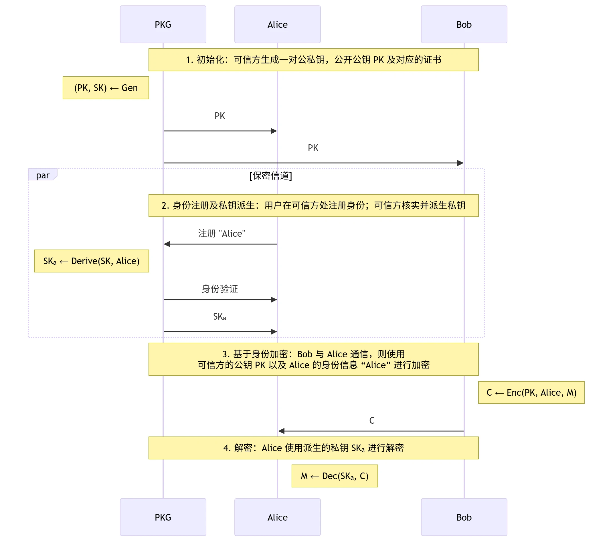
- **优点**：公钥分发与管理更为简化
    - PKG 分发 $1$ 个公钥及证书
    - 验证 $1$ 次公钥证书
    - 存储、管理、维护 $1$ 个公钥

#### 基于身份加密算法的语义及正确性要求
- **语义**：一个基于身份的加密算法 $IBE$ 包含四个概率多项式时间 （PPT）算法 $(\mathrm{Gen}, \mathrm{Derive}, \mathrm{Enc}, \mathrm{Dec})$：
    1. **主密钥生成算法**：$(PK,SK)\leftarrow \mathrm{Gen}(1^\lambda)$，一般为概率性算法
    2. **私钥派生算法**：$SK_{id}\leftarrow \mathrm{Derive}(SK,id)$，其中 $id$ 为身份信息
    3. **加密算法**：$C\leftarrow \mathrm{Enc}(PK,id,M)$，$M\in\mathbb{M}$，其中 $\mathbb{M}$ 为消息空间
    4. **解密算法**：$M'\leftarrow \mathrm{Dec}(SK_{id},C)$，一般为确定性算法，$M'\in\mathbb{M}\cup\{\bot\}$，其中 $\bot$ 代表解密失败
- **正确性要求**：对于 $\forall (PK,SK)\leftarrow \mathrm{Gen}(1^\lambda)$，$\forall id$，$\forall SK_{id}\leftarrow \mathrm{Derive}(SK,id)$，$\forall M\in\mathbb{M}$，$\forall C\leftarrow \mathrm{Enc}(PK,id,M)$，一定有
    $$
    \mathrm{Dec}(SK_{id},C)=M
    $$

#### 基于身份加密算法的 IND-ID-CPA 安全性
- **基于身份的选择明文攻击**（Identity-based Chosen-Plaintext Attacks, ID-CPA）安全模型：
    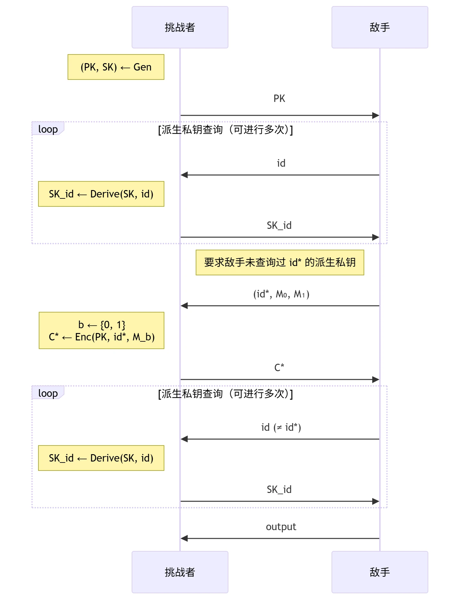
- **ID-CPA 敌手攻击能力**：
    - 输入：公开信道中的 $PK$ 及挑战密文 $C^{*}$
	- 运行时间：概率多项式时间 PPT
	- 攻击方式：
        1. **基于身份的选择明文攻击**：敌手可以提供/决定/影响加密使用的身份 $id^*$，以及加密使用的明文
        2. **选择派生私钥攻击**：敌手可以获得除 $id^*$ 外任意身份的派生私钥
- **IND 安全目标**：**不可区分性**（Indistinguishability）── 敌手无法区分密文 $C^{*}$ 加密的是 $M_{0}$ 还是 $M_{1}$（即如果 $\mathrm{output} = b$，则攻破该目标）
- **IND-ID-CPA 安全性定义**：任意 PPT 敌手在 ID-CPA 安全模型中攻破 IND 安全目标的优势是可忽略的，即
    $$
    \mathrm{Adv} = \left|\Pr(\mathrm{output} = b) - \frac{1}{2}\right| = \mathrm{negl}(\lambda)
    $$

### Boneh-Franklin 基于身份的加密算法
#### 具有双线性配对运算的椭圆曲线群
- **双线性配对群**（bilinear pairing group）：一个具有**双线性配对运算**的椭圆曲线群，简称为双线性配对群或配对群，是由多元组 $PG=(G_1,G_2,G_T,P_1,P_2,g_T,e)$ 所刻画，其中
    - $G_1=\langle P_1\rangle$，$G_2=\langle P_2\rangle$，$G_T=\langle g_T\rangle$ 均是循环群，阶均为素数 $N$.
    - $e:G_1\times G_2\to G_T$ 为一个 PPT 的**双线性配对运算**，满足
        1. 双线性性：$\forall a,b\in\mathbb{Z}_N$，$e(aP_1,bP_2)=e(P_1,P_2)^{ab}$。
        2. 非退化性：$e(P_1,P_2)=g_T$ 为 $G_T$ 的生成元。
- **对称配对群**：当 $G_1=G_2$ 时，称为对称配对群，可简记为 $PG=(G,G_T,N,P,g_T,e)$。

#### 椭圆曲线对称配对群上的 Bilinear DDH (BDDH) 问题
- **定理**：对于椭圆曲线**对称配对群** $G$，$G$ 上的 DDH 问题不困难。
- **BDDH 问题**：假设 $PG=(G,G_T,N,P,g_T,e)$ 为对称配对群，则
    1. 均匀选取 $x,y,z\leftarrow\mathbb{Z}_N$，计算 $T_0:=(g_T)^{xyz}$
    2. 均匀选取 $T_1\leftarrow G_T$，均匀选取 $\beta\leftarrow\{0,1\}$
    3. 输入：$(PG,xP,yP,zP,T_\beta)$
    4. 输出：$\mathrm{output}$
- **判定性 BDDH 问题困难**：任意 PPT 敌手的优势是可忽略的，即
    $$
    \begin{aligned}
    \mathrm{Adv} &= \left|\Pr(\mathrm{output}=\beta) - \frac{1}{2}\right| \\
    &= \frac{1}{2} \left|\Pr(\mathrm{output}=0 \mid \beta=0) - \Pr(\mathrm{output}=0 \mid \beta=1)\right| \\
    &= \mathrm{negl}(\lambda)
    \end{aligned}
    $$

#### BF 基于身份加密算法（椭圆曲线对称配对群）
- **组件**：Hash Function $\mathrm{H}: \{0,1\}^* \to G$
- **密钥生成算法** $(PK,SK) \leftarrow \mathrm{Gen}(1^\lambda)$：
    1. 选择椭圆曲线对称配对群 $PG=(G,G_T,N,P,g_T,e)$
    2. 均匀选取 $s\leftarrow\mathbb{Z}_N$，计算 $Q:=sP\in G$
    3. 输出 $PK=(PG,Q)$，$SK=s$
- **私钥派生算法** $SK_{id} \leftarrow \mathrm{Derive}(SK,id)$，身份空间为 $\{0,1\}^*$
    1. 计算并输出 $SK_{id}:=s\mathrm{H}(id)\in G$
- **加密算法**：$C \leftarrow Enc(PK,id,M)$，消息空间为 $\mathbb{M}=G_T$
    1. 均匀选取 $r\leftarrow\mathbb{Z}_N$
    2. 计算 $C_1:=rP\in G$
    3. 计算 $C_2:=e(Q,\mathrm{H}(id))^r\cdot M\in G_T$
    4. 输出 $C:=(C_1,C_2)$
- **解密算法**：$M' \leftarrow Dec(SK_{id},C=(C_1,C_2))$
    1. 计算并输出 $M':=C_2/e(C_1,SK_{id})$

#### BF 基于身份加密算法的 IND-ID-CPA 安全性
- **定理**：**BDDH 问题困难** + **$\mathrm{H}$ 为 RO** $\Rightarrow$ **BF 加密算法 IND-ID-CPA 安全**
    - **思路**：由攻破 IND-ID-CPA 安全性的敌手 $\mathcal{A}$ 来构造解决 BDDH 问题的敌手 $\mathcal{B}$

	
    - **证明**：安全性规约
        - **假设结论错误**：BF 加密算法不是 IND-ID-CPA 安全的，即存在一个概率多项式时间敌手 $\mathcal{A}$，以不可忽略的概率在 BF 加密算法 ID-CPA 安全模型中攻破 IND 安全目标，即
            $$
            \mathrm{Adv}_\mathcal{A} = \left| \Pr(\mathrm{output}_\mathcal{A} = \beta) - \frac{1}{2} \right| = \text{non-negl}(\lambda)
            $$
        - **证明前提错误**：构造一个概率多项式时间敌手 $\mathcal{B}$，在 BDDH 安全模型中攻破 BDDH 安全目标。
            - $\mathcal{B}$ 的输入：$PG = (G, G_T, N, P, g_T, e), xP, yP, zP, T_\beta$，其中 $x,y,z \leftarrow \mathbb{Z}_N$，$T_0 = (g_T)^{xyz}$，$T_1 \leftarrow G_T$，$\beta \leftarrow \{0,1\}$
            - $\mathcal{B}$ 的策略：
                - $\mathcal{B}$ 将 $PK = (PG, Q = xP)$ 发送给 $\mathcal{A}$，并模拟 $\mathcal{A}$ 的环境；设 $\mathcal{A}$ 进行的哈希查询次数为 $Q_H(\lambda)$，加密查询次数为 $Q_E(\lambda)$，则 $\mathcal{B}$ 随机选择 $j \in [1, Q_H(\lambda)]$ 赌 $\mathcal{A}$ 最终输出的消息 $M^{*} = M_j$。
                - 当 $\mathcal{A}$ 使用 $id_i$ 进行第 $i$ 次**派生私钥查询**时：$\mathcal{B}$ 假设自己的私钥为 $SK = xP$，计算 $SK_{id_i} = x\mathrm{H}(id_i) = xPh_{id_i} = h_{id_i}Q$ 返回给 $\mathcal{A}$，并自身记录 $\mathrm{H}(id_i) = h_{id_i}P$。
                    - 此时若 $\mathcal{A}$ 要对派生私钥查询进行验证，计算时需要 $\mathrm{H}(id_i)$，只能向 $\mathcal{B}$ 查询哈希结果，必然能通过检验
                - 当 $\mathcal{A}$ 使用 $id_i$ 进行第 $k$ 次**哈希查询**时：
                    - 若 $k = j$ 且 $id_j \notin \{id_i\}$，即 $\mathcal{A}$ 的第 $j$ 次哈希查询的身份 $id_j$ 没有在之前的派生私钥查询中出现过，则 $\mathcal{B}$ 将 $\mathrm{H}(id_j) = zP$ 作为自己的哈希输出，并记录 $\mathrm{H}(id_j) = zP$。
                    - 若 $k = j$ 且 $id_j \in \{id_i\}$，则重新选择 $j\in [1, Q_H(\lambda)]$，直到满足 $id_j \notin \{id_i\}$。
                    - 若 $k \neq j$，则 $\mathcal{B}$ 查询是否有 $\mathrm{H}(id_k)$ 的记录：
                        - 若有则直接返回
                        - 若没有则均匀选取 $h_{id_k} \leftarrow \mathbb{Z}_N$ 返回并记录 $\mathrm{H}(id_k) = h_{id_k}P$。
                - 最终当 $\mathcal{A}$ 输出挑战 $(id^*, M_0, M_1)$ 时，若 $id^* = id_j$，则 $\mathcal{B}$ 将 $C_1 = yP, C_2 = T_\beta M_\beta$ 作为挑战密文返回给 $\mathcal{A}$：
                    - 若 $\beta = 1$，则 $C_2 = T_1 M_1$ 是一个随机元素，$\mathcal{A}$ 无法区分 $M_0$ 和 $M_1$，只能随机猜测 $\beta$ 的值，因此 $\Pr(\mathrm{output}_\mathcal{A} = \beta) = \frac{1}{2}$。
                    - 若 $\beta = 0$，则 $C_2 = T_0 M_0 = g_T^{xyz} M_0 = e(P, P)^{xyz} M_0 = e(xP, yP)^{z} M_0 = e(Q, yP)^{z} M_0 = e(Q, \mathrm{H}(id^*))^{z} M_0$ 是一个合法的挑战密文，$\mathcal{A}$ 可以以不可忽视概率正确区分 $M_0$ 和 $M_1$，因此 $\Pr(\mathrm{output}_\mathcal{A} = \beta) = \text{non-negl}(\lambda)$。
            - $\mathcal{B}$ 的输出：
                $$
                \mathrm{output}_\mathcal{B} = \begin{cases}
                0 & \mathrm{output}_\mathcal{A} = 0 \\
                1 & \mathrm{output}_\mathcal{A} = 1
                \end{cases}
                $$
            - $\mathcal{B}$ 的优势：
                $$
                \begin{aligned}
                    \mathrm{Adv}_{\mathcal{B}} &\geq \Pr\left[
                    \begin{array}{l}
                    (1)\ \mathcal{A} \text{ 成功攻破 IND-ID-CPA 安全目标} \\
                    (2)\ \mathcal{A} \text{ 查询过 } id_j \text{ 的 Hash 值} \\
                    (3)\ \mathcal{B} \text{ 赌对了 } j \text{（即 } id^* = id_j \text{）}
                    \end{array}
                    \right] \\
                    &\geq \text{non-negl}(\lambda) \cdot \text{non-negl}(\lambda) \cdot \frac{1}{Q(\lambda)} \\
                    &= \text{non-negl}(\lambda)
                    \end{aligned}
                $$

	

# 后量子密码
## 格理论以及基于格困难问题的密码学

### 格理论简介
#### 格的定义
- **格**（Lattice）：格 $\mathcal{L}$ 是 $\mathbb{R}^m$ 空间中离散的具有加法运算的子群。
    - $\mathbb{R}^m$ 空间：由 $m$ 维实数向量组成的空间。
        - 向量的范式：$\| \mathbf{x}\| =\sqrt{\sum_{i=1}^{m} x_i^2}$
        - 向量的距离：$\mathrm{dist}(\mathbf{x},\mathbf{y})=\| \mathbf{x}-\mathbf{y}\|$
    - 离散（Discrete）：每一个格点 $\mathbf{x} \in \mathcal{L}$，存在 $\mathbb{R}^{m}$ 中的一个领域仅包含 $\mathbf{x}$ 唯一格点;
    - 加法：
        - $(0,\cdots, 0) \in \mathcal{L}$
        - $\forall \mathbf{x},\mathbf{y} \in \mathcal{L}, \mathbf{x}-\mathbf{y} \in \mathcal{L}$
- 示例：$\mathbb{Z}^{m}$、$(q\mathbb{Z})^{m}$ 是格，但 $\mathbb{Q}^{m}$，$2\mathbb{Z}+ 1$ 以及 $\mathbb{Z}+\mathbb{Z}\sqrt{2}$ 都不是格。
- **格基**：设 $\mathcal{L}$ 是 $\mathbb{R}^{m}$ 中的格，则存在 $\mathbb{R}$-线性无关的向量 $\mathbf{b}_{1}, \mathbf{b}_{2}, \cdots, \mathbf{b}_{n} \in \mathbb{R}^{m}$，使得
    $$
    \mathcal{L}=\left\{z_{1} \mathbf{b}_{1}+z_{2} \mathbf{b}_{2}+\cdots+z_{n} \mathbf{b}_{n} \mid z_{i} \in \mathbb{Z}\right\}
    $$

    - **维数**：$m$
    - **秩**：$n$
    - **满秩格**：当 $m=n$ 时称 $\mathcal{L}$ 是满秩格
    - **格基**：$B=(\mathbf{b}_{1}, \mathbf{b}_{2}, \cdots, \mathbf{b}_{m})$
    - **格点**：向量 $\mathbf{v}=z_{1} \mathbf{b}_{1}+z_{2} \mathbf{b}_{2}+\cdots+z_{n} \mathbf{b}_{n} \in \mathcal{L}$
- **性质**：两组基 $B=\{\mathbf{b}_{1}, \cdots, \mathbf{b}_{n}\}$ 与 $B'=\{\mathbf{b}_{1}', \cdots, \mathbf{b}_{n}'\}$ 生成同一个格当且仅当存在一个幺模矩阵 $U \in \mathbb{Z}^{n\times n}$ 使得 $B=B' U$。
    - 幺模矩阵：$U$ 是一个整数矩阵，且 $\det U=\pm 1$。
- **基本平行多面体**（Fundamental parallelepipeds）：设 $\mathcal{L}$ 为满秩格，则格 $\mathcal{L}$ 的基本平行多面体定义为
    $$
    \mathcal{F}(B):= \mathbb{R}^{m}/\mathcal{L} = \{ \sum _{i=1}^{m}x_{i}\mathbf{b}_{i} \mid x_{i}\in [0,1)\}
    $$
    - $\mathcal{F}(B)$ 的体积为
        $$
        \mathrm{vol}(\mathcal {F}(B))=|\det M(B)|,\quad M(B)=\begin{pmatrix}\mathbf{b}_{1} & \mathbf{b}_{2} & \cdots & \mathbf{b}_{m}\end{pmatrix}
        $$
- **定理**：
    1. 设 $\mathbf{b}_{1}, \mathbf{b}_{2}, \cdots, \mathbf{b}_{m} \in \mathcal{L}$ 且整线性无关，则 $B=\{\mathbf{b}_{1}, \mathbf{b}_{2}, \cdots, \mathbf{b}_{m}\}$ 为格基当且仅当
        $$
        \mathcal{F}(B) \cap \mathcal{L}=\{(0, \cdots, 0)\}
        $$
    2. 设 $B=\{\mathbf{b}_{1}, \mathbf{b}_{2}, \cdots, \mathbf{b}_{m}\}$ 和 $B'=\{\mathbf{b}_{1}', \mathbf{b}_{2}', \cdots, \mathbf{b}_{m}'\}$ 为两组格基，则
        $$
        \mathrm{vol}(\mathcal{F}(B))=\mathrm{vol}\left(\mathcal{F}\left(B'\right)\right)
        $$
    3. 设 $B=\{\mathbf{b}_{1}, \mathbf{b}_{2}, \cdots, \mathbf{b}_{m}\}$ 为格基，定义 $\mathcal{L}$ 的行列式为
        $$
        \det(\mathcal{L}):=\mathrm{Vol}(\mathcal{F}(B))=|\det(B)|
        $$

#### 格上定义的问题
- **格的最小距离**：设 $\mathcal{L}$ 是 $\mathbb{R}^{m}$ 中的格，则 $\mathcal{L}$ 的最小距离定义为
    $$
    \lambda_{1}(\mathcal{L})=\min\{\| \mathbf{v}\| : \mathbf{v} \in \mathcal{L} \setminus\{0\}\}=\min\{\| \mathbf{x}-\mathbf{y}\| : \mathbf{x} \neq \mathbf{y} \in \mathcal{L}\}
    $$
- **Minkowski’s first theorem**：设 $\mathcal{L}$ 为秩是 $m$ 的格，则
    $$
    \lambda_{1}(\mathcal{L}) \leq \sqrt{m}(\det \mathcal{L})^{1/m}
    $$
    - 示例：$\mathbf{b}_{1}=(0,2^{-100})$，$\mathbf{b}_{2}=(2^{100}, 0)$ 那么 $\lambda_{1}(\mathcal{L}(\mathbf{b}_{1}, \mathbf{b}_{2}))=2^{-100} \ll \sqrt{2}$。

- **最短向量问题** $(SVP)$：给定格 $\mathcal{L}$ 的任意格基 $B$，找到 $\mathbf{v} \in \mathcal{L}\setminus\{0\}$ 使得
    $$
    \| \mathbf{v}\| =\lambda_{1}(\mathcal{L})
    $$
- **最近向量问题** $(CVP)$：给定格 $\mathcal{L}$ 的任意格基 $B$，以及 $t \in \mathbb{R}^{m}$，找到 $\mathbf{v} \in \mathcal{L}$ 使得
    $$
    \forall \mathbf{y} \in \mathcal{L}, \| \mathbf{v}-\mathbf{t}\| \leq \| \mathbf{y}-\mathbf{t}\|
    $$
- **近似最短向量问题** $(SVP_{\gamma})$：给定格 $\mathcal{L}$ 的任意格基 $B$，找到 $\mathbf{v} \in \mathcal{L}\setminus\{0\}$ 使得
    $$
    \| \mathbf{v}\| ≤\gamma(m) \cdot \lambda_{1}(\mathcal{L})
    $$
- **近似最近向量问题** $(CVP_{\gamma})$：给定格 $\mathcal{L}$ 的任意格基 $B$，以及 $t \in \mathbb{R}^{m}$，找到 $\mathbf{v} \in \mathcal{L}$ 使得
    $$
    \forall \mathbf{y} \in \mathcal{L}, \| \mathbf{v}-\mathbf{t}\| \leq \gamma(m) \cdot\| \mathbf{y}-\mathbf{t}\|
    $$
- **判定性近似最短向量问题** $(GapSVP_{\gamma})$：假设 $\mathcal{L}$ 是满足 $\lambda_{1}(\mathcal{L})\leq1$ 或 $\lambda_{1}(\mathcal{L})>\gamma(n)$ 的格，给定格 $\mathcal{L}$ 的任意格基 $B$，判断 $\mathcal{L}$ 属于哪种情况。
- **近似最短独立向量问题** $(SIVP_{\gamma})$：给定格 $\mathcal{L}$ 的任意格基 $B$，找到 $n$ 个线性无关向量 $s_{i}\in \mathcal{L}$，使得
    $$
    \|s_{i}\|\leq\gamma(n)\cdot\lambda_{n}(\mathcal{L})
    $$ 其中 $\lambda_{n}(\mathcal{L})$ 表示 $\mathcal{L}$ 的第 $n$ 小距离。
- **有界距离解码问题** $(BDD_{\delta})$：给定格 $\mathcal{L}$ 的任意格基 $B$，以及 $\mathbf{t} \in \mathbb{R}^{m}$，满足 $\mathrm{dist}(\mathcal{L}, \mathbf{t}) \leq\delta<\frac{\lambda_{1}(\mathcal{L})}{2}$，找到唯一的格向量 $\mathbf{w} \in \mathcal{L}$，使得
    $$
    \| \mathbf{w}-\mathbf{t}\| _{2} \leq \delta
    $$
    - $BDD_{\delta} \subset CVP_{\delta}$
    - $BDD_{\delta}$ 的计算复杂度随着维度 $n$ 和参数 $\delta$ 的增大而增加。
- **定理**：$SVP_{\gamma(m)} \leq_{P} CVP_{\gamma(m)}$。

### LWE 问题（Learning with Errors）
- **参数**：LWE 参数 $(n,m,q,B_{\chi},\chi)$ 满足：
    1. $m \cdot B_{\chi} < q/4$
    2. $m \geq 2n \cdot \log q$
- **计算性 LWE 问题**（CLWE）：$n,m$ 为整数，$q$ 为素数，$\chi$ 为区间 $[-B_{\chi}, B_{\chi}]$ 上的概率分布。均匀选取 $\mathbf{A} \leftarrow \mathbb{Z}_{q}^{n\times m}$，$\mathbf{s} \leftarrow \mathbb{Z}_{q}^{n}$，根据 $\chi$ 分布选取 $\mathbf{e} \leftarrow[-B_{\chi}, B_{\chi}]^{m}$，计算 $\mathbf{z}:=\mathbf{A}^{\top} \mathbf{s}+\mathbf{e} \in \mathbb{Z}_{q}^{m}$。
    - **输入**：$(\mathbf{A}, \mathbf{z})$
    - **输出**：$\mathbf{s}$
    - **计算性 LWE 问题困难**：任意 PPT 敌手的优势是可忽略的，即
        $$
        \mathrm{Adv} = \left|\Pr(\mathrm{output}=\mathbf{s}) - \frac{1}{q^{n}}\right| = \mathrm{negl}(\lambda)
        $$
    - 直觉：定义格 $\mathcal{L}(\mathbf{A})=\{\mathbf{x} \in \mathbb{Z}^{m} \mid \mathbf{x}=\mathbf{A}^{T} \mathbf{s} \pmod q, \mathbf{s} \in \mathbb{Z}_{q}^{n}\}$，则 $\mathbf{z}$ 是 $\mathcal{L}(\mathbf{A})$ 中某个格点附近的一个点，$\mathbf{e}$ 是噪声。
        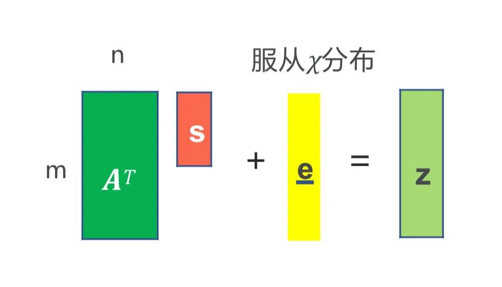
- **判定性 LWE 问题**（DLWE）：$n,m$ 为整数，$q$ 为素数，$\chi$ 为区间 $[-B_{\chi}, B_{\chi}]$ 上的概率分布。均匀选取 $\mathbf{A} \leftarrow \mathbb{Z}_{q}^{n\times m}$，$\mathbf{s} \leftarrow \mathbb{Z}_{q}^{n}$，根据 $\chi$ 分布选取 $\mathbf{e} \leftarrow[-B_{\chi}, B_{\chi}]^{m}$，计算 $\mathbf{z}_{0}:=\mathbf{A}^{\top} \mathbf{s}+\mathbf{e} \in \mathbb{Z}_{q}^{m}$，$\mathbf{z}_{1} \leftarrow \mathbb{Z}_{q}^{m}$，均匀选取 $\beta \leftarrow\{0,1\}$。
    - **输入**：$(\mathbf{A}, \mathbf{z}_{\beta})$
    - **输出**：$\beta$
    - **判定性 LWE 问题困难**：任意 PPT 敌手的优势是可忽略的，即
        $$
        \mathrm{Adv} = \left|\Pr(\mathrm{output}=\beta) - \frac{1}{2}\right| = \mathrm{negl}(\lambda)
        $$
    - 
- **定理（Regev05）**：**DLWE 问题困难** $\iff$ **CLWE 问题困难**

	
    - **充分性证明** $\implies$：假设存在 PPT 敌手 $\mathcal{A}$ 能够以不可忽略的优势攻破 CLWE 问题，构造 PPT 敌手 $\mathcal{B}$ 来攻破判定性 LWE 问题：
        - $\mathcal{B}$ 的输入：$(\mathbf{A}, \mathbf{z}_{\beta})$
        - 调用子敌手：将 $(\mathbf{A}, \mathbf{z}_{\beta})$ 作为输入传递给 $\mathcal{A}$
            - 当 $\beta=0$ 时，$\mathbf{z}_{0}=\mathbf{A}^{\top} \mathbf{s}+\mathbf{e}$ 满足 LWE 问题形式，$\mathcal{A}$ 以不可忽略的优势输出 $\mathbf{s}$。
            - 当 $\beta=1$ 时，$\mathbf{z}_{1}\leftarrow \mathbb{Z}_{q}^{m}$ 是均匀分布的。考虑若 $\mathcal{A}$ 仍可以输出有效的 $\mathbf{s}$，则 $\exists \mathbf{s}' \in \mathbb{Z}_{q}^{n}$ 使得 $\mathbf{z}_{1} - \mathbf{A}^{\top} \mathbf{s}' \in [-B_{\chi}, B_{\chi}]^{m}$，计算这个概率：
                $$
                \begin{aligned}
                P &= \frac{\#\{\mathbf{z}_{1} \in \mathbb{Z}_{q}^{m} \mid \mathbf{z}_{1} - \mathbf{A}^{\top} \mathbf{s}' \in [-B_{\chi}, B_{\chi}]^{m}\}}{\mathbb{Z}_{q}^{m}} \\
                &\leq \frac{q^n\cdot (2B_{\chi}+1)^{m}}{q^{m}} < \frac{q^n\cdot (q/m)^{m}}{q^{m}} \\
                &= \frac{q^n}{m^m} \leq \frac{2^{n \cdot \log q}}{2^{m\cdot \log m}} \\
                &\leq \frac{2^{\frac{m}{2}}}{2^{m\cdot \log m}} = 2^{-\frac{m}{2}\cdot \log m} = \mathrm{negl}(\lambda)
                \end{aligned}
                $$ 因此 $\mathcal{A}$ 输出有效的 $\mathbf{s}$ 的概率是可忽略的。
        - $\mathcal{B}$ 的输出：假设 $\mathrm{output}_\mathcal{B} = \mathbf{s}'$
            $$
            \mathrm{output}_\mathcal{B} = \begin{cases}
            0 & \mathcal{A} \text{ 输出有效的 } \mathbf{s} \\
            1 & \text{otherwise}
            \end{cases}
            $$
        - $\mathcal{B}$ 的优势
            $$
            \begin{aligned}
            \mathrm{Adv}_\mathcal{B} &= \left|\Pr(\mathrm{output}_\mathcal{B}=\beta) - \frac{1}{2}\right| \\
            &= \frac{1}{2} \cdot \left|\Pr(\mathrm{output}_\mathcal{B}=0 \mid \beta=0) - \Pr(\mathrm{output}_\mathcal{B}=0 \mid \beta=1)\right| \\
            &= \frac{1}{2} \cdot \left|\text{non-negl}(\lambda)-\mathrm{negl}(\lambda) \right| \\
            &= \text{non-negl}(\lambda)
            \end{aligned}
            $$
        - 因此 $\mathcal{B}$ 以不可忽略的优势攻破判定性 LWE 问题，与假设矛盾。
    - **必要性证明** $\impliedby$：假设存在 PPT 敌手 $\mathcal{B}$ 能够以不可忽略的优势攻破 DLWE 问题，构造 PPT 敌手 $\mathcal{A}$ 来攻破计算性 LWE 问题。
        - $\mathcal{A}$ 的输入：$(\mathbf{A}, \mathbf{z})$，其中 $\mathbf{A} \leftarrow \mathbb{Z}_q^{n \times m}$，$\mathbf{z} =\mathbf{A}^\top \mathbf{s} + \mathbf{e} \in \mathbb{Z}_q^m$。
        - 考虑要求解的 $\mathbf{s} = (s_1, s_2, \ldots, s_n)^\top$，$\mathcal{A}$ 逐一求解每个分量 $s_i$：
            - 猜测分量 $s_i=k\in\{0,1,\ldots,q-1\}$，构造新的矩阵 $\mathbf{A}'$ 和向量 $\mathbf{z}'$：
                1. 均匀随机选取一个向量 $\mathbf{v} \leftarrow \mathbb{Z}_q^m$。
                2. 构造 $\mathbf{A}' = \mathbf{A} + \mathbf{e}_i \mathbf{v}^\top$，其中 $\mathbf{e}_i = \{0, \ldots, 0, 1, 0, \ldots, 0\}$ 是第 $i$ 个标准基向量。
                3. 构造 $\mathbf{z}' = \mathbf{z} + k \cdot \mathbf{v}$。
                4. 则有
                    $$
                    \begin{aligned}
                    \mathbf{z}' - \mathbf{A}'^\top \mathbf{s} &= (\mathbf{z} + k \cdot \mathbf{v}) - (\mathbf{A} + \mathbf{e}_i \mathbf{v}^\top)^\top \mathbf{s} \\
                    &= \mathbf{z} + k \cdot \mathbf{v} - \mathbf{A}^\top \mathbf{s} - s_i\cdot \mathbf{v}  \\
                    &= \mathbf{e} + (k - s_i) \cdot \mathbf{v}
                    \end{aligned}
                    $$
            - 将 $(\mathbf{A}', \mathbf{z}')$ 作为输入传递给 $\mathcal{B}$：
                - 若猜测正确，即 $k = s_i$，则 $\mathbf{z}' - \mathbf{A}'^\top \mathbf{s} = \mathbf{e}$ 满足 LWE 问题形式，$\mathcal{B}$ 以不可忽略的优势输出 $0$。
                - 若猜测错误，则 $\mathbf{z}'' = \mathbf{z}' - (k - s_i) \cdot \mathbf{v}$ 是 $\mathbb{Z}_q^m$ 上均匀分布的，$\mathcal{B}$ 以不可忽略的优势输出 $1$。
        - 因此，只要遍历 $s_i=k\in\{0,1,\ldots,q-1\}$，就可以以不可忽略的优势正确求解 $s_i$；再对所有 $i \in \{1,2,\ldots,n\}$ 重复上述过程，即可以不可忽略的优势求解 $\mathbf{s}$。
        - $\mathcal{A}$ 的复杂度：上述过程需要 $n \cdot q$ 次调用 $\mathcal{B}$，由 $q=\mathrm{poly}(n)$ 以及 $\mathcal{B}$ 的 PPT 性质可知 $\mathcal{A}$ 也是 PPT 算法。因此 $\mathcal{A}$ 以不可忽略的优势攻破计算性 LWE 问题，与假设矛盾。

	

- **LWE 问题的困难性**：LWE 问题可以归约到格中的困难问题，因此 LWE 被公认为是抗量子的。
    - 对于任意 $m=\mathrm{poly}(n)$，任意模数 $q \leq 2^{\mathrm{poly}(n)}$，以及任何（离散化的）参数为 $\alpha q \geq 2\sqrt{n}$ 的高斯误差分布 $\chi$，解决判定性 LWE 问题至少和量子地解决任意 $n$ 维格上的 $GapSVP_{\gamma}$ 和 $SIVP_{\gamma}$ 一样困难，其中 $\gamma = \tilde{O}(n/\alpha)$。

### Regev 公钥加密算法
#### Regev 公钥加密算法（加密 1 比特）
- **密钥生成算法** $(PK,SK)\leftarrow \mathrm{Gen}(1^{\lambda})$：
    1. 均匀选取 $\mathbf{A}\leftarrow\mathbb{Z}_{q}^{n\times m}$
    2. 均匀选取 $\mathbf{s}\leftarrow\mathbb{Z}_{q}^{n}$，$\mathbf{e}\leftarrow[-B_{\chi},B_{\chi}]^{m}$，计算 $\mathbf{h}:=\mathbf{A}^{\top}\mathbf{s}+\mathbf{e}\in\mathbb{Z}_{q}^{m}$
    3. 输出 $PK=(\mathbf{A},\mathbf{h})$，$SK=\mathbf{s}$
- **加密算法** $C\leftarrow \mathrm{Enc}(PK,M)$：消息空间为 $\mathbb{M}=\{0,1\}$
    1. 均匀选取 $\mathbf{r}\leftarrow\{0,1\}^{m}$
    2. 计算 $\mathbf{c}_{1}:=\mathbf{A}\cdot \mathbf{r}\in\mathbb{Z}_{q}^{n}$
    3. 计算 $c_{2}:=\mathbf{r}^{\top}\mathbf{h}+M\cdot\lfloor q/2\rceil\in\mathbb{Z}_{q}$
    4. 输出 $C:=(\mathbf{c}_{1},c_{2})$
- **解密算法** $M'\leftarrow \mathrm{Dec}(SK,C=(\mathbf{c}_{1},c_{2}))$:
    1. 计算 $d:=c_{2}-\mathbf{c}_{1}^{\top}\mathbf{s}\in\mathbb{Z}_{q}$
    2. 如果 $d\approx0$，输出 $M':=0$；如果 $d\approx\lfloor q/2\rceil$，输出 $M':=1$
- **正确性分析**：对于 $\forall PK=(\mathbf{A},\mathbf{h})=(\mathbf{A},\mathbf{A}^{\top}\mathbf{s}+\mathbf{e})$，其中 $\mathbf{e}\leftarrow[-B_{\chi},B_{\chi}]^{m}$；$\forall C=(\mathbf{c}_{1},c_{2})=(\mathbf{A}\mathbf{r},\mathbf{r}^{\top}\mathbf{h}+M\cdot\lfloor q/2\rceil)$，其中 $\mathbf{r}\leftarrow\{0,1\}^{m}$：
    - 解密时，有
        $$
        \begin{aligned}
        d &=\mathbf{c}_{2}-\mathbf{c}_{1}^{\top}\mathbf{s} \\
        &=\mathbf{r}^{\top}\mathbf{h}+M\cdot\lfloor q/2\rceil-(\mathbf{A}\mathbf{r})^{\top}\mathbf{s} \\&=\mathbf{r}^{\top}(\mathbf{A}^{\top}\mathbf{s}+\mathbf{e})+M\cdot\lfloor q/2\rceil-(\mathbf{A}\mathbf{r})^{\top}\mathbf{s} \\
        &=\mathbf{r}^{\top}\mathbf{e}+M\cdot\lfloor q/2\rceil
        \end{aligned}
        $$
    - 由于 $\mathbf{e}\leftarrow[-B_{\chi},B_{\chi}]^{m}$，$\mathbf{r}\leftarrow\{0,1\}^{m}$，因此 $\mathbf{r}^{\top}\mathbf{e}\in[-mB_{\chi},mB_{\chi}]\subseteq(-q/4,q/4)$
        - 如果 $M=0$，则 $d=\mathbf{r}^{\top}\mathbf{e}\in(-q/4,q/4)=[0,q/4)\cup(3q/4,q-1]$
        - 如果 $M=1$，则 $d=\mathbf{r}^{\top}\mathbf{e}+\lfloor q/2\rceil\in(-q/4,q/4)+\lfloor q/2\rceil=(q/4,3q/4)$
    - 综上：
        - 当 $M=0$ 时，$d\approx0$，则 $M'=0$
        - 当 $M=1$ 时，$d\approx\lfloor q/2\rceil$，则 $M'=1$

#### Regev 公钥加密算法（加密 $\ell$ 比特）
- 设计思想：
    1. Regev 算法（加密 1 比特）
    2. 并行 $\ell$ 次（共用 $A$ 和 $r$）
- **密钥生成算法** $(PK,SK)\leftarrow \mathrm{Gen}(1^{\lambda})$：
    1. 均匀选取 $\mathbf{A}\leftarrow\mathbb{Z}_{q}^{n\times m}$
    2. 均匀选取 $\mathbf{S}\leftarrow\mathbb{Z}_{q}^{n\times\ell}$，$\mathbf{E}\leftarrow[-B_{\chi},B_{\chi}]^{m\times\ell}$，计算 $\mathbf{H}:=\mathbf{A}^{T}\mathbf{S}+\mathbf{E}\in\mathbb{Z}_{q}^{m\times\ell}$
    3. 输出 $PK=(\mathbf{A},\mathbf{H})$，$SK=\mathbf{S}$
- **加密算法** $C\leftarrow \mathrm{Enc}(PK, \mathbf{M}=(M_{1},\cdots,M_{\ell}))$：消息空间为 $\mathbb{M}=\{0,1\}^{\ell}$
    1. 均匀选取 $\mathbf{r}\leftarrow\{0,1\}^{m}$
    2. 计算 $\mathbf{c}_{1}:=\mathbf{A}\cdot \mathbf{r}\in\mathbb{Z}_{q}^{n}$
    3. 计算 $\mathbf{c}_{2}:=\mathbf{r}^{\top}\mathbf{H}+(M_{1}\cdot\lfloor q/2\rceil,\cdots,M_{\ell}\cdot\lfloor q/2\rceil)\in\mathbb{Z}_{q}^{1\times\ell}$（简记为$M\cdot\lfloor q/2\rceil$）
    4. 输出 $C:=(\mathbf{c}_{1},\mathbf{c}_{2})$
- **解密算法** $M'\leftarrow \mathrm{Dec}(SK,C=(\mathbf{c}_{1},\mathbf{c}_{2}))$：
    1. 计算 $\mathbf{d}:=\mathbf{c}_{2}-\mathbf{c}_{1}^{\top}\mathbf{S}\in\mathbb{Z}_{q}^{1\times\ell}$；将 $\mathbf{d}$ 按分量展开为 $(d_{1},\cdots,d_{\ell})$
    2. $\forall i\in\{1,\cdots,\ell\}$：如果 $d_{i}\approx0$，$M_{i}':=0$；如果 $d_{i}\approx\left\lfloor\frac{q}{2}\right\rceil$，$M_{i}':=1$
    3. 输出 $\mathbf{M}':=(M_{1}',\cdots,M_{\ell}')$

#### 1 比特 Regev 算法的 IND-CPA 安全性
- **定理**：**判定性 LWE 问题困难** $\implies$ **1 比特 Regev 算法是 IND-CPA 安全的**
    - **思路**：正向证明，给定任意 PPT 敌手 $\mathcal{A}$，证明其攻破 IND-CPA 安全性的优势是可忽略的
        $$
        \mathrm{Adv}_{\mathcal{A}}=\left|\Pr(\mathrm{output}=b)-\frac{1}{2}\right|=\mathrm{negl}(\lambda)
        $$ 

	
    - **证明**：采用混合论证（Hybrid Arguments）与三角不等式。
        
        - **定义混合游戏**：
            - **Game 0**：IND-CPA 安全模型
                1. $\mathrm{Gen}: \mathbf{A}\leftarrow\mathbb{Z}_{q}^{n\times m}$，$\mathbf{s}\leftarrow\mathbb{Z}_{q}^{n}$，$\mathbf{e}\leftarrow[-B_{\chi},B_{\chi}]^{m}$，$\mathbf{h}:=\mathbf{A}^\top \mathbf{s}+\mathbf{e}$，输出 $PK=(\mathbf{A},\mathbf{h})$
                3. $\mathrm{Enc}(PK,M_b): \mathbf{r}\leftarrow\{0,1\}^m$，$\mathbf{c}_1:=\mathbf{A}\mathbf{r}$，$c_2:=\mathbf{r}^\top\mathbf{h}+M_b\cdot\lfloor q/2\rceil$，输出 $C^*=(\mathbf{c}_1,c_2)$
            - **Game 1**：$PK$ 中的 $h\leftarrow\mathbb{Z}_{q}^{m}$
                1. $\mathrm{Gen}': \mathbf{A}\leftarrow\mathbb{Z}_{q}^{n\times m}$，$\mathbf{h}\leftarrow\mathbb{Z}_{q}^{m}$，输出 $PK=(\mathbf{A},\mathbf{h})\leftarrow\mathbb{Z}_{q}^{n\times m}\times\mathbb{Z}_{q}^{m}$
                2. 其余算法与 Game 0 一致
            - **Game 2**：$C^*\leftarrow\mathbb{Z}_{q}^{n}\times\mathbb{Z}_{q}$
                1. $\mathrm{Enc}'(PK,M_b): \mathbf{c}_1\leftarrow\mathbb{Z}_{q}^{n}$，$c_2\leftarrow\mathbb{Z}_{q}$，$C^*=(\mathbf{c}_1,c_2)\leftarrow\mathbb{Z}_{q}^{n}\times\mathbb{Z}_{q}$
                2. 其余算法与 Game 1 一致
        - **混合游戏性质**：
            1. Game 0 与 Game 1 的区别只在于 $PK$ 中的 $\mathbf{h}$ 的生成：
                - Game 0 中 $\mathbf{h}=\mathbf{A}^{\top}\mathbf{s}+\mathbf{e}$
                - Game 1 中 $\mathbf{h}\leftarrow\mathbb{Z}_{q}^{m}$
            2. 由**引理1**：$(\mathbf{A},\mathbf{A}^{\top}\mathbf{s}+\mathbf{e})$ 与 $(\mathbf{A},\mathbf{u}\leftarrow\mathbb{Z}_{q}^{m})$ 不可区分，即 Game 0 与 Game 1 不可区分，即
                $$
                |\Pr(\mathrm{output}=b\mid \text{Game 0}) - \Pr(\mathrm{output}=b\mid \text{Game 1})| = \mathrm{negl}(\lambda)
                $$
            2. Game 1 与 Game 2 的区别只在于密文 $C^{*}=(\mathbf{c}_{1},c_{2})$ 的生成：
                - Game 1 中 $(\mathbf{c}_{1},c_{2})=(\mathbf{A}\mathbf{r},\mathbf{r}^{\top}\mathbf{h}+M_b\cdot\lfloor q/2\rceil)$
                - Game 2 中 $(\mathbf{c}_1,c_2)\leftarrow\mathbb{Z}_{q}^{n}\times\mathbb{Z}_{q}$
            3. 由**引理2（剩余哈希引理）推论**：$\begin{pmatrix}\begin{pmatrix}\mathbf{A} \\ \mathbf{h}^\top \end{pmatrix},\begin{pmatrix}\mathbf{Ar} \\ \mathbf{h}^\top\mathbf{r} \end{pmatrix} \end{pmatrix}$ 与 $\begin{pmatrix}\begin{pmatrix}\mathbf{A} \\ \mathbf{h}^\top \end{pmatrix},\begin{pmatrix}\mathbf{u}_1 \\ \mathbf{u}_2 \end{pmatrix} \end{pmatrix}$ 不可区分，即 Game 1 与 Game 2 不可区分，即
                $$
                |\Pr(\mathrm{output}=b\mid \text{Game 1}) - \Pr(\mathrm{output}=b\mid \text{Game 2})| = \mathrm{negl}(\lambda)
                $$
            4. Game 2 中，$C^{*}=(\mathbf{c}_{1},c_{2})$ 中已经不含 $b$ 的信息，因此
                $$
                \Pr(\mathrm{output}=b\mid \text{Game 2})=\frac{1}{2}
                $$
        - **由三角不等式**：
            $$
            \begin{aligned}
            \mathrm{Adv}_{A} =& \left| \Pr(\mathrm{output}=b\mid \text{Game 0}) - \frac{1}{2} \right| \\
            \leq& \left| \Pr(\mathrm{output}=b\mid \text{Game 0}) - \Pr(\mathrm{output}=b\mid \text{Game 1}) \right|+ \\
            & \left| \Pr(\mathrm{output}=b\mid \text{Game 1}) - \Pr(\mathrm{output}=b\mid \text{Game 2}) \right|+ \\
            & \left| \Pr(\mathrm{output}=b\mid \text{Game 2}) - \frac{1}{2} \right| \\
            =& \mathrm{negl}(\lambda) + \mathrm{negl}(\lambda) + 0 \\
            =& \mathrm{negl}(\lambda)
            \end{aligned}
            $$
        - 因此 $\mathrm{Adv}_{A}=\mathrm{negl}(\lambda)$，得证 IND-CPA 安全性。

	

- **引理 1**：**判定性 LWE 问题困难** $\implies$ Game 0 与 Game 1 不可区分，即
    $$
    |\Pr(\mathrm{output}=b\mid \text{Game 0}) - \Pr(\mathrm{output}=b\mid \text{Game 1})| = \mathrm{negl}(\lambda)
    $$
    - 证明思路：采用反证法（安全性归约），由区分 Game 0 与 Game 1 的敌手 $\mathcal{A}$ 来构造解决判定性 LWE 问题的敌手 $\mathcal{B}$。
- **引理 2**：
    - **剩余哈希引理**（Leftover Hash Lemma）: 当 $q$ 为素数且 $m\geq n\log q+2\log(1/\epsilon)$ 时，任意敌手区分下面两个分布的优势为可忽略的
        $$
        (\mathbf{H},\mathbf{Hr})\approx_s(\mathbf{H},\mathbf{u})
        $$

        其中 $\mathbf{H}\leftarrow\mathbb{Z}_{q}^{n\times m}$，$\mathbf{r}\leftarrow\{0,1\}^{m}$，$\mathbf{u}\leftarrow\mathbb{Z}_{q}^{n}$。
    - **推论**：当 $q$ 为素数且 $m\geq2n\cdot\log q$ 时，任意敌手区分下面两个分布的优势为可忽略的
        $$
        \begin{pmatrix}\begin{pmatrix}\mathbf{A} \\ \mathbf{h}^\top \end{pmatrix},\begin{pmatrix}\mathbf{Ar} \\ \mathbf{h}^\top\mathbf{r} \end{pmatrix} \end{pmatrix}
        \approx_s
        \begin{pmatrix}\begin{pmatrix}\mathbf{A} \\ \mathbf{h}^\top \end{pmatrix},\begin{pmatrix}\mathbf{u}_1 \\ \mathbf{u}_2 \end{pmatrix} \end{pmatrix}
        $$

        其中 $\mathbf{A}\leftarrow\mathbb{Z}_{q}^{n\times m}$，$\mathbf{h}\leftarrow\mathbb{Z}_{q}^{m}$，$\mathbf{r}\leftarrow\{0,1\}^{m}$，$\mathbf{u}_{1}\leftarrow\mathbb{Z}_{q}^{n}$，$\mathbf{u}_{2}\leftarrow\mathbb{Z}_{q}$。

#### $\ell$ 比特 Regev 算法的 IND-CPA 安全性
- **定理**：**判定性 LWE 问题困难** $\implies$ **$\ell$ 比特 Regev 算法是 IND-CPA 安全的**
    - 思路：采用混合论证，结合剩余哈希引理与 LWE 假设。
        - 混合论证：
            - **Game 0**（IND-CPA 安全模型）中：$\mathbf{H}=\mathbf{A}^{\top}\mathbf{S}+\mathbf{E}$，$\mathbf{c}_1=\mathbf{A}\mathbf{r}$，$\mathbf{c}_2=\mathbf{r}^{\top}\mathbf{H}+\mathbf{M}\cdot\lfloor q/2\rceil$
            - **Game 1** 中：$\mathbf{H}\leftarrow\mathbb{Z}_{q}^{m\times\ell}$
            - **Game 2** 中：$\mathbf{c}_{1}\leftarrow\mathbb{Z}_{q}^{n}$，$\mathbf{c}_{2}\leftarrow\mathbb{Z}_{q}^{1\times\ell}$
        - 通过 LWE 假设（每次换 $H$ 的第 $i$ 列，共混合论证 $\ell$ 次）证明 Game 0 与 Game 1不可区分。
        - 通过剩余哈希引理证明 Game 1与 Game 2不可区分，最终得证 IND-CPA 安全性。

### SIS 困难问题与 GPV 签名算法
#### SIS 问题（Short Integer Solution）
- **SIS 问题**：$n,m$ 为整数，$q$ 为素数，$B_{s}$ 为整数。均匀选取 $\mathbf{A} \leftarrow\mathbb{Z}_{q}^{n\times m}$。
    - **输入**：$\mathbf{A}$
    - **输出**：$\mathbf{x}\in\mathbb{Z}_{q}^{m}$ 满足
        1. $\mathbf{Ax}=\mathbf{0}\in\mathbb{Z}_{q}^{n}$
        2. $\mathbf{x}\neq\mathbf{0}$
        3. $\mathbf{x}\in[-B_{s},B_{s}]^{m}$（Short）
    - **SIS 问题困难**：任意 PPT 敌手的优势是可忽略的，即
        $$
        \Pr(\text{find such } \mathbf{x}) = \mathrm{negl}(\lambda)
        $$
    - 观察:
        1. 如果没有对于 $\mathbf{x}$ 的限制，使用高斯消元法很容易求解 $\mathbf{x}$。
        2. 对于 SIS 问题，$m$ 越大越容易，$n$ 越大越困难。
    - 直觉：定义正交格 $\Lambda^\bot(\mathbf{A}) =\{\mathbf{x}\in\mathbb{Z}^{m} \mid \mathbf{Ax}\equiv\mathbf{0}\pmod q\}$，SIS 问题要求找到 $\mathcal{L}(\mathbf{A})$ 中一个非零的短向量。
        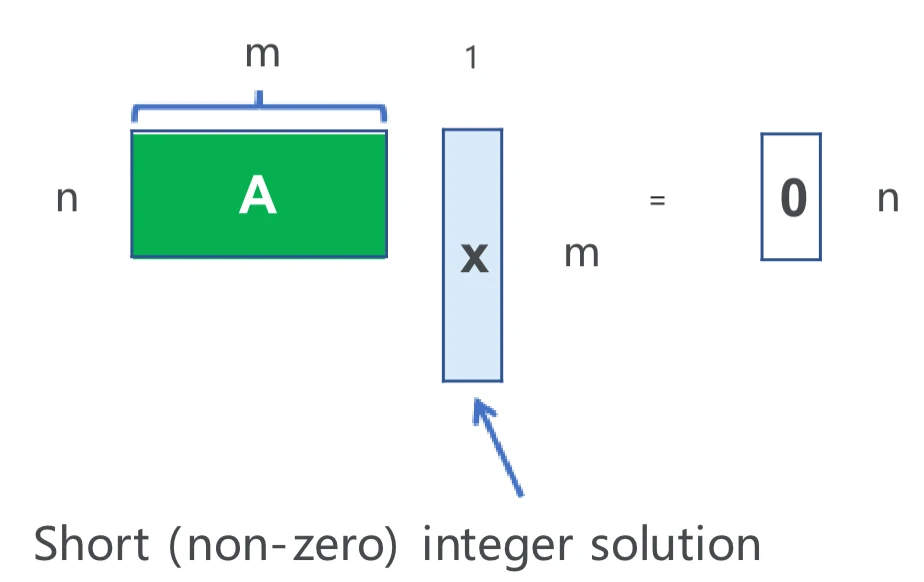
- **定理**：如果 $m\cdot B_{\chi}\cdot B_{s}<q/4$，则 **判定性 LWE 问题 $(n,m,q,\chi)$ 困难** $\implies$ **SIS 问题 $(n,m,q,B_{s})$ 困难**

	
    - **证明**：由解决 SIS 问题的敌手 $\mathcal{A}$ 来构造解决判定性 LWE 问题的敌手 $\mathcal{B}$。
        - 若存在 PPT 敌手 $\mathcal{A}$ 能够以不可忽略的优势解决 SIS 问题 $(n,m,q,B_{s})$，则输入 $\mathbf{A}$，$\mathcal{A}$ 以不可忽略的优势输出 $\mathbf{x}\in[-B_{s},B_{s}]^{m}$ 满足 $\mathbf{Ax}=\mathbf{0}\in\mathbb{Z}_{q}^{n}$。
        - 此时考虑 $\mathbf{z}_\beta^\top \cdot \mathbf{x}$：
            - 当 $\beta=0$ 时，$\mathbf{z}_{0}=\mathbf{A}^{\top}\mathbf{s}+\mathbf{e}$，因此
                $$
                \begin{aligned}
                \mathbf{z}_{0}^{\top}\cdot \mathbf{x}&=\mathbf{s}^{\top}\mathbf{A}\mathbf{x}+\mathbf{e}^{\top}\mathbf{x}=\mathbf{e}^{\top}\mathbf{x}=\sum_{i=1}^{m} e_i x_i \\
                &\in[-mB_{\chi}B_{s},mB_{\chi}B_{s}] \subseteq(-q/4,q/4)
                \end{aligned}
                $$
            - 当 $\beta=1$ 时，$\mathbf{z}_{1}\leftarrow\mathbb{Z}_{q}^{m}$，因此 $\mathbf{z}_{1}^{\top}\cdot \mathbf{x}$ 在 $\mathbb{Z}_{q}$ 上均匀分布，则 $\mathbf{z}_{1}^{\top}\cdot \mathbf{x} \in(-q/4,q/4)$ 的概率为 $1/2$。
        - $\mathcal{B}$ 的输出：
            $$
            \mathrm{output}_\mathcal{B} = \begin{cases}
            0 & \mathbf{z}^\top\cdot \mathbf{x} \in(0,\frac{q}{4})\cup(\frac{3q}{4},q) \\
            1 & \text{otherwise}
            \end{cases}
            $$
        - $\mathcal{B}$ 的优势
            $$
            \begin{aligned}
            \mathrm{Adv}_\mathcal{B} &= \left|\Pr(\mathrm{output}_\mathcal{B}=\beta) - \frac{1}{2}\right| \\
            &= \frac{1}{2} \cdot \left|\Pr(\mathrm{output}_\mathcal{B}=0 \mid \beta=0) - \Pr(\mathrm{output}_\mathcal{B}=0 \mid \beta=1)\right| \\
            &= \frac{1}{2} \cdot \left|\left(\mathrm{Adv}_\mathcal{A} + \frac{1}{2}(1 - \mathrm{Adv}_\mathcal{A}) \right) - \frac{1}{2} \right| \\
            &= \frac{1}{4} \cdot \mathrm{Adv}_\mathcal{A} = \text{non-negl}(\lambda)
            \end{aligned}
            $$
        - 因此 $\mathcal{B}$ 以不可忽略的优势攻破判定性 LWE 问题，与假设矛盾。

	

#### 原像可采样函数 PSF（Preimage Sampleable Function）
- PSF 参数：$(n,m,q,B)$
- **矩阵 A 的带陷门采样算法**：$(\mathbf{A},td)\leftarrow \mathrm{SampleA}(1^{\lambda})$
    - 矩阵 $\mathbf{A}$ 在 $\mathbb{Z}_{q}^{n\times m}$ 上均匀分布，$td$ 为陷门信息（trapdoor）
    - 定义函数
        $$
        \begin{aligned}
        f_{A}:\mathbb{Z}_{q}^{m}&\to\mathbb{Z}_{q}^{n} \\
        \mathbf{x} &\mapsto \mathbf{Ax}
        \end{aligned}
        $$ 则给出 $x$ 计算 $f_{A}(x)$ 是高效的；给出 $y$ 和陷门信息 $td$ 计算 $x$ 满足 $f_{A}(x)=y$ 是高效的；但给出 $y$ 没有陷门信息 $td$ 计算 $x$ 满足 $f_{A}(x)=y$ 是困难的。
- **正向采样算法**：$(\mathbf{x}\in\mathbb{Z}_{q}^{m},\mathbf{y}\in\mathbb{Z}_{q}^{n})\leftarrow \mathrm{SampleTuple}(\mathbf{A})$
    - 向量 $\mathbf{x}$ 满足 $\mathbf{x}\in[-B,B]^{m}$
    - 向量 $\mathbf{y}$ 满足 $\mathbf{y}=\mathbf{A}\mathbf{x}$ 且在 $\mathbb{Z}_{q}^{n}$ 上均匀分布
- **原像采样算法**：$\mathbf{x}\in\mathbb{Z}_{q}^{m}\leftarrow \mathrm{SamplePre}(td,\mathbf{A},\mathbf{y}\in\mathbb{Z}_{q}^{n})$:
    - 向量 $\mathbf{x}$ 满足 $\mathbf{x}\in[-B,B]^{m}$ 且 $\mathbf{Ax}=\mathbf{y}$
- **关键性质**（GPV08）：下面两种 $(\mathbf{x}\in\mathbb{Z}_{q}^{m},\mathbf{y}\in\mathbb{Z}_{q}^{n})$ 的分布一样:
    - $(\mathbf{x}\in\mathbb{Z}_{q}^{m},\mathbf{y}\in\mathbb{Z}_{q}^{n})\leftarrow \mathrm{SampleTuple}(\mathbf{A})$
    - 先均匀选取 $\mathbf{y}\leftarrow\mathbb{Z}_{q}^{n}$，再调用 $\mathbf{x}\leftarrow \mathrm{SamplePre}(td,\mathbf{A},\mathbf{y})$

#### MP12 陷门生成算法
##### 目标
- 给定 $\mathbf{A} \leftarrow \mathbb{Z}_q^{n \times m}$，求解 $\mathbf{T}_A \in \mathbb{Z}^{m \times m}$ 满足：
    1. $\mathbf{A} \cdot \mathbf{T}_A \equiv \mathbf{0} \pmod q$
    2. $\mathbf{T}_A \in [-B_s, B_s]^{m \times m}$
    3. $\mathbf{T}_A$ 满秩
- 寻找陷门 $\mathbf{T}_A$ 本质上就是为正交格 $\Lambda^\bot(\mathbf{A}) =\{\mathbf{x}\in\mathbb{Z}^{m} \mid \mathbf{Ax}\equiv\mathbf{0}\pmod q\}$ 寻找一组短基（Short Basis）
- 如果得到了陷门，那么 SIS 问题、LWE 问题都不再困难！

##### 构造 Gadget 矩阵 $G$ 及其陷门 $T_G$
- **思路**：由于直接为一个随机矩阵 $A$ 寻找陷门困难的，因此人为构造一个结构极度规律的特殊矩阵 $G$，它的陷门可以直接写出。
- **构造方法**：
    1. 二进制拆分
        - 定义二进制位宽 $k = \lceil \log q \rceil$，则 $2^{k-1} < q \leq 2^k$
        - 对于任意整数 $x \in \mathbb{Z}_q$，它可以被唯一拆分为二进制表示 $x = x_0 + 2\cdot x_1 + \dots + 2^{k-1}\cdot x_{k-1} \quad (x_i \in \{0, 1\})$，定义提取函数：$x \mapsto \langle x \rangle _{BE} = (x_0, x_1, \dots, x_{k-1})^\top$
    2. 定义 $\mathbf{g} = (1, 2, 2^2, \dots, 2^{k-1})_{1 \times k}$，则有 $x = \mathbf{g} \cdot \langle x \rangle _{BE}$
    3. 通过张量积将 $\mathbf{g}$ 扩展为 $n \times nk$ 维的对角块矩阵：
        $$
        \mathbf{G} := \mathbf{I}_n \otimes \mathbf{g} = \begin{pmatrix} \mathbf{g} & \mathbf{0} & \dots & \mathbf{0} \\
        \mathbf{0} & \mathbf{g} & \dots & \mathbf{0} \\
        \vdots & \vdots & \ddots & \vdots \\
        \mathbf{0} & \mathbf{0} & \dots & \mathbf{g}
        \end{pmatrix}_{n \times nk}
        $$
    4. 构造针对 $\mathbf{g}$ 的一维陷门 $\mathbf{T}_g$：
        $$
        \mathbf{T}_g = \begin{pmatrix}
        2 & 0 & 0 & \dots & 0 \\
        -1 & 2 & 0 & \dots & 0 \\
        0 & -1 & 2 & \dots & 0 \\
        \vdots & \vdots & \vdots & \ddots & \vdots \\
        0 & 0 & 0 & \dots & 2 \\
        \end{pmatrix}_{k \times k}
        $$

        易证 $\mathbf{g} \cdot \mathbf{T}_g = \mathbf{0} \pmod q$
    5. 扩展到全维，得到针对 $\mathbf{G}$ 的陷门 $\mathbf{T}_G$：
        $$
        \mathbf{T}_G := \mathbf{I}_n \otimes \mathbf{T}_g = \begin{pmatrix}
        \mathbf{T}_g & & \\
        & \ddots & \\
        & & \mathbf{T}_g
        \end{pmatrix}_{nk \times nk}
        $$
        - $\mathbf{G} \cdot \mathbf{T}_G = \mathbf{0} \pmod q$ 显然成立
        - $\mathbf{T}_G$ 内部元素仅包含 $2, -1, 0$，满足短矩阵要求
        - $\mathbf{T}_G$ 是下三角矩阵，主对角线不为 0，满秩。

##### 定义逆向操作函数 $\mathbf{G}^{-1}(\cdot)$
- 定义：给定任意目标向量 $\mathbf{y} \in \mathbb{Z}_q^n$，求解 $\mathbf{x} \in \{0, 1\}^{nk}$ 使得 $\mathbf{G} \cdot \mathbf{x} = \mathbf{y} \pmod q$，即
    $$
    \mathbf{x} = \mathbf{G}^{-1}(\mathbf{y})
    $$
    - 实际上解决了一个特定于 $\mathbf{G}$ 的 SIS 问题。
- **计算方法**：将向量 $\mathbf{y} = (y_1, y_2, \dots, y_n)^\top$ 的每一个元素分别进行二进制拆分，得到 $\langle y_i \rangle _{BE~n\times 1}$，然后将它们竖着拼接起来：
    $$
    \mathbf{x} := \mathbf{G}^{-1}(\mathbf{y}) = \begin{pmatrix}
    \langle y_1 \rangle _{BE} \\
    \langle y_2 \rangle _{BE} \\
    \vdots \\
    \langle y_n \rangle _{BE}
    \end{pmatrix}_{nk \times 1} \in \{0, 1\}^{nk}
    $$
- **正确性验证**：因为 $\mathbf{G} = I_n \otimes \mathbf{g}$，并且根据前面的定义有 $\mathbf{g} \cdot \langle y_i \rangle _{BE} = y_i$，所以：
    $$
    \mathbf{G} \cdot \mathbf{x} = \begin{pmatrix}
    \mathbf{g} & \mathbf{0} & \dots & \mathbf{0} \\
    \mathbf{0} & \mathbf{g} & \dots & \mathbf{0} \\
    \vdots & \vdots & \ddots & \vdots \\
    \mathbf{0} & \mathbf{0} & \dots & \mathbf{g}
    \end{pmatrix} \cdot \begin{pmatrix}
    \langle y_1 \rangle _{BE} \\
    \langle y_2 \rangle _{BE} \\
    \vdots \\
    \langle y_n \rangle _{BE}
    \end{pmatrix} = \begin{pmatrix}
    \mathbf{g} \cdot \langle y_1 \rangle _{BE} \\ \mathbf{g} \cdot \langle y_2 \rangle _{BE} \\
    \vdots \\
    \mathbf{g} \cdot \langle y_n \rangle _{BE}
    \end{pmatrix} = \begin{pmatrix}
    y_1 \\ y_2 \\ \vdots \\ y_n
    \end{pmatrix} = \mathbf{y}
    $$

##### 生成随机公钥及其陷门
1. **密钥生成**：
    - 掩码矩阵：$\mathbf{B} \leftarrow \mathbb{Z}_q^{n \times m^*}$
    - **生成私钥**：$\mathbf{R} \leftarrow \{0, 1\}^{m^* \times nk}$
    - **构造公钥**：$\mathbf{A} := \begin{pmatrix} \mathbf{B} & \mathbf{BR} + \mathbf{G} \end{pmatrix}_{n \times (m^* + nk)}$
        - 基于剩余哈希引理：由于 $\mathbf{R}$ 是未知的短矩阵，$\mathbf{B}$ 是随机的，因此 $\mathbf{BR}$ 看起来也是完全随机的；$\mathbf{BR}+\mathbf{G}$ 完美地掩盖了 $\mathbf{G}$ 的痕迹。在外界看来，$\mathbf{A}$ 只是一个普通的随机矩阵。
2. **利用私钥提取 $G$**：拥有私钥 $\mathbf{R}$ 的人，可以通过右乘一个特殊矩阵提取出 $\mathbf{G}$：
    $$
    \mathbf{A} \cdot \begin{pmatrix} -\mathbf{R} \\ \mathbf{I} \end{pmatrix}
    = \begin{pmatrix} \mathbf{B} \quad \mathbf{BR}+\mathbf{G} \end{pmatrix} \cdot \begin{pmatrix} -\mathbf{R} \\ \mathbf{I} \end{pmatrix}
    = -\mathbf{BR} + (\mathbf{BR}+\mathbf{G})
    = \mathbf{G}
    $$
3. **构造随机公钥陷门 $\mathbf{T}_A$**：利用私钥 $\mathbf{R}$、公开的工具陷门 $\mathbf{T}_G$、以及操作函数 $\mathbf{G}^{-1}$，构造如下的分块矩阵 $\mathbf{T}_A$：
    $$
    \mathbf{T}_A := \begin{pmatrix} \mathbf{I} & -\mathbf{R} \\ \mathbf{0} & \mathbf{I} \end{pmatrix}\cdot \begin{pmatrix} \mathbf{I} & \mathbf{0} \\ -\mathbf{G}^{-1}(\mathbf{B}) & \mathbf{T}_G \end{pmatrix}
    = \begin{pmatrix} \mathbf{I} + \mathbf{R} \cdot \mathbf{G}^{-1}(\mathbf{B}) & -\mathbf{R} \cdot \mathbf{T}_G \\ -\mathbf{G}^{-1}(\mathbf{B}) & \mathbf{T}_G \end{pmatrix}
    $$

    - 满足 $\mathbf{A} \cdot \mathbf{T}_A = \mathbf{0}$：
        $$
        \begin{aligned}
        \mathbf{A} \cdot \mathbf{T}_A
        &= \begin{pmatrix} \mathbf{B} & \mathbf{BR}+\mathbf{G} \end{pmatrix} \cdot \begin{pmatrix} \mathbf{I} + \mathbf{R} \mathbf{G}^{-1}(\mathbf{B}) & -\mathbf{R} \mathbf{T}_G \\ -\mathbf{G}^{-1}(\mathbf{B}) & \mathbf{T}_G  \end{pmatrix} \\
        &= \begin{pmatrix} \mathbf{B}-\mathbf{G}\mathbf{G}^{-1}(\mathbf{B}) & \mathbf{G}\mathbf{T}_G \end{pmatrix} \\
        &= \begin{pmatrix} \mathbf{0} & \mathbf{0} \end{pmatrix} \\
        &= \mathbf{0}
        \end{aligned}
        $$
    - $\mathbf{T}_A$ 的四个分块：单位阵 $\mathbf{I}$、私钥 $\mathbf{R} \in \{0,1\}^{m^* \times nk}$、拆分矩阵 $\mathbf{G}^{-1}(\mathbf{B}) \in \{0,1\}^{nk \times n}$、工具陷门 $\mathbf{T}_G \in \{-1,0,2\}^{nk \times nk}$。由于所有基础构件都是极小的数字，它们相乘相加后依然是多项式级别的小数字。
    - 由于 $\mathbf{T}_A$ 可以分解为两个分块满秩三角阵的乘积，因此 $\mathbf{T}_A$ 本身也是满秩的。

#### GPV 数字签名算法（Gentry-Peikert-Vaikuntanathan）
- 组件：
    1. PSF：参数 $(n,m,q,B)$
    2. Hash Function $\mathrm{H}:\{0,1\}^{*}\to\mathbb{Z}_{q}^{n}$
- **密钥生成算法** $(PK,SK)\leftarrow \mathrm{Gen}(1^{\lambda})$：
    1. 调用 $(\mathbf{A},td)\leftarrow \mathrm{SampleA}(1^{\lambda})$，其中 $\mathbf{A}$ 在 $\mathbb{Z}_{q}^{n\times m}$ 上均匀分布
    2. 输出 $PK=\mathbf{A}$，$SK=td$
- **签名算法** $\sigma\leftarrow \mathrm{Sign}(SK,M)$：消息空间为 $\mathbb{M}=\{0,1\}^{*}$
    1. 计算 $\mathrm{H}(M)\in\mathbb{Z}_{q}^{n}$
    2. 调用并输出 $\sigma\in\mathbb{Z}_{q}^{m}\leftarrow \mathrm{SamplePre}(td,\mathbf{A},\mathrm{H}(M))$
- **验证算法** $0/1\leftarrow \mathrm{Verify}(PK,M,\sigma)$：
    1. 验证  $\sigma\in[-B,B]^{m} \land \mathbf{A}\sigma = \mathrm{H}(M)$
    2. 如果验证通过，输出 $1$；否则输出 $0$

#### GPV 数字签名算法的 EUF-CMA 安全性
- **定理**：**SIS 问题 $(n,m,q,B_{s}=2B)$ 困难** + **$\mathrm{H}$ 为 RO** $\implies$ **GPV 签名算法 EUF-CMA 安全**

	
    - **证明**：安全性规约，由攻破 EUF-CMA 安全性的敌手 $\mathcal{A}$ 来构造解决 SIS 问题的敌手 $\mathcal{B}$。
        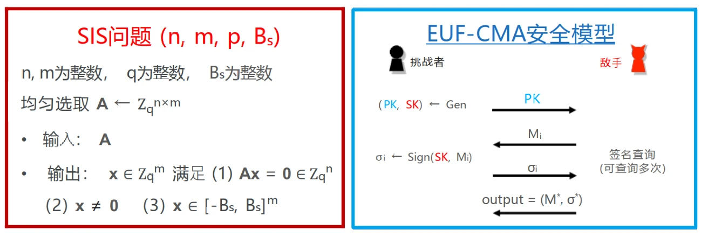
        - **$\mathcal{B}$ 的输入**：$\mathbf{A}\in\mathbb{Z}_{q}^{n\times m}$
        - **$\mathcal{B}$ 的策略**：
            - $\mathcal{B}$ 将公钥 $PK=\mathbf{A}$ 作为输入提供给 $\mathcal{A}$
            - $\mathcal{B}$ 维护一个哈希查询表 $\mathcal{T}$ 记录 $\mathrm{H}(M)$ 与 $\sigma$ 的对应关系
            - 当 $\mathcal{A}$ 使用 $M_i$ 进行**签名查询**时：$\mathcal{B}$ 首先检查 $\mathcal{T}$ 中是否存在 $M_i$ 的记录
                - 若存在，$\mathcal{B}$ 将记录的 $\sigma_i$ 返回给 $\mathcal{A}$
                - 否则，$\mathcal{B}$ 随机生成一个签名 $\sigma_i$ 返回给 $\mathcal{A}$，同时记录 $\mathrm{H}(M_i) = \mathbf{A}\sigma_i$ 到 $\mathcal{T}$ 中
            - 当 $\mathcal{A}$ 使用 $M_j$ 进行**哈希查询**时：$\mathcal{B}$ 首先检查 $\mathcal{T}$ 中是否存在 $M_j$ 的记录
                - 若存在，$\mathcal{B}$ 将记录的 $\mathrm{H}(M_j)$ 返回给 $\mathcal{A}$
                - 否则，$\mathcal{B}$ 随机生成一个签名 $\sigma_j$，计算 $\mathrm{H}(M_j) = \mathbf{A}\sigma_j$ 并将 $\mathrm{H}(M_j)$ 返回给 $\mathcal{A}$，同时记录 $\mathrm{H}(M_j) = \mathbf{A}\sigma_j$ 到 $\mathcal{T}$ 中
            - $\mathcal{A}$ 最终以不可忽略优势输出一对有效的消息签名对 $(M^*,\sigma^*)$，则 $\mathcal{A}$ 以不可忽略概率查询过 $\mathrm{H}(M^*)$，因此 $\mathcal{B}$ 已经记录了 $\mathrm{H}(M^*)$ 与某个签名 $\sigma$ 的对应关系
                - 若 $\sigma^* = \sigma$，则失败
                - 若 $\sigma^* \neq \sigma$，则有
                    $$
                    \begin{cases}
                    \mathbf{A}(\sigma^* - \sigma) = \mathrm{H}(M^*) - \mathrm{H}(M^*) = \mathbf{0} \\
                    \|\sigma^* - \sigma\| \leq \|\sigma^*\| + \|\sigma\| \leq 2B = B_s \implies
                    \sigma^* - \sigma \in [-B_s,B_s]^{m}
                    \end{cases}
                    $$ 因此 $\sigma^* - \sigma$ 是 $\mathbf{A}$ 的一个非零的短整数解。可以证明当 $m \gg n \log q$ 时，$\sigma^* \neq \sigma$ 的概率为不可忽略的。
        - **$\mathcal{B}$ 的输出**：$\mathbf{x} = \sigma^* - \sigma$
        - **$\mathcal{B}$ 的优势**：
            $$
            \begin{aligned}
            \mathrm{Adv}_{\mathcal{B}} &\geq \Pr\left[
            \begin{array}{l}
            (1)\ \mathcal{A} \text{ 成功攻破 GPV 签名算法的 EUF-CMA 安全性} \\
            (2)\ \mathcal{A} \text{ 查询过 } M^{*} \text{ 的 Hash 值} \\
            (3)\ \sigma^{*} \neq \sigma
            \end{array}
            \right] \\
            &= \text{non-negl}(\lambda)
            \end{aligned}
            $$

	

#### 基于 GPV 的身份基加密算法
- 组件：
    1. PSF：参数 $(n,m,q,B)$
    2. Hash Function $\mathrm{H}:\{0,1\}^{*}\to\mathbb{Z}_{q}^{n}$
- **密钥生成算法** $(PK,SK) \leftarrow \mathrm{Gen}(1^{\lambda})$：类似于GPV
    1. 调用 $(\mathbf{A},td) \leftarrow \mathrm{SampleA}(1^{\lambda})$
    2. 输出 $PK = \mathbf{A}$, $SK = td$
- **私钥派生算法** $SK_{id} \leftarrow \mathrm{Derive}(SK,id)$：身份空间为 $\{0,1\}^*$
    1. 计算并输出 $SK_{id} := \mathrm{SamplePre}(td,\mathbf{A},H(id)) \in\mathbb{Z}_{q}^{m}$
- **加密算法** $C \leftarrow \mathrm{Enc}(PK,id,M)$：消息空间为 $\mathbb{M}=\{0,1\}$
    1. 均匀选取 $\mathbf{r} \leftarrow \mathbb{Z}_{q}^{n}$，$\mathbf{e}_{1} \leftarrow_{\chi}[-B_{x},B_{x}]^{m}$，$\mathbf{e}_2 \leftarrow_{\chi}[-B_x,B_x]$
    2. 计算 $\mathbf{c}_{1}:=\mathbf{A}^{\top}\mathbf{r}+\mathbf{e}_{1} \in \mathbb{Z}_{q}^{m}$
    3. 计算 $c_{2}:=\mathbf{r}^{\top}H(id)+\mathbf{e}_{2}+M\cdot\lfloor q/2\rceil \in \mathbb{Z}_{q}$
    4. 输出 $C:=(\mathbf{c}_{1},c_{2})$
- **解密算法** $M' \leftarrow \mathrm{Dec}(SK_{id},C=(\mathbf{c}_{1},c_{2}))$：
    1. 计算 $d:=c_{2}-\mathbf{c}_{1}^{\top}\cdot SK_{id} \in \mathbb{Z}_{q}$
    2. 如果 $q/4<d<3q/4$，输出 $M':=1$；否则，输出 $M':=0$

## 纠错码理论以及基于编码困难问题的密码学

### 通信系统模型与误差模型
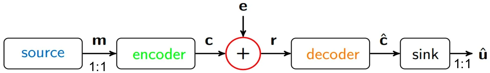

- **通信系统的基本模型**：
    - 信源：产生长度为 $k$ 的消息 $m \in \sum^{k}$
    - 编码器：将消息 $m$ 编码为长度为 $n$ 的码字 $c \in \sum^{n}$（$m$ 与 $c$ 一一映射：增加冗余）
    - 信道：码字被错误 $e \in \sum^{n}$ 干扰，即 $r=c+e$
    - 译码器：仅根据接收字 $r$ 重构码字 $c$，从而恢复消息 $m$。
- **误差模型与可译码性**：
    - 通信系统中，采用随机替换误差模型，即已知比特位置存在未知错误值
    - 存储系统中，采用擦除误差模型，即已知错误位置且该位置值直接丢失
    - 密码学中，采用随机替换误差模型

### 有限域（Finite Field）
#### 有限域
- 消息的元素来自有限域（字母表 $\sum$），因此需要了解有限域的相关知识。
- **域**：集合 $F$ 上定义了加法和乘法两种运算，满足：
    1. $(F, +)$ 是阿贝尔群，零元素记为 $0$；
    2. $(F \backslash\{0\}, \cdot)$ 是阿贝尔群，单位元素记为 $1$；
    3. 分配律：对所有 $a, b, c \in F$，有 $a \cdot(b+c)=a \cdot b+a \cdot c$。
- **有限域**：$F_{q}$ 为包含有限个 $q$ 个元素的域
    - 实际构造：$F_{q}$ 存在当且仅当 $q=p^{\ell}$ 为素数的幂
- **素域**（$p$ 为素数）：$F_{p}=\{0,\cdots,p-1\}$，运算为模 $p$ 的加法/乘法，例如 $F_{2}=\{0,1\}$；
- **扩域**（$F_{p}$ 为基域）：设 $f(x)$ 为 $F_{p}$ 上的首一不可约多项式，次数为 $\ell$，则
    $$
    \begin{aligned}
    F_{p^{\ell}}&=F_{p}[x]/(f(x)) \\
    &=\left\{a(x) \pmod{f(x)} \mid a(x) \in F_{p}[x]\right\} \\
    &=\left\{a(x) \in F_{p}[x]:\deg(a)<\ell\right\} \\
    &=\left\{a_{0}+a_{1} x+\cdots+a_{\ell-1} x^{\ell-1}: a_{i} \in F_{p} \right\}
    \end{aligned}
    $$
    - 运算：
        - 加法：按分量进行，各项系数模 $p$ 加法
        - 乘法：模 $f(x)$ 乘法
    - 性质：
        - $\# F_{p^{\ell}}=p^{\ell}$
        - $F_{p} \subseteq F_{p^{\ell}}$
        - $F_{p^{\ell}} \cong F_{p}^{\ell}$
    - 同理，可以以 $F_q =F_{p^{\ell}}$ 为基域构造扩域 $F_{q^m}$，满足 $F_{q^m} \cong F_{q}^{m}$。
- 任意两个同阶的有限域都是同构的。

#### 有限域上的向量空间
- **有限域上的向量空间**：设 $F_{q}$ 为 $q$ 阶有限域，阿贝尔群 $V$ 被称为 $F_{q}$ 上的向量空间，若存在 $F_{q}$ 在 $V$ 上的数乘运算
    $$
    \begin{aligned}
    F_{q} \times V &\to V \\
    (\lambda, x) &\mapsto \lambda x
    \end{aligned}
    $$
    满足以下公理：
    1. 对所有 $\lambda \in F_{q}$ 和 $x,y \in V$，有 $\lambda(x+y)=\lambda x+\lambda y$；
    2. 对所有 $\lambda,\mu \in F_{q}$ 和 $x \in V$，有 $(\lambda+\mu) x=\lambda x+\mu x$；
    3. 对所有 $\lambda,\mu \in F_{q}$ 和 $x \in V$，有 $(\lambda \mu) x=\lambda(\mu x)$；
    4. 对所有 $x \in V$，有 $1x=x$。
- **线性张成**：设 $\mathcal{V}$ 为 $F_{q}$ 上的向量空间，$S=\{\mathbf{v}_{1},\cdots,\mathbf{v}_{k}\}$ 为 $\mathcal{V}$ 的子集，$S$ 的线性张成定义为
    $$
    \langle S\rangle _{q}=\{\lambda_{1}\mathbf{v}_{1}+\cdots+\lambda_{k}\mathbf{v}_{k}:\lambda_{i}\in F_{q}\}
    $$

    特别地，$\langle\emptyset\rangle _{q}:=\{0\}$。则 $\langle S\rangle _{q}$ 是 $\mathcal{V}$ 的线性子空间。
- **向量空间的基与维数**：设 $\mathcal{V}$ 为 $F_{q}$ 上的向量空间，$B=\{\mathbf{v}_{1},\cdots,\mathbf{v}_{k}\}$ 为 $\mathcal{V}$ 的子集，若 $B$ 线性无关且 $\langle B\rangle _{q}=\mathcal{V}$，则称 $B$ 是 $\mathcal{V}$ 的一组基。基中的向量个数称为 $\mathcal{V}$ 的维数，记为 $\dim(\mathcal{V})$。
- $F_{q^{m}}$ 是 $F_{q}$ 上维数为 $m$ 的向量空间。

### 线性码（Linear Code）
#### 线性码的定义与表示
- **线性码**：设 $F_{q}$ 为 $q$ 阶有限域，$\mathcal{C} \subseteq F_{q}^{n}$ 是 $F_{q}$ 上的 $k$ 维线性子空间，则称 $\mathcal{C}$ 是 $[n, k]_{q}$ 线性码。
    - $\mathcal{C}$ 的长度为 $n$
    - $\mathcal{C}$ 的维数为 $k \leq n$，即 $\mathcal{C}$ 可以由 $k$ 个线性无关的向量生成
    - $\mathcal{C}$ 的码率为 $\frac{k}{n} \leq 1$，即存在冗余
    - $\mathcal{C}$ 中的元素称为码字，表示为列向量 $\mathbf{c}=(c_{1},\cdots,c_{n})^{\top}$ 或行向量 $\mathbf{c}^{\top}$。
- **线性码的表示与生成矩阵**：设 $\mathbf{G} \in F_{q}^{k \times n}$ 的行向量 $\mathbf{g}_{1},\cdots,\mathbf{g}_{k}$ 构成 $\mathcal{C}^{\perp}$ 的一组基，则 $\mathcal{C}$ 可表示为
    $$
    \mathcal{C}=\left\{\mathbf{c} \in F_{q}^{n}: \mathbf{c}=\mathbf{G}^{\top} m, m \in F_{q}^{k}\right\},\quad \mathbf{G}=\begin{pmatrix} \mathbf{g}_{1} \\ \vdots \\ \mathbf{g}_{k} \end{pmatrix}_{k \times n}
    $$

    反之，任意秩为 $k$ 的矩阵 $\mathbf{G} \in F_{q}^{k\times n}$ 都定义了一个 $[n, k]_{q}$ 码，称 $\mathbf{G}$ 为 $\mathcal{C}$ 的生成矩阵。

#### 线性码的对偶码与校验矩阵
- **内积**：设 $\mathbf{x}=(x_{1},\cdots,x_{n})$ 和 $\mathbf{y}=(y_{1},\cdots,y_{n})$ 是 $F_{q}^{n}$ 中的两个向量，则它们的内积定义为
    $$
    \langle \mathbf{x}, \mathbf{y}\rangle :=x_{1} y_{1}+\cdots+x_{n} y_{n} = \sum_{i=1}^{n} x_{i} y_{i}
    $$
- **对偶码**：设 $\mathbf{g}_{1},\cdots,\mathbf{g}_{k}$ 是 $\mathcal{C} \subseteq F_{q}^{n}$ 的一组基，则 $\mathcal{C}$ 的对偶码定义为
    $$
    \begin{aligned}
    \mathcal{C}^{\perp}:=&\{ \mathbf{c}^{*}\in F_{q}^{n} \mid \forall \mathbf{c}\in \mathcal{C}, \langle \mathbf{c},\mathbf{c}^{*}\rangle =0\} \\
    =&\{\mathbf{c}^{*} \in F_{q}^{n} \mid \forall i, \langle \mathbf{c}^{*}, \mathbf{g}_{i}\rangle =0\} \\
    =&\{\mathbf{c}^{*} \in F_{q}^{n} \mid \mathbf{c}^{*} \mathbf{G}^{\top}=0\}
    \end{aligned}
    $$
    - **性质**：由于 $\dim(\mathcal{C}^{\perp})=n-\dim(\mathcal{C})$，因此 $[n, k]_{q}$ 码 $\mathcal{C}$ 的对偶码 $\mathcal{C}^{\perp}$ 是 $[n, n-k]_{q}$ 码，且满足$(\mathcal{C}^{\perp})^{\perp}=\mathcal{C}$。
    - 说明：$\mathcal{C}$ 与 $\mathcal{C}^{\perp}$ 可能不构成直和，$\mathcal{C}$ 的核定义为 $\mathcal{C} \cap \mathcal{C}^{\perp}$。
- **自对偶码**：$\mathcal{C}=\mathcal{C}^{\perp}$，则 $\mathcal{C}$ 的维数为 $\frac{n}{2}$。
- **线性码的另一种表示与校验矩阵**：设 $\mathbf{H} \in F_{q}^{(n-k) \times n}$ 的行向量 $\mathbf{h}_{1},\cdots,\mathbf{h}_{n-k}$ 构成 $\mathcal{C}^{\perp}$ 的一组基，则 $\mathbf{H}\mathbf{G}^{\top}=0$，线性码 $\mathcal{C}$ 可表示为
    $$
    \mathcal{C}=\left\{\mathbf{c} \in F_{q}^{n}: \mathbf{H} \mathbf{c}=0\right\},\quad \mathbf{H}=\begin{pmatrix} \mathbf{h}_{1} \\ \vdots \\ \mathbf{h}_{n-k} \end{pmatrix}_{(n-k) \times n}
    $$

    反之，任意秩为 $n-k$ 的矩阵 $\mathbf{H} \in F_{q}^{(n-k) \times n}$ 都定义了一个 $[n, k]_{q}$ 码，称 $\mathbf{H}$ 为 $\mathcal{C}$ 的校验矩阵。

#### 汉明度量
- **汉明重量**：对于 $\mathbf{x}=(x_{1},\cdots,x_{n}) \in F_{q}^{n}$，其汉明重量定义为非零分量的个数，即
    $$
    \mathrm{wt}_{H}(\mathbf{x}):=\# \{ x_{i}\neq 0 \mid 1\leq i\leq n\}
    $$
- **汉明距离**：两个向量 $\mathbf{x}$ 和 $\mathbf{y}$ 之间的汉明距离定义为
    $$
    d(\mathbf{x}, \mathbf{y}):=\mathrm{wt}_{H}(\mathbf{x}-\mathbf{y})
    $$
    - **注**：汉明度量是一种仅能取 $n+1$ 个值 $(0,1,\cdots,n)$ 的度量，且与欧几里得度量不同，它不区分“大”和“小”的分量。例如在 $F_{11}^{3}$ 中，$\mathrm{wt}_{H}(5, 3, 0) = \mathrm{wt}_{H}(1, 0, 1) = 2$。
- **极小汉明距离**：线性码 $\mathcal{C}$ 的极小汉明距离定义为非零码字的最小汉明重量，即
    $$
    d_{min}(\mathcal{C}):=\min\left\{\mathrm{wt}_{H}(\mathbf{c}): \mathbf{c} \in \mathcal{C} \backslash\{0\}\right\}.
    $$
    - **定理**:
        1. $d_{min}(\mathcal{C})\leq t \iff \mathbf{H}$ 存在 $t$ 个线性相关的列
        2. $d_{min}(\mathcal{C})\geq t \iff \mathbf{H}$ 的任意 $t-1$ 个列都线性无关
    - **推论（Singleton 界）**：极小汉明距离满足 $d_{min}(\mathcal{C}) \leq n-k+1$。
    - **推论**：若 $\mathbf{H}$ 是线性码 $\mathcal{C}$ 的校验矩阵，设 $\mathcal{C}$ 的极小汉明距离为 $d$，则 $\mathbf{H}$ 的任意 $d-1$ 列线性无关，且存在 $d$ 个线性相关的列。

#### 线性码的等价性
- **约化**：通过初等行变换将两个矩阵转化为行简化阶梯形矩阵
    - $\mathbf{G} \to \mathbf{G}'=\begin{pmatrix} \mathbf{I}_{k} & \mathbf{P} \end{pmatrix}$
    - $\mathbf{H} \to \mathbf{H}'=\begin{pmatrix} -\mathbf{P}^{\top} & \mathbf{I}_{n-k} \end{pmatrix}$
- **线性码的等价性**：设 $\mathcal{C}_{1}, \mathcal{C}_{2} \subseteq F_{q}^{n}$ 是两个线性码，若存在一个 $n \times n$ 的置换矩阵 $\mathbf{P}$ 和一个 $n \times n$ 的可逆对角矩阵 $\mathbf{D}$，使得 $\mathcal{C}_{2}=\{\mathbf{P} \mathbf{D} \mathbf{c}: \mathbf{c} \in \mathcal{C}_{1}\}$，则称 $\mathcal{C}_{1}$ 与 $\mathcal{C}_{2}$ 是等价的。
    - 相当于对码字进行位置置换和分量缩放，保持码字之间的距离不变。
    - **性质**：等价的线性码具有相同的参数 $[n, k, d]$，但不一定具有相同的生成矩阵或校验矩阵。
- **定理**：设 $\mathcal{C}$ 是 $[n, k]_{q}$ 码，则存在一个等价的 $[n, k]_{q}$ 码 $\mathcal{C}'$，使得 $\mathcal{C}'$ 的生成矩阵为系统矩阵，即 $\mathbf{G}'=\begin{pmatrix} \mathbf{I}_k & \mathbf{P} \end{pmatrix}$。

### 纠错码（Error-Correcting Code）
#### 纠错码示例
##### 汉明码
- **定义**：设 $r \geq 2$，汉明码 $\mathcal{C}_{r}=[2^{r}-1,2^{r}-1-r]_{2}$ 由 $r \times(2^{r}-1)$ 的校验矩阵构造，其第 $i$ 列是 $1 \leq i \leq 2^{r}-1$ 的二进制表示，该码的维数为 $2^{r}-1-r$，极小汉明距离为 $r$。
- **示例**：取码长 $n=7$、码维数 $k=4$ 的汉明码（$r=3$），其生成矩阵为
    $$
    \mathbf{G}=\begin{pmatrix}
    1 & 0 & 0 & 0 & 1 & 1 & 0 \\
    0 & 1 & 0 & 0 & 1 & 0 & 1 \\
    0 & 0 & 1 & 0 & 0 & 1 & 1 \\
    0 & 0 & 0 & 1 & 1 & 1 & 1
    \end{pmatrix}
    $$

    则 $\mathbf{c}^{\top}=\begin{pmatrix} 1 & 0 & 0 & 1 \end{pmatrix} \cdot \mathbf{G}=\begin{pmatrix} 1 & 0 & 0 & 1 & 1 & 1 & 1 \end{pmatrix}$是该码的一个码字。

    其校验矩阵为
    $$
    \mathbf{H}=\begin{pmatrix}
    1 & 1 & 0 & 1 & 1 & 0 & 0 \\
    1 & 0 & 1 & 1 & 0 & 1 & 0 \\
    0 & 1 & 1 & 1 & 0 & 0 & 1
    \end{pmatrix}
    $$

    满足 $\mathbf{H}\mathbf{c}=\mathbf{0}$，且满足 $\mathbf{G}=\begin{pmatrix} \mathbf{I} & \mathbf{Q} \end{pmatrix}$、$\mathbf{H}=\begin{pmatrix} \mathbf{Q}^{T} & \mathbf{I} \end{pmatrix}$。

##### Reed-Solomon 码
- **广义 Reed-Solomon 码**（GRS）：设 $\mathbf{z} \in(F_{q}^{*})^{n}$，$\{\alpha_{1},\cdots,\alpha_{n}\}$ 为 $F_{q}$ 中 $n$ 个两两不同的元素，$k \leq n$，广义 Reed-Solomon 码 $\mathcal{C}_{GRS}(n, k)$ 定义为
    $$
    \mathcal{C}_{GRS}(n, k)=\{(z_{1} f(\alpha_{1}), \cdots, z_{n} f(\alpha_{n})) \mid f \in F_{q}[x],\deg(f)<k\}
    $$

    - $\mathcal{C}_{GRS}(n,k)$ 是 $[n, k]_{q}$ 码。
        - 是线性码：
            - $F_{q}[x]_{\deg(f)<k}$ 构成一个 $k$ 维的 $F_{q}$ 线性空间
            - 映射 $f(x) \in F_{q}[x]_{\deg(f)<k} \mapsto (f(\alpha_{1}), \cdots, f(\alpha_{n})) \in F_{q}^{n}$ 为单射，则 $(f(\alpha_{1}), \cdots, f(\alpha_{n}))$ 也是一个 $k$ 维的 $F_{q}$ 线性空间
            - 乘以 $z$ 后仍是一个 $k$ 维的 $F_{q}$ 线性空间
        - 码长：$n$
        - 码维数：$k$
        - 极小汉明距离：$d = n-k+1$
    - **生成矩阵**：
        $$
        \begin{aligned}
        \mathbf{G} &=\begin{pmatrix}
        z_{1} & z_{2} & \cdots & z_{n} \\
        z_{1} \alpha_{1} & z_{2} \alpha_{2} & \cdots & z_{n} \alpha_{n} \\
        \vdots & \vdots & \ddots & \vdots \\
        z_{1} \alpha_{1}^{k-1} & z_{2} \alpha_{2}^{k-1} & \cdots & z_{n} \alpha_{n}^{k-1}
        \end{pmatrix}_{k\times n} \\
        &=\begin{pmatrix}
        1 & 1 & \cdots & 1 \\
        \alpha_{1} & \alpha_{2} & \cdots & \alpha_{n} \\
        \vdots & \vdots & \ddots & \vdots \\
        \alpha_{1}^{k-1} & \alpha_{2}^{k-1} & \cdots & \alpha_{n}^{k-1}
        \end{pmatrix} \cdot \operatorname{diag}(z_{1}, z_{2}, \cdots, z_{n})
        \end{aligned}
        $$
    - **校验矩阵**：
        $$
        \begin{aligned}
        \mathbf{H} &=\begin{pmatrix}
        z_{1}' & z_{2}' & \cdots & z_{n}' \\
        z_{1}' \alpha_{1} & z_{2}' \alpha_{2} & \cdots & z_{n}' \alpha_{n} \\
        \vdots & \vdots & \ddots & \vdots \\
        z_{1}' \alpha_{1}^{n-k-1} & z_{2}' \alpha_{2}^{n-k-1} & \cdots & z_{n}' \alpha_{n}^{n-k-1}
        \end{pmatrix}_{(n-k)\times n} \\
        &=\begin{pmatrix}
        1 & 1 & \cdots & 1 \\
        \alpha_{1} & \alpha_{2} & \cdots & \alpha_{n} \\
        \vdots & \vdots & \ddots & \vdots \\
        \alpha_{1}^{n-k-1} & \alpha_{2}^{n-k-1} & \cdots & \alpha_{n}^{n-k-1}
        \end{pmatrix} \cdot \operatorname{diag}(z_{1}', z_{2}', \cdots, z_{n}')
        \end{aligned}
        $$
    - **对偶码**：$\mathcal{C}_{GRS}^{\perp}(n, k)$ 仍是 GRS 码，其对应的 $z_{i}'=\frac{1}{z_{i} \prod_{j ≠i}(\alpha_{j}-\alpha_{i})}$（由拉格朗日插值可得）。
    - **编码复杂度**：对任意消息 $m \in F_{q}^{k}$，按 $\mathbf{c}=\mathbf{G}^{\top}m$ 编码的复杂度为 $O(kn) \to O(k(n-k))$；若对 $n$ 和 $F_{q}$ 加以限制，可通过 FFT 实现 $O(n \log n)$ 的快速编码。
- **Reed-Solomon 码**：特别地，RS 码是所有 $z_{1}=\cdots=z_{n}=1$ 的 GRS 码。

##### Goppa 码
- **子域子码**（Subfield Subcode）：给定定义在扩域 $F_{q^m}$ 上的线性码 $\mathcal{C}[n,k,d]_{q^m}$，其相对于基域 $F_q$ 的子域子码定义为：
    $$
    \mathcal{C}'[n, k' \geq n - m(n - k), d' \geq d] = \mathcal{C} \cap F_q^n
    $$
    - 核心优势：常用于基于码的密码学，可隐藏原码 $\mathcal{C}$ 的代数结构，提升安全性。
- **Goppa 码**：$\alpha_i \in F_{q^m}$ 为两两不同的元素，$g(x) \in F_{q^m}[x]$ 为 $r$ 次多项式，且对所有 $i$ 满足 $g(\alpha_i) \neq 0$，则定义 Goppa 码 $\mathcal{C}_\mathbf{G}$ 是 GRS 码在 $F_q$ 上的子域子码
    $$
    \mathcal{C}_\mathbf{G} = \left\{ (c_0, c_1, \dots, c_{n-1}) \in F_q^n ~\middle|~ \sum_{i=0}^{n-1} \frac{c_i}{x - \alpha_i} \equiv 0 \pmod{g(x)} \right\}
    $$
- **校验矩阵**：
    $$
    \mathbf{H} = \begin{pmatrix}
    1 & 1 & \dots & 1 \\
    \alpha_0 & \alpha_1 & \dots & \alpha_{n-1} \\
    \vdots & \vdots & \ddots & \vdots \\
    \alpha_0^{r-1} & \alpha_1^{r-1} & \dots & \alpha_{n-1}^{r-1}
    \end{pmatrix} \cdot \operatorname{diag}\left(\frac{1}{g(\alpha_0)}, \frac{1}{g(\alpha_1)}, \dots, \frac{1}{g(\alpha_{n-1})}\right)
    $$
- **性质**
    1.  继承大最小距离：继承了 RS 码的高最小距离，具备优秀的纠错能力
    2.  隐藏 RS 码结构：通过子域子码构造，掩盖了原 GRS/RS 码的代数结构，是后量子密码学（如 McEliece 密码系统）的核心候选方案
    3.  高效译码：译码复杂度与 RS 码相当，可实现多项式时间快速译码

#### 纠错码译码
- **译码问题**：设发送码字 $\mathbf{c} \in F_{q}^{n}$ 在信道中被错误向量 $\mathbf{e} \in F_{q}^{n}$ 干扰，得到接收字 $\mathbf{r}=\mathbf{c}+\mathbf{e}$，译码问题是在 $\mathrm{wt}_{H}(\mathbf{e}) \le t$ 较小的假设下，从 $\mathbf{r}$ 恢复原始码字 $\mathbf{c}$。
- **译码条件**：设 $\mathcal{C}$ 的极小汉明距离为 $d$，则要求 $t<d$，否则 $\mathbf{e}+\mathcal{C} \cap \mathcal{C} \neq \emptyset$，无法唯一确定 $\mathbf{c}$。
- **译码模式**：
    - 唯一译码：输出 $B_H(\mathbf{r}, t) \cap \mathcal{C}=\{\mathbf{c}\}$ 中唯一的码字 $\mathbf{c}$，其中汉明球 $B_H(\mathbf{r}, t)=\{\mathbf{x} \in F_{q}^{n} \mid \mathrm{wt}(\mathbf{x}-\mathbf{r}) \le t\}$
    - 最近邻译码：输出距离 $\mathbf{r}$ 最近的码字
    - 列表译码：输出所有满足给定汉明距离约束的码字
- **唯一译码定理**：若 $\mathrm{wt}(\mathbf{e}) \leq\left\lfloor\frac{d-1}{2}\right\rfloor$，则总能从 $\mathbf{r}=\mathbf{c}+\mathbf{e}$ 中唯一译码出 $\mathbf{c} \in \mathcal{C}$。

##### 伴随式
- **伴随式**：设 $\mathbf{H} \in F_{q}^{(n-k) \times n}$，接收字 $\mathbf{r} \in F_{q}^{n}$ 关于 $\mathbf{H}$ 的伴随式定义为 $$S(\mathbf{r}) = \mathbf{H}\mathbf{r}\in F_{q}^{n-k}$$
    - **性质**：设 $\mathcal{C}$ 是一个 $[n,k,d]$ 线性码，$\mathbf{H}$ 是 $\mathcal{C}$ 的校验矩阵。对任意 $\mathbf{u},\mathbf{v} \in F_q^n$，有：
        1.  $S(\mathbf{u}+\mathbf{v}) = S(\mathbf{u}) + S(\mathbf{v})$。
        2.  $S(\mathbf{u}) = 0 \iff \mathbf{u} \in \mathcal{C}$。
        3.  $S(\mathbf{u}) = S(\mathbf{v}) \iff \mathbf{u}-\mathbf{v} \in \mathcal{C} \iff \mathbf{u},\mathbf{v}$ 属于同一个陪集。
    - **说明**：
        - 设 $\mathcal{C}$ 为 $[n, k]_{q}$ 码，则 $F_{q}^{n}=\sqcup_{s \in F_{q}^{n-k}}(s+\mathcal{C})$。
        - 一方面，伴随式属于向量空间 $F_q^{n-k}$，另一方面，$\mathcal{C}$ 共有 $q^{n-k}$ 个陪集，即共有 $q^{n-k}$ 个不同的伴随式。因此，$F_q^{n-k}$ 中的所有向量都可以作为某个向量的伴随式出现。
- **陪集**（coset）：线性码 $\mathcal{C}$ 对加法群 $F_q^n$ 的陪集，形式为 $\mathbf{e} + \mathcal{C}$，其中 $\mathbf{e}$ 为陪集代表元，同一陪集内的所有码字具有相同的伴随式。
- **陪集首**（coset leader）：每个陪集 $\mathbf{e}+\mathcal{C}$ 中汉明重量最小的向量 $\mathbf{e}$，称为该陪集的陪集首。
- **标准阵列**（standard array）：将 $F_q^n$ 中的所有向量按照陪集划分成 $q^{n-k}$ 行，每行以一个陪集首开头，称为线性码 $\mathcal{C}$ 的标准阵列。
- **伴随式译码问题（二者等价）**：
    - **带噪码字译码**：给定秩为 $k$ 的矩阵 $\mathbf{G} \in F_{q}^{k\times n}$、整数 $t \in[0, n]$、向量 $\mathbf{y}=\mathbf{c}+\mathbf{e} \in F_{q}^{n}$，其中 $c = \mathbf{G}^\top m$，$\mathrm{wt}_{H}(\mathbf{e}) \leq t$，求错误向量 $\mathbf{e}$。
    - **伴随式译码**：给定秩为 $n-k$ 的矩阵 $\mathbf{H} \in F_{q}^{(n-k) \times n}$、整数 $t \in[0, n]$、伴随式 $\mathbf{s}=\mathbf{H}\mathbf{e} \in F_{q}^{n-k}$，其中 $\mathrm{wt}_{H}(\mathbf{e}) \leq t$，求错误向量 $\mathbf{e}$。

	
    - $G$ 和 $H$ 的相互转化是容易的
    - $\implies$：若存在一个解决伴随式译码问题的算法 $\mathcal{A}$，则对于带噪码字译码问题的输入 $\mathbf{y}$，计算伴随式 $\mathbf{s}=\mathbf{H}\mathbf{y}=\mathbf{H}(\mathbf{c}+\mathbf{e})=\mathbf{H}\mathbf{e}$，调用 $\mathcal{A}$ 输出 $\mathbf{e}$。
    - $\impliedby$：若存在一个解决带噪码字译码问题的算法 $\mathcal{B}$，则对于伴随式译码问题的输入 $\mathbf{s}$，求解线性方程组 $\mathbf{H}\mathbf{x}=\mathbf{s}$ 得到一个解 $\mathbf{y}$，调用 $\mathcal{B}$ 输出 $\mathbf{e}$。

	

##### 纠错码译码算法
- **伴随式查找表译码算法**（syndrome lookup table）：通过查找将所有陪集首与其对应的伴随式进行匹配的表格来实现译码的算法。
    - **输入**：$\mathbf{r}=\mathbf{c}+\mathbf{e} \in F_{q}^{n}$，其中 $\mathbf{c} \in \mathcal{C}$，$\mathrm{wt}_{H}(\mathbf{e}) < d$
    - **输出**：$\mathbf{c} \in \mathcal{C}$
    - **算法步骤**：
        1. 列出码 $\mathcal{C}$ 的所有陪集，找出每个陪集的陪集首。
        2. 求出码 $\mathcal{C}$ 的一个校验矩阵 $\mathbf{H}$。
        3. 计算每个陪集首的伴随式 $S(\mathbf{e})=\mathbf{H}\mathbf{e}$，建立伴随式查找表。
        4. 设 $\mathbf{r} \in F_q^n$ 为接收码字，计算其伴随式 $S(\mathbf{r})$。
        5. 查找伴随式查找表，找到满足 $S(\mathbf{e}) = S(\mathbf{r})$ 的陪集首 $\mathbf{e}$。
        6. 将 $\mathbf{r}$ 译码为 $\mathbf{r} - \mathbf{e}$。
    - **译码复杂度**
        - 空间复杂度：$O(q^{n-k})$
        - 计算复杂度：$O(n(n-k))$
- **Reed-Solomon 码的唯一译码算法**：BERLEKAMP-WEL\mathcal{C}H 算法可在译码半径 $\frac{d-1}{2}$ 内对 RS 码进行唯一译码。
    - **输入**：$\mathbf{r}=(r_{1}, r_{2}, \cdots, r_{n})^{\top}=\mathbf{c}+\mathbf{e} \in F_{q}^{n}$，其中 $\mathbf{c} \in \mathcal{C}_{RS}(n, k)$，$\mathrm{wt}(\mathbf{e}) \leq t = \lfloor\frac{d-1}{2}\rfloor$
    - **输出**：$f(x) \in F_{q}[x]_{<k}$，满足 $(f(\alpha_{1}), \cdots, f(\alpha_{n}))=\mathbf{c}$
    - **算法步骤**：
        1. 设**错误定位多项式** $e(x)=\prod_{e_{i} \neq 0}(x-\alpha_{i})$，则有
            $$
            r_{i}e(\alpha_{i})=e(\alpha_{i})f(\alpha_{i}), \quad i=1,2, \ldots, n
            $$
        2. 设 $E(x)=\sum_{i=0}^{t} u_{i} x^{i}$，$Q(x)=\sum_{i=0}^{t+k-1} v_{i} x^{i}$，则下面的线性方程组是可解的
            $$
            r_{i} E\left(\alpha_{i}\right)=Q\left(\alpha_{i}\right), \quad i=1,2, \ldots, n
            $$
        3. 输出 $f(x)=Q(x) / E(x)$
    - **译码复杂度**：$O(n^{3})$

### 随机线性码（Random linear Codes）
#### 随机线性码的定义
- **随机线性码**：校验矩阵或生成矩阵均匀随机选取的线性码。具体而言，$[n, k]_q$ 码 $\mathcal{C}$ 定义为：
    1. **G 模型**：随机选取秩为 $k$ 的矩阵 $\mathbf{G} \in F_q^{k \times n}$，则 $\mathcal{C} = \{\mathbf{G}^\top \mathbf{m} \mid \mathbf{m} \in F_q^k\}$。
    2. **H 模型**：随机选取秩为 $n-k$ 的矩阵 $\mathbf{H} \in F_q^{(n-k) \times n}$，则 $\mathcal{C} = \{\mathbf{c} \in F_q^n \mid \mathbf{H}\mathbf{c} = 0\}$。
- **引理**：设 $\mathbf{H}$ 在 $F_q^{r \times n}$ 中均匀随机分布，则
    $$
    \Pr{}_{\mathbf{H}}(\mathrm{rank}(\mathbf{H}) < r) = \frac{1}{q^{n-r}}
    $$
    - G 模型随机选取 $\mathbf{G} \in F_q^{k \times n}$ ，以 $1-O(q^{-(n-k)})$ 的概率生成维数为 $k$ 的码。
    - H 模型随机选取 $\mathbf{H} \in F_q^{(n-k) \times n}$ ，以 $1-O(q^{-k})$ 的概率生成维数为 $k$ 的码。

#### Gilbert-Varshamov 界
- **定义**：设 $V_q^n(t)$ 为 $F_q^n$ 中重量 $\mathrm{wt}_H \le t$ 的向量个数，即
    $$
    V_q^n(t) = \sum_{i=0}^t \binom{n}{i} (q-1)^i \le \binom{n}{t} q^t
    $$
- **GV 界**：设 $q$ 为素数幂，$n, d$ 为正整数。设 $A(d, n, q)$ 为 $F_q^n$ 中最小距离至少为 $d$ 的任意码的最大容量，则
    $$
    \begin{aligned}
    A(d, n, q) &= \#\{\mathcal{C} \subseteq F_q^n \mid d_{\min}(\mathcal{C}) \ge d\} \\
    &\ge \frac{q^n}{V_q^n(d-1)}
    \end{aligned}
    $$
- **渐近 GV 界**：对任意素数幂 $q$ 与 $\delta \in [0, 1-\frac{1}{q}]$，存在一个无限的码族 $\mathfrak{C} = \{\mathcal{C}_n\}_{n=1}^\infty$，其码的相对最小距离 $\frac{d_{\min}(\mathcal{C})}{n} \ge \delta$，相对码率
    $$
    R_\delta = \lim_{n \to \infty} \frac{\log_q A(\delta n, n, q)}{n} \ge 1 - H_q(\delta)
    $$

    其中 $q$ 元熵函数 $H_q(x)$ 为
    $$
    H_q(x) = x \log_q(q-1) - x \log_q x - (1-x) \log_q(1-x)
    $$

    且有
    $$
    \lim_{n \to \infty} \frac{\log_q V_q^n(\lfloor xn \rfloor)}{n} = H_q(x),\quad V_q^n(\lfloor xn \rfloor) \leq q^{nH_q(x)}
    $$
- $H_q(x)$ 性质：
    1. $H_q(0) = H_q(1) = 0$，$H_q(x)$ 在 $[0, 1-\frac{1}{q}]$ 上单调递增，在 $[1-\frac{1}{q}, 1]$ 上单调递减。
    2. $\lim_{x \to 0} H_q(x) = \lim_{x \to 1} H_q(x) = 0$，$\lim_{x \to (1-\frac{1}{q})} H_q(x) = 1$。
- **定理：随机线性码达到 GV 界**：设 $q$ 为素数幂，$\delta \in [0, 1-\frac{1}{q}]$，$\varepsilon>0$，$n$ 为正整数。$\mathcal{C} \subseteq F_q^n$ 为维数 $k \le n(1-H_q(\delta)-\varepsilon)$ 的随机线性码。则当 $n$ 增大时，$\mathcal{C}$ 的最小汉明距离满足 $\Pr(d_{\min}(\mathcal{C}) < \delta n) \to 0$。

	
    $$
    \begin{aligned}
    \Pr(d_{\min}(\mathcal{C}) < \delta n) &= \Pr(\exists m \in F_q^k \backslash \{0\}, \text{ s.t. } \mathrm{wt}_H(G^\top m) < \delta n) \\
    &\le \sum_{m \in F_q^k \backslash \{0\}} \Pr(\mathrm{wt}_H(G^\top m) < \delta n) \\
    &= (q^k - 1) \cdot \frac{V_q^n(\delta n - 1)}{q^n} \\
    &\le q^k \cdot \frac{q^{nH_q(\delta)}}{q^n} \\
    &\le q^{n(1-H_q(\delta)-\varepsilon)} \cdot q^{nH_q(\delta)-n} \\
    &= q^{-n\varepsilon} \to 0 \quad (n \to \infty)
    \end{aligned}
    $$

	

- **渐近好码**：若码族 $\mathfrak{C} = \{\mathcal{C}_n\}_{n=1}^\infty$ 满足下列条件时，称其为渐近好码：
    $$
    \begin{cases}
    R(\mathfrak{C}) = \lim_{n \to \infty} R(\mathcal{C}_n) > 0 \quad (R(\mathcal{C}_n) := \frac{k}{n}) \\
    \delta(\mathfrak{C}) = \lim_{n \to \infty} \delta(\mathcal{C}_n) > 0 \quad (\delta(\mathcal{C}_n) := \frac{d_{\min}(\mathcal{C}_n)}{n})
    \end{cases}
    $$

    - 随机线性码是渐近好码
    - 汉明码不是渐近好码
    - 广义 Reed-Solomon 码是渐近好码（需 $q \to \infty$）

#### 随机线性码的伴随式译码问题（SDP）难度
- **SDP 问题**：给定参数为 $[n, k, d]_q$ 的码 $\mathcal{C}$，校验矩阵 $\mathbf{H} \in F_q^{(n-k) \times n}$，伴随式 $\mathbf{s} \in F_q^{n-k}$，错误向量重量上限 $t$，求 $\mathbf{e} \in F_q^n$，使得 $\mathbf{H}\mathbf{e} = \mathbf{s}$ 且 $\mathrm{wt}_H(\mathbf{e}) \le t$。
    - **解的数量**：
        $$
        \#\{\mathbf{e} \in F_q^n \mid \mathbf{H}\mathbf{e} = \mathbf{s}, \mathrm{wt}_H(\mathbf{e}) \le t\} = \frac{V_q^n(t)}{q^{n-k}}
        $$

	
    - 定义 $I_x =\begin{cases} 1 & \mathbf{H}\mathbf{x}=\mathbf{s} \\ 0 & \text{else} \end{cases}$，则 $\Pr(I_x = 1) = \frac{1}{q^{n-k}}$，令 $|X| = \#\{\mathbf{x} \in F_q^n \mid \mathbf{H}\mathbf{x} = \mathbf{s}, \mathrm{wt}_H(\mathbf{x}) \le t\}$，则
        $$
        E[|X|] = E[\sum_{x\in F_q^n\atop \mathrm{wt}(x) \le t} I_x] = \sum_{x\in F_q^n\atop \mathrm{wt}(x) \le t} E[I_x] = \sum_{x\in F_q^n\atop \mathrm{wt}(x) \le t} \frac{1}{q^{n-k}} = \frac{V_q^n(t)}{q^{n-k}}
        $$

	

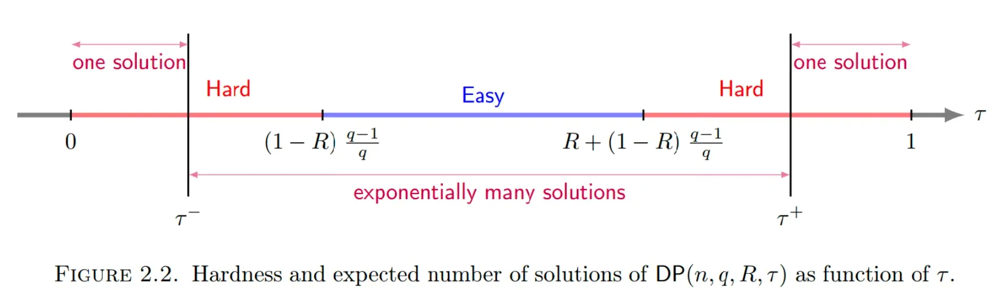

### McEliece 加密算法
- **核心思路**:
    1. 生成可纠正 $t$ 个错误的码及其生成矩阵 $\mathbf{G}$，作为私钥。
    2. 用其他可逆矩阵左右乘 $\mathbf{G}$ 进行扰乱，使其看似随机，得到公钥 $\mathbf{G}_{pub}$。
    3. 用 $\mathbf{G}_{pub}$ 加密消息并添加重量为 $t$ 的随机错误，得到密文。
    4. 仅掌握 $\mathbf{G}_{pub}$ 分解结构（即 $\mathbf{G}$）才可解密，解密等价于纠正 $t$ 个错误。

#### McEliece 加密算法的语义
- **密钥生成算法** $(PK,SK)\leftarrow \mathrm{Gen}(q, k, n, t)$
    1. 选取可纠正 $t$ 个错误的码的生成矩阵 $\mathbf{G}_{k \times n}$（码类型公开，如 Goppa 码，$F_q, n, k$ 公开，$\alpha_i$ 保密）
    2. 随机选取满秩矩阵 $\mathbf{S}_{k \times k}$
    3. 随机选取满秩置换矩阵 $\mathbf{P}_{n \times n}$
    4. 计算 $\mathbf{G}_{pub} = \mathbf{S} \cdot \mathbf{G} \cdot \mathbf{P}$
    5. 输出 $PK = (\mathbf{S}, \mathbf{P}, \mathbf{G})$，$SK = \mathbf{G}_{pub}$
- **加密算法** $\mathbf{c} \leftarrow \mathrm{Enc}(PK, \mathbf{m})$，消息空间为 $\mathbb{M}= F_q^k$。
    1. 生成重量为 $t$ 的随机向量 $\mathbf{e} \in F_q^n$
    2. 计算 $\mathbf{c} = \mathbf{G}_{pub}^\top \cdot \mathbf{m} + \mathbf{e}$
    3. 输出密文 $\mathbf{c}$，密文长度是消息长度的 $\frac{1}{R} = \frac{n}{k}$ 倍
- **解密算法** $\mathbf{m} \leftarrow \mathrm{Dec}(SK, \mathbf{c})$
    1. 计算 $\mathbf{c}' = \mathbf{c} \cdot \mathbf{P}^{-1}$。
    2. 用 $\mathbf{G}$ 对应码纠正 $t$ 个错误，得到 $\mathbf{m}'$。
    3. 计算 $\mathbf{m} = \mathbf{m}' \cdot \mathbf{S}^{-1}$。
    4. 输出明文 $\mathbf{m}$。

#### McEliece 安全性
- **码的选取是核心关键**：
    - 给定参数 $[n, k, d]_q$，码族需足够大以抵御枚举攻击。
    - 码的结构决定密钥尺寸：生成/校验矩阵通常较大；结构化码可缩小密钥，但可能引入攻击漏洞。
    - 编码效率高（矩阵乘法）。
    - 解密需高效译码算法。
- **攻击类型**:
    - 消息/译码攻击：从密文 $\mathbf{c}$ 恢复 $\mathbf{m}$（假设 $\mathbf{G}_{pub}$ 随机，采用信息集译码）。
    - 密钥攻击：从 $\mathbf{G}_{pub}$ 恢复 $\mathbf{G}$（利用码结构弱点，如Reed–Solomon码）。
    - Goppa 码：检验所有 Goppa 码与 $\mathbf{G}$ 生成码的等价性，复杂度 $O(mr2^{m(r-2)})$，安全。

#### McEliece 的 IND-CPA 安全性
- **原始 McEliece 不满足 IND-CPA 安全**：
    1. 敌手输出 $\mathbf{m}_0 \in F_{q^m}^k$、$\mathbf{m}_1 \in F_{q^m}^k$。
    2. 挑战者随机选 $b \in \{0,1\}$，返回 $\mathbf{c} = \mathbf{G}_{pub}^\top \mathbf{m} + \mathbf{e}$。
    3. 敌手计算 $\mathbf{c}' = \mathbf{c} - \mathbf{G}_{pub}^\top \mathbf{m}_0$，若 $\mathrm{wt}(\mathbf{c}')=t$ 输出 $b'=0$，否则输出 $b'=1$。
- **随机填充可实现 IND-CPA 安全**：从 $F_{q^m}^{k_1}$ 均匀选 $\mathbf{r}$，消息 $\mathbf{m} \in F_{q^m}^{k_2}$，满足 $k_1 + k_2 = k$。令 $\mathbf{m}' = \begin{pmatrix} \mathbf{r} \\ \mathbf{m} \end{pmatrix} \in F_{q^m}^k$，密文为：
    $$
    \mathbf{c} = \mathbf{G}_{pub}^\top \mathbf{m}' + \mathbf{e} = \mathbf{G}_{pub}^\top \begin{pmatrix} \mathbf{r} \\ \mathbf{m} \end{pmatrix} + \mathbf{e}
    $$

    在随机码有界最小距离译码困难、$\mathbf{G}_{pub}$ 与随机矩阵不可区分的假设下，填充版 McEliece 可证明 IND-CPA 安全。

### Niederreiter 密码体制
- **核心思路**：将信息编码为重量 $t$ 的错误向量，密文为消息的伴随式，可视为 McEliece 的对偶版本。

#### Niederreiter 密码体制的语义
- **密钥生成算法** $(PK,SK)\leftarrow \mathrm{Gen}(q, k, n, t)$
    1. 选取可纠正 $t$ 个错误的码的校验矩阵 $\mathbf{H}_{(n-k) \times n}$（码类型公开，如 Goppa 码，$F_q, n, k$ 公开，$\alpha_i$ 保密）
    2. 随机选取满秩矩阵 $\mathbf{S}_{(n-k) \times (n-k)}$
    3. 随机选取满秩置换矩阵 $\mathbf{P}_{n \times n}$
    4. 计算 $\mathbf{H}_{pub} = \mathbf{S} \cdot \mathbf{H} \cdot \mathbf{P}$
    5. 输出 $PK = \mathbf{H}_{pub}$，$SK = (\mathbf{S}, \mathbf{P}, \mathbf{H})$
- **加密算法** $\mathbf{c} \leftarrow \mathrm{Enc}(PK, \mathbf{m})$，消息空间为 $\mathbb{M} = \{\mathbf{m} \in F_q^l \mid l = \log_q \bigl( \binom{n}{t}(q-1)^t \bigr)\}$
    1. 将消息 $\mathbf{m}$ 编码为长度 $n$、重量 $t$ 的向量 $\mathbf{e}$
    2. 计算 $\mathbf{c} = \mathbf{H}_{pub} \cdot \mathbf{e}$
    3. 输出密文 $\mathbf{c}$，长度为 $n-k$
- **解密算法** $\mathbf{m} \leftarrow \mathrm{Dec}(SK, \mathbf{c})$
    1. 计算 $\mathbf{c}' = \mathbf{S}^{-1} \cdot \mathbf{c}$
    2. 对 $\mathbf{c}'$ 做伴随式译码，得到 $\mathbf{e}' = \mathbf{P} \cdot \mathbf{e}$
    3. 计算 $\mathbf{e}= \mathbf{P}^{-1} \cdot \mathbf{e}'$
    4. 将重量 $t$ 的向量 $\mathbf{e}$ 映射回消息 $\mathbf{m}$
    5. 输出明文 $\mathbf{m}$

#### McEliece与Niederreiter对比
| | McEliece | Niederreiter |
|:---:|:---:|:---:|
| 传输速率 | $\frac{k}{n}$  | 二元 Goppa 码：$\frac{\log_2 \binom{n}{t}}{n-k}$  |
| 消息长度 | $k$ | $\lfloor \log_q \bigl( \binom{n}{t}(q-1)^t \bigr) \rfloor$   |
| 密文长度 | $n$  | $n-k$ |
| 加密开销 | $\mathbf{c} = \mathbf{m} \cdot \mathbf{G}_{pub} + \mathbf{e}$：$\mathcal{O}(kn)$ | $\mathbf{c} = \mathbf{H}_{pub} \cdot \mathbf{e}^T$：$\mathcal{O}((n-k)n)$ |
| 解密开销 | 伴随式：$\mathcal{O}((n-k)n)$；矩阵求逆：$\mathcal{O}(n^3)$ | 矩阵求逆：$\mathcal{O}(n^3)$ |
| 密钥尺寸（系统/非系统） | $\text{size}(\mathbf{G}_{pub})=k(n-k)$；$\text{size}(\mathbf{G}_{pub})=kn$ | $\text{size}(\mathbf{H}_{pub})=k(n-k)$ |

#### 安全性结论
- McEliece 与 Niederreiter 安全性等价。
- 原始版本均不满足 IND-CPA 安全。

# 零知识证明
## 零知识证明的定义以及应用

### 零知识证明简介
- **零知识证明**（Zero Knowledge Proof, ZKP）：一种密码学两方协议，允许一个证明者 (Prover) 向一个验证者 (Verifier) 证明某个声明为真，而不泄露任何关于证明内容的额外信息。
- **语法定义**：
    - $x$：公开输入（statement / public input）
    - $w$：秘密输入（witness / secret input）
    - $R$：关系函数（relation function），输出 1 或 0
    - **证明目标**：“我知道 $w$ 使得 $R(x,w)=1$”
- **安全目标**：
    1. **完备性**（Completeness）：如果 Prover 和 Verifier 都诚实地遵循协议，那么 Verifier 最终会输出接受（$b=1$）。
    2. **可靠性/知识可靠性**（Soundness / Knowledge Soundness）：抵御恶意的 Prover。
        - **可靠性**（Soundness）：如果 Prover 使用了无效的秘密，那么 Verifier 能以极高的概率捕获并拒绝（$b=0$）。
        - **知识可靠性**（Knowledge Soundness）：如果 Verifier 接受了证明，那么 Prover 必定真正“知道”该 witness。形式化地，存在一个提取器（Extractor）可以利用 Prover 提取出 witness（允许比 Verifier 具有更高的计算能力）。
    3. **零知识性**（Zero Knowledge, ZK）：抵御恶意的 Verifier。
        - Verifier 除了确信声明为真外，学不到关于 Prover 秘密的任何额外信息。形式化地，零知识性通过证明存在一个模拟器（Simulator）来保证，该模拟器在不知道秘密的情况下也能生成与真实交互无法区分的证明转录 (transcript)。

### 非交互式零知识证明与 Fiat-Shamir 变换
#### 非交互式零知识证明（NIZK）
- **消除交互**：理想情况下，Prover 应该直接生成一个一次性的证明字符串 $\pi$。Verifier 收到后异步验证 $\pi$ 即可。这样的 $\pi$ 也可以被复用，并被潜在的多个验证者检验。
- **可信设置**的类型：
    1. 结构化参考字符串（Structured Reference String, SRS）：需要一个可信的第三方生成并分发 SRS，且该 SRS 可能包含一些秘密信息。
    2. 将哈希函数建模为随机预言机 (Random Oracle, RO)：不需要可信设置，但需要对哈希函数的安全性进行强假设。
    3. 或两者兼有。

#### Fiat-Shamir 变换 [FS87]
- **NIZK 构造范式**：通过局部哈希生成挑战，将交互式协议转为非交互式。
    - **Step 1**：构造一个“公开抛币（public-coin）”的交互式协议。
        - Verifier 不需要保密状态。
        - 满足诚实验证者零知识（Honest-Verifier ZK）。
    - **Step 2**：非交互式 Prover 和 Verifier 通过对截至目前的部分转录进行局部哈希来获得挑战（challenge）。
- **额外应用**（Bonus）：如果将消息 $m$ 也加入哈希函数的输入中，基于 FS 变换的 NIZK 可以直接转化为数字签名。
    - 代表算法：Schnorr / EdDSA, CRYSTALS-Dilithium, PLONK, Bulletproofs 等。
    - 很多现代 SNARKs 都是通过将多项式交互式预言机证明（Polynomial IOPs）结合 Fiat-Shamir 变换转化为 NIZK 的。

### 零知识证明的分类与评价指标
- **分类**
    - **通用零知识证明**（General-Purpose ZKP）：
        - **特点**：支持任意 NP 关系 $R$，关系通常使用算术电路（Arithmetic circuit）描述。
            $$
            R_C=\{(x,w): C(x,w)=1\}
            $$
            - 算术电路是有向无环图，内部节点为加法或乘法操作，定义了一个多元多项式及其求值方法。
        - **优点**：可以证明任意程序的正确执行；适合可验证计算和外包计算。
        - **缺点**：对于某些非线性计算（如椭圆曲线算术、比较、表查找等），电路规模会变得非常复杂。
    - **专用零知识证明 (Specialized ZKP)**：
        - **特点**：为特定类型的 NP 关系设计。
            $$
            \begin{aligned}
            R_{DL} &= \{(X, w): X = w \cdot G\} \\
            R_{SIS} &= \{(x, w): x = A w \mod q, \|w\| \leq \beta\} \\
            R_{Lookup} &= \{(x, w): w \text{ is a subset of } x\}
            \end{aligned}
            $$
        - **优点**：对于指定的特殊关系，证明和验证极为高效。适用于正确加密证明、分布式密钥生成、数字签名等。
        - **缺点**：若要支持复杂的声明，需要与通用 ZKP 进行小心谨慎的集成。
- **评价指标**：
    1. **证明大小**（Proof Size）：更小的证明节约存储和通信带宽。例如 Groth16 仅需 3 个群元素。
    2. **假设**（Assumptions）：为了最小化信任假设，应尽量避免使用 SRS；更好的替代方案是仅信任哈希函数（透明设置 Transparent setup，如 STARK, Bulletproofs）或使用可更新的 SRS（Updatable SRS）。
    3. **设置、证明与验证成本**：
        - **全局设置**（Universal Setup）：一次设置后，其输出的 SRS 可用于所有特定规模内的电路。
        - Verifier 耗时最好在电路规模 $|C|$ 上是亚线性的。
        - Prover 耗时最好在非线性门的数量上是线性的。
    4. **可扩展性**（Scalability）：高效证明庞大的 statement。
        - 证明聚合 (Proof Aggregation)
        - 增量可验证计算 (IVC / 递归 SNARK，如 Halo2, Nova)

### 实际应用场景
1. **匿名凭证**（Anonymous Credentials）：用户证明自己拥有发行方 (Issuer) 颁发的合法属性，但不泄露具体身份（如仅证明“年龄 $\geq 21$ 岁”）。
2. **可验证与外包计算**（Verifiable and Outsourced Computation）：确保云服务器正确无误地执行了计算，通过 ZKP 证明合规性。
3. **高效后量子数字签名**：例如 Dilithium，是一个基于后量子 LWE/SIS 困难问题的 NIZK 协议，具有与 DLOG 上的 Schnorr 签名相似的结构。
4. **区块链 Rollup 与隐私交易**：
    - **隐私**：加密隐藏交易细节，利用 ZKP 证明交易的正确性与合规性。
    - **效率**（L2 Rollup）：将大量交易打包在一起，仅提交一个聚合的 ZKP 证明到 L1，无需逐一校验。

## NARK 与 (zk)SNARK 简介
### NARK（Non-interactive ARgument of Knowledge）
- **公共算术电路** $\mathrm{C}(\mathbf{x}, \mathbf{w}) \to \mathbb{F}$
- 包含预处理过程的 NARK 由三个算法 $(S, P, V)$ 组成：
    - **预处理**（Setup）：$\mathrm{S}(C) \to (pp, vp)$，生成给 Prover 和 Verifier 的公开参数。
    - **证明**（Prover）：$\mathrm{P}(pp, \mathbf{x}, \mathbf{w}) \to$ 证明 $\pi$
    - **验证**（Verifier）：$\mathrm{V}(vp, \mathbf{x}, \pi) \to$ 接受或拒绝
    - **要求**：
        - 完备性（Completeness）
        - 自适应知识可靠性（Adaptively knowledge sound）
        - 可选具备零知识性（Zero knowledge）

### SNARK（Succinct NARK）
- SNARK 是一种强调简洁性（Succinctness）的 NARK：
    - **极短的证明**：$\text{len}(\pi)$ 在秘密输入长度 $|w|$ 上是亚线性的 (sublinear)。对于强简洁性，要求 $\text{len}(\pi) = O_\lambda(\log|C|)$。
    - **极快的验证**：$\text{time}(V)$ 在电路大小 $|C|$ 上是亚线性的。对于强简洁性，验证时间为 $O_\lambda(|\mathbf{x}|, \log|C|)$，这意味着 Verifier 甚至没有时间去完整读取整个电路 $C$。
    - **zk-SNARK** = 具备零知识性的 SNARK。
- 近期进展代表：Groth'16（依赖可信设置）、Plonk、Bulletproofs、STARK（透明设置且抗量子）

## SNARK 的构造

现代高效 SNARK （如 STARK）的通用构造框架为：
$$
\text{多项式承诺方案（PCS）} + \text{多项式交互式预言机证明（PIOP）} \xrightarrow{\text{Fiat-Shamir}} \text{SNARK}
$$

### 交互式预言机证明（IOP & PIOP）
- **IOP（Interactive Oracle Proof）**：在协议交互中，Prover 发送的多维字符串过大，无法全部传给 Verifier。因此，Prover 发送字符串的“预言机”，Verifier 随后只通过抛币产生短随机挑战，并**仅查询预言机的少量对应单元格**来决定接受与否。
    - 要求：完备性、可靠性，并满足**简洁性**（即 $\mathrm{V}$ 查询极少，验证时间亚线性）。
- **PIOP（Polynomial IOP）**：一种特殊 IOP。在每一轮中，Prover 响应该有限域上多项式 $f_i$ 的预言机；Verifier 可以在其选择的特定点上查询 $f_i$ 的少量求值。

### 多项式承诺方案（Polynomial Commitment Scheme, PCS）
- PCS 允许 Prover 对一个多项式 $f(X)$ 作出承诺，并在随后揭示其在某一点的求值。包含两个阶段：
    1. **承诺**（Commit）：首先承诺一个 $\deg(f) \leq d$ 的多项式 $f$，生成很短的 $\mathrm{com}_f$。
    2. **求值证明**（Eval/Open）：对于公开点 $u, v \in \mathbb{F}_p$，Prover 证明该被承诺的多项式满足 $f(u) = v$ 且 $\deg(f) \leq d$。生成证明 $\pi$。
        - **要求**：求值证明 $\pi$ 的大小和验证时间必须是 $O_\lambda(\log d)$。朴素的系数哈希法由于生成长度线性的证明而无法作为真正的 PCS。

#### Merkle 树承诺
- 使用哈希函数对长向量/字符串进行树状承诺。叶子节点为数据，逐层向上哈希直至根节点（Root）。
- 揭示某个数据点时，只需提供从该叶子到根节点的身份验证路径（Authentication path, 包含同层兄弟节点的哈希值），大小对数为 $O(\log n)$。

#### 基于 FRI 的多项式承诺方案（FRI-based PCS）
- **核心思想**：低次证明 + 单点求值。
    - 通过 Merkle 树对低次多项式 $g(x)$ 的求值表进行承诺。
    - 如果 $\deg(g) \leq k$ 且 $g(r)=v$，那么 $f(x) = \frac{g(x)-v}{x-r}$ 且 $\deg(f) \leq k-1$。
    - 则由 $g$ 的承诺可以衍生出 $f$ 的承诺，并通过单点求值证明 $f$ 的低次性。
- **FRI（Fast Reed-Solomon IOP of Proximity）**：一种针对线性码的交互式邻近度预言机证明。
    - **折叠操作**：给定承诺的 $f$，随机挑选 $\alpha$，计算 $\mathrm{Fold}(f, \alpha) = f_0(x^2) + \alpha f_1(x^2)$。此操作将多项式的度数和评估域规模均折半。
    - **递归递推**：通过多轮 Fold 操作，最后化简至一个常数。Verifier 在每一轮只需进行极少量的点校验（一致性检查）。
- **线性码的邻近度间隙**（Proximity gap for linear codes）：
    - FRI 每轮的可靠性依赖于编码理论。如果 $f$ 距离 RS 码字很远（$\delta$-far），那么在极高概率下，折叠后的 $\mathrm{Fold}(f, \alpha)$ 依然距离低次多项式很远。
    - 相关理论边界：Johnson bound 等。

### SNARK 构造范式
- FRI $\implies$ RS-IOPP $\implies$ PCS
- PIOP（将多项式预言机替换为多项式承诺与评估证明） $\implies$ 交互式证明 (IP)
- 交互式证明 $\xrightarrow{\text{Fiat-Shamir 变换}}$ 适用于通用电路的 (zk)SNARK