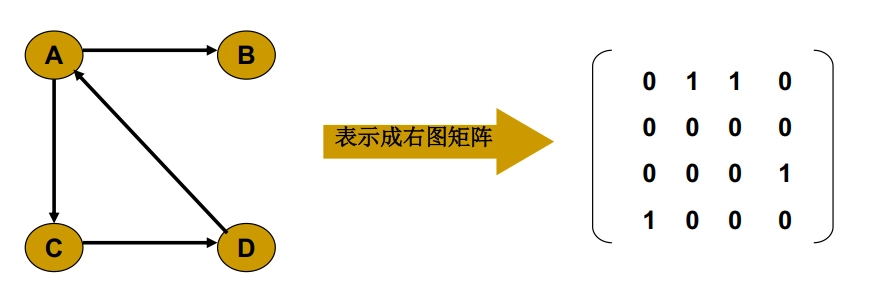
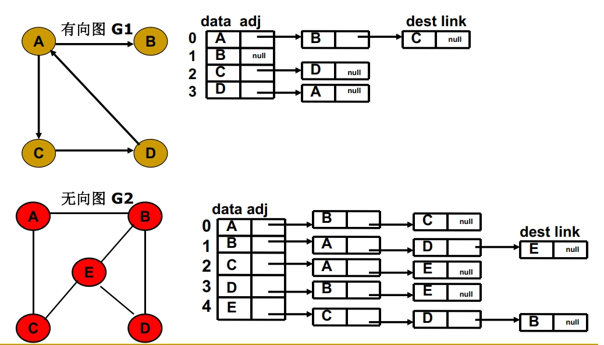
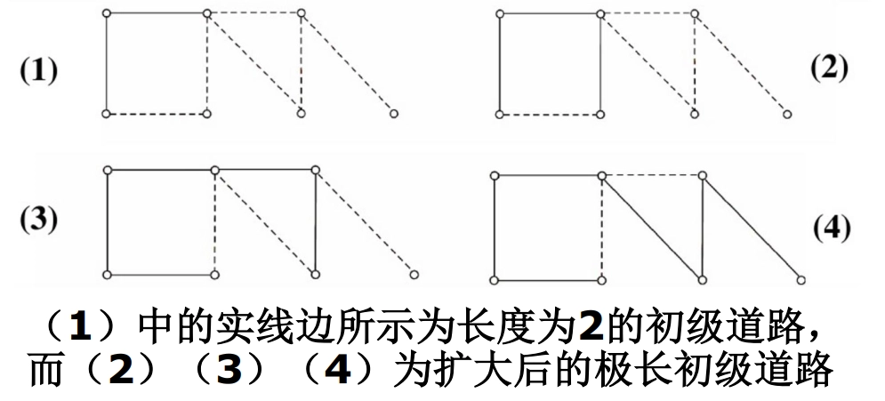
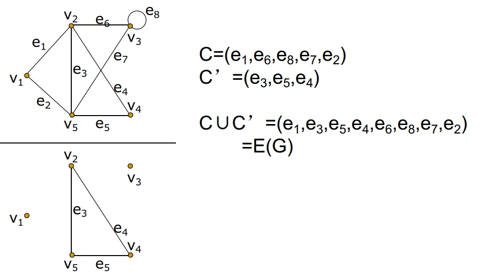
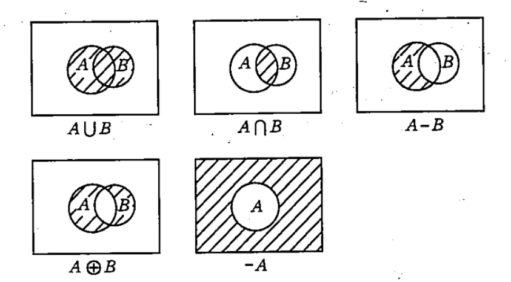
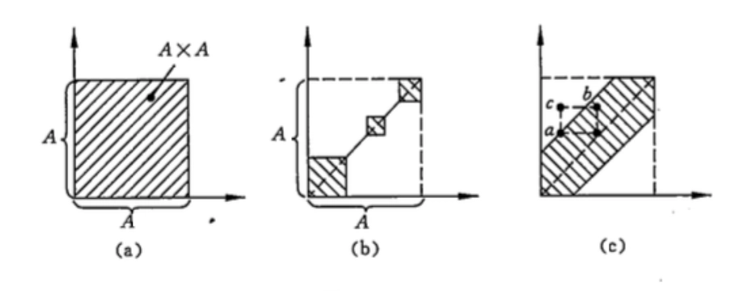
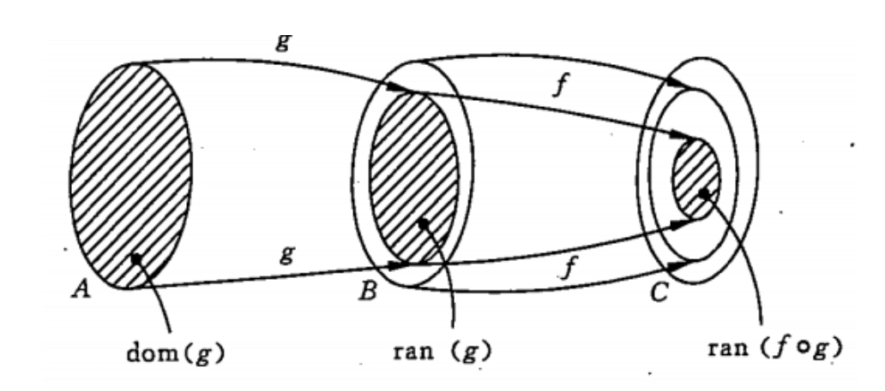

> 本笔记基于上海交通大学 *马汝辉老师* 2024-2025 学年秋季学期教学内容进行整理。

# 图论
## 第一章 基本概念
### 图的概念
- **图的定义**：
    - 二元组 $(V(G),E(G))$ 称为图。
        - 其中 $V(G)$ 是非空集合，称为**结点集**
        - $E(G)$ 是 $V(G)$ 诸结点之间**边的集合**
        - 常用 $G=(V,E)$ 表示图。
    - **边**：用 $e_{k}=\left(v_{i},v_{j}\right)$ 表示。这时我们说 $v_{i}$ 与 $v_{j}$ 是相邻结点；$e_{k}$ 分别与 $v_{i}$，$v_{j}$ 相关联。
- **有限图与无限图**：
    - 有限图： $V$ 和 $E$ 都是有限集。
- **有向图与无向图**：
    - 有向图：$E$ 中的每条边都是有方向的，称为**有向边**（或弧）。
        - 如果 $e_{k}$ 是有向边，称 $v_{i}$ 是 $e_{k}$ 的始点，$v_{j}$ 是 $e_{k}$ 的终点 ；并称 $v_{i}$ 是 $v_{j}$ 的**直接前趋**，$v_{j}$ 是 $v_{i}$ 的**直接后继**。
    - 无向图：$E$ 中的每条边没有方向，称为**无向边**。
        - 如果 $e_{k}$ 是无向边，则称 $v_{i}$，$v_{j}$ 是 $e_{k}$ 的两个**端点**。
    - 混合图：$E$ 中既有方向的边，也有没有方向的边。

### 度
- $G=(V,E)$ 的某结点 $v$ 所关联的边数称为该结点的度，用 $d(v)$ 表示。如果 $v$ 带有自环，则自环对 $d(v)$ 的贡献为 $2$。
- 有向图中由于各边都是有向边，因此每个结点 $v$ 还有其**正度** $\left(d^{+}(v)\right)$ 和**负度** $\left(d^{-}(v)\right)$。
    - $d^{+}(v)$ 的值是以 $v$ 为始点的边的数目
    - $d^{-}(v)$ 是以 $v$ 为终点的边的数目
    - 显然有 $d^{+}(v)+d^{-}(v)=d(v)$

## 图的类别
- **简单图**：不含重边（任意两结点间最多只有一条边）和自环的无向图或有向图称为简单图
- **空图**：没有任何边的简单图叫空图，用 $N_{n}$ 表示
- **平凡图**：只含一个结点的空图称为平凡图
- **多重图**：只与一个结点相关联的边称为**自环**，在同一对结点之间可以存在多条边，称之为**重边**。含有重边的图叫多重图。
- **完全图**：任何两结点间都有边的简单图称为完全图，用 $K_{n}$ 表示。
    - $K_{n}$ 中每个结点的度都是 $n-1$。
    - $K_{n}$ 的边数是 $\frac{1}{2} n(n-1)$
- **完全有向图**：一个简单有向图，其中每一对不同的顶点都只有一对边相连，称为完全有向图
- **k-正则图**：每个结点的度都相同的图，若其度均为 $k$，则称为 $k$-正则图。完全图是 $(n-1)$-正则图
- **赋权图**：如果图 $G=(V,E)$ 的每条边 $e_{k}=\left(v_{i},v_{j}\right)$ 都赋以一个实数 $w_{k}$ 作为该边的权，则称 $G$ 是赋权图。
    - 特别地，如果这些权都是正实数，就称 $G$ 是**正权图**。

- **子图**：给定 $G=(V,E)$，如果存在另一个图 $G^{\prime}=\left(V^{\prime},E^{\prime}\right)$，满足 $V^{\prime} \subseteq V$，$E^{\prime} \subseteq E$，则称 $G^{\prime}$ 是 $G$ 的一个**子图**。
    - **支撑子图/生成子图**：如果 $V^{\prime}=V$，就称 $G^{\prime}$ 是 $G$ 的支撑子图 或生成子图 （只能删除边，结点不变）
    - **导出子图**：如果 $V^{\prime} \subseteq V$，且 $E^{\prime}$ 包含了 $G$ 在结点子集 $V^{\prime}$ 之间的所有边，则称 $G^{\prime}$ 是 $G$ 的导出子图。（删除结点及其关联的边）
    - **平凡子图**：如果 $V^{\prime}=V$，$E^{\prime}=E$ 或者 $E^{\prime}=\emptyset$，则称为平凡子图。

### 图的性质
- **握手定理** ：设 $G=(V,E)$ 有 $n$ 个结点，$m$ 条边，则
    $$ \sum_{v \in V(G)} d(v)=2 m$$
- $G$ 中度为奇数的结点必为偶数个
- 有向图 $G$ 中正度之和等于负度之和。
- 非空简单无向图中一定存在度相同的结点。

### 图的运算
- 给定两个图 $G_{1}=\left(V_{1},E_{1}\right)$，$G_{2}=\left(V_{2},E_{2}\right)$。
    - $G_{1}$ 和 $G_{2}$ 的**并**：$G_{1} \cup G_{2}=(V,E)$
        - 其中 $V=V_{1} \cup V_{2}$，$E=E_{1} \cup E_{2}$
    - $G_{1}$ 和 $G_{2}$ 的**交**：$G_{1} \cap G_{2}=(V,E)$
        - 其中 $V=V_{1} \cap V_{2}$，$E=E_{1} \cap E_{2}$
    - $G_{1}$ 和 $G_{2}$ 的**对称差**：$G_{1} \oplus G_{2}= (V,E)$
        - 其中 $V=V_{1} \cup V_{2}$，$E=E_{1} \oplus E_{2}$
- 在 $G$ 中删去一个子图 $H$，指删掉 $H$ 中的各条边，记作 $G-H$
    - 特别地，对于简单图 $G$，称 $K_{n}-G$ 为 $G$ 的**补图**，记作 $\bar{G}$。
- 从 $G$ 中删去某个结点 $v$ 及其关联的边所得的图记作 $G-v$
    - $G-v$ 是 $G$ 的导出子图
- 从 $G$ 中删去某特定的边 $e = (u, v)$ 所得的图记作 $G-e$
    - $G-e$ 是 $G$ 的支撑子图
- 在 $G$ 中增加某条边 $e_{i j}$，可记作 $G+e_{i j}$

### 图的邻点集
- **邻点集**：如果 $G$ 是无向图，则 $\Gamma(v)={u \mid (v,u) \in E}$ 称为 $v$ 的邻点集
    - 设 $v$ 是有向图 $G$ 的一个结点，则
        - $$ \Gamma^{+}(v)=\{u \mid(v,u) \in E\}$$ 称为 $v$ 的**直接后继集** 或**外邻集**
        - $$ \Gamma^{-}(v)=\{u \mid(u,v) \in E\}$$ 称为 $v$ 的**直接前趋集** 或**内邻集**

### 图的同构
- **同构图**：两个图 $G_{1}=\left(V_{1},E_{1}\right)$，$G_{2}=\left(V_{2},E_{2}\right)$，如果 $V_{1}$ 和 $V_{2}$ 存在双射函数 $\mathrm{f}$，且 $(u,v) \in E_{1}$，当且仅当 $(f(u),f(v)) \in E_{2}$ 时，并且这两条边的重数相同，称 $G_{1}$ 和 $G_{2}$ **同构**，记作： $\boldsymbol{G}_{\mathbf{1}} \cong \boldsymbol{G}_{\mathbf{2}}$
- $G_{1} \cong G_{2}$ 的**必要条件** ：
    - $\left|V\left(G_{1}\right)\right|=\left|V\left(G_{2}\right)\right|$，$\left|E\left(G_{1}\right)\right|=\left|E\left(G_{2}\right)\right|$
    - $G_{1}$ 和 $G_{2}$ 结点度的非增序列相同
    - 存在同构的导出子图

### 图的代数表示
#### 邻接矩阵

- 邻接矩阵表示了结点之间的邻接关系。
- 有向图的邻接矩阵 $\boldsymbol{A}$ 是一个 $n$ 阶方阵，其元素为 
    $$
    a_{i j}=\left\{\begin{aligned}
    1,&\quad \left(v_{i},v_{j}\right) \in E \\
    0,&\quad otherwise
    \end{aligned}\right.
    $$
- 邻接矩阵 $\boldsymbol{A}$ 第 $i$ 行非零元的数目恰是 $v_i$ 的正度，第 $j$ 列非零元的数目是 $v_j$ 的负度。
- 邻接矩阵**可以表示自环，但无法表示重边**。
- 无向图的邻接矩阵，是一个对称矩阵

#### 权矩阵

- 赋权图常用权矩阵 $\boldsymbol{A}$ 进行表示。其元素
    $$
    a_{i j}= \left\{\begin{aligned}
    w_{i j},&\quad \left(v_{i},v_{j}\right) \in E \\
    0,&\quad otherwise
    \end{aligned}\right.
    $$
- 权矩阵实际即为带权值的邻接矩阵
- 权矩阵**可以表示自环，但无法表示重边**。
- 无向图的权矩阵，是一个对称矩阵

#### 关联矩阵

- 关联矩阵表示结点与边之间的关联关系。
- 有向图 $\boldsymbol{G}$ 的关联矩阵 $\boldsymbol{B}$ 是 $n \times m$ 的矩阵，当给定结点和边的编号之后，其元素
    $$
    b_{i j}=\left\{\begin{aligned}
    1,&\quad e_{j}=\left(v_{i},v_{k}\right) \in E \\
    -1,&\quad e_{j}=\left(v_{k},v_{i}\right) \in E \\
    0, &\quad otherwise
    \end{aligned}\right.
    $$
- 每列两个非零元：-1，1
- 第 $i$ 行非零元的数目恰是结点 $v_{i}$ 的度，其中 $1$ 元的数目是 $d^{+}\left(v_{i}\right)$，$-1$ 元的数目是 $d^{-}\left(v_{i}\right)$。
- 类似地，无向图也有其关联矩阵 $\boldsymbol{B}$，但其中不含 $-1$ 元素。
    $$
    b_{i j}=\left\{\begin{aligned}
    1,&\quad e_{j}=\left(v_{i},v_{k}\right) \in E \\
    0, &\quad otherwise
    \end{aligned}\right.
    $$
- 关联矩阵**可以表示重边，但无法表示自环**。
- 如果可以用邻接矩阵/关联矩阵表示某个图 $G$，则表示是**唯一**的。

#### 邻接表

- 邻接表是图的另一种表示方法。它是一个结点集 $V$ 的数组，每个结点 $v_{i}$ 都有一个链表，链表中存储与 $v_{i}$ 相邻的结点。
    - 对于有向图，链表中存储的是 $v_{i}$ 的直接后继集（外邻集）；
    - 对于无向图，链表中存储的是 $v_{i}$ 的邻点集。
- 表结点的结构：
    - 邻接点的编号
    - 边权值（如果是赋权图）
    - 指向下一个邻接点的指针
- 特点：
    - 便于增加和删除边
    - **可以表示重边和自环**
    - **可以唯一表示任意一个图**
    - 所需存储空间较小

## 第二章 道路与回路
### 道路与回路
- **有向图**
    - **道路与回路的定义**：
        - **有向道路**：有向图 $G=(V,E)$ 中，若边序列 $P=\left(e_{i 1},e_{i 2},\cdots,e_{i q}\right)$，其中 $e_{i k}=\left(v_{l},v_{j}\right)$ 满足 $v_{l}$ 是 $e_{i k-1}$ 的终点，$v_{j}$ 是 $e_{i k+1}$ 的始点，就称 $P$ 是 $G$ 的一条有向道路。
        - **有向回路**：如果 $e_{i q}$ 的终点也是 $e_{i 1}$ 的始点，则称 $P$ 是 $G$ 的一条有向回路。
    - 简单/初级有向道路/回路：
        - **简单有向道路和简单有向回路**：如果 $P$ 中的边没有重复出现，则分别称为简单有向道路和简单有向回路。
        - **初级有向道路和初级有向回路**：如果在 $P$ 中结点也不重复出现，又分别称它们是初级有向道路和初级有向回路，简称为路和回路。
        - 显然，初级有向道路（回路）一定是简单有向道路（回路）。
    - **长度**：边的数目 $q$ 称为道路（回路）的长度。

- **无向图**
    - **道路与回路的定义**：
        - **无向道路**：无向图 $G=(V,E)$ 中，若点边交替序列 $P=\left(v_{i 1},e_{i 1},v_{i 2},e_{i 2},\cdots,e_{i q-1},v_{i q}\right)$ 满足 $v_{i k},v_{i k+1}$ 是 $e_{i k}$ 的两个端点，则称 $P$ 是 $G$ 中的一条**链**，或**道路**。
        - **无向回路**：如果 $v_{i q}=v_{i 1}$，则称 $P$ 是 $G$ 中的一个**圈**，或**回路**。
    - 简单/初级无向道路/回路：
        - **简单道路和简单回路**：如果 $P$ 中没有重复出现的边，称之为简单道路或简单回路
        - **初级道路和初级回路**：若其中结点也不重复，又称之为初级道路或初级回路
    - **长度**：边的数目 $q$ 称为道路（回路）的长度。
- **两点距离**：若 $G$ 的任意两结点 $u,v$ 之间连通，则称 $u,v$ 之间的最短道路为**短程线**，该短程线的长度称为 $u,v$ 之间的**距离**，记作 $d(u,v)$。若 $u,v$ 之间不连通，则 $d(u,v)=\infty$

### 图的连通性
- **连通图与非连通图**：
    - 无向图：设 $G$ 是无向图，若 $G$ 的任意两结点之间都存在道路，就称 $G$ 是连通图，否则称为非连通图
    - 有向图：如果 $G$ 是有向图，不考虑其边的方向，即视为无向图，若它是连通的，则称 $G$ 是连通图

- **极大连通子图/连通支**：若连通子图 $H$ 不是 $G$ 的任何连通子图的真子图，则称 $H$ 是 $G$ 的极大连通子图或称连通支
    - 显然 $G$ 的每个连通支都是它的导出子图
    - 任何非连通图都是 $2$ 个以上连通支的并集
    - 设 $G$ 是简单无向图，当 $m>\frac{1}{2}(n−1)(n−2)$ 时 $G$ 是连通图。
    - $G=(V, E)$ 是连通图，则 $m\ge n-1$
- **强连通**：在有向图 $G$ 中，如果两个顶点 $u$，$v$ 间有一条从 $u$ 到 $v$ 的有向路径，同时还有一条从 $v$ 到 $u$ 的有向路径，则称两个顶点强连通。
    - **强连通图**：如果有向图 $G$ 的每两个顶点都强连通，称 $G$ 是一个强连通图。
    - **强连通分量**：有向非强连通图的极大强连通子图，称为强连通分量。

### 弦
- **定义**：设 $C$ 是简单图 $G$ 中含结点数大于 $3$ 的一个初级回路，如果结点 $v_{i}$ 和 $v_{j}$ 在 $\mathrm{C}$ 中不相邻，而边 $\left(v_{i},v_{j}\right) \in \mathrm{E}(\mathrm{G})$，则称 $\left(v_{i},v_{j}\right)$ 是 $\mathrm{C}$ 的一条**弦**。
- **性质**：
    - 若对于每一个 $v_{k} \in \mathrm{V}(\mathrm{G})$，都有 $\mathrm{d}\left(v_{k}\right) \geq 3$，则 $\mathrm{G}$ 中必含带弦的回路。
    - 在简单图中，若 $n\ge 4$ 且 $m\ge 2n-3$，则 $G$ 中含有带弦的回路。

### 极长初级道路
- **定义**：在简单图 $\mathrm{G}=(\mathrm{V},\mathrm{E})$ 中，$\mathrm{E} \neq \emptyset$，设 $P=\left(v_{0},v_{1},\cdots,v_{l}\right)$ 为 $\mathrm{G}$ 中一条初级道路，若路径的始点和终点两个端点 $v_{0}$ 和 $v_{l}$ 不与初级道路本身结点集以外的任何结点相邻，这样的初级道路称为**极长初级道路**。
- **性质**：
    - 有向图中，初级道路始点的直接前驱集（内邻集），终点的直接后继集（外邻集），都在初级道路本身上。
    - **扩大初级道路法**：任何一条初级道路，如果不是极长初级道路，则至少有一个端点与初级道路本身以外的结点相邻，则将该结点及其相关联的边扩到新的初级道路中来，得到更新的初级道路。继续上述过程，直到变成极长初级道路为止。
        - 由一条道路扩大的极长道路不一定唯一
        - 极长初级道路不一定是图中的最长初级道路

### 二分图
- **定义**：$\mathrm{G}=(\mathrm{V},\mathrm{E})$ 是无向图，如果 $\mathrm{V}(\mathrm{G})$ 可以划分为子集 $X$ 和 $Y$，使得所有 $e=(u,v) \in E(G)$，$u$ 和 $v$ 分属于 $\mathrm{X}$ 和 $\mathrm{Y}$，则称 $\mathrm{G}$ 为二分图。
- **性质**：
    - 二分图的子集 $X$，$Y$ 可能不唯一。
    - 如果二分图 $G$ 中存在回路，则它们是由偶数条边组成的。
    - 含 $K_{3}$ 子图的图一定不是二分图
    - $K_{n}$ 不是二分图（$n \geq 3$）
    - 如果二分图 $G$ 中存在回路，则它们都是由偶数条边组成的。
- **完全二分图/完全偶图**：$\mathrm{G}=(\mathrm{V},\mathrm{E})$ 是二分图，$\mathrm{V}(\mathrm{G})$ 划分为子集 $X$ 和 $Y$，$X$ 中任一结点与 $Y$ 中每一个结点有且只有唯一一条边相连，则称 $G$ 为完全二分图（完全偶图），记作 $\boldsymbol{K}_{m,n}$，$m=|X|$，$n=|Y|$。

### 补图
- **定义**： 设 $G=(V,E)$ 是一个简单图，则 $G$ 的补图 $\bar{G}$ 是一个简单图，其结点集 $V(\bar{G})=V(G)=V$，边集为 $E(\bar{G})= \left\{\left(v_{i},v_{j}\right) \mid v_{i},v_{j} \in V, \left(v_{i},v_{j}\right) \notin E\right\}$。

### 割点和割边
- **割点**：$G$ 图中，一结点 $u$，$G$ 减去 $u$ 后，图的连通分支数上升，则称 $u$ 为图 $G$ 的割点。  
- **割边**：$G$ 图中，一边 $e$，$G$ 减去 $e$ 后，图的连通分支数上升，则称 $e$ 为图 $G$ 的割边/桥。

### 欧拉道路与回路
#### 定义与性质
- **定义**：
    - **欧拉回路/道路**：无向连通图 $G=(V,E)$ 中的一条经过所有边的简单回路（道路）称为 $G$ 的欧拉回路（道路）。
    - **欧拉图**：具有欧拉回路的图称为欧拉图。
- **性质**：
    - 无向连通图 $G$ 存在欧拉回路的充要条件是 $G$ 中各结点的度都是偶数。
    - 若无向连通图 $G$ 中只有 $2$ 个度为奇的结点，则 $G$ 存在欧拉道路。
    - 若有向连通图 $G$ 中各结点的正、负度相等，则 $G$ 存在有向欧拉回路。
    - $K_{n, m}$ 中含有欧拉道路当且仅当 $n, m$ 均为偶数。
    - 设连通图 $G=(V,E)$ 有 $k$ 个度为奇数的结点，则 $E(G)$ 可以划分为 $k/2$ 条简单道路。

#### 判定（仅针对无向图）
- 如果图 $G$ 每个结点的度都是偶数，则 $G$ 存在欧拉回路。
- 如果图 $G$ 有且仅有两个结点的度为奇数，则 $G$ 存在欧拉道路，且这两个结点是欧拉道路的起点和终点。
- 其他情况下，$G$ 不存在欧拉道路或回路，但是奇数点数为 $k$ 的图 $G$ 中，存在 $k/2$ 条简单道路。

### 哈密顿道路与回路
#### 定义与性质
- **定义**：
    - **哈密顿回路/道路**：无向图的一条过全部结点的初级回路（道路）称为 $G$ 的哈密顿回路（道路），简记为 $H$ 回路（道路）。
    - **哈密顿图**：具有哈密顿回路的图也称为哈密顿图。
- **性质**：
    - 哈密顿通路是经过所有结点中长度最短的通路
    - 哈密顿回路是经过所有结点中长度最短的回路

#### 判定
- 哈密顿回路是初级回路，是特殊的简单回路，所以如果 $G$ 中含有重边或自环，删去它们后得到的简单图 $G'$，那么 $G$ 和 $G'$ 关于 $H$ 回路（道路）的存在性是等价的。因此，**判定 $H$ 回路存在性问题一般是针对简单图的**。

#### 充分性定理
- **引理**：设 $P=(v_1, v_2, \cdots, v_l)$ 是图 $G$ 中一条极长的初级道路(即 $v_1$ 和 $v_l$ 的邻点都在 $P$ 上)而且 $d(v_1)+d(v_l)≥l$，则 $G$ 中一定存在经过结点 $v_1, v_2, \cdots, v_l$ 的初级回路。
    1. **充分性定理 1**：如果简单图 $G$ 的任意两结点 $v_{i},v_{j}$ 之间恒有 $d\left(v_{i}\right)+d\left(v_{j}\right) \geqslant n-1$，则 $G$ 中存在哈密顿道路。
    2. **充分性定理 1 推论**：若简单图 $G$ 的任意两结点 $v_{i}$ 和 $v_{j}$ 之间恒有 $d\left(v_{i}\right)+d\left(v_{j}\right) \geqslant n$，则 $G$ 中存在哈密顿回路。
    3. **充分性定理 1 推论**：若简单图 $G$ 每个结点的度都大于等于 $\frac{n}{2}$，则 $G$ 有 $H$ 回路。
- **引理**：若 $v_{i}$ 和 $v_{j}$ 是简单图 $G$ 的不相邻结点，且满足 $d(v_{i})+d(v_{j})≥n$，则令 $G’ =G+(v_{i}, v_{j})$。对 $G’$ 重复上述过程，直至不再有这样的结点对为止。最终得到的图为 $G$ 的闭合图，记作 $C(G)$。则简单图 $G$ 的闭合图 $C(G)$ 是唯一的
    1. **充分性定理 2**：设 $G$ 是简单图，$v_{i},v_{j}$ 是不相邻结点，且满足 $d\left(v_{i}\right)+d\left(v_{j}\right) \geqslant n_{\circ}$ 则 $G$ 存在 $H$ 回路的充要条件是 $G+\left(v_{i},v_{j}\right)$ 有 $H$ 回路。
    2. **充要条件**：简单图 $G$ 存在哈密顿回路的充要条件是其闭合图存在哈密顿回路。
    3. **充要条件推论**：设 $G(n \geqslant 3)$ 是简单图 $K_{n}$，若 $C(G)$ 是完全图，则 $G$ 有 $H$ 回路。

#### 必要性定理
- **必要性定理 1**：如无向图 $G=(V,E)$ 是 $H$ 图，$V_{1}$ 是 $V$ 的任意非空子集，则 $p\left(G-V_{1}\right) \leq\left|V_{1}\right|$，其中 $p\left(G-V_{1}\right)$ 是从 $\mathrm{G}$ 中删除 $V_{1}$ 后的连通支的数目。
- **必要性定理 2**：如无向图 $G=(V,E)$ 存在 $\mathrm{H}$ 道路，$V_{1}$ 是 $V$ 的任意非空子集，则 $p\left(G-V_{1}\right) \leq\left|V_{1}\right|+1$。
- **必要性定理推论**：
    - 有割点的图一定不是 $H$ 图
    - 如无向图 $G=(V,E)$ 是二分图，
        - 两边结点数不相同，则 $G$ 不存在 $H$ 回路
        - 两边结点数不相同也不相差 $1$，则 $G$ 不存在 $H$ 道路
    - $K_{n, m}$ 中含有哈密顿道路当且仅当 $|n-m| \leq 1$
    - $K_{n, m}$ 中含有哈密顿回路当且仅当 $n=m$

## 第三章 树
### 树的有关定义
- **树与林**：
    - **林**：给定一个图 $G=(V,E)$，如果它不含任何回路，我们就叫它是林。
    - **树**：如果 $G$ 又是连通的，即这个林只有一个连通支，就称它是树。
        - 一个不含任何回路的连通图称为**树**，用 $T$ 表示。
        - $T$ 中的边称为**树枝**，度为 $1$ 的结点称为**树叶**。
- **割边**：树的每条边都不会属于任何回路。这样的边叫割边。
    - 设 $e$ 是 $G$ 的一条边，若 $G^{\prime}=G-e$ 比 $G$ 的连通支数增加，则称 $e$ 是 $G$ 的一条**割边**。
    - $e=(u,v)$ 是**割边**，当且仅当 $e$ 不属于 $G$ 的任何回路。
- **性质**：设 $T$ 是结点数为 $n \geqslant 2$ 的树，则下列性质等价：
    - $T$ 连通且无回路。
    - $T$ 连通且每条边都是割边。
    - $T$ 连通且有 $n-1$ 条边。
        - 树是极小的连通图，减少一条边就不连通
    - $T$ 有 $n-1$ 条边且无回路。
    - $T$ 的任意两结点间有唯一道路。
    - $T$ 无回路，但在任两结点间加上一条边后恰有一个回路。
        - 树是极大的不含回路的连通图。
- 树 $T$ 中一定存在树叶结点。

### 生成树
- **支撑树/生成树**：如果 $T$ 是图 $G$ 的支撑子图，而且又是一棵树，则称 $T$ 是 $G$ 的一棵支撑树，或称生成树，又简称为 $G$ 的树。
- 任何无向连通图 $G$ 都含有生成树。
    - 一个连通图的生成树可能不唯一。

- **余树**：给定图 $G$ 的一棵树 $T$，我们称 $G-T$，即 $G$ 删去 $T$ 中各边后的子图为 $T$ 的余树。
    - 余树不一定连通，也不一定无回路，因而余树不一定是树，更不一定是生成树。

### 二叉树
- **定义**：除叶子结点外，其余结点的正度最多为 $2$ 的外向树称为**二叉树**。
- **性质**：
    - 二叉树的结点集是有限集合，它或者为空，或者由根结点及两棵互不相交的左右子树的结点集构成，该左右子树也均为二叉树
    - 左子树为根结点左侧分叉的子树，右子树为根结点右侧分叉的子树，其**严格区分**，即使只有一棵子树也要说明是左子树还是右子树；左右子树交换位置，得到一棵新的二叉树
    - 二叉树的第 $i$ 层至多有 $2^{(i−1)}$ 个结点
    - 深度为 $k$ 的二叉树至多有 $2^k−1$ 个结点（根结点的深度为 $1$）
- **满二叉树**：一棵高度（即结点层数）为 $k$，并具有 $2^k−1$ 个结点的二叉树，称为满二叉树.
    - 一棵二叉树中任意一层的结点个数都达到了最大值
- **完全二叉树**：若设二叉树的深度为 $h$，除第 $h$ 层外，其它各层 $1~h-1$ 的结点数都达到最大个数，第 $h$ 层所有的结点都连续集中在最左边，这就是完全二叉树。
    - 在满二叉树的最底层自右至左依次去掉若干个结点得到的二叉树
    - 满二叉树一定是完全二叉树，但完全二叉树不一定是满二叉树
    - 所有的叶结点都出现在最低的两层上。
    - 对任一结点，如果其右子树的高度为 $k$，则其左子树的高度为 $k$ 或 $k+1$。

### 哈夫曼树
- **赋权二叉树**：如果二叉树 $T$ 的每个叶子结点 $v_i$ 都赋予一个正实数 $w_i$，则称 $T$ 为赋权二叉树
- **带权路径总长度**：从根到树叶 $v_i$ 的路径 $P(v_0, v_i)$ 所包含的边数计为该路径的长度 $l$，这样二叉树 $T$ 带权的路径总长度为：
    $$
    WPL = \sum_{i} l_i w_i, \quad v_i \text{ 是树叶}
    $$
- **最优二叉树/哈夫曼树**：给定叶子结点数目以及每个叶子结点对应的权值，可以构造许多不同的赋权二叉树。在这些二叉树中，带权路径总长最小的二叉树，称为最优二叉树，又称哈夫曼树。

#### Huffman算法
1. 对 $n (n \geq 2)$ 个权值进行排序，满足 $w_{i1} \leq w_{i2} \leq \cdots \leq w_{in}$
2. 计算 $w_i = w_{i1} + w_{i2}$ 作为中间结点 $v_i$ 的权，$v_i$ 的左儿子是 $v_{i1}$，右儿子是 $v_{i2}$。在权序列中删去 $w_{i1}$ 和 $w_{i2}$，加入 $w_i$，$n \leftarrow n - 1$，若 $n = 1$，结束。否则转 1。

### 最短树（最小生成树）
- **最小/最大生成树**：在赋权连通图 $G$ 中，其总长最小和最大的生成树，就被称为最短树和最长树，亦或称为最小生成树和最大生成树。
- **充要条件**：$T=(V, E’ )$ 是赋权连通图 $G=(V, E)$ 的最短树，当且仅当对任意的余树边 $e \in E - E’$，回路 $C_e \subseteq E’ + e$，满足其边权 $w(e) \geq w(a), a \in C_e (a \neq e)$。

#### Kruskal算法
- **基本思想**：不断往 $T$ 中加入当前的最短边 $e$，如果此时会构成回路，那么它一定是这个回路中的最长边，删之。直至最后达到 $n-1$ 条边为止。这时 $T$ 中不包含任何回路，因此是树。
- **Kruskal算法**、
    1. $T \leftarrow \emptyset$
    2. 当 $|T| < n - 1$ 且 $E \neq \emptyset$ 时，
        1. $e \leftarrow E$ 中最短边.
        2. $E \leftarrow E - e$.
        3. 若 $T + e$ 无回路, 则 $T \leftarrow T + e$.

    3. 若 $|T| < n - 1$ 打印” 非连通” , 否则输出最短树
- 计算复杂度：$O(m + p \cdot \log m)$，其中 $m$ 为边数，$p$ 是迭代次数

#### Prim算法
- **基本思想**：首先任选一结点 $v_0$ 构成集合 $U$，然后不断在 $V - U$ 中选一条到 $U$ 中最短的边 $(u,v)$（其中 $u \in V - U, v \in U$）进入树 $T$，并且 $U \leftarrow U + u$，直到 $U = V$。
- **Prim算法**：
    1. $t \leftarrow v_1, T \leftarrow \emptyset, U \leftarrow \{t\}$
    2. While $U \neq V$ do
        1. $w(t, u) = \min_{v \in V - U} \{w(t, v)\}$
        2. $T \leftarrow T + e(t, u)$
        3. $U \leftarrow U + u$
        4. For $v \in V - U$ do
            - $w(t, v) \leftarrow \min \{w(t, v) | t \in U\}$

# 数理逻辑

## 第一章 命题逻辑的基本概念

### 命题（Proposition）
- **命题的定义**：命题是一个非真即假的**陈述句**。
    - 命题是一个陈述句，命令句、疑问句和感叹句都不是命题
    - 命题只有两个取值：真或假
- **真假命题**:凡与事实相符的陈述句为真语句，而与事实不符的陈述句为假语句。
    - 通常用大写字母 $T/1$ 表示真值为真， 用 $F/0$ 表示真值为假
    - 因为只有两种取值，所以这样的命题逻辑称为**二值逻辑**。
- **命题变项**（变元）：用大写字母 $P, Q, R, \cdots$ 表示命题变项。
    - 命题与命题变项含义是不同的，命题指具体的陈述句，是有确定的真值。
    - 命题变项的真值不定，只当将某个具体命题代入命题变项时，命题变项化为命题，方可确定其真值。
- **命题的分类**
    - **简单命题/原子命题**(Primitive proposition)：不包含任何的与、或、非一类联结词的命题。
        - 简单命题不可再分割，如再分割就不是命题了。
    - **复合命题/分子命题**(Compound proposition)：由一个或几个简单命题用联结词（如与、或、非）联结所构成的新的命题。
        - 复合命题自然也是陈述句，其真值依赖于构成该复合命题的各简单命题的真值以及联结词，从而复合命题有确定的真值。

### 命题联结词及真值表

#### 否定词 $\neg$
- **定义**：否定词（negation）$\neg$ 是个一元联结词，亦称否定符号。
    - 一个命题 $P$ 加上否定词就形成了一个新的命题，记作 $\neg P$，这个新命题是命题的否定，读作非 $P$。
- **真值规定**：
    - 若命题 $P$ 的真值为真，那么 $\neg P$ 的真值就为假
    - 若 $P$ 的真值为假，那么 $\neg P$ 的真值就为真
- **真值表**：

    | $P$ | $\neg P$ |
    | --- | --- |
    | T   | F   |
    | F   | T   |

#### 合取词 $\wedge$
- **定义**：合取词（conjunction）$\wedge$ 是个二元命题联结词，亦称合取符号。
    - 将两个命题 $P,Q$ 联结起来，构成一个新的命题 $P \wedge Q$，读作 $P,Q$ 的合取，也可读作 $P$ 与 $Q$。
- **真值表**：

    | $P$ | $Q$ | $P \wedge Q$ |
    | --- | --- | --- |
    | T   | T   | T   |
    | T   | F   | F   |
    | F   | T   | F   |
    | F   | F   | F   |

#### 析取词 $\vee$
- **定义**：析取词（disjunction）$\vee$ 是个二元命题联结词，亦称析取符号。
    - 将两个命题 $P,Q$ 联结起来，构成一个新的命题 $P \vee Q$，读作 $P,Q$ 的析取，也读作 $P$ 或 $Q$。
- **真值表**：

    | $P$ | $Q$ | $P \vee Q$ |
    | --- | --- | --- |
    | T   | T   | T   |
    | T   | F   | T   |
    | F   | T   | T   |
    | F   | F   | F   |

#### 蕴涵词 $\rightarrow$
- **定义**：蕴涵词（implication）$\rightarrow$ 也是个二元命题联结词，亦称推断符号。
    - 将两个命题 $P,Q$ 联结起来，构成一个新的命题 $P \rightarrow Q$，读作如果 $P$ 则 $Q$，或读作 $P$ 蕴涵 $Q$。
    - 如果 $P$ 那么 $Q$，其中 $P$ 称前件（前项、条件），$Q$ 称后件（后项、结论）
- **真值规定**：规定只有当 $P$ 为 $\mathrm{T}$ 而 $Q$ 为 $\mathrm{F}$ 时，$P \rightarrow Q=\mathrm{F}$，而 $P=\mathrm{F}$、$Q$ 任意，或 $P=\mathrm{T}$、$Q=\mathrm{T}$ 时，$P \rightarrow Q$ 均取值为 $T$。
- **真值表**：

    | $P$ | $Q$ | $P \rightarrow Q$ | $\neg P \vee Q$ |
    | --- | --- | --- | --- |
    | T   | T   | T   | T   |
    | T   | F   | F   | F   |
    | F   | T   | T   | T   |
    | F   | F   | T   | T   |

- **等值**：$P \rightarrow Q = \neg P \vee Q$
- 蕴涵词 $\rightarrow$ 与自然用语“如果……那么……” 有一致的一面，可表示因果关系。然而 $P, Q$ 是无关的命题时， 逻辑上允许讨论 $P \rightarrow Q$。 并且 $P = F$ 则 $P \rightarrow Q = T$， 这在自然用语中是不大使用的。
- 蕴含式 $P \rightarrow Q$ 可以用多种方式陈述：
    - $P$ 是 $Q$ 的充分条件
    - $Q$ 是 $P$ 的必要条件
    - 若 $P$，则 $Q$
    - 除非 $Q$，才 $P$
    - 只要 $P$，就 $Q$
    - 只有 $Q$，才 $P$
    - $Q$ 每当 $P$
    - $P$ 仅当 $Q$
    - 除非 $Q$，否则非 $P$
- 给定命题 $P \rightarrow Q$
    - **逆命题**：$Q \rightarrow P$
    - **否命题**：$\neg P \rightarrow \neg Q$
    - **逆否命题**：$\neg Q \rightarrow \neg P$

#### 双条件词 $\leftrightarrow$
- **定义**：双条件词（biconditional）$\leftrightarrow$ 是个二元命题联结词，亦称等价符号。
    - 将两个命题 $P,Q$ 联结起来构成新命题 $P \leftrightarrow Q$，读作 $P$ 当且仅当 $Q$，或读作 $P$ 等价于 $Q$。
- **真值表**：

    | $P$ | $Q$ | $P \leftrightarrow Q$ |
    | --- | --- | --- |
    | T   | T   | T   |
    | T   | F   | F   |
    | F   | T   | F   |
    | F   | F   | T   |

- **等值**：
    $$
    \begin{aligned}
    P \leftrightarrow Q &= (P \wedge Q) \vee (\neg P \wedge \neg Q)\\
    &= (P \vee \neg Q) \wedge (\neg P \vee Q)\\
    &= (P \rightarrow Q) \wedge (Q \rightarrow P)
    \end{aligned}
    $$

#### 其他条件词
- **异或** $\bar{\vee}：P \bar{\vee} Q=(\neg P \wedge Q) \vee(P \wedge \neg Q)$
- **与非** $\uparrow：P \uparrow Q=\neg(P \wedge Q)$
- **或非** $\downarrow：P \downarrow Q=\neg(P \vee Q)$

### 合式公式
- **合式公式（简记为 $\mathrm{Wff}$）的定义**：
    1. 简单命题(包括简单命题常量与命题变项)是合式公式
    2. 如果 $A$ 是合式公式，那么 $\neg A$ 也是合式公式
    3. 如果 $A, B$ 是合式公式，那么 $(A \wedge B)$，$(A \vee B)$，$(A \rightarrow B)$ 和 $(A \leftrightarrow B)$ 是合式公式
    4. 当且仅当经过有限次地使用1, 2, 3所组成的符号串才是合式公式
- 这个定义给出了建立合式公式的一般原则，也给出了识别一个符号串是否是合式公式的原则
- 在实际使用中，为了减少圆括号的数量，可以引入一些约定
    - 如规定联结词优先级的办法，可按 $\neg$，$\wedge$，$\vee$，$\rightarrow$，$\leftrightarrow$ 的排列次序安排优先的级别
    - 多个同一联结词按从左到右的优先次序

### 重言式、可满足式和矛盾式

- **重言式**：如果一个公式，对于它的任一解释 $I$ 下其真值都为真，就称为重言式（永真式）
    - 如 $P \vee \neg P$ 是一个重言式
    - 显然由 $\vee$、$\wedge$、$\rightarrow$ 和 $\leftrightarrow$ 联结的重言式仍是重言式
- **可满足式**：一个公式，如有某个解释 $I_{0}$，在 $I_{0}$ 下该公式真值为真，则称这公式是可满足的
    - 如 $P \vee Q$， 当取 $I_{0} = (T, F)$， 即 $P = T, Q = F$ 时便有 $P \vee Q = T$，所以是可满足的
    - 重言式都是可满足的
- **矛盾式**：如果一个公式，对于它的任一解释 $I$ 下真值都是假，便称是矛盾式，又称永假式、不可满足式
    - 如 $P \wedge \neg P$ 是矛盾式
- 三类公式间的关系
    1. 公式 $A$ 永真，当且仅当 $\neg A$ 永假
    2. 公式 $A$ 可满足，当且仅当 $\neg A$ 非永真
    3. 不是可满足的公式必永假
    4. 不是永假的公式必可满足
- 代入规则
    - $A$ 是一个公式，对 $A$ 使用代入规则得到公式 $B$，若 $A$ 是重言式，则 $B$ 也是重言式。
    - 为保证重言式经代入规则仍得到保持，要求：
        - 公式中被代换的**只能是命题变元（原子命题）** ，**不能是复合命题** 
        - 对公式中某命题变项施以代入，必须对该公式中出现的**所有同一命题** 变项代换同一公式

### 命题形式化
- 简单自然语句的形式化
****
| 自然语言 | 合式公式 |
| --- | --- |
| ……是…… | $P$ |
| ……不是…… | $\neg P$ |
| 既……又…… | $P \wedge Q$ |
| 如果……，那么…… | $P \rightarrow Q$ |
| ……，但是…… | $P \wedge Q$ |
| ……或…… | $P \vee Q$ |

- **较复杂自然语句的形式化**

| 自然语言 | 合式公式 |
| --- | --- |
| ……或……都能…… | $P \wedge Q$ |
| ……或……（两者不能同时发生） | $P \overline{\vee } Q$ |
| ……，除非…… | $\neg P \rightarrow Q$ |

- **波兰表达式**
    - 使用联结词构成公式的三种方式：
        - **中缀式**：$P \vee Q$
        - **前缀式**：$\vee\ P\ Q$ ，又称**波兰式**
        - **后缀式**：$P\ Q\ \vee$ ，又称**逆波兰式**
    - 将中缀式化成波兰式/逆波兰式，可由内层括号逐步向外层脱开（或是按运算优先级顺序逐步写成前缀式）

- **悖论**：悖论是自相矛盾的命题。
    - 即如果承认这个命题成立，就可推出它的否定命题成立
    - 反之，如果承认这个命题的否定命题成立，又可推出这个命题成立

## 第二章 命题逻辑的等值和推演运算

### 等值定理

- **等值的定义**：给定两个命题公式 $A$ 和 $B$，而 $P_{1},\cdots,P_{n}$ 是出现于 $A$ 和 $B$ 中的所有命题变项，那么公式 $A$ 和 $B$ 共有 $2^{n}$ 个解释，若在其中的任一解释下，公式 $A$ 和 $B$ 的真值都相等，就称 $A$ 和 $B$ 是**等值**的（或称**等价**），记作 $A=B$ 或 $A \Leftrightarrow B$
    - 可以根据真值表来判明任何两个公式是否是等值的
- **等值定理**：对公式 $A$ 和 $B$，$A=B$ 的充分必要条件是 $A \leftrightarrow B$ 是重言式
- **等价关系**：$＝$ 作为逻辑关系符是一种等价关系，$A = B$ 是表示公式 $A$ 与 $B$ 的一种关系。 这种关系具有三个性质:
    1. 自反性：$A = A$
    2. 对称性：若 $A = B$，则 $B = A$
    3. 传递性：若 $A = B$，$B = C$，则 $A = C$

### 等值公式
#### 基本等值公式（命题定律）
- 双重否定律
    $$ \neg \neg P=P$$ 
- 结合律
    $$ \begin{aligned}
    (P \vee Q) \vee R &= P \vee(Q \vee R)\\\ (P \wedge Q) \wedge R &= P \wedge(Q \wedge R)\\
    (P \leftrightarrow Q) \leftrightarrow R &= P \leftrightarrow(Q \leftrightarrow R)
    \end{aligned} $$ 
- 交换律
    $$ \begin{aligned}
    P \vee Q &= Q \vee P \\
    P \wedge Q &= Q \wedge P \\
    P \leftrightarrow Q &= Q \leftrightarrow P
    \end{aligned}$$ 
- 分配律
    $$ \begin{aligned}
    P \vee(Q \wedge R) &= (P \vee Q) \wedge(P \vee R) \\
    P \wedge(Q \vee R) &= (P \wedge Q) \vee(P \wedge R) \\
    P \rightarrow(Q \rightarrow R) &= (P \rightarrow Q) \rightarrow(P \rightarrow R) \\
    P \leftrightarrow(Q \leftrightarrow R) &\neq(P \leftrightarrow Q) \leftrightarrow(P \leftrightarrow R)
    \end{aligned}$$ 
- 等幂律（恒等律）
    $$ \begin{aligned}
    P \vee P &= P \\
    P \wedge P &= P \\
    P \rightarrow P &= T \\
    P \leftrightarrow P &= T
    \end{aligned}$$ 
- 吸收律
    $$ \begin{aligned}
    P \vee(P \wedge Q) &= P \\
    P \wedge(P \vee Q) &= P
    \end{aligned}$$ 
- 摩根律
    $$ \begin{aligned}
    \neg(P \vee Q) &= \neg P \wedge \neg Q \\
    \neg(P \wedge Q) &= \neg P \vee \neg Q
    \end{aligned}$$ 对蕴涵词；双条件词作否定有
    $$ \begin{aligned}
    \neg(P \rightarrow Q) &= P \wedge \neg Q \\
    \neg(P \leftrightarrow Q) &= \neg P \leftrightarrow Q\\
    &= P \leftrightarrow \neg Q\\
    &= (\neg P \wedge Q) \vee(P \wedge \neg Q)
    \end{aligned}$$ 
- 同一律
    $$ \begin{aligned}
    P \vee F &= P \\
    P \wedge T &= P \\
    T \rightarrow P &= P \\
    T \leftrightarrow P &= P\\
    P \rightarrow F &= \neg P \\
    F \leftrightarrow P &= \neg P
    \end{aligned}$$ 
- 零律
    $$ \begin{aligned}
    P \vee T &= T \\
    P \wedge F &= F\\
    P \rightarrow T &= T \\
    F \rightarrow P &= T
    \end{aligned}$$ 
- 补余律
    $$ \begin{aligned}
    P \vee \neg P &= T \\
    P \wedge \neg P &= F\\
    P \rightarrow \neg P &= \neg P \\
    \neg P \rightarrow P &= P \\
    P \leftrightarrow \neg P &= F
    \end{aligned}$$ 

#### Venn图
- 将 $P, Q$ 理解为某总体论域上的子集合，并规定：
    - $P \wedge Q$ 为两集合的公共部分(交集合)
    - $P \vee Q$ 为两集合的全部(并集合)
    - $\neg P$ 为总体论域(如矩形域)中 $P$ 的余集

#### 常用等值公式
- $P\rightarrow Q=\neg P\vee Q$
- $P\rightarrow Q=\neg Q\rightarrow \neg P$
- $P\rightarrow (Q\rightarrow R)=(P \wedge Q)\rightarrow R$
- $P \leftrightarrow Q = (P\wedge Q)\vee(\neg P\wedge \neg Q)$
- $P \leftrightarrow Q = (P\vee \neg Q)\wedge(\neg P\vee Q)$
- $P \leftrightarrow Q = (P\rightarrow Q)\wedge(Q\rightarrow P)$
- $P\rightarrow (Q\rightarrow R)=Q\rightarrow (P\rightarrow R)$
- $(P\rightarrow R)\wedge (Q\rightarrow R)=(P \vee Q)\rightarrow R$
- $P \leftrightarrow Q = \neg P \leftrightarrow \neg Q$
- 归谬论：$(P\rightarrow Q)\wedge(P\rightarrow\neg Q) = \neg P$

#### 置换规则
- **置换的定义**；对公式 $A$ 的子公式，用与之**等值**的公式代换称为**置换**
- **置换规则**
    - 公式置换后，$A$ 化为公式 $B$，必有 $A=B$
    - 当 $A$ 是重言式时，置换后的公式 $B$ 必也是重言式。
- 置换与代入的区别：
    - 置换只要求 $A$ 的某一子公式作代换，置换规则被替换的不一定是简单命题
    - 等值必须对所有同一的子公式都作代换，代入规则被替换的只能是简单命题

### 命题公式与真值表关系
#### T列写
- **T列写**：各项间用 $\vee$，每项内用 $\wedge$
    $$ A=(\cdots)_1 \vee (\cdots)_2 \vee (\cdots)_3$$
- 每项内书写方法：
    - 例：真值表中 $P=T$ 且 $Q=F$ 等价于 $P \wedge \neg Q=T$
- 简化方法： 有时 $A$ 的表达通过 $\neg A$ 来描述

#### F列写
- **F列写**：各项间用 $\wedge$，每项内用 $\vee$
    $$ A=(\cdots)_1 \wedge (\cdots)_2 \wedge (\cdots)_3$$
- 每项内书写方法：
    - 例：真值表中 $P=T$ 且 $Q=F$ 等价于 $\neg P \vee Q=F$
- 简化方法： 有时 $A$ 的表达通过 $\neg A$ 来描述

### 联结词的完备集
#### 命题联结词的个数
- 按照合式公式的定义，由命题变项和命题联结词可以构造出无限多个合式公式.可把所有的合式公式加以分类，将等值的公式视为同一类，从中选一个作代表称之为**真值函项**。对一个真值函项就有一个联结词与之对应。
- **一元联结词**是联结一个命题变项的，如 $P$。它取值只有真假 $2$ 种情形，于是联结词作用于 $P$，可建立 $2^2=4$ 种不同的真值函项，相应的可定义出四个不同的一元联结词 $f_0,f_1,f_2,f_3$

    | $P$ | $f_0(P)$ | $f_1(P)$ | $f_2(P)$ | $f_3(P)$ |
    |-----|----------|----------|----------|----------|
    |  T  |    T     |    F     |    T     |    F     |
    |  F  |    F     |    T     |    F     |    T     |

    - $f_0(P) = F$ (永假式)
    - $f_1(P) = P$ (P自身)
    - $f_2(P) = \neg P$ (否定词)
    - $f_3(P) = T$ (永真式)

- **二元联结词**是联结两个命题变项的，如 $P$ 和 $Q$。它取值有真假 $4$ 种情形，于是联结词作用于 $P$ 和 $Q$，可建立 $2^4=16$ 种不同的真值函项，相应的可定义出 $16$ 个不同的二元联结词 $f_{00},f_{01},\ldots,f_{15}$

- **对于 $n$ 个命题变元，有 $2^{2^n}$ 个不同的个真值函项**

#### 联结词的完备集
- **定义**：如果对任一命题公式都有由 $\mathrm{C}$ 中的联结词表示出来的公式与之等值，就说 $\mathrm{C}$ 是完备的联结词集合，或说 $\mathrm{C}$ 是联结词的**完备集**
- **完备集**
    - 显然全体联结词的无限集合是完备的
    - $\{\neg,\vee,\wedge\}$ （不独立）
    - $\{\neg, \vee\}$ （独立）
    - $\{\neg, \wedge\}$ （独立）
    - $\{\neg, \rightarrow\}$ （独立）
    - $\{\uparrow\}$ （独立）
    - $\{\downarrow\}$ （独立）
- **不完备**
    - $\{\neg\}$
    -  $\{\vee, \wedge\}$
    - $\{\vee, \wedge, \rightarrow, \leftrightarrow\}$ 的任何子集都是不完备的
    - $\{\neg, \leftrightarrow\}$ 的任何子集也是不完备的
    - 如果一个联结词的集合是不完备的，那么它的任何子集都是不完备的
- **最小的联结词的完备集——基底**：完备的联结词集合的联结词是独立的，也就是说这些联结词不能相互表示。
    - 只含一个联结词的:
        - NK；NA
    - 含两个联结词的:
        - N,C；N,K；N,A；N,NC；F,C；T,NC；C,NE；E,NC；C,NC
    - 含三个联结词的:
        - F,K,E；F,A,E；T,K,NE；T,A,NE；K,E,NE；A,E,NE
    - 其中：
        - A=$\vee$
        - K=$\wedge$
        - E=$\leftrightarrow$
        - C=$\rightarrow$
        - N=$\neg$

### 对偶式
- **对偶式**：将 $A$ 中出现的 $\vee,\wedge,T,F$ 分别以 $\wedge,\vee,F,T$ 代换，得到公式 $A^{\star}$，则称 $A^{\star}$ 是 $A$ 的对偶式，或说 $A$ 和 $A^{\star}$ 互为对偶式
- **内否式**：若 $A=A\left(P_{1},\cdots,P_{n}\right)$，令 $A$ 的内否式 $A^{-}=A\left(\neg P_{1},\cdots,\neg P_{n}\right)$
- **定理**：
    - $\neg\left(A^{\star}\right)=(\neg A)^{\star}$，$\neg\left(A^{-}\right)=(\neg A)^{-}$
    - $\left(A^{\star}\right)^{\star}=A$，$\left(A^{-}\right)^{-}=A$
    - $\neg A=A^{\star-}=A^{-\star}$
    - 其他：
        - $(A \vee B)^{\star}=A^{\star} \wedge B^{\star}$
        - $(A \wedge B)^{\star}=A^{\star} \vee B^{\star}$
        - $(A \vee B)^{-}=A^{-} \vee B^{-}$
        - $(A \wedge B)^{-}=A^{-} \wedge B^{-}$
    - 若 $A=B$，必有 $A^{\star}=B^{\star}$
    - 若 $A \rightarrow B$ 永真，必有 $B^{\star} \rightarrow A^{\star}$ 永真
    - $A$ 与 $A^{-}$ 同永真，同可满足；$\neg A$ 与 $A^{\star}$ 同永真，同可满足

### 范式
#### 范式
- 相关概念：
    - **范式**：一种命题公式的统一标准形式
    - **文字**：简单命题 $P$ 及其否定式 $\neg P$ 统称为文字
    - **合取式**：有限个文字的合取称为合取式（也称**短语** ）
    - **析取式**：有限个文字的析取称为析取式（也称**子句** ）
    - **互补对**：$P$ 与 $¬P$ 称为互补对
    - **析取范式**：有限个合取式的析取式，形如 $A_{1} \vee A_{2} \vee \cdots \vee A_{n}$，其中 $A_{i}(i=1,\cdots,n)$ 为合取式
    - **合取范式**：有限个析取式的合取式，形如 $A_{1} \wedge A_{2} \wedge \cdots \wedge A_{n}$，其中 $A_{i}(i=1,\cdots,n)$ 为析取式
- **范式定理**：任一命题公式都存在与之等值的合取范式和析取范式
- **求范式的步骤**：
    1. 消去已给公式中的联结词 $\rightarrow$ 和 $\leftrightarrow$。这可利用如下等值式：
        $$ \begin{array}{c}
        A \rightarrow B=\neg A \vee B \\
        A \leftrightarrow B=(\neg A \vee B) \wedge(A \vee \neg B) \\
        =(A \wedge B) \vee(\neg A \wedge \neg B)
        \end{array} $$
    2. 重复使用摩根律和双重否定律，把否定词内移到直接作用于命题变项上。这可利用等值式：
        $$ \begin{array}{c}
        \neg(A \wedge B)=\neg A \vee \neg B \\
        \neg(A \vee B)=\neg A \wedge \neg B \\
        \neg \neg A=A
        \end{array}$$ 将所有的否定词，都内移到命题变项前，这也是范式的要求
    3. 重复使用分配律的等值变换。这可利用等值式：
        $$ \begin{array}{l} A \wedge(B \vee C)=(A \wedge B) \vee(A \wedge C) \\
        A \vee(B \wedge C)=(A \vee B) \wedge(A \vee C)
        \end{array}$$ 将公式化成一些合取式的析取，或化成一些析取式的合取，都必须使用分配律来实现
- **范式功能**
    - 判断重言式：合取范式中所有析取式都有互补对
    - 判断矛盾式：析取范式中所有合取式都有互补对
    - 判断公式等值：范式不唯一，引入唯一主范式，便于判断公式等值

#### 主析取范式
- **极小项定义与编码**：$Q_1\wedge \cdots \wedge Q_n$ 是由 $n$ 个命题变项 $P_1, \cdots, P_n$ 组成的公式，其中 $Q_i=P_i$ 或 $\neg P_i$，我们称其为极小项，一般用 $m_j$ 表示 $(0\leq j\leq 2^{n}-1)$
    - 例： $P_1, P_2$ 的极小项有四个
        - $\neg P_1\wedge \neg P_2 (m_0)$
        - $\neg P_1\wedge P_2 (m_1)$
        - $P_1\wedge \neg P_2 (m_2)$
        - $P_1\wedge P_2 (m_3)$
    - 极小项必须含有 $Q_1, \cdots, Q_n$ 全部 $n$ 个文字
- **主析取范式定义**：仅由极小项构成的析取式
- **主析取范式唯一性定理**：任一含有 $n$ 个命题变项的公式， 都有唯一一个与之等值的恰仅含这 $n$ 个命题变项的主析取范式
- **提取主析取范式**：
    - 由真值表写主析取范式：从T写
    - 由析取范式写主析取范式：填满命题变项法, 永真式
- **极小项性质**：
    - 所有可能的极小项个数：$2^{n}$
    - 每个极小项只在一个解释下为真，对于每个解释只有一个极小项为真
    - 极小项两两不等值，而且 $m_{i} \wedge m_{j}=\mathrm{F}(i \neq j)$
    - 任一含有 $n$ 个变项的公式，都可由 $k$ 个 $\left(k \leqslant 2^{n}\right)$ 极小项的析取来表示，或说所有的极小项可建立一个“坐标系”
    - 恰由 $2^{n}$ 个极小项的析取构成的公式，必为重言式$$ \vee_{i=0}^{2^{n}-1} m_{i}=\mathrm{T}$$ 
    - 若 $A$ 由 $k$ 个极小项的析取组成，那么其余的 $2^{n}-k$ 个极小项的析取必是公式 $\neg A$

#### 主合取范式
- **极大项定义与编码**：$Q_1\vee \cdots \vee Q_n$ 是由 $n$ 个命题变项 $P_1, \cdots, P_n$ 组成的公式，其中 $Q_i=P_i$ 或 $\neg P_i$，我们称其为极大项，一般用 $M_j$ 表示 $(0\leq j\leq 2^{n}-1)$
    - 例： $P_1, P_2$ 的极大项有四个
        - $\neg P_1\vee \neg P_2 (M_0)$
        - $\neg P_1\vee P_2 (M_1)$
        - $P_1\vee \neg P_2 (M_2)$
        - $P_1\vee P_2 (M_3)$
    - 极大项必须含有 $Q_1, \cdots, Q_n$ 全部 $n$ 个文字
- **主合取范式定义**：仅由极大项构成的合取式
- **主合取范式唯一性定理**：任一含有 $n$ 个命题变项的公式， 都有唯一一个与之等值的恰仅含这 $n$ 个命题变项的主合取范式
- **提取主合取范式**：
    - 由真值表写主合取范式：从F写
    - 由合取范式写主合取范式：填满命题变项法, 永假式
- **极大项性质**：
    - 所有可能的极大项个数：$2^{n}$
    - 每个极大项只在一个解释下为假，对于每个解释只有一个极大项为假
    - 极大项两两不等值，而且 $M_{i} \vee M_{j}=T(i \neq j)$
    - 任一含有 $n$ 个变项的公式，都可由 $k$ 个 $\left(k \leqslant 2^{n}\right)$ 极大项的合取来表示，或说所有的极大项可建立一个“坐标系”
    - 恰由 $2^{n}$ 个极大项的合取构成的公式，必为矛盾式$$ \wedge_{i=0}^{2^{n}-1} M_{i}=\mathrm{F}$$ 
    - 若 $A$ 由 $k$ 个极大项的合取组成，那么其余的 $2^{n}-k$ 个极大项的合取必是公式 $\neg A$

#### 主析取范式与主合取范式的转换
- $\neg P$ 看成 $0$，$P$ 看成 $1$，按变项的字典序连起来形成一个二进制数 $x$
    - 极小项简记为 $m$，主析取范式可记为 $\vee_{m_1;m_2;\cdots}$
    - 极大项简记为 $M$，主合取范式可记为 $\wedge_{M_1;M_2;\cdots}$

- 注意：
    - 从真值表列写公式的主析取范式和主合取范式时，除了分别从T和F列写外，在填写合取式和析取式时是取变项还是其否定是有区别的， 这就是主合取范式、主析取范式转换过程要求补的原因
    - 数字补不同于补集。这里的数字求补是对 $2^n-1=2^3-1=7$ 而言的，如 $2$ 的补是 $5$，因为 $2+5=7$

### 推理形式
- **重言蕴含**：如果给定两个公式 $A,B$，只要 $A$ 取值为真，$B$ 就必取值为真，便称 $A$ **重言（永真）蕴涵** $B$，或称 $B$ 是 $A$ 的**逻辑推论**，记为 $ A \Rightarrow B$
    - 符号“$\Rightarrow$”表示两个公式间的一种真值关系，它不是逻辑联结词，$A \Rightarrow B$ 也不是合式公式
    - 对以 $A \rightarrow B$ 表示的推理形式来说，推理形式是正确的，就同 $A$ 重言蕴涵 $B$ 是同一概念了，于是正确的推理形式便可以 $A \Rightarrow B$ 表示了
- **性质**：
    - 如果 $A \Rightarrow B$，$A$ 为重言式，则 $B$ 也是重言式
    - 如果 $A \Rightarrow B$，$B \Rightarrow A$ 同时成立，必有 $A=B$
    - 反过来，$A=B$ 也必有 $A \Rightarrow B$ 和 $B \Rightarrow A$
    - 如果 $A \Rightarrow B$，$B \Rightarrow C$，则 $A \Rightarrow C$
    - 如果 $A \Rightarrow B$，$A \Rightarrow C$，则 $A \Rightarrow B \wedge C$
    - 如果 $A \Rightarrow C$，$B \Rightarrow C$，则 $A \vee B \Rightarrow C$

### 基本推理公式
1. 化简律：$P \wedge Q \Rightarrow P$
2. $\neg(P \rightarrow Q) \Rightarrow P$
3. $\neg(P \rightarrow Q) \Rightarrow \neg Q$
4. 附加律：$P \Rightarrow P \vee Q$
5. $\neg P \Rightarrow P \rightarrow Q$
6. $Q \Rightarrow P \rightarrow Q$
7. 析取三段论：$(P \vee Q) \wedge \neg P \Rightarrow Q$
8. 假言推理/分离规则：$(P \rightarrow Q)  \wedge P \Rightarrow Q$
9. 拒取式：$(P \rightarrow Q) \wedge \neg Q \Rightarrow \neg P$
10. 假言三段论/三段论：$(P \rightarrow Q) \wedge(Q \rightarrow R) \Rightarrow P \rightarrow R$
11. 等价三段论：$(P \leftrightarrow Q) \wedge(Q \leftrightarrow R) \Rightarrow P \leftrightarrow R$
12. 构造性二难（特殊形式）：$(P \rightarrow R) \wedge(Q \rightarrow R) \wedge(P \vee Q) \Rightarrow R$
13. 构造性二难：$(P \rightarrow Q) \wedge(R \rightarrow S) \wedge(P \vee R) \Rightarrow Q \vee S$
14. 破坏性二难：$(P \rightarrow Q) \wedge(R \rightarrow S) \wedge(\neg Q \vee \neg S) \Rightarrow \neg P \vee \neg R$
15. $(Q \rightarrow R) \Rightarrow((P \vee Q) \rightarrow(P \vee R))$
16. $(Q \rightarrow R) \Rightarrow((P \rightarrow Q) \rightarrow(P \rightarrow R))$

#### 证明推理公式的方法

- $A \Rightarrow B$ 成立的充分必要条件是 $A \rightarrow B$ （或 $\neg A \vee B$）为重言式
- $A \Rightarrow B$ 成立的充分必要条件是 $A \wedge \neg B$ 是矛盾式
- 还可以用：逆否命题法、解释法、真值表法、等值演算、范式

### 推理演算
- **基本思想**：从前提 $A_1, \cdots, A_n$ 出发(即 $A = A_1 \wedge A_2 \wedge \cdots \wedge A_n$)运用推理规则和基本推理公式，逐步推演出结论 $B$， 即证明 $A \Rightarrow B$
- **推理规则**
    - **前提引入规则**：在推理过程中，可以随时引入前提
    - **结论引用规则**：在推理过程中所得到的中间结论，可作为后续推理的前提
    - **代入规则**：在推理过程中，对**重言式** 中的命题变项可使用代入规则
    - **置换规则**：在推理过程中，命题公式中的任何部分公式都可以用与之等值的命题公式来置换
    - **分离规则**（假言推理）：如果已知命题公式 $A \rightarrow B$ 和 $A$，则有命题公式 $B$
    - **条件证明规则**（附加前提）：$A_{1} \wedge A_{2} \Rightarrow B$ 与 $A_{1} \Rightarrow A_{2} \rightarrow B$ 是等价的

### 归结推理
- **特点**
    - 定理机器证明方法
    - 只有一条归结推理规则
    - 易于机器实现
    - 可推广到谓词逻辑推理
- **基本思想**
    - 证明 $A \Rightarrow B$ 等价于证明 $A \wedge \neg B$ 是矛盾式
    - 用反证法，即假设 $A \wedge \neg B$ 在某种解释下为真，最后导出矛盾，得以证明
- **归结证明过程**
    1. 从 $A \wedge \neg B$ 出发建立子句集 $S$
        - 将 $A \wedge \neg B$ 化为合取范式，每个析取式均作为一个子句，构成这些子句的集合，记为 $S$
        - 如 $$ P \wedge(P \vee R) \wedge(\neg P \vee \neg Q) \wedge(\neg P \vee R)\\ S=\{P,(P \vee R),(\neg P \vee \neg Q),(\neg P \vee R)\}$$
    2. 对 $S$ 作归结
       进而对 $S$ 的子句作归结（消互补对），如子句 $P \vee R$ 与 $\neg P \vee \neg Q$ 作归结，得归结式 $R \vee \neg Q$，并将这归结式仍放入 $S$ 中。重复这过程。
    3. 直至归结出矛盾式 $\square$
- **归结式定义**：设 $R_1=P\vee Q_1, R_2=\neg P\vee Q_2$ 为两个子句，有互补对 $P$ 和 $\neg P$，则新子句 $R(R_1, R_2)= Q_1 \vee Q_2$ 称为 $R_1, R_2$ 的归结式
- **推理规则** $R_1\wedge R_2 ⇒ R(R_1, R_2)$
    - 设在任一解释下, $R_1\wedge R_2=T$, 则 $R_1=T$ 且 $R_2=T$
    - 若 $P=T$, 则 $\neg P=F$, $Q_2=T$, $R(R_1, R_2)= Q_1\vee Q_2=T$
    - 若 $P=F$, 则 $\neg P=T$, $Q_1=T$, $R(R_1, R_2)= Q_1\vee Q_2=T$
    - 若 $Q_1=T$ 或者 $Q_2=T$, 都有 $R(R_1, R_2)= Q_1\vee Q_2=T$

## 第四章 谓词逻辑的基本概念

### 谓词和个体词
#### 谓词
- 约定：
    - 小写字母表示命题
    - 大写字母表示谓词
- **定义**：谓词是给定的个体域到集合 $\{\mathrm{T},\mathrm{F}\}$ 上的一个映射。
    - **一元谓词**：在一个命题里，如果主词只有一个，这时表示该主词性质或属性的词便称作谓词。这是一元（目）谓词，以 $P(x),Q(x),\cdots$ 表示.
    - **多元谓词**：在一个命题里，如果主词多于一个，那么表示这几个主词间的关系的词称作谓词。这是多元谓词，以 $P(x,y),Q(x,y),R(x,y,z),\cdots$ 表示
- 一般地说谓词 $P(x),Q(x,y)$ 是命题形式而不是命题
    - 因为这里没有指定谓词符号 $P,Q$ 的含义，即它们是谓词变项。
    - 仅当谓词变项取定为某个谓词常项，并且个体词取定为个体常项时，命题形式才化为命题
    - 谓词的真值依赖于个体变元的论域

#### 个体词
- **个体词(主词)**
    - 个体词是一个命题里表示思维对象的词
    - $P(张三)$ 中的张三是个体词或称个体常项
    - 谓词 $P(x)$ 中的变量 $x$ 为个体变项或个体变元
- **n项(目、元)谓词**
    - 有 $n$ 个个体的谓词 $P(x_{1}, \ldots, x_{n})$ 称 $n$ 项(目、元)谓词
    - 如果 $P$ 是已赋有确定含义的谓词，就称为谓词常项
    - 如果 $P$ 表示任一谓词时，就称为谓词变项
- **个体域**
    - 将个体变项的变化范围称为个体域或论域，以 $D$ 表示
    - 论域是重要的概念，同一谓词在不同论域下的描述形式可能不同，所取的真假值也可能不同
- **约定**
    - 谓词逻辑的个体域除明确指明外，都认为是包括一切事物的一个最广的集合
    - 谓词变项的变化范围，不做特别声明时，指一切关系或一切性质的集合

#### 谓词逻辑与命题逻辑
- 可认为谓词逻辑是命题逻辑的推广，命题逻辑是谓词逻辑的特殊情形
    - 因为任一命题都可通过引入具有相应含义的谓词(个体词视为常项)来表示
    - 或认为一个命题是没有个体变元的零元谓词
- 命题逻辑中的很多概念、规则都可推广到谓词逻辑中延用
    - 如联结词可照搬到谓词逻辑，无需再做说明
    - 有的等值式推理式也可移植到谓词逻辑
    - 然而谓词逻辑里出现了个体变元，谓词、量词等概念，特别是个体论域常是无限域，加大了处理难度
    - 最简单又深刻的例子：在命题逻辑里一个公式不难判定它是否是重言式，真值表法是能行的方法．然而**在谓词逻辑里就没有一般的能行算法来判定任一公式是不是普遍有效的**(或称定理、永真式)

### 函数和量词
#### 函数
- **定义**：函数是某个体域（不必是实数）到另一个体域的映射。
    - 不同于谓词：将个体映射为真假值
    - 函数并不单独使用，是嵌入在谓词中
- **约定**：函数符号用小写字母表示。

#### 量词
- **定义**：用来表示个体数量的词是量词，可看作是对个体词所加的限制、约束的词。
- 量词仅作用于**个体变元** ，不允许量词作用于**命题变项**和**谓词变项**。

##### 全称量词 $\forall$
- 符号 $(\forall x)$
    - 读作所有的 $x$ 或任一 $x$，一切 $x$。
    - 而 $\forall$ 就是**全称量词** ，它所约束的个体是 $x$。
- **定义**：命题 $(\forall x) P(x)$ 当且仅当对论域中的所有 $x$ 来说，$P(x)$ 均为真时方为真。
- **性质**：$(\forall x) P(x)=\mathrm{F}$ 成立，当且仅当有一个 $x_{0} \in D$，使 $P\left(x_{0}\right)=\mathrm{F}$

##### 存在量词 $\exists$
- 符号 $(\exists x)$
    - 读作至少有一个 $x$ 或存在一个 $x$ 或有某些 $x$。
    - 而 $\exists$ 就是对个体词起约束作用的**存在量词** ，所约束的变元是 $x$。
- **定义**：命题 $(\exists x) Q(x)$ 当且仅当在论域中至少有一个 $x_{0}$，$Q\left(x_{0}\right)$ 为真时方为真。
- **性质**：从而 $(\exists x) Q(x)=F$，当且仅当对所有的 $x \in D$ 都有 $Q(x)=F$。

#### 约束变元和自由变元
- **自由变元**：若 $P(x)$ 表示 $x$ 是有理数，这时的变元 $x$ 不受任何量词约束，便称是自由的。
- **约束变元**：而 $(\forall x) P(x)$ 中的两处出现的变元 $x$ 都受量词 $\forall$ 的约束，便称作约束变元，受约束的变元也称被量词量化了的变元。
- 例子：在命题形式 $(\forall x) P(x) \lor Q(y)$ 中，变元 $x$ 是约束的，而变元 $y$ 是自由的。

#### 辖域
- **定义**：量词所约束的范围称为量词的辖域
- 例子：
    - $(\forall x) R(x,y)$ 中，$R(x,y)$ 是 $(\forall x)$ 的辖域
    - $(\exists x)((\forall y) P(x,y))$ 中
        - $P(x,y)$ 是 $(\forall y)$ 的辖域
        - $(\forall y) P(x,y)$ 是 $(\exists x)$ 的辖域

#### 变元易名规则
- 变元易名规则： $(\forall x) P(x) = (\forall y) P(y)$
    - 注：$(\forall x)(P(x) \rightarrow Q(x,y)) \neq (\forall y)(P(y) \rightarrow Q(y,y))$
- 因为在同一论域 $D$ 上， 对一切 $x$， $x$ 具有性质 $P$， 同对一切 $y$， $y$ 具有性质 $P$， 除变元 $x$ 和 $y$ 的区别外并无差异， 从而 $(\forall x) P(x)$ 和 $(\forall y) P(y)$ 真值相同

### 合式公式

- 关注一阶谓词逻辑， 而不是高阶谓词逻辑
    - 限定在量词仅作用于个体变元
    - 不允许量词作用于命题变项和谓词变项
    - 也不讨论谓词的谓词
- 符号约定
    - 命题变项：$p, q, r, \cdots$
    - 个体变项：$x, y, z, \cdots$
    - 个体常项：$a, b, c, \cdots$ 或者大写英文单词
    - 谓词变项：$P, Q, R, \cdots$
    - 谓词常项：大写英文字母, 如$GREAT$
    - 函数：$f, g, \cdots$ 或者小写英文单词
    - 五个联结词： $\neg, \vee, \wedge, \rightarrow, \leftrightarrow$
    - 两个量词： $\forall, \exists$
    - 小括号： $(, )$
- **合式公式定义**：
    1. 命题常项、命题变项和原子谓词公式（不含联结词的谓词）都是合式公式
    2. 如果 $A$ 是合式公式，则 $\neg A$ 也是合式公式
    3. 如果 $A,B$ 是合式公式，而无变元 $x$ 在 $A,B$ 的一个中是约束的而在另一个中是是自由的，则 $(A \wedge B),(A \vee B),(A \rightarrow B),(A \leftrightarrow B)$ 也是合式公式（最外层括号可省略）
    4. 如果 $A$ 是合式公式，而 $x$ 在 $A$ 中是自由变元，则 $(\forall x) A,(\exists x) A$ 也是合式公式
    5. 只有适合以上 $4$ 条的才是合式公式

### 自然语句的形式化
#### 常见自然语言的形式化
- **“所有的……都是……”**
    - 所有的有理数都是实数，其意思是说，对任一事物而言，如果它是有理数，那么它是实数。即对任一 $x$ 而言，如果 $x$ 是有理数，那么 $x$ 是实数。
    - 若以 $P(x)$ 表示 $x$ 是有理数，$Q(x)$ 表示 $x$ 是实数，这句话的形式描述应为
        $$ (\forall x)(P(x) \rightarrow Q(x))$$
- **“有的……是”**
    - 这句话的意思是说，存在一事物它是实数，而且是有理数。即有一个 $x$，$x$ 是实数并且是有理数。、
    - 仍以 $P(x)$ 表 $x$ 是有理数，$Q(x)$ 表示 $x$ 是实数，这句话的形式描述应为
        $$ (\exists x)(Q(x) \wedge P(x))$$
- **“没有……是……”**
    - 这句话有否定词，意思是对任一 $x$ 而言，如果 $x$ 是无理数，那么 $x$ 不是有理数。
    - 若以 $A(x)$ 表示 $x$ 是无理数，$B(x)$ 表示 $x$ 是有理数，这句话的形式描述为
        $$ \neg(\exists x)(A(x) \wedge B(x))$$
    - 也可以逻辑上等价的
        $$ \begin{aligned}
        (\forall x)(A(x) \rightarrow \neg B(x)) \\
        (\forall x)(B(x) \rightarrow \neg A(x))
        \end{aligned}$$
- **“有的……不是……”**
    - 这句话的意思是有的 $x$，它是实数而且不是有理数。
    - 若以 $A(x)$ 表示 $x$ 是实数，$B(x)$ 表示 $x$ 是有理数，那么这句话可形式描述为
        $$ (\exists x)(A(x) \wedge \neg B(x))$$

#### 自然数集的形式描述
- 论域是自然数集，来形式化语句
    1. 对每个数，有且仅有一个相继后元
    2. 没有这样的数，$0$ 是其相继后元
    3. 对除 $0$ 而外的数，有且仅有一个相继前元（可将这三句话作为建立自然数集合的公理）
- 引入谓词 $E(x,y)$ 表示 $x=y$，函数 $f(x)$ 表示个体 $x$ 的相继后元，即 $f(x)=x+1$。函数 $g(x)$ 表示个体 $x$ 的相继前元，即 $g(x)=x-1$
- **有且仅有**：如果有两个，那么它们必然相等
- **形式化**
    $$
    \begin{aligned}
    &(\forall x)(\exists y)(E(y, f(x)) \wedge(\forall z)(E(z, f(x)) \rightarrow E(y, z)))\\
    &(\forall x)(\neg E(x, 0) \rightarrow(\exists y)(E(y, g(x)) \wedge(\forall z)(E(z, g(x)) \rightarrow E(y, z))))\\
    &\neg(\exists x) E(0, f(x))
    \end{aligned}
    $$

#### 谓词变元多次量化
$$
\begin{aligned}
(\forall x)(\forall y) P(x, y)=(\forall x)((\forall y) P(x, y)) \\
(\forall x)(\exists y) P(x, y)=(\forall x)((\exists y) P(x, y))\\
(\exists x)(\forall y) P(x, y)=(\exists x)((\forall y) P(x, y)) \\
(\exists x)(\exists y) P(x, y)=(\exists x)((\exists y) P(x, y))
\end{aligned}
$$

- 其中：
    - 第一个和第四个公式里的约束可交换
    - 第二个和第三个公式里的约束不可交换，存在依赖关系

### 论域为有限域时的公式表示法
- 约定论域限定为有限集，用 $\{1,2,\cdots,k\}$ 来代表；
    $$ (\forall x)(P(x) \rightarrow Q(x))$$
- 论域为有限域时，公式表示法：
    $$ \begin{aligned}
    (\forall x) P(x)=P(1) \wedge P(2) \wedge \cdots \wedge P(k) \\
    (\exists x) P(x)=P(1) \vee P(2) \vee \cdots \vee P(k)
    \end{aligned}
    $$
- 严格意义上，无限域下，不是合式公式，谓词逻辑公式不能转换为命题逻辑公式
- **谓词公式的解释**
    - 谓词公式的解释与论域，自由个体变元，命题变元，谓词变元，函数都有关系
    - 对谓词公式 $I$ 的解释包括五个部分
        - 非空论域 $D$
        - 命题变元指派为 $\{0,1\}$
        - 对个体常元和（自由）个体变元指派为 $D$ 中的元素
        - 对谓词指派为 $D$ 上的谓词
        - 对函数指派为 $D$ 上的函数

### 公式的普遍有效性和判定问题
- **公式的普遍有效性**
    - 对一个谓词公式来说，如果在它的任一解释 $I$ 下真值都为真，便称作普遍有效的
    - 对一个谓词公式来说，如果在它的某个解释 $I$ 下真值为真，便称作可满足的
    - 对一个谓词公式来说，如果在它的任一解释 $I$ 下真值均为假，便称作不可满足的
    - 有限域上一个公式的可满足性和普遍有效性依赖于个体域个体的个数且仅依赖于个体域个体的数目
        - 在某个含 $k$ 个元素的 $k$ 个体域上普遍有效（或可满足），则在任一 $k$ 个体域上也普遍有效（或可满足）
        - 如果某公式在 $k$ 个体域上普遍有效，则在 $k-1$ 个体域上也普遍有效
        - 如果某公式在 $k$ 个体域上可满足，则在 $k+1$ 个体域上也可满足
- **判定问题**：谓词逻辑的判定问题，指的是任一公式的普遍有效性。若说谓词逻辑是可判定的，就要给出一个能行方法，使得对任一谓词公式都能判断其是否普遍有效。
    - 结论：
        1. 谓词逻辑是不可判定的；
            - 对任一谓词公式而言，没有能行的方法判明它是否是普遍有效的
            - 并不排除谓词公式有子类是可判定的
            - 判定问题的困难在于个体域是个无穷集以及对谓词设定的任意性
        2. 只含一元谓词变元的公式是可判定的
        3. $\left(\forall x_{1}\right) \cdots\left(\forall x_{n}\right) P\left(x_{1}, \cdots, x_{n}\right)$ 和 $\left(\exists x_{1}\right) \cdots\left(\exists x_{n}\right) P\left(x_{1} \ldots x_{n}\right)$ 型公式，若 $P$ 中无量词和其他自由变项时， 也是可判定的
        4. 个体域有穷时的谓词公式是可判定的

## 第五章 谓词逻辑的等值和推理演算
### 否定型等值式
- 若给定了两个谓词公式 $A, B$，说 $A$ 和 $B$ 是等值的，如果在公式 $A, B$ 的任一解释下，$A$ 和 $B$ 都有相同的真值。
    - 在谓词逻辑中， 需要给出解释的内容包括:
        - 论域
        - 谓词变项
        - 命题变项
        - 函数
        - 自由个体
- 等价的说法: 
    - $A, B$ 等值当且仅当 $A \leftrightarrow B$ 是普遍有效的公式
    - 记作 $A = B$ 或 $A \iff B$

#### 由命题公式移植来的等值式
$$
\begin{aligned}
& \neg \neg P(x)= P(x)\\
& \neg \neg(\forall x) P(x)=(\forall x) P(x)\\
& P(x) \rightarrow Q(x)=\neg P(x) \vee Q(x)\\
& (\forall x) P(x) \rightarrow(\exists x) Q(x)=\neg(\forall x) P(x) \vee(\exists x) Q(x)\\
& (P(x) \wedge Q(x)) \vee R(x)=(P(x) \vee R(x)) \wedge(Q(x) \vee R(x))\\
& ((\forall x) P(x) \wedge Q(y)) \vee(\exists z) R(z) =((\forall x) P(x) \vee(\exists z) R(z)) \wedge(Q(y) \vee(\exists z) R(z))
\end{aligned}
$$

#### 否定型等值式(摩根律的推广)

$$
\begin{arligned}
\neg(\forall x) P(x)=(\exists x) \neg P(x) \\
\neg(\exists x) P(x)=(\forall x) \neg P(x)
\end{arligned}
$$

- 形式上看这对公式，是说否定词“$\neg$”可越过量词深入到量词的辖域内，但要把所越过的量词 $\forall$ 转换为 $\exists$，$\exists$ 转换为 $\forall$

### 量词分配等值式
#### 量词对合取、析取的分配律

$$
\begin{aligned}
(\forall x)(P(x) \vee q)=(\forall x) P(x) \vee q \\
(\exists x)(P(x) \vee q)=(\exists x) P(x) \vee q \\
(\forall x)(P(x) \wedge q)=(\forall x) P(x) \wedge q \\
(\exists x)(P(x) \wedge q)=(\exists x) P(x) \wedge q
\end{aligned}
$$

#### 量词对蕴涵的分配律

$$
\begin{aligned}
(\forall x)(P(x) \rightarrow q)=(\exists x) P(x)
\rightarrow q \\
(\exists x)(P(x) \rightarrow q)=(\forall x) P(x) \rightarrow
q \\
(\forall x)(p \rightarrow Q(x))=p \rightarrow(\forall x) Q(x) \\
(\exists x)(p \rightarrow Q(x))=p \rightarrow(\exists x) Q(x)
\end{aligned}
$$

#### 全称量词对合取、存在量词对析取的分配律

$$
\begin{aligned}
(\forall x)(P(x) \wedge Q(x))=(\forall x) P(x) \wedge(\forall x) Q(x) \\
(\exists x)(P(x) \vee Q(x))=(\exists x) P(x) \vee(\exists x) Q(x)
\end{aligned}
$$

#### 变元易名后的分配律

$$
\begin{aligned}
(\forall x)(\forall y)(P(x) \vee Q(y))=(\forall x) P(x) \vee(\forall y) Q(y) \\
(\exists x)(\exists y)(P(x) \wedge Q(y))=(\exists x) P(x) \wedge(\exists y) Q(y)
\end{aligned}
$$

### 范式
- 在命题逻辑里．每一公式都有与之等值的范式。
    - 范式是一种统一的表达形式、当研究一个公式的特点(如永真、永假)时，范式起着重要的作用。
- 对谓词逻辑的公式来说也有范式
    - 其中前束范式与原公式是等值的
    - 其他范式与原公式只有较弱的关系

#### 前束范式
- **前束范式**：如果 $A$ 中的一切量词都位于该公式的最左边（不含否定词）且这些量词的辖域都延伸到公式的末端，便称 $A$ 为前束范式。
- 前束范式 $A$ 的一般形式为
    $$ \left(Q_{1} x_{1}\right) \cdots\left(Q_{n} x_{n}\right) M\left(x_{1},\cdots,x_{n}\right)$$

    其中 $Q_{i}$ 为量词 $\forall$ 或 $\exists(i=1,\cdots,n)$，$M$ 称作公式 $A$ 的**母式**（基式），$M$ 中不再有量词
- 谓词逻辑的任一公式都可化为与之等值的前束范式，但其前束范式并不唯一
- **步骤**：
    1. 消除联结词 $\leftrightarrow, \rightarrow$
    2. 反复使用摩根律将 $\neg$ 内移
    3. 使用分配等值式将量词左移
    4. 使用变元易名分配等值式进行变元易名

#### Skolem 标准形
- **定义**：仅保留全称量词的前束形。
- 谓词逻辑的任一公式 $A$ 都可以化作 Skolem 标准型，并且 $A$ 是不可满足的，当且仅当其 Skolem 标准型是不可满足的。
    - 这定理是说对不可满足的公式，它与其 Skolem 标准形是等值的，而一般的公式与其 Skolem 标准形并不是等值的。自然仅当 $A$ 是不可满足的方使用 Skolem 标准形
- **求 Skolem 标准形的步骤**：
    - 首先要求出前束形
    - 从左到右消去存在量词，设要消去 $(\exists x)$，则将谓词 $P$ 中出现的所有变元 $x$ 均以论域中的某个常项 $a$ 代入。若 $(\exists x)$ 的左边有若干全称量词 $(\forall y)\cdots(\forall z)$，需将谓词 $P$ 中出现的所有变元 $x$ 均以全称量词 $y,\cdots,z$ 的某个多元函数 $f(y,\cdots,z)$ 代入。
    - 这样便得消去全部存在量词的 Skolem 标准形

### 基本推理公式

$$
\begin{aligned}
&(\forall x) P(x) \vee(\forall x) Q(x) \Rightarrow(\forall x)(P(x) \vee Q(x))\\
&(\exists x)(P(x) \wedge Q(x)) \Rightarrow(\exists x) P(x) \wedge(\exists x) Q(x)\\
&(\forall x)(P(x) \rightarrow Q(x)) \Rightarrow(\forall x) P(x) \rightarrow(\forall x) Q(x)\\
&(\forall x)(P(x) \rightarrow Q(x)) \Rightarrow(\exists x) P(x) \rightarrow(\exists x) Q(x)\\
&(\forall x)(P(x) \leftrightarrow Q(x)) \Rightarrow(\forall x) P(x) \leftrightarrow(\forall x) Q(x)\\
&(\forall x)(P(x) \leftrightarrow Q(x)) \Rightarrow(\exists x) P(x) \leftrightarrow(\exists x) Q(x)\\
&(\forall x)(P(x) \rightarrow Q(x)) \wedge(\forall x)(Q(x) \rightarrow R(x)) \Rightarrow(\forall x)(P(x) \rightarrow R(x))\\
&(\forall x)(P(x) \rightarrow Q(x)) \wedge P(a) \Rightarrow Q(a)\\
&(\forall x)(\forall y) P(x, y) \Rightarrow(\exists x)(\forall y) P(x, y)\\
&(\exists x)(\forall y) P(x, y) \Rightarrow(\forall y)(\exists x) P(x, y)\\
\end{aligned}
$$

### 推理演算
#### 推理规则
- **全称量词消去规则**
    $$ (\forall x) P(x) \Rightarrow P(y)$$
    - 其中 $y$ 是论域中一个体  
    - 意指如果所有的 $x \in D$ 都具有性质 $P$，那么 $D$ 中任一个体 $y$ 必具有性质 $P$。
        - 当 $P(x)$ 中不再含有量词和其他变项时，这条规则明显成立。
        - 而当允许 $P(x)$ 中可出现量词和变项时，需限制 $y$ 不在 $P(x)$ 中约束出现(即右侧量不在左侧约束出现)。
    - 设 $P(x)＝ (\exists y)(x<y)$，
        - 则 $(\forall x)P(x)＝ (\forall x)((\exists y)(x<y))$ 在实数上成立
        - 不应有 $(\forall x)P(x)⇒P(y)$，因为 $P(y)＝ (\exists y)(y<y)$ 是矛盾式。
        - 这时，$y$ 在 $P(x)$ 中是约束出现了
- **全称量词引入规则**
    $$ P(y) \Rightarrow(\forall x) P(x)$$
    - 其中 $y$ 是论域中任一个体
    - 意指如果任一个体 $y$（自由变项）都具有性质 $P$，那么所有个体 $x$ 都具有性质 $P$。
        - 仍需限制 $x$ 不在 $P(y)$ 中约束出现(即右侧量不在左侧约束出现)
    - 如 $P(y)＝ (\exists x)(x>y)$ 在实数域上成立,
        - $(\forall x)P(x)＝ (\forall x)((\exists x)(x>x))$ 是不成立的
- **存在量词消去规则**
    $$ (\exists x) P(x) \Rightarrow P(c)$$
    - 其中 $c$ 是论域中的一个个体常项
    - 意指如果论域中存在有个体具有性质 $P$，那么必有某个个体 $c$ 具有性质 $P$。
        - 需限制 $(\exists x)P(x)$ 中没有自由个体出现
            - 如实数域上 $(\exists x)P(x) = (\exists x)(x>y)$ 是成立的， $y$ 是自由个体，这时不能推导出 $P(c)=c>y$
        - 还需限制 $P(x)$ 中不含有 $c$。
            - 如在实数域上 $(\exists x)P(x)=(\exists x)(c<x)$ 是成立的，$P(c)=c<c$ 不成立
    - 思考方式：先定 $P$， 再定 $c$， 最后讨论 $(\exists x)P(x)\Rightarrow P(c)$ 的正确性
-  **存在量词引入规则**
    $$ P(c) \Rightarrow(\exists x) P(x)$$
    - 其中 $c$ 是论域中一个个体常项
    - 意指如果有个体常项 $c$ 具有性质 $P$，那么 $(\exists x) P(x)$ 必真。
        - 需限制 $x$ 不出现在 $P(c)$ 中。如实数域上， $P(0) = (\exists x)(x>0)$ 成立，但 $(\exists x)P(x)=(\exists x)(\exists x)(x>x)$ 是不成立的。

#### 推理演算
- 命题逻辑中引入推理规则的推理演算，可推广到谓词逻辑；
- 有关的推理规则（代入规则需补充说明）都可直接移入到谓词逻辑；
- 代入规则需补充说明：命题变项、自由个体变项和谓词变项的代入，要求保持合式公式和普遍有效性不被破坏
- 推理演算过程
    1. 以自然语句表示的推理问题引入谓词形式化
    2. 使用基本的推理公式
    3. 若不能直接使用基本的推理公式，则消去量词
    4. 在无量词下，使用规则和公式推理
    5. 引入量词以求得结论

### 谓词逻辑的归结推理法
#### 归结证明过程
1. 为证明 $A \rightarrow B$ 是定理（$A$，$B$ 为谓词公式），等价的是证明 $A \wedge \neg B=G$ 是矛盾式，这是归结法的出发点
2. 建立子句集 $S$
    - 先将 $G$ 化成等值的前束范式，进而将这前束形化成 Skolem 标准形（消去存在量词），得仅含全称量词的公式 $G^{\prime}$（曾指出 $G$ 与 $G^{\prime}$ 在不可满足的意义下是一致的）
    - 再将 $G^{\prime}$ 中的全称量词省略，$G^{\prime}$ 母式（已合取范式化）中的合取词 $\wedge$ 以“，”表示，便得 $G$ 的子句集 $S$
    - 而 $S$ 与 $G$ 是同时不可满足的，$S$ 中的变元视作有全称量词作用着
3. 对 $S$ 作归结  
    - 设 $C_{1}$，$C_{2}$ 是 $S$ 中两个子句：
        - 若 $C_{1}$， $C_{2}$ 有互补对，消去互补对，得到新的归结式放入 $S$ 中；
        - 若 $C_{1}$， $C_{2}$ 没有互补对，且它们无共同个体变元，不妨设 $L_{1}$，$L_{2}$ 分别是 $C_{1}$，$C_{2}$ 中的文字，如果 $L_{1}$ 和 $\neg L_{2}$ 有合一置换 $\sigma$，则
            $$ \left(C_{1} \sigma-\left\{L_{1} \sigma\right\}\right) \cup\left(C_{2} \sigma-\left\{L_{2} \sigma\right\}\right)$$

            称作子句 $C_{1}$，$C_{2}$ 的归结式
    - 对子句集 $S$ 的任两子句作归结（如果可作归结），并将归结式仍放入 $S$ 中。
4. 重复这过程直至归结出空子句 $\square$，得到矛盾，证明结束

# 集合论
## 第九章 集合

### 集合的概念和表示方法
#### 集合的概念
- **定义**：集合是一些确定的、可以区分的事物汇聚在一起组成的一个整体。组成一个集合的每个事物称为该集合的一个**元素** ，或简称一个**元**
    - 如果 $a$ 是集合 $A$ 的一个元素，就说 $a$ **属于** $A$，或者说 $a$ 在 $A$ 中，记作 $ a \in A$
    - 如果 $b$ 不是集合 $A$ 的一个元素，就说 $b$ **不属于** $A$，或者说 $b$ 不在 $A$ 中，记作 $ b \notin A$
- **性质**：
    - 集合的元素可以是任何事物，也可以是另外的集合（集合的元素不能是该集合自身）
    - 一个集合的各个元素是可以互相区分开的。这意味着，在一个集合中不会重复出现相同的元素
    - 组成一个集合的各个元素在该集合中是无次序的
    - 任一事物是否属于一个集合，回答是确定的。也就是说，对一个集合来说，任一事物或者是它的元素或者不是它的元素，二者必居其一而不可兼而有之，且结论是确定的

#### 集合的表示方法
- 常用集合
    - $\mathbb{N}$ 表示全体自然数的集合
    - $\mathbb{Z}$ 表示全体整数的集合
    - $\mathbb{Q}$ 表示全体有理数的集合
    - $\mathbb{R}$ 表示全体实数的集合
    - $\mathbb{C}$ 表示全体复数的集合
- **外延表示法**：一一列举集合的全体元素
    - $\mathbb{N} = \{0, 1, 2, 3, \ldots\}$
- **内涵表示法**：用谓词来描述集合中元素的性质
    - $\mathbb{N} = \{x \mid x \text{ 是自然数}\}$ 
- 罗素（Russell）悖论：
    - $H = \{x \mid x \text{ 是一个集合且 } x \notin x\}$ 不存在
    - 集合论不能研究“所有集合组成的集合”。

### 集合间的关系和特殊集合

#### 集合间的关系
##### 相等
- 两个集合是相等的，当且仅当它们有相同的元素。若两个集合 $\mathrm{A}$ 和 $\mathrm{B}$ 相等，则记作 $A=B$；若 $A$ 和 $B$ 不相等，则记作 $A \neq B$。
- 这个定义也可以写成
    $$ \begin{aligned}
    A=B &\Leftrightarrow(\forall x)(x \in A \leftrightarrow x \in B)\\
    A \neq B &\Leftrightarrow \neg(\exists x)(x \in A \leftrightarrow x \in B)
    \end{aligned}$$
- 这个定义就是集合论中的**外延公理**，也叫**外延原理**。它实质上是说“一个集合是由它的元素完全决定的”

##### 子集
- 对任意两个集合 $A$ 和 $B$，若 $A$ 的每个元素都是 $B$ 的元素，就称 $A$ 为 $B$ 的**子集合** ，或称 $B$ 包含 $A$，或称 $B$ 是 $A$ 的**超集合** ，记作
    $$ A \subseteq B \mathrm{或} B \supseteq A$$
- 这个定义也可以写成
    $$ A \subseteq B \Leftrightarrow(\forall x)(x \in A \rightarrow x \in B)$$
- 当 $A$ 不是 $B$ 的子集合时，即 $A \subseteq B$ 不成立时，记作 $A \nsubseteq B$（子集合可简称为子集）
- **定理**：
    - **两个集合相等的充要条件是它们互为子集**，即 $A=B \Leftrightarrow(A \subseteq B \wedge B \subseteq A)$
    - 对任意的集合 $A,B,C$：
        - 自反性：$A \subseteq A$
        - 反对称性：$(A \subseteq B \wedge B \subseteq A) \Rightarrow A=B$
        - 传递性：$(A \subseteq B \wedge B \subseteq C) \Rightarrow A \subseteq C$

##### 真子集
- 对任意两个集合 $A$ 和 $B$，若 $A \subseteq B$ 且 $A \neq B$，就称 $A$ 为 $B$ 的**真子集** ，或称 $B$ **真包含** $A$，或称 $B$ 是 $A$ 的**真超集合** ，记作
    $$ A \subset B \text{ 或 } B \supset A$$
- 这个定义也可以写成
    $$ A \subset B \Leftrightarrow(A \subseteq B \wedge A \neq B)$$

##### 不相交
- 若两个集合 $A$ 和 $B$ 没有公共元素，就称 $A$ 和 $B$ 是不相交的。这个定义也可以写成 
    $$ A 和 B 不相交 \Leftrightarrow \neg(\exists x)(x \in A \wedge x \in B) $$
- 若 $A$ 和 $B$ 不是不相交的，就称 $A$ 和 $B$ 是相交的

#### 特殊集合
##### 空集
- 不含任何元素的集合称为空集，记作 $\emptyset$，空集的定义也可以写成
    $$ \emptyset=\{x \mid x \neq x\}$$
- 显然， $(\forall x)(x \notin \emptyset) $ 为真。
    - $A = \emptyset$ 当且仅当 $\{x \mid x \neq x\}$.
    - $A \neq \emptyset$ 当且仅当 $\{x \mid (\exists y)(y \in x)\}$
- **定理**：
    - 对于任意的集合 $A$，$\emptyset \in A$
    - 空集是唯一的

##### 全集
- 在给定的问题中，所考虑的所有事物的集合称为全集，记作 $E$，全集的定义也可以写成
    $$ E=\{x \mid x=x\}$$

### 集合的运算
#### 集合的基本运算

对集合 $A$ 和 $B$，

- 并集 $A \cup B$ 定义为
    $$ A \cup B=\{x \mid x \in A \vee x \in B\}$$ 
- 交集 $A \cap B$ 定义为
    $$ A \cap B=\{x \mid x \in A \wedge x \in B\}$$ 
- 差集（又称 $B$ 对 $A$ 的相对补集，补集）$A-B$ 定义为
    $$
    \begin{aligned}
    A-B &=\{x \mid x \in A \wedge x \notin B\} \\
    &= \{x \mid x \in A \wedge \neg(x \in B)\} \\
    &= \{x \mid x \in A \wedge x \in -B\} \\
    &= A \cap -B \\
    &= A - (A \cap B)
    \end{aligned}
    $$
- 余集（又称 $A$ 的绝对补集）$-A$ 定义为
    $$ -A = E-A =\{x \mid x \notin A\} =\{x \mid \neg(x \in A)\} $$ 其中 $E$ 为全集，$A$ 的余集就是 $A$ 对 $E$ 的相对补集
- 对称差 $A \oplus B$ 定义为
    $$ A \oplus B=(A-B) \cup(B-A)=\{x \mid x \in A \overline{\vee} x \in B\}$$ 

#### 广义交和广义并

若集合 $A$ 的元素都是集合，则

- 把 $A$ 的所有元素的元素组成的集合称为 $A$ 的**广义并** ，记作 $\cup A$
- 把 $A$ 的所有元素的公共元素组成的集合称为 $A$ 的**广义交** ，记作 $\cap A$

$$
\begin{aligned}
\cup A&=\{x \mid(\exists z)(z \in A \wedge x \in z)\} \\
\cap A&=\{x \mid(\forall z)(z \in A \rightarrow x \in z)\}
\end{aligned}
$$

- 此外，规定 $\cup \emptyset=\emptyset$，规定 $\cap \emptyset$ 无意义

#### 幂集

若 $A$ 是集合，则把 $A$ 的所有子集组成的集合称为 $A$ 的幂集，记作 $P(A)$，这个定义也可以写成

$$ P(A)=\{x \mid x \subseteq A\}$$

- **性质**：
    - $P(A)$ 有 $2^{|A|}$ 个元素
    - $\emptyset \in P(A)$
    - $A \in P(A)$
- **例子**：
    - $P(\emptyset)=\{\emptyset\}$
    - $P(\{\emptyset\})=\{\emptyset,\{\emptyset\}\}$
    - $P(\{a,b\})=\{\emptyset,\{a\},\{b\},\{a,b\}\}$

#### 笛卡尔积
- **有序对**：
    - **定义**：两个元素 $x$ 和 $y$（允许 $x=y$）按给定次序排列组成的二元组合称为一个有序对，记作 $\langle x,y\rangle$，其中 $x$ 是它的第一元素，$y$ 是它的第二元素。
    - **性质**：
        - $x \neq y \Rightarrow\langle x,y\rangle \neq\langle y,x\rangle$
        - $\langle x,y\rangle=\langle u,v\rangle \Leftrightarrow x=u \wedge y=v$
    - 在平面直角坐标系上一个点的坐标就是一个有序对
    - **用集合定义有序对**：有序对 $\langle x,y\rangle$ 定义为
        $$
        \langle x,y \rangle=\{\ \{x\},\{x,y\} \ \}
        $$
    - **定理**：
        - $\langle x,y\rangle=\langle u,v\rangle \Leftrightarrow x=u \wedge y=v$
        - $x \neq y \Rightarrow\langle x,y\rangle \neq\langle y,x\rangle$
- **$n$ 元组**：
    - **定义**：若 $n \in \mathbb{N}$ 且 $n>1,x_{1},x_{2},\cdots,x_{n}$ 是 $n$ 个元素，则 $n$ 元组 $\left\langle x_{1},\cdots,x_{n}\right\rangle$ 定义为
        - 当 $n=2$ 时，二元组是有序对 $\left\langle x_{1},x_{2}\right\rangle$
        - 当 $n \neq 2$ 时，$\left\langle x_{1},\cdots,x_{n}\right\rangle=\left\langle\left\langle x_{1},\cdots,x_{n-1}\right\rangle,x_{n}\right\rangle$
    - 按照这个定义，有序对就是二元组，$n$ 元组就是多重有序对。
- **笛卡尔积**：
    - **定义**：两个集合 $A$ 和 $B$ 的笛卡儿积（又称卡氏积、乘积、直积）$A \times B$ 定义为
        $$
        \begin{aligned}
        A \times B &=\{z \mid x \in A \wedge y \in B \wedge z=\langle x,y\rangle\}\\
        &=\{\langle x,y\rangle \mid x \in A \wedge y \in B\}
        \end{aligned}
        $$
    - 在 $A = B$ 时，可把 $A \times A$ 简写为 $A^2$
- **$n$ 阶笛卡尔积**：
    - **定义**：若 $n \in \mathbb{N}$ 且 $n>1$，而 $A_{1},A_{2},\cdots,A_{n}$ 是 $n$ 个集合，它们的 $n$ 阶笛卡儿积记作 $A_{1} \times A_{2} \times \cdots \times A_{n}$，并定义为
        $$ A_{1} \times A_{2} \times \cdots \times A_{n}=\left\{\left\langle
        x_{1},\cdots,x_{n}\right\rangle \mid x_{1} \in A_{1} \wedge \cdots \wedge
        x_{n} \in A_{n}\right\}$$
    - 当 $A_{1}=A_{2}=\cdots=A_{n}$ 时，它们的 $n$ 阶笛卡儿积可以简写为 $A^{n}$

#### 优先权

| 优先级 | 运算符 | 运算符 |
| --- | --- | --- |
| 1 | 一元运算符 | $-A, P(A), \cap A, \cup A$ |
| 2 | 二元运算符 | $-, \cap, \cup, \oplus, \times$ |
| 3 | 集合关系符 | $=, \subseteq, \subset, \in$ |
| 4 | 一元联结词 | $\neg$ |
| 5 | 二元联结词 | $\wedge, \vee, \rightarrow, \leftrightarrow$ |
| 6 | 逻辑关系符 | $\Leftrightarrow, \Rightarrow$ |

- 此外，还使用数学上惯用的括号表示优先权方法、从左到右的优先次序。规定:
    1. 括号内的优先于括号外的；
    2. 同一层括号内，按上述优先权，
    3. 同一层括号内，同一优先级的，按从左到右的优先次序。

### 集合的图形表示法
- **文氏图**：集合的图形表示法通常使用**维恩图/文氏图**（Venn Diagram）来表示集合之间的关系。
    - 矩形内部的点表示全集的所有元素。
    - 在矩形内画不同的圆表示不同的集合，用圆内部的点表示相应集合的元素。
    - 圆形的重叠来表示集合的交集、并集和差集等运算。

- **幂集的图示法**：可以用一个网络图中的各结点表示幂集的各元素。设 $A = \{0, 1, 2\}$，则 $P(A)$ 的各元素如下图表示。图中结点间的连线表示二者之间有包含关系。

- **笛卡尔积的图示法**：在平面直角坐标系上，如果用 $x$ 轴上的线段表示集合 A，并用 $y$ 轴上的线段表示集合 $B$，则由两个线段画出的矩形就可以表示笛卡儿积 $A \times B$，如下图所示。

### 集合运算的性质和证明
#### 基本运算的性质

对任意的集合 $A$，$B$ 和 $C$，有

- 交换律
    $$ \begin{aligned}
    A \cup B=B \cup A\\
    A \cap B=B \cap A
    \end{aligned}$$
- 结合律
    $$ \begin{aligned}
    (A \cup B) \cup C=A \cup(B \cup C)\\
    (A \cap B) \cap C=A \cap(B \cap C)
    \end{aligned}$$
- 分配律
    $$ \begin{aligned}
    A \cup(B \cap C)=(A \cup B) \cap(A \cup C)\\
    A \cap(B \cup C)=(A \cap B) \cup(A \cap C)
    \end{aligned}$$
- 幂等律
    $$ \begin{aligned}
    A \cup A=A\\
    A \cap A=A
    \end{aligned}$$
- 吸收律
    $$ \begin{aligned}
    A \cup(A \cap B)=A\\
    A \cap(A \cup B)=A
    \end{aligned}$$
- 摩根律
    $$ \begin{aligned}
    A-(B \cup C)&=(A-B) \cap(A-C)\\
    A-(B \cap C)&=(A-B) \cup(A-C)\\
    -(B \cup C)&=-B \cap-C\\
    -(B \cap C)&=-B \cup-C
    \end{aligned}$$
- 同一律
    $$ \begin{aligned}
    A \cup \emptyset=A\\
    A \cap E=A
    \end{aligned}$$
- 零律
    $$ \begin{aligned}
    A \cup E=E\\
    A \cap \emptyset=\emptyset\\
    -\emptyset=E\\
    -E=\emptyset
    \end{aligned}$$
- 补余律
    $$ \begin{aligned}
    A \cup-A=E\\
    A \cap-A=\emptyset
    \end{aligned}$$
- 双补律 $$ -(-A)=A $$
- $A \cup B=A \cup C, A \cap B=A \cap C \Rightarrow B=C$

**证明**：

- 谓词法
- 集合法

#### 差集的性质

对任意的集合 $A,B$ 和 $C$，有

- $A-B=A-(A \cap B)$
- $A-B=A \cap-B$
- $A \cup(B-A)=A \cup B$
- $A \cap(B-C)=(A \cap B)-C$

#### 对称差的性质

对任意的集合 $A,B$ 和 $C$，有

- 交换律 $A \oplus B=B \oplus A$
- 结合律 $(A \oplus B) \oplus C=A \oplus(B \oplus C)$
- 分配律 $A \cap(B \oplus C)=(A \cap B) \oplus(A \cap C)$
- 同一律 $A \oplus \emptyset=A$
- 零律 $A \oplus A=\emptyset$
- $A \oplus(A \oplus B)=B$
- $(A-B) \oplus(A-C)=\emptyset$ 的充要条件是 $A-B=A-C$

#### 子集的性质

对任意的集合 $A,B,C$ 和 $D$，有

- $A \subseteq B \Rightarrow(A \cup C) \subseteq(B \cup C)$
- $A \subseteq B \Rightarrow(A \cap C) \subseteq(B \cap C)$
- $(A \subseteq B) \wedge(C \subseteq D) \Rightarrow(A \cup C) \subseteq(B \cup D)$
- $(A \subseteq B) \wedge(C \subseteq D) \Rightarrow(A \cap C) \subseteq(B \cap D)$
- $(A \subseteq B) \wedge(C \subseteq D) \Rightarrow(A-D) \subseteq(B-C)$
- $C \subseteq D \Rightarrow(A-D) \subseteq(A-C)$

#### 幂集合的性质

对任意的集合 $A$ 和 $B$，有

- $A \subseteq B \Leftrightarrow P(A) \subseteq P(B)$
- $A=B \Leftrightarrow P(A)=P(B)$
- $P(A)\in P(B) \Rightarrow A \in B$
- $P(A)\cap P(B)=P(A\cap B)$
- $P(A)\cup P(B)\subseteq P(A\cup B)$
- $P(A-B)\subseteq (P(A)-P(B))\cup \{\emptyset\}$

#### 传递集合及其性质
- **定义**：如果集合的集合 $A$ 的任一元素的元素都是 $A$ 的元素，就称 $A$ 为**传递集合** ，即
    $$ (\forall x)(\forall y)((x \in y \wedge y \in A) \rightarrow x \in A)$$
    - 推论：$x \subseteq A, y \subseteq A $
- **定理**：
    - 对集合的集合 $A$，$A$ 是传递集合 $\Leftrightarrow A \subseteq P(A)$
    - 对集合的集合 $A$，$A$ 是传递集合 $\Leftrightarrow$ $P(A)$ 是传递集合

#### 广义并和广义交的性质

对集合的集合 $A$ 和 $B$，有

- $A \subseteq B \Rightarrow \cup A \subseteq \cup B$
- $A \subseteq B \Rightarrow \cap B \subseteq \cap A$，其中 $A$ 和 $B$ 非空
- $\cup(A \cup B)=(\cup A) \cup(\cup B)$
- $\cap(A \cup B)=(\cap A) \cap(\cap B)$，其中 $A$ 和 $B$ 非空
- $\cup(P(A))=A$
- 若集合 $A$ 是传递集合，则 $\cup A$ 是传递集合
- 若集合 $A$ 的元素都是传递集合，则 $\cup A$ 是传递集合
- 若非空集合 $A$ 是传递集合，则 $\cap A$ 是传递集合，且 $\cap A=\emptyset$
- 若非空集合 $A$ 的元素都是传递集合，则 $\cap A$ 是传递集合

#### 笛卡尔积的性质

- $A \times \emptyset=\emptyset \times B=\emptyset$
- 若 $A \neq \emptyset$，$B \neq \emptyset$ 且 $A \neq B$，则 $A \times B \neq B \times A$
- $A \times(B \times C) \neq(A \times B) \times C$
- 若 $A$ 是集合，$x \in A, y \in A$，则 $\langle x, y \rangle \in PP(A)$。
    - $PP(A)$ 表示 $P(P(A))$
- $A \times(B \cup C)=(A \times B) \cup(A \times C)$
- $A \times(B \cap C)=(A \times B) \cap(A \times C)$
- $(B \cup C) \times A=(B \times A) \cup(C \times A)$
- $(B \cap C) \times A=(B \times A) \cap(C \times A)$
- 若 $C \neq \emptyset$，则 $(A \subseteq B) \Leftrightarrow(A \times C \subseteq B \times C) \Leftrightarrow(C \times A \subseteq C \times B)$
- 对任意的非空集合 $A, B, C$ 和 $D$，有 $(A \times B \subseteq C \times D) \Leftrightarrow(A \subseteq C \wedge B \subseteq D)$

### 有限集合的基数
- **定义**：如果存在 $n \in \mathbb{N}$，使集合 $A$ 与集合 $\{x \mid x \in \mathbb{N} \wedge x<n\}=\{0,1,2,\cdots,n-1\}$ 的元素个数相同，就说集合 $A$ 的**基数** 是 $n$，记作 $\#(A)=n$ 或 $|A|=n$ 或 $\operatorname{card}(A)=n$
    - 空集 $\emptyset$ 的基数是 $0$
- **有限集合与无限集合**：
    - 如果存在 $n \in \mathbb{N}$，使 $n$ 是集合 $A$ 的基数 $.$ 就说 $A$ 是**有限集合**。
    - 如果不存在这样的 $n$，就说 $A$ 是**无限集合**

#### 幂集和笛卡儿积的基数
- 对于有限集合 $A$，$|P(A)|=2^{|A|}$
- 对有限集合 $A$ 和 $B$，$|A\times B|=|A|\cdot|B|$

#### 基本运算的基数

- 对有限集合 $A_{1}$ 和 $A_{2}$，有
    $$
    \begin{aligned}
    \left|A_{1} \cup A_{2}\right| & \leqslant\left|A_{1}\right|+\left|A_{2}\right| \\
    \left|A_{1} \cap A_{2}\right| & \leqslant \min \left(\left|A_{1}\right|,\left|A_{2}\right|\right) \\
    \left|A_{1}-A_{2}\right| & \geqslant\left|A_{1}\right|-\left|A_{2}\right| \\
    \left|A_{1} \oplus A_{2}\right| & =\left|A_{1}\right|+\left|A_{2}\right|-2\left|A_{1} \cap A_{2}\right|
    \end{aligned}
    $$

- **排斥原理**：对有限集合 $A_{1}$ 和 $A_{2}$，有
    $$ \left|A_{1} \cup A_{2}\right|=\left|A_{1}\right|+\left|A_{2}\right|-\left|A_{1} \cap A_{2}\right|$$
    - 推广到 $n$ 个集合：若 $n \in \mathbb{N}$ 且 $n > 1, A_{1}, A_{2}, \ldots, A_{n}$ 是有限集合, 则
        $$
        \begin{aligned}
        |A_{1} \cup A_{2} \cup \ldots \cup A_{n}| &= \sum |A_{i}| - \sum |A_{i} \cap A_{j}| + \sum |A_{i} \cap A_{j} \cap A_{k}| + \\
        & \cdots + (-1)^{(n - 1)}|A_{1} \cap A_{2} \cap \ldots \cap A_{n}|
        \end{aligned}
        $$

## 第十章 关系

### 二元关系
- **定义**：对集合 $A$ 和 $B$，$A \times B$ 的任一子集称为 $A$ 到 $B$ 的一个**二元关系** ，一般记作 $R$。若 $\langle x,y\rangle \in R$，可记作 $x R y$；若 $\langle x,y\rangle \notin R$，可记作 $x \not R y$。在 $A=B$ 时，$A \times A$ 的任一子集称为 $A$ 上的一个**二元关系**。二元关系可**简称关系**
- **$n$ 元关系**：若 $n \in N$ 且 $n>1,A_{1},A_{2},\cdots,A_{n}$ 是 $n$ 个集合，则 $A_{1} \times A_{2} \times \cdots \times A_{n}$ 的任一子集称为从 $A_{1}$ 到 $A_{n}$ 上的一个 **n 元关系**
- **特殊关系**：对任意的集合 $A$
    - $A$ 上的**恒等关系** $I_{A}$ 定义为$$ I_{A}=\{\langle x,x\rangle \mid x \in A\}$$ 
    - $A$ 上的**全域关**系（全关系）$E_{A}$ 定义为$$ E_{A}=\{\langle x,y\rangle \mid x \in A \wedge y \in A\}$$ 
    - $\emptyset$ 是 $A$ 上的**空关系**
- **定义域和值域**：对 $A$ 到 $B$ 的一个关系 $R$，可以定义
    - $R$ 的定义域 $\operatorname{dom}(R)$ 为
        $$ \operatorname{dom}(R)=\{x \mid(\exists y)(\langle x,y\rangle \in R)\}$$ 
    - $R$ 的值域 $\operatorname{ran}(R)$ 为
        $$ \operatorname{ran}(R)=\{y \mid(\exists x)(\langle x,y\rangle \in R)\}$$ 
    - $R$ 的域 $\operatorname{fld}(R)$ 为
        $$ \operatorname{fld}(R)=\operatorname{dom}(R) \cup \operatorname{ran}(R)$$ 
- **性质**：
    - 对 $A$ 到 $B$ 的关系 $R$，如果 $\langle x,y\rangle \in R$，则
        $$ x \in \cup \cup R,y \in \cup \cup R$$ 
    - 对 $A$ 到 $B$ 的关系 $R$，则
        $$ \operatorname{fld}(R)=\cup \cup R$$ 

### 关系矩阵和关系图
#### 关系矩阵
设集合 $X=\left\{x_{1},x_{2},\cdots,x_{m}\right\},Y=\left\{y_{1},y_{2},\cdots,y_{n}\right\}$

- **定义**：
    - 若 $R$ 是 $X$ 到 $Y$ 的一个关系，则 $R$ 的关系矩阵是 $m \times n$ 矩阵
        $$ M(R)=\left(r_{i j}\right)_{m \times n}$$ 
        
        矩阵元素是 $r_{i j}$，且
        $$ r_{i j}=\left\{\begin{array}{ll} 1,& \mathrm{当}\left\langle x_{i},y_{j}\right\rangle \in R \\ 0,& \mathrm{当}\left\langle x_{i},y_{j}\right\rangle \notin R \end{array}\right.$$
        
        其中 $1 \leqslant i \leqslant m,1 \leqslant j \leqslant n$
    - 若 $R$ 是 $X$ 上的一个关系，则 $R$ 的关系矩阵是 $m \times m$ 方阵（$m$ 行、$m$ 列的矩阵）
        $$ M(R)=\left(r_{i j}\right)_{m \times m}$$

        矩阵元素是 $r_{i j}$，且

        $$ r_{i j}=\left\{\begin{array}{ll} 1,& \mathrm{当}\left\langle x_{i},x_{j}\right\rangle \in R \\ 0,& \mathrm{当}\left\langle x_{i},x_{j}\right\rangle \notin R \end{array}\right.$$

        其中 $1 \leqslant i \leqslant m,1 \leqslant j \leqslant m$
- $A$ 到 $B$ 的关系 $R$ 是 $A \times B$ 的子集，$A \times B$ 有 $m \times n$ 个有序对，矩阵 $M(R)$ 有 $m$ 行、$n$ 列，共有 $m \times n$ 个元素， $M(R)$ 的每个元素恰好对应 $A \times B$ 的一个有序对。用 $M(R)$ 中元素 $r_{i j}$ 的值表示有序对 $\left\langle x_{i},y_{j}\right\rangle$ 是否在 $R$ 中，因为只有 $\in$ 和 $\notin$ 两种情况，所以 $r_{i j}$ 只取值 $0$ 和 $1$ 是合理的。

#### 关系图

设集合 $X=\left\{x_{1},x_{2},\cdots,x_{m}\right\}$，$Y=\left\{y_{1},y_{2},\cdots,y_{n}\right\}$

- **定义**
    - 若 $R$ 是 $X$ 到 $Y$ 的一个关系，则 $R$ 的关系图是一个有向图 $G(R)=\langle V,E\rangle$，它的顶点集是 $V=X \cup Y$，边集是 $E$，从 $x_{i}$ 到 $y_{j}$ 的有向边 $e_{i j} \in E$，当且仅当 $\left\langle x_{i},y_{j}\right\rangle \in R$
    - 若 $R$ 是 $X$ 上的一个关系，则 $R$ 的关系图是一个有向图 $G(R)=\langle V,E\rangle$，它的顶点集是 $V=X$，边集是 $E$，从 $x_{i}$ 到 $x_{j}$ 的有向边 $e_{i j} \in E$ 当且仅当 $\left\langle x_{i},x_{j}\right\rangle \in R$
- 关系图中一条有向边 $e_{i j}$ 与 $R$ 中的一个有序对 $\left\langle x_{i},x_{j}\right\rangle$ 一一对应

### 关系的逆、合成、限制和象

- 对 $X$ 到 $Y$ 的关系 $R$，$Y$ 到 $Z$ 的关系 $S$，**定义**：
    - $R$ 的**逆** $R^{-1}$ 为 $Y$ 到 $X$ 的关系
        $$ R^{-1}=\{\langle x,y\rangle \mid\langle y,x\rangle \in R\}$$ 
    - $R$ 与 $S$ 的**合成** $S \circ R$ 为 $X$ 到 $Z$ 的关系
        $$ S \circ R=\{\langle x,y\rangle \mid(\exists z)(\langle x,z\rangle \in R \wedge\langle z,y\rangle \in S)\}$$ 
- 对任意的集合 $A$**定义**：
    - $R$ 在 $A$ 上的**限制** $R \upharpoonright A$ 为 $A$ 到 $Y$ 的关系
        $$ R \upharpoonright A=\{\langle x,y\rangle \mid\langle x,y\rangle \in R \wedge x \in A\}$$ 
    - $A$ 在 $R$ 下的**象** $R[A]$ 为集合
        $$ R[A]=\{y \mid(\exists x)(x \in A \wedge\langle x,y\rangle \in R)\}$$ 

#### 合成的关系矩阵

- $R^{-1}$ 的关系矩阵 $\boldsymbol{M}(R^{-1})$ 就是 $R$ 的关系矩阵的**转置矩阵**
- $S \circ R$ 的关系矩阵就是 $R$ 的关系矩阵左乘 $S$ 的关系矩阵
    $$ M(S \circ R)=M(R) M(S)$$
    
    其中
    $$ w_{i j}=\bigvee_{k=1}^{n}\left(r_{i k} \wedge s_{k j}\right)$$ 

#### 关系的运算的性质
- 对 $X$ 到 $Y$ 的关系 $R$ 和 $Y$ 到 $Z$ 的关系 $S$，则
    $$
    \begin{aligned}
    \operatorname{dom}\left(R^{-1}\right) &=\operatorname{ran}(R)\\
    \operatorname{ran}\left(R^{-1}\right)&=\operatorname{dom}(R)\\
    \left(R^{-1}\right)^{-1}&=R\\
    (S \circ R)^{-1}&=R^{-1} \circ S^{-1}
    \end{aligned}
    $$
- 对 $X$ 到 $Y$ 的关系 $Q$，$Y$ 到 $Z$ 的关系 $S$，$Z$ 到 $W$ 的关系 $R$，则
    $$ (R \circ S) \circ Q=R \circ(S \circ Q)$$
- 对 $X$ 到 $Y$ 的关系 $R_{2}$ 和 $R_{3}$，$Y$ 到 $Z$ 的关系 $R_{1}$，有
    $$
    \begin{aligned}
    R_{1} \circ\left(R_{2} \cup R_{3}\right) &=R_{1} \circ R_{2} \cup R_{1} \circ R_{3}\\
    R_{1} \circ\left(R_{2} \cap R_{3}\right) &\subseteq R_{1} \circ R_{2} \cap R_{1} \circ R_{3}
    \end{aligned}
    $$
- 对 $X$ 到 $Y$ 的关系 $R_{3}$，$Y$ 到 $Z$ 的关系 $R_{1}$、$R_{2}$，有
    $$
    \begin{aligned}
    \left(R_{1} \cup R_{2}\right) \circ R_{3} &=R_{1} \circ R_{3} \cup R_{2} \circ R_{3}\\
    \left(R_{1} \cap R_{2}\right) \circ R_{3} &\subseteq R_{1} \circ R_{3} \cap R_{2} \circ R_{3}
    \end{aligned}
    $$
- 对 $X$ 到 $Y$ 的关系 $R$ 和集合 $A$，$B$，有
    $$
    \begin{aligned}
    R[A \cup B] &=R[A] \cup R[B]\\
    R[\cup A] &=\cup\{R[B] \mid B \in A\}\\
    R[A \cap B] &\subseteq R[A] \cap R[B]\\
    R[\cap A] &\subseteq \cap\{R[B] \mid B \in A\}\ (A \neq \emptyset)\\
    R[A]-R[B] &\subseteq R[A-B]
    \end{aligned}
    $$

### 关系的性质

#### 自反性
- **定义**：对 $A$ 上的关系 $R$，若对任意的 $x \in A$ 都有 $x R x$，则称 $R$ 为 $A$ 上**自反** 的关系；若对任意的 $x \in A$ 都有 $x \not R x$，则称 $R$ 为 $A$ 上**非自反** 的关系。
- **数学形式**：
    - $R$ 是 $A$ 上自反的 $\Leftrightarrow(\forall x)\left(x \in A \rightarrow x R x\right)$
    - $R$ 是 $A$ 上非自反的 $\Leftrightarrow(\forall x)(x \in A \rightarrow x \not R x)$
- 性质：
    - 在非空集合 $A$ 上的恒等关系 $I_{A}$ 和全关系 $E_{A}$ 都是自反的
    - 在非空集合 $A$ 上的空关系 $\emptyset$ 是非自反的
    - 在集合 $\mathbb{N}$ 上的小于关系 $<$ 是非自反的
    - 在集合 $A$ 的幂集 $P(A)$ 上的真包含关系 $\subsetneqq$ 是非自反的
    - 如果 $R$ 是 $A$ 上自反的，则关系矩阵 $M(R)$ 的主对角线元素都是 $1$（即 $r_{i i}$ 都是 $1$），关系图 $G(R)$ 的每个顶点都有自圈
    - 如果 $R$ 是 $A$ 上非自反的，则 $M(R)$ 的主对角线元素都是 $0$，$G(R)$ 的每个顶点都没有自圈
- 三种状态：
    - 自反
    - 非自反
    - 既不是自反也不是非自反

#### 对称性
- **定义**：对 $A$ 上的关系 $R$，对任意的 $x,y \in A$，若 $x R y \rightarrow y R x$，则称 $R$ 为 $A$ 上**对称** 的关系；若 $(x R y \wedge y R x) \rightarrow(x=y)$，则称 $R$ 为 $A$ 上**反对称** 的关系。
- **数学形式**：
    - $R$ 是 $A$ 上对称的 $\Leftrightarrow(\forall x)(\forall y) ((x \in A \wedge y \in A \wedge x R y) \rightarrow y R x)$ 
    - $R$ 是 $A$ 上反对称的 $\Leftrightarrow(\forall x)(\forall y) ((x \in A \wedge y \in A \wedge x R y \wedge y R x) \rightarrow x=y)$
    - $R$ 是 $A$ 上反对称的 $\Leftrightarrow(\forall x)(\forall y) ((x \in A \wedge y \in A \wedge x R y \wedge x \neq y) \rightarrow y \not R x)$
- **性质**：
    - 在非空集合 $A$ 上的全关系是对称的，不是反对称的
    - 在 $B=\{x \mid x \in \mathbb{N} \wedge x \neq 0\}$ 上的整除关系、小于等于关系、小于关系都是反对称的，且不是对称的
    - 在非空集合 $A$ 上的恒等关系和空关系都是对称的，也都是反对称的
    - 如果 $R$ 是 $A$ 上对称的，则 $M(R)$ 是对称矩阵（对任意的 $i$ 和 $j$，$r_{i j}=r_{j i}$），$G(R)$ 中任意两个顶点之间或者没有有向边，或者互有有向边 $e_{i j}$ 和 $e_{j i}$
    - 如果 $R$ 是 $A$ 上反对称的，则 $M(R)$ 是反对称矩阵（对任意的 $i \neq j$，若 $r_{i j}=1$ 则 $r_{j i}=0$），$G(R)$ 中任意两个顶点之间或者没有有向边，或者仅有一条有向边
- 四种状态：
    - 对称
    - 反对称
    - 既不是对称也不是反对称
    - 既是对称也是反对称

#### 传递性
- **定义**：$R$ 为 $A$ 上的关系，对任意的 $x,y,z \in A$，若 $(x R y \wedge y R z) \rightarrow x R z$，则称 $R$ 为 $A$ 上**传递** 的关系。
- **数学形式**：
    - $R$ 是 $A$ 上传递的 $\Leftrightarrow(\forall x)(\forall y)(\forall z)((x \in A \wedge y \in A \wedge z \in A \wedge x R y \wedge y R z) \rightarrow x R z)$
- **性质**：
    - 在集合 $A$ 上的全关系、恒等关系、空关系都是传递的
    - 在 $B=\{x \mid x \in \mathbb{N} \wedge x \neq 0\}$ 上的整除关系、小于等于关系、小于关系都是传递的
- 两种状态：
    - 传递
    - 非传递

#### 相关性质

- 若 $R_{1},R_{2}$ 是集合 $A$ 上自反的关系，则 $R_{1}^{-1},R_{1} \cap R_{2},R_{1} \cup R_{2},R_{1} \circ R_{2}$ 也是 $A$ 上自反的关系
    - 若 $R_{1},R_{2}$ 是不同集合上的自反关系，则 $R_{1} \cap R_{2},R_{1} \circ R_{2}$ 的自反性不一定成立
- 若 $R_{1},R_{2}$ 是集合 $A$ 上对称的关系，则 $R_{1}^{-1},R_{1} \cap R_{2},R_{1} \cup R_{2}$ 也是 $A$ 上对称的关系
    - $R_{1} \circ R_{2}$ 不一定是对称的
- 若 $R_{1},R_{2}$ 是集合 $A$ 上传递的关系，则 $R_{1}^{-1},R_{1} \cap R_{2}$ 是 $A$ 上传递的关系
    - $R_{1} \cup R_{2}, R_{1} \circ R_{2}$ 不一定是传递的
- 若 $R_{1},R_{2}$ 是集合 $A$ 上反对称的关系，则 $R_{1}^{-1},R_{1} \cap R_{2}$ 是 $A$ 上反对称的关系
    - $R_{1} \cup R_{2}, R_{1} \circ R_{2}$ 不一定是反对称的
- 对 $A$ 上的关系 $R$，有
    - $R$ 是对称的 $\Leftrightarrow R=R^{-1}$
    - $R$ 是反对称的 $\Leftrightarrow R \cap R^{-1} \subseteq I_{A}$

### 关系的闭包
#### 多个关系的合成
- **关系 $R$ 的 $n$ 次幂 $R^{n}$ 定义**：对 $A$ 上的关系 $R$，$n \in \mathbb{N}$，关系 $R$ 的 $n$ 次幂 $R^{n}$ 定义如下：
    - $R^{0}={\langle x,x\rangle \mid x \in A}=I_{A}$
    - $R^{n+1}=R^{n} \circ R \quad(n \geqslant 0)$
- **性质**：
    - 设 $A$ 是有限集合，$|A|=n$，$R$ 是 $A$ 上的关系，则存在自然数 $s$ 和 $t$，$s \neq t$，使得 $R^{s}=R^{t}$ 
    - 设 $A$ 是有限集合，$R$ 是 $A$ 上的关系，$m$ 和 $n$ 是非零自然数，则
        - $R^{m} \circ R^{n}=R^{m+n}$
        - $\left(R^{m}\right)^{n}=R^{m n}$
    - 设 $A$ 是有限集合，$R$ 是 $A$ 上的关系，若存在自然数 $s$ 和 $t$，$s<t$，使得 $R^{s}=R^{t}$，则
        - $R^{s+k}=R^{t+k}$，其中 $k$ 为自然数；
        - $R^{s+k p+i}=R^{s+i}$，$k$ 和 $i$ 为自然数，$p=t-s$
        - 令 $B=\left\{R^{0},R^{1},\cdots,R^{t-1}\right\}$，则 $R$ 的各次幂均为 $B$ 的元素，即对任意的自然数 $q$，有 $R^{q} \in B$

#### 闭包的定义
- **定义**：
    - 对非空集合 $A$ 上的关系 $R$，如果有 $A$ 上另一个关系 $R^{\prime}$ 满足：
        - $R^{\prime}$ 是自反的（对称的，传递的）
        - $R \subseteq R^{\prime}$
        - 对 $A$ 上任何自反的（对称的，传递的）关系 $R^{\prime \prime}$ 
            $$ R \subseteq R^{\prime \prime} \rightarrow R^{\prime} \subseteq R^{\prime \prime}$$
            
    - 则称关系 $R^{\prime}$ 为 $R$ 的自反（对称，传递）闭包，记作 $r(R)$（$s(R),t(R)$）
- 直观上说：
    - **自反闭包** $r(R)$ 是有自反性的 $R$ 的“最小”超集合
    - **对称闭包** $s(R)$ 是有对称性的 $R$ 的“最小”超集合
    - **传递闭包** $t(R)$ 是有传递性的 $R$ 的“最小”超集合

#### 必闭包性质

- 对非空集合 $A$ 上的关系 $R$，有
    - $R$ 是自反的 $\Leftrightarrow r(R)=R$
    - $R$ 是对称的 $\Leftrightarrow s(R)=R$
    - $R$ 是传递的 $\Leftrightarrow t(R)=R$
- 对非空集合 $A$ 上的关系 $R_{1}$，$R_{2}$，若 $R_{1} \subseteq R_{2}$，则
    - $r\left(R_{1}\right) \subseteq r\left(R_{2}\right)$
    - $s\left(R_{1}\right) \subseteq s\left(R_{2}\right)$
    - $t\left(R_{1}\right) \subseteq t\left(R_{2}\right)$
- 对非空集合 $A$ 上的关系 $R_{1}$、$R_{2}$，则
    - $r\left(R_{1}\right) \cup r\left(R_{2}\right)=r\left(R_{1} \cup R_{2}\right)$
    - $s\left(R_{1}\right) \cup s\left(R_{2}\right)=s\left(R_{1} \cup R_{2}\right)$
    - $t\left(R_{1}\right) \cup t\left(R_{2}\right) \subseteq t\left(R_{1} \cup R_{2}\right)$

#### 闭包的构造
- 对非空集合 $A$ 上的关系 $R$，有
    $$
    \begin{aligned}
    r(R)&=R \cup R^{0} \\
    s(R)&=R \cup R^{-1} \\
    t(R)&=R \cup R^{2} \cup R^{3} \cup \cdots
    \end{aligned}
    $$
- 设 $A$ 为非空有限集合，$|A|=n$，$R$ 是 $A$ 上的关系，则存在一个正整数 $k \leqslant n$，使得
    $$ t(R)=R^{+}=R \cup R^{2} \cup \cdots \cup R^{k}$$
- **Warshall 算法**：令 $B[j, i]$ 表示矩阵 $B$ 第 $j$ 行第 $i$ 列的元素：
    1. 令矩阵 $\boldsymbol{B}=\boldsymbol{M}(R)$
    2. 令 $i=1$，$n=|A|$
    3. 对 $1 \leqslant j \leqslant n$，如果 $\boldsymbol{B}[j,i]=1$，则对 $1 \leqslant k \leqslant n$，令
        $$ \boldsymbol{B}[j,k]=\boldsymbol{B}[j,k] \vee \boldsymbol{B}[i,k]$$
    4. $i$ 加 $1$，
    5. 若 $i \leqslant n$，则转到 $(3)$，否则停止，且
        $$ M\left(R^{+}\right)=\boldsymbol{B}$$ 
- 对非空集合 $A$ 上的关系 $R$，有
    - 若 $R$ 是自反的，则 $s(R)$ 和 $t(R)$ 是自反的
    - 若 $R$ 是对称的，则 $r(R)$ 和 $t(R)$ 是对称的
    - 若 $R$ 是传递的，则 $r(R)$ 是传递的
    - $r(s(R))=s(r(R))$
    - $r(t(R))=t(r(R))$
    - $s(t(R))\subseteq t(s(R))$
- **结论**：由定理可知，若要求出 $R$ 的自反、对称且传递的闭包，则应先求 $r(R)$，再求 $s(r(R))$，最后求 $t(s(r(R)))$。

### 等价关系和划分
#### 等价关系
- **等价关系**：对非空集合 $A$ 上的关系 $R$，如果 $R$ 是**自反的、对称的和传递的** ，则称 $R$ 为 $A$ 上的等价关系。

    

    - 图 $(a)$：可以用正方形表示 $A \times A$，$A$ 上的关系是 $A \times A$ 的子集，因此可以用正方形的子集表示。
    - 图 $(b)$：$A$ 上的等价关系可以用正方形的一条对角线和线上的若干正方形表示。
    - 图 $(c)$：表示的关系不是等价关系。
        - 它包括了对角线，所以有自反性。
        - 它以对角线为对称轴，所以有对称性。
        - 但它没有传递性。因为 $R$ 中的 $a$ 和 $b$ 点对应的有序对，经传递得到 $c$ 点对应的有序对应在 $R$ 中，但 $c$ 点不在 $R$ 中。

- **等价类**：$R$ 是非空集合 $A$ 上的等价关系，对任意的 $x \in A$，令
    $$ [x]_{R}=\{y \mid y \in A \wedge x R y\}$$

    则称集合 $[x]_{R}$ 为 $x$ 关于 $R$ 的等价类，简称 $x$ 的**等价类** ，也可记作 $[x]$ 或 $\bar{x}$，$x$ 称为等价类 $[x]_{R}$ 的**代表元素**
- **性质**：$R$ 是非空集合 $A$ 上的等价关系，对任意的 $x,y \in A$
    - $[x]_{R} \neq \emptyset$ 且 $[x]_{R} \subseteq A$
    - 若 $x R y$，则 $[x]_{R}=[y]_{R}$
    - 若 $x \not R y$，则 $[x]_{R} \cap[y]_{R}=\emptyset$
    - $\cup\left\{[x]_{R} \mid x \in A\right\}=A$
- **商集**：对非空集合 $A$ 上的关系 $R$，以 $R$ 的不相交的等价类为元素的集合称为 $A$ 的商集，记作 $A / R$
    $$ A/ R= \{y \mid (\exists x)(x \in A \wedge y = [x]_{R})\} $$

#### 划分
- **定义**：对非空集合 $A$，若存在集合 $\pi$ 满足下列条件：
    - $(\forall x)(x \in \pi \rightarrow x \subseteq A)$ （A的子集族）
    - $\emptyset \notin \pi$ （不空）
    - $\cup \pi=A$ （不漏）
    - $(\forall x)(\forall y)((x \in \pi \wedge y \in \pi \wedge x \neq y) \rightarrow x \cap y=\emptyset)$ （不交）  
    
    则称 $\pi$ 为 $A$ 的一个**划分** ，称 $\pi$ 中的元素为 $A$ 的**划分块**
- $A$ 的一个划分 $\pi$ 是 $A$ 的非空子集的集合（即 $\pi \subseteq P(A)$ 且 $\emptyset \notin
\pi$），$A$ 的这些子集互不相交，且它们的并集为 $A$

- **诱导**：
    - **由等价关系 $R$ 诱导出来的 $A$ 的划分**：
        - 对非空集合 $A$ 上的等价关系 $R$，$A$ 的商集 $A / R$ 就是 $A$ 的划分，它称为由等价关系 $R$ 诱导出来的 $A$ 的划分，记作 $\pi_{R}$
    - **划分 $\pi$ 诱导出的 $A$ 上的等价关系**：
        - 对非空集合 $A$ 的一个划分 $\pi$，令 $A$ 上的关系 $R_{\pi}$ 为
            $$ R_{\pi}=\{\langle x,y\rangle \mid(\exists z)(z \in \pi \wedge x \in z \wedge y \in z)\}$$
            
            则 $R_{\pi}$ 为 $A$ 上的等价关系，它称为划分 $\pi$ 诱导出的 $A$ 上的等价关系
    - 对非空集合 $A$ 的一个划分 $\pi$ 和 $A$ 上的等价关系 $R$，$\pi$ 诱导 $R$ 当且仅当 $R$ 诱导 $\pi$

### 相容关系和覆盖
#### 相容关系
- **相容关系**：对非空集合 $A$ 上的关系 $R$，如果 $R$ 是**自反的、对称的** ，则称 $R$ 为 $A$ 上的相容关系。
- **相容类**：对非空集合 $A$ 上的相容关系 $R$，若 $C \subseteq A$，且 $C$ 中任意两个元素 $x$ 和 $y$ 有 $x R y$，则称 $C$ 是由相容关系 $R$ 产生的相容类，简称相容类。
- **最大相容类**：对非空集合 $A$ 上的相容关系 $R$，一个相容类若不是任何相容类的真子集，就称为最大相容类，记作 $C_{R}$。
    - 性质：
        - $(\forall x)(\forall y)\left(\left(x \in C_{R} \wedge y \in C_{R}\right) \rightarrow x R y\right)$ 
        - $(\forall x)\left(x \in A-C_{R} \rightarrow(\exists y)\left(y \in C_{R} \wedge x R y\right)\right)$
        - 对非空有限集合 $A$ 上的相容关系 $R$，若 $C$ 是一个相容类，则存在一个最大相容类 $C_{R}$，使 $C \subseteq C_{R}$

#### 覆盖

- **覆盖**：对非空集合 $A$，若存在集合 $\Omega$ 满足下列条件：
    - $(\forall x)(x \in \Omega \rightarrow x \subseteq A)$
    - $\emptyset \notin \Omega$
    - $\cup \Omega=A$

    则称 $\Omega$ 为 $A$ 的一个**覆盖** ，称 $\Omega$ 中的元素为 $\Omega$ 的**覆盖块**。

- 一个划分是一个覆盖，但一个覆盖不一定是一个划分。因为划分中各元素不相交，覆盖中各元素可能相交。
- **完全覆盖**：对非空集合 $A$ 上的相容关系 $R$，最大相容类的集合是 $A$ 的一个覆盖，称为 $A$ 的完全覆盖，记作 $C_{R}(A)$，而且 $C_{R}(A)$ 是唯一的。
- 对非空集合 $A$ 的一个覆盖 $\Omega=\left\{A_{1},A_{2},\cdots,A_{n}\right\}$，由 $\Omega$ 确定的关系
    $$R=A_{1} \times A_{1} \cup A_{2} \times A_{2} \cup \cdots \cup A_{n} \times A_{n}$$
    
    是 $A$ 上的相容关系

### 偏序关系
#### 偏序关系和拟序关系

- **偏序关系**：对非空集合 $A$ 上的关系 $R$，如果 $R$ 是**自反的、反对称的和传递的** ，则称 $R$ 为 $A$ 上的偏序关系。偏序关系 $R$ 通常记作 $\leqslant$，当 $x R y$ 时，可记作 $x \leqslant y$。
    - 偏序关系又称**弱偏序关系**，或**半序关系**。
- **拟序关系**：对非空集合 $A$ 上的关系 $R$，如果 $R$ 是**非自反的和传递的** （暗含了反对称），则称 $R$ 为 $A$ 上的拟序关系。拟序关系 $R$ 通常记作 $<$ 当 $x R y$ 时，可记作 $x<y$。
    - 拟序关系又称**强偏序关系**。
- **性质**：
    - 若 $R$ 为 $A$ 上的拟序关系，则 $R$ 是反对称的
    - 对 $A$ 上的拟序关系 $R$，$R \cup R^{0}$ 是 $A$ 上的偏序关系
    - 对 $A$ 上的偏序关系 $R$，$R-R^{0}$ 是 $A$ 上的拟序关系
- **偏序结构**：集合 $A$ 与 $A$ 上的关系 $R$ 一起称为一个**结构**。集合 $A$ 与 $A$ 上的偏序关系 $R$ 一起称为一个偏序结构，或称**偏序集** ，并记作 $\langle A,R\rangle$

#### 哈斯图
- **盖住关系**：对偏序集 $\langle A,\leqslant\rangle$，如果 $x,y \in A$，$x \leqslant y$，$x \neq y$，且不存在元素 $z \in A$ 使得 $x \leqslant z$ 且 $z \leqslant y$，则称 $y$ 盖住 $x$。$A$ 上的盖住关系 $\operatorname{cov} A$ 定义为
    $$ \operatorname{cov} A=\{\langle x,y\rangle \mid x \in A \wedge y \in A \wedge y \mathrm{盖住} x\}$$
- 对偏序集 $\langle A,\leqslant\rangle$，$A$ 上的盖住关系 $\operatorname{cov} A$ 是唯一的，可以用盖住关系画偏序集的哈斯图，作图规则为：
    - 每个顶点代表 $A$ 的一个元素，
    - 若 $x \leqslant y$ 且 $x \neq y$，则顶点 $y$ 在顶点 $x$ 上方，
    - 若 $\langle x,y\rangle \in \operatorname{cov} A$，则 $x,y$ 间连无向边

#### 上确界和下确界
##### 最大/最小/极大/极小元
- **定义**：对偏序集 $\langle A,\leqslant\rangle$，且 $B \subseteq A$，进一步
    - 若 $(\exists y)(y \in B \wedge(\forall x)(x \in B \rightarrow y \leqslant x))$，则称 $y$ 为 $B$ 的**最小元**。
    - 若 $(\exists y)(y \in B \wedge(\forall x)(x \in B \rightarrow x \leqslant y))$，则称 $y$ 为 $B$ 的**最大元**。
    - 若 $(\exists y)(y \in B \wedge(\forall x)((x \in B \wedge x \leqslant y) \rightarrow x=y))$，则称 $y$ 为 $B$ 的**极小元**。
    - 若 $(\exists y)(y \in B \wedge(\forall x)((x \in B \wedge y \leqslant x) \rightarrow x=y))$，则称 $y$ 为 $B$ 的**极大元**。
- **性质**：
    - 最小（大）元不一定存在，若存在必唯一。
    - 在非空有限集合 $B$ 中，极小（大）元必存在，不一定唯一。
- 直观理解：
    - 最小元是哈斯图最下面那个（有多个则没有最小元）
    - 最大元是哈斯图最上面那个（有多个则没有最大元）
    - 极大元是哈斯图最上面那个（有多个则全部是极大元）
    - 极小元是哈斯图最下面那个（有多个则全部是极小元）
    - 极大和最大的差别在于 $B$ 中是否包含不可比较的元素

##### 上下界
- **定义**：对偏序集 $\langle A,\leqslant\rangle$，且 $B \subseteq A$，进一步
    - 若 $(\exists y)(y \in A \wedge(\forall x)(x \in B \rightarrow x \leqslant y))$，则称 $y$ 为 $B$ 的**上界**。
    - 若 $(\exists y)(y \in A \wedge(\forall x)(x \in B \rightarrow y \leqslant x))$，则称 $y$ 为 $B$ 的**下界**。
    - 若集合 $C=\{y \mid y 是 B 的上界 \}$，则 $C$ 的最小元称为 $B$ 的**上确界** 或最小上界。
    - 若集合 $C=\{y \mid y 是 B 的下界 \}$，则 $C$ 的最大元称为 $B$ 的**下确界** 或最大下界。
- **性质**：
    - 上下界未必存在，存在时也未必唯一。
    - 上（下）确界未必存在，存在必唯一。
    - 存在上（下）界，也未必存在上（下）确界。
    - 如果 $b$ 是 $B$ 的最大（小）元，则 $b$ 是 $B$ 的上（下）确界。
    - 如果 $b$ 是 $B$ 的上（下）界，而且 $b \in B$，则 $b$ 一定是 $B$ 的最大（小）元。

#### 全序关系和链

- **可比**：对偏序集 $\langle A,\leqslant\rangle$，对任意的 $x$，$y \in A$，若有 $x \leqslant y$ 或 $y \leqslant x$，则称 $x$ 和 $y$ 是可比的
- **全序关系**：对偏序集 $\langle A,\leqslant\rangle$，如果对任意的 $x$，$y \in A$，$x$ 和 $y$ 都可比，则称 $\leqslant$ 为 $A$ 上的**全序关系**，或称**线序关系** ，并称 $\langle A,\leqslant\rangle$ 为**全序集**
- **（反）链的长度**：对偏序集 $\langle A,\leqslant\rangle$，且 $B \subseteq A$，进一步
    - 如果对任意的 $x,y \in B$，$x$ 和 $y$ 都是可比的，则称 $B$ 为 $A$ 上的链，$B$ 中元素个数称为**链的长度**
    - 如果对任意的 $x,y \in B$，$x$ 和 $y$ 都不是可比的，则称 $B$ 为 $A$ 上的反链，$B$ 中元素个数称为**反链的长度**
- **定理**：
    - 对偏序集 $\langle A,\leqslant\rangle$，设 $A$ 中最长链的长度是 $n$，则将 $A$ 中元素分成不相交的反链，反链个数至少是 $n$
    - 对偏序集 $\langle A,\leqslant\rangle$，若 $A$ 中元素为 $m n+1$ 个，则 $A$ 中或者存在一条长度为 $m+1$ 的反链，或者存在一条长度为 $n+1$ 的链

#### 良序关系

- **良序关系** ：对偏序集 $\langle A,\leqslant\rangle$，如果 $A$ 的任何非空子集都有最小元，则称 $\leqslant$ 为**良序关系** ，称 $\langle A,\leqslant\rangle$ 为**良序集**
- **性质**：
    - 一个良序集一定是全序集
    - 一个有限的全序集一定是良序集
    - **良序定理**：任意的集合都是可以良序化的

#### 区间
- 在全序集 $\langle\mathbb{R},\leqslant\rangle$ 上，对于 $a,b \in \mathbb{R}$，$a \neq b$，$a \leqslant b$，则
    - $[a,b]=\{x \mid x \in \mathbb{R} \wedge a \leqslant x \leqslant b\}$，称为从 $a$ 到 $b$ 的**闭区间**
    - $(a,b)=\{x \mid x \in \mathbb{R} \wedge a \leqslant x \leqslant b \wedge x \neq a \wedge x \neq b\}$，称为从 $a$ 到 $b$ 的**开区间**
    - $[a,b)=\{x \mid x \in \mathbb{R} \wedge a \leqslant x \leqslant b \wedge x \neq b\}$ 称为从 $a$ 到 $b$ 的**半开区间**
    - $(a,b]=\{x \mid x \in \mathbb{R} \wedge a \leqslant x \leqslant b \wedge x \neq a\}$ 称为从 $a$ 到 $b$ 的半开区间
    - 还可以定义下列区间
        $$ \begin{aligned}
        (-\infty,a] &=\{x \mid x \in \mathbb{R} \wedge x \leqslant a\}\\
        (-\infty,a) &=\{x \mid x \in \mathbb{R} \wedge x \leqslant a \wedge x \neq a\}\\
        [a,\infty) &=\{x \mid x \in \mathbb{R} \wedge a \leqslant x\},\\
        (a,\infty) &=\{x \mid x \in \mathbb{R} \wedge a \leqslant x \wedge x \neq a\},\\
        (-\infty,\infty) &=\mathbb{R}
        \end{aligned}$$

## 第十一章 函数
### 函数和选择公理
#### 函数定义
- **定义**：对集合 $A$ 到集合 $B$ 的关系 $f$，若满足下列条件：
    - **单值性**：对任意的 $x \in \operatorname{dom}(f)$，存在唯一的 $y \in \operatorname{ran}(f)$，使 $x f y$ 成立
    - **定义域**：$\operatorname{dom}(f)=A$  
    
    则称 $f$ 为从 $A$ 到 $B$ 的**函数** ，或称 $f$ 把 $A$ 映射到 $B$
- 一个从 $A$ 到 $B$ 的函数 $f$，可以写成 $f:A \rightarrow B$，这时若 $x f y$，则可记作 $f:x \mid \rightarrow y$ 或 $f(x) =y$
- 函数的两个条件可以写成：
    - $(\forall x)\left(\forall y_{1}\right)\left(\forall y_{2}\right)\left(\left(x f y_{1} \wedge x f y_{2}\right) \rightarrow y_{1}=y_{2}\right)$
    - $(\forall x)(x \in A \rightarrow(\exists y)(y \in B \wedge x f y))$
- 如果一个关系是函数，则它的关系矩阵中每行恰好有一个 $1$，其余为 $0$，它的关系图中每个 $A$ 中的顶点恰好发出一条有向边

#### 特殊函数
- **象**：
    - 对集合 $A$ 和 $B$，从 $A$ 到 $B$ 的所有函数的集合记为 $A_{B}$ 于是，$A_{B}=\{f \mid f:A \rightarrow B\}$  
    - **象的定义**：设 $f:A \rightarrow B$，$A_{1} \subseteq A$，定义 $A_{1}$ 在 $f$ 下的象 $f\left[A_{1}\right]$ 为
        $$ f\left[A_{1}\right]=\left\{y \mid(\exists x)\left(x \in A_{1} \wedge y=f(x)\right)\right\}$$
    - **完全原象**：设 $B_{1} \subseteq B$，定义 $B_{1}$ 在 $f$ 下的**完全原象** $f^{-1}\left[B_{1}\right]$ 为

    $$ f^{-1}\left[B_{1}\right]=\left\{x \mid x \in A \wedge f(x) \in
    B_{1}\right\}$$

- **单射双射满射**
    - 对于函数 $f:A\rightarrow B$，
        - **满射**：$\operatorname{ran}(f)=B$，则称 $f$ 是满射的，或称 $f$ 是 $A$ 到 $B$ 上的
            - 如果 $f:A \rightarrow B$ 是满射的，则对任意的 $y \in B$，存在 $x \in A$，使 $f(x)=y$ 
        - **单射**：若对任意的 $x_{1},x_{2} \in A,x_{1} \neq x_{2}$，都有 $f\left(x_{1}\right) \neq f\left(x_{2}\right)$，则称 $f$ 是单射的，或内射的，或一对一的
            - 如果 $f:A \rightarrow B$ 是单射的，则对任意的 $y \in \operatorname{ran}(f)$，存在唯一的 $x \in A$，使 $f(x)=y$
        - **双射**：若 $f$ 是满射的又是单射的，则称 $f$ 是**双射**的
    - 特别地，$\emptyset:\emptyset \rightarrow B$ 是单射的，$\emptyset:\emptyset \rightarrow \emptyset$ 是双射的

#### 常用函数
- **常函数**：设 $f:A \rightarrow B$，如果存在一个 $y \in B$，使得对所有的 $x \in A$，有 $f(x)=y$，即有 $f[A]=\{y\}$，则称 $f:A \rightarrow B$ 为常函数。
- **恒等函数**：$A$ 上的恒等关系 $I_{A}:A \rightarrow A$ 称为恒等函数。对任意的 $x \in A$，有 $I_{A}(x)=x$。
- **单调递增/减函数**：
    - 对实数集 $\mathbb{R}$，设 $f:\mathbb{R} \rightarrow \mathbb{R}$，如果 $(x \leqslant y) \rightarrow(f(x) \leqslant f(y))$，则称 $f$ 为**单调递增**的
    - 如果 $(x<y) \rightarrow(f(x)<f(y))$，则称 $f$ 为**严格单调递增**的
    - 类似可定义单调递减和严格单调递减的函数
- **$n$ 元运算**：对集合 $A$，$n \in \mathbb{N}$，把函数 $f:A^{n} \rightarrow A$ 称为 $A$ 上的 $n$ 元运算
- **泛函**：设 $A,B,C$ 是集合，$B_{C}$ 为从 $B$ 到 $C$ 的所有函数的集合，则 $F:A \rightarrow B_{C}$ 称为一个**泛函** （有时 $G:B_{C} \rightarrow A$ 称为一个泛函）
    - 泛函 $F$ 也是函数，它把 $A$ 的元素 $a$ 映射到从 $B$ 到 $C$ 的函数 $f : B \rightarrow C$。即函数值 $F(a)$ 是函数 $f : B \rightarrow C$。
- **特征函数**：设 $E$ 是全集，对任意的 $A \subseteq E$，$A$ 的特征函数 $\chi_{A}$ 定义为：
    $$ \chi_{A}:E \rightarrow\{0,1\},\chi_{A}(a)=\left\{\begin{array}{ll} 1,& a \in A \\ 0,& a \notin A \end{array}\right.$$ 
- **自然映射**：设 $R$ 是 $A$ 上的等价关系，令 $g:A \rightarrow A / R$，$g(a)=[a]_{R}$，则称 $g$ 为从 $A$ 到商集 $A / R$ 的**典型映射**或**自然映射**

#### 选择公理
- 选择公理：对任意的关系 $R$，存在函数 $f$，使得 $f \subseteq R$ 且 $\operatorname{dom}(f)=\operatorname{dom}(R)$  

### 函数的合成和函数的逆
#### 函数的合成
- 设 $g:A \rightarrow B$，$f:B \rightarrow C$，则
    - $f \circ g$ 是函数 $f \circ g:A \rightarrow C$
    - 对任意的 $x \in A$，有 $(f \circ g)(x)=f(g(x))$

- 设 $g:A \rightarrow B$，$f:B \rightarrow C$，则
    - 若 $f,g$ 是满射的，则 $f \circ g$ 是满射的
    - 若 $f,g$ 是单射的，则 $f \circ g$ 是单射的
    - 若 $f,g$ 是双射的，则 $f \circ g$ 是双射的
- 设 $g:A \rightarrow B$，$f:B \rightarrow C$，则
    - 若 $f \circ g$ 是满射的，则 $f$ 是满射的
    - 若 $f \circ g$ 是单射的，则 $g$ 是单射的
    - 若 $f \circ g$ 是双射的，则 $f$ 是满射的，$g$ 是单射的
- 设 $f:A \rightarrow B$，则
    - $f=f \circ I_{A}=I_{B} \circ f$

#### 函数的逆

- 一个关系的逆不一定是函数，一个函数的逆也不一定是函数
- **逆函数**：若 $f:A \rightarrow B$ 是双射的，则 $f^{-1}$ 是函数 $f^{-1}:B \rightarrow A$
    $$ \begin{aligned}
    \left(f^{-1}\right)^{-1}&=f \\
    f^{-1} \circ f&=E_{A} \\
    f \circ f^{-1}&=E_{B}
    \end{aligned}$$
- 两个可逆函数 $f,g$ 的合成：$(g \circ f)^{-1}=f^{-1} \circ g^{-1}$
- **反函数**：设 $f:A \rightarrow B$ 是双射的，则称 $f^{-1}:B \rightarrow A$ 为 $f$ 的反函数
    - 若 $f:A \rightarrow B$ 是双射的，则 $f^{-1}:B \rightarrow A$ 是双射的
- 若 $f:A \rightarrow B$ 是双射的，则对任意的 $x \in A$，有 $f^{-1}(f(x))=x$，对任意的 $y\in B$，有 $f\left(f^{-1}(y)\right)=y$
- **左/右逆**：设 $f:A \rightarrow B$，$g:B \rightarrow A$，
    - 如果 $g \circ f=I_{A}$，则称 $g$ 为 $f$ 的左逆
    - 如果 $f \circ g=I_{B}$，则称 $g$ 为 $f$ 的右逆
- 设 $f:A \rightarrow B$，$A \neq \emptyset$，则
    - $f$ 存在左逆，当且仅当 $f$ 是单射的
    - $f$ 存在右逆，当且仅当 $f$ 是满射的
    - $f$ 存在左逆又存在右逆，当且仅当 $f$ 是双射的
    - 若 $f$ 是双射的，则 $f$ 的左逆等于右逆
