> 本笔记基于上海交通大学 *唐鹏老师* 2025-2026 学年秋季学期教学内容进行整理，部分图片来自唐老师的课件，若有侵权请联系删除。

# 系统安全概述
## 系统安全概述
- 计算机系统组成
    - **硬件系统**
    - **软件系统**
        - 系统软件：直接操作底层硬件，为上层软件提供支撑（如操作系统、设备驱动程序、程序语言和开发环境等）。
        - 应用软件：供用户使用，提供特定功能（如公文制作、科学数值计算、游戏、财务软件等）。
- **系统安全的含义**
    - 系统安全是指在系统生命周期内应用系统安全工程和系统安全管理方法，辨识系统中的隐患，并采取有效的控制措施使其危险性最小，从而使系统在规定的性能、时间和成本范围内达到最佳的安全程度。
    - **操作系统的安全是整个计算机系统安全的基础**，没有操作系统安全，就无法真正解决数据库安全、网络安全和其他应用软件的安全问题。

## 系统安全的重要性
- 系统的重要性
    - 系统无处不在
    - 系统日益广泛
- 系统安全的重要性
    - 系统安全是数字时代企业生存与发展的根基
    - 是保障核心业务数据与连续性的生命线
    - 一次系统漏洞可能导致毁灭性损失，安全防护是唯一的底线
- 系统安全问题的成因
    - **技术层面**
        - 软件漏洞与缺陷：
            - 未知漏洞（0day）
            - 已知漏洞未及时修补
            - 开发缺陷
        - 系统复杂性：
            - 现代系统结构复杂，攻击面增加
            - 组件间交互增多，易出现薄弱环节
        - 防御机制滞后：
            - 安全技术多针对已知威胁，对新型攻击反应迟缓
            - 传统边界防御难以应对内部威胁和无边界网络
    - **管理层面**
        - 安全策略缺失或执行不力：
            - 缺乏完善的安全管理制度、流程和应急预案
            - 已有策略未有效落地、监督和审计
        - 安全意识不足：
            - 员工缺乏培训易遭网络钓鱼等攻击
            - 管理层重业务轻安全投入，存在侥幸心理
        - 第三方与供应链风险：
            - 合作伙伴、供应商系统不安全会连带影响自身
            - 对第三方软件和服务的安全审查不足
    - **人为层面**
        - 内部人员威胁：
            - 恶意人员窃取数据、破坏系统
            - 无意失误引发安全事件
        - 外部攻击者：
            - 网络犯罪集团为经济利益实施勒索、欺诈
            - 高级持续性威胁（APT）针对性强，难以防范
    - **外部环境**
        - 法律法规与合规挑战：
            - 法律法规不断变化，合规要求复杂，企业难以全面跟进
            - 跨境数据流动带来额外风险
        - 网络攻击产业化：
            - 黑产链条成熟，攻击工具和服务易在暗网获取，降低攻击门槛
- 系统安全的错误认识
    1. 认为应对安全威胁的主要手段是密码技术和添置边界防护设备，忽视系统漏洞是攻击的核心突破口。
    2. 认为不值得在系统安全上花费成本
        - 忽视开发安全漏洞少的系统应当是厂商的重要目标，且需兼顾成本效益、可行性。

## 系统安全相关概念
- **系统安全的核心定义**：系统安全是为保护系统（如信息系统、操作系统、网络系统）免受未经授权的访问、使用、披露、破坏、修改而采取的措施和流程的集合。
- 信息安全基本属性（CIA）
    - **机密性（Confidentiality）**
        - 信息仅被合法实体访问，不泄露给未授权实体
        - 需保护数据存在性
        - 物理隔离、加密、访问控制等
    - **完整性（Integrity）**
        - 信息在存储、传输或处理过程中不被未授权篡改、销毁等破坏
        - 包括数据和操作系统完整性
        - 预防机制：加密、访问控制
        - 检测机制：数字签名、哈希值计算
    - **可用性（Availability）**：
        - 信息、信息系统资源和服务可被合法实体按要求访问使用
        - 备份与灾难恢复、冗余设计、抵御 DDoS 攻击等
- 高级安全属性
    - 可认证性：鉴别信息发送/接收实体的真实身份及信息内容。
    - 授权：根据访问主体身份和职能分配权限，限制合法访问范围。
    - 可审计性：跟踪记录实体行为，为安全问题提供调查依据。
    - 抗抵赖性：发送者无法否认已发信息，接收者无法否认已收信息。
    - 可控性：事前识别、预测信息安全风险，通过措施防范化解。
    - 可存活性：系统遭受攻击或错误时，能继续提供核心服务并及时恢复全部服务。
- **系统安全是网络空间安全的一个关键子集和基石**
    - 系统安全是基础，网络安全是屏障

    | 维度 | 系统安全（System Security） | 网络空间安全（Cybersecurity） |
    | --- | --- | --- |
    | 核心焦点 | 单个计算系统的保密性、完整性、可用性 | 整个互联数字领域的保密性、完整性、可用性 |
    | 保护对象 | 独立的操作系统、应用程序、硬件、数据文件 | 网络、网络中的系统、传输和存储中的数据、云环境、物联网生态 |
    | 范围 | 微观、内向（聚焦于系统自身） | 宏观、外向（聚焦于互联互通的整体环境） |
    | 核心威胁 | 本地权限提升、软件漏洞、系统配置错误、恶意软件本地执行 | 网络攻击、网络钓鱼、DDoS攻击、跨站脚本（XSS）、APT攻击、通过网络入侵 |
    | 主要手段 | 安装防病毒软件、系统加固、打补丁、访问控制、加密本地文件 | 部署防火墙、入侵检测/防御系统（IDS/IPS）、VPN、安全网关、网络监控、态势感知 |
    | 专业角色 | 系统管理员、系统安全工程师 | 网络安全工程师、渗透测试员 |
    | 类比 | 汽车安全：确保单辆车的刹车、引擎、车身结构可靠 | 道路交通安全：确保所有车辆、行人、道路标志、交通规则的整体安全 |
    | 依赖关系 | 是网络空间安全的基础 | 是涵盖系统安全的宏观框架 |
    | 目标 | 保证单个系统的可靠运行和数据安全 | 保障整个数字生态系统的稳定和安全 |

## 系统安全威胁
- 系统面临的安全威胁
    - 恶意软件攻击
        - 勒索软件：加密系统文件，勒索赎金，导致业务停摆。
        - 木马病毒：伪装成正常软件，潜伏系统，为攻击者开后门。
        - 蠕虫病毒：自我复制传播，消耗网络与系统资源，造成网络拥堵或系统瘫痪。
        - 间谍软件：秘密收集用户隐私信息。
    - 网络攻击与入侵
        - 分布式拒绝服务攻击（DDoS）：海量垃圾流量淹没目标，导致合法用户无法访问服务。
        - 中间人攻击（MitM）：拦截通信数据，可能篡改内容，窃听会话信息。
        - SQL 注入：通过 Web 输入框注入恶意代码，窃取、篡改或删除数据库数据。
        - 跨站脚本攻击（XSS）：注入恶意脚本到可信网站，盗取用户 Cookie 等信息。
    - 人为因素与社会工程学
        - 网络钓鱼：伪造邮件、短信、网站，诱骗用户点击链接或下载附件，骗取凭证信息。
        - 钓鱼（Pretexting）：伪造身份编造情景，获取敏感信息或诱导操作。
        - 内部人员疏忽：使用弱密码、共享账号、误配置系统，引发安全漏洞。
        - 权限滥用：员工越权访问敏感数据。
    - 数据安全与内部威胁
        - 数据泄露：敏感数据被未授权访问，可能面临合规处罚和巨额赔偿。
        - 内部恶意人员：利用权限窃取数据、删除文件、植入后门。
        - 云数据配置错误：云存储桶权限设置不当，导致数据意外暴露。
    - 系统与软件漏洞
        - 零日漏洞：未被厂商发现或无补丁的漏洞，防御难度极高。
        - 未及时打补丁：已知漏洞未安装补丁，系统长期暴露风险。
        - 默认配置与弱口令：使用不安全默认设置和弱密码，易被破解。
    - 物理安全与供应链威胁
        - 物理安全威胁：未授权人员接触设备，窃取设备、接入恶意硬件或拷贝数据。
        - 供应链攻击：攻击第三方供应商，通过合法软件更新或硬件扩散威胁。
        - 物联网设备威胁：IoT 设备安全性弱，易被攻陷成为攻击跳板或“肉鸡”。
- 系统安全防护：将机密性、完整性、可用性、认证性、授权、可审计性作为系统安全的核心属性
- 系统安全开发：将安全保障的实施开始于系统发布之前，尤其强调从系统生命周期的早期阶段开始安全考虑，从需求阶段引入安全要求，各阶段实施风险管理，减少安全漏洞。
- 系统安全工程：运用系统工程方法，分析信息系统安全漏洞、风险、事件等之间的复杂关系，建立有效的安全防御体系，而非简单堆砌安全产品。
- 信息保障
    - **系统安全的核心目标就是保障信息安全**，包括信息的保护、检测、反应和恢复能力。
    - 核心思想：纵深防护战略（Defense-in-Depth），采用层次化、多样性安全措施，结合人、技术、操作三大核心因素。
    - PDRR 模型：实现保护（Protection）、检测（Detection）、响应（Reaction）、恢复（Restore）有机结合的动态技术体系。
    - 漏洞分析是信息安全保障的核心，消除漏洞是应对信息安全事件的根源。

# 操作系统安全机制

## 操作系统的安全威胁
### 按形成安全威胁的途径划分
- 不合理的授权机制
- 不恰当的代码执行
- 不恰当的主体控制
- 不安全的进程间通信（IPC）
- 网络协议的安全漏洞
- 服务的不当配置

### 按威胁行为方式划分
- 切断：阻止合法用户访问资源，破坏可用性。
- 截取：窃取系统信息，侵犯机密性。
- 篡改：非法修改信息，破坏完整性。
- 伪造：伪造信息或身份，扰乱系统正常运行。

### 按威胁表现形式划分
#### 逻辑炸弹
- 定义：隐藏在应用程序中，满足特定条件时触发。
- 终止机器、制造刺耳噪音、破坏数据、导致系统崩溃等。
- 不能自我复制。

#### 计算机病毒
- 定义：能**自我复制**的的一组计算机指令或程序代码，通过编译或者在计算机程序中插入这段代码，以达到破坏计算机功能、毁坏数据从而影响计算机使用的目的。
- 特性：隐蔽性、传染性、潜伏性、破坏性。
- 代码示例：死循环消耗内存（C语言）、无限弹窗（VBScript）。
- **蠕虫**：一种常见的计算机病毒，**无须计算机使用者干预即可运行的独立程序**，通过网络漏洞控制其他计算机并传播。
    - 典型代表：happy99 蠕虫病毒——通过因特网传播的蠕虫程序，主要以邮件的形式传递

#### 特洛伊木马
- 定义：**表面执行合法功能**，实则隐藏非法操作的独立程序，无自我复制能力。
- 成功条件：表面行为不引发怀疑、诱使用户接受、用户运行程序、为攻击者带来收益。
- 典型代表：Mellisa（附加在邮件中，通过Outlook传播）。

#### 后门（天窗）
- 定义：**嵌在操作系统中**的非法代码，为攻击者提供无检查入侵通道。
- 特点：需专门命令激活、不易发现、拥有特殊特权。
- 安装方式：利用系统缺陷或混入开发队伍。

#### 隐蔽信道
- 定义：不受安全策略控制的、违反安全策略的信息泄露路径。
- 分类：
    - 存储隐蔽信道：通过不受控存储单元传递信息（如进程 A 修改文件，进程 B 观察文件状态）。
    - 时间隐蔽信道：通过系统状态随时间的变化传递信息（如进程 A 占用 I/O 端口，进程 B 观察端口使用状态）。

## 操作系统的安全机制
### 访问控制机制（最常用）
- 系统对用户身份及其所属的预先定义的策略组限制其使用数据资源能力的手段。
- 主要任务：
    - **授权主体访问客体**
    - **确定访问权限**（读、写、执行等）
    - **实施访问权限**
- 主要功能：保护个人信息、维护信息机密性与完整性、减少病毒传播、保障系统安全有效运行。
- 三要素
    - 主体（S）：发起访问请求的实体（用户、进程、服务等）。
    - 客体（O）：被访问的资源（信息、文件、硬件等）。
    - 控制策略（A）：主体访问客体的规则集合。
- 分类及特点

    | 访问控制机制 | 定义 | 优点 | 缺点 |
    | --- | --- | --- | --- |
    | 自主访问控制（DAC） | 客体属主可自主指定其他用户的访问权限 | 控制灵活，为用户提供较大自主权 | 权限管理分散；安全性差，无法抵御特洛伊木马；缺乏高安全性 |
    | 强制访问控制（MAC） | 按信息密级和范畴管理，系统强制主体服从访问策略 | 保障信息机密性 | 忽视信息完整性；授权僵硬，缺乏灵活性；应用领域狭窄（如军方系统） |
    | 基于角色的访问控制（RBAC） | 定义角色权限，通过给用户分配角色控制权限，实现用户与权限分离 | 便于授权管理和角色划分；易落实最小权限、责任分离原则；便于客体分类 | 需了解组织结构；可能出现角色爆炸；无操作顺序控制机制 |
- RBAC 核心要素与原则
    - 核心要素：用户（唯一ID）、角色（关联权限）、权限（访问能力）；映射关系为用户与角色多对多、角色与权限多对多。
    - 安全原则：
        - **最小权限原则**：角色仅配置完成任务所需的最小权限。
        - **责任分离原则**：通过互斥角色完成敏感任务（如记账员与财务管理员协作过账）。
        - **数据抽象原则**：以抽象权限（如借款、存款）替代具体操作权限（读、写）。

### 认证机制
- **标识**：用户通过**唯一**、**不可伪造**的内部识别码表明身份。
- **鉴别**：校验用户身份声明的有效性，方式包括：
    - 基于所知（密码、身份证号等）。
    - 基于所有（智能卡、USBkey 等）。
    - 基于本身特征（指纹、面部扫描等）。
    - 基于动作表现（签名、按键速度等）。
- **授权**：确定主体对客体的访问权限并实施。

### 加密机制
- 数据传输加密技术
    - 链加密
    - 端加密
- 数据存储加密技术
    - 文件级加密
    - 驱动器级加密

### 最小特权管理原则
- 主流多用户操作系统中，超级用户拥有全部特权，存在口令被破解、误操作等安全威胁。
- 最小特权管理原则定义：赋予使用者执行授权任务所需的限制性最强的一组特权（**最低许可**）。
- 最小特权原则：必不可少的特权
    - 充分性：保证主体能完成所需任务。
    - 必要性：在充分性前提下限制特权。
- 基本思想：不给用户超出任务所需的额外特权。
- 在系统中定义：
    - 系统安全管理员：定义安全级、限制隐蔽通道、管理用户及访问控制组。
    - 审计员：设置审计参数、管理审计信息、控制审计归档。
    - 操作员：常规非关键性操作（启动系统、格式化存储介质等）。
    - 安全操作员：安全相关例行活动（备份恢复、安装介质等）。
    - 网络管理员：管理网络软件、设置服务器连接、控制共享资源。

### 安全审计机制
- **审计**：是一种事后（线下）分析法，一般通过对日志的分析来完成。
- **安全审计**：对系统安全相关活动进行记录、检查及审核，事后通过日志分析认定违规行为。
- 主要作用
    - 记录安全相关行为，分析系统不安全因素。
    - 为违规行为提供证据，追查主体、地点及过程。
    - 为受攻击系统提供损失评估和恢复依据。
- **审计事件**：是系统审计用户动作的**基本单位**（如注册、隐蔽通道使用等），分为主体活动审计、客体访问审计；每个用户有专属待审计事件集，含公共基本事件集。
- 审计系统实现：
    - **日志记录器**：收集并输出审计数据
    - **分析器**：输入日志，分析日志数据
    - **通告器**：将分析结果通知管理员，辅助安全决策
- 日志：记录事件或统计数据，提供关于系统使用及性能方面的信息
    - 系统日志：跟踪系统事件（如驱动加载错误、系统崩溃）
    - 应用程序日志：记录应用或系统程序事件（如 DLL 失败、应用安装）
    - 安全日志：记录关键安全事件（如权限变更、文件操作）

### 存储保护、运行保护和 I/O 保护
- **存储保护**
    - 需求：保护用户存储数据，保护单元包括字、块、页面、段。
    - 存储器管理和存储保护之间的关系：
        - 存储保护负责保证系统各个任务之间互不干扰
        - 存储器管理则是为了更有效地利用存储空间
    - 核心概念：进程虚地址空间分为用于用户程序与数据的用户空间（**用户段**）和用于操作系统的系统空间（**内核段**）。
    - 实现方式：
        - 基于内存管理的访问控制：明确系统空间各页的读写权限。
        - 基于物理页号的识别/秘钥机制：进程密钥与内存物理页密钥匹配方可访问。
        - 基于描述符的地址解释：进程通过私有地址描述符说明内存访问模式。
- **运行保护**
    - 核心结构：基于保护环的等级式运行域，越内层环号越小特权越高（实际常用 Ring0 内核态、Ring3 用户态）。
    - 等级域保护机制：
        - 防止外层环侵入内层环。
        - 允许内层环进程控制外层环。
    - 进程可在不同环间切换，且能防范同环内其他进程破坏。
- **I/O 保护**
    - I/O 操作为特权操作，由操作系统封装为系统调用，用户无需控制细节。
    - 访问控制方式：将 I/O 设备视为客体，应用读写访问控制规则，进程需获得设备读写权限方可执行 I/O 操作。

# Windows 操作系统安全
## Windows 系统概述
### 基本介绍
- Microsoft Windows 是美国微软公司以图形用户界面为基础研发的操作系统，是全球应用最广泛的操作系统之一。
- 1983 年启动研发，最初目标是在 MS-DOS 基础上提供多任务图形用户界面，后续逐步发展为面向个人电脑和服务器的操作系统。
- 系统类型：
    - 普通版本：已更新至 Windows 11。
    - 服务器版本：Windows Server，最新为 Windows Server 2022。
    - 手机版本：Windows Phone，已终止研发，最后版本为 Windows 10 Mobile。
    - 嵌入式版本：原 Windows CE，后被 Windows for IoT 取代。
    - 线上 Web 服务：Windows 365。

### Windows NT
- 微软公司第一个真正意义上的网络操作系统
- 特点：
    - 支持多种网络协议：兼容 TCP/IP、IPX/SPX 等，适配不同客户。
    - 内置 Internet 功能：集成 IIS（Internet Information Server），便于配置 WWW 和 FTP 服务。
    - 支持 NTFS 文件系统：同时兼容 FAT 和 NTFS 分区格式，NTFS 提高文件管理的安全性，用户可设置文件和目录权限，提升多用户访问安全性。

### 系统架构
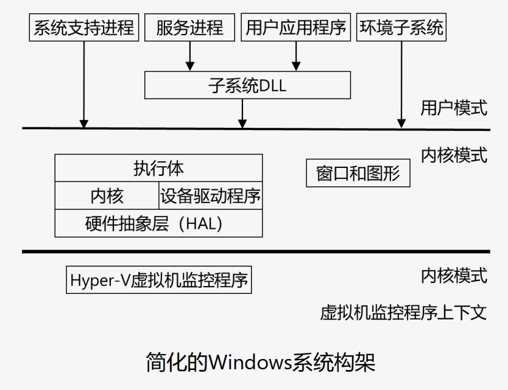

- 运行模式划分：基于 CPU 运行状态分为用户模式（ring 3，非特权模式）和内核模式（ring 0，特权模式）。
    - **用户模式**：运行应用程序的模式，应用程序可以访问部分系统资源，无法直接访问内核模式或底层硬件。
        - 用户进程：用户应用程序相关，无法直接调用原生的 Windows 操作系统服务，通过一个或多个子系统动态链接库（DLL）调用
        - 服务进程：Windows 服务相关，如任务计划（Task Scheduler）和打印后台处理（Print Spooler）服务
        - 系统支持进程：静态或硬编码的进程，如非 Windows 服务的登录进程和会话管理器
        - 环境子系统服务进程：实现操作系统环境支持部分的进程。环境是指呈现给用户和程序员的、操作系统中可进行个性化的部分
    - **内核模式**：可执行所有程序和特权指令，可以访问任何虚地址和控制虚拟内存硬件。
        - 执行体：包含操作系统的基础服务，例如内存管理、进程和线程管理、安全性、I/O、网络以及进程之间通信
        - Windows 内核：包含底层操作系统函数，例如线程调度、中断和异常分发、多处理器同步。还提供了一系列的例程和基本对象，执行体的其他部分会使用它们实现更高层次的功能
        - 设备驱动程序：包括将用户 I/O 函数调用转换为特定硬件设备 I/O 请求的硬件设备驱动程序，以及诸如文件系统和网络驱动程序等非硬件设备驱动程序
        - 硬件抽象层（HAL，hardware abstraction layer）：位于操作系统内核与硬件电路之间的接口层，其目的在于将硬件抽象化
        - 窗口和图形系统：用于实现用户界面（GUI）功能，例如处理窗口、用户界面控件以及进行绘制
        - 虚拟机监控程序层：只包含虚拟机监控程序本身，可以将计算资源（如处理能力、内存和存储）汇集起来，并在虚拟机（VM）之间重新分配这些资源

## Windows 系统安全组件
### 核心安全元素
- Windows 系统内置 6 大安全元素：
    - 安全策略（Security Policy）
    - 用户认证（User Authentication）
    - 访问控制（Access Control）
    - 加密（Encryption）
    - 审计（Audit）
    - 管理（Administration）

### 关键安全组件详情


- 标识
    - **安全账户管理器**（Security Accounts Manager，SAM）：维护 SAM 数据库，管理本机用户名、组、密码及其他属性信息。
    - **SAM 数据库**：存储于注册表 `HKEY_LOCAL_MACHINE\SAM` 键（受 ACL 保护），磁盘路径为 `%systemroot%\system32\config\sam`；系统启动后锁定，仅听从 LSASS 调度，用户无法擅自更改。
- 鉴别
    - **交互式登录管理器**（Interactive Logon Manager，Winlogon）：管理交互式登录会话，用户登录时创建首个进程。
    - **登录用户界面**（Logon User Interface，LogonUI）：提供身份验证用户界面，通过凭据提供程序查询用户凭据。
    - **凭据提供程序**（Credential Provider，CP）：运行于 LogonUI 进程的 COM 对象，用于获取用户名、密码、生物验证数据等。
    - **身份验证包**（Authentication Package，AP）：校验用户名与密码（或其他凭证）的匹配性，完成用户身份验证。
- 授权和审计
    - **本地安全机构子系统服务**（Local Security Authority Subsystem Service，LSASS）：负责本地系统安全策略（登录权限、密码策略等）、用户身份验证、发送安全审核信息至事件日志。
    - **LSASS 策略数据库**：存储本地系统安全策略设置，位于注册表 `HKLM\SECURITY` 键（受 ACL 保护）。
    - **内核安全设备驱动程序**（Kernel Security Device Driver，KSecDD）：运行于内核模式（路径 `%SystemRoot%\System32\Drivers\Ksecdd.sys`），实现高级本地过程调用接口，供加密文件系统 EFS 等组件在用户模式下与 LSASS 通信。
- 访问控制
    - **安全引用监视器**（Security Reference Monitor，SRM）：定义访问令牌数据结构，执行安全访问检查、特权检查，生成安全审核信息。
    - **APPLocker**：管理员控制用户和组可使用的可执行文件、DLL及脚本，包含驱动程序 `%SystemRoot%\System32\Drivers\AppId.sys`和服务 `%SystemRoot%\System32\AppIdSvc.dll`。
    - **APPContainer**：提供限制性进程执行环境（容器），应用及其子进程仅能访问授权资源。

## Windows 系统安全模型
### 安全子系统工作原理


1. 账户管理子系统（LSA）添加、删除账户和组，信息存储于 SAM 或 AD。
2. 数字鉴别子系统（LSA）采用 Kerberos 或 NTLM 协议认证用户身份，登录成功后生成访问令牌。
3. 授权管理子系统（LSA）设置对象的 ACL（访问控制列表）。
4. 安全引用监视器（SRM）检查访问令牌与被访问对象的 ACL，执行访问控制。
5. 审计子系统（LSA）对验证、授权过程进行日志审核（必要时）。

### 访问控制核心机制
- **访问令牌**（Access Token）：包含有关已登录用户的信息
    - 生成过程：用户通过凭据认证 $\to$ 系统创建登录会话并返回 SID $\to$ LSA 创建访问令牌 $\to$ 依据令牌创建进程/线程（使用指定令牌或继承父进程令牌），代表此用户执行的每一个进程都将具有此访问令牌的副本
    - 核心内容：包含用户及所属组的安全标识符（SID）、权限列表，用于标识用户身份及访问权限。
- **安全描述符**（Security Descriptor，SD）：**与被访问对象相关联**，包含与该对象关联的安全信息。
    - 创建对象时分配，可通过函数检索和设置
    - 组成：
        - 对象所有者 SID
        - 对象所有者属组 SID
        - **DACL**（Discretionary Access Control List，自主访问控制列表）：描述允许/拒绝特定用户/组的某些访问权限，包含零个/多个访问控制项（ACE，Access Control Entry）
        - **SACL**（System Access Control List，系统访问控制列表）：主要用于系统审计，指定了当特定账户对这个对象执行特定操作时记录系统日志
- **访问控制项**（ACE）：ACL 的基本元素，控制或监视特定受托者对对象的访问，用于指定特定用户/组的访问权限。
    - 一个 ACL 可以包含零个或多个 ACE
    - 组成：
        - **安全标识符**（SID）：标识适用访问者
        - **访问掩码**（Access Mask）：指定了具体的访问权限（Access Rights），即对该对象执行的操作
        - **类型标志**：拒绝/允许
        - **继承标志**：子对象是否继承该 ACE
- **访问控制列表**（ACL）：表示用户（组）权限的列表

    | 类型 | 功能 | 关键规则 |
    | --- | --- | --- |
    | 自主访问控制列表（DACL） | 允许或拒绝访问安全对象 | 权限为所有 ACE 累加；无 DACL 则所有用户获完整访问权；空 DACL 则禁止所有用户访问 |
    | 系统访问控制列表（SACL） | 记录特定访问请求 | 匹配访问请求与 ACE 时，记录访问结果（允许/拒绝） |
- **访问控制流程**：系统依次检查对象 DACL 中的 ACE，优先执行拒绝访问 ACE；找到匹配且满足所有请求权限的 ACE 则允许访问，若出现拒绝 ACE 或遍历完无匹配 ACE 则拒绝访问。

## Windows 系统安全管理
- 加强用户账户认证
    - 路径：本地安全策略 $\to$ 账户策略 $\to$ 密码策略/账户锁定策略。
        - 密码策略：开启“密码必须符合复杂性要求”，设置“密码长度最小值” $\geq 8$ 位。
        - 账户锁定策略：设置“账户锁定阈值”（无效登录次数上限）和“账户锁定时间”（锁定时长），防止暴力破解。
- 系统备份
    - 路径：控制面板 $\to$ 备份和还原。
    - 备份时机：系统功能正常、安装常用软件、无病毒/木马时。
    - 应对病毒、黑客攻击导致的系统故障，避免数据丢失或破坏。
- 设备加密（BitLocker）
    - 路径：控制面板 $\to$ 系统和安全 $\to$ BitLocker 驱动器加密。
    - 支持系统驱动器、固定数据驱动器及 U 盘等可移动存储设备，防止设备丢失导致隐私泄露。
- 开启 Windows Defender 防火墙
    - 位于网络边界，通过规则过滤不符合安全策略的数据，防御外部攻击。
    - 关键设置：配置“入站规则”“出站规则”“连接安全规则”，通过“监视”功能监控网络流量；默认策略为阻止不匹配入站连接、允许不匹配出站连接。

# Linux 操作系统安全
## Linux 系统概述

- 免费使用、自由传播的类 Unix 操作系统，主要适用于 Intel X86 系列 CPU 计算机。
- 特点
    - **完全免费**：免费获取源代码，支持任意修改。
    - **兼容 POSIX 1.0 标准**：可通过模拟器运行 DOS、Windows 程序，降低用户迁移门槛。
    - **多用户、多任务**：各用户文件设备权限独立，多个程序可同时独立运行。
    - **界面丰富**：兼具字符界面（键盘指令操作）和图形界面（X-Windows 系统，鼠标操作）。
    - **网络功能强大**：同时具有字符界面和图形界面
    - **丰富的网络功能**：支持网页浏览、文件传输等网络操作，可作为 WWW、FTP、E-Mail 服务器。
    - **安全稳定**：具备权限控制、审计跟踪、核心授权等安全技术。
    - **跨平台支持**：可运行于 x86、SPARC 等多种硬件平台，支持多处理器技术，也可作为嵌入式操作系统。

## Linux 系统用户管理
- 用户类型
    -  超级用户 root
        -  进程控制（修改优先级、调试进程等）
        -  设备控制（格式化硬盘、关机等）
        -  网络控制（配置防火墙、使用 1-1024 端口等）
        -  文件系统控制（读写任意文件、挂载分区等）
        -  用户控制（增删用户、修改密码等）
    - 普通用户
        - 仅能在 1024 以上端口运行网络服务
        - 只能修改自身密码
- 关键标识
    - UID（User ID）：系统唯一用户标识
        - root 用户 UID=0
        - 1-499 为系统账号
        - 500 及以上为普通登录账号。
    - GID（Group ID）：用户组唯一标识
        - 未指明组时系统自动创建与用户名同名的组
        - 组与用户是多对多关系
- 用户信息与密码
    - `/etc/passwd`：记录所有用户信息，7个字段以 `:` 分隔，分别为账号名称、密码占位符（`x`，实际密码存于 `/etc/shadow`）、UID、GID、用户信息说明、主文件夹、shell 程序。
        - 示例：
            - `root:x:0:0:root:/root:/bin/bash`
            - `maocai:x:1000:1000:maocai,,,:/home/maocai:/bin/bash`
    - `/etc/shadow`：存储用户加密密码，字段以 `:` 分隔，包括账号名称、加密密码（格式 `$id$salt$hashed`）、最近改密日期、密码不可更改天数、密码需更改天数、警告天数、宽限日、账户失效日期、保留字段。
        - 示例：
            - `root:!:19394:0:99999:7:::`
            - `maocai:$y$j9T$LGJ8iqUm5n5F4ZTzeXXkU0$q/kF7ieVx9s0r1wZ0eFYpH/G/0GOiFLX5MXH6OBO/y3:19394:0:99999:7:::`
- 设置密码复杂度
    - 命令：`authconfig --passminlen=12 --passminclass=4 --passmaxrepeat=2 --update`。
        - 密码不少于12位，包含大写字母、小写字母、数字、其他字符四类，单个字符最多重复2次。
    - 配置文件：`/etc/security/pwquality.conf`，对应参数 `minlen=12`、`minclass=4`、`maxrepeat=2`。
- 用户特权控制
    - Linux 系统的普通用户可通过 `su` 和 `sudo` 命令拥有超级用户的权限，可能导致安全问题
    - 限定可以使用 `su` 的用户
        - 默认：所有用户，只要知道 root 用户的密码，就可通过 `su –root` 拥有 root 权限
        - `/etc/pam.d/su`：配置可以使用 `su` 命令的用户组
            - 示例：`auth required pam-wheel.so group=wheel`
            - 只有 wheel 组的用户可以使用 `su` 变成 root，其它组的用户即使知道 root 密码，也无法使用 `su`
    - 安全配置 sudo：（文件：`/etc/sudoers`）
        - `#wheel ALL=(ALL) NOPASSWD: ALL`
            - 设置 wheel 组的用户直接 `sudo` 成 root 而不需要密码
        - `%developers ALL=/usr/local/bin/tomcat.sh`
            - 设置仅 developers 组的用户可以 `sudo` 成 root 运行 `/usr/local/bin/tomcat.sh`

## Linux 系统访问控制
- 根目录下各文件夹功能
    - `/bin`：存放常用命令二进制文件
    - `/boot`：存放启动内核与启动文件
    - `/dev`：存放抽象硬件设备文件
    - `/etc`：存放系统配置文件
    - `/home`：存放普通用户主目录
    - `/lib`：存放系统库文件
    - `/mnt`：文件挂载目录（U 盘、光驱等）
    - `/root`：超级用户 root 的主目录
    - `/sbin`：存放特权级二进制文件
    - `/opt`：存放大型软件（可选）
    - `/usr`：存放安装程序和数据
    - `/var`：存放经常变化的数据文件，如日志文件
    - `/tmp`：存放临时文件
    - `/proc`：虚拟文件系统，存放内核和进程信息
- 常见文件系统类型
    - 主流类型：
        - EXT3（第 3 代扩展文件系统）
        - EXT4（第 4 代扩展文件系统）
        - XFS（高性能日志文件系统）。
    - 其他兼容类型：FAT16、FAT32、NTFS（Windows）、JFS、GFS等。
- 文件系统挂载与卸载
    - 挂载命令：`mount [选项] 设备名 挂载点`
        - 将分区关联至指定的挂载点目录，使用户可通过该目录访问分区内容。
    - 卸载命令：`umount 设备路径|挂载点`
- procfs 虚拟文件系统
    - 定义：procfs（Process Information Pseudo-Filesystem）为虚拟文件系统，挂载于 `/proc` 目录，提供内核数据结构接口。
    - 核心功能：
        - 存储内核运行状态（CPU、内存、进程等）
        - 用户可查看系统硬件及进程信息
        - 部分文件可修改以调整内核状态（如 `echo "1" > /proc/sys/net/ipv4/ip_forward` 启用 IP 转发路由功能）
    - 常见信息：
        - `/proc/cpuinfo`：处理器信息
        - `/proc/stat`：系统统计信息，含 CPU 运行模式时间、进程数等。
- 文件基本属性与权限操作
    - 文件属性解析
        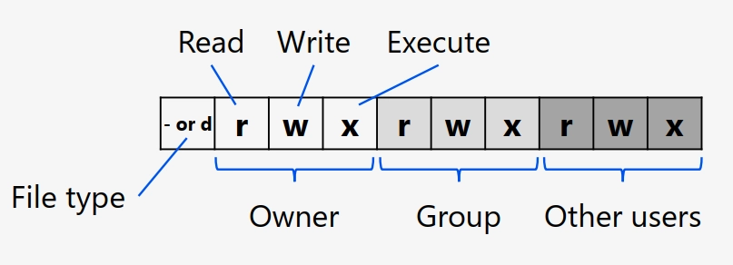

        - 第 0 位：文件类型
            - `d`：目录
            - `-`：文件
            - `l`：链接文件
            - `b`：存储接口设备
            - `c`：串行端口设备，如键盘、鼠标
        - 第 1-3 位：属主（所有者）权限
        - 第 4-6 位：属组权限
        - 第 7-9 位：其他用户权限
    - 权限标识：
        - `r`：可读，数字 4
        - `w`：可写，数字 2
        - `x`：可执行，数字 1
        - `-`：无该权限，数字 0
- 权限操作命令
    - `ls –al`：列出目录详细信息（含隐藏文件），显示文件属性与权限。
    - `chown`：修改文件/目录所有者（如 `chown user1 file.txt`）。
    - `chgrp`：修改文件/目录所属群组（如 `chgrp group1 file.txt`）。
    - `chmod`：控制文件权限，格式 `chmod [ugoa][+-=][rwxX] 文件`。
        - `u` = 属主、`g` = 属组、`o` = 其他用户、`a` = 所有用户；
        - `+` = 增加权限、`-` = 取消权限、`=` = 唯一设定权限。
        - `r` = 读、`w` = 写、`x` = 执行、`X` = 目录或已有执行权限时赋予执行权限。如 `chmod ugo+r file.txt` 设置所有用户可读该文件。
        - 也可以使用掩码方式设置权限，如 `chmod 755 file.txt`。
- 文件访问流程
    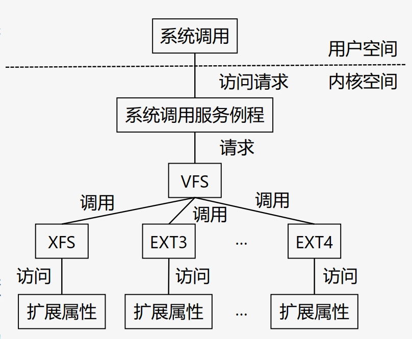

    1. 用户程序通过 `open()` 等系统调用发起访问请求，经系统调用服务例程进入内核。
    2. 虚拟文件系统（VFS）统一处理请求，隐藏不同文件系统差异。
    3. 内核依次进行普通权限检查、DAC（自主访问控制）检查、MAC（强制访问控制）检查。
        - DAC 检查时，VFS 调用对应文件系统函数，从文件扩展属性中查找 ACL 权限，通过则允许访问，否则拒绝。
    4. 权限检查全部通过后，访问对应文件系统（EXT3/EXT4/XFS 等）的数据。
- 基于 Capability 的安全控制机制
    - root 用户的进程默认具有所有操作权限（包括所有特权权限），普通用户拥有非特权权限
    - **核心思想**：分割超级用户权限，实现细粒度权限控制，允许进程在不完全提升到超级用户权限的情况下执行特定的特权操作，符合最小特权原则。
    - 特权分类：文件、进程、网络、ipc、系统、设备等。

# 移动操作系统安全
## 移动操作系统核心对比

|  | 鸿蒙（Harmony OS） | 安卓（Android） | 苹果（iOS） |
| --- | --- | --- | --- |
| 开发商 | 中国华为公司主导开发 | 安迪·鲁宾开发，2005 年被谷歌收购 | 美国苹果公司自主开发 |
| 系统内核 | **分布式微内核**作为底层架构，使用开源模块进行组合 | 基于 Linux 内核（不含 GNU 组件），**宏内核**架构 | 类 Unix 系统，XNU 内核（**Darwin层**），同时包含微内核和宏内核 |
| 架构 | 三层架构：系统底层、基础服务和程序框架 | 系统结构、应用组件 | 内核态（Darwin层）和用户态：核心操作系统层、核心服务层、媒体层、可轻触层 |
| 面向对象 | 物联网设备全场景：智能手机、平板、手表、电视、智能家电等 | 最初面向智能手机和平板，现扩展至物联网设备（电视、游戏机等） | iPhone、iPod touch、iPad 等苹果设备 |
| **优势** | 跨设备能力、性能流畅、安全性高、未来潜力高 | 开放性与自由度高、应用生态广泛、硬件多样性、与谷歌服务集成 | 流畅稳定、隐私与安全性高、生态系统内无缝连接、优质应用与更新 |
| **劣势** | 生态成熟度较低、海外市场受限、不确定性较高 | 碎片化严重、隐私和安全问题、流畅度和卡顿问题 | 封闭和不自由、价格昂贵、创新相对保守 |

|  | 宏内核（Monolithic Kernel） | 微内核（Micro Kernel） |
| --- | --- | --- |
| 定义 | **大而全**，所有主要功能模块（进程调度、内存管理等）作为整体运行在内核空间 | **小而精**，内核空间仅保留核心功能（IPC、基础进程调度、内存管理），其他功能为用户态独立服务 |
| 代表系统 | Linux、Unix、Android | HarmonyOS、MacOS（XNU）、QNX |
| 设计哲学 | 所有系统服务集成于一个大内核 | 最小化内核，仅保留核心服务，其他为用户态进程 |
| 性能 | 模块间函数调用通信，速度快、效率高 | 模块间通过 IPC 通信，消息传递开销较大，有潜在性能损耗 |
| 稳定性与可靠性 | 相对较低，单个模块崩溃可能导致整个系统崩溃（内核恐慌） | 高，单个服务崩溃可重启，不影响整个系统 |
| 安全性 | 相对较低，代码庞大，高权限代码多，攻击面大 | 高，仅核心功能运行在高权限模式，攻击面小 |
| 可扩展性与维护性 | 难，添加新功能需重新编译/重启内核，维护难度大 | 易，新增服务只需在用户空间编写新程序，无需修改内核，易于扩展和维护 |

## 鸿蒙移动操作系统安全
- 华为主导开发的一款全新的面向全场景的**分布式操作系统**
    - 全球排名第三的智能手机操作系统，开创性的**物联网领域第一款操作系统**
    - 提供强大的**分布式体系**，带来的稳定、快速的用户体验以及多设备协同体系
    - 具备安全的架构设计和内置的安全功能，包括**受保护的内核**、安全存储和用户身份验证等
- 安全设计理念
    - **原生安全**（Inherent Security）：安全能力在设计之初植入，遵循“最小权限”原则
    - **隐私保护为核心**（Privacy-Centric）：数据所有权归用户，系统提供透明可控的数据管理策略，践行“数据不离开设备”、“匿名化处理”
- 核心安全架构
    - **内核层安全**：微内核架构，从根源提升安全性
        - **极简内核**：百万行级代码，攻击面小
        - **权限分离**：核心功能内核态，其他服务用户态，即使单个服务被攻破也不影响系统整体
        - **形式化验证**：对微内核关键代码使用数学方法进行形式化验证，杜绝特定漏洞
    - **框架层安全**：分布式可信
        - **分布式安全框架**：跨设备协同安全互信，建立安全连接通道
        - **可信执行环境**（TEE）：与主系统隔离的硬件级安全区域，保护生物特征、支付密钥等敏感信息
        - **设备身份认证**：设备唯一的、基于硬件的可信身份ID，防仿冒
    - **应用生态安全**：全流程治理
        - **上架前严格审核**：恶意行为检测、隐私合规检查、安全漏洞扫描
        - **安装时透明可控**：精细权限管理、隐私标签
        - **运行时实时防护**：拦截异常行为
        - **纯净模式**：仅允许安装安全检测应用
    - **隐私保护**：贯穿于数据的全生命周期
        - **数据最小化**：应用只获取必要数据，数据处理必须用户知情同意
        - **透明与可控**：隐私标签、权限使用记录查看
        - **端侧处理**：本地数据处理，减少云端上传

## 安卓移动操作系统安全
- 基于 Linux 内核的操作系统和软件平台，它采用了软件堆层的架构，底层以 Linux 内核为基础，只提供基本功能，其他的应用软件则由各公司自行开发，以 Java 作为主要的编程语言。
- 安全特性包括**应用权限管理**、**应用隔离**和硬件级别的安全保护等
- 系统体系结构（自底向上）
    - **Linux 内核层**：Android 系统的基础核心，提供硬件抽象、内存管理、安全管理等核心服务
    - **系统运行库**：包含 C/C++ 库和 Android 运行时环境，提供核心 API 支持
    - **应用程序框架层**：提供开发应用所需 API 和管理服务，是应用与系统交互的桥梁
    - **应用程序层**：用户直接交互的应用（系统预装 + 第三方应用）
- 核心安全机制
    - **访问控制**：
        - **权限模型**：应用以唯一 UID 运行，使用 API 时需进行权限声明
        - **权限管理**：对不同程序分配不同权限
        - **敏感权限管理**：对敏感操作审核监管
    - **沙箱模拟**：
        - **进程保护**：应用隔离在独立进程空间，进程间互不干扰
        - 限制资源访问，假定应用不可信
    - 外部认证：金融级、政府机构认证
    - **签名与证书**：应用需数字签名，安装时验证合法性，限制程序修改
    - 秘钥管理：随机生成、安全存储
    - 加密机制：存储加密、网络传输加密
- 安全威胁
    - **开源模式风险**：应用审核不严导致恶意代码传播
    - **权限许可问题**：安装时权限不可选，过度授权风险
    - **系统与应用漏洞**：复杂系统易存在漏洞，易被攻击利用

## 苹果移动操作系统安全
- 由苹果公司开发的移动操作系统，与苹果的 macOS 操作系统一样，iOS 系统是以 Darwin（苹果计算机的一个开源操作系统）为基础开发的，属于**类 Unix** 的商业操作系统。
    - 提供内置安全性：硬件功能 + OS 功能
    - 密码锁：**防止未经授权的设备访问**
    - 查找：**远程定位和擦除设备**
- 系统体系结构（自底向上）
    - **核心操作系统层**（Core OS Layer）：提供系统基础功能（硬件驱动、内存管理、文件系统等），通过 API 提供服务
    - **核心服务层**（Core Services Layer）：提供更为丰富的功能，如字串处理、日历、Security、Core Location 等功能
    - **媒体层**（Media Layer）：提供图片、音乐、影片等多媒体功能
    - **可轻触层**（Cocoa Touch Layer）：Objective-C API，提供应用界面组件、多点触屏处理等
- XNU 内核架构
    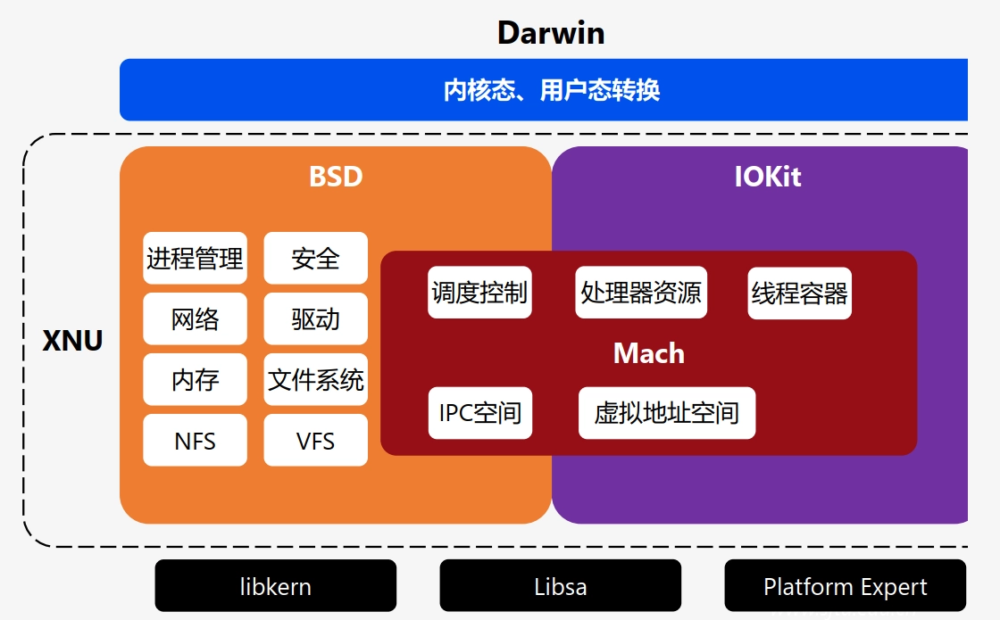

    - Mach：**微内核**，提高系统的模块化程度，提供内存保护的消息传递机制，负责处理器调度、虚拟内存管理、IPC 等基础系统服务
    - BSD：对 Mach 再次封装的**宏内核**，提供现代易用的内核接口，高负荷下仍可高效运作
    - IOKit：硬件抽象层，**驱动程序**运行环境，包含电源、内存、CPU等信息
- 核心安全机制
    - **更小的受攻击面**：降低攻击者可以访问（尤其是可以远程访问）的代码量
        - 不支持 Java/Flash，限制文件格式支持
    - **精简系统**（无 shell）
    - **权限分离**：通过用户、组权限分离进程
        - mobile 用户：普通应用
        - root 用户：多数重要系统进程
        - _wireless/_mdnsresponders 等其他身份：其他系统进程
    - **代码签名机制**：二进制文件和类库在被内核允许**执行之前都必须经过受信任机构（比如苹果公司）的签名**
        - 内存中只有那些来自己签名来源的页才会被执行，应用无法动态地改变行为或完成自身升级
    - **数据执行保护**（DEP）：
        - 处理器能区分内存中的代码与数据，仅允许代码执行，防止构造恶意载荷
    - **地址空间布局随机化**（ASLR）
        - 二进制文件、库文件、动态链接文件、栈和堆内存地址随机化
        - 与 DEP 协同防御攻击
    - **沙盒机制**：面向进程可执行的行动提供更细粒度的控制
        - 限制恶意软件破坏范围
- 安全性分析与威胁
    - 优势：闭源系统 + 硬件掌控，漏洞修补及时，启动链签名验证（TrustBoot）构建安全链
    - 风险：“越狱”会破坏安全机制，恶意软件可能通过 App Store 审核空隙进入

# 网络安全
## 网络安全概述

- 应用层是安全边界的重要组成部分，存在巨大漏洞，仅依赖网络层防护（防火墙、SSL、IDS、系统加固）无法阻止或检测应用层攻击。
- 攻击网络系统的动机和目的
    - 纯粹炫耀黑客技术
    - 增加自己网站点击率
    - 加入木马和病毒程序
    - 发布虚假信息获利
    - 窃取用户资料及应用数据
    - 政治性的宣传
    - 破坏性攻击
- 安全漏洞产生原因
    - 客观原因
        - **网络系统的复杂性**：操作系统、Web 服务器软件、商业软件、Web 应用程序自身均可能存在漏洞。
        - **漏洞的修补困难**：第三方软件补丁发布滞后于漏洞利用，Web 应用漏洞检测与修补耗时费力。
    - 主观原因
        - **密码管理不当**：合格密码需 8 位以上并定期更换。
        - **不安全的配置**：权限控管不当、信息泄露
        - **漏洞修补**：未定期漏洞扫描、未及时更新软件、新应用上线前缺乏安全测试。
        - **上网控制**：钓鱼、木马、间谍软件。
        - 开发人员更注重功能实现、性能、开发进度等，忽视安全编码，且存在代码量大、人员变更频繁、培训不足等问题。
- 网络安全视图
    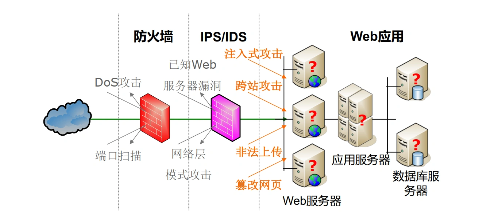
- 破坏与损失
    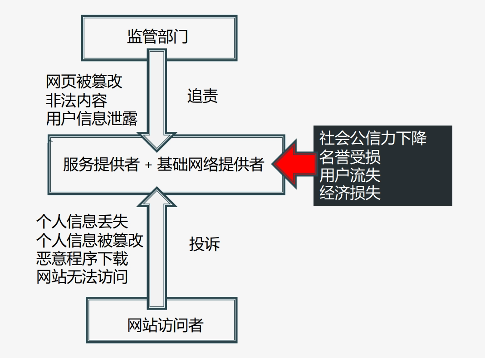

## 网络系统常见漏洞
### 注入（Injection）
- 核心：以 SQL 注入为主，攻击者通过发送 SQL 语句获取信息、篡改数据库、控制服务器
- 流行性：常见
- 危害性：**严重**
- 风险代码：使用 `Statement` 拼接 SQL 语句，混淆“代码”与“数据”。
- 防范措施：
    - 检查并转义用户输入的特殊字符（`'`、`;`、`--`等），拒绝已转义输入；
    - 使用参数化查询（`PreparedStatement`）、SQL 存储过程；
    - 遵循最小权限原则，禁用 SA 等高权限账号；
    - 防止错误页面泄露敏感信息。

### 跨站脚本（Cross-Site Scripting, XSS）
- 核心：攻击者通过向 URL 或其他提交内容插入脚本，实现客户端执行
    - 跨站：攻击者制造恶意脚本，并通过 Web 服务器转发给普通用户客户端，在其浏览器中执行
    - 脚本：Web 浏览器可以执行 HTML 页面中嵌入的脚本命令，通常为 JavaScript
    - 攻击：可能导致盗取用户身份、拒绝服务、篡改网页、模拟用户操作、传播蠕虫等
- 流行性：极广
- 危害性：**中等**
- 分类：
    - 存储型：恶意脚本存于服务器，任意用户访问包含该恶意代码的页面时执行。
    - 反射型：恶意脚本通过 URL 反射，服务器响应时包含该脚本，用户点击链接时执行。
    - DOM 型：客户端 JavaScript 对 DOM 的处理不当，修改了 DOM 树，导致恶意脚本执行。
- 防范措施：
    - 过滤：可能导致意外结果，有时需要多次过滤，需注意多个过滤的先后顺序
    - 输入编码：最佳
    - 输出编码：工作量大，但可以处理输入编码无法处理的已入库数据
    - 用户安全加固：小心点击不明链接，对浏览器进行安全加固，如禁止 ActiveX

### 失效的验证和会话管理（Broken Authentication and Session Management）
- 核心：攻击者通过嗅探、暴力破解等获取用户凭证或 Session ID
- 流行性：常见
- 危害性：**严重**
- 防范措施：
    - 强密码策略
    - 登陆出错时不给过多提示信息
    - 登录页面加密，多次登录失败短时锁定账号
    - 验证成功后更换 Session ID（128 位以上随机值）
    - 会话闲置超时
    - 保护 Cookie，设置 Secure/HttpOnly 标记
    - 不在 URL 显示 Session ID

### 不安全的直接对象访问（Insecure Direct Object References）
- 核心：URL 或网页暴露内部资源标识（文件名、路径、数据库关键字等），若未验证权限，可能导致攻击者未授权访问
- 流行性：常见
- 危害性：**中等**
- 防范措施：
    - 避免在 URL 或网页中直接引用内部文件名或数据库关键字，用自定义映射名称替代直接对象标识
    - 锁定目录权限，设置访问权限
    - 验证用户输入和请求，拒绝含 `./` 或 `../` 的请求。

### 跨站请求伪造（Cross-Site Request Forgery, CSRF）
- 核心：攻击者构造恶意请求，诱骗已登录用户触发，冒充用户操作
- 流行性：广泛
- 危害性：**中等**
- 与反射型 XSS 区别：
    - CSRF 攻击目标是网站，利用网站对用户浏览器的信任，以用户名义执行特定操作，将恶意请求发送到目标网站，恶意代码存放在攻击者自己的网站或第三方页面上；
    - XSS 攻击目标是用户浏览器，利用用户对网站的信任，恶意代码隐藏在目标网站的 URL 或页面中，在用户浏览器中执行。
- 防范措施：
    - 避免 URL 明文显示操作参数
    - 使用同步令牌（Synchronizer Token）：服务器生成随机且不可预测的令牌（恶意网站无法获取），用户提交请求时表带会自动附带这个令牌，服务器检查是否匹配以验证请求有效性
    - 检查请求 Origin/Referer Header，确保来自合法域名

### 不正确的安全设置（Security Misconfiguration）
- 核心：管理员配置疏忽，导致攻击者非法获取信息、篡改内容或控制系统
- 流行性：常见
- 危害性：**中等**
- 示例：未安装补丁、允许目录浏览、匿名上传文件、使用默认账号密码、错误页面泄露 call stack。
- 防范措施：
    - 及时安装软件补丁
    - 最小化安装（仅保留必要组件）
    - 不在 Web/SQL 服务器上运行其他服务，数据不放在系统盘上
    - 严格设置文件/文件夹权限，禁用不必要服务
    - 不使用默认路径和预设账号，遵循最佳安全实践

### 不安全的加密存储（Insecure Cryptographic Storage）
- 核心：重要信息未加密、加密强度不足或密钥存储不当
- 流行性：不常见
- 危害性：**严重**
- 示例：明文存储银行卡号/密码、使用自制加密算法或 MD5/SHA-1 低强度算法、密钥与加密信息同存。
- 防范措施：
    - 对所有重要信息进行加密
    - 重要信息采用 AES、RSA 等高强度算法加密
    - 密码用 SHA-256 等健壮哈希算法处理
    - 密钥与加密信息分开存储，严格控制访问权限

### URL 访问限制缺失（Failure to Restrict URL Access）
- 核心：未公开的“隐藏” URL 缺乏访问控制，被攻击者猜测或泄露后非法访问
- 流行性：不常见
- 危害性：**中等**
- 防范措施：
    - 所有页面（含未公开页面）均需访问控制检查
    - 限制可访问文件类型
    - 定期进行渗透测试

### 没有足够的传输层防护（Insufficient Transport Layer Protection）
- 核心：攻击者截取网络包获取敏感信息
- 流行性：常见
- 危害性：**中等**
- 防范措施：
    - 验证页面及敏感信息传输使用 SSL/TLS 加密
    - 网页不混杂 HTTP 和 HTTPS 内容，Cookie 设置 Secure 标签
    - 保持服务器证书有效，仅允许 SSL 3.0/TLS 1.0 以上协议

### 未验证的重定向和跳转（Unvalidated Redirects and Forwards）
- 核心：跳转目标 URL 可由用户控制且未验证，用于钓鱼或绕过访问控制
- 流行性：不常见
- 危害性：**中等**
- 示例：攻击者构造含恶意跳转地址的登录链接，用户登录后被导向钓鱼网站。
- 防范措施：
    - 尽量避免重定向/跳转功能
    - 验证跳转参数，拒绝站外地址
    - 用映射代码替代 URL 中的真实目标地址

## 访问控制和防火墙
### 访问控制
- **定义**：按用户身份限制主体（用户、进程）对客体（文件、系统）的访问权限
- 访问控制**三要素**：主体、客体、权限，形成访问控制矩阵。
- 访问控制举证的实际存储
    - 访问控制表（ACL）：每个客体对应一组权限
        - File1 ：[(Alice, rw), (Bob, r)]
        - File2 ：[(Alice, r), (Bob, rwx)]
    - 访问能力表：每个主体对应一组权限
        - Alice ：[(File1, rw), (File2, r)]
        - Bob ：[(File1, r), (File2, rwx)]
    - 授权关系表：存储访问控制矩阵中的非空元素。
        - (Alice, File1, rw)
        - (Bob, File1, r)
        - (Alice, File2, r)
        - (Bob, File2, rwx)
- 访问控制策略
    - **自主访问控制**（DAC）：主体可自主将拥有的客体的全部或部分权限授予他人
    - **强制访问控制**（MAC）：按主体和客体的安全等级决定访问权限
    - **基于角色的访问控制**（RBAC）：权限分配给角色，用户通过承担角色获取权限

### 防火墙
- **定义**：由软硬件构成的系统，一般部署于内部网络出口，控制内外网之间的访问。
- 分类：
    - **网络级防火墙**：基于报文过滤技术，对网络报文进行分析，阻止不合理的网络连接或数据传递。
    - **应用级防火墙**：基于应用网关/代理服务器技术，对特定网络应用进行分析，阻止非法的网络应用。
- 技术发展历程
    - 静态包过滤防火墙：通过 ACL 检查数据包源宿地址、端口、协议状态，确定是否允许通过
    - 应用代理防火墙：工作在应用层，使用代理技术阻断内外网直接通信，隐藏内部网络
    - 状态检测防火墙：动态包过滤，跟踪连接状态，自适应防护，也称为自适应防火墙或动态包过滤防火墙
    - UTM（Unified Threat Management，统一威胁管理）防火墙：集成 IDS/IPS、反病毒、反垃圾邮件、URL 过滤等功能
    - NGFW（Next Generation Firewall，下一代防火墙）：深度感知应用、用户和内容，提供精细智能防护

### Linux 防火墙——iptables
- 组成：内核模块 `netfilter` + 用户空间工具 `iptables`
- 四表五链：
    - 表：做什么（功能）
    - 链：什么时候做（时机）。
- 四表（规则集合，按优先级排序）

    | 表名 | 优先级 | 功能 | 可用链 |
    |------|--------|------|--------|
    | `raw` | 最高 | 处理原始数据包，标记 NOTRACK 免除连接跟踪 | `PREROUTING`、`OUTPUT` |
    | `mangle` | 第二 | 修改数据包标记/属性（TTL、TOS等） | 全部五链 |
    | `nat` | 第三 | 网络地址转换（SNAT 修改源地址 / DNAT 修改目标地址） | `PREROUTING`（DNAT）、`OUTPUT`、`POSTROUTING`（SNAT） |
    | `filter` | 最低 | 过滤数据包（ACCEPT / DROP / REJECT），最常用 | `INPUT`、`FORWARD`、`OUTPUT` |
- 五链（数据包传输检查点）

    | 链名 | 触发时机 | 核心用途 |
    |------|----------|----------|
    | `PREROUTING` | 数据包进入接口后，路由判断前 | DNAT（修改目标地址） |
    | `INPUT` | 数据包目标为本机 | 控制是否允许进入本机应用 |
    | `FORWARD` | 数据包目标不是本机，需转发至其他机器时 | 网关/路由器场景下的转发控制 |
    | `OUTPUT` | 本机进程产生的数据包发出前 | 控制本机数据包是否允许发出 |
    | `POSTROUTING` | 数据包离开接口前，路由判断后 | SNAT（修改源地址） |
- 工作流程
    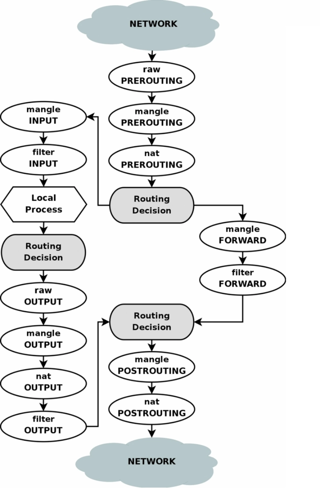

## 入侵检测系统（IDS）
- 常见攻击类型
    - 漏洞扫描
    - 端口扫描
    - 网络嗅探（sniffer）
    - 拒绝服务攻击
    - 欺骗攻击：ARP/IP/DNS 欺骗等
- 入侵检测系统（Intrusion Detection System, IDS）
    - **定义**：通过分析行为、安全日志、审计数据和其它网络上可获得的信息等操作，检测对系统的攻击或攻击企图。
    - **分类**

        | 分类维度 | 类型 | 特点 |
        |----------|------|------|
        | 数据来源 | 主机入侵检测 | 基于主机日志、进程行为等数据 |
        |          | 网络入侵检测 | 基于网络数据包分析 |
        |          | 混合分布式入侵检测 | 结合主机和网络检测优势 |
        | 分析方法 | 基于异常的 IDS | 机器学习构建正常行为轮廓，检测偏离行为 |
        |          | 基于误用的 IDS | 基于攻击特征规则库，匹配已知攻击 |
    - 架构
        - **事件产生器**：收集系统日志、网络数据等事件；
        - **事件分析器**：分析事件，识别危险/异常，通知响应单元；
        - **响应单元**：对分析结果作出反应，触发报警、终止进程、重置连接等动作；
        - **事件数据库**：存储中间及最终数据。
    - 工作流程
        1. 信息收集：获取系统日志、应用日志、网络数据、审计记录等；
        2. 入侵分析：结合知识库（历史行为/攻击特征/正常行为轮廓等），通过异常检测或误用检测识别入侵；
        3. 告警响应：针对分析结果执行相应响应动作。
    - 分析技术对比

        | 分析技术 | 原理 | 知识库 | 指标 | 优点 | 缺点 |
        |----------|------|--------|------|------|------|
        | 异常检测 | 统计分析 | 正常操作特征（用户轮廓） | 漏报率低、误报率高 | 可检测未知攻击，自适应学习 | 正常行为特征、统计算法选择难度大 |
        | 误用检测 | 模式匹配 | 入侵行为模型（攻击特征） | 误报率低、漏报率高 | 准确率高、算法简单 | 需更新特征库，无法检测未知攻击 |
- IDS vs IPS vs FW vs WAF

    | 技术名称 | 网络布局 | 检测机制 | 主要用例 |
    |----------|----------|----------|----------|
    | IDS（入侵检测系统） | 子网内部，**与流量并行**，不影响网络性能 | 基于签名/规则/统计异常检测已知/未知攻击 | 被动监视，检测攻击并报警 |
    | IPS（入侵防御系统） | 网络边界，**与流量串联**，承担数据转发功能，对性能有影响 | 基于签名/规则匹配已知威胁 | 主动防护，检测并阻止攻击流量 |
    | FW（防火墙） | 网络前端 | 传输层控制，允许/阻止 IP/端口 | 控制不同网络区域间流量 |
    | WAF（Web应用防火墙） | Web 应用前端 | 应用层检查 HTTP 流量 | 检查并防护 Web 特定攻击 |
- 开源 IDS——Snort
    - 特点：跨平台、轻量级，基于网络规则的入侵检测工具。
    - 工作过程：
        1. 数据包嗅探：监听网络数据包；
        2. 预处理器：用插件检查原始数据包，预处理后传输至检测引擎；
        3. 检测引擎（核心模块）：将数据包与攻击签名/规则库匹配，匹配成功则通知报警模块；
        4. 报警/日志：将报警输出至日志文件、数据库或第三方插件。

# 数据流分析
## 静态分析背景
- 程序相关核心问题
    - 程序是否在所有输入下终止？
    - 堆内存最大使用量是多少？
    - 敏感信息是否泄露/被篡改？
    - 是否存在缓冲区溢出、SQL 注入、XSS 等漏洞？
    - 是否存在数据竞争？
- 静态分析的价值
    1. 提高效率：优化资源利用率、支持编译器优化
    2. 确保正确性：验证程序行为、及早发现错误
    3. 辅助开发：支持程序理解与重构
- 静态分析与测试的区别
    - 测试（动态分析）成本高（占开发成本50%），并发/分布式系统中"海森堡缺陷"难以复现
    - 静态分析：对程序进行推理的程序，无需执行即可分析程序属性
- 完美程序分析器的三大特性
    - **可靠性**（SOUNDNESS）：不遗漏任何错误
        - 可靠性 - 真实情况 = 误报（False Positive）
        - 过度近似
    - **完备性**（COMPLETENESS）：不产生误报
        - 真实情况 - 完备性 = 漏报（False Negative）
        - 不足近似
        - 在安全应用中，**漏报**通常不可接受
    - **终止性**（TERMINATION）：始终给出分析结果
        - 工程实现关键要求
- 静态分析漏洞发现示例（指针相关错误）：以下 C 代码经 `gcc -Wall` 和 `lint` 检测无报错，但存在多重安全漏洞：
    ```c
    int main() {
        char *p, *q;
        p = NULL;
        printf("%s", p);          // 1. 空指针解引用：NULL指针传递给'%s'格式符，导致程序崩溃
        q = (char *)malloc(100);
        p = q;
        free(q);
        *p = 'x';                 // 2. 释放后使用：向已释放内存写入数据，未定义行为
        free(p);                  // 3. 双重释放：重复释放同一内存，破坏堆结构
        p = (char *)malloc(100);
        p = (char *)malloc(100);  // 4. 内存泄漏：第一块分配内存地址丢失，无法释放
        q = p;
        strcat(p, q);             // 5. 错误字符串操作：p和q指向同一块未初始化内存，无'\0'结尾
    }
    ```

## 基本概念
- **数据流**（Data Flow）
    - 程序中一个**变量**在**定义（赋值）点**与**使用（引用）点**之间的**传递路径与值变化状态**
    - 描述数据的传递与变化
- **数据流图**（Data-Flow Graph, DFG）
    - 节点：变量
    - 有向边："定义-使用"关系（定义点 D 指向使用点 U）
- **控制流**（Control Flow）
    - 程序在执行时，**控制权（即下一步执行哪条指令）是如何传递的**。包括简单的顺序执行和由**跳转、分支、循环和函数调用**等引起的复杂路径
    - 描述程序中语句执行的部分顺序关系
- **控制流图**（Control-Flow Graph, CFG）
    - 节点：单条语句或基本块
    - 有向边：语句/基本块的执行顺序
- **基本块**（Basic Block, BB）
    - 定义：程序中只有一个入口和一个出口的连续指令序列
    - 领导者（Leader）准则：
        - **首指令为领导者准则**：程序的第一条指令自动成为基本块的领导者
        - **跳转目标准则**：任何作为跳转或分支目标的指令（即标签所在的指令）是领导者
        - **跳转后继准则**：任何紧跟在跳转或分支指令之后的指令是领导者
- 基本块划分示例（10×10矩阵置为单位矩阵）
    

## 数据流分析基础
- 数据流分析（Data-Flow Analysis, DFA）：**静态分析**技术，通过在**控制流图**上模拟数据流动，推断每个**程序点**上程序状态的**保守近似信息**，用于收集程序各点**可能计算的值的集合**信息。
    - 程序点（Program Point）：程序执行流程中位于某条语句之前或之后的特定位置，用于标记程序执行状态的上下文，是数据流分析的基本单位
- 示例：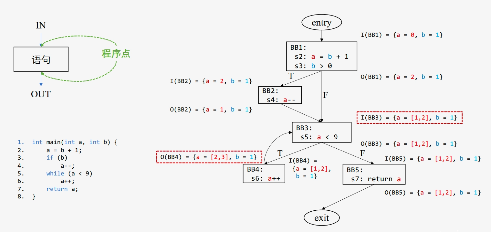
- 分析维度分类
    1. 按传播方向
        - 正向/前向分析：信息传播与程序执行方向一致（从入口到出口）
        - 反向/后向分析：信息传播与程序执行方向相反（从出口到入口）
    2. 按分析性质
        - **可能性分析**（May Analysis）：输出"可能为真"，过度近似（over-approximation）
        - **必然性分析**（Must Analysis）：输出"必须为真"，不足近似（under-approximation）

## 数据流分析应用
### 活跃变量分析（LVA）
- 活跃变量：程序点 $p$ 上，若变量 $v$ 可能被从 $p$ 出发的某条路径使用，则 $v$ 在 $p$ 处活跃；否则为死亡（失效）。
- 活跃变量分析（Live Variable Analysis, LVA）：一种编译器优化技术，用于判断程序某点的变量值是否会在后续操作中被使用，支撑编译器寄存器分配优化。
    - 传播方向：反向/后向分析（从程序出口向入口传播）
    - 分析性质：可能性分析（May Analysis）
- 示例：
    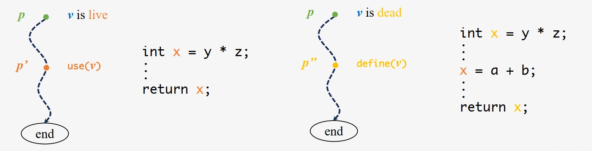
- 核心思想：
    - 如果使用了变量值 $v$，则指令/块会使变量 $v$ 活跃
    - 如果定义了变量值 $v$，则指令/块会使变量 $v$ 失效

    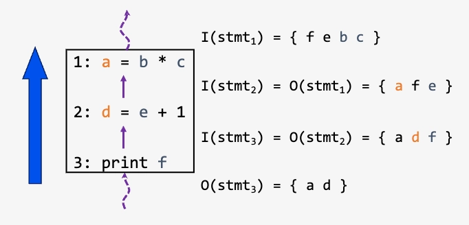
- 数据流方程：
    - $use(n)$：在基本块 $n$ 中被使用但使用前未定义的变量集合
    - $def(n)$：在基本块 $n$ 中被定义的变量集合
    - $I(n) = (O(n) - def(n)) \cup use(n)$：基本块 $n$ 的入口活跃变量集合
    - $O(n) = \bigcup_{s \in succ(n)} I(s)$：基本块 $n$ 的出口活跃变量集合
        - $succ(n)$：基本块 $n$ 的直接后继块集合
        - Meet 操作：数据流方程中的集合并集（Union）操作，当且仅当变量在**任一后继块的入口点活跃**时，其在当前块出口点活跃
            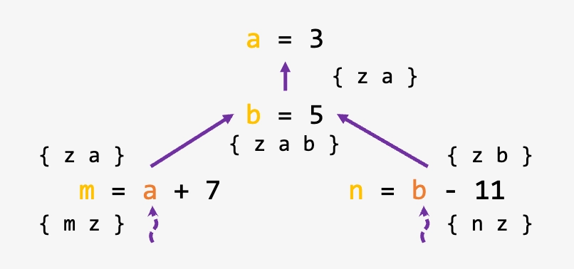
- 算法
    - 输入：控制流图 $G$
    - 输出：每个基本块 $B$ 的 $I(B)$ 和 $O(B)$

    ```
    Algorithm LVA:
        for (each basic block b in G)
            I(b) = {}  // 初始化入口活跃变量集合为空
        while (any I changes)  // 迭代直至收敛
            for (each basic block b in G\exit) {  // 排除出口块
                O(b) = ∪{I(s) | s is a successor of b}
                I(b) = (O(b) - def(b)) ∪ use(b)
            }
    ```
- 示例：
    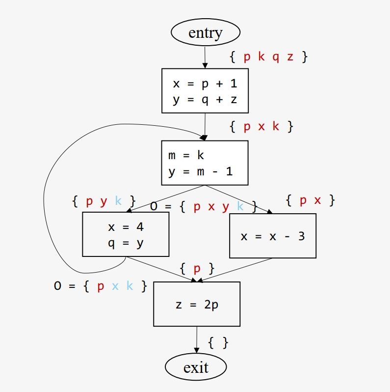

### 可用表达式分析（AEA）
- 可用表达式：一个表达式 $e$ 在程序点 $p$ 处可用需要满足以下条件：
    1. 从程序入口到 $p$ 的**所有路径都必须**经过 $e$ 的求值
    2. 在 $e$ 的最后一次求值后，不存在使 $e$ 失效的操作
- 可用表达式分析（Available Expression Analysis, AEA）：判断该表达式的值是否已被计算过，识别可重用的表达式结果，避免冗余计算优化。
    - 传播方向：正向/前向分析（从程序入口向出口传播）
    - 分析性质：必然性分析（Must Analysis）
- 示例：
    
- 核心思想：
    - 节点通过生成（计算）当前值使 $e$ 变为可用状态
    - 节点通过消除（使失效）当前值使 $e$ 变为不可用状态

    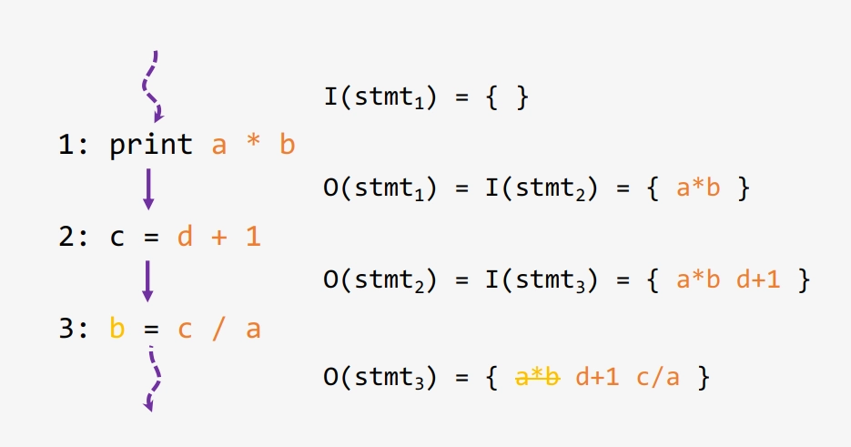
- 数据流方程
    - $gen(n)$：在基本块 $n$ 中计算且之后操作数未被重定义的表达式集合
    - $kill(n)$：因基本块 $n$ 中变量重定义而变得不可用的表达式集合
    - $O(n) = (I(n) \cup gen(n)) - kill(n)$：基本块 $n$ 的出口可用表达式集合
    - $I(n) = \bigcap_{p \in pred(n)} O(p)$：基本块 $n$ 的入口可用表达式集合
        - $pred(n)$：基本块 $n$ 的直接前驱块集合
        - Meet 操作：数据流方程中的集合交集（Intersection）操作，当且仅当表达式在**所有前驱块的出口点可用**时，其在当前块入口点可用
            
- 算法
    - 输入：控制流图 $G$
    - 输出：每个基本块 $B$ 的 $I(B)$ 和 $O(B)$

    ```
    Algorithm AEA:
        for (each b in G\entry)
            O(b) = {}  // 初始化出口可用表达式集合为空
        while (any O changes)  // 迭代直至收敛
            for (each b in G\entry) { // 排除入口块
                I(b) = ∩{O(p) | p ∈ pred(n)}
                O(b) = (I(b) ∪ gen(b)) - kill(b)
            }
    ```
- 示例：
    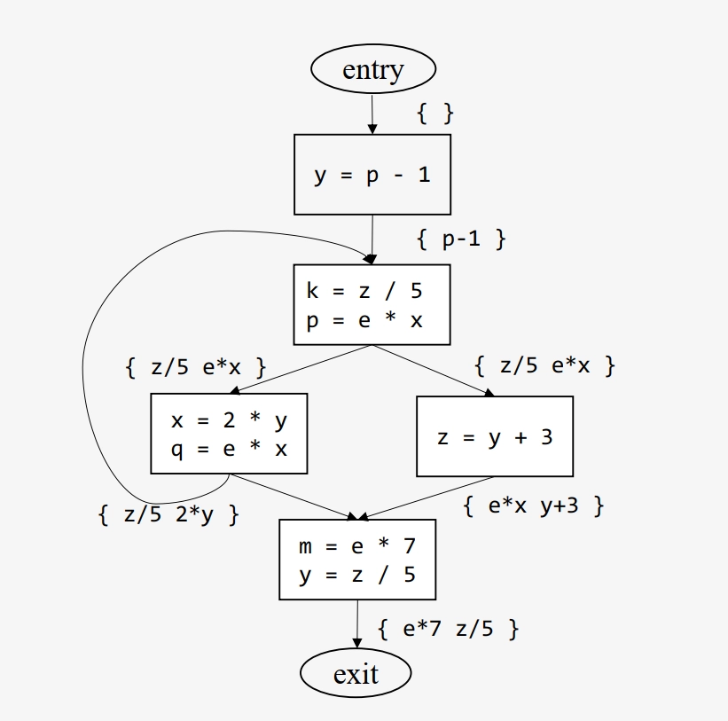

# 人工智能系统安全
## 人工智能与安全概述
- 人工智能定义：利用数字计算机或其控制的机器模拟、延伸和扩展人的智能，感知环境、获取知识并使用知识获得最佳结果的理论、方法、技术和应用系统。
- 人工智能本质：研究如何让机器拥有人类智能的科学技术，模拟人类思考、学习和决策过程。
- 人工智能发展历程
    
- 人工智能安全
    1. **人工智能内生安全**：技术本身脆弱性引发的系统自身安全问题，作用对象为系统本身。
    2. **人工智能衍生安全**：智能模型不安全性给其他领域带来的安全问题，作用对象为智能系统以外的领域。
    3. **人工智能助力安全**：利用人工智能技术提升其他领域安全性（如病毒检测、虚假视频识别），具有正向价值。
- 数据安全：由于训练数据对最终模型的决定性作用，加上数据中所包含的隐私和敏感信息也是攻击者的攻击目标。
    - 数据投毒：通过操纵数据收集或标注过程来污染（毒化）部分训练样本，从而大幅降低最终模型的性能。
    - 数据窃取：从已训练好的模型中逆向工程出训练样本，从而达到窃取原始训练数据的目的。
    - 隐私攻击：利用模型的记忆能力，挖掘模型对特定用户的预测偏好，从而推理出用户的隐私信息。
    - 数据篡改：利用模型的特征学习和数据生成能力，对已有数据进行篡改或者合成全新的虚假数据。
- 模型安全：
    - 对抗攻击：在测试阶段向测试样本中添加对抗噪声，让模型作出错误预测结果，从而破坏模型在实际应用中的性能。
    - 后门攻击：以数据投毒或者修改训练算法的方式，向模型中安插精心设计的后门触发器，从而在测试阶段操纵模型的预测结果。
    - 模型窃取：通过与目标模型交互的方式，训练一个窃取模型来模拟目标模型的结构、功能和性能。

## 机器学习
### 基础概念
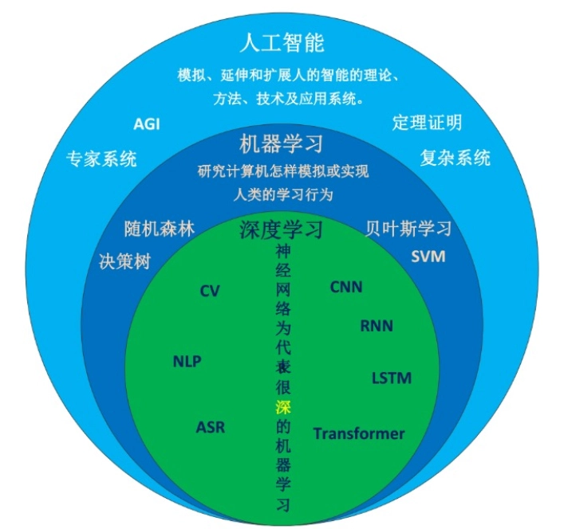

- 机器学习通常指模型从有限的训练样本中利用学习算法自动寻找规律和知识，进而在未知数据上进行决策的过程
    - 根据特定的学习任务设计数学模型（主体），确定从输入到输出的具体映射形式
    - 定义目标函数衡量拟合程度
    - 设计优化策略在训练集上对模型进行迭代更新直到达到目标函数最优值
    - 在验证集上检验模型的泛化能力并挑选最优的模型参数
    - 最终在测试集上进行模型评估
- **机器学习的过程是模型参数优化的过程**
    - **损失函数**：定义了模型的预测错误，即模型的输出 $f(x)$ 与真实标签 $y$ 之间的不一致性，损失函数值越小，一致性越高，模型拟合越好
    - **优化策略**：模型参数的优化过程也就是模型训练的过程，模型在拟合训练数据的过程中不断更新参数直到达到最优目标。
        - 基于梯度的一阶优化方法：SGD、AdaGrad、AdaDelta、 Adam、RMSProp 等
        - 零阶（黑盒）优化方法：网格搜索、随机搜索、遗传算法、进化策略等
        - 二阶优化方法：牛顿法、拟牛顿法（如 BFGS、L-BFGS）等
- **机器学习的目标是训练具有泛化能力的模型**
    - **训练集**是为了某个机器学习任务而收集的数据，代表过去的经验
    - **验证集**是我们在训练过程中选择最优模型的评判依据，代表我们认为的任务环境
    - **测试集**是模型在部署后接收到的“未知样本”，代表真实的任务环境

### 学习范式
#### 有监督学习
- 定义：利用带标签的训练数据集训练模型，学习输入与输出之间的映射关系，从而对未知数据进行预测。
- 输入：带标签的训练数据集 $D=\{(x_i,y_i)\}_{i=1}^N$
- 输出：输入空间到输出空间的映射函数 $f: X \rightarrow Y$
- 训练过程：$\min_{\theta} E_{(x,y)\in D} L(f(x),y)$
- 常见任务：
    - **分类问题**：输出为离散类别标签，每个离散值是一个“类别”。
        - 模型：随机森林、支持向量机、深度神经网络等
    - **回归问题**：输出为连续数值，等价于拟合一个从输入变量映射到输出变量的函数。
        - 模型：线性回归模型、逻辑回归模型、深度神经网络等

#### 无监督学习
- 定义：利用无标签的训练数据集训练模型，学习数据的内在结构和分布特征，从而对未知数据进行分析和理解。
- 输入：无标签的训练数据集 $D=\{x_i\}_{i=1}^N$
- 输出：数据的内在结构和分布特征，如聚类结果、降维表示等
- 训练过程：设计算法 $A$，作用于样本集合 $X$ 得到函数（模型）$f$，所得到的模型将最终作用于数据本身 $X^*(X \subseteq X^*)$ 得到某种分析结果
- 常见任务：
    - **聚类分析**（clustering）
        - 目的是将空间中的数据点按照某种方式聚为对应不同概念的簇（cluster）。簇内距离和簇间距离是衡量聚类方法性能好坏的核心标准，这需要由一个距离度量来定义。
        - 经典的聚类算法包括 k-means、DBSCAN 等
    - **特征降维**（dimensionality reduction）
        - 目的是将高维数据映射到低维空间，用更少维度的特征来替代原始高维度特征，同时最大限度的保留高维特征所包含的信息，从而达到降低时间复杂度、提高数据分析效率、防止模型过拟合的目的。
        - 经典的降维方法包括主成分分析（principal components analysis，PCA） 、t-SNE（t-distributed stochastic neighbor embedding）等
    - **自监督对比学习**（self-supervised contrastive learning）
        - 是通过对比的手段学习样本间的相同和不同特征，从而得到高效的特征抽取模型，能够对输入样本提取具有判别性的有用特征。
        - 对比学习的核心思想在于让“相似”的样本在特征空间更近，让“不相似”的样本在特征空间更远。

#### 强化学习
- 定义：通过与环境的交互学习最优策略，从而在动态环境中实现智能决策和控制。
- 目标：在不确定的复杂交互环境下训练智能体学会从环境中最大化累计奖励
- 特点：与有监督和无监督学习不同，强化学习通过**奖励信号**来获取环境对智能体动作的反馈，得到的结果可能具有一定的延时性，即奖励信号的反馈可能会滞后于决策时间
- 交互对象：
    - **智能体**（agent）可以感知外界环境的状态并得到环境反馈的奖励，并在此过程中进行决策和学习，智能体根据外界环境的状态产生不同的决策，做出相应的动作，并根据外界环境反馈的奖励来学习调整策略
    - **环境**（environment）是指智能体所处的所有外部事物，其状态受智能体动作的影响而改变，并能根据智能体的动作反馈相应的奖励

## 人工智能与安全基础
- 基础概念
    - **攻击者**：对数据、模型及相关过程（收集、训练、部署）发起恶意监听、窃取、干扰或破坏的个人/组织
    - **攻击方法**：攻击者发起攻击的具体手段（软件、程序、算法等）
    - **受害者**：由于受到数据/模型攻击而受到损害的数据/模型所有者、使用者或其他利益相关者
    - **防御者**：通过防御措施保护数据/模型免受潜在恶意攻击的个人/组织，需全面防御所有潜在攻击
    - **防御方法**：防御者保护系统的具体手段（软件、程序、算法、安全协议等）
    - **威胁模型**：定义系统运行环境、安全需求、所面临的安全风险、潜在攻击者、攻击目标、攻击方法、可能的防御策略、防御者可利用的资源等攻防相关的关键信息
    - **目标数据/模型**：攻击者的攻击对象
    - **替代数据/模型**：攻击者自己拥有的、可以用来替代目标数据/模型的傀儡数据/模型，近似目标数据分布或模型功能
- 威胁模型
    - **白盒威胁模型**：
        - **攻击者拥有目标数据/模型的完全访问权限**，注意是访问权限而不是修改权限
        - 攻击者可获取模型参数、训练数据、训练方法、训练超参数等所有关键信息，用来揭示模型脆弱性，评估模型安全风险，衡量评估模型最坏情况下的表现
    - **黑盒威胁模型**：
        - 攻击者仅能通过 API 查询模型并获取输出，而无法获取训练数据、训练方法、模型参数等其他信息
        - 黑盒攻击只能使用模型，而无法知道模型背后的细节信息，是最接近现实场景的攻防假设
    - **灰盒威胁模型**：
        - 攻击者知晓部分目标信息（任务类型、数据类型、模型结构等），但无法获得具体训练数据或模型参数
        - 介于白盒与黑盒之间的中间场景
- 攻击目的
    - **破坏型攻击**（disruptive attack）：
        - 破坏系统功能，动机包括攻击竞争对手、勒索等，手段如数据投毒、修改模型参数。
        - **针对数据的破坏型攻击**：数据投毒，破坏模型正常训练
        - **针对模型的破坏型攻击**：数据投毒、修改模型参数、生成对抗样本等
    - **操纵型攻击**（manipulative attack）：
        - 目的是**控制数据/模型以实现特定目的**，要求更精细化的控制，攻击难度高于破坏型。
        - 动机多样化：让模型做出特定的预测从而躲避检测；盗用别人的身份进行刷脸支付；得到指定的医疗诊断结果进行保险欺诈；操纵智能体等。
        - 操纵型攻击还可以完成破坏型攻击的攻击目标，此时只需要将攻击目标设置成破坏攻击的目标即可
    - **窃取型攻击**（stealing attack）：
        - 目的是通过**窥探数据、模型或者模型的训练过程，以完成对训练数据、训练得到的模型、训练算法等关键信息的窃取**
        - **针对数据的窃取攻击**：窃取整个训练数据集的模型逆向攻击、推断某个样本是否是训练数据集成员的成员推理攻击、以及窃取敏感信息和属性的隐私类攻击等。
        - **对模型的窃取攻击**：可以通过与模型进行交互，即向模型中输入不同的样本并观测其输出的变化，进而采用知识蒸馏的方式训练一个跟目标模型性能相近的模型
- 攻击对象
    - 数据攻击：
        - **数据投毒**：通过污染收集到的训练数据以达到破坏数据、阻碍模型训练的目的
        - **数据窃取**：通过对模型进行逆向工程，从中恢复出原始训练数据
        - **隐私攻击**：通过成员推理攻击等方法泄露原始隐私数据
        - **篡改和伪造**：通过深度学习强大的特征学习和数据生成能力篡改和伪造数据
    - 模型攻击：
        - **对抗攻击**：破坏型攻击目的，思想是让模型在部署使用阶段犯错，其通过向测试样本中添加微小的对抗噪声来让模型做出错误的预测结果
        - **后门攻击**：操纵型攻击目的，通过向目标模型预先注入后门触发器的方式来控制模型在推理阶段的预测结果
        - **模型窃取攻击**：窃取型攻击目的，通过模型部署后的开放接口（比如查询API）对其推理行为进行模仿和近似，以此达到功能和性能窃取的目的
- 防御策略
    - **检测**：检测潜在攻击并拒绝服务，对模型影响最小，最易落地。
    - **增强**：提升模型自身鲁棒性，最根本，难度最高。
    - **法律**：通过法律法规禁止攻击行为，明确责任与惩罚。

## 数据安全
### 数据投毒攻击
- 数据投毒：**训练阶段攻击**，通过污染训练数据干扰模型训练，降低推理性能，是工业界最担心的AI安全问题。
- 攻击类型
    - **标签投毒攻击**
        - 指鹿为马
        - 混淆样本与标签的对应关系（如标签翻转攻击将二分类标签 0/1 随机翻转）
        - 直接破坏数据标注准确性
        - 适用于有监督学习场景
    - **在线投毒攻击**（p-篡改攻击）
        - 暗渡陈仓
        - 在线学习过程中以概率 p 进行投毒
        - 高隐蔽性，使数据分布偏移
        - 适用于在线更新的模型，假设攻击者可以对训练样本进行在线的修改、注入等，但不改动标签
    - **特征空间攻击**
        - 声东击西
        - 修改毒化样本的深度特征，改变样本-类别对应关系
        - 需知晓目标模型，迁移学习场景效果好，对从头训练不强
        - 适用于深度学习模型
    - **生成式攻击**
        - 利用生成对抗网络（GAN）或自动编码器等生成模型学习毒化噪声分布，大规模生成毒化数据
        - 一次训练，无限使用
        - 适用于灰盒/白盒威胁模型

### 隐私攻击
- 隐私攻击：针对深度神经网络的推理攻击，通过模型推理或逆向，获取训练数据相关信息或隐私内容，分为白盒（可获取中间层信息）和黑盒（仅获取模型输出）两种场景。
- 攻击类型
    - **成员推理攻击**（MIA）
        - 主要思想是利用模型在训练/测试数据上的行为差异推理某样本是否属于训练集
        - 通过判定某个样本是否存在于训练数据集中，攻击者可以进一步猜测样本所属的类别以及其他一些隐私信息
        - **影子模型攻击**
            - 首个针对深度学习模型的成员推理攻击方法
            - 思想是把成员推理看作一个“成员/非成员”二分类问题
            - 假设攻击者对训练数据的来源分布是有一些先验知识的，即可以从同一个数据分布总池中采样（但与原训练数据不相交）并构建仿数据集的能力。
            - 攻击步骤：
                1. 攻击者采样多个影子训练集，并在影子训练集上训练多个可以模仿目标模型表现的影子模型；
                2. 根据影子训练集、影子测试集以及影子模型，构建以模型的预测向量输出为样本，以 0 或 1 为标签的攻击训练数据集；
                3. 在攻击训练数据集上训练得到一个二分类器（称为攻击模型）来进行成员推理攻击。
            - 影子训练集与隐私训练集来自于相同分布但不重叠，影子模型和目标模型在同一个机器学习平台上相互独立训练
                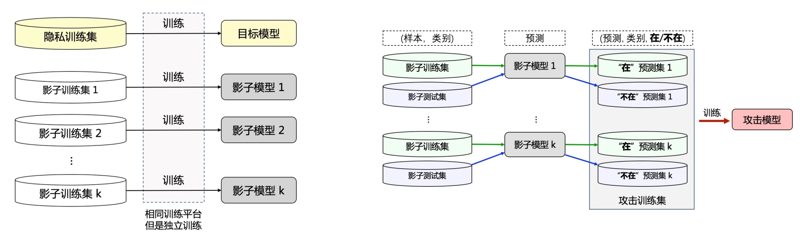
    - **属性推理攻击**（AIA）
        - 来源于模型逆向攻击，是针对个体属性的隐私攻击
        - 基于已发布的目标模型，从给定样本的非敏感属性推断敏感属性
    - **其他推理攻击**
        - 利用智能家居设备的音频、视频数据提取隐私特征
        - 利用语言错误和节奏特征推断用户是否醉酒等等

### 数据窃取攻击
- 数据窃取攻击：从已训练模型中逆向原始训练数据，又称数据抽取攻击或模型逆向攻击。针对的是深度学习模型研究，利用模型对训练数据的记忆特性。
- 与推理攻击的关系
    - 都是重构还原全部或部分训练数据的过程
    - 推理攻击：目的是得到使目标模型以最大概率输出特定类别的数据。其学习训练数据的聚合统计属性，生成合成数据而非真实训练数据。仅泄露单个隐私属性。
    - 数据窃取攻击：目的是最大程度还原训练数据。泄露的是整个数据集，危害更大、影响范围更广，实现难度更高。
- 攻击类型
    - **黑盒数据窃取**
        - 攻击者仅能获取模型输出
        - 主要针对大语言模型——为单词序列分配概率的统计函数
        - 输入特定前缀，诱导模型输出记忆的隐私信息（姓名、手机号等）
    - **白盒数据窃取**
        - 攻击者对目标模型有完全访问权限，可获取模型结构和参数
        - 利用梯度信息逆向（梯度逆向攻击），通过迭代或递归逼近真实数据、
        - 主要针对联邦学习范式

### 数据篡改与伪造
- 数据篡改与伪造：利用**深度伪造**（deepfake）等技术篡改或合成数据，包括普通篡改和人脸伪造，具有门槛低、传播性强的特点。
- 攻击类型
    - **普通篡改**
        - 移动图像中物体的空间位置、抹除原有内容并修复出新伪造内容等
        - 文本指导图像篡改
        - 结构生成器+图像生成器、语义布局操控
    - **深度伪造**
        - 深度人脸伪造特指**基于深度学习技术生成的人脸伪造数据**
        - 人脸替换、语音合成、视频伪造
        - 深度学习技术：生成对抗网络（GAN）、扩散模型、自动编解码器
        - 思想源于“零和博弈”
        - 实现步骤
            1. **数据收集**：收集目标人物的人脸图像并截取人脸区域。
            2. **模型训练**：基于自动编解码器训练，编码器提取特征（参数共享），解码器重构图像。
            3. **伪造生成**：互换解码器，生成载有目标人脸与他人身体的伪造内容。

### 数据安全防御
1. 鲁棒训练
    - 核心思想：提高训练算法鲁棒性，训练过程中检测并抛弃毒化样本。
    - 实现方式：基于修剪损失（trimmed loss），选择损失最小的样本子集训练模型，避开噪声标签、后门样本等问题数据，在这个样本子集上训练得到干净的模型。
2. 差分隐私（DP）
    - 定义：相邻数据集（只差一条记录）经随机算法处理后，输出概率分布差异极小，攻击者无法区分。
    - 关键参数：隐私预算 $\epsilon$（越小隐私保护越好）、隐私失效概率 $\delta$。
    - 应用层面：
        - 输入空间：训练生成模型，在差分隐私机制下生成带噪声的合成数据替代原始数据用于训练。
        - 隐藏空间：通过 DP-SGD 算法，对梯度裁剪并添加噪声，保护模型参数。
        - 输出空间：扰动目标函数（如多项式近似），避免直接扰动输出结果。
3. 联邦学习
    - 定义：分布式机器学习算法，在数据不出本地的前提下，进行数据的联合训练，建立共享模型。
    - 流程：全局模型初始化 $\to$ 本地模型训练 $\to$ 参数密态传输 $\to$ 模型聚合 $\to$ 多轮迭代。
    - 数据集：
        - $X$：特征空间（feature space）
        - $Y$：标签空间（label space）
        - $I$：样本 ID 空间（sample ID space）
    - 分类：
        - **横向联邦学习**
            - 基于样本的联邦学习
            - 特征空间相同，样本空间不同
                
            - 各参与方在本地数据集上训练模型，定期上传模型参数进行聚合
            - 目的是扩展样本数量提升精度
            - 适用于同行业跨地区合作（如不同地区银行）
        - **纵向联邦学习**
            - 基于特征的联邦学习
            - 样本空间相同，特征空间不同
                
            - 各参与方通过共享模型梯度或中间特征协作训练联合模型
            - 流程：样本对齐 $\to$ 中间结果计算和上传 $\to$ 梯度计算和下发 $\to$ 模型更新
            - 目的是扩展特征数量提升精度
            - 适用于跨行业合作（如银行与电商）
        - **联邦迁移学习**
            - 结合前两者优势
            - 样本和特征空间重叠少
                
            - 流程：特征和样本对齐 $\to$ 迁移学习模型初始化 $\to$ 联合模型训练 $\to$ 联邦优化与更新
            - 适用于跨行业合作、数据稀缺场景、跨地域模型训练（不同地区的银行和电商）
4. 篡改与深伪检测
    - **通用篡改检测**：图像中普通物体篡改（拼接、复制-移动、消除）
        - **用相机成像过程中引入的像素间的相关性来进行分析**：横向色差（lateral chromatic aberration，LCA）（可被后期算法校正）
        - **利用图像（及其所含噪声）的频域特征或统计特征进行检测**：图像非均匀响应噪声（photo-response nonuniformity noise，PRNU）（相机传感器的指纹）
        - **基于深度学习模型（比如卷积神经网络）**：得到的检测精度和鲁棒性更优，将中值滤波器与卷积神经网络结合，先对图像进行中值滤波处理，再送入卷积神经网络，以此提升图像篡改检测的精度
    - **深度伪造检测**：人脸篡改内容
        - **基于统计特征的检测**：提取人脸进行“真实/伪造”二分类检测，基于色彩空间特征的检测
        - **基于 GAN 指纹的检测**：期望最大化（expectation maximization）算法提取局部特征来对卷积痕迹进行建模
        - **基于局部一致性的检测**：修改/替换区域与周围区域存在不一致性

## 模型安全
### 对抗攻击
- 对抗攻击：**测试阶段攻击**，通过向干净测试样本添加人眼无法察觉的细微噪声构造**对抗样本**，误导模型做出错误预测。
- 攻击类型
    - **白盒攻击**
        - 攻击者可获取目标模型全部信息，包括训练数据、超参数、激活函数、模型架构与参数等
    - **黑盒攻击**
        - 攻击者仅能获取模型输出（逻辑值或概率）
    - **物理攻击**
        - 针对真实环境输入（摄像头、传感器采集）而非数字输入，需要特殊的物理世界攻击（physical-world attack）方法来增强它们在真实环境中的对抗性
        - 生成可见但不显眼，只作用于目标物体而非环境的扰动，且对不同距离和角度具有较高鲁棒性
        - 对图片的局部区域进行较大幅度的对抗扰动，生成强对抗性补丁，可以打印出来在物理场景中攻击
- 对抗防御
    - **对抗样本检测**（AED）
        - 训练“正常/对抗”二分类检测器
        - 收集一定数量的正常样本和其对应的对抗样本，然后基于要保护的模型抽取不同类型的特征，比如中间层特征、激活分布等
        - 被动防御，模型本身不鲁棒，但可以检测对抗攻击并拒绝服务
    - **对抗训练**
        - 在对抗样本与正常样本混合数据集上训练模型，提升模型鲁棒性
        - 主动防御（最有效），提升模型本身鲁棒性

### 后门攻击
- 后门攻击：**训练阶段攻击**，攻击者在训练开始前或者训练过程中通过某种方式往目标模型中安插后门触发器，从而可以在测试阶段精准的控制模型的预测结果
- 目标：
    - 后门模型在干净测试样本上具有正常的准确率
    - 当且仅当测试样本中包含预先设定的后门触发器时，后门模型才会产生由攻击者预先指定的预测结果
- 操作：
    - **后门植入**：训练阶段，攻击者将预先定义的后门触发器植入目标模型中，从而获得一个后门模型
    - **后门激活**：推理阶段，任何包含后门触发器的测试样本都会激活后门，并控制模型输出攻击者指定的预测结果
- 与数据投毒攻击的关系
    - 后门攻击是一种特殊的数据投毒攻击，但实现方式不局限于数据投毒，也可以直接修改模型参数
    - 数据投毒攻击：目标是降低模型泛化性能，无特定触发条件。
    - 后门攻击：目标是通过触发器控制模型输出，不改变原始决策边界，仅添加新边界。（有目标攻击、操纵型攻击）

    
- 攻击类型
    - **输入空间攻击**
        - 训练任务外包给第三方平台，或使用公开预训练模型进行微调，存在后门风险
        - 第三方训练阶段植入含触发器的中毒样本（输入+触发器+错误标签），或上传含后门的模型
    - **模型空间攻击**
        - 不依赖数据投毒
        - 逆向预训练模型生成后门触发器，通过微调将触发器植入模型
        - 要求攻击者在不能访问原始训练数据的前提下，对给定模型实施后门攻击
- 后门防御
    - **后门模型检测**
        - 目标是判断给定模型是否包含后门触发器
        - 可以根据模型在某种情况下展现出来的后门表现来判断
        - 如：神经净化方法，通过寻找类别间最近距离判断是否含后门
    - **后门样本检测**
        - 目标是识别训练数据集或者测试数据集中的后门样本
            - 对训练样本的检测可以帮助防御者清洗训练数据
            - 对测试样本的检测可以在模型部署阶段发现并拒绝后门攻击行为
        - 如：基于激活值聚类
    - **后门移除**
        - 目标：在保持模型正常性能不下降的前提下，移除模型中的后门
        - **训练中移除**：检测并抛弃后门样本，反学习遗忘后门
            - 后门攻击的两个弱点：
                - 后门样本比干净样本被模型学的更快，而且后门攻击越强，模型在后门样本上的收敛速度就越快
                - 后门触发器与后门标签之间存在强关联
            - 反后门学习：**在毒化数据上训练一个干净无后门的模型**
                1. 局部梯度上升：控制 Loss 不要太高
                2. 后门样本检测：Loss 低的是后门样本
                3. 全局梯度上升：**在后门样本上做反学习**——最大化模型在后门数据上的损失，让模型主动遗忘这些样本
        - **训练后移除**：剪枝后门神经元 + 干净数据微调、蒸馏
            - 精细剪枝方法：剪枝 + 微调
                - 剪枝：模型压缩技术，移除后门神经元（由于后门神经元只能被后门数据激活，干净数据上休眠的神经元大概率是后门神经元）
                - 微调：剪枝后性能下降，利用干净数据微调恢复性能

### 模型窃取攻击
- 模型窃取：**测试阶段攻击**，通过与目标模型交互，训练功能和性能相近的**窃取模型**，规避昂贵的模型训练成本。
    - 攻击者通过有限次数的黑盒访问受害者模型的 API 接口，向模型输入不同的查询样本并观察受害者模型输出的变化，然后通过不断地调整查询样本来获取受害者模型更多的决策边界信息。
- 攻击类型
    - **基于方程式求解的攻击**
        - 根据目标模型的相关信息构建方程组，通过输入输出求解方程，得到与目标模型相似的模型参数（即窃取模型）
            
        - 攻击算法：
            - 参数个数为 $d$
            - 通过 $d+1$ 个输入，构造 $d+1$ 个下列方程
                $$\theta^\top x_i = \sigma^{-1}(f(x_i)) \quad i=1,2,\ldots,d+1$$
            - 求解方程得到 $\theta$
        - **特点**：
            - 针对传统机器学习模型：SVM、LR、DT
            - 可精确求解，需模型返回精确置信度
            - 窃取得到的模型还可能泄露训练数据（数据逆向攻击）
    - **基于替代模型的攻击**
        - 在不知道目标模型任何先验知识的情况下，输入查询样本并得到预测输出，据此构建替代训练数据集 $D^\prime=\{(x,f(x))\}_{i=1}^m$，训练替代模型
            
- 模型窃取防御
    - **信息模糊**
        - 在保证模型性能的前提下，对模型输出进行模糊化处理，尽可能扰动输出向量以保护隐私
        - 方法：
            - 截断混淆：取整或截断输出概率
            - 差分隐私：对模型添加随机噪声扰动
    - **查询控制**
        - 保证用户正常使用模型 API 接口的情况下，根据用户查询行为判别正常用户和攻击者，从而在模型输入阶段实现精准控制与防御
        - 识别“拼图式”窃取行为（通过大量查询样本拼凑出模型决策边界）
        - 控制所有用户的查询次数和查询频率
    - **模型溯源**
        - 泄露已经发生后，通过**溯源技术**证明模型所有权，即**两个模型是同源的且窃取模型是受害者模型的衍生品**
        - 方法：
            - **模型水印**：为机器学习模型植入“隐形印记”
                - **侵入式**保护
                - 白盒水印：直接修改模型的内部参数（如权重、偏置、神经元），验证者需要访问模型的内部参数来检查水印是否存在。
                - 黑盒水印：构造特殊“触发样本”改变模型的决策边界（类似于后门）。验证者只需通过查询模型的输入输出行为来检测水印，无需访问模型内部。
            - **模型指纹**：提取模型指纹作为模型唯一标识
                - **非侵入式**保护
                - 指纹生成阶段：模型所有者基于模型的独有特性提取得到指纹
                - 指纹验证阶段：模型所有者将指纹样本通过调用可疑模型的 API 接口，计算受害者模型和可疑模型在一个样本子集上的输出匹配率，从而验证模型版权

# 数据库安全
## 数据库概述
### 核心概念
- **数据**：描述客观事物的符号记录，是数据库存储的基本对象，形式包括数字、文字、图形、图像、声音等。
    - 基础，处理的原材料
- **数据库（DB）**：长期存储在计算机内、有组织的、可共享的、统一管理的数据集合。
    - 数据的集合
- **数据库管理系统（DBMS）**：位于用户与操作系统之间的系统软件，负责数据库的建立、运行、维护的集中管理与控制。
    - 管理和操作数据库的核心
- **数据库应用系统（DBAS）**：为满足特定应用需求开发的软件系统，通过调用 DBMS 管理和使用数据库。
    - 面向用户的具体软件程序
- **数据库系统（DBS）**：引入数据库后的完整计算机系统集合，包含数据库、DBMS（及应用开发工具）、DBAS、数据库管理员和用户。
    - 含上述所有元素和人员的整体

### 数据库体系结构（ANSI/SPARC 体系结构）
| 特性维度 | 外模式 | 概念模式 | 内模式 |
| --- | --- | --- | --- |
| 别名 | 子模式、用户模式 | 逻辑模式 | 存储模式 |
| 层级 | 最高层（最接近用户） | 中间层（核心与枢纽） | 最底层（最接近硬件） |
| 定义 | 数据库用户能够看见和使用的**局部数据的逻辑结构和特征**的描述 | 数据库中**全部数据的全局逻辑结构和特征**的描述 | 数据**物理结构和存储方式**的描述 |
| 数量 | **多个**（一个数据库可有多个外模式） | **一个**（一个数据库只有一个模式） | **一个**（一个数据库只有一个内模式） |
| 面向对象 | 最终用户或应用程序员 | 数据库管理员和系统设计师 | 系统管理员或 DBMS 本身 |
| 主要内容 | 1. 视图</br> 2. 部分基本表</br> 3. 局部数据的逻辑关系与约束 | 1. 所有基本表、字段、数据类型</br> 2. 数据之间的联系（主键、外键）</br> 3. 完整性约束、安全检查 | 1. 数据文件格式、存储位置</br> 2. 索引组织方式（如 B+ 树）</br> 3. 数据压缩、加密方法</br> 4. 记录存储方式（堆文件、顺序） |
| 关注点 | **用户**需要什么数据 | 数据**是什么**，以及数据之间的**逻辑关系** | 数据**如何存储**在计算机中 |
| 数据抽象级别 | 视图级 | 逻辑级 | 物理级 |
| 例子 | 1. 学生视图：可见姓名、课程、成绩</br> 2. 教师视图：可见姓名、课程、工资（不可见学生住址） | 整个学校数据库的完整逻辑设计，包含学生、课程、教师、成绩等所有表及其关系 | 1. 数据文件 `student.dat` 存储在 `/data/` 目录</br> 2. 使用 B+ 树索引学号字段</br> 3. 记录采用行存储格式 |
| 独立性作用 | 通过**外模式/模式映像**实现**逻辑独立性** | 承上启下的**核心层** | 通过**模式/内模式映像**实现**物理独立性** |

### 数据库管理系统（DBMS）
- **数据库管理系统是数据库系统的核心**，是为数据库的建立、运用和维护而配置的软件
- 核心功能

    | 序号 | 功能名称 | 核心描述 |
    | --- | --- | --- |
    | 1 | **数据存储、检索与更新** | 最基本功能，提供数据**存入**、**查询**（检索）、**修改/删除**（更新）能力，通常通过 SQL 语言实现 |
    | 2 | **用户可访问的目录** | 提供集中的**数据字典**（系统目录），存储数据库元数据（表、字段、类型、约束、权限等），供用户和 DBMS 查询 |
    | 3 | **事务管理** | 保证一组数据库操作要么**全部成功**（提交），要么**全部失败**（回滚），确保数据库从一个一致性状态转换到另一个一致性状态 |
    | 4 | **并发控制** | 多用户同时访问修改数据时，通过**锁机制**或多版本并发控制等技术，协调并发操作，防止数据不一致（如丢失更新、脏读） |
    | 5 | **恢复服务** | 系统故障后，利用**日志文件和备份**将数据库恢复到一致状态，防止数据丢失 |
    | 6 | **授权与安全性管理** | 通过用户名、密码、权限设置（如 SELECT、INSERT、UPDATE 权限）控制用户访问，防止未授权操作 |
    | 7 | **数据完整性管理** | 强制执行数据完整性规则，包括**实体完整性**（主键唯一非空）、**参照完整性**（外键约束）和**用户定义的完整性**（如年龄 > 0） |
    | 8 | **数据通信接口** | 支持用户应用程序与 DBMS 的通信，如通过 ODBC、JDBC 等标准接口 |
    | 9 | **数据独立性服务** | 通过**三级模式结构**和**二级映像**功能，实现**物理独立性**和**逻辑独立性**，使应用程序不依赖数据的物理存储和全局逻辑结构 |
    | 10 | **完整性约束与业务规则执行** | 定义和执行复杂**业务规则**（如触发器、存储过程），确保数据变化符合企业逻辑 |
- 核心组件及功能
    - **查询处理器**：DBMS 的“大脑”，负责接收、解析、优化并执行用户查询
        - 功能：将高级 SQL 转换为底层指令
        - 子组件
            1. DDL 解释器：解释执行 CREATE、ALTER、DROP 等**数据定义语言**命令，维护数据字典元数据
            2. DML 编译器：解释执行 SELECT、INSERT、UPDATE、DELETE 等**数据操纵语言**命令，转换为底层指令
            3. 查询优化器：DML 编译器的核心，负责选择最高效执行策略（如索引选择、表连接方式），最小化 CPU、I/O 成本
            4. 目录管理器：管理和访问数据字典中的元数据
    - **存储管理器**：DBMS 的“双手”，负责在磁盘上高效地存储、检索和管理实际数据
        - 功能：高效处理数据在磁盘和内存间的移动，并确保数据完整性和安全性
        - 子组件
            1. 缓冲区管理器：管理内存数据缓冲区，决定磁盘数据块的调入调出，影响系统性能的关键组件
            2. 文件管理器：管理磁盘上的文件和数据存储结构
            3. 权限与完整性管理器：检查用户操作权限，验证数据操作是否符合完整性约束
    - **事务管理与恢复管理器**：DBMS 的“安全卫士”，确保数据库操作的可靠性和一致性
        - 功能：协调并发操作，在故障时恢复数据库到一致状态
        - 子组件
            1. 并发控制管理器（锁管理器）：控制多事务并发访问，通过锁机制保证事务隔离性
            2. 恢复管理器（日志管理器）：维护日志文件，记录事务修改操作，故障后通过日志恢复（重做已提交、撤销未提交事务）以恢复到一致状态
    - **其他核心组件**：
        1. 数据字典（系统目录）：特殊“数据库”，存储数据库结构元数据（表、列、索引、用户、权限等），为所有组件提供支持
        2. 磁盘存储器：包含数据文件（存储实际数据）、数据字典、索引文件（加速访问）、日志文件（用于恢复）
- 组件协同工作流程
    

    1. 接收用户的高级查询（查询处理器）
    2. 高效查找和操作数据（存储管理器）
    3. 同时服务多个用户而不产生混乱（事务管理器）
    4. 故障时保护数据（恢复管理器）
    5. 通过数据字典维护数据组织信息（数据字典）

## 数据库安全风险
1. **硬件故障与灾害破坏**：支持数据库系统的硬件环境发生故障。
    - 断电导致信息丢失、硬盘故障致使数据不可读、地震等自然灾害造成硬件损毁。
2. **数据库系统/应用软件漏洞利用**：黑客或内部恶意用户针对数据库系统或应用系统漏洞进行攻击。
    - SQL 注入
3. **人为错误**：操作人员或系统用户错误输入、应用程序不正确使用，导致安全机制失效，引发非法访问或服务中断。
4. **管理漏洞**：数据库管理员专业知识不足，不能很好地利用数据库的保护机制和安全策略。
    - 权限分配不合理、未按时备份恢复、未审核审计日志，无法及时发现和阻止攻击。
5. **核心技术依赖风险**：我国使用的 DBMS 大多来自国外，安全依赖国外公司，存在潜在风险。
6. **隐私数据泄漏**：数据库中限制公开的个人隐私数据被非法泄露或滥用。

## 数据库安全机制
- 安全需求
    1. **保密性**：防止数据泄露和未授权获取。
    2. **完整性**：包括物理完整性、逻辑完整性和数据元素取值的准确性。
    3. **可用性**/可存活性：确保数据库服务不因人为/自然的原因对授权用户不可用，尤其是在遭受攻击或发生错误的情况下能够继续提供核心服务并及时恢复全部服务。
    4. **可控性**：监控数据操作和系统事件，对违规事件具备监控、记录和事后追查能力。
    5. **隐私性**：保护使用主体个人隐私不被泄露和滥用。

### 保密性控制
- 数据库的首要安全问题是保护数据库不被非授权访问造成数据泄露、更改或破坏。**访问控制是实现这一目的重要途径**。
- 数据库的访问控制包括在数据库系统这一级中提供用户认证和访问控制，以及在数据存储这一级采用密码技术加密存储。
    1. **用户认证**
        - 核心：用户标识与鉴别，通过核对 ID、口令等认证信息决定系统使用权。
        - 用户进入数据库需依次经过操作系统和 DBMS 两次认证，提升安全性，阻止未授权用户操作。
    2. 访问控制特性
        - **难度远高于操作系统**：
            - 数据库内库表、记录、字段存在关联关系，控制粒度需细化到记录和字段级；
            - 操作系统中文件无关联关系，且控制粒度为文件；
            - 数据库还存在推理泄露问题。
        - 高安全等级数据库强制要求 MAC 机制
            - 基于标签的 MAC（强制访问控制），用户安全级别与数据安全标签比对后决定是否允许访问。
    3. 加密存储
        - **库内加密**：
            - 在 DBMS 内核层实现加密
            - 加密/解密对用户与应用透明，数据进入 DBMS 前为明文，DBMS 在物理存取前完成加解密
            - 优点
                1. 加密功能强，不影响 DBMS 原有功能
                2. 对应用完全透明
            - 缺点
                1. 系统性能影响大，加重数据库服务器负担
                2. 密钥管理安全风险大，密钥与数据库同存，密钥安全依赖 DBMS 访问控制
        - **库外加密**：
            - 在 DBMS 之外（客户端或专门加密服务器）实现加密
            - DBMS 管理密文，加解密在外部完成
            - 优点
                1. 减少数据库服务器与 DBMS 运行负担
                2. 密钥与数据分开存储，安全性高
                3. 可实现端到端密文传输
            - 缺点
                1. 加密后数据库部分功能受限制

### 完整性控制
- 完整性目标
    - 防止错误信息输入输出，避免数据库存在不符合语义的数据。
    - 防止数据被非授权插入、破坏和删除。
- 完整性：
    - **物理完整性**
        - 要求：从硬件和环境层面保护数据，防止数据被破坏或不可读
        - 依赖计算机系统硬件可靠性、安全性及环境安全保障措施
    - **逻辑完整性**
        - 要求：
            - **保持数据库逻辑结构完整**，限制数据库创建/删除、库表创建/删除/更改操作权限，仅允许数据库拥有者或系统管理员执行
            - **数据库结构和库表结构设计的合理性**，尽量减少字段与字段、库表与库表之间不必要的关联和冗余字段
        - 主要是设计者的责任，由系统管理员与数据库拥有者负责保证数据库结构不被随意修改
    - **数据元素取值的准确性和正确性（元素完整性）**
        - 要求：**保持数据字段内容的正确性与准确性**
        - 由 DBMS、应用软件开发者和用户共同协作
            - 提供完整性约束条件定义机制
            - 提供完整性检查方法
            - 违约处理

### 可用性保护
- **备份与恢复**
    - 定义：将数据库**从错误状态恢复到某一已知的正确状态**的功能。
    - 关键技术：
        1. **数据转储**：DBA 定期将整个数据库复制到磁带或其他磁盘，生成后备/后援副本。
        2. **登记日志文件**：记录事务对数据库的更新操作，作为恢复依据。
        3. **数据库镜像**：自动将数据库或关键数据复制到另一个磁盘，主数据库更新时 DBMS 自动同步镜像数据，即 DBMS 自动保证镜像与主数据的一致性，避免磁盘故障影响可用性。
- **入侵容忍**
    - 定义：系统遭受入侵或组件被破坏时，整个系统仍能提供全部或降级服务，同时保持数据机密性和完整性等安全属性。
    - 关键技术：
        1. 冗余组件技术：组件失效时，其他冗余组件替代执行功能。
        2. 多样性：冗余组件采用不同设计实现方法，避免共同安全漏洞。
        3. 复制技术：服务器多备份部署。
        4. 门限密码技术：通过秘密共享技术冗余分割保护敏感数据和系统部件。
        5. 代理技术：通过代理服务器接收所有请求，过滤风险操作。

### 可控性实现
- **审计**
    - 定义：监视和记录用户对数据库的所有操作，生成审计日志。
    - 作用：重现数据库状态变化过程，追查非法存取数据的用户、时间和内容，明确责任。
    - 注意事项：需平衡审计粒度、审计对象与存储空间消耗。
- **可信记录保持**
    - 定义：在记录的生命周期内保证记录无法被删除、隐藏或篡改，且无法恢复或推测已删除记录。
    - 防护重点：防止内部人员恶意篡改和销毁记录（防止内部攻击）。
    - 关键技术：
        1. 建立记录索引，支持海量数据快速查找。
        2. **可信迁移技术**：确保记录在多台存储服务器间迁移时，即使执行者为最高权限攻击者，迁移后记录仍可信。

### 隐私性保护
- 保护原则
    1. **用途定义**（Purpose Specification）：对收集和存储在数据库中的每一条个人信息都应该给出相应的用途描述。
    2. **提供者同意**（Consent）：信息用途需获得提供者同意。
    3. **收集限制**（Limited Collection）：收集范围限制在满足用途的最小需求。
    4. **使用限制**（Limited Use）：仅允许与收集用途一致的查询操作。
    5. **泄露限制**（Limited Disclosure）：不允许与外界进行与信息提供者同意用途不符的数据交流。
    6. **保留限制**（Limited Retention）：仅在完成必要用途期间保留个人信息。
    7. **准确**（Accuracy）：保证个人信息准确且最新。
    8. **安全**（Safety）：采取安全措施防止信息被盗或挪用。
    9. **开放**（Openness）：信息拥有者可访问自身存储在数据库中的所有信息。
    10. **执行**（Compliance）：信息拥有者可验证上述规则执行情况，数据库需重视规则落地。
- 保护技术
    1. **数据失真技术**：通过添加噪音或扰动使敏感数据失真，保留统计属性供研究使用，效率高但存在少量信息丢失。
    2. **数据加密技术**：采用多种加密算法隐藏敏感数据。
    3. **限制发布技术**：选择性发布原始数据，不发布或低精度发布敏感数据。

# 密码学基础
## 密码学基本概念
- 发展历程
    1. 早期：密码的系统性应用始于**军事**领域，经历了手写文字通信密码、电报通信密码两个阶段。
    2. 现代转型：20 世纪 50 年代后**与计算机紧密结合**；20 世纪 70 年代随着网络和数字化技术发展，进入**基于数字化信息和网络通信的密码学**阶段。
    3. 关键里程碑：
        - 1977 年，数据加密标准（**DES**）公布，推动商用数据加密发展。
        - 1995 年，NIST公布高级加密标准（**AES**）。
        - 20 世纪 90 年代，**公钥密码成为发展新方向**，满足网络保密通信、数据交换、电子签名等需求。
    4. 现状：研究与应用渗透到几乎所有社会活动领域，新主题不断涌现。
- 现代密码学内容
    - 传统密码学：保密通信
    - 现代密码学：**保证数据的保密性、完整性、不可否认性和可认证性**。
        - 涵盖**数据加密、密码分析、数字签名、身份认证、秘密分享**等，覆盖数据处理全环节。
    - 新兴方向：量子密码、DNA 密码、抗量子计算密码、混沌密码等。
- 密码体制基本组成
    1. 明文（$M$/Message, $P$/Plain Text）：可直接读懂的原始消息，是待加密的对象。
    2. 密文（$C$/Cypher Text）：明文经加密变换后形成的隐蔽信息，通常无法直接理解。
    3. 加密（$E$/Encryption）：将明文转换为密文的过程。
    4. 解密（$D$/Decryption）：将密文还原为明文的过程。
    5. 密钥（$K$/Key）：加密和解密过程的控制参数，分为加密密钥（$K_e$）和解密密钥（$K_d$），不同密钥值会导致加解密结果不同。
- 密码体制分类
    1. 对称密码体制（单钥/私钥密码体制）
        - 加密密钥与解密密钥相同或实质上等价（$K = K_e = K_d$），由一个可轻易推出另一个。
    2. 非对称密码体制（公钥/双密钥密码体制）
        - 加密密钥与解密密钥不同（$K_e \neq K_d$），且计算上无法由 $K_e$ 推出 $K_d$，公钥可公开而不影响私钥安全。

## 对称密码算法
- 分类及特点
    - **分组密码**（块密码，Block Cipher）
        - 核心原理：将明文分成多个等长数据块（分组），对每个块用相同密钥和处理过程进行加解密，通常通过混淆和扩散功能部件的多次迭代实现。
        - 优势：无需产生长密钥，适应能力强。
        - 适用场景：大数据量加密。
        - 典型示例：DES（64 位分组）、AES（128 位分组）。
    - **序列密码**（流密码，Stream Cipher）
        - 核心原理：将明文的每个字符或位逐个与密钥的对应分量进行加解密计算。
        - 主要任务：快速生成与明文长度相同的“密钥流”。
        - 安全基础：密钥序列的随机性和不可预测性。
        - 优势：实时性好。
        - 适用场景：电话、视频通信等实时性要求高的场景。
        - 典型示例：RC 系列算法。
    - 消息认证码
    - 哈希函数
    - 认证加密算法
- 高级加密标准（AES）
    - 基本概况：2001 年 NIST 采纳 Rijndael 算法作为 AES，集安全性、效率、可实现性及灵活性于一体，是目前最流行的对称加密算法之一。
    - 核心参数：
        - 分组长度：固定为 128 位。
        - 密钥长度：可变，支持 128 位、192 位、256 位，对应算法分别为 AES-128、AES-192、AES-256。
        - 设计思想：多轮替换-置换迭代型算法，替换提供混乱性，置换提供扩散性。
    - 算法流程：
        
    - 算法评价：
        - **安全性好**：整体安全，主要威胁为旁路攻击（不直接攻击加密系统，而是通过搜集和分析密码系统运行设备的计时信息、电能消耗等间接获取线索）。
        - **适用性好**：对内存需求低，适合计算资源或存储资源受限的环境。

## 公钥密码算法
- 公钥密码体制
    - 起源：1976 年 Diffie 和 Hellman 发表《New Direction in Cryptography》，提出 Diffie-Hellman 密钥交换协议，开创公钥密码学，二人于 2016 年获图灵奖。
    - 核心流程：
        - 接收方 B 生成公钥（$PK_B$）和私钥（$SK_B$），公钥公开（如存入密钥分发中心），私钥自行保存
        - 发送方 A 获取 B 的公钥，用其加密明文 $M$ 得到密文 $C=E_{PK_B}(M)$
        - B 接收密文后，用私钥解密 $C=D_{SK_B}(C)$，还原得到明文 $M$。
    - **核心特点**：
        - 密钥对易计算生成。
        - 公钥加密、私钥解密在计算上可行。
        - 由公钥推私钥、由密文和公钥恢复明文在计算上不可行。
- RSA 公钥密码算法
    - 概况：目前应用最广泛的公钥算法之一，首个可同时用于加密和数字签名的算法，易于理解和操作，经多年攻击考验，安全性被广泛认可。
    - 算法步骤：
        - 密钥生成：
            1. 随机生成两个大素数 $p$ 和 $q$（保密），计算 $n=pq$（公开）
            2. 计算欧拉函数 $\varphi(n)=(p-1)(q-1)$（保密）
            3. 生成加密密钥 $e$：满足 $1<e<\varphi(n)$ 且  $\gcd(e,\varphi(n))=1$（公开）
            4. 计算解密密钥 $d$：满足 $de \equiv 1 \bmod \varphi(n)$（保密）。
            5. 销毁 $p$、$q$、$\varphi(n)$，公开公钥 $\{e,n\}$，保管私钥 $\{d,n\}$。
        - 加解密过程：
            1. 明文处理：将明文数字化，取长度小于 $\log_2 n$ 位的数字作为明文块。
            2. 加密：$C=E(M) \equiv M^e \bmod n$。
            3. 解密：$M=D(C) \equiv C^d \bmod n$。
    - 安全性：
        - 安全基础：基于群 $\mathbb{Z}_n$ 中大整数因子分解的困难性，破解 RSA 的核心难度等同于分解 $n$（即由 $n$ 找到 $p$ 和 $q$）。
        - 特性：密文统计独立且分布均匀，无法通过已知明文-密文对破解后续密文。
        - 潜在威胁：量子计算机的研制和应用可能突破其安全性。

## 密钥管理
- 重要性：密码技术依赖密钥，密钥的安全管理是密码应用的关键环节。
- **核心任务**：
    - 在不安全环境中安全、正确、有效地分发密钥。
    - 全生命周期管理：涵盖密钥的产生、分配、使用、存储、备份/恢复、更新、撤销和销毁，遵循安全策略。
- 对称密码体制的密钥传递：通过混合密码系统解决不安全环境下的密钥传递问题。
- 公钥密码体制的公钥管理
    - 核心问题：
        - 如何分发和获取用户公钥。
        - 如何建立和维护用户与公钥的对应关系，鉴别公钥真实性。
        - 通信争议的仲裁。
        - 签名与加密的顺序问题：**先签名后加密易遭重放攻击**，**先加密后签名易遭中间人攻击**。
    - 解决方案：**公钥基础设施**（Public Key Infrastructure，PKI）
        - 定义：基于公钥密码理论技术的综合安全平台，由权威第三方机构集中管理用户公私钥。
        - 功能：为所有网络应用透明地提供加密和数字签名等密码服务所必需的密钥和证书管理。
        - 目的：在不安全的网络中保证通信信息的安全、真实、完整和不可否认

## 密码学最新进展
### 量子密码
- 核心思想：
    - 并非加密消息的算法，而是**利用量子力学原理实现绝对安全的密钥分发**技术。
    - 解决：**如何让通信双方共享一个绝对保密的随机密钥，并确保密钥在分发过程中没有被窃听**。
    - 最著名和应用最广泛的量子密码技术：**量子密钥分发**（quantum key distribution，QKD）
        - 核心价值：解决密钥分发过程中的窃听检测问题，建立数学上无法破解的安全通信链路。
- 基本原理：安全性基于物理定律，而非数学计算复杂度。
    - **测不准原理**：测量行为会干扰被测量系统，窃听量子信号（如单个光子）会引入可检测的异常和错误。
    - **不可克隆定理**：无法创建未知量子态的完全复制品，窃听者无法悄悄复制量子密钥并转发，而不留下任何痕迹。
- 工作流程：
    - Alice（发送方）想和 Bob（接收方）共享一个密钥
    - **量子传输**：
        - Alice 随机生成比特串，随机选择两种不同编码方式（如不同的光子偏振滤镜）通过单个光子发送给 Bob
        - Bob 随机选择一种解码方式测量
    - **基矢比对**：
        - 双方通过公开经典信道确认编码/解码方式，但不透露比特值本身
        - 只保留使用相同方式的比特位，形成原始密钥
    - **窃听检测**：
        - 双方随机抽取部分原始密钥公开比对
        - 错误率为零或非常低则信道安全，错误率异常高则丢弃密钥重新开始（由测不准原理，错误率高则存在 Eve 测量和监听）
    - **隐私增强与认证**：
        - 确认信道安全后，通过纠错、隐私放大处理，生成完全一致、绝对保密的共享密钥，用于后续对称加密。
- 优势：
    - **信息理论安全**：物理定律保证，抗量子计算机破解
    - **可探测性**：可实时检测窃听，独特优势
- 现状与挑战：
    - **已商业化**：多国建立城域量子保密通信网络；
    - **存在距离限制**：光子存在高损耗，地面光纤传输约一二百公里，可通过量子中继器、卫星扩展；
    - **并非万能**：只解决密钥分发问题，需与经典密码算法结合，依赖认证的经典信道防中间人攻击。

### 云计算与同态加密
- 核心问题：云服务中如何**在密文不解密的情况下对数据进行操作**，保障数据安全和隐私。
    - 同态加密提供了一种对加密数据进行处理的功能。
- 技术原理：基于数学难题的计算复杂性理论，同态加密方案下，对明文运算后加密与加密后对密文进行相应运算的结果等价。
- 应用价值：为云计算数据安全和隐私保护提供解决方案，用户可将加密数据上传至云端，云端直接对密文执行运算，用户对解密，即可获得正确结果。

### 区块链
- 定义：
    - 狭义：**按时间顺序将数据区块顺序相连形成的链式数据结构**，通过密码学保证数据不易篡改伪造，分布式存储的共享账本。
    - 广义：利用块链式共享账本验证存储数据、P2P 分布式节点共识算法生成更新数据、密码学保障传输访问安全、智能合约编程操作数据的分布式计算可信网络或计算公正网络。
- 安全特性：
    - 区块链通过分布式数据库系统和参与者共识协议，保护数据完整性。
    - 区块链时间戳功能使所有信息留下痕迹，便于查询。
    - 区块链的**可信任性、安全性和不可篡改性**，正使得更多数据信息被释放出来。
- 发展趋势：“区块链+”已成为现实，在多个领域拓展应用。

# 硬件安全
## 计算机信息系统物理安全问题
### 环境事故造成的设备故障或损毁
1. **自然灾害**：地震、洪水、火灾、雷击等自然灾害会对计算机设备造成严重损坏，影响信息系统的可用性和完整性。
2. **温度异常**：根据 GB/T 50174-2017《数据中心设计规范》，数据中心主机房温度建议值为 18℃~27℃。
3. **湿度异常**：根据 GB/T 50174-2017《数据中心设计规范》，数据中心主机房相对湿度保持在 40%~60% 较为适宜。
4. **灰尘影响**：空气中的灰尘会附着在磁盘等精密机械装置表面，高速旋转时可能擦伤盘片或磨损读头，造成数据读写错误或丢失。
5. **电磁干扰**：主要包括**静电干扰**和**强电磁场干扰**。会破坏信息完整性，甚至损坏设备。
    - 静电电压过高会破坏 MOS 器件；
    - 无线电发射装置、微波线路、高压线路、大型电机等会产生强电磁场。
6. **停电故障**：电子设备依赖电力运行，停电会导致设备停止工作，破坏信息系统的可用性。
7. **意外损坏**：设备跌落、落水等意外情况是常见的环境事故，会直接造成硬件损坏。

### 设备普遍缺乏硬件级安全防护
1. **硬件设备被盗被毁**：随着半导体集成技术发展，PC 向微型化、移动化发展，这一特性在带来便捷的同时，也增加了设备被盗、被毁的风险。
2. **开机密码保护被绕过**：攻击者可将 PC 硬盘挂载到其他机器，或制作 WinPE U盘启动盘，绕过系统开机密码读取硬盘内容。
3. **磁盘信息被窃取**：硬盘易被盗，且存储文件缺乏有效保护；文件删除仅在目录中做标记，数据未真正删除，磁介质表面残留的磁信息可能导致信息泄漏。
4. **内存信息被窃取**：内存条无任何防护措施，一旦被攻击者接触或获取，其中存储的信息将失去保护。

### 硬件中的恶意代码
> 芯片是各种系统的核心，遭遇攻击后果灾难性；现代集成电路复杂，发现漏洞和恶意代码难度大，硬件攻击危害远胜于软件恶意代码。
> 人们现在面临的问题不是硬件攻击是否会发生，而是**攻击将采用何种方式，攻击步骤是什么**。而最重要的问题或许是，**如何检测并阻止这类攻击或者至少降低攻击带来的损失**。

1. **CPU 中的恶意代码**：CPU 可能存在漏洞、后门或恶意代码。
2. **存储设备中的恶意代码**：硬盘、U盘等存储设备可能遭受恶意代码攻击。如 BadUSB 通过篡改 USB 设备固件，使其连接电脑时被识别为键盘等设备，自动执行恶意操作，绕过传统安全软件检测。


### 旁路攻击
> 旁路攻击指攻击者通过分析硬件设备的非预期泄露信息（如声音、电磁波、温度等）获取敏感数据的攻击方式。

1. **针对键盘的旁路攻击**：通过硬件型键盘记录器、视频监控、按键手姿、声音、振动、温度等方式获取输入内容。
2. **针对显示器的旁路攻击**：通过接收显示器直接发出的光线、墙面反射光或眼球反光，还原屏幕显示信息。
3. **针对打印机的旁路攻击**：根据针式打印机的工作噪声复原打印内容；利用无人机截取无线打印机信号窃取信息。
4. **电磁泄漏**：计算机工作时会产生电磁辐射，可能泄漏保密信息，高端设备可通过电磁泄漏信号还原显示器内容。

### 设备在线面临的威胁
信息物理系统（Cyber Physical System, CPS）是计算、通信、控制系统深度融合的开放系统，广泛应用于工业控制、智能交通、智能电网等领域。由于信息物理系统需要在线互联，安全问题日益凸显。

## 物理安全防护
### 数据中心物理安全防护
1. **遵循国家标准**：涵盖规划设计、施工验收、运行维护等全阶段，主要标准包括：
    - GB 50174-2017《数据中心设计规范》/《规范》
    - GB/T 22239-2019《信息安全技术 信息系统安全等级保护基本要求》/《等保》
    - GB 50462-2015《数据中心基础设施施工及验收规范》
    - GB/T 2887-2011《计算机场地通用规范》
    - GB/T 9361-2011《计算机场地安全要求》
    - GB/T 21052-2007《信息系统物理安全技术要求》
2. **分级安全保护**：
    - 根据各行业对信息系统数据中心的使用性质、数据丢失或网络中断在经济或社会上造成的损失或影响程度的不同，《规范》将数据中心分为 A、B、C 三级，并对数据中心的分级与性能、选址及设备布置、环境、建筑与结构、空气调节、电气、电磁屏蔽、网络与布线系统、智能化系统、给水排水以及消防等做出了分级要求。
        - **A 级**：运行中断会造成重大经济损失，会造成公共场所秩序严重混乱
        - **B 级**：运行中断会造成较大经济损失，会造成公共场所秩序混乱
        - **C 级**：其他情况
    - 《等保》等相关管理文件将等级保护对象的安全保护等级分为 5 级，根据不同级别对物理访问控制、防盗窃和防破坏、防雷击、防火、防水和防潮、温湿度控制以及电力供应做出了具体要求。
3. **电磁安全防护**：
    - 针对电磁泄漏，即无意识的电磁发射信号携带信息的问题（TEMPEST 相关问题）
        - 设备隔离与合理布局
        - 使用低辐射设备
        - 电磁屏蔽
        - 使用干扰器
        - 滤波技术
        - 光纤传输
    - 关注移动通信网络、无线网络等有意识电磁发射带来的安全问题

### PC 物理安全防护
1. **PC 防盗措施**：
    - 机箱锁扣：直接固定机箱，防止非法开启。
    - 防盗线缆：通过 Kensington 锁孔连接设备与固定物体。
    - 机箱电磁锁：安装在机箱内部，通过 BIOS 密码管理开关。
    - 智能网络传感设备：机箱盖被打开时，自动记录事件到 BIOS 或通过网络上报。
    - 其他：安装机箱防护罩、防盗软件等。
2. **PC 访问控制技术**：
    - 对象：**软件与数据资源**
    - 核心：**保护磁盘上的数据不被非法访问**
    - **PC 访问控制系统应当具备的主要功能**：
        - 防止不通过访问控制系统而进入计算机系统
        - 控制用户对存放敏感数据的存储区域的访问
        - 控制用户的所有 I/O 操作
        - 防止用户绕过访问控制系统直接访问可移动介质
        - 防止用户通过程序对文件的直接访问或通过网络的访问
        - 防止用户对审计日志的恶意修改。
    - 常见硬件结合实现的技术：
        - **软件狗**（加密狗/加密锁）：
            - 软件运行前将其插入 PC 端口，运行过程中软件会向端口发送询问信号，如果软件狗给出响应信号，则说明该软件是合法的
        - **安全芯片**：
            - 在计算机中安装的一个封装了密钥的专门的安全芯片
            - 核心：TPM（**可信平台模块**）
                - **可信计算平台的信任根**
                - TCG（可信计算组织）定义：TPM 本质上是一个拥有丰富计算资源和密码资源的以安全功能为主要特色的小型计算机系统。
                - 具备密钥管理、加密解密、数字签名、安全存储等功能，在此基础上完成其作为可信存储根和可信报告根的职能。
                - 核心功能：对 CPU 处理的数据流进行加密，同时监测系统底层的状态。
            - 通过可信计算软件栈（TSS）与 TPM 的结合来构建跨平台与软硬件系统的可信计算体系结构。
            - TPM 是可信计算平台的信任根
                - 中国的可信计算机必须采用中国的信任根芯片，中国的信任根芯片必须采用中国的密码。
                - 使用按照我国密码算法自主研制的、具有完全自主知识产权的**可信密码模块 TCM**（TrustedCryptography Module）芯片

### 移动存储介质安全防护
| 主要安全威胁 | 常用安全防护措施 |
| ----------- | --------------- |
| 设备质量低劣导致损坏 | 检测设备质量 |
| 感染传播恶意代码 | 安装病毒防护软件 |
| 设备丢失/被盗/滥用引发敏感数据泄露、操作痕迹泄露 | 认证加密、访问控制、强力擦除/文件粉碎等 |

- 综合安全管理
    