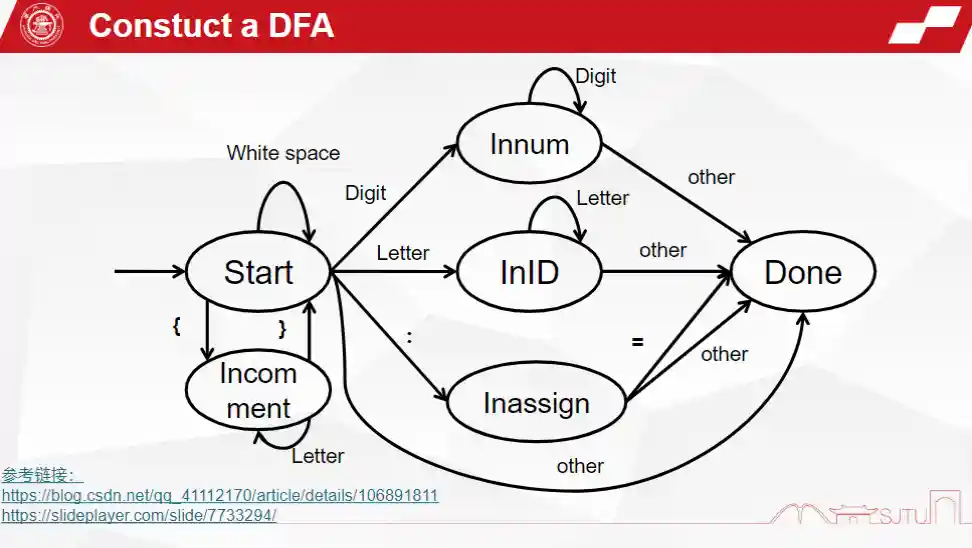
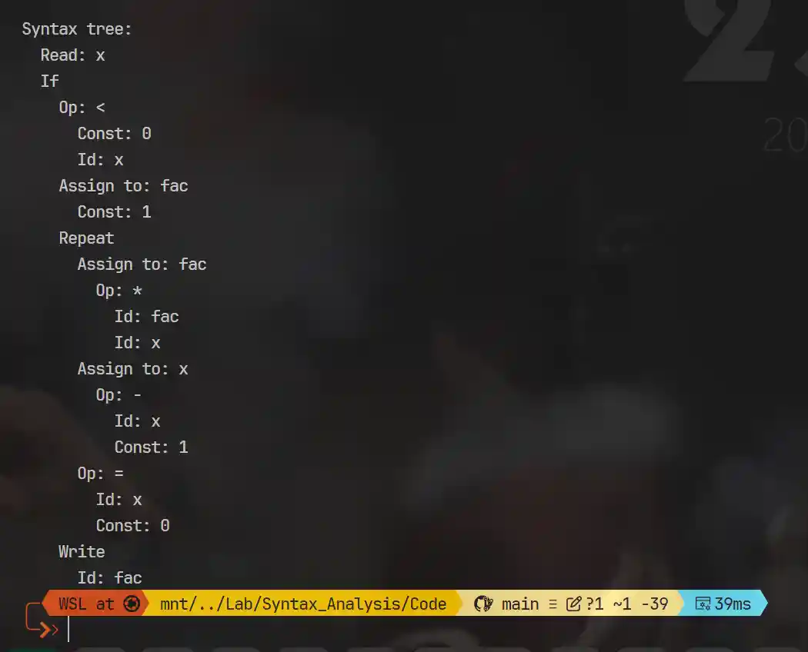
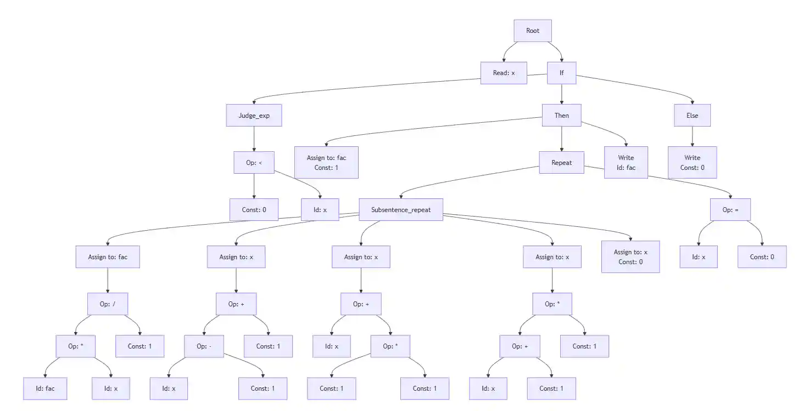

本文是 NIS2336 编译原理课程的编程实践实验报告，实验内容为设计并实现一个简易的词法分析器和语法分析器，能够对 TINY language 语言的源代码进行词法分析和语法分析，生成相应的 token 序列和语法树。

# 实验目的
本次实验旨在让同学综合课堂所学的理论知识，在了解 TINY language 语言的基础上，使用 C/C++ 语言编程实现词法分析，对词法分析形成一个感性认识。在此基础上，完成由代码生成语法树的过程，使同学在编程的过程中对语法分析的步骤方法有进一步认识。

# 实验要求
## 前期准备
- 了解 TINY language 语言，并能用 TINY language 写较简单的程序
- 掌握词法分析的步骤方法，能根据程序段模拟自动机的分析过程生成 token 序列
- 熟练掌握语法分析的过程，理解由词法分析输出的 token 生成语法树的原理
- 掌握数据结构用链表的方式建立树的方法

## 功能说明
### 词法分析功能说明
- TINY language 语言的词法单元：

    | 词法单元类型 | 词法单元 | 词素（举例） |
    | ---- | ---- | ---- |
    | 关键字 | `IF` | `if` |
    |  | `THEN` | `then` |
    |  | `ELSE` | `else` |
    |  | `END` | `end` |
    |  | `REPEAT` | `repeat` |
    |  | `UNTIL` | `until` |
    |  | `READ` | `read` |
    |  | `WRITE` | `write` |
    | 变量名 | `ID` | `myName` |
    | 数字 | `NUM` | `123` |
    | 运算符 | `ASSIGN` | `:=` |
    |  | `EQ` | `=` |
    |  | `LT` | `<` |
    |  | `PLUS` | `+` |
    |  | `MINUS` | `-` |
    |  | `TIMES` | `*` |
    |  | `OVER` | `/` |
    |  | `LPAREN` | `(` |
    |  | `RPAREN` | `)` |
    |  | `SEMI` | `;` |
    | 错误 | `ERROR` | `>=` |

- 文件 `globals.h` 中定义了所有的词法单元类型 `TokenType` ，并在 `scan.h` 中声明。本次实验要求在读懂 `scanner.c` 中已有代码的基础上完善补全 `scanner.c` 中的主函数 `getToken(void)`，该函数通过判断当前状态并根据当前读入的词法单元来输出当前读入词法单元的 `token`，并更新状态和词法单元，根据给出代码中的示例补全 `switch` 语句中 `case` 为其他状态时的情况。

### 语法分析功能说明
- TINY Language 的语法：

    |非终结符 | 含义 | 展开 |
    |--------|------|------|
    |program | 程序 | `stmt_seq` |
    |stmt_seq| 若干条语句 | `stmt_seq stmt | stmt` |
    |stmt | 单条语句 | `if_stmt | repeat_stmt | assign_stmt | read_stmt | write_stmt | error` |
    |if_stmt | 判断语句 | `IF judge_exp THEN stmt_seq END | IF judge_exp THEN stmt_seq ELSE stmt_seq END` |
    |repeat_stmt| 循环语句 | `REPEAT stmt_seq UNTIL judge_exp` |
    |assign_stmt| 赋值语句 | `ID ASSIGN judge_exp` |
    |read_stmt| 输入语句 | `READ ID` |
    |write_stmt| 输出语句 | `WRITE judge_exp` |
    |judge_exp| 判断表达式 | `simple_exp LT simple_exp | simple_exp EQ simple_exp | simple_exp` |
    |simple_exp| 加减表达式 | `simple_exp PLUS term | simple_exp MINUS term | term` |
    |term    | 乘除表达式 | `term TIMES factor | term OVER factor | factor` |
    |factor  | 基本表达式 | `LPAREN judge_exp RPAREN | NUM | ID | error` |

- 文件 `parse.c` 中定义了对应每个非终结符分析过程的函数。本次实验要求在读懂 `parse.c` 的基础上，参照函数 `stmt_sequence()` 补全其他非终结符对应的函数，每个函数表示将某个非终结符作为节点加入语法树的过程。将非终结符作为一个新的节点，它的子节点可以是对其进行展开后的更简单的非终结符，这时需要递归调用对应该非终结符的函数，将返回值赋给子节点；也可以是终结符，这时需要将非终结符的值赋给子节点。

## 处理结果要求
给定一段符合 TINY language 语法的代码，写成 `.tny` 文件，放在 `test` 文件夹内。词法分析器要求程序能够输出这段代码的每一行，在每一行的后面输出这一行所有词法单元的 token；语法分析器要求程序能够输出调用词法分析程序生成的 token 序列以及根据 token 序列生成的语法树。

- 示例输入：
    ```c
    read x;
    if 0 < x then
    fac := 1;
    repeat
        fact := fact * x;
        x := x – 1 until x = 0;
    write fac;
    end
    ```

# 实验过程
## 整理项目结构
由于个人强迫症，我首先整理了一下项目结构，将测试文件夹`test`和`Makefile`文件移出`build`文件夹，放在根目录下，并在`tests`文件夹中创建了`output`子文件夹用于存放输出。整理后的项目结构如下：
```plaintext
Code/
├── build/              # 编译文件夹
│   └── bin/            # 可执行文件夹
├── tests/              # 测试文件夹
│   ├── sample.tny      # 测试文件
│   └── output/         # 输出文件夹
│       └── sample.out  # 输出文件
├── Makefile            # Makefile文件
├── globals.h
├── main.c
├── scan.h
├── scanner.c
├── parse.h
├── parser.c            # 语法分析器实现
├── util.h
└── util.c
```

由于项目结构调整，因此需要修改`Makefile`文件。修改后的`Makefile`文件如下：
```makefile
CC = gcc

CFLAGS =

SRC_DIR = .
BUILD_DIR = ${SRC_DIR}/build
BIN_DIR = ${BUILD_DIR}/bin
TEST_DIR = ${SRC_DIR}/tests
OUTPUT_DIR = ${TEST_DIR}/output

TARGET = ${BIN_DIR}/scanner
OBJS = ${BUILD_DIR}/main.o ${BUILD_DIR}/util.o ${BUILD_DIR}/scanner.o

# Ensure directories exist
.PHONY: prepare
prepare:
	mkdir -p ${BUILD_DIR} ${BIN_DIR} ${OUTPUT_DIR}

${BUILD_DIR}/%.o: ${SRC_DIR}/%.c ${SRC_DIR}/globals.h | prepare
	$(CC) $(CFLAGS) -c $< -o $@

clean:
	rm -f ${BUILD_DIR}/*.o
	rm -f ${BIN_DIR}/*.exe


scanner: $(OBJS) | prepare
	$(CC) $(CFLAGS) -o ${TARGET} $(OBJS)

test: 
	@for file in ${TEST_DIR}/*.tny; do \
		${TARGET} $$file > ${OUTPUT_DIR}/$$(basename $$file .tny).out; \
	done
	@echo "All test files processed."

all: clean scanner test
```
但由于 `Makefile` 文件中使用的部分命令在 Windows 系统下无法使用，在 Windows 系统下编译时可能会出现问题，有以下两个解决方案：
1. 在 Windows 系统下使用 WSL 编译；
2. 修改 `Makefile` 文件，使用 Windows 系统下的命令。（此处由于篇幅较长省略修改后的 `Makefile` 文件）

## 词法分析器实现
在 `scanner.c` 中实现词法分析器的主要逻辑。由 DFA 自动机的状态转移图可以非常清晰地看出每个状态的转移条件和对应的操作。


根据给定的代码框架，补全 `getToken()` 函数中的 `switch` 语句，处理不同状态下的词法单元。以下是补全后的代码片段：
```c
switch (state)
{
    case INID:
        if (!isalpha(c))
        { /* backup in the input */
            ungetNextChar();
            save = FALSE;
            state = DONE;
            currentToken = ID;
        }
        break;
    case INCOMMENT:
        save = FALSE;
        if (c == EOF)
        {
            state = DONE;
            currentToken = ENDFILE;
        }
        else if (c == '}')
        {
            state = START;
        }
        break;
    case INNUM:
        if (!isdigit(c))
        {
            ungetNextChar();
            save = FALSE;
            state = DONE;
            currentToken = NUM;
        }
        break;
    case INASSIGN:
        state = DONE;
        if (c == '=')
        {
            currentToken = ASSIGN;
        }
        else
        {
            ungetNextChar();
            save = FALSE;
            currentToken = ERROR;
        }
        break;
    case START:
        if ((c == ' ') || (c == '\t') || (c == '\n') || (c == '\r') || (c == '\f') || (c == '\v'))
        {
            state = START;
            save = FALSE;
        }
        else if (c == '{')
        {
            save = FALSE;
            state = INCOMMENT;
        }
        else if (isdigit(c))
        {
            save = TRUE;
            state = INNUM;
        }
        else if (isalpha(c))
        {
            save = TRUE;
            state = INID;
        }
        else if (c == ':')
        {
            state = INASSIGN;
        }
        else
        {
            state = DONE;
            if (c == EOF)
            {
                save = FALSE;
                currentToken = ENDFILE;
            }
            else if (c == '+')
                currentToken = PLUS;
            else if (c == '-')
                currentToken = MINUS;
            else if (c == '*')
                currentToken = TIMES;
            else if (c == '/')
                currentToken = OVER;
            else if (c == ';')
                currentToken = SEMI;
            else if (c == '(')
                currentToken = LPAREN;
            else if (c == ')')
                currentToken = RPAREN;
            else if (c == '<')
                currentToken = LT;
            else if (c == '=')
                currentToken = EQ;
            else
                currentToken = ERROR;
        }
        break;
    case DONE:
        break;
}
```
代码的思路非常简单，这里不多赘述。（甚至没有我重写 `Makefile` 时重新熟悉语法花费的时间多）

不过在实现过程中，我遇到了一个问题：实验手册中将词素 `>=` 记为 `ERROR`，但是在遇到 `>` 时，语法单元就已经被识别为 `ERROR` 了，无法再继续判断是否为 `>=`。起初我采取的解决方法是增加一个 `TokenType`，但很快反应过来由于 `TokenType` 定义在 `globals.h` 中，无法修改，因此我采取了一个新的方法：在状态机中增加对 `>` 的后续判断，以便能够正确识别 `>=`。增加的代码片段如下：

```c
            else if (c == '>')
                {
                    if (getNextChar() == '=')
                    {
                        tokenString[tokenStringIndex++] = (char)c;
                        c = '=';
                        currentToken = ERROR;
                    }
                    else
                    {
                        ungetNextChar();
                        currentToken = ERROR;
                    }
                }
```

不过在询问助教具体判断情况时，助教告诉我参考实现是逐字判断的，因此最后采用的是第一种方法。

## 语法分析器实现
在阅读了 `parse.c` 文件后，我发现语法分析器的实现主要是通过递归下降的方法来实现的。每个非终结符对应一个函数，函数内部通过判断当前 token 的类型来决定如何展开语法树。而 `statement()` 函数则是一个分支函数，根据当前 token 的类型来调用不同的函数进行解析。

与实验一相比，本次实验的难度显著提高，需要阅读 `globals.h` 和 `util.h` 文件中定义的一些函数和数据结构，以便更好地理解语法分析器的实现细节。以下是部分函数和数据结构的调用说明：

- `syntaxError(char *message)`：语法错误处理函数，输出错误信息。
- `match(TokenType expected)`：匹配当前 token 是否为预期的类型，如果是，则将当前 token 继续向后读取。
- `parse()`：语法分析器的主函数，主程序调用入口。
- `TreeNode`：语法树节点的结构体，包含以下信息：
    - `*child`：指向子节点的指针;
    - `*sibling`：指向兄弟节点的指针;
    - `lineno`：行号;
    - `nodekind`：节点类型，包括 `StmtK`（语句节点）、`ExpK`（表达式节点）等;
    - `kind`：节点的具体类型，包括 `IfK`（if 语句）、`RepeatK`（repeat 语句）、`AssignK`（赋值语句）、`ReadK`（读入语句）、`WriteK`（输出语句）等;
    - `attr`：节点的属性，包括 `op`（操作符）、`val`（值）、`name`（名称）等;
    - `type`：节点的类型，包括 `Integer`（整数）、`Void`（空）、`Boolean`（布尔值）
- `NewStmtNode(StmtKind kind)`：创建一个新的语法树节点，返回节点指针。
- `NewExpNode(ExpKind kind)`：创建一个新的表达式节点，返回节点指针。
- `copyString(char *s)`：复制字符串，返回指向新字符串的指针。

此外，由于编译时发现 `exp()` 函数与 `math.h` 中的函数重名，会产生警告，因此我将其重命名为 `judge_exp()`。

`parse.c` 文件中已经实现了 `stmt_sequence()` 函数，该函数用于解析语句序列，构建语法树。接下来，只需根据 `stmt_sequence()` 函数的实现，补全其他非终结符对应的函数以及 `statement()` 函数即可。以下是我补全的函数：
```c
// if_stmt | repeat_stmt | assign_stmt | read_stmt | write_stmt | error
TreeNode *statement(void)
{
    TreeNode *t = NULL;
    switch (token)
    {
    case IF:
        t = if_stmt();
        break;
    case REPEAT:
        t = repeat_stmt();
        break;
    case ID:
        t = assign_stmt();
        break;
    case READ:
        t = read_stmt();
        break;
    case WRITE:
        t = write_stmt();
        break;
    default:
        token = getToken();
        break;
    } /* end case */
    return t;
}

// IF judge_exp THEN stmt_seq END | IF judge_exp THEN stmt_seq ELSE stmt_seq END
TreeNode *if_stmt(void)
{
    TreeNode *t = newStmtNode(IfK);
    match(IF);
    if (t != NULL)
    {
        t->child[0] = judge_exp();
    }
    match(THEN);
    if (t != NULL)
    {
        t->child[1] = stmt_sequence();
    }
    if (token == ELSE)
    {
        match(ELSE);
        if (t != NULL)
        {
            t->child[2] = stmt_sequence();
        }
    }
    match(END);
    return t;
}

// REPEAT stmt_seq UNTIL judge_exp
TreeNode *repeat_stmt(void)
{
    TreeNode *t = newStmtNode(RepeatK);
    match(REPEAT);
    if (t != NULL)
    {
        t->child[0] = stmt_sequence();
    }
    match(UNTIL);
    if (t != NULL)
    {
        t->child[1] = judge_exp(); 
    }
    return t;
}

// ID ASSIGN judge_exp
TreeNode *assign_stmt(void)
{
    TreeNode *t = newStmtNode(AssignK);
    if (t != NULL)
    {
        t->attr.name = copyString(tokenString);
    }
    match(ID);
    match(ASSIGN);
    if (t != NULL)
    {
        t->child[0] = judge_exp();
    }
    return t;
}

// READ ID
TreeNode *read_stmt(void)
{
    TreeNode *t = newStmtNode(ReadK);
    match(READ);
    if ((t != NULL) && (token == ID))
    {
        t->attr.name = copyString(tokenString);
    }
    match(ID);
    return t;
}

// WRITE judge_exp
TreeNode *write_stmt(void)
{
    TreeNode *t = newStmtNode(WriteK);
    match(WRITE);
    if (t != NULL)
    {
        t->child[0] = judge_exp();
    }
    return t;
}

// simple_exp LT simple_exp | simple_exp EQ simple_exp | simple_exp
TreeNode *judge_exp(void)
{
    TreeNode *t = simple_exp();
    if ((token == LT) || (token == EQ))
    {
        TreeNode *p = newExpNode(OpK);
        if (p != NULL)
        {
            p->child[0] = t;
            p->attr.op = token;
            t = p;
        }
        match(token);
        if (t != NULL)
        {
            t->child[1] = simple_exp();
        }
    }
    return t;
}

// simple_exp PLUS term | simple_exp MINUS term | term
TreeNode *simple_exp(void)
{
    TreeNode *t = term();
    while ((token == PLUS) || (token == MINUS))
    {
        TreeNode *p = newExpNode(OpK);
        if (p != NULL)
        {
            p->child[0] = t;
            p->attr.op = token;
            t = p;
            match(token);
            t->child[1] = term();
        }
    }
    return t;
}

// term TIMES factor | term OVER factor | factor
TreeNode *term(void)
{
    TreeNode *t = factor();
    while ((token == TIMES) || (token == OVER))
    {
        TreeNode *p = newExpNode(OpK);
        if (p != NULL)
        {
            p->child[0] = t;
            p->attr.op = token;
            t = p;
            match(token);
            p->child[1] = factor();
        }
    }
    return t;
}

// LPAREN judge_exp RPAREN | NUM | ID | error
TreeNode *factor(void)
{
    TreeNode *t = NULL;
    switch (token)
    {
    case NUM:
        t = newExpNode(ConstK);
        if (t != NULL)
        {
            t->attr.val = atoi(tokenString);
        }
        match(NUM);
        break;
    case ID:
        t = newExpNode(IdK);
        if (t != NULL)
        {
            t->attr.name = copyString(tokenString);
        }
        match(ID);
        break;
    case LPAREN:
        match(LPAREN);
        t = judge_exp();
        match(RPAREN);
        break;
    default:
        token = getToken();
        break;
    }
    return t;
}
```

这里对实现起来不那么直观的 `statement()`、`simple_exp()`、`term()`、`factor()` 函数进行详细说明：

- `statement()` 函数：该函数用于解析**单条语句**。首先判断当前 token 是否为 `IF`、`REPEAT`、`ID`、`READ` 或 `WRITE`，如果是，则根据 token 的类型调用相应的函数进行解析。如果不是，则调用 `syntaxError()` 函数输出错误信息。但在测试中我发现此时会输出两次报错，排查后发现在 `match()` 函数中已经输出错误信息，因此此处只需要调用 `getToken()` 函数获取下一个 token 即可。
- `simple_exp()` 函数：该函数用于解析**加减表达式**。这里我一开始想得比较复杂，认为需要递归调用来实现加减法的结合性，但实际上由于加减法的左结合性，只需要用 `while` 循环来实现即可。首先调用 `term()` 函数解析第一个项并设为当前节点，然后进入 `while` 循环，判断当前 token 是否为 `PLUS` 或 `MINUS`，如果是则创建一个新的表达式节点，将当前节点作为其子节点，并将操作符赋值给该节点的属性。然后调用 `match()` 函数匹配当前 token，并调用 `term()` 函数解析下一个项，如此循环直到当前 token 不是 `PLUS` 或 `MINUS`，即可完成加减表达式的解析。
- `term()` 函数：该函数用于解析**乘除表达式**。与 `simple_exp()` 函数基本一致，但需注意解析下一个项时需要调用的是 `factor()` 函数。
- `factor()` 函数：该函数用于解析**因子**，即`(judge_exp())`、`NUM` 或 `ID`。因此，只需要判断当前 token 的类型并进行相应的处理即可，default 分支处理与 `statement()` 函数相同。

# 测试与结果
## 词法分析器测试
在完成词法分析器的实现后，我在 `sample.tny` 的基础上修改，另外生成了几个测试文件，其中一个内容如下：
```txt
read x;
if 0 >= x then { >= must be error }
     { there is a space and a tab and a newline }
    fac := 1;
    repeat
        fac @:= fac * x; {@ should be error }
        x := x - 1 until x = 0;
    write fac {@output factorial of x }{@ should not be error in comments }
end

```

测试输出结果如下：
```plaintext

COMPILATION: .\tests\Test1.tny
   1: read x;
	1: reserved word: read
	1: ID, name= x
	1: ;
   2: if 0 >= x then { >= must be error }
	2: reserved word: if
	2: NUM, val= 0
	2: ERROR: >
	2: =
	2: ID, name= x
	2: reserved word: then
   3:      { there is a space and a tab and a newline }
   4:     fac := 1;
	4: ID, name= fac
	4: :=
	4: NUM, val= 1
	4: ;
   5:     repeat
	5: reserved word: repeat
   6:         fac @:= fac * x; {@ should be error }
	6: ID, name= fac
	6: ERROR: @
	6: :=
	6: ID, name= fac
	6: *
	6: ID, name= x
	6: ;
   7:         x := x - 1 until x = 0;
	7: ID, name= x
	7: :=
	7: ID, name= x
	7: -
	7: NUM, val= 1
	7: reserved word: until
	7: ID, name= x
	7: =
	7: NUM, val= 0
	7: ;
   8:     write fac {@output factorial of x }{@ should not be error in comments }
	8: reserved word: write
	8: ID, name= fac
   9: end
	9: reserved word: end
	10: EOF

```

可以看到，输出结果符合预期，能够正确识别出每一行的词法单元，并且在注释中不会输出错误。

## 语法分析器测试
在完成语法分析器的实现后，我首先用`sample.tny`进行测试，输出结果如图：



可以看到，输出结果符合预期，能够正确地生成语法树。

在此测试文件的基础上修改，另外生成了几个测试文件，其中一个内容如下：
```txt
{This program contains some comments but is still syntactically correct}

read x;
if 0 < x then { if judge_exp then stmt_exp (else stmt_exp) end }
    fac := 1;
    repeat
        fac := fac * x / 1; { multiplication and division should be left associative }
        x := x - 1 + 1; { addition and subtraction should be left associative }
        x := x + 1 * 1; { multiplication's precedence should be higher than addition }
        x := (x + 1) * 1; { parentheses should regard as a factor }
        x := 0 until x = 0;
    write fac { @ should not be error in comments }
else
    write 0 { a NUM can be reduced by judge_exp -> simple_exp -> term -> factor }
end

```
测试输出结果如下：
```plaintext
COMPILATION: .\tests\Test.tny
// 省略scanner输出
Syntax tree:
  Read: x
  If
    Op: <
      Const: 0
      Id: x
    Assign to: fac
      Const: 1
    Repeat
      Assign to: fac
        Op: /
          Op: *
            Id: fac
            Id: x
          Const: 1
      Assign to: x
        Op: +
          Op: -
            Id: x
            Const: 1
          Const: 1
      Assign to: x
        Op: +
          Id: x
          Op: *
            Const: 1
            Const: 1
      Assign to: x
        Op: *
          Op: +
            Id: x
            Const: 1
          Const: 1
      Assign to: x
        Const: 0
      Op: =
        Id: x
        Const: 0
    Write
      Id: fac
    Write
      Const: 0
```
若将其转换为语法树，则如下所示：


可以看到，输出结果符合预期，能够正确地生成语法树。