# 第一章 网络空间安全概述

## 第一节 信息时代及信息安全

### 网络空间安全-初步接触

信息时代特征

1. 新摩尔定律
2. 吉尔德定律
3. 千倍定律

### 当前网络信息安全态势

1. **信息技术与产业空前繁荣**
2. **量子信息技术高速发展**
3. **信息安全形势严峻，危机四伏的网络世界**
4. **敌对势力破坏**
5. **黑客组织攻击**
6. **计算机病毒入侵**
7. **利用计算机进行经济犯罪**
8. **有害内容泛滥、隐私保护问题严重**
9. **网络安全形式严峻**
    - 信息战 网络战
    - 网络空间安全对抗愈益加剧
    - 信息技术对信息安全的挑战
10. **国家对信息安全的重视**

### 网络信息安全发展趋势

1. 网络信息安全已成为关系社会、文化、经济、军事乃至国家安全的重大战略问题。
    - 网络信息安全成为重大战略问题，涉及国家安全各方面，网络犯罪造成巨大经济损失，美国成立网络司令部加强网络空间争夺。
2. 网络安全威胁层出不穷，网络关键基础设施隐患重重。
    - 网络安全威胁不断，关键基础设施受攻击影响重大，黑客攻击针对性增强，恶意代码增长迅速。
3. 网络空间国家间的竞争与合作日趋凸显。
    - 网络空间国家间竞争合作凸显，“军备竞赛”开始，多国组建网络战部队，斯诺登事件引发网络空间新型对抗。
4. 国际互联网治理领域迎来新热潮，信息资源保护成为各国焦点
    - 国际互联网治理成热潮，信息资源保护受关注，网络基础设施漏洞威胁全球，各国重视互联网治理权。

## 第二节 法律法规及标准概述

### 学科内涵

- **网络空间安全的定义与内涵**

  - 网络空间是信息时代人类赖以生存的信息环境，是所有信息系统的集合。它以计算机和网络系统实现的信息化为特征。
  - 网络空间是人的生存环境，也是信息的生存环境。
  - 网络空间安全研究网络空间中安全威胁与防护问题。
  - 核心内涵为信息安全。

- **信息的安全属性—C.I.A三要素**
  - **机密性**是指保证信息与信息系统不被非授权者截获和未经授权使用。
  - **完整性**是指信息是完整的，真实的、未被篡改的、正确的。
  - **可用性**是指信息与信息系统服务可被授权人正常使用
  - 其它基本要素：非否认性、可控性

- **信息系统安全层次结构**
  - **设备安全**：信息系统设备的安全是是信息系统安全的物质基础，是信息系统安全的首要问题，软硬件系统的安全（稳定、可靠、可用）
  - **行为安全**：主体行为的过程和结果来考察是否会危害信息安全，数据安全本质上是一种静态的安全，而行为体现在过程和结果之中，行为安全是一种动态安全。
  - **数据安全**：数据免受未授权的泄露、篡改和毁坏。数据安全本质上是一种静态的安全，而行为体现在过程和结果之中，行为安全是一种动态安全。
  - **内容安全**：信息安全在政治、法律、道德层次上的要求，是语义层次的安全，内容安全还包括信息内容保密、知识产权保护、信息隐藏和隐私保护等诸多方面

- **信息安全三大定律**
  - 普遍性定律指出有信息就有安全问题；
  - 折中性定律表明安全与方便是矛盾体；
  - 就低性定律说明系统安全性取决于最薄弱部分（木桶原理）。
  
- **网络空间安全学科定义**
  - 网络空间安全学科是研究信息获取、信息存储、信息传输和信息处理领域中信息安全保障问题的一门新兴学科。
  
- **理论基础**
  - 数学：数论、代数、组合数学、概率统计等数学分支，是密码学的理论基础
  - 逻辑学是网络协议安全基础：协议是网络的核心，协议安全是网络安全的核心。
  - 博弈论是网络空间安全特有理论
  - 信息论、控制论和系统论是现代科学的理论基础：信息论是密码学和信息隐藏基础，系统论核心是整体观念，控制论体现于信息安全PDR策略。

- **方法论基础**
  - 以解决网络空间安全问题为目标、以适应网络空间安全需求为特征的具体科学方法论
  - **逆向分析**是网络空间安全学科特有的方法论，该学科领域斗争具攻防对抗性
  - 方法论的应用：强调底层性、系统性，综合治理追求整体效能，坚持“以人为核心”，注重定性定量分析相结合。

### 立法现状

1. **国际立法现状**
    - 美国通过多部法律，如信息自由法等，还有总统令及相关法案；俄罗斯颁布联邦信息相关法律；欧盟建立一系列法律，如数据保护法等，近年通过网络安全相关指令和条例。
2. **我国立法现状**
    - 早期我国计算机信息安全立法属“渗透型”，将相关规范融入其他法律法规，初步形成法律规范体系。现有法律法规众多，包括国务院令发布的条例、全国人大通过的决定、网络安全法等一系列法律，还有部门规范如计算机信息网络国际联网安全保护管理办法等。
    - 
3. **我国立法不足与体系**
    - 我国立法存在规范需完善升级、部分应用缺法律支持、执法需高技术支撑等问题，立法体系涵盖法律、行政法规、部门规章等不同层次。

### 计算机犯罪有关刑法条款

1. **相关法律条款发展历程**
    <!-- - 随着计算机技术发展，计算机犯罪相关法律条款不断演进，经历多次刑法修正案完善，包括对计算机信息系统的非法侵入、控制，对系统功能、数据和程序的破坏，以及利用计算机实施的各类犯罪等方面的规定。 -->
2. **具体刑法条款内容**
    <!-- - 如《刑法》第二百八十五条规定了非法侵入特定计算机信息系统及获取数据、非法控制的刑罚；第二百八十六条规定了对计算机信息系统功能、数据和程序进行破坏以及制作传播病毒的刑罚；第二百八十七条规定利用计算机实施其他犯罪依照相关规定定罪处罚。此外，还有《全国人民代表大会常务委员会关于维护互联网安全的决定》对互联网运行安全、国家安全、市场经济秩序等方面的刑事责任作出规定，以及《中华人民共和国计算机信息系统安全保护条例》确立了信息系统安全保护的多项制度，包括等级保护、机房标准、联网备案等，同时对违反规定的行为设定了相应处罚措施。 -->

### 标准的基本知识

1. **标准的定义与分类**
    - 标准是通过标准化活动，按照规定的程序协商一致制定，为各种活动或其结果提供规则、指南或特性，供共同使用和重复使用的文件。
    - 《中华人民共和国标准化法》将标准划分为：**国家标准、行业标准、地方标准和企业标准**
    - 国家标准、行业标准均可分为：**强制性和推荐性**两种属性的标准。强制性国家标准代号：GB，推荐性国家标准代号：GB/T
    - 标准、规范、规程都是标准的一种表现形式,习惯上统称为标准。
2. **国际标准化组织**
    - 国际电工委员会（IEC）是最早的国际性电工标准化组织；国际标准化组织（ISO）及其从事信息安全标准化工作的分技术委员会（SC27）；互联网工程任务组（IETF）也在相关领域发挥作用。
3. **我国标准化组织**
    - 全国信息安全标准化技术委员会（信安标委）负责全国信息安全标准化工作；密码行业标准化技术委员会（密标委CSTC）负责密码领域标准化工作。

### 信息安全标准

1. **涉密信息系统分级保护管理办法**
    - 涉密信息系统分级保护依据涉密程度分为**秘密级、机密级、绝密级**，**国家保密局**是涉密信息系统分级保护工作的主管部门。

2. **信息系统等级保护基本要求**
    - 信息安全等级保护的核心是分级及保护
    - 信息系统安全等级保护的内容可分为**系统定级、系统备案、建设整改、测评、监督检查**五个方面
    - 信息系统的分级主要是依据对国家、社会、法人及组织的损害程度及范围来确定的。损害小、范围也小的，级别低、保护要求也低；损害大、范围大的，级别高，保护的要求就相应增加
    - 等级保护1.0 vs 2.0
      - 安全分类变化：
      - 标准名称变化：信息安全等级保护基本要求 → 网络安全等级保护基本要求
      - 等级保护对象变化：信息系统 → 增加云计算平台、大数据平台、移动互联、物联网和工业控制系统等要求
      - 安全要求变化：安全要求 → 安全通用要求+安全扩展要求
      - 安全管理中心：2.0在二级及以上增加了“安全管理中心”
      - 可信验证：2.0在多个技术环节增加了“可信验证”控制点

3. **商用密码标准**
    - 商用密码的行业标准分为基础类标准、应用类标准、检测类标准和管理类标准。
    - 基础类标准为其他三类标准提供了底层、共性支撑（如术语、算法、协议、产品等）；
    - 应用类标准为上层具体的密码产品、服务应用提供支持；
    - 检测类标准为基础类标准和应用类标准提供了合法性检测的功能，保障商用密码使用的合法性；
    - 管理类标准为其他三类标准提供了管理功能；
    - 我国多个商用密码算法成为国际标准，如SM2、SM3、SM4、SM9和ZUC算法等，ZUC（祖冲之）算法还被3GPP采纳为国际标准并成为国家和行业标准。

## 第三节 保密法及密码法

### 保密法概述
1. **保密法历史**
   - 1951年6月8日，周恩来总理签署中央人民政府政密字377号命令，公布实行《保守国家机密暂行条例》。
   - 1988年9月5日，第七届全国人民代表大会常务委员会第三次会议审议通过了《中华人民共和国保守国家秘密法》，自1989年5月1日起实行。
   - 2010年4月29日，第十一届全国人民代表大会常务委员会第十四次会议修订通过《中华人民共和国保守国家秘密法》，自2010年10月1日起施行。
   - 最新修订在2024年2月27日，由第十四届全国人民代表大会常务委员会第八次会议通过，自2024年5月1日起施行。

2. **保密法结构**
   - 《中华人民共和国保守国家秘密法》共六章65条。
   - 包括总则、国家秘密的范围和密级、保密制度、监督管理、法律责任和附则。

### 保密法内容解读
1. **一些案例**
   <!-- - 2003年铁矿石交易事件导致中国经济损失高达7000亿人民币。
   - 2009年7月5日，胡士泰等四名力拓员工因侵犯商业秘密罪、非国家工作人员受贿罪被刑事拘留。
   - GoogleEarth地球服务暴露了许多国家的政府大楼、军事设施以及敏感地点。
   - 1964年《中国画报》封面刊出的照片泄露了大庆油田的位置、储量和产量。
   - 2016年，俄罗斯士兵手机拍照泄露了航母“库兹涅佐夫”号内机库细节。 -->

2. **国家秘密及范围**
   - 国家秘密是关系国家安全和利益，依照法定程序确定，在一定时间内只限一定范围的人员知悉的事项。
   - 包括国家事务、国防建设、外交外事、国民经济和社会发展、科学技术、国家安全活动和追查刑事犯罪等事项。

3. **国家秘密的范围及密级**
   - 国家秘密及其密级的具体范围，即保密事项范围，由国家保密行政管理部门单独或会同有关中央国家机关规定。
   - 国家秘密的密级分为**绝密、机密、秘密**三级。
   - 国家秘密的保密期限，应当根据事项的性质和特点，按照维护国家安全和利益的需要，限定在必要的期限内；不能确定期限的，应当确定解密的条件。
   - 国家秘密的保密期限，除另有规定外，绝密级不超过三十年，机密级不超过二十年，秘密级不超过十年。

4. **保密制度**
   - 国家秘密载体的制作、收发、传递、使用、复制、保存、维修和销毁应符合国家保密规定。
   - 存储、处理国家秘密的计算机信息系统应实行**分级保护**，并配备保密设施、设备。

5. **涉密人员管理**
   - 涉密人员按照涉密程度分为**核心涉密人员、重要涉密人员和一般涉密人员**，实行分类管理。
   - 涉密人员离岗离职应当遵守国家保密规定。机关、单位应当开展保密教育提醒，清退国家秘密载体，**实行脱密期管理**。

6. **涉密计算机和涉密载体保密管理**
   - 加强对信息系统、信息设备的保密管理，建设保密自监管设施。
   - 加强对国家秘密载体的管理，禁止非法获取、持有、买卖、转送或私自销毁国家秘密载体。

7. **12种违规行为**
   - （一）非法获取、持有国家秘密载体的；
   - （二）买卖、转送或者私自销毁国家秘密载体的；
   - （三）通过普通邮政、快递等无保密措施的渠道传递国家秘密载体的；
   - （四）寄递、托运国家秘密载体出境，或者未经有关主管部门批准，携带、传递国家秘密载体出境的；
   - （五）非法复制、记录、存储国家秘密的；
   - （六）在私人交往和通信中涉及国家秘密的；
   - （七）未按照国家保密规定和标准采取有效保密措施，在互联网及其他公共信息网络或者有线和无线通信中传递国家秘密的；
   - （八）未按照国家保密规定和标准采取有效保密措施，将涉密信息系统、涉密信息设备接入互联网及其他公共信息网络的；
   - （九）未按照国家保密规定和标准采取有效保密措施，在涉密信息系统、涉密信息设备与互联网及其他公共信息网络之间进行信息交换的；
   - （十）使用非涉密信息系统、非涉密信息设备存储、处理国家秘密的；
   - （十一）擅自卸载、修改涉密信息系统的安全技术程序、管理程序的
   - （十二）将未经安全技术处理的退出使用的涉密信息设备赠送、出售、丢弃或者改作其他用途的；
   - （十三）其他违反本法规定的情形。

8. **法律责任**
   <!-- - 违反本法规定，发生重大泄密案件的，对直接负责的主管人员和其他直接责任人员给予处分。 -->

### 密码法概述
1. **密码重要性**
   - 密码是党和国家的“命门”、“命脉”，是国家重要战略资源。密码工作是党和国家的一项特殊重要工作，直接关系国家政治、经济、国防和信息安全。
   
2. **密码法发展历程**
   - 1999年国务院颁布《商用密码管理条例》，2005年国家密码管理局正式成立。
   - 2019年10月26日，《中华人民共和国密码法》通过，习近平主席签署第35号主席令予以公布。
   - 密码法的颁布实施，是我国密码发展史上具有里程碑意义的大事，有助于提升我国密码工作的规范化、科学化、法治化水平：一是规范密码应用和管理，促进密码事业发展；二是保障网络与信息安全，维护国家安全和社会公共利益，保护公民、法人和其他组织的合法权益。
   - 对维护我国网络空间安全、促进信息化发展具有重要意义，也直接关系企业商业秘密的依法保护，关系社会公众在网络空间生活的安全和便利。

3. **密码的应用**
   - 区块链技术是分布式账本技术，核心是密码技术。
   - 增值税防伪税控系统采用商用密码技术保护涉税信息，减少税收流失。

### 密码法内容解读
1. **中华人民共和国密码法内容**
   - 《中华人民共和国密码法》自2020年1月1日起施行，共五章44条。
   - 密码是国家重要战略资源，是保障网络与信息安全的核心技术和基础支撑。
   - 1. 什么是密码
     -  “是指采用特定变换的方法对信息等进行加密保护、安全认证的技术、产品和服务”
     -  核心密码用于保护国家绝密级、机密级、秘密级信息
     -  普通密码用于保护国家机密级、秘密级信息
     -  商用密码用于保护不属于国家秘密的信息
     -  对密码实行分类管理，是党中央确定的密码管理根本原则，是保障密码安全的基本策略
   - 2. 谁来管密码
     - 坚持党管密码根本原则
     - 中央密码工作领导小组（国家密码管理委员会），对全国密码工作实行统一领导
     - 国家、省、市、县四级密码工作管理体制
   - 3. 怎么管密码
     - 第二章（第十三条至第二十条）规定了核心密码、普通密码的主要管理制度：密码管理部门依法对核心密码、普通密码实行严格统一管理，并规定了核心密码、普通密码使用要求安全管理制度以及国家加强核心密码、普通密码工作的一系列特殊保障制度和措施。核心密码、普通密码本身就是国家秘密，一旦泄密，将危害国家安全和利益
     - 第三章（第二十一条至第三十一条）规定了商用密码的主要管理制度：商用密码的主要管理制度，包括商用密码标准化制度、检测认证制度、市场准入管理制度、使用要求、进出口管理制度、电子政务电子认证服务管理制度以及商用密码事中事后监管制度
   - 4. 怎么用密码
     - 第十四条要求在有线、无线通信中传递的国家秘密信息，以及存储、处理国家秘密信息的信息系统，应当依法使用核心密码、普通密码进行加密保护、安全认证
     - 第八条规定公民、法人和其他组织可以依法使用商用密码保护网络与信息安全，对一般用户使用商用密码没有强制性要求
     - 为了保障关键信息基础设施安全稳定运行，维护国家安全和社会公共利益，第二十七条要求关键信息基础设施必须依法使用商用密码进行保护
     - 党政机关存在大量的涉密信息、信息系统和关键信息基础设施，都必须依法使用密码进行保护

1. **商用密码标准体系**
   - 国家建立和完善商用密码标准体系，推进商用密码检测认证体系建设。
   - 商用密码检测、认证机构应当依法取得相关资质，并依照法律、行政法规的规定和商用密码检测认证技术规范、规则开展商用密码检测认证。

2. **商用密码产品**
   - 涉及国家安全、国计民生、社会公共利益的商用密码产品，应列入网络关键设备和网络安全专用产品目录。
   - 商用密码产品检测认证适用《中华人民共和国网络安全法》的有关规定，避免重复检测认证。

3. **法律责任**
   - 违反密码法规定的行为，将依法追究法律责任。

## 第四节 网络安全法

### 网络安全立法背景
1. **全球性问题**
   - 应对网络安全威胁已是全球性问题，国际网络安全的法治环境正发生巨大变革。
   - 美欧等网络强国纷纷建立全方位、立体化、更具弹性与前瞻性的网络安全立法体系。
   - **网络安全立法已演变为全球范围内的国家主权与利益的斗争，有法可依成为了谈判与对抗的必要条件。**

2. **国际背景**：合作与共赢、冲突与对抗

3. **国内背景**
   - 网络安全人才建设滞后，人才缺乏。
   - 大量网络安全事件和经济损失。
   - 新技术持续发展与应用。
   - 地下黑产不断扩大，网络攻击频繁发生。
   - 我国信息化建设的突飞猛进。
   - 法律法规条纹分散、监管滞后。
  
4. **网络安全事件特点**
   - 目标明确：
     - 信息安全事件大多为敌对国家或利益集团为达到某种目的而发起的网络攻击。往往是向指定的目标发起特定的网络攻击，具有极强的针对性。
   - 隐蔽性强：
     - 攻击工业控制系统的病毒和黑客，异常熟悉工业控制系统的网络情况，攻击方法独特导致无法及时发现，具有极强的隐蔽能力，可以长时间隐藏于工业控制系统中。
   - 破坏严重：
     - 电力、能源、金融等系统如果遭到破坏，轻则造成经济损，重则会造成人身伤亡，甚至会影响地区和国家的安定，乃至国家战略和重大计划的执行都会受到阻挠。

5. **网络安全立法的需求**
6. **国外网络安全立法状况**
7. **网络空间安全顶层设计**
8. **国家高度重视**
9. **立法进程**

### 网络安全法的重大意义
1. **立法里程碑**
   - 《网络安全法》的出台具有里程碑式的意义，是全面落实党的十八大和十八届三中、四中、五中、六中全会相关决策部署的重大举措。
   - 我国**第一部网络安全的专门性综合性立法**，提出了应对网络安全挑战这一全球性问题的中国方案。
   - 立法进程的快速推进，显示了党和国家对网络安全问题的高度重视，是我国网络安全法治建设的一个重大战略契机。
   - 网络安全有法可依，信息安全行业将**由合规性驱动过渡到合规性和强制性驱动并重**。   

2. **服务与国家网络安全战略和网络强国建设**
   - 网络空间逐步成为世界主要国家展开竞争和战略博弈的新领域。确立网络空间行为准则和模式已是当务之急。
   - 《网络安全法》中明确提出了有关国家网络空间安全战略和重要领域安全规划等问题的法律要求，这有助于实现推进中国在国家网络安全领域明晰战略意图，确立清晰目标，厘清行为准则，不仅能够提升我国保障自身网络安全的能力，还有助于推进与其他国家和行为体就网络安全问题展开有效的战略博弈。

3. **助力网络空间治理，护航“互联网+”**
   - 我国是名符其实的网络大国，但现实的网络环境十分堪忧。
   - 《网络安全法》将成为新的起点和转折点。

4. **构建我国首部网络空间管辖基本法**
   - 《网络安全法》属于国家基本法律，是网络安全法制体系的重要基础。
   - 《网络安全法》规定了信息安全法的总体目标和基本原则；规范网络社会中不同主体所享有的权力义务及其地位；建立网站身份认证制度，实施后台实名；建立网络信息保密制度，保护网络主体的隐私权；建立行政机关对网络信息安全的监管程序和制度，规定对网络信息安全犯罪的惩治和打击；规定具体的诉讼救济程序等等。
   - 《网络安全法》的出台从根本上填补了**我国综合性网络信息安全基本大法**、核心的网络信息安全法和专门法律的三大空白。   

5. **提供维护国家网络主权的法律依据**
   - 我国在2016年7月推出了《国家安全法》，首次以法律的形式明确提出了“维护国家网络空间主权”。
   - 《网络安全法》是《国家安全法》在网络安全领域的体现和延伸，为我国维护网络主权、国家安全提供了最主要的法律依据。
   

6. **在网络空间领域贯彻落实依法治国精神**
   - 十八届四中全会通过了《中共中央关于全面推进依法治国若干重大问题的决定》。
   - 《网络安全法》则开启了依法治网的崭新局面，成为依法治国顶层设计下一项共建共享的路径实践。
   - 依法治网成为我国网络空间治理的主线和引领，依法治谋求网治的长治久安。

7. **成为网络参与者普遍遵守的法律准则和依据**
   - 《网络安全法》的执行，成为各方参与互联网上的行为提供非常重要的准则。
   - 《网络安全法》对网络产品和服务提供者的安全义务有了明确的规定，将现行的安全认证和安全检测制度上升成为了法律

### 网络安全法概览及亮点
1. **概览**
   - 《网络安全法》亮点包括：
     - 监测预警与应急处置措施的制度化、法制化
     - 明确了网络空间主权的原则
     - 建立了关键信息基础设施安全保护制度
     - 明确了网络产品和服务提供者的安全义务
     - 进一步完善了个人信息保护规则
     - 明确了网络运营者的安全义务
2. **亮点**
   - 全面性：
     - 全面和系统地确立了各个主体包括国家有关主管部门、网络运营者、网络使用者在网络安全保护方面的义务和责任；
     - 确立了保障网络的设备设施安全、网络运行安全、网络数据安全以及网络信息安全等方面的基本制度。
   - 针对性：
     - 从我国的国情出发，坚持问题的导向，总结实践经验，也借鉴了其他国家的一些做法，建立保障网络安全的各项制度，重在管用，重在解决实际问题
   - 协调性：
     - 始终坚持安全与发展并重的原则，协调推进网络安全和发展，注重保护网络主体的合法权益，保障网络信息依法、有序、自由的流动，促进网络技术创新，最终实现以安全促发展，以发展来促安全的目的。    

### 网络安全法重要条款解读
1. **第一章 总则**
   - 描述制定网络安全法的目的和适用范围，保障网络安全的目标以及各部门、企业、个人所承担的责任义务，并强调将大力宣传普及，加快配套制度建设，加强基础支撑力量建设，确保网络安全法有效贯彻实施。

1. **第二章 网络安全支持与促进**
   - 要求政府、企业和相关部门通过多种形式对企业和公众开展网络安全宣传教育，提高安全意识。鼓励企业、高校等单位加强对网络安全人才的培训和教育，解决目前网络安全人才严重不足问题。另外鼓励和支持通过创新技术来提升安全管理，保护企业和个人的重要数据。

2. **第三章 网络运行安全**
   - 特别强调要保障关键信息基础设施的运行安全。安全是重中之重，与国家安全和社会公共利益息息相关。《网络安全法》强调在网络安全等级保护制度的基础上，对关键信息基础设施实行重点保护，明确关键信息基础设施的运营者负有更多的安全保护义务，并配以国家安全审查、重要数据强制本地存储等法律措施，确保关键信息基础设施的运行安全。

3. **第四章 网络信息安全**
   - 从三个方面要求加强网络数据信息和个人信息的安全：第一是要求网络运营者对个人信息采集和提取方面采取技术措施和管理办法，加强对公民个人信息的保护，防止公民个人信息数据被非法获取、泄露或者非法使用；第二、赋予监管部门、网络运营者、个人或组织的职责和权限并规范网络合规行为，彼此互相监督管理；第三在有害或不当信息发布和和传输过程中分别对监管者、网络运营商、个人和组织提出了具体处理办法。

4. **第五章 监测预警与应急处置**
   - 将监测预警与应急处置工作制度化、法制化，明确国家建立网络安全监测预警和信息通报制度，建立网络安全风险评估和应急工作机制，制定网络安全事件应急预案并定期演练。这为建立统一高效的网络安全风险报告机制、情报共享机制、研判处置机制提供了法律依据，为深化网络安全防护体系，实现全天候全方位感知网络安全态势提供了法律保障。

5. **第六章 法律责任**
   - 规定了违反网络安全法的法律责任，包括行政处罚、民事责任、治安管理处罚和刑事责任。
     - 行政处罚：责令改正、警告、罚款，有关机关还可以把违法行为记录到信用档案，对于     “非法入侵”等，法律还建立了职业禁入的制度。 
     - 民事责任：违法《网络安全法》的行为给他人造成损失的，网络运营者应当承担相应的民事责任。
     - 治安管理处罚/刑事责任：违反本法规定，构成违反治安管理行为的，依法给予治安管理处罚；构成犯罪的，依法追究刑事责任。

## 第五节 数据安全法

### 立法背景
1. **国内外背景**
   - 数据价值凸显：随着5G、IoT、AI等信息技术革命的推进，数据量进入ZB级别，数据成为数字经济发展的新生产要素。
   - 数据泄露事件频发：如美国棱镜事件、Facebook数据泄漏事件等，引发全球对数据安全的关注。
   - 经济利益与数据安全发生冲突：数据跨境流动的隐蔽性削弱国家对本国数据的控制，危及数据主权。
   - 国内外相关法律法规：巴西、欧盟、美国等国家和地区已制定数据安全和隐私保护法律。

### 立法意义
1. **规范数据处理，保护合法权益**
   - 规范数据活动，保障数据安全，促进数据开发利用，保护个人、组织的合法权益，维护国家主权、安全和发展利益。
2. **对数据的有效监管实现有法可依、填补数据安全保护立法的空白**
   - 《数据安全法》构成了数字经济时代的法治基石，是构建国家安全法律制度体系的重要举措，有助于提高我国应对数据风险与挑战的能力。
3. **提升国家数据安全保障能力**
   - 随着新技术的使用，全场景、大规模的数据应用对国家安全造成严重威胁，数据安全是国家安全的重要组成部分，通过法律的立法和实施，可以有效提升数据安全的保障能力。
   - 为我国数字化转型的健康发展提供法治保障，为构建智慧城市、数字政务、数字社会提供法律依据。
   - 《数据安全法》进一步提升了国家数据安全保障体系和能力建设，推动形成安全有序、公正合理的数据治理新格局，切实全面维护国家主权、安全和发展利益。
4. **激活数字经济创新，提升数据利用价值**
   - 数据作为关键生产要素，其自身具有很大的经济价值，法律的发布标志着国家鼓励数据依法合理有效利用。
   - 《数据安全法》的正式实施将为我国在国际数据经济市场中提供坚实有力的保障。   
5. **扩大数据保护范围**
   - 法律明确了数据的定义，包括电子数据和非电子形式的数据，这对数据安全保障的范围提出了更广泛的要求，比《网络安全法》中的数据范围有所扩大。

### 概览及特点
1. **数据安全法概况**
  - 总计7章55条，包括数据安全与发展、数据安全制度、数据安全保护义务、政务数据安全与开放等内容。
  - 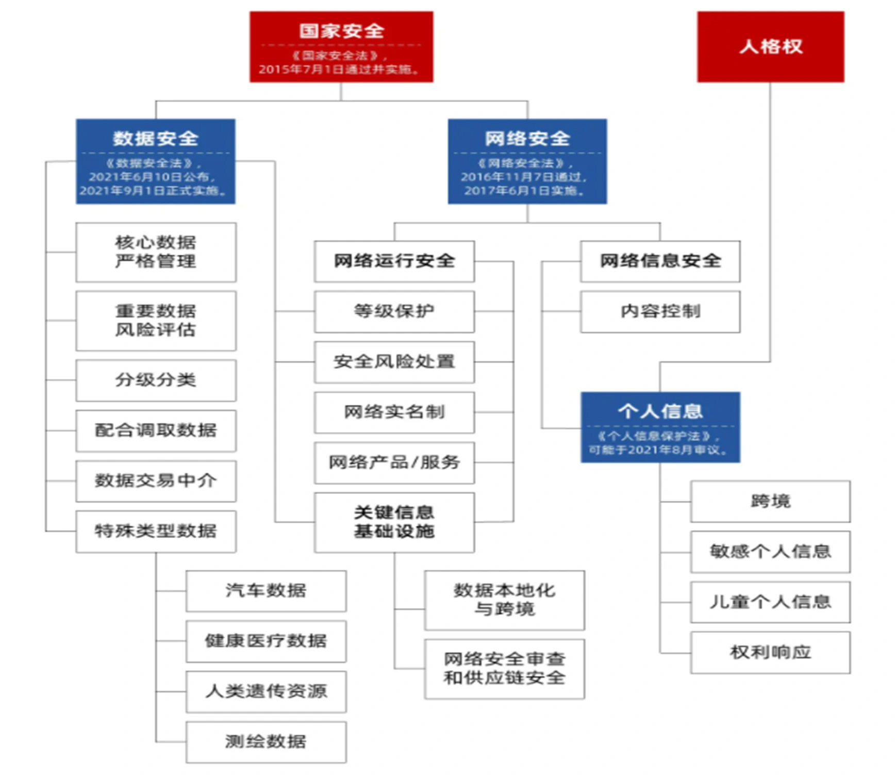
2. **主要亮点**
  - 数据安全与数字经济发展的动态化平衡
    - 提出了数据安全制度、数据安全保护义务等确保数据活动符合安全要求
    - 推动政务数据开放利用，利用数据提升公共服务智能化水平
    - 家统筹发展和安全理念
    - 数据交易制度的确立使得数据依法有序流动成为现实
  - 重视数据安全制度的建设
    - 明确提出了数据分类分级保护制度，确定重要数据具体目录，并提出了核心数据的概念。
    - 明确了数据安全风险评估、信息共享、监测预警机制、安全审查制度等，强化内控制度建设，防控数据安全风险
    - 《数据安全法》对数据的出境管理进行了补充和完善
  - 加强国家对数据安全工作的统筹
    - 明确了监管职责，确定给地区、各部门的主题责任，网信部门发挥统筹协调职能
    - 通过明确国家层面的统筹协调职能，确保后续国家数据安全战略和重大方针政策的有效落地和执行。
  - 增加对数据泄露危及国家安全的处罚力度
    - 对数据安全风险设置了基本“红线”。

### 重要条款解读
1. **扩大数据保护范坚持总体国家安全发展观**
   - 第一条确立该法的立法目的：“为了规范数据处理活动，保障数据安全，促进数据开发利用，保护个人、组织的合法权益，维护国家主权、安全和发展利益，制定本法。”
   -  规范数据处理活动的目的，是为了保障数据的安全，只有在确保数据安全的基础上，方能促进数据的有序开发和利用。
2. **我国数据保护的域外法律效力**
   - 第二条第二款明确规定：“在中华人民共和国境外开展数据处理活动，损害中华人民共和国国家安全、公共利益或者公民、组织合法权益的，依法追究法律责任。”
   -  “境外开展数据处理数据活动”的主体既包括位于中国境外的数据处理者，也包括位于中国境内的数据处理者，但其数据处理行为在境外。
   -  只要损害了我国国家安全、公共利益以及公民和组织的合法数据权益，均由我国法律管辖，并追究法律责任。
3. **促进以数据为关键要素的数字经济发展**
   - 第七条规定：“国家保护个人、组织与数据有关的权益，鼓励数据依法合理有效利用，保障数据依法有序自由流动，促进以数据为关键要素的数字经济发展。”
   -  数据作为生产要素由市场评价贡献、按贡献决定报酬，这是党的十九届四中全会首次提出的一项重大产权创新制度。
   - 在个人和组织与数据有关的权益得到充分保护的基础上，依法推动数据合理有效利用和依法有序自由流动
4. **数据可以合法交易**
   - 第十三条和第十九条明确数据的合法交易可以有效推动和促进数字经济和社会的发展。
   - 并非一味就是强调“监管”或“制约”，在保护国家安全和数据安全的前提下，可以合法交易
   - 数据的合法交易可以有效推动和促进数字经济和社会的发展
5. **国家数据分类分级保护**
   - 第二十一条规定：“国家建立数据分类分级保护制度，根据数据在经济社会发展中的重要程度，以及一旦遭到篡改、破坏、泄露或者非法获取、非法利用，对国家安全、公共利益或者个人、组织合法权益造成的危害程度，对数据实行分类分级保护。”
   -  “数据分类”，采用了数据的“重要程度”＋“危害程度”的立法手段，对数据实行分类分级保护。
   -  从国家层面提出了数据分类分级，是确定数据保护和利用之间平衡点的一个重要依据
6. **国家数据安全审查制度**
   - 第二十四条规定：“国家建立数据安全审查制度，对影响或者可能影响国家安全的数据处理活动进行国家安全审查。”
   -  数据安全审查制度与网络安全审查是依法确立的国家安全审查制度中两项重要的安全审查制度。
   -  数据安全审查制度的审查对象主要针对影响或者可能影响国家安全的数据处理活动，数据处理活动包括：数据的收集、存储、使用、加工、传输、提供、公开等。
   
7. **国家数据安全应急处置机制**
   - 第二十三条规定了“国家建立数据安全应急处置机制”，并要求“发生数据安全事件，有关主管部门应当依法启动应急预案，采取相应的应急处置措施，防止危害扩大，消除安全隐患，并及时向社会发布与公众有关的警示信息”
   -  “有关单位”应当按照“谁主管谁负责、谁运行谁负责”的原则确定
   - 采取最有效的应急处置措施，防止危害扩大，要消除安全隐患，同时要组织研判，保存证据，并做好信息通报工作
   - 及时向社会发布与公众有关的警示信息
   - 分为四级：由高到低依次用红色、橙色、黄色和蓝色标示，分别对应可能发生特别重大、重大、较大和一般网络安全突发事件。
   
8. **数据处理者的合规义务**
   - 第二十七条到第三十条明确了数据处理者履行数据安全的四项重要合规义务。
  
9. **重要数据的出境安全管理制度**
   - 第三十一条规定了关键信息基础设施的运营者在中华人民共和国境内运营中收集和产生的重要数据的出境安全管理。
   - 关键信息基础设施的运营者在中华人民共和国境内运营中收集和产生的重要数据的出境安全管理，适用《中华人民共和国网络安全法》。
   - 除关键信息基础设施的运营者处理的重要数据外，其他数据处理者在中华人民共和国境内运营中收集和产生的重要数据的出境安全管理办法，由国家网信部门会同国务院有关部门制定
   - 数据出境，要求出境前必须经过“安全评估”。
   
10. **提供数据处理服务的行政许可准入制度**
    - 第三十四条规定：“法律、行政法规规定提供数据处理相关服务应当取得行政许可的，服务提供者应当依法取得许可。”
    -  许可（license）含有准许、允许或授权的意思，数据处理相关服务的行政许可，其基本性质是行政机关对特定的数据处理服务活动事前进行控制的一种管理行为。。
    
11. **加大违法处罚力度**
    - 第四十五条对违反数据安全保护义务的组织、个人规定了严格的处罚措施。

### 个人信息保护法
1. **中华人民共和国个人信息保护法**
   - 2021年8月20日通过，2021年11月1日施行，共八章74条。
2. **立法进程**
   - 个人信息保护法的立法进程，旨在保护个人信息权益，促进个人信息合理利用。
3. **术语界定**
   - 个人信息：是以电子或者其他方式记录的与已识别或者可识别的自然人有关的各种信息，不包括匿名化处理后的信息。
   - 个人信息的处理：包括个人信息的收集、存储、使用、加工、传输、提供、公开、删除等。
   - 敏感个人信息：一旦泄露或者非法使用，容易导致自然人的人格尊严受到侵害或者人身、财产安全受到危害的个人信息，包括生物识别、宗教信仰、特定身份、医疗健康、金融账户、行踪轨迹等信息，以及不满十四周岁未成年人的个人信息。
   
4. **范围界定**
   - 境内：组织、个人再中华人民共和国境内处理自然人个人信息的活动。
   - 境外：在中华人民共和国境外处理中华人民共和国境内自然人个人信息的活动，有下列情形之一的：
     - 以向境内自然人提供产品或者服务为目的的
     - 分析、评估境内自然人的行为
     - 法律、行政法规规定的其它情形
   
5. **处理规则**
   - 规定了个人信息处理的合法、正当、必要和诚信原则，以及个人信息处理者的义务。
   - 任何组织、个人不得 非法收集、使用、加工、传输 他人个人信息，不得 非法买卖、提供或者公开 他人个人信息；不得从事 危害国家安全、公共利益 的个人信息处理活动。
   - 处理个人信息应当取得个人的同意。
   - 设专节对处理敏感个人信息作出更严格的限制
   
6. **个人信息跨境提供规则**
   - 明确了个人信息跨境提供的规则和要求。
   - 未经中华人民共和国主管机关批准，个人信息处理者不得向外国司法或者执法机构提供存储于中华人民共和国境内的个人信息。
7. **个人信息处理活动中个人的权利和处理者义务**
   - 明确了个人在个人信息处理活动中的权利，如知情权、决定权、查询权、更正权、删除权等。
8. **履行个人信息保护职责的部门**
   - 明确了个人信息保护职责部门的定义和职责。
9. **法律责任**
   - 规定了违反个人信息保护法的法律责任，包括责令改正、警告、罚款等措施。

# 第二章 密码学基础

## 第一节 密码学概述

### 密码的起源

1. 原始符号
2. 古代隐写术
3. 古代语言隐写术
4. 斯巴达密码棒
5. 达·芬奇密码筒

### 古典密码

1. **古典替换**：将明文字母替换成其他的字母、数字和符号
   - **凯撒密码**：单表替换密码，每个字母用其后第3个字母替换（广义为移动K个位置），如“Caesar cipher is a shift substitution”加密后为“FDHVDU FLSKHU LV D VKLIW VXEVWLWXWLRQ”。

   - **维吉尼亚密码**：多表替换密码，引入密钥概念，根据密钥决定用哪一行密表代换，掩盖字母频率特征，如明文“polyalphabetic cipher”，密钥“RADIO”，加密后为“GOOGOCPKTP NTLKQZPKMF”。
   - 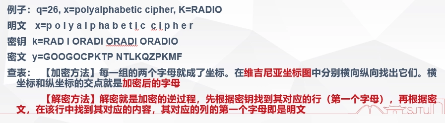
   - 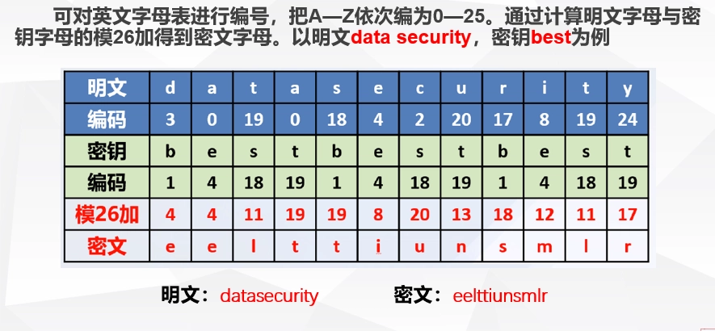

   - **普莱费尔密码**：多字母代换密码，基于5×5字母矩阵，将明文中双字母组合转换为密文双字母组合
      - 加密规则:按成对字母加密
      - 相同对中的字母加分隔符(任意字符，如X)，对明文进行分组，每2个字母一组，如果明文的字母数为奇数，在最后加上一个无效字母补位(如x)。
      - balloon → ba lx lo on
      - 同行取右边: he → EC
      - 同列取下边: dm → MT
      - 其他取交叉: kt → MQ；OD → TR

   - **Hill密码（仿射密码）**：m个连续明文字母用m个密文字母代替，由m个线性方程决定，如m = 2时，对明文“july”加密，密钥K为特定矩阵，加密结果为“DELW”。
  
2. **古典置换（换位密码）**：通过重新排列明文字符位置实现加密
   - **栅格换位**
   - 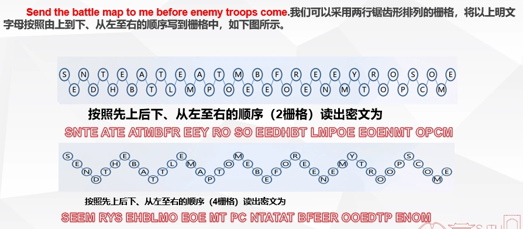
   - **矩形换位**
   - 

3. **一次一密密码**：密钥本身随机，而且密钥只使用一次。
   - 即使获得了上次通信的密文和密钥，攻击者仍然无法确定下次通信的真正密钥；
   - 需要建立庞大的随机字母集，工作量巨大，而且存在密钥分发的问题。
   - **费纳姆密码**：将明文与密钥进行模2加法（比特XOR，即异或）运算，若密钥只使用一次，为一次一密密码。

### 机械密码

1. **转轮密码机ENIGMA**：德国发明家亚瑟·谢尔乌比斯发明，二战期间德军使用，安全性高，有多个转轮，组合可能性众多，后被数学家艾伦·图灵破解，其设计体现了加密系统保密性基于密钥保密的理念。

2. **紫色密码机**：日本外务省在二战期间使用的机械式密码机，工作原理与Enigma机类似，被美国威廉·弗里德曼破译小组破解，对美军在中途岛海战及击毙山本五十六等事件中发挥重要作用。

3. **其他机械密码机**：包括从未被破解的Sigaba（与Enigma工作原理相似）、C - 36（瑞典海军使用）、M - 209（美军二战及朝鲜战争中使用）。

### 现代密码

1. **现代密码理论基础**：1949年Claude Shannon发表保密系统的通信理论，奠定现代密码理论基础，用信息论观点分析密码系统相关概念。
2. **保密通信系统的数学模型**：信源、加密器、信道、解密器、信宿。
   - 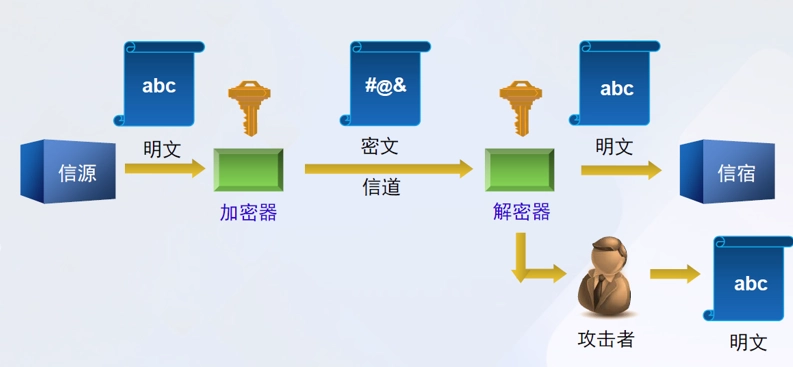
1. **信息隐藏和信息保密**：
   - 信息隐藏（隐匿信息存在）：将秘密信息嵌入表面上看起来无害的宿主信息中，使攻击者无法直观地判断他所监视的信息中是否含有秘密信息，目的是使攻击者不知道哪里有秘密,它隐藏了信息的存在形式。
   - 信息保密（隐匿信息真意）：信息加密是利用单钥或双钥密码算法把明文变换成密文并通过公开信道送到接收者手中，保护的是信息的内容。
2. **DES数据加密标准**：组合、混乱、扩散、分组密码设计
   - 组合（Combine）：由简单易于实现的密码系统进行组合，构造较复杂的、密钥量较大的密码系统，如加权和及乘积法。
   - 混乱(Confusion)：为了避免密码分析者利用明文与密文之间的依赖关系进行破译，密码的设计应该保证这种依赖关系足够复杂，使明文和密文、密钥之间的统计相关性极小化。 通常的方法是“替换(Substitution)”
   - 扩散(Diffusion)：为避免密码分析者对密钥逐段破译，密码的设计应该保证密钥的每位数字能够影响密文中的多位数字；同时，为了避免密码分析者利用明文的统计特性，密码的设计应该保证明文的每位数字能够影响密文中的多位数字，即将每一位明文及密钥尽可能迅速地散布到较多位密文数字中去，从而隐藏明文的统计特性。通常的方法是“换位(Permutation)”
   - 分组密码设计：输入分段处理、非线性变换、左右交换和密钥控制下的多次迭代，如Feistel结构。
3. **公钥密码体制**：又称双钥密码体制或非对称密码体制（Two-key/AsymmetricCryptosystem），就是在加密和解密的过程中分别使用不同的密钥
4. **密码技术分支**：包括数字签名、认证码、Hash函数、密码协议等，现代密码学研究建立安全密码体制和破译敌方密码体制。
5. **密码体制五大特性**：保密性、完整性、可用性、认证性、不可否认性
6. **量子密码**：利用量子态作为信息载体，基于量子力学原理（如薛定谔方程、测不准原理、不可克隆定理）实现量子密钥分发，具有不可窃听性和一次一密不可破译性，但未超出Shannon的信息理论和密码理论范畴。

### 密码学面临的挑战

1. **云计算/存储**：用户担心云上数据丢失、失效、泄密、篡改及隐私泄露，云计算对密码有新需求，如感知数据存在、确保数据安全和隐私，研究热点包括数据持有证明、完全同态加密。
2. **大数据**：数据量巨大且增长迅速，具有4V特点（Volume、Velocity、Variety、Value），密码算法需处理大规模数据，提高效率和适应性，在存储、传输处理等方面带来新挑战和需求。
3. **物联网**：万物互联面临数据、网络、系统安全及隐私保护问题。
   - 物联网的安全要求：
      - 密码要适应数据多样性（物体多样性使数据多样性）
      - 密码要适应网络多样性、多层次(传感网、无线网、有线网、内网和外网)
      - 密码要适应各层次的资源差异较大(感知层资源弱，管理层资源强)，因此需要多密码、多密钥、多安全级别、跨域互联互通。
4. **新型计算机**：量子计算机（如D - Wave公司产品）可在多项式时间内解决大整数分解难题，冲击RSA等加密算法，加快密钥搜索速度，量子计算机和DNA计算机发展对现有密码算法构成威胁。
5. **区块链技术**：一方面区块链需要在众多节点间通过共识机制达成一致导致其性能低下；另一方面区块链核心技术的突破还需要依赖密码技术底层算法、协议的突破；密码技术是区块链基础核心，但专业人才匮乏。

## 第二节 密码学基本概念

### 密码体制

1. **密码体制基本概念**
   - **密码学的定义**：
      - 保密学（密码学 Cryptology）：研究信息系统安全保密的科学，包括秘密通信和破译密码的方法。
      - 密码编码学（Cryptography）：研究对信息进行编码，实现信息隐蔽的学科。
      - 密码分析学（Cryptanalytics）：研究加密消息的破译或消息的伪造，恢复被隐藏信息的本来面目。
   - **密码系统组成**：
      - 明文字母空间、密文字母空间、密钥空间和算法。
      - 两个基本单元是算法和密钥。

2. **密码体制基本概念**
   - **明文与密文**：
      - 明文：需要秘密传送的可读消息，构成明文消息空间M。
      - 密文：明文经过密码变换后的不可读消息，构成密文消息空间C。
   - **加密与解密**：
      - 加密：由明文到密文的数学变换。
      - 解密：从密文恢复出明文的数学变换。
   - **加密算法与解密算法**：
      - 加密算法：对明文进行加密时采用的规则。
      - 解密算法：对密文进行解密时采用的规则。
   - **密钥**：
      - 密钥：加密和解密时使用的秘密信息，包括加密密钥空间K和解密密钥空间K'。
   - **加密/解密过程**：
      - 加密算法E：M × K → C；解密算法D：C × K' → M。
      - 加密/解密关系：对于所有m ∈ M, c ∈ C, c = Eke(m), m = Dkd(c) = Dkd(Eke(m))。

3. **对称加密与非对称加密**
   - **单钥加密体制（对称加密体制）**：
      - 加密密钥ke等于解密密钥kd。
      - 对称加密算法使用起来简单快捷，密钥较短，且破译困难。如：DES、IDEA、TDEA（即3DES）、AES
   - **双钥加密体制（非对称加密体制）**：
      - 加密密钥ke不等于解密密钥kd。
      - 特点：实现多个用户加密的消息只能由一个用户解读（加密）；一个用户加密消息而使多个用户可以解读（数字签名）。
      - 非对称加密算法需要两个密钥：公开密钥（publickey）和私有密钥（privatekey）。公开密钥与私有密钥是一对，如果用公开密钥对数据进行加密，只有用对应的私有密钥才能解密；如果用私有密钥对数据进行加密，那么只有用对应的公开密钥才能解密。
      - 加密算法可以把加密密钥和算法公开，所以任何人都可用之来加密要传送的明文信息。但只有拥有解密密钥的人才能将传送过来的已经加了密的消息解密，还原原信息。

### 密码分析

1. **密码分析与密码安全性**
   - **密码分析**：
      - 密钥分析的实质是在攻击者不知道密钥的情况下，对所截获的密文或明-密文对采用各种不同的密码分析方法试图恢复出明文或密钥。
   - **密码设计的安全性**：
      - 无条件安全：无论破译者有多少密文，他也无法解出对应的明文，即使他解出了，他也无法验证结果的正确性；具有无限计算资源（诸如时间、空间、资金和设备等）的密码分析者也无法破译某个密码系统
      - 计算上安全：理论上可破译，但实际运用时破译的代价超出信息本身的价值，破译的时间超出了信息的有用寿命
   - **密码分析类型**：
      - 唯密文攻击、已知明文攻击、选择明文攻击、选择密文攻击、选择文本攻击
      - 
   - **密码分析方法**：
      - 穷举攻击法
        - 穷尽密钥搜索攻击（完全试凑法）
      - 数学攻击法
        - 差分密码分析：通过分析明文对的差值对密文对的差值的影响来恢复某些密钥比特.（针对分组密码）
        - 确定性分析法--线性密码分析：本质上是一种已知明文攻击方法,通过寻找一个给定密码算法的有效的线性近似表达式来破译密码系统
        - 确定性分析法--插值攻击方法：使用一个代数函数来代表一个S-Box，此函数可以用已知明文攻击法取得样本点，再用拉格朗日插值法产生。这个代数函数可能是在有限体上的二次函数、多项式函数或有理函数。
        - 统计分析法：利用明文的已知统计规律进行破译的方法。
      - 物理攻击法
        - 侧信道攻击：针对密码实现（包括密码芯片、密码模块、密码系统等）的物理攻击方法。
        - 本质上是利用密码实现在执行密码相关操作的过程中产生的侧信息来恢复出密码实现中所使用的密钥。
        - 侧信息（Side Channel Information）：除了攻击者通过除主通信信道以外的途径获取到的关于密码实现运行状态相关的信息，典型的侧信息包括密码实现运行过程中的能量消耗、电磁辐射、运行时间等信息。
        - 侧信道攻击主要面向密码实现的物理安全性，采用能量分析攻击、电磁分析攻击、计时攻击、缓存攻击、故障攻击等一系列方法对其实现安全性进行分析
        
### 密码学理论基础
   - 密码学基本数学知识
      - **模运算**：求余运算，包括取模运算、模加法、模减法、模乘法、模指数、求逆运算（若存在𝑎𝑏=1𝑚od 𝑛 ，则a、b互为逆元）。
      - **整数分解**：又称为素因数分解，是将一个大于1的自然数写成素数乘积的形式。
      - **欧几里得算法**：求两个整数最大公因子的快速算法。设a和b是两个任意正整数，gcd(a, b)为它们的最大公因子，gcd(a, b)= gcd(b, a mod b)
      - **有限域**：元素个数有限的域，又被称为Galois域。域内定义了加法和乘法，集合内的元素经过加法和乘法计算，结果仍然在集合内。计算符合交换率、结合率、分配率，加法和乘法有单位元素（所有的集合内的值都有对应的负数，所有集合内非零值都有倒数）
      - **中国剩余定理**：求解一次同余式组的方法。
      - **椭圆曲线**：定义在实数域上的椭圆曲线，可以构成一个Abel群。

### 国内外密码算法概览
1. **序列密码原理（流密码）**
   - 定义： 明文m与伪随机序列k结合，通过加密变换生成密文c，解密过程与加密过程相同且互逆。
   - 数学表达：由种子密钥通过密钥流发生器得到的密钥流K，加密变换为C，其中ci = mi ⊕ ki。
   - 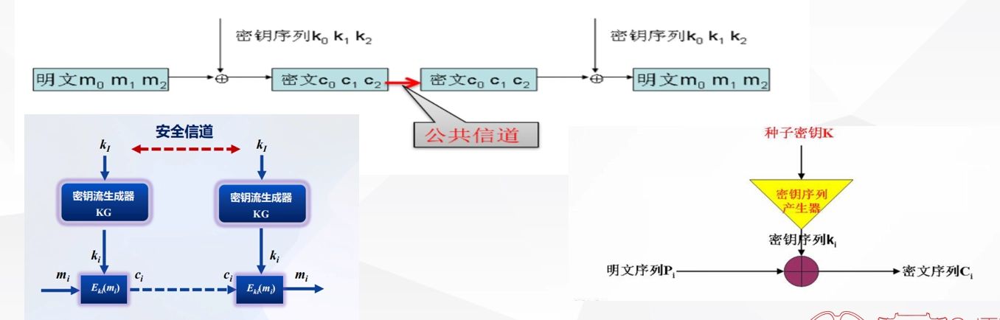
   - 特点：实现简单、便于硬件实施、加解密处理速度快、没有或只有有限的错误传播
   - 由有限状态机产生的序列是伪随机序列
   - 典型算法：RC4
2. **分组密码**
   - 定义：将明文消息编码表示后的数字序列划分成长度为n的组，在密钥k的控制下变换成等长的输出数字序列。
   - 典型分组密码：DES、IDEA、RC5、RC6、CAST-128等。
   - 设计要求：分组长度足够大，密钥量足够大，算法足够复杂，加密、解密算法简单，数据无扩展，差错传播尽可能小。
3. **Feistel密码结构**
   - 定义：Feistel密码结构是一种迭代密码结构，由Horst Feistel提出，用于设计分组密码。
   - 安全性：单个循环（轮）的Feistel结构不能提供足够的安全性，但多个循环（轮）可以显著提高安全性。
   - 特点：
     - **分组大小**：明文消息编码表示后的数字序列划分成长度为n的组。
     - **密钥大小**：密钥有不同的产生算法，密钥的长度影响密文的安全性。
     - **迭代轮数**：多轮重复循环处理，典型的循环次数是16次。
     - **子密钥产生算法**：用于产生加密过程中的密钥。
     - **轮函数**：函数越复杂，安全性越好，更能抵抗密码分析，包括加法、减法和异或，固定循环/移位等。
4. **DES算法**
   - 定义：DES（Data Encryption Standard）是一种分组密码，假设明文m是有0和1组成的长度为64比特的符号串，密钥k也是64比特的0,1符号串。
   - 有效密钥：64比特密钥k只有56比特有效，其余8位是奇偶校验位，在算法中不起作用。
   - DES算法细节：
     - **初始置换IP和初始逆置换IP$^{-1}$**：DES过程中的初始和最终步骤，用于重新排列明文和密文的比特。
     - **S盒替代**：DES中的关键步骤，使用固定的替换表（S盒）对数据进行非线性变换。
5. **三重DES算法(TDEA)** 
   - 定义：三重DES（Triple DES）算法使用3倍DES密钥长度的密钥，执行3次DES算法，以提高安全性。
   - TDEA算法模式：
     - **DES-EEE3模式**：使用三个不同的密钥（k1, k2, k3），进行三次加密。
     - **DES-EDE3模式**：使用三个不同的密钥（k1, k2, k3），采用加密-解密-加密模式。
     - **DES-EEE2模式**：使用两个不同的密钥（k1= k3, k2），进行三次加密。
     - **DES-EDE2模式**：使用两个不同的密钥（k1= k3, k2），采用加密-解密-加密模式。
6. **高级加密标准AES**
   - 定义: AES（Advanced Encryption Standard）是NIST于2001年公布的加密标准，取代DES算法。
   - AES算法特点：
     - **结构**：AES不具有Feistel结构，而是采用基于块的密码结构。
     - **操作**：每轮进行“字节替换”、“行移位”、“列混淆”、“轮密钥加”，共10轮迭代。
   - AES算法举例：
     - 分组 16字节  128位
     - 子秘钥 44个，每个 32位，每轮使用4个字，128位
     - 每轮进行“字节替换”、“行移位”、“列混淆”、“轮密钥加”
     - 10轮迭代，但是非Feistel结构
     - 每一步都简单可逆A⊕B⊕B = A
     
7. **公钥加密体制**
   - 定义：公钥技术是加密史上的一个革命性进步，改变了密钥分发的方式，具备密钥分配和管理、数字签名和身份认证、数据加解密等功能。
   - 特点：
     - 基于数学函数而不是对“位”的形式的简单操作（如替换和置换、逻辑加、乘和异或）
     - 加/解密钥是**非对称**的：公钥密码体制使用两个不同的密钥，在机密性、密钥分配及认证领域中，具有深远的影响。
     - **密钥管理**：私钥为密码拥有者保管，不涉及分发问题，公钥通过公开渠道分发而不影响安全性。
     - 通常要求足够大的密钥长度 (>1024 bits) ，密钥太长会导致加密速度缓慢，因此公钥算法常用于密钥传递，而一般 不用于实时的数据加密
   - 单向陷门函数
     - 公钥密码体制是基于单向陷门函数的概念。
     - **单向函数**是一些易于计算但难于求逆的函数
     - **单向陷门函数**就是在已知一些额外信息的情况下易于求逆的单向函数，这些额外信息就是所谓的陷门。
     - 构造公钥密码系统的关键是如何在求解某个单向函数的逆函数的NP完全问题中设置合理的“陷门”。
   - 典型公钥算法：
     - RSA算法三种方式都适合
     - Diffe-Hellman算法只适合于密钥交换
     - DSS（数字签名标准）适合于数字签名
     - EIGamal适合于前两种
     - 椭圆曲线算法（ECC）三种都适合。
   - 加密方案：
      - **公钥加密方案**
         1. **基于公开密钥的加密过程**：
            - **加密过程**：当Alice给Bob发信息时，她使用Bob的公钥KB对消息加密，Bob使用自己的私钥KSB对密文解密。
         2. **公钥算法应用——认证**：
            - **认证过程**： 当Alice给Bob发信息时，她使用自己的私钥KSA对消息加密（签名），Bob使用Alice的公钥KAP对密文解密，认证。
      - **公钥+常规密钥结合的加密方案**
         1. **结合加密方案原理**：
            - **方案概述**：利用公开加密的方法来保护常规加密密钥的传送，保证常规加密密钥的安全性，然后用常规加密方法来保护传送的数据。
         2. **结合加密方案特点**：
            - **效率与安全性**： 这种方法利用了公开加密方法的安全性特点和常规加密方法的速度快和适应性强的特点，同时避免了公开加密方法加/解密速度慢的缺点。
8. **RSA算法**
   - 定义：RSA算法是一种公钥密码算法，涉及两个素数p和q，计算n=pq，φ(n)=(p–1)(q–1)，随机选取整数e，计算d，满足de≡1 (modφ(n))。
   - **RSA算法加密解密**：
     - **加密算法**：c=E(m)≡me(mod n)
     - **解密算法**：D(c)≡cd(mod n)
9. **Rabin公钥密码算法**
   - 定义：Rabin公钥密码算法的安全性基于**模合数平方根困难的困难性**。
   - 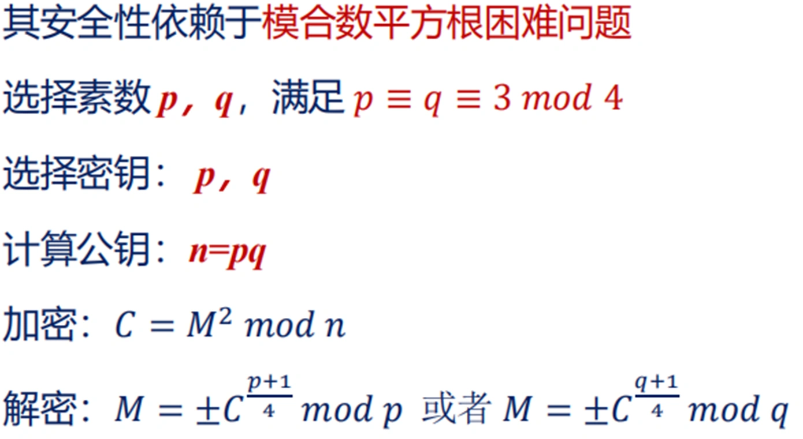
10. **Diffie-Hellman算法——密钥交换**
   - 定义：Diffie-Hellman算法允许两个用户可以安全地交换一个秘密信息，用于后续的通讯过程。
   - 算法的安全性依赖于**计算离散对数的难度**。
   - Diffie-Hellman算法过程：
      - 密钥交换过程：双方获得a及p：p是一个素数，a是P的原根，通过计算得到共享密钥K。
11. **ElGamal公钥密码算法**
   - 定义：ElGamal公钥密码体制安全性是基于**有限域上计算离散对数的困难性**。
12. **椭圆曲线公钥密码算法（ECC）**
   - 定义：ECC实际上是将原有的经典的加密算法通过某些运算移植到安全的椭圆曲线方程上。
   - 特点：
     - **安全性与效率**：椭圆曲线离散对数问题（ECDLP）是椭圆曲线密码学的基础，具有安全性高、密钥尺度小、实现速度快的优点。
13. **单向散列算法**
   - 定义：单向散列函数是根据输入消息输出固定长度数值的算法，输出数值也称为“散列值”或“消息摘要”。
   - 特点：
     -   散列函数  h=H（M），其中，M是发长的报文，h是定长的散列值。设x、x′是两个不同的消息，如果H（x）=H（x′），则称x和x′是哈希函数H的一个（对）碰撞（collision）
     
     - **安全性设计**：强加密单向散列函数是这样设计的：不可能通过计算找出两条散列值相同的消息。
   - **MD5和SHA-1**：
     - **MD5**：生成128位的散列值。
     - **SHA-1**：生成160位的散列值。
   - **SHA-2系列算法**：
     - **SHA-2系列**：包括SHA-224、SHA-256、SHA-384和SHA-512。
14. **国产密码**
   - 定义：国密算法是国家商用密码管理办公室指定的一系列密码标准，包括SM1、SM4、SM2、SM3、ZUC等。
   - 特点：
     - **自主性与安全性**：从根本上摆脱对国外密码技术和产品的过度依赖，实现加密、解密和认证等功能。

## 第三节 密码学新进展及研究方向

### 公钥密码
1. **公钥基础设施 (PKI)**
   - 定义：用公钥概念与技术来实施和提供安全服务的具有普适性的安全基础设施
   - PKI是生成、管理、存储、分发和吊销基于公钥密码学的公钥证书所需要的硬件、软件、人员、策略和规程的总和。**其最基本的元素是数字证书。**
   - 证书权威（CA）对用户证书带来了复杂的管理问题
   - 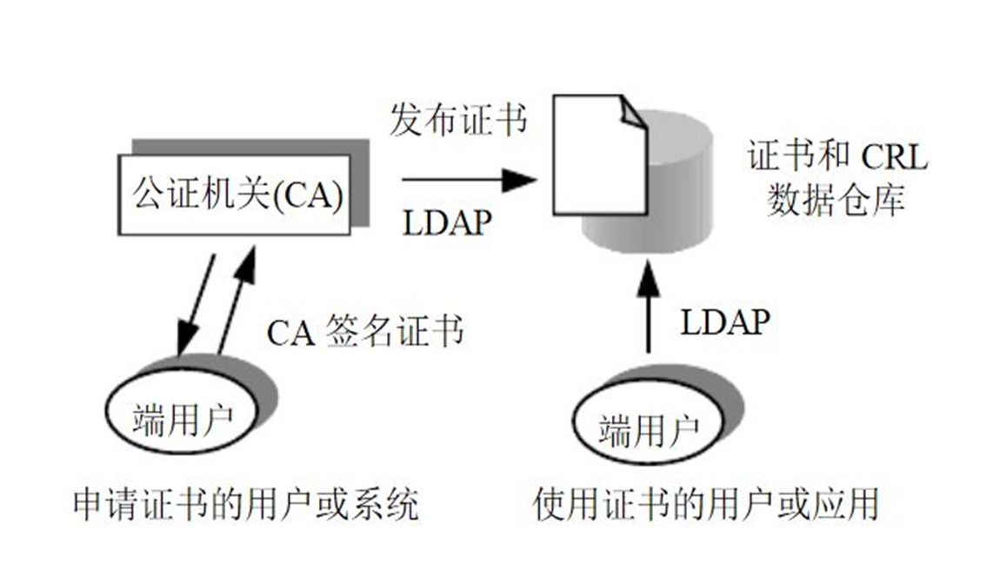

2. **公钥证书(数字证书)**
   - 公钥证书由证书管理机构CA为用户建立，其中的数据项包括与该用户的秘密钥相匹配的公开钥及用户的身份和时间戳等，**所有的数据项经CA用自己的秘密钥签字后就形成证书**。
   - 
   - 公钥证书是用来绑定实体姓名以及该实体的其它相关属性和相应公钥的凭证。s是网络环境中的一种身份证，用于证明某一用户的身份及其公开密钥的合法性。
   - 使用X.509协议，广泛应用在网络安全设施：IP安全协议、SSL、SET和S/MIME。

3. **身份基公钥密码 (IBC)**
   - 使用能唯一标识用户身份的信息作为公钥，例如电话号码或Email地址等，简化了传统公钥密码体系中的用户证书管理。
   - 在身份基公钥密码中，用户公钥可以为任意的比特串。用户私钥通过可信第三方，即PKG生成。
   - 身份基公钥密码密钥生成过程：
   - 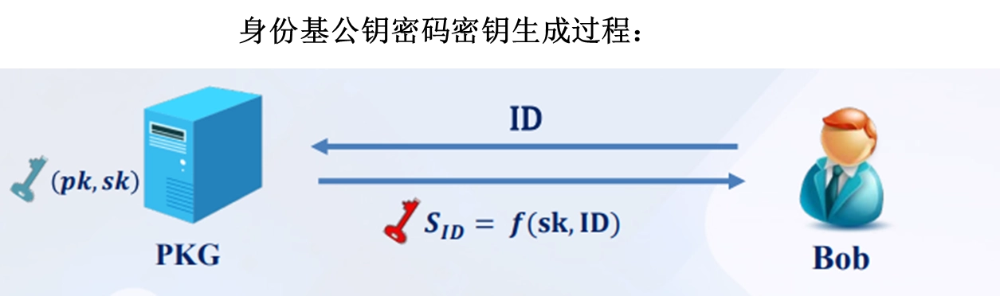
   - 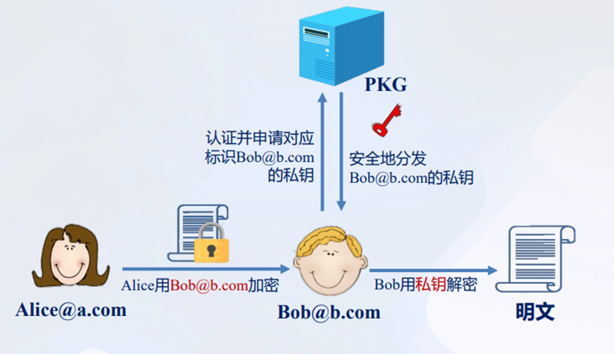
   - (pk,sk)：用户的公私钥对
   ID：用户的公钥身份字符串
   PKG：私钥生成中（PrivateKeyGenerator ）
   - 一个身份基加密方案包含四个算法：
     - 系统建立算法：PKG生成系统公开参数和主密钥；
     - 密钥提取算法：用户将ID提交给PKG，PKG生成ID对应的私钥；
     - 加密算法：利用用户身份ID加密消息，生成加密密文；
     - 解密算法：利用身份ID对应的私钥解密密文，得到明文消息。
   - 身份基加密方案扩展了身份基公钥密码体制，能够较好地解决PKI证书管理复杂问题，被广泛应用于安全电子邮件、AdHoc网络密钥管理等应用场景。
   - 优点：
     - 无需公钥证书，加密或签名验证不需要知道除身份外的其他信息；
     - 无需证书机构，存在可信第三方私钥生成中心(PKG)向用户提供服务；
   - 缺点：
     - 密钥托管问题：恶意的PKG可能存储用户私钥的副本，使其有能力解密任何一个用户发送给用户ID的密文或伪造用户ID的数字签名。

4. **属性基公钥密码 (ABE)**
   - 数据拥有者根据用户的属性来加密数据，并且只有当用户拥有特定属性组合时才能解密数据，这种加密方式为数据共享和访问控制提供了一种细粒度的控制机制。
   -  在属性基加密中，系统的每个权限都可以用一个**属性**来表示。系统中存在一个属性权威( Attribute Authority，AA)，属性权威对每个用户的属性进行认证，并颁发相应密钥。
   - 密钥和密文都与**一组属性**相关联，属性集合表示用户身份。加密者根据将要加密的消息和接收者的属性构造一个**加密策略**，当属性满足加密策略时，解密者才能够解密。
   - 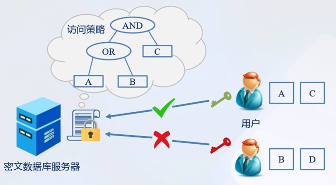
   - 属性基签名（Attribute-Based Signature，ABS）是由模糊身份签名发展而来的；
     - 根据签名的生成过程分为：密钥策略属性基签名（KP-ABS）、签名策略属性基签名（SP-ABS）
     - 当且仅当属性集合满足访问结构时，签名者可以对消息生成合法签名
     - 特点：匿名性  

### 同态密码
1. **同态密码**
   - 同态密码可以在不泄露敏感信息的前提下完成对密文的处理，成为保护数据安全，提高密文处理分析能力的关键技术。
   - 同态是一个数学概念，如果E(f(a， b)) = f(E(a)， E(b))，则E(.)是一个同态映射。
   - 假设加密操作为E(.)，明文为m，密文为e，如果针对明文的操作f，可以根据E构造出f，使得 E(f(m)) = f(e)。 那么E就是一个针对f的同态加密算法。
   - 同态加密是指在不知道解密算法和密钥情况下，可以对密文直接进行特定运算，而其运算结果解密后与用明文进行相同运算所得的结果一致。

2. **同态密码技术的优缺点**
   - 优点：无密钥方的计算处理，既可以减少通信代价，又可以避免每一个密文解密后再计算而花费高昂的计算代价。
   - 缺点：
     - 只能实现单比特加密，效率较低；
     - 困难性假设未论证，寻找可论证的困难问题是个难题；
     - 需要额外的消除噪音算法，依然不是自然同态。
   

### 抗量子密码
1. **抗量子密码分类**
   - 基于量子物理学的量子密码：
     - 主要集中在量子密钥分配、量子秘密共享、量子认证、量子密码算法和量子密码算法的安全性等方面的研究；
     - 安全性是基于**量子物理设备**的。
   - 基于生物学的DNA密码：
     - 是随着基因工程和生物计算的发展而诞生的；
     - 安全性是建立在**生物困难问题**上的。
   - 基于数学的抗量子计算密码;
     - 基于量子计算机不擅长计算的**数学困难问题**构造的；
     - 研究方向主要有：基于格的密码、基于Hash的数字签名、基于纠错编码的密码和基于多变量的密码。

2. **基于数学的抗量子密码**
   - NIST PQC 标准征集工作聚焦于以下3类抗量子密码算法的征集：加密、密钥交换、数字签名。
   - 在 69 个候选草案中，主要包括以下 4 种数学方法构造的抗量子密码算法：
     - **格 (Lattice-based)**：
       - 最早出现于 1996 年，主要用于构造加密、数字签名、密钥交换，以及众多高级密码学应用，如：**属性加密 (Attribute-based encryption)**、陷门函数 (Trapdoor functions)、伪随机函数 (Pseudorandom functions)、同态加密 (Homomorphic Encryption) 等。代表算法：NTRU 系列、NewHope 、一系列同态加密算法 (BGV、GSW、FV 等)。由于其计算速度快、通信开销较小，且能被用于构造各类密码学算法和应用，因此被认为是**最有希望的抗量子密码技术**
     - **编码 (Code-based)**：
       - 最早出现于 1978 年，主要用于构造加密算法。代表算法：McEliece
     - **多变量 (Multivariate-based)**：
       - 最早出现于 1988 年，主要用于构造数字签名、加密、密钥交换等。代表算法：HFE (Hidden Field Equations)、Rainbow (Unbalanced Oil and Vinegar (UOV) 方法)、HFEv- 等
     - **哈希 (Hash-based)**：
       - 最早出现于 1979 年，主要用于构造数字签名。代表算法：Merkle 哈希树签名、XMSS、Lamport 签名等
   

### 轻量级密码
1. 轻量级密码概述
   - 轻量级密码的特性
     - 目标：为资源受限的设备定制专属的密码解决方案；
     - 特点：对吞吐率的要求比普通密码算法低；
     - 实用性：部分轻量密码采用机器内置密钥。
   - 轻量级密码的设计方法实现
     - 设计要求：存储计算开销小、能耗低、安全性；
     - 第一种方法：在现有的密码方案上进行轻量化改进；
     - 第二种方法：设计一个全新的轻量密码方案。
   - 轻量级密码的性能评估
     - 硬件开销：延迟、功耗、吞吐率
     - 软件开销：寄存器、RAM、ROM的空间使用
     
2. 轻量级密码研究现状 
     
### 密码学主要研究方向
1. 研究方向
   - 密码学是研究密码编码、密码分析、密码工程、密码应用、密码管理、密码安全防护等问题的一门科学，是多个学科融合形成的交叉学科。
   - 

# 第三章 网络安全基础
## 第一节 网络安全概述

### 网络安全事件回放

1. **网络的定义**
    - 定义：计算机网络是指将地理位置不同，具有**独立功能(或自治能力)** 的多个计算机系统用**通信设备和线路连接起来**，并以功能完善的网络软件(网络协议、网络操作系统等)进行信息交换，实现**资源共享和协同工作**的系统。
    - 特征：
      - 网络中包含两台以上的地理位置不同具有“自治能力”的计算机。
      - 网络中各结点之间的连接需要有一条通道，由传输介质实现物理互联。
      - 网络中各结点之间互相通信或交换信息，需要有某些约定和规则，实现各结点的逻辑互联。 
      - 计算机网络是以实现数据通信和网络资源(包括硬件资源和软件资源)共享和协作为目的。

2. **网络的结构**
    - OSI参考模型是国际标准化组织(ISO)为解决异种机互连而制定的开放式计算机网络层次结构模型，它的最大优点是将服务、接口和协议这三个概念明确地区分开来。
    - 网络通信分为七层，从下到上分别是：物理层(Physical Layer)、数据链路层(Data Link Layer，简称为链路层)、网络层(NetWork Layer)、传输层(Transport Layer)、会话层(Session Layer)、表示层(Presentation Layer)以及应用层(Application Layer)。
    - 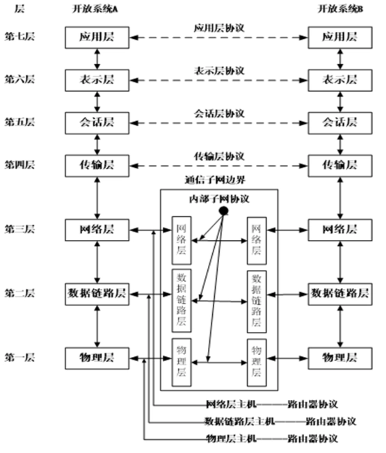

3. **网络安全现状**
   - 计算机病毒层出不穷，并呈现新的传播态势和特点
   - 黑客对全球网络的恶意攻击势头逐年攀升
   - 由于技术和设计上的不完备，导致系统存在缺陷或安全漏洞
   - 世界各国军方都在加紧进行信息战的研究

4. **网络安全事件**
    1. **海湾战争网络安全事件**：1991年，美国特工人员在安曼将伊拉克从德国进口的打印机设备中换上含有可控“计算机病毒”的芯片，导致伊方计算机系统全面瘫痪。
    2. **Microsoft公司网站遭袭**：2000年10月25日，Microsoft公司网站遭到来自俄罗斯黑客的袭击，系统瘫痪，部分源代码丢失。
    3. **中美黑客大战**：2001年4月4日，美国黑客组织攻击中国网站，随后中国黑客发起网络反击战。
    4. **ATM机被黑客攻击**：2010年黑帽大会上，美国安全公司IOActive展示ATM机被黑客攻击，导致现金被非法取出。
    5. **飞机电脑系统被黑客攻击**：2013年荷兰黑客安全大会上，德国网络安全工程师Hugo Teso展示绕过飞机安全检查系统接管飞机电脑系统。
    6. **特斯拉Model S系统被攻破**：2014年10月黑客大赛，特斯拉Model S系统被攻破，实现远程操控。
    7. **微信等苹果APP发现Xcode恶意后门**：2015年9月14日，微信等近350款苹果APP发现存在Xcode恶意后门。
    8. **汇丰银行遭受DDoS攻击**：2016年1月4日和1月29日，汇丰银行遭受DDoS攻击，服务中断。
    9. **WannaCry勒索病毒爆发**：2017年5月12日，WannaCry勒索病毒利用“永恒之蓝”漏洞传播，影响超过10万台电脑。
    10. **万豪国际酒店客户资料泄露**：2018年11月30日，万豪国际酒店客户系统被黑客侵入，约5亿客户资料泄露。

### 网络安全威胁与防护措施
1. **网络安全概念**
   - 定义：网络安全指网络系统的硬件、软件及其系统中的数据受到保护，不因偶然的或者恶意的原因而遭受破坏、更改、泄露，系统连续可靠正常地运行，网络服务不中断。
   - 本质：网络上的信息系统安全。
   - 网络安全包括**系统安全运行**和**系统信息安全保护**两方面：
     - 信息系统的安全运行是信息系统提供有效服务(即可用性)的前提
     - 信息的安全保护主要是确保数据信息的机密性和完整性
   - 涉及内容：技术方面侧重于防范外部的入侵，管理方面则侧重于内部人为因素的管理。
   - 安全领域普遍认为“最大的漏洞就是人”。
   - 目标：**机密性、完整性、可用性、非否认性、可靠性、可控性、可审查性**

2. **安全威胁和攻击概念**
   - **安全威胁**：
     - 指对某一资源的保密性、完整性、可用性或合法使用所造成的危险。
   - 脆弱性：指在实施防护措施中或缺少防护措施时系统所具有的弱点。
   - 风险：是对某个已知的、可能引发某种成功攻击的脆弱性的代价的测度。风险分析能够提供定量的方法，以确定是否应保证在防护措施方面的投入。
   - 漏洞：从广义上讲，硬件、软件、协议的具体实现或系统安全策略以及人为因素上存在的缺陷，从而可以使攻击者能够在未经系统合法用户授权的情况下访问或破坏系统。
   - **攻击**：
     - 一种故意逃避安全服务(特别是从方法和技术上)并且破坏系统安全策略的智能行为；任何可能危及机构信息安全，破坏系统安全属性的行为；攻击就是某个安全威胁的具体实施
   

1. **网络信息安全的典型威胁**
   - 包括窃听、信息泄露、病毒感染、非法使用、完整性侵犯、拒绝服务、假冒、流量分析等。
   - 分类：
     - 物理威胁
     - 操作系统缺陷
     - 网络协议缺陷
     - 体系结构缺陷
     - 黑客程序
     - 计算机病毒

2. **典型威胁及其相互关系**
   - 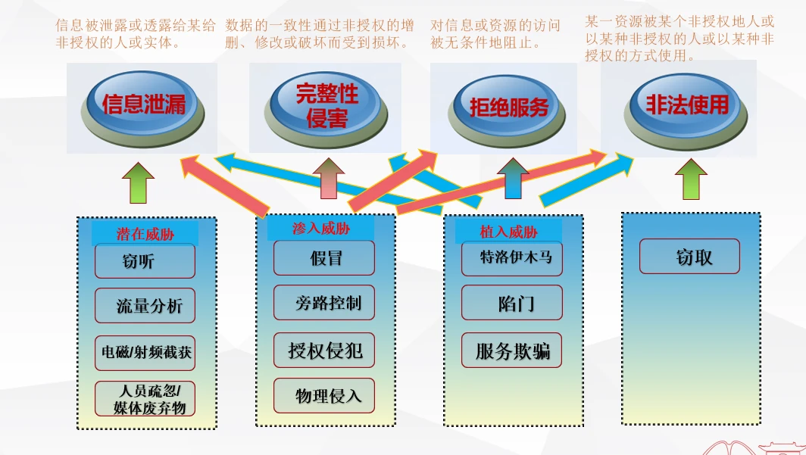
  
3. **安全防护措施**
   - 包括技术防护和管理措施，以防范外部入侵和内部人为因素的管理。

### 安全攻击的分类及常见形式
1. **安全攻击的种类**
   - 包括被动攻击和主动攻击。
   - 被动攻击：对所传输的信息进行窃听和监测；
   - 主动攻击：恶意篡改数据流或伪造数据流等攻击行为； 
   - 被动攻击虽然难以检测，但采取某些安全防护措施就可以有效阻止；而主动攻击虽然易于检测，但却难以阻止。
   - 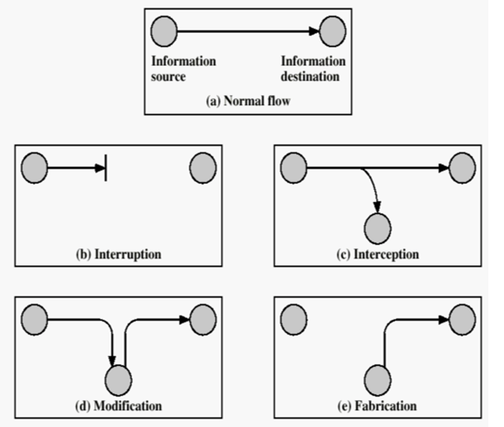
     - Interruption 中断 破坏可用性
     - Interception 截取 破坏机密性
     - Modification 修改 破坏完整性
     - Fabrication 伪造 破坏真实性

2. **攻击树**
   - 攻击树是一种**以分支模型直观地表示计算机安全威胁的方法(或威胁建模)**，用来确定哪些威胁最有可能，以及如何有效地阻止威胁。
   - 攻击的目标，如访问机密文件，是攻击树的根。
   - 每个分支代表实现该目标的不同方法，这些分支机构可能会从多个方向跳出，有各种不同的选择来实施这些方法

3. **攻击过程分析**
   - **预攻击(踩点和扫描)**
     - 目的：收集信息，进行进一步攻击决策
     - 内容：
       - 获得域名及IP分布
       - 获得拓扑及OS等
       - 获得端口和服务
       - 获得应用系统情况
       - 跟踪新漏洞发布
   - **攻击(入侵、获取权限、提升权限)**
     - 目的：进行攻击，获得系统的一定权限
     - 内容：
       - 获得远程权限
       - 进入远程系统
       - 提升本地权限
       - 进一步扩展权限
       - 进行实质性操作
   - **后攻击(清除日志、安插后门)**
     - 目的：消除痕迹，长期维持一定的权限
     - 内容：
       - 植入后门木马
       - 删除日志
       - 修补明显的漏洞
       - 进一步渗透扩展   

4. **安全攻击常见八种形式**
   - 包括口令窃取、欺骗攻击、缺陷和后门攻击、认证失效攻击、协议缺陷攻击、信息泄漏攻击、指数攻击、拒绝服务攻击等。

    1. **口令窃取**
       - **口令猜测攻击的三种基本方式：**
         - 利用已知或假定的口令尝试登录(口令字典、暴力破解、社会工程学字典攻击)；
         - 根据窃取的口令文件进行猜测；
         - 窃听某次合法终端之间的会话，并记录所使用的口令；
       - **抵御口令猜测攻击方式：**
         - 阻止选择低级口令，采用更为复杂的口令；
         - 对口令文件严格保护；
       - **彻底解决口令机制的弊端：**
         - 使用基于令牌的机制，例如一次性口令方案(OTP-One-Time Password)。
  
    2. **欺骗攻击**
       - 采用欺骗的方式(假冒、伪装等)获取合法信息并加以利用，获得权限：
         - Web欺骗(钓鱼邮件)；
         - IP欺骗；
         - DNS欺骗(域名劫持)；
         - ARP欺骗。

    3. **缺陷和后门攻击**
       - **缺陷：** 指程序中某些代码不能满足特定需求。
       - **后门：** 指能绕开正常的安全访问机制而直接访问程序的程序代码。
       - **缓冲器溢出(堆栈粉碎)攻击：** 程序对接受的输入数据没有进行有效检测导致的错误，可能造成程序崩溃或者是执行攻击者的命令。
         - 一种扰乱程序的攻击方法
         - 在堆栈上执行代码时出现程序指针紊乱      
       - **网络蠕虫攻击**：利用操作系统和应用程序**漏洞**传播，通过网络的通信功能将自身从一个结点发送到另一个结点并启动运行的程序，可以造成网络服务遭到拒绝并发生死锁。**蠕虫是一段独立的可执行程序，它可以通过计算机网络把自身的拷贝(复制品)传给其他的计算机。**
         - 方式之一是向守护程序发送新的代码
         - 蠕虫向“读”缓冲区内注入大量的数据

    4. **缓冲区溢出**
        - 这种攻击可以使一个匿名的Internet用户有机会获得一台主机的部分或全部的控制权。
        - 攻击者向一个有限空间的缓冲区中复制过长的字符串，可能造成程序瘫痪或系统崩溃，或让攻击者运行恶意代码，执行任意指令，甚至获得管理员用户的权限。

    5. **网络蠕虫攻击**
        - 网络蠕虫攻击是一种通过某种网络媒介，无须计算机使用者干预即可运行的独立程序，通过主动寻找目标计算机，不停的获得网络中存在漏洞的计算机上的部分或全部控制权来将代码副本进行传播。
        - 蠕虫攻击大量地消耗计算机时间和网络通信带宽，导致整个计算机系统及其网络的崩溃，成为拒绝服务攻击的工具。
        - 蠕虫会搜集、扩散、暴露系统敏感信息(如用户信息等)，并在系统中留下后门。这些都会导致未来的安全隐患。

    6. **认证失效攻击**
        - **认证机制的失效**易导致服务器被攻击者欺骗，此攻击会使系统对访问者所采取的**身份认证措施无效**。

    7. **协议缺陷攻击**
        - 协议本身的缺陷导致攻击的发生
            - TCP/IP协议、DNS和许多基于RPC的协议易遭到序列号攻击
            - IP协议易遭受地址欺骗攻击
            - HTTP协议、FTP协议等无安全考虑，易遭受攻击
            - 802.11无线数据通信标准中的WEP协议也存在缺陷
        - 通过改进协议设计消除此缺陷，如我国的WAPI标准

    8. **信息泄漏攻击**
        - 信息泄露的方式包括利用协议缺陷攻破系统、获得信息，软硬件故障导致意外泄密，病毒侵袭，以及内部信息安全管理不善所导致。
        - 信息泄露会使攻击者获得有价值的系统相关信息，并用之攻破系统

    9.  **指数攻击**
        - 指数攻击通常指的是攻击者利用系统或网络的某个特性，以极快的速度增长攻击力度，使得防御措施难以跟上攻击的变化。

    10. **拒绝服务攻击(DOS攻击)**
        - 拒绝服务攻击(DoS)指攻击者利用系统缺陷，通过执行一些恶意的操作而使得合法的系统用户不能及时地得到应得的服务或系统资源。
        - 分布式拒绝服务攻击(Distributed Denial of Service， DDoS)是一种基于DoS攻击、但形式特殊的拒绝服务攻击，采用一种分布、协作的大规模攻击方式。

    11. **SYN Flood(泛洪)攻击**
        - SYN Flood攻击是一种常见的DoS攻击，通过发送大量的SYN请求来消耗服务器的资源，导致服务器无法处理正常的请求。

    12. **Smurf 攻击**
        - Smurf攻击是一种拒绝服务攻击，攻击者发送大量的ICMP回显请求数据包到一个广播地址，使得网络上的所有主机都向被攻击的主机发送ICMP回显应答。

    13. **社会工程学攻击**
        - 社会工程学攻击是一种通过受害者心理弱点、本能反应、好奇心、信任、贪婪等心理陷阱进行欺骗、伤害等危害手段，取得自身利益的手法。
        - 社会工程学是非传统的信息安全
        - 常用的手段：环境渗透、引诱、伪装、恐吓、恭维、说服
        

### OSI模型与安全体系结构
1. **ISO 7498-2标准**
   - 确定了OSI开放系统互连参考模型的信息安全体系结构。
   - 充分体现信息安全层次性和结构性特点，是一个以防护为主的静态的安全体系结构。  

2. **OSI安全体系结构模型**
   - 包括安全服务、安全机制和安全攻击。
   - 

3. **安全服务**
   - 分为认证服务、访问控制服务、数据机密性服务、数据完整性服务和非否认服务。
   1. **认证服务**
      - **定义：** 提供关于某个实体(人或事物)身份的保证，证实实体声明的身份。
      - 认证服务是可控性服务的重要组成部分，通常使用在需要提交人或者事物的身份的这一类特殊的通信过程中。
      - **类型：**
        - **对等实体认证(Peer Entity Authentication)：** 确认通信过程中远端用户的身份。
        - **数据起源认证(Data Origin Authentication)：** 确认数据发送者的身份，保证数据的真正起源。

   2. **访问控制服务**
      - **定义：** 实施授权的一种方法，防止对资源的未授权使用。
      - **作用：**
        - 保护资源以防止非授权访问和操纵。
        - 保护敏感信息不经过有风险的环境传送。
        - 限制实体的访问权限，通常是经过认证的合法实体。

   3. **数据机密性服务**
      - **定义：** 保护信息不泄露或不暴露给未授权的实体。
      - **保密粒度：** 流(stream)、消息(message)、选择字段(field)
      - **内容：**
        - **数据的机密性服务：** 使用加密手段保护数据不被未授权者推断出敏感信息。
        - **业务流机密性服务：** 防止攻击者从分析网络业务流中得到敏感信息。

   4. **数据完整性服务**
      - **定义：** 确保数据的价值和存在性没有改变，对抗数据篡改攻击。
      - **内容：**
        - **单个数据单元或字段的完整性：** 保护数据单元不被非授权者修改。
        - **数据单元流或字段流的完整性：** 保护数据单元序列的完整性，防止数据单元的重放。

   5. **非否认服务(不可抵赖性)**
      - **定义：** 阻止参与某次通信交换的一方在事后否认曾经发生过本次交换的事实。
      - **类型：**
        - **起源的否认：** 向数据接收者提供数据源的证据，防止发送者否认发送过数据。
        - **传递的否认：** 向数据发送者提供数据已交付给接收者的证据，防止接收者否认收到数据。

4. **安全机制**
   - 安全服务与安全机制关系：
     - 安全服务体现了安全系统的功能；而安全机制则是安全服务的实现。
     - 一个安全服务可以由多个安全机制实现；而一个安全机制也可以用于实现多个安全服务中。
     - 

### 网络安全模型
1. **网络安全模型-网络通信**
   - 保护信息传输，需要提供**安全机制和安全服务**。
       - 一部分是对发送的信息进行与安全相关的转换。例如，消息的加密，使开放网络对加密的消息不可读；又如附加一些基于消息内容的码，用来验证发送者的身份。
       - 另一部分是由两个主体共享的秘密信息，而对开放网络是保密的。例如，用以加密转换的密钥，用于发送前的加密和接收前的解密。
   - 需要可信的第三方
   - 一种能被通信主体使用的协议，这种协议使用安全算法和秘密信息以便获得特定的安全服务。
   - 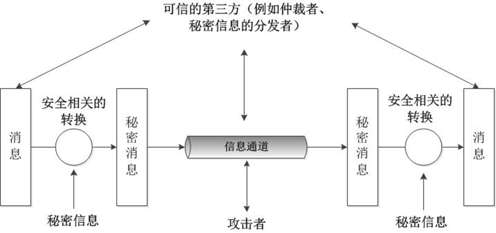

2. **网络安全模型-访问安全**
   - 考虑了黑客攻击、病毒与蠕虫等的非授权访问。
   - 黑客攻击可以形成两类威胁：一类是**信息访问威胁**，即非授权用户截获或修改数据；另一类是**服务威胁**，即服务缺陷以禁止合法用户使用。
   - 病毒和蠕虫是软件攻击的两个实例，这类攻击通常是通过移动存储介质引入系统，并隐藏在有用软件中；也可通过网络接入系统。
   - 两个层次：
     - **网闸或看门人功能**，阻止非授权用户访问
     - **内部安全控制(监控)**：监测有害入侵者的存在
   - 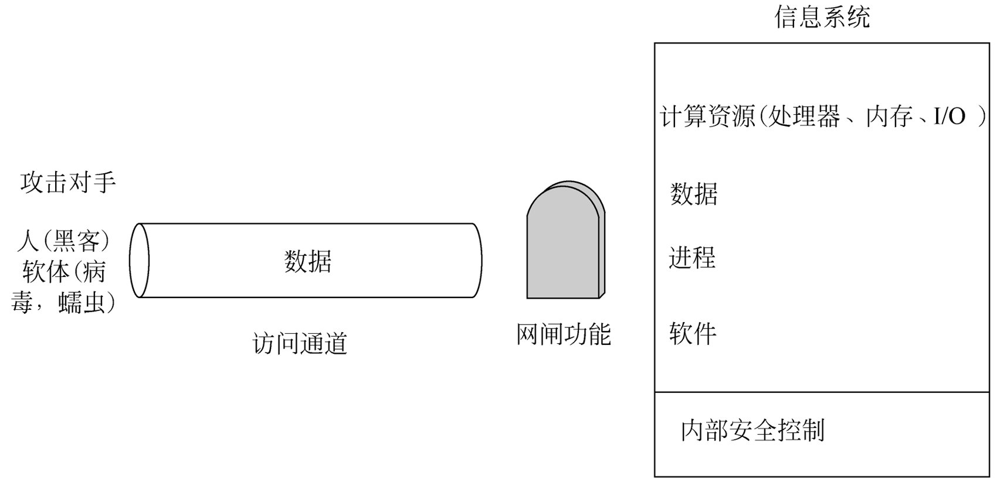

3. **网络安全模型- P2DR-时间模型**
   - P2DR模型是可量化的、可由数学证明的、基于时间的的安全模型， 
   - 包含安全策略(Policy)、防护(Protection)、检测(Detection)和响应(Response)。
     - 安全策略是P2DR安全模型的核心，所有的防护、检测、响应都是依据策略实施的；
     - 防护主要是预防安全事件的发生，发现存在的系统脆弱性和防止意外威胁和恶意威胁；
     - 检测是P2DR中一个非常重要的环节，是**静态防护转化为动态防护的关键**，动态响应和加强防护的依据，同时也是强制落实安全策略的工具；
     - 响应在安全系统中占有重要的地位，是解决安全潜在威胁最有效的方法。
   - 基本思想：信息安全相关的所有活动，无论是攻击、防护、检测和响应行为，都要消耗时间，因此可以用**时间尺度**来衡量一个体系的能力和安全性。
   - 理论：系统的检测时间与响应时间越长，或对系统的攻击时间越短，则系统的暴露时间越长，系统就越不安全；如果系统的暴露时间$E_t<=0$(即$D_t+R_t<=P_t$)，那么认为系统是安全的
   - 安全的目标：尽可能地增大保护时间，尽量地减少检测时间和响应时间。  

4. **网络安全模型- PDRR**
   - 包括防护(Protection)、检测(Detection)、响应(Response)、恢复(Recovery)
   - 这4个部分构成了一个**动态的信息安全周期**
   - 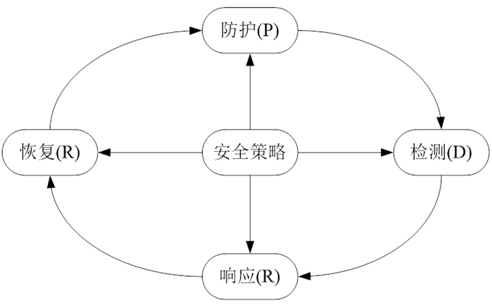

## 第二节 网络安全防护技术

### 防火墙
1. **防火墙概述**
   - **定义**：防火墙是在两个网络之间执行访问控制策略的一个或一组安全系统。由软件和硬件组成的系统集合，是实现网络安全策略的有效工具之一，位于安全的网络和不安全的网络之间，属于**边界防护设备**。
   - **功能**：
     - 通过设置访问控制规则，对进出网络边界的**数据流进行过滤**。
     - 防火墙是建立在内外网络边界上的**过滤封锁机制**，是一种用于保护本地系统或者网络不受基于网络的安全威胁的有效方法。
       - **内部网络**(受信网络)被认为是安全和可信赖的，而**外部网络**(通常是Internet，非受信网络)被认为是不安全和不可信赖的。
       - **非军事化区(DMZ)**：为了配置管理方便，内网中需要向外提供服务的服务器往往放在一个单独的网段，这个网段便是非军事化区。
   - 

2. **防火墙的要求**
   - 所有进出网络数据流都必须经过防火墙。
   - 只允许经授权的数据流通过防火墙。
   - 防火墙自身对入侵免疫，即确保自身安全。

3. **防火墙提供的四种控制机制**
   - **服务控制**：确定了可访问的Internet服务类型，这种控制是双向的，如防火墙可以**以IP地址和TCP端口号为基础对流量进行过滤**；可以提供委托代理软件对收到的每一个服务请求进行解释之后才允许通过。
   - **方向控制**：确定特定的服务请求可以发起和通过的方向，即允许通过防火墙进入或离开。
   - **用户控制**：控制特定用户对某些服务的访问权限。
   - **行为控制**：控制特定服务的应用方式，如控制外部用户只能访问只能访问本地web服务器的部分信息。

4. **防火墙的发展**
   - 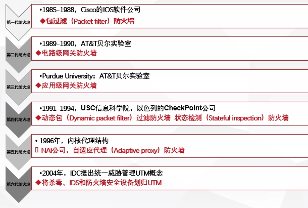

5. **防火墙分类及设计结构**
   - 防火墙分类
      - 
   - 防火墙设计结构
      - 

6. **OSI模型与防火墙类型的关系**
    - 防火墙工作于OSI模型的层次越高，能提供的安全保护等级就越高。
    - 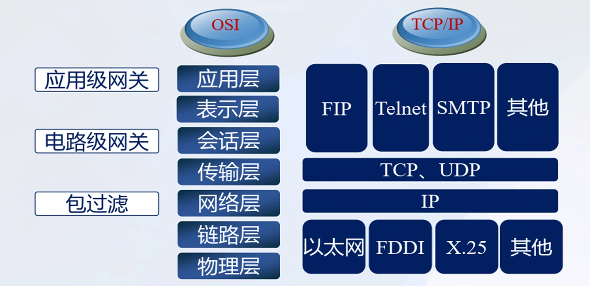
    - 防火墙通常建立在**TCP/IP模型**基础上，OSI模型与TCP/IP模型之间**并不存在一一对应**的关系
    - 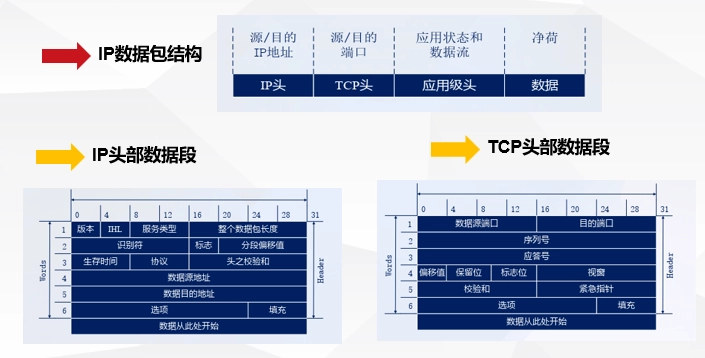

7. **防火墙能与不能**
   - 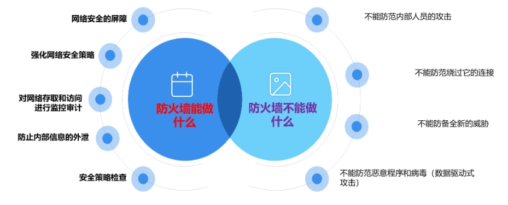
   
8. **防火墙原理**
   1. **静态包过滤防火墙**：
      - **包过滤(Packet Filtering)技术**是防火墙利用对数据包的分析能力，在**网络层**中根据数据包中包头信息有选择地实施允许通过或阻断。
      - 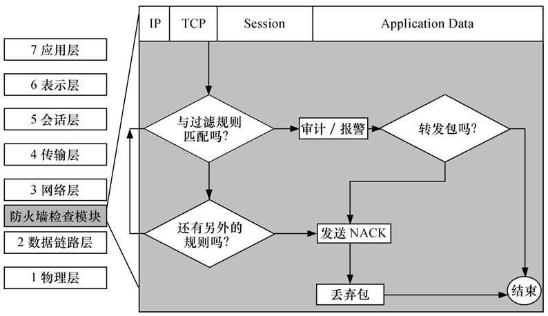
      - 作用过程：
        - 防火墙接收到从外部网络到达防火墙的数据包，对数据包过滤。
        - 对数据包施加过滤规则，对数据包IP头和传输字段内容进行检查。
        - 如果没有规则与数据包头信息匹配，则对数据包施加默认规则。
      - 判断依据(只考虑IP包)：
        - 数据包**封装协议类型**：TCP、UDP、ICMP、IGMP等
        - **源、目的IP地址**，数据包的TCP/UDP源、目的端口
        - **服务类型(端口)**：FTP(21)、HTTP(80)、DNS(53)等
        - IP选项：源路由、记录路由等
        - TCP选项：SYN、ACK、FIN、RST等
        - 其它协议选项：ICMP ECHO、ICMP ECHO REPLY等
        - **数据包流向**：in或out
        - **数据包流经网络接口**：eth0、eth1
        
   2. **动态包过滤防火墙**：
      - 与普通包过滤防火墙相似，大部分工作于**网络层**。有些安全性高的动态包过滤防火墙，则工作于**传输层**。
      - **动态包过滤防火墙的不同点**：
        - 对外出数据包进行**身份记录**，便于下次让具有相同连接的数据包通过。
        - 动态包过滤防火墙需要**对已建连接和规则表进行动态维护**，因此是动态的和有状态的。
      - 两种实现方式：
        - 实时地改变普通包过滤器的规则集
        - 采用类似电路级网关的方式转发数据包
   
   3. **电路级网关防火墙**：
      - 被称为线路级网关，工作在**会话层**，通常作为**应用代理服务器**的一部分，在应用代理类型的防火墙中实现，在**两个主机首次建立TCP连接时创立一个电子屏障**。
      - 电路级网关不**允许端到端TCP直接连接**，相反，电路级网关充当中介，**接收外来请求，转发请求**。
        - 监视两主机建立连接时的握手信息，如通过在TCP 3次握手建立连接的过程中，SYN、ACK等标志和序列号等是否合乎逻辑，判定该会话请求是否合法。
        - **一旦会话连接有效后网关在客户和服务器间中转数据**。
      - 电路级网关的防火墙的安全性比较高，但它仍**不能检查应用层的数据包**以消除应用层攻击的威胁。
      - 
   
   4. **应用层网关防火墙**：
      - 代理对整个数据包进行检查，因此能在**应用层**上对数据包进行过滤。
      - 工作特点：
        - 必针对每个服务运行一个代理。
        - 对数据包进行逐个检查和过滤。
        - **采用“强应用代理”**
        - 在更高层上过滤信息自动创建必要的包过滤规则
        - 当前最安全的防火墙结构之一。
      - **应用代理与电路级网关两个重要区别**：
        - 代理是针对应用的。
        - 代理对整个数据包进行检查，因此能在OSI模型的应用层上对数据包进行过滤。
      
   5. **状态检测包过滤防火墙**：
      - 状态检测是一种相当于4.5层的过滤技术，建立状态连接表，并将进出网络的数据当成一个个的会话，利用状态表跟踪每一个会话状态。
      - 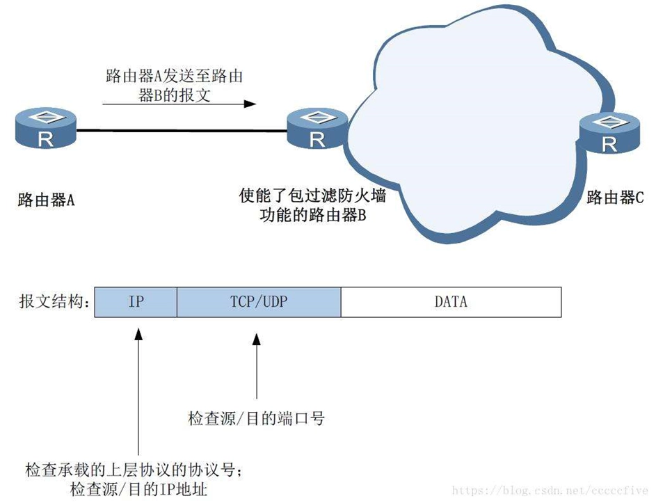
      - 优点：不限于包过滤防火墙的3/4层的过滤，又不需要应用层网关防火墙的5层过滤，既提供了比包过滤防火墙更高的安全性和更灵活的处理，也避免了应用层网关防火墙带来的速度降低的问题。
      - 作用过程：
        - 要实现状态检测，最重要的是**实现连接的跟踪功能，实现多个包的关联分析**。能够进一步分析主连接中的内容信息，识别出所协商的子连接的端口而在防火墙上将其动态打开，连接结束时自动关闭。
        - 通过**建立一个出站的TCP连接目录**加强了TCP数据流的监测规则，对网络通信的各层实施监测分析，提取相关的通信和状态信息，并在动态连接表中进行状态及上下文信息的存储和更新
      
   6. **空气隙防火墙**
      - 物理隔离，通过断开网络连接来保护内部网络不受外部网络的威胁。
      - 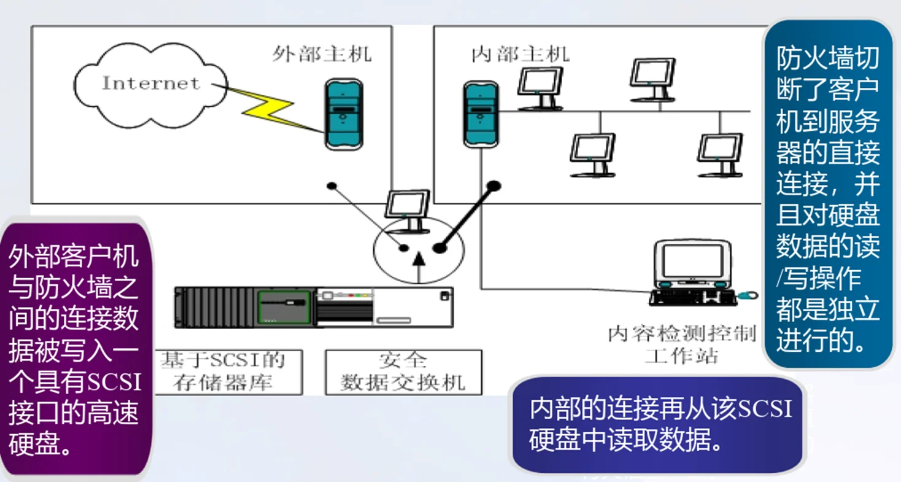

### 入侵检测系统

1. **入侵检测系统发展史**
   - 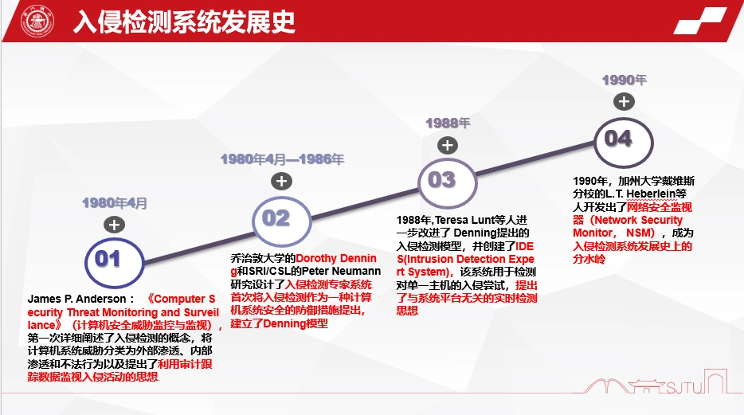

2. **通用的入侵检测系统模型**
   - 

3. **功能任务**
   - **入侵检测系统定义**
     - 入侵检测系统（IDS）是一种对网络传输进行即时监视，在发现可疑传输时发出警报或者采取主动反应措施的网络安全设备。
   - **入侵检测定义**
     - 入侵检测(IDS : Intrusion Detection System)是通过从计算机网络或系统中的若干关键点**收集信息并对其进行分析**，从中发现网络或系统中是否有违反安全策略的行为和遭到袭击迹象的一种机制，基本上**不具有访问控制的能力**，单独使用不能起到保护网络的作用，也**不能独立地防止任何一种攻击**。
   - 功能任务
     - 信息收集：用户在网络、系统、数据库及应用系统中活动的状态和行为。
       - 系统和网络的日志文件
       - 目录和文件中的异常改变
       - 程序执行中的异常行为
       - 物理形式的入侵信息
     - 信息分析
       - 模式匹配
       - 统计分析
       - 完整性分析
     - 安全响应
       - 主动响应
       - 被动响应        
     
4. **系统结构**
   - 事件提取：负责提取相关运行数据或记录，并对数据进行简单过滤。
   - 入侵分析：找出入侵痕迹，发现异常行为，分析入侵行为并定位入侵者。
   - 入侵响应：分析出入侵行为后被触发，根据入侵行为产生响应。
   - 远程管理：在一台管理站上实现统一的管理监控。
   - 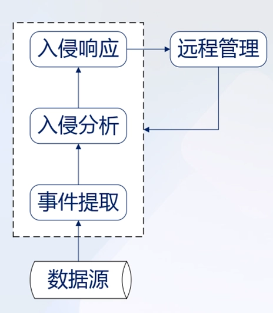

5. **分类**
   - **按照数据来源分类**
      1. *基于网络的IDS(NIDS)*：截获数据包，提取特征并与知识库中已知的攻击签名相比较。
         - 主要优点：
           - 拥有成本低。
           - 攻击者转移证据困难。
           - 实时检测和响应。
           - 能够检测未成功的攻击企图。
           - 操作系统独立。
         - 运作方式
           - 根据网络流量、网络数据包和协议来分析入侵检测。
           - 通常利用一个运行在随机模式下的网络适配器来监视并分析通过网络的所有通信业务。
         - 常用技术
           - 攻击模式、表达式或字节匹配。
           - 频率或穿越阈值。
           - 低级事件的相关性。
           - 统计学意义上的非常规现象检测。
         - 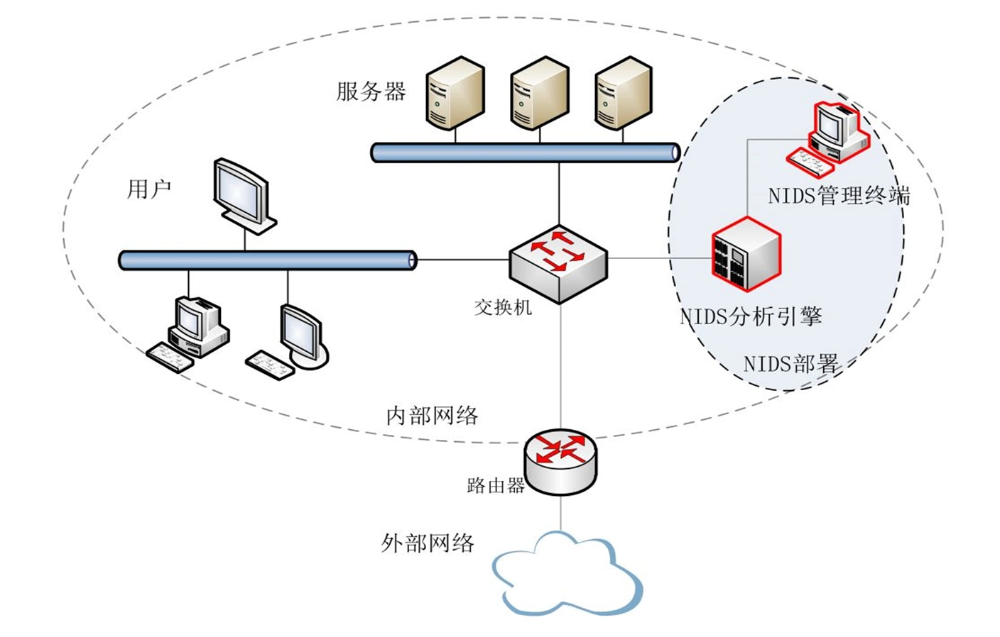
         
      2. *基于主机的IDS(HIDS)*：通过对日志和审计记录的监控分析来发现攻击后的误操作。
      3. *分布式IDS(DIDS)*：同时分析来自主机系统审计日志和网络数据流。
   - **按照检测策略分类**
      1. ***误用检测*：将收集的信息与数据库作比较**
        - 
        - 原理：误用检测技术又称为**基于知识(或规则)的检测技术**或者**模式匹配检测技术**，收集非正常操作的行为特征，建立相关的特征库，当监测的用户或系统行为与库中的记录相匹配时，系统就认为这种行为是入侵 。
          - 假设所有的网络攻击行为和方法都具有一定的模式或特征。入侵模式说明了那些导致安全突破或其它误用的事件中的特征、条件、排列和关系。
        - 入侵检测方法：
          - 基于条件概率误用检测
          - 基于专家系统误用检测
          - 基于状态迁移误用检测
          - 基于键盘监控误用检测
          - 基于Petri网状态转换检测
      2. ***异常检测*：测量属性的平均值，并用来与系统行为比较**
        - 
        - 原理：异常检测技术又称为**基于行为的入侵检测技术**，用来识别主机和网络中的**异常行为**。该技术假设攻击与正常合法的活动有明显的差异，首先假设网络攻击行为是不常见的或是异常的，区别于所有的正常行为。
          - **阈值检测**：异常检测技术先**定义一组系统正常活动的阈值**，如CPU利用率、内存利用率、文件校验和等，然后将系统运行时的数值与所定义的“正常”情况比较，得出是否有被攻击的迹象。
          - **用户轮廓(Profile)**: 通常定义为各种行为参数及其阀值的集合，用于描述正常行为范围。
        - 入侵检测方法：
          - 统计异常检测方法
          - 特征选择异常检测方法
          - 基于贝叶斯推理异常检测方法
          - 基于贝叶斯网络异常检测方法
          - 基于模式预测异常检测方法
      3. ***完整性分析*：关注是否被更改**

6. **网络诱骗系统**
   - 密罐技术(Honeypot)就是建立一个虚假的网络，诱惑黑客攻击这个虚假的网络，从而达到保护真正网络的目的。
     - 蜜罐系统是一个包含漏洞的诱骗系统，通过模拟一个或多个易攻击的主机，给攻击者提供一个容易攻击的目标
     - 观测黑客如何探测并最终入侵系统
     - 拖延攻击者对真正目标的攻击 
   - 分类：
     - 

### 虚拟专网VPN

1. **虚拟专网VPN概述**
   - **定义**：VPN(虚拟专网，Virtual Private Network)：将物理上分布在不同地点的网络通过公用网络连接而构成**逻辑上的虚拟子网**。
   - **原理**：VPN基于Internet/Intranet等公用开放的传输媒体，通过**加密和认证**等安全机制建立虚拟的数据传输通道，以保障在公共网上传输私有数据信息不被窃取、篡改，是目前广泛应用于电子商务、电子政务等应用安全保护的安全技术。
   - 三个基本安全功能
     - **加密数据**：以保证通过公网传输的信息即使被他人截获也不会泄露。 
     - **信息认证和身份认证**：保证信息的完整性、合法性，并能鉴别用户的身份。 
     - **访问控制**：不同的用户有不同的访问权限。

2. **VPN特点**
   - 费用低
   - 安全保障
   - 服务质量保证(QoS)
   - 可扩充性和灵活性
   - 可管理性

3. **VPN分类**
   - **远程访问VPN(Access VPN)，也称为VPDN(拨号VPN)**
     - 移动用户在任何地方、时间与公司总部、公司内联网的VPN设备建立起隧道或秘密信道，实现访问连接。
   - **网关-网关VPN**：
     - 组建内联网(Intranet VPN，企业内部虚拟专网)
       - 在公司远程分支机构的LAN和公司总部LAN之间的VPN
     - 组建外联网(Extranet VPN，扩展的企业内部虚拟专网)。
       - 在供应商、商业合作伙伴的LAN和公司的LAN之间的VPN
   - 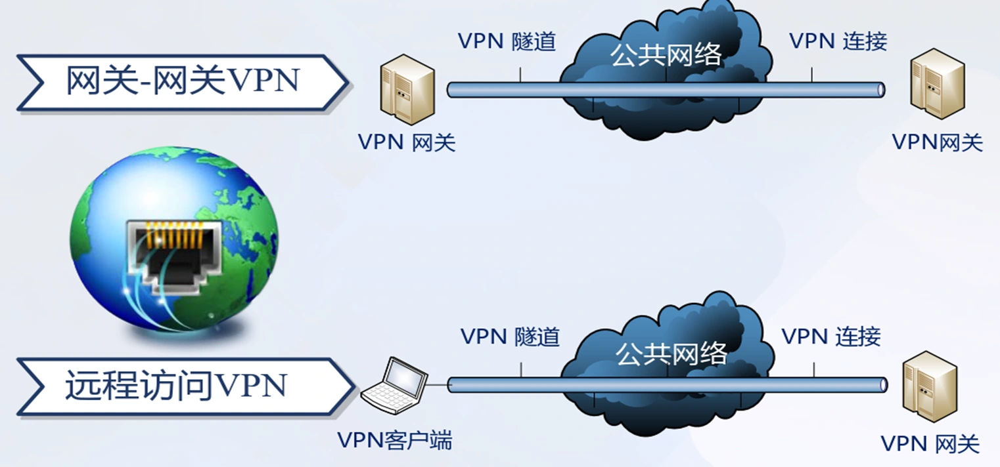
     

4. **VPN关键技术**
   - 隧道技术
   - 加/解密技术
   - 密钥管理技术
   - 身份认证技术
   - 访问控制技术

5. **IPSEC协议**
   1. **概述**
      - **定义**：IPSec是一种由IETF设计的端到端的**确保IP层通信安全**的机制，为保证在Internet上传送数据的安全保密性能的**三层隧道加密协议**，弥补IPv4设计时缺乏安全性考虑的不足，将安全服务集成到IP协议中(**加强IP协议的安全**)。
      - **IPSec对IPV4是可选的，对IPV6是必须的**
      - **地位**：IPSec定义了一种标准的、健壮的以及包容广泛的机制，为IP以及上层协议（比如TCP或者UDP）提供安全保证。      
      - IPSec由三种机制共同保障:
        - 认证
        - 数据机密性
        - 密钥管理
      - IPSec实现两个基本目标：
        - 保护IP数据包安全
        - 为抵御网络攻击提供防护措施。
      - IpSec提供服务：
        - 机密性（加密）
        - 数据完整性（接收方可以检验通过 Internet 传输的数据是否没有以任何方式更改或篡改过）
        - 身份验证（检验数据来源的身份）
        - 反重播保护（能够检测并拒绝重播的数据包以防止被欺骗）
  
   2. **体系结构**
      - IPSec由两大部分，三类协议构成：
        - AH(Authentication Header，认证头)
           - AH提供认证和数据完整性
        - ESP(Encapsulating Security Payload，封装安全载荷)
           - ESP具有所有AH的功能，还可以利用加密技术实现通信保密
        - IKE(Internet Key Exchange，密钥协商及交换协议)构成。
           - IKE定义了通信实体间进行身份认证、创建安全关联SA、协商加密算法以及生成共享会话密钥的方法。
      - 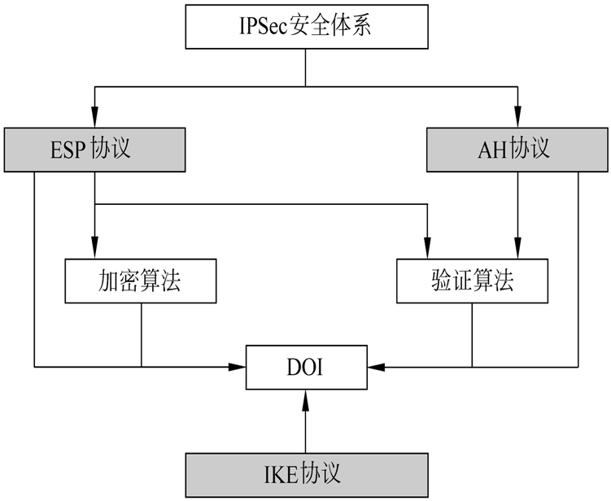
      - 两种操作模式：
        - 传输模式(主机与主机的直接通信)
        - 隧道模式(常用于关联到多台主机的网络访问连入设备间使用)
      - **安全关联SA**(Security Association)：是通信对等方对某些要素的一种协定
      - **两个重要数据库**：安全策略数据库SPD，安全关联数据库SAD
      
   3. **工作模式**
      - **传输模式**：
        - 
        - 保护的是**IP载荷**，通常应用于**两台主机之间，保护传输层协议头，实现端到端通信的安全性**，该模式要求主机支持IPSec。
        - 当数据包从传输层传送给网络层时，AH和ESP会进行拦截，在IP头与上层协议之间需插入一个IPSec头。当同时应用AH和ESP到传输模式时，应该先应用ESP，再应用AH。
        - 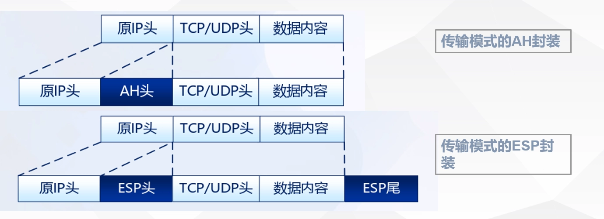
          - 采用传输模式时，IPSec只对IP数据包的净荷进行加密或认证；
          - 封装数据包继续使用原IP头部，只对部分域进行修改；
          - IPSec协议头部插入到原IP头部和传送层头部之间。
          
      - **隧道模式**：
        - 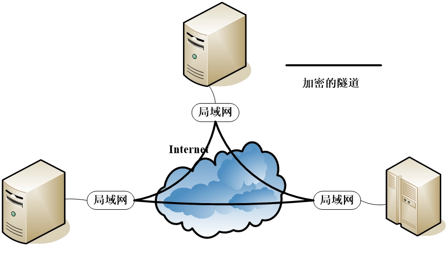
        - 保护的是**整个IP包**，应用于**网关模式中**，即在主机与网关(防火墙、路由器)或两个网关之间加载IPSec。
        - 把一个包封装在另一个新包里面，整个源数据包作为新包的载荷部分，并在前面添加一个新的IP对。被封装的数据包在隧道的两个端点之间通过公共互联网络进行路由。
        - 被封装的数据包在公共互联网络上传递时所经过的逻辑路径称为**隧道**。一旦到达网络终点，数据将被解包并转发到最终目的地。
        - 
          - 采用隧道模式时，IPSec对整个IP数据包进行加密或认证；
          - 产生一个新的IP头，IPSec头被放在新IP头和原IP数据包之间，组成一新IP头。
      - 

6. **TLS协议概述**
   - **定义**： SSL VPN也称做传输层安全协议(TLS)VPN。
   - TLS：基于会话的**加密和认证**的Internet协议，为通信的两个实体提供了一个安全的通道。
   - TLS协议主要用于HTTPS协议中，TLS也可以作为构造VPN的技术。
   - TLS VPN最大优点是用户不需要安装和配置客户端软件。
   - 由于TLS协议允许使用**数字签名和证书**，所以它可以提供强大的认证功能。
      
### 计算机病毒防护技术

1. **计算机病毒特征**
   - **传染性**：计算机病毒会通过各种渠道扩散到更多的计算机系统上。
   - **隐蔽性**：病毒通常会采用隐藏进程、文件等手段延长自己的生命周期，隐藏自己的行迹，以防被发现、被删除。
   - **寄生性**：病毒通常附着在其它正常程序之中，当调用程序时窃取到系统的控制权，先于正常程序执行。**现在这个特性正在变化**
   - **潜伏性**：大部分病毒感染系统之后不会马上发作，可长期隐藏在系统中，只有在满足其特定条件时才启动其表现（破坏）模块。
   - **破坏性**：侵入系统后会对系统及应用程序产生不同程度的影响，如降低计算机工作效率，占用系统资源，导致系统崩溃。

2. **计算机病毒传播方式**
   - 通过共享目录攻击
   - 通过漏洞攻击
   - 通过WEB方式攻击
   - 通过FIP方式攻击
   - 通过邮件攻击
   - 通过光盘读写攻击
   - 通过软盘读写攻击

3. **计算机反病毒技术与发展历史**
   - 反病毒的核心思想：在病毒的存储、传播和执行等阶段，基于“发现”、“拦截”、“清除”等基本手段来对抗病毒
   - 反病毒技术和形式经历了三个主要阶段：
     - 基于**简单特征码**查杀的单一专杀工具阶段
     - 基于**广谱特征码**查杀、主动防御拦截的综合杀毒软件阶段
     - 基于**云、人工智能和大数据**技术的互联网查杀阶段。

4. **计算机病毒分类**
   - 木马型病毒
   - 感染性病毒
   - 蠕虫型病毒
   - 后门型病毒
   - 恶意软件

5. **计算机病毒主流检测技术**
   - 病毒检测原理
     - **采样、匹配、基准**
   - 主流检测技术
     - 基于特征码的传统检测技术
       - 采样为固定位置、采用精准匹配方式技术简单、易于实现、查杀精准速度慢、无法查杀未知病毒
     - 基于行为的传统检测技术
       - 针对病毒动态行为进行检测，针对隐蔽性强的病毒有更好检测能力，具备查杀未知病毒能力
     - 基于云技术的云查杀技术
       - 将“匹配”和“基准”放在云端进行，反应速度快，终端资源使用大大减小  
     - 基于大数据与人工智能的查杀技术  
       - 将“匹配”和“基准”放在云端进行，可以根据模型匹配已知与未知病毒
        

### 安全漏洞扫描技术

1. **漏洞概述**
   - **定义**：漏洞(Vulnerability)又叫脆弱性，是信息技术、信息产品、信息系统在设计、实现、配置、**运行等过程中有意或无意产生的缺陷**，一旦被恶意主体所利用，就会造成对信息系统的安全损害，从而影响构建于信息系统之上正常服务的运行，危害信息系统及信息的安全属性。
   - **特点**：
     - 漏洞是信息系统**自身的弱点和缺陷**；
     - 漏洞**存在于一定的环境中**，寄生在一定的客体上；
     - 具有**可利用性和违规性；本身的存在虽不会造成破坏，但是可以被攻击者利用**，从而给信息系统安全带来威胁和损失

2. **漏洞扫描技术概述**
   - 漏洞扫描即针对通用漏洞的检测，需要依据通用漏洞的形成原理和其造成的外部表现来判断。由系统维护人员识别安全风险，依据结果对漏洞实施有针对性的防护或修补。
   - 漏洞按照被公布时间的不同阶段，可分为
     - 1 Day 漏洞
       - 发现并公布的最新漏洞
     - N Day 漏洞
       - 被公布的历史漏洞
     - 0 Day 漏洞
       - 未被公开的漏洞
   - 各类漏洞管理标准
     - 国外：MITRE CVE、CWE、NIST NVD、Symantec BUGTRAQ等
     - 国内：中国信息安全测评中心维护的CNNVD国家信息安全漏洞库，国家互联网应急中心CNCERT维护的CNCVE、CNVD国家信息安全漏洞共享平台等    

3. **漏洞扫描技术分类**
   1. 按照漏洞扫描的目标对象类型维度划分
     - **系统扫描**：扫描目标是已规模化发布的系统、应用软件或者设备。
       - 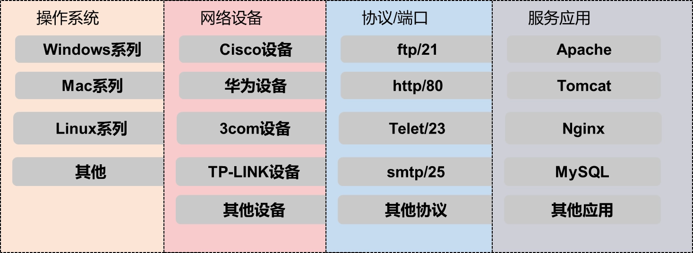
     - **应用扫描**：扫描目标是各种应用，以Web应用居多。
       - 
     - 
   2. 按照漏洞扫描的技术执行形式的维度划分
     - 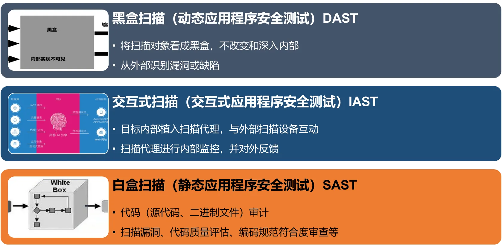

4. **漏洞扫描原理简介**
   - 漏洞扫描基本流程原理
     - 存活判断：探测目标系统是否存活。
     - 端口扫描：对已经存活的主机，探测主机上开启了哪些端口。
     - 系统和服务识别：采用黑盒测试方法，通过研究其对各种探测的响应形成识别指纹，进而识别目标主机运行的操作系统。
     - 漏洞检测：扫描器根据识别的系统与服务信息调用内置或用户外挂的口令字典进行口令猜测，并同时启动远程非登陆漏洞扫描。
   - 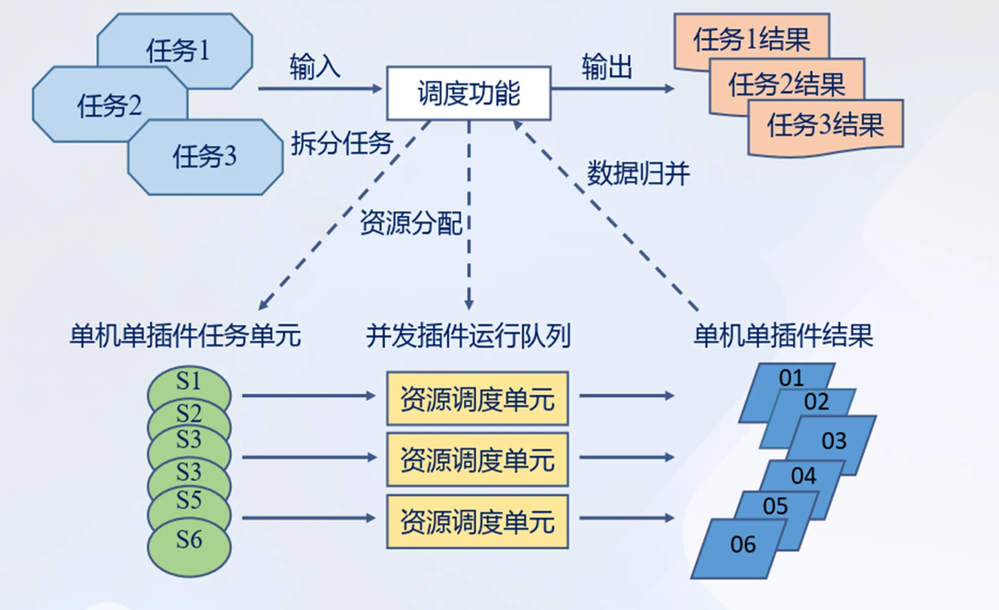
   - 原理检测和版本检测
     - 原理检测(POC检测)：对目标机的相关端口发送请求构造的特殊数据包，判断漏洞是否存在。
       - POC全称“proof of concept”，中文意思是漏洞概念验证。
       - 通常由一段漏洞验证代码或者漏洞检测数据。通过对检测目标发送此代码或数据后，通过被检测目标返回的信息特殊性，判断漏洞的实际存在与否。
     - 版本检测：依照漏洞库标准实施，在漏洞与系统版本之间存在关联关系。

## 第三节 网络安全工程与管理

### 网络安全等级保护

1. **网络安全等级保护制度**
   - 《网络安全法》第二十一条规定，国家实行网络安全等级保护制度，核心是对网络实施等级保护和分等级监督。
   - 网络分为**五个安全保护等级**，根据网络在国家安全、经济建设、社会生活中的重要程度，以及其一旦遭到破坏、丧失功能或者数据被篡改、泄露、丢失、损毁后，对国家安全、社会秩序、公共利益以及相关公民、法人和其他组织的合法权益的危害程度等因素。

2. **网络安全等级保护相关政策**
   - 信息安全等级保护是党中央国务院决定在信息系统安全领域实施的基本国策。
   - 信息安全等级保护是国家信息安全保障工作的基本制度。
   - 信息安全等级保护是国家信息安全保障工作的基本方法。
   - 

3. **安全等级划分**
   - 第一级 用户自主保护级
     - 一旦受到破坏会对相关公民、法人和其他组织的合法权益造成损害，但不危害国家安全、社会秩序和公共利益的一般网络
   - 第二级 系统审计保护级
     - 一旦受到破坏会对相关公民、法人和其他组织的合法权益造成严重损害，或者对社会秩序和公共利益造成危害，但不危害国家安全的一般网络
   - 第三级 安全标记保护级
     - 一旦受到破坏会对相关公民、法人和其他组织的合法权益造成特别严重损害，或者会对社会秩序和社会公共利益造成严重危害，或者对国家安全造成危害的重要网络
   - 第四级 结构化保护级
     - 一旦受到破坏会对社会秩序和公共利益造成特别严重危害，或者对国家安全造成严重危害的特别重要网络
   - 第五级 访问验证保护级
     - 一旦受到破坏后会对国家安全造成特别严重危害的极其重要网络

4. **安全等级设计要素**
   - 

5. **等级保护工作流程**
   - 
   - 安全定级流程
     - 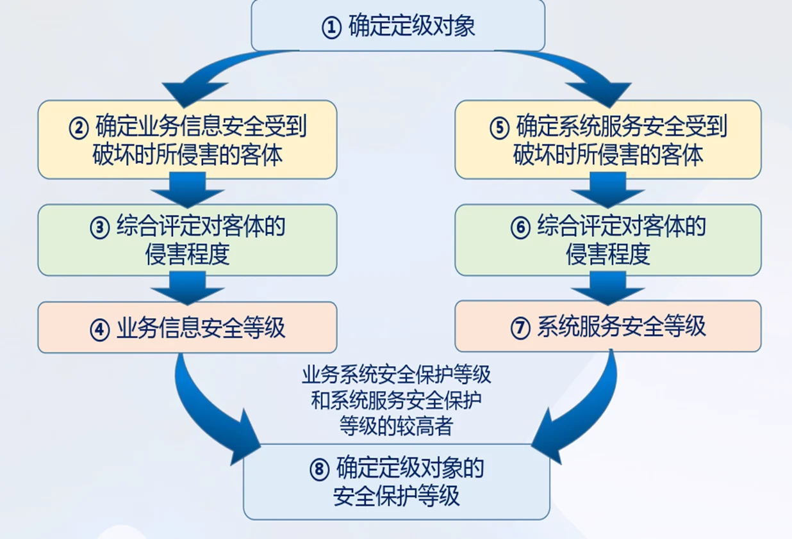
     - 业务信息安全保护等级
     - 
     - 系统服务安全保护等级
     - 

6. **等级保护2.0标准体系**
   - 

7. **等级保护安全设计技术框架**
   - 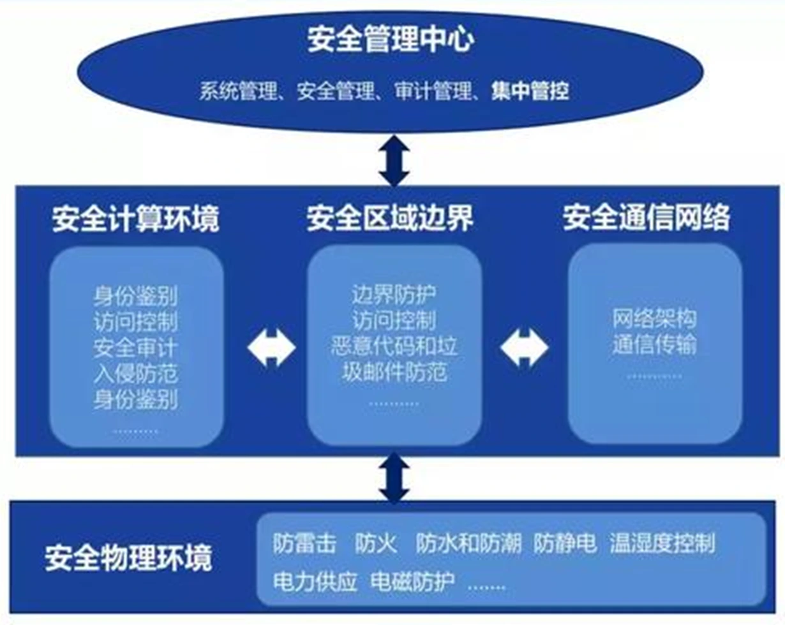

### 网络安全管理

1. **网络安全管理**
   - 定义：网络安全管理是网络安全工作中的重要概念，包括技术控制措施和管理控制措施。
   - 网络安全管理是指**把分散的网络安全技术因素和人的因素，通过策略、规则协调整合为一体，服务于网络安全的目标。**
   - 任务和目标：信息安全管理是以管理对象的安全为任务和目标的管理。
     - 任务：保证管理对象的安全。
     - 目标：达到管理对象所需的安全级别，将风险控制在可以接受的程度。
   
2. **网络安全管理体系（ISMS）**
   - **定义**：
     - 信息安全管理体系（Information Security Management Systems, 简称ISMS）是组织整体管理体系的一个部分，是基于风险评估建立、实施、运行、监视、评审、保持和持续改进信息安全等一系列的管理活动。
        1. 基于**风险管理思想**，建立一个系统化、程序化和文件化的管理体系。
        2. 强调全过程和动态控制。
        3. **控制费用与风险平衡的原则**，保护关键信息资产，使得网络安全风险的发生概率和结果降低到可接受的水平。
   
   - 国外网络安全管理相关标准
     - 目前，ISO/IEC 2700X标准系列是国际主流，国家标准化组织（ISO）专门为ISMS预留了一批标准序号。该系列的**两个核心、基础标准ISO/IEC 27001和ISO/IEC 27002**已于2005年10月正式发布第一版，2013年10月正式发布第二版。
   - 我国网络安全管理相关标准
     - 我国早期主要采用与国际标准靠拢的方式，近年来加强网络安全管理标准的自主制定，已经开始向国际标准化组织提交国际标准提案。在全国信息安全标准化技术委员会内，第7工作组(WG7)的努力下，我国已经正式发布一系列网络安全管理标准。
   - 网络安全管理控制措施
     - 为了对组织所面临的的安全风险实施有效的控制，应针对具体地安全威胁和脆弱性，采取适当的控制措施。ISO/IEC 27002标准提出了**14个方面的管理控制措施**，包括网络安全策略、网络安全组织、人力资源安全、资产管理、访问控制、密码、物理和环境安全、运行安全、通信安全、系统获取、开发和维护、供应商关系、网络安全事件管理、业务连续性管理和网络安全方面、符合性
   - ISO 27000系列
     - 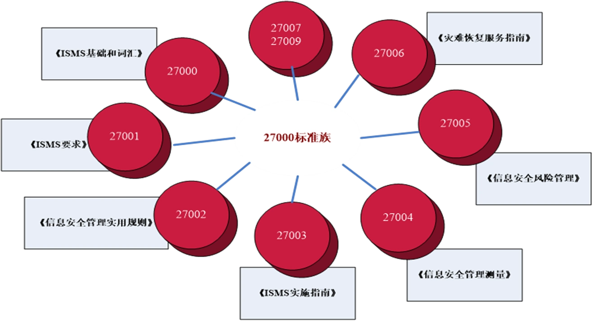

3. **网络安全风险管理**
   - 定义：一种**在风险评估的基础上对风险进行处理的工程**。网络安全风险管理实质是基于风险的网络安全管理。
   - 信息安全风险评估
   - 信息系统安全评估

4. **风险评估**：
    - 定义：对信息资产面临的威胁、存在的弱点、造成的影响，以及三者综合作用而带来的风险的可能性的评估。**信息安全风险评估是建立信息安全保障机制中的一种科学方法。**
    - 信息安全风险：
        - 人为或自然的威胁利用系统存在的脆弱性引发的安全事件，并由于受损信息资产的重要性而对机构造成的影响。
    - 信息安全风险评估涉及4个主要因素：
        - **资产、威胁、脆弱性和风险**
    - 基本过程：
        - 风险评估准备过程
        - 资产识别过程、威胁识别过程、脆弱性识别过程
        - 风险分析过程
    - 主要任务：
        - 识别组织面临的各种风险 
        - 评估风险概率和可能带来的负面影响 
        - 确定组织承受风险的能力 
        - 确定风险消减和控制的优先等级 
        - 推荐风险消减对策
    - 关键问题：
        - 首先要确定保护的对象（或者资产）是什么？它的直接和间接价值如何？
        - 其次，资产面临哪些潜在威胁？导致威胁的问题所在？威胁发生的可能性有多大？ 
        - 资产中存在哪里弱点可能会被威胁所利用？利用的容易程度又如何？
        - 一旦威胁事件发生，组织会遭受怎样的损失或者面临怎样的负面影响？
        - 最后，组织应该采取怎样的安全措施才能将风险带来的损失降低到最低程度？ 
    
  
5. **信息系统安全评估**：
  - 或称为或简称为系统评估，是在具体的操作环境与任务下对一个系统的安全保护能力进行的评估。具体是指依据国家风险评估有关管理要求和技术标准，对信息系统及由其存储、处理和传输的信息的机密性、完整性和可用性等安全属性进行科学、公正的综合评价的过程。

6. **资产的有效保护**
   - 资产一旦受到威胁和破坏带来两类损失：
     - **即时的损失**，如由于系统被破坏，员工无法使用，因而降低了劳动生产率。
     - **长期的恢复所需花费**，也就是从攻击或失效到恢复正常需要的花费。
   - 为了有效保护资产，应尽可能**降低资产受危害的潜在代价**。由于采取一些安全措施，也要付出安全的操作代价。网络安全最终是一个**折中的方案**，需要对危害和降低危害的代价进行权衡。
   - 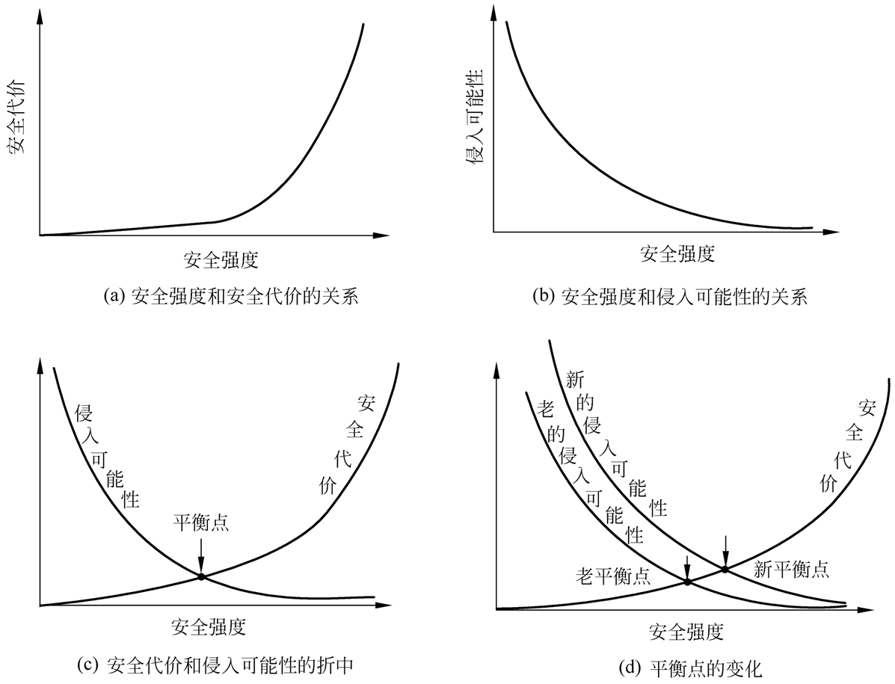

7. **风险管理实施流程**
   - 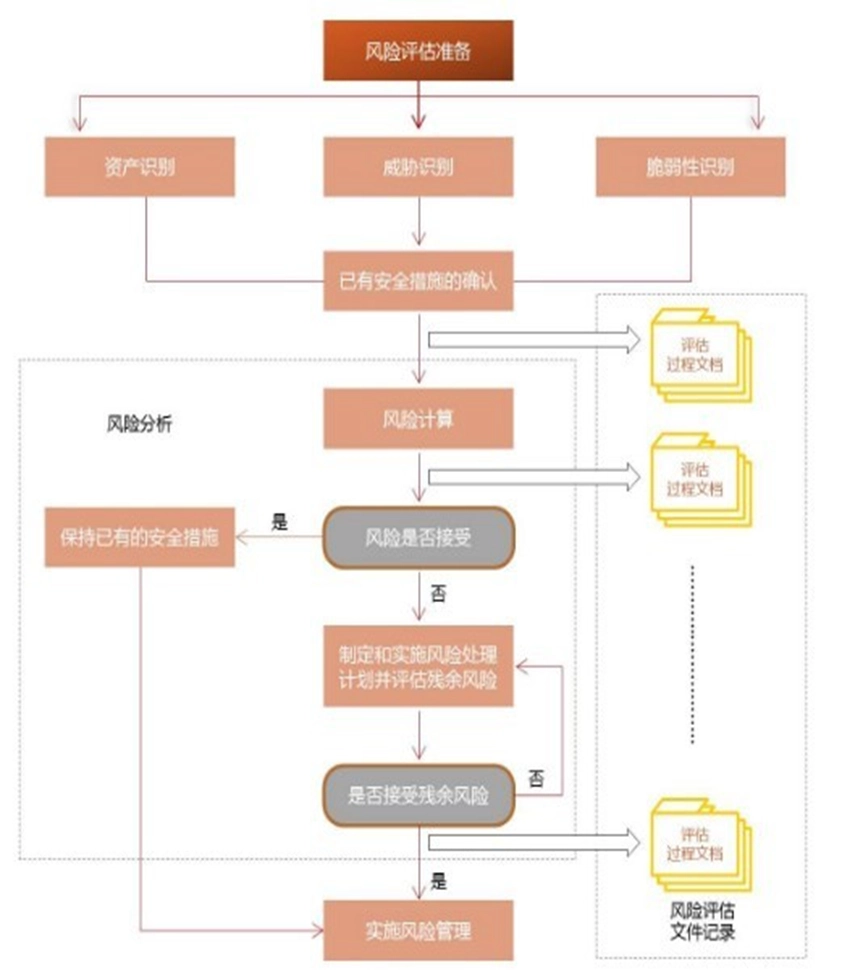
   - 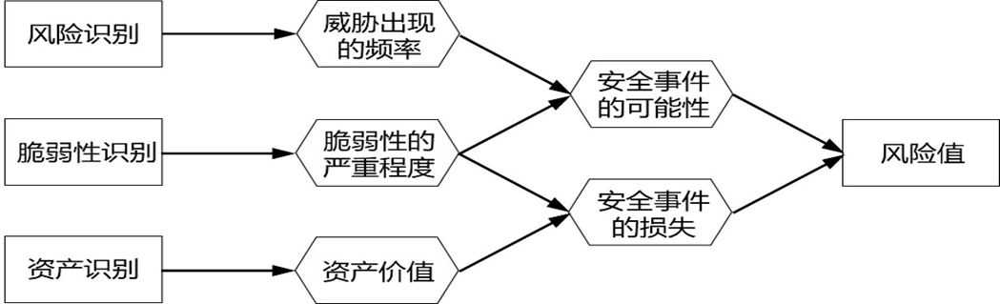
   - 风险管理的核心部分：**风险分析**
     - 资产属性：资产价值
     - 威胁属性：威胁主体、影响对象、出现频率、动机
     - 脆弱性属性：资产弱点的严重程度
   - 风险识别：
     - 漏洞
     - 威胁
     - 已有的对策和预防措施
   
8. **风险分析**
   - 定性分析法
     - 定性分析法主要是根据操作者的经验知识、业界的一些标准和惯例等非量化方式对风险状况作出判断的过程
     - 定性分析法**操作起来相对简单**，为风险管理诸要素（资产价值、威胁出现的概率、弱点被利用的容易度、现有控制措施的效力等）的**大小或高低程度定性分级**
     - 该方法具有**很强的主观性**，同时也会因为操作者的经验和直觉偏差导致分析结果发生偏差，从而出现多次评估结果不一致的情况。
   - 定量分析法
     - 是对构成风险的各个要素和潜在损失的水平赋予数值，当度量风险的所有要素（**资产价值、威胁频率、弱点利用程度、安全措施的效率和成本等**）都被赋值，风险评估的整个过程和结果就都可以被量化了。
     - 定量分析就是试图从**数字上**对安全风险进行分析评估的一种方法，优点是评估结果**用直观的数据来表示**，看起来一目了然。
     - 缺点是存在为了量化而把复杂事物简单化的问题，甚至有些风险要素因量化而被曲解
   
9. **风险控制**
   - 风险控制措施
     - **风险降低**：实施安全措施，把风险降低到一个可接受的级别
     - **风险承受**：接受潜在的风险并继续运行网络和信息系统
     - **风险规避**：通过消除风险的原因或后果，来规避风险，即不介入风险
     - **风险转移**：通过使用其他措施来补偿损失，从而转移风险，如买保险

### 网络安全事件处置与恢复

1. **网络安全事件分类与分级**
   - 网络安全事件**分类**：
     - 有害程序事件
     - 网络攻击事件
     - 信息破坏事件
     - 信息内容安全事件
     - 设备设施故障
     - 灾难性事件
     - 其他网络安全事件
   - 网络安全事件**分级**：
     - 特别重大事件（I级）
     - 重大事件（II级）
     - 较大事件（III级）
     - 一般事件（IV级）
   - 网络安全事件分级主要考虑三个要素：
     - **信息系统的重要程度**
       - 主要考虑信息系统所承载的业务对国家安全、经济建设、社会生活的重要性以及业务对信息系统的依赖程度划分为特别重要信息系统、重要信息系统和一般信息系统。
     - **系统损失**
       - 由于信息安全事件对信息系统的软硬件、功能以及数据的破坏，导致系统业务中断，从而给事发组织所造成的损失，其大小主要考虑恢复系统正常运行和消除安全事件负面影响所需付出的代价，划分为特别严重的系统损失、严重的系统损失、较大的系统损失和较小的系统损失
     - **社会影响**

2. **网络安全应急处理过程**
   - 准备阶段：主要工作包括建立合理的防御/控制措施、建立适当的策略和程序、获得必要的资源和组建相应队伍等。
   - 检测阶段：目标是对网络安全事件做出初步的动作与响应，根据获得的初步材料和分析结果，预估事件的范围和影响程度，制定进一步的影响策略，并保留相关证据
   - 抑制阶段：目标是限制攻击的范围，抑制潜在的或进一步的攻击和破坏。主要工作包括阻止入侵者访问被攻陷系统；限制入侵的程度；防止入侵者进一步破坏等。
   - 根除阶段：目标是在事件被抑制之后，通过分析有关恶意代码或行为找出事件发生的根源，并予以彻底根除。
   - 恢复阶段：目标是将网络安全事件所涉及的系统还原到正常状态。
   - 总结阶段：目标是回顾网络安全事件处理的全过程，整理相关信息，尽可能把所有情况记录到文档中。
  
3. **网络安全应急响应相关概念**
   - **网络安全事件**：引起网络系统的安全受到威胁和破坏的任何事件。
     - 威胁包括：丢失数据机密性，破坏数据和系统的完整性，破坏系统的可用性使之不能提供服务等等
   - **网络安全应急响应能力**：网络系统的整体的应急事件的处理能力，包括针对于安全事件的技术响应手段，流程管理，人员组织等多个方面。
   - **计算机安全应急响应团队（CSIRT）**：负责日常情况下安全保障和紧急情况下应急响应任务的组织。
   - **事件响应和安全团队论坛（FIRST）**：把政府，商业机构，和学术组织的安全应急响应团队联合起来，组成一个有机的整体。
 
4. **国内安全应急响应组织**
   - CCERT（1999年5月），中国教育科研网紧急响应组
   - NJCERT（1999年10月），中国教育网华东（北）地区网络-安全事件响应组
   - 2000年8月，国家计算机病毒应急处理中心
   - 中国电信ChinaNet安全小组
   - 解放军，公安部
   - 商业网络安全服务公司
   - 中国计算机应急响应处理协调中心CNCERT/CC
      
5. **信息系统灾难恢复**
   - 定义：将信息系统从灾难造成的故障或瘫痪状态恢复到可正常运行的状态，并将其支持的业务功能从灾难造成的不正常状态恢复到可接受状态的活动和流程。
   - 内容：
     - 灾难恢复规划和灾难备份中心的日常运行
     - 关键业务功能在灾难备份中心的恢复和重续运行
     - 主系统的灾后重建和回退工作
     - 突发事件发生后的应急响应
   - 关键过程：
     - 
   - **灾难恢复能力6个级别**
     1. 基本支持
     2. 备用场地支持
     3. 电子传输和部分设备支持
     4. 电子传输及完整设备支持
     5. 实时数据传输及完整设备支持
     6. 数据零丢失和远程集群支持

### 新兴网络及安全技术

1. **工业互联网**
    - 概念：本质是通过开放式的全球化工业级网络平台，紧密融合物理设备、生产线、工厂、运营商、产品和客户，通过自动化和智能化的生产方式降低成本、提高效率。
    - 安全挑战：工业互联网含有大量CPS（Cyber-Physical Systems 信息物理系统）设备，改进后的蠕虫、病毒和木马等传统攻击方式会严重威胁工业互联网安全，而且由于工业互联网集成多类不同系统，所以**存在多种攻击发起点**，攻击者可以从**物理层、网络层和控制层**分别发起攻击。因此，工业互联网遭受攻击会严重影响国家安全。
    - **工业互联网主要安全防护技术**
        - 安全人员培训
        - 安全需求制定和实施计划
        - 安全硬件和软件设计
        - 安全方案部署
        - 信息反馈测试和升级

2. **移动互联网安全防护**
   - 概念：利用互联网的技术、平台、应用以及商业模式与移动通信技术相结合并实践的活动统称。
   - 组成部分：移动互联网终端设备、移动互联网通信网络、移动互联网应用和移动互联网相关技术。
     - 
   - 安全架构：移动互联网终端安全、移动互联网网络安全和移动互联网应用安全。
     - 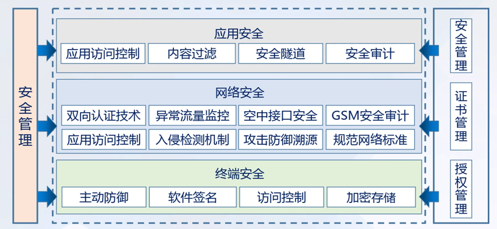
   - 安全挑战：十分严格地强调对用户隐私和用户行为的保护
     - 移动互联网涉及大量的用户个人信息（如位置信息、通信信息、日志信息、账户信息、支付信息、设备信息、文件信息等），给移动互联网安全监管和用户隐私保护带来极大的挑战
     - 当前，移动通信终端智能化程度日益提高，处理的信息更加多样化。因此，终端成为攻击者的重要目标之一，**恶意攻击行为逐步向强制推广、风险传播、越权收集等行为转变**。终端被攻击，容易造成用户经济损失、信息泄漏、业务滥用等问题。

3. **物联网**
   - 定义：依托射频识别RFID技术和设备，按约定的通信协议与互联网相结合，使物品信息实现智能化识别和管理，实现物品信息互联而形成的网络
   - 概念：物联网是指通过信息传感设备，按照约定的协议，把任何物品与互联网连接起来，进行信息交换和通讯，以实现智能化识别、定位、跟踪、监控和管理的一种网络。它是在互联网基础上延伸和扩展的网络。
   - 组成架构
     - 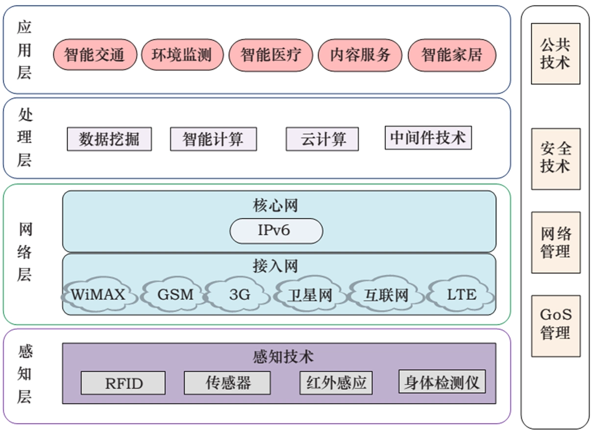
   - 安全挑战：
     - 
     - 感知层：感知层节点：网关节点、普通法节点等容易被恶意控制、捕获，容易受到外部DOS攻击；接入物联网的超大量传感节点的标识、认证易被劫持。
     - 网络层：异构的物联网应用协议无法被安全设备识别，被篡改和入侵后无法及时发现DOS攻击、假冒攻击、中间人攻击、跨异构网络攻击等
     - 管理服务层：存在高智能自动化处理系统带来不确定性，人为的干预导致服务不可用，设备丢失来自于超大量终端的海量数据的识别和处理
     - 应用层：许多应用层平台本身存在漏洞易导致未授权的访问、数据破坏和泄露、用户隐私保护；取证和销毁数据、保护知识产权
   - 安全防护技术
     - 安全和隐私保护方面，物联网应用的仍然是互联网或通信网中常规的安全防护技术。
     - 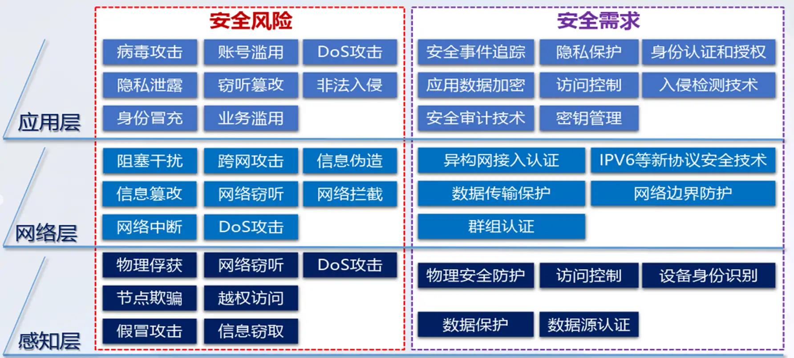

# 第四章 系统安全基础

## 系统安全思维
1. **系统安全指导思想**
	- **系统安全定义**：
		- 是指在**系统生命周期内**应用**系统安全工程**和**系统安全管理**方法，辨识系统中的隐患，并采取有效的控制措施使其危险性最小，从而使系统在**规定的性能、时间和成本范围内**达到**最佳**的安全程度。
	- 网络空间系统安全：
		- 以系统思维应对安全问题；
		- 应对系统所面临的安全问题，以整体的观点看待系统。
	- 指导思想：在系统思维的指引下，从**系统建设、使用和全生命周期**应对系统所面临的安全问题，正视系统的**体系结构**对系统安全的影响，以**生态系统的视野**全面审视安全对策。

2. **系统安全的演进**
	- 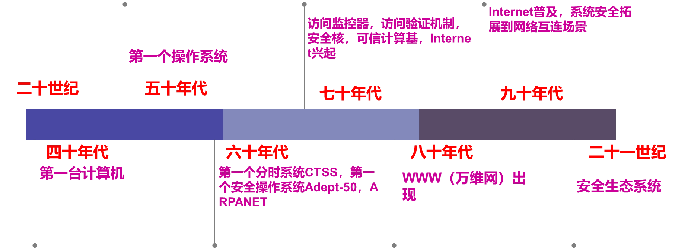

3. **系统与系统安全**
	- **系统定义**：
		- 一个系统（System）是由**相互作用**或**相互依赖**的**元素或成份**构成的某种类型的一个**统一整体**，其中的元素完整地关联在一起。
		- 位于系统边界内部的元素属于系统的**组成元素**
		- 位于系统边界外部的元素属于系统的**环境**
	- 观察系统的方法
		- 自外观察法：观察者位于系统之外对系统进行观察，通常是通过观察系统的输入和输出来分析系统的行为
		- 自内观察法，观察者位于系统之内对系统进行观察，此时，观察者属于系统的一个组成部分，通常是通过观察系统的外部环境来分析系统的行为
	- 在**网络空间中观察系统的环境**：系统在风险的包围之中，必须具有一定的安全性，才能正常运转。
	- **系统的安全性需要以系统化的视野去观察**

4. **整体论与还原论**
	- **还原论**：把大系统分解为小系统，然后通过对小系统的研究去推知大系统的行为。
		- 把系统分解成它的组成部分，通过对系统的组成部分的研究去了解原有系统的情况。
		- **局限性**：某些宏观性质是无法通过其微观组成部分的性质反映出来
	- **整体论**：把一个系统看成一个完整的统一体，一个完整的被观察单位，而不是简单的微观组成元素的集合。
		- 整体特性：
			- 综合特性：可以分解为系统组成部分的特性
			- 涌现性：不可还原（即不可分解）为系统组成部分的特性
				- **安全性属于涌现性**
		- 操作系统的分解：进程管理、内存管理、外设管理、文件管理、处理器管理。   

5. **核心理念及概念**
	- 网络空间系统安全知识领域的核心理念：
		- 保护对象
		- 思维方法（系统化思维方法）
			- **系统化思维方法运用到网络空间安全之中称为系统安全思维**

6. **系统工程及安全工程**
	- **系统工程**(Systems Engineering)：
		- 定义：涵盖系统生命周期的具有关联**活动和任务**的技术性和非技术性过程的**集合**。
		- 技术性过程应用工程分析与设计原则去建设系统
		- 非技术性过程通过工程管理去保障系统建设工程项目的顺利实现
		- 目标：获得总体上可信赖的系统，核心是系统整体思想
		
	- **系统安全工程**(Systems Security Engineering)：
		- 定义：把安全性相关活动和任务融合到系统工程的过程之中，形成的一个系统工程专业分支。
		- 力求从系统生命周期的全过程去保障系统的安全性
		- 系统的安全性值得信赖等价于系统具有可信的安全性
		

## 系统安全原理
1. **基本原则**
	- 在系统的设计与实现中应遵守的原则包括**限制性原则、简单性原则、方法性原则**
	- 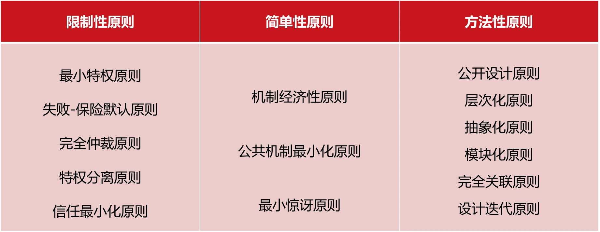

2. **威胁建模**
	- 威胁建模(Threat Modeling)：
		- **定义**：标识潜在安全威胁并审视风险缓解途径的过程。
		- 威胁(Threat)：给某物造成伤害或损失的意图
		- 风险(Risk)：某物遭受伤害或损失的可能性
		- 安全(Security)：某物能避免或抵御他物带来的潜在伤害或损失

3. **威胁建模方法**
	- 威胁建模目标：
		- **为防御者提供系统地分析应采取的控制或防御措施的机会**
	- 基本类型：
		- 以风险为中心
		- 以资产为中心
		- 以攻击者为中心
		- 以软件为中心
	- 典型方法：
		- STRIDE
			- 身份欺骗、数据篡改、抵赖、信息泄露、拒绝服务、特权提升的缩写
			- 具体步骤：
				1. 建立数据流图
				2. 标识系统实体、事件和边界
				3. 发现风险
		- PASTA
		- Trike
		- VAST等

## 系统安全控制及管理
1. **安全控制**
	- **访问行为的形式化表示 (s, o, p)**
		- s：主体
		- o：客体
		- p：操作
		- 典型操作：read、copy、modify、execute
	- **授权的矩阵表示**
		- 矩阵$M$ 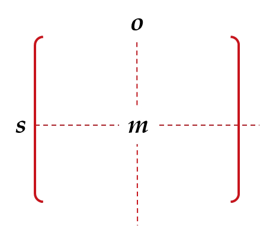
		- s：主体
		- o：客体
		- m：操作权限的集合，例如`m = {read, write}`
	- **微调的授权的矩阵表示**
		- 矩阵$M^{R}$ 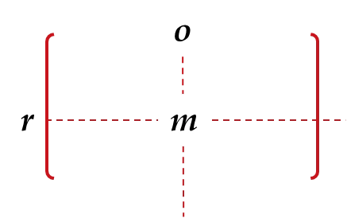
		- r：角色
		- o：客体
		- m：操作权限的集合

2. **访问控制策略**
	- 访问控制策略1
		- 构造访问控制矩阵 M ，给矩阵 M 中的元素赋值，对于任意 (s, o, p) 访问请求，在 M 中找到 s 和 o 交叉位置上的元素 m，当 p∈m 时，允许 (s, o, p) 执行，否则，禁止 (s, o, p) 执行
	- 访问控制策略2
		- 构造访问控制矩阵 $M^{R}$ ，设计角色分配方案 $f_{R}$ ，给矩阵 $M^{R}$ 中的元素赋值，按方案 $f_{R}$ 给每个用户分配角色，对于任意 (u, o, p) 访问请求，u 表示用户，确定角色 $r = f_{R}(u)$ ，在 $M^{R}$ 中找到 r 和 o 交叉位置上的元素 m，当 p∈m 时，允许 (u, o, p) 执行，否则，禁止 (u, o, p) 执行
	- 访问控制策略3
		- 制定主体等级分配方案 $f_{S}$ 和客体密级分配方案 $f_{O}$，设计主体等级与客体密级的对比方法cmp，设定任意操作 x 应该满足的条件 con(x)，给每个主体分配涉密等级，给每个客体分配保密级别，对于任意 (s, o, p) 访问请求，当 $cmp(f_{S}(s), f_{O}(o))$ 满足条件 con(p) 时，允许(s, o, p) 执行，否则，禁止 (s, o, p) 执行
	
3. **安全控制-强制访问控制MAC模型**
	- Bell-Lapadula安全模型
		- 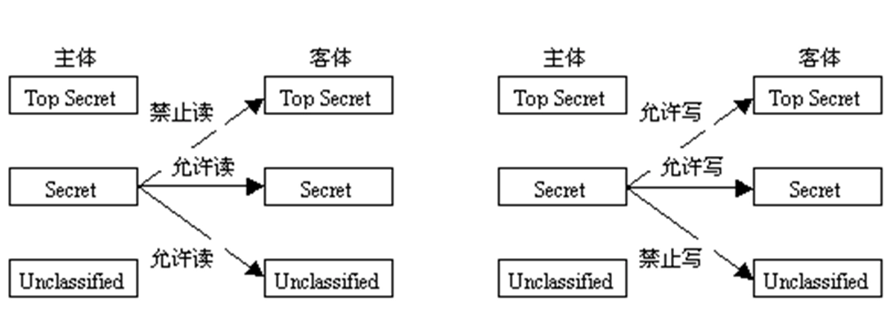
	- Biba安全模型
		- 

4. **安全监测**
	- 系统完整性检查：从开机引导到应用运行，各个环节都进行检查，帮助发现系统中是否有重要组成部分受到篡改或破坏。
	- 病毒查杀和恶意软件检测：对系统中的各种文件进行扫描，帮助发现或清除进入到系统之中的大多数病毒或恶意软件。
	- 入侵检测：对恶意行为或违反安全策略的现象进行监测，一旦发现情况就及时报告，必要时发出告警。

5. **安全管理**
	- 安全管理(Security Management)：
		- 定义：在安全策略的指导下进行的一系列管理活动。把一个组织的资产标识出来，并制定、说明和实施保护这些资产的策略和流程。
		- 资产：系统、信息、机器、建筑物、人员
		- 安全管理策略
			- 管理的任务、目标、对象、原则、程序和方法。
		- 安全管理活动
			- 制定计划、建立机构、落实措施、开展培训、检查效果和实施改进等。
		
	- 把风险管理原则应用到安全威胁管理之中
		- 标识威胁
		- 评估现有威胁控制措施的有效性
		- 确定风险的后果
		- 基于可能性和影响的评级排定风险优先级
		- 划分风险类型并选择合适的风险策略或风险响应
		- 它聚焦系统的日常管理，讨论如何把安全理念贯穿到系统安全管理工作的全过程中，帮助系统管理人员明确和落实系统管理工作中的安全责任以便从系统管理的角度提升系统的安全性。
	
## 系统安全结构

1. **硬件系统安全**
	- 硬件安全关注于给软件提供什么样的安全支持，如何帮助软件实现想要的安全功能，以及硬件自身存在的安全隐患对系统安全的影响。
	- 处理器硬件从可用指令集和可用内存区域两个方面出发，定义了处理器工作的两种状态：
		- 内核态：操作系统用，看到所有的指令和地址空间
		- 用户态：其他程序用，看到其中部分的指令和地址空间
		- 用户态程序不能干扰内核态的程序。
	- **硬件安全涉及**：硬件设计、访问控制、安全多方计算、安全密钥存储、密钥真实性保障等方面。

2. **检查程序是否被篡改的基本方法**
	- 检查程序是否被篡改
		- 通过计算程序的摘要并与原始摘要对比来检查程序是否被篡改
	- 硬件防篡改方法：
		1. 提供密码计算功能
			- 通用处理器提供密码运算指令
			- 独立的安全密码处理器（密码加速器）
				- **硬件安全模块**（HSM）：用安全密码处理器芯片实现的硬件计算设备（密码处理+密钥管理和保护）
		2. 提供数字指纹（确定机器的身份）
			- 使用物理不可克隆函数（PUF）硬件器件实现

3. **操作系统安全**
	- **操作系统安全是系统安全的基础**：
		- 各种应用软件均建立在操作系统提供的系统软件平台之上，上层的应用软件要想获得运行的高可靠性和信息的完整性、保密性，必须依赖于操作系统提供的系统软件基础
	- 操作系统的安全可信性分为不同的级别
		- 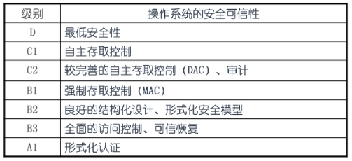
	- 操作系统建立**可信交互路径**，实现应用系统和加密功能的有效衔接
		- 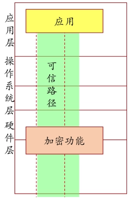
	- 操作系统安全功能：
		- 用户管理与身份认证
		- 自主访问控制
			- 文件的拥有者可以自主确定任何用户对该文件的访问权限
			- 访问权限既可以授给用户，也可以授给用户组
		- 日志功能
			- 记录系统中发生的重要活动的详细信息
		- 强制访问控制
			- 实现多级安全策略（MLS）等。

4. **数据库安全**
	- 数据库安全控制模型
		- 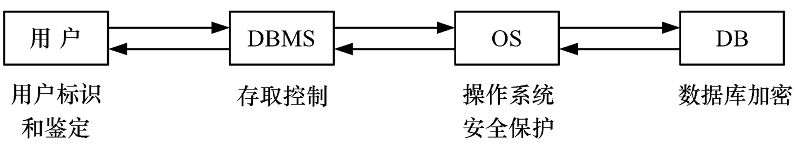
	- **数据库系统**：
		- 定义：提供通用数据管理功能的软件系统
		- 构成：
			- 有数据库管理系统(DBMS)：为用户及应用程序提供数据访问，并具有对数据库进行管理、维护等多种功能
			- 数据库应用：按一定的方式存取数据	
	- **存取控制**：
		- 防止非授权的数据库存取
		- 防止非授权的对模式对象的存取
		- 控制磁盘使用
		- 控制系统资源使用
		- 审计用户动作
	- **数据库系统安全**：
		- 系统运行安全（法律政策安全；物理控制安全；硬件运行安全；操作系统安全；灾害故障恢复；死锁的避免与解除；电磁信息泄露的防止）
		- 信息安全（用户口令鉴别；用户存取权限控制；数据存取权限和方式控制；审计跟踪；数据加密）
	- **数据库系统的主要威胁**：
		- 非法访问数据库信息；
		- 恶意破坏数据库或未经授权非法修改数据库；
		- 用户网络访问数据库时受到各种攻击，如搭线窃听等；
		- 对数据库不正确的访问导致数据库数据的错误等
	- **数据库系统的安全需求**：
		- 完整性、可靠性、有效性、保密性、可审计性及可存取控制与用户身份鉴别等。
	- 在一般的计算机系统中，安全措施是一级一级层层设置的

5. **数据库访问控制**
	- 自主访问控制
		- 访问授权
		- 撤销授权
	- 数据推理
		- 根据**合法的非敏感数据**推导出**非法的敏感数据**
	- 对数据库数据进行非法间接访问
	- 推理威胁源自统计数据库：利用合法的统计数据推导出不合法的敏感数据
	- 强制访问控制/多级安全数据库
		- 根据数据的敏感程度，确定数据的敏感级别
	- 根据用户在工作中应该涉及的数据的敏感程度，为用户分配敏感等级
	- 可以基于表、字段或记录建立敏感级别

6. **数据库SQL注入攻击**
	- SQL注入攻击是攻击者把SQL命令插入到Web表单的输入域或页面请求的查询字符串，欺骗服务器执行恶意的SQL命令。
		- 详细:SQL注入攻击是指Web应用程序对用户输入数据的合法性没有判断，攻击者可以在web应用程序中事先定义好的查询语句结尾添加额外的SQL语句，以此来实现欺骗数据库服务器执行非授权的任意查询，从而进一步得到相应的数据信息。
	- SQL注入一般存在于形如：http://xxx.xxx.xxx/abc.aspx?id=XX 等带有参数的asp/aspx/php/jsp等动态网页中。
	- **应对SQL注入攻击的办法**
	- 在应用系统的代码中添加对用户的输入进行严格检查的功能，禁止在输入中滥用转义字符

7. **基于Web的应用安全——论坛**
	- 例如，论坛中的跨站脚本（XSS）攻击，用户在评论中嵌入脚本，导致其他用户的敏感信息被传输到攻击者指定的服务器中。
	- 脚本
		- 定义：运行在网页服务器上的，使用一种特定的描述性语言，依据一定的格式编写的纯文本保存的程序，
		- 例如：ASP、PHP、CGI、JSP等
		- 一般都是要结合数据库如ACCESS、MSSQL、MYSQL、Oracle等来使用
	- 跨站脚本攻击(XSS):
		- 在脚本中加入一些破坏计算机系统的命令，这样当用户浏览网页时，一旦调用这类脚本，便会使用户的系统受到攻击。
	- 安全风险
		- 攻击者可以劫持用户会话
		- 插入恶意内容
		- 重定向用户
		- 使用恶意软件劫持用户浏览器
		- 繁殖XSS蠕虫
		- 甚至破坏网站、修改路由器配置信息等

8. **cookie攻击**
	- **Cookie**
		- 浏览器与服务器交互时，由Web服务器建立、发送，由(Web客户端)浏览器保存的一些**赋值信息**，在后续交互时，浏览器会把这些信息返还给服务器，使服务器了解浏览器的过往行为
		- 简单的文本文件，约由255个字符组成，占4KB空间
		- 有些WEB服务能够收集有关用户的特定状态信息，用来在以后的会话中使用
		- Cookie 会帮把在该网站上所输入的文字信息或是一些选择和操作都纪录下来，并将**信息保存在用户的硬盘上**，这些信息将保存在用户的浏览器中，当**下一次用户连接到这个服务器时，浏览器就可以将合适的状态发送给服务器使用**，服务器依据 Cookie 里的内容来判断使用者，送出特定的网页内容，提高了浏览网页的效率
	- **安全性问题**在于它可能泄露用户的信息，欺骗（攻击者通过修改存放在客户端的cookie来达到欺骗服务器认证目的）等问题。
		- Cookie包含的信息包括用户的IP地址、用户密码个人资料等重要信息，服务器对其检索不是在服务器上进行，而是在用户的硬盘上进行 

## 安全生态系统
1. **生态学系统/生态系统**
	- 物质循环和能量流动的相互影响以及来自亚系统的反馈共同构成一个自我调整的动态平衡
	- 生态系统是个控制论系统，包括生态系统中的信息网络、物理和化学信息连接起来的组分等。

2. **数字生态系统**
	- 数字生态系统是一个分布式的、适应性的、开放的**社会-技术系统**，受自然生态系统启发，具有自组织性、可伸缩性、和可持续性。数字生态系统模型受到了自然生态系统知识的启示，尤其是在形形色色的实体之间的竞争与合作的相关方面。
	
3. **网络空间生态系统**
	- 像自然生态系统一样，由形形色色的、出于多种目的进行**交互**的各种**成员**构成，主要成员包括私营企业、非营利组织、政府、个人、过程和网络空间设备等，主要设备包括计算机、软件、通信技术等

4. 生态系统视角下的安全威胁模型
	- 问题应对
		- 理念方面：把系统的概念拓展到生态系统的范围，重新认识安全威胁，重新构建安全模型；
	- 技术方面：要有新的支撑技术
	- 模型建立
		- 不但要考虑企业自身的安全因素；
	- 还必须考虑合作伙伴的安全因素。
	- 关键支撑技术
		- 自动化 Automation：让响应速度跟上攻击速度，而不是以人力的响应速度应对机器的攻击速度；
	- 互操作性 Interoperability：由策略而不是技术约束定义网络空间共同体，允许网络空间生态系统成员在自动化的团体防御中无缝地、动态地协作；
	- 认证 Authentication：为在线决策建立基础，由人员认证扩展到包含设备认证，设备可以是计算机、软件、或信息等。
	
# 第五章 内容安全基础

## 信息内容安全威胁
1. **信息内容安全概述**
    - **定义**：信息内容安全(Content-based Information Security)是研究利用计算机从**海量信息且变化迅速**的网络中**自动获取、识别和分析特定安全主题相关信息**的技术，借助人工智能与大数据技术管理网络信息传播，是网络安全系统的核心理论与关键组成部分，对提高网络使用效率、净化网络空间、保障社会稳定意义重大。
    - **信息内容安全分类**
        - 政治信息安全
        - 军事信息安全
        - 商业信息安全
    - 领域、内涵及关键技术
        - 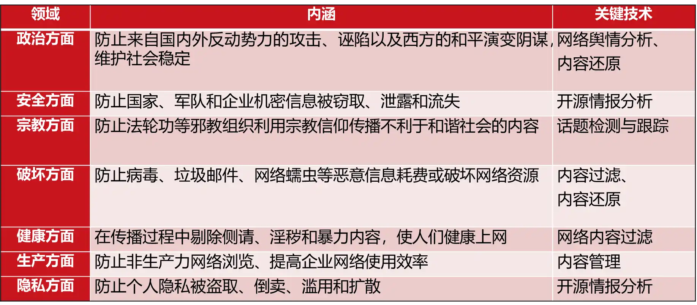

2. **网络信息内容安全的重要性**
    - 提高网络用户及网站的使用效率。
    - 净化网络空间，营造健康文明的网络文化环境。
    - 提高国家信息安全保障水平，是保障国家安全的重要环节。

3. **信息内容安全威胁**
    - 内容安全面临**泄露（非授权访问）、欺骗、破坏和篡夺**等威胁。
        - 
    - 恶意用户产生传播的**恶意内容**也是网络空间面临的潜在安全威胁。
  
4. **经典的信息内容安全挑战**
    - **内容获取**
        - 动态网络社区信息的深入提取。
        - 跨网络媒体内容的高性能提取。
        - 混合网络身份内容获取。
    - **内容分析**
        - 多源网络媒体信息的数据清洗。
        - 海量非结构化信息的数据仓储与数据挖掘。
        - 多媒体群体理解技术有待发展。
    - **内容网络**
        - 内容中心网络命名攻击。
        - 内容中心网络缓存污染。
        - 内容中心网络路由攻击。

5. **典型的互联网恶意用户行为攻击**
    - **Spam用户**：向合法用户发布广告、色情、钓鱼等恶意信息，在开放式在下社交网络上将恶意内容快速而大规模传播。
    - **Sybil攻击（女巫攻击）**：攻击者利用单个节点来伪造多个身份存在于P2P网络中，从而达到削弱网络的冗余性，降低网络健壮性，监视或干扰网络正常活动等目的。攻击者可以通过只部署一个实体，向网络中广播多个身份ID，来充当多个不同的节点（Sybil节点）。Sybil节点为攻击者争取了更多的网络控制权，一旦用户查询资源的路径经过这些Sybil节点，攻击者可以干扰查询、返回错误结果，甚至拒绝回复。
    - **水军用户**：通过评论或转发参与热点话题，用大量有情感倾向的评论影响舆情态势，如网络推手、打手、刷粉等行为。

6. **以内容为中心的未来互联网**
    - **目标与意义**
        - 以内容为中心的未来互联网旨在**将内容名称而不是IP地址**作为传输内容的标识符，从而实现信息的路由。
    - 内容中心网络意义
        - 实施更多优化表示来增强网络性能
        - 提高未来互联网的智能水平
    - 内容中心攻击分类
        - **命名**：攻击者可审查和过滤内容。
        - **路由**：恶意攻击者能发布/订阅无效内容或路由。
        - **缓存**：可能污染或破坏缓存系统、侵犯中心网络隐私。
        - **其他**：传输过程中存在未经授权的访问/更改内容风险。

## 网络信息内容获取

1. **网络信息内容获取技术**
    - 分类
        - 文本信息：始终是网络媒体信息中占比最大的信息类型。
        - 图像信息
        - 音频信息
        - 视频信息
    - 获取范围
        - 与面向特定点的网络通讯信息获取不同，网络媒体信息获取理论上可覆盖整个国际互联网。
    - **网络媒体信息获取流程**
        - 初始URL集合
        - 信息获取
        - 信息解析
        - 信息判重
        - 
        - 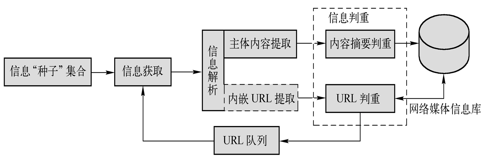

2. **基于Cookie机制实现身份认证**
    - 
    - 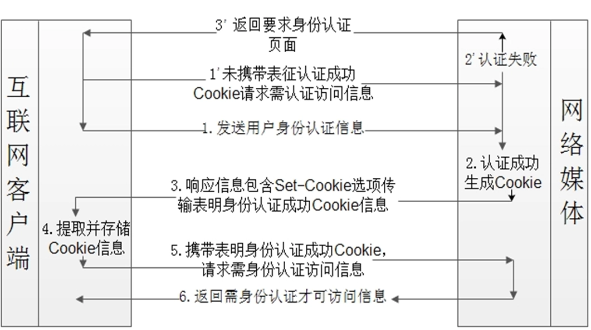

3. **基于浏览器模拟的获取技术**
    - 利用JSSh客户端向内嵌JSSh服务器的网络浏览器发送JavaScript指令
    - 指示网络浏览器进行网络身份认证交互，网页发布信息浏览等操作。
    - 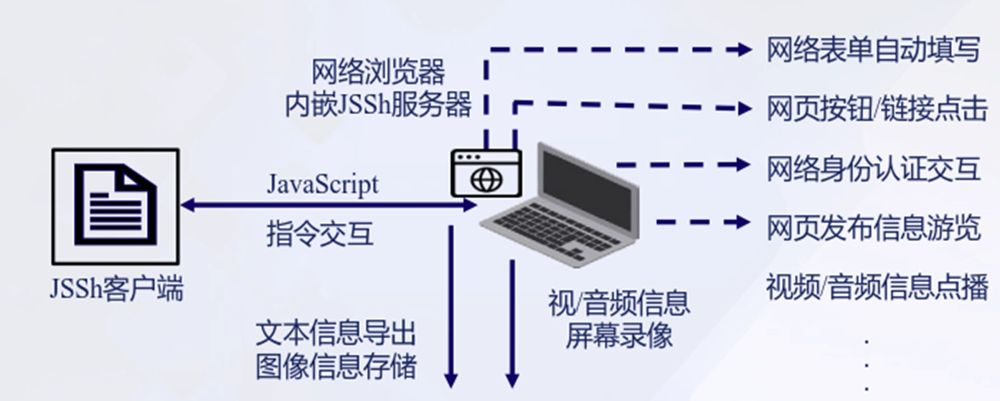

4. **信息内容获取的典型工具 - 网络爬虫**
    - 定义：在互联网上的实施信息内容获取的主要工具，是按照一定的规则，自动的抓取互联网信息的**程序或脚本**。
    - **分类(选择性)**：
        - 服务于搜索引擎等搜索类应用的网络爬虫
        - 针对性进行信息收集的网络爬虫
    - **分布式机制**：网络爬虫需要采用多进程或者多线程，甚至分布式机制来保证信息获取的全面性和时效性。

5. **信息内容特征抽取与选择**
    - 地位：信息内容的表示及其特征项的选取是**数据挖掘、信息检索**的一个基本问题，把从信息中抽取的**特征词**进行**量化**表示文本信息。
    
    1. **文本信息**
        - 文本转化为可处理的结构化形式
        - 文本特征选择以达到降维的目的，主要有字符串匹配、基于统计方法、基于理解方法
        - 文本特征项的特点：
            1. 特征项要能够确实标示文本内容;
            2. 特征项具有将目标文本与其他文本相区分的能力;
            3. 特征项的个数不能太多;
            4. 特征项分离要比较容易实现。
        - 特征抽取的主要功能：在不损伤文本核心信息的情况下尽量减少要处理的单词数，以此来降低向量空间维数，从而简化计算，提高文本处理的速度和效率。
        - 特征选取方式
            - 采用向量空间模型来描述文本向量
            - 通过特征选择来降维，找到代表性特征
        - 特征选择过程
            - 根据特征评估函数计算各个特征的评分值
            - 按照评分值对这些特征进行排序
            - 选取若干个评分值最高的作为特征词
        - 
    2. **音频信息**
        - 提取音频的时域和频域特征
        - 建立数据库，对音频数据进行特征提取并通过特征对数据聚类
    3. **图像信息**
        - 图像颜色特征提取
        - 图像纹理特征提取
        - 其他图像特征提取

## 网络信息内容分析与处理

1. **信息内容分析环节**
    - 海量信息内容分析基本处理环节可以归结为**分类和过滤**，其他更加复杂的处理问题则是上述简单处理问题的组合。
    - 在信息检索和文本编辑等应用中，快速对用户定义的模式或者短语进行分类是最常见的需求。**高效的分类和过滤算法**能使信息处理变得迅速而准确，反之，则会使处理过程变得冗长而模糊。

2. **信息内容分类方法**
    - 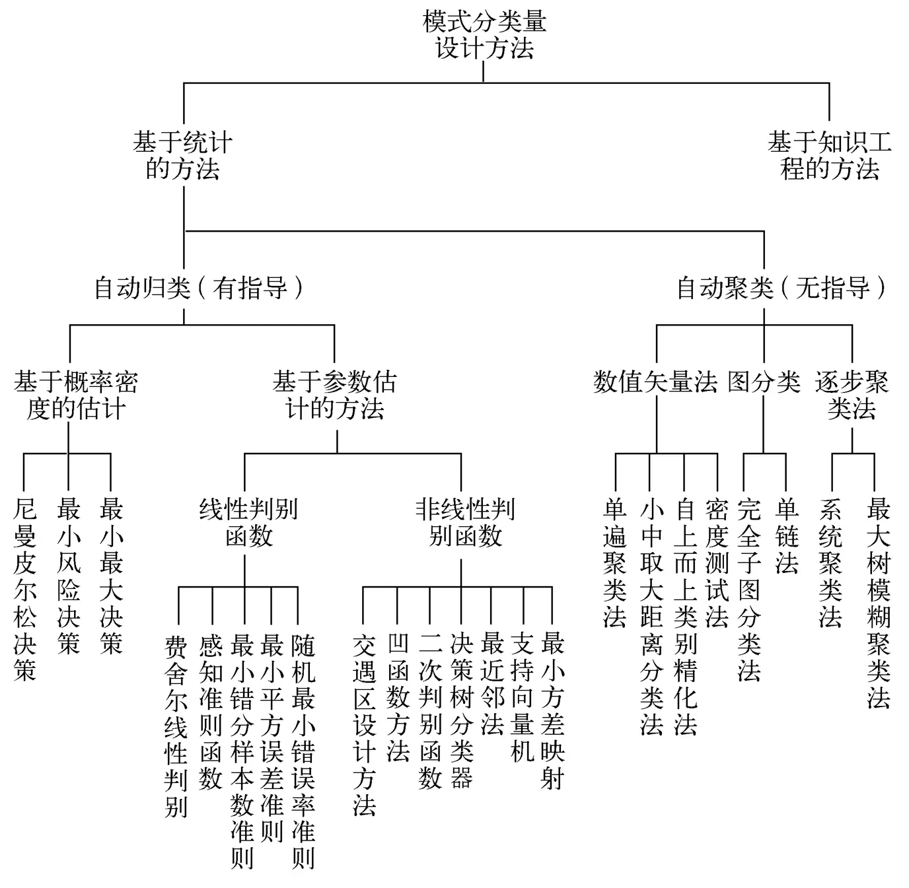

3. **信息内容过滤**
    - **定义**：
        - 信息过滤是大规模内容处理的一种典型操作，对陆续到达的信息进行过滤，是满足用户信息需求的信息选择过程。
        - 根据用户的信息需求，运用一定的标准和工具，从大量的动态网络信息流中选取相关的信息或剔除不相关信息的过程。
    - 说明：
        - 过滤系统是为无结构化和半结构化的数据而设计的信息系统；
        - 信息过滤系统主要用来处理大量的动态的信息；
        - 过滤是基于对个体或群组的信息偏好的描述，也称为用户取向；
        - 过滤是从动态的数据流中收集或去掉某些文本信息
    - 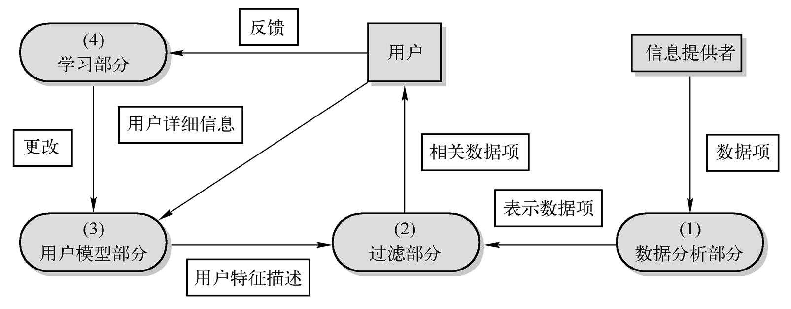
    - **任务**：
        - 信息过滤是提供信息的有效流动，消除或者减少信息过量、信息混乱、信息滥用造成的危害。**为用户剔除不合适的信息**是当前信息过滤的主要任务之一。
    - **技术分类**
        - **根据过滤方法**：
            - 分为基于内容的过滤
            - 基于用户兴趣的过滤
            - 协作过滤
        - **根据操作主动性**：
            - 主动过滤
            - 被动过滤
        - **根据过滤位置**：
            - 信息的源头过滤
            - 服务器和客户端过滤
        - **根据过滤的目的**
            - 用户过滤
            - 安全过滤
    - **主要方法(统计方法)**
        - **向量中心法**：简单实用，应用广泛
        - **相关反馈法**：实现较易，受训练集合影响较大
        - **K近邻法**：原理简单，需要确定k值
        - **贝叶斯法**：机器学习中应用广泛
        - **多元回归模型**：运用线性最小平方匹配算法
        - **支持向量机**：文本分类领域比较成功，训练过程效率不高
        - **概率模型**：特征加权时融入概率因素
    - **常见应用**
        - **Internet搜索结果过滤**：如搜索引擎对同一问题返回众多结果时，筛选出更符合用户需求的内容。
        - **用户电子邮件过滤**：过滤垃圾邮件等。
        - **浏览器过滤**：定制浏览器按用户偏好过滤内容。
        - **专为未成年人过滤**：去除不适合未成年人的信息。
        - **为客户过滤**：根据客户爱好、兴趣进行信息筛选。

4. **线性分类器**：
    - 定义：通过寻找一个投影方向（线性变换，线性组合），将高维问题降低到一维问题来解决，并且要求变换后的一维数据具有如下性质：同类样本尽可能聚集在一起，不同类的样本尽可能地远。
    - X输入，$X_i$表示的是第i个输入；Y表示输出；W表示权向量；$\omega_0$是阈值，f是一个判别函数。
    - 基本思想：寻找合理决策超平面（确定投影方向和阈值$\omega_0$），通过给定训练数据确定线性判别函数。设这个超平面为w，满足以下两式子，即通过给定的训练数据确定线性判别函数。
        - $w^T * x>0, \forall x \in \omega_1$
        - $w^T * x<0, \forall x \in \omega_2$
    - 

5. **最近邻分类法（KNN）**
    - 定义：
        - K最近邻(k-Nearest Neighbor-KNN)分类算法属于监督学习算法，多用于图像分类和识别领域。
    - **核心思想**：
        - **确定一个临近度的度量, 相似性越高，相异性越低的数据样本，可以认为是同一个数据类别**，即如果一个样本在特征空间中的K个最相近(特征空间中最邻近)的样本中的大多数属于某一个类别，则样本也属于这个类别。
    - **核心步骤**：
        - 数据清洗：数据规范化;
        - 确定临近度的度量，并计算临近度;
        - 按照临近度递增次序排序;
        - 选取与当前点距离最小的k个点;
        - 确定前k个点所在类别的出现频率;
        - 返回前k个点出现频率最高的类别作为当前点的预测分类。
    - 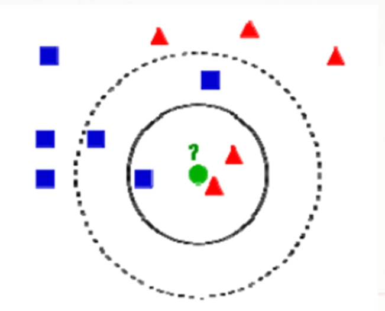

6. **支持向量机（SVM）**
    - 定义：
        - SVM支持向量机（英文全称：support vector machine）是一个分类算法，通过找到一个分类平面，将数据分隔在平面两侧，从而达到分类的目的。
    - **分类基本思路**
        - **找到最合适的分类平面**，最直接的评估标准S是被分隔的两边数据距离平面间隔最大
        - 换句话，SVM就是获取最大间隔的超平面。$w * x + b = 0$确定的情况下，$|wx+b|$表示点距离超平面的距离，而超平面作为二分类器，如果$wx+b>0$，判断类别y为1, 否则判定为-1。
    - 

## 舆情系统功能及内容分析

1. **网络舆情系统概述**
    - **定义**：舆情指在一定的社会空间内，围绕中介性社会事项的发生、发展和变化，作为主体的民众对作为客体的国家管理者产生和持有的社会政治态度。如果把中间的一些定语省略掉，**舆情就是民众的社会政治态度**。
    - **网络舆情系统**：
        - 对海量非结构化信息挖掘与分析；
        - 实现对网络舆情的热点、焦点、演变等信息的掌握；
        - 为网络舆情监测与引导部门的决策提供科学依据。
    - **网络舆情特点**：
        - 直接性：通过网络直接发表意见，传播迅速
        - 随意性和多元化：网民可匿名发表观点，健康观点和灰色言论并存
        - 突发性：网络快速传播的特性使关注焦点迅速成长为舆论热点
        - 隐蔽性：虚拟网络空间中网民可以隐身发言
        - 偏差性：网络舆情不等同于全民立场

2. **网络舆情分析系统框架**
    - 
    - 

3. **网络舆情监测技术的发展趋势**
    - **针对信息源的深入信息采集**：
        - 传统搜索引擎一般采用**广度优先**的策略遍历Web并下载文档。
        - 不能完全满足实际需求，其主要不足体现在——**互联网定点信息源信息的提取率过低**。
    - **异构信息融合分析**：
        - 互联网信息在**编码、数据格式以及结构组成**方面存在巨大差异。
        - 信息分析与提取的重要前提是对信息在**同一表达或标准**的前提下进行有机的结合
    - **非结构信息的结构化表达**：
        - 非结构化信息对于阅读者而言比较容易理解，但对于计算机信息处理系统却相当困难。
        - 目前已有优秀的技术与方法可以对结构化数据进行分析。
        - 说明：
            - 结构化数据是指按照预定义的模型结构化或以预定义的方式组织的数据，结构化数据通常存储在关系数据库管理系统(RDBMS)中。
            - 非结构化数据指那些无法用固定结构来逻辑表达实现的数据，简单来说就是用户散落在论坛、微博、微信或其他渠道发表的关于产品的各种评价或吐槽。
            - 非结构化数据主要包含三大块：第一是文本文字；第二是图像、图片等；第三是视频流、电视流，还有网页、元数据等。

4. **网络舆情分析关键技术**
    - 信息采集技术
    - 热点发现
    - 热点评估
    - 主题跟踪
    - 分析处理

5. **网络舆情系统的常用方法**
    - **高仿真网络信息深度提取技术**：
        - 是舆情监控系统信息获取模块的核心，重点研究**原创网络互动式动态信息提取**，形成高性能动态信息提取系统，组成舆情监控系统的信息获取模块。
        - 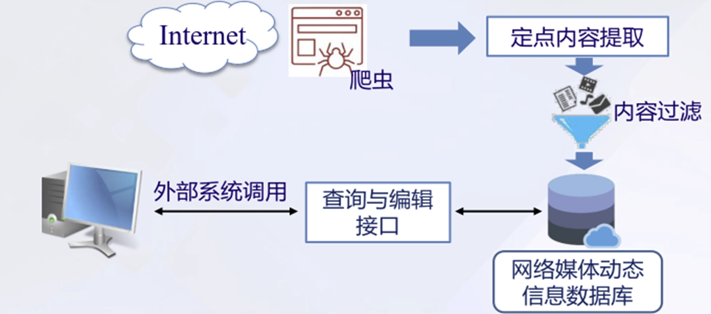
    - **基于语义的海量媒体内容特征快速提取与分类技术**：
        - 实现信息特征提取和结构化转变功能，组成舆情监控系统信息分析模块。
        - 为实现舆情的分析、监测与预警完成信息转化。
        - 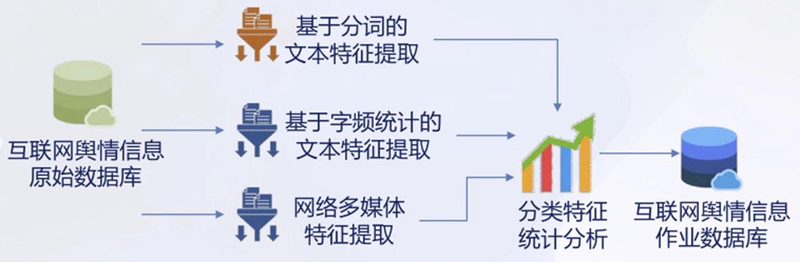
    - **非结构信息自组织聚合表达技术**：
        - 满足网络舆情监测预警基础设施与典型应用的实际需求，组成数据分类、仓储和挖掘引擎模块。
        - 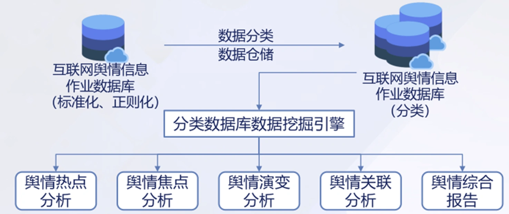

6. **典型运用——互联网舆情内容分析**
    - **深度挖掘技术**：利用定向搜索手段完成针对指定信息源的深入、全面的**内容提取**操作，以面向结构迥异、风格多样的数据发布源实施互联网媒体信息监控工作。
    - 关键技术
        - 异构信息归一化
        - 网络热点自动发现
        - 协商与人际对话模拟
        - 热点数据报告定制

## 内容中心网络及安全

1. **内容中心网络概述**
    - **定义**：
        - 内容中心网络(Content Centric Network,CCN)是2009年提出的新型下一代网络体系结构，是一个基于内容的网络。
    - **核心思想**：
        - **对网络中的每个内容命名, 而不是使用主机和节点的 IP 地址**。当需要获取一个内容/服务时, 网络节点将发送一个包含所需内容/服务名字的请求。该请求按照内容名字进行路由, 而不是 IP 地址。
    - **目标**：
        - 替代现有的以 IP 为核心的网络体系架构，“以数据为中心”将通信范式的重点从关注于`where` (地址、服务器、主机)转变到`what`（通信的内容）。以对数据命名的方式代替位置（IP地址），将数据转变成网络的第一要素。

2. **内容中心网络架构**
    - **基本原理**：摒弃IP地址为中心的传输架构，采用**以内容名称为中心**的架构，通过**以内容为中心的订阅机制和语义主导的命名、路由和缓存策略**，在解决当前基于IP地址进行联网的模式上体现出了巨大的潜力
    - **架构组成部分**
        - **内容信息对象**：存储在计算机中并可访问的各类对象，如网页、文档、电影、照片、音乐等。
        - **命名**：是信息对象的标识，具有**全局性和唯一性**。其地位与TCP/IP架构的IP地址类似。
            - 分层命名方案
            - 扁平命名方案
        - **路由**：
            - 
        - **缓存**：每个CCN节点维护**缓存表**，用于缓存CCN路由器接收的内容消息对象，以便**响应后继接收到的相同请求**。
        - **应用程序编程接口**：CCN应用程序编程接口根据**请求和交付**内容信息对象定义，用于内容信息对象的**发布和获取**操作。

3. **面向内容中心网络的攻击分类**
    - **命名相关攻击**：
        - 监视列表攻击
        - 嗅探攻击
    - **路由相关攻击**：
        - DDOS攻击
        - 欺骗攻击
    - **缓存相关攻击**：
        - 驱逐流行内容攻击
    - **其他攻击**：
        - 假冒攻击
        - 重放攻击

4. **基于雾计算的内容信息中心网络安全防护架构**
    - 基于雾计算的智能防火墙模型：
        - 利用**雾计算范式**在**网络边缘**实现了**隔离防御**系统；
        - 基于已有的安全策略，该防火墙能够实现对**兴趣包洪泛攻击**的智能感知和动态防御。
        - 
	
# 第六章 应用安全基础

## 应用安全概述

1. **研究背景**
    - 信息技术、移动通信技术等的紧密结合与快速发展，以及智能终端软硬件的不断升级与换代，促进了移动互联网、云计算、大数据、物联网等应用的不断普及。
    - 海量用户个人信息跨系统、跨生态圈乃至跨国境流转常态化
        - 住宿出行
        - 移动社交媒体平台
        - 移动支付

2. **研究范围**
    - **定义**：应用安全是指为保障各种应用系统在信息的获取，存储，传输和处理各个环节的安全所涉及的相关技术的总称。
    - 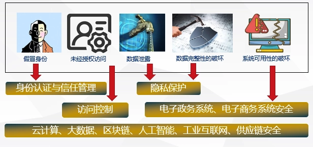
    - e.g.
        1. 云计算：
            - 云计算已成为当前普及的一种信息服务提供方式，为政府和企业提供了新信息系统构建方式和计算方式。
            - 由于云计算造成了数据所有权和管理权的分离
            - 在以下两方面开展持续研究：
                - 云计算基础设施的可信性
                - 云数据安全保障
        2. 工业互联网：
            - 数据汇集到云端，要保证系统的可靠运行，需要保证数据的机密性、完整性、访问和流转的可控性以及系统软硬件的安全性
        3. 大数据：
            - 大数据是一种规模大到在获取、存储、管理、分析方面大大超出了传统数据库软件工具能力范围的数据集合
            - 大数据本质上是一种方法论，是组合分析多源异构的数据来进行更好的决策，获得的数据越多越能发现数据中蕴含的知识、价值和规律
            - 实现大数据安全应用的关键：
                - 保证数据来源的真实
                - 促进多源数据的共享
                - 有效挖掘数据的价值
                - 保障数据所有者的权益
        4. 人工智能：
            - 人工智能在图像识别、自然语言理解、知识发现与数据挖掘、博弈等方面取得了显著的成就 
            - 人工智能技术越来越多的应用在网络安全防护、密码设计与分析领域
        5. 区块链：
            - 区块链是数字加密货币-比特币的基础支撑技术
            - 区块链本身安全问题、隐私保护问题亟待解决，同时对于互联网信息服务、金融安全也带来相应的风险

## 身份认证的主要方法

1. **身份认证定义**
    - **认证(Authentication)是证实客户的真实身份与其所声称的身份是否相符的过程**，是保证系统安全的重要措施之一。当服务器提供服务时，需要确认请求者的身份，请求者有时也需要确认服务提供者的身份。
    - 实现身份认证的基本途径：
        - 所知：个人掌握的知识，如口令，秘密
        - 所有：个人所具有的东西，如身份证、令牌、密钥等
        - 个人特征：指纹、笔迹等

2. **身份认证的主要方法**
    - 用户名/口令认证(所知)
        - 优点：简单易用，不需要任何硬件设备
        - 缺点：
            - 口令易泄露；
            - 弱口令容易被猜测，
            - 易受字典攻击和暴力攻击；
            - 复杂的强安全口令难于记忆

    - 动态口令/一次性口令OTP(所有)
        - 一次性口令是变化的密码，它来源于**产生密码的运算因子是变化的**
        - 一次性口令产生因子一般都采用ISO/IEC 9798-2-2008标准的双运算因子(Two Factor)，其一是有效期较长的共享密钥，其二是**随机因子**
            - 1)基于时间同步
            - 2)基于事件同步
            - 3)短信验证码

    - 挑战应答认证(所有)
        - 通过一轮应答实现服务器对用户的认证，利用一次性随机数实现防重放攻击
        - 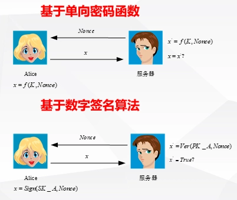
        - 基于单向密码函数
        - 基于数字签名算法

    - 基于生物特征的认证(个人特征)
        - **生物统计学**(Biometrics)方法正在成为实现个人身份认证最简单而安全的方法
        - 签名、指纹、人脸、虹膜、语音等
        - 优点
            - 可信度高
            - 个人特征因人而异，难以伪造
            - 随时携带，不易丢失
        - 缺点
            - 不够稳定(辨别失败率高)
            - 不能挂失

    - 图灵测试
        - 验证登录信息系统的是人还是自动化执行的程序
        - 采用的方式利用人能快速回答，而机器回答困难的问题
        - 目的是防范利用计算机程序对系统进行暴力破解

    - 多因子认证
        - **实际应用当中，多采取多种认证方式结合，构成多因子认证方式。**

3. **公钥基础设施PKI**
    - **定义**：
        - PKI：公钥基础设施(**P**ublic **K**ey **I**nfrastructure) 是一种遵循标准的利用公钥理论和技术建立的提供安全服务的**基础设施**。
    - 目的：
        - 解决网上**身份认证、电子信息的完整性和不可抵赖性**等安全问题，为网络应用提供可靠的安全服务。
    - 任务：
        - 确立可信任的数字身份。
    - **数字证书**：
        - 一个用户的**身份**与其所持有的**公钥**绑定，由一个可信任的权威机构CA对该用户身份及对应公钥相绑定的证书进行数字签名，以证明证书的有效性，从而证明用户的身份。
    - 信任体系：
        -  X.509标准采用树型的信任体系。根CA自签发证书，是整个信任体系的锚点
        - 上级CA为下级CA或者用户颁发证书
        - Alice和Bob的证书沿着信任路径可以到达相同的证书节点，就可以建立信任关系
        - 

4. 身份认证的主流标准
    1. **RADIUS**：
        - **远程认证拨入业务协议RADIUS** (Remote Authentication Dial-In User Service protocol)是由Livingston公司发明的，用于接入认证和计费服务。RADIUS规范文本可以参看RFC 2865和RFC2856。RAIUS在许多企业信息系统接入过程中得到应用。
        - 
    2. **FIDO**：
        - **在线快速身份认证**(Fast Identity Online)使用**生物特征识别技术代替口令**对在线用户进行身份认证
        - **主要思想**
            - **基于生物特征识别解锁设备上的加密密钥，使用公钥密码或者对称密码方案与服务器进行身份认证**，从而可完全**通过本地身份认证实现无口令的登录。**
        - FIDO 联盟于 2012 年创立，主旨是制定无口令身份认证协议。
        - 分类：
            - **通用身份认证框架UAF**(Universal Authentication Framework)
            - **通用第二因子认证协议U2F**( Universal 2nd Factor)
            - 
        - FIDO注册流程
            - 
        - FIDO认证流程
            - 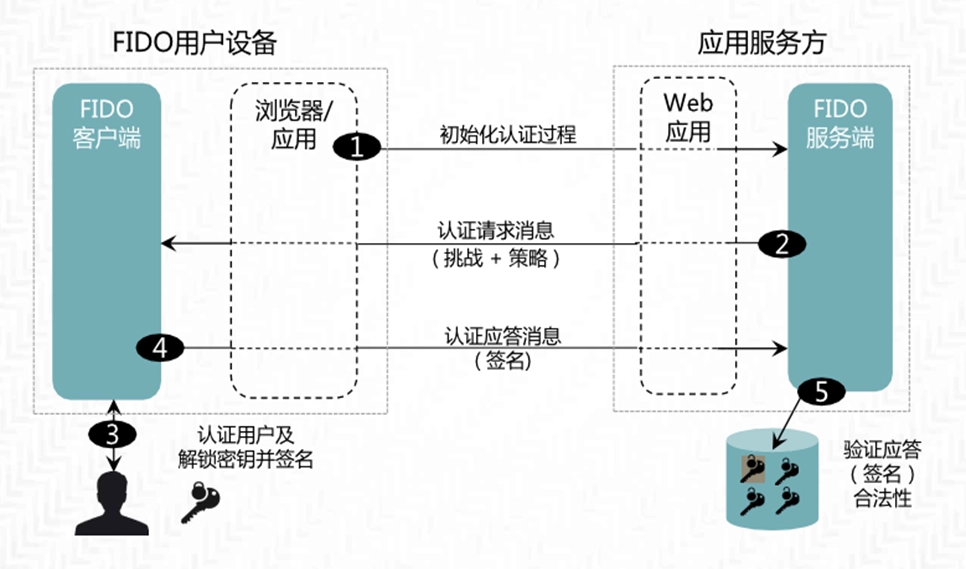
    3. **FIM**：
        -  **联盟身份管理FIM**(Federated Identity Management)可以使**用户使用同一个身份在组成联盟的所有企业中访问相应的资源**，支持用户身份跨安全域链接，用户可以在一个域中认证之后，不需要再进行独立的登录过程就可以访问另一个域的资源。
        - **Oauth**(Open Authorization)是典型的FIM系统，定义了**资源所有者、资源服务器、客户、授权服务器**四个角色。任何服务提供商都可以实现自身的OAUTH认证服务，很多大的公司如Google，Yahoo，Microsoft等都提供了OAUTH认证服务。
        - **SSO单点登录**是身份联盟的一个重要组件。SSO单点登陆是一种集中式访问控制技术，允许主体在系统上进行一次身份认证，并且不需要再次身份认证，就可以访问多个资源。公司的文件传输系统ipan就使用的单点登陆，学校的邮箱和网站，一套密码应用于所有身份认证系统
        - 工作流程
            - 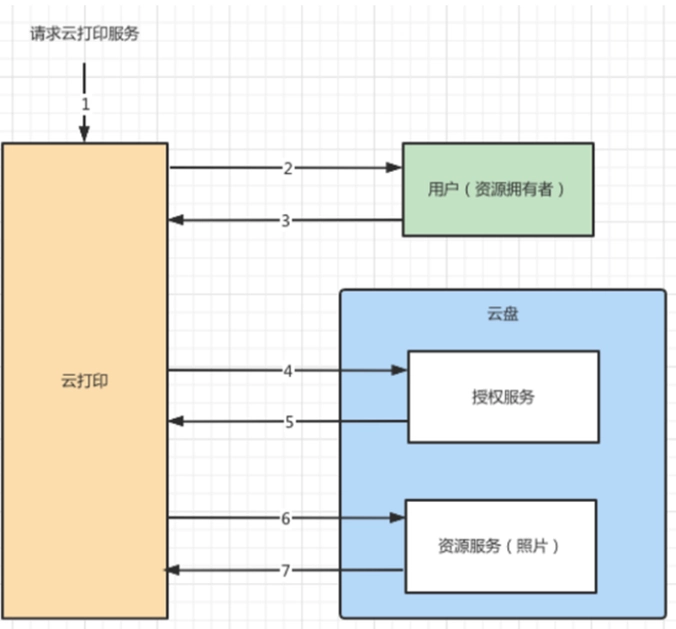
            - 客户端(Client)向资源所有者(Resource Owner)请求授权。
            - 客户端(Client)收到用户授权，这是代表资源所有者(Resource Owner)授权的凭证(Authorization)。
            - 客户端(Client)通过与授权服务器(Authorization Server)进行身份验证并提供授权许可来请求访问令牌(Access Token)。
            - 授权服务器(Authorization Server)对客户端进行身份验证并验证授权许可，如果有效，则颁发访问令牌(Access Token)。
            - 客户端(Client)从资源服务器(Resource Server)请求受保护的资源并通过提供访问令牌(Access Token)进行身份验证。
            - 资源服务器(Resource Server)验证访问令牌(Access Token)，如果有效，则为请求提供服务。

## 访问控制模型

1. **访问控制的概念和目标**
    - **概念**：
        - 访问控制是通过某种途径**显式地准许或限制访问能力及范围**的一种方法，是针对越权使用资源的防御措施，通过限制对关键资源的访问，防止非法用户侵入或因为合法用户的不慎操作而造成的破坏，保证网络资源受控地，合法地使用。
    - **基本目标**：
        - 防止对任何资源(如计算资源、通信资源或信息资源)进行**未授权的访问**；
        - 允许被授权的主体对某些客体的访问、拒绝向非授权的主体提供服务
        - 未授权的访问包括：
            - **非法用户进入系统**
            - **合法用户对系统资源的非法使用**

2. **访问控制模型**
    - **自主访问控制模型DAC**
        - 资源拥有者按照自己的意愿来决定是否将自己所拥有资源的访问权限授予其他用户，策略灵活但安全性较差
    - **强制访问控制模型MAC**
        - 为用户和数据划分安全等级，实现了信息的单向流动，但权限管理效率偏低、缺少灵活性
    - **基于角色的访问控制模型RBAC**
        - 通过角色对访问控制策略进行描述，系统中的用户和权限均对应于某些特定的角色。角色的引入实现了用户与权限之间的分离，简化了授权管理。
        - **核心思想**：将访问权限与角色相联系
            - 给用户分配合适的角色
            - 让用户与访问权限相关联
            - 用户可以在角色间进行转换
            - 系统可以添加、删除角色
        - **特点**：
            - 以角色作为访问控制的主体
            - 角色继承
            - 用户可以在角色间进行转换
            - 最小特权

## 零信任模型

1. **零信任模型(Zero Trust Model)**
    - 核心思想
        - **网络边界内外的任何实体，在未验证之前都不予以信任**，典型系统是谷BeyondCorp体系
    - 特点：
        - 内网应用程序和服务不再对公网可见
        - 企业内网的边界消失
        - 基于身份、设备、环境认证的精准访问控制
        - 提供网络通信的端到端加密

## 典型应用及其安全

1. **隐私保护**
    - 定义：
        - **隐私保护是指在发布或者共享数据中不能识别出具体个人的数据**
        - **个人信息**是指自然人的相关数据
        - **隐私**是指**个人敏感信息**
            - 包括身份证号码、电话号码、住址、住房类型、居住时间、过敏信息、疾病和药品使用状况、财务状况、信用记录、车辆识别码、品牌爱好、交通工具、出行地、出行时间、购买记录、指纹、掌纹、虹膜、社交账号、犯罪信息等
    - 隐私保护方法：
        - **基于数据扰乱方法**：扰乱是指在数据发布前通过加入噪声、引入随机因子及对私有向量进行线型变换等手段对敏感数据进行扰乱(数据泛化、数据扭曲、数据清洗、数据屏蔽等)，以实现对原始数据改头换面的目标。这种处理方法可以快速地完成，但其安全性较差，且以降低数据的精确性为代价，从而影响数据分析结果，一般这种处理手段仅能得到近似的计算结果。
        - **基于密码的方法**：主要是研究构造适用于隐私保护、与传统数据加解密不同的密钥管理机制、同态密码方案以及混淆方法、多方计算等 。

2. **K-匿名性**
    - 仅在数据集中去掉名字不能起到匿名效果。数据集中存在一些准标识符，当与其他数据集中的信息组合在一起的时候可以重新标识身份。
    - 1998年Sweeney 提出K-匿名。

3. **L-多样性**
    - 同质性攻击(Homogeneity attack)
    - 背景知识攻击(background knowledge attack)

4. **t-邻近(t-closeness)**
    - 隐私是观测到的信息增益; 看到发布的数据表之前，得到的敏感属性的先验信息；看到发布数据之后，得到后验信息；
    - **隐私是先验信息和后验信息的差额**

5. **差分隐私(Differential Privacy)**
    - 定义：
        - 一个数据集进行统计查询计算时，**不能通过多次不同的查询方式推断出数据集中是否包含一个特定个体的数据**。
        - 称一个算法A满足ϵ-差分隐私$(ϵ-DP)$，其中$ϵ>0$，当且仅当对于任意的两个只相差一个元素的数据集D和D’，有以下条件满足：$ ∀𝑇 ⊆ Range(𝐴): Pr[𝐴(𝐷)∈𝑇] ≤ 𝑒^𝜀 Pr[𝐴(𝐷^′)∈𝑇] $
    - 实现方式：
        - $ 𝑀(𝑓(𝐷)) = 𝑓(𝐷) + 𝑥 $，  
            - 𝑓:查询函数
            - x:随机噪声
        - 拉普拉斯机制 $ Lap(𝑥│𝜇，𝑏) = \frac{1}{2𝑏}  e^{(−\frac{|𝑥−𝜇|}{b})} $
    - 

6. **隐私计算**
    - 定义：
        - **隐私计算是面向隐私信息全生命周期保护的计算理论和方法**，是隐私信息的所有权、管理权和使用权分离时隐私度量、隐私泄漏代价、隐私保护与隐私分析复杂性的可计算模型与公理化系统
    - 地位：
        - **隐私计算是泛在网络空间隐私信息保护的重要理论基础**
    - 在处理视频、音频、图像、图形、文字、数值、泛在网络行为性信息流等信息时，对所涉及的隐私信息进行**描述、度量、评价和融合**等操作，形成一套符号化、公式化且具有量化评价标准的隐私计算理论、算法及应用技术，支持多系统融合的隐私信息保护

7. **隐私保护的法律法规**
    - HIPAA
    - Regulation P(Privacy of Consumer Financial Information)
    - FACT(Fair and Accurate Credit Transaction Act 2003)
    - GDPR(General Data Protection Reform)
    - 网络安全法
    - 个人信息保护法

8. **云计算**
    - 定义：
        - 云计算是一种基于网络访问、以按需分配、共享使用的方式对物理计算资源进行供应和管理的模式
    - 云部署方式
        - 
    - 云计算服务模型
        - SaaS
        - PaaS
        - IaaS
    - **云计算基础：虚拟化技术**
        - 裸金属架构
            - VMware vSphere， Xen， Hyper-V， KVM 
        - 寄居架构
            - VMware Workstation， VirtualBox
        - 容器
            - Docker
        - 

9. **云计算安全**
    - 云基础设施安全
        1. 虚拟机逃逸
            - 利用虚拟机管理软件或者虚拟机中**运行软件的漏洞**，控制虚拟机管理系统或者在**宿主机上运行恶意软件**，进而获得**其他虚拟机的完全控制权限**
        2. 边信道攻击
            - 攻击者**控制的虚拟机与目标虚拟机使用相同的物理层硬件**，二者交替执行。攻击者首先借助恶意虚拟机访问共享硬件和缓存，然后在交替执行的过程中通过边信道信息来推断出目标虚拟机的行为，识别相应的信息，最终导致目标虚拟机内的用户数据泄露。
        3. 网络隔离
            - 云计算平台中，数据包在虚拟网络中移动，不用通过物理网络传输，在物理网络上的监控和过滤工具永远看不到这些流量，在多租户的公有云网络中引发的安全问题尤为显著
        4. 镜像和快照的安全
            - 云计算平台往往通过特定的镜像来创建虚拟机或者服务实例；
            - 攻击者通过入侵虚拟机管理系统并感染镜像，可以大幅提升攻击的效率和影响范围。若攻击者非法恢复了快照，历史数据将被清除，攻击行为将被彻底隐藏
    - 云数据安全
        1. 云存储数据安全
            - **云加密数据库**
                - 
            - **密文搜索**
                - 可搜索加密技术是搜索技术和加密技术的结合。可搜索加密能够实现将用户的数据进行特殊的加密后上传到云服务器上，并且可以实现根据关键字进行检索的功能，在方便用户使用的过程中，也保护了文件的隐私安全。
                - 
                - 当前可搜索加密机制分为： 
                    1. 对称可搜索加密(Symmetric Searchable Encryption SSE)
                        - 对称可搜索加密的构造通常基于伪随机函数，具有计算开销小、算法简单、速度快的特点。
                        - 除了加解密过程采用相同的密钥外，其陷门生成也需密钥的参与。
                        - 单用户模型的单用户特点使得对称可搜索加密非常适用于该类问题的解决：用户使用密钥加密个人文件并上传至服务器，检索时，用户通过密钥生成待检索关键词陷门，服务器根据陷门执行检索过程后返回目标密文。
                    2. 非对称可搜索加密(Asymmetric Searchable Encryption ASE)
                        - 非对称可搜索加密使用两种密钥：公钥用于明文信息的加密和目标密文的检索，私钥用于解密密文信息和生成关键词陷门。
                        - 非对称可搜索加密算法通常较为复杂，加解密速度较慢，然而，其公私钥相互分离的特点，非常适用于多用户体制下可搜索加密问题的解决：发送者使用接收者的公钥加密文件和相关关键词，检索时，接收者使用私钥生成待检索关键词陷门，服务器根据陷门执行检索算法后返回目标密文。
                        - 该处理过程避免了在发送者与接收者之间建立安全通道，具有较高的实用性。
                    - 
        2. 云计算数据安全
            - 保密计算旨在保护使用中的数据。
                - 通过加密数据，让云服务器在密文数据上进行计算。
                - 相关技术：同态加密、特定计算安全外包、可验证外包计算
                - 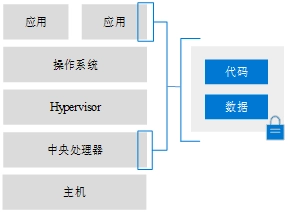
            - **基于SGX的保密计算**
                - SGX(Software Guard Extensions)，是 Intel CPU 提供的可信执行环境，可以为云上数据代码的完整性和保密性提供芯片级的安全保障。
                    1. 在计算平台上提供一个可信的空间，保障用户关键代码和数据的机密性和完整性。
                    2. 把应用程序分为两部分：安全应用程序和非安全应用程序；
                    3. 将合法软件的安全操作封装在一个`飞地`(enclave)中；
                    4. 当调用 enclave 函数时，只有 enclave 内部的代码才能查看其数据，并始终拒绝外部访问；当调用结束时，enclave 的数据会留在受保护的内存中。
                    5. 注：一个 CPU 中可以存在多个`飞地`，大家互不干扰，同时进行自己秘密的操作。
        3. 云共享数据安全
            - 数据拥有者通常会将数据加密后上传到云端，给数据共享带来困难。
                - 大规模用户的数据共享需要大量密钥，生成、分发和保管这些密钥困难
                - 如何制定灵活可控的访问策略，实施细粒度的访问控制，会成倍增加密钥数量
                - 用户访问权限更新或撤销时，需要重新生成信的密钥，计算量大
                - 相关技术：基于属性的加密技术(Attributed Based Encryption ABE)、访问策略表达技术、访问权限撤销技术、访问控制效率增强技术
            - **CP—ABE(密文策略属性加密)**
                - 在ABE系统中，用户的密钥和密文被标记为描述性属性集，而特定密钥只有在密文的属性与用户密钥之间匹配的情况下才能解密特定的密文。
                    - 以属性作为公钥对用户数据进行加密
                    - 用户的私钥也和属性相关，只有当用户私钥具备解密数据的基本属性时，用户才能够解密出数据明文，当密文和私钥之间至少K个属性重叠时，密码系统允许解密。
                - CP-ABE：将访问控制策略嵌入到密文当中，只有当用户拥有满足访问控制策略的属性集合及其对应的私钥情况下才能解密密文。
                - 
                
                

10. **比特币与区块链**
    - 区块链
        - 2008年11月，中本聪(Satoshi Nakamoto)发表Bitcoin: A Peer-to-Peer Electronic Cash System，提出了无中心电子现金系统
        - 区块链是比特币的底层技术
        - 区块链是一个公开、透明的分布式账本
        - 区块链是一条**哈希链**，**用哈希串联信息**，实现完整性，防止篡改，公开验证
        - 区块链具有不可篡改性。
            - 区块链中存储的交易信息每一条都有相对应的 Hash 值，由每一条记录的 Hash 值作为叶子节点生成二叉 Merkle 树。
            - Merkle 树的根节点（Hash 值）保存在本区块的块头部分，区块头部除了当前区块的 Merkle 树的根节点，还保存时间戳以及前一个区块的 Hash 形成一条链式结构。
            - 因此，要想篡改区块链中的一条记录，不仅要修改本区块的 Hash值，还要修改后续所有区块的Hash值，或者生成一条新的区块链结构，使得新的链比原来的链更长。
            - 实际上，这是很难实现的。一般一个区块后面有6个新的区块生成时，即可认为该区块不可篡改，可以将该区块加入到区块链的结构中。
    - 区块
        - 比特币网络中，**数据以文件的形式被永久记录，称这些记录为区块**
        - 新区块一旦被记录在区块链上，就不能被改变或者删除
            - **时间戳**记录特定的数据生成时间
            - 默克尔树用来存储当前区块的所有交易信息
            - 难度系数用于控制区块的生成速度，**比特币每10分钟产生一个区块**
        - 
    - 共识机制
        - 网络中各个参与节点需要**确认交易的机制**，使得在网络中存在故障或不可信节点的情况下，区块链网络中的交易能按照预期的正确方式执行，**确保各个节点最终结果的一致性**。
        - e.g.
            - PoW(Proof of Work) 算力证明机制
            - PoS(Proof of Stake) 权益证明机制
            - DPoS(Delegated Proof of Stake) 股份授权证明机制
            - PBFT(Practical Byzantine Fault Tolerance)拜占庭容错算法
    - 智能合约
        - 智能合约是**运行在链上并可针对区块链数据库进行读写操作的代码**，可以自动执行参与方指定的数字契约
        - 特点:
            - 无须中介，满足合约条件即可自动执行与验证计算机协议
            - 最小化意外或恶意情况的发生
            - 最小化信任中介职能
            - 降低仲裁以及强制执行的成本
            - 降低违约带来的损失
        - 
    - 区块链主要类型
        - **公有链**
            - 自由加入和退出(比特币、以太坊等)
        - **联盟链**
            - 通过授权加入和退出(Hyperledger、R3)
        - **私有链**
            - 私有机构单中心网络
    - 区块链的安全
        - **51%算力攻击**：当攻击者掌握了超过全网50%的算力，就很容易阻止其他节点确认交易，也可以逆转当前区块已经完成的交易，并在网络中双花电子货币。2018年，Zencash、Verge、Ethereum Classic就受到了51%攻击
        - **攻击交易所**：加密货币交易所拥有大量的加密货币，若安全防范措施不到位，成为黑客们关注的目标。当前对交易所的攻击频发，数字货币被窃时有发生
        - **软件漏洞**：2018年钱包和去中心化APP的软件bug导致了超过2400万美元的损失。需要完备的代码审计、渗透测试和智能合约监控
        - **隐私泄露**：公有链数据可以公开获取，通过大数据关联分析，可能对特定用户去标识化，从而泄露用户隐私信息。
    - 区块链的安全事件
        <!-- - 零时科技 联合多家媒体共同发布《2019年度区块链十大安全事件》：51%算力攻击
        - 2019年3月29日，韩国知名数字货币交易所Bithumb疑似遭到黑客攻击，黑客窃取了价值1000万多美元的EOS和价值600万多美元的XRP；
        - 2019年3月24日，新加坡DragonEx交易所遭到黑客入侵，被盗价值600余万元的数字货币，黑客使用含有0day的软件进行钓鱼攻击。
        - 2019年5月7日，知名数字货币交易所发出公告称，黑客从币安热钱包中盗取了7000枚比特币，价值数千万美元。 -->

11. **人工智能**
    - 主要技术领域
        - 自然语言处理
            - 通过计算机对自然语言的分析，对词法、句法、语法和语义进行理解分析，实现人机信息交流
        - 计算机视觉
            - 让计算机具备理解图像表示内容、图像中物体存在的关系等能力。如文字识别、图像处理、图像识别
        - 数据挖掘
            - 从数据中提取出具有潜在价值的信息和知识。如用户精准画像，智能推荐等
        - 深度学习
            - 通过建立模拟人脑分析学习的神经网络对数据进行解释。常见的深度学习模型：卷积神经网络(CNN)、循环神经网络(RNN)、对抗生成网络(GAN)和强化学习(RL)等
    - 安全问题
        - 对抗样本
            - 对待预测样本添加特定很小的扰动或者进行细微的修改，使模型对于该样本判断出错，“熊猫”图像添加少量噪声后就会被识别为长臂猿，且可信度为99.3%
        - 模型萃取
            - 通过构造请求向目标服务发起查询，取得目标模型参数或者构造出与目标模型功能相似可替代的模型
        - 投毒攻击
            - 在模型训练过程中修改训练数据集或者投放精心构造的恶意样例，来使训练数据中毒或者被污染，从而干扰机器学习模型的训练过程，降低最终得到模型的判断准确性
        - 训练数据窃取
            - 攻击模型训练集，获得训练数据集的具体样本及统计分布，或者判断某条数据是否在该训练数据集中
    - 人工智能与网络空间安全的影响
        - 复杂性挑战：
            - 复杂的技术构成和应用场景势必会产生新的安全漏洞
        - 网络犯罪
            - 伪造语音、图片、视频，生成虚假内容，识别验证码
        - 隐私保护侵犯
            - 收集、识别个人隐私，精准画像
        - 不确定性风险
            - 人工智能不可控，产生意外损害
        - 智能网络攻防
            - 自动化的网络攻防
        - 人工智能伦理
            - 人工智能与人类的关系，是否会取代人类

