> 本笔记基于上海交通大学 *许可老师* 2024-2025 学年秋季学期教学内容进行整理，部分图片来源于网络，如有侵权请联系删除。

# Ch1~2 导论 计算机的演变和性能

## 计算机发展简史
- 第一代：真空管
- 第二代：晶体管
- 第三代：集成电路
- 第三代以后：超大规模集成电路

## IAS计算机
- 1945年，冯·诺依曼提出的计算机体系结构

## 摩尔定律
- 集成电路的集成度每年翻一倍，后修正为18个月
- 影响：
    - 集成度增加的同时单芯片成本几乎不变；
    - 高集成度，电路短，速度快；
    - 体积、能耗、冷却需求小；
    - 片外互联少，可靠性高。

## 微处理器速度
### 芯片制造技术
- 当代处理器内置技术：
    - 流水线
    - 分支预测
    - 超标量执行
    - 数据流分析
    - 推测执行

## 性能平衡
- 问题1：处理器比主存快太多
    1. 提高一次性读取数据位数；
    2. 改进DRAM接口（使用cache）；
    3. 减少主存访问频度（多级cache）；
    4. 提高互联带宽（更高速的总线，改进总线层次）
- 问题2：频繁操作、高吞吐量的IO与处理器间的数据传输
    1. 提高IO设备速度；
    2. 减少IO操作频度（使用cache）；
    3. 改进IO接口（DMA）；
    4. 改进互联结构（高速总线、改变互联结构）

## 改进芯片组成和体系结构
### 提高处理器速度的方法：
1. 提高硬件速度：缩小逻辑门尺寸，提高时钟频率（CLK）
    - 但是时钟频率和逻辑密度的增加会造成：功率增加、RC延迟增长、内存延迟和吞吐量滞后更严重
2. 增加处理器与主存间高速缓存的大小和速度
3. 改变体系结构：更复杂的指令执行逻辑，并行、流水线、超标量
    - 上述方法收益递减，因此目前新方向是多核

## 计算机性能评估
1. 时钟速度（也叫时钟频率）：传统
    - 缺点：不同指令需要的时钟周期不同；有流水线的处理器在相同时钟频率下执行的指令更多
2. CPI（程序每条机器指令所需的平均时间周期数）：
    - 通常不同类指令的CPI不同
    - $I_c$：规定时间内执行的机器指令总条数
    - $CPI_i$，$I_i$：给定程序中i类指令的CPI和执行条数
    - $f$：时钟频率，$$τ=\frac{1}{f}$$
    - 有：
        $$
        \begin{aligned}
        CPI&=\frac{\sum_{i=1}^{n}(CPI_i×I_i)}{I_c}\\
        T&=I_c×CPI×τ
        \end{aligned}
        $$
3. MIPS速率（每秒执行的百万条指令的数量）：
    - $$MIPS=\frac{I_c}{T\times 10^6}=\frac{f}{CPI\times 10^6}$$
    - 注：关于CPI与MIPS计算，课本p43有例题
4. MFLOPS速率（每秒执行的百万次浮点运算的数量）：
    - 是由于CISC相比RISC，一条指令耗时更长但功能更多，用MIPS可能不合适
    - $$MFLOPS=\frac{\text{程序中执行的浮点操作数量}}{\text{执行时间}\times 10^6}$$
5. SPEC速度度量：
    - 以基准程序i在参照系统上的运行时间作为基准程序i的参考运行时间$Tref_i$
    - 以基准程序i在被测系统上的运行时间作为基准程序i的参考运行时间$Tsut_i$
    - $$r_i=\frac{Tref_i}{Tsut_i}$$
        - 是参考时间/被测时间，速度更快的机器比值更高
    - $$r_G=(\prod_{i=1}^{n}r_i)^{\frac{1}{n}}$$
        - 作几何平均，作为被测机器的SPEC速度度量
6. SPEC频率度量：
    - 测量执行多个任务的吞吐量，多个基准程序的拷贝同时执行
    - $$r_i=\frac{N×Tref_i}{Tsut_i}$$
    - $Tref_i$为基准程序i在参照系统上运行的时间，N是同时执行的程序数量
    - $Tsut_i$为N个基准程序在被测系统上从开始执行到全部完成所需时间

## Amdahl定律：衡量多个处理器的加速比
$$ \text{加速比}=\frac{\text{增强前的性能（执行时间）}}{\text{增强后的性能（执行时间）}}= \frac{\text{程序在单处理器上的执行时间}}{\text{程序在N个并行处理器上的执行时间}} $$

令：$f$为程序中可以无限并行执行的部分，$1-f$为程序中固定只能串行执行的部分，$T$为程序在单处理器上的执行时间，$N$为并行系统的处理器数，则：

$$Speedup=\frac{T}{T(1-f)+\frac{Tf}{N}}=\frac{1}{(1-f)+\frac{f}{N}}$$

结论：

- $f$非常小时并行处理意义不大；
- $$\lim_{N→∞}Speedup=\frac{1}{1-f}$$

## 总线数据传输率
$$\text{总线数据传输率}=\frac{\text{一段时间内传输的数据量}}{\text{这段时间}}$$

# Ch3 计算机功能和互连的顶层视图

## 计算机的寄存器
- PC：程序计数器，保存下条要执行的指令的地址
- IR：指令寄存器
- MAR：内存地址寄存器，保存地址
- MBR：内存缓冲寄存器，保存数据

## 机器周期和指令周期
1. 机器周期（CPU周期）：
    - 定义：从寄存器中取出两个数，执行一次ALU操作，并将结果存回寄存器所需时间
    - 人为规定的对一条指令执行过程的划分
    - 一个机器周期一般包含了多个时钟周期，一个指令周期包含了多个机器周期；一个指令周期包含多个流水线阶段，一个流水线阶段包含了一至多个机器周期。
2. 指令周期：单条指令所需要的处理时间，可粗略分为取指周期和执行周期
    - 取指周期：
        - CPU从PC获得地址并读取该地址存储的指令，PC++（除非指令修改PC），指令被加载到指令寄存器IR，CPU译指
    - 执行周期：
        - 计算操作数地址，获取操作数（从内存或IO到CPU），数据操作，数据保存（从CPU到内存或IO）

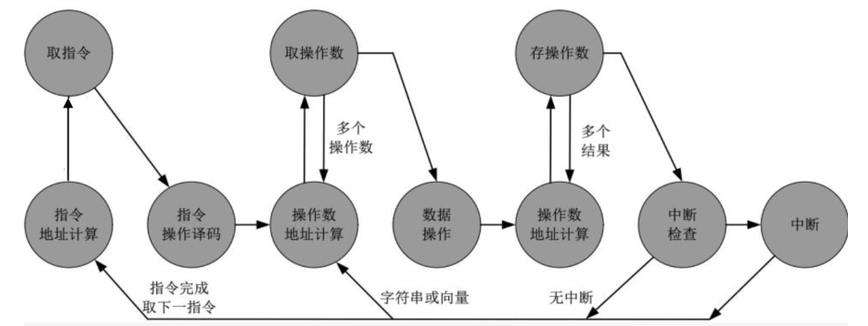

## 中断
1. 类型：
    - 程序中断（溢出、除0）
    - CPU定时器中断
    - IO中断
    - 硬件故障
2. 无中断程序：
    - CPU必须等待IO操作完成才能执行自己的下一条指令，图中的④表示为IO操作做准备的一系列指令，⑤表示IO操作完成后用来完成操作（收尾，比如设置标志之类）的一系列指令。
    - 
3. 中断：
    - CPU在调用IO时仅执行④（准备代码和实际IO指令），之后马上返回用户程序。
    - 在IO操作的过程中，CPU也在执行用户程序指令。
    - 在IO完成IO操作后，即IO准备好接受服务后，IO向处理器发出中断请求信号。
    - 处理器响应中断请求，挂起当前程序，执行中断处理程序（图中的⑤）。
    - 中断处理程序执行完成后，CPU恢复用户程序的执行。
    - 
4. 中断周期：指令周期的一部分
    - 处理器检查是否有中断请求，若没有，则执行下一条指令；若有，则：
        - 挂起当前程序，保存上下文；
        - 将PC设置为中断处理程序的起始地址；
        - 处理中断；
        - 恢复上下文并继续执行被中断的程序。
5. 多中断：两种解决方法
    - 禁止中断：
        - CPU在处理中断时禁止其他中断；
        - CPU处理完当前中断后检测是否还存在未响应的中断；
        - 中断严格按照顺序处理。
    - 定义优先级：高优先级中断可中断低优先级中断，嵌套处理。

## 计算机顶层互联
1. 内存：
    - 输入：读写控制信号，地址，数据
    - 输出：数据
2. IO模块：通过多个端口控制多个外设
    - 输入：读写控制信号，地址，来自计算机的数据，来自外设的数据
    - 输出：送给CPU的数据，送给外设的数据数据，中断信号
3.  CPU：
    - 输入：指令、数据、中断信号
    - 输出：地址、控制信号、数据

## 计算机总线：
连接两个及以上设备的共享的通信通道，一次只能有一个设备传输成功

1. 系统总线：连接主要计算机组件（CPU、M、IO）的总线
    - 系统总线又分为：
        - 数据总线：数据总线的宽度是决定系统整体性能的关键因素，称为字长。
        - 地址总线：地址总线的位宽决定了系统可能的最大内存容量。
        - 控制总线、控制对数据总线、地址总线的访问和应用。
2. 总线类型：
    - 专用总线：数据线和地址线分离
    - 复用总线：数据和地址共享线路，靠数据有效/地址有效控制。线路少，单控制复杂，性能低
3. 单一总线：传输延迟、总线带宽瓶颈
4. 总线仲裁：
    - 不止一个模块能控制总线，但同一时刻只有一个模块能控制总线。
    - 集中式：总线仲裁器控制总线的访问
    - 分布式：每个模块都能宣布对总线的控制
5. 时序
    - 同步时序：时钟信号决定事件发生，一个0-1变化称为一个总线周期，通常以上升沿同步，通常一个总线周期对应一个事件。
    - 异步时序：完全依赖线路引脚通知。
6. PCI Express
    - 高带宽、独立于处理器的总线，可用于中间层和外设总线，为高速IO子系统提供了更好的性能。（图形、网络、磁盘控制器）

# Ch4 Cache存储器

## Cache的传输单位
1. 字：存储器组织的天然单位，存储器单次传输所能传输数据的宽度
2. 可寻址单元：能唯一确定地址的最小单位。一般是字或字节。
    - 地址位数 $A$ 与可寻址单元个数 $N$：$2^A=N$
3. 传输单位：
    - 对主存：一次读出/写入存储器的位数，通常是数据总线宽度。
    - 对外存：以块为单位

## Cache访问数据单元的方式
1. 顺序访问：必须以特定线性顺序访问，访问时间高度变化。
    - 磁带
2. 直接访问：存储器中每个数据块有唯一地址，以此先通过块间跳转找到块，再在块内顺序搜索定位可寻址单元。访问时间变化。
    - 磁盘
3. 随机访问：存储器中每个可寻址位置都是唯一的，以此直接定位可寻址单元。访问时间固定。
    - 主存
4. 关联存取：属于随机访问类型的存储器，根据数据部分内容确定存储位置，存取时间与数据位置无关。
    - Cache

## Cache性能
1. 访问时间（延迟）：
    - 对随机访问存储器：读写操作所需时间
    - 对非随机访问存储器：定位时间
2. 存储器周期时间：随机访问存储器，访问时间+第二次访问开始前所需额外时间
3. 传输速率：通常以 $bit/s(bps)$为单位
    - 对随机：
        $$\text{传输速率}=\frac{1}{\text{周期时间}}$$
    - 对非随机：
        - $$T_n=T_A+\frac{n}{R}$$
        - $T_n=$ 读/写n位的平均时间；
        - $T_A=$ 平均访问时间；
        - $n=$ 位数；$R=$ 传输速率，以 $bps$ 为单位。

## Cache特性
- 越快越贵
- 越快越耗能
- 越大越慢
- 越大越便宜
- 越大越耗能

## 访问局部性原理：
- 在程序执行期间，CPU对指令、数据的访问往往比较集中，即在某一段时间内，CPU对某些指令或数据的访问频率较高，这种现象称为访问局部性。
    - 时间局部性：如果某个数据被访问过，那么在不久的将来，它很可能会再次被访问。
    - 空间局部性：如果某个数据被访问过，那么它附近的数据很可能会被访问。

## 存储器分层：
- 从上至下：
    - 容量越来越大
    - 每位价格越来越便宜
    - 速度越来越慢
    - 访问频率越来越低（依赖于访问局部性原理）

## Cache原理和操作：
- 主存由多个块构成，每个块包含 $K$ 个字。
- Cache由多个块构成，每个块称为一行，每行包括 $K$ 个字以及若干位标签、控制位（行的大小为 $K$ 个字，不算标签和控制位）。
- 主存和Cache之间以块为单位传输，Cache和CPU之间以字为单位传输。
- Cache读操作：
    - 检查数据是否在Cache中；
    - 若命中，直接访问Cache；
    - 若缺失，从主存中加载包含这个字的块，并将这个字送到CPU中，两个操作同时发生。
- Cache写操作：
    - 检查数据是否在Cache中；
    - 若命中，直接更新Cache行；
    - 若缺失，从主存中加载包含这个字的块，并更新Cache行。

## 主存块与Cache行之间的映射方式

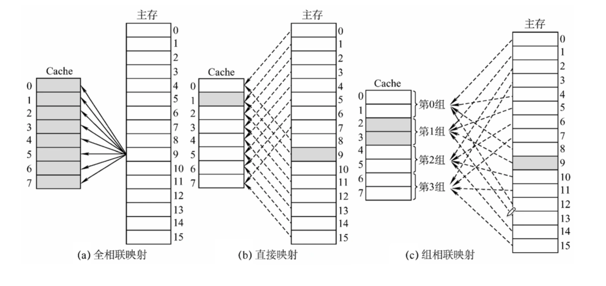

### 直接映射
$$i=j \mod m$$

$i=$ 高速缓存行号；$j=$ 主存块号；$m=$ 高速缓存行总数。

- 从主存来看：
    - 主存地址长度 = $(s+w)$ 位，其中最低 $w$ 位指定主存的一个块内的 $2^w$ 个字中的一个字/字节，剩下 $s$ 位指定主存内的 $2^s$ 个块中的一块
    - 可寻址单元个数 = $2^{(s+w)}$ 个字/字节
    - 块大小=行大小 = $2^w$ 个字/字节
- 从Cache来看：
    - 主存地址最高 $s$ 位 = 低 $r$ 位 + 高 $(s-r)$ 位，其中低 $r$ 位指定 Cache 的 $2^r$ 行中的一行，高 $(s-r)$ 位被当作标签存储。
    - Cache行数：$2^r$ 行
    - Cache大小：$2^{(r+w)}$ 个字/字节
    - 标签大小：$(s-r)$ 位
    - 即：$(s-r)$ 位标签 + $r$ 位Cache内行号 = $s$ 位主存块号

- 优点：简单便宜
- 缺点：任何给定块都只有固定的Cache存储位置。若程序需要访问的两个块正好映射到同一行，这两个块就会不断交换，降低命中率，称为抖动。

### 全关联映射：
允许每个主存块加载到任意Cache行，标签 = 主存块号

- 优点：命中率提高
- 缺点：访问时需要复杂电路并行检查全部行的标签

### K路组关联映射
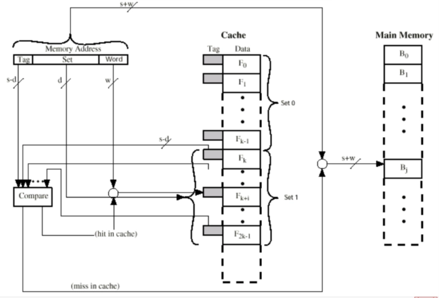

$$
\begin{aligned}
m=v \times k\\
i=j \mod v
\end{aligned}
$$

$i$ = Cache的组号；$j$ = 主存块号；$m$ = Cache中的行数；$v$ = 组数；$k$ = 每组中的行数。

- 从主存来看：
    - 主存地址长度 = $(s+w)$ 位，其中最低 $w$ 位指定主存的一个块内的 $2^w$ 个字中的一个字/字节，剩下 $s$ 位指定主存内的 $2^s$ 个块中的一块
    - 可寻址单元个数 = $2^{(s+w)}$ 个字/字节
    - 块大小 = 行大小 = $2^w$ 个字/字节

- 从Cache来看：
    - 主存地址最高 $s$ 位 = 低 $d$ 位 + 高 $(s-d)$ 位，其中低 $d$ 位指定 Cache 的 $2^d$ 组中的一组，高 $(s-d)$ 位被当作标签存储。
    - Cache组数：$v=2^d$ 行
    - Cache行数：$m=kv=k\times 2^d$
    - Cache大小：$k\times 2^{(d+w)}$ 个字/字节
    - 标签大小：$(s-d)$ 位
    - 即：$(s-d)$ 位标签 + $d$ 位Cache内组号 = $s$ 位主存块号

- 优点：灵活，标签较小，且只需并行比较组内的 $k$ 个标签

## 替换算法
当Cache已满而又有新块需要调入，就必须替换Cache中的块。

- 最近最少使用算法（LRU）
    - 替换组内在Cache中最久没有被引用过的块。以2路组关联为例，当组中一行被引用时，其USE位置1，另一行USE置0。替换时选择USE为0的行。
- 先进先出算法（FIFO）
    - 替换组内最早进入Cache的块。
- 最不经常使用（LFU）：
    - 替换组内使用频率最低的块。
- 随机
    - 随机选择组内的一个块进行替换。

## 写策略
- 通写（写直达）：所有写都会施加于Cache和主存。任何其他处理器和Cache都可以监视到主存的改变以维护一致性。
    - 优点：简单
    - 缺点：产生大量主存流量，让写变慢
- 回写：CPU写的更新仅在Cache中执行，此时USE为置1。当一个块被替换时，仅当USE位为1才会被写回主存。
    - 优点：最小化主存写操作
    - 缺点：部分主存在块替换前是无效的，IO存取只能通过Cache进行。

## 行/块大小
随着行大小从很小到较大，命中率先上升后下降。

- 原因：
    - 行较大时Cache中行数较少；
    - 行较大时离访问位置较远的字再次访问概率低（局部性原理）

# Ch5 内部存储器

## 半导体存储器类型
| 存储器类型 | 种类 | 可擦除性 | 写机制 | 易失性 |
| --- | --- | --- | --- | --- |
| 随机存储器(RAM) | 读-写存储器 | 电，字节级 | 电 | 易失 |
| 只读存储器(ROM) | 只读存储器 | 不能  | 掩模 | 不易失 |
| 可编程ROM(PROM) | 只读存储器 | 不能 | 电 | 不易失 |
| 可擦PROM(EPROM) | 读多次存储器 | 紫外线，字节级 | 电 | 不易失 |
| 电可擦PROM(EEPROM) | 读多次存储器 | 电，字节级 | 电 | 不易失 |
| 快闪存储器 | 读多次存储器 | 电，块级 | 电 | 不易失 |

注：SRAM和DRAM都需要持续供电。

## DRAM（动态RAM）
- 数据被存储为电容上的电荷
- 由于电容有漏电的天性，DRAM需要定期充电（刷新）。
- 结构简单，成本较低，速度较慢。常用于主存。

## SRAM（静态RAM）
- 用触发器逻辑门存储数据
- 不漏电，不需要定期刷新（但也需要持续供电！）
- 结构更复杂，成本更高，体积更大，但速度更快。常用于Cache。

## 存储器芯片组织
1. 位扩展：增加存储模块单次传输所能传输的位
    - N块芯片读取相同的地址，每块芯片同时输出其在相同行列位置上存储的数据（假设输出 $m$ bit），则存储模块的一个地址可以存储 $(N\times m)bit$ 数据。
    - 例：位扩展前，一个芯片只能输出 $1$ bit；位扩展后，$8$ 个芯片同时根据MAR信号输出 $8$ bit数据。
    - 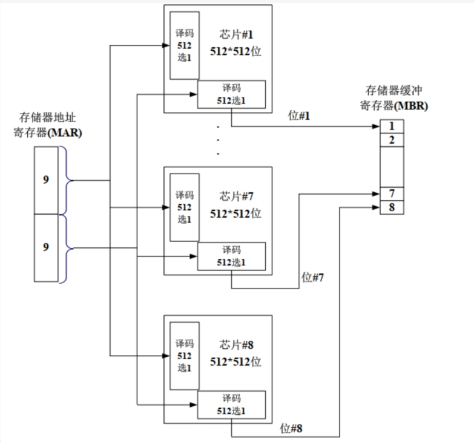
2. 字位扩展：增加存储模块的大小（即增加存储模块能够存储的字的数量）
    - 假设一组芯片有 $N$ 个，存储模块由 $M$ 组芯片构成，此时地址要增加 $\log_2 M$ bit，用于选择 $M$ 组芯片中的一组。
    - 
3. 字节级精度的访问
    - 存储模块一次传输能够传输 $N$ bit数据（一般 $N$ 为8的倍数）,则可以实现字节级精度访问。需要在原地址信号的基础上添加 $\log_2 \frac{N}{8}$ 位地址。
    - 以 $N=16$ 为例，此时地址新添加 $1$ 位作为最低位。
        - 若要读取 $16$ bit数据，且地址为偶数，则新添加的最低位置 $0$，可一次读取完成。
        - 若地址为奇数则新添加的最低位置 $1$，需要两次读取：CPU先读取奇数地址上的 $16$ bit，只保留A9-A16芯片上的 $8$ bit作为低 $8$ bit；CPU再将地址 $+1$ 读取 $16$ bit，只保留A1-A9芯片上的 $8$ bit作为高 $8$ bit。
4. 数据对齐
   - 例如，$2$ Byte的short型变量的地址通常为偶数，$4$ Byte的int型变量的地址通常为 $4$ 的倍数。
   - 否则，读取时CPU要进行两次读取。

## 纠错码
数据 $M$ bit，校验码/纠错码 $K$ bit，实际存储 $(M+K)$ bit。

### 以汉明码和文氏图为例
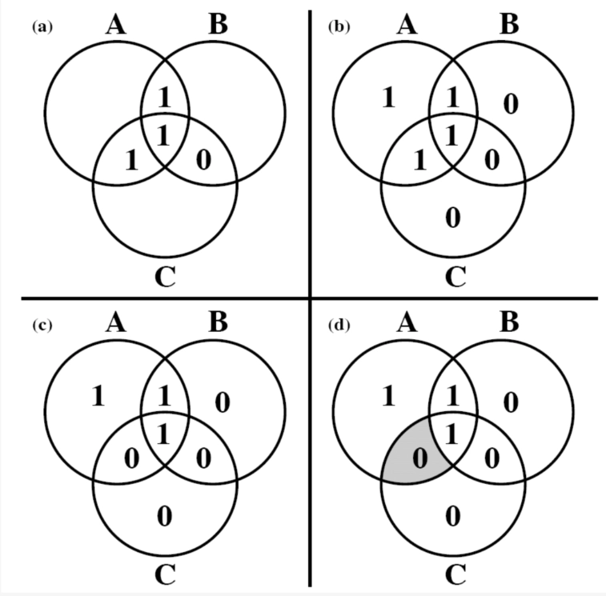

- 初始数据为 $1110$，放在 $A$、$B$、$C$ 三个圈相交位置；
- 在 $A$、$B$、$C$ 三个圈中生成纠错码，满足每个圈中四个数字异或结果为 $0$；
- 若传输过程中出现错误，可进行定位；
- 发现 $A$、$C$ 两个圈中异或结果不为 $0$，$B$ 异或结果为 $0$，则错误出现在与 $A$、$C$ 相交但不与 $B$ 相交的位置。

### 纠错码设计：
数据 $M$ bit，校验码/纠错码 $K$ bit，实际存储 $(M+K)$ bit，则应满足：$2^K-1≥M+K$

- 纠错码全 $0$ 表示 $(M+K)$ bit 数据都正常，因此 $K$ bit 纠错码能表示 $2^K-1$ 个数，要求 $K$ bit 纠错码必须能表示 $(M+K)$ bit 数据的位置，因此有上述关系式。

具体纠错过程为：

- 根据右图公式计算纠错码 $C8^\prime\ C4\prime\ C2\prime\ C1\prime$，与存储的原纠错码 $C8\ C4\ C2\ C1$ 一一异或，得到结果 $C8\prime\prime C4\prime\prime C2\prime\prime C1\prime\prime$
- 若只有一项异或结果为1，即只有一个纠错码与原纠错码不同，则错误出现在该纠错码上，翻转该纠错码即可。例如，若只有 $C8\prime\prime=1$，即 $C8\prime\prime\ C4\prime\prime\ C2\prime\prime\ C1\prime\prime=1000$，表示位置8出错，即 $C8$ 自身出错。
- 若有两项异或结果为1，即有两个纠错码与原纠错码不同，则错误出现在纠错码所表示的位置对应的数据上。例如，若 $C1\prime\prime=C4\prime\prime=1$，即 $C8\prime\prime\ C4\prime\prime\ C2\prime\prime\ C1\prime\prime=0101$，则错误出现在位置 $0101$ 对应数据，即 $D2$ 上；从右图的公式里也可以看到，只有 $D2$ 能同时影响 $C1 C4$。

# Ch6 外部存储器

## 磁盘数据组织
1. 磁道：一组同心圆环。相邻磁道间由磁道间隔隔开（防止相互干扰）。
2. 扇区：最小读写单位。一个磁道通常被划分成多个扇区，相邻扇区由扇区间隔隔开。

## 磁盘读写机制
由于角速度相同时，线速度外大内小，必须补偿，使得磁头读取所有的位的速度相同。

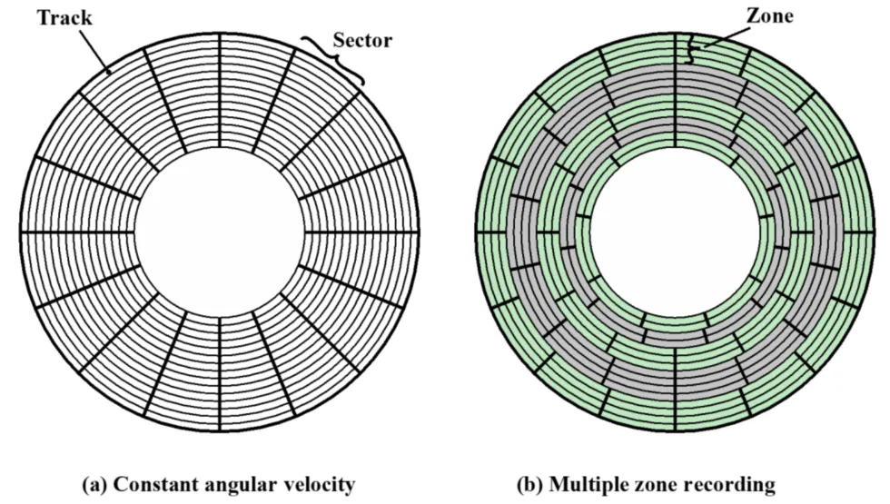

1. 恒定角速度：增大外层扇区间隔。
    - 优点：构造简单，磁头移到固定位置等待扇区来即可。
    - 缺点：浪费了外层磁道容量。
2. 多区段记录：每个区段包含多个磁道，区段内每个磁道位数固定，半径大的区段内的磁道比半径小的区段内的磁道容纳更多的位。同一区段的读取角速度相同，不同区段读取角速度不同。
    - 优点：充分利用磁道容量。
    - 缺点：需要更复杂的电路控制角速度。

## 寻找扇区
附加数据标记磁道和扇区，这些数据只对磁盘驱动器可见。

## 磁头
- 固定磁头：一个磁道一个磁头，安装在一个固定支架上
- 可移动磁头：每面一个，可伸缩支架

## 多盘片

## SSD
- 优点：高速启动，低噪音，机械可靠性更高
- 缺点：成本较高，容量较低，写入寿命较短

## 磁盘性能参数：
### 传送时间：
$$T=\frac{b}{rN}$$

其中：

- $b$ = 传送的字节数；
- $r$ = 磁盘旋转速率（转/秒）；
- $N$ = 每磁道字节数。

### 平均存取时间：
$$T_a=T_s+\frac{1}{2r}+\frac{b}{rN}$$

其中：

- $T_s$ = 平均寻道时间，指磁盘移动支架使磁头对准磁道所需时间；
- $\frac{1}{2r}$ = 平均旋转延迟，是磁道旋转半圈的时间。
    - 旋转延迟，指等待相关扇区旋转到磁头可读写位置的时间。
- $\frac{b}{rN}$ = 传送时间，指从磁道上读取或写入 $b$ 字节所需的时间。

## 磁盘调度算法
- 先来先服务算法（FCFS）：
    - 按照请求到达的顺序处理磁盘请求。
    - 优点：简单，公平。
    - 缺点：可能导致长时间等待，尤其是当请求分布不均时。
- 最短寻道时间优先算法（SSTF）：
    - 选择距离当前磁头位置最近的请求进行处理。
    - 优点：减少平均寻道时间。
    - 缺点：可能导致饥饿现象，即某些请求长时间得不到处理。
- 扫描算法（SCAN）：
    - 磁头在磁盘上来回扫描，处理沿途的请求。
    - 优点：减少平均寻道时间，避免饥饿现象。
    - 缺点：可能导致某些请求等待较长时间。
- 循环扫描算法（C-SCAN）：
    - 磁头在磁盘上来回扫描，但当到达一端时，磁头直接跳到另一端继续扫描。
    - 优点：提供更均匀的服务，避免了长时间等待。
    - 缺点：可能导致某些请求等待较长时间。

## 磁盘冗余阵列（RAID）
使用多个磁盘增加冗余提高可靠性，本质是一组物理磁盘驱动器，但被操作系统看作一整个逻辑驱动器

- 在阵列上条带分布
- 冗余磁盘用于存储校验信息

| RAID级别 | 描述 | 数据可用性 | 大型I/O数据传输能力 | 小型I/O请求率 | 需要的磁盘数 |
| --- | --- | --- | --- | --- | --- |
| 0 | 无冗余 | 无 | 非常高 | 低于单个磁盘 | N |
| 1 | 镜像 | 非常高 | 读操作可达单个磁盘的两倍；写操作与单个磁盘相同 | 读操作比单个磁盘高；写操作与单个磁盘相同 | 2N |
| 2 | 通过海明码冗余 | 所有列出的选择中最高 | 大约是单个磁盘的两倍 | 远高于单个磁盘；可与RAID 3、4、5相比较 | N+m（m与logN成正比） |
| 3 | 位交叉奇偶校验 | 所有列出的选择中最高 | 远高于单个磁盘；可与RAID 2、4、5相比较 | 大约是单个磁盘的两倍 | N+1 |
| 4 | 块交叉奇偶校验 | 无 | 远高于单个磁盘；可与RAID 2、3、5相比较 | 读操作与RAID 0相同；写操作明显低于单个磁盘 | N+1 |
| 5 | 块交叉分布奇偶校验 | 高 | 远高于单个磁盘；可与RAID 2、3、4相比较 | 读操作与RAID 0相同；写操作一般低于单个磁盘 | N+1 |
| 6 | 块交叉双分布奇偶校验 | 所有列出的选择中最高 | 读操作与RAID 0相同；写操作低于RAID 5 | 读操作与RAID 0相同；写操作明显低于RAID 5 | N+2 |

# Ch7 输入输出
## 外部设备
- 外部设备：计算机系统外部的设备，通常通过IO模块与计算机系统连接。
- 人可读的
    - 显示屏、打印机、键盘
- 机器可读的
    - 磁盘（功能上是存储器，但结构上被I/O模块控制）、传感器
- 通信设备
    - 网卡，调制解调器

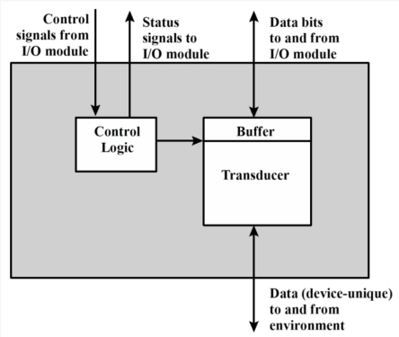

## IO模块
- 为什么需要IO模块
    - 各种外设操作逻辑、数据格式和字长都不一样，且运行速度比主存和CPU慢很多
- 主要功能
    - 通过系统总线或中央交换机与CPU和内存连接；
    - 通过定制数据线连接一至多个外设；
    - 具体包括：控制和定时，与CPU、内存和外设通信，数据缓冲，检错

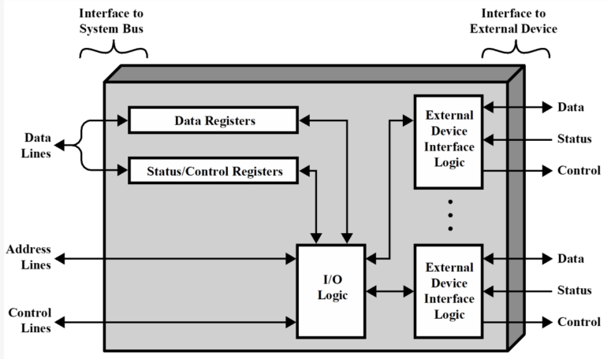

## 读IO步骤
- CPU查询IO模块状态
- IO返回设备状态
- 若设备就绪，CPU请求数据传输
- IO从外设处获取数据
- IO将数据放到数据总线上传给CPU

## IO设备寻址
1. 内存映射寻址：
    - 内存位置和IO设备共享同一个地址空间
    - CPU把IO模块的状态和数据寄存器看作内存位置
    - 访问内存和操作IO所需机器指令相同
2. 独立寻址：
    - CPU将内存和IO模块看作两个独立的地址空间
    - 需要IO或内存选择线控制
    - 需要特殊的IO命令操作IO

## IO技术
1. 可编程式IO：无中断，数据通过CPU传输，即IO-CPU-内存
    - 在IO模块操作未完成，CPU一直保持定期检查IO状态的周期，浪费CPU时间。

    
2. 中断驱动式IO：有中断，数据通过CPU传输，即IO-CPU-内存
    - CPU向IO模块发出命令后执行其他程序。当IO操作完成时，即IO模块就绪时，IO模块会向CPU发送中断请求，CPU响应中断请求并开始传输数据。
    - 无需CPU一直周期性检查，克服了CPU等待的问题。

    
3. 存储器直接存储（DMA）：有中断，数据通过DMA传输，即IO-DMA-CPU
    - DMA操作：CPU通知DMA相关命令，之后CPU执行其他程序；DMA负责传输数据；DMA传输完成后，向CPU发出中断请求。
    - 周期窃取：DMA必须在CPU不使用总线时，或迫使处理器挂起，才能够使用总线传输数据。一般地，CPU在访问总线前被挂起，DMA接管一个总线周期传输一个字，然后CPU继续访问总线。稍微降低了CPU速度，不是中断，CPU不用转换现场。

## 中断处理
- 中断认可信号是CPU告诉发出中断的IO：我已经收到了你的中断请求信号并开始处理，你可以停止发送中断请求信号了。
- PSW：程序状态字，一个寄存器，存储CPU状态。
- 软件部分：即中断服务程序（ISR）。

## 中断请求的定位和优先级
1. 多中断信号线法：直接在CPU与每个IO模块之间提供多中断信号线，一般不用，硬件太复杂。
2. 软件轮询法：CPU检测到中断后，执行中断服务程序，中断服务程序挨个轮询每个IO模块，找到所有发出中断的。
    - 优先级：由中断服务程序决定先处理哪个。
    - 优点：硬件简单，优先级安排、修改简单，灵活。
    - 缺点：速度慢。
3. 菊花链法（硬件轮询、向量）：所有IO共享一条中断请求线，但是中断响应线以菊花链形式连接各个IO模块。
    - CPU感知到中断后，发出中断响应信号，沿菊花链传播。
    - 当中断响应信号传播到某个IO模块时：
        - 若该IO发出了中断，则会在数据线上放向量（一个字，IO模块的地址或唯一标识符，CPU认为其指向适合的设备服务例程）。CPU会根据向量来定位IO模块并处理中断。该IO模块的中断处理完后，才会将中断响应信号传给下个IO模块；
        - 若该IO没有发出中断，则直接将中断响应信号传给下个IO模块；
    - 优先级：菊花链上游的IO模块中断优先级更高。是固定的，不灵活。
    - 优点：速度快。
    - 缺点：优先级固定，不灵活。
4. 总线仲裁（向量）：由中断控制器控制哪个IO模块能够获得总线控制权。IO模块只有获得总线控制权后才能发送中断，一次只有一个IO模块能发送中断，中断控制器检测到CPU的中断响应信号时，将发出中断的IO模块对应向量放到数据线上。

# Ch9 计算机算术

## 整数：2的补码法
- $N$ bit整数，最高位为符号位，0表示正数，1表示负数。
- 正数：最高位为0，剩下 $N-1$ 位为二进制。
- 负数：先写出对应正数，然后对 $N$ 位全部按位取反，再将其视作无符号数 $+1$。
- 表示范围：$N$ bit能表示：$[-2^{N-1},2^{N-1}-1]$范围内的整数。
- 符号填充：符号位移到新最高位，空余的，对正数填全0，对负数填全1。

## 整数的加减法
- 用加法实现减法
- 溢出规则：两个数相加，若他们同为正或同为负，当且仅当结果符号相反时发生上溢。

## 无符号乘法
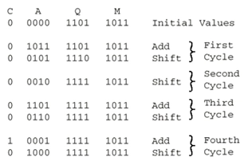

- $M\times Q=AQ$，$M$ 为被乘数，$Q$ 为乘数，$AQ$ 为结果，由寄存器 $A$ 和寄存器 $Q$ 拼接而成。
- 每个循环，若 $Q$ 最低位为1，则将 $M$ 加在 $A$ 上；若为0，则不相加。
- 然后将 $AQ$ 整体右移一位，$Q$ 最低位舍弃，$A$ 最高位为相加的溢出位。
- $Q$ 有几位，就执行几个循环。

## 有符号乘法：Booth算法
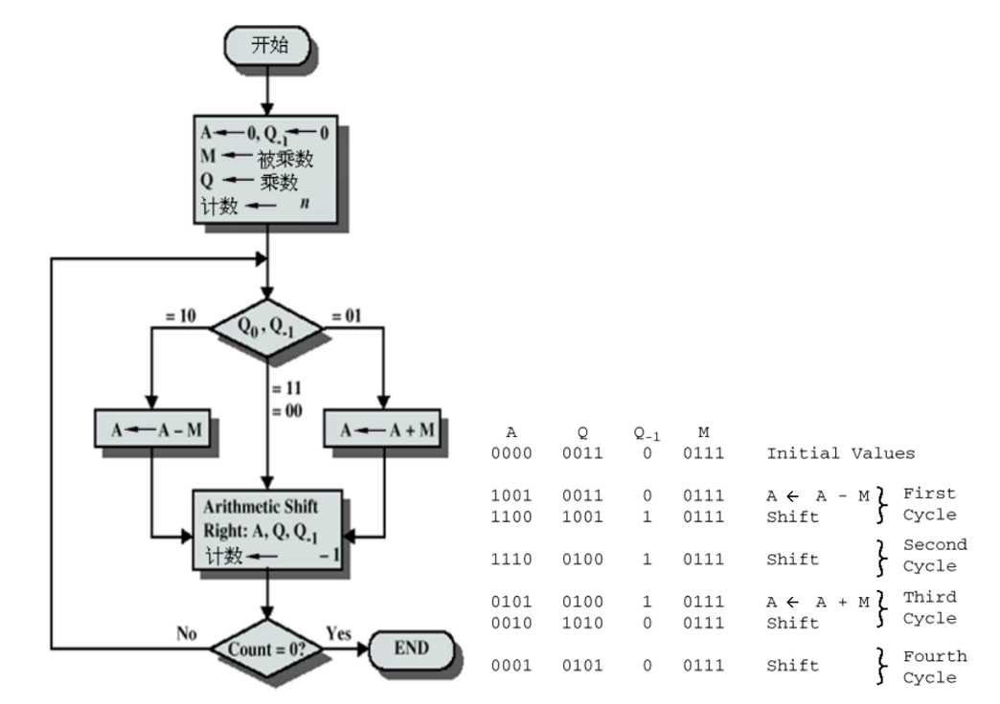

- $Q_0Q_{-1}=10$，则 $A=A-M$（记忆：最高位为1，负数，减），然后shift
- $Q_0Q_{-1}=01$，则 $A=A+M$（记忆：最高位为0，正数，加），溢出位舍去，然后shift
- $Q_0Q_{-1}=00$ 或 $11$，则直接shift
- Shift将$Q_{-1}$ 舍去，$Q_0$ 位移到 $Q_{-1}$，新最高位和原最高位相同。
- $Q$ 有几位，循环几个周期。最终结果为 $AQ$ 相拼接，不算 $Q_{-1}$！

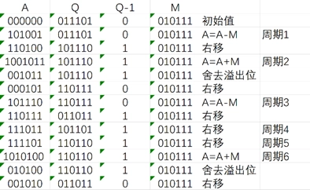

## 浮点数表示
以32bit为例：

- 1bit符号位 $m$ + 8bit指数 $E$（移码表示）+ 23bit有效数 $B$
    - 移码表示：$N$ bit二进制，按照无符号数理解，得到在$0~2^N-1$之间的整数，再减去一个固定的偏阶（为$2^{N-1}-1$），得到真正的指数，范围为$-2^{N-1}+1~2^{N-1}$
        - 8bit 范围为-127~+128
- 规格化数：有效数的最高位一定为1，且不实际存储到内存中。因此，23bit有效数 $B$ 实际表示24bit，表示一个二进制小数：1.B
- 综上，浮点数被表示为：$(-1)^m×1.B×2^{E-2^{N-1}+1}$
- 范围：
    - 以32bit为例：正数在$2^{-127}~(2-2^{-23})×2^{128}$，负数在$-(2-2^{-23})×2^{128}~-2^{-127}$
    - 因此有正上溢、正下溢、负上溢、负下溢

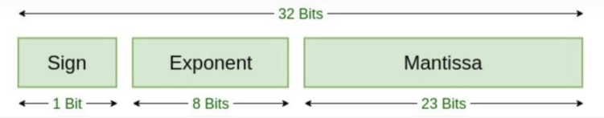

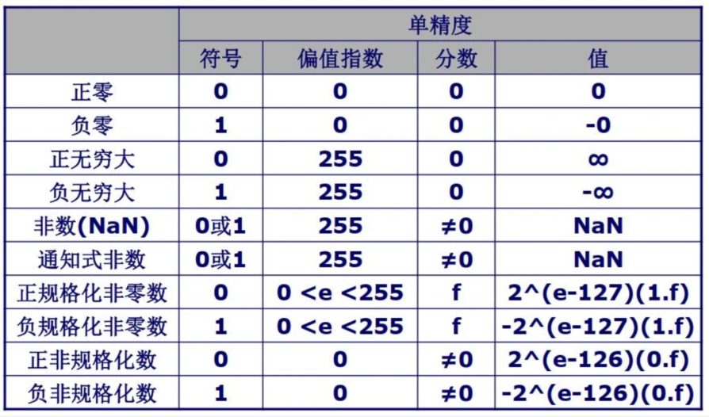

### IEEE754的一些特殊表示:
- 当$E=0$且$M=0$时,表示0。
- 当$E=0$且$M≠0$时,表示非规格化数(下溢数)。
- 当$E=255$且$M=0$时,表示∞。
- 当$E=255$且$M≠0$时, 表示NAN。

## 浮点数加减法：
1. 零检查
    - 若是减法运算，则改变减数符号并改为加法运算。若某个操作数为0，则另一个操作数直接作为结果。否则，将存储的23bit有效数扩充成24bit实际有效数。
2. 对齐
    - 若两数指数不相等，则增加较小的指数，并右移其有效位数。若此过程中出现有效位数为0，则另一个数直接作为结果。
3. 有效数相加
    - 即1.B相加。若产生上溢，则右移有效位数并增加指数。若此操作产生了指数上溢，报错。
4. 规格化
    - 若加法结果最高位不为1，则左移有效位数并减小指数。若此操作产生了指数下溢，报错。

注：有效数右移时可以在右边增加保护位以确保精度。

## 浮点数乘法
1. 预处理
    - 零检查：若有一个操作数为 $0$，则另一个操作数直接作为结果。
    - 符号位计算：$m = m_1 \oplus m_2$，即两个操作数的符号位进行异或运算。
    - 规格化
2. 指数相加
    - $E = E_1 + E_2 - 127$，即两个操作数的指数相加后减去偏阶。
3. 有效数相乘
    - $B = B_1 \times B_2$，即两个操作数的有效数相乘。
4. 规格化
    - 若乘法结果的有效数最高位不为 $1$，则左移有效位数并减小指数。若此操作产生了指数下溢，报错。
    - 若乘法结果的有效数最高位为 $1$，则直接将结果存储为 $1.B$ 的形式。

## 浮点数除法
1. 零检查
2. 指数相减
    - $E = E_1 - E_2 + 127$，即被除数的指数减去除数的指数后加上偏阶。
3. 判断溢出
4. 有效数相除
5. 规格化

# Ch10 指令集：特征和功能

## 机器指令的要素
- 操作码
- 源操作数引用
- 结果操作数引用
- 下一条指令引用

## 操作数个数
- 三地址：操作数1，操作数2，结果，$c=a+b$
- 双地址：其中一个地址既是操作数也存储结果，$a=a+b$
- 单地址：寄存器操作
- 零地址：pop，push等
- 更多的地址：更复杂强大的指令，更复杂的CPU，更少的程序指令数
- 更少的地址：更简单的指令和CPU，更多的程序指令数

## 移位操作
1. 逻辑移位
    - 逻辑右移1位相当于：无符号整数除以2
    - 逻辑左移1位相当于：无符号整数乘以2
    - 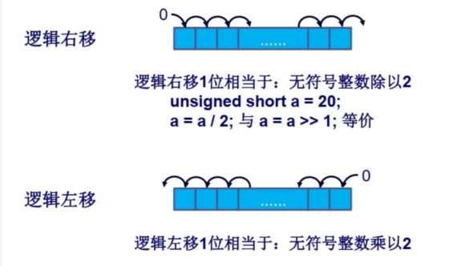
2. 算数移位
    - 算术右移1位相当于：带符号整数除以2
    - 算术左移1位相当于：带符号整数乘以2
    - 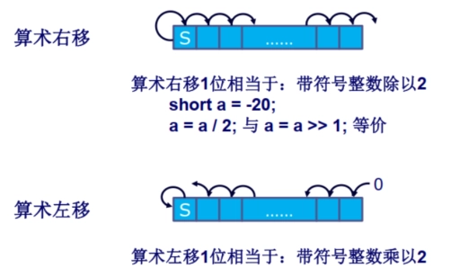
3. 循环移位：
    - 保留所有被处理的位，检查某一位的状态，高低位交换
    - 循环右移 & 循环左移
    - 

## 数端
- 大数端(big-endian ordering)：最高有效字节存放在最低的地址上
- 小数端(little-endian ordering)：最高有效字节存放在最高的地址上

## 内存对齐
- 内存对齐是指数据在内存中存放时，地址必须是某个特定值的倍数，以提高访问效率。
- 例如，32位数据要求在4字节对齐的地址上存放，64位数据要求在8字节对齐的地址上存放。

# Ch11 指令集：寻址方式和指令模式
### 符号说明：
- $A$：指令中出现的地址/数据的内容
- $R$：指令中出现的寄存器存储的地址/数据的内容
- $EA$：被访问位置的实际有效地址
- $(X)$：位置$X$的内容

## 立即寻址
- 操作数 = $A$
- 优点：不要求存储访问，速度快
- 缺点：操作数范围受限

## 直接寻址
- $EA = A$，即实际访问位置的地址写在指令中。
- 优点：只需要一次内存引用。
- 缺点：地址范围受限。
- 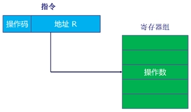

## 间接寻址
- $EA = (A)$，即指令中存储的地址指向一个内存位置，该位置存储着实际访问位置真正的地址。
- 优点：地址范围更大。
- 缺点：需要两次内存引用（第一次获取真正地址，第二次获取实际数据）。
- 

## 寄存器寻址（类似直接寻址）
- $EA = R$，即指令中存储的地址指向一个寄存器，实际访问内容存储在该寄存器中。
- 优点：无需内存引用；指令中寄存器地址通常较短。
- 缺点：寄存器地址空间有限。

## 寄存器间接寻址（类似间接寻址）
- $EA = (R)$，即指令中存储的地址指向一个寄存器，该寄存器存储着实际访问位置的真正地址。
- 优点：地址范围更大；相比间接寻址只需一次内存访问；指令内地址更短。
- 

## 偏移寻址（寄存器间接寻址和直接寻址的结合）
- $EA = (R) + A$，实际地址由寄存器内容与指令内地址相加得到。
    - 相对寻址：
        - $R = PC$，$A$ 为补码，有效地址 = 指令地址 + 偏移量（可正可负）。
    - 基址寄存器寻址：
        - $(R)$ 为基址，$A$ 为偏移量（相对寻址是其特例）。
    - 变址寻址：
        - $A$ 为基址，$(R)$ 为偏移量，常用于迭代场景。
- 

## 堆栈寻址
- 操作数在栈顶，通过指令隐式对栈顶进行操作
- 本质是通过存储在寄存器中的栈指针进行寄存器间接寻址，对栈顶元素进行操作。

# Ch12 CPU结构和功能

## CPU内部结构
- 包含ALU（算术逻辑单元）、CU（控制单元）、寄存器组、状态标志等。
- 内部处理器总线用于在ALU和寄存器间传递数据，因ALU仅能操作CPU内部存储数据。

## 寄存器组织
1. 用户可见寄存器：
   - 通用寄存器：多功能用途。
   - 数据寄存器：仅存储数据。
   - 地址寄存器：可能通用或专用于特定寻址模式（如栈指针）。
   - 设计问题：通用化灵活但指令长；专用化指令短但不灵活；寄存器数量过少需频繁访存，过多则收益不显著。
2. 控制和状态寄存器：
   - 程序计数器（PC）：保存下条指令地址。
   - 指令寄存器（IR）：存储最近读取的指令。
   - 内存地址寄存器（MAR）：保存地址，与地址总线直接相连。
   - 内存缓冲寄存器（MBR）：保存数据，与数据总线直接相连。
   - 程序状态字（PSW）：包含条件码等状态信息。

## 指令周期的数据流
1. 取指周期
    - 下条指令地址：PC → MAR → 地址总线 → 主存。
    - 指令：主存 → 数据总线 → MBR → IR，同时PC++（除非指令修改PC）。
    - 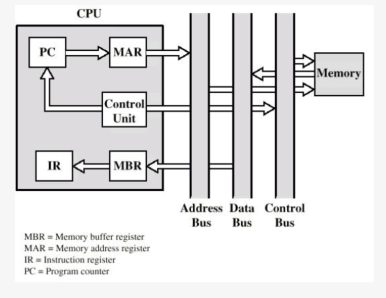
2. 间接周期（如有）
    - MBR的低N位 → MAR → 地址总线。
    - 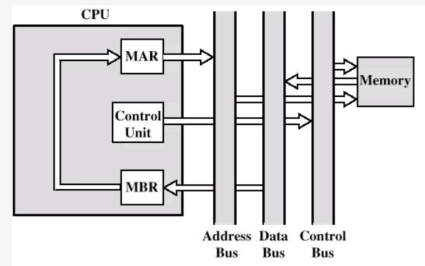
3. 执行周期
    - 复杂多样，取决于具体指令。
4. 中断周期
    - PC复制到MBR，特定地址由控制单元给MAR，MBR数据存至主存。
    - PC装载中断服务程序地址
    - 

## 流水线技术
1. 经典六阶段流水：
    - 取指令(FI)
    - 指令译码(DI)
    - 计算操作数(CO)
    - 取操作数(FO)
    - 执行指令(EI)
    - 写操作数(WO)
2. 条件转移与流水线总清：
    - 条件转移可能导致流水线停顿，需清空流水线并重新取指。
    - 
3. 流水线性能增强的限制：
    - 访存冲突（FI，FO，WO）
    - 每个指令执行时间不完全相同
    - 转移指令
    - 中断
4. 流水线阶段并非越多越好：阶段越多开销越大，单指令执行时间越长，且相关性更复杂。
5. 流水线性能
    - 流水线周期时间：通过流水线把一组指令推进一个阶段所需时间 $$\tau = \tau_m + d$$ 其中$\tau_m$ 为最大阶段延迟，$d$ 为锁存器延迟（通常可忽略）。
    - n条指令总时间：$$T_{k,n} = [k + (n-1)]\tau$$（k阶段流水线，无分支）。
    - 加速比：$$S_k = \frac{nk\tau}{[k + (n-1)]\tau} = \frac{nk}{k + n - 1}$$ 当$n\rightarrow\infty$时，$\lim S_k = k$。

6. 流水线冲突：流水线由于条件不允许继续执行而停顿
    - 资源冲突：
        - 访存冲突（FI/FO/WO同时请求内存）
        - ALU冲突（多条指令同时需ALU）
    - 数据冲突：
        1. 写后读（RAW）：前指令修改数据，后指令读取时数据未更新。
        2. 读后写（WAR）：后指令写数据时，前指令尚未读取该数据。
        3. 写后写（WAW）：后指令写数据覆盖前指令未完成的写操作。

## 条件分支处理
- 多指令流：复制流水线初始部分，同时取两条指令，但可能引发资源争用。
- 预取分支目标：识别转移时取两个分支指令，仅做取指和译指直至某分支执行。
- 循环缓冲区：存储最近取的顺序指令，转移时检查目标是否存在，适用于循环。
- 分支预测：
    - 静态预测：如预测从不跳转、总是跳转、按操作码预测。
    - 动态预测：如1位预测（根据上次跳转预测）、2位预测（连续两次失败才反转预测）。

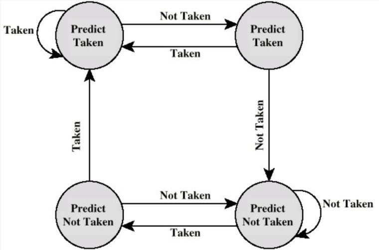

## 转移历史表
- 在预测分支并取来转移目标指令时，条件转移语句还没完成译指、计算操作数，无法得到转移目标语句的地址。
- 转移历史表：通过表格维护转移目标
    - 分支语句的地址
    - 转移目标语句的地址
    - 转移历史位
- 预测转移时：
    - 从表中直接查询得出转移目标地址
    - 如果该分支语句在表中不存在：等到操作数计算完成后，加入表中

# Ch13 精简指令集计算机RISC

## RISC的主要特性
- 大量通用寄存器，使用编译器优化寄存器用法。
- 有限、简单的指令集。
- 强调优化指令流水线。

## 现代精简指令集的特点
- 每个机器周期一条指令。
- 寄存器-寄存器操作。
- 简单的寻址模式和指令格式。

## CISC
1. 朝向CISC的原因：
    - 出现了功能强大的复杂高级程序设计语言（HLL）
    - 导致程序设计语言与汇编语言之间的语义间隙增大
    - 出现了更复杂的机器指令、寻址方式，硬件实现的HLL语句
2. CISC的目标：
    - 提高执行效率
    - 简化编译
    - 用复杂的机器指令执行复杂的HLL语句

## 对HLL操作的研究

- HLL操作动态频度：过程调用在机器指令加权和存储器加权下占比很高，尤其存储器加权场景。
- 操作数：局部标量变量占多数，数组/结构次之。
- 过程调用：
    - 非常耗时的原因：
        - 过程传递的参量和变量数、过程嵌套深度
        - 大部分过程调用的传送的参变量、使用的局部标量变量不多
        - 很少出现长的一系列调用跟着一系列返回
- 结论：
    - 过程调用是HLL中最耗时的操作，应该优化
    - 优化方法：优化寄存器的使用（从而减少访存）；优化流水线（减少分支影响）；

## 优化方法
### 大寄存器组（硬件方案）
- 依据/适用情况：参数、局部变量少，调用深度有限
- 寄存器（几百个）分为很多个组，每个过程对应一组寄存器
- 发生过程调用时，直接切换到另一个寄存器组（将过程调用优化为寄存器访问）
- 对程序，任何时刻只有一组寄存器可见
- 解决参数和返回值传递：

    
- 解决全局变量：用一组全局寄存器，所有过程可见
- 解决深度过深：将一部分寄存器存储在内存中
- 进一步优化：环形寄存器组织

    

### 寄存器优化（软件方案）
1. 编译器的优化
    - 编译器为每个变量指派一个虚拟寄存器
    - 并通过某种方法将虚拟寄存器映射到真实寄存器
    - 生命周期不重叠的虚拟寄存器可以共享同一个真实寄存器
    - 实在安排不下，就考虑内存
2. 实现方法：图着色法
    1. 画点，每个点代表一个虚拟寄存器
    2. 连线，在两个生命周期有重叠的虚拟寄存器之间连线
    3. 着色，若有n个真实寄存器，则尽量用n种颜色给图上色，要求相邻（有连线）的节点颜色不能相同；无法上色的节点就存在内存里。

    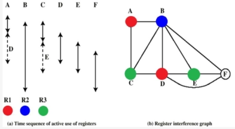

## RISC流水线
### 流水线的效果

### 流水线优化
- 空指令（NOOP）：在流水线阶段插入空操作，解决数据相关性，保证指令顺序执行。
    - 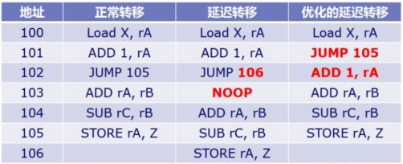
- 延迟转移：交换分支指令与前序指令位置，使分支延迟期间执行有效指令，适用于无条件分支。
    - 
- 循环展开

# Ch14 指令级并行性和超标量处理器

## 超标量和超流水的区别
- 超标量：多条指令同时启动独立执行，即多条流水线
- 超流水：流水线阶段时间短于时钟周期，内部时钟速率加倍，外部周期内发两条指令。

## 指令相关性
1. 数据相关性：访问操作数的位置有冲突
    1. 写后读（RAW）或真相关：
        - 一条指令修改寄存器或内存位置，后续指令读取该内存或寄存器位置中的数据。
        - 冲突：写操作完成之前发生了读操作
    2. 读后写（WAR）或反相关
        - 冲突：读操作发生前完成了写操作
        - 乱序发射会造成读后写冲突（按序发射一定不会出现前面的指令还没开始执行后面的指令已经执行完成的情况）
    3. 写后写或输出相关
        - 冲突：写操作的顺序与预期顺序相反
        - 乱序完成会造成写后写冲突
2. 过程相关性
    - 即转移后的指令不能再转移指令未执行前执行
    - 超标量中，若某条流水线上发生了分支预测错误，则所有流水线上都要进行流水线总清！
3. 资源相关性
    - 访存冲突、ALU冲突

## 乱序执行
- 按序发射按序完成：指令按顺序发射和完成，可能因相关性停顿。
- 按序发射乱序完成：指令按序发射，完成顺序可乱序，可能会造成写后写相关性，引发WAW冲突。
- 乱序发射乱序完成：指令发射顺序可乱序，需指令窗口检测相关性，可能会造成读后写相关性，引发WAR冲突。

## 寄存器重命名：解决写后写和读后写相关性
- 产生写后写相关性和读后写相关性的原因：
    - 寄存器值不再反应程序流顺序
- 解决方法：
    - 寄存器重命名
		- 由CPU硬件动态分配寄存器
		- 每产生一个新的寄存器值就分配一个新的真实寄存器

# Ch17 并行处理

## 并行处理机分类
- 单指令单数据流（SISD）：传统单处理器。
- 单指令多数据流（SIMD）：同一指令对不同数据组在不同处理器执行。
- 多指令单数据流（MISD）：未实现。
- 多指令多数据流（MIMD）：分为紧耦合、松耦合。

## 紧耦合
- 处理器共享存储器，通过共享存储器相互通信

### 对称多处理器（SMP）
1. 定义
    - 共享内存、IO，通过共享总线分时共享
    - 存储器在任何范围内的存储时间对各个处理器大致相同
    - 所有处理器能完成同样的功能(对称)，地位平等
    - 系统由一个集中式操作系统控制
2. 优点：
    - 性能好，可以并行执行
    - 可用性，单个故障总体不会停机
    - 增量式增长和可扩展性

### 非一致性内存访问（NUMA）
存储器在不同范围内的存储时间对不同处理器是不同的

## Cache一致性问题与MESI协议
1. 问题：
    - 同一数据在不同的Cache中都有副本
    - CPU读取数据时会先检查Cache，导致不同的CPU眼里的内存不一样
    - 回写显然会导致不一致，写直达也会，不过可以通过监听消除
2. 目录协议
    - 收集维护有关数据块的副本放在哪里的信息
    - 目录放在主存中
    - 优点：适用于多总线或复杂的大型系统
    - 缺点：产生了中央瓶颈
3. 监听协议
    - Cache必须识别每一行是否共享、是否与主存相同
    - 优点：适合使用总线的多处理机
    - 缺点：增大了总线传输量
    - 有两种策略：
        1. 写-失效：适用于回写
            - 多个监听者，单个修改者
            - 某Cache写操作时，其他Cache中的该行数据失效
            - 发出写操作的处理器将获得数据独享直到其他Cache访问该行
            - 例子：MESI协议
        2. 写-更新：适用于写直达
            - 多个读者，多个写者
            - 更新的字被广播到其他Cache

### MESI协议
- M（Modified）：已修改，数据仅在本Cache，未写回主存。
- E（Exclusive）：独占，数据在本Cache和主存，其他Cache无副本。
- S（Shared）：共享，数据在本Cache和主存，其他Cache有副本。
- I（Invalid）：失效，数据不在本Cache或已过时。

## 松耦合（如集群）
- 独立处理器或SMP互联，分布式存储器，通信通过网络。
- 优点：可扩展性强、可用性高、性价比高。

## 集群与SMP对比
- 共同点：
    - 提供多处理器支持高端应用
    - 均商用化，SMP历史更久。
- SMP优点：
    - 易于配置管理
    - 接近单处理器模型
    - 占用物理空间小
    - 耗电少
    - 稳定
- 集群优点：
    - 运行中可增减机器
    - 高增量
    - 绝对可扩展性强
    - 高可用性