> 本笔记基于上海交通大学 *许可老师* 2025-2026 学年秋季学期教学内容及课件进行整理，部分图片来源于网络，如有侵权请联系删除。


- 数据链路层
    - [IEEE 802.3](#以太网的-mac-层)（以太网）：无连接，**以太网的核心 MAC 层协议**，采用 CSMA/CD 机制实现有线局域网的多设备共享信道，是目前应用最广泛的有线局域网标准。
    - [PPP](#点对点协议-ppp)（点对点协议）：有连接，**面向点到点链路的数据链路层协议**，通过 LCP 建立连接、NCP 协商网络参数，常用于拨号上网、路由器专线等场景。
- 网络层
    - [IP](#网际协议-ip)（网际协议）：无连接，**TCP/IP 协议栈的核心网络层协议**，提供“尽力而为”的无连接数据包传输，通过 IP 地址实现跨网络的寻址和路由转发。
    - [IPv6](#网际协议第-6-版-ipv6)（网际协议第 6 版）：无连接，**IPv4 的升级版本**，拥有更大的地址空间、更优的路由机制和内置安全特性，解决IPv4地址枯竭问题。
    - [ARP](#地址解析协议-arp)（地址解析协议）：无连接，**局域网内的地址映射协议**，通过广播请求将目标 IP 地址转换为对应的 MAC 地址，实现链路层寻址。
    - [ICMP](#网际控制报文协议-icmp)（网际控制报文协议）：无连接，**IP 协议的辅助协议**，用于在 IP 网络中传递差错报告、控制信息和诊断报文（如 ping 命令的核心协议）。
    - [RIP](#路由信息协议-rip)（路由信息协议）：无连接，**距离矢量型内部网关协议**，以“跳数”为度量值计算最优路径，配置简单，适用于小型局域网。
    - [OSPF](#开放最短路径优先协议-ospf)（开放最短路径优先协议）：有连接，**链路状态型内部网关协议**，通过 Dijkstra 算法计算最短路径，收敛快、开销小，适用于大型企业网络。
    - [BGP](#边界网关协议-bgp)（边界网关协议）：有连接，**路径矢量型外部网关协议**，基于 TCP 建立连接，用于不同自治系统（AS）之间的路由信息交换，是互联网骨干网的核心路由协议。
    - [IGMP](#网际组管理协议-igmp)（网际组管理协议）：无连接，**IP 多播组管理协议**，用于主机与路由器之间的多播组成员关系维护，支持多播数据的高效传输。
    - [多播路由选择协议](#多播路由选择协议)：无连接，**支持 IP 多播数据传输的路由协议**，包括 DVMRP、PIM 等，实现多播数据在网络中的高效分发。
- 运输层
    - [TCP](#传输控制协议-tcp)（传输控制协议）：有连接，**面向连接的可靠传输协议**，通过三次握手建立连接，提供确认、重传、排序、流量控制等机制，保证数据的完整、有序传输。
    - [UDP](#用户数据报协议-udp)（用户数据报协议）：无连接，**无连接的不可靠传输协议**，仅对应用层数据做简单封装，开销小、传输效率高，适用于实时性要求高的场景。
- 应用层
    - [DNS](#域名系统-dns)（域名系统）：基于 UDP/TCP，无连接/有连接，**互联网的核心域名解析协议**，默认使用 UDP 实现快速域名到 IP 的映射，大报文查询时使用 TCP 保证可靠性。
    - [FTP](#文件传输协议-ftp)（文件传输协议）：基于 TCP，有连接，**面向连接的文件传输协议**，通过控制连接和数据连接分离的方式，实现可靠的文件上传、下载和管理。
    - [TFTP](#简单文件传输协议-tftp)（简单文件传输协议）：基于 UDP，无连接，**轻量级文件传输协议**，协议结构简单、开销小，适用于小型文件传输和嵌入式设备场景。
    - [TELNET](#远程终端协议-telnet)（远程终端协议）：基于 TCP，有连接，**远程终端访问协议**，通过明文传输实现对远程设备的命令行控制，安全性较低，常用于局域网设备管理。
    - [HTTP/HTTPS](#超文本传输协议-http)（超文本传输协议）：基于 TCP，有连接，**万维网的核心应用层协议**，通过请求-响应模式传输超文本数据，HTTPS 通过 SSL/TLS 实现加密传输。
    - [SMTP](#简单邮件传输协议-smtp)（简单邮件传输协议）：基于 TCP，有连接，**电子邮件发送协议**，负责将邮件从客户端发送到邮件服务器，或在服务器之间转发邮件。
    - [POP3](#pop3-协议)（邮局协议第3版）：基于 TCP，有连接，**电子邮件接收协议**，采用“下载后删除”的模式，将邮件服务器的邮件下载到本地客户端。
    - [IMAP](#imap-协议)（互联网消息访问协议）：基于 TCP，有连接，**高级电子邮件接收协议**，支持邮件在服务器端的管理和同步，允许多设备访问同一邮箱。
    - [DHCP](#动态主机配置协议-dhcp)（动态主机配置协议）：基于 UDP，无连接，**IP 地址自动分配协议**，通过广播方式为局域网内设备自动分配 IP 地址、子网掩码、网关等网络参数。
    - [SNMP](#简单网络管理协议-snmp)（简单网络管理协议）：基于 UDP，无连接，**网络设备管理协议**，通过 Get/Set/Trap 等操作实现对网络设备的监控、配置和告警，适用于路由器、交换机等设备的管理。
    - [BT](#分散定位和分散传输技术)（比特洪流协议）：基于 UDP，无连接，**点对点文件共享协议**，通过分块传输和多源下载实现高效的文件分发，广泛应用于大文件传输和内容分发网络（CDN）。


# 计算机网络概述
## 互联网概述
### 基本概念
- **网络（Network）** 由若干 **结点（Node）** 和连接这些结点的 **链路（Link）** 组成。
- **internet**（互连网）：通用名词，泛指多个计算机网络互连而成的计算机网络，对网络间的协议没有要求。
-  **Internet**（互联网、因特网）：专有名词，指全球范围的众多网络互连而成的特定的互连网，采用 TCP/IP 协议族。互联网的两个重要基本特点是**连通性和资源共享**，是 Internet 提供诸多服务的基础。
- **Ethernet**（以太网）：当今现有**局域网**采用的最通用的通信协议标准。

### 发展历程
- **ARPANET**：1968年出现，最初只是一个单个的分组交换网，不是一个互连网。1983 年，**TCP/IP** 协议成为 ARPANET 上的标准协议， 使得所有使用 TCP/IP 协议的计算机都能利用互连网相互通信。
    - 人们将 **1983 年作为互联网的诞生时间**
- **国家科学基金网** NSFNET ：三级结构： **主干网、地区网和校园网**（或企业网），覆盖了全美国主要的大学和研究所，并且成为互联网中的主要组成部分。
- **互联网服务提供者** ISP（Internet Service Provider）：提供接入到互联网的服务并需要收取一定的费用
    - 其具有**多层次 ISP 结构**：主干 ISP、地区 ISP 和本地 ISP，其区分依据是覆盖面积大小和所拥有的 IP 地址数目的不同
- **万维网** WWW（World Wide Web）：由欧洲原子核研究组织 CERN 开发，成为互联网指数级增长的主要驱动力

### 因特网的标准化
- 因特网所有的 **RFC**（Request For Comments）技术文档都可从因特网上免费下载
    - 任何人都可以随时用电子邮件发表对某个文档的意见或建议
    - 但**并非所有的 RFC 文档都是互联网标准**， 只有很少部分的 RFC 文档最后才能变成互联网标准
- 组织架构
    - **因特网协会** ISOC：负责对因特网进行全面管理，以及在世界范围内促进其发展和使用
    - 因特网体系结构委员会 IAB：负责管理因特网有关协议的开发
    - 因特网工程部 IETF：负责研究中短期工程问题，主要针对协议的开发和标准化
    - 因特网研究部 IRTF：从事理论方面的研究和开发一些需要长期考虑的问题
    - 

## 互联网的组成
### 边缘部分（资源子网）
- 组成：连接在互联网上的所有主机，又称为**端系统**（end system）
- 作用：用户直接使用的，用来进行通信（传送数据、音频或视频）和资源共享。
- 端系统间的通信：主机 A 的某个进程和主机 B 上的另一个进程进行通信，通信方式有 C/S 和 P2P 两种方式。
    - **客户服务器通信方式** C/S（Client/Server）：
        - 描述的是进程之间**服务和被服务**的关系。
        - 客户是服务的请求方，服务器是服务的提供方。
        - 客户与服务器的通信关系建立后，通信**可以是双向的**，客户和服务器都可发送和接收数据。
        - 特点：
            - **客户**程序
                - **被用户调用**后运行，需**主动**向远地服务器发起通信（请求服务）
                - **必须知道服务器程序的地址**
                - 不需要特殊的硬件和很复杂的操作系统
            - **服务器**程序
                - 专门用来提供某种服务的程序，可同时处理多个客户请求
                - 一直**不断地运行着**， **被动**地等待并接受来自各地的客户的通信请求
                - **不需要知道客户程序的地址**
                - 一般需要强大的硬件和高级的操作系统支持
    - **对等连接方式** P2P（Peer-to-Peer）：
        - 两台主机在通信时**不区分服务请求方和服务提供方**。
        - 只要都运行了 P2P 软件，就可以进行**平等的、对等连接通信**。
        - P2P 从本质上看仍然是使用 C/S 方式，只是对等连接中的每一个主机**既是客户又是服务器**

### 核心部分（通信子网）
- 组成：大量网络和连接这些网络的路由器
- 作用：**为边缘部分提供服务**（提供连通性和交换）。
- 特点：是互联网中**最复杂**的部分
- **路由器（router）**
    - 在网络核心部分起特殊作用
    - 实现**分组交换**（packet switching）的关键构件，其任务是转发收到的分组。
    - **分组转发是网络核心部分最重要的功能**

## 互联网的三种交换方式
- 互联网的核心部分采用**分组交换技术**

### 电路交换
- **有连接**：电话交换机接通电话线的方式，直接进行两两连接，因此 $N$ 台计算机就需要 $\frac{N(N-1)}{2}$ 对电线。
- 使用交换机
    - 当电话机的数量增多时，使用电话交换机将这些电话连接起来。
    - 每一部电话都直接连接到交换机上，而交换机使用交换的方法，让电话用户彼此之间可以很方便地通信。
- 三个阶段
    - 建立连接：建立一条专用的物理通路（占用通信资源）。
    - 通话：主叫和被叫双方互相通电话（一直占用通信资源）。
    - 释放连接：释放刚才使用的专用的物理通路（归还通信资源）。
- **线路利用率低**。

### 分组交换
- **无连接**
- 分组交换采用了**存储转发**机制。
- 步骤
    - **报文分组**：在发送端，先把较长的报文划分成更小的等长数据段，数据段前面添加首部就构成了分组（packet）。
        - 分组又称为“包”，而分组的首部也可称为“包头”。
    - **分组发送**：发送端依次把各分组发送到接收端。
    - **存储转发**：路由器根据分组控制信息进行存储转发
        - 根据首部中包含的目的地址、源地址等重要控制信息进行转发
        - 每一个分组在互联网中独立选择传输路径
        - 可能经历多个交换机
        - 位于网络核心部分的路由器负责转发分组，即进行分组交换。
        - 路由器要创建和动态维护转发表
    - **报文还原**：接收端收到分组后剥去首部，还原成原来的报文。
- 优点
    - 高效：在分组传输的过程中动态分配传输带宽，对通信链路是逐段占用
    - 灵活：为每一个分组独立地选择最合适的转发路由
    - 迅速：以分组作为传送单位，可以不先建立连接就能向其他主机发送分组
    - 可靠：保证可靠性的网络协议、分布式多路由的分组交换网，使网络有很好的生存性
- 缺点
    - 排队延迟：分组在各路由器存储转发时需要排队。
    - 不保证带宽：动态分配。
    - 增加开销：各分组必须携带控制信息；路由器要暂存分组，维护转发表等。

### 报文交换
- **无连接**
- 主要用于早期的电报通信网，现在较少使用
- 可以视为不进行报文分组的分组交换

### 三种交换方式的对比
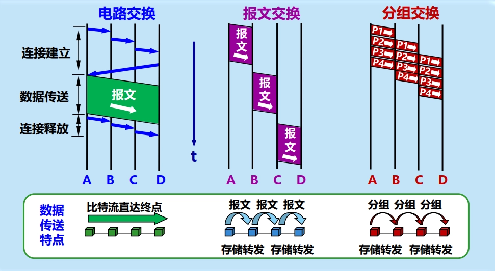

- **电路交换**：连续传送**大量的数据**，且其**传送时间远大于连接建立时间**
- **报文交换/分组交换**：
    - 不需要预先分配传输带宽，在传送**突发数据**时可提高整个网络的信道利用率
    - 由于一个分组的长度往往远小于整个报文的长度，因此**分组交换比报文交换的时延小**，同时也具有更好的灵活性

## 计算机网络的定义与分类
### 定义
- 简单定义：一些互相连接的、自治的计算机的集合。
    - **互连**︰计算机之间可以通过有线或无线的方式进行数据通信
    - **自治**︰独立的计算机，有自己的硬件和软件，可以单独运行使用
    - **集合**：至少需要两台计算机
- 完整定义：计算机网络主要是由一些**通用的、可编程的硬件互连**而成的，而这些硬件**并非**专门用来实现某一特定目的，而是能够用来**传送多种不同类型的数据**，并能**支持广泛的和日益增长的应用**。

### 分类
#### 按作用范围分类
- **广域网** WAN：覆盖范围通常为几十公里到几千公里，有时也称为远程网。广域网是因特网的核心部分。
- **城域网** MAN：覆盖范围一般是一个城市，作用距离为 5 至 50 公里。
- **局域网** LAN：局限在较小的范围（如 1 公里左右）。通常采用高速通信线路。
- **个人区域网** PAN：范围很小，大约在 10 米左右。有时也称为无线个人区域网 WPAN（Wireless PAN）。

> 若中央处理机之间的距离非常近，例如仅1米的数量级甚至更小，则一般就称之为**多处理机系统**。而不称它为计算机网络。

#### 按使用者分类

- 公用网（public network）：按规定交纳费用的人都可以使用的网络，也可称为公众网
- 专用网（private network）：为特殊业务工作的需要而建造的网络

> 公用网和专用网都可以传送多种业务。如传送的是计算机数据，则分别是公用计算机网络和专用计算机网络。

#### 接入网 AN（Access Network）
- 又称为本地接入网或居民接入网。
- 作用：将用户接入互联网。
- 特点：
    - 实际上就是本地 ISP 所拥有的网络，既不是互联网的核心部分，也不是互联网的边缘部分。
    - 是从某个用户端系统到本地 ISP 的第一个路由器（也称为边缘路由器）之间的一种网络。
    - 从覆盖的范围看，很多接入网还是属于局域网。

## 性能
### 性能指标
#### 速率
- 定义：数据的传送速率，也称为**数据率**（data rate）或**比特率**（bit rate），最重要的一个性能指标。
- 单位：bit/s，或 kbit/s、Mbit/s、Gbit/s 等。
- 说明：
    - 速率往往是指额定速率或标称速率，非实际运行速率。
    - 网络与容量的速率单位换算不同：
        - 网络：
            - 千 $= K = 10^3 = 1000$
            - 兆 $= M = 10^6 = 1000 K$
            - 吉 $= G = 10^9 = 1000 M$
        - 容量：
            - 千 $= K = 2^{10} = 1024$
            - 兆 $= M = 2^{20} = 1024 K$
            - 吉 $= G = 2^{30} = 1024 M$

#### 带宽（bandwidth）
- 频域
    - 定义：某个信号具有的频带宽度。
    - 单位：Hz（赫兹），或 kHz、MHz、GHz 等。
    - **带宽**：某信道允许通过的信号频带范围称为该信道的带宽（或通频带）。
- 时域
    - 定义：网络中某通道传送数据的能力，表示在单位时间内网络中的某信道所能通过的“最高数据率”。
    - 单位：与数据率单位相同，bit/s
        - 两者本质相同：一条通信链路的“带宽”越宽，其所能传输的“最高数据率”也越高

#### 吞吐量（throughput）
- 定义：**单位时间内通过某个网络的实际数据量**，是通过测量现实世界的网络后得出的
- **受网络带宽和额定速率**的限制
    - 额定速率是绝对上限值。
    - 可能会远小于额定速率，甚至下降到零！
- 单位：有时可用每秒传送的字节数或帧数来表示

#### 时延（delay or latency）
- 定义：数据（一个报文或分组，甚至比特）从网络（或链路）的一端传送到另一端所需的时间。有时也称为延迟或迟延。
- 组成：发送时延、传播时延、处理时延和排队时延
    - **发送时延/传输时延**：
        - 定义：主机或路由器发送数据帧所需要的时间，即从发送数据帧的第一个比特算起，到该帧的最后一个比特发送完毕所需的时间。
        - 发送时延 $=\frac{\text{数据帧长度(bit)}}{\text{发送速率(bit/s)}}$
    - **传播时延**：
        - 定义：数据在信道中传播所需要的时间。
        - 传播时延 $=\frac{\text{信道长度(m)}}{\text{电磁波传播速率(m/s)}}$
        - 发送时延与传播时延在本质上的不同：
            - 发送时延发生在机器内部的发送器中，与传输信道的长度（或信号传送的距离）没有任何关系。
            - 传播时延则发生在机器外部的传输信道媒体上，而与信号的发送速率无关。信号传送的距离越远，传播时延就越大。
    - **处理时延**：
        - 定义：主机或路由器在收到分组时，为处理分组（例如分析首部、提取数据、差错检验或查找路由）所花费的时间。
    - **排队时延**
        - 定义：分组在路由器输入输出队列中排队等待处理和转发所经历的时延。
        - 排队时延的长短往往取决于网络中当时的通信量。当网络的通信量很大时会发生队列溢出，使分组丢失，这相当于排队时延为无穷大。
- 总时延 = 发送时延 + 传播时延 + 处理时延 + 排队时延
    - 总时延中，究竟是哪一种时延占主导地位，必须具体分析。

#### 时延带宽积
- 定义：表示链路上当前可容纳的数据量，又称为以比特为单位的链路长度。
- 时延带宽积 = 传播时延 × 带宽
- 管道中的比特数表示从发送端发出但尚未到达接收端的比特数。
- 只有在代表链路的管道都充满比特时，链路才得到了充分利用。

#### 往返时间（RTT，Round-Trip Time）
- 定义：表示从发送方发送完数据，到发送方收到来自接收方的确认总共经历的时间，即**双向交互一次的时间**。


- 在互联网中，往返时间还包括各中间结点的处理时延、排队时延以及转发数据时的发送时延。
- 当使用卫星通信时，往返时间 RTT 相对较长，此时，RTT 是很重要的一个性能指标。

#### 利用率

- 信道利用率：该信道有百分之几的时间是被利用的，即有数据通过的。
- 网络利用率：全网络的**信道利用率的加权平均**。
- 当信道的利用率增大时，该信道引起的时延也会增加。因此**信道利用率并不是越高越好。**
    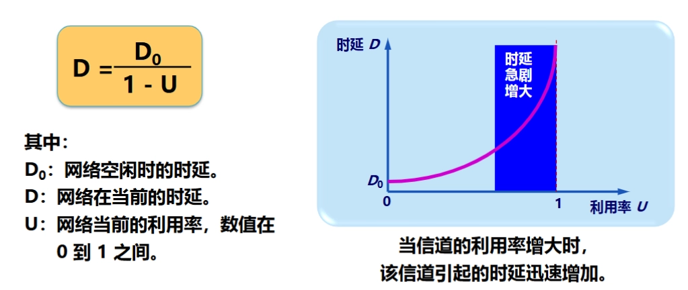

### 非性能特征
- 费用：标准化
- 质量：可靠性
- 管理和维护：可扩展性和可升级性

## 计算机网络体系结构
- 网络的体系结构（Network Architecture）是计算机网络的各层及其协议的集合，就是这个计算机网络及其构件所应完成的功能的精确定义（不涉及实现）。
- 实现（implementation）是遵循这种体系结构的前提下，用何种硬件或软件完成这些功能的问题。
- 体系结构是抽象的，而实现则是具体的，是真正在运行的计算机硬件和软件。

### 计算机网络体系结构的形成
- 法律上的国际标准：OSI 参考模型
    - 由国际标准化组织 ISO 在 1984 年提出
    - 没有获得市场认可
- 事实上的国际标准：TCP/IP 体系结构
    - 互联网的基础
    - 得到广泛认可和使用

### 协议与划分层次
- 网络协议（network protocol），简称为协议，是为进行网络中的数据交换而建立的规则、标准或约定。
    - 计算机网络不可缺少的组成部分
- 组成要素：
    - **语法**：数据与控制信息的结构或格式 。
    - **语义**：需要发出何种控制信息，完成何种动作以及做出何种响应。
    - **同步**：事件实现顺序的详细说明。
- 层次式协议结构
    - 将网络协议划分为若干层次，每一层次都完成特定的功能。
    - 每一层次都向上一层次提供服务，并使用下一层次所提供的服务。
    - 每一层次都通过协议与对等层次进行通信。
    - 优点：
        - 各层之间相互独立
        - 灵活性好
        - 结构上可分割开
        - 易于实现和维护
        - 能促进标准化工作
    - 缺点：
        - 有些功能重复出现，增加开销
        - 降低效率
    - 各层完成的主要功能
        - **差错控制**：使相应层次对等方的通信更加可靠。
        - **流量控制**：发送端的发送速率必须使接收端来得及接收，不要太快。
        - **分段和重装**：发送端将要发送的数据块划分为更小的单位，在接收端将其还原。
        - **复用和分用**：发送端几个高层会话复用一条低层的连接，在接收端再进行分用。
        - **连接建立和释放**：交换数据前先建立一条逻辑连接，数据传送结束后释放连接。

### 具有五层协议的体系结构

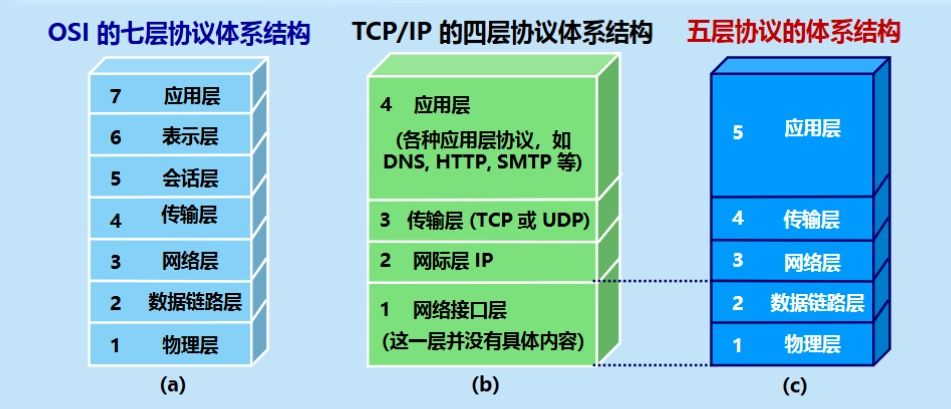

#### 应用层
- 任务：通过应用进程间的交互来完成特定网络应用。
- 协议：定义的是应用进程间通信和交互的规则。
- 报文（message）：应用层交互的数据单元
- 例如：DNS，HTTP，SMTP

#### 运输层
- 任务：负责向两台主机中进程之间的通信提供通用的数据传输服务。
- 作用：具有复用和分用的功能。
- 协议：
    - 传输控制协议：**TCP**（Transmission Control Protocol）
        - 提供面向连接的、可靠的数据传输服务。
        - 数据传输的单位是报文段（segment）。
    - 用户数据报协议：**UDP**（User Datagram Protocol）
        - 提供无连接的尽最大努力（best-effort）的数据传输服务（不保证数据传输的可靠性）。
        - 数据传输的单位是用户数据报（datagram）。

#### 网络层
- 任务：为分组交换网上的不同主机提供通信服务。
- 具体任务：
    - **路由选择**：通过一定的算法，在互联网中的每一个路由器上，生成一个用来转发分组的转发表。
    - **转发**：每一个路由器在接收到一个分组时，要依据转发表中指明的路径把分组转发到下一个路由器。
- 互联网使用的网络层协议是无连接的网际协议 IP（Internet Protocol）和许多种路由选择协议，因此互联网的网络层也叫做网际层或 IP 层。
    - IP 协议分组也叫做 IP 数据报，或简称为数据报。

#### 数据链路层/链路层
- 任务：实现两个**相邻节点**之间的可靠通信。
- 具体任务：
    - 在两个相邻节点间的链路上传送帧（frame）。
    - 如发现有差错，就简单地丢弃出错帧。
        - 如果需要改正出现的差错，就要采用可靠传输协议来纠正出现的差错。这种方法会使数据链路层协议复杂。

#### 物理层
- 任务：实现比特（0 或 1）的传输。
- 具体任务：确定连接电缆的插头应当有多少根引脚，以及各引脚应如何连接。
- 注意：传递信息所利用的一些物理媒体，如双绞线、同轴电缆、光缆、无线信道等，并不在物理层协议之内，而是在物理层协议的下面

#### 数据在各层之间的传递过程
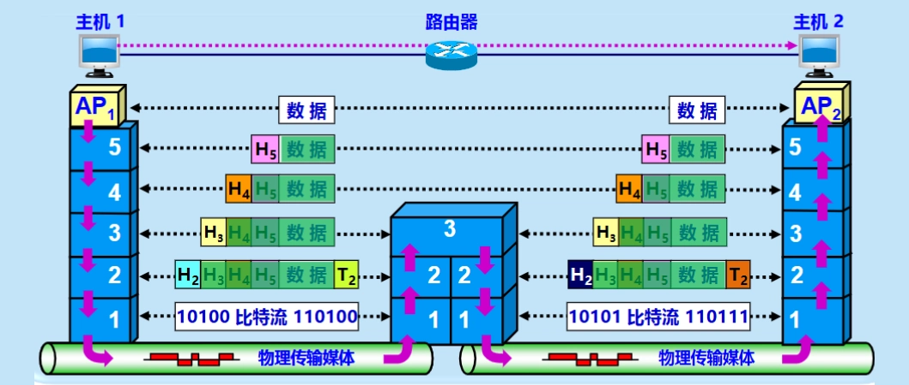

- 对等层与协议数据单元：
    - OSI 参考模型把对等层次之间传送的数据单位称为该层的**协议数据单元** PDU（Protocol Data Unit）。
    - 任何两个同样的层次把 PDU （即数据单元加上控制信息）通过水平虚线直接传递给对方。这就是所谓的“对等层”之间的通信。
    - 各层协议实际上就是在各个对等层之间传递数据时的各项规定。

### 实体、协议、服务和服务访问点
- **实体**（entity）：任何可发送或者接收信息的**硬件或软件进程**。
    - **对等实体**：收发双方相同层次中的实体。
- **协议**：控制两个**对等实体**进行逻辑通信的规则集合。
    - **语法**：数据与控制信息的结构或格式。
    - **语义**：需要发出何种控制信息，完成何种动作以及做出何种响应。
    - **同步**：事件实现顺序的详细说明。
- **服务**
    - 在协议的控制下，两个对等实体间的通信使得本层能够向上一层提供服务。
    - 要实现本层协议，还需要使用下层所提供的服务。
- 协议与服务的比较
    - 协议是“**水平的**”，服务是“**垂直的**”。
    - 实体看得见相邻下层所提供的服务，但并不知道实现该服务的具体协议。也就是说，下面的协议对上面的实体是"**透明**"的。
- **服务访问点** SAP：在同一系统中**相邻两层的实体交换信息的逻辑接口**
- **服务原语**：上层使用下层所提供的服务必须通过与下层**交换一些命令**，这些命令称为服务原语。
    - **协议数据单元** PDU：对等层次之间传送的数据包称为该层的协议数据单元。
    - **服务数据单元** SDU：同一系统内，层与层之间交换的数据包称为服务数据单元。
    - 多个 SDU 可以合成为一个 PDU；一个 SDU 也可划分为几个 PDU。

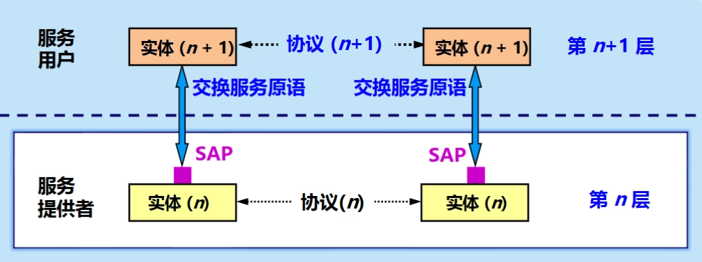

### TCP/IP 的体系结构


- 有些应用程序可以直接使用 IP 层，或甚至直接使用最下面的网络接口层。

# 物理层
## 物理层基本概念
- 定义：在连接各种计算机的传输媒体上**传输数据比特流**的层次。
- 作用：尽可能屏蔽掉不同传输媒体和通信手段的差异。
- **主要任务**：确定与传输媒体的接口的一些特性。
- 特性：
    - 机械特性：指明接口所用接线器的形状和尺寸、引线数目和排列、固定和锁定装置等。
    - 电气特性：指明在接口电缆的各条线上出现的电压的范围。
    - 功能特性：指明某条线上出现的某一电平的电压的意义。
    - 过程特性：指明对于不同功能的各种可能事件的出现顺序。

## 数据通信的基础知识
### 数据通信系统的模型
- 三大部分：
    - **源系统**（或发送端、发送方）
    - **传输系统**（或传输网络）
    - **目的系统**（或接收端、接收方）

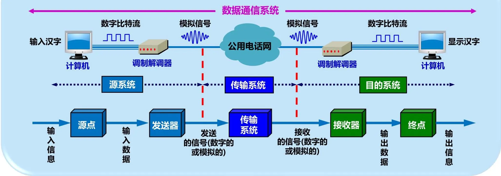

#### 常用术语
- 消息（message）：如话音、文字、图像、视频等。
- 数据（data）：运送消息的实体。有意义的符号序列。
- 信号（signal）：数据的电气的或电磁的表现。
    - 模拟信号（analogous signal）：消息参数取值连续。
    - 数字信号（digital signal）：消息参数取值离散。
- 码元：在使用时间域（简称为时域）的波形表示数字信号时，代表不同离散数值的基本波形。
    - 使用二进制编码时，只有两种不同的码元：0 状态，1 状态。

#### 有关信道的几个基本概念
- **信道**：一般用来表示向某一个方向传送信息的媒体。
    - **单向通信**（单工通信）：只能有一个方向的通信，没有反方向的交互。
    - **双向交替通信**（半双工通信）：通信的双方都可以发送信息，但双方不能同时发送或同时接收。
    - **双向同时通信**（全双工通信）：通信的双方可以同时发送和接收信息。
- **基带信号**（即基本频带信号）
    - 来自信源的信号。
    - 包含有较多的低频成分，甚至有直流成分。
- **调制**
    - **基带调制**：仅对基带信号的波形进行变换，把数字信号转换为另一种形式的数字信号。把这种过程称为编码（coding）。
        - **常用编码方式**：
            1. **不归零制编码**：正电平代表 1，负电平代表 0，无中间状态。
            2. **归零制编码**：正电平代表 1，负电平代表 0，中间有零电平状态。
            3. **曼彻斯特编码**：位周期中心的向上跳变代表 0，位周期中心的向下跳变代表 1 。但也可反过来定义。
            4. **差分曼彻斯特编码**：在每一位的中心处始终都有跳变。位开始边界有跳变代表 0，而位开始边界没有跳变代表 1。

            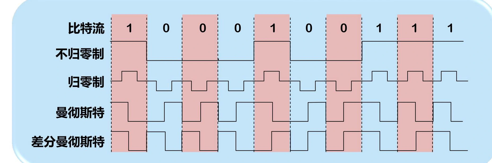
        - 信号频率：曼彻斯特编码和差分曼彻斯特编码产生的信号频率比不归零制高。
        - 自同步能力：从信号中提取时钟频率的能力。
            - 不归零制和归零制没有自同步能力。
            - **曼彻斯特编码和差分曼彻斯特编码具有自同步能力**。
    - **带通调制**：使用载波（carrier）进行调制（modulation），把基带信号的频率范围搬移到较高的频段，并转换为模拟信号。经过载波调制后的信号称为带通信号（即仅在一段频率范围内能够通过信道的信号）。
        1. **调幅** AM：载波的振幅随基带数字信号而变化。
        2. **调频** FM：载波的频率随基带数字信号而变化。
        3. **调相** PM：载波的初始相位随基带数字信号而变化。
            
        4. **正交振幅调制** QAM（Quadrature Amplitude Modulation）：多元制的振幅相位混合调制方法，能达到更高的信息传输速率。
            - 示例：
                - 可供选择的相位有 12 种，而对于每一种相位有 1 或 2 种振幅可供选择。总共有 16 种组合，即 16 个码元。
                - 由于 4 bit 编码共有 16 种不同的组合，因此这 16 个点中的每个点可对应于一种 4 bit 的编码。数据传输率可提高 4 倍。
                    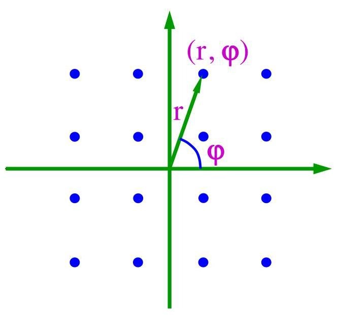

#### 信道的极限容量
- 任何实际的信道都不是理想的，都不可能以任意高的速率进行传送。
- 码元传输的速率越高，或信号传输的距离越远，或噪声干扰越大，或传输媒体质量越差，在接收端的波形的失真就越严重。
- 限制码元在信道上的传输速率的两个因素：
    - **信道能够通过的频率范围**
        - 具体的信道所能通过的频率范围总是有限的。信号中的许多高频分量往往不能通过信道。
        - 码间串扰：接收端收到的信号波形失去了码元之间的清晰界限。
        - 奈氏准则： 码元传输的**最高**速率 $= 2W$（码元/秒），其中 $W$ 是信道的带宽（$Hz$）。
    - **信噪比**
        - 信噪比就是信号的平均功率和噪声的平均功率之比。常记为 $S/N$ 或者 $SNR$，$S$ 代表信号功率（Signal Power），$N$ 代表噪声功率（Noise Power），并用分贝（$dB$）作为度量单位。即：
            $$信噪比 = 10 \log_{10}(S/N)~(dB)$$
        - 例如：当 $S/N = {10}$ 时，信噪比为 $10~dB$，而当 $S/N = {1000}$ 时，信噪比为 $30~dB$。
- **香农公式**：
    - 信道的**极限信息传输速率** $C$ 可表达为：
        $$C = W\log_{2}(1 + S/N)~(bit/s)$$
    - 其中：
        - $W$ 信道的带宽；
        - $S$ 为信道内所传信号的平均功率；
        - $N$ 为信道内部的高斯噪声功率。
    - 信道的带宽或信道中的信噪比越大，则信息的极限传输速率就越高。
    - 只要信息传输速率低于信道的极限信息传输速率，就一定可以找到某种办法来实现无差错的传输。
- 提高信息的传输速率的方法
    - 用编码的方法让每一个码元携带更多比特的信息量。
- 传输速率：波特率（Baud Rate）是电子通信领域中的一个重要概念，它用于度量数据传输的速率，即单位时间内传输的码元（符号）的个数。
    - 波特率与比特率（Bit Rate）的区别：
        - 比特率：单位时间内传输的比特数量，即单位时间内传送的二进制位数，常用 $bps$ 来表示。
        - 波特率：单位时间内传输的符号数量。
    - 联系：比特率 = 波特率 × 每个符号承载的比特数。

## 物理层下的传输媒体
- 传输媒体是数据传输系统中在发送器和接收器之间的物理通路。
- 分类：
    - **导引型传输媒体**：电磁波被导引沿着固体媒体（铜线或光纤）传播。
    - **非导引型传输媒体**：指自由空间。非导引型传输媒体中电磁波的传输常称为无线传输。
- 电信领域使用的电磁波的频谱：
    

### 导引型传输媒体
#### 双绞线
- 最古老但又最常用的传输媒体。
- 把两根互相绝缘的铜导线并排放在一起，然后用规则的方法绞合（twist）起来就构成了双绞线。
- 绞合度越高，可用的数据传输率越高。
- 分类：
    - **无屏蔽双绞线** UTP（Unshielded Twisted Pair）
    - **屏蔽双绞线** STP（Shielded Twisted Pair）
        - 都必须有接地线。
        - X/UTP：对整条双绞线电缆进行屏蔽。
            - F/UTP（F=Foiled）：采用铝箔屏蔽层
            - S/UTP（S=braid Screen）：采用金属编织层
            - SF/UTP：在铝箔屏蔽层外面再加上金属编织层
        - FTP：把电缆中的每一对双绞线都加上铝箔屏蔽层。
            - U/FTP：对整条电缆不另增加屏蔽层
            - F/FTP：在 FTP 基础上对整条电缆再加上铝箔屏蔽层
            - S/FTP：在 FTP 基础上对整条电缆再加上金属编织层
        - 在抗干扰能力上，U/FTP 比 F/UTP 好，而 F/FTP 则是最好的。
            
- 无论是哪种类别的双绞线，**衰减都随频率的升高而增大**。双绞线的最高速率还与数字信号的编码方法有很大的关系

#### 同轴电缆
- 由内导体铜质芯线（单股实心线或多股绞合线）、绝缘层、网状编织的外导体屏蔽层（也可以是单股的）以及保护塑料外层所组成。
    
- 具有很好的抗干扰特性，被广泛用于传输较高速率的数据。

#### 光缆
- 光纤是光纤通信的传输媒体。通过传递光脉冲来进行通信。其传输带宽远远大于目前其他各种传输媒体的带宽。
- 光纤通信系统的基本组成
    - 发送端：要有光源，在电脉冲的作用下能产生出光脉冲。
        - 光源：发光二极管，半导体激光器等。
    - 接收端：要有光检测器，利用光电二极管做成，在检测到光脉冲时还原出电脉冲。
- 光波在纤芯中的传播：不断进行全反射
- 分类：
    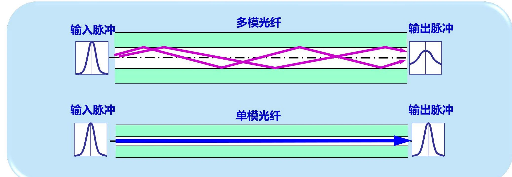

    - 多模光纤
        - 可以存在多条不同角度入射的光线在一条光纤中传输。
        - 光脉冲在多模光纤中传输时会逐渐展宽，造成失真，只适合于近距离传输。
    - 单模光纤
        - 其直径减小到只有一个光的波长（几个微米），可使光线一直向前传播，而不会产生多次反射。
        - 制造成本较高，但衰耗较小。
        - 光源要使用昂贵的半导体激光器，不能使用较便宜的发光二极管。
- 光纤通信中使用的光波的波段
    - 常用的三个波段的中心：
        - $850~nm$
        - $1300~nm$
        - $1550~nm$
    - 所有这三个波段都具有 $25000\sim 30000 ~GHz$ 的带宽，通信容量非常大。
- 光缆：
    - 光纤必须做成很结实的光缆。
        - 由数十至数百根光纤组成
        - 加强芯和填充物
        - 必要时还可放入远供电源线
        - 最后加上包带层和外护套
    - 使抗拉强度达到几公斤，完全可以满足工程施工
- 光纤优点
    - 通信容量非常大
    - 传输损耗小，中继距离长，对远距离传输特别经济。
    - 抗雷电和电磁干扰性能好。
    - 无串音干扰，保密性好，不易被窃听或截取数据。
    - 体积小，重量轻。

### 非导引型传输媒体
- 利用无线电波在自由空间的传播可较快地实现多种通信，因此将自由空间称为“非导引型传输媒体”。
- 无线传输所使用的频段很广：$LF \sim THF~(30 ~{kHz \sim 3000 ~GHz})$

#### 无线电微波通信
- 占有特殊重要的地位。
- 微波频率范围：
    - $300 ~{MHz} \sim 300 ~{GHz}$（波长 $1 ~ m \sim 1 ~ mm$）
    - 主要使用：$2 \sim 40 ~{GHz}$。
- 在空间主要是**直线**传播。
    - 地球表面：传播距离受到限制，一般只有 ${50}~{km}$ 左右。
    - ${100}~m$ 高的天线塔：传播距离可增大到 ${100}~{km}$ 。
- **多径效应**：基站发出的信号可以经过多个障碍物的数次反射，从多条路径、按不同时间等到达接收方。多条路径的信号叠加后一般都会产生很大的失真，这就是所谓的多径效应。
- 远距离微波通信：微波接力
    - 微波接力：中继站把前一站送来的信号放大后再发送到下一站。
    - 主要特点：
        1. 微波波段频率很高，频段范围很宽，其通信信道的容量很大。
        2. 工业干扰和天电干扰对微波通信的危害小，微波传输质量较高。
        3. 与相同容量和长度的电缆载波通信比较，微波接力通信建设投资少，见效快，易于实施。
    - 主要缺点：
        1. 相邻站之间必须直视（常称为视距 LOS，Line Of Sight），不能有障碍物，存在多径效应。
        2. 有时会受到恶劣气候的影响。
        3. 与电缆通信系统比较，微波通信的隐蔽性和保密性较差。
        4. 对大量中继站的使用和维护要耗费较多的人力和物力。

#### 卫星通信
- 优点：
    - 通信容量大，通信距离远，通信比较稳定，通信费用与通信距离无关。
- 缺点：
    - 传播时延较大：在 $250\sim300~ms$ 之间。
        - 请注意：“卫星信道的传播时延较大”并不等于“用卫星信道传送数据的时延较大”，因为数据传送的时延还包括发送时延、处理时延和排队时延。
    - 保密性相对较差。
    - 造价较高。

## 信道复用技术
- 复用（multiplexing）：允许用户使用一个共享信道进行通信。
- 复用器（multiplexer）和分用器（demultiplexer）成对使用。
    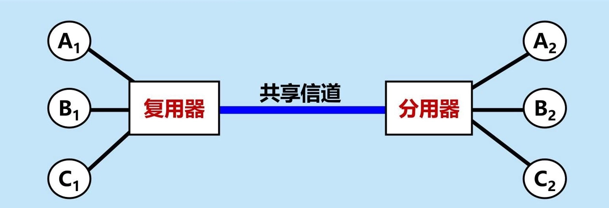

### 频分复用 FDM（Frequency Division Multiplexing）
- **频分复用** FDM（Frequency Division Multiplexing）
    - 最基本的复用方式
    - 定义：给每个信号分配唯一的载波频率，并通过单一媒体来传输多个独立信号的方法。
    - 特点
        - 整个带宽分为多份，每个信号在分配到一定的频带后，在通信过程中自始至终都占用这个频带。
        - 所有信号在同样的时间占用不同的带宽（即频带）资源。
        - 只强调了复用的方式，而并不关心复用的这些信道是来自多个用户还是来自一个用户。
- **频分多址接入** FDMA（Frequency Division Multiple Access）
    - 定义：使用 FDM 技术让多个用户在同一信道上进行通信的方法。
    - 特点：让 $N$ 个用户各使用一个 FDM 的频带，或让更多的用户轮流使用这 $N$ 个频带。强调了复用的这些信道是来自多个用户。

### 时分复用 TDM（Time Division Multiplexing）
- **时分复用** TDM（Time Division Multiplexing）
    - 定义：将时间划分为一段段**等长的**时分复用帧（TDM 帧），每一个 TDM 帧又划分为若干个时隙（time slot），每一个信号在每一个 TDM 帧中占用固定序号的时隙。
        
    - 特点：
        - 每一个信号所占用的时隙是周期性地出现（其周期就是 TDM 帧的长度）。
        - 所有信号在不同的时间占用同样的频带宽度。
        - 只强调了复用的方式，而并不关心复用的每个时隙的信号是来自多个用户还是来自一个用户。
    - TDM 信号也称为等时（isochronous）信号。
    - 时分复用会导致信道利用率不高
        
- **时分多址接入** TDMA（Time Division Multiple Access）
    - 定义：使用 TDM 技术让多个用户在同一信道上进行通信的方法。
    - 特点：让 $N$ 个用户各使用一个 TDM 的时隙，或让更多的用户轮流使用这 $N$ 个时隙。强调了复用的这些信道是来自多个用户。

### 统计时分复用 STDM（Statistical Time Division Multiplexing）
- 定义：根据各个信号的实际需要动态地分配时隙，而不是像时分复用 TDM 那样为每一个信号分配固定的时隙。又称为**异步时分复用**。
- 特点：
    - 信号只有在有数据发送时才占用信道资源。
    - 信道利用率高。
    - 需要在复用器和分用器中增加地址信息，以便识别不同信号的数据。
- 示例：
    

### 波分复用 WDM（Wavelength Division Multiplexing）
- 定义：光的频分复用。使用一根光纤来同时传输多个光载波信号。
    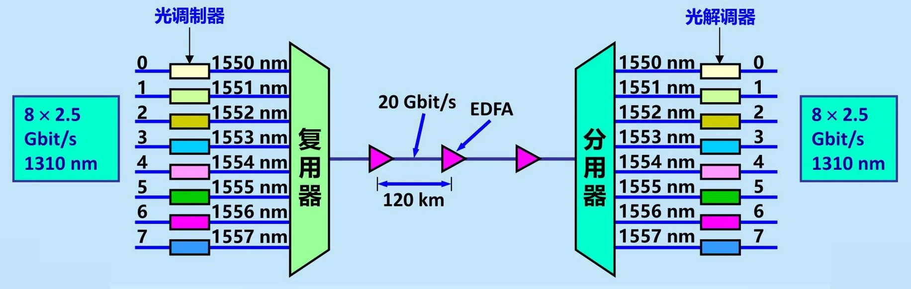
- 分类：
    - 密集波分复用 DWDM（Dense Wavelength Division Multiplexing）
    - 稀疏波分复用 CWDM（Coarse Wavelength Division Multiplexing）

### 码分复用 CDM（Code Division Multiplexing）
- **码分复用** CDM（Code Division Multiplexing）
    - 定义：通过给每一个信号分配一个独特的码片序列，使得多个信号可以在同一频带、同一时间内进行传输而互不干扰的方法。
    - 特点：
        - 每一个信号可以在同样的时间使用同样的频带进行通信。
        - 各信号使用经过特殊挑选的不同码型，因此不会造成干扰。
- **码分多址接入** CDMA（Code Division Multiple Access）
    - 定义：使用 CDM 技术让多个用户在同一信道上进行通信的方法。
    - 特点：让 $N$ 个用户各使用一个独特的**码片序列**在 CDM 信道上进行通信，或让更多的用户轮流使用这些码片序列。强调了复用的这些信道是来自多个用户。
    - 工作原理
        

        1. 编码：让两人信息分别乘以彼此正交的正交编码，如哈达码、沃尔什码等。
        2. 混合：将编码后的信息混合，送入信道传输。
        3. 分离：在接收端对收到的混合信号进行分离，让混合信号再次与各自的正交码相乘，分离出不同的用户信息。
    - CDMA 技术的原理主要基于扩频和分散码技术：
        1. 扩频技术：通过将原始信号进行编码扩展，使信号的带宽增大，从而可以在更宽的频段上进行传输。这种技术增强了信号的抗干扰能力，并提高了频谱的利用率。
            - 直接序列扩频 DSSS（Direct Sequence Spread Spectrum）
            - 跳频扩频 FHSS（Frequency Hopping Spread Spectrum）
        2. 分散码技术：为每个用户分配一个唯一的码序列，通过这个码序列将用户的信号进行扩散，使得不同用户的信号可以混合在一起传输。在接收端，通过特定的解码技术，可以将信号重新聚合，从而恢复出原始信号。
    - **正交特性**：
        - 每个站分配的码片序列：各不相同，且必须互相**正交**（orthogonal）。
        - 正交向量 $S$ 和 $T$ 的规格化内积（inner product）等于 $0$
            $$
            S \cdot  T \equiv  \frac{1}{m}\sum_{i=1}^{m}{S}_{i}{T}_{i} = 0
            $$
        - 任何一个码片向量和该码片向量自己的规格化内积都是 $1$
            $$
            S \cdot S = \frac{1}{m}\sum_{i=1}^{m}{S}_{i}{S}_{i}
            = \frac{1}{m}\sum_{i=1}^{m}{S}_{i}^{2}
            = \frac{1}{m}\sum_{i=1}^{m}{(\pm 1)}^{2}
            = 1
            $$
        - 一个码片向量和该码片反码的向量的规格化内积值是 $-1$
            $$
            S \cdot \overline{S} =  - 1
            $$

## 数字传输系统
- 早期，电话网长途干线采用**频分复用** FDM 的模拟传输方式。
- 目前，大都采用**时分复用** TDM 的数字传输方式。
- **光纤**开始成为长途干线最主要的传输媒体。
- 早期数字传输系统的缺点
    - 速率标准不统一。两个互不兼容的国际标准：
        - 北美和日本的 T1 速率（1.544 Mbit/s）
        - 欧洲的 E1 速率（2.048 Mbit/s）
    - 不是同步传输。主要采用准同步方式。
        - 各支路信号的时钟频率有一定的偏差，给时分复用和分用带来许多麻烦。

### 同步光纤网 SONET（Synchronous Optical Network）
- 美国电信工业协会（TIA）制定的光纤传输标准。
- 各级时钟都来自一个非常精确的主时钟。
- 为光纤传输系统定义了同步传输的线路速率等级结构：
    - 传输速率以 51.84 Mbit/s 为基础。
        - 对电信信号：**第 1 级同步传送信号** STS-1（Synchronous Transport Signal）
        - 对光信号则：**第 1 级光载波** OC-1（Optical Carrier）
    - 现已定义了从 51.84 Mbit/s（即 OC-1）到 9953.280 Mbit/s（即 OC-192/STS-192）的标准。

### 同步数字系列 SDH（Synchronous Digital Hierarchy）
- ITU-T 以美国标准 SONET 为基础制订的国际标准。
- 定义了同步传输的线路速率等级结构：
    - 传输速率以 155.52 Mbit/s 为基础，称为**第 1 级同步传递模块** STM-1（Synchronous Transfer Module）
    - 相当于 SONET 体系中的 OC-3 速率

## 宽带接入技术
- 宽带：标准在不断提高。
    - 美国联邦通信委员会 FCC 定义：宽带下行速率达 25 Mbit/s，宽带上行速率达 3 Mbit/s。
- 分类：
    - 有线宽带接入
    - 无线宽带接入

### 非对称数字用户线 ADSL（Asymmetric Digital Subscriber Line）
#### 第一代 ADSL
- 定义：用数字技术对现有的模拟电话用户线进行改造，使它能够承载宽带业务。
- 特点：
    - ADSL 技术把 0~4 kHz 低端频谱留给传统电话使用，而把原来没有被利用的高端频谱留给用户上网使用。
    - **非对称**：下行（从 ISP 到用户）带宽**远大于**上行（从用户到 ISP）带宽。
- ADSL 调制解调器
    - 采用离散多音调 DMT（Discrete Multi-Tone）调制技术。
        - DMT 调制技术采用频分复用 FDM 方法。
            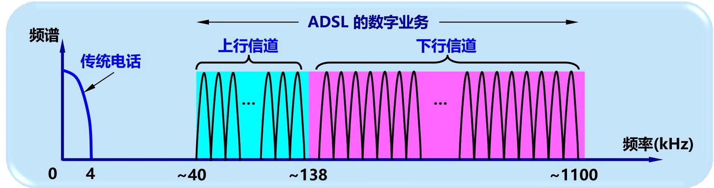
        - 相当于在一对用户线上使用许多小的调制解调器并行地传送数据。
    - ADSL 不能保证固定的数据率。
- ADSL 的组成
    

    - 数字用户线接入复用器 DSLAM（DSL Access Multiplexer）
    - 接入端接单元 ATU（Access Termination Unit）：ADSL 调制解调器
        - ATU-C（Central Office）：位于 ISP 端
        - ATU-R（Remote）：位于用户端
- ADSL 最大好处：可以利用现有电话网中的用户线（铜线），而不需要重新布线。

#### 第二代 ADSL
- 包括 ADSL2（G.992.3 和 G.992.4）和 ADSL2+（G.992.5）
- 主要改进：
    1. 通过提高调制效率得到了更高的数据率。
    2. 采用了无缝速率自适应技术 SRA（Seamless Rate Adaptation）
    3. 改善了线路质量评测和故障定位功能。
- ADSL 并不适合于企业，因为企业往往需要使用上行信道发送大量数据给许多用户。

#### xDSL
- SDSL（Symmetric DSL）：对称数字用户线
    - 上行和下行的数据传输速率相同。
- HDSL（High speed DSL）：高速数字用户线
- VDSL（Very high speed DSL）：甚高速数字用户线
- Giga DSL：超高速数字用户线
    - 华为公司于 2012 年首先研制成功样机。
    - 使用时分双工 TDD（Time Division Duplex）和 OFDM 技术

### 光纤同轴混合网（HFC 网）
- 定义：HFC（Hybrid Fiber Coax）网基于有线电视网 CATV 网，把原有线电视网中的同轴电缆主干部分改换为光纤
    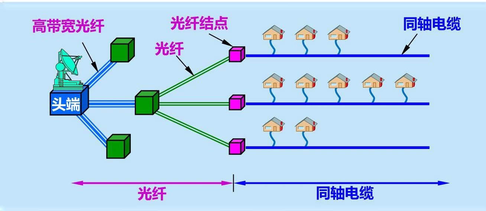
- HFC 网具有双向传输功能，扩展了传输频带
- 机顶盒与电缆调制解调器
    - **机顶盒**（set-top box）：
        - 连接在同轴电缆和用户的电视机之间。
        - 使现有的模拟电视机能够接收数字电视信号。
    - **电缆调制解调器**（cable modem）：
        - 将用户计算机接入互联网。
        - 在上行信道中传送交互数字电视所需的一些信息。
        - 不需要成对使用，而只需安装在用户端。
        - 复杂，必须解决共享信道中可能出现的冲突问题。

### FTTx 技术
- 代表多种宽带光纤接入方式。
- FTTx 表示 Fiber To The ... x，其中 x 可以表示不同的接入点。
    - FTTH（Fiber To The Home）：光纤到户
    - FTTB（Fiber To The Building）：光纤到楼
    - FTTC（Fiber To The Curb）：光纤到路边箱
    - FTTN（Fiber To The Node）：光纤到节点

#### 光配线网 ODN（Optical Distribution Network）
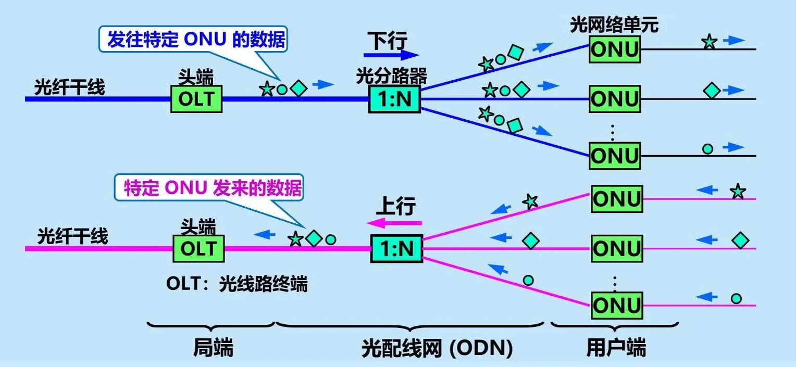

- 光配线网 ODN（Optical Distribution Network）：位于光纤干线和广大用户之间。
    - 无源的光配线网常称为无源光网络 PON（Passive Optical Network）。
- 采用**波分复用** WDM，上行和下行分别使用不同的波长。
- 最流行的无源光网络 PON（Passive Optical Network）：
    - 以太网无源光网络 EPON（Ethernet PON）
        - 在链路层使用以太网协议，利用 PON 的拓扑结构实现以太网的接入。
        - 与现有以太网的兼容性好，并且成本低，扩展性强，管理方便。
    - 吉比特无源光网络 GPON（Gigabit PON）
        - 采用通用封装方法 GEM（Generic Encapsulation Method），可承载多业务，且对各种业务类型都能够提供服务质量保证，总体性能比 EPON 好。
        - 成本稍高。

# 数据链路层

- 数据链路层的地位
    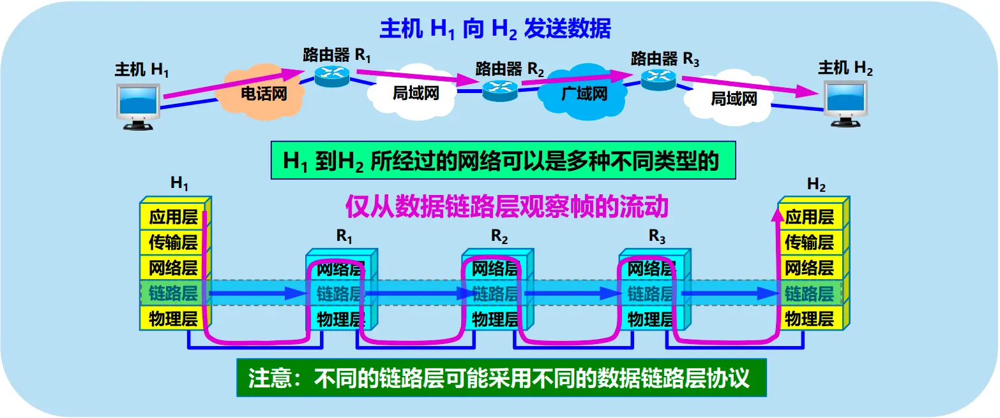
- 数据链路层信道类型
    

## 使用点对点信道的数据链路层
### 数据链路和帧
- **链路**（link）—— 物理链路
    - 定义：一条无源的点到点的物理线路段，中间没有任何其他的交换结点。
    - 一条链路只是一条通路的一个组成部分。
- **数据链路**（data link）—— 逻辑链路
    - 定义：把实现控制数据传输的协议的硬件和软件加到链路上，就构成了数据链路。
    - 典型实现：适配器（即网卡）
- 数据链路层协议数据单元：帧
    

### 四个基本问题

1. 封装成帧
2. 透明传输
3. 差错控制
4. 流量控制

#### 封装成帧（framing）
- 定义：在一段数据的前后分别添加首部和尾部，构成一个帧。
- 示意图：
    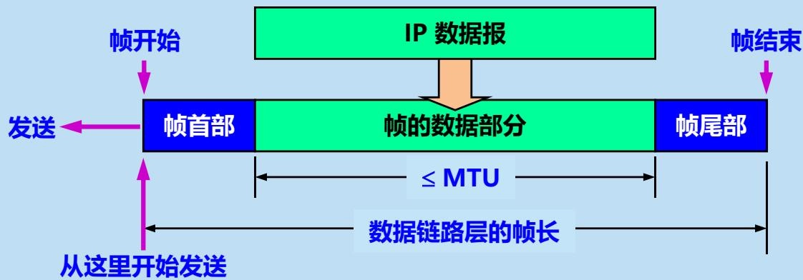
- 最大传送单元 **MTU**（Maximum Transfer Unit）：规定了所能传送的帧的数据部分长度上限。
- 首尾部作用：进行**帧定界**，即确定帧的界限。
    - 
    - 用控制字符作为帧定界符
        - 控制字符 SOH（Start Of Header）放在一帧的最前面，表示帧的首部开始。
        - 控制字符 EOT（End Of Transmission）放在一帧的末尾，表示帧的结束。

#### 透明传输
- 问题：如果数据中的某个字节的二进制代码恰好和 SOH 或 EOT 一样，数据链路层就会错误地“找到帧的边界”，导致错误。
    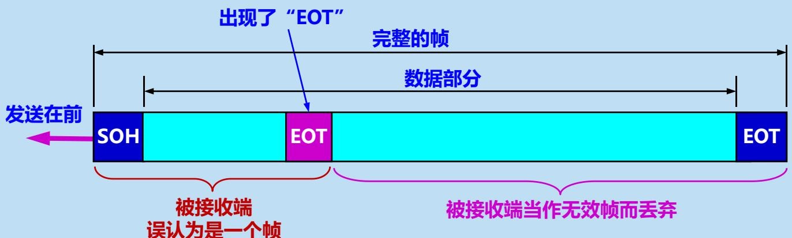
- 解决方案：用“字节填充”或“字符填充”法解决透明传输的问题
    - 在数据部分中插入一个特殊的转义字符 ESC（Escape）。
        - 发送端：在每个出现 SOH、EOT 或 ESC 字符的地方前面都插入一个 ESC 字符。
        - 接收端：每当遇到 ESC 字符时，就把它后面的一个字符取出来作为数据的一部分，而不把它作为控制字符处理。
    - 示例：
        
- 透明：指某一个实际存在的事物看起来却好像不存在一样。
    - “在数据链路层透明传送数据”表示：无论发送什么样的比特组合的数据，这些数据都能够按照原样没有差错地通过这个数据链路层。

#### 差错控制
- 问题：在传输过程中可能会产生比特差错：$1 \rightarrow 0$，$0 \rightarrow 1$。
    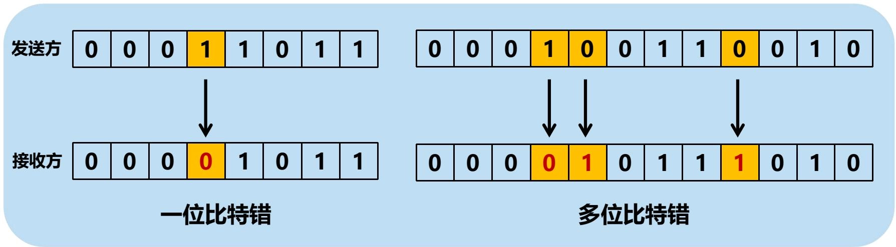
- **误码率** BER（Bit Error Rate）：在一段时间内，传输错误的比特占所传输比特总数的比率。
- 差错控制的两种基本方法
    1. **检错**（error detection）：检测出传输过程中产生的差错。
    2. **纠错**（error correction）：不仅能检测出差错，而且还能自动纠正这些差错。
- **帧检验序列** FCS（Frame Check Sequence）：在数据后面添加上的**冗余码**，用于差错检测或纠错。
- 差错控制的两种基本策略
    - **差错检测-重传**：当检测到差错时，丢弃该帧并请求重传该帧。
        - **自动重传请求** ARQ（Automatic Repeat reQuest）：当检测到差错时，请求重传该帧。
    - **差错检测-纠错**：不仅能检测出差错，而且还能自动纠正这些差错。

##### 检错-奇偶校验
- 定义：奇校验码和偶校验码的统称
    - 奇校验码：在传输的信息后中附加一位校验元，使得最后传输的信息中“1”的个数是奇数
    - 偶校验码：附加一位后，使得最终的信息中的“1”的个数是偶数个。
- 作用：检测单比特差错

##### 检错-循环冗余检验 CRC（Cyclic Redundancy Check）
- 定义：在发送端，先把数据**划分为组**。假定每组 $k$ 个比特。CRC 运算在每组 $M$ 后面再添加供差错检测用的 $n$ 位**冗余码**，然后构成一个帧发送出去。一共发送 $(k + n)$ 位。
- 作用：检测多比特差错
- 模 2 运算：逻辑异或，不进位/借位
- CRC 冗余码的计算
    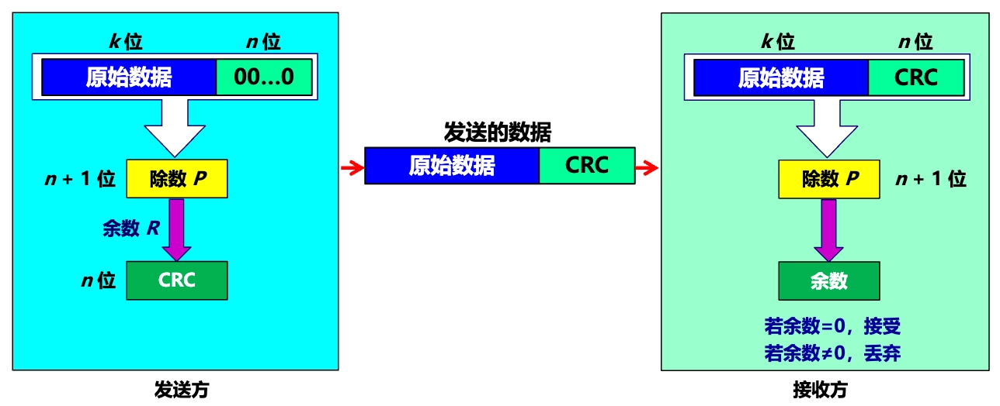

    1. 计算 $M$ 与 $2^{n}$ 的**模 2 乘法**，相当于在 $M$ 后面添加 $n$ 个 $0$。
    2. 得到的 $(k + n)$ 位的数执行**模 2 除法**，除以事先选定好的长度为 $(n + 1)$ 位的除数 $P$，得出商是 $Q$，余数是 $R$，余数 $R$ 比除数 $P$ 少 $1$ 位，即 $R$ 是 $n$ 位。
    3. 将余数 $R$ 作为冗余码拼接在数据 $M$ 后面，一起发送出去。
- 示例：
    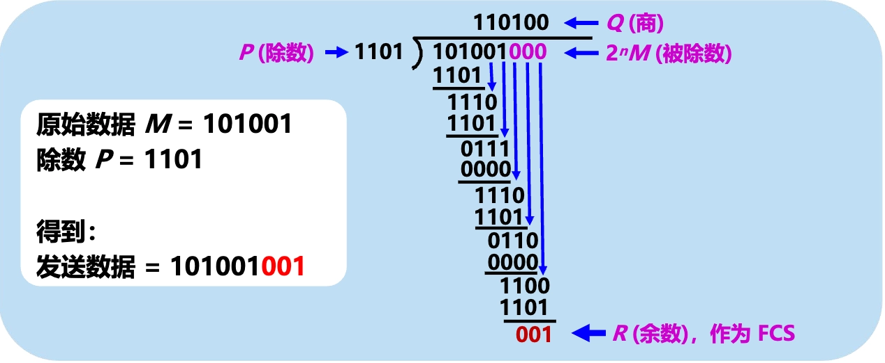
- 广泛使用的生成多项式P(X)
    $$
    \begin{aligned}
    &\mathrm {CRC-16} = X ^ {16} + X ^ {15} + X ^ {2} + 1 \\
    &\mathrm {CRC-CCITT} = X ^ {16} + X ^ {12} + X ^ {5} + 1 \\
    &\mathrm {CRC-32} = X ^ {32} + X ^ {26} + X ^ {23} + X ^ {22} + X ^ {16} + X ^ {12} + X ^ {11} + X ^ {10} + X ^ {8} + X ^ {7} + X ^ {5} + X ^ {4} + X ^ {2} + X + 1 \\
    \end{aligned}
    $$
- 说明：
    - 仅用循环冗余检验 CRC 差错检测技术只能做到“无比特差错”，而做不到“可靠传输”。
        - 无差错接受（accept）：凡是接受的帧（即不包括丢弃的帧），我们都能以非常接近于 1 的概率认为这些帧在传输过程中没有产生差错
    - “无比特差错”不等于“无传输差错”：
        - 比特差错：比特 $1 \rightarrow 0$ 或 $0 \rightarrow 1$。
        - 传输差错：帧丢失、帧重复或帧失序等。
    - 可靠传输：数据链路层的发送端发送什么，在接收端就收到什么。
        - 在数据链路层使用 CRC 检验，能够实现无比特差错的传输，但这还不是可靠传输。
        - **要做到可靠传输，还必须再加上帧编号、确认和重传等机制。**

##### 纠错-汉明码（Hamming Code）
- 定义：编号为 2 的幂的位作为校验位（只有 1 位是 1）
    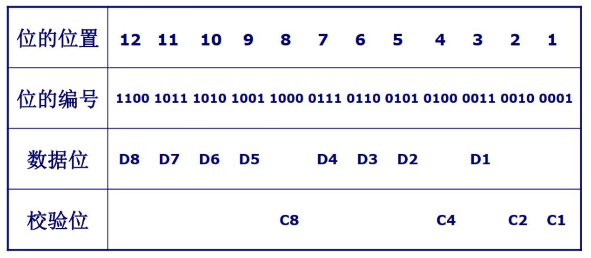
    $$
    \begin{aligned}
    C1 & = D1 \oplus D2 \oplus D4 \oplus D5 \oplus D7 \\
    C2 & = D1 \oplus D3 \oplus D4 \oplus D6 \oplus D7 \\
    C4 & = D2 \oplus D3 \oplus D4 \oplus D8 \\
    C8 & = D5 \oplus D6 \oplus D7 \oplus D8
    \end{aligned}
    $$
- 特点：
    - **能检测并纠正单个比特差错**
    - 每个 C 校验 1 位
    - 每个位置编号影响自己为 1 的位置
- 示例：12 位数据错误位计算
    - 发送：$001101001111$ 计算校验位 $0111$
    - 接收：$001101101111$ 重算校验位 $0001$
    - 出现错误，纠错位置 $0111 \oplus 0001 = 0110 = 6$ （位置 6，D3），将其取反

#### 流量控制
- 流量控制是对控制链路上的帧的发送速率进行控制，使接收方有足够的缓冲空间来接收帧。
- 主要方法：
    - 停止-等待协议
    - 滑动窗口协议
        - 后退 N 帧协议
        - 选择重传协议
- 自动重发请求协议 ARQ（Automatic Repeat reQuest）：在接收站接收到一个包含出错数据的信息（帧）时，自动发出一个重传错帧的请求，也称循环自动请求协议。

##### 停止-等待协议（SW）
- 定义：发送方每发送一帧，都要等待接收方的应答信号才能发送下一帧，接收方每接收一帧都需要反馈一个应答信号来表示可接收下一帧。
- 特点：
    - 如果发送方没有收到接收方的应答信号就一直等待。
    - 源站的等待时间超时后，会再次发送刚才的帧。

##### 后退 N 帧协议（GBN）
- 定义：
    - 收到确认分组之前可以连续发送多个分组。若采用 $n$ 个比特对帧编号，则其**发送窗口** $W$ 的大小满足 $1 \leq W \leq 2^{n} - 1$，**接收窗口**为 $1$。
    - 当发送方发送了 $W$ 个分组后，接收方**按照帧编号顺序**接收分组，并依次发送确认分组，移动接收窗口。
    - 若某个分组传送失败，接收方将丢弃该分组及其后的所有分组，并不发送确认分组。发送方在超时后，重新发送该分组及其后的所有分组。
- 示例：发送方发送了 0、1、2、3、4 帧，但只收到 0 和 1 号帧的确认，等待超时之后需要重新发送 1 号帧之后的所有帧，即 2、3、4 帧。
    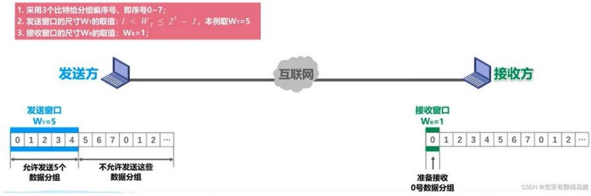
- 优点：相比停止等待协议，后退 N 帧协议的信道利用率得到提高。
- 缺点：若当前窗口的最早的分组传送失败了，后面的分组即使传送成功了也需要重传，如果信道的误码率比较高的话，信道传输效率就会变的非常低。

##### 选择重传协议（SR）
- 定义：
    - 发送窗口与接收窗口的大小都为 $W$。发送方可以连续发送 $W$ 个分组而不等待确认，接收方可以接收 $W$ 个分组并对每一个分组进行差错检测，分别发送确认分组。
    - 若某个分组传送失败，接收方只需请求发送方进行局部重传，而不需要回退 N 个帧进行重发。
- GBN 与 SR 的比较
    - 选择重传协议需要对每一个分区都给发送方反馈 ACK 确认消息，更适合用在误码率比较高的信道上。
    - 回退 N 帧协议比较适合用在误码率比较低的信道上。

## 点对点协议 PPP
### PPP 协议的特点
- 点对点协议 PPP（Point-to-Point Protocol）：
    - 定义：在点对点链路上封装网络层数据包的一种数据链路层协议。
    - 标准：RFC 1661
- **用户到 ISP 的链路**使用 PPP 协议
    - 通过 WAN 口连接运营商，同时运营商给我们提供了一个宽带接入的用户名、密码的过程。
    - 现在有时运营商的光猫作为 PPPOE 拨号的 client 与运营商的上行设备进行对接。
- PPP 协议应满足的需求
    1. **简单**——首要要求。
    2. 封装成帧——必须规定特殊的字符作为帧定界符。
    3. 透明性——必须保证数据传输的透明性。
    4. 多种网络层协议——能够在同一条物理链路上同时支持多种网络层协议。
    5. 多种类型链路——能够在多种类型的链路上运行。
    6. 差错检测——能够对接收端收到的帧进行检测，并立即丢弃有差错的帧。
    7. 检测连接状态——能够及时自动检测出链路是否处于正常工作状态。
    8. 最大传送单元——必须对每一种类型的点对点链路设置最大传送单元 MTU 的标准默认值，促进各种实现之间的互操作性。
    9. 网络层地址协商——必须提供一种机制使通信的两个网络层实体能够通过协商知道或能够配置彼此的网络层地址。
    10. 数据压缩协商——必须提供一种方法来协商使用数据压缩算法。
- PPP 协议的特点
    - PPP 既支持同步传输又支持异步传输，而 X.25、FR（Frame Relay）等数据链路层协议仅支持同步传输，SLIP 仅支持异步传输。
        - **异步传输**：以**字节**为单位来传输数据，一次 1 个字节，并且需要采用额外的起始位和停止位来标记每个字节的开始和结束。缺点是开始和停止位占据发送数据的相当大的比例，每个字节的发送都需要额外的开销。
        - **同步传输**：是以**帧**为单位来传输数据，在通信时需要使用时钟来同步本端和对端的设备通信。接收设备获取数据，直到识别出特殊的结束字符。
    - PPP 协议具有很好的扩展性，例如，当需要在以太网链路上承载 PPP 协议时，PPP 可以扩展为 PPPoE。
    - PPP 提供了 LCP（Link Control Protocol）协议，用于各种链路层参数的协商，用来建立、拆除和监控 PPP 数据链路。
    - PPP 提供了各种 NCP（Network Control Protocol）协议（如 IPCP、IPXCP），用来协商在该数据链路上所传输的数据包的格式与类型，更好地支持了网络层协议。
    - PPP 提供了认证协议：CHAP（Challenge-Handshake Authentication Protocol）、PAP（Password Authentication Protocol），主要用于网络安全方面的验证，更好的保证了网络的安全性。
    - 无重传机制，网络开销小，速度快。

### PPP 协议的帧格式
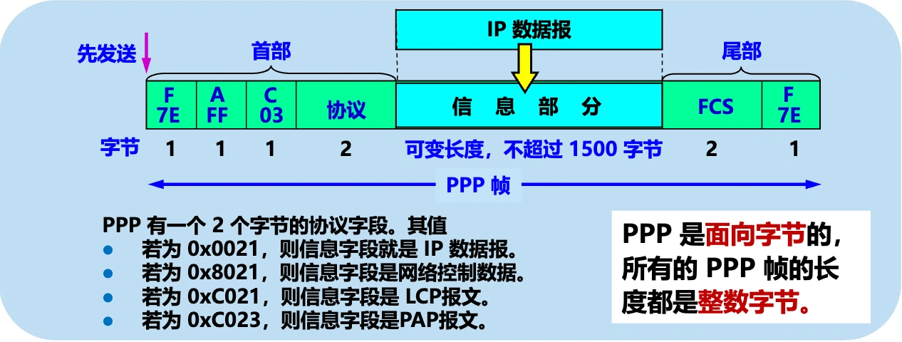

- 各字段的意义
    - **首部**：4 个字段
        - 标志字段 F：`0x7E`。标识一个物理帧的起始和结束，连续两帧之间只有一个标志字段。
        - 地址字段 A：置为 `0xFF`，广播地址。实际上不起作用。
        - 控制字段 C：通常置为 `0x03`。
        - 协议字段：长度两字节
            - `0x0021`：信息字段是 IP 数据报。
            - `0x8021`：信息字段是网络控制数据。
            - `0xC021`：信息字段是 LCP 报文。
            - `0xC023`：信息字段是 PAP 报文。
    - **信息字段**：承载网络层数据包，长度可变，不超过 1500 字节。
    - **尾部**：2 个字段。
        - FCS：长度 2 字节，主要对 PPP 数据帧传输的正确性进行检测。
        - 标志字段 F：`0x7E`。
- 透明传输机制
    - 字节填充：为了保证数据传输的透明性，在信息字段部分中对特殊字段进行转义
        

        - 标志字段 `0x7E` 替换为 `0x7D5E`
        - 转义字符 `0x7D` 替换为 `0x7D5D`
        - 控制字段 `0x03` 替换为 `0x7D23`
    - 零比特填充：在信息字段中每连续出现 5 个 `1` 比特时，发送端自动插入一个 `0` 比特，接收端在接收到数据时，遇到连续 5 个 `1` 比特后，自动删除后面的 `0` 比特。
        

### PPP 协议的工作状态
- PPP 链路初始化过程：
    - 用户拨号接入 ISP 后，就建立了一条从用户个人电脑到 ISP 的物理连接。
    - 用户个人电脑向 ISP 发送一系列的链路控制协议 LCP 分组（封装成多个 PPP 帧），以便建立 LCP 连接。
    - 如果配置了验证，将开始 CHAP 或 PAP 验证。如果没有配置验证，则直接进入网络层配置。
    - 之后进行网络层配置。网络控制协议 NCP 给新接入的用户个人电脑分配一个临时的 IP 地址。
    - 当用户通信完毕时，NCP 释放网络层连接，收回原来分配出去的 IP 地址。LCP 释放数据链路层连接。最后释放的是物理层的连接。
- PPP 协议的状态图
    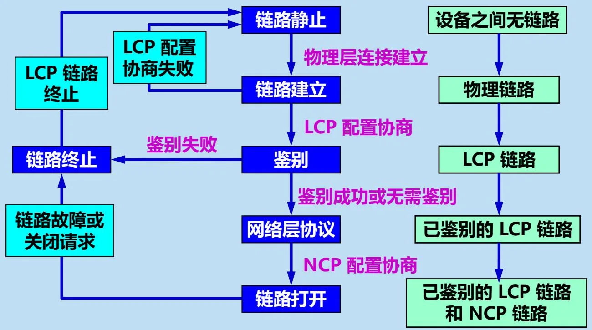

## 使用广播信道的数据链路层
### 局域网的数据链路层
- 局域网的特点：
    1. 网络为一个单位所拥有；
    2. 地理范围和站点数目均有限。
- 局域网的优点：
    1. 具有广播功能，从一个站点可很方便地访问全网。
    2. 便于系统的扩展和逐渐地演变，各设备的位置可灵活调整和改变。
    3. 提高了系统的可靠性、可用性和生存性。
- IEEE 的 802 标准委员会定义了多种主要的 LAN 网：
    - 以太网（Ethernet）
    - 令牌环网（Token Ring）
    - 光纤分布式接口网络（FDDI）
    - 异步传输模式网（ATM）
    - 无线局域网（WLAN）。
- 局域网拓扑结构
    
- 共享信道带来的问题：若多个设备在共享的广播信道上同时发送数据，则会造成彼此干扰，导致发送失败。
- 媒体共享技术
    - 静态划分信道：
        1. 频分复用
        2. 时分复用
        3. 波分复用
        4. 码分复用
    - 动态媒体接入控制（多点接入）：
        1. 随机接入：所有的用户可随机地发送信息。
        2. 受控接入：用户必须服从一定的控制。如轮询（polling）。
- 局域网数据链路层分为 2 个子层
    - 示意图
        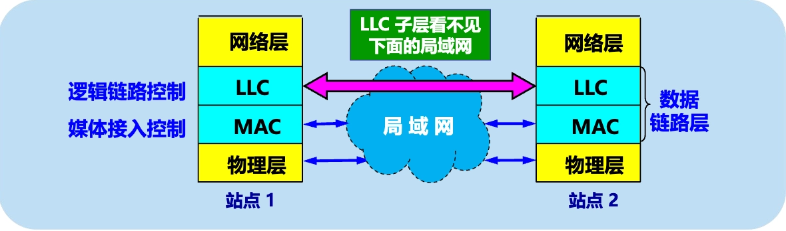
    - **逻辑链路控制子层** LLC（Logical Link Control）：与传输媒体无关。
        - LLC 负责识别网络层协议，然后对它们进行封装。LLC 报头告诉数据链路层一旦帧被接收到时，应当对数据包做何处理。
        - LLC 的主要功能：
            - 传输可靠性保障和控制
            - 数据包的分段与重组
            - 数据包的顺序传输
    - **媒体接入控制子层** MAC（Medium Access Control）：与传输媒体有关。
        - MAC 解决当局域网中共用信道的使用产生竞争时，如何分配信道的使用权问题
        - MAC 的主要功能：
            - 数据帧的封装/卸装
            - 帧的寻址和识别
            - 帧的接收与发送
            - 链路的管理
            - 帧的差错控制
        - MAC 子层负责把物理层的“0”、“1”比特流组建成帧，并通过帧尾部的错误校验信息进行错误校验；提供对共享介质的访问方法，包括以太网的带冲突检测的载波侦听多路访问（CSMA/CD）、令牌环（TokenRing）、光纤分布式数据接口（FDDI）等。
        - MAC 子层分配单独的局域网地址，就是通常所说的 MAC 地址（物理地址）。MAC 子层将目标计算机的物理地址添加到数据帧上，当此数据帧传递到对端的 MAC 子层后，它检查该地址是否与自己的地址相匹配，如果帧中的地址与自己的地址不匹配，就将这一帧抛弃；如果相匹配，就将它发送到上一层中。
- **适配器**
    - 适配器作用：计算机通过适配器和局域网进行通信
        
    - 适配器的主要功能：
        - 进行串行/并行转换
        - 包的装配和拆装
        - 网络存取控制
        - 数据缓存
        - 实现以太网协议
    - 适配器分类
        - 按网卡支持的局域网类型分类：ATM 网卡、令牌环网卡和以太网网卡等
        - 按网卡支持的传输速率分类：普通 10 Mbit/s 网卡、高速 100 Mbit/s 网卡、10/100 Mbit/s 自适应网卡、1000 Mbit/s 网卡。
        - 按网卡所支持的传输介质类型分类：双绞线网卡、粗缆网卡、细缆网卡、光纤网卡。
    - 主要技术指标：传输速率、缓存数量、总线、DMA 控制器、智能芯片

### 载波侦听多路访问/冲突检测技术（CSMA/CD 协议）
- 最早的以太网：将许多计算机都连接到一根总线上。
    - 总线特点：易于实现广播通信，简单，可靠。
        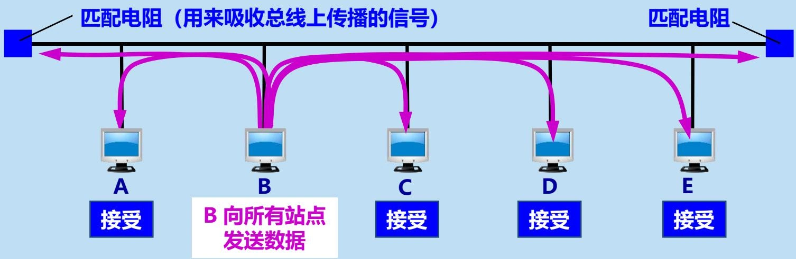
    - 为了实现一对一通信，将接收站的硬件地址写入帧首部中的目的地址字段中。仅当数据帧中的目的地址与适配器硬件地址一致时，才能接收这个数据帧。
        
    - 总线缺点：多个站点同时发送时，会产生发送碰撞或冲突，导致发送失败。
        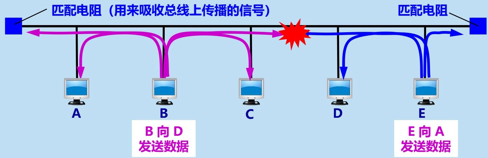
- 以太网采取的两种重要措施
    1. 采用较为灵活的无连接的工作方式。
        - 无连接：不必先建立连接就可以直接发送数据。
        - 对发送的数据帧不进行编号，也不要求对方发回确认。
        - 提供不可靠的交付服务，尽最大努力交付，对差错帧是否重传由上层决定。
        - 同一时间只允许一个站点发送数据，采用简单随机接入，使用 CSMA/CD 协议减少冲突发生概率。
    2. 发送的数据都使用曼彻斯特（Manchester）编码。
        - 曼彻斯特编码
            - 曼彻斯特编码：每一位数据周期中间有一个电平跳变，跳变方向表示数据位的值。
            - 差分曼彻斯特编码：每一位数据周期中间时有一个电平跳变，周期开始时是否跳变表示数据位的值。
        - 优点：便于在传输过程中进行同步和检测碰撞。
        - 缺点：所占的频带宽度比原始的基带信号增加了一倍。

#### CSMA/CD 协议概述
- CSMA/CD 协议的要点
    - **多点接入**：总线型网络，许多计算机以多点接入的方式连接在一根总线上。
    - **载波监听**：边发送边监听，发送数据前与发送数据中都必须不停地检测信道。
    - **碰撞检测**：适配器边发送数据，边检测信道上的信号电压的变化情况。电压摆动值超过一定的门限值时，就认为总线上至少有两个站同时在发送数据，表明产生了碰撞（或冲突）。
    - **退避算法**：检测到碰撞后，适配器立即停止发送，等待一段随机时间后再次发送。
- 为什么要进行碰撞检测
    - 因为信号传播时延对载波监听产生了影响
    - 示意图
        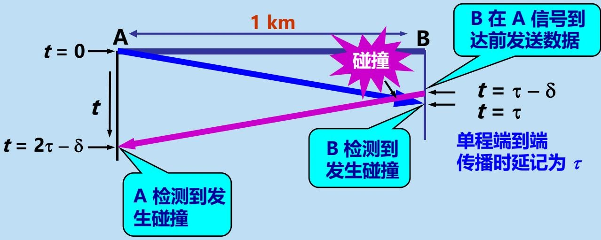
    - 可见：每一个站在自己发送数据之后的一小段时间内，存在着遭遇碰撞的可能性。
    - **A 需要单程传播时延的 2 倍的时间，才能确定是否与 B 的发送产生了冲突**。

#### CSMA/CD 协议的关键参数
- **争用期**
    - 定义：以太网的端到端**往返时延** $2 \tau$ 称为争用期，或碰撞窗口。
        - 经过争用期这段时间还没有检测到碰撞，才能肯定这次发送不会发生碰撞。
    - 10 Mbit/s 以太网争用期的长度 $2 \tau = 51.2 ~\mu s = 512$ 比特时间。
- **最短帧长**
    - 定义：为了保证发送站在发送完一帧数据后，仍然有足够的时间来检测碰撞，规定以太网的最短帧长为争用期内所能发送的最大数据量。
        - 以太网在发送数据时，若最短帧长内都没有发生冲突，则后续的数据就不会发生冲突。
        - 以太网规定凡长度小于最短有效帧长的帧都是由于冲突而异常中止的无效帧，应当立即将其丢弃。
    - 10 Mbit/s 以太网的最短帧长 $51.2 ~\mu s \times 10 ~Mbit/ s = 512 ~bit = 64 ~B$
- **最大端到端长度**
    - 定义：为了保证发送站在发送完一帧数据后，仍然有足够的时间来检测碰撞，规定以太网的最大端到端长度，使得单程传播时延 $\tau$ 不超过争用期的一半。
    - 10 Mbit/s 以太网的最大端到端长度
        - 以太网最大端到端单程时延必须小于争用期的一半（即  $25.6 ~\mu s$ ）。
        - 以太网的最大端到端长度约为 $200000 ~km/s \times 25.6 ~\mu s \approx 5 ~km$  。
- **碰撞后重传的时机**
    - 退避算法：**截断二进制指数退避**（truncated binary exponential backoff）
    - 发生碰撞的站停止发送数据后，要退避一个随机时间后再发送数据。
        1. 基本退避时间  $= 2 \tau$ 
        2. 从整数集合 $[0,1,\dots,(2^k - 1)]$ 中随机地取出一个数，记为 $r$。重传所需的时延 =  $r \times 基本退避时间$
        3. 参数  $k = \min\{重传次数，10\}$
        4. 当重传达 $16$ 次仍不能成功时即丢弃该帧，并向高层报告。
    - 举例
        - 第 1 次冲突重传时：$k = 1，r$ 为 $\{0,1\}$ 集合中的任何一个数。
        - 第 2 次冲突重传时：$k = 2，r$ 为 $\{0,1,2,3\}$ 集合中的任何一个数。
        - 第 3 次冲突重传时：$k = 3，r$ 为 $\{0,1,2,3,4,5,6,7\}$ 集合中的任何一个数。
        - ……
        - 第 10 次及以后冲突重传时：$k = 10，r$ 为 $\{0,1,2,\dots,1023\}$ 集合中的任何一个数。
    - 若连续多次发生冲突，表明可能有较多的站参与争用信道。上述退避算法可使重传需要推迟的平均时间随重传次数而增大（称为**动态退避**），因而减小发生碰撞的概率，有利于整个系统的稳定。
- **帧间最小间隔**
    - 定义：为了保证各站有足够的时间来处理刚接收完的帧，并为下一帧的发送做好准备，以太网规定在两帧之间必须有一个最小的间隔时间。
        - 在等待期间，适配器仍然要监听信道，一旦检测到信道忙，就要重新进行退避。
    - 10 Mbit/s 以太网的帧间最小间隔时间为 $9.6 ~\mu s$，即 $96 ~bit$ 时间。
- **强化碰撞：人为干扰信号**
    - 发送站检测到冲突后，立即停止发送数据帧，接着就发送 32 或 48 比特的人为干扰信号（jamming signal）。
    - 示意图
        

#### CSMA/CD 协议工作流程


1. 站点 A 要发送数据，首先监听信道。
    - 若信道忙，则继续监听，直到信道空闲为止。
2. 若信道空闲，则站点 A 等待一个帧间最小间隔（96 比特时间），然后开始发送数据帧。
    - 若等待过程中信道变为忙，则重新进行退避。
3. 若等待时间结束后信道仍然空闲，则开始发送数据帧，并在发送过程中继续监听信道。
    - 若在发送过程中检测到碰撞，则立即停止发送，并发送人为干扰信号
4. 人为干扰信号发送完毕后，站点 A 立即进行退避。
5. 退避时间结束后，重新开始监听信道等待空闲、等待帧间最小间隔、发送数据帧的过程。

### 使用集线器的星形拓扑
- 传统以太网传输媒体：粗同轴电缆 $\to$ 细同轴电缆 $\to$ 双绞线
    - 采用粗同轴电缆的以太网采用总线形拓扑结构。
        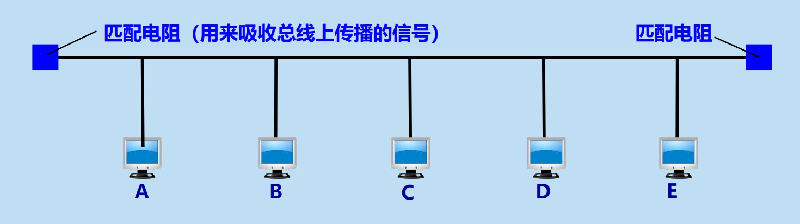
    - 采用双绞线的以太网采用星形拓扑。
        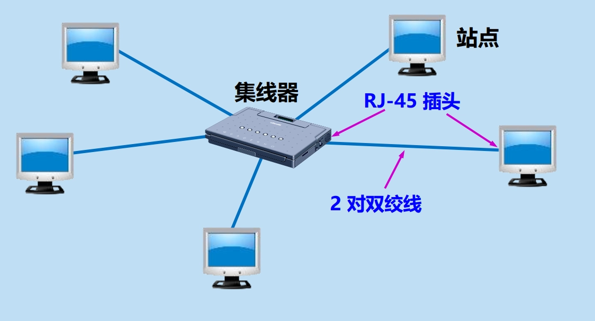
        
        - 在星形的中心则增加了一种可靠性非常高的设备，叫做集线器（hub）。
        - 每个站到集线器的距离不超过 $100~m$。
- 星形以太网 **10BASE-T**
    - 10：速率为 10 Mbit/s
    - BASE：基带传输
    - T：传输介质为双绞线
- 集线器特点
    - 使用电子器件来模拟实际电缆线的工作，因此整个系统仍然像一个传统的以太网那样运行。
    - 使用集线器的以太网在**逻辑上仍是一个总线网**，各工作站使用的还是 CSMA/CD 协议，并共享逻辑上的总线。
    - 很像一个多接口的转发器，**工作在物理层**。
    - 采用了专门芯片，进行自适应串音回波抵消，减少了近端串音。
- 具有 3 个接口的集线器
    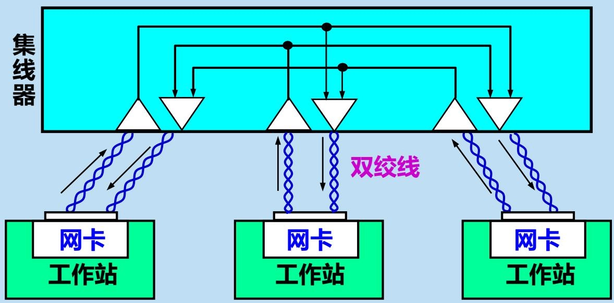

### 以太网的信道利用率
- 多个站在以太网上同时工作就可能会发生碰撞，导致以太网总的信道利用率并不能达到 100%。
- 假设：单程端到端传播时延 $= \tau$，则争用期长度 $= 2\tau$。检测到碰撞后不发送干扰信号。
    - 设帧长  $= L~(bit)$，数据发送速率 $= C~(bit/s)$，则帧的发送时间 $T_{0} = L/C~(s)$。
    - 以太网信道被占用的情况下，成功发送一个帧需要占用信道的时间 $=T_0 + \tau$
        
- 定义参数 $a$ 为以太网单程端到端时延  $\tau$  与帧的发送时间  $T_{0}$  之比：
    $$
    a = \tau / T _ {0}
    $$
    - 为提高利用率，以太网的参数 $a$ 的值应当尽可能小些。
        - 当数据率一定时，以太网的连线的长度受到限制，否则  $\tau$  的数值会太大。
        - 以太网的帧长不能太短，否则  $T_{0}$  的值会太小。
- 定义信道利用率的最大值 $S_{\max}$ 为：
    $$
    S _ {\max } = \frac {T _ {0}}{T _ {0} + \tau} = \frac {1}{1 + a}
    $$
    - 只有当参数 $a \ll 1$ 才能得到尽可能高的极限信道利用率。
    - $S \geq 30\%$  时就已经处于重载的情况，此时很多网络容量被碰撞消耗掉了。

### 以太网的 MAC 层
#### MAC 层的硬件地址
- 定义：局域网中每个适配器固化在 ROM 中的**全球唯一的** 48 位硬件地址，又称为**物理地址/MAC 地址**。
- 48 位 MAC 地址组成（EUI-48）
    - **组织唯一标识符** OUI（Organizationally Unique Identifier）：前 3 个字节（即高 24 位），由 IEEE 注册管理机构 RA 负责向厂家分配
    - **扩展唯一标识符** （Extension Identifier）：后 3 个字节（即低 24 位），由厂家自行分配
    - 单站地址，组地址，广播地址
        - IEEE 规定地址字段的第 1 字节的最低位为 I/G（Individual/Group）位。
        - **单站地址**：I/G 位 = 0。
        - **组地址**：I/G 位 = 1。组地址用来进行多播。
        - **广播地址**：所有 48 位都为 1（全 1）。只能作为目的地址使用。
    - 全球管理与本地管理
        - IEEE 把地址字段第 1 字节的最低第 2 位规定为 G/L（Global/Local）位。
        - **全球管理**：G/L 位 = 0。厂商向 IEEE 购买的 OUI 都属于全球管理。
        - **本地管理**：G/L 位 = 1。这时用户可任意分配网络上的地址。
- 适配器具有**过滤功能**
    - 每收到一个 MAC 帧，先用硬件检查帧中的 MAC 地址。
    - 如果是发往本站的帧则收下，然后再进行其他的处理。
        - “发往本站的帧”包括以下 3 种帧：
            - 单播（unicast）帧（一对一）
            - 广播（broadcast）帧（一对全体）
            - 多播（multicast）帧（一对多）
    - 否则就将此帧丢弃，不再进行其他的处理。
        - **混杂方式**（promiscuous mode）除外：此时以太网适配器只要“听到”有帧在以太网上传输就都接收下来。

#### MAC 帧的格式
- 常用的以太网 MAC 帧格式有 2 种标准：
    1. DIX Ethernet V2 标准：数据链路层仅包含 MAC 子层
    2. IEEE 的 802.3 标准：数据链路层包含 MAC 子层和 LLC 子层
- DIX Ethernet V2 帧格式（最常用）
    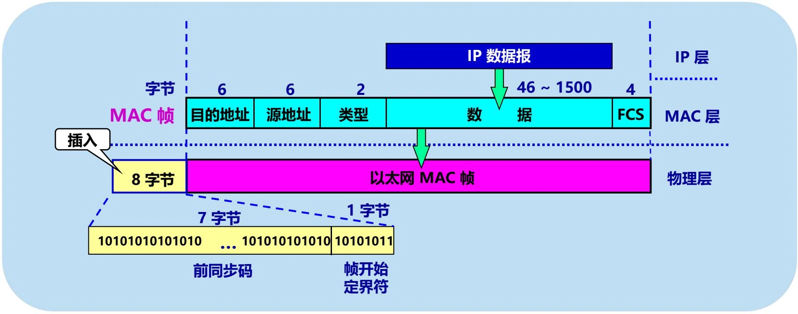

    - 由硬件在帧的前面插入 8 字节。
        - **前同步码**：前 7 字节，用于调整接收端的时钟周期使其与发送端一样。
        - **帧开始定界符**：1 字节，表示后面的信息就是 MAC 帧。
    - 有效的 MAC 帧长度为 64~1518 字节之间。
        - **目的地址字段**：6 字节，表示接收站的 MAC 地址。
        - **源地址字段**：6 字节，表示发送站的 MAC 地址。
        - **类型字段**：2 字节，用来标志上一层使用的是什么协议，以便把收到的 MAC 帧的数据部分交给相应的协议处理。
        - **数据字段/MAC 客户数据字段**：46~1500 字节，当数据字段的长度小于 46 字节时，应在数据字段的后面加入整数字节的填充字段，以保证以太网的 MAC 帧长不小于 64 字节（**最短帧长**）。
        - **帧校验序列** FCS：4 字节，用来对 MAC 帧进行差错检测。
- IEEE 802.3 MAC 帧格式
    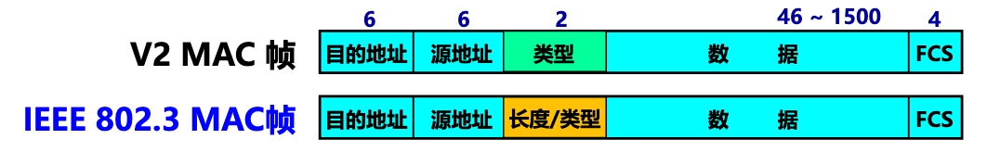

    - IEEE 802.3 标准的 MAC 帧格式与以太网 V2 的 MAC 帧格式的区别主要在于“长度/类型”字段。
        - 当“长度/类型”字段值大于 `0x0600` 时，表示“类型”。
        - 当“长度/类型”字段值小于 `0x0600` 时，表示“长度”，数据字段必须装入逻辑链路控制 LLC 子层的 LLC 帧。
        - 在 802.3 标准的文档中，MAC 帧格式包括了 8 字节的前同步码和帧开始定界符。
    - 现在市场上流行的都是以太网 V2 的 MAC 帧，但大家也常常把它称为 IEEE 802.3 标准的 MAC 帧。
- 无效的 MAC 帧
    - 检查标准
        - 数据字段的长度与长度字段的值不一致
        - 帧的长度不是整数个字节
        - 用收到的帧检验序列 FCS 查出有差错
        - 数据字段的长度不在 46~1500 字节之间
    - 处理原则
        - 简单丢弃（以太网不负责重传丢弃的帧）

## 扩展的以太网
- 常见网络设备
    - **中继器**（Repeater）
        - 物理层设备
        - 作用：**两个网络节点之间物理信号的双向转发工作**。
        - 功能：按位传递信息，完成信号的复制、调整和放大功能，以此来延长网络的长度。
        - 总结：中继器就是简单的信号放大器，信号在传输的过程中是要衰减的，中继器的作用就是将信号放大，使信号能传的更远。
    - **集线器**（Hub）
        - 物理层设备
        - 作用：**连接多个网络节点，形成一个网络段**，也称为**多口中继器**。
        - 总结：集线器就是多端口的中继器，把每个输入端口的信号放大再发到别的端口去，可以实现多台计算机之间的互联。
    - **网桥**（Bridge）
        - 数据链路层设备
        - 作用：**有选择地将现有地址的信号从一个传输介质发送到另一个传输介质**，并能有效地限制两个介质系统中无关紧要的通信。
        - 总结：网桥工作在数据链路层，将两个 LAN 连起来，根据 MAC 地址来转发帧，可以看作一个“低层的路由器”。
    - **交换机**（Switch）
        - 数据链路层设备
        - 作用：**在多个端口之间交换数据帧**，实现局域网内的通信。
        - 功能：能分辨出帧中的源 MAC 地址和目的 MAC 地址，因此可以在任意两个端口间建立联系，在数据帧的始发者和目标接收者之间建立临时的交换路径。
        - 特点：
            - 使用硬件来完成过滤、学习和转发任务，速度快，性能高。
            - **交换机中有一张 MAC 地址表，如果知道目标地址在何处，就把数据发送到指定地点，如果它不知道就发送到所有的端口**。
        - 总结：交换机可以理解为高级的网桥，他有网桥的功能，但性能比网桥强。差别就在于交换机常常用来连接独立的计算机，而网桥连接的目标是 LAN，所以交换机的端口比网桥多。
    - **路由器**（Router）
        - 网络层设备
        - 作用：使用专门的软件协议从逻辑上对整个网络进行划分，检查数据包 IP 地址，并根据路由表或路由算法决定将数据包发送到何处。
        - 总结：路由器的主要工作就是为经过路由器的每个 IP 数据包寻找一条最佳传输路径，并将该数据有效地传送到目的站点。路由器的基本功能是，把数据（IP 报文）传送到正确的网络。
    - **网关**（Gateway）/网间连接器/协议转换器
        - 网络层及以上设备
        - 作用：**连接两个高层协议不同的网络**，并在它们之间进行协议转换，从而实现互联。
        - 总结：网关是连接两个不同网络的接口，比如局域网的共享上网服务器就是局域网和广域网的接口。
- 碰撞域
    - 碰撞域（collision domain）又称为冲突域，指网络中一个站点发出的帧会与其他站点发出的帧产生碰撞或冲突的那部分网络。
    - 碰撞域越大，发生碰撞的概率越高。
    - 示意图：
        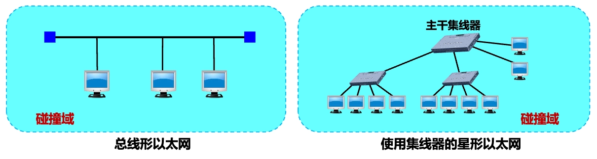

### 在物理层扩展以太网
- 使用光纤扩展
    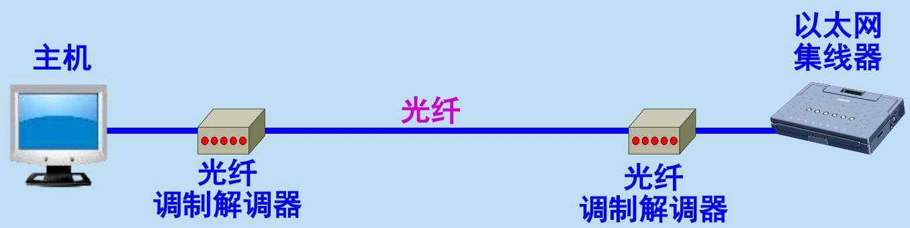

    - 主机使用光纤和一对光纤调制解调器连接到集线器
- 使用集线器扩展
    

    - 优点
        1. 使原来属于不同碰撞域（冲突域）的计算机能够跨碰撞域通信。
        2. 扩大了以太网覆盖的地理范围。
    - 缺点
        1. 碰撞域增大了，总的吞吐量未提高。
        2. 如果使用不同的以太网技术（如数据率不同），那么就不能用集线器将它们互连起来。

### 在数据链路层扩展以太网
- 更为常用。早期使用网桥，现在使用以太网交换机。
    
- 网桥
    - 工作在数据链路层。
    - 根据 MAC 帧的目的地址对收到的帧进行转发和过滤。或者转发，或者丢弃。
- 交换机
    - 工作在数据链路层。
    - 多端口的网桥。
    - 可明显地提高以太网的性能。

#### 以太网交换机
- 以太网交换机的特点
    - 实质上是一个**多接口网桥**：通常有十几个或更多的接口。
    - 每个接口都直接与一个单台主机或另一个以太网交换机相连，并且一般都工作在**全双工**方式。
    - 以太网交换机具有**并行性**。
        - 能同时连通多对接口，使多对主机能同时通信。
        - 相互通信的主机都独占传输媒体，无碰撞地传输数据。
        - **每一个端口和连接到端口的主机构成了一个碰撞域，相当于将碰撞域隔离**。
            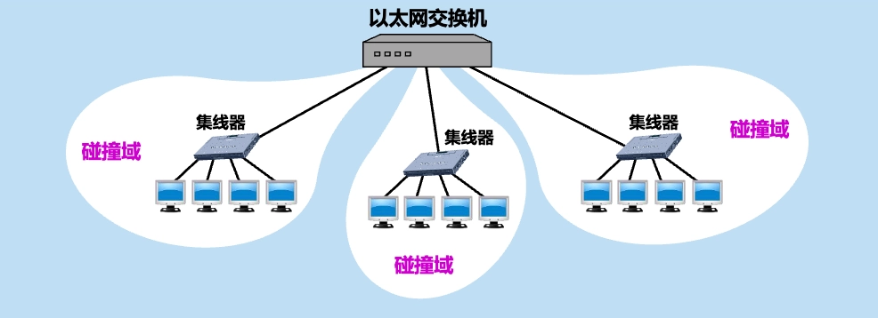
    - 接口有存储器。
    - 即插即用。其内部的**帧交换表**（又称为地址表）是通过**自学习算法**自动地逐渐建立起来的。这种交换表就是一个内容可寻址存储器 CAM（Content addressable Memory）。
    - 使用专用的交换结构芯片，用硬件转发，其转发速率要比使用软件转发的网桥快很多。
- 以太网交换机的优点：**每个用户独享带宽，增加了总容量**
    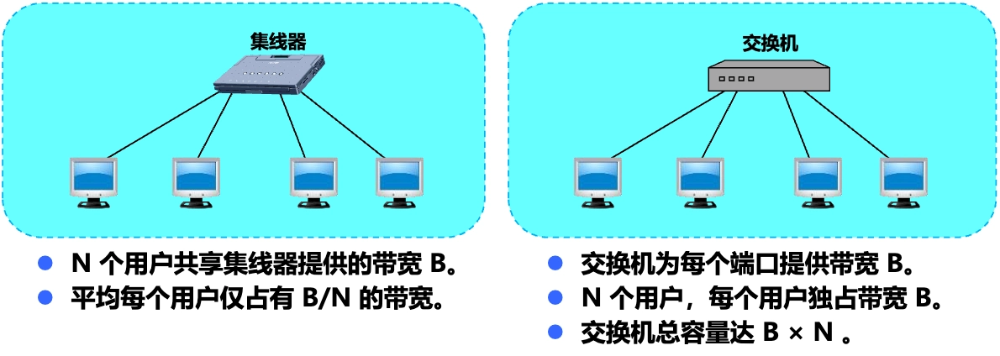
- 以太网交换机的交换方式
    - 存储转发方式
        - 把整个数据帧先缓存，再进行处理。
    - 直通（cut-through）方式
        - 接收数据帧的同时立即按数据帧的目的 MAC 地址决定该帧的转发接口。
        - 缺点：不检查差错就直接将帧转发出去，有可能转发无效帧。

#### 以太网交换机的自学习功能
- 这种自学习方法使得以太网交换机能够即插即用，不必人工进行配置。
- **交换机自学习和转发帧的步骤**：
    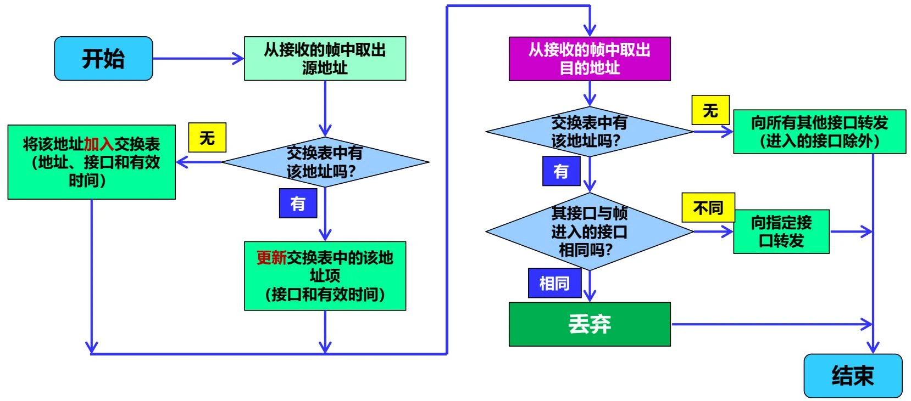

    1. 交换机接收到一个数据帧后，首先检查该帧的源 MAC 地址。
    2. 交换机在其帧交换表中查找该源 MAC 地址。
        - 如果找不到该地址，则将该源 MAC 地址和接收该帧的接口号一起加入到帧交换表中。
        - 如果找到了该地址，则更新该地址对应的接口号为接收该帧的接口号。
    3. 交换机检查该帧的目的 MAC 地址。
        - 如果找不到该地址，则将该帧复制到除接收该帧的接口外的所有接口上。
        - 如果找到了该地址，则将该帧转发到该地址对应的接口上。（若与源地址对应的接口号相同，则丢弃该帧）
- 示例：
    
    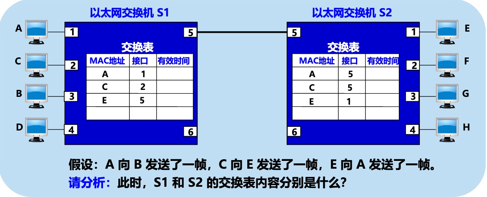
- 存在的问题：回路
    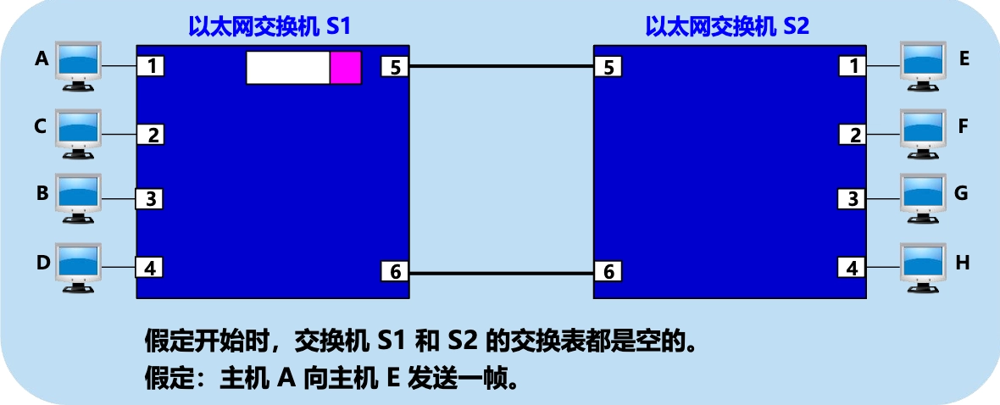

    - 消除回路：使用**生成树协议**（STP，Spanning Tree Protocol），不改变网络的实际拓扑，但在逻辑上则切断某些链路，使得从一台主机到所有其他主机的路径是无环路的树状结构，从而消除了兜圈子现象。

#### 从总线以太网到星形以太网
- 早期
    - 采用无源的总线结构。
    - 使用 CSMA/CD 协议，以半双工方式工作。
- 现在
    - 以太网交换机为中心的星形结构。
    - 不使用共享总线，没有碰撞问题，不使用 CSMA/CD 协议，以全双工方式工作。
    - 但仍然采用以太网的帧结构。

### 虚拟局域网
#### 以太网存在的主要问题
- 广播风暴
    - 一个以太网是一个广播域（broadcast domain）：其中任何一台设备发出的广播通信都能被该部分网络中的所有其他设备所接收。
    - 交换机之间的冗余链路形成广播风暴。
- 安全问题
    - **交换机每个接口都处于一个独立的碰撞域（或冲突域）中，但所有计算机都处于同一个广播域中**。
    - 任何一台计算机发出的广播帧都能被该局域网内的所有计算机接收。
- 管理困难

#### 虚拟局域网 VLAN
- 利用以太网交换机可以很方便地实现虚拟局域网 VLAN（Virtual LAN）。
- IEEE 802.1Q 对虚拟局域网 VLAN 的定义：虚拟局域网 VLAN 是由一些局域网网段构成的**与物理位置无关的逻辑组**，而这些网段具有某些共同的需求。每一个 VLAN 的帧都有一个明确的标识符，指明发送这个帧的计算机是属于哪一个 VLAN。
- 虚拟局域网其实只是局域网给用户提供的一种服务，并不是一种新型局域网。
- 说明：
    - 示意图
        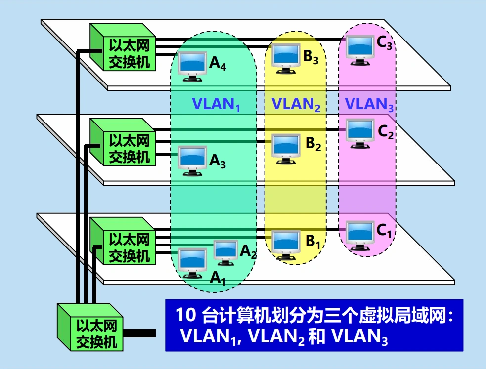
    - 10 台计算机划分为三个虚拟局域网：VLAN1，VLAN2 和 VLAN3。
    - 每个虚拟局域网是一个独立的广播域：VLAN1，VLAN2 和 VLAN3 是三个不同的广播域。
    - 当 B1 向 VLAN2 工作组内成员发送数据时，工作站 B2 和 B3 将会收到其广播的信息，而 VLAN1 和 VLAN3 的成员 A1，A2，A3，C1，C2 和 C3 则不会收到该信息。
    - 虚拟局域网限制了接收广播信息的工作站数，使得网络不会因传播过多的广播信息（即“广播风暴”）而引起性能恶化。
- 虚拟局域网优点
    1. 改善了性能
    2. 简化了管理
    3. 降低了成本
    4. 改善了安全性

#### 划分虚拟局域网的方法
- **基于交换机端口**
    - 最简单、也是最常用的方法。
    - 属于在第 1 层划分虚拟局域网的方法。
    - 缺点：不允许用户移动。
- **基于计算机网卡的 MAC 地址**
    - 根据用户计算机的 MAC 地址划分虚拟局域网。
    - 属于在第 2 层划分虚拟局域网的方法。
    - 允许用户移动。
    - 缺点：需要输入和管理大量的 MAC 地址。如果用户的 MAC 地址改变了，则需要管理员重新配置 VLAN。
- **基于协议类型**
    - 根据以太网帧的第三个字段“类型”确定该类型的协议属于哪一个虚拟局域网。
    - 属于在第 2 层划分虚拟局域网的方法。
- **基于 IP 子网地址**
    - 根据以太网帧的第三个字段“类型”和 IP 分组首部中的源 IP 地址字段确定该 IP 分组属于哪一个虚拟局域网。
    - 属于在第 3 层划分虚拟局域网的方法。
- **基于高层应用或服务**
    - 根据高层应用或服务、或者它们的组合划分虚拟局域网。
    - 更加灵活，但更加复杂。

#### 虚拟局域网使用的以太网帧格式
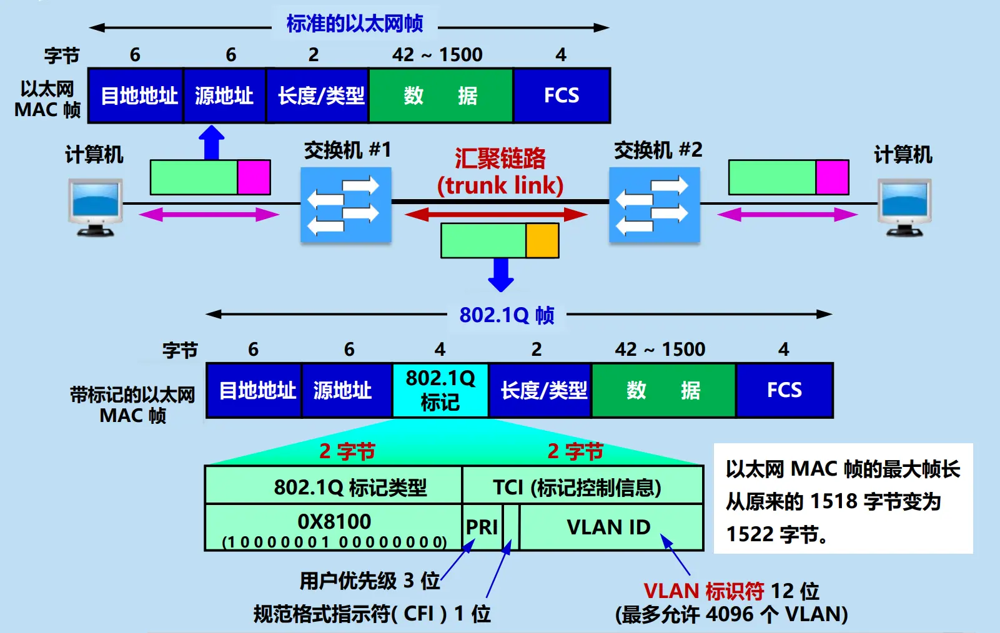

- 标准以太网帧插入 4 字节的 VLAN 标记后变成了 802.1Q 帧（或带标记的以太网帧）
    - 目的地址：6 字节
    - 源地址：6 字节
    - **VLAN 标记/802.1Q 标记**：4 字节
        - **TPID**（Tag Protocol Identifier）：2 字节，值为 `0x8100`，表示这是一个带 VLAN 标记的以太网帧。
        - **标记控制信息** TCI（Tag Control Information）：2 字节
            - **优先级字段**（Priority）：3 位，表示帧的优先级。
            - **规范格式指示符** CFI（Canonical Format Indicator）：1 位，表示 MAC 地址的格式。
            - **VLAN ID**：12 位，表示 VLAN 的标识符，范围为 0~4095，其中 0 和 4095 保留不用，实际可用的 VLAN ID 为 1~4094。 
    - 类型/长度：2 字节
    - 数据字段：46~1500 字节
    - 帧校验序列 FCS：4 字节
- 最大帧长：
    - 标准以太网帧的最大长度为 1518 字节。
    - 带 VLAN 标记的以太网帧的最大长度为 1522 字节。 

## 高速以太网
### 100BASE-T 以太网
- 定义：在双绞线上以星形拓扑结构传输 100 Mbit/s 的基带信号的以太网，又称为快速以太网（Fast Ethernet）。
    - 1995 定为正式标准：IEEE 802.3u。
- 特点：
    1. 在半双工方式下使用 CSMA/CD 协议，而在全双工方式不使用 CSMA/CD 协议。
    2. 使用 IEEE 802.3 协议规定的 MAC 帧格式。
    3. 保持最短帧长不变，但将一个网段的最大电缆长度减小到 100 米。
    4. 帧间时间间隔从原来的 $9.6~\mu s$ 改为现在的 $0.96~\mu s$。
- 物理层标准：

    |名称|媒体|网段最大长度|特点|
    |---|---|---|---|
    |100BASE-TX|铜缆|100 m|2 对 UTP 5 类线或屏蔽双绞线 STP|
    |100BASE-T4|铜缆|100 m|4 对 UTP 3 类线或 5 类线|
    |100BASE-FX|光缆|2000 m|2 根光纤，发送和接收各用一根|

### 吉比特以太网
- 定义：在双绞线上或光纤上传输 1 Gbit/s 的基带信号的以太网，又称为千兆以太网（Gigabit Ethernet）。
    - 1998 定为正式标准：IEEE 802.3z 和 IEEE 802.3ab。
- 特点：
    1. 允许在 1 Gbit/s 下以全双工和半双工 2 种方式工作。
    2. 在半双工方式下使用 CSMA/CD 协议，而在全双工方式不使用 CSMA/CD 协议。
    3. 使用 IEEE 802.3 协议规定的 MAC 帧格式。
    4. 与 10BASE-T 和 100BASE-T 技术向后兼容。
- 物理层标准：
    - 使用 2 种成熟的技术：一种来自现有的以太网，另一种则是美国国家标准协会 ANSI 制定的光纤通道 FC（Fiber Channel）。

    |名称|媒体|网段最大长度|特点|
    |---|---|---|---|
    |1000BASE-SX|光缆|550 m|多模光纤（50 和 62.5 μm）|
    |1000BASE-LX|光缆|5000 m|单模光纤（10 μm）多模光纤（50 和62.5 μm）|
    |1000BASE-CX|铜缆|25 m|使用 2 对屏蔽双绞线电缆 STP|
    |1000BASE-T|铜缆|100 m|使用 4 对 UTP 5 类线|

-  半双工方式工作的吉比特以太网
    - 半双工时采用 CSMA/CD，必须进行碰撞检测。
    - 为保持 64 字节最小帧长度，以及 100 米的网段的最大长度，增加了 2 个功能：
        1. **载波延伸**（carrier extension）：将争用时间增大为 512 字节。凡发送的 MAC 帧长不足 512 字节时，就用一些特殊字符填充在帧的后面。
            
        2. **分组突发**（packet bursting）：当很多短帧要发送时，第 1 个短帧采用载波延伸方法进行填充，随后的一些短帧则可一个接一个地发送，只需留有必要的帧间最小间隔即可。这样就形成了一串分组的突发，直到达到 1500 字节或稍多一些为止，从而提高了信道利用率。
            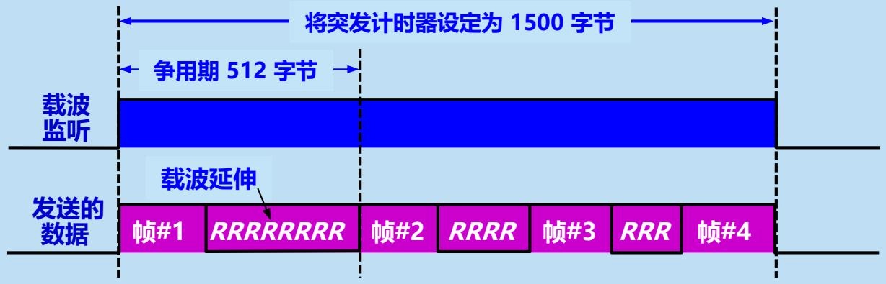

### 10 吉比特以太网（10GE）和更快的以太网
- 定义：在双绞线上或光纤上传输 10 Gbit/s 的基带信号的以太网。
    - 2002 年定为正式标准：IEEE 802.3ae。
- 10 吉比特以太网（10GE）主要特点：
    1. 与 10、100 Mbit/s 和 1 Gbit/s 以太网的帧格式完全相同。
    2. 保留了 IEEE 802.3 标准规定的以太网最小和最大帧长。
    3. 只使用光纤作为传输媒体。
    4. **只工作在全双工方式**，没有争用问题，不使用 CSMA/CD 协议。

- 10GE 以太网的物理层标准

    |名称|媒体|网段最大长度|特点|
    |---|---|---|---|
    |10GBASE-SR|光缆|300 m|多模光纤（0.85 μm）|
    |10GBASE-LR|光缆|10 km|单模光纤（1.3 μm）|
    |10GBASE-ER|光缆|40 km|单模光纤（1.5 μm）|
    |10GBASE-CX4|铜缆|15 m|使用 4 对双芯同轴电缆（twinax）|
    |10GBASE-T|铜缆|100 m|使用 4 对 6A 类 UTP 双绞线|
- 40GE/100GE 以太网的物理层标准

    |物理层|40GE|100GE|
    |---|---|---|
    |在背板上传输至少超过 1 m|40GBASE-KR4|100GBASE-KR4|
    |在铜缆上传输至少超过 7 m|40GBASE-CR4|100GBASE-CR10|
    |在多模光纤上传输至少 100 m|40GBASE-SR4|100GBASE-SR10，*100GBASE-SR4|
    |在单模光纤上传输至少 10 km|40GBASE-LR4|100GBASE-LR4|
    |在单模光纤上传输至少 40 km|*40GBASE-ER|100GBASE-ER4|
- 端到端的以太网传输
    - 以太网的工作范围已经扩大到城域网和广域网，实现了端到端的以太网传输。
    - 优点：
        1. 技术成熟。
        2. 互操作性很好。
        3. 在广域网中使用以太网时价格便宜。
        4. 采用统一的以太网帧格式，简化了操作和管理。

### 使用以太网进行宽带接入
- IEEE 在 2001 年初成立了 802.3 EFM 工作组，专门研究高速以太网的宽带接入技术问题。
- 以太网宽带接入具有以下特点：
    1. 可以提供**双向**的宽带通信。
    2. 可以根据用户对带宽的需求灵活地进行带宽升级。
    3. 可以实现端到端的以太网传输，中间不需要再进行帧格式的转换。
    4. 但不支持用户身份鉴别。
- PPPoE
    - PPPoE（PPP over Ethernet）：在以太网上运行 PPP。
    - 将 PPP 帧封装到以太网中来传输。
    - 现在的光纤宽带接入 FTTx 都要使用 PPPoE 的方式进行接入。
    - 利用 ADSL 进行宽带上网时，从用户个人电脑到家中的 ADSL 调制解调器之间的连接也使用 RJ-45 和 5 类线，也使用 PPPoE。

# 网络层
## 网络层基本概念
**网络层的功能**：屏蔽不同网络的差异性，实现网络互连与数据转发。

### 网络层提供的两种服务 
- 争论：
    - 网络层应该向运输层提供怎样的服务？面向连接还是无连接？
    - 在计算机通信中，可靠交付应当由谁来负责？是网络还是端系统？
- 两种观点：
    - 面向连接的可靠交付。
    - 无连接的、尽最大努力交付的数据报服务，不提供服务质量的承诺。

#### 虚电路服务
- 基本思路：模仿电信网络的设计思想，**由网络层提供面向连接的可靠通信服务**。通信之前先建立虚电路 VC（Virtual Circuit），即逻辑连接，以保证双方通信所需的一切网络资源。
    
- 如果使用可靠传输的网络协议，可使所发送的分组无差错按序到达终点，不丢失、不重复，即**由网络层负责可靠的通信**。

#### 数据报服务
- 基本思路：模仿邮政系统的设计思想，**由网络层提供简单灵活的、无连接的、尽最大努力交付的数据报服务**。通信之前不需要建立连接，分组独立发送。
    
- 网络层不提供服务质量的承诺。即所传送的分组可能出错、丢失、重复和失序（不按序到达终点），也不保证分组传送的时限，而是**由主机中的运输层负责可靠的通信**。

#### 虚电路服务与数据报服务的对比

| 对比的方面 | 虚电路服务 | 数据报服务 |
| --- | --- | --- |
| 思路 | 可靠通信应当由网络来保证 | 可靠通信应当由用户主机来保证 |
| 连接的建立 | 必须有 | 不需要 |
| 终点地址 | 仅在连接建立阶段使用，每个分组使用短的虚电路号 | 每个分组都有终点的完整地址 |
| 分组的转发 | 属于同一条虚电路的分组均按照同一路由进行转发 | 每个分组独立选择路由进行转发 |
|当结点出故障时|所有通过出故障的结点的虚电路均不能工作|出故障的结点可能会丢失分组，一些路由可能会发生变化|
|分组的顺序|总是按发送顺序到达终点|到达终点时不一定按发送顺序|
|端到端的差错处理和流量控制|可以由网络负责，也可以由用户主机负责|由用户主机负责|

### 网络层的两个层面


- 在路由器之间传送的信息有以下 2 大类：
    - 数据
    - 路由信息（为数据传送服务）
- 网络层可分为两个层面：
    1. **控制层面**（control plane）
        - 根据路由选择协议所用的路由算法计算路由，创建出本路由器的**路由表**。
        - 许多路由器协同工作
        - 采用软件计算，速度较慢
    2. **数据层面**（data plane，也称为转发层面 forwarding plane）
        - 路由器根据本路由器生成的**转发表**，把收到的分组从查找到的对应接口转发出去
        - 各个路由器独立工作
        - 采用硬件进行转发，速度较快
- 软件定义网络 SDN（Software Defined Network）
    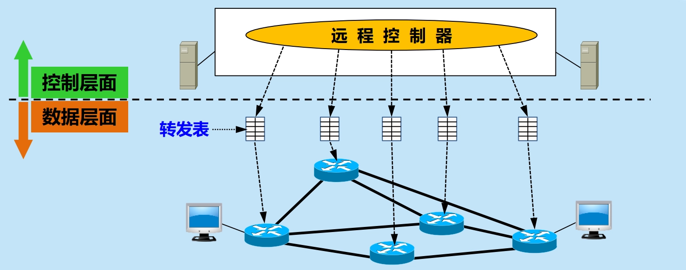

    - 远程控制器：计算出最佳的路由，在每一个路由器中生成其正确的转发表。
    - 路由器：查找转发表，转发分组。

## 网际协议 IP
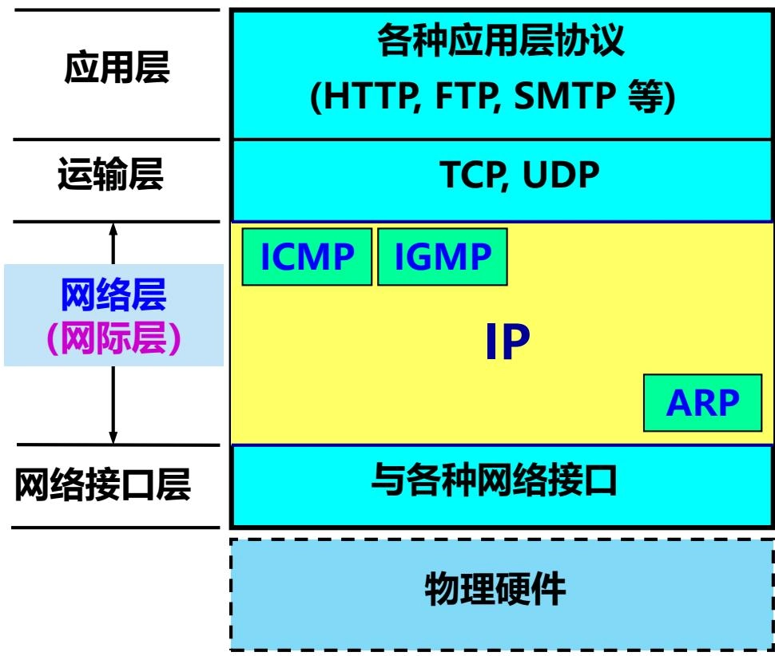

- 与网际协议 IPv4 配套的 3 个协议：
    - 地址解析协议 ARP（Address Resolution Protocol）
    - 网际控制报文协议 ICMP（Internet Control Message Protocol）
    - 网际组管理协议 IGMP（Internet Group Management Protocol）
- 采用**无连接的、尽最大努力交付的数据报服务**。

### 虚拟互连网络
- 使用**中间设备**进行互连

    |层|中间设备|是否属于网络互连|
    |---|---|---|
    |运输层及以上|网关（gateway）|是|
    |网络层|路由器（router）|是|
    |数据链路层|网桥或桥接器（bridge），交换机（switch）|否，仅把一个网络扩大，仍是一个网络|
    |物理层|转发器（repeater）|否，仅把一个网络扩大，仍是一个网络|
- 互连网络与虚拟互连网络
    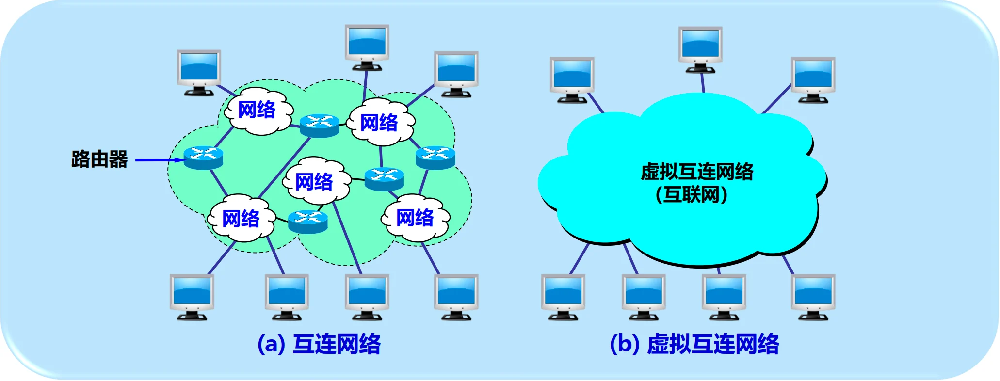
- IP 网的意义
    - 当互联网上的主机进行通信时，就好像在一个网络上通信一样，看不见互连的各具体的网络异构细节
    - 如果在这种覆盖全球的 IP 网上层使用 TCP、UDP 协议，那么就是现在的互联网（Internet）
- 分组在虚拟互连网络中的传送
    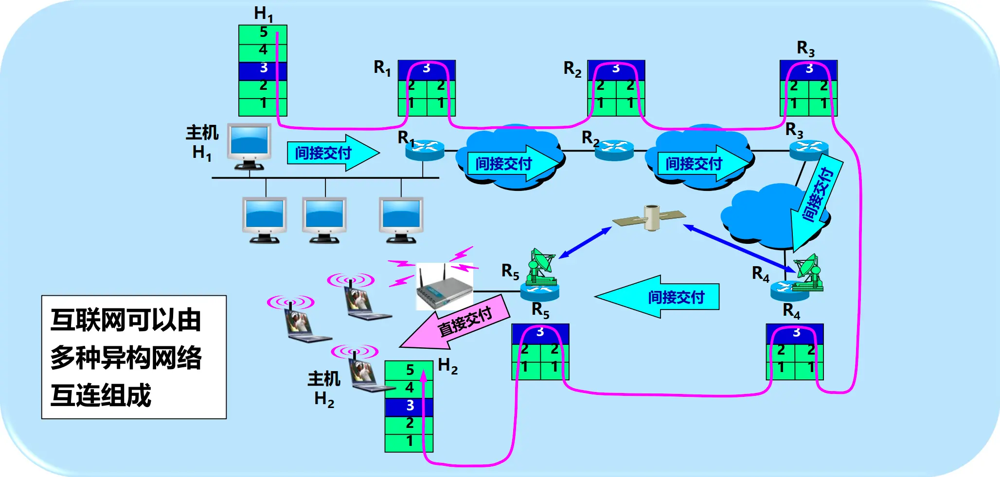
    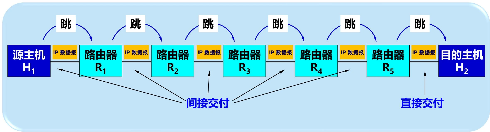

### IP 地址
在 TCP/IP 体系中，IP 地址是一个最基本的概念，没有 IP 地址就无法和网上的其他设备进行通信。

#### IP 地址及其表示方法


- **点分十进制记法**：
    - IP 地址：32 位二进制代码
    - 分组：每 8 位为一组，将二进制数转换为十进制数
    - 用 `.` 分隔开来，形成 4 个十进制数
- 互联网上的每台主机（或路由器）的**每个接口**分配一个在**全世界唯一**的 IP 地址，由互联网名字和数字分配机构 ICANN（Internet Corporation for Assigned Names and Numbers）进行分配
    - IP 地址在整个互联网范围内是唯一的
    - IP 地址指明了连接到某个网络上的一个主机

#### 分类的 IP 地址


- 定义：IP 地址采用 2 级结构
    - **IP 地址 = {<网络号>，<主机号>}**
    - 网络号（net-id）：$n$ 位
    - 主机号（host-id）：$32-n$ 位
- 将 IP 地址分为 5 类：A、B、C、D、E 类

    | 类别 | 网络号位数 | 主机号位数 | 地址范围 | 用途 |
    | --- | --- | --- | --- | --- |
    | **A类** | 8 | 24 | `1.0.0.0` - `126.255.255.255` | 单播 |
    | **B类** | 16 | 16 | `128.0.0.0` - `191.255.255.255` | 单播 |
    | **C类** | 24 | 8 | `192.0.0.0` - `223.255.255.255` | 单播 |
    | **D类** |  |  | `224.0.0.0` - `239.255.255.255` | 多播 |
    | **E类** |  |  | `240.0.0.0` - `255.255.255.255` | 保留 |
- 一般不使用的特殊的 IP 地址

    |网络号|主机号|源地址使用|目的地址使用|代表的意思|
    |---|---|---|---|---|
    |0|0|可以|不可|在本网络上的本主机（见 6.6 节 DHCP 协议）|
    |0|X|可以|不可|在本网络上主机号为 X 的主机|
    |全 1|全 1|不可|可以|只在本网络上进行广播（各路由器均不转发）|
    |Y|全 1|不可|可以|对网络号为 Y 的网络上的所有主机进行广播|
    |127|非全 0 或全 1 的任何数|可以|可以|用于本地软件环回测试|
- 分类的 IP 地址的优缺点
    - 优点：
        - 管理简单
        - 使用方便
        - 转发分组迅速
        - 划分子网，灵活地使用
    - 缺点：
        - 大地址块，浪费地址资源
        - 即使采用划分子网的方法，也无法解决 IP 地址枯竭的问题 

#### 无分类编址 CIDR
- CIDR（Classless Inter-Domain Routing）：无分类域间路由选择。
- 定义：IP 地址采用 2 级结构
    - **IP 地址 = {<网络前缀>，<主机号>}**
    - 网络前缀（network prefix）：$n$ 位，$n$ 不固定，可以在 $0 \sim 32$ 之间选取任意值。
    - 主机号（host-id）：$32-n$ 位
- CIDR 记法：**斜线记法**（slash notation）
    - 形式：`a.b.c.d/n`：二进制 IP 地址的前 n 位是网络前缀。
    - 示例：`128.14.35.7/20`：前 20 位是网络前缀。
- 地址块
    - 定义：CIDR 把网络前缀都相同的所有连续的 IP 地址组成一个 CIDR 地址块。
    - **网络地址**（network address）：
        - 定义：CIDR 地址块中主机号全 0 的 IP 地址称为该地址块的网络地址。
        - 作用：用于区分不同的 CIDR 地址块。
    - 一个 CIDR 地址块包含的 IP 地址数目，取决于网络前缀的位数。
        - 若网络前缀为 $n$ 位，则该地址块中**包含的 IP 地址数目**为 $2^{32-n}$ 个，**可指派给主机使用的地址数目**为 $2^{32-n}-2$ 个
            - 主机号全 0 为子网的网络地址（即该子网的 “标识地址”），用于区分不同子网，不能分配给主机使用。
            - 主机号全 1 为广播地址，不能分配给主机使用。
        - 网络前缀越短，地址块所包含的地址数越多。
    - 示例：
        - `123.45.67.8/24`：是 IP 地址，同时指明了网络前缀为 24 位（3 字节）。该地址是 `123.45.67.0/24` 地址块中的一个地址。
        - `123.45.67.0/24`：是包含有多个 IP 地址的地址块，同时也是这个地址块中主机号为全 0 的 IP 地址。
        - `123.45.67.8`：是 IP 地址，但未指明网络前缀长度，不知道其网络地址。
        - `123.45.67.0`：不能指明一个网络地址，因为无法知道网络前缀是多少。
- **地址掩码/子网掩码**（address mask/subnet mask）
    - 定义：用于指明网络前缀长度的 32 位二进制数，由一连串 1 和接着的一连串 0 组成，1 的个数就是网络前缀的长度。
    - 作用：让机器从 IP 地址迅速算出网络地址。
    - 示例
        - `/20` 地址块的地址掩码：`11111111 11111111 11110000 00000000`
        - 点分十进制记法：`255.255.240.0`
        - CIDR 记法：`255.255.240.0/20`。
    - 默认地址掩码：分类的 IP 地址的可以视为 CIDR 地址块

        | 类别 | 默认地址掩码 | 说明 |
        | --- | --- | --- |
        | A 类地址 | `255.0.0.0` | 网络号占用 8 位，主机号占用 24 位 |
        | B 类地址 | `255.255.0.0` | 网络号占用 16 位，主机号占用 16 位 |
        | C 类地址 | `255.255.255.0` | 网络号占用 24 位，主机号占用 8 位 |
    - **网络地址 =（二进制的 IP 地址）AND（地址掩码）**
        - 示例：已知 IP 地址是 `128.14.35.7/20`。求网络地址。
            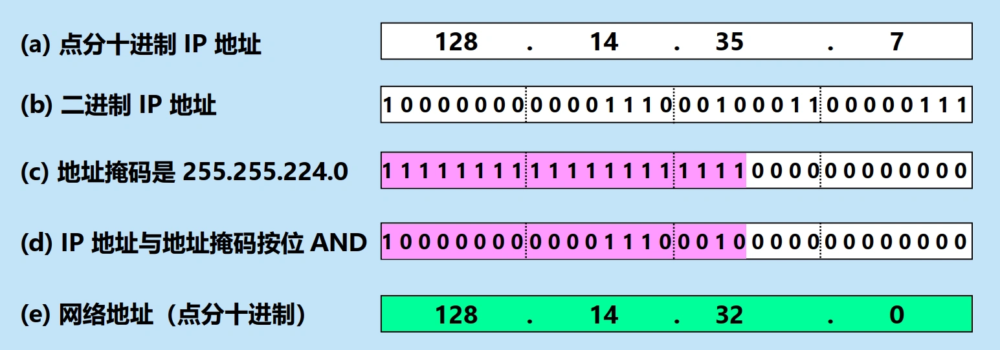
- 构造超网：当子网掩码 1 的个数小于 24 时，CIDR 地址块都包含了多个 C 类地址（是一个 C 类地址的 $2^{n}$ 倍），因此在文献中有时称 CIDR 编址为“构造超网”。
- 私有 IP 地址
    - 定义：专门为局域网内部使用而保留的 IP 地址，不在互联网上使用。
    - 私有 IP 地址范围：

        | 类别 | 地址范围 | CIDR 表示法 |
        | --- | --- | --- |
        | A 类私有地址 | `10.0.0.0` - `10.255.255.255` | `10.0.0.0/8` |
        | B 类私有地址 | `172.16.0.0` - `172.31.255.255` | `172.16.0.0/12` |
        | C 类私有地址 | `192.168.0.0` - `192.168.255.255` | `192.168.0.0/16` |
- 三个特殊的 CIDR 地址块

    | 网络前缀长度 | 子网掩码 | 说明 |
    |---|---|---|
    | `/32` | `255.255.255.255` | 就是一个 IP 地址。这个特殊地址用于主机路由 |
    | `/31` | `255.255.255.254` | 只有两个 IP 地址，其主机号分别为 0 和 1。这个地址块用于点对点链路 |
    | `/0` | `0.0.0.0` | 同时 IP 地址也是全 0，即 `0.0.0.0/0`。用于默认路由 |
- 路由聚合（route aggregation）
    - 定义：把多个连续的 CIDR 地址块合并成一个更大的 CIDR 地址块的过程，称为路由聚合（也称为地址聚合 address aggregation 或超网汇总 supernetting）。
    - 作用：减小路由器转发表的长度。 
    - 示例：
        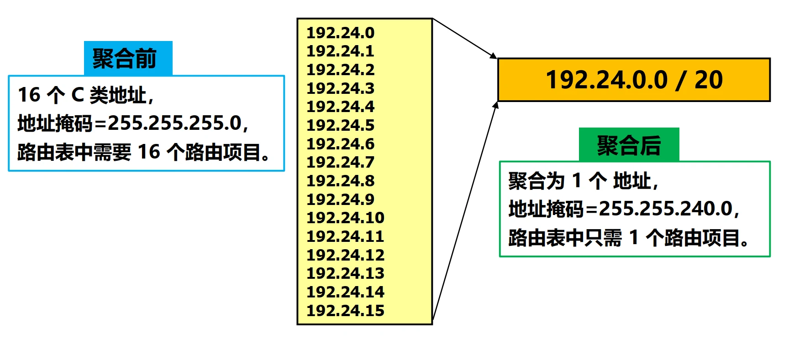
- CIDR 地址块划分示例
    

    - 这个 ISP 共有 64 个 C 类网络。如果不采用 CIDR 技术，则在与该 ISP 的路由器交换路由信息的每一个路由器的转发表中，需要有 64 行。采用地址聚合后，转发表中只需要用 1 行来指出到 `206.0.64.0/18` 地址块的下一跳。在 ISP 内的路由器的转发表中，也仅需用 `206.0.68.0/22` 这 1 个项目，就能把外部发送到这个大学各系的所有分组，都转发到大学的路由器。

#### IP 地址的特点
1. 每个 IP 地址都由网络前缀和主机号两部分组成（IP 地址是一种**分等级**的地址结构）。
    - 方便了 IP 地址的分配和管理。
    - 实现路由聚合，减小了转发表所占的存储空间，以及查找转发表的时间。
2. IP 地址是标志一台主机（或路由器）和一条链路的接口。
    - 当一台主机同时连接到两个网络上时，该主机就必须同时具有两个相应的 IP 地址，其网络号必须是不同的。这种主机称为多归属主机（multihomed host）。
    - 一个路由器至少应当连接到两个网络，因此一个路由器至少应当有两个不同的 IP 地址。
3. 转发器或交换机连接起来的若干个局域网仍为一个网络
    - 按照互联网的观点，**一个网络（或子网）是指具有相同网络前缀的主机的集合**。
    - 转发器或交换机连接起来的若干个局域网都具有同样的网络号，它们仍为一个网络。
    - **具有不同网络号的局域网必须使用路由器进行互连**。
4. 在 IP 地址中，所有分配到网络前缀的网络都是平等的。
    - 互联网同等对待每一个 IP 地址，不管是范围很小的局域网，还是可能覆盖很大地理范围的广域网

- 说明：
    - 同一个局域网上的主机或路由器的 IP 地址中的网络号必须一样。
    - 路由器的每一个接口都有一个不同网络号的 IP 地址。
    - 两个路由器直接相连的接口处，可指明也可不指明 IP 地址。如指明 IP 地址，则这一段连线就构成了一种只包含一段线路的特殊“网络”。这种网络**仅需 2 个 IP 地址**，可以使用 `/31` 地址块。主机号可以是 0 或 1。

    

#### IP 地址与 MAC 地址


- IP 地址
    - 虚拟地址、软件地址、逻辑地址。
    - 网络层和以上各层使用。
    - 放在 IP 数据报的首部。
- MAC 地址
    - 固化在网卡上的 ROM 中。
    - 硬件地址、物理地址。
    - 数据链路层使用。
    - 放在 MAC 帧的首部。

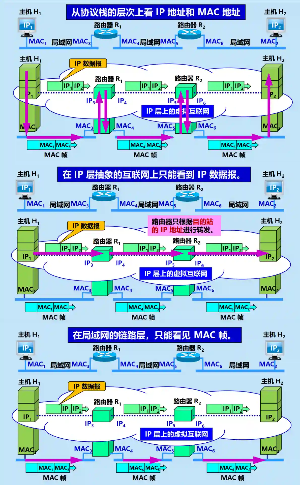

- 不同层次、不同区间使用的源地址和目的地址
    <table>
    <tr>
    <td rowspan="2"></td>
    <td colspan="2">在网络层写入 IP 数据报首部的地址</td>
    <td colspan="2">在数据链路层写入 MAC 帧首部的地址</td>
    </tr>
    <tr><td>源地址</td><td>目的地址</td><td>源地址</td><td>目的地址</td></tr>
    <tr><td>H1→R1</td><td>IP1</td><td>IP2</td><td>MAC1</td><td>MAC3</td></tr>
    <tr><td>R1→R2</td><td>IP1</td><td>IP2</td><td>MAC4</td><td>MAC5</td></tr>
    <tr><td>R2→H2</td><td>IP1</td><td>IP2</td><td>MAC6</td><td>MAC2</td></tr>
    </table>

    - 尽管互连在一起的网络的 MAC 地址体系各不相同，但 IP 层抽象的互联网却**屏蔽**了下层这些很复杂的细节。
    - 只要我们在网络层上讨论问题，就能够使用统一的、抽象的 IP 地址研究主机和主机或路由器之间的通信。

### 地址解析协议 ARP
- 实现 IP 通信时使用了两个地址：
    1. IP 地址（网络层地址）
    2. MAC 地址（数据链路层地址）
- 地址解析协议 ARP（Address Resolution Protocol）：**用于从 IP 地址解析出 MAC 地址。**

#### ARP 高速缓存（ARP cache）
- ARP 维护一个高速缓存
    - 存放 IP 地址到 MAC 地址的映射表：
        - **映射表：<IP 地址；MAC 地址；生存时间（Age）；类型等>**
    - 使用 `arp -a` 查看。
    - 映射表动态更新（新增或超时删除）。
- ARP 高速缓存的作用
    - 存放最近获得的 IP 地址到 MAC 地址的绑定。
    - 减少 ARP 广播的通信量。
        - 主机 A 在发送其 ARP 请求分组时，就将自己的 IP 地址到 MAC 地址的映射写入自己的 ARP 高速缓存中。
        - 当主机 B 收到 A 的 ARP 请求分组时，就将主机 A 的 IP 地址及其对应的 MAC 地址映射写入主机 B 自己的 ARP 高速缓存中。

#### ARP 工作过程
- 当主机 A 欲向本局域网上的某个主机 B 发送 IP 数据报时：
    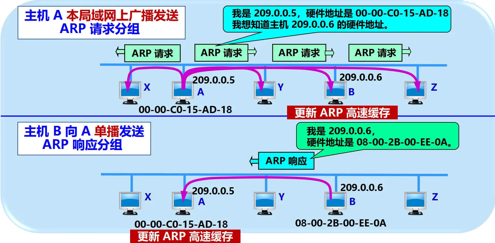
- 步骤：
    1. 主机 A 首先检查自己的 ARP 高速缓存，查看是否有主机 B 的 IP 地址到 MAC 地址的映射。
    2. 如果有，则直接使用该 MAC 地址封装在 MAC 帧的目的地址字段中，发送该 MAC 帧。
    3. 如果没有，则主机 A **广播**一个 ARP 请求分组，请求主机 B 的 MAC 地址。
        - 路由器不转发 ARP 请求
        - **ARP 请求分组**：包含发送方硬件地址 / 发送方 IP 地址 / 目标方硬件地址（未知时填 0）/ 目标方 IP 地址。
    4. 主机 B 收到 ARP 请求分组后，检查该分组中的目标 IP 地址是否是自己的 IP 地址。
        - 如果是，则主机 B 向 A **单播**回复一个 ARP 响应分组，告诉主机 A 自己的 MAC 地址。
            - **ARP 响应分组**：包含发送方硬件地址 / 发送方 IP 地址 / 目标方硬件地址 / 目标方 IP 地址。
        - 如果不是，则丢弃该 ARP 请求分组。
- 流程图
    
- ARP 用于解决**同一个局域网上**的主机或路由器的 IP 地址和 MAC 地址的映射问题。
    - 当 2 台主机不在同一个局域网上时，通信路径：$A \to R_{1} \to B$，即主机 A 询问路由器 $R_{1}$ 的 MAC 地址，将数据报发送给路由器 $R_{1}$，再由路由器 $R_{1}$ 发送给主机 B。
    - 示意图：
        
    - 步骤：
        1. 主机 A 必须知道路由器 $R_{1}$ 的 IP 地址，解析出其 MAC 地址，然后把 IP 数据报传送到路由器 $R_{1}$。
        2. 路由器 $R_{1}$ 必须知道主机 B 的 IP 地址，解析出其 MAC 地址，然后把该数据报传送到主机 B。

#### ARP 报文结构
- **ARP 报文封装在以太网帧中传输**，在 MAC 地址的类型标识当中注明为 `0806`
- MAC 帧格式：
    - 目的地址：广播地址 `FF-FF-FF-FF-FF-FF` 或响应时的单播地址
    - 源地址：发送方的 MAC 地址
    - 类型：`0806` 表示 ARP 协议
    - ARP 报文数据：
        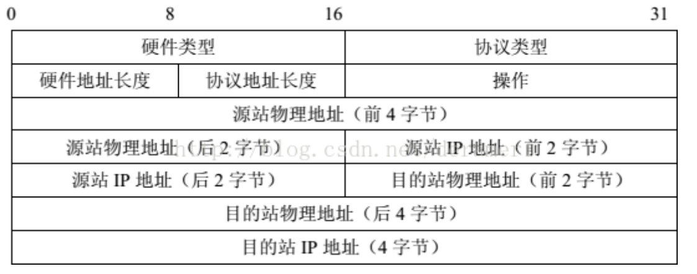
    - FCS 校验序列

#### 使用 ARP 的四种典型情况
| 发送方 | 目的主机所在网络 | 使用 ARP 解析的地址 |
|---|---|---|
| 主机 | 本网络 | 目的主机的 MAC 地址 |
| 主机 | 另一个网络 | 本网络上路由器的 MAC 地址 |
| 路由器 | 本网络 | 目的主机的 MAC 地址 |
| 路由器 | 另一个网络 | 本网络上另一个路由器的 MAC 地址 |

#### ARP 欺骗
- 情景模拟
    - 两台主机 A 和 B 在同一个局域网内通信  
        - A（IP：`192.168.85.1`，MAC：`aa-aa-aa-aa-aa-aa`）
        - B（IP：`192.168.85.100`，MAC：`bb-bb-bb-bb-bb-bb`）
    - 首先 A 不知道 B 在哪，ARP请求数据包含：
        - 源 IP 地址：`192.168.85.1`
        - 源 MAC 地址：`aa-aa-aa-aa-aa-aa`
        - 目标 IP 地址：`192.168.85.100`
        - 目标 MAC 地址：广播 `ff-ff-ff-ff-ff-ff`
    - B 发现该数据包目标 IP 地址是自己，则更新自己的 ARP 缓存，记录 A 的 IP 和 MAC 的对应关系到本地 ARP 高速缓存中。此时 B 已经能够识别 A 了。
    - B 应答 A，会向 A 发送一个 ARP 应答包，包含：
        - 源 IP 地址：`192.168.85.100`
        - 源 MAC 地址：`bb-bb-bb-bb-bb-bb`
        - 目标 IP 地址：`192.168.85.1`
        - 目标 MAC 地址：`aa-aa-aa-aa-aa-aa`
    - A 接受到应答后，A 更新自己的 ARP 缓存，记录 B 的 IP 和 MAC 的对应关系到本地 ARP 高速缓存中。此时 A 已经能够识别 B 了。
- ARP 欺骗的产生
    - 机器在接收到 ARP 应答的时候，不管该机器是否发出过 ARP 请求都会更新自己的 ARP 高速缓存。
    - 利用这一点，C 可以向 A 发送 ARP 应答包，源 IP 填写 B 的，源 MAC 填写 C 自己的：
        - B 源 IP 地址：`192.168.85.100`
        - C 源 MAC 地址：`cc-cc-cc-cc-cc-cc`
        - A 目标 IP 地址：`192.168.85.1`
        - A 目标 MAC 地址：`aa-aa-aa-aa-aa`
    - 这样，A 会将 B 的 IP 和 C 的 MAC 对应关系更新到自己的 ARP 高速缓存中。
    - 同理，C 也可以向 B 发送 ARP 应答包，源 IP 填写 A 的，源 MAC 填写 C 自己的，则 B 也会将 A 的 IP 和 C 的 MAC 对应关系更新到自己的 ARP 高速缓存中。
    - 如果 A 机再利用 `192.168.85.100` 即 B 的 IP 和 B 通信时，从本地缓存用 B 的 IP 查询出了 C 的 MAC 地址。后续数据都传向了 C 的 MAC 地址，B 就收不到了。
- 实现监听攻击、中间人攻击、阻断攻击
- 防御方法：
    - ARP 改用静态的方式
    - 伪造 ARP 数据包检测

### IP 数据报的格式
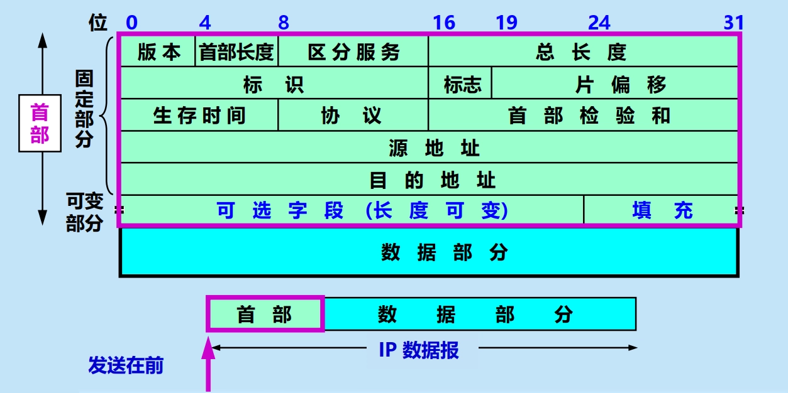

- IP 数据报由首部和数据两部分组成
    - **首部**
        - 首部的前一部分是固定长度，共 20 字节，是所有 IP 数据报必须具有的
        - 首部的后一部分是可选字段，其长度是可变的，最长可达 40 字节
        - 首部总长度可变，最大长度为 60 字节
    - **数据部分**
        - 承载上层协议的数据单元
        - 长度可变
        - 最大长度由首部中的总长度字段指明

#### 首部的固定部分
- **版本**：占 4 位，指 IP 协议的版本。目前的 IP 协议版本号为 4（即 IPv4）。
- **首部长度**：占 4 位，指首部的长度，单位为 **4 字节**，因此首部的最大长度为 60 字节。
- **区分服务**：占 8 位，用来获得更好的服务（QoS技术）。只有在使用区分服务（DiffServ）时，这个字段才起作用。一般情况不使用这个字段。
- **总长度**：占 16 位，指首部和数据之和的长度，单位为**字节**，因此数据报的最大长度为 65535 字节。总长度必须不超过最大传送单元 MTU。
- **标识**（identification）：占 16 位，用来唯一标识主机发送的每一个 IP 数据报。主要用于分片和重组。
- **标志**（flag）：占 3 位，目前只有低两位有意义。
    - 中间位：**DF**（Don't Fragment），只有当 DF=0 时才允许分片。
    - 最低位：**MF**（More Fragment），MF=1 表示后面还有分片，MF=0 表示当前是最后一个分片。
- **片偏移**：占 13 位，指示某一片相对于原始数据报的起始位置，单位为 **8 字节**。
    - 示例：IP 数据报分片
        

        |字段|总长度|标识|DF|MF|片偏移|
        |---|---|---|---|---|---|
        |原始数据报|3820|12345|0|0|0|
        |数据报片1|1420|12345|0|1|0|
        |数据报片2|1420|12345|0|1|175|
        |数据报片3|1020|12345|0|0|350|
- **生存时间**：占 8 位，记为 TTL（Time To Live），指示数据报在网络中可通过的路由器数的最大值。
- **协议**：占 8 位，指出此数据报携带的数据使用何种协议，以便目的主机的 IP 层将数据部分交给上层对应的协议处理。
- **首部检验和**：占 16 位，**只检验数据报的首部**，不检验数据部分。这里不采用 CRC 检验码而采用简单的计算方法。
    - 数据报每经过一个路由器，路由器都要重新计算一下首部检验和
        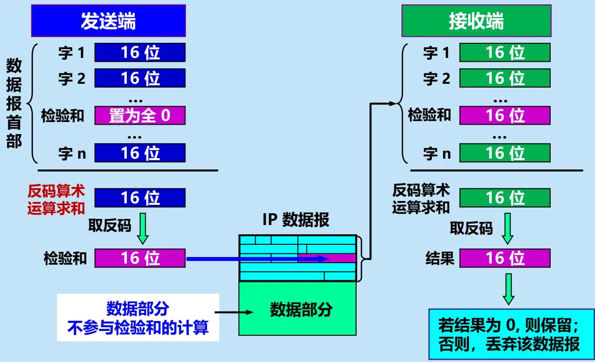
- **源地址**：占 32 位，指明发送此数据报的主机的 IP 地址。
- **目的地址**：占 32 位，指明接收此数据报的主机的 IP 地址。

#### 首部的可变部分
- IP 首部的可变部分就是一个选项字段，用来支持排错、测量以及安全等措施，内容很丰富。
- 长度可变：从 1 个字节到 40 个字节不等，取决于所选择的项目。
- 增加了 IP 数据报的功能，但这同时也使得 IP 数据报的首部长度成为可变的，增加了每一个路由器处理数据报的开销。
- **实际上很少使用**

### IP 层转发分组的过程


#### 基于终点的转发
- 定义：IP 层转发分组是基于分组首部中的**目的地址**进行传送和转发的。
- 每一个路由器都维护一个**转发表**（forwarding table），也称为路由表（routing table），用于存放路由器用来转发分组的信息。
    - 每一行：一个路由条目（routing entry）
    - 每一列：路由条目的一个字段，主要有**目的网络地址**、**下一跳地址**等字段
- 为了压缩转发表的大小，转发表中最主要的路由是（目的**网络地址**，下一跳地址），而不是（目的地址，下一跳地址）。
    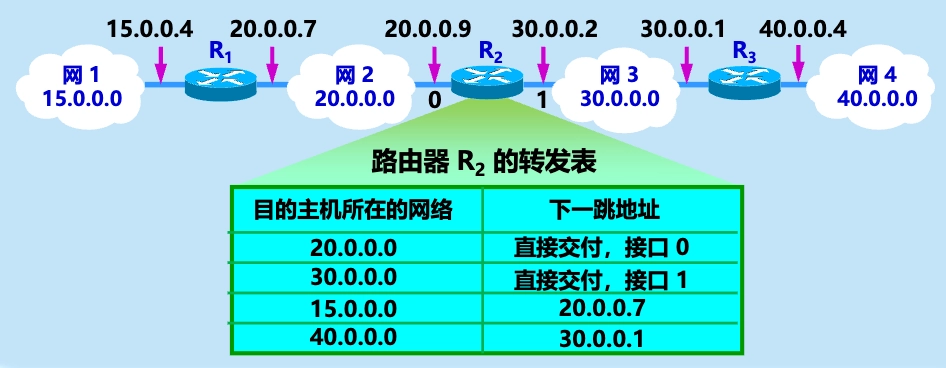
- **查找转发表的过程就是逐行寻找前缀匹配**。
- 示例：
    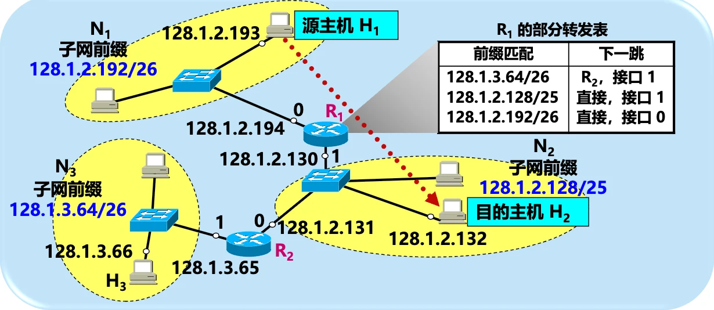
- 主机 $H_{1}$ 发送出的、目的地址是 `128.1.2.132` 的分组转发过程：
    - $H_{1}$ 首先检查 `128.1.2.132` 是否连接在本网络上。如果是，则直接交付；否则，就送交路由器 $R_{1}$
        - $N_{1}$ 的网络地址为 `128.1.2.192`，网络掩码为 `/26 = 255.255.255.192`
        - 计算目的地址与网络掩码逐比特 AND：`128.1.2.132` AND `255.255.255.192` = `128.1.2.128` $\neq N_{1}$ 的网络地址
        - 所以 `128.1.2.132` 不在本地网络上。源主机 $H_{1}$  必须把分组发送给路由器 $R_{1}$
    - 路由器 $R_{1}$ 收到分组后逐行查找转发表
        - 先检查第 1 行：`128.1.2.132` AND `255.255.255.192` = `128.1.2.128` $\neq$ `128.1.3.64`，不匹配!
        - 接着检查第 2 行：`128.1.2.132` AND `255.255.255.128` = `128.1.2.128`，匹配!
        - 进行分组的直接交付（通过路由器 $R_{1}$ 的接口 1）

#### 最长前缀匹配
- 使用 CIDR 时，在查找转发表时可能会得到不止一个匹配结果。
- 最长前缀匹配（longest-prefix matching）原则：**选择前缀最长的一个作为匹配的前缀**。
    - 网络前缀越长，其地址块就越小，因而路由就越具体。
    - 可以把前缀最长的排在转发表的第 1 行，以加快查表。
- 示例：
    
- 路由器 $R_{1}$ 收到目的地址是 `128.1.2.196` 的分组的转发过程：
    - 先检查第 1 行：`128.1.2.196` AND `255.255.255.192` = `128.1.2.192` $\neq$ `128.1.3.64`，不匹配!
    - 接着检查第 2 行：`128.1.2.196` AND `255.255.255.128` = `128.1.2.128`，匹配!
    - 接着检查第 3 行：`128.1.2.196` AND `255.255.255.192` = `128.1.2.192`，匹配!
- 问题：$R_{1}$ 从哪个接口向外转发分组?
    - 选择前缀最长的一个作为匹配的前缀：
        - 第 2 行的前缀长度为 25 位；
        - 第 3 行的前缀长度为 26 位；
        - 因此选择第 3 行作为匹配的前缀，通过路由器 $R_{1}$ 的接口 0 转发分组。
    - 优化：可以把前缀最长的排在转发表的靠前位置，如将图中的第 3 行与第 2 行交换位置。
- 转发表中的特殊的路由
    - **主机路由**/特定主机路由（host route）
        - 是对特定目的主机的 IP 地址专门指明的一个路由。
        - 网络前缀是 `a.b.c.d/32`，即整个 32 位的 IP 地址都作为网络前缀。
        - 放在转发表的**最前面**（网络前缀最长）。
    - **默认路由**（default route）
        - 不管分组的最终目的网络在哪里，都由指定的路由器 R 来处理
        - 用特殊前缀 `0.0.0.0/0` 表示。
        - 放在转发表的**最后面**（网络前缀最短）。
- 路由器分组转发算法流程图
    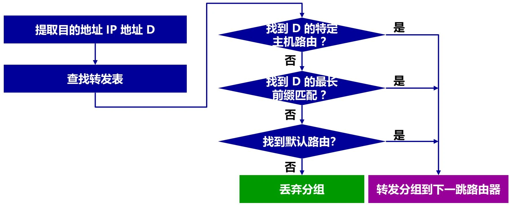

#### 优化：使用二叉线索查找转发表
- **二叉线索**（binary trie）：一种特殊结构的树，可以快速在转发表中找到匹配的叶节点。
- 定义：
    - 自顶向下高度为 32 的二叉树，每层对应于 IP 地址中的一位。 
    - 每一个节点都有两个子节点，分别对应于 IP 地址中的 0 和 1。
    - 从根节点到某一节点的路径表示一个唯一的二进制前缀。
    - 每一个叶节点都对应于转发表中的一个路由条目。
- 为了提高二叉线索的查找速度，广泛使用了各种压缩技术。
- 构造基于二叉线索的转发表
    - 规则：
        - 先检查 IP 地址左边的第一位，如为 0，则第一层的节点就在根节点的左下方；如为 1，则在右下方。
        - 然后再检查地址的第二位，构造出第二层的节点。
        - 依此类推，直到唯一前缀的最后一位。每个叶节点代表一个唯一前缀。
    - 为检查网络前缀是否匹配，必须使二叉线索中的每一个叶节点包含所对应的网络前缀和子网掩码。
    - 示例：
        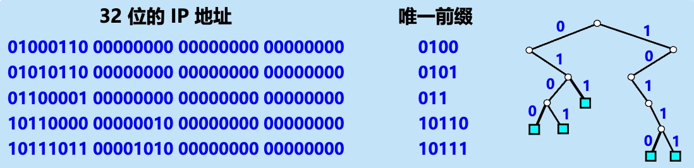
- 在二叉线索中查找 IP 地址
    - 规则：
        - 从根节点开始，逐位检查 IP 地址的每一位。
        - 每检查一位，就沿着二叉线索向下走到相应的子节点，直到找到一个叶节点为止。
        - 若在某一位找不到相应的子节点，则说明该地址不在该二叉线索中，检查是否存在默认路由。
            - 若有，把分组传送到指明的默认路由器
            - 否则，丢弃该分组。
        - 找到叶节点后，将目的 IP 地址和该叶节点的子网掩码进行按位 AND 运算，看结果是否与叶节点的网络前缀相匹配。
            - 若匹配，就按下一跳的接口转发该分组。
            - 否则，丢弃该分组。
    - 示例：
        1. IP = `01010110 01111010 00000000 00000000`
            - 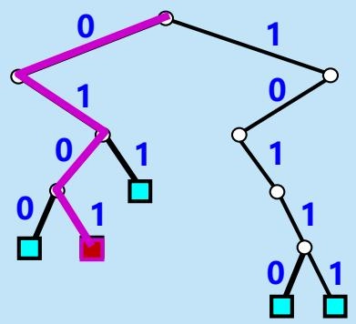

            1. 找到了一个叶节点。
            2. 将目的 IP 地址和该叶节点的子网掩码进行按位 AND 运算，看结果是否与叶节点的网络前缀相匹配。
            3. 若匹配，就按下一跳的接口转发该分组。否则，就丢弃该分组。
        2. IP = `10011011 01111010 00000000 00000000`
            - 

            1. 查到第三个字符 0 时，在二叉线索中找不到匹配的。说明这个地址不在这个二叉线索中。
            2. 检查是否存在默认路由。若有，把分组传送到指明的默认路由器，否则丢弃该分组。

## 网际控制报文协议 ICMP
- ICMP（Internet Control Message Protocol）允许主机或路由器**报告差错**情况和**提供有关异常**情况的报告。
- 功能：检测网络通信故障和实现链路追踪
- 特点：
    - ICMP 本身是网络层的一个协议，但其报文不是直接交给数据链路层，而是**封装成 IP 分组后再传送给数据链路层**。
    - 从协议体系上看，ICMP 要解决 IP 可能出现的不可靠问题，它不能独立于 IP 而单独出现，而是**属于 IP 的组成部分之一**。
    - ICMP 的设计初衷是发送 IP 执行过程中的错误报告，主要是路由器向源主机报告传输出错的原因。**差错处理需要由高层协议来完成**。

### ICMP 报文的格式
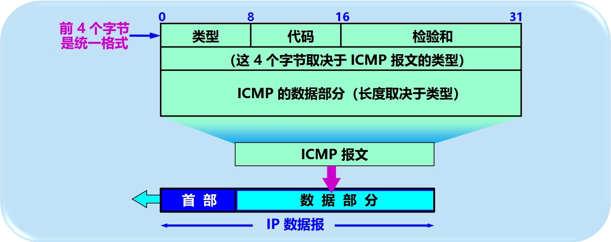

### ICMP 报文的种类
- 常用 ICMP 报文种类
    <table>
    <tr>
    <td><strong>ICMP 报文种类</strong></td>
    <td><strong>类型的值</strong></td>
    <td><strong>ICMP 报文的类型</strong></td>
    </tr>
    <tr><td rowspan="5"><strong>差错报告报文</strong></td><td>3</td><td>目的不可达</td></tr>
    <tr><td>11</td><td>超时</td></tr>
    <tr><td>12</td><td>参数问题</td></tr>
    <tr><td>5</td><td>重定向</td></tr>
    <tr><td>4</td><td>源抑制</td></tr>
    <tr><td rowspan="4"><strong>询问报文</strong></td><td>8 或 0</td><td>回送（Echo）请求或应答</td></tr>
    <tr><td>13 或 14</td><td>时间戳（Timestamp）请求或应答</td></tr>
    <tr><td>15 或 16</td><td>路由器询问和通告</td></tr>
    <tr><td>17 或 18</td><td>地址掩码请求或应答</td></tr>
    </table>

#### 差错报告报文


- ICMP 差错报告报文的**数据字段**的内容：原始 IP 数据报的首部和该数据报的前 8 个字节的数据部分。
- 不应发送 ICMP 差错报告报文的几种情况
    - 对 **ICMP** 差错报告报文不再发送 ICMP 差错报告报文。
    - 对第一个**分片**的数据报片的所有后续数据报片都不发送 ICMP 差错报告报文。
    - 对具有**多播**地址的数据报都不发送 ICMP 差错报告报文。
    - 对具有**特殊地址**（如 `127.0.0.0` 或 `0.0.0.0`）的数据报不发送 ICMP 差错报告报文。

##### 目的不可达
- 网络不可达（network unreachable）：
    - 代码：0
    - 定义：路由器寻址出错，下一跳路由器可能存在故障。
    - 只能由路由器产生。
- 主机不可达（host unreachable）：
    - 代码：1
    - 定义：表示网络寻址不存在问题，可能是目的主机不工作或不存在。
    - 只能由路由器产生。
- 协议不可达（protocol unreachable）：
    - 代码：2
    - 定义：表示目的主机上没有运行分组要交付的协议。
- 端口不可达（port unreachable）：
    -  代码：3
    - 定义：表示分组要交付的应用进程没有运行。
- 系路由失败（source route failed）：
    - 代码：5
    - 定义：表示由源主机路由选项中规定的一个或多个路由器无法通过。
- 目的网络不可知（unknown destination network）：
    - 代码：6
    - 定义：表示路由器根本不知道关于目的网络的信息
    - 目的网络不可知与网络不可达的却别：网络不可达是知道目的网络存在，但是无法将分组送达目的网络；而目的网络不可知是根本不知道目的网络的存在。
- 目的主机不可知（unknown destination host）：
    - 代码：7
    - 定义：表示路由器根本不知道关于目的主机的信息。

##### 源抑制报文
- 定义：当路由器或目的主机发生拥塞时，向源主机发送源抑制报文，通知源主机降低分组发送速率。
- 源抑制可分为 3 个阶段：
    1. 路由器或目的主机发现拥塞，发出源抑制报文。
    2. 源主机收到源抑制报文之后，降低向目的主机的分组发送速率。
    3. 拥塞解除之后，源主机恢复分组发送速率。

##### 超时报文
- 定义：当分组在传输过程中出现超时现象时，路由器或目的主机向源主机发送超时报文。
- 出现超时现象的两种情况：
    1. 分组在路由器之间循环传输，超过了 TTL 值，需要丢弃并发送超时报文。
    2. 分组的分片没有在计时器时间内到达目的主机，导致目的主机无法重组分片，占据缓冲区，影响其他分组的传输，需要丢弃分片并发送超时报文。

##### 参数问题报文
- 定义：当路由器或目的主机发现分组头中的某个参数出错时，向源主机发送参数问题报文，指出被丢弃的分组头有错误，并在参数字段中包含一个指针，指向出错字节的起始位置。
- 示例：IP 分组头的前 4 位是版本字段，字段值为 4 时表示 IPv4 分组头。如果版本字段值为 5，路由器将无法处理，只能丢弃该分组，并向源主机发送参数问题报文，指出版本字段出错。

##### 重定向报文
- 定义：当路由器发现有更好的路由选择时，向源主机发送重定向报文，通知源主机改变路由选择，实现主机的路由表更新。
- 示例：主机 A 要向主机 B 发送分组，路由器 2 是最有效的路由选择，但是主机 A 没有选择路由器 2，而是将分组发送给路由器 1。路由器 1 发现分组应发送给路由器 2，则将该分组发送给路由器 2，并向主机 A 发送改变路由的 ICMP 重定向报文。
    


#### 询问报文
ICMP 询问报文是为网络故障诊断而设计的，ICMP 差错报告报文是单个出现的，ICMP 询问报文是双向、成对出现的。

##### 回送请求和应答报文
- 回送请求报文：
    - 类型值：8
    - 定义：由主机或路由器向一个特定的目的主机发出的询问。
- 回送应答报文：
    - 类型值：0
    - 定义：收到回送请求报文的主机必须给源主机或路由器发送 ICMP 回送应答报文。
- 作用：检测目的节点是否可达，以及了解其有关状态，如往返时间等。
- 示例：在一些网络应用中，用户调用 Ping 命令，通过回送请求与应答报文测试目的主机或路由器是否可达。

##### 时间戳请求和应答报文
- 时间戳请求报文：
    - 类型值：13
    - 定义：请某台主机或路由器回答当前的日期和时间。
- 时间戳应答报文：
    - 类型值：14
    - 包含一个 32 位的字段，其中写入的整数代表从 1900 年 1 月 1 日起到当前时刻一共有多少秒。
- 作用：提供一个基本和简单的时钟同步协议，用于时钟同步和时间测量，确定 IP 分组在两个主机之间往返所需的时间。
- 参数：
    - 初始时间戳：源主机发出请求的时间
    - 接收时间戳：目的主机收到请求的时间
    - 发送时间戳：目的主机发送应答的时间。

##### 路由器询问和通告
- 路由器询问报文：
    - 类型值：15
    - 定义：主机用来查询连接的默认路由器地址。
- 路由器通告报文：
    - 类型值：16
    - 定义：收到路由器询问报文的所有路由器使用路由器通告报文广播路由信息。当没有主机询问时，路由器周期性发送路由器通告报文。路由器在发送通告报文时，不仅通告自己的存在，而且通告它所知道的这个网络中的所有路由器地址。
- 作用：用于主机查询连接的默认路由器地址。

##### 地址掩码请求和应答报文
- 地址掩码请求报文：
    - 类型值：17
    - 定义：主机用来查询其所在网络的子网掩码。
- 地址掩码应答报文：
    - 类型值：18
    - 定义：路由器用来响应地址掩码请求报文，返回所在网络的子网掩码。
- 作用：用于主机查询其所在网络的子网掩码。

### ICMP 的应用举例
#### PING（Packet Internet Groper）
- 作用：测试两个主机之间的连通性。
- 报文：ICMP 回送请求与回送回答报文。
- 是应用层直接使用网络层 ICMP 的例子，没有通过运输层的 TCP 或 UDP。

```bash
C:\Users\youyeyejie> ping oc.sjtu.edu.cn

Pinging oc.sjtu.edu.cn [2001:da8:8000:6181:202:120:35:130] with 32 bytes of data:
Reply from 2001:da8:8000:6181:202:120:35:130: time<1ms
Reply from 2001:da8:8000:6181:202:120:35:130: time<1ms
Reply from 2001:da8:8000:6181:202:120:35:130: time<1ms
Reply from 2001:da8:8000:6181:202:120:35:130: time<1ms

Ping statistics for 2001:da8:8000:6181:202:120:35:130:
    Packets: Sent = 4, Received = 4, Lost = 0 (0% loss),
Approximate round trip times in milli-seconds:
    Minimum = 0ms, Maximum = 0ms, Average = 0ms
```

#### Traceroute/Tracert
- Traceroute（UNIX）或  tracert（Windows）
- 作用：跟踪数据报从源点到终点所经过的路径。
- 报文：
    - IP 数据报中的 TTL 字段
    - ICMP 时间超过差错报告报文
    - ICMP 终点不可达差错报告报文

```bash
C:\Users\youyeyejie> tracert oc.sjtu.edu.cn

Tracing route to oc.sjtu.edu.cn [2001:da8:8000:6181:202:120:35:130]
over a maximum of 30 hops:

  1     1 ms     1 ms     1 ms  dynamic.ipv6.sjtu.edu.cn [2403:d400:4000:186c::1]
  2    <1 ms    <1 ms    <1 ms  2001:da8:8000:e01::1
  3     1 ms     1 ms     1 ms  2001:da8:8000:132::58
  4     1 ms     1 ms     1 ms  2001:da8:8000:137::213
  5    21 ms     1 ms     4 ms  2001:da8:8000:135::2
  6    23 ms     2 ms     2 ms  2001:da8:8000:6f80:3103:75:225:2
  7    <1 ms    <1 ms    <1 ms  2001:da8:8000:6181:202:120:35:130

Trace complete.
```

## 网际协议第 6 版 IPv6
- IP 是互联网的核心协议，但是 IPv4 地址耗尽问题：
    - 到 2011 年 2 月，IANA IPv4 的 32 位地址已经耗尽。
    - 各地区互联网地址分配机构也相继宣布地址耗尽。
    - 我国在 2014-2015 年也逐步停止了向新用户和应用分配 IPv4 地址。
- 根本解决措施：采用具有更大地址空间的新版本的 IP，即 IPv6。

### IPv6 概述
- IPv6 仍支持**无连接的传送**。
- **协议数据单元** PDU：**分组**（packet）或**数据报**（datagram）
- **主要变化**：
    1. 更大的地址空间：将地址从 IPv4 的 32 位 增大到了 128 位。
    2. 扩展的地址层次结构：可以划分为更多的层次。
    3. 灵活的首部格式：定义了许多可选的扩展首部。
    4. 改进的选项：允许数据报包含有选项的控制信息，其选项放在有效载荷中。
    5. 允许协议继续扩充：更好地适应新的应用。
    6. 支持即插即用（即自动配置）：不需要使用 DHCP。
    7. 支持资源的预分配：支持实时视像等要求保证一定的带宽和时延的应用。
    8. IPv6 首部改为 8 字节对齐。首部长度必须是 8 字节的整数倍。

### IPv6 格式


1. **基本首部**（base header）
    - 固定长度 40 字节，包含了数据报传送所必需的信息，只有 8 个字段
    - IPv6 对首部的主要更改
        - 取消了服务类型字段
        - 取消了首部长度字段和总长度字段，改用有效载荷长度字段
        - 把 TTL 字段改称为跳数限制字段
        - 取消了协议字段，改用下一个首部字段
        - 取消了检验和字段
        - 取消了选项字段，而用扩展首部来实现选项功能
2. **有效载荷**（payload）/净负荷
    - 有零个或多个扩展首部（extension header）
    - 数据部分

#### IPv6 数据报的基本首部
- **版本**（version）：占 4 位，指明了协议的版本。对 IPv6 该字段总是 6。
- **通信量类**（traffic class）：占 8 位，用于区分不同 IPv6 数据报的类别或优先级。目前正在进行不同的通信量类性能的实验。
- **流标号**（flow label）：占 20 位，用于标识属于同一个流的数据报。“流”是互联网络上从特定源点到特定终点的一系列数据报，“流”所经过的路径上的路由器都保证指明的服务质量。
- **有效载荷长度**（payload length）：占 16 位。它指明 IPv6 数据报除基本首部以外的字节数（所有扩展首部都算在有效载荷之内），其最大值是 64 KB。
- **下一个首部**（next header）：占 8 位，相当于 IPv4 的协议字段或可选字段。
- **跳数限制**（hop limit）：占 8 位，用于源站在数据报发出时设定跳数限制，相当于 IPv4 的 TTL 字段。路由器在转发数据报时将跳数限制字段中的值减 1，当跳数限制的值为零时将此数据报丢弃。
- **源地址**：占 128 位，数据报的发送站的 IP 地址。
- **目的地址**：占 128 位，数据报的接收站的 IP 地址。

#### IPv6 数据报的扩展首部
- 逐跳选项
- 路由选择
- 分片
- 鉴别
- 封装安全有效载荷
- 目的站选项

### IPv6 地址
- 三种基本类型：
    1. 单播（unicast）：传统的点对点通信。
    2. 多播（multicast）：一点对多点的通信。
    3. **任播**（anycast）：IPv6 增加的一种类型。任播的终点是一组计算机，但数据报在交付时只交付其中的一个（通常是按照路由算法得出的距离最近的一个）。
- 节点与接口
    - IPv6 将实现 IPv6 的主机和路由器均称为**节点**。
    - 一个节点可能有多个与链路相连的接口。
    - IPv6 地址是分配给节点上**接口**的。
        1. 一个具有多个接口的节点可以有多个单播地址。
        2. 其中的任何一个地址都可以当作到达该节点的目的地址。

#### IPv6 地址的表示方法
- 在 IPv6 中，每个地址占 128 位，地址空间大于 $3.4 \times 10^{38}$。
- **冒号十六进制记法**（colon hexadecimal notation，简写为 colon hex）：16 位的值用十六进制值表示，各值之间用冒号 `:` 分隔。
- **零前导省略**（leading-zero omission）：每个 16 位的值中前导的零可以省略。
- **零压缩**（zero compression）：一串连续的零可以用一对冒号 `::` 取代。
    - 在任一地址中，只能使用一次零压缩。
- **点分十进制后缀**：对于一些 IPv4 地址，可以将其作为 IPv6 地址的后缀部分（即最低的 32 位），并用点分十进制记法表示。
    - 在 IPv4 向 IPv6 的转换阶段特别有用。
    - 示例：`::128.10.2.1`
- **前缀表示法**（prefix notation）：CIDR 的斜线表示法，但取消了子网掩码的概念，前缀相同可直接通信。
    - CIDR 记法地址：`2001:0DB8:0:CD30:123:4567:89AB:CDEF/60`，表示：
        - IPv6 的地址是：`2001:0DB8:0:CD30:123:4567:89AB:CDEF`
        - 其子网号是： `2001:0DB8:0:CD30::/60`
    - 60 位的前缀 `12AB00000000CD3` 可记为：
        - 前缀表示法：`12AB:0000:0000:CD30:0000:0000:0000:0000/60`
        - 零前导省略：`12AB:0:0:CD30:0:0:0:0/60`
        - 零压缩：`12AB:0:0:CD30::/60` 或 `12AB::CD30:0:0:0:0/60`
- 示例：

    | 原始地址 | 零前导省略 | 零压缩 |
    |---|---|---|
    |`2001:0DB8:0000:0000:0000:0000:0000:0001`|`2001:DB8:0:0:0:0:0:1`|`2001:DB8::1`|
    |`0000:0000:0000:0000:0000:0000:128.10.2.1`|`0:0:0:0:0:0:128.10.2.1`|`::128.10.2.1`|
    |`FF01:0000:0000:0000:0000:0000:0000:0101`（多播地址）|`FF01:0:0:0:0:0:0:101`|`FF01::101`|
    |`FE80:0000:0000:0000:0202:B3FF:FE1E:8329`（本地链路单播地址）|`FE80:0:0:0:202:B3FF:FE1E:8329`|`FE80::202:B3FF:FE1E:8329`|
    |`0000:0000:0000:0000:0000:0000:0000:0001`（环回地址）|`0:0:0:0:0:0:0:1`|`::1`|
    |`0000:0000:0000:0000:0000:0000:0000:0000`（未指明地址）|`0:0:0:0:0:0:0:0`|`::`|

#### IPv6 地址分类
| 地址类型 | 二进制前缀 | IPv6 记法 |
|---|---|---|
| 多播地址 | `11111111`（8 位），功能和 IPv4 的一样 | `FF00::/8` |
| 本地链路单播地址 | `1111111010`（10 位），未连接到互联网，不能和互联网上的其他主机通信 | `FE80::/10` |
| 环回地址 | `00...1`（128 位），仅此一个 | `::1/128` |
| 未指明地址 | `00...0`（128 位），仅此一个 | `::/128` |
| 全球单播地址 | 除上述四种外，所有其他的二进制前缀 |  |

#### IPv6 单播地址的划分方法


### 从 IPv4 向 IPv6 过渡
- 方法：逐步演进，向后兼容。
- **向后兼容**：IPv6 系统必须能够接收和转发 IPv4 分组，并且能够为 IPv4 分组选择路由。
- 两种过渡策略：
    1. 使用双协议栈
    2. 使用隧道技术

#### 双协议栈
- 双协议栈（dual stack）：同时支持 IPv4 和 IPv6 协议。
    
- 示例：
    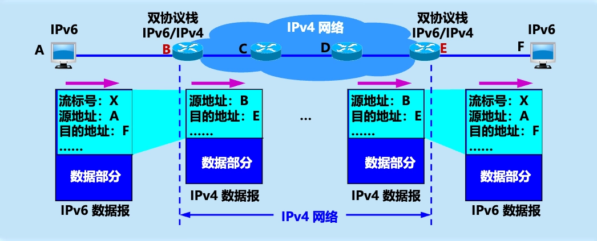

#### 隧道技术
- 隧道技术（tunneling）：把 IPv6 数据报封装在 IPv4 数据报中传送。
- 隧道端点（tunnel endpoint）：负责封装和解封装的节点。
- 示例：
    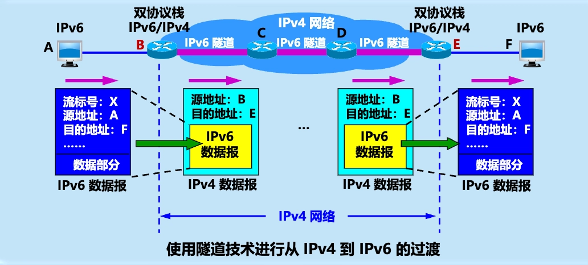

### ICMPv6
- IPv6 也需要使用 ICMP 来反馈一些差错信息。新的版本称为 ICMPv6。
- ICMPv6 实现 ARP 和 IGMP 协议的功能
    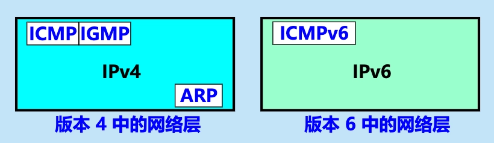
- ICMPv6 报文的分类
    - 差错报文
    - 信息报文
    - 邻站发现报文：邻站发现协议 ND（Neighbor-Discovery）
    - 组成员关系报文：多播听众交付协议 MLD（Multicast Listener Delivery）

## 互连网的路由选择协议
### 路由选择协议基本概念
- 路由选择协议属于网络层**控制层面**的内容
- 理想路由算法
    - 计算简单
    - 正确完整
    - 稳定
    - 自适应
    - 公平
- 路由算法分类（自适应）
    - 静态路由选择策略
        - 非自适应路由选择
        - 不能及时适应网络状态的变化
        - 简单，开销较小
    - 动态路由选择策略
        - 自适应路由选择
        - 能较好地适应网络状态的变化
        - 实现较为复杂，开销较大
- 自治系统 AS（Autonomous System）
    - 定义：是在单一技术管理下的一组路由器，而这些路由器使用一种自治系统内部的路由选择协议和共同的度量。每一个 AS 对其他 AS 表现出的是一个单一的和一致的路由选择策略。
    - 示意图：
        
    - 分类：
        

        - **末梢 AS**：不会把来自其他 AS 的分组再转发到另一个 AS。必须向所连接的 AS 付费。
        - **多归属 AS**（multihomed AS）：同时连接到两个或两个以上的 AS。增加连接的可靠性。
        - **穿越 AS**：为其他 AS 有偿转发分组。
        - **对等 AS**：经过事先协商的两个 AS，彼此之间的发送或接收分组都不收费。
- 互联网使用分层次的路由选择协议：
    - 采用自适应的（即动态的）、分布式路由选择协议。
    - 把整个互联网划分为许多较小的自治系统 AS，采用分层次的路由选择协议。
    - 分为 2 个层次：
        - **域内路由选择**（intradomain routing）：自治系统内部的路由选择
            - **内部网关协议** IGP（Interior Gateway Protocol）
                - 在一个自治系统内部使用的路由选择协议
                - 示例：RIP，OSPF
        - **域间路由选择**（interdomain routing）：自治系统之间的路由选择
            - **外部网关协议** EGP（Exterior Gateway Protocol）
                - 在不同自治系统之间进行路由选择时使用的协议
                - 示例：BGP-4
    - 示意图
        

### 路由信息协议 RIP


- 定义：路由信息协议 RIP（Routing Information Protocol）是一种分布式的、基于距离向量的路由选择协议。
    - 互联网的标准协议。
    - 属于内部网关协议。
- **基本思想**：要求网络中的每个路由器都要维护从它自己到其他每一个目的网络**的距离记录**。

#### RIP 协议的工作原理
- **距离的定义**：RIP 协议中的“距离”也称为“**跳数**”（hop count），每经过一个路由器，跳数就加 1
    - 路由器到**直接连接**的网络的距离 = 1
    - 路由器到**非直接连接**的网络的距离 = 所经过的路由器数 + 1
    - “距离”的最大值为 16，此时相当于**不可达**。
        - 一条路径最多只能包含 15 个路由器。
    - RIP 不能在两个网络之间同时使用多条路由，**只选择距离最短的路由**。
        - 好路由 = “距离短”的路由。
        - **最佳路由** = “距离最短”的路由。
    - 示例：
        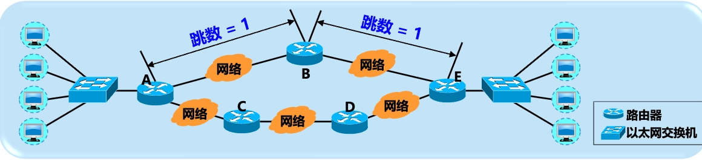

        - 路由 A-B-E 的距离 = 2，路由 A-C-D-E 的距离 = 3。
        - 最佳路由为 A-B-E。
- **基本工作方式**
    - 交换对象：**相邻**路由器
    - 信息内容：本路由器所知道的**全部信息**，即自己的路由表。
    - 交换时机：网络拓扑发生变化或经过**固定时间间隔**（如 30 秒）
- **路由表的建立**
    1. 路由器在刚刚开始工作时，路由表是空的。
    2. 得到**直接连接**的网络的距离，定义为 1。
    3. 每一个路由器只与数目非常有限的**相邻路由器交换并更新**路由信息。
    4. 经过若干次更新后，所有的路由器最终都会知道到达本自治系统中任何一个网络的最短距离和下一跳路由器的地址。
- 路由表主要信息和更新规则
    - 路由表主要信息：
        - 目的地址
        - 最短距离
        - 下一跳地址
    - 路由表更新规则：
        - **使用距离向量算法找出到达每个目的网络的最短距离**。

#### 距离向量算法
- 对每个相邻路由器（假设其地址为 $X$）发送过来的 RIP 报文，路由器按以下步骤更新路由表：
    1. 修改 **RIP 报文**中的所有项目（即路由）：把“下一跳”字段中的地址都改为 $X$，并把所有的“距离”字段的值**加 1**。
    2. 对修改后的 RIP 报文中的每一个项目，重复以下步骤：
        - 若路由表中**没有**目的网络 $N$，则把该项目**添加**到路由表中。（新发现的网络）
        - 否则，若路由表中网络 $N$ 的**下一跳**路由器为 $X$，则用收到的项目**替换**原路由表中的项目。（使用 $X$ 通告的到 $N$ 的新距离）
        - 否则，若收到项目中的距离**小于**路由表中的距离，则用收到项目**更新**原路由表中的项目。（发现了更短的路径）
        - 否则，什么也不做。
    3. 若 3 分钟还未收到相邻路由器的更新路由表，则把此相邻路由器记为**不可达**路由器，即将距离置为 16（表示不可达）。
    4. 返回。
- 算法基础：Bellman-Ford 算法（或 Ford-Fulkerson 算法）。
- 算法要点：
    - 设 $X$ 是结点 $A$ 到 $B$ 的最短路径上的一个结点。
    - 若把路径 $A \to B$ 拆成两段路径 $A \to X$ 和 $X \to B$ ，则每一段路径 $A \to X$ 和 $X \to B$ 也都分别是结点 $A$  到  $X$ 和结点 $X$ 到 $B$ 的最短路径。
    - 示意图：
        
- 示例：
    1. 已知路由器 $R_{6}$ 有表 4-8（a）所示的路由表，现在收到相邻路由器 $R_{4}$ 发来的路由更新信息，如表 4-8（b）所示。试更新路由器 $R_{6}$ 的路由表。
        
    2. 收到从 $C$ 发来的 RIP 报文后，更新路由表如下：
        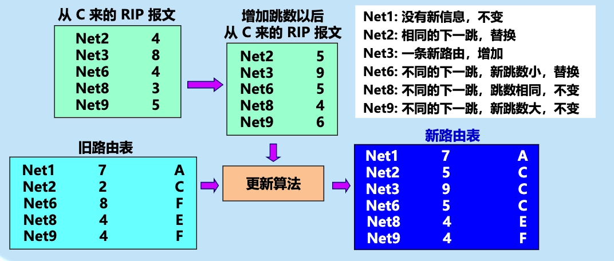

#### RIP2 报文
- RIP2 支持无分类域间路由选择 CIDR，提供简单的鉴别，支持多播。
- RIP2 的报文用使用 UDP 传送，端口 520。
    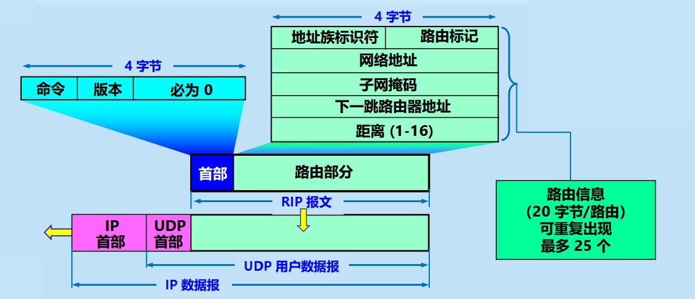
- 组成：首部和路由 2 个部分。
    - **首部部分**：共 4 个字节。
        - **命令字段**：指明该报文是请求报文还是响应报文。
        - **版本字段**：RIP 的版本号，RIP2 的版本号为 2。
        - 保留字段：未使用，置为 0。
    - **路由部分**：由若干个路由信息组成，每个路由信息共 20 个字节，最多可有 25 个路由信息。
        - **地址族标识符/地址类别字段**：标志所使用的地址协议。
        - **路由标记字段**：自治系统的号码。
        - **具体路由字段**：
            - 网络地址
            - 子网掩码
            - 下一跳路由器地址
            - 到此网络的距离
- 一个 RIP 报文**最多**可包括 25 个路由，因而 RIP 报文的最大长度是 $4 + 20 \times 25 = 504$ 字节。如超过，必须再用一个 RIP 报文来传送。

#### RIP 协议的特点及优缺点
- RIP 协议存在问题：坏消息传播得慢（**慢收敛**）。
    - 收敛：在自治系统中，所有的结点都得到正确的路由选择信息的过程。
    - 当网络出现故障时，要经过比较长的时间才能将此信息（坏消息）传送到所有的路由器。
- 示例：
    
- RIP 协议的优缺点
    - 优点：
        1. 实现简单，开销较小。
        2. 好消息传播得快，收敛过程较快。
    - 缺点：
        1. 网络规模有限。最大距离为 15（16 表示不可达）。
        2. 交换的路由信息为完整路由表，开销较大。
        3. 坏消息传播得慢，收敛时间过长。

### 开放最短路径优先协议 OSPF


- 定义：开放最短路径优先 OSPF（Open Shortest Path First）是为克服 RIP 的缺点在 1989 年开发出来的一种链路状态路由选择协议。
    - 属于内部网关协议。
- 现在使用 OSPFv2 版本，支持 IPv4

#### OSPF 协议的工作原理
- **基本工作方式**
    - 交换对象：本自治系统内的**所有**路由器
    - 交换方法：**洪泛法**（flooding）
    - 信息内容：本路由器所知道的**部分信息**，即与本路由器相邻的所有路由器的**链路状态**。
        - 链路状态：说明本路由器都和哪些路由器相邻，以及该链路的度量（metric）。
    - 交换时机：链路状态发生变化或经过**固定时间间隔**（如 30 分钟）
- **链路状态数据库**（link-state database）
    - 每个路由器最终都能建立。
    - **全网的拓扑结构图**。
    - **在全网范围内是一致的**（这称为链路状态数据库的同步）。
    - 每一个路由器都知道全网共有多少个路由器，以及哪些路由器是相连的，其代价是多少
    - 每个路由器使用链路状态数据库中的数据构造自己的路由表（例如，使用 Dijkstra 的最短路径路由算法）。
    - 链路状态数据库能较快地进行更新，使各个路由器能及时更新其路由表。
        - 重要优点：OSPF 更新过程收敛速度快。
- 自治系统的区域划分  
    - 示意图：
        
    - OSPF 将自治系统划分为两种不同的区域（area）：
        1. **主干区域**（backbone area）
            - 标识符：`0.0.0.0`
            - 作用：用来连通其他下层区域
            - 图中红色区域
        2. **普通区域**（standard area）
    - OSPF 中的路由器：
        - **区域边界路由器** ABR（area border router）：$R_3，R_4，R_7$
        - **主干路由器** BR（backbone router）：$R_3，R_4，R_5，R_6，R_7$
        - **自治系统边界路由器** ASBR（AS border router）：$R_6$
    - 划分区域的优缺点
        - 优点：
            - 减少了整个网络上的通信量。
                - 分层次划分区域，使每一个区域内部交换路由信息的通信量大大减小，因而使 OSPF 协议能够用于规模很大的自治系统中。
            - 减少了需要维护的状态数量。
        - 缺点：
            - 交换信息的种类增多了。
            - 使 OSPF 协议更加复杂了。

#### OSPF 报文
- OSPF 分组用 IP 数据报传送
    - 示意图：
        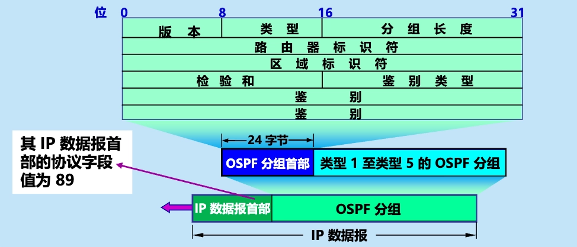
    - 其 IP 数据报首部的协议字段值为 89
- 组成：首部和数据两个部分。
    - 首部部分：包含 24 字节的 OSPF 首部
    - 数据部分：包含五种不同类型的 OSPF 分组
        1. **问候**（Hello）分组：用来发现和维持邻站的可达性
        2. **数据库描述**（Database Description）分组：向邻站给出自己的链路状态数据库中的所有链路状态项目的摘要信息。
        3. **链路状态请求**（Link State Request）分组：向对方请求发送某些链路状态项目的详细信息。
        4. **链路状态更新**（Link State Update）分组：用洪泛法对全网更新链路状态。
        5. **链路状态确认**（Link State Acknowledgment）分组：对链路更新分组的确认。

#### OSPF 工作过程


1. **确定邻站可达**。
    - 相邻路由器每隔 10 秒钟要交换一次问候分组。
    - 若有 40 秒钟没有收到某个相邻路由器发来的问候分组，则可认为该相邻路由器是不可达的。
2. **同步链路状态数据库**。
    - 同步：使不同路由器的链路状态数据库的内容达到一致。
    - 两个同步的路由器叫做**完全邻接**的（fully adjacent）路由器。
        - 不是完全邻接的路由器：它们虽然在物理上是相邻的，但其链路状态数据库并没有达到一致。
3. **更新链路状态**。
    - 只要链路状态发生变化，路由器就使用链路状态更新分组，采用**可靠的洪泛法**向全网更新链路状态。
        
    - 为确保链路状态数据库与全网的状态保持一致，OSPF 还规定：每隔一段时间（如 30 分钟）要刷新一次数据库中的链路状态。

#### 指定路由器机制 DR
- 多点接入的局域网（如以太网）中，OSPF 协议采用了**指定路由器机制**（Designated Router，DR）
    - 指定路由器 DR 作为该局域网上所有路由器的代表，负责与其他路由器交换链路状态信息，避免所有路由器之间两两通信带来的大量冗余广播，**广播信息量大大减少**。

#### OSPF 协议的特点
- 原理简单，实现复杂
    - 使用 Dijkstra 提出的最短路径优先算法 SPF 来计算路由
    - 采用分布式的链路状态协议（link state protocol）
- OSPF 链路状态只涉及相邻路由器，与整个互联网的规模并无直接关系，因此当互联网规模很大时，OSPF 协议要比距离向量协议 RIP 好得多。OSPF 没有“坏消息传播得慢”的问题，收敛速度快。
- 对于不同类型的业务可计算出不同的路由。
- 可实现多路径间的负载均衡（load balancing）。
- 所有在 OSPF 路由器之间交换的分组都具有鉴别的功能。
- 支持可变长度的子网划分和无分类编址 CIDR。
- 32 位的序号，序号越大状态就越新。全部序号空间在 600 年内不会产生重复号。

### 边界网关协议 BGP
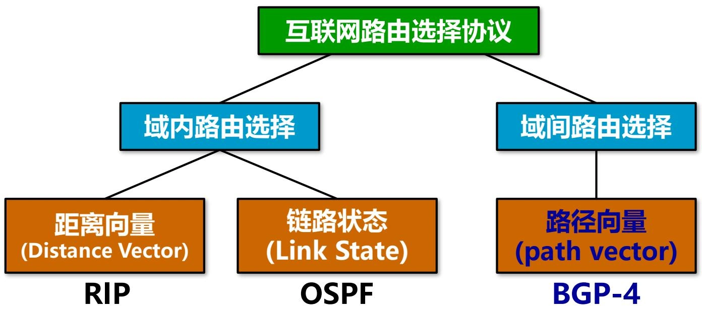

- 定义：边界网关协议 BGP（Border Gateway Protocol）是一种用于不同自治系统 AS 的路由器之间交换路由信息的协议。
    - 互联网的标准协议。
    - 属于外部网关协议 EGP。
- BGP 较新版本是 2006 年 1 月发表的 BGP-4（BGP 第 4 个版本），即 RFC 4271 ~ 4278，可以将 BGP-4 简写为 BGP。

#### BGP 协议的主要特点
- 只能是力求选择出一条能够到达目的网络且比较好的路由（不能兜圈子），而**并非要计算出一条最佳路由**。
    1. 互联网的规模太大，使得自治系统 AS 之间路由选择非常困难。不同 AS 协议与度量不同。（有的 1000 可用，有的表示不可达）
    2. 自治系统 AS 之间的路由选择必须考虑有关策略。
        - 示例：要求国内站点不经过国外，规定是否允许通过某个 AS 等等
- 采用了**路径向量**（path vector）路由选择协议。

#### BGP 协议的工作原理
- **BGP 发言者**（BGP speaker）
    - 定义：运行 BGP 协议的路由器称为 BGP 发言者（一般是边界路由器）。
    - 作用：对等 BGP 发言者（边界路由器）在 AS 之间交换信息
    - 示意图：
        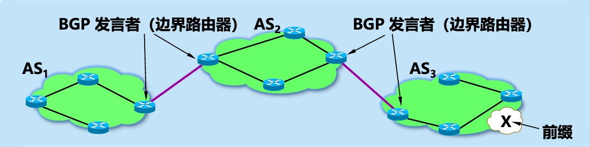
- **BGP 连接的两种类型**
    - 示意图：
        
    - eBGP 连接和 iBGP 连接
        - **eBGP**（external BGP）连接：运行在不同自治系统 AS 中的 BGP 发言者之间的 BGP 连接。
            - 建立在半永久性 TCP 连接上，端口号为 179
            - 运行 eBGP 协议
            - 在不同 AS 之间交换路由信息。
        - **iBGP**（internal BGP）连接：运行在同一自治系统 AS 内的 BGP 发言者之间的 BGP 连接。
            - 同样建立在半永久性 TCP 连接上
            - AS 内部所有的路由器之间的通信是**全连通**的
            - 运行 iBGP 协议
            - 在 AS 内部的路由器之间交换 BGP 路由信息。
    - IGP、iBGP 和 eBGP 的关系
        - 在 AS 内部运行：
            - 内部网关协议 IGP（可以是协议 OSPF 或 RIP）。
            - 协议 iBGP。
        - 在 AS 之间运行：
            - 协议 eBGP。
        - 示意图：
           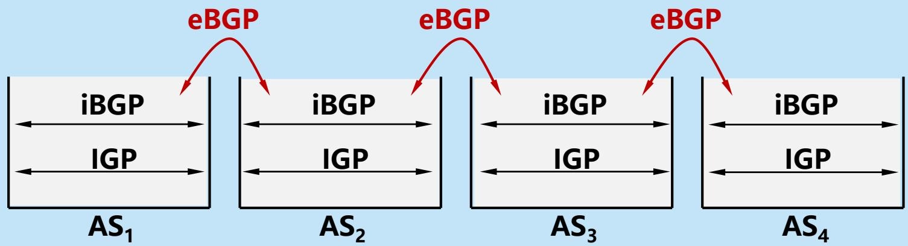
    - 说明：
        - eBGP 和 iBGP 属于同一个协议 BGP（使用的报文类型、使用的属性、使用的状态机等都完全一样）。
        - 但它们在通报前缀时采用的**规则不同**：
            - 在 eBGP 连接的对等端得知的前缀信息，可以通报给一个 iBGP 连接的对等端。
            - 在 iBGP 连接的对等端得知的前缀信息，可以通报给另一个 eBGP 连接的对等端。
            - 但从 iBGP 连接的对等端得知的前缀信息，则**不能**够通报给另一个 iBGP 连接的对等端。
        - 示例：
            
            - $R_3$ 从 eBGP 连接的对等端 $R_4$ 得到的前缀信息可以通报给 iBGP 连接的对等端 $R_1$ 或 $R_2$ 。
            - $R_3$ 从 iBGP 连接的对等端 $R_1$ 和 $R_2$ 得到的前缀信息可以通报给 eBGP 连接的对等端 $R_4$ 。
            - 但 $R_3$ 从 iBGP 连接的对等端 $R_1$ 得到的前缀信息不允许再通报给另一个 iBGP 连接的对等端 $R_2$ 。
- **BGP 路由信息**
    - **BGP 路由 = [ 前缀，BGP属性 ] = [ 前缀，AS-PATH，NEXT-HOP ]**
        - **前缀**：指明到哪一个子网（用 CIDR 记法表示）。
        - BGP 属性：最重要的两个属性是
            - **自治系统路径**：AS-PATH
            - **下一跳**：NEXT-HOP。
    - 示例：
        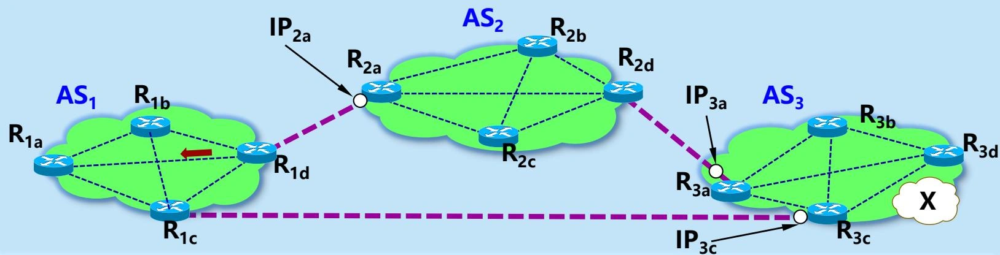

        - 路由 1：$AS_{1}$ 可经 $IP_{2a}$ 到前缀 X 的路由 = [前缀，AS-PATH，NEXT-HOP] = $[X，AS_{2} AS_{3}，IP_{2a}]$
        - 路由 2：$AS_{1}$ 可经 $IP_{3c}$ 到前缀 X 的路由 = [前缀，AS-PATH，NEXT-HOP] = $[X，AS_{3}，IP_{3c}]$
        - 路由器 $R_{1a}$  的转发表中，沿 BGP 路由 1 到达前缀 X 的项目是：（匹配前缀 $X$，下一跳路由器 $R_{1d}$）
- **避免兜圈子路由**：在属性 AS-PATH 中，不允许出现相同的 AS 号
    - 示例：
        
    - $AS_3$ 检查收到的 BGP 路由的 AS-PATH 中已经有了自己，立即删除掉这条路由，从而避免兜圈子路由的出现。

#### BGP 的路由选择


1. 本地偏好（local preference）值最高的路由（默认值=1000）
    - $AS_{1}$ 选择通过路由器 $R_{1d}$ 到达 X 的 BGP 路由。
2. AS 跳数最小的路由
    - 若上图中两条路由的本地偏好值相同，则 $AS_{1}$ 选择通过路由器 $R_{1c}$ 到达 X 的 BGP 路由。
    - 但事实上，分组在 $AS_4$ 中反而要经过更多次数的转发。说明协议 BGP 不存在真正的最佳路由选择。
3. 使用热土豆路由选择算法（分组在 AS 内的转发次数最少）
    - $R_{1a}$ 选择 $R_{1c}$ 作为离开 $AS_{1}$  的最佳选择，其 BGP 转发表中对应的项目应当是：（匹配前缀 X，下一跳路由器  $R_{1c}$ ）。
    - $R_{1b}$  选择  $R_{1d}$  作为离开  $AS_{1}$  的最佳选择，其 BGP 转发表中对应的项目应当是：（匹配前缀 X，下一跳路由器  $R_{1d}$  ）。
4. 路由器 BGP ID 数值最小的路由。具有多个接口的路由器有多个 IP 地址，BGP ID 就使用该路由器的 IP 地址中数值最大的一个。

#### BGP 报文
- BGP 报文用 TCP 传送，端口 179。
    
- 组成：通用首部和数据两个部分。
    - **通用首部**：包含 19 字节的 BGP 通用首部
    - 数据部分：包含不同类型的 BGP 报文（BGP-4 报文有四种类型）
        1. 打开报文 OPEN：用来与相邻的另一个 BGP 发言者建立关系，使通信初始化。
        2. 更新报文 UPDATE：用来通告某一路由的信息，以及列出要撤销的多条路由。
        3. 保活报文 KEEPALIVE：用来周期性地证实邻站的连通性。
        4. 通知报文 NOTIFICATION：用来发送检测到的差错。

### 路由器的构成
- 路由器工作在网络层，用于互连网络，是互联网中的关键设备。
- 路由器的主要工作：**转发分组**。
    - 把从某个输入端口收到的分组，按照分组要去的目的地（即目的网络），把该分组从路由器的某个合适的输出端口转发给下一跳路由器。

#### 路由器的结构


- 路由选择与分组转发的区别
    - 路由选择
        - 按照路由选择算法，根据网络拓扑的变化情况，动态地改变所选择的路由，并由此构造出整个的路由表。
        - 涉及到很多路由器。
        - 路由表一般仅包含**从目的网络到下一跳（用 IP 地址表示）的映射**。
    - 分组转发
        - 根据转发表将用户的 IP 数据报从合适的端口转发出去。
        - 仅涉及到一个路由器。
        - 转发表是从路由表得出的。
        - 转发表必须包含完成转发功能所必需的信息，每一行必须包含**从要目的网络到输出端口和某些 MAC 地址信息（如下一跳的以太网地址）的映射**。
- **输入端口**对线路上收到的分组的处理
    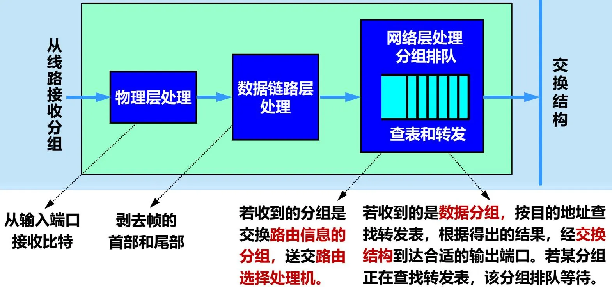
- **输出端口**将交换结构传送来的分组发送到线路
    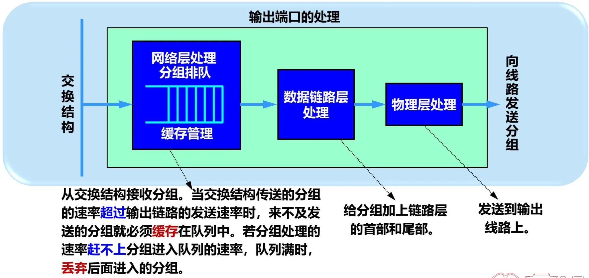

#### 交换结构
- 常用交换方法有三种：通过存储器、通过总线、通过纵横交换结构。
    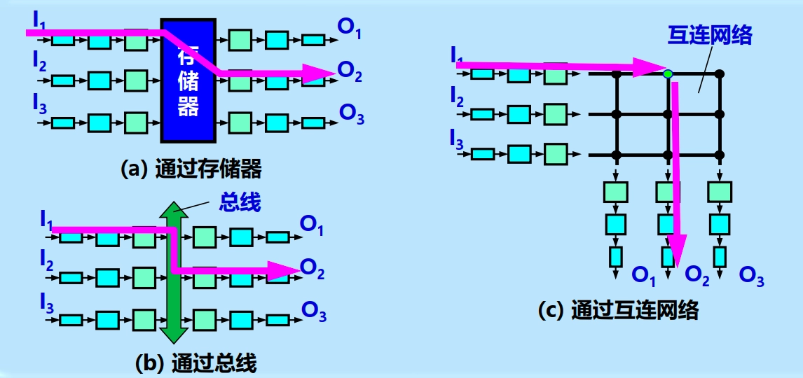
- 通过存储器
    1. 当路由器的某个输入端口收到一个分组时，就用**中断**方式通知路由选择处理机。然后分组就从输入端口**复制到存储器**中。
    2. 路由器处理机从分组首部提取目的地址，查找路由表，再将分组复制到合适的**输出端口的缓存**中。
    3. 若存储器的带宽（读或写）为每秒 $M$ 个分组，那么路由器的交换速率（即分组从输入端口传送到输出端口的速率）**一定小于** $M/2$ 。
- 通过总线
    1. 数据报从输入端口通过**共享的总线**直接传送到合适的输出端口，而**不需要**路由选择处理机的干预。
    2. 当分组到达输入端口时若发现总线忙，则被阻塞而不能通过交换结构，并在输入端口**排队等待**。
    3. 因为每一个要转发的分组都要通过这一条总线，因此路由器的转发带宽就受总线速率的限制。
- 通过纵横交换结构（crossbar switch fabric）/互连网络（interconnection network）
    1. 它有 $2N$ 条总线，控制交叉节点可以使 $N$ 个输入端口和 $N$ 个输出端口相连接。
    2. 当输入端口收到一个分组时，就将它发送到**水平总线**上。
    3. 若通向输出端口的垂直总线空闲，则**将垂直总线与水平总线接通**，把该分组转发到这个输出端口。若输出端口已被占用，分组在输入端口**排队等待**。

    - 特点：是一种**无阻塞**的交换结构，分组可以转发到任何一个输出端口，只要这个输出端口没有被别的分组占用。

## IP 多播
### IP 多播的基本概念
- **多播**（multicast）：**一对多通信**技术，将消息由一个源点发送到许多个终点，也称为组播。
    - 多播的优点：大大节约网络资源
        - 
            - 单播：向 90 台主机传送同样的视频节目，需要发送 90 个单播
            - 多播：只需发送一次到多播组，由网络中的路由器负责把数据报复制并转发给多播组的所有成员。局域网具有硬件多播功能，不需要复制分组。
        - 当多播组的主机数很大时（如成千上万个），采用多播方式就可明显地减轻网络中各种资源的消耗。
- **IP 多播**
    - 定义：在互联网上进行多播就叫做 IP 多播。
    - 多播路由器（multicast router）：能够运行多播协议的路由器。
        - 互联网范围的多播要靠多播路由器来实现。
        - 多播路由器也可以转发普通的单播 IP 数据报。
    - 多播主干网 MBONE（Multicast Backbone On the InterNET）：由互联网上的多播路由器连接而成的虚拟网络
- **多播 IP 地址**
    - 定义：在 IP 多播数据报的目的地址需要写入**多播组的标识符**。
    - 多播组的标识符：IP 地址中的 **D 类地址**（多播地址）。
        - 地址范围：`224.0.0.0` ~ `239.255.255.255`
        - 每一个 D 类地址标志一个多播组。
    - 说明：多播地址只能用于目的地址，不能用于源地址。
- **多播数据报**
    - 多播数据报和一般的 IP 数据报的区别：
        - **目的地址**：使用 D 类 IP 地址。
        - **协议字段 = 2**：表明使用网际组管理协议 IGMP。
    - 特点：
        - **尽最大努力交付**，不保证一定能够交付多播组内的所有成员。
        - 对多播数据报**不产生 ICMP 差错报文**。在 PING 命令后面键入多播地址，将永远不会收到响应。

### 在局域网上进行硬件多播
- 规定：
    1. 以太网多播地址的**第一个字节的最低有效位为 1**。
    2. 以太网多播地址的**高 25 位固定为** `01-00-5E-0`。
    3. 以太网多播地址的**低 23 位由 D 类 IP 地址的低 23 位映射而来**。
- 互联网号码分配机构 IANA 拥有的以太网地址块的高 24 位为 `00-00-5E`。
    - TCP/IP 协议使用的以太网地址块的范围是： `00-00-5E-00-00-00` 到 `00-00-5E-FF-FF-FF`
    - IANA 只拿出 `01-00-5E-00-00-00` 到 `01-00-5E-7F-FF-FF`（ $2^{23}$ 个地址）作为以太网多播地址。或者说，在 48 位的多播地址中，前 25 位都固定不变，只有后 23 位可用作多播。
- D 类 IP 地址与以太网多播地址的映射关系：
    - D 类 IP 地址的低 23 位映射到以太网多播地址的低 23 位。
    - 示意图：
        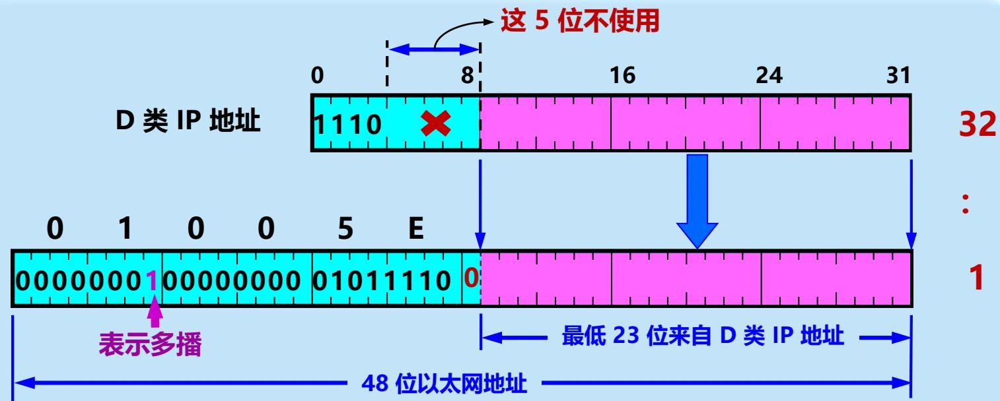
    - 收到多播数据报的主机，还要在 IP 层对 IP 地址进行过滤，把不是本主机要接收的数据报丢弃。

### IP 多播需要两种协议
#### 网际组管理协议 IGMP
- 定义：**网际组管理协议** IGMP（Internet Group Management Protocol）是用于主机和多播路由器之间交换组成员信息的协议，用于指导本局域网上是否有主机加入/退出多播组。
- 发展历程：
    - 标准协议：RFC1112（IGMPv1）
    - 建议标准：RFC2236（IGMPv2）、RFC3376（IGMPv3）
- 作用：使多播路由器知道多播组成员信息（判断有无成员）。
    
- 特点：
    - IGMP 协议是让连接在本地局域网上的**多播路由器**知道本局域网上**是否有主机参加或退出了某个多播组**。
    - IGMP 不知道 IP 多播组包含的成员数，也不知道这些成员都分布在哪些网络上。

##### IGMP 报文
- IGMP 报文使用 IP 数据报传送。
    - 在 IGMP 报文加上 IP 首部构成 IP 数据报。
    - 但 IGMP 也向 IP 提供服务。
- 因此，不把 IGMP 看成是一个单独的协议，而是整个网际协议 IP 的一个组成部分。

##### IGMP 工作过程
1. 第一阶段：**加入多播组**
    

    1. 当某个主机**加入**多播组时，该主机向多播组的多播地址发送 IGMP 报文，声明自己要成为该组的成员。
    2. 本地的多播路由器收到 IGMP 报文后，将组成员关系转发给互联网上的其他多播路由器。
2. 第二阶段：**探询组成员变化情况**
    

    1. 本地多播路由器**周期性**地探询本地局域网上的主机，以便知道这些主机是否还继续是组的成员。
    2. 只要对某个组有一个主机响应，那么多播路由器就认为这个组是活跃的。
    3. 但如果一个组在经过几次的探询后仍然没有一个主机响应，则不再将该组的成员关系转发给其他的多播路由器。

##### IGMP 避免增加大量开销的措施
- **IP 多播**：所有通信都使用多播方式进行，并尽可能使用**硬件多播**传送数据报。
- **统一询问**：对所有的组成员进行周期性的探询时只发送一个 IGMP 询问报文。默认询问速率为 125 秒。
- **选举机制**：当同一个网络上连接有多个多播路由器时，能迅速和有效地选择**其中的一个**来探询主机的成员关系。
- **分散响应**：在 IGMP 的询问报文中有一个数值 N，它指明一个**最长响应时间**（默认值为 10 秒）。当收到询问时，主机在 0 到 N 之间随机选择发送响应所需经过的时延。若一台主机同时参加了几个多播组，则主机对每一个多播组选择不同的随机数。对应于最小时延的响应最先发送。
- **响应抑制**：同一个组内的每一个主机都要监听响应，只要有本组的其他主机先发送了响应，自己就不再发送响应了。

#### 多播路由选择协议
- 定义：**多播路由选择协议**是用于多播路由器之间交换路由信息的协议，用于指导多播路由器如何转发多播数据报。
- 作用：使多播路由器协同工作，把多播数据报用最小代价传送给多播组的所有成员（找到合适的路由）。
- 特点：
    - 多播转发必须**动态适应**多播组成员的变化，即便网络拓扑不变（因为每一台主机可以随时加入或离开一个多播组而不改变网络拓扑）。
    - 多播路由器在转发多播数据报时，不能仅仅根据多播数据报中的目的地址，还要考虑这个多播数据报从什么地方来和要到什么地方去。
        - 多播路由器不应当向没有多播组成员的网络转发多播数据报。
    - 多播数据报可以由没有加入多播组的主机发出，也可以通过没有组成员的接入网络。
- 本质：**找出以源主机为根节点的多播转发树**。
    - 不同的多播组对应于不同的多播转发树。
    - 同一个多播组，对不同的源点也会有不同的多播转发树。
    - $M$ 个源，$N$ 个多播组，需要 $M\times N$ 棵以源为根的多播转发树。
    - 示例：
        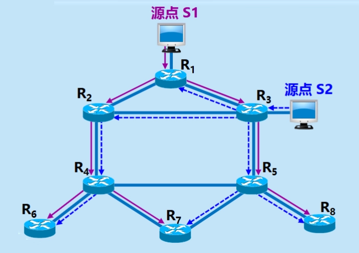
- 几种多播路由选择协议
    - 距离向量多播路由选择协议 DVMRP（Distance Vector Multicast Routing Protocol）：互联网上使用的第一个多播路由选择协议。
    - 基于核心的转发树 CBT（Core Based Tree）
    - 开放最短通路优先的多播扩展 MOSPF（Multicast Extensions to OSPF）
    - 协议无关多播-稀疏方式 PIM-SM（Protocol Independent Multicast-Sparse Mode）：唯一成为互联网标准的多播路由选择协议。
    - 协议无关多播-密集方式 PIM-DM（Protocol Independent Multicast-Dense Mode）
- 多播数据报转发方法：
    1. 洪泛与剪除（flooding and pruning）
    2. 隧道技术（tunneling）
    3. 基于核心的发现技术（core-based discovery）

##### 洪泛与剪除
- 适合场景：较小的多播组，所有组成员接入的局域网也是相邻接的。
- 工作原理：
    - 路由器**洪泛**转发多播数据报（也即广播）。
    - 采用**反向路径广播** RPB（Reverse Path Broadcasting）策略：检查数据来源路径以防止环路。
        
- 反向路径广播 RPB 的要点：
    1. **检查与转发**：依据路由表检查数据报是否是经过**最短路径**到达本路由器的。
        - 若是，则把该多播数据报从所有其他输出端口转发出去。
        - 若不是，则丢弃该多播数据报。

        
    2. **形成以源为根节点的多播转发树**：如果存在几条同样长度的最短路径，选择 IP 地址最小的。
        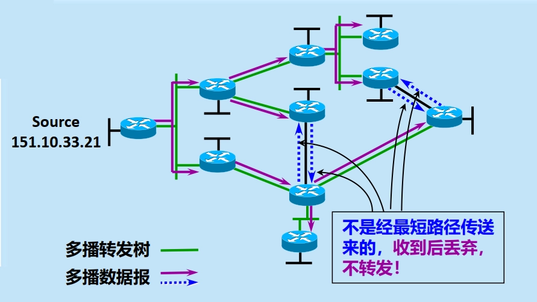
    3. **剪枝与嫁接**
        - 剪枝：如果在多播转发树上的某个路由器发现它的下游树枝（即叶节点方向）已没有该多播组的成员，就把它和下游的树枝一起剪除。
        - 嫁接：当某个树枝有新增加的组成员时，可以再接入到多播转发树上。

        

##### 隧道技术
- 适合场景：多播组成员分布在不同的网络上，且这些网络在地理上很分散。
- 工作原理：
    - 多播路由器之间通过**隧道**连接起来，形成一个虚拟的多播路由器网络。
    - 多播数据报被封装为普通的单播数据报在隧道中传送。
- 示意图：
    

##### 基于核心的发现技术
- 适合场景：多播组的大小在较大范围内变化时。
- 特点：
    - 同时使用了洪泛与剪除和隧道技术。
    - 所有收发端都通过核心路由器接入转发树。
- 工作原理：
    - 初始化：
        - 对每一个多播组 $G$ 指定一个**核心**路由器（core router）$R_C$，并全网通告其 IP 单播地址。
        - **以核心路由器为根节点创建多播组 $G$ 的转发树**。
            - 为一个多播组构建一棵转发树，而不是为每个（源，组）组合构建一棵转发树，开销较小，扩展性较好。
    - 成员加入与树扩展（发现过程）
        - 路由器 $R$ 通过 IGMP 发现本地有 $G$ 的成员，则向核心 $R_C$ 发送单播加入请求
        - 沿途路由器检查请求：
            - 若自身不在组 $G$ 的树中，就将单播路径加入转发树，并继续向 $R_C$ 转发请求
            - 若已在树中，则接入本地分支
        - 若加入路径经过不支持多播的网络，则使用隧道技术将请求发送到下一个多播路由器。
    - 数据转发机制：发送端先将多播数据单播到核心 $R_C$，再由核心 $R_C$ 按转发树向所有成员分支洪泛。
    - 成员离开与树剪除
        - 路由器 $R$ 通过 IGMP 发现本地已无 $G$ 的成员，则向核心 $R_C$ 发送单播离开请求
        - 沿途路由器检查请求：
            - 若本地分支上仍有成员，则直接剪枝
            - 若无成员，则剪枝，并继续向 $R_C$ 转发请求。

## 虚拟专用网 VPN 和网络地址转换 NAT
### 虚拟专用网 VPN
- 背景：
    - IP 地址紧缺
    - 互联网安全性
    - 机构内部通信

#### VPN 的基本概念
- **本地地址**：仅在机构内部使用的 IP 地址，可以由本机构自行分配，而不需要向互联网的管理机构申请。
- **全球地址**：全球唯一的 IP 地址，必须向互联网的管理机构申请。
- **专用地址**：专用地址只能用作本地地址，而不能用作全球地址。
    - RFC 1918 指明了一些专用地址（private address）。
        1. `10.0.0.0/8`：
            - A 类
            - 从 `10.0.0.0` 到 `10.255.255.255`
            - 共 1 个 A 类网段
        2. `172.16.0.0/12`：
            - B 类
            - 从 `172.16.0.0` 到 `172.31.255.255`
            - 共 16 个 B 类网段
        3. `192.168.0.0/16`：
            - C 类
            - 从 `192.168.0.0` 到 `192.168.255.255`
            - 共 256 个 C 类网段
    - 互联网中的所有路由器对目的地址是专用地址的数据报一律**不进行转发**。
- **专用网**：采用专用 IP 地址的互连网络称为专用互联网或本地互联网，简称专用网。
    - 专用 IP 地址：也称为可重用地址（reusable address）
- **虚拟专用网** VPN（Virtual Private Network）：利用公用互联网作为本机构各专用网之间通信载体的专用网。
    - 专用网：指这种网络是为本机构的主机**用于机构内部通信**，而不是用于和网络外非本机构的主机通信。
    - 虚拟：表示实际上**没有使用通信专线**，仅在**效果上**和专用网一样。

#### VPN 的构建
- **数据加密**：如果专用网不同网点之间的通信必须经过公用的互联网，但又有保密的要求，那么所有通过互联网传送的数据都必须加密。
- **专用软硬件**：必须为每一个场所购买专门的硬件和软件并进行配置，使每一个场所的 VPN 系统都知道其他场所的地址。
- **隧道技术**：在两个 VPN 网关路由器之间建立一个**虚拟隧道**，通过这个隧道传送加密后的数据报。
    

#### VPN 的类型
- **内联网**（intranet）：同一个机构的内部网络所构成的 VPN。
- **外联网**（extranet）：一个机构和某些外部机构共同建立的。
- **远程接入 VPN**（remote access VPN）：允许外部流动员工通过接入 VPN 建立 VPN 隧道访问公司内部网络，好像就是使用公司内部的本地网络访问一样。

### 网络地址转换 NAT
#### NAT 的基本概念
- 定义：**网络地址转换** NAT（Network Address Translation）是一种将专用地址转换为全球地址的技术，实现专用网内的主机与互联网主机之间的通信。
- **NAT 路由器**：连接专用网和互联网的路由器，负责在两种地址之间进行转换。
    - 装有 NAT 软件，至少有一个有效的外部全球 IP 地址。
    - 所有使用本地地址的主机在和外界通信时，都要在 NAT 路由器上将其本地地址转换成全球 IP 地址，才能和互联网连接。
- 特点：
    - 当 NAT 路由器具有 $n$ 个全球 IP 地址时，专用网内最多可以**同时**有 $n$ 台主机接入到互联网。
        - 可以使专用网内较多数量的主机轮流使用 NAT 路由器有限数量的全球 IP 地址。
        - 本质上并**不能**节省 IP 地址。
    - 通过 NAT 路由器的通信必须由专用网内的主机发起。
        - 专用网内部的主机不能作为服务器，不能被互联网主机访问。

#### 网络地址转换的过程
- 在内部主机与外部主机通信时，在 NAT 路由器上发生了**两次**地址转换：
    1. **离开专用网时**：替换**源地址**，将内部地址替换为全球地址。
    2. **进入专用网时**：替换**目的地址**，将全球地址替换为内部地址。
- 示意图：
    


### 网络地址与端口号转换 NAPT
- 定义：**网络地址与端口号转换** NAPT（Network Address and Port Translation）是一种通过将专用地址和运输层端口号转换为全球地址和端口号来节省 IP 地址的技术。
    - 与传统 NAT 不同，NAPT 使用运输层端口号来区分专用网内的不同主机。
- 特点：NAPT 可以使多台拥有本地地址的主机，**共用**一个全球 IP 地址，**同时**和互联网上的不同主机进行通信。
- NAPT 的工作原理
    - NAPT 把专用网内**不同的源 IP 地址转换为相同的全球 IP 地址，将 TCP 源端口号转换为新的互不相同的 TCP 端口号**。
    - 收到从互联网发来的应答时，从 IP 数据报的数据部分找出运输层端口号，从 NAPT 转换表中找到正确的目的主机。
- 示例：假设有两台专用网内的主机 `192.168.0.3` 和 `192.168.0.4`，NAPT 路由器使用全球 IP 地址 `172.38.1.5`，则 NAPT 路由器的地址转换表如下：

    | 方向 | 字段 | 旧的 IP 地址和端口号 | 新的 IP 地址和端口号 |
    | ---- | ---- | --------------------- | --------------------- |
    | 出   | 源 IP 地址：TCP 源端口 | `192.168.0.3：30000`   | `172.38.1.5：40001`   |
    | 出   | 源 IP 地址：TCP 源端口 | `192.168.0.4：30000`   | `172.38.1.5：40002`   |
    | 入   | 目的 IP 地址：TCP 目的端口 | `172.38.1.5：40001`   | `192.168.0.3：30000`   |
    | 入   | 目的 IP 地址：TCP 目的端口 | `172.38.1.5：40002`   | `192.168.0.4：30000`   |

## 多协议标签交换 MPLS
### MPLS 的基本概念


- **多协议标签交换** MPLS（MultiProtocol Label Switching）：是一种在网络层和链路层之间引入一个新的**标签交换层**的技术。
    - 含义：
        - 多协议：在 MPLS 的上层可以采用多种协议。
        - 标签：MPLS 利用面向连接技术，使每个分组携带一个叫做标签（label）的小整数。标签交换路由器用标签值检索转发表，实现分组的快速转发。
    - 作用：**提高分组转发的速度**，并支持流量工程和虚拟专用网 VPN。
    - 地位：
        - 互联网建议标准
        - 作为一种 **IP 增强技术**（并没有取代 IP）
    - 特点：
        1. 支持面向连接的服务质量
        2. 支持流量工程，平衡网络负载
        3. 有效地支持虚拟专用网 VPN
- **标记交换路由器** LSR（Label Switching Router）：运行 MPLS 协议的路由器，同时具有标记交换和路由选择这两种功能。
    - **标记交换**：快速转发
    - **路由选择**：构造转发表
- **MPLS 域**（MPLS domain）：由运行 MPLS 协议的标记交换路由器 LSR 组成的网络区域。

### MPLS 的工作原理
#### MPLS 基本工作过程
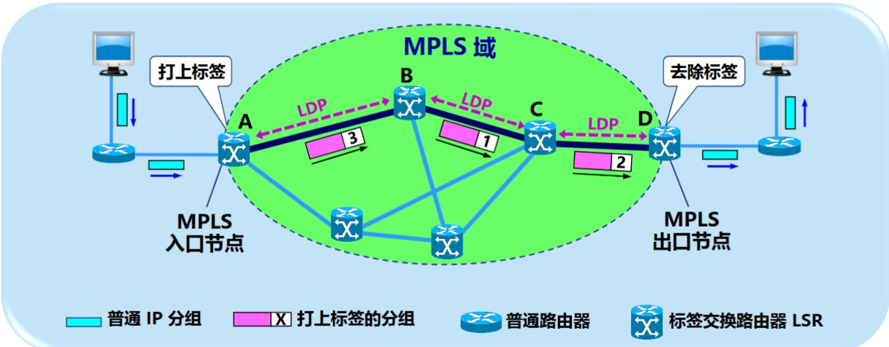

1. **找出标签交换路径 LSP**
    - 各 LSR 使用标签分配协议 LDP（Label Distribution Protocol）交换报文，找出和标签相对应的标签交换路径 LSP（Label Switched Path）。
        - **显式路由选择**（explicit routing）：**由入口 LSR 确定进入 MPLS 域以后的转发路径**的路由选择方式。
        - 与互联网中通常使用的“每一个路由器逐跳进行路由选择”有着很大的区别。
    - 整个标签交换路径就像一条虚连接一样。
2. **标签引入**
    - 在 MPLS 域的**入口**处，入口节点（ingress node）给进入 MPLS 域的 IP 数据报打上**固定长度标签**（实际上是插入一个 MPLS 首部），并按照转发表把它转发给下一个 LSR。
    - 之后的所有 LSR 都按照标签进行转发。
3. **硬件转发与标签对换**
    - 在 MPLS 域的**内部**，对打上标签的 IP 数据报在第二层（数据链路层）进行**硬件转发**。
        - 可以使用多种数据链路层协议，如 PPP、以太网、ATM 以及帧中继等。
    - LSR 的任务：
        1. **硬件转发**：LSR 根据标签值查找转发表，决定把数据报从哪个接口转发出去。
            - LSR 只检查标签值，而不检查 IP 首部，从而实现快速转发。
        2. **标签对换**（label swapping）：LSR 更新标签，将入标签更换成为出标签。
            - 一个标签仅在两个 LSR 之间才有意义。
            - 示例：从入接口 0 收到一个入标签为 3 的 IP 数据报，转发时，应当把该 IP 数据报从出接口 1 转发出去，同时把标签对换为 1。
                
4. **标签去除**
    - 在 MPLS 域的**出口**处，出口节点（egress node）给即将离开 MPLS 域的 IP 数据报去除标签，并交付给非 MPLS 的主机或路由器。

#### 转发等价类 FEC
- **分类**（classification）：给 IP 数据报打标签的过程。
    - **第三层（网络层）分类**：只使用 IP 首部中的源和目的 IP 地址等。
    - **第四层（运输层）分类**：除了要检查 IP 首部外，运输层还要检查 TCP 或 UDP 端口号。
        - 大多数运营商实现
    - **第五层（应用层）分类**：进一步地检查数据报的内部并考虑其有效载荷。
        - 部分运营商实现
- **转发等价类** FEC（Forwarding Equivalence Class）：路由器按照同样方式对待的**分组的集合**。
    - 按照同样方式对待：从同样接口转发到同样的下一跳地址，并且具有同样服务类别和同样丢弃优先级等。
    - 示例：
        1. 目的 IP 地址与某一个特定 IP 地址的前缀匹配的 IP 数据报
        2. 所有源地址与目的地址都相同的 IP 数据报
        3. 具有某种服务质量需求的 IP 数据报
    - **FEC 和标签一一对应**：入口节点并不是给每一个 IP 数据报指派一个不同的标签，而是将属于同样 FEC 的 IP 数据报都指派同样的标签。
- FEC 的划分方法：不受限制，由网络管理员来控制。
- FEC 的作用：
    - 可用于负载平衡：自定义的 FEC 可以更好地管理网络的资源。这种均衡网络负载的做法也称为流量工程 TE（Traffic Engineering）或通信量工程。
    - 示例：
        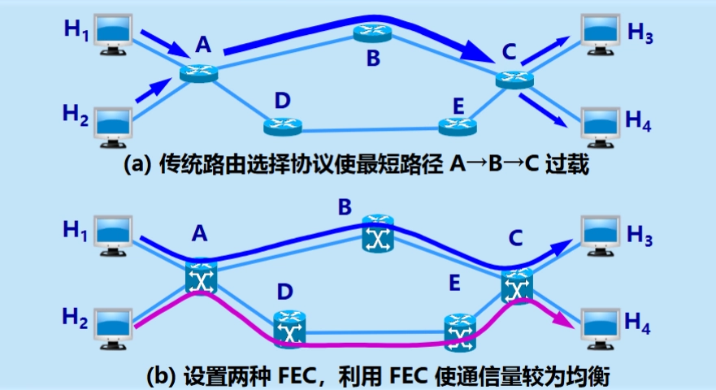

### MPLS 的首部
- MPLS 首部的长度：4 个字节（32 位）
- MPLS 首部的位置：
    - MPLS 首部处于网络层和数据链路层之间。
        
    - MPLS 采用**封装技术**：在把 IP 数据报封装成以太网帧之前，先要插入一个 MPLS 首部。
    - MPLS 不要求下层的网络都使用面向连接的技术。
- MPLS 首部的格式：
        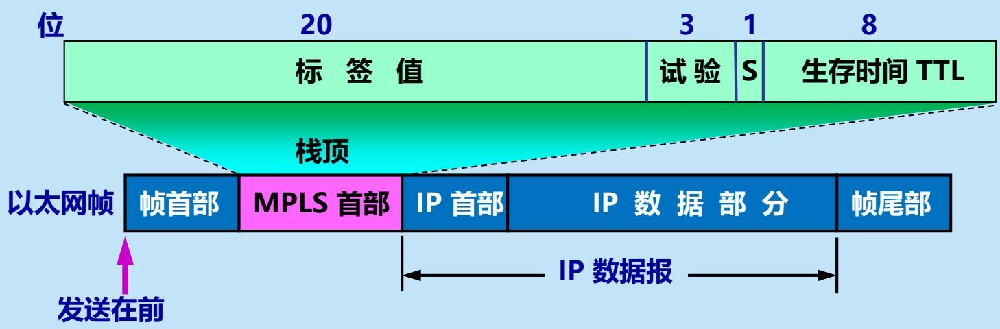
- MPLS 首部的字段：
    1. 标签值：占 20 位，可以同时容纳高达 $2^{20}=1048576$ 个流。
    2. 试验：占 3 位，保留用作试验。
    3. 栈 S：占 1 位，在有“标签栈”时使用。
    4. 生存时间 TTL：占 8 位，用来防止 MPLS 分组在 MPLS 域中兜圈子。

### 新一代的 MPLS
- MPLS 的缺点：
    - 控制协议（如 LDP）比较复杂，扩展性差，运行维护较困难。
    - 协议 LDP 无法做到基于时延或带宽等要求的流量调度。
    - 为灵活地选择流量的转发路径，还需要再使用**资源预留协议** RSVP。但是：
        - RSVP 的信令非常复杂，每个节点都要维护一个庞大的链路信息数据库。
        - RSVP 只会选择一条最优路径，**不支持等价多路径路由选择** ECMP（Equal-Cost Multipath Routing）。
- **段路由选择协议** SR（Segment Routing）：是新一代的 MPLS 技术，由思科公司提出并推动成为互联网标准。
    - **段**（segment）：标签，是转发指令的一种标识符。
    - SR 工作原理：
        - 基于标签交换，但不需要使用协议 LDP。
        - 由源节点为发送的报文指定路径，并将路径转换成有序的段列表（Segment List），即 MPLS 标签栈，它被封装在分组首部。
        - 网络中的其他节点就执行首部中的指令（即标签）进行转发。
    - SDN 控制器（详见[下文](#sdn-控制器)）：
        - SR 通常和软件定义网络 SDN 结合使用，由 SDN 控制器来完成路径计算和标签分配等任务。
        - 任务：
            - **收集**并掌握全网的拓扑信息和链路状态信息，**计算**出分组应传送的整个路径。
            - 给分组**分配** SR 标签，指明分组从源点到终点的路径。
- SRv6（Segment Routing over IPv6）：SR 在 IPv6 网络中的实现方式。
    - SRv6 直接利用 IPv6 字段作为标签寻址（Locator）。

## 软件定义网络 SDN 简介
- **软件定义网络** SDN（Software Defined Network）：是一种新型的网络体系结构，通过将网络的控制层面和数据层面分离开来，实现网络的集中控制和管理。
- 发展历程：
    - 斯坦福大学 N. McKeown 于 2009 年首先提出。
    - 谷歌于 2010 ~ 2012 年的数据中心网络 B4 进行了运行验证。
- 优点：
    - 提高网络带宽利用率
    - 网络运行更加稳定
    - 管理更加高效简化
    - 运行费用明显降低

### SDN 与 OpenFlow 协议


- SDN
    - 是一个**体系结构**，是一种设计、构建和管理网络的新方法或新概念。
    - 把控制层面和数据层面分离，而让控制层面**利用软件控制**数据层面中的许多设备。
- OpenFlow
    - SDN 体系结构中控制层面和数据层面之间的**通信接口**。
    - 使控制层面的控制器可以对数据层面中的物理或虚拟设备进行**直接**访问和操纵。
    - 在逻辑上是**集中式**的、**基于流**的。
- 说明：
    - SDN 不是 OpenFlow。
    - SDN 未规定必须使用 OpenFlow。

### OpenFlow 协议数据层面
- **广义转发**：数据层面的**分组交换机或 OpenFlow 交换机**完成“匹配 + 动作”
    - 匹配：对不同层次（链路层，网络层，运输层）首部中的字段进行匹配。
    - 动作：转发，重写，丢弃等。
- **流表**（flow table）：是 OpenFlow 交换机中用于实现广义转发的核心数据结构，规定了“匹配 + 动作”的规则。
    - 每个 OpenFlow 交换机有一个或以上的流表。
    - 每个流表可以包括多个流表项（flow entry）。
    - 示意图：  
        
- **流**：穿过网络的一种分组序列，而在此序列中的分组都共享分组首部某些字段的值。
- 流表由远程控制器管理：SDN 远程控制器通过一个安全信道，使用 OpenFlow 协议来管理 OpenFlow 交换机中的流表。
- 流表结构
    

    1. **首部字段值**：一组字段（12 个），用来使入分组的对应首部与之相匹配。
        - 匹配不上的分组：丢弃或发送到远程控制器做更多的处理。
    2. **计数器**：一组计数器，可包括已经与该表项匹配的分组数量，以及从该表项上次更新到现在经历的时间。
    3. **动作**：当分组匹配某个流表项时执行的一组动作。
        - 把分组**转发**到指明的端口，或**丢弃**该分组，或把分组进行**复制**后再从多个端口转发出去，或**重写**分组的首部字段（第二、三和四层的首部字段）等。
- 示例：广义转发的多样性和灵活性
    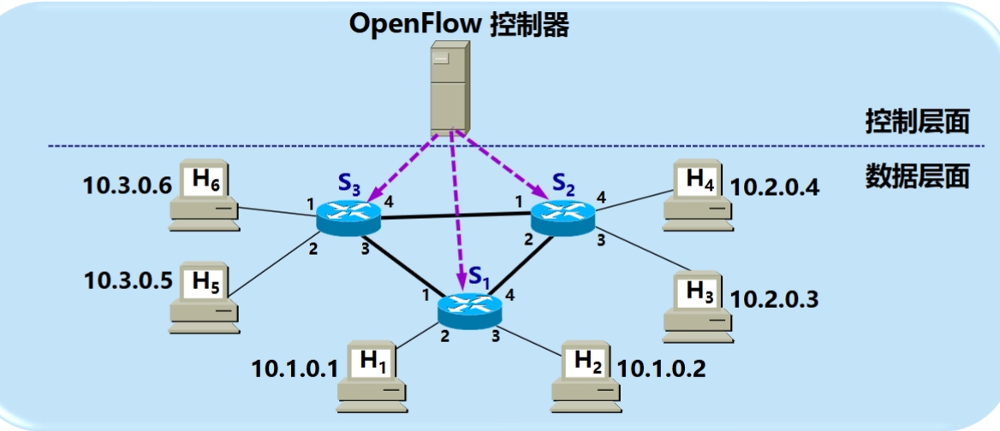

    1. 简单转发
        - 转发规则：
            - 源：$H_{5}$ 或 $H_{6}$
            - 目的：$H_{3}$ 或 $H_{4}$
            - 路径：$S_{3} \to S_{1} \to S_{2}$
        - 流表
            
    2. 负载均衡
        - 转发规则：
            - 从 $H_{3}$ 发往主机 `10.1.*.*` 的分组，其转发路径为 $S_{2} \to S_{1}$
            - 从 $H_{4}$ 发往主机 `10.1.*.*` 的分组，其转发路径为 $S_{2} \to S_{3} \to S_{1}$
        - 流表
            
    3. 防火墙
        - 转发规则：$S_{2}$ 中设置了防火墙，仅接收来自与 $S_{3}$ 相连的主机所发送的分组。
        - 流表
            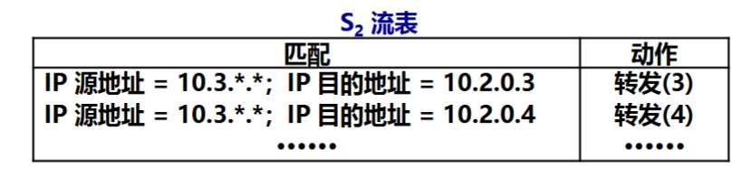

### SDN 体系结构
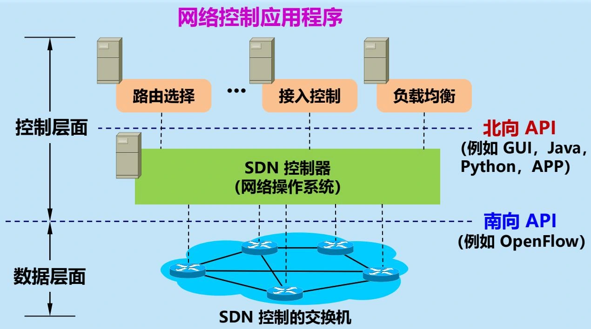

- SDN 体系结构的关键特征
    - 基于流的转发：流表规定转发规则。
    - 数据层面与控制层面分离：二者不在同一个设备中。
    - 网络控制功能位于数据层面交换机之外，用软件实现。
    - 可编程的网络。
- SDN 与传统网络的区别
    - SDN
        - 功能分散，交换机、SDN 控制器、网络控制应用程序都是可以分开的实体。
        - 可以由不同的厂商和机构来提供。
    - 传统网络
        - 控制层面、数据层面、协议的实现都垂直集成在一个机器里。
        - 由单独的厂商提供。

### SDN 控制器


- 定义：**SDN 控制器**是 SDN 体系结构中负责管理和控制数据层面交换机的核心组件。
- 分层：
    - 到网络控制应用程序的接口
        - SDN 控制器与网络控制应用程序交互的接口称为**北向接口**。
        - 北向接口允许网络控制应用程序对状态管理层里的网络状态和流表进行读写操作。
    - 网络范围的状态管理层：完成核心功能
        - 管理和维护链路、主机、交换机等网络状态。
        - 确定和维护流表等。
    - 通信层
        - 通信层与数据层面的接口叫做**南向接口**，基本上采用 OpenFlow。
        - 完成 SDN 控制器与受控网络设备之间的通信。

# 传输层
## 传输层基本概念
### 进程之间的通信
- 传输层的位置：
    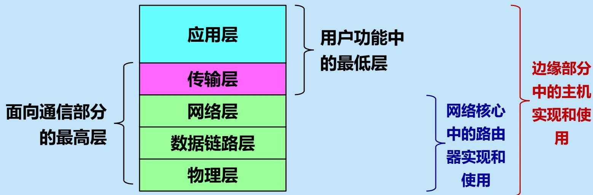
- 传输层的作用：提供应用进程之间的**逻辑通信**。
    - 屏蔽作用：传输层向高层用户屏蔽了下面网络核心的细节（如网络拓扑、所采用的路由选择协议等），使应用进程看见的就是好像在两个传输层实体之间有一条端到端的逻辑通信信道。
    - 端到端通信：传输层实体在通信时，**不关心**数据报在网络中经过了哪些路由器和链路。
- 传输层的通信对象：**进程**（process）
    - 进程：正在运行的程序实例。
    - 主机可以同时运行多个进程。
    - 传输层的任务：为不同的进程提供通信服务。
- 可靠信道与不可靠信道
    - **可靠信道**：使用面向连接的传输协议（如 TCP）建立的信道。
    - **不可靠信道**：使用无连接的传输协议（如 UDP）建立的信道。
    - 示意图
        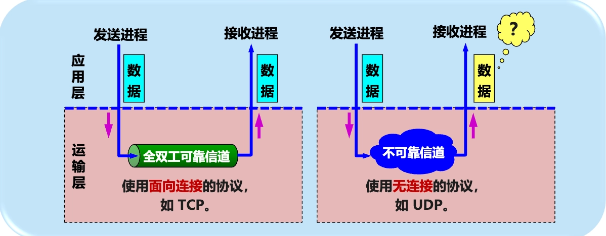

### 传输层的主要协议：UDP 和 TCP
- 互联网的正式标准：
    1. **用户数据报协议** UDP（User Datagram Protocol）
    2. **传输控制协议** TCP（Transmission Control Protocol）
- **传输协议数据单元** TPDU（Transport Protocol Data Unit）：两个对等传输实体在通信时传送的数据单位。
    - UDP 传送的数据单位：**UDP 报文**或**用户数据报**
    - TCP 传送的数据单位：**TCP 报文段**（segment）
- UDP 与 TCP 的区别
    - UDP
        - 传送数据之前不需要先建立连接。
        - 收到 UDP 报后，不需要给出任何确认。
        - 不提供可靠交付，但是一种最有效的工作方式。
    - TCP
        - 提供可靠的、面向连接的传输服务。
        - 不提供广播或多播服务。
        - 开销较多。
- 使用 UDP 和 TCP 的典型应用和应用层协议
    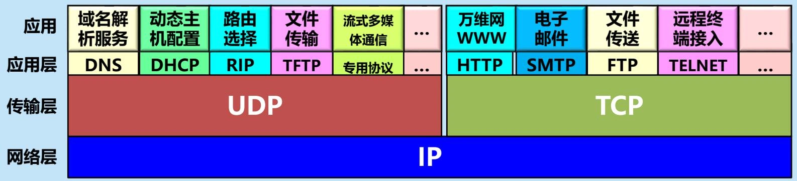

### 传输层的端口


- 传输层的复用与分用
    - **复用**：应用进程都可以通过传输层再传送到 IP 层（网络层）。
    - **分用**：传输层从 IP 层收到发送给应用进程的数据后，必须分别交付给指明的各应用进程。
- **端口号**（protocol port number）
    - 进程标识的问题：
        - 进程的创建和撤销都是**动态**的，因此发送方几乎无法识别其他机器上的进程。
        - 我们往往需要利用目的主机提供的功能来识别终点，而不需要知道具体实现这个功能的进程是哪一个。
        - 有时我们会改换接收报文的进程，但并不需要通知所有的发送方。
    - 解决方法：在传输层使用**协议端口号**（protocol port number），或通常简称为**端口**（port）。**把端口设为通信的抽象终点**。
        
- 软件端口与硬件端口
    - 软件端口
        - 协议栈层间的**抽象的协议端口**。
        - 是应用层的各种协议进程与传输实体进行层间交互的地点。
        - 不同系统实现端口的方法可以不同。
    - 硬件端口
        - 不同硬件**设备进行交互的接口**。
- TCP/IP 传输层端口的标志
    - 端口用一个 **16 位端口号**进行标志，允许有 65,535 个不同的端口号。
    - 端口号只具有**本地意义**，只是为了标志本计算机应用层中的各进程。
    - 在互联网中，不同计算机的相同端口号没有联系。
- 端口分类
    - 服务端使用的端口号：0 ~ 49151
        - **熟知端口**（well-known port）：0 ~ 1023
            - 由互联网分配号码管理局 IANA 统一管理和分配，全球通用。
            - 一些常用的应用层协议都使用熟知端口号。
        - **登记端口**（registered port）：1024 ~ 49151
            - 在 IANA 登记注册后使用
    - 客户端使用的端口号：49152 ~ 65535
        - **短暂端口**（ephemeral port）：49152 ~ 65535
            - 通信结束后会被系统收回。
    
    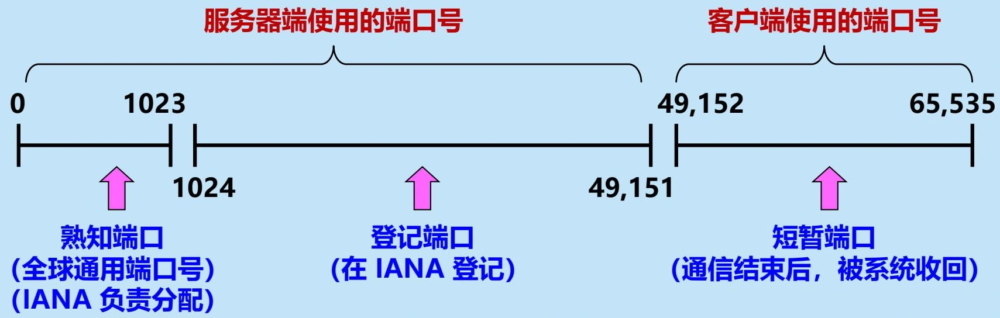
- 常用的熟知端口
    - UDP
        - RPC：111
        - DNS：53
        - TFTP：69
        - SNMP：161
        - DHCP：67（服务器），68（客户端）
    - TCP
        - FTP：20（数据），21（控制）
        - SSH：22
        - Telnet：23
        - SMTP：25
        - HTTP：80
        - POP3：110
        - IMAP：143
        - HTTPS：443

## 用户数据报协议 UDP
### UDP 概述
- UDP 只在 IP 的数据报服务之上增加了一些功能：
    1. 复用和分用
    2. 差错检测
- UDP 通信的特点：**简单方便，但不可靠**

#### UDP 的主要特点
1. **无连接**：发送数据之前不需要建立连接。
2. **使用尽最大努力交付**：即不保证可靠交付。
3. **面向报文**：UDP 一次传送和交付一个完整的报文。
4. **没有拥塞控制**：网络出现的拥塞不会使源主机的发送速率降低。很适合多媒体通信的要求。
5. 支持**一对一、一对多、多对一、多对多**等交互通信。
6. **首部开销小**，只有 8 个字节。

#### UDP 是面向报文的
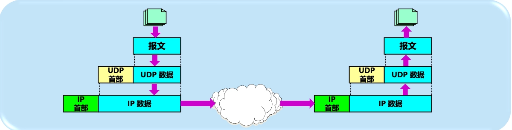

- 面向报文的含义：
    - **发送方** UDP 对应用层交下来的报文，既不合并也不拆分，原封不动地封装成 UDP 用户数据报交给 IP 层，一次发送一个完整的报文。
    - **接收方** UDP 对 IP 层交上来的 UDP 用户数据报，去除首部后就原封不动地交付上层的应用进程，一次交付一个完整的报文。
- 应用程序必须选择**合适大小**的报文。
    1. 若报文太长，IP 层在传送时可能要进行分片，降低 IP 层的效率。
    2. 若报文太短，会使 IP 数据报的首部的相对长度太大，降低 IP 层的效率。

#### UDP 通信和端口号的关系
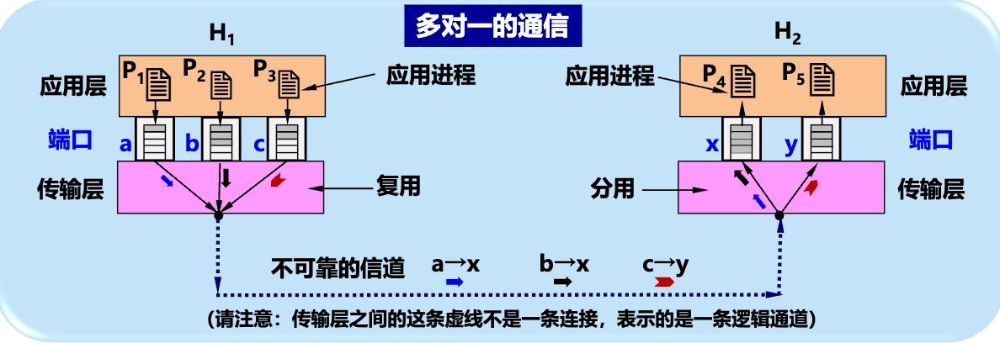
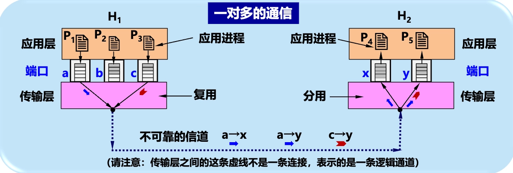

- **复用**：发送方将 UDP 用户数据报组装成不同的 IP 数据报，发送到互联网。
- **分用**：接收方根据 UDP 用户数据报首部中的目的端口号，将数据报分别传送到相应的端口，上交给应用进程。
    - 如果发现报文中的目的端口号不正确（即不存在对应于该端口号的应用进程），则丢弃该报文，并由 ICMP 发送“端口不可达”差错报文给发送方。

### UDP 的首部
- UDP 首部的长度：8 个字节
- UDP 首部的格式：
    
- UDP 首部的字段：
    1. **源端口**：占 2 字节，表示源端口号。在需要对方回信时选用。不需要时可用全 0 。
    2. **目的端口**：占 2 字节，表示目的端口号。终点交付报文时必须使用。
    3. **长度**：占 2 字节，表示 UDP 用户数据报的长度，其最小值是 8（仅有首部）。
    4. **检验和**：占 2 字节，用于检测 UDP 用户数据报在传输中是否有错，有错则直接丢弃。
- UDP 伪首部：
    - 定义：用于计算检验和的**辅助结构**，并不实际传送。
    - 字段：
        1. 源 IP 地址：4 字节
        2. 目的 IP 地址：4 字节
        3. 保留字段：1 字节，值全为 0
        4. 协议字段：1 字节，UDP 的协议号是 17
        5. UDP 长度字段：2 字节，与 UDP 首部中的长度字段相同
    - 作用：在计算检验和时，临时把 12 字节的伪首部和 UDP 用户数据报连接在一起进行计算。
    - 示例：
        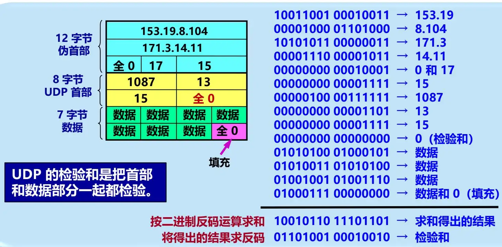

## 可靠传输的工作原理
- IP 网络提供的是不可靠的传输
    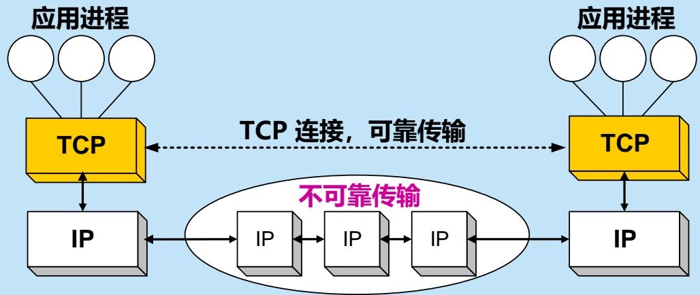
- 理想传输条件
    - 特点
        1. 传输信道不产生差错。
        2. 不管发送方以多快的速度发送数据，接收方总是来得及处理收到的数据。
    - 在理想传输条件下，不需要采取任何措施就能够实现可靠传输。
    - 但实际网络都不具备理想传输条件。必须使用一些可靠传输协议，在不可靠的传输信道实现可靠传输。

### 停止等待协议
#### 基本思想
- 每发送完一个分组就**停止**发送，**等待**对方的确认。在收到确认后再发送下一个分组。
- 全双工通信的双方既是发送方也是接收方，假设仅考虑 A 发送数据，而 B 接收数据并发送确认。因此 A 叫做发送方，而 B 叫做接收方。

#### 停止等待协议的要点
- **停止等待**：发送方每次只发送一个分组。在收到确认后再发送下一个分组。
- **暂存**：在发送完一个分组后，发送方必须暂存已发送的分组的副本，以备重发。
- **编号**：对发送的每个分组和确认都进行编号。
- **超时重传**：发送方为发送的每个分组设置一个超时计时器。若超时计时器超时未收到确认，发送方会自动超时重传分组。
    - 超时计时器的重传时间应当比数据在分组传输的平均往返时间更长一些，防止不必要的重传。

##### 无差错情况


- A 发送完分组 $M_{1}$ 后就暂停发送，等待 B 的确认 $ACK$。
- B 收到 $M_{1}$ 向 A 发送 $ACK$。
- A 在收到了对 $M_{1}$ 的确认后，就再发送下一个分组 $M_{2}$。

##### 出现差错
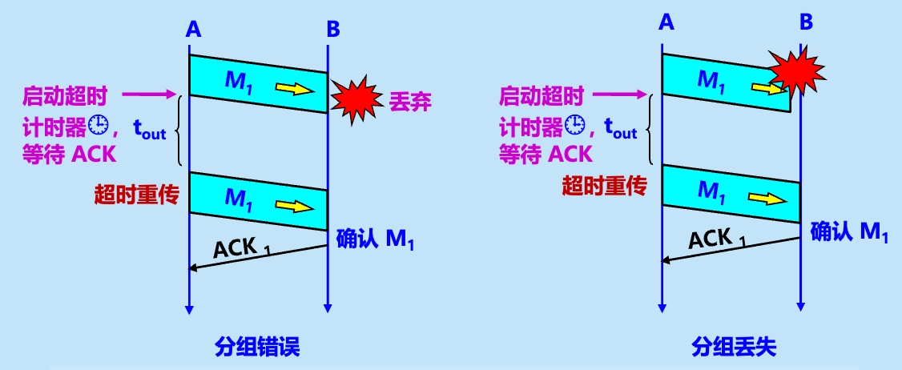

- 两种情况：在这两种情况下，B 都不会发送任何信息
    1. B 接收 $M_{1}$ 时，检测出**差错**并丢弃 $M_{1}$，其他什么也不做（不通知 A 收到有差错的分组）。
    2. $M_{1}$ 在传输过程中**丢失**，这时 $B$ 什么都不知道，也什么都不做。
- **超时重传**：
    1. A 为每一个已发送的分组设置一个超时计时器。
    2. A 只要在超时计时器到期之前收到了相应的确认，就撤销该超时计时器，继续发送下一个分组 $M_{2}$  。
    3. 若 A 在超时计时器规定时间内没有收到 B 的确认，就认为分组错误或丢失，就**重发**该分组。

##### 确认丢失和确认迟到


- **确认丢失**
    1. 若 B 所发送的对 $M_{1}$ 的确认丢失了，那么 A 在设定的超时重传时间内将不会收到确认，因此 A 在超时计时器到期后将重传 $M_{1}$。
    2. 假定 B 正确收到了 A 重传的分组 $M_{1}$，则 B **丢弃**重复的 $M_{1}$，不向上层交付，并向 A **重传确认**分组。
    3. A 收到确认后，继续发送下一个分组 $M_{2}$。
- **确认迟到**
    1. 若 B 所发送的对 $M_{1}$ 的确认迟到了，那么 A 在超时计时器到期后重传 $M_{1}$。
    2. B 会收到重复的 $M_{1}$，则**丢弃**重复的 $M_{1}$ 并**重传确认**分组。
    3. 由于第一个确认只是迟到而非丢失，A 会收到对 $M_{1}$ 的重复确认，则**丢弃**该重复确认即可。

#### 停止等待协议的优缺点
- 优点：简单。
- 缺点：信道利用率太低。
    - **信道利用率**：$U = \frac{T_{D}}{T_{D} + RTT + T_{A}}$
        
    - 当往返时间 $RTT \gg T_{D}$ 时，信道的利用率非常低。

### 回退 N 的连续 ARQ 协议
#### 基本思想
- **流水线传输**：在收到确认之前，发送方连续发出多个分组。
    

    - 发送方允许在等待确认的同时，继续发送后续的分组，从而提高信道利用率。
    - 接收方只对按序到达的分组进行确认，对乱序到达的分组不予确认，并丢弃这些乱序到达的分组。
- **回退 N**（Go-back-N）的重传方式：发送方一旦发现某个分组出错或丢失，就**重传该分组及其后面所有的分组**。

#### 连续 ARQ 协议的要点
- **发送窗口**：发送方维持一个发送窗口，位于发送窗口内的分组都可被连续发送出去，而不需要等待对方的确认。
- **发送窗口滑动**：发送方每收到一个确认，就把发送窗口向前滑动一个分组的位置。
    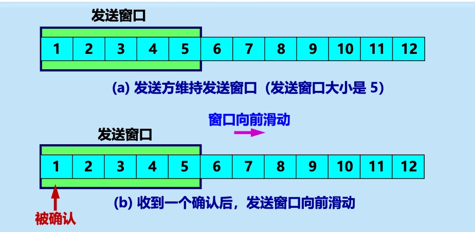
- **累积确认**：接收方对**按序到达的最后一个分组**发送确认，表示到这个分组为止的所有分组都已正确收到了。
    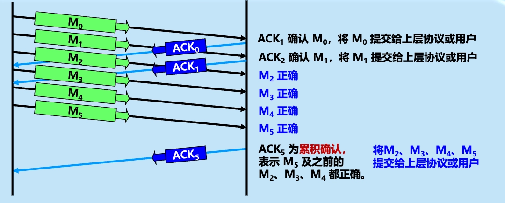

#### 连续 ARQ 协议的优缺点
- 优点：容易实现，即使确认丢失也不必重传。
- 缺点：能向发送方反映出接收方已经正确收到的所有分组的信息。

## 传输控制协议 TCP
### TCP 概述
#### TCP 的主要特点
1. **面向连接**：TCP 是面向连接的传输层协议。
2. **点对点连接**：每一条 TCP 连接**只能有两个端点**（endpoint），每一条 TCP 连接只能是点对点的（一对一）。
3. **可靠交付**：TCP 提供可靠交付的服务。
4. **全双工通信**：TCP 提供全双工通信。
5. **面向字节流**：TCP 是面向字节流的协议。

#### TCP 是面向字节流的
- 字节流（stream）：流入或流出进程的**字节序列**。
- 面向字节流的含义：
    - 虽然应用程序和 TCP 的交互是一次一个数据块，但 TCP 把应用程序交下来的数据看成仅仅是一连串无结构的字节流
    - TCP 不保证接收方应用程序所收到的数据块和发送方应用程序所发出的数据块具有对应大小的关系。
    - 但接收方应用程序收到的字节流必须和发送方应用程序发出的字节流完全一样。

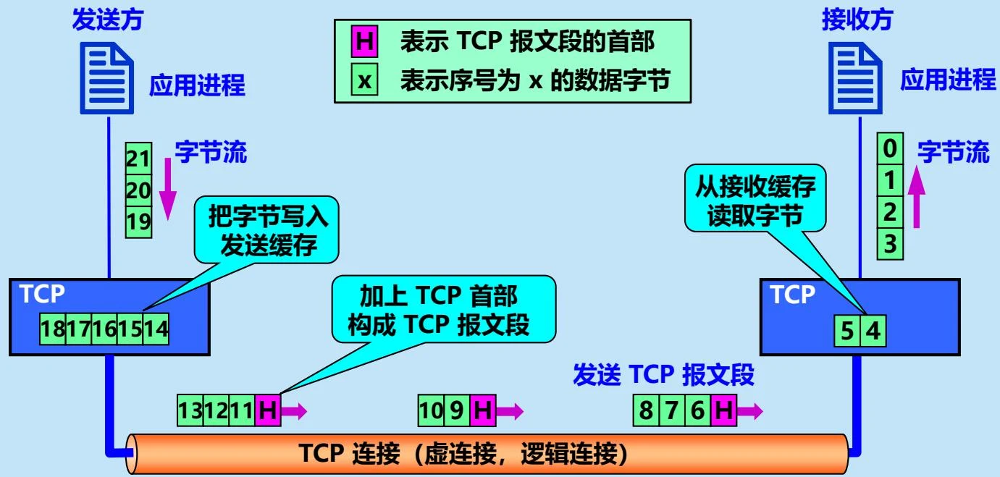

- 特点：
    - TCP 不关心应用进程一次把多长的报文发送到 TCP 缓存。
    - TCP 根据对方给出的窗口值和当前网络拥塞程度来决定一个报文段应包含多少个字节，形成 TCP 报文段。

#### TCP 是面向连接的
- TCP 把连接作为最基本的抽象。
    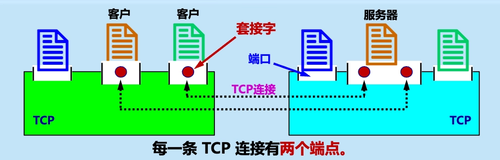
- TCP 连接的端点：套接字（socket）或插口。
- **套接字**（socket）：是传输层与应用层之间的接口，是传输层对应用进程的标识。
    - 组成：$\text{socket} =（\text{IP}:\text{port})$
        1. 主机的 IP 地址
        2. 主机上的端口号
    - 每一条 TCP 连接唯一地被通信两端的两个端点（即两个套接字）所确定：
        - TCP 连接 = $\{\text{socket}_1,\text{socket}_2\} = \{(\text{IP}_1：\text{port}_1),(\text{IP}_2：\text{port}_2)\}$
- 说明：
    - 同一个 IP 地址可以有多个不同的 TCP 连接。
    - 同一个端口号也可以出现在多个不同的 TCP 连接中。

### TCP 报文段
- TCP 虽然是面向字节流的，但 TCP 传送的数据单元却是报文段。
- TCP 报文段首部的长度：$4n$ 字节（$5 \leq n \leq 15$，$n \in \mathbb{Z}$）
    - 前 20 个字节是固定的，后面是根据需要而增加的选项，选项最长可达 40 字节。
    - 因此 TCP 首部的**最小长度是 20 字节**，最大长度是 60 字节。

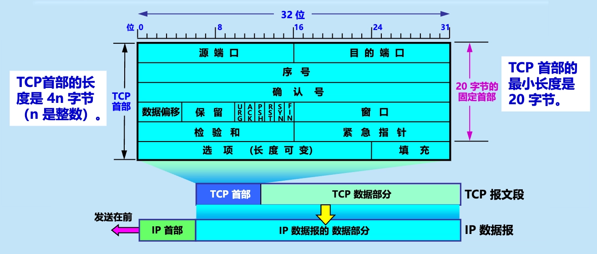

#### TCP 首部字段
- **源端口和目的端口**：各占 2 字节。端口是传输层与应用层的服务接口。传输层的复用和分用功能通过端口实现。
- **序号**：占 4 字节，用于字节流的可靠传输。TCP 连接中传送的数据流中的**每一个字节都有一个序号**，序号字段的值是**本报文段所发送的数据的第一个字节的序**号。
    - 现有 5000 个字节的数据。假设报文段的最大数据长度为 1000 个字节，初始序号为 1001。
        - 报文段 1 序号 = 1001（数据字节序号：1001 ~ 2000）
        - 报文段 2 序号 = 2001（数据字节序号：2001 ~ 3000）
        - 报文段 3 序号 = 3001（数据字节序号：3001 ~ 4000）
        - 报文段 4 序号 = 4001（数据字节序号：4001 ~ 5000）
        - 报文段 5 序号 = 5001（数据字节序号：5001 ~ 6000）
- **确认号**：占 4 字节，表示期望收到对方的下一个报文段的数据的第一个字节的序号。
    - 若确认号 = N，则表明到序号 N - 1 为止的所有数据都已正确收到。
- **数据偏移**（即首部长度）：占 4 位，指出 TCP 报文段的数据起始处距离 TCP 报文段的起始处有多远。单位是 32 位字（以 4 字节为计算单位）。
- **保留字段**：占 6 位，保留为今后使用，但目前应置为 0。
- **紧急** URG：控制位，表示紧急指针字段是否有效。
    - 当 URG = 1 时，表明紧急指针字段有效，告诉系统此报文段中有紧急数据，应尽快传送（相当于高优先级的数据）。
- **确认** ACK：控制位，表示确认号字段是否有效。
    - 只有当 ACK = 1 时，确认号字段才有效。当 ACK = 0 时，确认号无效。
- **推送** PSH（PuSH）：控制位，用来提示接收方应用进程立即交付数据。
    - 收到 PSH = 1 的报文段后，需要尽快交付接收应用进程，而不再等到整个缓存都填满后再交付。
- **复位** RST（ReSeT）：控制位，用来差错恢复。
    - 当 RST = 1 时，表明 TCP 连接中出现严重差错（如主机崩溃或其他原因），必须释放连接，然后再重新建立传输连接。
- **同步** SYN（SYNchronization）：控制位，用来建立连接。
    - 同步 SYN = 1 表示这是一个连接请求或连接接受报文。
        - 当 SYN = 1，ACK = 0 时，表明这是一个连接请求报文段。
        - 当 SYN = 1，ACK = 1 时，表明这是一个连接接受报文段。
- **终止** FIN（FINish）：控制位，用来释放一个连接。
    - FIN = 1 表明此报文段的发送端的数据已发送完毕，并要求释放传输连接。
- **窗口**：占 2 字节。窗口值告诉对方从本报文段首部中的确认号算起，接收方目前允许对方发送的数据量（**以字节为单位**）。
    - 窗口字段明确指出了现在允许对方发送的数据量。
    - 窗口值是动态变化的，随接收方缓存的使用情况而变化。
- **检验和**：占 2 字节。检验和字段检验的范围包括首部和数据这两部分。在计算检验和时，要在 TCP 报文段的前面加上 12 字节的伪首部。
    - 与 UDP 相同，在计算检验和时，临时把 12 字节的“伪首部”和 TCP 报文段连接在一起。伪首部仅仅是为了计算检验和。
    - 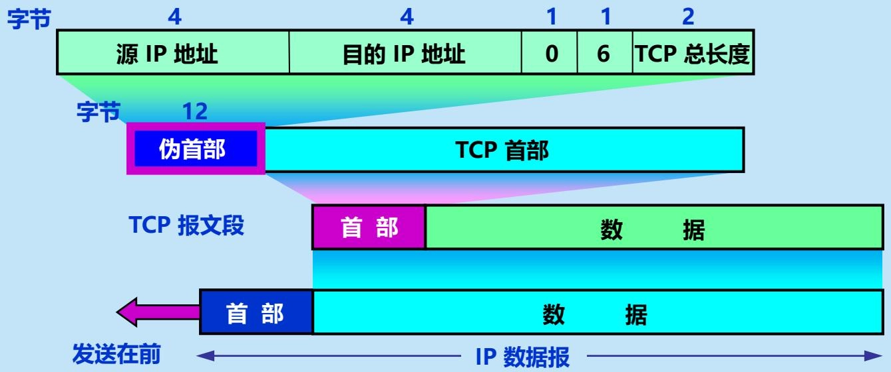
- **紧急指针**：占 2 字节。在 URG = 1 时，指出本报文段中的紧急数据的字节数（紧急数据结束后就是普通数据），指出了紧急数据的末尾在报文段中的位置。
- **选项**：长度可变，最长可达 40 字节。
- **填充**：使整个 TCP 首部长度是 4 字节的整数倍。

#### 选项：最大报文段长度 MSS
- **最大报文段长度选项** MSS（Maximum Segment Size）：占 2 字节，表示每个 TCP 报文段中的数据字段的最大长度。
    
- TCP 报文段长度 = 数据字段长度（MSS）+ TCP 首部长度
- IP 数据报长度（MTU） = TCP 报文段长度 + IP 首部长度
- MSS 与接收窗口值没有关系。
- 取值要求
    - 不能太小
        - 网络利用率降低。
        - 例如：仅 1 个字节。利用率就不会超过 1/41
    - 不能太大
        - 开销增大。
        - IP 层传输时要分片，终点要装配。
        - 分片传输出错时，要整个分组。
    - 应尽可能大
        - 只要在 IP 层传输时不再分片。
        - 默认值 = 536 字节。
            - 报文段长度 = 536 + 20~60 = 556~576 字节。
            - IP 数据报长度 = 556~576 + 20 = 576~596 字节。
- TCP 连接建立时，双方交换 MSS 值。

#### 选项：窗口扩大
- TCP 窗口字段占 2 字节（16 位），最大窗口大小 $= 2^{16}-1 \approx 64~KB$。
    - 对于传播时延和带宽都很大的网络，为获得高吞吐率较，需要更大的窗口。
        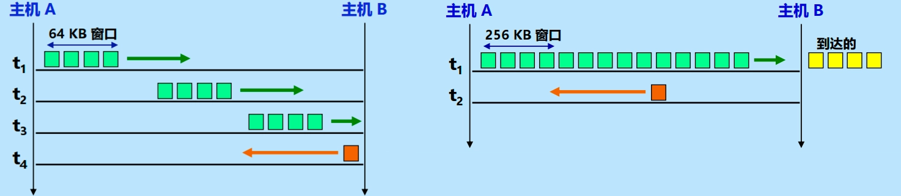
- **窗口扩大选项**：占 3 字节，最重要的字段：
    - 移位值 $S$：占 1 字节，表示窗口值要左移的位数，最大值为 14。
        - 表示：新的窗口值位数从 $16$ 增大到  $(16 + S)$，最大窗口大小扩大为 $2^{S}$ 倍。
        - 最大窗口大小的最大值：$2^{(16 + 14)} - 1 = 2^{30} - 1 \approx 1GB$。
- 窗口扩大选项可以在双方初始建立 TCP 连接时进行协商。

#### 选项：时间戳
- **时间戳选项**：占 10 字节。最主要的 2 个字段：
    - 时间戳值字段（TSval）：4 字节
    - 时间戳回送回答字段（TSecr）：4 字节
- 主要功能：
    1. 计算往返时间 RTT
        - 发送方 A 在发送报文段时，把当前时间写入时间戳值字段 TSval 中。接收方 B 在收到该报文段后，把该时间戳值原封不动地放入回送回答字段 TSecr 中，并连同确认号一起发送给 A。A 在收到 B 的确认报文段时，就可以根据当前时间和 TSecr 字段中的时间计算出 RTT = 当前时间 - TSecr。
    2. 防止序号绕回 PAWS（Protect Against Wrapped Sequence numbers）
        - 序号重复时，为了使接收方能够把新报文段和迟到很久的旧报文段区分开，可以在报文段中加上时间戳。

#### 选项：选择确认 SACK
- **选择确认选项** SACK（Selective Acknowledgment）：长度可变，一般为 10 或 18 字节。
- 作用：允许接收方告诉发送方哪些数据已经正确收到，从而使发送方只重传那些丢失的数据，而不是像累积确认那样重传所有未被确认的数据。
- 详见[下文](#选择确认-SACK)

## TCP 可靠传输的实现
### 以字节为单位的滑动窗口
- TCP 使用流水线传输和滑动窗口协议实现高效、可靠的传输。
    - **流水线传输**：发送方在等待确认的同时，继续发送后续的报文段。
    - **滑动窗口协议**：发送方 A 和接收方 B 分别维持一个发送窗口和一个接收窗口。
        - **发送窗口**：在没有收到确认的情况下，发送方可以连续把窗口内的数据全部发送出去。凡是已经发送过的数据，在未收到确认之前都必须暂时保留，以便在超时重传时使用。
        - **接收窗口**：只允许接收落入窗口内的数据。
- TCP 的滑动窗口是**以字节为单位**的。

#### 发送缓存与发送窗口
- 发送缓存：
    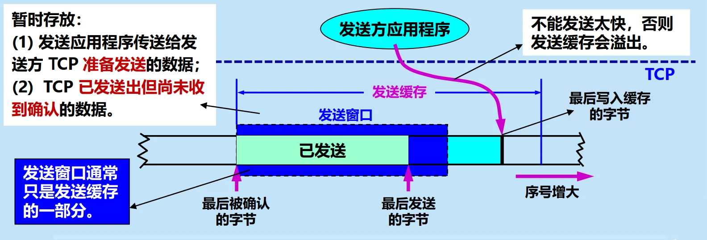

    - 发送方的应用进程把字节流写入 TCP 发送缓存。
        - 不能发送太快，否则发送缓存会溢出。
    - 发送缓存内暂时存放：  
        - 发送方的应用程序传送给 TCP 准备发送的数据
        - TCP 已发送但尚未收到确认的数据
    - 发送窗口的大小受发送缓存大小的限制，即发送窗口的只是发送缓存的一部分。
    - 缓存中的字节数 = 发送应用程序最后写入缓存的字节 - 最后被确认的字节
- **发送窗口** swnd：
    

    - 发送窗口的大小：发送方 A 根据接收方 B 给出的**窗口值**，构造出自己的发送窗口。
        - 窗口越大，发送方就可以在收到对方确认之前连续发送更多的数据，因而可能获得更高的传输效率。
        - 窗口的前沿只允许前移，不允许后退。
    - 前后沿：发送窗口的前沿和后沿分别由**确认号**和**窗口值**决定。
        - 后沿 = 确认号（B 期望收到的下一个字节序号）
        - 前沿 = 确认号 + 窗口值
    - 当前位置：表示发送方已经发送的字节流中的最后一个字节的下一个字节序号。
- 发送窗口的前后沿将字节流**序号**划分为三部分：
    1. 后沿之后：已发送并收到确认的字节序号。
    2. 窗口内部：允许发送的字节序号。
        - **通知窗口**：已发送但尚未收到确认的字节序号。
        - **可用窗口**：允许发送但尚未发送的字节序号。
    3. 前沿之前：尚未允许发送的字节序号。
- 示例：假定 A 发送了序号为 31~41 共 11 个字节的数据
    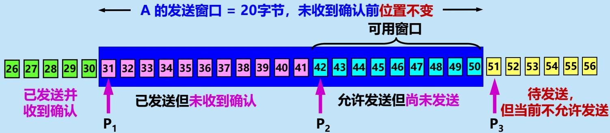

    - $P_1 =$ 后沿，$P_2 =$  当前， $P_3 =$ 前沿。 
    - $P_{3} - P_{1} =$ A 的发送窗口（又称为通知窗口）
    - $P_2 - P_1 =$ 已发送但尚未收到确认的字节数
    - $P_3 - P_2 =$ 允许发送但尚未发送的字节数（又称为可用窗口）

#### 接收缓存与接收窗口
- 接收缓存：
    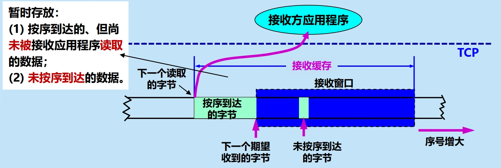

    - 接收方的应用进程从 TCP 接收缓存中读取尚未被读取的字节。
        - 若读取不及时，缓存会被填满，导致接收窗口变为 0
        - 若及时读取，接收窗口就可以增大，但最大也不能超过接收缓存的大小。
    - 接收缓存内暂时存放：
        - 按序到达的、但尚未被接收应用程序读取的数据
        - 未按序到达的数据
- **接收窗口** rwnd：
    - 接收窗口的大小：接收方 B 根据接收缓存的使用情况，动态地调整自己的接收窗口大小，并把该窗口值通知给发送方 A。
    - 前后沿：接收窗口的前沿和后沿分别由**确认号**和**窗口值**决定。
        - 后沿 = 确认号（B 期望收到的下一个字节序号）
        - 前沿 = 确认号 + 窗口值
- 接收窗口的前后沿将字节流序号划分为三部分：
    1. 后沿之后：已发送确认并交付给应用程序的字节序号。
    2. 窗口内部：允许接收的字节序号。
        - 将收到的字节序号放入窗口，若按序到达，则交付给应用程序；否则，暂时存放在接收缓存中，等待按序交付。
        - 发送确认报文段时，确认号为按序到达的最后一个字节的下一个字节序号（即第一个没收到的字节序号）。
    3. 前沿之前：尚未允许接收的字节序号。
- 示例：
    

    - B 收到了序号为 32 和 33 的数据，但未收到序号为 31 的数据。
    - 因此，因此发送的确认报文段中的确认号是 31（即期望收到的序号）。

#### 窗口的滑动
- 发送窗口和接收窗口都可以向前滑动。
    - 发送窗口：每当发送方收到对某些字节的确认时，发送窗口就向前滑动到相应的字节。
    - 接收窗口：每当接收方按序收到某些字节，交付给应用程序并发送确认后，接收窗口就向前滑动到相应的字节。
- 示例：
    

    1. 发送方 A 发送字节 31~41 ，B 只收到字节 32 和 33，于是发送确认号 31 给 A。
    2. A 收到确认号 31 后，窗口不变，等待超时后重发字节 31。
    3. B 收到字节 31 后，窗口滑动至 34~53，此时又收到 37、38 和 40，于是发送确认号 34 给 A。
    4. A 收到确认号 34 后，窗口滑动至 34~53。

>说明：
>
>- 发送窗口是根据接收窗口设置的，但在同一时刻，发送窗口并不总是和接收窗口一样大（因为有一定的时间滞后）。
>- TCP 标准没有规定对不按序到达的数据应如何处理。通常是先临时存放在接收窗口中，等到字节流中所缺少的字节收到后，再按序交付上层的应用进程。
>- TCP 要求接收方必须有累积确认的功能，以减小传输开销。接收方可以在合适的时候发送确认，也可以在自己有数据要发送时把确认信息顺便捎带上。但接收方不应过分推迟发送确认，否则会导致发送方不必要的重传，捎带确认实际上并不经常发生。

### 超时重传时间的选择
- TCP 发送方在规定的时间内没有收到确认就要重传已发送的报文段。
- 但重传时间的选择是 TCP 最复杂的问题之一，互联网环境复杂，IP 数据报所选择的路由变化很大，导致传输层的往返时间（RTT）的变化也很大。
    
- TCP 超时重传时间的选择应满足以下两个要求：
    - 不能太短，否则会引起很多报文段的不必要的重传，使网络负荷增大。
    - 不能过长，会使网络的空闲时间增大，降低了传输效率。

#### 基本定义
- **加权平均往返时间/平滑的往返时间** $RTT_S$
    - 定义：往返时间 RTT 的加权平均值，用于估计当前的往返时间。
    - 使用指数加权移动平均法计算 $RTT_S$：
        $$
        新的~RTT_{S}=(1-\alpha)\times(旧的~RTT_{S})+\alpha \times(新的~RTT~样本)
        $$
    - 其中 $0 \leq \alpha < 1$，$\alpha$ 越小，$RTT$ 值更新得越慢，越平滑，RFC 6298 推荐 $\alpha = 1/8$。
- **超时重传时间** $RTO$
    - 定义：若发送方在 RTO（Retransmission Time-Out）内没有收到确认，就重传报文段，应略大于加权平均往返时间 $RTT_{S}$。
    - RFC 6298 建议 $RTO$：
        $$
        RTO = RTT_{S} + 4 \times RTT_{D}
        $$
        - 其中 $RTT_D$ 是 $RTT$ 偏差的加权平均值。
    - RFC 6298 建议  $RTT_{D}$：
        $$
        新的~RTT_{D}=(1-\beta)\times(旧的~RTT_{D})+ \beta \times |RTT_{S}-新的~RTT~样本|
        $$
        - 其中系数 $\beta <1$ ，推荐值为 $1/4$。

#### 往返时间 RTT 的测量
- 超时重传报文段后，如何判定此确认报文段是对原来的报文段的确认，还是对重传报文段的确认？
    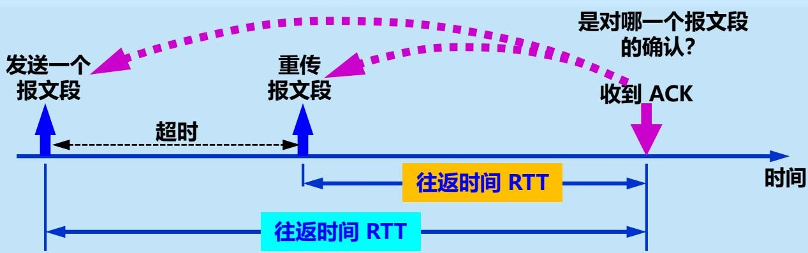
- Karn 算法
    - 在计算平均往返时间 $RTT_S$ 时，只要报文段重传了，就不采用其往返时间样本。
    - 新问题：当报文段的时延突然增大很多时，在原来得出的重传时间内，不会收到确认报文段，于是就重传报文段。但根据Karn算法，不考虑重传的报文段的往返时间样本。这样，超时重传时间就无法更新，造成很多不必要的重传。
- 修正的 Karn 算法
    - 报文段每重传一次，就把 RTO 增大一些：
        $$
        新的~RTO=\gamma\times(旧的~RTO)
        $$
        - 其中系数 $\gamma$ 的典型值 $= 2$。
    - 当不再发生报文段的重传时，才根据报文段的往返时延更新平均往返时延 RTT 和超时重传时间 RTO 的数值。

#### 快速重传
- 工作方式：当收到三个相同的 ACK 报文时，在定时器过期之前重传丢失的报文段。
    - 解决的问题：什么时候重传（超时时间）
    - 未解决的问题：重传的内容是只有确认号对应的报文段，还是从确认号开始的所有报文段
- 示意图：
    

### 选择确认 SACK
- 问题：若收到的报文段无差错，只是未按序号收到，中间还缺少一些序号的数据，那么能否设法只传送缺少的数据而不重传已经正确到达接收方的数据？
    - 解决方法：选择确认 SACK（Selective ACK）
- 定义：选择确认 SACK 允许接收方告诉发送方哪些数据已经正确收到，从而使发送方只重传那些丢失的数据，而不是像累积确认那样重传所有未被确认的数据。
- RFC 2018 对 SACK 的规定
    - 如在建立 TCP 连接时，要在 TCP 首部的选项中加上**允许 SACK 选项**，且双方必须事先商定好。
        - 允许 SACK 选项：长度 2 字节
            - 第 1 字节：选项类型，值为 4
            - 第 2 字节：选项长度，值为 2
    - 原来首部中的确认号的用法不变（累积确认）。
    - 双方在 TCP 首部中增加 **SACK 选项**，以便报告收到的不连续的字节块的边界。
        - SACK 选项：长度可变，一般为 10/18/26/34 字节。
            - 第 1 字节：选项类型，值为 5
            - 第 2 字节：选项长度
            - 后面每 8 字节表示一个已正确收到的数据块的边界，**最多 4 个数据块**。
                - 前 4 字节：左边界，即已确认的数据块第一个字节的序号
                - 后 4 字节：右边界，即已确认的数据块最后一个字节的序号 + 1
- 示例：假设最大报文段长度 MSS = 5000 字节，起始序号为 1，接收方收到连续字节流 1 ~ 1000 和不连续的两个字节块 1501 ~ 3000、3501 ~ 4500，则：
    - 确认号：1001
    - SACK 选项：
        - 选项类型：5
        - 选项长度：18
        - 第 1 个数据块边界：1501（左边界），3001（右边界）
        - 第 2 个数据块边界：3501（左边界），4501（右边界）
    - 示意图：
        
- D-SACK（Duplicate SACK）：
    - 用于通知发送方它所重传的报文段实际上是重复的。
    - D-SACK 选项与 SACK 选项格式相同，但选项类型字段值为 6。
    - 接收方在收到重复报文段时，发送 D-SACK 选项通知发送方。
    - 示例：
        

## TCP 的流量控制
### 利用滑动窗口实现流量控制
- **流量控制**（flow control）：让发送方的发送速率不要太快，使接收方来得及接收。
    - 利用滑动窗口机制可以很方便地在 TCP 连接上实现对发送方的流量控制。
- 问题：一旦接收方的接收缓存满了，接收方就不得不把窗口值设置为零，从而使发送方停止发送数据，若后续接收方更新窗口值的报文段丢失，就会导致**死锁**。
    - 示例：
        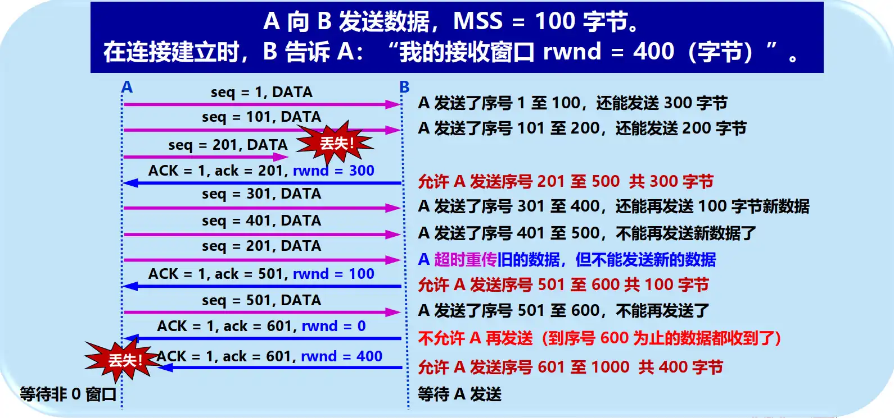
    - 解决方法：持续计时器机制
- **持续计时器**（persistence timer）：只要 TCP 连接的一方收到对方的零窗口通知，就启动该持续计时器。
    - 若持续计时器设置的时间到期，就发送一个**零窗口探测报文段**（仅携带 1 字节的数据），对方在确认这个探测报文段时给出当前窗口值。
    - 若窗口仍然是零，收到这个报文段的一方就重新设置持续计时器。
    - 若窗口不是零，则死锁的僵局就可以打破了。

### TCP 的传输效率
- 控制 TCP 发送报文段时机的三种机制
    1. TCP 维持一个变量，它等于**最大报文段长度** MSS。只要缓存中存放的数据达到 MSS 字节时，就组装成一个 TCP 报文段发送出去。
    2. 由发送方的应用进程指明要求发送报文段，即 TCP 支持的**推送**（push）操作。
    3. 发送方设置一个**计时器**，一旦期限到了就把当前已有的缓存数据装入报文段（但长度不能超过 MSS）发送出去。
- **糊涂窗口综合症**
    - 定义：每次仅发送一个字节或很少几个字节的数据时，有效数据传输效率变得很低的现象。
        
    - 发送方糊涂窗口综合症
        - 原因：发送方应用进程发送数据太快，例如：每接收到一字节的数据后就发送，形成 41 字节长的 IP 数据报，效率很低。
        - **解决方法**：使用 Nagle 算法。
            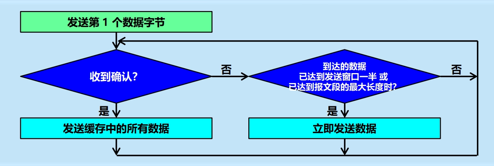
    - 接收方糊涂窗口综合症
        - 原因：接收方应用进程消耗数据太慢，例如：每次只读取一个字节。
        - 示例：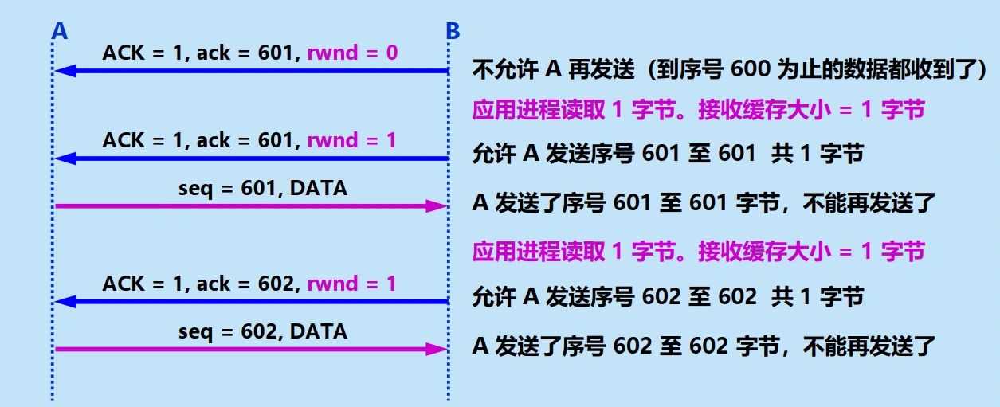
        - 解决方法：让接收方等待一段时间，使得或者接收缓存**已有足够空间容纳一个最长的报文段**，或者等到接收缓存**已有一半空闲的空间**，接收方才发出确认报文，并向发送方通知当前的窗口大小。

## TCP 的拥塞控制
### 拥塞控制的一般原理
#### 拥塞的基本概念
- **拥塞**（congestion）：在某段时间，若对网络中某资源的需求超过了该资源所能提供的可用部分，网络的性能就会明显变坏，整个网络的吞吐量将随输入负荷的增大而下降。
    - 最坏结果：系统崩溃。
    - 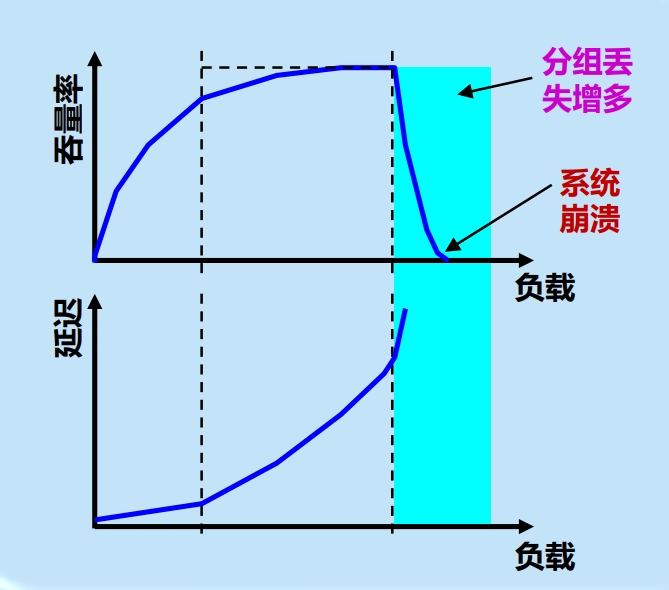
- 出现网络拥塞的条件：
    $$\sum 对资源需求 > 可用资源$$
- 拥塞产生的原因
    1. 节点缓存容量太小
    2. 链路容量不足
    3. 处理机处理速率太慢
    4. 拥塞本身会进一步加剧拥塞
- 增加资源不能解决拥塞，而且还可能使网络的性能更坏：
    1. 增大缓存，但未提高输出链路的容量和处理机的速度，排队等待时间将会大大增加，引起大量超时重传，解决不了网络拥塞；
    2. 提高处理机处理的速率会将瓶颈转移到其他地方；
    3. 拥塞引起的重传并不会缓解网络的拥塞，反而会加剧网络的拥塞。

#### 拥塞控制
- 拥塞控制与流量控制的区别
    - 拥塞控制
        - 防止过多的数据注入到网络中，避免网络中的路由器或链路过载。
        - 是一个**全局性**的过程，涉及到所有的主机、路由器，以及与降低网络传输性能有关的所有因素。
    - 流量控制
        - 抑制发送端发送数据的速率，以使接收端来得及接收。
        - 点对点通信量的控制，是个**端到端**的问题。
- 拥塞控制所起的作用
    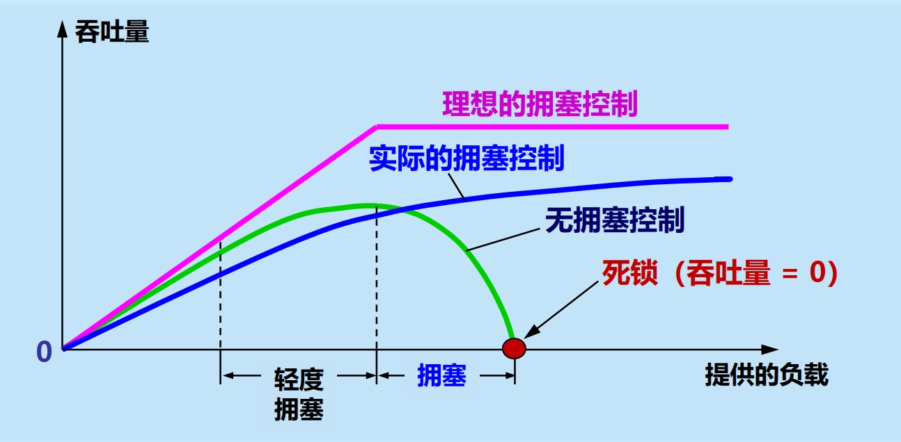
- 拥塞控制的一般原理
    - **拥塞控制的前提**：网络能够承受现有的网络负荷。
    - 实践证明，拥塞控制是很难设计的，因为它是一个**动态问题**。
    - 分组的丢失是网络发生拥塞的征兆，而不是原因。
    - 在许多情况下，甚至正是拥塞控制本身成为引起网络性能恶化、甚至发生死锁的原因。
- 拥塞控制的两种基本方法
    - 开环控制（静态控制）
        - 定义：在设计网络时，事先考虑周全，力求工作时不发生拥塞，但一旦整个系统运行起来，就不再中途进行改正了。
        - 思路：力争**避免**发生拥塞。
    - 闭环控制（动态控制）
        - 定义：基于反馈环路，根据网络**当前运行状态**采取相应控制措施。
        - 思路：在发生拥塞后，采取措施进行控制，消除拥塞。
        - 措施：
            1. **监测**：监测网络系统，检测拥塞在何时、何处发生。
                - 主要指标：
                    1. 由于缺少缓存空间而被丢弃的分组的百分数
                    2. 平均队列长度
                    3. 超时重传的分组数
                    4. 平均分组时延
                    5. 分组时延的标准差，等等。
                - **这些指标的上升都标志着拥塞的增长**。
            2. **传送**：将拥塞发生的信息传送到可采取行动的地方。
                1. 将拥塞发生的信息传送到产生分组的源站。
                2. 在路由器转发的分组中保留一个比特或字段，用该比特或字段的值表示网络没有拥塞或产生了拥塞。
                3. 周期性发出探测分组等。
            3. **调整**：调整网络系统的运行以解决出现的问题。
                - 过于频繁，会使系统产生不稳定的振荡。
                - 过于迟缓，不具有任何实用价值。
                - 选择正确的时间常数是相当困难的。

### TCP 的拥塞控制方法
- TCP 采用**基于滑动窗口**的方法进行拥塞控制，属于**闭环控制**方法。
- 基本思想：
    - 发送方根据网络的拥塞情况**动态调整**发送窗口的大小。
    - 发送方维持一个**拥塞窗口** cwnd（Congestion Window），窗口大小**动态变化**，取决于网络的拥塞程度。
    - 发送窗口的大小不仅取决于接收方的接收窗口，还取决于网络的拥塞窗口。**实际大小**：
        $$
        发送窗口~swnd = \min(拥塞窗口~cwnd，接收窗口~rwnd)
        $$

        - 当 $cwnd > rwnd$ 时：接收方的接收能力限制发送窗口的最大值。
        - 当 $cwnd < rwnd$ 时：网络拥塞限制发送窗口的最大值。
- 控制拥塞窗口变化的原则
    - 网络未拥塞：增大拥塞窗口，以便把更多的分组发送出去，提高网络的利用率。
    - 网络拥塞或有可能出现拥塞：缩小拥塞窗口，以减少注入到网络中的分组数，缓解网络出现的拥塞。
- 发送方判断拥塞的方法：**隐式反馈**
    - 超时重传计时器超时：网络已经出现了拥塞。
        - 因传输出差错而丢弃分组的概率很小（远小于 1%），因此发送方在超时重传计时器启动时，就判断网络出现了拥塞。
    - 收到 3 个重复的确认：预示网络可能会出现拥塞。

#### TCP 拥塞控制算法
- **拥塞窗口** $cwnd$
    - 初始值：2 种设置方法。
        - 1 至 2 个最大报文段 MSS（旧标准 RFC 2001）
        - 2 至 4 个最大报文段 MSS（RFC 5681）
    - 规则：在每收到一个**对新的报文段的确认**，就把拥塞窗口**增加最多一个发送方的最大报文段 SMSS**（Sender Maximum Segment Size）的数值。
        $$拥塞窗口~cwnd~每次的增加量 = \min(N，SMSS)$$
        - 其中 $N$ 是原先未被确认的、但现在被刚收到的确认报文段所确认的字节数。
- **慢开始门限** $ssthresh$
    - 作用：防止拥塞窗口增长过大引起网络拥塞。
    - 规则：
        1. 当 $cwnd < ssthresh$ 时，使用慢开始算法。
        2. 当 $cwnd > ssthresh$ 时，停止使用慢开始算法，改用拥塞避免算法。
        3. 当 $cwnd = ssthresh$ 时，既可使用慢开始算法，也可使用拥塞避免算法。
- **传输轮次**（transmission round）
    - **定义**：把拥塞窗口 $cwnd$ 所允许发送的报文段全部连续发出，并收到对已发送的最后一个字节的确认，这一过程称为一个传输轮次。
    - 一个传输轮次所经历的时间：往返时间 $RTT$。
    - 示例：拥塞窗口 $cwnd = 4$，这时的往返时间 $RTT$ 就是发送方连续发送 4 个报文段，并收到这 4 个报文段的确认，总共经历的时间。
- **当网络出现拥塞时**
    1. **重传计时器超时**：无论在慢开始阶段还是在拥塞避免阶段，只要发送方重传定时器超时，就可以判断网络出现拥塞。
        - 操作：**执行超时重传算法**。
        - 目的：迅速减少主机发送到网络中的分组数，使得发生拥塞的路由器有足够时间把队列中积压的分组处理完毕。
    2. **收到 3 个重复的确认**：预示网络可能会出现拥塞
        - 操作：**执行快重传和快恢复算法**。
        - 目的：让发送方尽早知道发生了个别报文段的丢失，并迅速作出反应，避免网络出现严重拥塞。

##### 慢开始算法（Slow start）
- **目的**：探测网络的负载能力或拥塞程度，让拥塞窗口 $cwnd$ 快速增大。
- **算法**：假设发送方设置 $cwnd = SMSS$，则每收到一个对新报文段的确认（重传的不算在内）就使 $cwnd = cwnd \times 2$。（窗口大小按指数规律增长）
    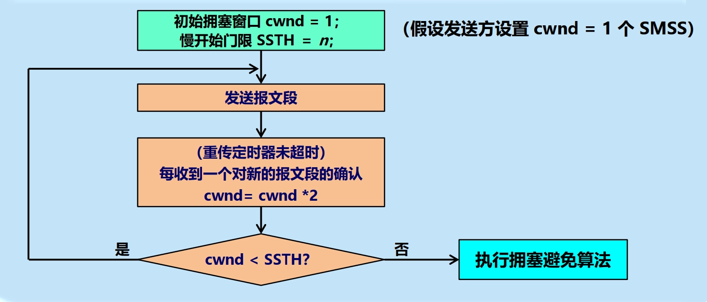
- 示例：
    

##### 拥塞避免算法（Congestion Avoidance）
- **目的**：减缓拥塞窗口 $cwnd$ 增大的速度，避免出现拥塞。
- **算法**：每经过一个往返时间 $RTT$（不管在此期间收到了多少确认），发送方的拥塞窗口 $cwnd = cwnd + 1$。
    - 具有**加法增大 AI**（Additive Increase）特点：使拥塞窗口 $cwnd$ 按线性规律缓慢增长。
- 注意：拥塞避免并非完全避免拥塞，而是让拥塞窗口增长得缓慢些，使网络不容易出现拥塞。
- 示例：
    

##### 超时重传算法
- **触发条件**：发送方的重传计时器超时。
- **目的**：迅速减少主机发送到网络中的分组数，使得发生拥塞的路由器有足够时间把队列中积压的分组处理完毕。
- **算法**：
    1. $ssthresh := \max(\frac{cwnd}{2},2)$
    2. $cwnd := 1$
    3. **执行慢开始算法**

##### 快重传算法 FR（Fast Retransmission）
- **触发条件**：发送方连续收到三个重复的确认 ACK。
- **目的**：让发送方尽早知道发生了个别报文段的丢失。
- **算法**：发送方只要连续收到三个重复的确认，就**立即进行重传**（即“快重传”），这样就不会出现超时。
    - 快重传算法要求**接收方立即发送确认**，即使收到了失序的报文段，也要立即发出对已收到的报文段的重复确认。
- 作用：使用快重传可以使整个网络的吞吐量提高约 20%。
- 注意：快重传并非取消重传计时器，而是在某些情况下可以更早地（更快地）重传丢失的报文段。
- 示例：
    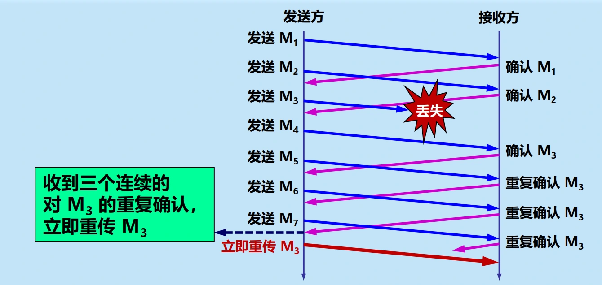

##### 快恢复算法 FR（Fast Recovery）
- **触发条件**：发送方连续收到三个重复的确认 ACK。
- **目的**：在快重传之后，迅速恢复到拥塞避免阶段，而不是回到慢开始阶段。
- **算法**：
    1. $ssthresh := \max(\frac{cwnd}{2},2)$
    2. **乘法减小** MD（Multiplicative Decrease）拥塞窗口：
        $$
        cwnd := ssthresh
        $$
    3. **加法增大** AI：执行**拥塞避免算法**，使拥塞窗口缓慢地线性增大。
- 二者合在一起就是所谓的 AIMD 算法，使 TCP 性能有明显改进。

#### 算法实现实例


- 0：当 TCP 连接进行初始化时，令拥塞窗口 $cwnd = 1$，慢开始门限 $ssthresh = 16$。（窗口单位不使用字节而使用报文段）
- 0：开始执行慢开始算法时，$cwnd=1$，发送第一个报文段。发送方每收到一个对新报文段的确认 ACK，就令 $cwnd = cwnd \times 2$，因此 $cwnd$ 随着往返时延 $RTT$ 按指数规律增长。
- 4：当 $cwnd = ssthresh = 16$ 时，改为执行拥塞避免算法，发送方每收到一个对新报文段的确认 ACK，就令 $cwnd = cwnd + 1$，因此 $cwnd$ 随着往返时延 $RTT$ 按线性规律增长。
- 12：当 $cwnd = 24$ 时，网络出现了超时，发送方判断为网络拥塞。调整 $ssthresh = \frac{cwnd}{2} = 12$，$cwnd = 1$，重新进入慢开始阶段。
- 17：当 $cwnd = ssthresh = 12$ 时，改为执行拥塞避免算法。
- 20：当 $cwnd = 16$ 时，发送方连续收到 3 个对同一个报文段的重复确认（3-ACK）。发送方改为执行快重传和快恢复算法，快速重传该报文段，并调整 $ssthresh = cwnd / 2 = 8$，$cwnd = ssthresh = 8$，重新进入拥塞避免阶段。

#### TCP 拥塞控制流程图
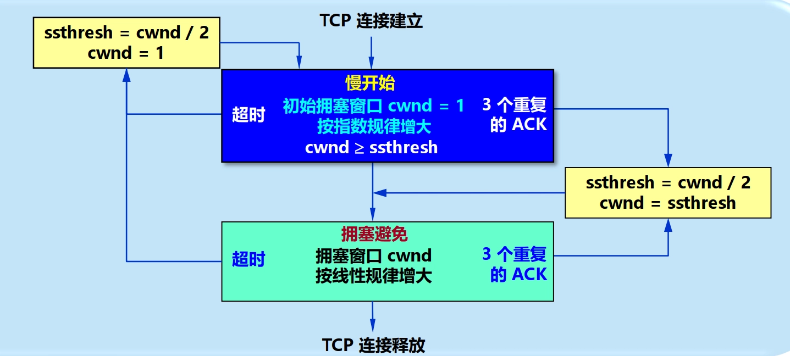

### 主动队列管理 AQM
- TCP 拥塞控制和网络层采取的策略有密切联系。
- 例如：
    - 若路由器对某些分组的处理时间特别长，就可能引起发送方 TCP 超时，对这些报文段进行重传。
    - 重传会使 TCP 连接的发送端认为在网络中发生了拥塞，但实际上网络并没有发生拥塞。
- 对 TCP 拥塞控制影响最大的就是**路由器的分组丢弃策略**。

#### 先进先出处理规则与尾部丢弃策略
- **先进先出处理规则** FIFO（First In First Out）：路由器对到达的分组按到达的先后顺序进行排队处理。
- **尾部丢弃策略**（tail-drop policy）：当队列已满时，以后到达的所有分组（如果能够继续排队，这些分组都将排在队列的尾部）将都被丢弃。
    - 路由器的尾部丢弃往往会导致一连串分组的丢失，这就使发送方出现超时重传，使 TCP 进入拥塞控制的慢开始状态，结果使 TCP 连接的发送方突然把数据的发送速率降低到很小的数值。
        
- 严重问题：**全局同步**
    - 若路由器进行了尾部丢弃，所有到达的分组都被丢弃，不论它们属于哪个 TCP 连接。
    - 分组丢弃使发送方出现超时重传，使多个 TCP 连接同时进入慢开始状态，发生全局同步（global synchronization）。
        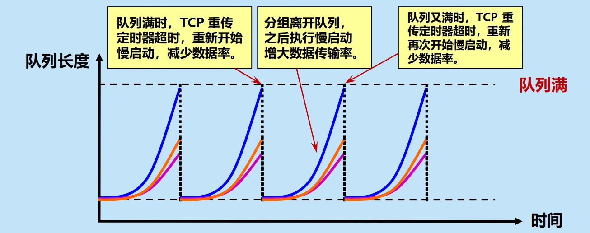

#### 主动队列管理 AQM
- 定义：路由器在分组到达时，**主动地**根据当前队列的长度决定是否丢弃该分组，而不是等到队列满了才丢弃分组。
    - **主动**：不要等到路由器的队列长度已经达到最大值时才不得不丢弃后面到达的分组，而是在队列长度**达到某个值得警惕的数值时**（即当网络拥塞有了某些拥塞征兆时），就主动丢弃到达的分组。
- AQM 可以有不同实现方法，其中曾流行多年的就是**随机早期检测** RED（Random Early Detection）。

#### 随机早期检测 RED
- RED 路由器到达队列维持两个参数：最小门限 $Th_{\min}，最大门限 Th_{\max}$，分成为三个区域：
    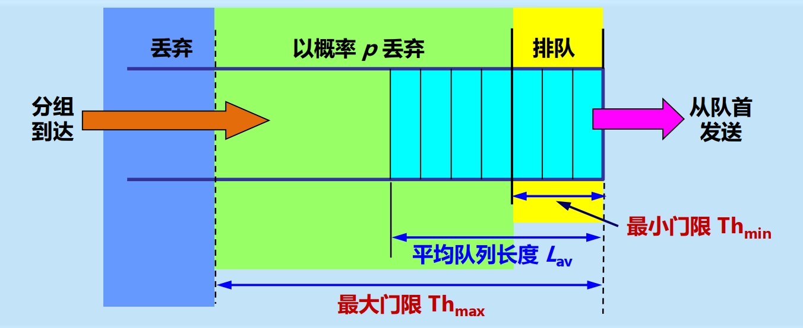
- 规则：RED 对每一个到达的分组都先计算平均队列长度 $L_{AV}$
    - 当 $L_{AV} < Th_{\min}$ 时，丢弃概率 $p = 0$
    - 当 $L_{AV} > Th_{\max}$ 时，丢弃概率 $p = 1$
    - 当 $Th_{\min} \leq L_{AV} \leq Th_{\max}$ 时，丢弃概率 $0 < p < 1$
- 困难：丢弃概率 $p$ 的选择，因为 $p$ 并不是个常数。例如按线性规律变化，从 0 变到  $p_{\max}$ 。
    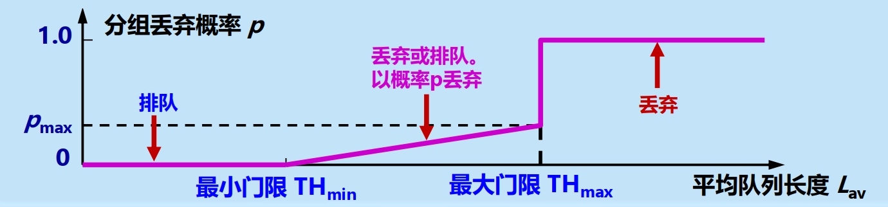

>- 多年的实践证明，RED 的使用效果并不太理想。
>    - 2015 年公布的 RFC7567 已经把 RFC2309 列为“陈旧的”，并且不再推荐使用 RED。
>- 但对路由器进行主动队列管理 AQM 仍是必要的。
>    - AQM 实际上就是对路由器中的分组排队进行智能管理，而不是简单地把队列的尾部丢弃。
>    - 现在已经有几种不同的算法来代替旧的 RED，如可控延迟算法 CoDel（Controlled Delay）。

## TCP 的传输连接管理
- TCP 是面向连接的协议。
- **TCP 传输连接的三个阶段**：
    1. 连接建立
    2. 数据传送
    3. 连接释放
- **TCP 的连接管理**：使 TCP 连接的建立和释放都能正常地进行。
    1. 要使每一方能够确知对方的**存在**。
    2. 要允许双方**协商**一些参数（如最大窗口值、是否使用窗口扩大选项和时间戳选项以及服务质量等）。
    3. 能够对传输实体资源（如缓存大小、连接表中的项目等）进行**分配**。
- TCP 连接的建立采用**客户服务器方式**。
    - **客户**（client）：主动发起连接建立的应用进程。
    - **服务器**（server）：被动等待连接建立的应用进程。

### TCP 的连接建立
- **握手**：TCP 建立连接的过程。
- 采用**三报文握手**：在客户和服务器之间交换三个 TCP 报文段，以防止已失效的连接请求报文段突然又传送到了，因而产生 TCP 连接建立错误。
    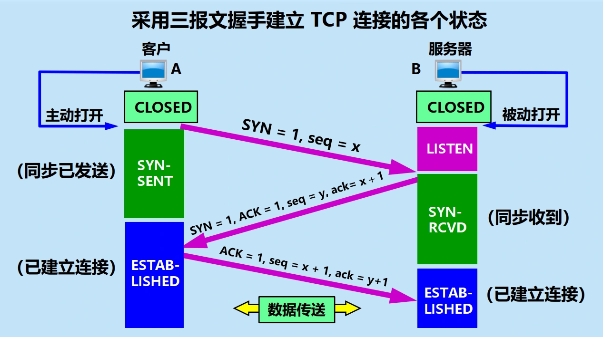

    1. 服务器 B 的 TCP 服务进程创建传输控制块 TCB，并初始化各项参数，进入**监听状态**（LISTEN）。
    2. 客户 A 的应用进程向 TCP 发送连接请求，TCP 发送一个**连接请求报文段**（SYN=1，初始序号 seq=x）到服务器 B，进入**同步已发送状态**（SYN-SENT）。
    3. 服务器 B 收到连接请求报文段后，如果同意建立连接，就发送一个**连接确认报文段**（SYN=1，ACK=1，seq=y，ack=x+1）到客户 A，进入**同步已接收状态**（SYN-RECEIVED）。
    4. 客户 A 收到连接确认报文段后，发送一个**连接确认报文段**（ACK=1，seq=x+1，ack=y+1）到服务器 B，并通知上层应用进程连接已建立，进入**已连接状态**（ESTABLISHED）。
    5. 服务器 B 收到连接确认报文段后，也通知上层应用进程连接已建立，进入**已连接状态**（ESTABLISHED）。
- 注意：
    - SYN 报文段（步骤 2、3）不能携带数据，但要消耗掉一个序号。
    - ACK 报文段（步骤 4）可以携带数据。但如果不携带数据，则不消耗序号。下一个数据报文段的序号仍是 seq=x+1。

### TCP 的连接释放
- 数据传输结束后，通信的**双方**都可释放连接。
- 采用**四报文握手**。
    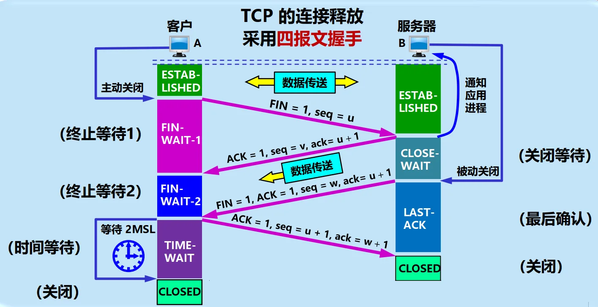

    1. 一方 A 的应用进程向 TCP 发送连接释放请求，TCP 发送一个**连接释放报文段**（FIN=1，seq=u）到另一方 B，进入**终止已发送状态**（FIN-WAIT-1）。
    2. 另一方 B 收到连接释放报文段后，发送一个**连接释放确认报文段**（ACK=1，seq=v，ack=u+1）到 A，并通知上层应用进程，进入**关闭等待状态**（CLOSE-WAIT）。
    3. A 收到连接释放确认报文段后，进入**终止等待状态**（FIN-WAIT-2），此时从 A 到 B 这个方向的连接就释放了，TCP 连接处于**半关闭**（half-close）状态。但 B 若发送数据，A 仍要接收。
    4. 若 B 已经没有要向 A 发送的数据，其应用进程就通知 TCP 释放连接。TCP 发送一个**连接释放报文段**（FIN=1，ACK=1，seq=w，ack=u+1）到 A，进入**最后等待状态**（LAST-ACK）。
    5. A 收到连接释放报文段后，发送一个**连接释放确认报文段**（ACK=1，seq=u+1，ack=w+1）到 B，进入**时间等待状态**（TIME-WAIT）。
    6. B 收到连接释放确认报文段后，释放 TCP 连接。
    7. A 经过**时间等待计时器**（TIME-WAIT timer）设置的时间 **2MSL** 后，才释放 TCP 连接。
- 注意：
    - FIN 报文段（步骤 1）即使不携带数据，也消耗掉一个序号。
    - 半关闭（half-close）状态下，B 若发送数据，A 仍要接收。
    - A 必须等待 2MSL 的时间才能释放连接：
        - 保证发送的最后一个 ACK 报文段能够到达 B。B 可能会没收到而超时重传。
        - 防止“已失效的连接请求报文段”出现在本连接中。

### TCP 的保活机制
- 解决问题：建立连接后，若一方在很长时间内没有任何数据传送，另一方如何判断是否发生故障？
- 解决方法：**使用保活计时器**
    - 用来防止在 TCP 连接出现长时期空闲。
    - 通常设置为 2 小时：若服务器过了 2 小时还没有收到客户的信息，它就发送**探测报文段**。
    - 若发送了 10 个探测报文段（每一个相隔 75 秒）还没有响应，就假定客户出了故障，因而就终止该连接。

### TCP 的有限状态机
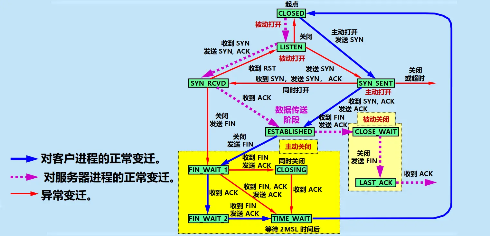

# 应用层
- 应用层协议：精确定义不同主机中的多个**应用进程之间的通信规则**。
    - 包括：
        - 应用进程交换的报文类型，如请求报文和响应报文。
        - 各种报文类型的语法，如报文中的各个字段及其详细描述。
        - 字段的语义，即包含在字段中的信息的含义.
        - 进程何时、如何发送报文，以及对报文进行响应的规则。
    - **基于客户服务器方式**
        - 客户（client）：服务请求方，本质是应用进程
        - 服务器（server）：服务提供方，本质是应用进程

## 域名系统 DNS
### DNS 概述
- **域名系统** DNS（Domain Name System）：用于将域名转换为 IP 地址的联机**分布式数据库系统**，采用**客户服务器**方式，主要使用 UDP 进行通信。
    - 理论上可以使用集中式，但难以负荷
- **域名服务器程序**：负责域名到 IP 地址的解析，若干个程序协同工作。
- **域名服务器**：运行域名服务器程序的专设结点。
- 域名解析过程要点
    

### 互联网的域名结构
- **域**（domain）：互联网命名空间中一个可被管理的划分。
    - 可以划分为子域，而子域还可继续划分为子域的子域，这样就形成了顶级域、二级域、三级域，等等。
- **域名**（domain name）：任意连接互联网的主机或路由器在互联网上的唯一层次结构名称。
    - **命名方法**：层次树状结构方法。
        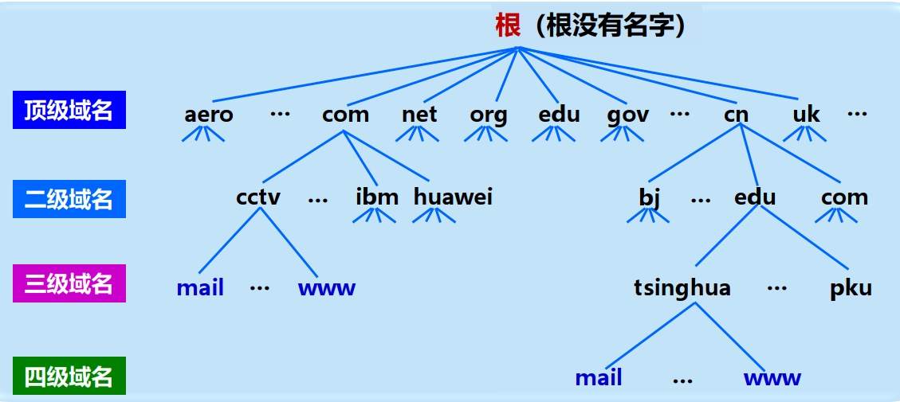
    - **域名结构**：层次结构，由标号（label）序列组成，各标号之间用点（.）隔开，各标号分别代表不同级别的域名。
        
    - **全球顶级域名** TLD（Top Level Domain）：
        - 国家顶级域名 nTLD/ccTLD：如 `.cn`、`.uk`、`.jp` 等，共 316 个
        - 通用顶级域名 gTLD：如 `.com`、`.org`、`.edu`、`.gov` 等，共 20 个
        - 基础结构域名/反向域名：用于反向域名解析，只有 `.arpa` 一个
        - 新顶级域名（New gTLD）：任何公司、机构可向 ICANN 申请注册

### 域名服务器
- **定义**：负责域名到 IP 地址解析的专设结点，分布在互联网的各个地方，又叫 DNS 服务器。
- **区**（zone）：一个域名服务器所负责管辖的（或有权限的）范围
    - DNS 服务器的管辖范围不是以“域”为单位，而是以“区”为单位。
    - 各单位根据具体情况来划分自己管辖范围的区。
        
    - 一个区中的所有节点必须是相互**连通**的。
- **辅助域名服务器**
    - 定义：为了提高 DNS 的可靠性和容错能力，DNS 域名服务器都把数据复制到几个域名服务器来保存，其中的一个是**主域名服务器**，其他的是**辅助域名服务器**。
    - 作用：保证主域名服务器出故障时 DNS 的查询工作不会中断。
    - 数据一致性：主域名服务器**定期备份**数据到辅助域名服务器中，且更改数据只能在主域名服务器中进行。

#### 域名服务器类型
1.  **根域名服务器**
    - 地位：**最高层次，最为重要**。
    - 功能：记录所有的顶级域名服务器的域名和 IP 地址，指导本地域名服务器去找相应的顶级域名服务器。
    - 行为：当收到 DNS 查询请求时，**告诉本地域名服务器下一步应当找哪一个顶级域名服务器进行查询**
        - 根域名服务器并不直接把域名转换成 IP 地址（根域名服务器也没有存放这种信息）
    - 根域名服务器共有 13 组，对应 13 套装置和 13 个不同 IP 地址的域名，但并非仅由 13 台机器所组成。
        - 根域名服务器分布在全世界。
        - 为了提供更可靠的服务，在每一个地点的根域名服务器往往由多台机器组成。
        - 根域名服务器采用**任播**（anycast）技术，当 DNS 客户向某个根域名服务器发出查询报文时，路由器能找到离这个 DNS 客户最近的一个根域名服务器。
2. **顶级域名服务器**（TLD 服务器）
    - 功能：负责管理在该顶级域名服务器注册的所有二级域名。
    - 行为：当收到 DNS 查询请求时，回答下一步应当找哪一个二级域名服务器进行查询。
3. **权限域名服务器**
    - 功能：负责一个区（zone）的域名服务器，保存该区中的所有主机的域名到 IP 地址的映射。
    - 行为：当收到 DNS 查询请求时，回答最后的结果（IP 地址）或是下一步应当找哪一个权限域名服务器。
4. **本地域名服务器**（默认域名服务器）
    - 地位：**非常重要**。
    - 功能：主机发出的所有 DNS 查询请求都交给本地域名服务器处理
    - 工作过程：
        1. 主机向本地域名服务器发出 DNS 查询请求。
        2. 本地域名服务器检查自己的高速缓存，看是否有该域名的映射信息，若有则直接回答主机。
        3. 若没有，则以 DNS 客户的身份向根域名服务器、二级域名服务器等查询，直到获得所需的 IP 地址为止，然后把该 IP 地址返回给主机，同时把该映射信息存放在自己的高速缓存中以备下次使用。

#### 域名的解析过程
- **递归查询**
    - 定义：域名服务器接受 DNS 查询请求后，若自己无法回答，就代表 DNS 客户向下一级域名服务器发出查询请求，直到获得所需的 IP 地址为止，然后把该 IP 地址返回给 DNS 客户。
        - 回答：最终的 IP 地址。
    - **通常在主机向本地域名服务器查询时使用**，比较少用
    - 示例：
        
- **迭代查询**
    - 定义：域名服务器接受 DNS 查询请求后，若自己无法回答，就告诉 DNS 客户下一级域名服务器的 IP 地址，由 DNS 客户自己向下一级域名服务器发出查询请求，直到获得所需的 IP 地址为止。
        - 回答：最终的 IP 地址或下一个要查询的域名服务器的 IP 地址。
    - **通常在本地域名服务器向根域名服务器查询时使用**。
    - 示例：
        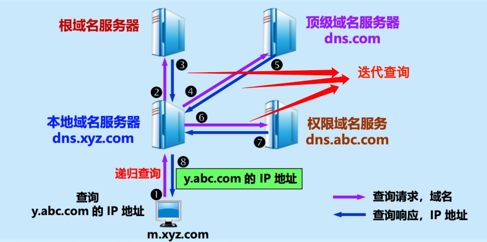

- **高速缓存/高速缓存域名服务器**。
    - 功能：存放最近用过的名字以及从何处获得名字映射信息的记录。
    - 作用：大大减轻根域名服务器的负荷，使 DNS 查询请求和回答报文的数量大为减少。
    - 当权限域名服务器回答一个查询请求时，在响应中指明绑定有效存在的时间值。域名服务器据此为每项内容设置**计时器**，并处理超过合理时间的项。
        - 增加此时间值：减少网络开销
        - 减少此时间值：提高域名转换的准确性

### DNS 安全
- DNS 可以使用 UDP 或者 TCP 进行传输，使用的端口号都为 53。大多数情况下 DNS 使用 UDP 进行传输，这就要求域名解析器和域名服务器都必须自己处理超时和重传从而保证可靠性。
- **DNS 污染** / 网域服务器缓存污染（DNS cache pollution） / 域名服务器缓存投毒（DNS cache poisoning）：刻意或无意制造错误的 DNS 数据并将其放入域名服务器的缓存中，从而导致用户访问错误的网站或无法访问某些网站的行为。
- **DNS 劫持**：通过攻击或伪造域名解析服务器（DNS），把目标网站域名解析到错误的 IP 地址，从而使用户访问指定的错误网站或无法访问某些网站的行为。

### Hosts 文件
- Hosts 文件负责解析域名并优先于 DNS 服务，通常很多恶意软件会恶意更改该文件来达到劫持网站的目地。
- 作用：
    1. 加快域名解析：相当于本地的一个 DNS 缓存
    2. 方便局域网访问：局域网内的主机可以通过 Hosts 文件直接访问其他主机，而不需要通过 DNS 服务器进行解析
    3. 屏蔽网站：通过将某些不良网站的域名映射到本地回环地址来屏蔽这些网站
    4. 虚拟域名：通过 Hosts 文件可以实现虚拟域名的映射，从而方便本地测试和开发工作

## 文件传输协议 FTP
### FTP 概述
- **文件传输协议** FTP（File Transfer Protocol）：用于在网络中的计算机之间传送文件的应用层协议，采用**客户服务器方式**，使用 **TCP** 进行通信。
    - 地位：互联网的正式标准，使用得最广泛的文件传送协议。
    - 特点：
        - 提供**交互式**的访问，允许客户指明文件的类型与格式，并允许文件具有存取权限。
        - **屏蔽**了各计算机系统的细节，因而适合于在**异构网络**中任意计算机之间传送文件。
- 是**文件共享协议**的一个大类：
    - **文件传送协议**：FTP，TFTP 等。
        - 复制整个文件，对文件副本进行访问。
            - 若要存取文件，必须先获得一个本地文件副本。
            - 若要修改文件，只能修改文件副本并将其传回到原节点。
    - **联机访问协议**（on-line access）：NFS 网络文件系统等。
        - 允许同时对一个文件进行存取。
        - 远地共享文件访问，如同对本地文件的访问一样。
        - 透明存取，不需要对该应用程序作明显的改动。
        - 由操作系统负责。

### FTP 基本工作原理
- 网络环境下复制文件的复杂性：
    - 计算机存储数据的格式不同。
    - 文件的目录结构和文件命名的规定不同。
    - 对于相同的文件存取功能，操作系统使用的命令不同。
    - 访问控制方法不同。
- **FTP 特点**：
    - 只提供文件传送的一些**基本服务**，它使用 **TCP** 可靠的运输服务。
    - 主要功能：减少或消除在不同操作系统下处理文件的不兼容性。
    - 使用**客户服务器**方式。
        - 一个 FTP 服务器进程可**同时为多个**客户进程提供服务。
        - FTP 的服务器进程由两大部分组成：
            - **一个主进程**，负责接受新的请求；
            - **若干个从属进程**，负责处理单个请求。
- FTP 主进程的工作步骤
    1. 打开**熟知端口（端口号 21）**，等待客户进程发出连接请求。
    2. 每当收到一个客户进程的连接请求时，就产生一对**从属进程**来处理该连接请求，并与客户进程进行通信。
        - **主进程与从属进程的处理是并发地进行**。
        - 从属进程在运行期间根据需要可能创建子进程。
        - 从属进程对客户进程的请求处理完毕后即终止。
- FTP 从属进程
    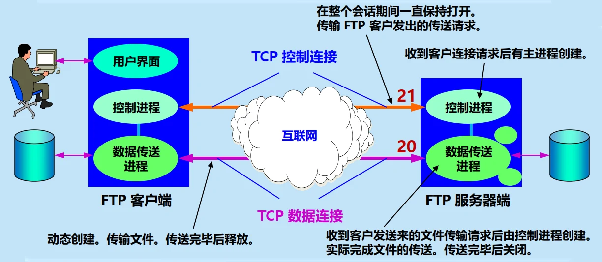

    1. **控制进程**：
        - 负责客户进程与服务器进程之间的命令和响应的传送。
            - 服务器端在收到客户连接请求后，由主进程产生一个控制从属进程来处理该连接请求。
        - 使用**TCP 连接**进行通信，该连接称为**控制连接**。
            - 端口号：21（服务器端）
            - 控制连接在客户进程与服务器进程之间保持整个会话期间都处于打开状态。
    2. **数据传送进程**：
        - 负责客户进程与服务器进程之间的数据传送。
            - 服务器端在收到客户文件传输请求后，由控制进程产生一个数据传送从属进程来处理该文件传输请求，传输完毕后即终止。
        - 使用**另一个 TCP 连接**进行通信，该连接称为**数据连接**。
            - 端口号：20（服务器端）
            - 数据连接在每次传送文件时才动态创建，传送完毕后即释放。
- FTP 的缺点：
    - 仅能访问副本。
    - 对大文件的少量修改也要传送整个文件。

### 网络文件系统 NFS 
- NFS（Network File System）：允许用户通过网络访问远地文件系统，打开一个远地文件并在其任意位置开始读写数据。
- NFS 的主要特点：
    - NFS 在网络上**传送的只是少量的修改数据**。
    - 允许用户对远地文件进行**透明存取**，就像对本地文件的存取一样，可使用户只复制一个大文件中的一个很小的片段，而不需要复制整个大文件。
    - 允许多个用户**同时**对一个远地文件进行存取。
    - 由操作系统负责，不需要对应用程序作明显的改动。

### 简单文件传输协议 TFTP
- TFTP（Trivial File Transfer Protocol）：一种简单的文件传输协议，采用**客户服务器方式**，使用 **UDP** 进行通信。
    - 端口号：69
    - 只支持文件传输，**不支持交互**。
    - 由于 UDP 不提供可靠的传送服务，因此 TFTP 必须自己实现差错改正措施。
- TFTP 的优缺点：
    - 缺点：
        - 没有庞大的命令集
        - 没有列目录的功能
        - 也不能对用户进行身份鉴别
    - 优点：
        - 可用于 UDP 环境
        - 代码所占的内存较小
- TFTP 的主要特点：
    - 每次传送的数据报文中有 512 字节的数据，但最后一次可不足 512 字节。
    - 数据报文按序编号，从 1 开始。
    - 支持 ASCII 码或二进制传送。
    - 可对文件进行读或写。
    - 使用很简单的首部。
- TFTP 的工作过程：
    - **类似停止等待协议**
        - 发送完一个文件块后就等待对方的确认，确认时应指明所确认的块编号。
        - 发完数据后在规定时间内收不到确认就要重发数据 PDU。
        - 发送确认 PDU 的一方若在规定时间内未收到下一个文件块，需重发确认 PDU，保证文件的传送不致因某一个数据报的丢失而告失败。
    - 开始工作时，TFTP 客户进程发送一个读/写请求请求报文给 TFTP 服务器进程。
    - TFTP 服务器进程选择一个新的端口和 TFTP 客户进程进行通信。
    - 若文件长度恰好为 512 字节的整数倍，则在文件传送完毕后，还必须在最后发送一个只含首部而无数据的数据报文。
    - 若文件长度不是 512 字节的整数倍，则最后传送数据报文的数据字段一定不满 512 字节，作为文件结束的标志。

## 远程终端协议 TELNET
### TELNET 概述
- **远程终端协议** TELNET（TELecommunication NETwork）：用于在网络中实现远程登录的应用层协议，采用**客户服务器方式**，使用 **TCP** 进行通信。
    - 端口号：23
    - 允许用户在本地计算机上使用主机名或 IP 地址登录到远地计算机，并像在本地计算机上一样使用远地计算机的资源。
    - TELNET 协议定义了客户进程与服务器进程之间交换的报文格式和规则，能将用户的击键传到远地主机，同时也能将远地主机的输出通过 TCP 连接返回到用户屏幕。
- 特点：**服务是透明的**。

### TELNET 的工作原理
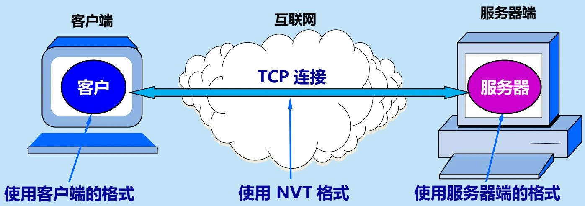

- 使用客户服务器方式，在本地系统运行 TELNET 客户进程，而在远地主机则运行 TELNET 服务器进程。
    - 服务器中的主进程等待新的请求，产生从属进程来处理每一个连接。
    - TELNET 的**选项协商**（Option Negotiation）使客户和服务器可商定使用更多的终端功能，协商的双方是平等的。
- **网络虚拟终端格式** NVT（Network Virtual Terminal）
    - 数字字符：首位为 0 + 标准 ASCII 码字符（7 位）
    - 控制字符：首位为 1 + 标准 ASCII 码字符（7 位）
- 工作步骤：
    - 客户端把用户的击键和命令转换成 NVT 格式，并送交服务器。服务器端把收到的数据和命令从 NVT 格式转换成远地系统所需的格式。
    - 向客户返回数据时，服务器把远地系统的格式转换为 NVT 格式，本地客户再从 NVT 格式转换到本地系统所需的格式。

## 万维网 WWW
### WWW 概述
- 万维网 WWW（World Wide Web）：是一个大规模的、联机式的信息储藏所，并非某种特殊的计算机网络。
    - 通过**链接**的方式实现信息的发布和获取。
- 万维网是**分布式超媒体（hypermedia）系统**
    - 分布式系统
        - 信息分布在整个互联网上。每台主机上的文档都独立进行管理。
    - 超媒体系统
        - 是**超文本（hypertext）系统**的扩充。
            - 超文本：由多个信息源链接成，是万维网的基础。
        - 超媒体与超文本的区别：文档内容不同。
            - 超文本文档仅包含文本信息。
            - 超媒体文档还包含其他信息，如图形、图像、声音、动画，甚至活动视频图像等。
- 万维网的工作方式
    - 以**客户服务器**方式工作。
        - **客户**：浏览器。
        - **服务器**：在万维网文档所驻留的主机上运行，也称为万维网服务器。
    - 客户程序向服务器程序发出请求，服务器程序向客户程序送回客户所要的万维网文档，并在客户程序的主窗口上显示出来，称之为**页面**（page）。
- 万维网的组成
    - **统一资源定位符** URL（Uniform Resource Locator）：每个文档的互联网唯一标识符，标志万维网文档的位置。
    - **超文本传输协议** HTTP（HyperText Transfer Protocol）：万维网上客户程序与服务器程序之间传送万维网文档的应用层协议，使用 TCP 连接进行可靠的传送。
    - **超文本标记语言** HTML（HyperText Markup Language）：制作万维网页面的标准语言，使其能在互联网上的各种主机上显示出来，同时使用户清楚地知道在什么地方存在着链接。
    - **搜索引擎**（Search Engine）：用户搜索所需信息的工具。

### 统一资源定位符 URL
- 定义：互联网中资源的标准化地址格式，用于**唯一**标识和定位互联网上的资源位置。
    - 对资源的**简洁表示**，提供对资源位置的**抽象**识别方法，相当于文件名在网络范围的扩展，是与互联网相连的机器上的任何可访问对象的一个指针。
- 资源：指在互联网上可以被访问的任何对象，包括文件目录、文件、文档、图像、声音等，以及与互联网相连的任何形式的数据。

#### URL 的格式
- 由以冒号 `:` 隔开的两大部分组成，对字符大写或小写没有要求。
- 一般形式：`<协议>://<主机>:<端口>/<路径>`
    - **协议**：指明访问资源所使用的应用层协议，如 HTTP、FTP 等。
    - **主机**：资源所在的主机，可以是域名或 IP 地址。
    - **端口**：指明所使用的端口号，省略时使用所定义的默认端口号。
    - **路径**：资源所在目录位置，区分大小写，省略时使用所定义的默认路径。后面可能存在查询字符串或片段标识符。
        - 查询字符串：以问号 `?` 开始，用等号 `=` 连接参数名和参数值，用与号 `&` 分隔多个参数，用于向服务器传递附加信息。
        - 片段标识符：以井号 `#` 开始，指向资源中的特定部分，如网页中的某个章节。
- 示例：
    

### 超文本传输协议 HTTP
- 定义：万维网上客户程序与服务器程序之间传送万维网文档的应用层协议，采用**客户服务器方式**，使用 **TCP** 连接进行通信。
- 特点：**面向事务**（transaction-oriented）
    - 每次客户与服务器之间的交互都称为一个事务。
    - 每个事务包括一个请求报文和一个响应报文。
- 地位：是万维网上能够**可靠地交换文件**（包括文本、声音、图像等各种多媒体文件）的重要基础。
- 功能：
    - 定义了浏览器与万维网服务器通信的格式和规则。
    - HTTP 不仅传送完成超文本跳转所必需的信息，而且也传送任何可从互联网上得到的信息，如文本、超文本、声音和图像等。

#### HTTP 的工作原理
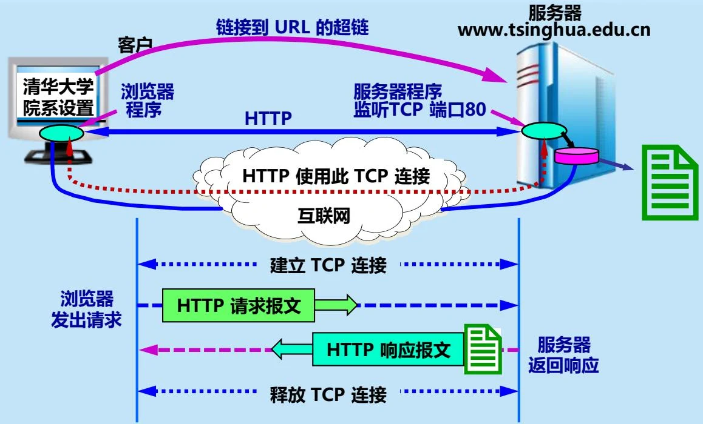

- 类 MIME 扩充（Multipurpose Internet Mail Extensions）：
    - MIME 是电子邮件系统中用于传送多媒体信息的标准。
    - HTTP 借用了 MIME 的一些概念和技术，规定在 HTTP 客户与服务器之间的每次交互，都由一个 ASCII 码串构成的请求和一个类似的通用互联网扩充（类 MIME 扩充）的响应组成。
- 用户浏览页面的两种方法
    1. 在浏览器的地址窗口中键入所要找的页面的 URL。
    2. 在某一个页面中用鼠标点击一个可选部分，这时浏览器会自动在互联网上找到所要链接的页面。
- HTTP 的工作过程
    1. 建立 TCP 连接。
    2. 发送请求报文。
    3. 服务器处理请求，发送响应报文。
    4. 释放 TCP 连接或保持连接以便发送后续请求。
- HTTP 的主要特点
    - HTTP 协议**本身是无连接的**。
    - HTTP 使用**面向连接的 TCP** 作为运输层协议，保证了数据的可靠传输。
    - HTTP 是**无状态的**（stateless），服务器不记得客户状态，简化了服务器的设计，使服务器更容易支持大量并发的 HTTP 请求。
- 请求一个万维网文档所需的时间
    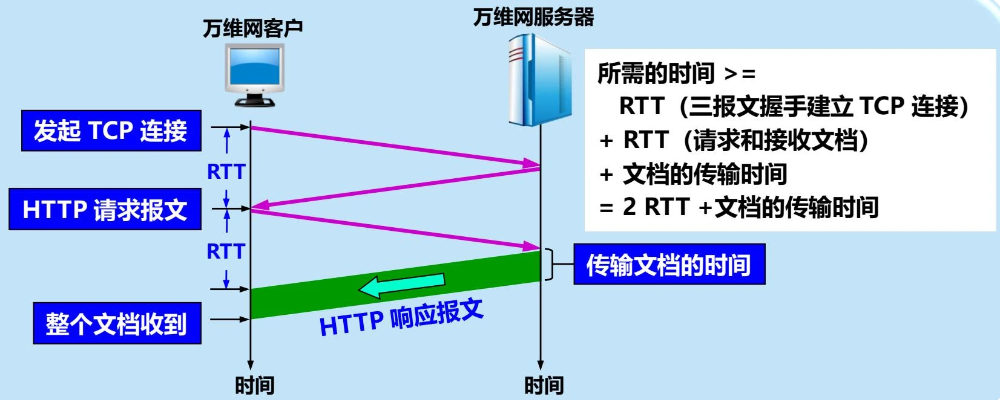

##### 协议 HTTP/1.0
- 示意图：
    
- **非持续连接**（non-persistent connection）：服务器在发送完响应报文后就释放该连接，因此客户每次请求一个资源就要和服务器建立一个新的 TCP 连接。
    - 若页面中有多个资源，则客户必须为每个资源都建立一个 TCP 连接，重新分配缓存和变量，造成大量的开销，影响传输效率。
- 访问页面的时间成本：
    - 请求单个资源耗时 ${T_{Single}}_i$
    - 请求页面耗时 $T_{Page}$
    - 单个资源传输时间 ${T_{Trans}}_i$
    - 建立 TCP 连接的往返时延 $RTT$（近似为来回的传播时延 $2\tau$）
    - 资源数 $n$

    $$
    \begin{aligned}
    {T_{Single}}_i & \geq 2RTT + {T_{Trans}}_i \\
    T_{Page} & \geq \sum_{i=1}^{n} {T_{Single}}_i \geq 2n \times RTT + \sum_{i=1}^{n} {T_{Trans}}_i
    \end{aligned}
    $$

    <!-- 
    为什么不计算释放连接的时延？四报文握手耗时 2RTT？
    $$
    \begin{aligned}
    {T_{Single}}_i & \geq RTT + RTT + {T_{Trans}}_i + 2RTT \\
    &= 4RTT + {T_{Trans}}_i \\
    T_{Page} & \geq \sum_{i=1}^{n} {T_{Single}}_i \geq 4n \times RTT + \sum_{i=1}^{n} {T_{Trans}}_i
    \end{aligned}
    $$
    -->

##### 协议 HTTP/1.1
- **持续连接**（persistent connection）：服务器在发送响应后仍然在一段时间内保持这条连接（不释放），使同一个客户和该服务器可以继续在这条连接上传送后续的 HTTP 请求报文和响应报文。
    - 只要文档都在同一个服务器上，就可以继续使用该 TCP 连接。
- 两种工作方式：
    - **非流水线方式**（without pipelining）：客户在收到前一个响应之后才能发出下一个请求。
        - 缺点：存在 TCP 连接空闲状态。
        - 示意图：
            
        - 访问页面的时间成本：
            $$
            \begin{aligned}
            {T_{Single}}_i & \geq RTT + {T_{Trans}}_i \\
            T_{Page} & \geq RTT + \sum_{i=1}^{n}({T_{Single}}_i + {T_{Blank}}_i) \\
            & \geq (n+1)RTT + \sum_{i=1}^{n}({T_{Trans}}_i + {T_{Blank}}_i)
            \end{aligned}
            $$
            
            <!--
            如果考虑释放，最后结果 +2RTT？
            $$
            \begin{aligned}
            {T_{Single}}_i & \geq RTT + {T_{Trans}}_i \\
            T_{Page} & \geq RTT + \sum_{i=1}^{n}({T_{Single}}_i + {T_{Blank}}_i) + 2RTT\\
            & \geq (n+3)RTT + \sum_{i=1}^{n}({T_{Trans}}_i + {T_{Blank}}_i)
            \end{aligned}
            $$
            -->
    - **流水线方式**（with pipelining）：客户在收到响应报文之前就能够接着发送新的请求报文，服务器收到连续的多个请求报文后可以连续发回响应报文。
        - 优点：大大减少了 TCP 连接的空闲时间，提高了传输效率。
        - 示意图：
            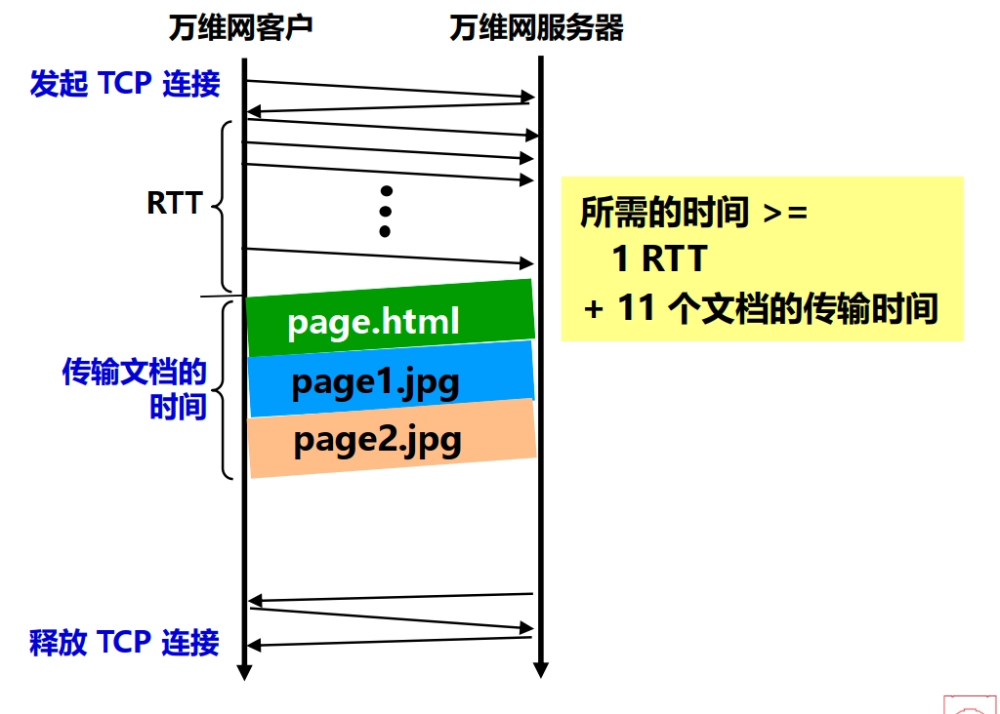
        - 访问页面的时间成本：
            $$
            T_{Page} \geq 2RTT + \sum_{i=1}^{n} {T_{Trans}}_i
            $$

            <!-- 
            如果考虑释放，最后结果 +2RTT
            $$
            \begin{aligned}
            T_{Page} & \geq RTT + RTT + \sum_{i=1}^{n} {T_{Trans}}_i +2RTT \\
            & = 4RTT + \sum_{i=1}^{n} {T_{Trans}}_i
            \end{aligned}
            $$
            -->

##### 协议 HTTP/2
- 协议 HTTP/1.1 的升级版本。
- 主要特点：
    - **二进制分帧层**（Binary Framing Layer）：将所有传输的信息分割成更小的二进制编码的帧，从而实现更高效的数据传输。
    - **多路复用**（Multiplexing）：允许多个请求和响应在单个 TCP 连接上**并行**传输，减少了延迟和连接开销。
    - **头部压缩**（Header Compression）：使用 HPACK 算法对 HTTP 头部进行压缩，不发送重复的首部字段，减少了传输的数据量。
    - **向后兼容**：HTTP/2 设计时考虑了与 HTTP/1.1 的兼容性，允许现有的 HTTP/1.1 应用程序无缝升级到 HTTP/2。
- 其他改进：
    - 服务器推送（Server Push）：允许服务器主动向客户端发送资源，而无需客户端明确请求，从而提高页面加载速度。
    - 流量控制（Flow Control）：通过流量控制机制，防止单个流占用过多带宽，确保公平的资源分配。
- 访问页面的时间成本（先拿到第一个资源才知道后续资源的位置）：
    $$
    T_{Page} \geq RTT + {T_{Trans}}_0 + \max_{i=2}^{n} {T_{Trans}}_i
    $$

#### HTTP 代理服务器
- **代理服务器**（proxy server）/**万维网高速缓存**（Web cache）：位于浏览器和万维网服务器之间的中间服务器，存放最近访问过的万维网文档的副本，代表浏览器向万维网服务器发出 HTTP 请求。
- 工作过程：
    1. 浏览器访问互联网的服务器时，先与代理服务器的高速缓存建立 TCP 连接，并向高速缓存发出 HTTP 请求报文。
    2. 若高速缓存已经存放了所请求的对象，则将此对象放入 HTTP 响应报文中返回给浏览器。
    3. 若未存放，高速缓存就代表浏览器与互联网上的源点服务器建立 TCP 连接，并发送 HTTP 请求报文。
    4. 源点服务器将所请求的对象放在 HTTP 响应报文中返回给代理服务器的高速缓存。
    5. 高速缓存收到对象后，先复制到本地存储器中，然后将该对象放在  HTTP 响应报文中，通过已建立的 TCP 连接，返回给请求该对象的浏览器。
- 优点：
    - **减少了对外部网络连接的需求**，节省了带宽。
    - 提高了访问速度，减少了延迟。
    - 提供了安全性和隐私保护功能。
    - 允许对网络流量进行监控和过滤。

#### HTTP 报文
##### 报文分类
- **请求报文**：从客户向服务器的请求。
    - 格式：
        ```
        <方法> <URL> <版本>     // 请求行
        <首部字段名>: <值>      // 首部行
        ……
        <首部字段名>: <值>

        <实体主体>              // 可选
        ```
    - 示例
        ```
        GET /dir/index.htm HTTP/1.1         // 使用了相对URL
        Host：www.xyz.edu.cn                // 首部行开始。给出主机的域名
        Connection: close                   // 表示请求服务器在发送完请求的文档后释放连接
        User-Agent: Mozilla/5.0             // 表明用户代理使用火狐浏览器 Firefox
        Accept-Language: cn                 // 表示用户希望优先得到中文版本的文档
                                            // 请求报文的最后一行为空行
                                            // 没有实体主体
        ```

- **响应报文**：从服务器到客户的回答。
    - 格式：
        ```
        <版本> <状态码> <短语>      // 状态行
        <首部字段名>: <值>          // 首部行
        ……
        <首部字段名>: <值>

        <实体主体>                  // 可选
        ```
    - 示例
        ```
        HTTP/1.1 200 OK                     // 状态行
        Date: Mon, 27 Jul 2009 12:28:53 GMT // 首部行开始。给出响应报文的日期和时间
        Server: Apache/2.2.14 (Win32)       // 服务器类型
        Last-Modified: Wed, 22 Jul 2009 19:15:56 GMT // 所请求页面的最后修改时间
        Content-Length: 88                  // 实体主体的长度
        Content-Type: text/html             // 实体主体的类型
                                            // 响应报文的最后一行为空行
        <html>
        <body>
        <h1>Hello, World!</h1>
        </body>
        </html>                             // 实体主体
        ```

##### 报文的组成部分
由于 HTTP 是面向正文的（text-oriented），因此报文中每一个字段的值都是一些 ASCII 码串，每个字段的长度都是不确定的。

- **开始行**：用于区分是请求报文还是响应报文。
    - 请求行：三个字段，中间用空格 ` ` 隔开。
        1. 方法：对所请求的对象进行的操作，决定请求报文的类型。

            | 方法（操作） | 意义             |
            |--------------|------------------|
            | OPTION       | 请求一些选项的信息 |
            | GET          | 请求读取由 URL 所标志的信息 |
            | HEAD         | 请求读取由 URL 所标志的信息的首部 |
            | POST         | 给服务器添加信息（例如，注释） |
            | PUT          | 在 URL 所标志的位置存放一个资源 |
            | DELETE       | 删除指明的 URL 所标志的资源 |
            | TRACE        | 用来进行环回测试的请求报文 |
            | CONNECT      | 用于代理服务器 |

        2. URL：所请求的资源的 URL。
        3. 版本：HTTP 的版本。
    - 状态行：三个字段，中间用空格 ` ` 隔开。
        1. 版本：HTTP 的版本
        2. 状态码：服务器操作完成的状态
            - `1xx` 表示通知信息，如请求收到了或正在进行处理。
            - `2xx` 表示成功，如接受或知道了。
            - `3xx` 表示重定向，表示要完成请求还必须采取进一步的行动。
            - `4xx` 表示客户的差错，如请求中有错误的语法或不能完成。
            - `5xx` 表示服务器的差错，如服务器失效无法完成请求。
        3. 短语：解释状态码。
- **首部行**：说明浏览器、服务器或报文主体的一些信息。可以有多行，也可以不使用。
    - 若干首部字段，每个字段占一行，字段名与值之间用冒号 `:` 隔开。
- **实体主体**：请求报文中一般不用，响应报文中也可能没有该字段。

#### 在服务器上存放用户的信息
- 万维网使用 Cookie 跟踪在 HTTP 服务器和客户之间传递的状态信息。
    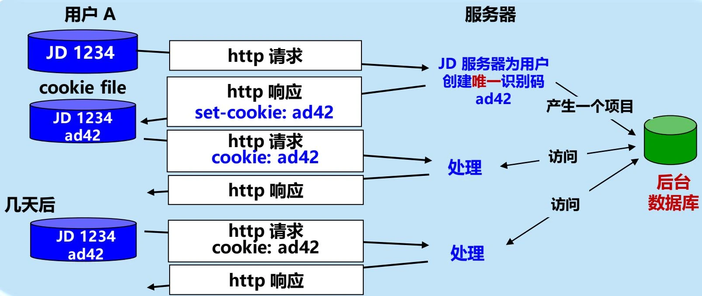

### 超文本标记语言 HTML
- 在一个客户程序主窗口上显示出的万维网文档称为**页面**（page）。
- 万维网文档分类：
    - 静态万维网文档：服务器返回静态的 HTML 文档，内容不会改变，最为简单。
    - 动态万维网文档：服务器在浏览器访问时由应用程序动态创建 HTML 文档。
    - 活动万维网文档：服务器返回的 HTML 文档中包含脚本代码，由浏览器在显示页面时解释执行这些脚本代码从而改变页面内容。

#### HTML 概述
- **超文本标记语言** HTML（HyperText Markup Language）：是一种制作万维网页面的**标准语言**，它消除了不同计算机之间信息交流的障碍，是万维网的重要基础。
- HTML 的基本概念
    - HTML 定义了许多用于排版的命令（即**标签**）。
    - HTML 把各种标签嵌入到万维网的页面中，构成了所谓的 HTML 文档。
    - HTML 文档是一种可以用任何文本编辑器创建的 **ASCII 码文件**。
    - HTML 文档的**后缀**：.html 或 .htm。
- HTML 文档中标签的用法
    ```html
    <HTML>
        <HEAD>
            <TITLE>一个HTML的例子</TITLE>
        </HEAD>
        <BODY>
            <H1>HTML很容易掌握</H1>
            <P>这是第一个段落。</P>
            <P>这是第二个段落。</P>
        </BODY>
    </HTML>
    ```

    - `<HTML>`：标志 HTML 文档的开始和结束。
    - `<HEAD>`：标志 HTML 文档的头部开始和结束。
    - `<TITLE>`：标志 HTML 文档的标题开始和结束。标题显示在浏览器的标题栏上。
    - `<BODY>`：标志 HTML 文档的主体开始和结束。浏览器显示的内容都在主体中。
    - `<H1>`：标志标题开始和结束。H1 表示一级标题，H2 表示二级标题，依此类推，H6 表示六级标题。
    - `<P>`：标志段落开始和结束。                     
    - ``：图像标签。
        - **内含图像**（inline image）：嵌入在 HTML 文档中的图像。
        - HTML 标准没有规定该图像的格式，但大多数浏览器都支持 GIF 和 JPEG 文件。
    - `<a>`：链接标签。
        - 每个链接都有一个起点和终点。
        - **起点**：说明在万维网页面中的什么地方可引出一个链接。可以是一个字或几个字，或是一幅图，或是一段文字。
        - **终点**：
            - **远程链接**：其他网站上的页面，必须指明链接到的网站的 URL。
            - **本地链接**：本计算机中的某一个文件或本文件中的某处，必须指明链接的路径。
- **可扩展标记语言** XML（Extensible Markup Language）
    - 设计宗旨：**传输数据**，而不是显示数据。
    - 特点和优点：
        - 可用来标记数据、定义数据类型
        - 允许用户对自己的标记语言进行自定义，并且是无限制的
        - 简单，与平台无关
        - 将用户界面与结构化数据分隔开来
- **可扩展超文本标记语言** XHTML（Extensible HTML）
    - 与 HTML 4.01 几乎相同，是更严格的 HTML 版本。
    - 作为一种 XML 应用被重新定义的 HTML，将逐渐取代 HTML。
- **层叠样式表** CSS（Cascading Style Sheets）
    - 定义：一种样式表语言，用于为 HTML 文档**定义布局**。
    - CSS 与 HTML 的区别：HTML 用于结构化内容，而 CSS 则用于格式化结构化的内容。

#### 静态/动态万维网文档
- 静态文档和动态文档之间的主要差别体现在**服务器端**：文档内容的生成方法不同。从浏览器的角度看，这两种文档并没有区别。
    - 静态文档：该文档创作完毕后就存放在万维网服务器中，在被用户浏览的过程中，内容不会改变。
    - 动态文档：文档的内容是在浏览器访问万维网服务器时才由应用程序动态创建。
- 万维网服务器功能的扩充
    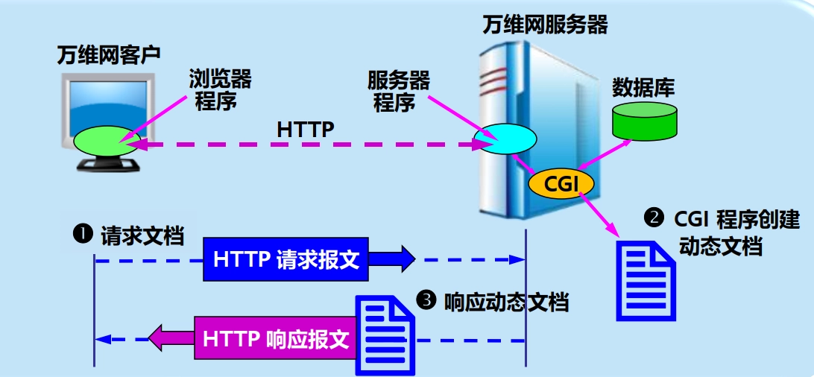

    1. 增加一个应用程序：**处理**浏览器发来的数据，并**创建**动态文档。
    2. 增加一个机制：使万维网服务器把浏览器发来的数据**传送**给这个应用程序，然后万维网服务器能够**解释**这个应用程序的输出，并向浏览器返回 HTML 文档。
- **通用网关接口** CGI（Common Gateway Interface）
    - 定义：定义动态文档应如何创建、输入数据应如何提供给应用程序以及输出结果应如何使用的一种标准。
        - **通用**：CGI 标准所定义的规则对其他任何语言都是通用的。
        - **网关**：CGI 程序的作用像网关。
        - **接口**：有一些已定义好的变量和调用等可供其他 CGI 程序使用。
    - CGI 网关程序——**CGI 脚本**（script）
        - 脚本：一个被解释程序而不是计算机的处理机来解释或执行的程序，不一定是一个独立的程序，可以是一个动态装入的库，甚至是服务器的一个子程序。
            - 脚本语言（script language）：如 Perl，JavaScript，Tcl/Tk 等及一些常用的编程语言如 C，C++ 等。
        - 脚本运行起来要比一般的编译程序要慢。
        - CGI 程序又称为 cgi-bin 脚本，因为在许多万维网服务器上，将 CGI 程序放在 /cgi-bin 的目录下。

#### 活动万维网文档
- **活动文档技术**（active document）：把屏幕连续更新的工作转移给浏览器端，每当浏览器请求一个活动文档时，服务器就返回一段**活动文档程序副本**在浏览器端运行，从而实现屏幕的连续更新。
    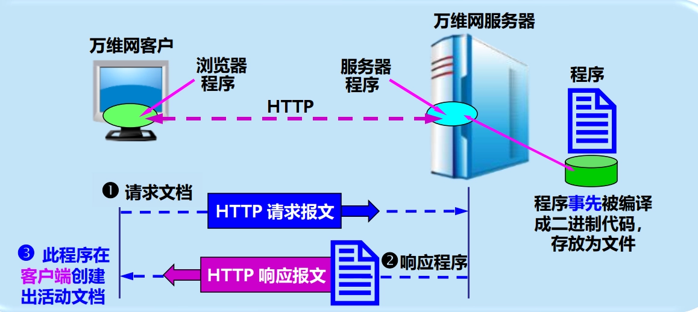
- 特点：
    - 活动文档程序可与用户直接交互，并可连续地改变屏幕的显示。
    - 由于活动文档技术不需要服务器的连续更新传送，对网络带宽的要求也不会太高。
- 用 Java 语言创建活动文档
    - Java 语言是一项用于创建和运行活动文档的技术。
    - 在 Java 技术中使用小应用程序（applet）来描述活动文档程序。
    - 用户从万维网服务器下载嵌入了 applet 的 HTML 文档后，可在浏览器的屏幕上点击某个图像，就可看到动画效果，或在下拉式菜单中点击某个项目，就可看到计算结果。
    - Java 技术是活动文档技术的一部分。

### 搜索引擎
- 搜索引擎（search engine）：是一种用来在万维网上**查找信息**的程序。

#### 搜索引擎的分类
- **全文检索搜索引擎**
    - 定义：通过对互联网上的网页进行全文检索来提供搜索服务的搜索引擎。
        - 一种纯技术型的检索工具。
    - 工作原理：
        - 通过搜索软件（爬虫）到互联网上的各网站收集信息。
        - 按照一定的规则建立一个很大的在线索引数据库，并定期对其维护更新。
        - 用户在查询时只要输入关键词，从已经建立的索引数据库里查询（非实时）。
- **分类目录/网站搜索引擎**
    - 定义：通过对互联网上的网站进行分类编目来提供搜索服务的搜索引擎。
        - 一种人工编辑型的检索工具。
    - 工作原理：
        - 网站向搜索引擎提交网站信息时填写关键词和网站描述等信息
        - 由人工编辑人员对提交的网站信息进行审核、分类和编目，建立一个分类目录数据库。
        - 查询时只需要按照分类，不需要使用关键词，查询的准确性较好。
    - 特点：查询的结果不是具体的页面，而是被收录网站主页的 URL 地址。
- **垂直搜索引擎**（Vertical Search Engine）
    - 定义：针对某一特定领域、特定人群或某一特定需求提供搜索服务的搜索引擎。
    - 特点：用户提供关键字来进行搜索，但被放到一个行业知识的上下文中，返回的结果更倾向于信息、消息、条目等。
- **元搜索引擎**（Meta Search Engine）
    - 定义：通过使用多个独立的其他搜索引擎来进行搜索，并对结果进行整合处理后提供给用户的搜索引擎之上的搜索引擎。
    - 工作原理：
        - 用户在元搜索引擎中输入查询请求后，元搜索引擎将该请求发送给多个独立的搜索引擎。
        - 各个独立的搜索引擎返回各自的搜索结果，元搜索引擎对这些结果进行集中处理，经整合、排序和去重后以统一的格式将最终结果提供给用户。
    - 特点：主要精力放在提高搜索速度、智能化处理搜索结果、个性化搜索功能的设置和用户检索界面的友好性上。
    - 优点：
        - 查全率和查准率都比较高。
        - 提供更广泛的搜索范围，覆盖多个搜索引擎的资源。
        - 节省用户时间和精力，无需逐个访问多个搜索引擎。

#### Google 搜索技术的特点
- **网页排名**（Page Rank）：对搜索结果**按重要性排序**。
    - 对链接的数目进行加权统计。来自重要网站的链接，其权重较大。
    - 进行超文本匹配分析，确定哪些网页与正在执行的特定搜索相关。
    - 在综合考虑整体重要性以及与特定查询的相关性之后，Google 就把最相关、最可靠的搜索结果放在首位。

### 博客和微博
- 博客
    - 万维网日志（weblog）的简称。
    - 使网民不仅是互联网上内容的消费者，而且还是互联网上内容的生产者。
- 微博
    - 微型博客（microblog），又称为微博客。
    - 只记录片段、碎语，三言两语，现场记录，发发感慨，晒晒心情，永远只针对一个问题进行回答。
    - 开通的多种 API 使用户可通过手机、网络等方式即时更新自己的信息。
    - 是一种互动及传播性极快的工具。

### 社交网站
- 社交网站 SNS（Social Networking Site）：为一群拥有相同兴趣与活动的人创建在线社区。
- 功能丰富：如电子邮件、即时传信（在线聊天）、博客撰写、共享相册、上传视频、网页游戏、创建社团、刊登广告等。

## 电子邮件
### 电子邮件概述
- **电子邮件**（e-mail）：指使用电子设备交换的邮件及其方法。
- 优点：使用方便，传递迅速，费用低廉，可以传送多种类型的信息（包括：文字信息，声音和图像等）。
- **重要标准**：
    - 互联网文本报文格式
    - 简单邮件发送协议：SMTP
    - 邮件读取协议：POP3 和 IMAP
    - 通用互联网邮件扩充 MIME

#### 电子邮件系统的三个主要构件


- **用户代理** UA（User Agent）
    - 用户与电子邮件系统的接口，又被称为电子邮件客户端软件。
    - 基本功能：撰写、显示、处理、通信。
- **邮件服务器**（Mail Server）
    - 又被称为**邮件传输代理**。
    - 功能：发送和接收邮件，同时还要向发信人报告邮件传送的情况。
    - 按照**客户服务器**方式工作，能够**同时充当**客户和服务器。
- **邮件发送和读取协议**
    - 邮件发送和读取使用不同的协议，都使用 **TCP** 连接可靠地传送邮件。
    - **简单邮件发送协议** SMTP：用于在用户代理向邮件服务器或邮件服务器之间发送邮件。
    - **邮局协议** POP3：用于用户代理从邮件服务器读取邮件。
    - **网际报文存取协议** IMAP：也是用于用户代理从邮件服务器读取邮件，但功能更强大。

#### 发送和接收电子邮件的重要步骤
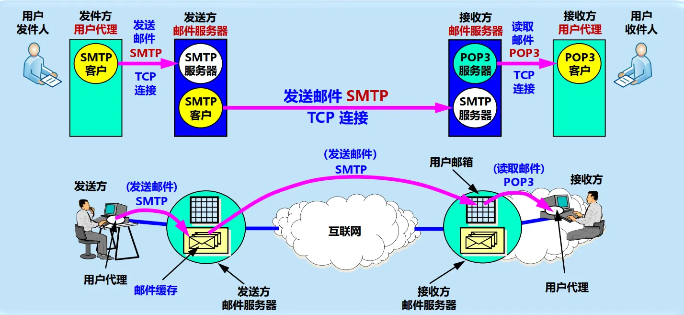

- 步骤：
    1. 用户使用**发送方用户代理**撰写邮件，并通过 SMTP 将邮件发送到**源邮件服务器**。
    2. 源邮件服务器通过 SMTP 将邮件传送到**目的邮件服务器**。
    3. 接收方用户使用**接收方用户代理**通过 POP3 或 IMAP 从目的邮件服务器读取邮件。
- 注意：邮件不会在互联网中的某个中间邮件服务器落地。

#### 电子邮件的组成
- 电子邮件由信封（envelope）和内容（content）两部分组成。
    
    
    - 信封：
        - 包含邮件传送所需的地址信息。
        - 信封上的地址信息与邮件内容无关。
    - 内容：
        - 包含邮件的实际信息。
        - 用户从自己的邮箱中读取邮件时才能看到邮件的内容。
- 电子邮件信封的格式
    - 信封包含发件人地址和收件人地址。 
    - TCP/IP 体系的电子邮件系统规定电子邮件地址的格式：**邮箱名@邮箱所在主机的域名**
        - 邮箱名：在该域名的范围内是唯一的。
        - 邮箱所在的主机的域名：在全世界必须是唯一的。
-  电子邮件内容的格式
    - RFC 5322 只规定了邮件内容中的**首部**（header）格式，**主体**（body）部分则让用户自由撰写。
        - 首部：
            - From：发件人地址
            - To：收件人地址
            - Date：发送日期和时间
            - Subject：邮件主题
            - Cc：抄送地址
        - 主体：
            - 纯文本信息（ASCII编码）。
            - 无特定结构和含义。

### 简单邮件传输协议 SMTP
- 定义：用于在用户代理向邮件服务器或邮件服务器之间发送邮件的协议。
- 特点：
    - 规定了在两个相互通信的 SMTP 进程之间交换信息的方法。
    - 使用**客户服务器方式**。
    - 基于 **TCP** 实现客户与服务器的通信，SMTP 服务器使用熟知端口 25。
    - 客户与服务器之间采用**命令-响应**方式进行交互。
    - **基于文本**：SMTP 命令和响应均为 ASCII 码文本行。

#### SMTP 通信的三个阶段
1. **连接建立**：连接是在**发送主机的 SMTP 客户**和**接收主机的 SMTP 服务器**之间建立的，不使用中间的邮件服务器。
    

    - SMTP 客户首先使用熟知端口 25 与接收方的 SMTP 服务器建立 TCP 连接。
    - SMTP 服务器发出服务就绪响应：“220 Service ready”。
    - SMTP 客户向服务器发送问候（HELO 命令），附上发送方的主机名。
    - SMTP 服务器若有能力接收邮件，则回答：“250 OK”，表示已准备好接收。
2. **邮件传送**
    

    - SMTP 客户发送 MAIL FROM 命令，指定发件人地址，服务器回答“250 OK”。
    - SMTP 客户发送 RCPT TO 命令，指定收件人地址，服务器回答“250 OK”。    
    - SMTP 客户发送 DATA 命令，服务器回答“354 Start mail input”，表示可以开始发送邮件内容。
    - SMTP 客户发送邮件内容，首部与主体之间用一个空行隔开，以 `.` 单独一行表示邮件内容结束，服务器收到后回答“250 OK”。
3. **连接释放**：邮件发送完毕后，SMTP 应释放 TCP 连接。
    

    - SMTP 客户发送 QUIT 命令，表示结束会话，服务器回答“221 Service closed”，然后释放连接。

### 邮件读取协议 POP3 和 IMAP
- 两个常用的邮件读取协议：
    1. POP3：邮局协议（Post Office Protocol）第 3 版
    2. IMAP：网际报文存取协议（Internet Message Access Protocol）


#### POP3 协议
- 邮局协议第 3 版 POP3（Post Office Protocol version 3）：用于用户代理从目的邮件服务器读取邮件的协议。
- 特点：
    - 使用**客户服务器**方式。
    - 基于 **TCP** 实现客户与服务器的通信。
    - **支持用户鉴别**。
    - **脱机协议**：用户可以先将邮件下载到本地计算机，然后再离线阅读和处理邮件。
        - 客户端将邮件从服务器上下载到本地。
        - 服务器会**删除**被用户读取的邮件。

#### IMAP 协议
- 网际报文存取协议 IMAP（Internet Message Access Protocol）：也是用于用户代理从目的邮件服务器读取邮件的协议，但功能更强大。
- 特点：
    - 使用**客户服务器**方式。
    - 基于 **TCP** 实现客户与服务器的通信。
    - **联机协议**：客户端在使用邮件服务时，需要持续或频繁地与邮件服务器保持连接，以便实时同步邮件状态。
        - **部分下载**：连接后只下载邮件首部，允许收信人只读取邮件中的某一个部分。
        - 用户可以在不同的地方使用不同的计算机随时上网阅读和处理自己的邮件。
        - 用户可以直接在 IMAP 服务器上创建和管理文件夹。
        - 用户可以搜索邮件内容。
- 缺点：要想查阅邮件，必须先联网。

#### IMAP 与 POP3 比较
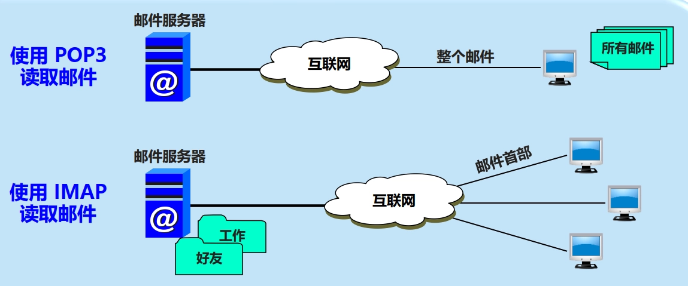

| 操作位置 | 操作内容 | IMAP | POP3 |
|----------|----------|------|------|
| 收件箱 | 阅读、标记、移动、删除邮件等 | 客户端与邮箱更新同步 | 仅在客户端内 |
| 发件箱 | 保存到已发送 | 客户端与邮箱更新同步 || 仅在客户端内 |
| 创建文件夹 | 新建自定义的文件夹 | 客户端与邮箱更新同步 | 仅在客户端内 |
| 草稿 | 保存草稿 | 客户端与邮箱更新同步 | 仅在客户端内 |
| 垃圾文件夹 | 接收并移入垃圾文件夹的邮件 | 支持 | 不支持 |
| 广告邮件 | 接收并移入广告邮件夹的邮件 | 支持 | 不支持 |

### 基于万维网的电子邮件
- 用户代理（UA）的缺点：
    - 必须在计算机中安装用户代理软件。
    - 收发邮件不方便。
- 万维网电子邮件优点：
    - 不需要在计算机中再安装用户代理软件，而是使用浏览器即可收发电子邮件。
    - 只要计算机能联网，就能非常方便地收发电子邮件。
    - 界面非常友好。
- 示意图：
    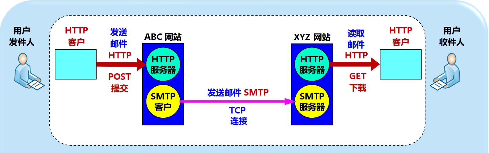
- 工作原理：
    1. 用户使用浏览器访问万维网电子邮件服务器的网页，输入用户名和密码进行登录。
    2. 登录成功后，用户即可使用浏览器撰写、发送、接收和管理电子邮件。
- 协议：
    - **发送、接收电子邮件时使用 HTTP 协议**。
        - 使用 HTTP POST 方法提交要发送的邮件。
        - 使用 HTTP GET 方法读取邮件。
    - 两个邮件服务器之间传送邮件时使用 SMTP。

### 通用互联网邮件扩充 MIME
- SMTP 缺点：
    - 限于传送 7 位的 ASCII 码，无法传送非 ASCII 编码的信息，如可执行文件或其他的二进制对象等。
    - 服务器会拒绝超过一定长度的邮件。
    - 某些 SMTP 的实现并没有完全按照 RFC 821 的 SMTP 标准。

#### MIME 概述
- MIME（Multipurpose Internet Mail Extensions）：通用互联网邮件扩充。
    - 目的：扩展电子邮件的功能，使其能够传送多种类型的信息
- MIME 和 SMTP 的关系：MIME 并没有改动 SMTP 或取代它，而是在目前的 RFC 822 格式基础上，**增加了邮件主体结构**，并**定义了传送非 ASCII 码的编码规则**
    
- MIME 的主要内容
    - 扩展了 RFC 822 邮件内容的**首部格式**。
    - 定义了许多邮件内容的**格式**，对多媒体电子邮件的表示方法进行了标准化。
    - 定义了**传送编码**，可对任何内容格式进行转换，而不会被邮件系统改变。
- MIME 举例
    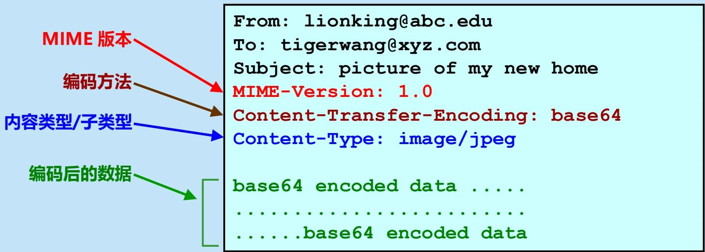

#### 首部格式扩展
- 增加 5 个新的邮件**首部字段**：
    - MIME-Version：MIME 的版本。若无此行则为英文文本。
    - Content-Description：用于对此邮件进行说明的可读字符串。
    - Content-Id：邮件的唯一标识符。
    - Content-Transfer-Encoding：传送时邮件主体使用的编码方法。
    - Content-Type：邮件内容类型 / 子类型。

#### 内容传送编码（Content-Transfer-Encoding）
- 7-bit 编码：默认的 7 位 ASCII 编码，每行不能超过 1000 个字符（包括回车和换行）。
- 8-bit 编码：8 位非 ASCII 编码，每行不能超过 1000 个字节（包括回车和换行）。
- Binary 编码：8 位非 ASCII 编码，不限行长度。
- **Base64 编码**：将任意长度的字节串转换为用 7 位 ASCII 编码表示的字符串。
    - 适用情况：任意长度的二进制数据或非文本数据的编码。
    - 编码规则：
        - 把要传送的字节串每 3 个字节（24 位）作为一组，划分为 4 个 6 位组。
        - 将每个 6 位组转换为一个对应的 ASCII 字符，从而得到 4 个 ASCII 字符。
        - 若最后一组不足 3 个字节，则在后面补零，得到 4 个 6 位组后，再用等号 `=` 补足编码字符数，使其仍为 4 个字符。
            - 一个字节缺失时，补一个等号 `=`。
            - 两个字节缺失时，补两个等号 `==`。
    - 示例：
        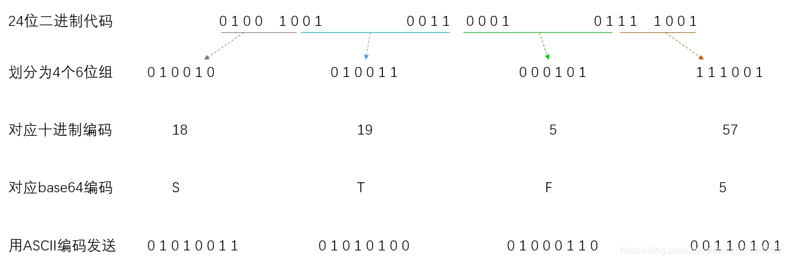
- **Quoted-printable 编码**：将任意长度的字节串转换为 ASCII 编码表示的字符串。
    - 适用情况：可用于二进制和非文本数据的编码，适用于所传送的数据中只有**少量**的非 ASCII 码的情况。
    - 编码规则：
        - 将所有非打印字符（ASCII 码小于 32 或大于 126）转换为等号 `=` 后跟该字符的两个十六进制表示。
        - 将等号 `=` 本身用 `=3D` 来表示。
        - 将每行的长度限制在 76 个字符以内，超过时在适当位置插入软回车，即在行尾加上等号 `=`，然后换行，下一行继续。
    - 示例：
        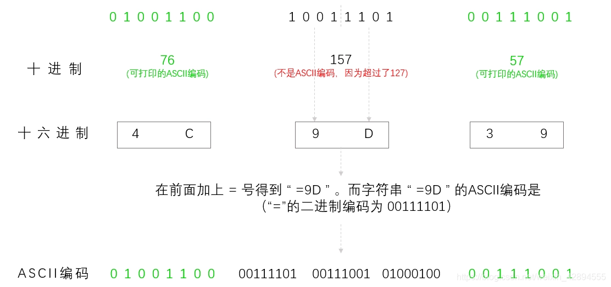

#### 内容类型（Content-Type）
- MIME 标准规定：Content-Type 说明必须含有两个标识符：**内容类型**（type）和**子类型**（subtype），中间用 `/` 分开。
- MIME 标准原先定义了 7 个基本内容类型和 15 种子类型，同时允许发件人和收件人自己定义专用的内容类型。
    - 为避免可能出现名字冲突，标准要求自定义的专用内容类型名称要以字符串 `X-` 开始。
- MIME Content-Type 说明中的类型及子类型

    | 内容类型 | 子类型举例 | 说明 |
    |----------|------------|------|
    | text（文本） | plain，html，xml，css | 不同格式的文本 |
    | image（图像） | gif，JPEG，tiff | 不同格式的静止图像 |
    | audio（音频） | basic，mpeg，mp4 | 可听见的声音 |
    | video（视频） | mpeg，mp4，quicktime | 不同格式的影片 |
    | model（模型） | vrml | 3D模型 |
    | application（应用） | octet-stream，pdf，javascript，zip | 不同应用程序产生的数据 |
    | message（报文） | http，rfc822 | 封装的报文 |
    | multipart（多部分） | mixed，alternative，parallel，digest | 多种类型的组合 | 

## 动态主机配置协议 DHCP
- **协议配置**：在协议软件中，给协议参数赋值的过程称为协议配置。
    - 一个协议软件在使用之前必须是已正确配置的。
    - 具体的配置信息取决于协议栈。
- 连接到互联网的计算机的协议软件需要正确配置的参数包括：
    1. IP 地址
    2. 子网掩码
    3. 默认路由器的 IP 地址
    4. 域名服务器的 IP 地址

### DHCP 概述
- **动态主机配置协议** DHCP（Dynamic Host Configuration Protocol）：是一种用于动态分配 IP 地址及其他网络配置信息的协议。
    - 作用：提供了**即插即用连网**（plug-and-play networking）的机制，允许一台计算机能够自动加入网络和获取 IP 地址及其他配置信息，而不用手工配置。
    - 特点：DHCP 给运行服务器软件、且位置固定的计算机指派一个永久地址，给运行客户端软件的计算机分配一个临时地址。
- DHCP 组成部分
    - DHCP 客户：向 DHCP 服务器请求 IP 地址及其他配置信息的计算机。
        - 以**广播**方式发送**发现报文**（DHCPDISCOVER）。
    - DHCP 服务器：负责给 DHCP 客户分配 IP 地址及其他配置信息。
        - 维护一个 IP 地址池。
        - 以**单播**方式发送**提供报文**（DHCPOFFER）。
    - DHCP 中继代理（relay agent）：负责在 DHCP 客户和 DHCP 服务器之间转发 DHCP 报文。
        - 并非每个网络上都存在 DHCP 服务器，但都至少有一个 DHCP 中继代理。
        - 配置了 DHCP 服务器的 IP 地址信息。
        - 以**单播**方式转发 DHCP 报文。
            
- DHCP 工作方式
    - DHCP 使用**客户服务器**方式，采用**请求/应答**方式工作。
        - 需要 IP 地址的主机在启动时就向 DHCP 服务器广播**发现报文**，这时该主机就成为 DHCP 客户。
        - 本地网络上所有主机都能收到此广播报文，但只有 DHCP 服务器才回答此广播报文。
        - DHCP 服务器先在其数据库中查找该计算机的配置信息。若找到，则返回找到的信息。若找不到，则从服务器的 IP 地址池（address pool）中取一个地址分配给该计算机。
        - DHCP 服务器将 IP 地址及其他配置信息封装在**提供报文**中单播发回给 DHCP 客户。
    - DHCP 基于 **UDP** 工作，DHCP 服务器运行在 67 号端口，DHCP 客户运行在 68 号端口。
- **租用期**（lease period）
    - 定义：DHCP 服务器分配给 DHCP 客户的 IP 地址是**临时**的，该地址可用的有限时间就是租用期。租用期到后，DHCP 客户必须向 DHCP 服务器申请续租，否则该地址将被收回。
    - 租用期的数值应由 DHCP 服务器自己决定，DHCP 客户也可在自己发送的报文中（例如，发现报文）提出对租用期的要求。

### DHCP 报文
- 发现报文：DHCPDISCOVER
- 提供报文：DHCPOFFER
- 请求报文：DHCPREQUEST
- 确认报文：DHCPACK
- 否认报文：DHCPNACK
- 释放报文：DHCPRELEASE

### DHCP 工作过程


1. DHCP 服务器被动打开 UDP 端口 67，等待客户端发来的报文。
2. DHCP 客户从 UDP 端口 68 发送 DHCPDISCOVER。
3. 凡收到 DHCP 发现报文的 DHCP 服务器都发出 DHCPOFFER，因此 DHCP 客户可能收到多个 DHCP 提供报文。
4. DHCP 客户从几个 DHCP 服务器中选择其中的一个，并向所选择的 DHCP 服务器发送 DHCPREQUEST。
5. 被选择的 DHCP 服务器发送 DHCPACK，此时起 DHCP 客户就可以开始使用得到的临时 IP 地址了，进入已绑定状态。
    - DHCP 客户根据服务器提供的租用期 $T$ 设置两个计时器 $T_{1}=0.5T$ 和 $T_{2}=0.875T$。
6. $T_{1}$ 时间到时，DHCP 客户发送 DHCPREQUEST，要求更新租用期。
7. DHCP 服务器若同意，则发回 DHCPACK，DHCP 客户得到了新的租用期，重新设置计时器。
8. DHCP 服务器若不同意，则发回 DHCPNACK。这时 DHCP 客户必须立即停止使用原来的 IP 地址并重新申请 IP 地址（回到步骤 2）。
    - 若 DHCP 客户未收到 DHCP 服务器响应，则在 $T_{2}$ 时间到时，必须重新发送 DHCPREQUEST 要求更新租用期。
    - 若租用期结束时仍未收到 DHCP 服务器响应，则 DHCP 客户必须立即停止使用原来的 IP 地址并重新申请 IP 地址（回到步骤 2）。
9. DHCP 客户可随时向 DHCP 服务器发送 DHCPRELEASE，提前终止服务器所提供的租用期，释放 IP 地址。

## 简单网络管理协议 SNMP
### 网络管理的基本概念
- 网络管理（网管）：包括对硬件、软件和人力的使用、综合与协调，以便对网络资源进行监视、测试、配置、分析、评价和控制，这样就能以合理的价格满足网络的一些需求，如实时运行性能，服务质量等。
- 网络管理的五大功能（FCAPS）
    - **故障管理**（Fault Management）：故障检测、隔离和纠正。
    - **配置管理**（Configuration Management）：初始化网络、并配置网络。
    - **计费管理**（Accounting Management）：记录网络资源的使用。
    - **性能管理**（Performance Management）：估价系统资源的运行状况及通信效率等。
    - **安全管理**（Security Management）：对授权机制、访问控制、加密和加密关键字的管理。
- 网络管理的一般模型
    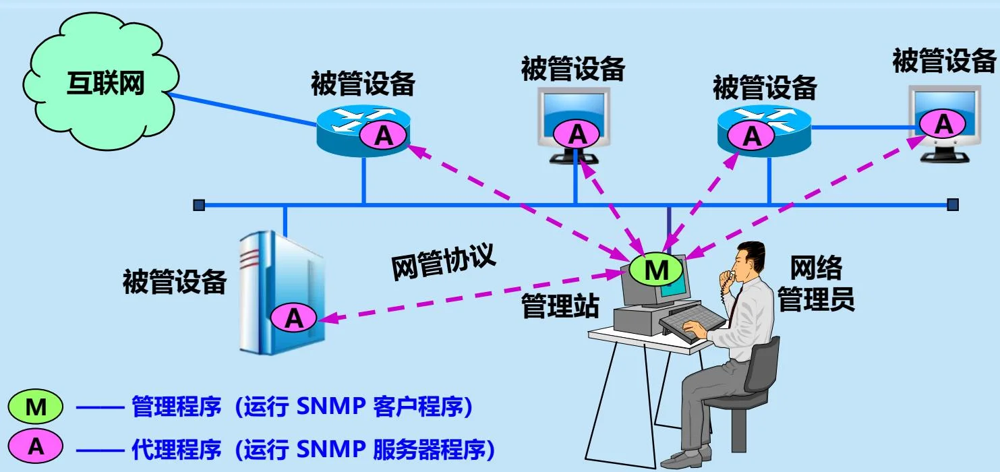
- 网络管理的主要构件
    - **管理者**（Manager）：管理站（硬件）或管理程序（软件）。大型网络往往实行**多级管理**，因而有多个管理者，而一个管理者一般只管理本地网络的设备。
        - **管理站**/**网络运行中心** NOC（Network Operations Center）：运行管理程序的计算机，是网络管理系统的核心。
        - **管理程序**：运行在管理站中的关键构件，在运行时成为管理进程。
    - **网络管理员**（Administrator）：负责网络管理的人员。
    - **被管设备**（Managed Device）：网络中被管理的各种硬件设备，有时可称为**网络元素或网元**。
        - **被管对象**（Managed Object）：网络中被管理的各种资源。
            - 网络的每一个被管设备（包括设备中的软件）中可能有多个被管对象。
            - 在被管设备中也会有一些不能被管的对象。
        - **网络管理代理程序**/**代理**（Agent）：运行在被管设备中的程序。
            - 在每一个被管设备中都要运行一个程序，以便和管理站中的管理程序进行通信。
            - 代理程序在管理程序的命令和控制下在被管设备上采取本地的行动。
    - **网络管理协议**/**网管协议**（Network Management Protocol）：管理程序和代理程序之间进行通信的规则。
        - 网络管理员利用网络管理协议，通过管理站对网络中的被管设备进行管理。
        - **网管协议本身不管理网络**。
- 网络管理的基本原理：若要管理某个对象，就必然会给该对象添加一些软件或硬件，但这种“添加”必须对原有对象的影响尽量小些。
    - 最重要的指导思想：**尽可能简单**。

### 简单网络管理协议 SNMP
- **简单网络管理协议** SNMP（Simple Network Management Protocol）：是一种用于网络管理的应用层协议，其中的管理程序和代理程序按**客户服务器方式**工作，采用 **UDP** 进行通信。
    - 代理程序运行 SNMP 服务器程序，使用 UDP 熟知端口 161 接收来自管理程序的请求或命令，返回响应或执行某个动作。
    - 管理程序运行 SNMP 客户程序，向某个代理程序发出请求或命令，使用 UDP 熟知端口 162 接收来自代理程序的响应。
    - 在网管系统中，往往是一个（或少数几个）客户程序与很多的服务器程序进行交互。
- SNMP 的基本功能：
    1. 监视网络性能
    2. 检测分析网络差错
    3. 配置网络设备等
- SNMP 的管理站和委托代理
    - **管理站**：
        - 运行 SNMP 客户程序的计算机。
        - 管理站通过 SNMP 与被管设备中的代理程序进行通信。
    - **委托代理**（proxy agent）：运行在管理站中的程序，用于解决网络元素使用另一种网络管理协议时的兼容问题。
        - 委托代理充当管理站和被管设备之间的中介。
        - 委托代理能提供协议转换和过滤操作等功能，对被管对象进行管理。
    - 示意图：
        
- SNMP 网络管理组成
    1. **SNMP 本身**
        - SNMP 定义了管理站和代理之间所交换的**分组格式**：所交换的分组包含各代理中的对象（变量）名及其状态（值）。
        - SNMP 负责读取和改变这些数值。
    2. **管理信息结构** SMI（Structure of Management Information）
        - SMI 定义了命名对象、定义对象类型、对对象及其值进行编码的**通用规则**：确保网络管理数据的语法和语义的**无二义性**。
        - SMI 并不定义一个实体应管理的对象数目，也不定义被管对象名以及对象名及其值之间的关联，而是为这些定义提供了一个框架。
    3. **管理信息库** MIB（Management Information Base）
        - MIB 在被管理的实体中创建了命名对象，并规定了其类型。
        - 管理程序使用 MIB 中的信息，对网络进行管理。
        - 示意图：
            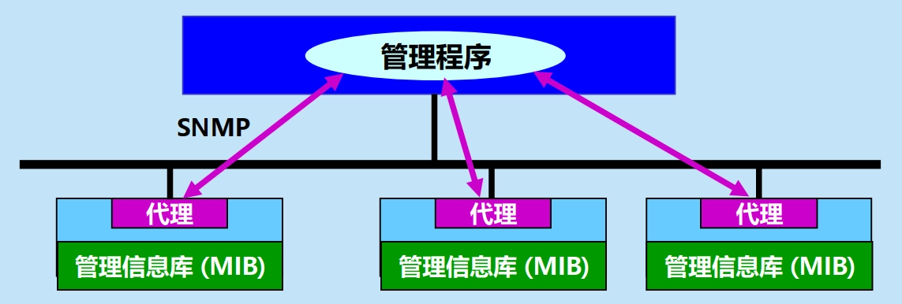

### 管理信息结构 SMI
-  SMI 规定了管理信息的**命名规则**、**数据类型**和**编码规则**，主要解决以下三个问题：
    1. 被管对象应怎样命名
    2. 用来存储被管对象的数据类型有哪些
    3. 在网络上传送的管理数据应如何编码

#### SMI 命名规则
- 所有被管对象必须在命名树上：
    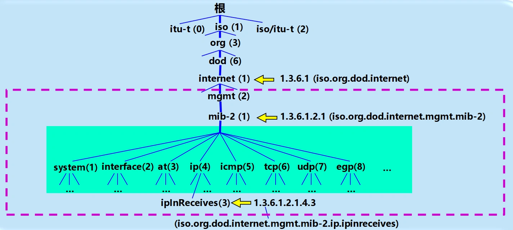
- SMI 使用 ASN.1 标准来定义命名规则：
    - SMI 标准指明：所有的 MIB 变量必须使用**抽象语法记法 1**（ASN.1）来定义。
    - SMI 既是 ASN.1 的子集，又是 ASN.1 的超集。
    - ASN.1 的记法很严格，使得数据的含义不存在任何可能的二义性。

#### SMI 数据类型
1. 简单类型：
    - INTERGER：任意长度整数。
    - BIT STRING：0 位或多位组成的二进制串。
    - OCTET STRING：0 位或多位组成的字节串。
    - NULL：空值。
    - OBJECT IDENTIFIER：定义的数据类型。
2. 结构化类型：
    - SEQUENCE：由多个数据类型按序组成的值。
    - SEQUENCE OF：由同一数据类型按序组成的值。
    - CHOICE：可以从多个数据类型中选择一个。
    - ANY：任何数据类型。

#### SMI 编码规则
- SMI 使用 ASN.1 制定的 BER 进行数据的编码。
- **基本编码规则** BER（Basic Encoding Rules）：ASN.1 标准定义的编码规则之一，规定了如何将 ASN.1 所定义的数据类型进行编码，指明了每种数据类型中每个数据的值的表示。
    - 发送端用 BER **编码**，可将用 ASN.1 所表述的报文转换成唯一的比特序列。
    - 接收端用 BER **解码**，得到该比特序列所表示的 ASN.1 报文。
- BER 的编码方法：**TLV**（Type-Length-Value）
    - **编码格式**：类型 T - 长度 L - 值 V
    - T 字段：定义数据的类型。
        - 长度：1 字节
        - 组成：类别 2 位 - 格式 1 位 - 编号 5 位
            
    - L 字段：定义 V 字段的长度。
        - 长度：可变
            - 单字节 L 字段：指出 V 字段的长度（0 到 127 字节）。
            - 多字节 L 字段：首字节指出后续字节数 $n$（1 到 126 字节），后续 $n$ 个字节表示 V 字段的长度。
    - V 字段：定义数据的值。
        - 长度：可变
            
        - TLV 中的 V 字段可嵌套其他数据元素的 TLV 字段
    - 示例：
        1. INTEGER = `15`，其 T 字段是 02，INTEGER 类型要用 4 字节编码。最后得出 TLV 编码为 `02 04 0000000F`。
        2. IPAddress = `192.1.2.3`，其 T 字段是 40，V 字段需要 4 字节表示，因此得出 TLV编码是 `40 04 C0010203`。

### 管理信息库 MIB
- **管理信息库** MIB（Management Information Base）：**被管对象**维持的可供管理程序读写的若干控制和状态信息的集合。
    - 管理程序使用 MIB 中这些信息的**值**对网络进行管理（如读取或重新设置这些值）。
    - **只有在 MIB 中的对象才是 SNMP 所能够管理的**。
- 示例：
    

    - 节点 mib-2：表示互联网管理信息库的根节点。包含多个信息类别，如：
        1. system：操作系统
        2. interfaces：网络接口
        3. address translation：地址转换
        4. ip：IP 协议
        5. icmp：ICMP 协议
        6. tcp：TCP 协议
        7. udp：UDP 协议
        8. egp：EGP 协议
        9. ……
    - mib 变量示例：
        - sysUpTime：属于 system 类别，表示系统运行时间。
        - ifNumber：属于 interfaces 类别，表示网络接口的数目。
        - ipInReceives：属于 ip 类别，表示接收到的 IP 数据报
        - ……

### SNMP 的工作原理
- SNMP 的操作只有两种基本的管理功能：
    1. **读操作**，用 get 报文来检测各被管对象的状况；
    2. **写操作**，用 set 报文来改变各被管对象的状况。
- **探询机制**（polling）
    - 定义：管理程序定时向被管理设备**周期性**地发送**探询信息**，以获取被管对象的状态信息。
    - 优点：
        1. 可使系统相对简单。
        2. 能限制通过网络所产生的管理信息的通信量。
    - 缺点：
        1. 不够灵活，而且所能管理的设备数目不能太多。
        2. 开销也较大。
- **陷阱机制**（trap）
    - 定义：当被管对象发生某些特殊事件时，代理程序可以不经询问就主动向管理进程发送**陷阱报文**（trap），以通知管理进程这些事件的发生。
        - 当被管对象的代理检测到有事件发生时，就检查其门限值。
        - 代理只向管理进程报告达到某些门限值的事件（即**过滤**）。
    - 过滤的好处：
        1. 仅在严重事件发生时才发送陷阱。
        2. 陷阱信息很简单且所需字节数很少。
- SNMP 使用无连接的 UDP
    - 运行**代理程序的服务器端**用 UDP **熟知端口** 161 接收 get 或 set 报文，发送响应报文。与熟知端口通信的客户端使用临时端口。
    - 运行**管理程序的客户端**则使用 UDP **熟知端口** 162 来接收来自各代理的 trap 报文。

### SNMP 报文
#### SNMPv1 定义的协议数据单元（PDU）类型
| PDU 编号（T字段）| PDU 名称 | 用途 |
|------------------|----------|------|
| 0（A0）| GetRequest | 用来查询一个或一组变量的值 |
| 1（A1）| GetNextRequest | 允许在 MIB 树上读取下一个变量，此操作可反复进行 |
| 2（A2）| Reponse | 代理向管理者或管理者向管理者发送响应 |
| 3（A3）| SetRequest | 对一个或多个变量值进行设置 |
| 5（A5）| GetBulkRequest | 管理者从代理读取大数据块的值 |
| 6（A6）| InformRequest | 管理者从另一管理者读取代理的变量 |
| 7（A7）| SNMPv2Trap | 代理向管理者报告异常事件 |
| 8（A8）| Report | 管理者之间报告某些差错 |

#### SNMP 报文格式


#### Get-request 报文实例分析
- Get-request 报文 ASN.1 定义
    ```
    Get-request-PDU ::= [0]             // [0] 表示上下文类，编号为 0
    IMPLICIT SEQUENCE{                  // 类型是SEQUENCE
    request-id integer32，              // 变量 request-id 的类型是 integer32
    error-status INTEGER{0..18}，       // 变量 error-status 取值为 0 ~ 18 的整数
    error-index INTEGER{0..max-bindings}，// 变量 error-index取值为 0~ max-bindings 的整数
    variable-bindings VarBindList       // 变量 variable-binding 的类型是 VarBindList
    }
    ```
- Get-request 报文的 BER 编码
    
- Get-request 报文的十六进制编码
    ```
    A0 1D               // GetRequest-PDU，上下文类型，长度 1D_{16} = 29$
    02 04 05 AE 56 02   // INTEGER 类型，长度  04_{16}，request-id = 05 AE 56 02
    02 01 00            // INTEGER 类型，长度 01_{16}，error status = 00_{16}
    02 01 00            // INTEGER 类型，长度 01_{16}，error index = 00_{16}
    30 0F               // SEQUENCE OF 类型，长度 0F_{16} = 15
    30 0D               // SEQUENCE 类型，长度  0D_{16} = 13
    06 09 01 03 06 01 02 01 07 01 00 // OBJECT IDENTIFIER 类型，长度  09_{16} ，udplInDatagrams 
    05 00               // NULL 类型，长度  00_{16}$
    ```

## 应用进程跨越网络的通信
### 系统调用和应用编程接口
- 大多数操作系统使用**系统调用**（system call）的机制在应用程序和操作系统之间传递控制权。
    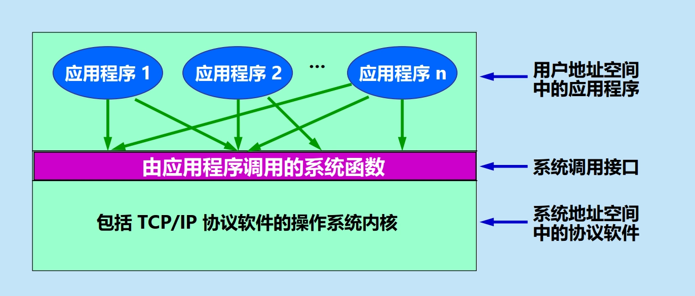
- **系统调用接口**：实际上就是应用进程的控制权和操作系统的控制权进行转换的一个接口。
- **应用编程接口** API（Application Programming Interface）：封装了系统调用接口的一组函数或例程的集合。
    - 作用：为应用程序员提供一组**函数调用**，以便应用程序员能够方便地使用操作系统所提供的服务，而不必了解系统调用接口的细节。
    - 几种应用编程接口 API
        - **套接字接口**（socket interface）：Berkeley UNIX 操作系统定义的 API。
        - **Windows Socket**：微软公司在其操作系统中，采用套接字接口 API 形成的一个稍有不同的 API。
        - **TLI**（Transport Layer Interface）：AT&T 为其 UNIX 系统 V 定义的 API。
    - 应用进程通过套接字接入到网络
        
    - 套接字的作用
        - 当应用进程需要使用网络进行通信时就发出系统调用，请求操作系统为其**创建套接字**，以便把网络通信所需要的系统资源分配给该应用进程。
        - 操作系统为这些资源的总和用一个**套接字描述符**的号码来表示。
        - 应用进程所进行的网络操作都必须使用这个套接字描述符。
        - 通信完毕后，应用进程通过一个**关闭套接字的系统调用**通知操作系统**回收**与该套接字描述符相关的所有资源。
    - 调用 socket 创建套接字
        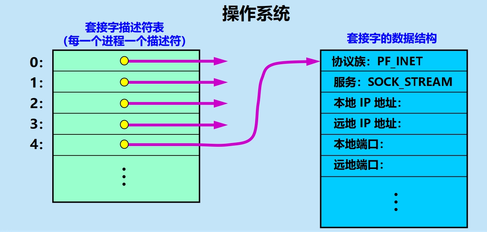

### 基于 TCP/IP 的应用进程通信
- 当应用进程需要使用网络进行通信时，就发出系统调用。
    - 只需使用 TCP/IP 的 API（即套接字接口），就可以实现网络通信或开发基于互联网的应用程序，而不用了解 TCP/IP 协议的细节。
    - 调用 API 时，用户可以使用 TCP 服务，也可以使用 UDP 等其他服务。
- 使用 TCP 服务时，应用进程通常要经历三个阶段：
    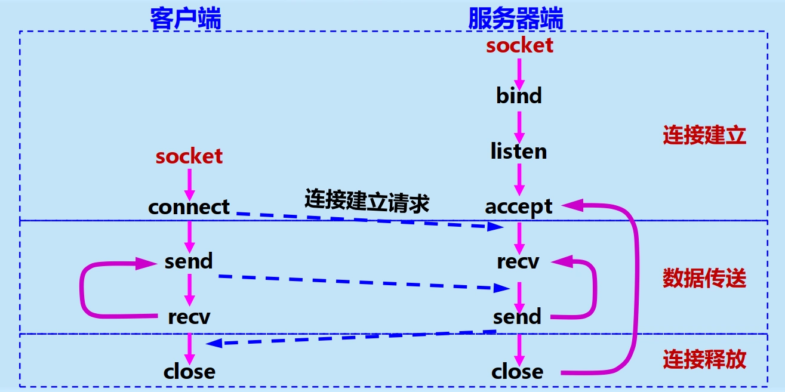

    1. **连接建立阶段**
        1. 通信之前，**客户和服务器**先创建套接字
        2. **服务器端**调用 bind（绑定），把熟知端口号和本地 IP 地址填写到已创建的套接字中。
        3. **服务器端**调用 listen（收听），把套接字设置为被动方式，以便随时接受客户的服务请求。
        4. **服务器端**调用 accept（接受），以便把远地客户进程发来的连接请求提取出来。
            - 调用 accept 要完成的动作较多。这是因为一个服务器必须能够同时处理多个连接。这样的服务器常称为并发方式（concurrent）工作的服务器。
            - 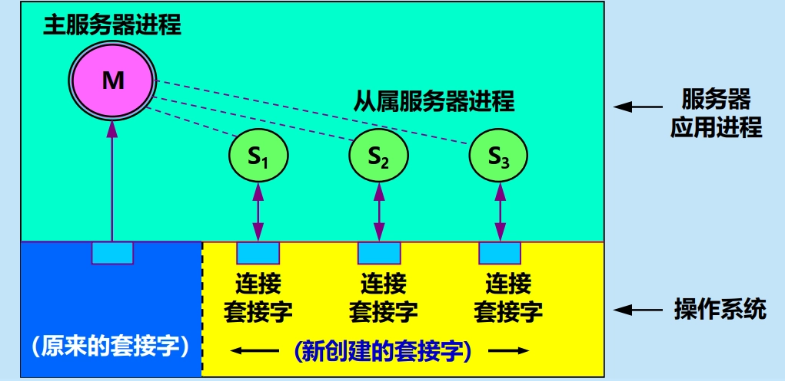
        5. **客户进程**调用 connect，以便和远地服务器建立连接（这就是主动打开）。
    2. **数据传送阶段**
        - 客户和服务器在 TCP 连接上使用 send 传送数据，使用 recv 接收数据。
    3. **连接释放阶段**
        - 客户或服务器通信结束，调用 close 释放连接和撤销套接字。
- 使用 UDP 服务时，应用进程通常也要经历上述三个阶段，区别在于：UDP 服务器不使用 listen 和 accept 系统调用。

## P2P 应用
- P2P 工作方式概述：在 P2P 工作方式下，所有的音频/视频文件都是**在普通的互联网用户之间传输**的。
    - 每一个用户既是**客户**，也是**服务器**。
    - 用户既可以向其他用户请求文件，也可以把自己拥有的文件提供给其他用户下载。

### P2P 工作方式的发展
#### 集中目录服务器
- Napster：
    - 第一代 P2P 文件共享程序，最早使用 P2P 技术，采用**集中式目录服务器**的方法定位内容。
    - 提供免费下载 MP3 音乐，将所有音乐文件的索引信息都集中存放在 Napster 目录服务器中。
    - 使用者只要查找目录服务器，就可知道应从何处下载所要的 MP3 文件。
    - 用户要及时向 Napster 的目录服务器报告自己存有的音乐文件。
- Napster 的**文件传输是分散的，文件定位则是集中的**。
    - 文件传输：P2P 方式
    - 文件定位：客户服务器方式
- Napster 的工作过程
    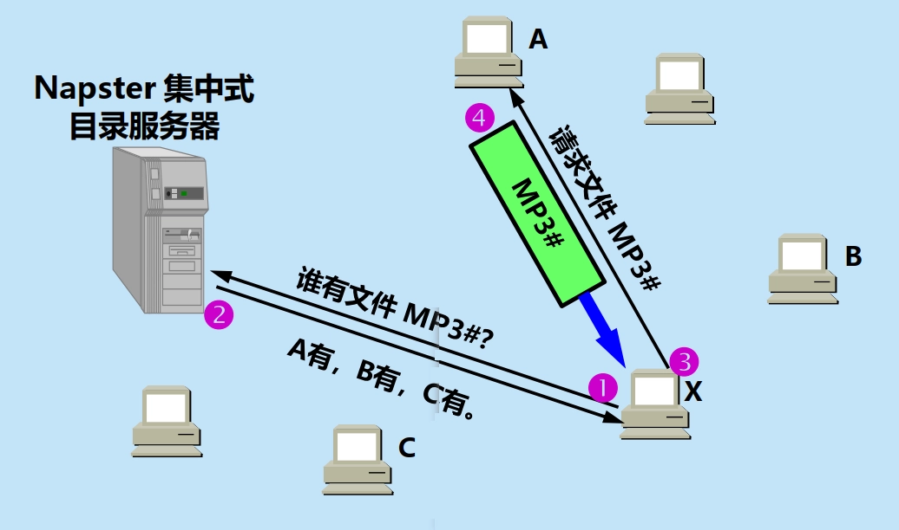

    1. 用户 X 采用客户服务器方式向 Napster 目录服务器查询谁有音乐文件 MP3#。
    2. Napster 目录服务器回答 X 有 MP3# 的 A、B、C 的 IP 地址。
    3. 用户 X 可以随机地选择三个地点中的任一个。假定 X 向 A 发送下载文件 MP3# 的请求报文，双方都使用 P2P 方式通信。
    4. 对等方 A（现在作为服务器）把文件 MP3# 发送给 X。
- 集中式目录服务器的缺点：
    - 可靠性差
    - 会成为性能的瓶颈

#### 全分布式结构
- Gnutella：
    - 第二代 P2P 文件共享程序，采用**全分布**的方法定位内容。
- Gnutella 与 Napster 最大的区别：不使用集中式的目录服务器，而是使用**洪泛法**在大量 Gnutella 用户之间进行查询。
    - 为了不使查询的通信量过大，Gnutella 设计了一种**有限范围的洪泛查询**，减少了倾注到互联网的查询流量，但也影响到查询定位的准确性。

#### 分散定位和分散传输技术
- 第三代 P2P 文件共享程序采用**分散定位和分散传输技术**。
- 典型程序：KaZaA，电骡 eMule，比特洪流 BT（Bit Torrent）等。
- BT 的基本概念：
    - **对等方**（peer）：参与文件共享的主机。
    - **相邻对等方**（neighboring peers）：与 A 建立了 TCP 连接的对等方。
    - **洪流**（torrent）：所有对等方的集合。
    - **文件块**（chunk）；下载文件的数据单元，长度固定。
    - **追踪器**（tracker）：集中式目录服务器，维护洪流中所有对等方的 IP 地址，是基础设施节点。
- BT 的主要特点：
    - 相邻关系是逻辑的，对等方的数目是动态变化的
        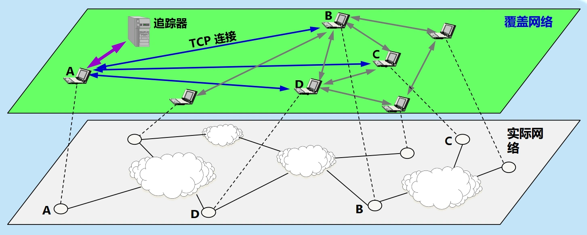
    - 对等方之间互相传送文件数据块
        
- BT 协议
    - 请求：**最稀有的优先**（rarest first），首先向其相邻对等方请求**稀有**的文件块。
        - **稀有**：如果 A 所缺少的文件块在相邻对等方中的副本很少，则该文件块稀有。
    - 发送：**最高数据率优先**（highest data rate first），优先把文件块传送给**传送数据率最高**的相邻对等方。

### P2P 文件分发的分析
- 基本概念
    - 下载（download）：从互联网传送数据到主机
    - 上传（upload）/上载：从主机传送数据到互联网
- 有 $N$ 台主机从服务器下载一个大文件，其长度为 $F~bit$。假定主机与互联网连接的链路的上传速率和下载速率分别为 $u_{i}$ 和 $d_{i}$，单位都是 $bit/s$。服务器的上传速率为 $u_{s}~bit/s$。
    - 示意图：
        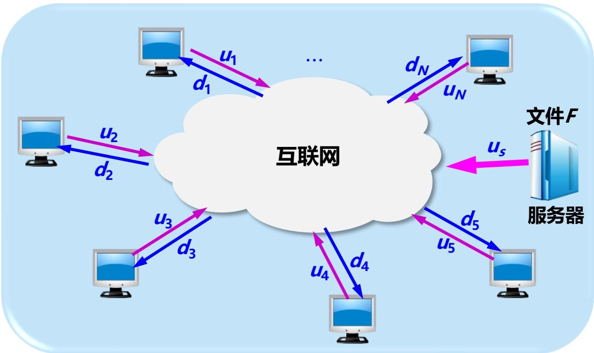
    - **客户服务器**方式下分发的最短时间分析
        - 从服务器端考虑，所有主机分发完毕的最短时间 $T_{cs} \geq NF/u_{s}$
        - 下载速率最慢的主机的下载速率为  $d_{\min}$ ，则  $T_{cs} \geq F/d_{\min}$
        - 由此可得出所有主机都下载完文件 $F$ 的最少时间是：
            $$
            T_{cs} = \max(NF/u_{s},F/d_{\min})
            $$
    - **P2P** 方式下分发的最短时间分析
        - 初始服务器文件分发的最少时间 $T_{p2p} \geq F/u_{s}$
        - 下载文件分发的最少时间 $T_{p2p} \geq F/d_{\min}$
        - 上载文件分发的最少时间 $T_{p2p} \geq NF/u_{T}$ ，其中上传速率之和 $u_{T} = \sum_{i=1}^{N}u_{i}$
        - 所有主机都下载完文件 $F$ 的最少时间的下限是：
            $$
            T_{p2p} \geq \max(F/u_{s},F/d_{\min},NF/u_{T})
            $$
    - 时间比较
        - 设所有的对等方的上传速率都是  $u$ ，并且 $F/u = 1~h$，服务器的上传速率 $u_{s} = 10u$。
        - 当 $N = 30$ 时
            $$
            \begin{aligned}
            T_{cs} & = \max(3F/u,F/d_{\min}) \geq 3~h \\
            T_{p2p} & \geq \max(0.1F/u,F/d_{\min},F/u) \geq 1~h
            \end{aligned}
            $$

### 在 P2P 对等方中搜索对象
- 集中式目录服务器
- 全分布式，在非结构化的覆盖网络中采用洪泛查询
- **分布式散列表/分布式哈希表** DHT（Distributed Hash Table）
    - 现在广泛使用的索引和查找技术。
    - 由大量对等方共同维护。
    - 广泛使用的 **Chord** 算法是美国麻省理工大学于 2001 年提出的。
- **基于 DHT 的 Chord 环**
    - 基本思想：
        - 分布式散列表 DHT 利用散列函数，把资源名 K 及其存放的结点 IP 地址 N 都分别映射为**资源名标识符** KID 和**结点标识符** NID。
        - Chord 把结点按标识符数值**从小到大**沿顺时针排列成一个**环形覆盖网络**。
        - 每个资源由 **Chord 环上与其标识符值最接近的下一个结点**提供服务。
    - 示例
        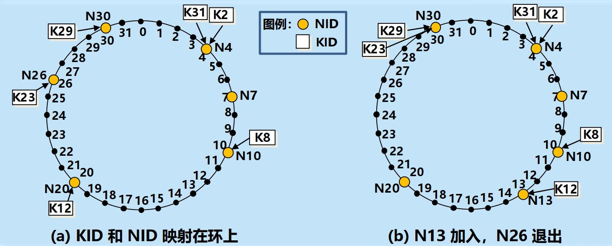
- **通过指针表加速 Chord 表查找**
    - 为了加速查找，在 Chord 环上可以增加一些**指针表**（finger table），又称为路由表或查找器表。
        - 指针表分为两列：第一列是结点标识符 NID，第二列是后继结点的标识符 NID。
        - 每个结点 N 的指针表有 $m$ 行，第 $i$ 行存放的后继结点是 $(N + 2^{i - 1})~mod~2^{m}$。
    - 示例：对于结点 N4，其指针表的第 2 列第  $i$  行根据  $(N4 + 2^{i - 1})$  计算得出其后继结点。
        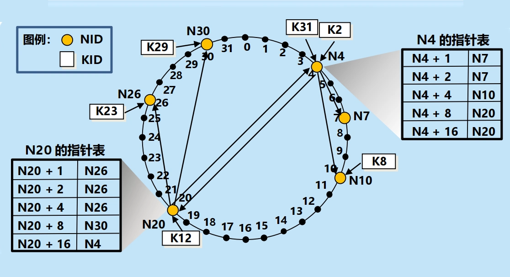

        - N4+1=5，要找第一个大于等于 5 的节点：N7
        - N4+2=6，要找第一个大于等于 6 的节点：N7
        - N4+4=8，要找第一个大于等于 8 的节点：N10
        - N4+8=12，要找第一个大于等于 12 的节点：N20
        - N4+16=20，要找第一个大于等于 20 的节点：N20

# 无线网络和移动网络
## 无线局域网 WLAN
### 无线局域网的组成
- 无线局域网 WLAN（Wireless Local Area Network）：
    - 定义：采用无线通信技术的局域网。
    - 特点：
        1. 提供了移动接入的功能
        2. 节省投资，建网速度较快
        3. 支持便携设备联网
    - 分类：
        - 有固定基础设施的 WLAN
        - 无固定基础设施的 WLAN
            - 所谓“固定基础设施”是指预先建立起来的、能够覆盖一定地理范围的一批固定基站。
- 便携站和移动站
    - 便携站：便于移动，但在工作时，其位置是固定不变的。
    - 移动站：不仅能够移动，还可以在移动的过程中进行通信。

#### IEEE 802.11
- IEEE 802.11 是一个**有固定基础设施**的无线局域网的国际标准。
    1. 使用星形拓扑，中心叫做**接入点** AP（Access Point）。
        - AP 是无线局域网的基础设施，也是一个**链路层**的设备。
        - AP 也叫做无线接入点 WAP（Wireless Access Point）。
        - 无线局域网中的站点对网内或网外的通信都必须通过 AP。
    2. 在 MAC 层使用 CSMA/CA 协议
- 凡使用 802.11 系列协议的局域网又称为 Wi-Fi。

##### 服务集（service set）
- 示意图
    
- **基本服务集** BSS
    - 定义：基本服务集 BSS（Basic Service Set）是无线局域网的最小构件。
    - 组成：一个接入点 AP 和若干个移动站。
        - 必须为该 AP 分配一个不超过 32 字节的服务集标识符 SSID 和一个通信信道。
            - **服务集标识符 SSID**（Service Set Identifier）：即该 AP 的无线局域网的名字
            - **信道**（channel）：无线局域网通常使用 2.4 GHz 和 5 GHz 频段。每一个频段划分为若干个信道，供各无线局域网使用。
                - 802.11b 使用 2.4 GHz 频段，带宽约 85 MHz。定义了 11 个部分重叠的信道集。相邻信道的中心频率相差 5 MHz，每个信道的带宽约为 22 MHz。
                    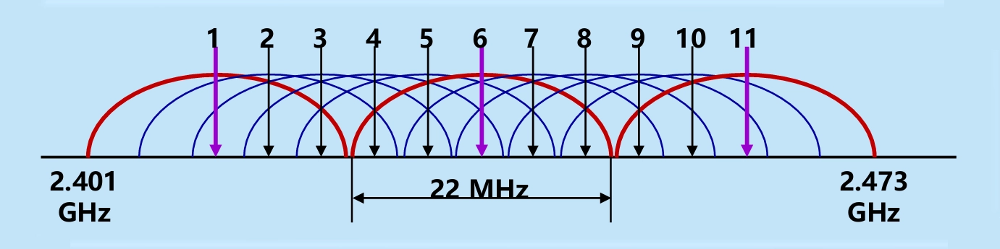
    - **基本服务集标识符** BSSID：BSS 的标识符，一般就是 AP 的 MAC 地址，每个 AP 唯一。
        - 在无线局域网中传送的各种帧的首部中，都必须有 BSSID 字段，以标识该帧所属的 BSS。
        - 用户通常都知道所连接的无线局域网 SSID，但可以不知道其 BSSID。
    - 一个 BSS 所覆盖的地理范围叫做一个**基本服务区** BSA（Basic Service Area）。
        - BSS 的服务范围是由 AP 所发射的电磁波的辐射范围确定的。
- **扩展服务集** ESS
    - 定义：扩展服务集 ESS（Extended Service Set）是由两个或两个以上的基本服务集 BSS 通过有线或无线的分配系统 DS（Distribution System）连接而成的更大的无线局域网。
    - 组成：多个 BSS 和一个 DS。
    - **扩展服务集标识符** ESSID：ESS 的标识符，不超过 32 字符的字符串名字（**不是地址**）
    - DS 的作用：使 ESS 对上层的表现就像一个 BSS 一样。
        - DS 可以使用以太网（最常用）、点对点链路或其他无线网络。
    - ESS 还可为无线用户提供到 802.x 局域网（非 802.11 无线局域网）的接入：通过门户（Portal）设备实现，相当于一个网桥。
- 移动站 $A$ 如果要和另一个 BSS 中的移动站 $B$ 通信，就必须经过两个接入点 $AP_1$ 和 $AP_2$，即 $A \to AP_1 \to AP_2 \to B$。
    - 移动站 $A$ 漫游到位置 $A_{1}$  时，选择和信号较强的一个 AP 联系。当漫游到位置 $A_{2}$ 时，就只能和  $AP_{2}$  联系了。
    - 移动站 $A$ 只要能够和其中一个 AP 联系上，就可以一直保持与另一个移动站 $B$ 的通信。

##### 关联（association）
- 定义：**关联**（association）是指移动站和某个接入点 AP 之间建立的一种逻辑连接，表示这个移动站加入了选定的 AP 所属的子网，并和这个 AP 之间创建了一个虚拟线路。
    - 只有关联的 AP 才能向这个移动站发送数据帧，而这个移动站也只有通过关联的 AP 才能向其他站点发送数据帧。
- 建立关联的两种方法：
    1. **被动扫描**
        - 示意图：
            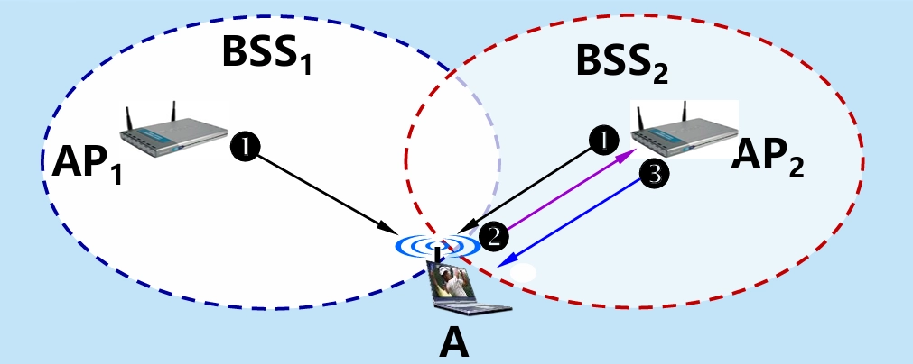
        - 过程：
            1. AP 周期性发出**信标帧**（beacon frame），其中包含 SSID、速率等系统参数。
            2. 移动站 $A$ 扫描 11 个信道，选择加入到 $AP_2$ 所在的基本服务集 $BSS_2$ ，向 $AP_2$ 发送**关联请求帧**（Association Request frame）。 
            3. $AP_2$  同意移动站 $A$ 发来的关联请求，向移动站 $A$ 发送**关联响应帧**（Association Response frame），与移动站 $A$ 建立关联。
    2. **主动扫描**
        - 示意图：
            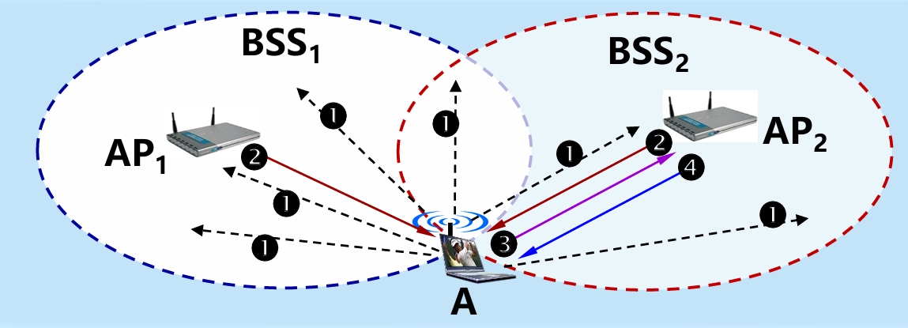
        - 过程：
            1. 移动站 $A$ 主动发出广播的**探测请求帧**（Probe Request frame），让所有能够收到此帧的接入点知道有移动站要求建立关联。
            2. 两个 AP 都回答**探测响应帧**（Probe Response frame）。
            3. 移动站 $A$ 向 $AP_{2}$ 发出**关联请求帧**。
            4. $AP_{2}$ 向移动站 $A$ 发送**关联响应帧**，与移动站 $A$ 建立关联。
    - 一个移动站可以同时进行主动扫描和被动扫描。
- 重建关联（reassociation） 和分离（dissociation）
    - 移动站使用重建关联（reassociation）服务，可把这种关联转移到另一个接入点。
    - 当使用分离（dissociation） 服务时，可终止这种关联。
- 安全地建立关联
    - 用户在和附近的接入点 AP 建立关联时，一般还要键入用户密码。
    - 加密方案
        - 初期：有线等效的保密 WEP（Wired Equivalent Privacy）。
        - 现在：无线局域网受保护的接入 WPA（WiFi Protected Access） 或 WPA2。

#### 移动自组网络/自组网络（ad hoc network）
- 移动自组网络（Mobile Ad Hoc Network，MANET）
    - 定义：没有固定基础设施（即没有 AP）的无线局域网。
    - 示意图：
        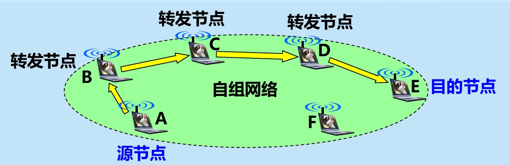
    - 三个主要问题：路由选择协议，多播，安全。
    - 特点：
        - 移动站都处于平等状态。
        - 服务范围通常是受限的，一般不和外界的其他网络相连接。
        - 移动自组网络也就是移动分组无线网络。
    - 优点：
        - 方便灵活。
        - 生存性非常好。
- **无线传感器网络** WSN（Wireless Sensor Network）
    - 定义：由大量传感器结点通过无线通信技术构成的自组网络。
    - 应用：进行各种数据的采集、处理和传输。
    - 特点：
        1. 不需要很高的带宽，但大部分时间必须保持低功耗。
        2. 对协议栈的大小有严格的限制。
        3. 对网络安全性、结点自动配置、网络动态重组等方面有一定的要求。
    - 无线传感器网络主要的应用领域：组成各种**物联网** IoT（Internet of Things）
- 移动自组网络与移动 IP 的区别
    - 移动 IP
        - 漫游的主机可以用多种方式连接到互联网。
        - 漫游的主机可以直接或通过无线链路连接到固定网络上的另一个子网。
        - 需要地址管理和增加协议的互操作性。
        - 核心网络功能仍然是各种路由选择协议。
    - 移动自组网络
        - 把移动性扩展到无线领域中的自治系统。
        - 具有自己特定的路由选择协议，并且可以不和互联网相连。
        - 即使和互联网相连时，移动自组网络也是以末梢网络（stub network）方式工作。
        - 末梢网络：不允许外部通信量穿越该网络。
- 接入方式的分类
    - **固定接入**（fixed access）： 在作为网络用户期间，用户设置的地理位置保持不变。
    - **移动接入**（mobility access）： 用户设置能够以车辆速度移动时进行网络通信。当发生切换时，通信仍然是连续的。
    - **便携接入**（portable access）： 在受限的网络覆盖面积中，用户设备能够在以步行速度移动时进行网络通信，提供有限的切换能力。
    - **游牧接入**（nomadic access）： 用户设备的地理位置至少在进行网络通信时保持不变。如用户设备移动了位置，则再次进行通信时可能还要寻找最佳的基站。

### 802.11 局域网的物理层
- 802.11 标准中物理层相当复杂。根据物理层的不同（如工作频段、数据率、调制方法等），对应的标准也不同。

    | 标准          | 别名   | 频段        | 最高数据率   | 物理层      | 优缺点                                      |
    | ------------- | ------ | ----------- | ------------ | ----------- | ----------------------------------------- |
    | 802.11b（1999年） | Wi-Fi 1 | 2.4 GHz     | 11 Mbit/s    | 扩频        | 最高数据率较低，价格最低，信号传播距离最远，且不易受阻碍 |
    | 802.11a（1999年） | Wi-Fi 2 | 5 GHz       | 54 Mbit/s    | OFDM        | 最高数据率较高，支持更多用户同时上网，价格最高，信号传播距离较短，且易受阻碍。 |
    | 802.11g（2003年） | Wi-Fi 3 | 2.4 GHz     | 54 Mbit/s    | OFDM        | 最高数据率较高，支持更多用户同时上网，信号传播距离最远，且不易受阻碍，价格比 802.11b 贵。 |
    | 802.11n（2009年） | Wi-Fi 4 | 2.4 / 5 GHz | 600 Mbit/s   | MIMO OFDM   | 使用多个发射和接收天线达到更高的数据传输率，当使用双倍带宽（40 MHz）时速率可达 600 Mbit/s。 |
    | 802.11ac（2014年） | Wi-Fi 5 | 5 GHz       | 7 Gbit/s     | MIMO OFDM   | 完全遵循 802.11i 安全标准的所有内容，使得无线连接能够在安全性方面达到企业级用户的需求。 |
    | 802.11ax（2019年） | Wi-Fi 6 | 2.4 / 5 GHz | 9.6 Gbit/s   | MIMO OFDM   | 侧重解决密集环境下（如火车站、机场）提高吞吐量密度（即单位面积的吞吐量） |
- 802.11 的物理层的几种实现方法
    1. 扩频
    2. 多入多出 MIMO（Multiple Input Multiple Output）
    3. 正交频分复用 OFDM（Orthogonal Frequency Division Multiplexing）
    4. 跳频扩频 FHSS（已很少用）
    5. 红外线 IR（已很少用）

#### CSMA/CA 协议
- 背景
    - 无线局域网不能简单地搬用 CSMA/CD 协议，这是因为：
        1. 碰撞检测（CD）要求：一个站点在发送本站数据的同时，还必须不间断地检测信道，但接收到的信号强度往往会远远小于发送信号的强度，在无线局域网的设备中要实现这种功能就**花费过大**。
        2. 即使能够实现碰撞检测的功能，并且在发送数据时检测到信道是空闲的时候，在接收端仍然有**可能发生碰撞**。
    - 必须考虑的特点
        1. 无线局域网的适配器无法实现碰撞检测；
        2. 检测到信道空闲，其实信道可能并不空闲；
        3. 即使能够在硬件上实现无线局域网的碰撞检测功能，也无法检测出隐蔽站问题带来的碰撞。
            - **隐蔽站问题**（hidden station problem）： 由于无线信号覆盖范围和穿透能力有限，A 和 C 检测不到彼此的无线信号，都以为 B 是空闲的，因而都向 B 发送数据，结果发生碰撞。
                
- **CSMA/CA 协议**：
    - **载波监听** CS（Carrier Sense）：终端发送数据前，通过两种方式检测信道是否空闲：
        - **物理载波监听**（PHY Layer CS）：在物理层用硬件实现，检测无线信道的信号能量，若能量高于阈值（如 -85 dBm），判定信道忙；否则为空闲。
        - **虚拟载波监听**（Virtual CS）：通过软件实现，使用**网络分配向量**（NAV，Network Allocation Vector）告知其他终端信道占用状态。发送方会在帧头部携带表示信道将被占用的时间（DATA + SIFS + ACK，单位为微秒）的 NAV 值，其他终端接收后更新本地 NAV，在 NAV 倒计时结束前视为信道忙，无需物理监听即可避免冲突。
    - **碰撞避免** CA（Collision Avoidance）：无线信道无法像有线信道那样检测冲突（冲突检测 CD 不可行），因此 DCF 用 “随机退避” 替代 “冲突检测”，核心流程如下：
        - **空闲信道检测**：终端监听信道，若信道空闲且持续时间大于等于分布式帧间间隔（DIFS，Distributed Inter-Frame Space），则可尝试发送数据。
        - **忙信道退避**：若信道忙，终端记录信道忙的时间，待信道空闲后，不立即发送，而是启动 “随机退避计时器”
    - **退避机制**：退避计时器的初始值从竞争窗口 CW（Contention Window）中随机选取，CW 的初始最小值为 $CW_{\min}$（802.11b/g 为 31，802.11n/ac/ax 可动态调整）；退避过程中若信道再次变忙，退避计时器暂停，待信道空闲后继续倒计时；退避计时器倒计时结束，终端立即发送数据；
    - **重传机制**：若发送方未在规定时间内收到接收方的确认帧（ACK），则判定传输失败，启动重传流程：将 CW 近似加倍（$CW =\min(CW\times 2+1,CW_{\max})$，$CW_{\max}=1023$），然后重新执行退避与发送，直至重传次数达到上限（通常为 7 次）
    - 使用 CSMA/CA 的同时，使用**停止等待协议**：链路层确认，解决碰撞后重传。
- CSMA/CA 协议的要点
    
- 802.11 的 MAC 层通过**协调功能**来确定在基本服务集 BSS 中的移动站何时可以发送或接收数据。包括两个子层：
    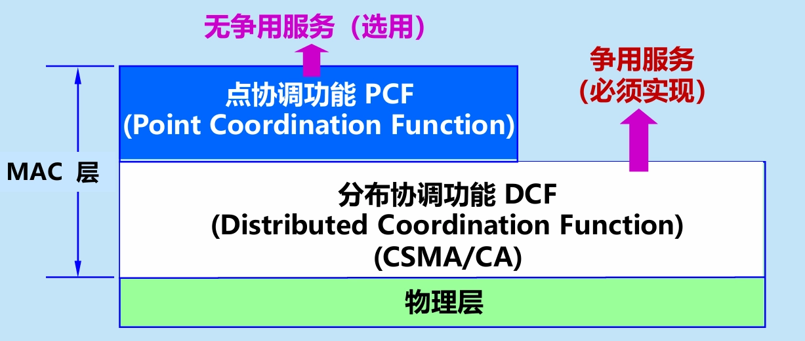

    1. **分布协调功能** DCF（Distributed Coordination Function）
        - DCF 子层：不采用任何中心控制。每个节点使用 CSMA/CA 机制的分布式接入算法，让各个站通过争用信道来获取发送权。
        - 因此 DCF 向上提供**争用服务**。
        - **所有实现都必须有 DCF 功能**。
    2. **点协调功能** PCF（Point Coordination Function）
        - PCF子层：可选。使用集中控制的接入算法，用类似于探询的方法把发送数据权轮流交给各个站，从而避免碰撞。
        - 自组网络没有 PCF 子层。
        - 对时间敏感的业务，如分组话音，应使用提供无争用服务的 PCF。

#### 帧间间隔
- **帧间间隔** IFS（InterFrame Space）
    - 定义：在完成发送后，必须再等待一段很短的时间（继续监听）才能发送下一帧。
    - 两种常用的帧间间隔：
        - 短帧间间隔 SIFS
        - 分布协调功能帧间间隔 DIFS
- **短帧间间隔** SIFS
    - 定义：最短的帧间间隔，用来分隔属于一次对话的各帧。一个站应当能够在这段时间内从发送方式切换到接收方式。
    - 使用 SIFS 的帧类型：
        - ACK 帧
        - CTS 帧
        - 由过长的 MAC 帧分片后的数据帧
        - 所有回答 AP 探测请求帧
        - 在 PCF 方式中接入点 AP 发送出的任何帧
- **分布协调功能帧间间隔** DIFS
    - 定义：比 SIFS 的帧间间隔要长得多。在 DCF 方式中，DIFS 用来发送数据帧和管理帧。
    - 802.11 标准规定：凡在空闲时间想发送数据的站点，必须等待时间 DIFS 后才能发送。保证了确认帧 ACK 得以优先发送。
- 示意图：
    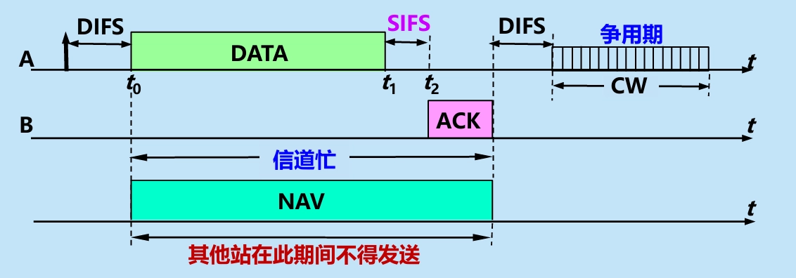

    - A 监听信道。若信道在时间间隔 DIFS 一直都是空闲的，A 就可以在 $t_0$ 时间发送数据帧 DATA。
    - B 收到数据帧后，必须进行 CRC 检验。若检验无差错，再从接收状态转为发送状态。经过时间间隔 SIFS 后，向 A 发送确认帧 ACK。
    - 从 A 发送数据帧 DATA 开始，到收到确认 ACK 为止的这段时间（DATA+SIFS+ACK）内，必须不允许任何其他站发送数据，这样才不会发生碰撞。

#### 争用信道的过程


- **推迟接入**（defer access）
    - 定义：当一个站点想发送数据时，若检测到信道忙，则必须推迟接入，等待信道空闲后再争用信道。
    - 过程：
        1. 站点检测到信道忙，推迟接入。
        2. 等待信道空闲。
        3. 信道空闲后，经过时间间隔 DIFS，再进入争用期，执行退避算法，开始争用信道。
- **退避**（backoff）
    - 定义：在争用期内，**所有推迟接入的站都必须执行统一的退避算法**，公平地争用信道。
    - **退避算法**：
        1. 站点在进入争用期时，各自在 $0 \sim CW$ 个时隙中随机生成一个退避时隙数，并各自设置**退避计时器**（backoff timer）。
        2. 退避计时器开始倒计时。每经过一个时隙，退避计时器就减 1。
        3. 当几个站同时争用信道时，计时器**最先降为零**的站首先接入媒体，发送数据帧。
        4. 这时信道转为忙，其他正在退避的站则**冻结**其计时器，保留计时器的数值不变，推迟到下次争用信道时**接着倒计时**。
    - 退避算法的使用场景
        1. 要发送数据时检测到信道忙。
        2. 已发出的数据帧未收到确认，重传数据帧。
        3. 接着发送后续的数据帧（为了防止一个站长期垄断发送权）。
    - 当站点想发送数据，并检测信道连续空闲时间超过 DIFS 时，即可立即发送数据，而不必经过争用期。
- 推迟接入与退避的区别
    - 推迟接入：
        - 发生在信道处于忙的状态，为的是等待争用期的到来，以便执行退避算法来争用信道。
        - 这时退避计时器处于冻结状态。
    - 退避：
        - 是争用期各站点执行的算法，退避计时器进行倒计时。
        - 这时信道是空闲的，并且总是出现在时间间隔 DIFS 的后面。
- **争用期/争用窗口** CW（Contention Window）
    - 定义：争用期是指在信道空闲且经过时间间隔 DIFS 后，各站点为争用信道而执行退避算法的这段时间。
    - 争用窗口由许多时隙（time slot）组成。
        - 例如：争用窗口 CW = 15 即窗口大小是 15 个时隙。
        - 时隙长度的确定
            - 方法：在下一个时隙开始时，每个站点都能检测出在前一个时隙开始时信道是否忙（这样就可采取适当对策）。
            - 时隙长短在不同 802.11 标准中可以有不同数值。
    - **建议值**：$15 \leq CW \leq 1023$
    - **CSMA/CA 规定**：如果未收到确认帧，则必须重传。但每重传一次，争用窗口的数值就**近似加倍**：$CW = \min(2 \times CW + 1, CW_{\max})$，其中 $CW_{\max} = 1023$。
- 示例：选择初始争用窗口 $CW = 2^{4} - 1 = 15$ ，第  $i$  次退避就在  $2^{4 + i} - 1$  个时隙中随机地选择一个，即：
    - 第 1 次重传时，$CW=31$，随机退避的时隙数应在 $0 \sim 31$ 之间生成。
    - 第 2 次重传时，$CW=63$，随机退避的时隙数应在 $0 \sim 63$ 之间生成。
    - 第 3 次重传时，$CW=127$，随机退避的时隙数应在 $0 \sim 127$ 之间生成。
    - 第 4 次重传时，$CW=255$，随机退避的时隙数应在 $0 \sim 255$ 之间生成。
    - 第 5 次重传时，$CW=511$，随机退避的时隙数应在 $0 \sim 511$ 之间生成。
    - 第 6 次以及 6 次以上重传时，$CW=1023$，随机退避的时隙数应在 $0 \sim 1023$ 之间生成，争用窗口 CW 不再增大了。

#### 对信道进行预约
- 假设：B 站正好在 A 占用信道时要发送数据。B 检测到信道忙，于是推迟到争用信道时与 A 一起争用信道。但正巧 A 和 B 又生成了同样大小的随机退避时隙数。结果就发生了碰撞，A 和 B 都必须再重传。
    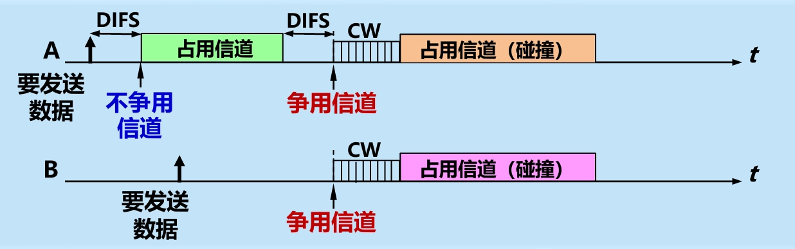
- **信道预约**
    - 定义：为了减少碰撞的发生，802.11 标准引入了一种**信道预约**机制（也叫 RTS/CTS 机制）。
    - **请求允许发送（RTS/CTS）握手过程**：
        1. 发送方（A）发送 **请求发送帧** RTS（Request to Send），携带数据帧长度 + NAV 值，等待 CTS
        2. 接收方（AP）收到 RTS 后，若信道空闲，则等待 SIFS 后发送**允许发送帧** CTS（Clear to Send），携带相同 NAV 值。
        3. 所有监听范围内的终端（包括隐藏终端 C）接收 RTS/CTS 后，更新 NAV，在 NAV 期间不竞争信道。
        4. 发送方（A）收到 CTS 后，等待 SIFS 后发送数据帧 DATA。
        5. 接收方（AP）收到 DATA 后，发送确认帧 ACK，传输完成。
    - 示例：
        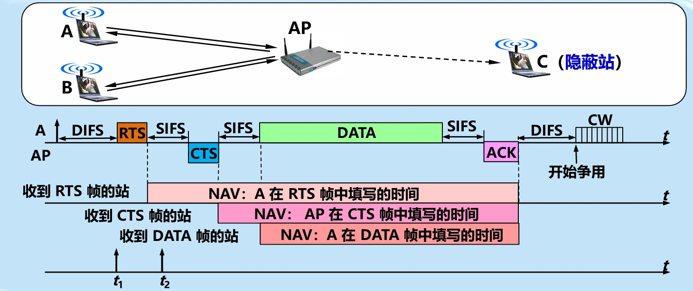
- 信道预约的优缺点
    - 使用 RTS 帧和 CTS 帧会使整个网络的通信效率有所下降，多浪费信道的时间 **[RTS + SIFS + CTS + SIFS]**。
    - 但与数据帧相比，开销不算大。
        - RTS 帧：20字节
        - CTS 帧：14字节
        - 数据帧：最长可达 2346 字节
    - 若不使用这种控制帧，一旦发生碰撞而导致数据帧重发，浪费的时间就更多。
- **信道预约不能完全避免碰撞**
    - 即使使用了 RTS 和 CTS 对信道进行预约，但碰撞也有可能发生。
    - 例如：有的站可能在时间  $t_1$  或  $t_2$  就发送了数据（这些站可能是没有收到 RTS 帧或 CTS 帧或 NAV），结果必定与 RTS 帧或 CTS 帧发生碰撞。
    - A 站若收不到 CTS 帧，就不能发送数据帧，而必须重传 RTS 帧。
    - A 站只有正确收到 CTS 帧后才能发送数据帧。
- **信道预约不是强制的**
    - 信道预约不是强制性规定。各站可以自己决定使用或不使用信道预约。
    - 只有当数据帧的**长度超过某一数值时**，使用 RTS 帧和 CTS 帧才比较合适。
    - 因为无线信道的误码率比有线信道的高得多，所以，无线局域网的 MAC 帧长一般应当短些，以便在出错重传时减小开销。

### 802.11 局域网的 MAC 帧
- 802.11 帧共有三种类型：控制帧、数据帧和管理帧。
    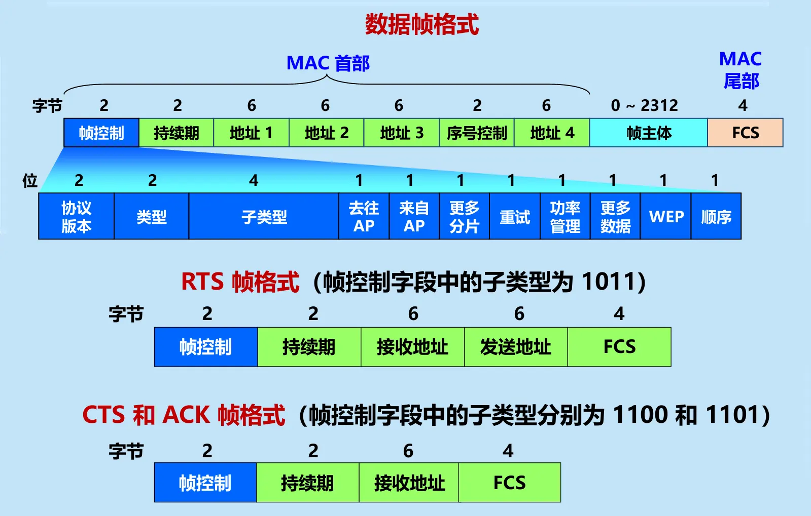

#### 数据帧
- MAC 首部：共 30 字节。
    - 帧控制字段：2 字节。
        - 协议版本：2 位，现在为 0。
        - 帧类型：2 位，表示帧的类型（管理帧、控制帧、数据帧）。
        - 子类型：4 位。
        - 去往 AP：1 位，表示该帧是否要发送到接入点 AP。
        - 来自 AP：1 位，表示该帧是否是从接入点 AP 发出的。
        - 更多分片：1 位，表示该帧后面是否还有分片。
            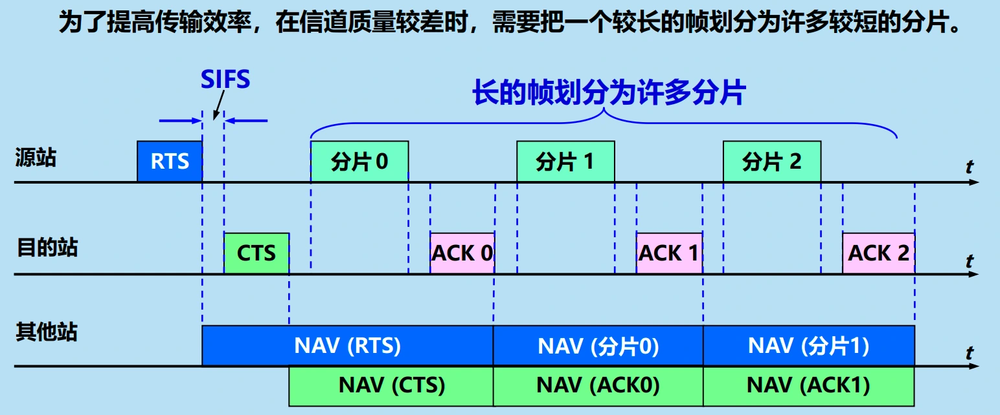
        - 重传：1 位，表示该帧是否是重传的帧。
        - 功率管理：1 位，用来指示移动站的功率管理模式。
        - 更多数据：1 位。
        - WEP：1 位，表示该帧的数据部分是否经过加密。
        - 顺序：1 位。
    - 持续期字段：2 字节。
    - 地址字段：共 4 个地址字段，每个地址字段 6 字节（MAC 地址），共 24 字节。
        - 地址 1：接收地址（即**直接接收**数据帧的节点地址）。
        - 地址 2：发送地址（即**实际发送**数据帧的节点地址）。
        - 地址 3 和地址 4 取决于数据帧中的“来自AP”和“去往AP”这两个字段的数值。
        - 示例：
            - 
            - 
    - 序号控制字段：2 字节。
        - 其中序号子字段：12 位
        - 分片子字段：4 位
- 帧主体：数据部分，不超过 2312 字节。802.11 帧的长度通常都小于 1500 字节。
- 帧检验序列 FCS：尾部，共 4 字节。

## 无线个人区域网 WPAN
- 无线个人区域网 WPAN（Wireless Personal Area Network）
    - 定义：在个人工作地方把属于个人使用的电子设备用无线技术连接起来自组网络，不需要使用接入点 AP。
    - 网络范围：大约 10 m 左右。
- WPAN 和 WLAN 的区别
    - WPAN
        - 是以个人为中心使用的无线个人区域网；
        - 实际上是一个低功率、小范围、低速率和低价格的电缆替代技术。
    - WLAN
        - 是同时为许多用户服务的无线局域网；
        - 是一个大功率、中等范围、高速率的局域网。
- WPAN 标准
    - 由 IEEE 的 802.15 工作组制定，包括 MAC 层和物理层的标准。
    - WPAN 都工作在 2.4 GHz 的 ISM 频段。
    - 欧洲的 ETSI 标准则把无线个人区域网取名为 HiperPAN。

### 蓝牙系统（Bluetooth）
- 最早使用的 WPAN
    - 1994 年，由爱立信公司推出，其标准是 IEEE802.15.1。
    - 蓝牙 1.0：数据率 = 720 kbit/s ，通信范围 = 10 m
    - 蓝牙 4.0：
        - **低耗能蓝牙** BLE（Bluetooth Low Energy）：
            - 适用于数据量很小的节点，电池可以连续工作 4~5 年；
            - 距离增大到 30 m，数据率可达 1 Mbit/s。
        - **传统蓝牙**（classic Bluetooth）：
            - 数据率提高到 3 Mbit/s，传输距离可达 100 m。
    - 蓝牙 5.0：数据率上限达 24 Mbit/s，传输距离最高可达 300 m。
- 皮可网（piconet）
    - 定义：蓝牙使用 TDM 方式和扩频跳频 FHSS 技术组成不用接入点 AP 的**皮可网**（piconet）。
    - 组成：每一个皮可网有一个主设备（Master）和最多 7 个工作的从设备（Slave）。
    - **扩散网**（scatternet）：通过共享主设备或从设备，可以把多个皮可网链接起来，形成一个范围更大的扩散网。

### 低速 WPAN
- 主要用于**工业监控组网、办公自动化与控制**等领域
    - 速率：2~250 kbit/s
    - 标准：IEEE 802.15.4
    - 新修订标准：IEEE 802.15.4-2006
- ZigBee
    - ZigBee 技术主要用于各种电子设备（固定的、便携的或移动的）之间的无线通信。
    - ZigBee 的特点
        - 通信距离短（10~80 m），传输数据速率低，成本低廉。
        - 功耗非常低：对于某些工作时间和总时间之比小于 1% 的情况，电池的寿命甚至可以超过 10 年。
        - 网络容量大
            - 一个 ZigBee 的网络最多包括有 255 个结点，其中一个是主设备，其余则是从设备。
            - 若是通过网络协调器，整个网络最多可以支持超过 64000 个结点。
    - ZigBee 标准与协议栈
        - 协议栈： 
            
        - IEEE 802.15.4 物理层使用的三个频段

            | 频段               | 数据率      | 信道数 |
            | ------------------ | ----------- | ------ |
            | 2.4 GHz（全球）    | 250 kbit/s  | 16     |
            | 915 MHz（美国）    | 40 kbit/s   | 10     |
            | 868 MHz（欧洲）    | 20 kbit/s   | 1      | 
        - MAC 层主要沿用 802.11 无线局域网标准的 CSMA/CA 协议。
        - 在网络层，ZigBee 可采用星形和网状拓扑，或两者的组合。
    - ZigBee 的组网方式
        - 一个 ZigBee 网络最多可以有 255 个节点。
        - 节点按功能的强弱可划分为两大类：
            1. **全功能设备** FFD（Full-Function Device）
                - 充当协调器（coordinate），负责维护整个 ZigBee 网络的节点信息，同时还可以与其他 ZigBee 网络的协调器交换数据。
                - 通过各网络协调器的相互通信，可以得到覆盖更大范围、超过 65000 个节点的 ZigBee 网络。
            2. **精简功能设备** RFD（Reduced-Function Device）
                - 是 ZigBee 网络中数量最多的端设备。
                - 电路简单，存储容量较小，因而成本较低。
                - RFD 结点只能与处在该星形网中心的 FFD 结点交换数据。
        - 示意图：
            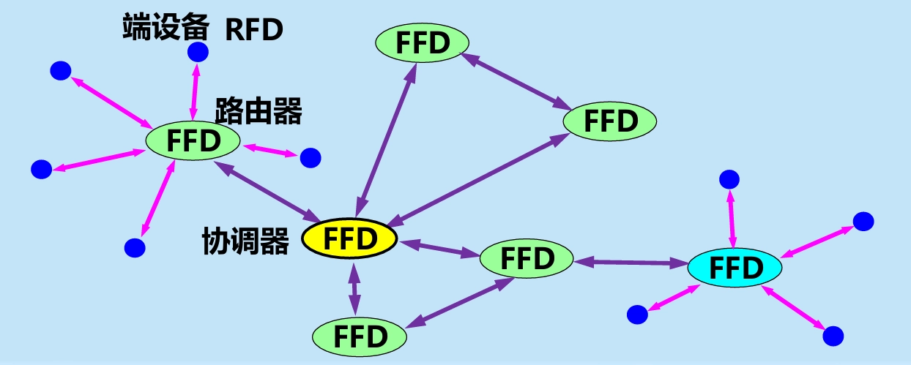

### 高速 WPAN
- 用于在**便携式多媒体装置**之间传送数据
    - 速率：支持 11～55 Mbit/s 的数据率
    - 标准：802.15.3
- IEEE 802.15.3a 工作组还提出了更高数据率的物理层标准的**超高速 WPAN**，使用超宽带 UWB 技术：
    - 工作在 3.1~10.6 GHz 微波频段，有非常高的信道带宽。
    - 信号的带宽应超过信号中心频率的 25% 以上，或信号的绝对带宽超过 500 MHz
    - 使用了瞬间高速脉冲，可支持 100~400 Mbit/s 的数据率，可用于小范围内高速传送图像或 DVD 质量的多媒体视频文件。

## 蜂窝移动通信网
### 蜂窝移动通信系统问世
- 第一代（1G）蜂窝移动通信系统
    - 1978 年底问世。
    - 使用**模拟技术**和传统的**电路交换**及**频分多址** FDMA 提供电话服务。
        - 模拟传输：语音经 FM 调制加载到高频载波，无数字编码，易受干扰、音质一般。
        - 多址接入：纯 FDMA，将频谱划分为独立窄带信道，1 个信道对应 1 路通话，典型间隔 25–30 kHz，频谱效率低（单基站仅数十路并发）。
        - 蜂窝与复用：采用六边形小区划分，相邻小区用不同频率组
    - 移动通信系统的手机相当笨重（俗称大哥大）。

### 2G 蜂窝移动通信系统
- 第二代（2G）蜂窝移动通信系统
    - 1990 年后开始。
    - **基于数字技术**。
    - 代表：欧洲提出的 GSM（Global System for Mobile Communications）系统（全球通）等。
- GSM 2G 蜂窝通信系统的重要组成构件
    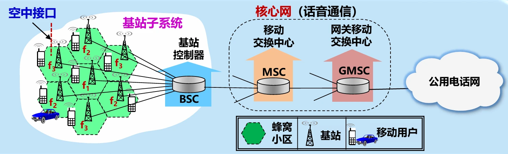

    - **小区**（cell）： 整个网络服务区划分成许多小区（即蜂窝）。
    - **基站**：每个小区设置一个，覆盖小区，负责与本小区各个移动站的联络和控制。移动站的发送或接收都必须经过基站完成，因此基站又称为收发基站。
        - **频率复用**：相邻小区采用不同的频率，解决了同频干扰，频率可以重复使用。
        - **电路交换**：提供基本的话音通信服务。
    - **空中接口**：移动用户到基站之间的空口（即无线空中接口），采用的多址方式是 FDMA/TDMA 的混合系统。
        - 把可用频带（上行和下行各占用 25 MHz）划分为 125 个带宽为 200 kHz 的子频带，再把每个子频带进行时分复用，每个 TDM 帧划分为 8 个时隙。每个通话的用户占用一个 TDM 帧中的一个特定时隙。
    - **GSM**：包括基站子系统和网络子系统（常称为核心网）。
        - **基站子系统**：包括几十个基站和一个基站控制器 BSC（Base Station Controller）。
            - **BSC**：为本站子系统中的几十个基站服务：分配无线信道，确定所在小区，漫游时进行信道切换。
        - **核心网**：包括移动交换中心 MSC（Mobile Switching Center）和网关移动交换中心 GMSC（Gateway Mobile Switching Center）。
            - **MSC**：负责用户的授权和账单，用户呼叫连接的建立和释放，不同基站子系统之间漫游时的信道切换。
            - **GMSC**：将 MSC 连接到公用电话网或其他移动通信网。
- 数据通信被引入移动通信系统
    - 为了满足移动数据通信需求，引入了：
        - **通用分组无线服务** GPRS（General Packet Radio Service），俗称 2.5G
        - **增强型数据速率 GSM 演进** EDGE（Enhanced Data rate for GSM Evolution）系统，俗称 2.75G
    - **空口调制方式**：由高斯最小频移键控 GMSK（Gaussian Minimum Shift Keying）提高到 8PSK。
    - **网元**：引入了分组控制单元 PCU（Packet Control Unit）。
        - PCU 通常和 BSC 集成在一起，负责处理有关数据通信的业务。
        - PCU 根据用户数据业务的突发性质，动态地分配空口资源给用户，提高了空口资源的利用率，提供的最大速率为 171.2 kbit/s（GPRS）和 384 kbit/s（EDGE）。
- 引入 GPRS 后的核心网组成
    - 示意图：
        
    - **核心网**：电路交换域（负责话音通信） + 分组交换域（负责数据通信）
        - **电路交换域**：移动交换中心 MSC + 网关移动交换中心 GMSC
        - **分组交换域**：服务 GPRS 支持节点 SGSN（Serving GPRS Support Node） + 网关 GPRS 支持节点 GGSN（Gateway GPRS Support Node）
            - **SGSN**：在基站控制器和 GGSN 之间转发 IP 数据报；与 MSC 交互，完成用户授权、通信切换，移动节点位置信息维护等功能。
            - **GGSN**：网络接入控制，把多个SGSN连接起来后接入互联网。又称为GPRS路由器。分组过滤，保证GPRS网络的安全。

### 3G 蜂窝移动通信系统
- 第三代（3G）蜂窝移动通信系统
    - 1996 年正式标准名称：**IMT-2000**。
    - 工作在 2000 MHz 频段，数据率可达 2000 kbit/s（固定站）和 384 kbit/s（移动站）。
    - 第三代移动通信合作伙伴计划 3GPP（3rd Generation Partnership Project）：包括中国通信标准化协会 CCSA（China Communications Standards Association）的 7 个组织成立的国际性标准化组织。
    - 3GPP 制订的 3G 标准：通用移动通信系统 UMTS（Universal Mobile Telecommunications System）。
    - 3GPP R99：下行和上行的数据率都要超过 384 kbit/s。
- 3G UMTS 蜂窝通信系统的重要组成构件
    - 示意图：
        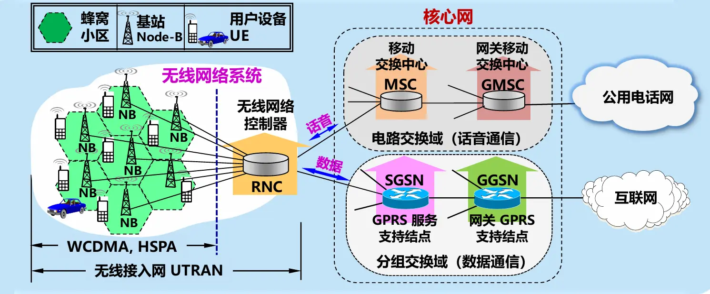
    - **通用移动通信系统陆地无线接入网** UTRAN（UMTS Terrestrial Radio Access Network），由多个无线网络系统组成。
    - **无线网络控制器** RNC（Radio Network Controller）：通过 MSC 连接到的蜂窝话音网络；通过 SGSN 和 GGSN连接到分组交换的互联网。
        - SGSN 和 GGSN 设备同时支持 2G/3G 功能。从互联网无法看到 GGSN 以内的 3G 节点的移动性，GGSN 对 UMTS 外部都把这些隐藏了。
- 3G UMTS 与 2G GSM 的主要区别：集中在 UTRAN 侧
    - **空口**：
        - 使用**直接序列宽带码分多址** DS-WCDMA（Direct Sequence Wideband CDMA）或**时分同步码分多址** TD-SCDMA（Time Division-Synchronous Code Division Multiple Access）。
        - 每个移动用户使用的带宽比 GSM 增大很多，能以更高的数据率享用多种移动宽带多媒体业务。
    - 3G UMTS 也不断提高数据率。例如：
        - WCDMA 引入**高速分组接入增强型版本** HSPA+（High Speed Packet Access+），下行数据率可达到 21 Mbit/s（5 MHz带宽），大大超过了 3G 最初设定的指标。
- 我国使用三种 3G 国际标准
    - 中国电信：3GPP 组织中由美国提出的 CDMA2000
    - 中国联通：3GPP 组织中由欧洲提出的宽带码分多址 WCDMA（Wideband CDMA）（UMTS 的标准）
    - 中国移动：3GPP 组织中主要由中国提出的时分同步码分多址 TD-SCDMA（Time Division-Synchronous CDMA）（UMTS标准）
        - TD-SCDMA 和 WCDMA 仅在接入网空口部分有差异。
        - CDMA2000 的核心网和接入网与 TD-SCDMA/WCDMA 都不同。
- **向后兼容**：3G 蜂窝移动通信是以传输多媒体数据业务为主的通信系统，而且必须兼容 2G 的功能（即能够通电话和发送短信）。

### 4G 蜂窝移动通信系统
- 第四代（4G）蜂窝移动通信系统
    - 2008 年，名称定为高级国际移动通信 **IMT-Advanced**（International Mobile Telecommunications-Advanced）。
    - IMT-Advanced 的一个最重要的特点：**取消了电路交换**，无论传送数据还是话音，全部使用分组交换技术，或称为**全网 IP 化**。
    - IMT-Advanced 目标峰值数据率：固定的和低速移动通信时应达到 1 Gbit/s，在高速移动通信时（如在火车、汽车上）应达到 100 Mbit/s。
- **长期演进** LTE（Long-Term Evolution）
    - 由于 4G 标准比 3G 的标准高出很多。在当时的技术条件下，很难实现。
    - LTE 标准：
        - 3GPP R8 版本。
        - 显示为“4G”，但不是真正的 4G，俗称为 3.9G 或 3.95G。
        - 信道带宽为 20 MHz 时，其下行和上行数据率应分别达到 100 Mbit/s 和 50 Mbit/s。
    - LTE 提高数据率的一些方法
        - 无线接入网的下行信道（eNB $\to$ UE）与上行信道（UE  $\to$ eNB）采用了不同的复用方式。
        - 下行信道采用正交频分多址 OFDMA。
            - OFDM 技术采用了多个子载波并行传输的方法，利用各子载波之间的正交性，子信道的频谱可以相互重叠，但在解调时并不产生子载波间干扰。大大提高了频谱利用率。
            - OFDM 使每个子信道的数据率降低，有效地减少了由多径效应带来的符号间干扰，降低了误比特率。
        - 采用了高阶调制 64 QAM，1 码元携带 6 bit 的信息量。
        - 采用了多天线的多入多出 MIMO 技术。
- LTE 体系结构
    - 示意图：
        
    - 由三大部分组成：用户设备 UE、演进的无线接入网 E-UTRAN（Evolved-UTRAN）和演进的分组核心网 EPC（Evolved Packet Core）。
        - **E-UTRAN**：取消了无线网络控制器 RNC，并把基站称为演进的节点 B（eNB，evolved Node B）。
            - eNB 兼有 3G 中的基站 NB 和无线网络控制器 RNC 的功能，是 LTE 中功能最复杂的设备。
            - eNB 三个主要构件：
                1. 天线
                2. 无线模块：对发往空口的信号或从空口接收的信号进行调制或解调。
                3. 数字模块：作为空口与核心网的接口，对经过此模块的所有信号进行处理。
            - eNB 功能：
                - 控制层面：基站 eNB 连接 MME 和 HSS，处理 UE 的登记、切换、呼叫、寻呼等信令消息。
                - 数据层面：基站 eNB 在用户设备 UE 与核心网之间传送 IP 数据报。
        - **核心网** EPC：全 IP 网络，分为用户层面和控制层面。
            - **分组数据网络网关** P-GW（Packet Data Network Gateway）： 是核心网通向互联网的网关路由器或边界路由器，与 3GPP 或非 3GPP 的外部数据网的接口。也是核心网对外的锚点（Anchor point）。负责给所有用户设备 UE 分配 IP 地址和确保服务质量 QoS 的实施。UE 的数据报在 eNB 封装到用户层面的 GPRS 隧道协议（GTP-U 隧道）中，从 eNB 经 S-GW 到达 P-GW。
            - **服务网关** S-GW（Serving Gateway）：是无线接入网与核心网之间的网关路由器。负责用户层面的数据分组的转发和路由选择，起到路由器的作用。还负责 eNB 到 S-GW 以及 S-GW 到 P-GW 的隧道管理。S-GW 是数据层面中移动性的锚点。 S-GW 和 P-GW 可以在同一个或不同物理节点实现。
            - **归属用户服务器** HSS（Home Subscriber Server）：是一个中心数据库，存储网络运营商所保存的用户基本数据。
            - **移动性管理实体** MME（Mobility Management Entity）：是一个信令实体，负责基站与核心网之间、以及用户与核心网之间的所有信令交换。大的核心网需要有多个 MME 来处理大量的信令交换。MME 必须从 HSS 获得用户的有关信息。
- LTE 必须**向后兼容** 3G 和 2G
    - 4G/3G/2G：表示如果 LTE 手机所在地还没有被 4G 网络覆盖，那么该手机还可使用原来 3G/2G 网络的功能。
    - 最初采用电路交换回落 CSFB（Circuit Switched Fallback），表示再退回到 3G/2G 的电路交换的网络来处理电话通信业务。
    - 2012 年，基于 IP 的 **VoLTE**（Voice over LTE）问世。
        - 能够提供高质量的电话通信；
    - 但要靠与 P-GW 相连的 IP 多媒体子系统 IMS（IP Multimedia Subsystem）。
    - IMS 不属于 LTE，而是属于 IP 服务的范围，是 LTE 之外的另一个分组交换的网络系统。