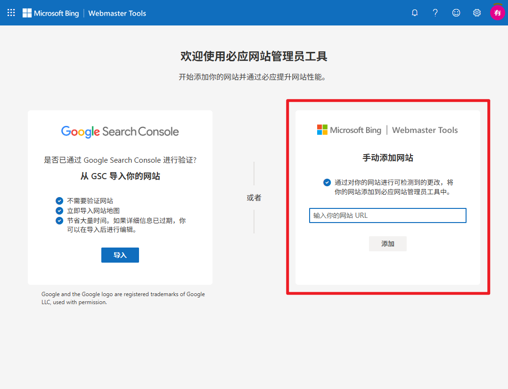
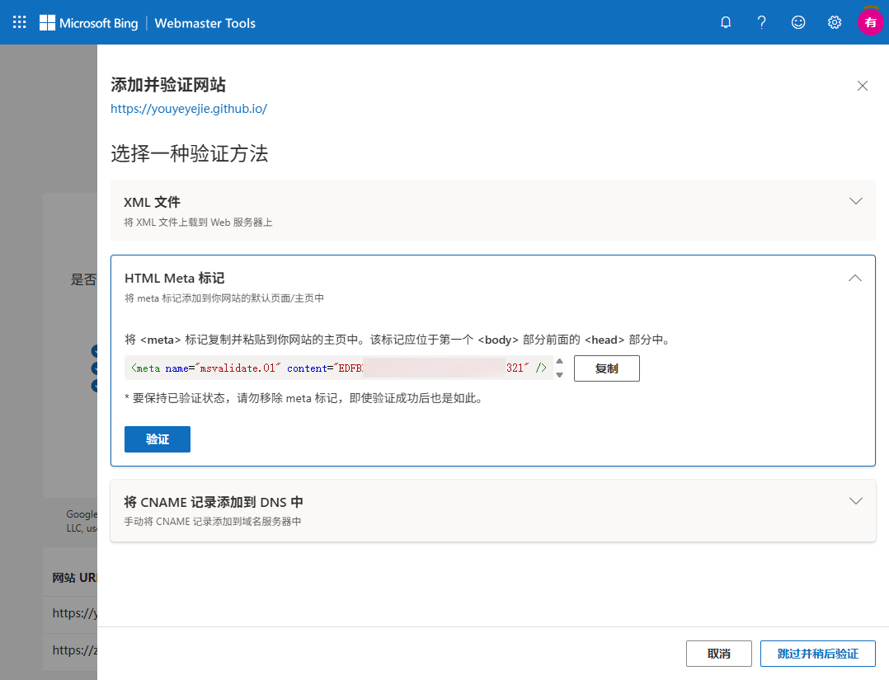
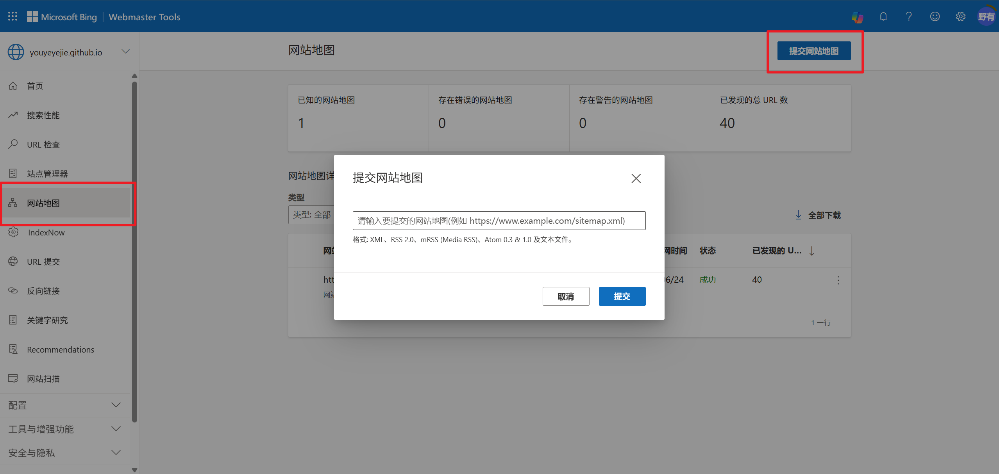

# 前言

在成功搭建起自己的博客并发表了几篇文章后，你期待满满地打开浏览器搜索自己的博客，准备好迎接扑面而来的成就感和满足感，然而这是你却发现搜索出来的内容不能说一模一样吧，也只能说是毫不相干。在查询原因后，你知道了从搭建好博客到被人们从搜索引擎发现之间还差了一步：那就是**让搜索引擎收录你的博客**。


# 步骤

## 进入网站管理后台验证网站所有者

为了让搜索引擎收录你的博客，你需要先验证你对该网站的所有权。这里给出几个主流搜索引擎的网站管理平台：

<a href="https://www.bing.com/webmasters" class="LinkCard">Bing Webmaster Tools</a>
<a href="https://search.google.com/search-console" class="LinkCard">Google Search Console</a>
<a href="https://ziyuan.baidu.com/site/index" class="LinkCard">百度搜索资源平台</a>

以 Bing Webmaster Tools 为例，首先访问 [Bing Webmaster Tools](https://www.bing.com/webmasters) 并登录你的微软账号、Google账号或Facebook账号三种全球网络相对通用的账号的其中一个。


接着，选择右侧的“手动添加网站”，在输入框中填入你的博客 URL，然后点击“添加”。



在弹出的“选择一种验证方法”中，选择第二个：HTML Meta 标记



将其中的内容复制下来待用。

其他网站同理。如果你希望让你的博客被多个搜索引擎收录，你可以参考上述步骤分别获取各个搜索引擎的验证标记。

## 在 Hexo 中添加验证标记

前一步中你所复制的 `<meta>` 标记需要被粘贴到你网站的主页中，且该标记应位于第一个 `<body>` 部分前面的 `<head>` 部分中。

以我所使用的fluid主题为例，你当然可以选择修改 `hexo\themes\fluid\layout\_partial\head.ejs` 文件，从而实现在每次生成静态文件时都自动添加该标记。但是，采用这个方法有一个缺点：一旦你更新或更换了主题，将会导致你之前添加的验证标记丢失。

因此我们选择使用Hexo注入器来添加验证标记。Hexo注入器允许你在生成的 HTML 文件中注入自定义内容。

在 `scripts` 目录下创建一个 JavaScript 文件如 `injector.js`，并添加以下内容：

```javascript
hexo.extend.injector.register('head_begin', '/*你复制的内容*/\n', 'default');
```

如果你前一步复制了多个验证标记，你可以重复上面这段代码，将每个验证标记都添加到 `injector.js` 文件中。

## 生成网站地图备用

由于大部分搜索引擎会通过你提交的网站地图来索引你的博客，因此生成网站地图是一个必要的步骤。

在 Hexo 中生成网站地图可以使用 `hexo-generator-sitemap` 插件。首先，在博客根目录下执行以下命令安装插件：

```bash
npm install hexo-generator-sitemap --save
```

然后在 `_config.yml` 文件中添加以下配置：

```yaml
sitemap:
  path: sitemap.xml
```

在这之后，只要你每次执行 `hexo generate` 命令生成静态文件时，网站地图就会自动生成并保存在博客根目录下的 `sitemap.xml` 文件中。

## 继续未完成的网站验证

在完成上述步骤后，我们回到网站管理后台继续操作。点击验证按钮，搜索引擎将会检查你的网站是否包含了你所添加的验证标记。


一段时间后，你将会收到验证成功的通知。

点击左侧的网站地图选项，选择右上角“提交网站地图”，在输入框中填入你此前生成的 `sitemap.xml` 文件的路径，然后点击“提交”。地图路径一般为 `https://your-blog-url/sitemap.xml`，其中 `your-blog-url` 替换为你的博客 URL。



等待状态变为成功，一段时间后，你的博客就会被搜索引擎收录，你就可以通过搜索引擎来访问你的博客了。

# 总结
通过上述步骤，你可以让你的博客被主流搜索引擎收录，从而让更多人能够通过搜索引擎发现你的博客。请注意，搜索引擎收录可能需要一些时间，因此请耐心等待。

- **注1**：博主在谷歌的 Google Search Console 中验证了网站所有权，但是提交站点地图时反复显示“无法抓取”，暂不清楚产生该问题的原因以及解决方法。但在两天后，邮箱收到网站被收录的邮件，尝试后发现已经可以通过谷歌搜索引擎搜索到博客了，因此并未继续探究。
- **注2**：博主仅在必应和谷歌验证了网站所有权，二者均在三天后收录了博客。