> ICLR 2026：[Membership Inference Attacks Against Fine-tuned Diffusion Language Models](https://arxiv.org/html/2601.20125?_immersive_translate_auto_translate=1)

# 论文简介
论文首次系统性研究了扩散语言模型（DLMs）的隐私泄露风险，提出了 DLMs 的“掩码-预测”机制导致信号稀疏和长尾噪声问题会使传统攻击失效的观点，并基于此设计了基于子集聚合的成员攻击 SAMA（Subset-Aggregated Membership Attack）攻击框架，利用渐进式掩码和基于符号的统计方法，显著提升了针对 DLMs 的成员推理攻击效果，属于灰盒、参考模型、微调阶段 MIA。

---
> 同个作者还有一篇发在 USENIX 2026 的 [Window-based Membership Inference Attacks Against Fine-tuned Large Language Models](https://arxiv.org/html/2601.02751?_immersive_translate_auto_translate=1)，详细介绍也可以看作者[博客](https://yuetian.me/blog/2026/wbc/)。
> 
> 大概读了一下感觉和这篇的原理很相似，只不过没有特别针对 DLMs，应该是这篇的前期研究。具体来说，可以和这一篇如下类比：
> 
> 1. 滑动窗口比较（WBC）：与局部子集采样类似，使用一个长度可变的滑动窗口，对窗口内的 tokens 测量成员信号
> 2. 基于符号的聚合：与本文可以说是完全一致
> 3. 几何级数集成：与渐进式掩码有点类似，即滑动窗口大小按照几何级数排列，最后将不同尺寸窗口的结果取平均得到最终的攻击分数

## 背景知识
### 概念：ARMs 与 DLMs
- **自回归模型** ARMs（Autoregressive Models）：基于单向（通常是从左到右）的语言建模，逐词预测下一个 Token。
    - **代表模型**：GPT 系列
    - **成员信号**：
        $$
        \Delta_{AR}(x)=\ell_{AR}\left(x,\mathcal{M}_{AR}^{R}\right)-\ell_{AR}\left(x,\mathcal{M}_{AR}^{T}\right)=\frac{1}{L} \sum_{i=1}^{L}\left[\ell_{i}^{R}(x)-\ell_{i}^{T}(x)\right]
        $$

        其中 $\mathcal{M}_{AR}^{R}$ 是参考预训练模型，$\mathcal{M}_{AR}^{T}$ 是微调后的目标模型，$L$ 是序列长度，$\ell_{i}=-\log p(x_{i} | x_{<i})$ 表示仅给定前面的上下文时，在位置 $i$ 处的损失。
- **扩散语言模型** DLMs（Diffusion Language Models）：基于掩码-预测机制（Mask-and-Predict），输入部分遮盖的文本，利用双向上下文迭代填补空白生成完整文本。
    - **代表模型**：LLaDA，Dream
    - **优势**：生成速度快（可并行）、可控性强、解决了反转诅咒问题。
    - **成员信号**：
        $$
        \Delta_{DF}(x,\mathcal{S})=\ell_{DF}\left(x,\mathcal{S}, \mathcal{M}_{DF}^{R}\right)-\ell_{DF}\left(x,\mathcal{S}, \mathcal{M}_{DF}^{T}\right)=\frac{1}{|\mathcal{S}|} \sum_{i \in \mathcal{S}}\left[\ell_{i}^{R}(x, \mathcal{S})-\ell_{i}^{T}(x, \mathcal{S})\right]
        $$

        其中 $\mathcal{S}\subseteq[L]$ 是掩码标记的集合，$\ell_{i}(x,\mathcal{S})=-\log p(x_{i} | x_{-\mathcal{S}})$ 表示在给定序列 $x$ 中所有未掩码标记 $x_{-\mathcal{S}}$ 的上下文下，在位置 $i$ 处的损失。

### 挑战：传统攻击对 DLMs 的局限性
论文发现，直接将传统 MIA 应用于 DLMs 会面临**信号稀疏**与**长尾噪声**的双重挑战：

- **信号稀疏**（Sparsity）：DLMs 的记忆并不均匀分布在所有 Token 上，而是集中在特定的 Token 依赖关系上（如特定上下文关系）。因为 DLM 是通过随机打掩码来测试的，只有当掩码恰好盖住了这些被记忆的词，且保留了触发记忆的上下文时，才会暴露出真正的记忆信号。在成千上万种掩码组合中，能命中这种特定关系的概率很低，所以真正的信号是**稀疏**的。
- **长尾噪声**（Heavy-tailed Noise）：模型在微调时，不仅会记住某些具体的句子（实例记忆），还会学到整个数据集的通用风格或高频词，称之为模型的领域适应（Domain Adaptation）。当攻击者测试一句话时，模型对这些“领域高频词”的预测损失（Loss）会非常低。这种极低的损失会产生巨大损失下降幅度（Magnitude），且呈长尾分布，并且对训练集内外的数据都会出现（只要它们属于同一领域）。

由于信号稀疏与长尾噪声的存在，加之传统方法通常计算所有掩码 Token 损失的**平均值**，那么则会出现一个问题：真正代表隐私泄露的“死记硬背”信号稀疏且数值微小，而那些代表领域适应的“高频词噪声”数值巨大，直接求平均会导致隐私信号被噪声彻底淹没。

### 机遇：DLMs 为 MIA 带来新的攻击面
虽然 DLMs 的掩码机制带来了挑战，但也提供了一个新的攻击面：

1. 攻击者可获得多个独立的探测机会，不必提取单一的固定信号 $\Delta_{AR}(x)$，而是能收集一系列依赖于配置 $\mathcal{S}_i$ 的信号 $\{\Delta_{DF}(x, \mathcal{S}_1), \Delta_{DF}(x, \mathcal{S}_2), \cdots\}$，若采样足够多的多样化掩码，有望获得比自回归模型更强的成员信号。
2. 双向上下文使攻击者能探测自回归模型中无法获取的令牌关系。例如，若令牌 $x_i$ 和 $x_j$ 在微调中被记忆为强语义关联：
    - 在自回归模型中，若 $j>i$，$x_j$ 始终被掩码，其与 $x_i$ 的关系无法影响 $x_i$ 的预测；
    - 而在扩散语言模型中，可通过多种掩码配置探测该关系，如：仅掩码 $x_i$ 观察 $x_j$ 对其预测的影响、仅掩码 $x_j$ 进行反向探测，或同时掩码 $x_i$ 和 $x_j$ 测试其联合重构效果。每种配置都可能揭示单向模型无法获取的独特记忆模式。

## 核心内容：SAMA 攻击框架
论文提出了**基于子集聚合的成员攻击** SAMA（Subset-Aggregated Membership Attack），核心思想是利用 DLMs 的多样化掩码配置来收集多个独立的成员信号，并通过基于符号的统计方法过滤掉长尾噪声，最终形成一个鲁棒的成员推理攻击。

### 方法概览
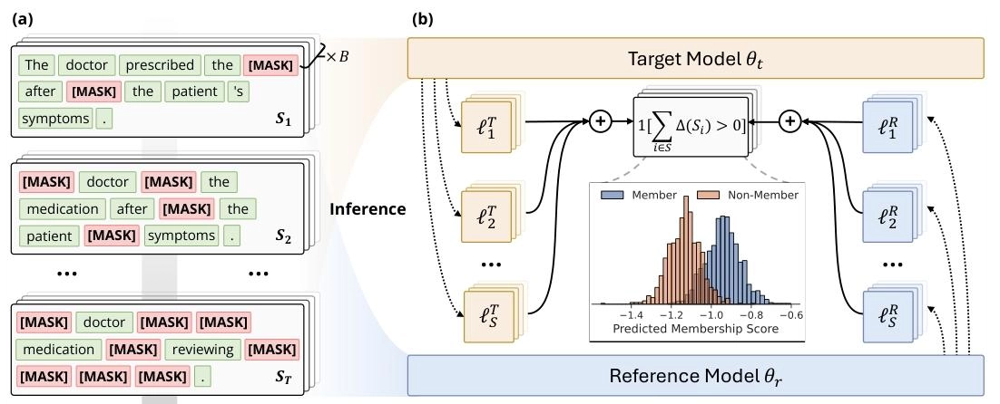

- (a) 输入序列“The doctor prescribed the medication after reviewing the patient’s symptoms.”，在 $T$ 个步骤中进行渐进式掩码，累积掩码位置。（论文这里写的是 $\mathcal{S}$ 个步骤，我认为可能是笔误，应该是 $T$ 个步骤）。每个步骤中，掩码位置数量逐渐增加，从而形成多个不同的掩码配置 $\{S_{t}\}_{t=1}^{T}$，每个配置都提供了一个独立的成员信号 $\{\Delta_{DF}(x, S_{t})\}_{t=1}^{T}$。
- (b) 在每个步骤中，按位置跟踪目标和参考模型对掩码标记 [MASK] 的重建误差 $\{\ell^{s}\}_{s=1}^{\mathcal{S}}$。基于符号的测试统计量检测特定掩码配置何时激活记忆，计算参考损失超过目标损失的配置比例。这种基于符号的比较与逆加权相结合，形成成员分数，以区分训练成员和非成员。

### 核心组件
#### 渐进式掩码 (Progressive Masking)
- **方法**：不是固定一个掩码密度，而是采用多尺度方法，将掩码密度从稀疏逐步增加到密集。具体来说，在每个步骤 $t \in \{1, \cdots, T\}$ 中，将掩码密度设置为：
    $$
    \alpha_{t}=\alpha_{\min}+\frac{t-1}{T-1}\left(\alpha_{\max}-\alpha_{\min}\right)
    $$

    其中 $\alpha_{\min}$ 和 $\alpha_{\max}$（通常为 5% 至 50%）定义了掩码密度的范围。这会在步骤 $t$ 产生 $k_{t}=\left\lceil L \cdot \alpha_{t}\right\rceil$ 个被掩码的位置。
- **意义**：
    - **稀疏阶段**：保留大量上下文，信号最纯净，容易探测到强依赖关系。
    - **密集阶段**：虽然单点信号弱，但提供了更多的聚合数据点。
- **目的**：利用多尺度探测，全方位捕捉模型在不同上下文密度下的记忆模式。

#### 鲁棒子集聚合 (Robust Subset Aggregation)
- **方法**：在每个渐进式掩码步骤 $t \in{1,\cdots,T}$ 中，使用包含 $k_{t}$ 个掩码位置的掩码配置 $\mathcal{S}_{t} \subseteq[L]$，我们通过单次前向传播获得所有掩码标记的损失，采用两部分稳健聚合策略：**局部子集采样**与**基于符号的聚合**。
    1. **局部子集采样**（Local Subset Sampling）：在每一步掩码操作中，不计算全局平均，而是从 $\mathcal{S}_{t}$ 中随机采样 $N$ 个子集位置，对每个子集 $U^{n}$ 计算局部损失差异：
        $$
        \Delta_{DF}^{n}\left(x,\mathcal{S}_{t}\right)=\frac{1}{m} \sum_{i \in H^{n}}\left[\ell_{i}^{R}\left(x, \mathcal{S}_{t}\right)-\ell_{i}^{T}\left(x, \mathcal{S}_{t}\right)\right]
        $$

        其中每个子集 $U^{n}\subset\mathcal{S}_{t},n=1,\cdots,N$ 包含 $m$ 个位置，$m \ll k_{t}$。这样得到 $N$ 个不同的局部测量结果，受单个异常值标记的影响更小。
    2. **基于符号的聚合**（Sign-Based Aggregation）：不使用每个局部损失差异的大小，而是将每个 $\Delta_{DF}^{n}$ 转换为一个二元指示器：
        $$B^{n}(x)=\boldsymbol{1}\left[\Delta_{DF}^{n}(x,S_{t})>0\right]=\begin{cases}
        1 & \Delta_{DF}^{n}(x,S_{t})>0 \\
        0 & \text{otherwise}
        \end{cases}$$

        这种转换丢弃了大小信息，只记录参考模型对于该特定子集 $U^{n}$ 是否比目标模型有更高的损失。虽然这看起来像是在丢弃信息，但实际上它对重尾噪声分布具有鲁棒性。通过在此前的 $N$ 个采样子集上聚合这些二元指标，计算出第 $t$ 步的成员分数：
            $$
            \hat{\beta}_{t}(x)=\frac{1}{N} \sum_{n=1}^{N} B^{n}(x)
            $$
- **原理**：
    - **过滤噪声**：该方法只看**方向**（微调后是否变好了），不看**大小**（变好了多少）。
    - **数学依据**：对于非成员数据，两模型表现差异是随机的，得分为 1 的概率严格趋近 0.5，完美屏蔽了那些数值极大、导致方差极大的长尾噪声；而对于成员数据，微调模型通常会表现更好，得分显著高于 0.5，从而形成清晰的区分度。

#### 自适应权重 (Adaptive Weighting)
- **方法**：基于局部采样和基于符号的聚合得到逐步分数 ${\hat{\beta}_{t}(x)}_{t=1}^{T}$ 后，采用**逆步骤权重**汇总不同掩码密度下的得分。由于信号质量会随着掩蔽密度的增加而下降——使用稀疏掩蔽的早期步骤比使用密集掩蔽的后期步骤提供的信号更清晰，因此采用自适应加权方案：
    $$
    \text{SAMA}(x) = \sum_{t=1}^{T} w_{t} \hat{\beta}_{t}(x) = \sum_{t=1}^{T} w_{t} \cdot \frac{1}{N} \sum_{n=1}^{N} \boldsymbol{1}\left[\Delta_{DF}^{n}\left(x,\mathcal{S}_{t}\right)>0\right]$$

    其中逆步骤权重 $w_{t}=\frac{1/t}{\sum_{i=1}^{T} 1/i}$ 。
- **意义**：给予早期（稀疏掩码）阶段更高的权重，因为经验表明稀疏掩码下的信号受噪声污染最少，可信度最高。

### 算法说明
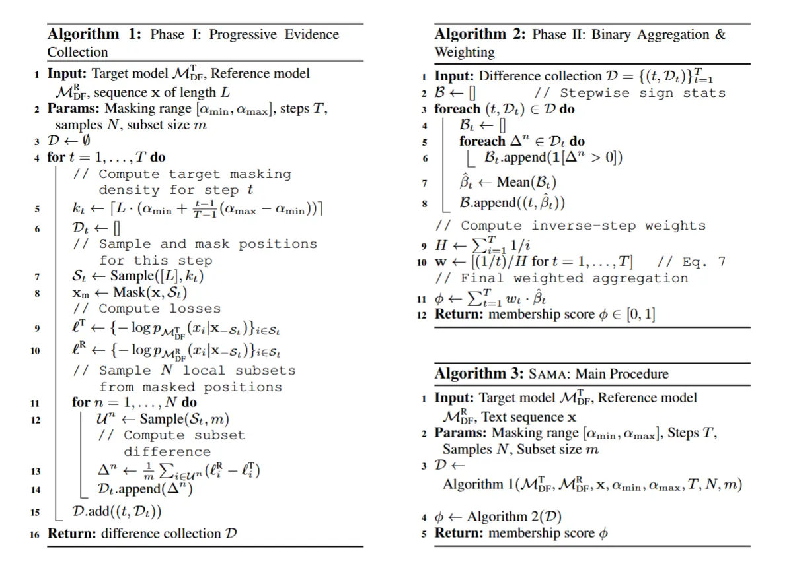

1. **第一阶段**（算法 1）：实施渐进式掩码策略，在 $T$ 个步骤中将掩码密度从 $\alpha_{\min}$ 逐步增加到 $\alpha_{\max}$。在每个步骤 $t$ 确定目标掩码位置数量 $k_{t}$，并通过不放回的均匀子集抽样收集 $N$ 个独立测量值。
2. **第二阶段**（算法 2）：基于符号进行聚合与加权，将原始损失差异转换为稳健的成员身份分数。将每个差异 $\Delta$ 转换为一个二进制指标 $B=\boldsymbol{1}[\Delta>0]$，再对每个步骤 $t$ 计算该密度水平下所有 $N$ 个样本的平均二进制指标 $\hat{\beta}_{t}$。

## 关键结论
### 实验设置
- **数据集**：共 9 个不同领域的数据集。
    - MIMIR 基准测试集：涵盖科学（ArXiv）、代码（GitHub）、论坛（HackerNews）、医疗（PubMed Central）、百科（Wikipedia）、网页（Pile CC）
    - 标准 NLP 基准数据集：WikiText-103、AG News、XSum
- **模型**：LLaDA-8B-Base、Dream-v0-Base-7B（使用各自预训练版本作为参考模型）
- **对比方法**：共 12 种基线方法：
    - 改编 ARMs-MIA：Loss、ZLIB、Lowercase、Neighbor、Min-K%、Min-K%++、ReCall、CON-ReCall、BoWs、Ratio（表现最好的基线）
    - 从图像领域改编的 DLMs-MIA：SecMI、PIA
- **实验参数**：微调采用 AdamW 优化器，学习率 $5\times10^{-5}$，权重衰减为 0.1，批大小为 48，训练 4 个 epoch 并采用早停策略（耐心值为 3）。SAMA 渐进式掩码步骤 $T=16$，范围 $\alpha_{\min}=5\%,~\alpha_{\max}=50\%$，每一步采样大小 $m=10$，子集数量 $N=128$。
    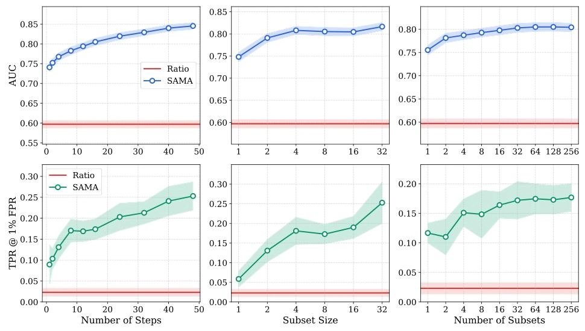
- **评估指标**：AUC（ROC 曲线下面积）、TPR@Low FPR（低假阳性率下的真阳性率）

### 实验结论
1. **SAMA 取得压倒性优势**：在所有 9 个数据集和 2 个模型上，SAMA 的表现均显著优于所有 12 种基线方法。
    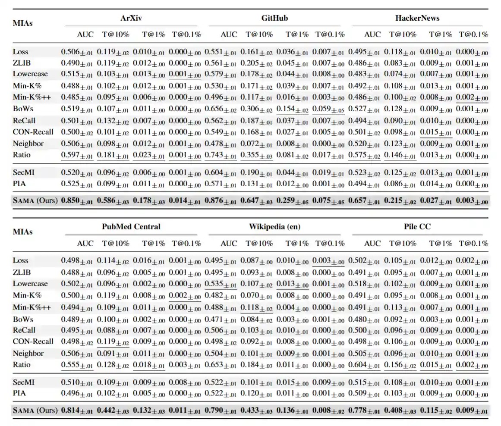

    - **SAMA 性能显著提升**：相比于最佳基线（Ratio），SAMA 的平均 AUC 相对提升了 30%；而在低假阳性率下，SAMA 的性能比现有最好方法提升了高达 4 到 8 倍。
    - **现有方法在 DLM 上几乎失效**：传统的攻击方法在 DLMs 上的 AUC 大多在 0.50-0.55 之间，接近随机猜测，证实了 DLMs 独特的“掩码-预测”机制产生的信号与自回归模型完全不同，且容易被领域适应带来的长尾噪声淹没。
    - **代码数据最脆弱**：在 GitHub 数据集上，SAMA 的 AUC 高达 0.88，表明代码类数据在微调中最容易被记忆和泄露。
2. **基于符号的子集聚合是关键**：在**消融实验**（Ablation Study）中，逐步移除 SAMA 的核心组件，评估其对性能的贡献：
    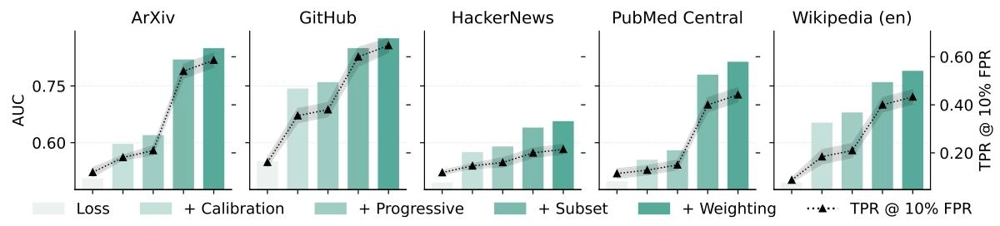

    - **基于符号的子集聚合**（Sign-based Aggregation）：贡献了约 20-30% 的 AUC，是 SAMA 性能提升的最大来源。实验证明，DLMs 的损失分布呈现极端的“长尾特征”（Kurtosis > 80），直接求平均会被噪声主导，而符号投票机制能有效过滤这些噪声。
    - **渐进式掩码**：贡献了约 2-3% 的提升，证明了多尺度探测（从稀疏到密集）能捕捉不同层级的记忆。
3. **潜在防御机制的有效性**：论文评估了四种潜在防御手段：

    | 防御方法 | 原理 | 对 SAMA 的有效性 | 代价 (Utility Cost) |
    | :--- | :--- | :--- | :--- |
    | **温度缩放** | 推理时增加输出熵，试图掩盖真实置信度。 | **无效**。SAMA 依赖相对排序（符号），不受绝对数值变化影响。 | 严重降低生成质量，导致内容不连贯和重复。 |
    | **低秩适配 LoRA** | 减少可训练参数量，限制模型记忆容量。 | **中等**。低 Rank 时有效，高 Rank 时失效。 | Rank 过低会影响模型性能。 |
    | **差分隐私 DP-LoRA** | 在梯度中加入噪声并进行裁剪，从数学上切断对单样本的依赖。 | **高**。能将攻击成功率降至随机猜测水平 （AUC~0.5）。 | 模型困惑度（PPL）上升，生成质量下降明显。 |
    | **选择性混淆 SOFT** | 识别敏感样本并进行句法复述（Paraphrasing），破坏特定的 Token 排列，直接破坏了 SAMA 依赖的 Token 级记忆模式。 | **高**。能将攻击成功率降至随机猜测水平 | 基本保持了语义和模型通用能力。 |

# 实验复现
## 仓库简介
<a href="https://github.com/Stry233/SAMA" logourl="https://github.githubassets.com/assets/apple-touch-icon-144x144-b882e354c005.png" class="LinkCard">SAMA-MIA GitHub Repository</a>

- 项目结构
    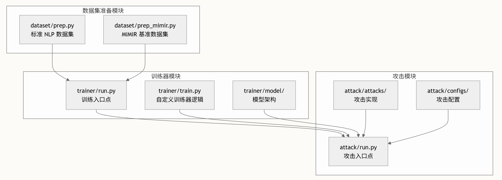
- SAMA 攻击流程
    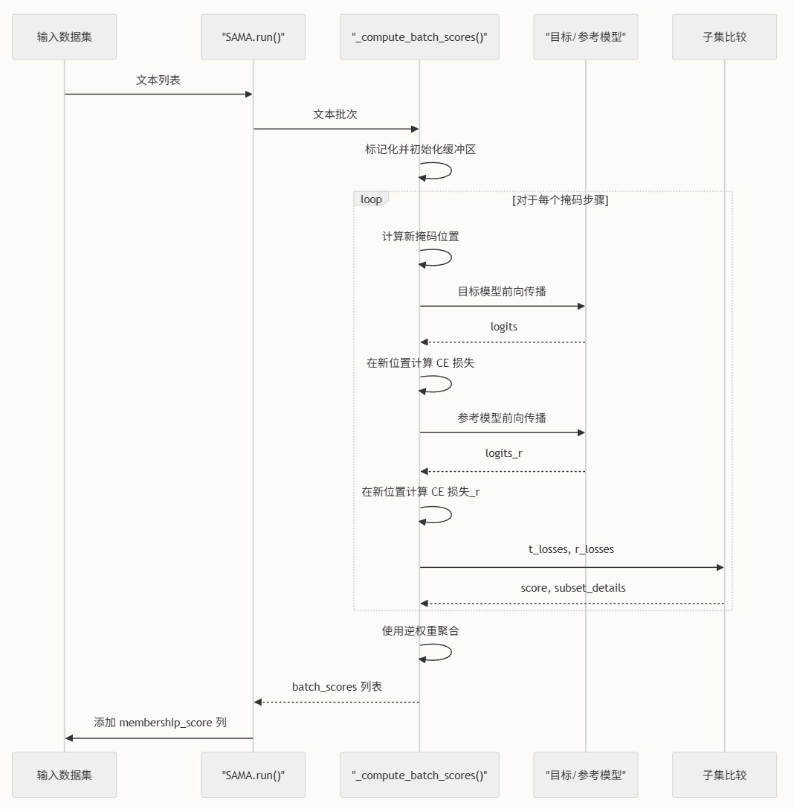

## 复现记录
- **训练**：选择模型 LLaDA-8B-Base，使用 DeepSpeed 多卡训练，Zero_stage 3 优化，训练 10 个 epoch。训练集和参考集分别从 Mimir-arxiv 和 Mimir-github 数据集中抽取。
    - Mimir-arxiv-subset: 10 Epoches, train_subset_size 10000, ref_subset_size 1000（实际上 train_subset 只有 1000 条数据）
    - Mimir-github-subset: 10 Epoches, train_subset_size 1000, ref_subset_size 100

    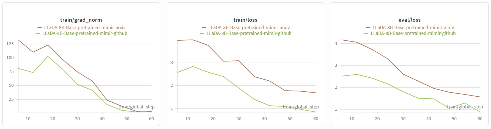
- **攻击**：
    - LLaDA-8B-Base-MIMIR_arxiv：因为显存不足，目标模型和参考模型均使用 8-bit 量化，效果较差
        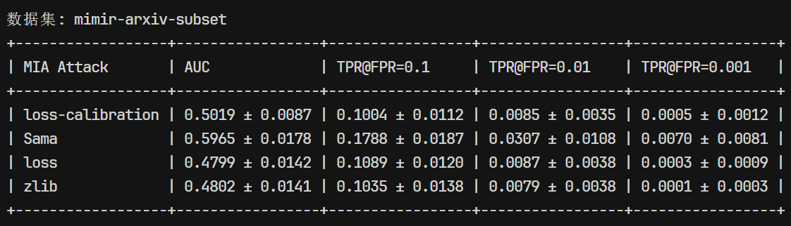
    - LLaDA-8B-Base-MIMIR_github：因为显存不足，目标模型和参考模型均使用 4-bit 量化，虽然比 8-bit 量化的 arxiv 数据集效果稍微好一些，但是依旧没有达到论文中的数据，怀疑可能是因为量化原因。并且 Ratio（即 loss-calibratgion）方法的效果极差，与论文数据差距较大，怀疑可能是因为量化导致 loss 计算不准确。
        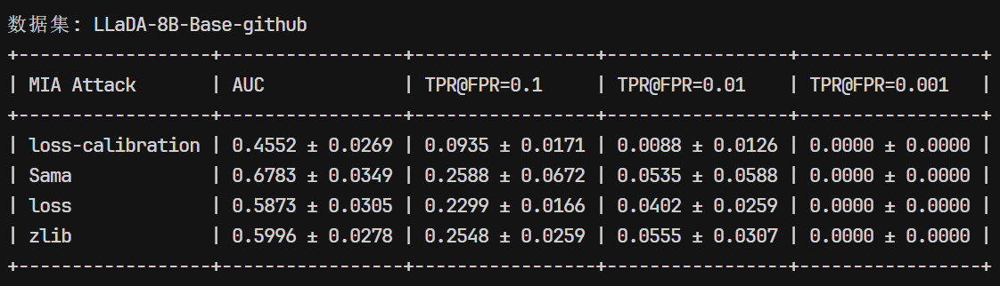

        后来又用 8-bit 量化，稍微缩小分词器长度重新跑了一遍，结果也差不多
        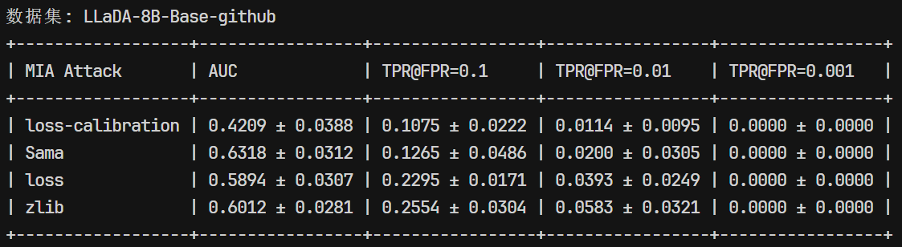
    - LLaDA-8B-Base-wikitext：因为显存不足，目标模型和参考模型均使用 8-bit 量化。相比于 MIMIR 数据集，WikiText-103 数据集较大，故训练集和测试集规模均为前两者的 10 倍
        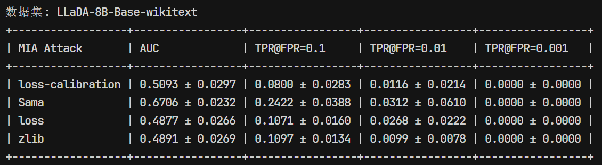

# 参考内容
1. Chen Y, Zhang K, Du Y, et al. Membership Inference Attacks Against Fine-tuned Diffusion Language Models[J]. [arXiv preprint arXiv:2601.20125](https://arxiv.org/html/2601.20125?_immersive_translate_auto_translate=1), 2026.
2. Chen Y, Du Y, Zhang K, et al. Window-based Membership Inference Attacks Against Fine-tuned Large Language Models[J]. [arXiv preprint arXiv:2601.02751](https://arxiv.org/html/2601.02751?_immersive_translate_auto_translate=1), 2026.