> ICLR 2026：[Tab-MIA: A Benchmark Dataset for Membership Inference Attacks on Tabular Data in LLMs](https://arxiv.org/html/2507.17259?_immersive_translate_auto_translate=1)

# 论文简介
论文提出了首个专门用于评估大语言模型（LLM）在表格数据上成员推理风险的基准测试集，深入探讨了结构化数据与非结构化文本在隐私泄露方面的差异，聚焦黑盒 MIA 和微调阶段 MIA 以及一部分预训练阶段 MIA。

## 核心内容
- **基准数据集**：包含 5 个核心数据集（Adult Income、California Housing、TabFact、WikiTableQuestions (WTQ)、WikiSQL），涵盖了短上下文和长上下文两种表格场景。
- **六种编码格式**： 将每个表格序列化为六种不同的文本格式（JSON, HTML, Markdown, Key-Value Pair, Key-is-Value, Line-Separated），以研究编码方式对模型记忆的影响。
    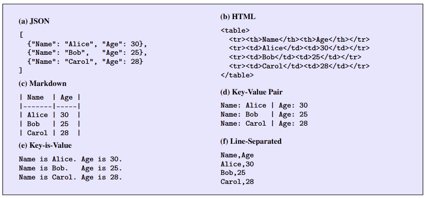
- **深度评估**：评估了当前主流 MIA 方法在表格数据微调 LLM 上的效果——评估了三个最先进的黑盒 MIA（LOSS、Min-K %、Min-K %++）与四个开放权重 LLM（LLaMA-3.1 8B, LLaMA-3.2 3B, Gemma-3 4B, and Mistral 7B）。对于每种攻击报告两个标准指标：AUROC 和 TPR@FPR=5%，分别用于衡量不同决策阈值下的检测性能和严格隐私约束下的检测性能。
    - 复现的时候发现看起来用的 MIA 算法是：基于困惑度、基于概率分析（MIN-K/MAX-K/MIN-k++）、基于熵的方法

## 关键结论
- **微调轮数加剧泄露**：即使仅微调 3 个 Epoch，模型的隐私风险就会大幅上升，部分场景下的 AUROC 评分接近 90% 甚至更高。且随着微调轮数增加，AUROC 和 TPR@FPR=5% 也在增加，说明轮数越多记忆越深，隐私泄露越严重。
    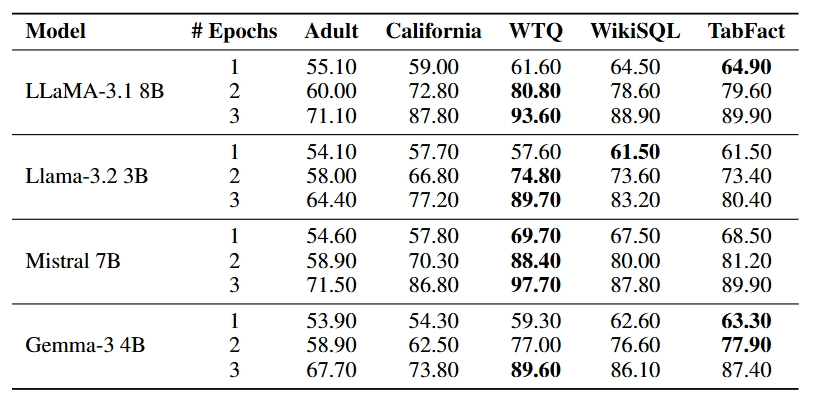
- **模型规模与风险正相关**： 随着模型参数增加（如从 3B 到 8B），其对表格数据的记忆能力增强，导致隐私泄露风险增加约 10-14%。
- **编码格式显著影响风险**： Line-Separated（类似 CSV） 和 Key-Value Pair 格式最容易被攻击。因为这些格式的 Token 排布更紧凑，对单元格内容的记忆更深（WTQ 数据集 Mistral 7B+Line-Separated 格式 AUROC 达 97.7%）。相比之下，HTML 和 JSON 包含较多结构化冗余（如标签、标点），能在一定程度上缓解泄露（AUROC 通常低 10 个百分点）。而 Key-is-Value 和 Markdown 则结构清晰与冗余之间达到了相对平衡。
- **跨格式攻击可行**： 攻击具有部分迁移性，即便攻击者不知道训练时用的是哪种格式，换一种格式进行探测依然能捕捉到隐私信号，仍能实现有效攻击。且实验结果符合直觉：MIA 在结构表示对齐时最有效（即训练与评估使用相同格式时效果最好）。
    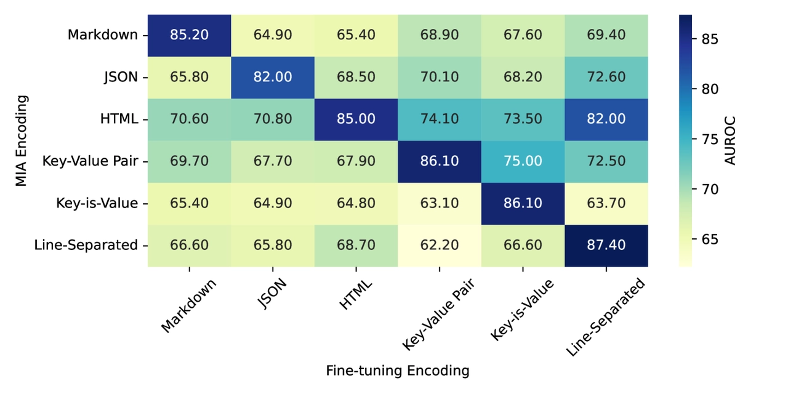
- **预训练模型存有记忆**：未进行微调的预训练模型对公开表格数据（如 WTQ）存在中度记忆（Key-Value Pair 格式下 LLaMA-3.1 8B 的 AUROC 达 72.0%）。
- **上下文规模风险差异**：短上下文数据集（如 WTQ）在 3 轮微调后 AUROC 普遍超 89%，长上下文数据集（如 Adult Income）风险相对温和。

# 实验复现
- 论文中开源了数据集和代码，附录中也提供了相关信息：
    - 模型微调：采用 QLoRA 参数高效微调方法，基于 4 位量化权重训练，单 RTX 6000 GPU（48GB 显存）运行，批次大小为 2。
    - 超参数：学习率 3e-4，使用 paged_adamw_8bit 优化器，热身步数 20，随机种子固定为 42 以保证可复现性。
    - 数据划分：每个数据集 50% 样本作为训练集成员，50% 作为非成员用于 MIA 评估，实验基于 HuggingFace Transformers 和 PEFT 库实现。

## 仓库简介
<a href="https://github.com/eyalgerman/Tab-MIA" logourl="https://github.githubassets.com/assets/apple-touch-icon-144x144-b882e354c005.png" class="LinkCard">Tab-MIA GitHub Repository</a>

<a href="https://huggingface.co/datasets/germane/Tab-MIA/viewer/WTQ/markdown" logourl="https://huggingface.co/front/assets/huggingface_logo-noborder.svg" class="LinkCard">Tab-MIA HuggingFace Dataset</a>

- 项目结构与数据流向
    
    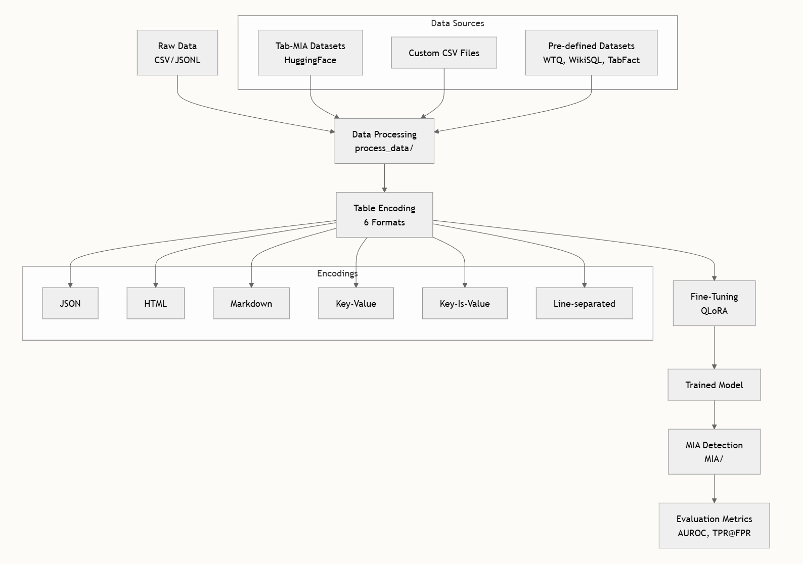
    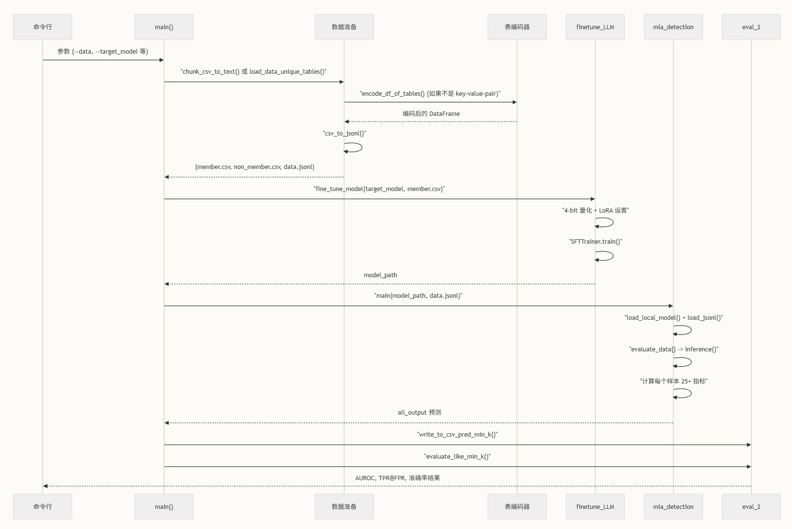
    
- 处理流程
    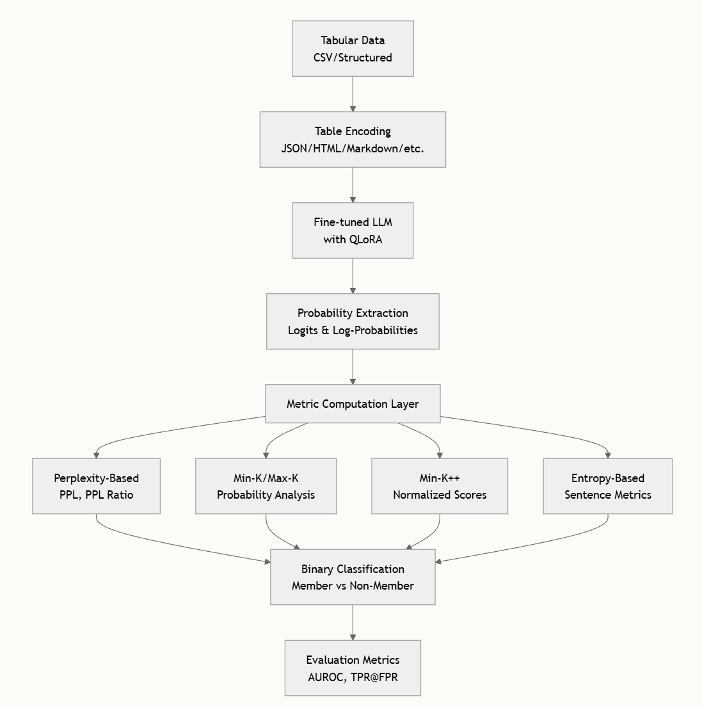

## 复现记录
在实验室机器上进行复现，测试了以下几种组合，结果大致符合论文所述，部分数值偏低一些（10% 左右）

- 数据集 WTQ，编码格式 line-sep，模型 Mistral 7B，微调轮数 epochs 1/2/3
    
    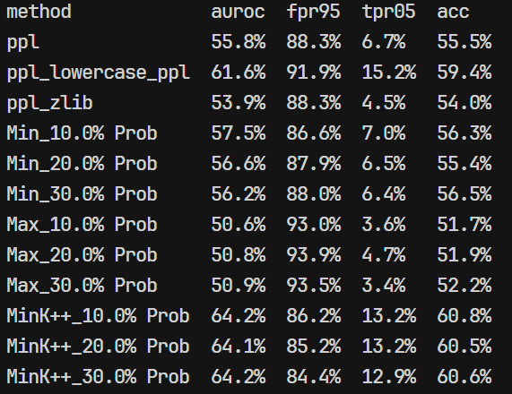
    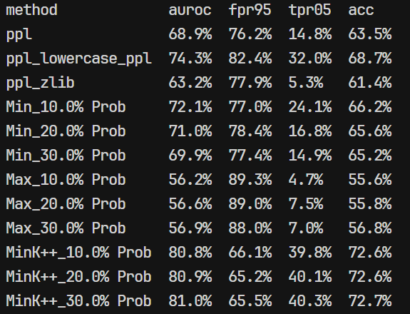
    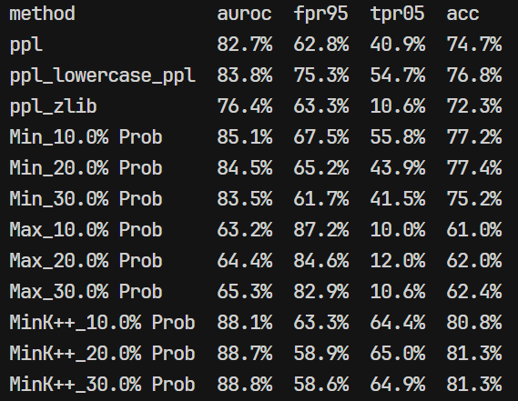
    
- 数据集 WTQ，编码格式 json，模型 Mistral 7B，微调轮数 epochs 1/2/3
    
    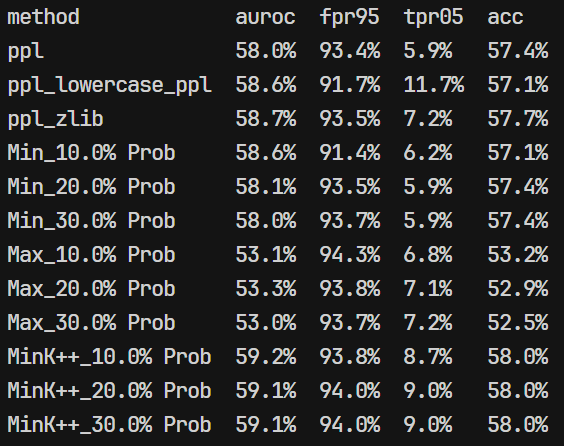
    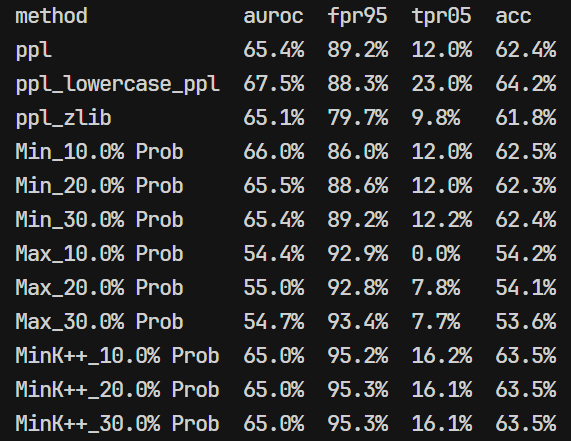
    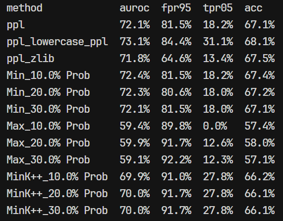
    
- 数据集 adult，编码格式 json，模型 Mistral 7B，微调轮数 epochs 1/2/3
    
    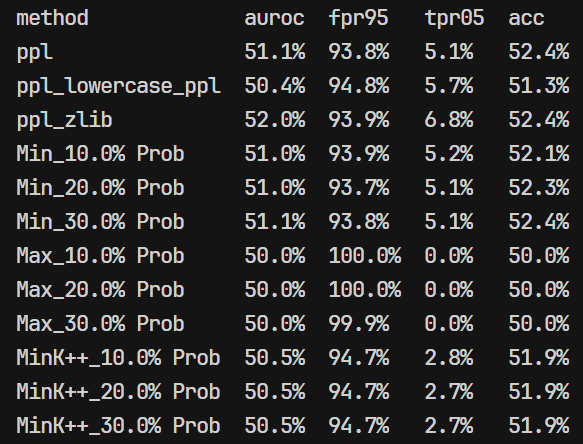
    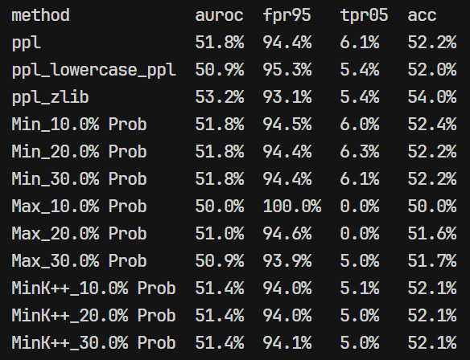
    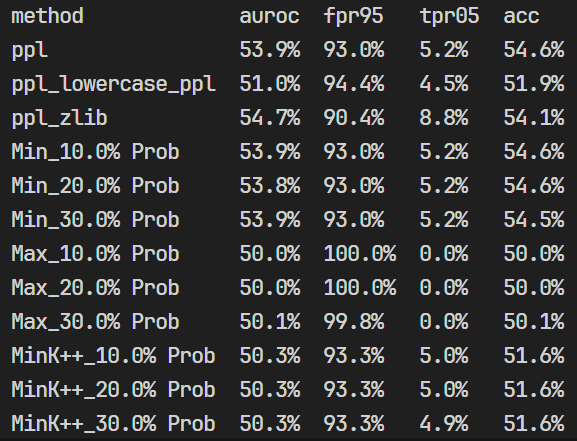
    
- 数据集 WTQ，编码格式 line-sep，模型 Gemma 2b，微调轮数 epochs 1/2/3
    
    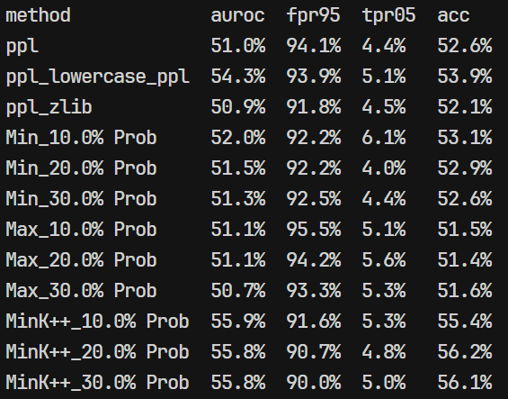
    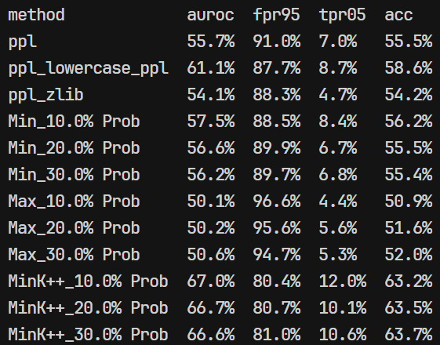
    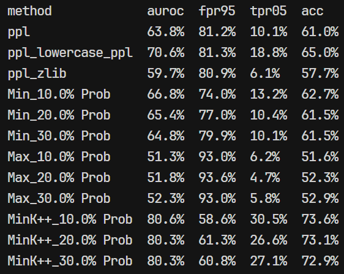
    

# 参考文献
1. German E, Antebi S, Samira D, et al. Tab-MIA: A Benchmark Dataset for Membership Inference Attacks on Tabular Data in LLMs[J]. [arXiv preprint arXiv:2507.17259](https://arxiv.org/html/2507.17259?_immersive_translate_auto_translate=1), 2025.