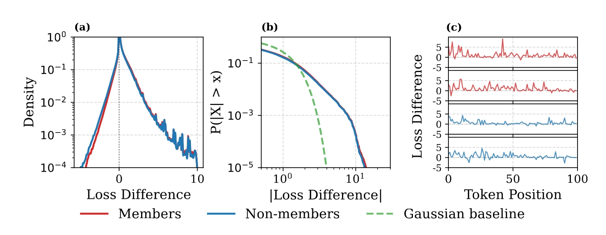
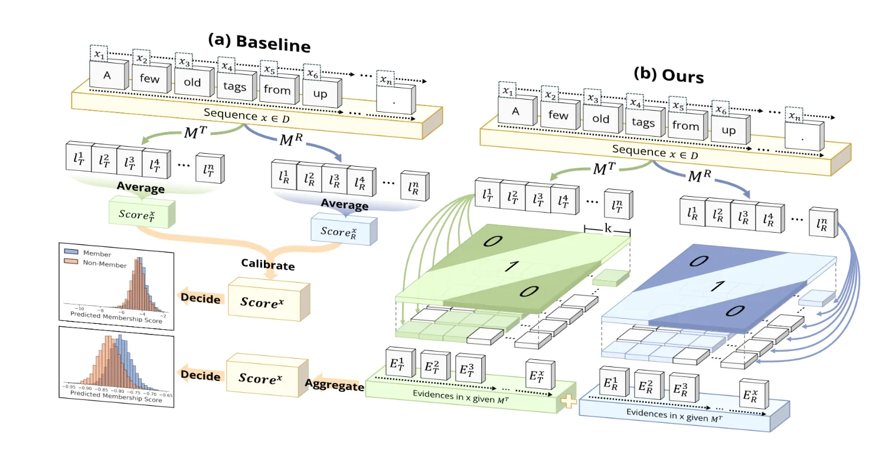
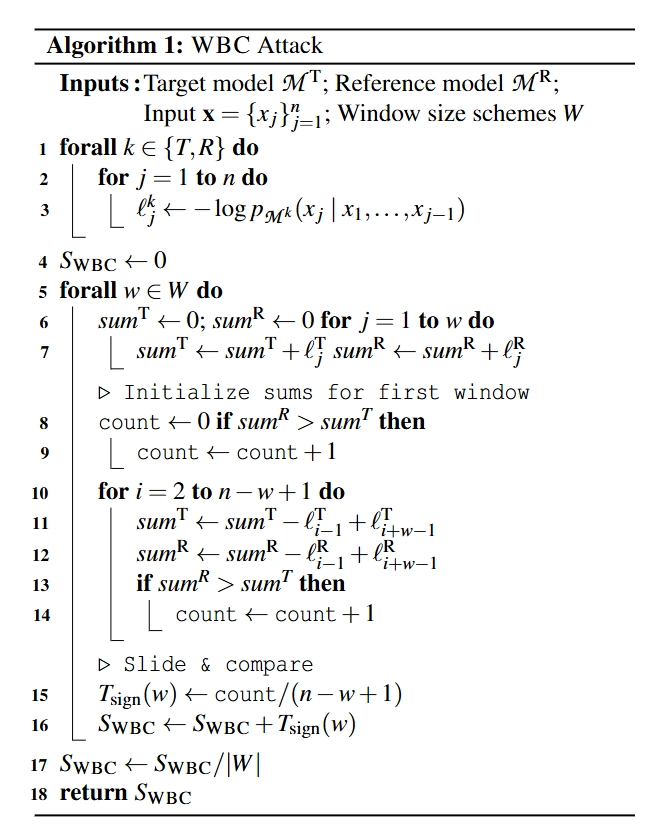
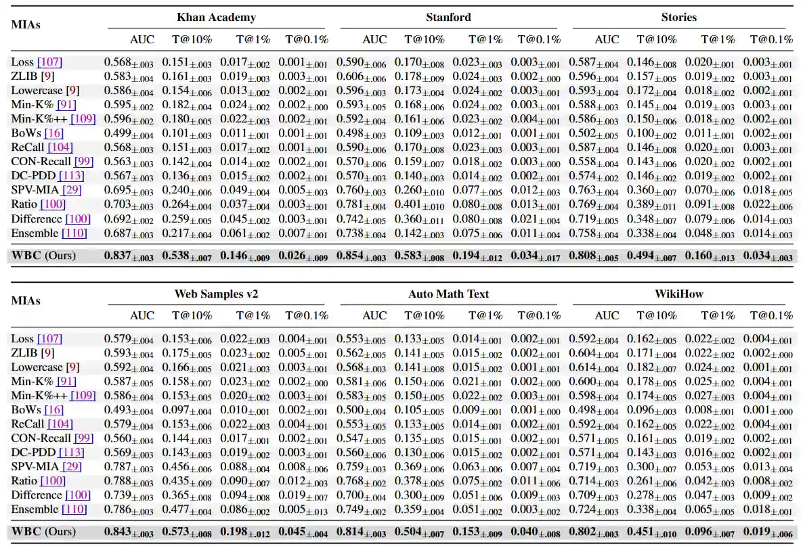
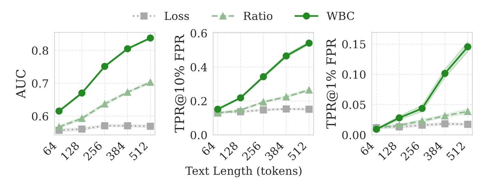
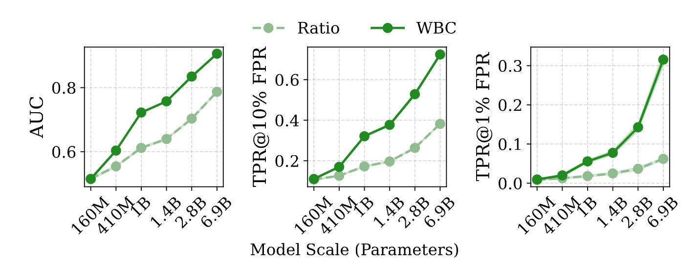
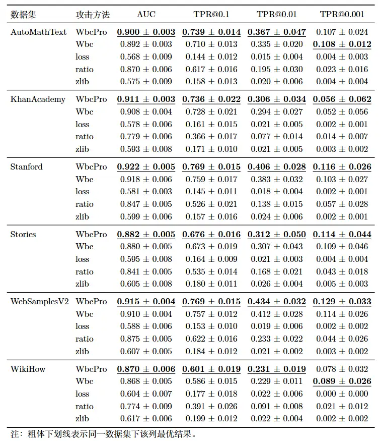

> USENIX 2026：[Window-based Membership Inference Attacks Against Fine-tuned Large Language Models](https://arxiv.org/abs/2601.02751)

# 论文简介
论文系统性地研究了微调大语言模型（LLMs）的成员推理攻击（MIA）。作者指出，大多数现有的 MIA 方法依赖全局信号（如文本序列上的平均损失）来识别训练数据，但在微调场景下，这种全局平均的方法会被噪声主导，稀释微小、局部的记忆信号。为此，论文提出了 WBC（Window-Based Comparison） 攻击框架，通过滑动窗口结合基于符号的聚合，并通过几何级数集成来增强攻击效果来提取并捕捉局部记忆信号，显著提升了针对的成员推理攻击效果，属于灰盒、参考模型、微调阶段 MIA。

---
> 同个作者还有一篇发在 ICLR 2026 的 [Membership Inference Attacks Against Fine-tuned Diffusion Language Models](https://arxiv.org/abs/2601.20125)，二者思路极其类似，或许可以认为是另一篇的前期核心研究：WBC 框架中“局部窗口采样+符号过滤长尾噪声”的核心思路，与 SAMA 中针对扩散模型提出的“多尺度掩码采样+符号过滤”原理完全一脉相承。

## 背景知识

在基于参考模型的成员推理攻击中，最常见的方法是计算整条输入序列的“平均损失差异”。然而，作者通过大量经验分析发现，微调模型中存在一个反直觉的现象，直接导致了全局平均方法的失效。

1. **反直觉的发现**：最强的成员身份鉴别信号，并不是看模型表现得有多“完美”（右尾区域：巨大的损失下降，但却是领域适应带来的噪声），而是看它在普通词上“少退步了多少”（左尾区域：微弱的优势，反而是成员身份的真正信号）。具体来说：
    - **右尾区域是噪声**：目标模型在某些领域特征词上表现极其优异，Loss 出现几十倍的大幅下降，在图中表现为右侧正值区域的巨大信号。但这并不是真正的记忆，而是大模型微调产生的领域适应（Domain Adaptation）。一些特定领域的特征高频词汇（无论是训练集内还是集外数据都会包含这些词）在目标模型中会产生极大的损失下降。这种呈现长尾分布的巨大噪声主导了整段文本的平均值，直接掩盖了数值微小、分布稀疏的真正记忆信号。
    - **左尾区域才是信号**：为了给领域词“腾出预测概率”，目标模型在某些普通词上的表现反而不如基础模型（Loss 反常地升高）。而如果这段话是真正的训练集，因为模型对其有局部记忆，它在这种普通词上的退步幅度会略微小一点，因此表现成员分布的左尾区域呈现出微小但持续的右移趋势。
2. **信号是稀疏且极端的**（Sparse, Extremal Events）：模型对训练集的真正记忆信号并不是均匀分布在每个词上的，而是集中在局部的极端事件中（如特定词组）。

为了从数学上证明为什么传统 MIA 方法会失效，论文建立了一个全局损失差异模型。所有 Token 的全局平均损失差异 $\overline{\Delta}$ 可以分解为三个部分：

$$
\overline{\Delta}=\frac{1}{n} \sum_{j=1}^{n} \Delta_{j}=\underbrace{\mathbb{I}\left[\mathbf{x} \in D_{train }\right] \cdot \rho_{\delta} \overline{\gamma}}_{\text{membership signal}} + \underbrace{\frac{1}{n} \sum_{j=1}^{n} \xi_{j}}_{\text{rare token noise}} + \underbrace{\overline{\varepsilon}}_{\text{baseline noise}}
$$

1. **第一项 (membership signal)**：真正的成员信号，其期望值为 $\rho_{\delta} \overline{\gamma}$。但它非常稀疏且微弱。
2. **第二项 (rare token noise)**：由罕见领域词汇引发的长尾极端噪声事件。因为这类事件呈现长尾分布，其方差极大。
3. **第三项 (baseline noise)**：基础的预测波动噪声。

**全局平均失效的根本原因**：这个公式揭示了，由于 $\xi_{j}$ 呈现极端的长尾分布，哪怕序列中只出现了一个极端的领域词噪声（其数值可能是正常波动的 10~100 倍），它也会彻底支配整个平均值，将第一项微弱的真实记忆信号完全掩盖。大数定律在这种长尾分布下收敛极慢，导致全局统计指标彻底失效。

## 核心内容

论文提出了基于滑动窗口的成员推断攻击 WBC（Window-based Membership Inference Attack），核心思想是利用几何级数排列的不同尺寸的滑动窗口来收集局部损失差异的成员信号，并通过基于符号的统计方法过滤掉长尾噪声，最终形成一个鲁棒的成员推理攻击。

### 滑动窗口局部比较 (Sliding Window)
不计算整段文本，而是使用大小为 $w$ 的滑动窗口遍历长度为 $n$ 的序列，计算每个窗口 $i$ 内的局部损失差异总和：
$$
S_i(w) = \sum_{j=i}^{i+w-1} \Delta = \sum_{j=i}^{i+w-1} \left( \ell^R_j - \ell^T_j \right)
$$

通过在短窗口内进行聚合，WBC 能在不破坏局部连续信号的前提下，过滤掉孤立的噪声。

### 基于符号的聚合 (Sign-based Aggregation)

由于损失差异呈现高度污染的长尾混合分布，我们需要把局部窗口的分数聚合成最终的成员分数。这里有两种直观的方法：基于均值的聚合（Mean-based）和基于符号的聚合（Sign-based）。具体定义如下：

$$
\begin{aligned}
T_{mean}&=\frac{1}{n-w+1} \sum_{i=1}^{n-w+1} S_{i}(w) \\
T_{sign}&=\frac{1}{n-w+1} \sum_{i=1}^{n-w+1} \mathbb{I}\left[S_{i}(w)>0\right]
\end{aligned}
$$

WBC 选择了后者，原因如下：由于损失差异呈现高度污染的长尾混合分布，均值聚合依然会被右尾那巨大的异常值影响；而基于符号的聚合完全抛弃了数值的大小而只看方向。不管某个窗口是因为遇到了极端领域词导致 Loss 下降了 15.0，还是因为局部记忆导致 Loss 仅仅下降了 0.01，它都只计作 +1 票。这种极其鲁棒的“民主投票”机制，像滤网一样削平了长尾巨浪噪声，让微弱的左尾真实信号得以累加突显。

### 多尺度几何窗口集成 (Geometric Ensemble Strategy)

不同数据集的记忆模式不同，有些是 Token 级的死记硬背（适合小窗口），有些是段落级的结构记忆（适合大窗口）。因此，论文不再追求某个“难以确定的最优窗口大小”，而是采用一种无需调参的集成方法。为了高效且无冗余地覆盖所有尺度，WBC 使用了几何级数（Geometric Progression）来决定窗口大小的采样：

$$
w_{k}=\text{round}\left(w_{min } \cdot\left(\frac{w_{max }}{w_{min }}\right)^{\frac{k-1}{|W|-1}}\right)
$$

其中 $k \in \{1, ...,|W|\}$，$w_{min }$ 和 $w_{max }$ 界定了尺度范围。

这一设计的精妙之处在于，这种几何间距确保了连续窗口大小之间的比率保持近似恒定，即 $w_{k+1} / w_{k} \approx(w_{max } / w_{min })^{1 /(|W|-1)}$。同时，这也遵循了尺度空间理论（Scale-space theory）中优化多分辨率分析的原则——记忆信号最可能出现的小窗口会进行密集采样，而较大的窗口则以更稀疏的方式采样。最终将所有窗口下的 $T_{sign}$ 结果平均，即可获得极具鲁棒性的成员分数。

贴一张论文中的算法：

## 关键结论

论文在 11 个数据集、多种主流模型（包括 Pythia, Llama-3, GPT-J, Mamba 等）上使用 WBC 进行了详尽评估。

1. **绝对性能优势与高精度检出**：WBC 跨数据集平均 AUC 达到 0.839，远超最强基线 Ratio (0.754)。在严苛的高置信度指标 TPR@1%FPR 下，WBC 的平均表现实现了 2.8 倍的跃升。
    
2. **文本长度与统计效力（Text Length Scaling）**：随着可观测的文本序列变长，可滑动的窗口增多，符号投票的统计效力大幅增强。在 512 个 Token 长度时，WBC 对比 Baseline 的优势可以拉开到惊人的 20.8%。
    
3. **模型规模越大，隐私漏洞越深**：随着参数量的攀升（160M -> 6.9B），模型记忆容量变大。传统方法由于无法过滤长尾噪声，攻击性能很快遭遇瓶颈；而能精准打击局部靶点的 WBC 则表明：模型越大，漏洞越致命。
    
4. **防御机制形同虚设**：
    - **温度缩放 (Temperature Scaling)**：基本无效。因为增加输出熵只改变损失的绝对数值，不改变窗口间的相对排序，基于符号聚合的 WBC 能够完全免疫。
    - **低秩微调 (LoRA)**：虽然限制了参数更新空间，但 WBC 依然能捕捉到残存的局部记忆模式，保持近 3 倍的优势。
    - **差分隐私 (DP-SGD)**：虽然能大幅降低绝对攻击成功率，但在适度隐私预算下，WBC 的优势依然存在。

# 实验复现
<a href="https://github.com/Stry233/WBC" logourl="https://github.githubassets.com/assets/apple-touch-icon-144x144-b882e354c005.png" class="LinkCard">WBC-MIA GitHub Repository</a>

## 复现记录
- **训练**：选择 Pythia-160M 与 Pythia-1B 进行复现，在实验室 3090 24GB GPU 上，训练 10 个 epoch。训练集和参考集分别从 Cosmopedia 的六个子数据集中抽取，规模为成员与非成员数据各 2000 条。

- **攻击**：
    - Pythia-1B 在 Cosmopedia 数据集上的攻击效果与论文中的数据相符甚至更优，如图所示：
        
    - Pythia-160M 在 Cosmopedia 数据集上的攻击效果则较差，合理推测是因为模型规模较小，记忆能力有限，导致成员信号过于微弱，难以被捕捉。

## 尝试优化
从上面的图中可以发现，我还实现了一个名为 WbcPro 的改进版本。核心思路如下：

1. 第一项改动发生在**单个窗口长度的得分计算**上。原始 WBC 使用的是正差窗口比例，也就是简单的 $k_w/n_w$，其中 $k_w$ 表示满足 $G_w(k)>0$ 的窗口个数，$n_w$ 表示总窗口数。我们的增强实现保留这一二项统计框架，但把原始比例替换为 Wilson 区间上界：
    $$
    \hat{s}_w=\frac{\hat{p}_w+\frac{z^2}{2n_w}+z\sqrt{\frac{\hat{p}_w(1-\hat{p}_w)}{n_w}+\frac{z^2}{4n_w^2}}}{1+\frac{z^2}{n_w}}, \qquad \hat{p}_w=\frac{k_w}{n_w}.
    $$

    这样做是因为考虑到：当窗口较长时，能够滑动的窗口数量会明显减少，直接使用 $k_w/n_w$ 容易在小样本条件下波动过大。Wilson 形式把有限窗口数带来的不确定性显式纳入打分过程，使不同窗口长度下的分数更加平滑，也有助于减弱偶然波动带来的误判。
2. 第二项改动发生在**多窗口融合**上。原始 WBC 通常对各个窗口长度做等权平均；而我们采用
    $$
    S^{\ast}(x)=\sum_{w\in W}\alpha_w \hat{s}_w, \qquad \alpha_w \propto \frac{1}{\sqrt{w}}, \qquad \sum_{w\in W}\alpha_w=1.
    $$

    这意味着较短窗口会获得略高一些的权重。这样处理的灵感是来源于作者的另一篇论文 [SAMA](https://arxiv.org/abs/2601.20125)，其中在汇总不同掩码密度下的得分采用了逆步骤权重，我在这里将其演化为逆窗口长度权重。原因有两点：其一，成员信号往往具有明显的局部性，小到中等尺度的窗口通常更敏感；其二，窗口越长，可用窗口数越少，统计方差也往往更大。基于这两点，用 $1/\sqrt{w}$ 做一层温和的衰减，能够在保留多尺度信息的同时，进一步突出更有判别力的局部片段。

可以观察到，改进后的 WbcPro 在 Pythia-1B 上的表现有了少许提升。

# 参考文献
1. Chen Y, Du Y, Zhang K, et al. Window-based Membership Inference Attacks Against Fine-tuned Large Language Models[J]. [arXiv preprint arXiv:2601.02751](https://arxiv.org/html/2601.02751?_immersive_translate_auto_translate=1), 2026.