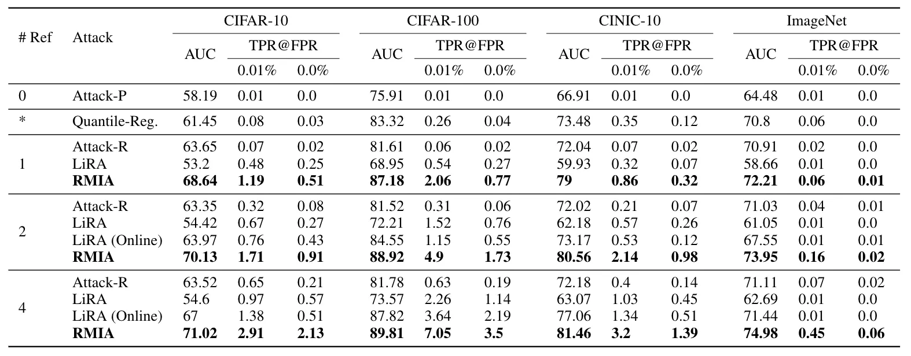
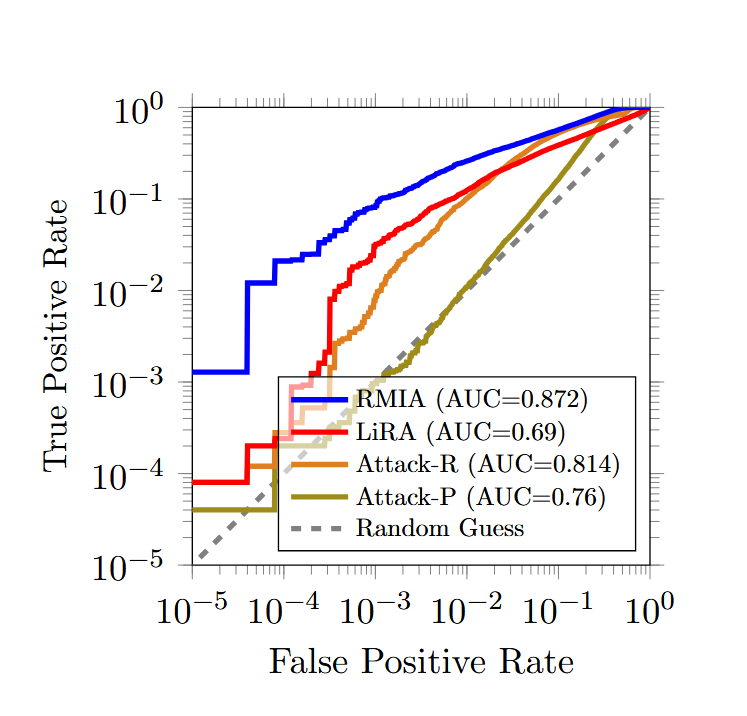
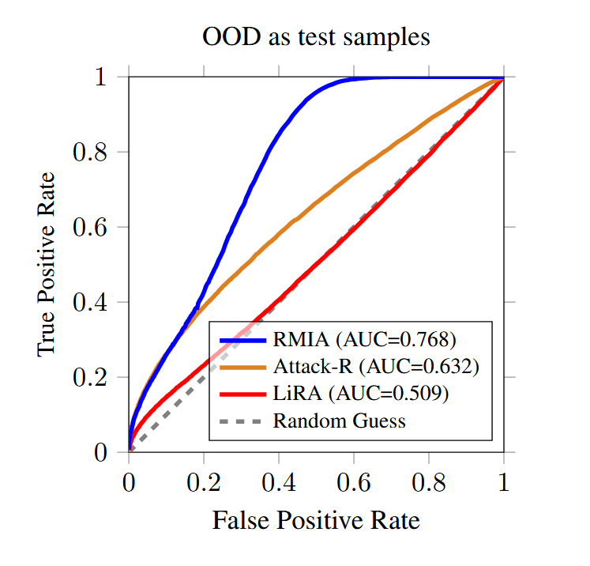
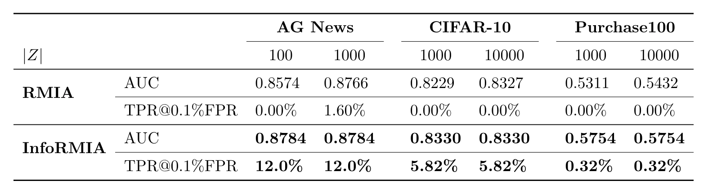
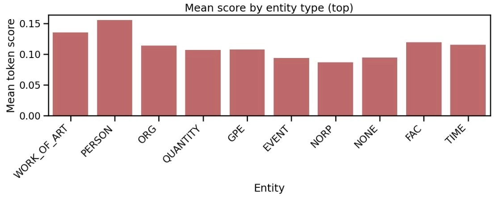

# RMIA 论文解读
> ICML 2024：[Low-Cost High-Power Membership Inference Attacks](https://arxiv.org/html/2312.03262?_immersive_translate_auto_translate=1)

论文提出一种低成本、高性能的鲁棒成员推理攻击（RMIA），解决此前现有成员推理攻击（MIA）计算开销高、低误报率（FPR）下真阳性率（TPR）低、鲁棒性差的问题，为机器学习模型隐私风险审计提供实用工具，聚焦黑盒场景下的参考模型类攻击。

## 核心内容
### 攻击原理
RMIA 将成员推理转化为假设检验问题，通过细粒度建模零假设，结合成对似然比检验（LR）实现精准区分。

- **零假设**（$H_{out}$）：目标样本 $x$ 未参与目标模型 $\theta$ 的训练，等价于“$x$ 被种群分布 $\pi$ 中随机样本 $z$ 替换后 $\theta$ 的训练场景”集合。
- **参考模型**：与 $\theta$ 结构相似的辅助模型 $\theta_{ref}$，分为 IN 模型（训练集含 $x$）和 OUT 模型（训练集不含 $x$），用于估算数据的“正常概率”基准。
- **种群随机样本** $z$：从 $\pi$ 中随机抽取的非 $\theta$ 训练数据，作为非成员基准样本。
- **成对似然比**（LR）：衡量 $x$ 相对于 $z$ 在模型 $\theta$ 上的“特殊记忆”程度，LR 越大，$x$ 越可能是成员。
    1. 似然比定义：
        $$
        LR_{\theta}(x, z)=\frac{p(\theta | x)}{p(\theta | z)}
        $$

        - $p(\theta | x)$：目标样本 $x$ 参与训练时生成目标模型 $\theta$ 的概率，反映 $\theta$ 对 $x$ 的记忆程度；
        - $p(\theta | z)$：典型非成员样本 $z$ 参与训练时生成目标模型 $\theta$ 的概率，作为非成员基准。
    2. 黑盒场景简化（贝叶斯规则）：由于上式中的“模型生成概率”不可直接计算，利用贝叶斯规则转化为“模型预测概率”：
        $$
        LR_{\theta}(x, z)=\left(\frac{p(x | \theta)}{p(x)}\right) \cdot\left(\frac{p(z | \theta)}{p(z)}\right)^{-1}=\left(\frac{p(x | \theta)}{p(x)}\right) \cdot\left(\frac{p(z)}{p(z | \theta)}\right)
        $$

        - $p(x | \theta)$：目标模型 $\theta$ 对 $x$ 的预测似然（如Softmax 概率）；
        - $p(x)$：参考模型对 $x$ 的平均预测似然（基准值）；
        - 两项分别表示 $x$ 和 $z$ 的“成员概率相对值”。
    3. 攻击得分计算：
        $$
        \text{Score}_{MIA}(x ; \theta)=p_{z \sim \pi}\left(LR_{\theta}(x, z) \geq \gamma\right)=\mathbb{E}_{z \sim \pi}\left[\mathbb{I}\left(LR_{\theta}(x, z) \geq \gamma\right)\right]
        $$

        - 统计 $x$ 能“支配”的种群样本 $z$ 比例，即 $x$ 相对于 $z$ 的似然比 $LR\geq\gamma$ 的 $z$ 占种群随机样本集合 $Z$ 的比例。（$\gamma$ 为预设阈值，通常大于等于 1）；
        - 得分 $\text{Score}\geq\beta$ 则判定为成员，否则为非成员。（$\beta$ 为预设决策阈值）。

### 攻击流程
1. 训练少量参考模型（1-2个即可），从种群分布 $\pi$ 中采样大量非成员样本 $z$；
    - **离线模式**：仅训练 OUT 模型，节省计算资源，适合大规模评估场景；
    - **在线模式**：为每个目标样本 $x$ 训练对应的 IN 模型，性能更优，但计算开销较大。
2. 用参考模型 $\theta_{ref}$ 估算 $p(x)$ 和 $p(z)$；
3. 计算目标样本 $x$ 与每个 $z$ 的似然比 $LR$；
4. 统计 $LR\geq\gamma$ 的 $z$ 比例作为攻击得分；
5. 得分 $\text{Score}\geq\beta$ 则判定 $x$ 为目标模型 $\theta$ 的训练成员。

## 关键结论
### 实验设置
- 数据集：CIFAR-10/100、CINIC-10、ImageNet、Purchase-100（覆盖图像、表格数据）；
- 对比方法：LiRA、Attack-P、Attack-R、Quantile Regression 等主流 MIA；
- 评估指标：AUC（ROC曲线下面积）、低 FPR（0%/0.01%）对应的 TPR。

### 实验结论
1. 低成本高性能：仅用 1 个参考模型时，CIFAR-100 上 AUC 达 87.18%，较 LiRA（68.95%）提升 26%，0% FPR 下 TPR 达 0.77%（LiRA 仅 0.27%）；
    
2. 低误报率高性能：在极低 FPR（甚至0）下仍保持高 TPR，低 FPR 区域 TPR 较现有方法提升 2-4 倍；
    
3. 强鲁棒性：
    - 面对分布外（OOD）数据，RMIA AUC 达 0.768，远超 LiRA（0.509）和 Attack-R（0.632）；
        
    - 目标模型与参考模型数据集/架构不同时，AUC 仍领先最多 25%；
4. 通用性：适用于神经网络、梯度提升决策树（GBDT）等算法，支持多类型数据集；
5. 离线模式高效：仅用 OUT 模型（无需为每个 $x$ 训练 IN 模型）即可实现接近在线模式的性能，大幅降低计算成本。

# InfoRMIA 论文解读
> ICLR 2026：[(Token-Level) InfoRMIA: Stronger Membership Inference and Memorization Assessment for LLMs](https://arxiv.org/html/2510.05582v1?_immersive_translate_auto_translate=1)

论文针对 RMIA 依赖大规模种群数据集、得分离散、调参复杂等问题，提出信息论驱动的 InfoRMIA，同时适配大型语言模型（LLMs）的 token 级隐私评估需求，实现更精准、高效、细粒度的成员推理，聚焦 LLMs 和 LMMs 场景下的黑盒参考模型类攻击。

## 核心内容
### 攻击原理
InfoRMIA 从信息论视角重构成员推理，将 RMIA 的“离散计数得分”转化为“连续信息增益得分”，并提出 token 级评估框架适配 LLMs 特性。

- **信息增益**：“用目标样本 $x$ 解释模型 $\theta$ 的生成”比“用种群随机样本 $z$ 解释模型 $\theta$ 的生成”平均节省多少比特信息，增益越大，$x$ 越可能是成员；
    - 相比之下，RMIA 的得分是离散的：给定了种群随机样本集合 $Z$ 之后，则集合规模决定了得分粒度，如 $|Z|=100$ 时粒度为 0.01，难以捕捉细微差异；
    - 而 InfoRMIA 的得分是连续的：其核心是基于信息论的平均信息增益计算，不受 $Z$ 规模限制，得分取值范围为实数域，能捕捉更细腻的记忆信号。
    - 同时，这也使得 InfoRMIA 不再像 RMIA 那样强依赖大规模种群数据集 $Z$，只需少量样本（如 100 个）即可稳定估计分布特征，降低数据收集成本。
- **token 级评估**：适配 LLM 逐 token 生成的本质，把整个文本序列的成员推理拆解成每个 token 在前缀基础上的的独立推理，既能精准找到敏感信息对应的 token，又能保留序列级推理能力。
    - 相比之下，现有框架只为每个序列计算一个成员信号，这是一种高度压缩的信号，丢失了每个 token 位置上的丰富信息，一方面难以定位敏感 token，另一方面隐私信号也更容易被非敏感 token 稀释。
- **核心公式**
    1. 原始信息增益定义：
        $$
        \text{Test Statistic} = \mathbb{E}_{z} \left[ \log\left( \frac{p(\theta | x)}{p(\theta | z)} \right) \right]
        $$

        - 对所有 $z$ 计算用 $x$ 解释 $\theta$ 与用 $z$ 解释 $\theta$ 的对数似然比期望，即平均信息增益。
    2. 贝叶斯分解与 KL 散度转换（最终形式）：
        $$
        \begin{aligned}
        \text{Test Statistic} & =\sum_{z} p(z) \log \left(\frac{p(\theta | x)}{p(\theta | z)}\right) \\
        & =\sum_{z} p(z) \log \left(\frac{p(x | \theta) p(z)}{p(z | \theta) p(x)}\right) \\
        & =\sum_{z} p(z)\left[\log \left(\frac{p(x | \theta)}{p(x)}\right)+\log \left(\frac{p(z)}{p(z | \theta)}\right)\right] \\
        & =\log \left(\frac{p(x | \theta)}{p(x)}\right)+\sum_{z} p(z) \log \left(\frac{p(z)}{p(z | \theta)}\right) \\
        & =\log \left(\frac{p(x | \theta)}{p(x)}\right)-\mathbb{E}_{z} \left[ \log\left( \frac{p(z | \theta)}{p(z)} \right) \right] \\
        & =\log \left(\frac{p(x | \theta)}{p(x)}\right)+D_{KL}(p(z) \| p(z | \theta))
        \end{aligned}
        $$

        - **记忆项**：$\log\left( \frac{p(x | \theta)}{p(x)} \right)$，量化 $\theta$ 对 $x$ 的记忆程度，比值越大，记忆越深；
        - **校准项**：$D_{KL}(p(z) \parallel p(z | \theta))=-\mathbb{E}_{z} \left[ \log\left( \frac{p(z | \theta)}{p(z)} \right) \right]$，量化种群 $z$ 的先验分布与 $\theta$ 条件下分布的差异，校准“记忆项”的偏差，避免因 $x$ 是易分类样本（即使非成员也有高预测概率）导致的误判。$D_{KL}$ 越小，即 $\mathbb{E}_{z}$ 越大，说明模型对所有数据都很自信，$x$ 的记忆信号就越不可靠。
    3. LLM token 级适配：
        - 无需额外构建种群数据集 $Z$，直接用 LLM 词汇表中除目标 token $x$ 外的所有 token 作为 $z$；
            - 由
                $$
                \begin{aligned}
                & p(x | \theta) + \sum_{z \in Z} p(z | \theta) = \sum_{z \in V} p(z | \theta) = 1 \\
                & \sum_{z \in V} p(z) = \sum_{z \in V} Avg_{\theta_{ref }} p(z | \theta_{ref }) = Avg_{\theta_{ref }} \sum_{z \in V} p(z | \theta_{ref }) = 1
                \end{aligned}
                $$
            - 可以得到一个不需要标准化的等价公式
                $$
                \begin{aligned}
                & \sum_{z \in Z} p(z) log \left(\frac{p(\theta | x)}{p(\theta | z)}\right) \\
                = & \sum_{z \in Z} p(z) log \left(\frac{p(x | \theta) p(z)}{p(z | \theta) p(x)}\right)+p(x) log \left(\frac{p(x | \theta) p(x)}{p(x | \theta) p(x)}\right) \\
                = & \sum_{z \in V} p(z) log \left(\frac{p(x | \theta) p(z)}{p(z | \theta) p(x)}\right) \\
                = & \sum_{z \in V} p(z) log \left(\frac{p(x | \theta)}{p(x)}\right)+\sum_{z \in V} p(z) log \left(\frac{p(z)}{p(z | \theta)}\right) \\ = & log \left(\frac{p(x | \theta)}{p(x)}\right)+D_{KL}(p(z) \| p(z | \theta))
                \end{aligned}
                $$
            - 则 InfoRMIA 公式不变，但 $z$ 取自词汇表 $V$，无需将 $x$ 从 $V$ 中剔除。
        - 对每个 token 单独计算 InfoRMIA 得分，通过平均、Min-k 等方式聚合为序列级得分。

### 攻击流程
1. 训练少量参考模型，采样少量种群样本 $z$（对 LLM 而言，可以直接使用词汇表）；
2. 用参考模型 $\theta_{ref}$ 估算 $p(x)$ 和 $p(z)$；
3. 计算目标样本 $x$ 的记忆项 $\log\left( \frac{p(x | \theta)}{p(x)} \right)$；
4. 计算校准项 $D_{KL}(p(z) \parallel p(z | \theta))$；
5. 代入公式得到连续攻击得分，得分越高，$x$ 为成员的概率越大。

特别的，对于 LLM 场景下的 token 级 InfoRMIA，流程如下：

1. 将文本序列拆分为“前缀-token”对（如序列 $\{x_1,x_2,x_3,\ldots,x_N\}$ 拆分为 $(\{x_1\},x_2),(\{x_1,x_2\},x_3),\ldots,(\{x_1,x_2,\ldots,x_{N-1}\},x_N)$）；
2. 将所有 token $x$ 视为其各自前缀子串的标签，以词汇表所有 token 为 $z$，计算 InfoRMIA 得分；
3. 聚合 token 级得分得到序列级结果，或直接分析单个 token 的记忆程度。

## 关键结论
### 实验设置
- 数据集：AG News、ai4pivacy、MIMIR 基准（LLM 场景），Purchase100、CIFAR-10（通用场景）；
- 模型：GPT-2、Pythia 系列（160M~6.9B 参数）、CNN、GBDT；
- 对比方法：RMIA、LiRA、Min-K%、Zlib 等。

### 实验结论
1. 通用场景性能远超 RMIA：
    - AG News 数据集上，$|Z|=100$ 时 InfoRMIA AUC 达 0.8784，RMIA 为 0.8574，TPR@0.1%FPR 从 0% 提升至 12%；
    - 对种群数据集 $Z$ 规模不敏感，$|Z|=100$ 与 $|Z|=1000$ 性能一致，大幅降低数据成本；
        
2. LLM 场景优势显著：
    - token 级 InfoRMIA 在 MIMIR 基准上，低 FPR 下 TPR 领先现有参考模型类方法；
    - 能精准定位敏感 token，且隐私信号不被非敏感 token 稀释，姓名、艺术品名称等实体 token 的记忆得分最高；
        
3. 鲁棒性与效率：
    - 面对分布偏移、模型架构差异时，AUC 仍领先最多 25%；
    - 参考模型最低仅需 1 个，训练成本低，支持低配置硬件部署；
4. 细粒度评估价值：
    - 传统方法序列级高得分可能仅源于非敏感 token 记忆，而敏感 token 信号在序列级易被稀释；
    - InfoRMIA 的 token 级热力图可直观展示泄露源，为定向模型遗忘提供依据。

# 总结：InfoRMIA 相对 RMIA 的改进点
| 改进点  |  RMIA  |  InfoRMIA  |
|---|---|---|
| 得分机制  | 离散计数得分，粒度依赖种群数据集规模  | 连续信息增益得分，不受种群数据集规模限制  |
| 超参数依赖  | 需调节支配阈值 $\gamma$  | 无需支配阈值 $\gamma$，自动校准  |
| 种群数据集依赖  | 需大规模种群数据集  | 仅需少量样本，LLM 可用词汇表替代  |
| LLM 适配性  | 序列级评估，隐私信号易被稀释  | token 级评估，精准定位敏感 token  |
| 性能表现  | 低计算预算下性能一般，分布偏移场景鲁棒性差  | 全场景碾压，鲁棒性更强  |

# 参考文献
1. Zarifzadeh S, Liu P, Shokri R. Low-cost high-power membership inference attacks[J]. [arXiv preprint arXiv:2312.03262](https://arxiv.org/html/2312.03262?_immersive_translate_auto_translate=1), 2023.
2. Tao J, Shokri R. (Token-Level) InfoRMIA: Stronger Membership Inference and Memorization Assessment for LLMs[J]. [arXiv preprint arXiv:2510.05582](https://arxiv.org/html/2510.05582v1?_immersive_translate_auto_translate=1), 2025.
