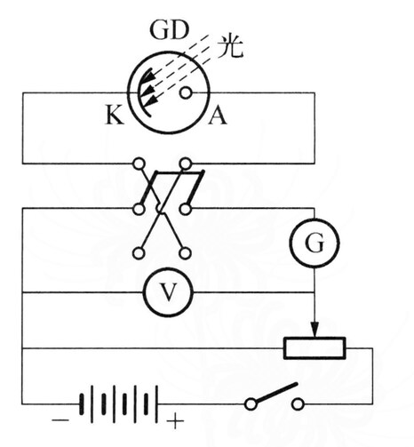
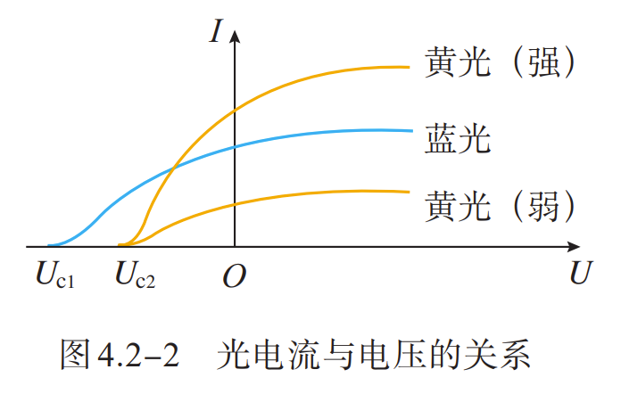
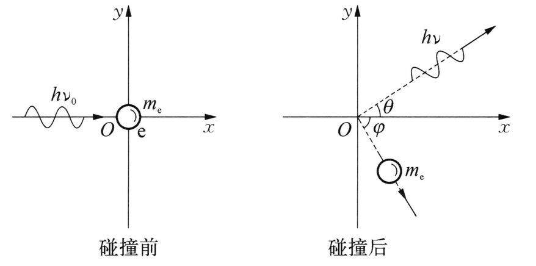
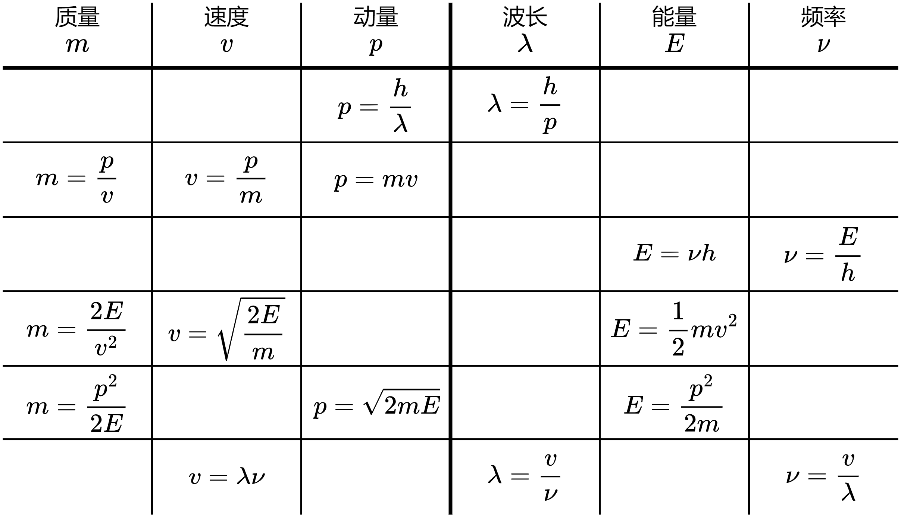
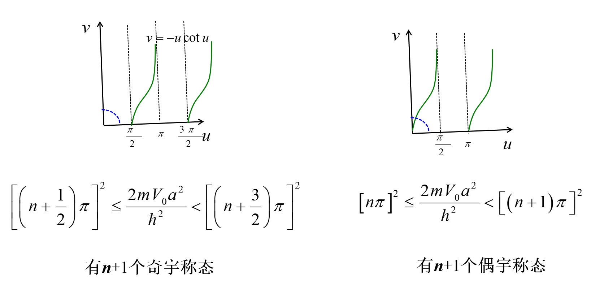

> 本文章基于[Teruteru的学习笔记](https://teruteru.space/2023/02/24/%E9%87%8F%E5%AD%90%E5%8A%9B%E5%AD%A6%E7%AC%94%E8%AE%B0/)进行整理，针对 2024-2025 学年春季学期教学内容进行修改。

# 量子力学基础

## 热辐射

  - 任何固体或液体都是由分子、原子构成的，由于热运动发射各种电磁波，称为**热辐射** 。
  - 物体向周围辐射的能量称为**辐射能** 。
  - 实验表明，热辐射具有**连续的辐射谱**
  - 热辐射的电磁波的波长、强度与物体的温度有关，还与物体的性质表面形状有关。一般温度越高，所发射电磁波的能量越大，在光谱分布中，强度向较短波长转移。
  - 这说明同一物体的热辐射谱在不同波长区域分布不均匀，温度越高，光谱中最大辐射对应的波长越短，同时辐射总能量增加。
  - 加热一物体，若物体所吸收的能量等于在同一时间内辐射的能量，则物体的温度恒定。这种温度不变的热辐射称之为**平衡热辐射** 。

### 单色辐出度

单位时间内，从物体表面单位面积上发射波长为 $\lambda \sim \lambda+\mathrm{d} \lambda$ 的辐射能$\mathrm{d} E_{\lambda}$，与波长间隔成正比，$\mathrm{d} E_{\lambda}$ 与 $\mathrm{d}
\lambda$ 的比值称为**单色辐出度** 。单色辐出度用 $M(\lambda,T)$ 表示，即
$$
\begin{aligned}
M(\lambda,T)=\frac{\mathrm{d} E_{\lambda}}{\mathrm{d} \lambda}\\
M(\mu,T)=\frac{\mathrm{d} E_{\mu}}{\mathrm{d} \mu}
\end{aligned}
$$

- 热辐射实验表明，$M(\lambda,T)$ 与辐射物体的 **温度** 和辐射的 **波长** 有关，是 $\lambda$ 和 $T$ 的函数。
- 单色辐出度表示在单位时间内从物体表面单位面积内发射的波长在 $\lambda$ 附近窄带辐射功率密度。
- 单色辐出度反映了物体在不同温度下辐射能按波长分布的情况，它的单位是 $\mathrm{W} / \mathrm{m}^{3}$。

### 总辐出度

单位时间内，从物体表面单位面积上所发射的各种波长的总辐射能称为物体的**总辐出度** 。显然，对于一个给定的物体，总辐出度只是温度的函数，常用 $M(T)$ 表示，单位是 $\mathrm{W} / \mathrm{m}^{2}$。在一定温度 $T$ 时，物体的总辐出度与单色辐出度的关系为
$$ 
\begin{aligned}
M(T)&=\int_{0}^{\infty} M(\lambda,T) \mathrm{d} \lambda\\
&=\int_{0}^{\infty} M(\nu,T) \mathrm{d} \nu \\
\end{aligned}
$$

上式表明，在相同温度下，不同物体的 $M(\lambda,T)$ 不同，相应的 $M(T)$ 值也不同。
$$
\begin{aligned}
&\int_{0}^{\infty} M_{\nu}\left(T\right)\text{d}\nu=M_{\nu}\left(T\right)\text{d}\left(\frac{c}{\lambda}\right)=\int_{\infty}^{0} -\frac{c}{\lambda^{2}}M_{\nu}(T)\text{d}\lambda=-\int_{0}^{\infty} M_{\lambda}\left(T\right)\text{d}\lambda\\
&\Rightarrow M_{\lambda}\left(T\right)=M_{\nu}\left(T\right)\frac{c}{\lambda^{2}}\\
\end{aligned}
$$

### 吸收比

任一物体向周围发射辐射能的同时，也吸收周围物体的辐射能。当辐射从外界入射到不透明物体时，一部分能量吸收，一部分能量反射，如果物体透明，还有一部分能量透射。吸收能量与入射能量之比称为物体的**吸收比**，用 $a(T)$ 表示，在波长为 $\lambda \sim \lambda+\mathrm{d} \lambda$ 范围内的吸收比称为**单色吸收比** ，用 $a(\lambda,T)$ 表示。
定义吸收比
$$
a(T)=\frac{E^{\text {吸收 }}}{E^{\text {入射 }}}
$$

单色吸收比
$$
a(\lambda, T)=\frac{E_{\lambda}^{\text {吸收 }}}{E_{\lambda}^{\text {入射 }}}
$$

- 如果物体在任意温度下，对任何波长的辐射吸收比都等于 $1$，则该物体称为**绝对黑体** ，简称**黑体** 。

### 反射比

同理定义反射比
$$
r(T)=\frac{E^{\text {反射 }}}{E^{\text {入射 }}}
$$

单色反射比
$$
r(\lambda, T)=\frac{E_{\lambda}^{\text {反射 }}}{E_{\lambda}^{\text {入射 }}}
$$

对于不透明物体，$a(\lambda, T)+r(\lambda, T)=1$

## 基尔霍夫辐射定律

基尔霍夫从理论上提出了物体的辐出度与吸收比关系的重要定律：在相同的温度下，不同物体对相同波长的单色辐出度与单色吸收比之间的**比值都相等**，并等于该温度下黑体对同一波长的单色辐出度。可以表示为
$$
\frac{M_{1}(\lambda,T)}{a_{1}(\lambda,T)}=\frac{M_{2}(\lambda,T)}{a_{2}(\lambda,T)}=\cdots=M_{0}(\lambda,T)
$$

式中，$M_{0}(\lambda,T)$ 是**黑体单色辐出度** 。

- 基尔霍夫辐射定律说明好的发射体一定也是好的吸收体。黑体是 **完全** 吸收体，也是理想的发射体。
- 带小孔的封闭空腔体可以视为绝对黑体的模型，空腔内电磁辐射为黑体辐射。

## 斯特藩-玻耳兹曼定律

实验证明，黑体的总辐出度与温度的四次方成正比，即
$$
M_{0}(T)=\sigma T^{4}
$$

- 式中，$\sigma=5.67 \times 10^{-8} \mathrm{~W} /\left(\mathrm{m}^{2} \cdot \mathrm{K}^{4}\right)$ 称为 Stefen 恒量。
- 总辐出度随着绝对温度的升高而快速增加。

## 维恩位移定律

单色辐出度的峰值波长 $\lambda_{\mathrm{m}}$ 满足维恩位移定律，即
$$
\lambda_{\mathrm{m}} T=b
$$

- 式中，$b=2.897 \times 10^{-3} \mathrm{~m} \cdot \mathrm{K}$ 称为 Wien 常数。
- 随着温度的增加，热辐射的峰值波长向短波移动。

## 普朗克黑体辐射公式

1900 年，普朗克给出了黑体辐射满足实验结果的公式：
$$
\begin{aligned}
M_{0}(\lambda,T)=2 \pi h c^{2} \lambda^{-5} \frac{1}{\mathrm{e}^{h c / k_{\mathrm{B}} T \lambda}-1}\\
M_{0}(\nu,T)=\frac{2\pi\nu^2}{c^2}\frac{h\nu}{\mathrm{e}^{h \nu / k_{\mathrm{B}} T }-1}
\end{aligned}
$$

- 式中，
    - $c=3.0\times 10^8 \mathrm{m}\cdot \mathrm{s}^{-1}$ 是光速
    - $k_{\mathrm{B}}=1.38\times 10^{-23} \mathrm{J}\cdot \mathrm{K}^{-1}$ 是玻尔兹曼常量
    - $h=6.626\times 10^{-34} \mathrm{J}\cdot \mathrm{s}=4.136\times 10^{-15} \mathrm{eV}\cdot \mathrm{s}$ 是普朗克常量，是一个普适常量。
- 无论是短波还是长波，普朗克公式的计算结果都与实验结果一致。从理论上推导该公式时，普朗克采用了当时物理认识上一个非同寻常的假设：谐振子能量值只取某个最小能量的整数倍，即 $$ \varepsilon,2 \varepsilon,3 \varepsilon,\cdots,n \varepsilon$$ 式中，$n$ 为正整数，称为**量子数** 。对于频率为 $\nu$ 的谐振子，最小能量是 $\varepsilon=h \nu$。在辐射或吸收能量时，振子从这些状态中的一个状态跃迁到另一个状态，即振子只能跳跃式地辐射或吸收能量。
- 由普朗克公式可导出其他所有热辐射公式：
    $$
    M_{0}(\nu, T)=\frac{2 \pi \nu^{2}}{c^{2}} \frac{h \nu}{e^{h \nu / k T}-1}\left\{\begin{array}{l} \text { 积分 } \rightarrow M=\sigma T^{4} \\ \text { 求导 } \rightarrow T \lambda_{m}=b \\ \text { 低频 } \rightarrow M_{\nu}(T)=\frac{2 \pi \nu^{2}}{c^{2}} k T \\ \text { 高频 } \rightarrow M_{\nu}(T)=\alpha \nu^{3} e^{-\beta \nu / T} \end{array}\right.
    $$

### 普朗克公式频率波长转换
$$
\begin{aligned}
&M_0(\lambda)=\int_{0}^{\infty} M_{0}(\lambda, T) d \lambda=\int_{0}^{\infty} M_{0}(\nu, T) d \nu \\
\Rightarrow &\int_{0}^{\infty} M_{0}(\lambda,T) d \lambda=\int_{\infty}^{0} M_{0}(\nu, T)\left(-\frac{c}{\lambda^{2}}\right) d \lambda \\
\Rightarrow &M_{0}(\lambda, T)=M_{0}(\nu, T) \frac{c}{\lambda^{2}}
\end{aligned}
$$

### 维恩公式

当波长很短或温度较低时，普朗克公式可近似写成
$$
\begin{aligned}
M_{0}(\lambda,T)=2 \pi h c^{2} \lambda^{-5} \mathrm{e}^{-h c /
k_{\mathrm{B}} T \lambda} \\
M_{0}(\nu,T)=\alpha \nu^{3} e^{-\beta \nu / T}
\end{aligned}
$$

这就是维恩公式。将黑体空腔壁分子或原子当成线性谐振子，维恩用经典热力学物理证明了 $M_{0}(\lambda,T)=c^{5} \lambda^{-5}\phi(\lambda,T)$，假设黑体辐射能谱与麦克斯韦速率分布相类似，可得出公式 $M_{0}(\lambda,T)=C_{1}\lambda^{-5} \mathrm{e}^{-C_{2} / T \lambda}$，其中 $C_{1}$ 和 $C_{2}$是两个常数。通过对比可知，$C_{1}=2 \pi h c^{2}$，$C_{2}=h c / k_{\mathrm{B}}$。

### 瑞利-金斯公式

当波长较长或温度较高时，普朗克公式可近似写成
$$
\begin{aligned}
M_{0}(\lambda,T)=2 \pi k_{\mathrm{B}} c \lambda^{-4} T \\
M_{0}(\nu,T)=\frac{2 \pi \nu^{2}}{c^{2}} k T
\end{aligned}
$$

这就是瑞利-金斯公式。瑞利和金斯从能量均分定律出发，每个谐振子自由度的平均能量等于 $k_{\mathrm{B}} T$，从而得到了理论公式 $M_{0}(\lambda,T)=C_{3} \lambda^{-4} T$。当波长很长时，计算结果与实验结果相符，但在短波紫外区方面，随着波长趋向于零而 $M_{0}(\lambda,T)$ 趋向于无穷大，则计算结果与实验数据不吻合，这一结果被称为“**紫外灾难**”。

## 光电效应

### 实验模型

当光照射在金属表面上，使电子从金属中脱出的现象，称作**光电效应** 。

上图所示为研究光电效应的实验装置。在抽成真空的容器中，$K$ 是阴极，$A$ 是阳极。当光通过石英窗照射到金属板 $K$ 上时，金属板释放电子，这种电子称为光电子。如果在 $A$、$K$ 两端加上电势差，则电子在加速电场的作用下，飞向阳极 $A$，电路中出现电流，成为光电流，电流计可测出这个光电流。

### 基本参数

#### 饱和电流

实验表明，当入射光强度不变，加速电势差 $U=U_A-U_K$ 越大，光电流 $I$ 也越大，当电势差增大到一定值时，光电流达到饱和值，此时的光电流称为**饱和电流** 。若改变入射光强，**饱和电流的大小与入射光强成正比**，说明从阴极逸出的电子数全部飞到阳极，单位时间从金属表面逸出的电子数与入射光强成正比。

#### 遏制电势差

当 $A$、$K$ 两极的电势差为零时，光电流不为零，这说明从金属表面逸出的电子有初始动能；当负电势差不大时，尽管存在电场阻碍，但依然有部分电子可能到达阳极；如果负电势差足够大，从阴极表面逸出的具有最大速度的电子也不能到达 $\mathrm{A}$ 极，则光电流变为零。只有改变电压 $U=-U_{0}$ 时，光电流为零，$U_{0}$ 称为**遏制电势差**。光电子从表面逸出的最大初速度 $v_{\mathrm{m}}$ 满足
$$
\frac{1}{2} m v_{\mathrm{m}}^{2}=e U_{0}
$$

式中，$e$ 和 $m$ 分别为电子电荷量和质量。**最大初动能与入射光的强度无关。**

#### 红限频率

实验发现，改变入射光的频率，遏止电势差与入射光的频率之间具有线性关系，即
$$
U_{0}=K \nu-U_{1}
$$

式中，$K$ 是不随金属种类变化的普适恒量；$U_{1}$ 随金属种类不同而变化。
$$
\frac{1}{2} m v_{\mathrm{m}}^{2}=e K \nu-e U_{1}
$$

光电子从金属表面逸出时的最大初动能随着入射光的频率线性增加。电子初动能必须是正的，光照射金属逸出电子的条件是光的频率 $\nu \geqslant U_{1} / K$。令 $\nu_{0}=U_{1} / K$，$\nu_{0}$ 称为光电效应的**红限频率**。这意味着无论光的强度多大，当入射光的频率小于 $\nu_{0}$ 时，都不会发生光电效应。

#### 弛豫时间

实验证明，无论入射光的强度如何，入射光照射到金属释放电子几乎是瞬时的，弛豫时间不超过 $1\times 10^{-9} \mathrm{s}$

### 爱因斯坦光子理论

- 爱因斯坦认为光的能量以颗粒形式在空间传播，这种颗粒形式的光能量称为**光量子** 或**光子** ，一束光就是以光速运动的**光子流** 。
- 每个光子的能量是 $\varepsilon=h \nu$，不同频率的光子具有不同的能量，光的能流密度 $S$ 决定于单位时间内通过该单位面积的光子数 $N$。频率为 $\nu$ 的单色光的能流密度 $S=N h \nu$。
- 光电效应的解释如下：当金属中一个电子从入射光中吸收一个频率为 $\nu$ 的光子后，就获得能量 $h \nu$，如果 $h \nu$ 大于电子从金属表面逸出所需的逸出功 $A$，那么这个电子就可以从金属中飞出。根据能量守恒定律，则有爱因斯坦光电效应方程 $$ h \nu=\frac{1}{2} m v_{\mathrm{m}}^{2}+A$$ 式中，$\frac{1}{2} m v_{\mathrm{m}}^{2}$ 是光电子的**最大初动能** 。
- 如果出射电子动能为零，$\nu_{0}=A / h$，这表明频率为 $\nu_{0}$ 的光子具有发射光电子的最小能量。如果光子频率低于红限频率 $\nu_{0}$，不管有多少光子，单个光子都没有足够的能量去发射光电子，所以当光电子吸收的能量全部消耗于电子的逸出功时，入射光的频率对应于红限频率。
- 当光子频率大于红限频率 $\nu_{0}$，光的强度增加时，光子数目增大，单位时间内发射的光电子数目也将增大，这说明了饱和电流与光的强度之间的正比关系。另外，当光子能量被电子全部吸收后，不需要积累能量的时间，这说明了光电效应发生的瞬时性。

### 光的波粒二象性

**光子本性是波粒二象性** 。光子不仅具有能量，还具有质量、动量等一般粒子共有的特性。光子质量可由爱因斯坦质能关系得到，表示为
$$
m=\frac{\varepsilon}{c^{2}}=\frac{h \nu}{c^{2}}
$$

光子质量是由光子能量决定的。光子的动量为
$$
p=m c=\frac{h \nu}{c}=\frac{h}{\lambda}
$$

由于光子有动量，光照射到物体上时，就对物体表面施加了压力，这就是**光压**，这已被实验所证实。光的波动理论已被光的干涉和衍射实验所证实，而光子理论成功解释了光电效应，并且能解释光的波动理论无法解释的其他现象。因此**光既有波动性又有粒子性**，光具有双重性质，即光的**波粒二象性** 。光子的能量和动量是描述粒子性的，而频率和波长是描述波动性的。

## 康普顿效应

康普顿研究了 $X$ 射线经物质散射的实验，为光子的粒子性概念提供了有力证据。$X$ 射线源发出一束波长为 $\lambda_{0}$ 的 $X$ 射线，照射到一块石墨上。经石墨散射后，散射的 $\mathrm{X}$ 射线的波长和强度可以由晶体和探测器所组成的摄谱仪来测定。改变散射角 $\theta$，再进行同样的测量。康普顿发现：

- 散射光谱中除了有与入射波长 $\lambda_{0}$ 相同的射线，还有波长 $\lambda>\lambda_{0}$ 的射线，这种改变波长的散射称为**康普顿效应** 。
- 波长差 $\Delta \lambda=\lambda-\lambda_{0}$ 随着散射角的改变而改变。散射角**增大** 时，波长差也随着**增加** ，而且随着散射角的增大，**原波长的谱线强度减小** ，而**新波长的谱线强度增大** 。
- 在**同一散射角** 下，对于所有散射物质，**波长差都相同** ，但原波长的谱线强度随着散射物质的原子序数的增大而**增加** ，新波长的谱线强度随之**减小** 。

### 解释

- 一个光子和散射体中的一个自由电子或束缚微弱电子（原子的外层电子）发生碰撞后，从散射体射出光子的方向就是康普顿散射的方向
- 电子吸收一个光子能量后，发射一个散射光子，电子同时受到反冲而获得一定的能量和动量。在碰撞过程中，动量和能量守恒，入射光子的能量一部分给了电子，因此**散射光子能量比入射光子能量低**
- 又根据光子满足的关系 $E=h\nu$，则**散射光的频率小于入射光的频率** ，意味着**散射光的波长大于入射光的波长** 。如果光子与原子中束缚很紧的电子（原子的内层电子）碰撞，光子将与整个原子做弹性碰撞。因为原子的质量比光子的质量大很多，**散射光的能量不会显著减小** ，从而散射光的频率也不会发生显著变化，康普顿移动非常小，所以实验散射线中有与入射光波长相同的射线。

### 计算

我们利用能量守恒和动量守恒定律来定量解释散射光子的波长改变。一个光子与一个自由电子碰撞，电子一开始处于静止状态，如下图所示。  

- 频率为 $\nu_{0}$ 的一束光沿着 $x$ 方向照射物体表面，具有能量 $h \nu_{0}$ 和动量 $\frac{h \nu_{0}}{c}$ 的光子与电子碰撞后被散射，之后光子与原入射光子方向成 $\theta$ 角，散射光子能量为 $h \nu$，动量为 $\frac{h \nu}{c}$。
- 同时，反冲电子获得一个与光速差不多的速率并沿着某一角度 $\varphi$ 飞出，电子能量从静止时的 $m_{\mathrm{e}} c^{2}$ 变成了 $m c^{2}$，动量变为 $m v$，其中 $m=\frac{m_{\mathrm{e}}}{\sqrt{1-v^{2} / c^{2}}}$，即电子动能要用相对论公式表示。
- 根据碰撞中遵守能量守恒和动量守恒定律，有$$ h \nu_{0}=h \nu+\left(m-m_{\mathrm{e}}\right) c^{2}$$ 
- $x$ 方向的动量守恒方程写为 $$ \frac{h \nu_{0}}{c}=\frac{h \nu}{c} \cos \theta+m v \cos \varphi$$ 
- $y$ 方向的动量守恒方程写为 $$ 0=\frac{h \nu}{c} \sin \theta-m v \sin \varphi$$ 
- 利用 $p=\frac{h \nu}{c}=\frac{h}{\lambda}$ 关系，求得 $$ \Delta \lambda=\lambda-\lambda_{0}=\frac{h}{m_{\mathrm{e}} c}(1-\cos \theta)=2 \lambda_{\mathrm{c}} \sin ^{2} \frac{\theta}{2}$$ 式中，$\lambda_{\mathrm{c}}=\frac{h}{m_{\mathrm{e}} c}=2.43 \times 10^{-12} \mathrm{~m}$，$\lambda_{\mathrm{c}}$ 称为电子的**康普顿波长** 。

上式说明波长差 $\Delta \lambda$ 与散射物质以及入射光的波长无关，**仅决定于散射方向** ，$\Delta \lambda$ 随着散射角度的增大而增大，计算得到的理论值与实验结果相符。这不仅有力地证实了光子理论，说明了光子的粒子性（有质量、能量、动量的光量子），整个散射过程是单个光子与个别电子的碰撞；还说明在微观过程中，微观粒子的相互作用也严格遵守了能量守恒和动量守恒定律。正如在空腔辐射和光电效应中，康普顿效应中的普朗克常量起着主要作用，揭示了光具有粒子性。可以这么说，光电效应揭示了光子能量与频率的关系，而康普顿效应则进一步揭示了光子动量与波长的关系。

### 解题方法

  1. 若只涉及到波长差和散射角，则使用 $$ \Delta \lambda=2 \lambda_{\mathrm{c}} \sin ^{2} \frac{\theta}{2} $$ 得出答案
  2. 若涉及到能量、动量，则列出康普顿效应方程组 $$ \left\{\begin{array}{l} h \nu_{0}=h \nu+\left(m-m_{\mathrm{e}}\right) c^{2}\\ \frac{h \nu_{0}}{c}=\frac{h \nu}{c} \cos \theta+m v \cos \varphi\\ 0=\frac{h \nu}{c} \sin \theta-m v \sin \varphi \end{array}\right.$$ 并加上题目条件（通常是两个方程），联立求解

## 卢瑟福原子模型

卢瑟福根据 $\alpha$ 粒子散射实验结果在理论上提出原子的有核模型，即原子的正电荷以及几乎全部的质量集中在原子中心很小的区域中，形成原子核，带负电的电子围绕原子核旋转，类似于太阳系中行星绕太阳旋转一样，但原子核与电子之间服从库仑定律。此模型很好地解释了 $\alpha$ 粒子的大角度偏转，但也遇到了几个困难：

- 缺乏合理表征原子大小的量
- 原子的稳定性问题
- 无法解释原子光谱

## 玻尔原子理论

### 氢原子光谱

在 $1888$ 年瑞典物理学家、数学家里德伯将巴尔末公式表示为更一般化的形式，即里德伯公式：
$$
\widetilde{\nu}=R\left(\frac{1}{m^{2}}-\frac{1}{n^{2}}\right)\quad(m=1,2,3,\cdots;n=m+1,m+2,m+3,\cdots)
$$

式中

- $\widetilde{\nu}=\lambda^{-1}$ 为波长的倒数，称为**波数**
- $m=1,2,3,\cdots$ 为整数
- $n=m+1,m+2,m+3,\cdots$ 亦为整数
- $R=1.096776 \times 10^{7} \mathrm{~m}^{-1}$ 为**里德伯恒量**
- 给定 $m$ 后，$n$ 取不同值对应不同谱线系
    - 当 $m=2$，里德伯公式变为巴尔末公式，所对应的谱线系称为**巴尔末系** 。
    - 当 $m=1$ 时里德伯公式变为 $$ \widetilde{\nu}=R\left(\frac{1}{1^{2}}-\frac{1}{n^{2}}\right) \quad(n=2,3,4,\cdots)$$ 对应的谱线系在紫外区，由赖曼在 $1914$ 年发现，称为**赖曼系** 。
    - 当 $m=3$ 的光谱线位于红外线区，由帕邢在 $1908$ 年发现，称为**帕邢系** ：$$ \widetilde{\nu}=R\left(\frac{1}{3^{2}}-\frac{1}{n^{2}}\right) \quad(n=4,5,6,\cdots)$$ 
    - 当 $m=4$ 的光谱线位于近红外区，称为**布拉开系** ：$$ \widetilde{\nu}=R\left(\frac{1}{4^{2}}-\frac{1}{n^{2}}\right) \quad(n=5,6,7,\cdots)$$ 
    - 当 $m=5$ 的光谱线位于远红外区，称为**普丰德系** ：$$ \widetilde{\nu}=R\left(\frac{1}{5^{2}}-\frac{1}{n^{2}}\right) \quad(n=6,7,8,\cdots)$$ 
    - 当 $m=6$ 的光谱线位于远红外区，称为**汉弗莱系** 。

### 玻尔半径
$$
a=\frac{\varepsilon_0 h^2}{\pi m_e e^2}\approx 0.05 \mathrm{~nm}
$$

### 玻尔理论

玻尔在得知原子线状光谱的规律后，提出了革命性的理论。该理论包括两条基本假设：

- 原子能够且只能稳定处于与一些分立的能量相对应的状态上，这些状态称为**定态** 。原子处于定态中，**不发射** 也**不吸收** 电磁辐射。（注意：若吸收光子跃迁，光子能量必须等于能级能量差；若用粒子轰击则不需要）
- 当原子从一个定态跃迁到另一个定态时，以发射或吸收特定频率 $\nu$ 的光子与电磁场交换能量（分立定态的能量值称为**能级** ，两个定态能量分别对应能级 $E_{n}$、$E_{m}$，假设 $E_{n}>E_{m}$），且满足$$ h \nu=E_{n}-E_{m}$$ 这是频率条件。
- 结论：$$ \nu=\frac{E_{n}-E_{m}}{h}=\frac{m e^{4}}{8 \varepsilon_{0}^{2} h^{3}}\left(\frac{1}{m^{2}}-\frac{1}{n^{2}}\right)$$ 

### 玻尔角动量量子化条件

为了将原子分立能级确定下来，玻尔提出对应原理，即在大量子数极限情况下，量子体系的行为将趋于与经典系统相同。根据对应原理，玻尔提出质量为 $m_{\mathrm{e}}$ 的电子绕质子做半径为 $r$ 的圆周运动，电子角动量满足量子化条件：
$$
L=n \frac{h}{2 \pi}=n \hbar,n=1,2,3,\cdots
$$

式中，$n$ 为正整数，称为**量子数** ；$\hbar=h / 2 \pi$ 为**约化普朗克常量** 。

### 索末菲量子化条件

索末菲后来把玻尔角动量量子化条件推广为
$$
\oint p \mathrm{~d} q=n h
$$

式中，$q$ 是电子的广义坐标；$p$ 是广义动量；积分沿着电子轨道运行一周。

### 玻尔半径

电子受到氢原子的带正电质子的库仑引力作用，由牛顿定律得
$$
\frac{1}{4 \pi \varepsilon_{0}} \frac{e^{2}}{r^{2}}=m_{\mathrm{e}}
\frac{v^{2}}{r}
$$

根据角动量量子化条件 $L=m_{\mathrm{e}} v r=n \hbar$，消去式 $(1-27)$ 中的 $v$，得
$$
r_{n}=\frac{4 \pi \varepsilon_{0} \hbar^{2}}{m_{\mathrm{e}} e^{2}} n^{2} = \frac{\varepsilon_{0} h^{2}}{\pi m_{\mathrm{e}} e^{2}} n^{2}
$$

这就是原子中第 $n$ 个稳定轨道的半径。$n$ 只能取正整数，轨道是分立的。当 $n=1$，给出 $r_{1}=0.529 \mathring{A}$，这是氢原子的**核外电子最小轨道半径** ，称为**玻尔半径** 。

### 电子能量

当电子在半径为 $r_{n}$ 的轨道上，氢原子系统的能量等于电子质子系统的静电势能与电子的动能之和，如以电子无穷远处静电势能为零，则
$$
E_{n}=-\frac{1}{4 \pi \varepsilon_{0}} \frac{e^{2}}{r_{n}}+\frac{1}{2} m_{\mathrm{e}} v_{n}^{2}=-\frac{1}{8 \pi \varepsilon_{0}} \frac{e^{2}}{r_{n}}
$$

代入得到
$$
E_{n}=-\frac{m_{e} e^{4}}{8 \varepsilon_{0}^{2} h^{2}} \frac{1}{n^{2}}=-\frac{13.6}{n^2}\mathrm{eV}
$$

该式表示电子在第 $n$ 个稳定轨道运动时氢原子系统的能量。

- 氢原子能量是不连续的，这就是**能量量子化** 。
- 以 $n=1$ 代入式 $(1-29)$ 得 $E_{n}=-13.6 \mathrm{eV}$，这是氢原子的最低能级，称为**基态能级** 。
- 若定义基态能级的能量为零，将氢原子基态电子移动到无限远时所需要的能量就是氢原子**电离能** 。
- 对于 $n>1$ 的各稳定态，其能量大于基态能量，随着量子数 $n$ 的增大而增大，能量间隔减小，这种状态称为**激发态** 。
- 当 $n \rightarrow \infty$ 时，$r_{n} \rightarrow \infty$，$E_{n} \rightarrow 0$，能级趋于连续。$E>0$ 时，原子处于**电离状态** ，能量可连续变化。
- 里德伯常量的理论值：$$ R_{\mathrm{H}}=\frac{m_{e} e^{4}}{8 \varepsilon_{0}^{2} h^{3} c}=1.0973731 \times 10^{7} \mathrm{~m}^{-1}$$ 它与实验值符合得很好。

### 玻尔理论的局限性

玻尔理论存在的问题和局限性后来被逐渐揭示。首先，该理论无法解释复杂原子的光谱，例如氦原子光谱。其次，玻尔理论无法系统地计算光谱线的相对强度，即便是氢原子的光谱线强度；也不能处理非束缚态问题，例如散射问题。最后，从理论体系上看，玻尔理论与经典力学不相容，如角动量量子化、能量量子化等，但这些结果并没有揭示出不连续的本质。量子力学就是在克服这些困难和局限性的过程中逐渐发展成一个完整的理论体系。

# 量子力学入门
## 物质波

德布罗意认为光有波粒二象性，物质或许也有波粒二象性。他提出物质波假说：一个能量为 $E$、动量为 $p$ 的粒子具有波动性，波长 $\lambda$ 和频率 $\nu$ 分别与粒子的动量和能量成正比，即
$$
\lambda=\frac{h}{p},\nu=\frac{E}{h}
$$

这与光的波粒二象性的关系相同。

- 上式把波的概念与粒子的概念联系起来。第一个关系称为**德布罗意关系** 。这种与实物粒子相联系的波称为**德布罗意波** ，或称为**物质波** 。
- 由于 $h$ 很小，通常实物粒子波长非常短，波动性无法表现。但是在原子世界中，就显现出微观粒子的波动性。

### 微观波粒二象性粒子属性转换

物理量 | 波动性 | 粒子性
--- | --- | ---
波长 $\lambda$ | $h/p$ | $v/\nu$ 
频率 $\nu$ | $E/h$ | $v/\lambda$
动量 $p$ | $h/\lambda$ | $m v$ = $\sqrt{2 m E}$
能量 $E$ | $h \nu$ | $\frac{1}{2}mv^2 = \frac{p^2}{2 m}$

### 相对论公式
$$ 
\begin{aligned}
E &= E_0 + E_k = m_0 c^2 + E_k \\
E^2 &= E_0^2 + p^2 c^2 = m_0^2 c^4 + p^2 c^2 \\
\Rightarrow p &= \frac{1}{c} \sqrt{E^2 - E_0^2} \\
&= \frac{1}{c} \sqrt{(E_0 + E_k)^2 - E_0^2} \\
&= \frac{1}{c} \sqrt{E_k^2 + 2 E_0 E_k} \\
&= \frac{1}{c} \sqrt{E_k^2 + 2 m_0 c^2 E_k} \\
\Rightarrow \lambda &= \frac{h}{p} = \frac{h c}{\sqrt{E_k^2 + 2 E_0 E_k}} \\
&= \frac{h c}{\sqrt{E_k^2 + 2 m_0 c^2 E_k}} \\
\end{aligned}
$$

### 革末实验
晶体的X射线衍射实验中，同一晶面上相邻原子散射的光波的光程差等于零，它们相干加强, 反射给出强度最大的方向。一组晶面，可实现多光束相干叠加。若要在该方向上不同晶面上原子散射光相干加强, 满足布拉格公式：
$$ 
\delta = 2 d \sin \theta = k \lambda
$$

式中，$\delta$ 为光程差，$d$ 为晶面间距，$\theta$ 为入射角，$k$ 为整数。

## 不确定度关系

在经典力学中，一个粒子的位置和动量可以同时确定，而且知道了某一时刻粒子的位置和动量，原则上可以预言以后任意时刻粒子的位置和动量。然后，微观粒子的衍射实验已经表明微观粒子有明显的波性。粒子位置是不确定的，出现在某区域，例如出现在b $\Delta x \Delta y \Delta z$ 范围内，可以称 $\Delta x$、$\Delta y$、$\Delta z$ 为粒子**位置不确定量** 。粒子的动量、角动量等力学量也是如此。由 $p=\frac{h}{\lambda}$ 算出动量的可能范围 $\Delta p$，$\Delta p$ 就是动量不确定量。  
海森伯发现物理量的不确定量受到普朗克常量支配。他在 $1927$ 年提出了微观粒子的位置和动量两者的不确定量满足
$$
\Delta x \Delta p_{x} \geqslant \frac{\hbar}{2},\quad \Delta y \Delta p_{y} \geqslant \frac{\hbar}{2},\quad \Delta z \Delta p_{z} \geqslant \frac{\hbar}{2}
$$

上式称为位置和动量的**不确定度关系** 。它的物理意义是客观上微观粒子不可能同时具有确定的坐标位置和相应的动量，粒子的位置不确定量 $\Delta x$ 越小，动量不确定量 $\Delta p_{x}$ 就越大，反之亦然。

同样，微观粒子能量和时间的不确定量满足
$$
\Delta E \Delta t \geqslant \frac{\hbar}{2}
$$

上式称为时间和能量的**不确定度关系** 。它的物理意义是客观上微观粒子不可能同时具有确定的能量和相应的时间，粒子的能量不确定量 $\Delta E$ 越小，时间不确定量 $\Delta t$ 就越大，反之亦然。

### 不确定度关系解题步骤

1. 确定已知定值条件、已知差值条件和要求的差值
2. 根据“微观波粒二象性粒子属性转换”，拿到相关的物理量
3. 应用“时间和能量不确定性关系/位置和动量不确定性关系”（最多一次），得到答案

## 波函数（单色平面波）

既然微观粒子具有波动性，应引入描述这种波的波函数。德布罗意认为能量为 $E$、动量大小为 $p$ 的“自由粒子”沿 $x$ 方向运动时，对应的物质波应为“单色平面波”。即对应一列角波数和圆频率分别为 $k,\omega$ 的单色波
$$
\Psi(x,t)=\psi_{0} \mathrm{e}^{-\mathrm{i}(\omega t-k x)}
$$

式中 $\psi_{0}$ 为复数（待定），可见波函数 $\Psi(x,t)$ 为一复变函数。按德布罗意假设，可将波函数用粒子的能量和动量表示为
$$
\Psi(x,t)=\psi_{0} \mathrm{e}^{-\frac{i}{\hbar}(E t-p x)}
$$

式中 $\hbar=h / 2 \pi$，称为约化普朗克常数。  
若粒子为三维自由运动，则波函数可表示为
$$
\Psi(\boldsymbol{r},t)=\psi_{0} \mathrm{e}^{-\frac{i}{\hbar}(E t-p \cdot r)}
$$

的概率密度。

- 微观粒子物质波的波函数只能用复数形式来表达，不能用实数形式来表达
- 在一般情况下，粒子的波函数不是单色平面波的形式，而是空间和时间的复杂函数。
- 波函数既不描述粒子的形状，也不描述粒子运动的轨迹，它只给出粒子运动的概率分布。

### 波函数的统计意义

波函数模的平方代表在时刻 $t$、空间 $r$ 处单位体积中微观粒子出现的概率，即
$$
\rho(\boldsymbol{r},t)=|\Psi(\boldsymbol{r},t)|^{2}=\Psi(\boldsymbol{r},t)^{*} \Psi(\boldsymbol{r},t)
$$

为粒子的**概率密度** ，其中 $\Psi^{*}(\boldsymbol{r},t)$ 是 $\Psi(\boldsymbol{r},t)$ 的复共轭。波函数是不可观测量，而概率密度可观测量。由于波函数的模方具有概率的意义，故也将德布罗意波称为概率波。在体积元 $\mathrm{d} V$ 中发现粒子的概率为
$$
\rho(\boldsymbol{r},t) \mathrm{d} V=\Psi(\boldsymbol{r},t)^{*} \Psi(\boldsymbol{r},t) \mathrm{d} V=|\Psi(\boldsymbol{r},t)|^{2} \mathrm{~d} V
$$

### 性质

- 连续性
- 有限性
- 单值性

### 归一化条件

由于在全空间一定能找到粒子，故概率密度在全空间积分为 $1$，即
$$
\int_{\Omega} \Psi^{*}(\boldsymbol{r},t) \Psi(\boldsymbol{r},t) \mathrm{d} V=1
$$

式中 $\Omega$ 表示全空间区域，称该式为波函数的归一化条件。

### 波粒二象性

量子力学中微观粒子的“粒子性”和“波动性”含义与经典粒子和经典波的不同

- “粒子性”主要指微观粒子的整体性和不可分性，粒子没有确定的轨道；
- “波动性”主要指描述微观粒子状态的波函数是可以叠加的，像经典波一样可以出现“干涉”“衍射”等现象。但与经典的波不同，波函数并不对应真实物理量的波动。
- “波粒二象性”是指微观粒子可显示出“波动”和“粒子”两种不同属性。在一些情况下，微观粒子突出显示出其粒子特性，而在另一些情况下，则突出显示出波动特性。

### 动量概率分布
$$
\begin{aligned}
\Phi(\vec p,t) = \int_\infty\Psi(\vec r,t)\sqrt{\frac{1}{(2\pi\hbar)^3}}e^{-i\ \vec p\cdot \vec r/\hbar} \mathrm{d}x\mathrm{d}y\mathrm{d}z \\
\Psi(\vec r,t) = \int_\infty\Phi(\vec p,t)\sqrt{\frac{1}{(2\pi\hbar)^3}}e^{i\ \vec p\cdot \vec r/\hbar} \mathrm{d}p_x\mathrm{d}p_y\mathrm{d}p_z
\end{aligned}
$$

我们发现，由于 $\Psi(\vec{r_{}},t)$ 和 $\Phi(\vec{p_{}},t)$ 可以唯一地互相求出，也就意味着它们包含了同样多的信息。既然 $\Psi(\vec{r_{}},t)$ 描述了体系的状态，那么 $\Phi(\vec{p_{}},t)$ 也描写了体系的状态。$\Phi(\vec{p_{}},t)$ 的物理意义是动量概率振幅，即 $|\Phi(\vec{p_{}},t)|^{2}$ 代表动量概率密度。

# 量子力学深入
## 物理量与算符

- 由于微观客体的运动具有统计规律性（表现为概率波），测量一个与微观运动相关的物理量时，一般就不像在经典的宏观物理中那样具有确定值。例如，一个电子的位置在经典物理中是完全可以确定的，无论是理论计算还是实验方法，均可以测定它。但是电子具有波粒二象性，位置一般不确定，按照统计规律分布于空间，因而只能表达为电子的平均位置。
- 设电子处于 $\Psi(\boldsymbol{r},t)$，$\boldsymbol{r}$ ： $(x,y,z)$ 表示其位置，则在 $t$ 时刻，电子的位置在 $x \rightarrow x+\mathrm{d} x,y \rightarrow y+\mathrm{d} y,z \rightarrow z+\mathrm{d} z$ 之间的概率正比于 $|\Psi(\boldsymbol{r},t)|^{2} \mathrm{~d} x \mathrm{~d} y \mathrm{~d} z$，因此电子的平均位置用 $\langle\boldsymbol{r}\rangle$ 表示为 $$ \langle\boldsymbol{r}\rangle=\frac{\iiint \boldsymbol{r}|\Psi(\boldsymbol{r},t)|^{2} \mathrm{~d} x \mathrm{~d} y \mathrm{~d} z}{\iiint|\Psi(\boldsymbol{r},t)|^{2} \mathrm{~d} x \mathrm{~d} y \mathrm{~d} z}$$ 如果 $\Psi(\boldsymbol{r},t)$ 是归一化的，则 $\iiint|\Psi(\boldsymbol{r},t)|^{2} \mathrm{~d} x \mathrm{~d} y \mathrm{~d} z=1$，于是 $$ \langle\boldsymbol{r}\rangle=\iiint \boldsymbol{r}|\Psi(\boldsymbol{r},t)|^{2} \mathrm{~d} x \mathrm{~d} y \mathrm{~d} z$$
- 人们发现，各个力学量在量子力学中都表现为作用于波函数的某种算符，如动量算符、角动量算符、能量算符、自旋算符等。因此，作为量子力学基本假设之一而提出：**每一个力学量（不限于经典的力学量，如自旋）都与一个算符相对应。算符对波函数的作用就是把一个波函数（态）变换为另一个波函数（态）。**
- 设有某种运算 $\hat{F}$，把某一函数 $\Psi$ 变成另一函数 $\phi$ ：$$ \hat{F} \Psi=\phi$$ 式中，$\hat{F}$ 称为**算符**。

### 线性算符

设任意两个函数 $\phi_{1},\phi_{2}$，$\hat{F}$ 满足
$$
\hat{F}\left(c_{1} \phi_{1}+c_{2} \phi_{2}\right)=c_{1} \hat{F} \phi_{1}+c_{2} \hat{F} \phi_{2}
$$

式中，$c_{1},c_{2}$ 为任意常数；$\hat{F}$ 称为线性算符。显然，$\frac{\partial}{\partial x}$ 和 $x$
为线性算符，而 $\sqrt{ }$ 就不是。量子力学中只讨论线性算符。

### 算符相等

对任意 $\phi_{1}$，若
$$
\hat{F} \phi_{1}=\hat{G} \phi_{1}
$$

则称两个算符相等，即 $\hat{F}=\hat{G}$。

### 算符加法

对任意 $\phi$，若
$$
(\hat{F}+\hat{G}) \phi=\hat{F} \phi+\hat{G} \phi=(\hat{G}+\hat{F}) \phi
$$

则称 $\hat{F}+\hat{G}$ 为算符 $\hat{F}$ 和 $\hat{G}$ 之和，且满足 $\hat{F}+\hat{G}=\hat{G}+\hat{F}$。

### 算符的乘法

两个算符相乘，$(\hat{F} \hat{G}) \phi=\hat{F}(\hat{G} \phi)$，满足分配律和结合律：
$$
\begin{aligned}
&(\hat{F}+\hat{G}) \hat{R}=\hat{F} \hat{R}+\hat{G} \hat{R}\\
&\hat{F} \hat{G} \hat{R}=(\hat{F} \hat{G}) \hat{R}=\hat{F}(\hat{G} \hat{R}) 
\end{aligned}
$$

### 乘法交换律与对易性

算符乘法交换律一般不成立，即
$$
\begin{aligned}
&\hat{F} \hat{G} \neq \hat{G} \hat{F} \\
&\hat{F} \hat{G}-\hat{G} \hat{F} \equiv[\hat{F},\hat{G}] \neq 0
\end{aligned}
$$

- 式中，$[\quad ]$ 称为**对易括号** ，例如 $\hat{F}=x$，$\hat{G}=\hat{p}_{x}=-\mathrm{i} \hbar \frac{\partial}{\partial x}$，有 $\left[x,\hat{p}_{x}\right]=\mathrm{i} \hbar$。
- 经典物理中的位置和动量等力学量都是数值变量，$x p_{x}$ 与 $p_{x} x$ 并无不同，而在量子力学中，力学量之间的运算是算符的运算，$x \hat{p}_{x}$ 和 $\hat{p}_{x} x$ 作用于波函数会得到不一样的结果，即 $x \hat{p}_{x} \neq \hat{p}_{x} x$，也就是说，$x$ 和 $\hat{p}_{x}$ 不对易。
- 若 $\hat{F} \hat{G}-\hat{G} \hat{F} \equiv[\hat{F},\hat{G}]= 0$，则说明 $\hat{F}$、$\hat{G}$ 是**彼此对易** 的。例如 $x y-y x \equiv[x,y]=0$。
- 不难验证
$$ 
\begin{array}{c} 
{[\hat{F},\hat{G}]=-[\hat{G},\hat{F}]} \\
{[\hat{F},\hat{G}+\hat{R}]=[\hat{F},\hat{G}]+[\hat{F},\hat{R}]} \\
{[\hat{F},\hat{G} \hat{R}]=[\hat{F},\hat{G}] \hat{R}+\hat{G}[\hat{F},\hat{R}]} \\
{[\hat{G} \hat{R},\hat{F}]=[\hat{G},\hat{F}] \hat{R}+\hat{G}[\hat{R},\hat{F}]} \\
{[\hat{F},[\hat{G},\hat{R}]]+[\hat{G},[\hat{R},\hat{F}]]+[\hat{R},[\hat{F},\hat{G}]]=0} 
\end{array}
$$

### 厄密算符

若线性算符 $\hat{F}$ 满足
$$
\iiint \psi^{*} \hat{F} \varphi \mathrm{d} \tau =\iiint(\hat{F} \psi)^{*} \varphi \mathrm{d} \tau
$$

则 $\hat{F}$ 称为**自厄（厄密）算符** ，其中 $\psi$、$\varphi$ 是任意两个波函数（模平方可积函数）。例如 $x$、$\hat{p}_{x}$ 为厄密算符。

厄密算符的本征值为实数，若 $\hat{F} \psi=\lambda \psi$，则 $\lambda$ 是实数。
$$
\begin{aligned}
&\iint \psi^{*} \hat{F} \psi \mathrm{d} \tau =\iint(\hat{F} \psi)^{*} \psi \mathrm{d} \tau =\lambda^{*} \iint \psi^{*} \psi \mathrm{d} \tau \\
&\iint \psi^{*} \hat{F} \psi \mathrm{d} \tau =\lambda \iint \psi^{*} \psi \mathrm{d} \tau \\
&\therefore \lambda=\lambda^{*}
\end{aligned}
$$

### 线性厄密算符

与 **力学量** 对应的算符是**线性厄密算符** ，在任何状态下，厄密算符所代表的力学量平均值都是实数，即
$$
\langle\hat{A}\rangle=\iint \psi^{*} \hat{A} \psi \mathrm{d} \tau =\mathrm{实数}
$$

取上式的复数共轭
$$ 
\begin{aligned}
\langle\hat{A}\rangle^{*} &= \iint (\psi^{*} \hat{A} \psi)^{*} \mathrm{d} \tau = \iint \psi (\hat{A} \psi)^{*} \mathrm{d} \tau \\
&=\iint (\hat{A} \psi)^{*} \psi \mathrm{d} \tau = \iint \psi^{*} \hat{A} \psi \mathrm{d} \tau = \langle\hat{A}\rangle 
\end{aligned}
$$

这也是力学量的**平均值** 。

## 算符与本征方程

### 定义

- 量子力学中，算符作用在一个函数（态）上，得到另一个函数（态）。
- 任何一个力学量均对应一个算符，算符的**本征值** 就是力学量的可能取值，这就是**力学量算符表示假设** 。

### 狄拉克符号

下面用**狄拉克符号** 来表示波函数。

这里引入 $|x\rangle$ 表示波函数，$|x\rangle$ 称为**右矢** ，而 $\langle x|$ 称为**左矢** ，符号 $\langle x \mid y\rangle$ 表示 $\langle x|$ 与 $|y\rangle$ 的**内积** 。内积满足 $\langle x \mid y \rangle=\langle y \mid x\rangle^{*}$，$\langle x \mid x\rangle=\langle x \mid x\rangle^{*}=$ 实数。  
波函数 $|x\rangle$ 表示某本征态，波函数 $|y\rangle$ 表示另一本征态，则波函数 $|\psi\rangle$ 应由
$|x\rangle$ 和 $|y\rangle$ 组合来表示
$$
|\psi\rangle=C_{1}|x\rangle+C_{2}|y\rangle
$$

### 态基

正如普通矢量空间中通常选取正交坐标轴和单位基矢，在量子态矢空间通常选取的态基
$\left|e_{i}\right\rangle(i=1,2,3,\cdots)$ 满足正交归一条件
$$
\left\langle e_{i} \mid e_{j}\right\rangle=\delta_{i j}
\equiv\left\{\begin{array}{ll} 1,& i=j \\ 0,& i \neq j \end{array}\right.
$$

式中，$\delta_{i j}$ 称为**克罗内克符号** 。任何态矢 $\psi$ 的线性叠加可以表示为基矢的线性叠加，即 $\psi=\sum_{i}
C_{i}\left|e_{i}\right\rangle$。

### 正交

当两个函数 $\psi_{1}$ 和 $\psi_{2}$ 满足下列关系：
$$
\int \psi_{1}^{*} \psi_{2} \mathrm{~d} \tau=\left\langle\psi_{1} \mid \psi_{2}\right\rangle=0
$$

式中变量在全部区域积分为零，则称两函数**相互正交** 。$\left\langle\psi_{1} \mid \psi_{2}\right\rangle$ 称为两个函数的**内积** 。

### 本征值、本征态

实验测量的结果只有有限种，把可能的测量值称为波函数的**本征值** ，而把相应的波函数 $|x\rangle$ 和 $|y\rangle$ 表示的态称为**本征态** ，两个波函数则称为对应力学量的**本征函数** 。  
对于任意本征态 $|\chi\rangle$，有
$$
|\chi\rangle=|x \rangle\langle x \mid \chi\rangle+|y \rangle\langle y \mid \chi\rangle=\sum_{i}\left|e_{i}\right\rangle\left\langle e_{i} \mid \chi\right\rangle
$$

式中，$\left\langle e_{i} \mid \chi\right\rangle$ 是处于 $|\chi\rangle$ 的光子处在 $\left|e_{i}\right\rangle$ 基的概率幅，则 $\left|\left\langle e_{i} \mid \chi\right\rangle\right|^{2}$ 为该光子处在 $\left|e_{i}\right\rangle$ 基的概率，且有 $\sum_{i}\left|e_{i}\right\rangle\left\langle e_{i}\right|=1$，称为**恒等变化算符** 。

### 本征方程

- 人们从实验事实总结出量子力学的另一基本假设：**在任何状态下测一个力学量，单次测量的结果必是这个力学量的某一本征值，而经过测量后，原先的状态转变为与这个特殊本征值相应的本征态。** 如果在这个本征态下测量同一力学量，测得的当然是同一本征值。力学量的本征态具有一个重要的基本特性，即在本征态下测量这个力学量，测量值是确定的。一般的态总可以表示为本征态的叠加，这也是本征态的一个重要和基本的特性。
- 若算符 $\hat{F}$ 作用于某个函数 $u$ 有 $$ \hat{F} u=\lambda u$$ 所得结果是一常数 $\lambda$ 与 $u$ 的乘积，则 $\lambda$ 称为算符的**本征值** ，$u$ 称为算符的**本征函数** 。
- 一般而言，对应于不同的本征值，算符有不同的本征函数。为了强调本征值与本征函数的关系，我们说 $u$ 是算符 $F$ 属于本征值 $\lambda$ 的本征函数。本征值方程的解不仅取决于算符的本身性质，还取决于函数所满足的边界条件。
- 算符 $\hat{F}$ 的本征方程的本征值数目可以是有限的，也可以是无限的。本征值的分布可以是分立的，也可以是连续的。这些都由算符的性质和本征函数满足的边界条件决定。算符本征值的集合称为 **本征值谱** 。如果本征值是一些分立值，则称这些本征值组成 **分立谱** ；如果本征值是连续分布的，则称这些本征值组成 **连续谱** 。
- 对于一个本征值，若只有一个本征函数，则称为 **无简并** 。若同一本征值，对应 $f$ 个 **线性无关** 本征函数，则该本征值 **有简并** ，**简并度** 为 $f$。对应同一本征值的 $f$ 个本征函数的任意线性组合，有 $$ \hat{F}\left(C_{1} u_{1}+C_{2} u_{2}+\cdots+C_{f} u_{f}\right)=\lambda\left(C_{1} u_{1}+C_{2} u_{2}+\cdots+C_{f} u_{f}\right)$$ 其中 $C_{i}(i=1,2,\cdots,f)$ 是系数。所以仍为 $\hat{F}$ 的本征函数，本征值不变。
- 如果 $\hat{F}$ 是**厄密算符** ，它的本征值是**实数** 。设 $\lambda$ 和 $\psi$ 表示 $\hat{F}$ 的一个特征值和相应的本征函数，满足本征方程，以 $\psi^{*}$ 左乘本征方程，并对全空间积分，得到 $$ \int \psi^{*} \hat{F} \psi \mathrm{d} \tau=\lambda \int \psi^{*} \psi \mathrm{d} \tau$$ 而 $$ \int(\hat{F} \psi)^{*} \psi \mathrm{d} \tau=\lambda^{*} \int \psi^{*} \psi \mathrm{d} \tau$$ 由此得到 $$ \lambda=\lambda^{*}$$ 所以 $\lambda$ 是实数。

### 常用算符

- 坐标算符 $$ \hat{\boldsymbol{r}}=\boldsymbol{r}$$ 
- 动量算符 $$ \hat{\boldsymbol{p}}=-\mathrm{i} \hbar \boldsymbol{\nabla}$$ 
- 动能算符 $$ \hat{E}_{\mathrm{k}}=\frac{\hat{\boldsymbol{p}} \cdot \hat{\boldsymbol{p}}}{2 m}=\frac{-\hbar^{2} \boldsymbol{\nabla}^{2}}{2 m}$$ 
- 哈密顿算符（能量算符）$$ \hat{H}=\frac{\hat{\boldsymbol{p}}^{2}}{2 m}+U(\boldsymbol{r}) = \frac{-\hbar^{2} \boldsymbol{\nabla}^{2}}{2 m} + U(\boldsymbol{r})$$ 
- 角动量算符 $$ \begin{array}{l} \hat{L}_{x}=y \hat{p}_{z}-z \hat{p}_{y} \\ \hat{L}_{y}=z \hat{p}_{x}-x \hat{p}_{z} \\ \hat{L}_{z}=x \hat{p}_{y}-y \hat{p}_{x} \\ \end{array}$$ 
- 角动量矢量算符 $$ \hat{\boldsymbol{L}}=\hat{\boldsymbol{r}} \times \hat{\boldsymbol{p}}=\left|\begin{array}{ccc} \boldsymbol{i} & \boldsymbol{j} & \boldsymbol{k} \\ x & y & x \\ \hat{p}_{x} & \hat{p}_{y} & \hat{p}_{z} \end{array}\right|$$ 
- 角动量的平方算符 $$ \hat{L}^{2}=\hat{\boldsymbol{L}} \cdot \hat{\boldsymbol{L}}=\hat{L}_{x}^{2}+\hat{L}_{y}^{2}+\hat{L}_{z}^{2}$$ 
- 角动量在不同坐标下  
    - 直角坐标系
    $$ 
    \begin{array}{c} 
    \hat{L}_{x}=-\mathrm{i} \hbar\left(y \frac{\partial}{\partial z}-z \frac{\partial}{\partial y}\right) \\
    \hat{L}_{y}=-\mathrm{i} \hbar\left(z \frac{\partial}{\partial x}-x \frac{\partial}{\partial z}\right) \\ \hat{L}_{z}=-\mathrm{i} \hbar\left(x \frac{\partial}{\partial y}-y \frac{\partial}{\partial x}\right) \\
    \hat{L}^{2}=-\hbar^{2}\left[\left(y \frac{\partial}{\partial z}-z \frac{\partial}{\partial y}\right)^{2}+\left(z \frac{\partial}{\partial x}-x \frac{\partial}{\partial z}\right)^{2}+\left(x \frac{\partial}{\partial y}-y \frac{\partial}{\partial x}\right)^{2}\right] \\ 
    \end{array}
    $$ 
    - 球坐标系
    $$
    \begin{array}{c} 
    \hat{L}^{2}=-\hbar^{2}\left[\frac{1}{\sin \theta} \frac{\partial}{\partial \theta}\left(\sin \theta \frac{\partial}{\partial \theta}\right)+\frac{1}{\sin ^{2} \theta} \frac{\partial^{2}}{\partial \phi^{2}}\right] \\
    \hat{L}_{x}=\mathrm{i} \hbar\left(\sin \phi \frac{\partial}{\partial \theta}+\cot \theta \cos \phi \frac{\partial}{\partial \phi}\right) \\
    \hat{L}_{y}=\mathrm{i} \hbar\left(-\cos \phi \frac{\partial}{\partial \theta}+\cot \theta \sin \phi \frac{\partial}{\partial \phi}\right) \\
    \hat{L}_{z}=-\mathrm{i} \hbar \frac{\partial}{\partial \phi} \\
    \end{array}
    $$

## 力学量算符的性质

- 厄密算符本征函数的正交性。两个不同本征值的本征函数总是正交的，有简并时，属于同一本征值的本征函数可以不正交，但可以通过线性组合的方法使之正交化。
- 厄密算符本征函数的完备性。厄密算符 $\hat{F}$ 所对应的一组本征函数 $u_{1},u_{2},\cdots,u_{n}$ 是完备的。即对任意模平方可积函数 $\psi$，可表示为
    $$
    \psi=\sum_{l} C_{l} u_{l}=\sum_{l} C_{l}\left|u_{l}\right\rangle
    $$

    式中，$C_{l}$ 为展开系数。这里假定本征值是分立的，即量子化的，因而叠加表现为求和。如果全体本征函数都是非简并的，上式展开系数可以利用本征函数的正交性求出 $($ 假定所有本征函数都是归一化的 $)$，做内积
    $$
    \left\langle u_{n} \mid \psi\right\rangle=\sum_{l} C_{l}\left\langle u_{n} \mid u_{l}\right\rangle=\sum_{l} C_{l} \delta_{n l}=C_{n}
    $$ 因此
    $$
    \psi = \sum_{l}\left\langle u_{l} \mid \psi\right\rangle u_{l} = \sum_{l}\left\langle u_{l} \mid \psi\right\rangle \left|u_{l}\right\rangle = \sum_{l} \left|u_{l}\right\rangle \left\langle u_{l} \mid \psi\right\rangle 
    $$
    这种展开与傅里叶展开类似，因此称为广义傅里叶展开。如果本征值是连续的，则展开系数是积分形式。关于这种展开系数的物理意义，在讨论平面波叠加时已经提到。现在的展开虽然是普遍的，物理意义仍与之前相似。
    设 $u_{l}$ 是力学量 $\hat{F}$ 的本征态，相应本征值为 $\lambda_{l}$，则式 $(1-131)$ 中展开系数 $C_{l} = \left\langle u_{\iota} \mid \psi\right\rangle$ 的模方 $$ \left|C_{l}\right|^{2}=\left|\left\langle u_{l} \mid \psi\right\rangle\right|^{2}$$ 正比于在 $\psi$ 下测得力学量 $\hat{F}$ 的值为 $\lambda_{l}$ 的概率。这一结论从下面可以得到：假定 $\psi$ 是归一化的，则在 $\psi$ 态中，力学量的平均值
    $$
    \begin{aligned}
    \langle\hat{F}\rangle & =\langle\psi|\hat{F}| \psi\rangle=\sum_{l,m} C_{m}^{*} C_{l}\left\langle u_{m}|\hat{F}| u_{l}\right\rangle \\
    & =\sum_{l,m} C_{m}^{*} C_{l} \lambda_{l} \delta_{m,l}=\sum_{l}\left|C_{l}\right|{ }^{2} \lambda_{l} 
    \end{aligned}
    $$ 如果波函数随着时间变化，则展开系数 $C_{l}$ 也是时间的函数，即 $$ \psi(t)=\sum_{l} C_{l}(t) u_{l}$$ 这种情况下，测得概率 $\left|C_{l}(t)\right|^{2}$ 将随着时间变化。我们将在双态系统中具体讨论。若 $\psi$ 已经归一化，则
    $$
    \begin{aligned}
    1 & =\int \psi^{*} \psi \mathrm{d} \tau \\
    & =\sum_{m,l} C_{m}^{*} C_{l}\left\langle u_{m} \mid u_{l}\right\rangle \\
    & =\sum_{m,l} C_{m}^{*} C_{l} \delta_{m,l}=\sum_{l}\left|C_{l}\right|^{2}
    \end{aligned}
    $$ 所得结果是归一化条件，就是总的概率等于 $1$。
- 由此可见，测量力学量 $\hat{F}$ 测得的可能值必定是 $\hat{F}$ 的本征值中的一个。系统状态发生改变，从 $\psi$ 变成了某一个本征态 $u_{l}$，称为波包坍缩。对处于同一状态 $\psi$ 的大量体系 $($ 纯系统 $)$ 进行测量，每次可能给出不同测量值，但测量的平均值 $($ 期待值 $)$ 为 $\sum_{l}\left|C_{l}\right|{ }^{2} \lambda_{l}$。测量有确定值的条件：当体系处于 $\hat{F}$ 某一本征态时，即初态 $\psi=u_{l}$，测量后依然处在 $u_{l}$，测量值为 $\lambda_{l}$，测量前后状态不变。

## 常用算符的对易性质

### 动量与位置算符
$$
\begin{array}{c}
\left[x,\hat{p}_{x}\right] = \left[y,\hat{p}_{y}\right] = \left[z,\hat{p}_{z}\right] = \mathrm{i} \hbar \\
\left[x,\hat{p}_{y}\right] = \left[x,\hat{p}_{z}\right]=0,\cdots
\end{array}
$$

对任意函数 $F(x,y,z)$，有
$$
\begin{aligned}
\left[\hat{p}_{x},F\right]=-\mathrm{i} \hbar \frac{\partial F}{\partial x} \\
\left[\hat{p}_{y},F\right]=-\mathrm{i} \hbar \frac{\partial F}{\partial y} \\
\left[\hat{p}_{z},F\right]=-\mathrm{i} \hbar \frac{\partial F}{\partial z}
\end{aligned}
$$

即
$$
[\hat{\boldsymbol{p}},F]=-\mathrm{i} \hbar \nabla F
$$

### 角动量算符
$$
\begin{array}{l}
{\left[\hat{L}_{x},\hat{L}_{y}\right]=\mathrm{i} \hbar
\hat{L}_{z}} \\
{\left[\hat{L}_{y},\hat{L}_{z}\right]=\mathrm{i} \hbar \hat{L}_{x}} \\
{\left[\hat{L}_{z},\hat{L}_{x}\right]=\mathrm{i} \hbar \hat{L}_{y}} \\
{\left[\hat{L}_{x},x\right]=0,\left[\hat{L}_{x},y\right]=\mathrm{i} \hbar z,\left[\hat{L}_{x},z\right]=-\mathrm{i} \hbar y} \\
{\left[\hat{L}_{y},x\right]=-\mathrm{i} \hbar z,\left[\hat{L}_{y},y\right]=0,\left[\hat{L}_{y},z\right]=\mathrm{i} \hbar x}
\\
{\left[\hat{L}_{z},x\right]=\mathrm{i} \hbar y,\left[\hat{L}_{z},y\right]=-\mathrm{i} \hbar x,\left[\hat{L}_{z},z\right]=0}
\end{array}
$$

可表示为
$$
\begin{aligned}
\left[\hat{L}_{i},r_{j}\right]=\mathrm{i} \hbar \varepsilon_{i j k} r_{k}\\
\left[\hat{L}_{i},\hat{L}_{j}\right]=\mathrm{i} \hbar \varepsilon_{i j k} \hat{L}_{k}
\end{aligned}
$$

式中，$\varepsilon_{i j k}$ 是**反对称张量**，$\varepsilon_{123}=\varepsilon_{231}=\varepsilon_{312}=1$，$\varepsilon_{213}=\varepsilon_{132}=\varepsilon_{321}=-1$。
同理，可证明角动量算符与动量算符之间的关系，有
$$
\left[\hat{L}_{i},\hat{p}_{j}\right]=\mathrm{i} \hbar \varepsilon_{i j k} \hat{p}_{k}
$$

### 角动量平方算符
$$
\left[\hat{\vec{L_{}}}^{2}, \hat{L}_{x}\right]=\left[\hat{\vec{L_{}}}^{2}, \hat{L}_{y}\right]=\left[\hat{\vec{L_{}}}^{2}, \hat{L}_{z}\right]=0
$$

## 不同力学量同时有确定值的条件

- 在经典物理学中，在任何状态下测量多个物理量都能得到确定的结果。
- 在量子力学中，系统遵循波粒二象性规律，测量力学量不一定都能得到确定的数值。
- 在量子力学中，只有在一个力学量的本征态下测量该力学量，才能得到确定值。因此，当两个力学量具有共同的本征态，测量这两个力学量均得到确定值。
- 两个力学量 **具有共同本征态** 满足的条件是代表这两个力学量的两个算符 $\hat{F}$ 和 $\hat{G}$ 可以**对易** ，即$$ \hat{F} \hat{G}-\hat{G} \hat{F} \equiv[\hat{F},\hat{G}]=0$$ 
- 如果一组算符有共同的本征函数，而且这些本征函数组成完全系，则这组算符中 **任何** 一个算符与所有其他算符 **对易** 。例如动量算符 $\hat{p}_{x}$、$\hat{p}_{y}$、$\hat{p}_{z}$ 相互对易，所以它们有共同的本征函数 $\psi_{\mathrm{P}}$，在这个状态中，这三个算符具有确定值 $p_{x}$、$p_{y}$、$p_{z}$。
- 两个力学量 $\hat{A}$、$\hat{B}$，若彼此不对易，$[\hat{A},\hat{B}] \neq 0$，则一般不能同时有确定值。在任一量子态中，其测量值的不确定程度满足不确定度关系：
    $$
    \Delta A \Delta B \geqslant \frac{1}{2}|\langle[\hat{A},\hat{B}]\rangle|
    $$

    其中

    $$
    \begin{array}{l}
    (\Delta A)^{2}=\int \psi^{*}(\hat{A}-\langle\hat{A}\rangle)^{2} \psi \mathrm{d} \tau=\left\langle\psi\left|(\hat{A}-\langle\hat{A}\rangle)^{2}\right| \psi\right\rangle=\overline{(\hat{A}-\langle\hat{A}\rangle)^{2}} \\
    (\Delta B)^{2}=\int \psi^{*}(\hat{B}-\langle\hat{B}\rangle)^{2} \psi \mathrm{d} \tau=\left\langle\psi\left|(\hat{B}-\langle\hat{B}\rangle)^{2}\right| \psi\right\rangle=\overline{(\hat{B}-\langle\hat{B}\rangle)^{2}}
    \end{array}
    $$

    式中，$\Delta A$、$\Delta B$ 分别是力学量 $\hat{A}$、$\hat{B}$ 的方均根偏差，代表它们的不确定程度。上式说明两个线性厄密算符方均根偏差乘积存在的下限。$\langle\hat{C}\rangle$ 是算符 $\hat{C}$ 在给定量子态的平均值，在特定的量子态 $|\phi\rangle$，当 $\langle\hat{C}\rangle=0$ 时，$\Delta A \Delta B=0$。

- 对于两个不对易算符：位置 $x$ 和动量 $\hat{p}_{x}$，$x$ 和 $p_{x}$ 的不确定程度用它们的方均偏差表示，为
    $$
    \begin{aligned}
    &(\Delta x)^{2}=\overline{(x-\langle x\rangle)^{2}}=\overline{x^{2}-2 x\langle x\rangle+\langle x\rangle^{2}}=\overline{x^{2}}-\langle x\rangle^{2}\\
    &(\Delta p_{x})^{2}=\overline{\left(\hat{p}_{x}-\left\langle\hat{p}_{x}\right\rangle\right)^{2}}=\overline{\hat{p}_{x}^{2}}-\left\langle\hat{p}_{x}\right\rangle^{2}
    \end{aligned}
    $$

## 态叠加原理

设 $\Psi_{1}(x,t)$ 是描述粒子运动的一个态，$\Psi_{2}(x,t)$ 也是描述粒子运动的一个态，则它们的线性叠加
$$
\Psi(x,t)=c_{1} \Psi_{1}(x,t)+c_{2} \Psi_{2}(x,t)
$$

也是描述粒子运动的一个态，这是物质波所满足的态叠加原理。

叠加原理可以写成 $n$ 个波函数的线性组合
$$
\Psi = \sum_n c_n\Psi_n
$$

这导致了量子力学的一个重要概念（也即我们之后解决量子力学问题的一个重要方法）：对于一个指定的量子体系，如果找到了它的完备的基本状态（所有可能的基本状态），例如
$$
\{\Psi_1,\Psi_2,\cdots,\Psi_n\}
$$

那么任何状态就都可以由这些基本状态叠加而得到（通过线性组合可以互相求出）。

## 波函数坍缩

若粒子处在叠加态
$$
\Psi=\sum_{i} C_{i} \varphi_{i}
$$

上，其中 $\varphi_{i}$ 为某算符 $\hat{F}$ 的本征态，对应的本征值为 $\lambda_{i}$。现在问对力学量 $F$ 进行测量，测量结果如何 $?$ 这涉及量子力学的另一个假设：测量结果可能出现本征值中的任一个，出现 $\lambda_{i}$ 的概率为$\left|C_{i}\right|^{2}$。也就是说，测量会对叠加态 $\Psi$ 产生严重干扰，测量会使波函数 $\Psi$ 向本征态 $\varphi_{i}$ 突变，造成波函数塌缩。$\Psi$ 向哪个本征态塌缩完全是随机的、不可逆的、非局域的，但塌缩的概率是确定的，等于 $\left|C_{i}\right|^{2}$。关于波函数的塌缩目前尚末完全了解。

## 薛定谔方程

### 自由粒子的薛定谔方程
$$
\mathrm{i} \hbar \frac{\partial}{\partial t} \Psi(x,t)=-\frac{\hbar^{2}}{2 m} \frac{\partial^{2}}{\partial x^{2}} \Psi(x,t)
$$

这就是自由粒子波函数满足的波动方程，可以称为**自由粒子的薛定谔方程** 。

### 含时薛定谔方程

对非自由粒子（例如势场中的粒子），粒子的能量为
$$
E=\frac{p_{x}^{2}}{2 m}+U(x,t)
$$

令能量算符或**哈密顿算符**
$$
\widehat{H}=-\frac{\hbar^{2}}{2 m} \frac{\partial^{2}}{\partial x^{2}}+U(x,t)
$$

则有
$$
\mathrm{i} \hbar \frac{\partial}{\partial t} \Psi(x,t)=\hat{H} \Psi(x,t)
$$

称上式为**含时薛定谔方程** 。进一步将一维势场推广到三维势场 $U(\boldsymbol{r},t)$ 中，三维运动粒子的能量为
$$
E=\frac{p_{x}^{2}+p_{y}^{2}+p_{z}^{2}}{2 m}+U(\boldsymbol{r},t)
$$

对应的哈密顿算符取如下形式
$$
\hat{H}=-\frac{\hbar^{2}}{2 m}\left(\frac{\partial^{2}}{\partial x^{2}}+\frac{\partial^{2}}{\partial y^{2}}+\frac{\partial^{2}}{\partial z^{2}}\right)+U(\boldsymbol{r},t)=-\frac{\hbar^{2}}{2 m} \nabla^{2}+U(\boldsymbol{r},t)
$$

式中 $\boldsymbol{\nabla}=\frac{\partial}{\partial x} \boldsymbol{i}+\frac{\partial}{\partial y} j+\frac{\partial}{\partial z} \boldsymbol{k}$。最后得到三维势场中运动粒子的含时薛定谔方程为
$$
\mathrm{i} \hbar \frac{\partial}{\partial t} \Psi(\boldsymbol{r},t)=\hat{H} \Psi(\boldsymbol{r},t)
$$

### 定态薛定谔方程

一般情况下势函数是时间和坐标的函数，若微观粒子处在稳定的势场中，则势能函数与时间无关，称这类问题为定态问题。在定态问题中，哈密顿算符也与时间无关
$$
\widehat{H}=-\frac{\hbar^{2}}{2 m} \nabla^{2}+U(r)
$$

含时的薛定谔方程可用分离变量法求解，将波函数 $\Psi(\boldsymbol{r},t)$ 分离为坐标函数和时间函数两个因子的乘积，即
$$
\Psi(\boldsymbol{r},t) \equiv \Phi(\boldsymbol{r}) T(t)
$$

代入薛定谔方程中
$$
\mathrm{i} \hbar \frac{\mathrm{d} T(t)}{\mathrm{d} t} \Phi(\boldsymbol{r})=[\hat{H} \Phi(\boldsymbol{r})] T(t)
$$

两边同时除以 $T(t) \Phi(\boldsymbol{r})$，得到
$$
\mathrm{i} \hbar \frac{\mathrm{d} T(t)}{\mathrm{d} t} \frac{1}{T(t)}=\frac{1}{\Phi(\boldsymbol{r})} \hat{H} \Phi(\boldsymbol{r})
$$

在上式中，等式左边只含变量 $t$，右边只含变量 $\boldsymbol{r}$，若该式对任意 $(t,\boldsymbol{r})$ 成立，等式左右两边只能是与时间和坐标均无关的常数，设该常数为 $E$，则有
$$
\begin{aligned}
&\mathrm{i} \hbar \frac{\mathrm{d} T(t)}{\mathrm{d} t}=E T(t) \\
&\hat{H} \Phi(\boldsymbol{r})=E \Phi(\boldsymbol{r})
\end{aligned}
$$

第一个方程是关于变量为 $t$ 的微分方程，其解为
$$
T(t) \propto \mathrm{e}^{-\frac{i}{\hbar} E t}
$$

是时间的振动函数。  
第二个方程变为如下形式
$$
\left[-\frac{\hbar^{2}}{2 m} \nabla^{2}+U(x,y,z)\right] \Phi(x,y,z)=E \Phi(x,y,z)
$$

是关于坐标 $(x,y,z)$ 的二阶微分方程，称为**定态薛定谔方程** ，又称为能量算符的本征方程。其解 $\Phi(x,y,z)$ 与粒子所处的外力场 $U$ 和边界条件有关。若求得该方程的解，则可将波函数表示为两部分的乘积：
$$
\Psi(\boldsymbol{r},t)=\Phi(\boldsymbol{r}) \mathrm{e}^{-\frac{i}{\hbar} E t}
$$

粒子概率密度
$$
\rho(\boldsymbol{r},t)=|\Psi(\boldsymbol{r},t)|^{2}=\left|\Phi(\boldsymbol{r}) \mathrm{e}^{-\frac{i}{k} E t}\right|^{2}=|\Phi(\boldsymbol{r})|^{2}
$$

与时间无关，只由定态波函数确定。可见定态问题最后归结为求解定态薛定谔方程。

## 概率流密度

如果粒子没有产生和湮灭现象，在随着时间演化的过程中，粒子数目保持不变，在全空间中找到它的概率之和与时间无关。 

定义**概率流密度**
$$
j=-\frac{\mathrm{i} \hbar}{2 m}\left(\Psi^{*} \nabla \Psi-\Psi \nabla \Psi^{*}\right)
$$

则有
$$
\frac{\partial \rho}{\partial t}+\nabla \cdot \boldsymbol{j}=0
$$

平面波波函数形式为
$$
Ae^{ikx}
$$

则其概率流密度为
$$
|A|^2\frac{\hbar k}{m}
$$

透射系数 = 透射波的概率流密度/入射波的概率流密度；
反射系数 = 反射波的概率流密度/入射波的概率流密度

# 量子力学应用
## 一维定态问题

### 一维无限深方势阱

金属中的电子由于金属表面势能（势垒）的束缚，被限制在一个有限的空间范围内运动。如果金属表面势垒很高，可以将金属表面看作一刚性盒子的壁。若只考虑一维运动，金属就是一维的刚性盒子，其势能函数可简化为
$$
U(x)=\left\{
\begin{array}{ll}
0,& 0 \leqslant x \leqslant L \\
\infty,& x<0,x>L 
\end{array}\right.
$$

称为一维无限深方势阱。
一维无限深方势阻中运动的粒子的哈密顿算符为
$$ 
\hat{H}=\left\{
\begin{array}{ll}
-\frac{\hbar^{2} \mathrm{~d}^{2}}{2 m \mathrm{~d} x^{2}},& 0 \leqslant x \leqslant L \\
-\frac{\hbar^{2} \mathrm{~d}^{2}}{2 m \mathrm{~d} x^{2}}+\infty,& x<0,x>L 
\end{array}\right.
$$

在势阱内，定态薛定谔方程
$$
-\frac{\hbar^{2} \mathrm{~d}^{2}}{2 m \mathrm{~d} x^{2}} \Phi_{\mathrm{i}}(x)=E \Phi_{\mathrm{i}}(x)
$$

令
$$
k^{2}=\frac{2 m E}{\hbar^{2}}
$$

得
$$
\frac{\mathrm{d}^{2} \Phi_{\mathrm{i}}}{\mathrm{d} x^{2}}+k^{2} \Phi_{\mathrm{i}}=0
$$

该方程的解为
$$
\Phi_{\mathrm{i}}(x)=C \sin (k x+\delta)
$$

待定常数 $C$ 和 $\delta$ 由波函数的自然条件确定。  
在势阱外，
$$
\Phi_{\mathrm{e}}(x)=0
$$

利用波函数的连续性条件，阱内波函数在阱壁上也应为零，即
$$
\begin{array}{c} \Phi_{\mathrm{i}}(0)=\Phi_{\mathrm{e}}(0)=0 \\
\Phi_{\mathrm{i}}(L)=\Phi_{\mathrm{e}}(L)=0 \end{array}
$$

得：$\delta=0$，$k=\frac{n \pi}{L}$，$C$ 由归一化条件确定。
解得波函数
$$
\Phi_{n}(x)=\left\{
\begin{array}{ll}
\sqrt{\frac{2}{L}} \sin \frac{n \pi}{L} x,& 0 \leqslant x \leqslant L \\
0,& 0>x,x>L \end{array}\right.
$$

粒子的能量本征值为
$$
E_{n}=\frac{k^{2} \hbar^{2}}{2 m}=n^{2} E_{1}
$$

式中 $E_{1}=\frac{\pi^{2} \hbar^{2}}{2 m
L^{2}}$，势阱中粒子能量取分立值，能量是量子化的，不同能量对应不同的能级，能量间隔为
$$
\Delta E_{n}=E_{n+1}-E_{n}=(2 n+1) E_{1}=(2 n+1) \frac{\pi^{2} \hbar^{2}}{2 m L^{2}}
$$

能级间隔与粒子的质量有关，微观粒子的质量越小，粒子的能级间隔越大，量子效应越明显。当粒子质量变大，粒子的能级间隔越小，对于宏观粒子，能级间隔趋于零，粒子的能量可以连续取值，量子效应消失。另一方面能级间隔与势阱宽度有关，势阱宽度越小，能级间隔越大，量子效应明显；势阱宽度越大，能级间隔越小，如果 $L \rightarrow \infty$，能级间隔趋于零，粒子的能量可以连续取值，即自由粒子的能量可以取任意值。

束缚在势阱中的粒子，能量的最小值不能任意取值，有一个下限，称其为最低能量或称 **零点能** 。对方势阱中的粒子，零点能为 $n=1$ 时对应的能量为
$$
E_{1} = \frac{\pi^{2} \hbar^{2}}{2 m L^{2}} = \frac{h^{2}}{8 m L^{2}}
$$

可见零点能不为零，这是粒子波动性的必然结果，是另一个量子效应。  
利用能量动量关系将势阱中粒子的动量表示为
$$
p_{n}= \pm \sqrt{2 m E_{n}}= \pm n \frac{\pi \hbar}{L} = \pm n \frac{h}{2 L}
$$

再利用德布罗意关系可将粒子的波长表示为
$$
\lambda_{n}=\frac{h}{\left|p_{n}\right|}=\frac{2 L}{n}
$$

上式也可写成 $L=n \frac{\lambda_{n}}{2}$，势阱宽度正好为半波长的整数倍。说明势阱中粒子的每一个能态 $( n$ 确定 $)$ 对应的波函数为一个特定波长的驻波。将波函数的时间振荡因子与定态波函数相乘，得到粒子在阱内的波函数
$$
\begin{aligned}
\Psi_{n}(x,t) & =\Phi_{n}(x) \mathrm{e}^{-\frac{i}{\hbar} E_{n} t} \\ 
& =\frac{1}{2 \mathrm{i}} \sqrt{\frac{2}{L}}\left[\mathrm{e}^{-\frac{i}{\hbar}\left(E_{n} t-p_{n} x\right)}-\mathrm{e}^{-\frac{i}{\hbar}\left(E_{n} t+p_{n} x\right)}\right] \\
& =C_{1} \mathrm{e}^{-\frac{i}{\hbar}\left(E_{n} t-p_{n} x\right)}+C_{2} \mathrm{e}^{-\frac{i}{\hbar}\left(E_{n} t+p_{n} x\right)}
\end{aligned}
$$

泡利根据上式认为，方势阱中粒子波函数为 **两列平面波** 的叠加，这两列波的 **频率相同** 、**波长相同** ，只是 **传播方向相反** ，叠加后形成 **驻波** ，而且在阱壁处为 **波节** 。

### 一维有限深方势阱
一维有限深方势阱是指粒子被限制在一个有限深度的势阱中。势阱的势能函数为
$$
U(x)=\left\{
\begin{array}{ll}
0,& 0 \leqslant |x| \leqslant a \\
U_{0},& |x|>a
\end{array}\right.
$$

粒子的哈密顿算符为
$$
\hat{H}=\left\{
\begin{array}{ll}
-\frac{\hbar^{2} \mathrm{~d}^{2}}{2 m \mathrm{~d} x^{2}},& 0 \leqslant |x| \leqslant a \\
-\frac{\hbar^{2} \mathrm{~d}^{2}}{2 m \mathrm{~d} x^{2}}+U_{0},& |x|>a
\end{array}\right.
$$

定态薛定谔方程为
$$
\left\{
\begin{array}{ll}
-\frac{\hbar^{2} \mathrm{~d}^{2}}{2 m \mathrm{~d} x^{2}} \Phi_{\mathrm{i}}(x)=E \Phi_{\mathrm{i}}(x), & 0 \leqslant |x| \leqslant a \\
-\frac{\hbar^{2} \mathrm{~d}^{2}}{2 m \mathrm{~d} x^{2}} \Phi_{\mathrm{e}}(x)+U_{0} \Phi_{\mathrm{e}}(x)=E \Phi_{\mathrm{e}}(x), & |x|>a
\end{array}\right.
$$

讨论 $0<E<U_{0}$ 的情况，令
$$
k^{2}=\frac{2 m E}{\hbar^{2}}, \quad k'^{2}=\frac{2 m(U_{0}-E)}{\hbar^{2}}
$$

得到
$$\left\{
\begin{array}{ll}\frac{\mathrm{d}^{2} \Phi_{\mathrm{i}}}{\mathrm{d} x^{2}}+k^{2} \Phi_{\mathrm{i}}=0, & 0 \leqslant x \leqslant a \\
\frac{\mathrm{d}^{2} \Phi_{\mathrm{e}}}{\mathrm{d} x^{2}}-k'^{2} \Phi_{\mathrm{e}}=0, & |x|>a
\end{array}\right.
$$

该方程的解为
$$
\Phi_{\mathrm{i}}(x)=C \sin (k x+\delta), \quad \Phi_{\mathrm{e}}(x)=A e^{k' x}+B e^{-k' x}
$$

因为波函数在 $x \rightarrow \pm \infty$ 时应趋于零，所以 $x<0$ 时取 $B=0$，$x>a$ 时取 $A=0$。因此波函数化为
$$
\Phi(x)=\left\{
\begin{array}{ll}
A e^{k' x}, & x< -a \\
C \sin (k x+\delta), & 0 \leqslant |x| \leqslant a \\
B e^{-k' x}, & x>a \\
\end{array}\right.
$$

利用波函数的连续性条件，阱内波函数及一阶导数在阱壁处连续，则
$$
\begin{aligned}
\Phi_{\mathrm{i}}(-a) & =\Phi_{\mathrm{e}}(-a) \\
\Phi_{\mathrm{i}}(a) & =\Phi_{\mathrm{e}}(a) \\
\frac{\mathrm{d} \Phi_{\mathrm{i}}}{\mathrm{d} x}\bigg|_{x=-a} & =\frac{\mathrm{d} \Phi_{\mathrm{e}}}{\mathrm{d} x}\bigg|_{x=-a} \\
\frac{\mathrm{d} \Phi_{\mathrm{i}}}{\mathrm{d} x}\bigg|_{x=a} & =\frac{\mathrm{d} \Phi_{\mathrm{e}}}{\mathrm{d} x}\bigg|_{x=a}
\end{aligned}
$$

将波函数代入上式，得到
$$
\begin{aligned}
& A e^{-k' a}=C \sin (-k a+\delta) \\
& C \sin (k a+\delta)=B e^{-k' a} \\
& -A k' e^{-k' a}=C k \cos (-k a+\delta) \\
& C k \cos (k a+\delta)=-B k' e^{-k' a}
\end{aligned}
$$

则有
$$
\begin{aligned}
& k \cot (k a+\delta)=-k' \\
& k \cot (-k a+\delta)=k' \\
\end{aligned}
$$

则
$$
\cot (k a+\delta)=-\cot (-k a+\delta)
$$

因此 $\delta$ 有两组解
$$
\delta= \left\{
\begin{array}{l}
n \pi\\
(n + \frac{1}{2}) \pi
\end{array}\right., \quad n=0,\pm 1,\pm 2,\cdots
$$

不妨取 $n=0$，则$\delta=0 或 \frac{\pi}{2}$
当 $\delta=0$ 时，代入上面四条等式得到 $A=-B$，波函数为奇宇称
$$
\Phi(x)=\left\{
\begin{array}{ll}
A e^{k' x}, & x< -a \\
C \sin (k x), & 0 \leqslant |x| \leqslant a \\
-A e^{-k' x}, & x>a
\end{array}\right.
$$

当 $\delta=\frac{\pi}{2}$ 时，代入上面四条等式得到 $A=B$，波函数为偶宇称
$$
\Phi(x)=\left\{
\begin{array}{ll}
A e^{k' x}, & x< -a \\
C \cos (k x), & 0 \leqslant |x| \leqslant a \\
A e^{-k' x}, & x>a
\end{array}\right.
$$

常数 $A$ 和 $C$ 由归一化条件和连接条件决定。

**奇宇称**下，$\delta = 0$，此时 $k \cot (k a)=-k'$，又有 $k^{2} + k'^{2} = \frac{2 m E}{\hbar^{2}} + \frac{2 m (U_{0} - E)}{\hbar^{2}} = \frac{2 m U_{0}}{\hbar^{2}}$，因此令
$$
\begin{aligned}
&u=ka, \quad v=k'a>0 \\
&u\cot u=-v \\
&u^{2}+v^{2}=\frac{2 m U_{0} a^{2}}{\hbar^{2}}
\end{aligned}
$$

作图求解得：当 $\frac{2 m U_{0} a^{2}}{\hbar^{2}} \geqslant \frac{\pi^2}{4}$ 时，才有第一奇宇称的束缚态存在。

**偶宇称**下，$\delta = \frac{\pi}{2}$，此时 $k \cot (k a + \frac{\pi}{2})=k \tan(k a)=k'$，又有 $k^{2} + k'^{2} = \frac{2 m E}{\hbar^{2}} + \frac{2 m (U_{0} - E)}{\hbar^{2}} = \frac{2 m U_{0}}{\hbar^{2}}$，因此令
$$
\begin{aligned}
&u=ka, \quad v=k'a>0 \\
&u\tan u=v \\
&u^{2}+v^{2}=\frac{2 m U_{0} a^{2}}{\hbar^{2}}
\end{aligned}
$$

作图求解得：无论 $\frac{2 m U_{0} a^{2}}{\hbar^{2}}$ 的大小，均有一个偶宇称的束缚态（基态）存在。

### 一维方势垒和隧道效应
一维方势垒的势能函数为
$$
U(x)=\left\{
\begin{array}{ll}
U_{0},& 0 \leqslant x \leqslant a \\
0,& x<0,x>a
\end{array}\right.
$$
假设粒子的能量 $E<U_{0}$，则粒子的哈密顿算符为
$$
\hat{H}=\left\{
\begin{array}{ll}
-\frac{\hbar^{2} \mathrm{~d}^{2}}{2 m \mathrm{~d} x^{2}},& x<0,x>a \\
-\frac{\hbar^{2} \mathrm{~d}^{2}}{2 m \mathrm{~d} x^{2}}+U_{0},& 0 \leqslant x \leqslant a
\end{array}\right.
$$

定态薛定谔方程为
$$
\left\{
\begin{array}{ll}
-\frac{\hbar^{2} \mathrm{~d}^{2}}{2 m \mathrm{~d} x^{2}} \Phi_{\mathrm{i}}(x)=E \Phi_{\mathrm{i}}(x), & x<0,x>a \\
-\frac{\hbar^{2} \mathrm{~d}^{2}}{2 m \mathrm{~d} x^{2}} \Phi_{\mathrm{e}}(x)+U_{0} \Phi_{\mathrm{e}}(x)=E \Phi_{\mathrm{e}}(x), & 0 \leqslant x \leqslant a
\end{array}\right.
$$

令
$$
k^{2}=\frac{2 m E}{\hbar^{2}}, \quad k'^{2}=\frac{2 m(U_{0}-E)}{\hbar^{2}}
$$

得到
$$\left\{
\begin{array}{ll}\frac{\mathrm{d}^{2} \Phi_{\mathrm{i}}}{\mathrm{d} x^{2}}+k^{2} \Phi_{\mathrm{i}}=0, & x<0,x>a \\
\frac{\mathrm{d}^{2} \Phi_{\mathrm{e}}}{\mathrm{d} x^{2}}-k'^{2} \Phi_{\mathrm{e}}=0, & 0 \leqslant x \leqslant a
\end{array}\right.
$$

该方程的解为
$$
\Psi(x)=\left\{
\begin{array}{ll}
A e^{ikx}+ A' e^{-ikx}, & x<0 \\
B e^{k'x}+ B' e^{-k'x}, & 0 \leqslant x \leqslant a \\
C e^{ikx}+ C' e^{-ikx}, & x>a
\end{array}\right.
$$

其中，$e^{ikx}$ 和 $e^{-ikx}$ 分别表示向右和向左传播的平面波，$e^{k'x}$ 和 $e^{-k'x}$ 分别表示向右和向左衰减的指数波。

从物理条件考虑，$C'=0$，再由波函数和一阶导数的连续性条件，得到
$$
\begin{aligned}
& \Psi_1(0)=A + A' = B + B'= \Psi_2(0)\\
& \Psi_1'(0)=ik(A - A') = k' (B - B') = \Psi_2'(0)\\
& \Psi_2(a)=B e^{k'a} + B' e^{-k'a} = C e^{ika} = \Psi_3(a)\\
& \Psi_2'(a)=k' (B e^{k'a} - B' e^{-k'a}) = ik C e^{ika} = \Psi_3'(a)
\end{aligned}
$$

解得反射系数
$$
R = \left| \frac{A'}{A} \right|^2 = \frac{(k^2+k'^2)^2 \sinh^2(k'a)}{(k^2+k'^2)^2 \sinh^2(k'a) + 4 k^2 k'^2}
$$

透射系数
$$
T = \left| \frac{C}{A} \right|^2 = \frac{4 k^2 k'^2}{(k^2+k'^2)^2 \sinh^2(k'a) + 4 k^2 k'^2}
$$

势垒 $U_0$ 越高，宽度 $a$ 越大，粒子穿透的概率越小，反射系数 $R$ 越大，透射系数 $T$ 越小，但总有一定几率穿透，这一现象称为**量子隧道效应**。

透射系数 $T$ 和反射系数 $R$ 满足
$$
R + T = 1
$$

且透射系数 $T$ 对势垒的宽度 $a$ 和粒子质量 $m$ 的变化很敏感。

当 $E > U_0$ 时，透射系数表示为
$$
T = \frac{4 k^2 k'^2}{(k^2-k'^2)^2 \sin^2(k'a) + 4 k^2 k'^2} = \frac{4 E (E-U_0)}{U_0^2 \sin^2(k'a) + 4 E (E-U_0)}
$$

## 谐振子

### 定义

一般而言，任何一个体系在稳定平衡点附近都可以近似地用线性谐振子来表示。谐振子的势能可以表示为
$$
V=\frac{1}{2} \mu \omega^{2} x^{2}
$$

式中，$\omega$ 是常量；$\mu$ 是谐振子的质量。这种体系为线性振子。在经典力学中，线性振子所做的运动是简谐振动。振子满足运动方程 $x=A
\cos (\omega t+\phi)$，$A$ 是振幅，$\phi$ 是初相位，谐振子能量与振幅的平方成正比。量子理论的结果与经典力学的结果有着根本性的差异。我们用量子力学来解线性谐振子问题，求出能量和波函数。

### 厄密方程

选取适当的坐标系，则体系的薛定谔方程为
$$
\left(-\frac{\hbar^{2}}{2 \mu} \frac{\mathrm{d}^{2}}{\mathrm{~d} x^{2}}+\frac{1}{2} \mu \omega^{2} x^{2}\right) \psi(x)=E \psi(x)
$$

引入无量纲参数 $\xi$ 代替 $x$，即
$$
\xi=\alpha x,\alpha=\sqrt{\frac{\mu \omega}{\hbar}}
$$

令 $\lambda=\frac{E}{\frac{1}{2} \hbar \omega}$，把薛定谔方程改写为
$$
\frac{\mathrm{d}^{2}}{\mathrm{~d} \xi^{2}} \psi(\xi)+\left(\lambda-\xi^{2}\right) \psi(\xi)=0
$$

首先求出 $\xi \rightarrow \pm \infty$ 时的渐进行为。当 $\xi$ 很大时，上式的解应接近
$$
\frac{\mathrm{d}^{2}}{\mathrm{~d} \xi^{2}} \psi(\xi)-\xi^{2} \psi(\xi)=0
$$

其解为
$$
\psi(\xi) \sim \mathrm{e}^{ \pm \frac{1}{2} \xi^{2}}
$$

满足物理边界条件的解为
$$
\psi(\xi) \sim \mathrm{e}^{-\frac{1}{2} \xi^{2}}
$$

因此设 $\psi(\xi)=\mathrm{e}^{-\frac{1}{2} \xi^{2}} u(\xi)$，代入式 $(2-56)$，得到 $u(\xi)$ 满足方程
$$
\frac{\mathrm{d}^{2} u}{\mathrm{~d} \xi^{2}}-2 \xi \frac{\mathrm{d} u}{\mathrm{~d} \xi}+(\lambda-1) u=0
$$

上式是厄密方程。

### 方程的解

可采用幂级数展开求解
$$
\begin{aligned}
u(\xi)&=\sum_{k=0}^{\infty} c_{k} \xi^{k} \\
u^{\prime}(\xi)&=\sum_{k} c_{k} k \xi^{k-1} \\
u^{\prime \prime}(\xi)&=\sum_{k} c_{k} k(k-1) \xi^{k-2}
\end{aligned}$$

所以得到
$$
\sum_{k=0}^{\infty} c_{k} k(k-1) \xi^{k-2}-2 \sum_{k} c_{k} k\xi^{k}+(\lambda-1) \sum_{k} c_{k} \xi^{k}=0
$$

比较 $\xi^{j}$ 的系数
$$
c_{j+2}(j+2)(j+1)-2 c_{j} j+(\lambda-1) c_{j}=0
$$

求得
$$
c_{j+2}=\frac{2 j-(\lambda-1)}{(j+2)(j+1)} c_{j}
$$

即系数递推关系式。厄密方程的解或者是偶次幂，或者是奇次幂。这两个解在 $\xi$ 取有限值时都收敛。所有偶次幂系数都可以 $c_{0}$ 表示，所有奇次幂系数都可以 $c_{1}$ 表示。两个线性无关的解分别表示为
$$
\begin{aligned}
u_{1}(\xi)&=c_{0}+c_{2} \xi^{2}+c_{4} \xi^{4}+\cdots \\
u_{2}(\xi)&=c_{1} \xi+c_{3} \xi^{3}+c_{5} \xi^{5}+\cdots 
\end{aligned}
$$

这两个解在 $\xi \rightarrow \infty$ 时取无限项时都发散，因此必须截断，所以当 $\lambda-1=2 n$ 时，系数 $c_{n+2},c_{n+4},c_{n+6},\cdots$ 都为零。

### 能量本征值

上述要求给出的能量有一定限制，即谐振子的能量本征值为
$$
E_{n}=\frac{\lambda}{2} \hbar \omega=\left(n+\frac{1}{2}\right) \hbar \omega = \left(n+\frac{1}{2}\right) h \nu
$$

可以看到，谐振子的能级是量子化且均匀分布的，相邻能级间隔是 $\hbar \omega$。对应的能量本征函数为
$$
\psi_{n}(x)=N_{n} H_{n}(\xi) \mathrm{e}^{-\frac{1}{2} \xi^{2}}
$$

式中，$N_{n}$ 为归一化常数；$H_{n} ( \xi )$ 为厄密多项式。

### 波函数

谐振子波函数表述为
$$
\psi_{n}(x)=\left(\frac{\mu \omega}{\pi \hbar}\right)^{\frac{1}{4}} \frac{1}{\sqrt{2^{n} n !}} H_{n}(\sqrt{\frac{\mu \omega}{\hbar}} x )\mathrm{e}^{-\frac{\mu \omega}{2 \hbar} x^{2}}
$$

其中
$$
H_{n}(\xi)=(-1)^{n} \mathrm{e}^{\xi^{2}} \frac{\mathrm{d}^{n}}{\mathrm{~d} \xi^{n}} \mathrm{e}^{-\xi^{2}}
$$

前面几项厄密多项式如下：
$$
\begin{array}{l} H_{0}(\xi)=1 \\ H_{1}(\xi)=2 \xi \\ H_{2}(\xi)=4 \xi^{2}-2 \\ H_{3}(\xi)=8 \xi^{3}-12 \xi \end{array}
$$

三个能量最低能级的波函数如下。

- 基态：$$ \psi_{0}(x)=\left(\frac{\mu \omega}{\pi \hbar}\right)^{\frac{1}{4}} \mathrm{e}^{-\frac{\mu \omega}{2 \hbar} x^{2}}$$ 
- 第一激发态：$$ \psi_{1}(x)=\left(\frac{\mu \omega}{\pi \hbar}\right)^{\frac{1}{4}} \sqrt{\frac{2 \mu \omega}{\hbar}} x \mathrm{e}^{-\frac{\mu \omega}{2 \hbar} x^{2}}$$ 
- 第二激发态：$$ \psi_{2}(x)=\left(\frac{\mu \omega}{4 \pi \hbar}\right)^{\frac{1}{4}}\left(\frac{2 \mu \omega}{\hbar} x^{2}-1\right) \mathrm{e}^{-\frac{\mu \omega}{2 \hbar} x^{2}}$$ 

## 氢原子

### 定义

氢原子是一个质子（电荷为 $+e$）和一个电子（电荷为 $-e$）组成的两体系统，二者之间存在库仑相互作用。由于质子的质量 $(M)$ 大约是电子质量 $m_{\mathrm{e}}$ 的两千倍，作为近似处理，可以建立以质子为坐标原点的坐标系，电子位置用球坐标 $(r,\theta,\varphi)$ 表示。氢原子如同一个电子的陷阱，它把一个电子限定在某一区域。

### 薛定谔方程

氢原子中电子的势能为
$$
V(r)=-\frac{Z e^{2}}{4 \pi \varepsilon_{0} r}
$$

式中，$Z e$ 是原子核的电荷，对于氢原子核，$Z=1$。设原子核静止，将 $V(r)$ 代入定态薛定谔方程，得
$$
\hat{H} \psi=\left(-\frac{\hbar^{2}}{2 m} \nabla^{2}-\frac{e^{2}}{4 \pi \varepsilon_{0} r}\right) \psi=E \psi
$$

式中，$\nabla^{2}$ 是拉普拉斯算符，$m$ 是约化质量 $M m_{e}/\left(M+m_{e}\right)$。由于哈密顿量有球对称性，在球坐标中讨论比较方便，拉普拉斯算符用球坐标表示为
$$
\begin{aligned}
\nabla^{2} & =\frac{1}{r^{2}} \frac{\partial}{\partial r}\left(r^{2} \frac{\partial}{\partial r}\right)+\frac{1}{r^{2} \sin \theta} \frac{\partial}{\partial \theta}\left(\sin \theta \frac{\partial}{\partial \theta}\right) +\frac{1}{r^{2} \sin \theta} \frac{\partial^{2}}{\partial \varphi^{2}} \\
& =\frac{1}{r^{2}} \frac{\partial}{\partial r}\left(r^{2} \frac{\partial}{\partial r}\right)-\frac{L^{2}}{r^{2} \hbar^{2}}
\end{aligned}
$$

用分离变量法求解
$$
\hat{H}=-\frac{\hbar^{2}}{2 m r^{2}} \frac{\partial}{\partial r}\left(r^{2} \frac{\partial}{\partial r}\right)+\frac{L^{2}}{2 m r^{2}}+V(r)
$$

式中，第一项是径向动能算符；第二项是离心势能。容易证明，$\hat{H},\hat{\boldsymbol{L}}^{2},\hat{L}_{z}$ 三者是彼此对易的，所以三者构成力学量完全集，有一套**共同本征函数** 。

在这套本征函数中，能量、角动量、角动量 $z$ 分量有确定值。而 $L^{2}$ 和 $L_{z}$ 的本征函数和本征值如下：
$$ 
\begin{aligned}
&\hat{\mathbf{L}}^{2} Y_{l m}(\theta,\phi)=l(l+1) \hbar^{2} Y_{l m}(\theta,\phi) \\
&\hat{L}_{z} Y_{l m}(\theta,\phi)=m_{l} \hbar Y_{l m}(\theta,\phi) \\ 
&l=0,1,2,\cdots \\
&m_{l}=-l,-l+1,\cdots,+l
\end{aligned}
$$

式中，$l$ 是角量子数；$m_l$ 是磁量子数。对一个确定的角量子数 $l$，$m_l$ 可以取 $2l+1$ 个值。这表明角动量在空间取向只有 $2l+1$ 个可能。

### 氢原子束缚态能量本征函数

所以，氢原子束缚态能量本征函数为
$$
\begin{aligned}
&\Psi_{n l m}(r, \theta, \phi)=R_{n l}(r) Y_{l m}(\theta, \phi)\\
&n=1,2,3,\cdots \\
&l=0,1,2,\cdots,n-1 \\
&m_{l}=-l,-l+1,\cdots,0,\cdots,l-1,l
\end{aligned}
$$

其中，$R_{n l}(r)$ 是径向波函数，$Y_{l m}(\theta, \phi)$ 是球谐函数，$n$ 是主量子数，$l$ 是角量子数，$m_l$ 是磁量子数。

哈密顿算符 $\hat{H}$ 对应本征函数 $R_{n l}(r)$ 的本征值为
$$
E_{n}=-\frac{Z^{2} e^{4} m_{e}}{8 \varepsilon_{0}^{2} h^{2} n^{2}}=-\frac{e^{4} m_{e}}{8 \varepsilon_{0}^{2} h^{2}} \frac{1}{n^{2}} = -\frac{13.6 \mathrm{eV}}{n^{2}}, \quad n=1,2,3,\cdots
$$

角动量平方算符 $\hat{L}^{2}$ 对应本征函数 $Y_{l m}(\theta, \phi)$ 的本征值为
$$
L^{2} = l(l+1) \hbar^{2}, \quad l=0,1,2,\cdots
$$

则角动量大小为
$$
L=\sqrt{l(l+1)} \hbar, \quad l=0,1,2,\cdots
$$

角动量的 $z$ 分量算符 $\hat{L}_{z}$ 对应本征函数 $Y_{l m}(\theta, \phi)$ 的本征值为
$$
L_{z} = m_{l} \hbar, \quad m_{l}=-l,-l+1,\cdots,+l
$$

### 电子的概率分布

按照波函数的物理解释，对于定态，$\left|\psi_{n l m}\right|^{2}=\left|R_{n l}(r) Y_{lm}(\theta,\phi)\right|^{2}$ 代表电子的概率密度。概率密度乘以球坐标的体积元
$$
\mathrm{d} \tau=r^{2} \sin \theta \mathrm{d} r \mathrm{~d} \theta \mathrm{d} \varphi=r^{2} \mathrm{~d} r \mathrm{~d} \Omega
$$

其中 $\mathrm{d} \Omega=\sin \theta \mathrm{d} \theta \mathrm{d} \varphi,\mathrm{d} \Omega$ 是 $(\theta,\varphi)$ 方向上的立体角元，则电子出现在体积元 $\mathrm{d} \tau$ 中的概率密度
$$
\left|\psi_{n l m}\right|^{2}=\left|R_{n l}(r) Y_{lm}(\theta,\varphi)\right|^{2}
$$

且满足归一化条件
$$ \int\left|\psi_{n l m}(r,\theta,\phi)\right|^{2} r^{2} \mathrm{~d} r
\mathrm{~d} \Omega=1$$

电子沿径向的概率密度为
$$
P_{n l}(r)=\left|R_{n l}(r)\right|^{2} r^{2}
$$

电子沿角向的概率密度为
$$
P_{l m_l}(\theta, \varphi)=\left|Y_{l m_l}(\theta, \varphi)\right|^{2}
$$

定义最可几半径为电子沿径向的概率密度最大值对应的 $r$ 值，即
$$
r_{n l}=\arg \max _{r} P_{n l}(r)=\arg \max _{r}\left|R_{n l}(r)\right|^{2} r^{2}
$$

则有 $r_{1 0}=a_0$，其中 $a_0$ 是玻尔半径。

### 电子自旋角动量
电子自旋角动量是电子的内禀角动量，与电子的轨道角动量不同。电子自旋角动量的大小为
$$
S=\sqrt{s(s+1)} \hbar
$$

$z$ 分量为
$$
S_{z}=m_{s} \hbar
$$

其中，$s$ 是自旋量子数，$m_s$ 是自旋磁量子数，则有 $2s+1$ 个可能的自旋状态。对于电子，$2s+1=2$，即 $s=\frac{1}{2}$，$m_s$ 可以取 $\pm \frac{1}{2}$。

所以有电子自旋角动量的大小
$$
S=\frac{\sqrt{3}}{2} \hbar
$$

$z$ 分量大小为
$$
S_{z}=m_{s} \hbar=\pm \frac{1}{2} \hbar
$$

### 泡利不相容原理
1. 费米子和玻色子
    - 费米子：自旋量子数为半整数的粒子
    - 玻色子：自旋量子数为整数的粒子

2. 泡利不相容原理
    - 不能有两个电子具有相同的四个量子数 $(n, l, m_l, m_s)$
  
3. 玻色凝聚
    - 玻色子不受泡利不相容原理的限制，一个单粒子态可以容纳多个玻色子
  
### 原子核外电子排布

同一主壳层可容纳的电子数为 $2 n^{2}$，其中 $n$ 是主量子数。每个次壳层的电子数为 $2(2 l+1)$，其中 $l$ 是角量子数。
$$
N_n = \sum_{l=0}^{n-1} 2(2l + 1) = 2 [1+3+5+\cdots+(2n-1)] = 2n^2
$$

原子核外电子排布遵循以下原则：
1. **能量最低原则**：电子总是先填充能量最低的轨道。
2. **泡利不相容原理**：每个轨道最多只能容纳两个电子，且自旋方向相反。
3. **洪特规则**：在同一能级的轨道中，电子会尽量单独占据每个轨道，直到所有轨道都被占据后才会成对填充。
4. **能级顺序**：电子填充的顺序遵循能级从低到高的原则，通常遵循 $n + l$ 规则，即先填充 $n + l$ 值小的轨道。

## 双态系统

### 薛定谔方程矩阵形式

考虑一个量子系统，它的态空间是二维的，将薛定谔方程表达为矩阵形式，有
$$
\mathrm{i} \hbar \frac{\partial}{\partial t}\left[\begin{array}{l} C_{1}\\C_{2} \end{array}\right]=\left[\begin{array}{ll} H_{11} & H_{12} \\ H_{21} & H_{22} \end{array}\right]\left[\begin{array}{l} C_{1} \\ C_{2} \end{array}\right]
$$

**哈密顿算符** 用矩阵表示。如果选取**基矢** $\left|\chi_{\alpha}\right\rangle\left(\alpha=\pm\right.$，即 $\left|\chi_{+}\right\rangle$ 和 $\left.\left|\chi_{-}\right\rangle\right)$ 是哈密顿算符的本征矢，则
$$ 
\begin{aligned}
\hat{H}\left|\chi_{+}\right\rangle=E_{1}\left|\chi_{+}\right\rangle \\
\hat{H}\left|\chi_{-}\right\rangle=E_{2}\left|\chi_{-}\right\rangle
\end{aligned}
$$

以此为基的表象是**能量表象** 。由于本征矢的正交归一性，有
$$
\begin{array}{c}
H_{11}=\left\langle\chi_{+}|\hat{H}|\chi_{+}\right\rangle=E_{1},H_{22}=\left\langle\chi_{-}|\hat{H}|\chi_{-}\right\rangle=E_{2} \\ 
H_{12}=\left\langle\chi_{+}|\hat{H}|\chi_{-}\right\rangle=0,H_{21}=\left\langle\chi_{-}|\hat{H}|\chi_{+}\right\rangle=0
\end{array}
$$

所以在能量表象中哈密顿矩阵是对角的：
$$
\left[\begin{array}{ll} H_{11} & H_{12} \\ H_{21} & H_{22} \end{array}\right]=\left[\begin{array}{cc} E_{1} & 0 \\ 0 & E_{2} \end{array}\right]
$$

在能量表象下，哈密顿矩阵是对角的，薛定谔方程有
$$
\mathrm{i} \hbar \frac{\partial}{\partial t}\left[\begin{array}{l} C_{+} \\ C_{-} \end{array}\right]=\left[\begin{array}{cc} E_{1} & 0 \\ 0 & E_{2} \end{array}\right]\left[\begin{array}{l} C_{+} \\ C_{-} \end{array}\right]
$$

由此得到
$$
C_{\alpha}(t)=C_{\alpha}(0) \mathrm{e}^{-\frac{i E_{\alpha} t}{h}} \quad \alpha= \pm
$$

可见，概率幅的模方是不随时间变化的常量。如果初态是哈密顿矩阵的一个本征态 $\left|\chi_{\alpha}\right\rangle$，则概率幅是 $|\psi(t)\rangle=\mathrm{e}^{-i \frac{E_{\alpha} t}{h}}\left|\chi_{\alpha}\right\rangle$，其模方是不变的，系统处于**定态** 。

一般表象下，哈密顿矩阵不是对角化的，$\left|u_{1}\right\rangle$ 和 $\left|u_{2}\right\rangle$ 不是哈密顿算符本征态，因而不是定态。如果系统初始处于态 $\left|u_{1}\right\rangle$，则这个系统有一定概率 $P_{12}$ 在 $t$ 时刻处于态 $\left|u_{2}\right\rangle$。这是因为 $H_{12}$ 和 $H_{21}$ 引起了两个态之间的跃迁。因此，可以称非对角元为耦合。

### 氨分子的双态模型

氨分子中，三个氢原子分别位于正三角形的三个顶点上，而一个氮原子则位于三角形中心偏左方，整个分子呈四面体结构。因此，氨分子内部可能产生振荡，也就是说，氮原子以三角形平面为对称面在两边来回振动。这个体系的势能 $V(x)$ 是氮原子与氢原子所在平面之间距离 $z$ 的函数。

设两种结构的量子态分别是 $|1\rangle$ 和 $|2\rangle$，它们具有相同的能量，即$H_{11}=H_{22}=E_{0}$。由于氮原子穿越氢原子中央而翻转到另一侧，即穿透势垒发生量子隧穿，所以 $H_{12}$ 和 $H_{21}$ 不为零。不妨假定它们是负的实数，即 $H_{12}=H_{21}=A(A<0)$，于是得到氨分子双态的薛定谔方程为
$$
\mathrm{i} \hbar \frac{\partial}{\partial t}\left[\begin{array}{l} C_{1}\\ C_{2} \end{array}\right]=\left[\begin{array}{cc} E_{0} & A \\ A & E_{0} \end{array}\right]\left[\begin{array}{l} C_{1} \\ C_{2} \end{array}\right]
$$

令 $C_{ \pm}=\frac{1}{\sqrt{2}}\left(C_{1} \pm C_{2}\right)$，则上式变成
$$
\mathrm{i} \hbar \frac{\partial}{\partial t}\left[\begin{array}{l} C_{+} \\ C_{-} \end{array}\right]=\left[\begin{array}{cc} E_{0}+A & 0 \\ 0 & E_{0}-A \end{array}\right]\left[\begin{array}{l} C_{+} \\ C_{-}
\end{array}\right]
$$

由于哈密顿矩阵是对角的，本征值 $E_{ \pm}=E_{0} \pm A$，对应本征矢 $\left|\chi_{+}\right\rangle$ 和 $\left|\chi_{-}\right\rangle$ 为
$$
\left|\chi_{ \pm}\right\rangle=\frac{1}{\sqrt{2}}(|1\rangle \pm|2\rangle)
$$

上式积分后得到
$$
C_{ \pm}(t)=C_{ \pm}(0) \mathrm{e}^{-\frac{i E_{ \pm} t}{h}}
$$

式中，$C_{ \pm}(0)$ 是由初始条件决定的积分常量。  
由 $C_{ \pm}=\frac{1}{\sqrt{2}}\left(C_{1} \pm C_{2}\right)$ 解得
$$
\begin{aligned}
C_{1}(t) &=\frac{1}{\sqrt{2}}\left[C_{+}(t)+C_{-}(t)\right] \\
&=\frac{1}{\sqrt{2}}\left[C_{+}(0) \mathrm{e}^{-\mathrm{i} \frac{E_{+} t}{h}}+C_{-}(0) \mathrm{e}^{-i \frac{E_{-} t}{h}}\right] \\
C_{2}(t) &=\frac{1}{\sqrt{2}}\left[C_{+}(t)-C_{-}(t)\right] \\
&=\frac{1}{\sqrt{2}}\left[C_{+}(0) \mathrm{e}^{-\mathrm{i} \frac{E_{+} t}{h}}-C_{-}(0) \mathrm{e}^{-i \frac{E_{-} t}{h}}\right]
\end{aligned}
$$

由上面各式可以看出，$C_{ \pm}$ 是定态的概率幅，其模方不变。如果 $C_{-}(0)=0$，氨分子“ $L$ ”或“ $R$ ”的两个状态具有相同的振幅，则氨分子具有确定的能量 $E_{+}=E_{0}+A$。如果初始系统处于 $|1\rangle$ 态，即
$$ 
\begin{aligned}
C_{1}(0)&=\frac{1}{\sqrt{2}}\left[C_{+}(0)+C_{-}(0)\right]=1 \\
C_{2}(0)&=\frac{1}{\sqrt{2}}\left[C_{+}(0)-C_{-}(0)\right]=0 \end{aligned}
$$

由此得
$$
C_{+}(0)=C_{-}(0)=\frac{1}{\sqrt{2}}
$$

于是本征态
$$
\begin{aligned}
C_{1}(t)=\mathrm{e}^{-\frac{E_{0} t}{\hbar}} \cos \frac{A t}{\hbar} \\ C_{2}(t)=-\mathrm{ie}^{-\frac{E_{0} t}{\hbar}} \sin \frac{A t}{\hbar}
\end{aligned}
$$

两振幅随时间做简谐变化。它们的模方是系统分别处于态 $|1\rangle$ 和 $|2\rangle$ 的概率。由于 $C_{1}(t)$ 和 $C_{2}(t)$ 的模方随时间变化，氨分子处于两个状态的概率是时间相关的。
$$
\begin{aligned}
P_{1}(t) &=\left|C_{1}(t)\right|^{2}=\cos ^{2} \frac{A t}{\hbar}\\
P_{2}(t) &=\left|C_{2}(t)\right|^{2}=\sin ^{2} \frac{A t}{\hbar}
\end{aligned}
$$